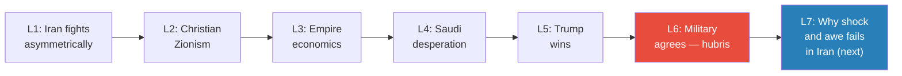
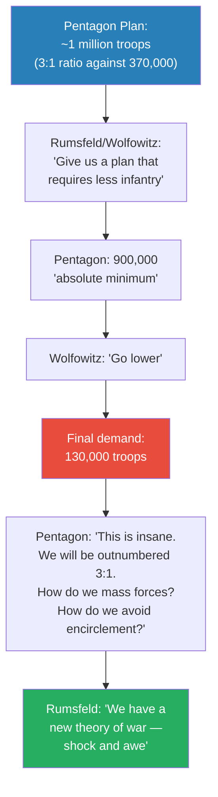
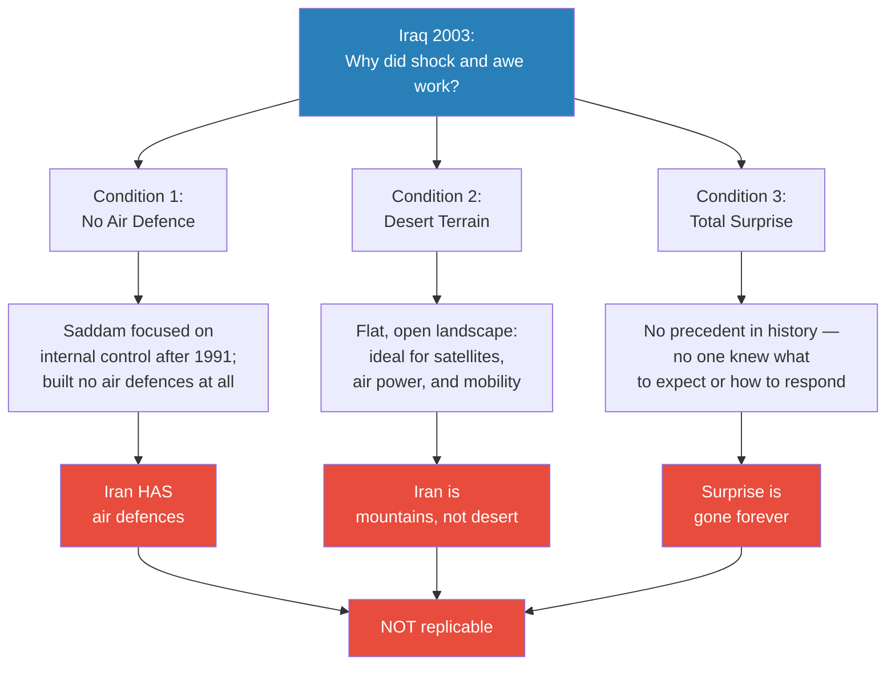
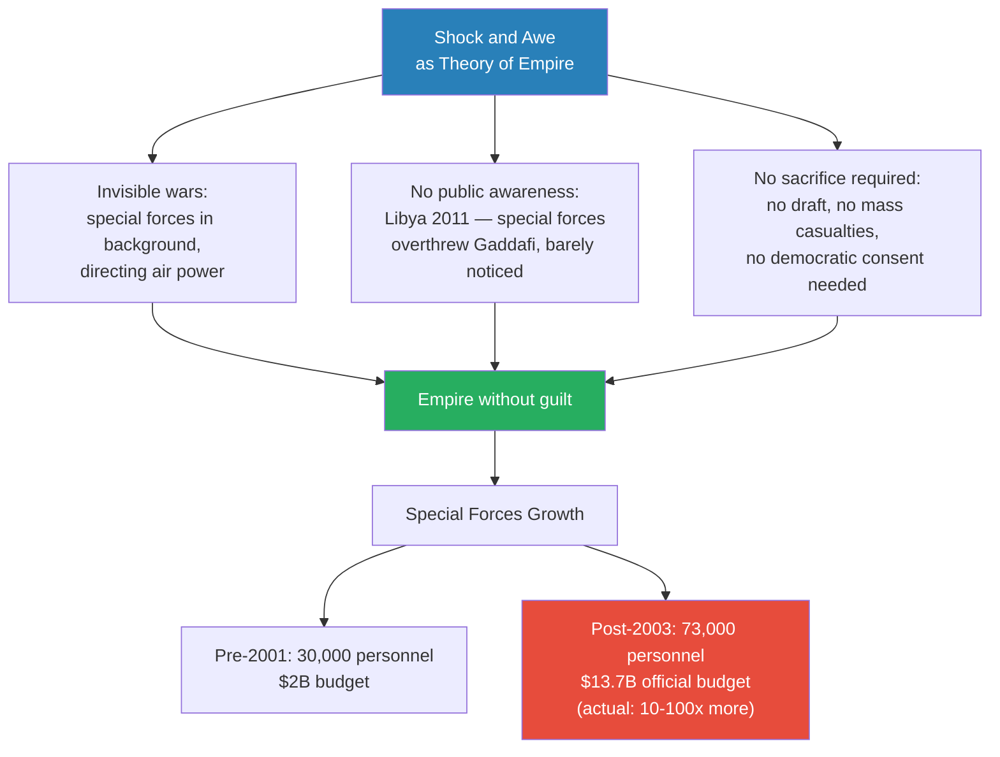
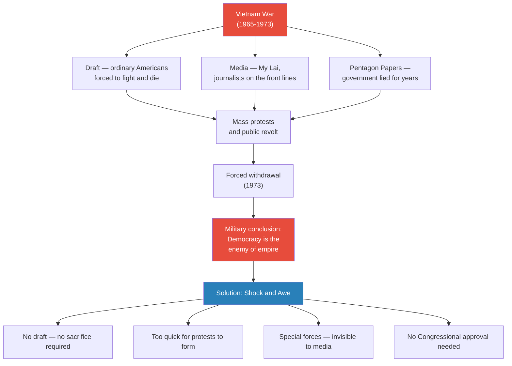
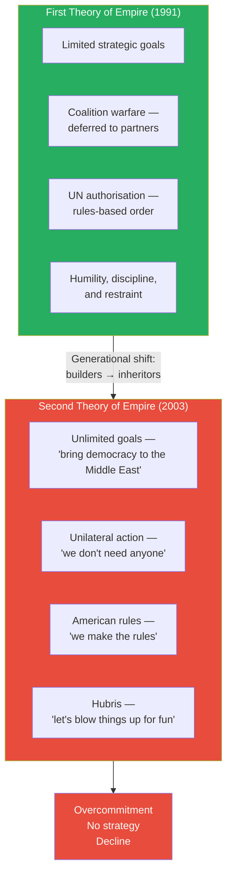
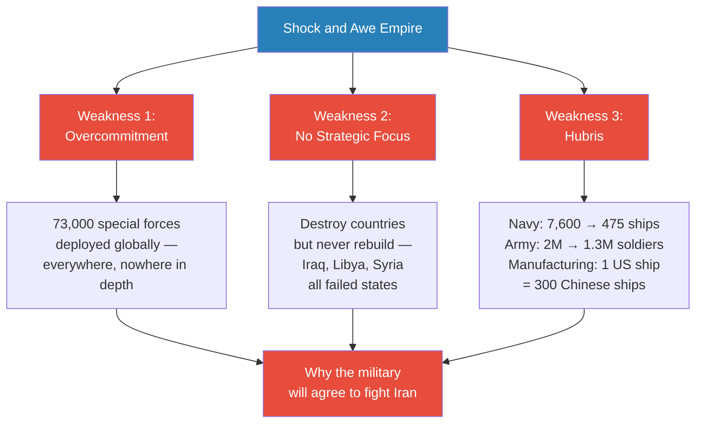

# America's Imperial Hubris

> The previous five lectures established that war with Iran is coming — Christian Zionism, empire economics, and Saudi desperation have converged, and Trump will be president when they do. This lecture answers the next question: will the US military actually agree to fight? Prof. Jiang argues yes, and traces the reason to 2003. The Iraq War's spectacular three-week victory — 130,000 troops destroying an army of 370,000 with fewer than 200 casualties — gave the military a doctrine called shock and awe, which became something far more dangerous: a theory of empire without democratic accountability. Born from the trauma of Vietnam, shock and awe promised wars that were quick, cheap, and invisible. But the Iraq victory rested on three conditions that cannot be repeated: no enemy air defences, desert terrain, and total surprise. The military mistook a one-off anomaly for a universal revolution in warfare. Now it suffers from overcommitment, lack of strategic focus, and hubris — and will go along with any war the president proposes.

---

## Overview: Key Highlights

- <b style="color: #27ae60">The military will agree to fight Iran</b> — because shock and awe convinced it that it cannot lose
- <b style="color: #2980b9">Shock and awe</b> — the doctrine that air supremacy + technological omniscience + special forces can replace mass-force warfare
- <b style="color: #e74c3c">Iraq 2003 was a one-off anomaly</b> — three unique conditions (no air defence, desert, surprise) made it work; none exist in Iran
- <b style="color: #27ae60">Shock and awe is a theory of empire, not a theory of war</b> — it lets America project power globally without public awareness or democratic consent
- <b style="color: #e74c3c">Vietnam proved democracy and empire are incompatible</b> — the military's response was to design wars that bypass democratic oversight entirely
- <b style="color: #2980b9">Pentagon Papers (1971)</b> — revealed three truths: the government deceived the public, the war was unwinnable, and America stayed only to save face
- <b style="color: #2980b9">Two theories of empire</b> — 1991 model (limited goals, coalition, UN authority) vs. 2003 model (unlimited goals, unilateral, American rules)
- <b style="color: #e74c3c">The billionaire's son problem</b> — the generation that built the empire understood restraint; the generation that inherited it only wants to enjoy it
- <b style="color: #27ae60">Special forces: from supplement to centrepiece</b> — 30,000 before 2001, 73,000 today, with budgets 10-100x the official figure
- <b style="color: #e74c3c">Three fatal weaknesses</b> — overcommitment (everywhere at once), no strategic focus (destroy but never rebuild), hubris (refusing to invest in sustainability)
- <b style="color: #e74c3c">US Navy: 7,600 ships in 1945, 475 today</b> — China builds 300 ships for every one America builds
- <b style="color: #27ae60">The current generation has never seen real war</b> — Iraq 2003 looked like a video game; they do not know what they are walking into

| Concept | One-line summary |
|---------|-----------------|
| **Three principles of conventional warfare** | Mass forces (3:1 advantage), avoid encirclement, protect supply lines — thousands of years of experience |
| **Shock and awe** | Replace mass-force doctrine with air supremacy, technological omniscience, and special forces |
| **Technological omniscience** | Satellites and electronic eavesdropping give the US military total information dominance — "the power of God" |
| **Thunder runs** | Armoured vehicles circling Baghdad unchallenged — pure intimidation and the clearest symbol of American hubris |
| **Three unrepeatable conditions** | No air defence (Saddam's miscalculation), desert terrain (ideal for air power), and total surprise — none exist in Iran |
| **De-Ba'athification** | Firing everyone who worked for the old Iraqi government and disbanding the military — destroyed all capacity for governance |
| **Pentagon Papers** | Classified 1971 history proving the government lied, the war was unwinnable, and America stayed only to save face |
| **Empire-democracy incompatibility** | The military's post-Vietnam conclusion: democratic accountability makes empire impossible — shock and awe was the solution |
| **Two theories of empire** | 1991: limited goals, coalition, UN authority, restraint; 2003: unlimited goals, unilateral, American rules, hubris |
| **The billionaire father analogy** | Empire-builders understood restraint; empire-inheritors fire the advisors, hire friends, and make reckless bets |
| **Black ops budget** | Special forces operate outside military oversight; actual budget estimated at 10-100x the official $13.7 billion |
| **Manufacturing gap** | For every ship America builds, China builds 300 — America cannot sustain a prolonged major war |

---

# The Lecture

## Will the Pentagon Agree to Fight? [0:00–1:15]

*Prof. Jiang opens by connecting this lecture to the previous five. The question of whether Trump will push for war with Iran has been answered. The new question is whether the US military establishment — the Pentagon — will go along.*

> [!tip] Core Insight
> The Pentagon will agree to fight because shock and awe convinced the entire institution it cannot lose. The reason traces to 2003 — and to understand 2003, you have to start with what happened in the Pentagon war rooms before the first shot was fired.

*This lecture is the sixth step in a cumulative argument. The war is coming — this step explains why the institution that must fight it will not resist.*

> [!note]- Expand: Full Lecture Detail
> - Prof. Jiang opens by reminding the class that last week's lecture established that Trump will become president and that there is a strong likelihood the US will go to war with Iran
> - The question for today: will the US military agree to fight?
> - Ultimately it is the Pentagon — the generals — that must implement the war
> - If there is enough military opposition, it is very hard for any president to push a war through
> - Prof. Jiang states his argument directly: <b style="color: #27ae60">the military will go along, and the reason is what happened in 2003</b>
> - To understand 2003, he wants to go back to the last time America fought a major war: the 2003 invasion of Iraq, called Operation Iraqi Freedom

---

## The Pentagon vs. Rumsfeld: A Fight Over Numbers [1:15–9:17]

*Prof. Jiang walks through the lead-up to the 2003 Iraq invasion — specifically the internal fight between Pentagon generals applying thousands of years of military doctrine and civilian officials with an untested theory. The civilians won, and the anomalous outcome of that victory captured the entire institution.*

*Rumsfeld and Wolfowitz — neither of whom had ever fought a war — overruled an institution with centuries of accumulated experience. That the theory worked created a psychological wound in the institution that has not healed.*

> [!note]- Expand: Full Lecture Detail
> - Prof. Jiang introduces the three principles that have governed conventional warfare for thousands of years:
>   - **Mass forces:** When you invade, you want to overwhelm your enemy — the Iraqi army had 370,000 soldiers, so the 3:1 rule required roughly 1 million US troops; you need to simultaneously advance, hold territory, resupply, and maintain reserves
>   - **Avoid encirclement:** The worst thing that can happen to soldiers is being surrounded — it becomes impossible to defend
>   - **Protect supply lines:** Most of war is logistics — getting fuel, weapons, and food from point A to point B
> - The Pentagon presented its plan: to invade Iraq properly, approximately 1 million soldiers are needed
> - Secretary of Defence Donald Rumsfeld and his deputy Paul Wolfowitz rejected the number outright — neither had ever fought a war
> - The negotiation that followed:
>   - Pentagon tries to compromise: "The absolute minimum is 900,000"
>   - Wolfowitz: "Lower"
>   - Eventually Rumsfeld and Wolfowitz land on their final demand: fight this war with 130,000 troops
> - <b style="color: #e74c3c">Pentagon's reaction: "This is insane. We will be outnumbered three to one. How do we mass forces? How do we avoid encirclement? How do we protect supply lines?"</b>
> - Rumsfeld and Wolfowitz's response: we have a new theory called shock and awe
>   - All militaries are hierarchies — head, body, arms and legs
>   - If you cut off the head, the entire army falls apart
>   - Three capabilities give the US the advantage to do this:
>     - **Air supremacy:** America controls the skies; a single cluster bomb with ~40 GPS-guided submunitions can wipe out an entire tank division independently
>     - **Technological omniscience:** Satellites that see everything; technology to eavesdrop on all electronic communications — "we have the power of God"
>     - **Special forces:** Elite soldiers who can operate deep in enemy territory, locate targets, and call in precision airstrikes
>   - The promise: quick, cheap, and decisive — war over before anyone can object
> - Pentagon called it "a theory" against "1,000 years of experience" and "just a fantasy"
> - Rumsfeld and Wolfowitz insisted — the generals were overruled

---

## The Three-Week War — The Theory That Worked [9:17–14:00]

*The plan the Pentagon called insane worked 100% as intended. Prof. Jiang delivers the results of the 2003 invasion and then performs the analytical move that matters: asking what made it work — and whether any of those conditions are replicable.*

> [!tip] Core Insight
> The 2003 Iraq War lasted three weeks. 130,000 US troops destroyed an army of 370,000 with fewer than 200 American deaths. The vindication was total — and that total vindication is exactly the problem.

*Three conditions made Iraq uniquely vulnerable to shock and awe. None exist in Iran. But the American military — intoxicated by the most lopsided victory in modern history — does not see this.*

> [!note]- Expand: Full Lecture Detail
> - The results of the 2003 Iraq War:
>   - The entire war lasted **exactly three weeks** — from invasion to fall of Baghdad
>   - America lost approximately **200 soldiers**, most from friendly fire
>   - Tens of thousands of Iraqi soldiers died — a ratio that had no precedent in modern warfare
>   - **Thunder runs:** American soldiers in armoured vehicles drove into Baghdad and simply circled the city unchallenged — three times — as acts of pure intimidation
>
> > [!example] Thunder Runs Through Baghdad (2003)
> > - American armoured vehicles drove into Baghdad — the capital of a country at war with them
> > - They circled the city unchallenged — no one could stop them
> > - They conducted three such drives, purely as intimidation
> > - Prof. Jiang's analogy: "You're in a fight, and you decide — you know what, I'm so much stronger than this guy, I'm gonna do a backflip. I'm so bored."
> > **The lesson:** Thunder runs were not military operations. They were demonstrations that American dominance was so total, the enemy's capital was a playground.
>
> - Special forces operated in western Iraq destroying missile bases, preventing Scud launches against Israel
> - So much destruction in the west that Saddam believed the main US force was there — he redeployed his army west, leaving Baghdad completely open from the east
>
> > [!example] Saddam's Western Iraq Misdirection (2003)
> > - US special forces were demolishing missile bases in western Iraq
> > - Saddam became convinced the main American attack was coming from the west
> > - He redeployed his forces to meet the perceived threat
> > - The main US force attacked from the east — into an undefended capital
> > **The lesson:** You can only do this once. Every opponent from now on knows exactly how shock and awe works.
>
> - Prof. Jiang then asks the question nobody asked at the time: **what did Saddam Hussein do wrong?**
>   - Why was shock and awe so effective specifically against him?
> - <b style="color: #27ae60">Three conditions made Iraq a one-off — not a revolution in warfare</b>
>   - **No air defence:** In the 1991 Gulf War, Saddam's army was destroyed by US air power. America could have invaded but didn't. Saddam drew two conclusions: "I can never beat America militarily" and "America will never overthrow me — it would destabilise everything." He redirected all resources toward suppressing internal dissent. He built no air defences. Even as the 2003 invasion was clearly imminent, he had nothing to counter US air supremacy
>   - **Desert terrain:** Iraq is a desert — ideal for air power (total visibility), satellites (flat landscape), and special forces mobility (no obstacles). All of America's Middle East wars have been in deserts — Iraq, Libya, Syria — and shock and awe has had "tremendous success" in every one
>   - **Surprise:** No one in human history had ever fought a war like this. No commander knew what to expect — Saddam's fatal misdirection was proof of that disorientation
> - A student (Jack) raised an important objection: "Most people say America lost the Iraq War because of the insurgency — doesn't that prove shock and awe failed?"
> - <b style="color: #27ae60">Prof. Jiang's reframing:</b> shock and awe was never designed to stabilise countries — it was designed to topple and destroy them
>   - Is Iraq a functional state? No. Is Libya a functional state? No. Is Syria? No
>   - If the goal was to ensure no Middle Eastern power could challenge American supremacy, shock and awe succeeded perfectly
>   - The evidence: after the invasion, America destroyed all infrastructure (water, electricity), fired all government workers (<b style="color: #2980b9">de-Ba'athification</b>), and disbanded the entire Iraqi military
>   - Prof. Jiang asks: "If your goal was to bring democracy, why would you destroy every institution needed for governance?"
>   - The real intention was not to replace regimes — it was to destroy countries

---

## From Doctrine to Theory of Empire [19:19–24:17]

*Prof. Jiang redefines what shock and awe actually is. It is not primarily a theory of war — it is a theory of empire management. The growth of special forces is the institutional expression of that shift.*

> [!tip] Core Insight
> Shock and awe is a theory of empire, not a theory of war. America can remain a global empire without the guilt — because special forces do the necessary things invisibly, and the public never knows.

*Special forces are the operating infrastructure of empire-without-guilt. Their real budget is classified precisely because democratic accountability would be politically unsustainable.*

> [!note]- Expand: Full Lecture Detail
> - Prof. Jiang pivots: what shock and awe really is, at its deepest level, is not a theory of war — it is a theory of empire
> - America is an empire, but most Americans refuse to admit it: "Being an empire means doing bad things to innocent people"
> - What shock and awe provides is the ability to maintain the empire without the guilt of maintaining it
>   - Special forces go and do what is necessary to sustain global dominance
>   - The public never knows — they are operating in the background
>   - The 2011 overthrow of Gaddafi in Libya was a special forces operation — they directed air power from the shadows while barely registering in public consciousness
> - The institutional data confirms the shift since 2003:
>   - Special forces before 2001: approximately 30,000 personnel
>   - Special forces today: 73,000 — out of a total army of 1.3 million
>   - Official budget: approximately $2 billion in 2001, rising to $13.7 billion today — a sevenfold increase
>   - <b style="color: #2980b9">Black ops status</b>: special forces operate outside normal military supervision; their actual budget is estimated at 10 to 100 times the official figure
> - A student (Celine) asks: is there more special forces because more people want to join, or because America needs more?
>   - Prof. Jiang: both — after the Soviet Union fell, America shifted to fighting rogue regimes (Iraq, Iran, North Korea) that needed to be toppled quickly, so resources shifted to shadow wars
> - Prof. Jiang then describes the psychology of special forces recruits — they are not like ordinary people
>
> > [!example] SAS Selection — What It Takes (British Special Air Service)
> > - First test: run six marathons in five days, carrying a backpack of bricks, on a mountain
> > - Some candidates go insane during this first test and must be hospitalised
> > - Final test: endure torture — resist interrogation under genuine physical duress
> > - French special services: one test requires wearing a bulletproof vest while a comrade shoots at you
> > - A reporter asked a special forces soldier why he chose this career
> > - His answer: "It's either special forces or I rob banks — one of the two"
> > **The lesson:** Special forces personnel are addicted to risk and violence. America has 73,000 of them running around the world with minimal oversight.
>
> - Traditional militaries are strict hierarchies — for discipline, and to prevent military coups — but strict hierarchies are too slow for hostage crises and terrorist attacks
> - Special forces solve that gap: soldiers outside immediate control who can respond instantly
> - <b style="color: #e74c3c">The problem: 73,000 psychologically atypical individuals operating globally with minimal democratic oversight</b> — this is no longer a supplement; it is the engine of the empire

---

## Vietnam: The Trauma That Built Shock and Awe [27:40–37:50]

*To understand why the American military is structurally broken, Prof. Jiang goes back to the source. Vietnam was not just a military defeat — it was proof that democracy and empire are fundamentally incompatible. Shock and awe was the solution to that problem.*

*Vietnam was the trauma. Shock and awe was the institutional response. The military designed a way to fight wars that democracy cannot stop.*

> [!note]- Expand: Full Lecture Detail
> - Prof. Jiang explains why shock and awe came from Vietnam — the greatest disaster in American military history
>
> > [!example] The Vietnam War — Empire's Worst Nightmare (1965-1973)
> > - From 1965 to 1973: America fought a civil war in Vietnam — North Vietnam (communist) versus South Vietnam (US-controlled puppet state)
> > - At the height of the war, 3 million US soldiers had been deployed; 500,000 were in-country simultaneously in 1969
> > - 58,000 Americans died; over 300,000 were wounded — many came home without limbs
> > - At least 3 million Vietnamese died; 2 million were civilians
> > - America dropped more bombs on Vietnam than in all of World War II combined
> > - About 20% of those bombs did not explode — the Vietnamese converted them into landmines that killed more Americans than any other weapon
> > - The Vietnamese dug tunnel networks — they could appear, attack, and vanish underground
> > - Corrupt South Vietnamese officers sold American weapons directly to the rebels
> > - The My Lai Massacre (300-400 civilians killed in one village by American soldiers) was "happening actually quite a lot"
> > **The lesson:** Vietnam proved that a technologically inferior enemy using asymmetric tactics can defeat the world's greatest military — the same pattern Prof. Jiang predicts for Iran.
>
> - The war was unwinnable, and American leaders knew it. The proof came in 1971.
>
> > [!example] The Pentagon Papers — America's Secret History of Failure (1971)
> > - Military analysts secretly compiled a classified history of the Vietnam War
> > - Daniel Ellsberg leaked it to the Washington Post and New York Times
> > - Three devastating revelations:
> >   - Presidents Eisenhower, Kennedy, and Johnson secretly expanded the war without public or Congressional approval — massive deception spanning multiple administrations
> >   - American leaders knew the war was unwinnable — the Vietnamese could not be defeated
> >   - The only reason America kept fighting was credibility: "We don't want the Soviet Union and China to laugh at us"
> > - No strategic purpose. No strategic objectives. Just saving face.
> > **The lesson:** The empire had been lying to democracy — and when democracy found out, it ended the war by force of public opinion.
>
> - The military's conclusions after Vietnam shaped everything that followed:
>   - Politicians cared more about winning elections than winning wars
>   - The public could protest and defy the military
>   - The media could insult and undermine — journalists on the front made the war politically unsustainable
>   - The draft forced ordinary Americans into a war they did not understand, and they revolted
>   - <b style="color: #e74c3c">The military felt betrayed by democracy itself</b>
> - The conclusion: if we are to maintain the empire, we must divorce the empire from democracy
> - <b style="color: #27ae60">Shock and awe was designed specifically to solve the democracy problem</b>:
>   - No draft needed — no sacrifice required from the public
>   - Quick — over before protests can organise
>   - Special forces — invisible, so the media cannot report on what is happening
>   - No Congressional approval required — the executive can act unilaterally
>
> > [!quote] Prof. Jiang
> > "The entire point of shock and awe is that America no longer has to make any sacrifices."

---

## Two Theories of Empire: Why America Abandoned Restraint [39:05–50:59]

*Prof. Jiang presents the two competing theories of how America managed its empire — the responsible 1991 model and the reckless 2003 model — and asks why the greatest power in the world abandoned what was working. The answer is psychological, not strategic.*

*Two theories, separated by one generation. The builders understood restraint. The inheritors wanted to have fun.*

> [!note]- Expand: Full Lecture Detail
> - Prof. Jiang takes the class back to 1991. The Soviet Union had just collapsed. America was the sole superpower — militarily unchallengeable. Saddam Hussein invaded Kuwait.
> - The **first theory of empire** — how America chose to respond:
>   - **Limited strategic goals:** Remove Saddam from Kuwait only — no invasion of Iraq, no regime change
>   - **Coalition warfare:** Dozens of countries participated; America deferred to partners. Saudi Arabia insisted there would be no regime change, and America accepted
>   - **UN authority:** America made its case to the UN and received authorisation — presenting the action as a UN military operation, not a US one
>   - **Underlying principle:** With great power comes great responsibility — <b style="color: #27ae60">humility, discipline, and restraint</b>. Military force only as a last resort, only with partners, only under international authority
> - Prof. Jiang's assessment: this was a responsible theory that could have sustained American leadership indefinitely
> - The **second theory of empire** — the mirror opposite:
>
>   | Dimension | 1991 Model | 2003 Model |
>   |-----------|-----------|-----------|
>   | **Strategic goals** | Limited — remove from Kuwait | Unlimited — bring democracy to the region |
>   | **Allies** | Coalition; deferred to partners | Unilateral — America acts alone |
>   | **Authority** | UN authorisation | American rules — no UN needed |
>   | **Core principle** | Humility, discipline, restraint | "We make the rules" |
>   | **Generation** | WWII and Cold War veterans | Post-2003 inheritors — war was a video game |
>   | **Outcome** | Sustainable empire | Overextension and decline |
>
> - Prof. Jiang asks: why would the world's greatest power abandon the approach that was working?
> - His answer — the billionaire father analogy:
>
> > [!example] The Billionaire Father's Dying Wish
> > - A billionaire father, 95 years old, has built $10 billion through intelligence, hard work, and political connections
> > - He has 100 experienced advisors who manage the empire and generate 10% returns — $1 billion a year
> > - He invites his son to dinner: "When I die, you inherit everything. My advisors will manage it and give you $100 million a year. Buy a plane, buy an island, party with movie stars. My dying wish: promise me you will listen to my advisors."
> > - The son promises
> > - The father dies
> > - First thing the son does: fires all 100 advisors
> > - Second thing: hires all his friends
> > - Third thing: invests in Bitcoin, AI, Chinese real estate — reckless speculation
> > - He loses everything
> > **The lesson:** Inherited power always destroys discipline. The people who built the empire understood what it cost. The people who inherited it only know what it feels like.
>
> - The analogy maps onto American military leadership:
>   - The **father** = the WWII and Cold War generation — they fought real wars, saw real horror, and concluded military force must be a last resort
>   - The **100 advisors** = the institutions and principles of the 1991 model — limited objectives, coalitions, UN authority
>   - The **son** = the post-2003 generation — they have never experienced real war; Iraq 2003 looked like a video game
>   - <b style="color: #e74c3c">"What is the point of having an empire if you cannot blow things up for no reason?"</b> — Prof. Jiang delivers this line as a direct quotation of the second generation's implicit worldview
> - A student (Celine) asks: what is the difference between the people who believed in the first theory and those who believed in the second?
>   - The first generation fought in World War II and the Cold War — they knew war was bloody and terrible, and concluded it must be avoided at almost all costs
>   - The second generation does not know what war is — Iraq 2003 looked like a video game; you did not see soldiers crying or losing limbs
>   - Only about 200 Americans died in 2003; they inherited an empire and want to enjoy it

---

## Three Fatal Weaknesses of the American Military [51:00–54:22]

*Prof. Jiang closes with the three structural problems that have resulted from shock and awe's success. Together they explain why the military that will fight Iran is heading toward disaster — and why it will not realise this until it is too late.*

*Three weaknesses flowing from one source — a doctrine that mistakes capability for wisdom, and momentum for strategy.*

> [!note]- Expand: Full Lecture Detail
> - Prof. Jiang: "There are three fundamental problems with shock and awe"
>
> - **Weakness 1: Overcommitment**
>   - Shock and awe creates the illusion of omnipotence — you believe you can be everywhere at once, fighting all wars simultaneously
>   - 73,000 special forces deployed across the world; the doctrine says you do not need mass forces, just small teams with air support
>   - <b style="color: #e74c3c">The belief that you can be everywhere at once means you are nowhere in depth</b>
>   - "You believe shock and awe allows you to be God"
>
> - **Weakness 2: Lack of Strategic Focus**
>   - The second theory of empire has no plan beyond destruction — no answer to "what do we do after the blowing up?"
>   - Iraq is not a functional state. Libya is not a functional state. Syria remains in civil war
>   - <b style="color: #2980b9">Shock and awe is designed to destroy countries, not to replace regimes</b> — and the military has no doctrine for anything else
>   - "You actually don't have a plan. You just want to maintain this empire. You don't have a strategy."
>
> - **Weakness 3: Hubris**
>   - The military does not believe anyone can challenge American supremacy — and is therefore not investing the resources needed to sustain it
>   - **US Navy:** 7,600 ships in 1945, down to 475 today — these 475 ships must patrol every shipping lane on the planet
>   - **US Army:** 2 million soldiers in 1991, down to 1.3 million today
>   - **Manufacturing capacity:** For every one ship America builds, China builds 300 — America no longer has the factory capacity it had in World War II; if a major war breaks out, it cannot produce weapons fast enough to sustain it
>   - The current generation of military leaders has never experienced real war — they inherited an empire and want to enjoy it
>   - <b style="color: #e74c3c">"Unfortunately, America is headed towards disaster, because the people in charge have no experience. They don't know what war is, and they don't know what the horrors of war are. And they've inherited a lot of money, and they want to have fun."</b>
>
> - Prof. Jiang's closing statement: "Why will the military agree to the stupid war in Iran? Because it's overcommitted, it has no strategy, and because it is arrogant."
> - Preview: next class will demonstrate why shock and awe will fail in Iran, which is not a desert but mountains

---

## Connections

**Builds on:**
- [[01 - Iran's Strategy Matrix]] — Iran fights asymmetrically; conventional military superiority does not guarantee victory
- [[02 - Christian Zionism and the Middle East Conflict]] — Force 1 driving toward war with Iran
- [[03 - How Empire is Destroying America]] — Empire economics: financialisation and the petrodollar trap
- [[04 - Saudi Arabia's Trump Card Against Iran]] — Saudi desperation as Force 3
- [[05 - Why Trump Will Win]] — confirms Trump is president when the three forces converge

**Sets up:**
- [[07 - Why Shock and Awe Fails in Iran]] — the next lecture will show, terrain by terrain, why the doctrine collapses in mountains

**Related books in vault:**
- [[The Art of War - Sun Tzu]] — the principle of knowing your enemy; the military that fought Iraq did not know Iran
- [[Empire - Niall Ferguson]] — the long history of empires mistaking military supremacy for strategic wisdom
- [[Thinking Fast and Slow - Daniel Kahneman]] — availability bias: the military's assessment of Iran is distorted by the single vivid data point of Iraq 2003

---

## The Takeaway

This lecture is an autopsy of institutional hubris — conducted before the patient has died. Prof. Jiang is not asking whether America will go to war with Iran; he has already established that it will. He is asking something more disturbing: why will the military go along, when every serious analyst can see the conditions for failure? The answer is that the institution is not being run by serious analysts. It is being run by inheritors — people who watched a spectacular victory on a screen twenty years ago and concluded that the empire is invincible. The 2003 Iraq War was not a revolution in warfare. It was a unique confluence of a defenceless enemy, ideal terrain, and total surprise. The military drew exactly the wrong lesson, restructured itself around the anomaly, and created a doctrine so seductive — quick, invisible, cheap, unaccountable — that it became impossible to question.

The most striking argument in the lecture is the democracy-empire incompatibility thesis. Vietnam did not teach the military that empire was wrong. It taught the military that democracy was the enemy. The response was not to reconsider imperial overreach — it was to engineer wars that democracy cannot see or stop. Shock and awe is not primarily a military doctrine. It is a political doctrine: a way to conduct empire without the public knowing, without the public sacrificing, and without the public having any say. That is not a solution to Vietnam's lessons. It is the institutionalisation of everything Vietnam warned against.

Three questions remain open as this lecture ends. First: will Iran's air defences, mountain terrain, and asymmetric strategy actually defeat shock and awe — or will the American military find some adaptation that the professor has not accounted for? Second: is the "destroy countries, not replace regimes" thesis accurate — or is it attributing strategic intent to what was really incompetence? Third, and most unsettling: if the 475-ship navy and 1.3 million-soldier army are genuinely insufficient for a major war, and if manufacturing capacity cannot sustain prolonged conflict, then America is not just overconfident about Iran. It may be structurally unable to win any major war — against anyone. Lecture 7 will answer the first question. The other two Prof. Jiang leaves suspended.
