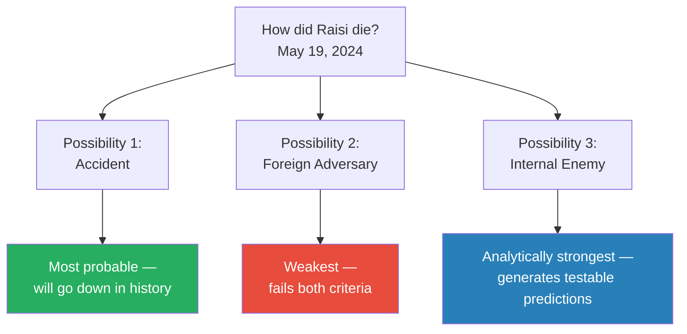
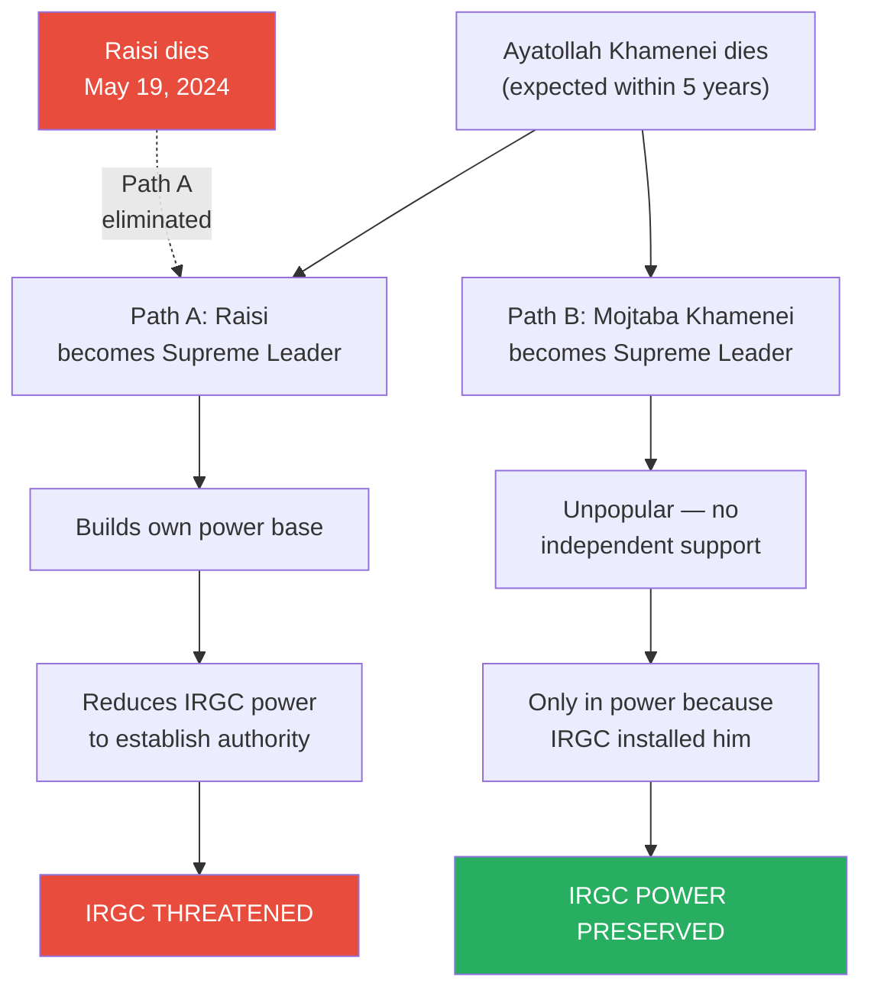
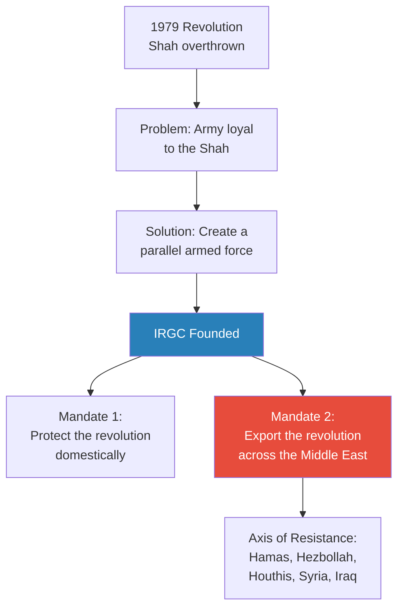
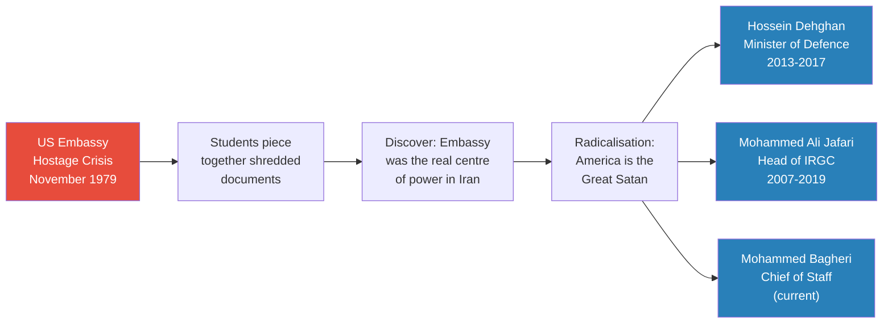
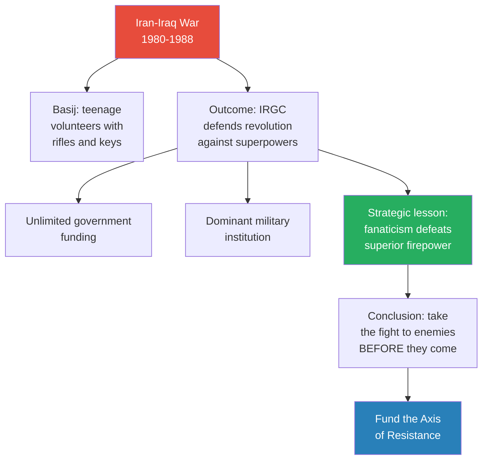
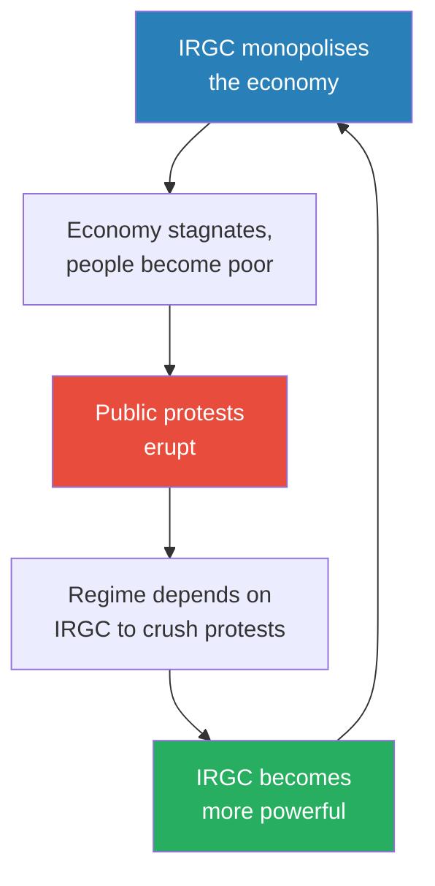
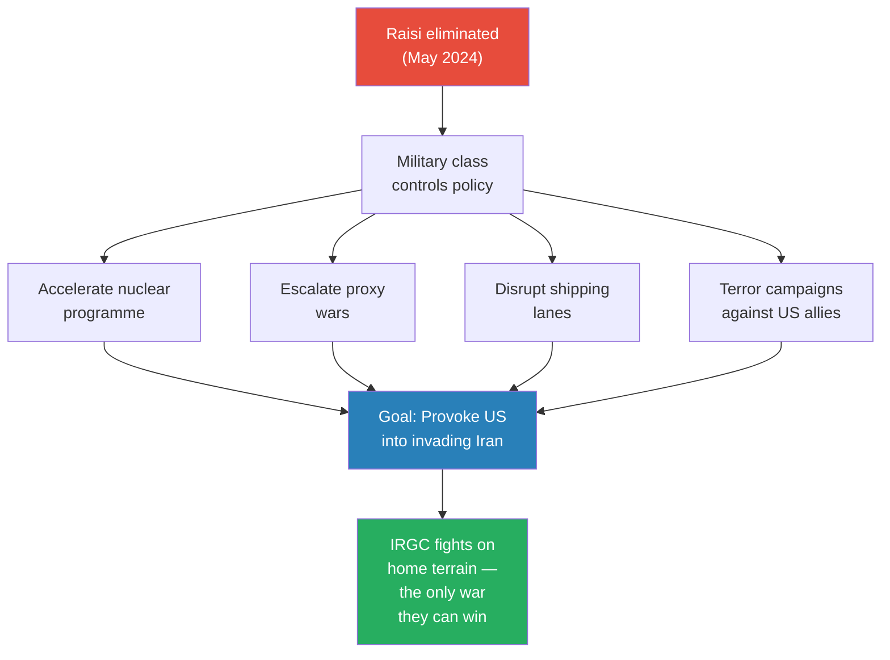
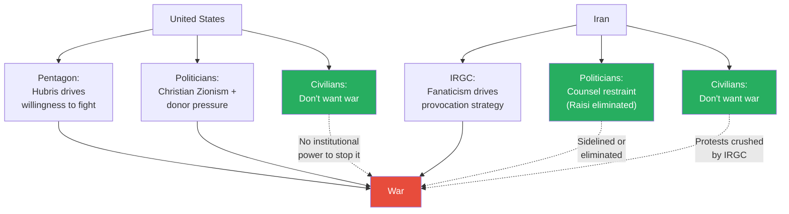

# Who Killed Iranian President Ebrahim Raisi

> Lectures 1–6 answered whether America will go to war with Iran — and whether the US military will agree to fight. The Iranian side was missing. On May 19, 2024, President Ebrahim Raisi died in a helicopter crash along with eight others. The official story is bad weather and an ageing helicopter. Prof. Jiang accepts this as the most probable explanation — but then applies game theory to ask: who benefits? The answer leads deep into Iranian internal politics, where the Islamic Revolutionary Guard Corps (IRGC) — a parallel military founded in 1979 as the Ayatollah's private army — has accumulated control over the navy, the missile programme, foreign policy, and up to half the national economy. Raisi was the expected next Supreme Leader; any strong successor would reduce IRGC power. With Raisi gone, the path clears for Mojtaba Khamenei — the current leader's unpopular son, who could never hold power without IRGC backing. If the IRGC engineered this, the political class is finished and the military class takes over — pushing Iran toward the confrontation with America the series has been building toward since Lecture 1.

---

## Overview: Key Highlights

- <b style="color: #2980b9">Game theory under information constraints</b> — when direct evidence is unavailable, evaluate opportunity and motive for each actor to reason through structural possibilities
- <b style="color: #e74c3c">Three problems of analysis</b> — limited information, misinformation, and official narratives block access to what actually happened
- <b style="color: #27ae60">The accident remains most probable</b> — fog, mountains, and a 1970s American helicopter without maintenance for 45 years is a sufficient explanation
- <b style="color: #e74c3c">Foreign adversary theory fails both criteria</b> — killing the president has no clear strategic benefit for the US or Israel, and operational opportunity inside Iran is extremely difficult
- <b style="color: #2980b9">Islamic Revolutionary Guard Corps (IRGC)</b> — parallel military founded 1979 as Khomeini's private army, now controlling the navy, missile programme, foreign policy, and 10–50% of the economy
- <b style="color: #27ae60">The succession dilemma is the IRGC's motive</b> — any new Supreme Leader must reduce IRGC power to build his own base; Mojtaba Khamenei is unpopular and can only hold power with IRGC backing
- <b style="color: #2980b9">The Basij</b> — volunteer militia of poor, religious young men who ran across minefields with rifles and keys to heaven in the Iran-Iraq War, forming the backbone of IRGC power
- <b style="color: #e74c3c">The IRGC paradox</b> — protests caused by IRGC economic monopoly force the regime to rely more on the IRGC to crush them; each protest cycle makes them stronger
- <b style="color: #2980b9">Political class vs. military class</b> — Iran's internal divide: pragmatists counsel restraint; the IRGC demands confrontation and revolution export
- <b style="color: #27ae60">The provocation strategy</b> — four escalation paths to lure America into invading Iran: nuclear acceleration, proxy escalation, shipping disruption, terror campaigns
- <b style="color: #e74c3c">The IRGC wants to be invaded</b> — on Iranian mountain terrain, with the Basij, they believe they can exhaust America through attrition the way they exhausted Saddam Hussein
- <b style="color: #27ae60">America will lose — Iran will not win</b> — Prof. Jiang's careful distinction: the war will be catastrophic for both sides, with tens of millions of Iranian dead

| Concept | One-line summary |
|---------|-----------------|
| **Game theory analysis** | Evaluate all possibilities by examining opportunity and motive when direct evidence is unavailable |
| **Three problems of analysis** | Limited information, misinformation, and official narratives — the three obstacles to understanding current events |
| **IRGC** | Parallel military founded 1979 as the Ayatollah's private army — controls navy, missiles, foreign policy, and 10–50% of the economy |
| **The Basij** | Volunteer militia of poor, religious Iranians who ran across minefields with keys to heaven in the Iran-Iraq War |
| **The succession dilemma** | Any new Supreme Leader must reduce IRGC power to build his own base — creating inherent conflict between the IRGC and any strong successor |
| **Mojtaba Khamenei** | Current leader's son; deeply unpopular; can only hold power with IRGC backing — making him the ideal compliant successor |
| **Political class vs. military class** | Iran's internal divide: pragmatists (Raisi, judiciary) counsel restraint; IRGC demands confrontation |
| **The IRGC paradox** | More protests → more dependence on IRGC to crack down → IRGC more powerful; instability is job security |
| **Four escalation paths** | Nuclear acceleration, proxy escalation, shipping disruption, terror campaigns — all designed to provoke US invasion |
| **US Embassy hostage crisis** | 1979: students pieced together shredded CIA documents and discovered America ran Iran — the IRGC leadership were those students |
| **Analytical model-building** | Hypothesis → predictions → test against reality — same method from Lecture 5, applied here to the IRGC theory |

---

# The Lecture

## Setting Up the Analysis: Three Problems, One Method [0:00–2:30]

*Prof. Jiang opens with a confession that applies to all analysis of current events: we are working with almost nothing. He names three obstacles, then introduces game theory as the only tool that can operate under these constraints.*

> [!tip] Core Insight
> The challenge is not to find the truth — that may be impossible. The challenge is to use game theory to reason about structural possibilities even when direct evidence is unavailable. This is not conspiracy theory. It is structured speculation that reveals real power dynamics regardless of the answer.

> [!note]- Expand: Full Lecture Detail
> Prof. Jiang opens by telling the class they are going to analyse how and why the Iranian President Ebrahim Raisi died. He immediately identifies three major epistemological obstacles:
>
> - <b style="color: #e74c3c">Very limited information</b> — the Iranian government controls what the public knows; truth is scarce
> - <b style="color: #e74c3c">Misinformation</b> — information that does exist may not be true
> - <b style="color: #e74c3c">Official narratives</b> — widely accepted stories may have no relationship to reality
>
> The challenge is to use <b style="color: #2980b9">game theory analysis</b> — evaluating opportunity and motive for each possible actor — to reason through possibilities when direct evidence is unavailable. This is not a factual investigation. It is an exercise in structured speculation: asking not "what happened?" (which we may never know) but "who benefits?" (which reveals structural forces shaping Iran's future regardless of the answer).
>
> The lecture fits into the series arc as the missing Iranian piece:
>
> - [[01 - Iran's Strategy Matrix|Lecture 1]] — Iran fights asymmetrically and controls the terms of engagement
> - [[02 - Christian Zionism and the Middle East Conflict|Lecture 2]] — Christian Zionism as Force 1 pushing the US toward war
> - [[03 - How Empire is Destroying America|Lecture 3]] — empire economics as Force 2
> - [[04 - Saudi Arabia's Trump Card Against Iran|Lecture 4]] — Saudi desperation as Force 3
> - [[05 - Why Trump Will Win|Lecture 5]] — Trump confirmed as president when these forces converge
> - [[06 - America's Imperial Hubris|Lecture 6]] — the US military will agree to fight due to institutional hubris
>
> Lectures 1–6 built the American case for war. Lecture 7 turns the lens around: is the Iranian military pushing just as hard toward the same war — and did they just eliminate the one man who stood in their way?

---

## The Facts and Three Possibilities [2:30–9:00]

*Prof. Jiang presents the established facts of the crash, then frames the investigation around game theory's twin criteria: opportunity and motive.*

*Three possibilities, evaluated by opportunity and motive. The accident is most probable. The internal enemy theory is most analytically revealing.*

> [!note]- Expand: Full Lecture Detail
> On May 19, 2024, Iranian President Ebrahim Raisi was in Azerbaijan for a dam opening ceremony. He boarded his helicopter to fly back to Iran. During the flight, the helicopter crashed in mountainous terrain near the Azerbaijan border, killing all nine people on board: the President, the Foreign Minister, three crew members, the governor of a province, a local religious leader, the President's bodyguard, and the head of the President's security detail.
>
> One detail stands out: <b style="color: #e74c3c">three helicopters were flying together — only Raisi's crashed</b>. The other two, likely military escorts, landed safely. The official explanation: bad weather. Fog rolled in, the pilot lost visibility, the helicopter struck a mountainside.
>
> Prof. Jiang frames the investigation around two questions for each of the three possibilities: Did they have the **opportunity**? Did they have a **motive**?
>
> **Possibility 1 — Accident:**
> Two pieces of evidence make it compelling. First, helicopter crashes under fog happen more often than people think — he cites Kobe Bryant's January 2020 crash as a famous parallel. Second, Iran was flying a helicopter that dated to the 1970s Shah era, American-made, with no maintenance support, spare parts, or software updates since 1979.
>
> > [!example] The Kobe Bryant Parallel (January 2020)
> > - In January 2020, basketball legend Kobe Bryant boarded a helicopter with his daughter and several others in southern California
> > - Fog and low clouds reduced visibility to near zero
> > - The pilot became disoriented and crashed into a hillside, killing all nine people on board
> > - Bryant was one of the most famous athletes in the world — and he died in exactly the same way Raisi did: fog, mountains, a pilot who could not see
> > **The lesson:** Helicopter crashes under poor visibility are not rare, exotic events. They happen to civilians and heads of state alike.
>
> <b style="color: #e74c3c">Iran was flying the president in a machine unsupported for over four decades</b>. Prof. Jiang accepts this as probably the cause — but game theory requires examining the alternatives.
>
> **Possibility 2 — Foreign Adversary (US, Israel, possibly Azerbaijan):**
> The theory fails on both criteria. Opportunity is extremely difficult — planning an assassination of an Iranian leader inside Iranian territory requires extraordinary intelligence access, a method that looks like an accident, and operatives capable of vanishing without trace. Motive is even weaker. Every past foreign assassination of an Iranian — Soleimani (January 2020, motive: he ran all Iran Middle East operations), nuclear scientists (motive: stop the bomb), the Damascus embassy strike (April 1, 2024, motive: generals coordinating with Hamas) — had a specific, targeted strategic objective. The president is not the person running the missile programme, the proxies, or the nuclear programme. <b style="color: #e74c3c">Killing the president carries all the risk of an act of war with none of the strategic benefit</b>.
>
> **Possibility 3 — Internal Enemy:**
> Opportunity: no problem. Internal enemies have the resources and proximity to kill the president. The detail of three helicopters flying through identical conditions, with only one crashing, does not prove anything — different pilots make different decisions in fog — but it is consistent with an internal operation. The military escorts present to protect the president were also in the best physical position to cause an accident.
>
> Motive: this is where it gets interesting — and this question drives the entire remainder of the lecture.

---

## The Succession Dilemma — Why the IRGC Had Motive [9:00–20:00]

*To understand who would benefit from Raisi's death, Prof. Jiang takes the class into Iranian succession politics — where the stakes are the direction of the entire country for a generation.*

*The succession dilemma is the core of the IRGC's motive. With Raisi alive, the next Supreme Leader would threaten their power. With Raisi dead, the next Supreme Leader would depend on them entirely.*

> [!tip] Core Insight
> The IRGC does not need a loyal successor. They need a weak one. Mojtaba Khamenei's greatest qualification for the supreme leadership, from the IRGC's perspective, is that he cannot hold it without them.

> [!note]- Expand: Full Lecture Detail
> Prof. Jiang explains that <b style="color: #2980b9">Ebrahim Raisi</b>, age 63, was widely regarded as the most likely next Supreme Leader of Iran. The current Ayatollah, <b style="color: #2980b9">Ali Khamenei</b>, is 85 — within five years, Khamenei will likely die and Raisi, seen as his protege, would succeed him.
>
> The Iranian political system is unusual: it is an <b style="color: #2980b9">Islamic Republic</b>, meaning ultimate authority belongs to God and the Quran — represented by the Ayatollah. The Ayatollah holds supreme power with ultimate veto authority. The President is more like a CEO — managing day-to-day operations without final authority on anything the Ayatollah cares about. Moving from president to Supreme Leader is not a promotion but a transformation into the most powerful person in the country.
>
> Raisi came from the judiciary — a separate power base from the military establishment. If he became the next Ayatollah, he would bring his own people, his own priorities, his own power base. Any new Ayatollah would reduce IRGC power to establish his own authority. The IRGC is most loyal to Khamenei personally — that loyalty does not automatically transfer to an outsider.
>
> The second contender for the position is <b style="color: #2980b9">Mojtaba Khamenei</b> — the current Supreme Leader's own son. This creates a political legitimacy problem: Iran's 1979 revolution overthrew a hereditary monarchy. If Mojtaba becomes Ayatollah, it would recreate exactly the hereditary succession the revolution was meant to destroy — generating a <b style="color: #e74c3c">political legitimacy crisis</b> for the entire Islamic Republic.
>
> But that crisis works in the IRGC's favour. An unpopular, dependent leader requires enforcers. When Ayatollah Khamenei succeeded Khomeini in 1989, he cultivated personal relationships with the IRGC — reportedly memorising the names of 20,000–50,000 IRGC members and even their children's names. These bonds transfer naturally to his son. And Mojtaba is so unpopular that if he becomes Supreme Leader, it will only be because the IRGC put him there — and he will know it every single day. <b style="color: #27ae60">A leader who owes everything to you can never turn on you.</b>
>
> Even the legitimacy crisis is job security. If Mojtaba's accession sparks public outrage, the regime becomes even more dependent on its most loyal enforcers — the IRGC.

---

## What Is the IRGC? Origins in Revolution and Distrust [20:00–25:00]

*The motive makes sense only if you understand what the IRGC is — where they came from, what forged them, and why a revolutionary militia became the most powerful institution in the country.*

*The IRGC was born from distrust of the existing army and given a dual mandate: protect the revolution at home and spread it abroad. The second mandate is what makes Iran a regional threat.*

> [!note]- Expand: Full Lecture Detail
> In 1979, popular protests forced the Shah into exile. Ayatollah Khomeini was brought back from exile to lead the new Islamic Republic. But Khomeini faced an immediate problem: the existing Iranian military had sworn allegiance to the Shah, was trained by Americans, and equipped with American weapons. <b style="color: #e74c3c">The revolution had no army of its own.</b>
>
> Khomeini's solution was to build one. The <b style="color: #2980b9">Islamic Revolutionary Guard Corps (IRGC)</b> was established as a parallel armed force — completely separate from the regular military, answering only to the Ayatollah. This dual-army structure was a deliberate architectural decision: the regular army defends the nation, but the IRGC defends the revolution.
>
> The IRGC's founding mandate had two dimensions:
>
> - **Domestic:** Protect the Ayatollah and ensure the Islamic Revolution succeeds inside Iran
> - **International:** Export the revolution across the Middle East — bring Islamic governance to Syria, Iraq, and beyond
>
> The second mandate was what alarmed Saudi Arabia, the Gulf states, and the United States. This is why they all encouraged Saddam Hussein to invade Iran in 1980. The Iran-Iraq War was not simply an Iraqi attack — it was a coalition effort by nearly every regional and global power to strangle the revolution before it spread.

---

## The US Embassy Hostage Crisis — Where the Leadership Was Forged [25:00–31:00]

*The current IRGC leadership was not educated at military academies. They were educated inside the US Embassy in Tehran — piecing together shredded documents that revealed exactly how America had controlled their country.*

*The students who stormed the embassy became the generals who run the military. The IRGC's anti-American worldview is not inherited ideology — it was formed by direct, personal discovery of American manipulation.*

> [!note]- Expand: Full Lecture Detail
> In 1979, the deposed Shah fled to the United States. Iranians were outraged for two reasons: they wanted the Shah returned to stand trial for human rights crimes, and they feared he had gone to arrange a repeat of 1953 — when the CIA staged a coup that overthrew Iran's democratically elected government and installed the Shah as a puppet dictator.
>
> In November 1979, between 300 and 500 Iranian college students stormed the US Embassy in Tehran, taking 53 Americans hostage. The Ayatollah Khomeini backed them. This was a clear violation of international law — but the public support was overwhelming.
>
> When the students entered the embassy, the diplomats attempted to destroy classified documents using industrial shredders — cutting tens of thousands of pages into strips.
>
> > [!example] The US Embassy Hostage Crisis (November 1979)
> > - 300–500 Iranian college students stormed the US Embassy in Tehran
> > - They took 53 American diplomats hostage, demanding the Shah be returned for trial
> > - Diplomats destroyed documents using shredders — cutting tens of thousands of pages into strips
> > - Over the following months, students slowly and methodically pieced the strips back together, one by one
> > - What they found: the US Embassy had directed Iranian domestic policy, enabled the Shah's secret police (SAVAK), and orchestrated the 1953 coup that destroyed Iranian democracy
> > - The real centre of power in Iran had not been the Shah's palace — it was the US Embassy
> > **The lesson:** The students who pieced together those documents did not learn about American interference in the abstract. They read the operational details — the names, the orders, the mechanisms of control. That personal, documentary knowledge is what separates IRGC fanaticism from ordinary anti-American sentiment.
>
> Prof. Jiang emphasises the critical detail: those students became the military leadership of Iran.
>
> - **Hossein Dehghan** — Minister of Defence, 2013–2017
> - **Mohammed Ali Jafari** — Head of the IRGC, 2007–2019
> - **Mohammed Bagheri** — Current Chief of Staff of the Iranian Army
>
> <b style="color: #e74c3c">These are not politicians who read about America's role in Iran in textbooks. They are men who personally reconstructed, page by page, the evidence of how the United States controlled their country, staged coups against their democracy, and enabled the brutality of the Shah's police state.</b> Their hatred of America is personal, documentary, and rooted in direct evidence they assembled with their own hands.

---

## The Iran-Iraq War and the Basij — Forged in Blood [31:00–33:00]

*When Saddam Hussein invaded in 1980, Iran had no functioning army. What it had instead was something no Western military planner could have predicted: an unlimited supply of teenagers willing to die.*

*The Iran-Iraq War gave the IRGC three things: dominance, money, and a validated strategic doctrine. Everything that followed — the Axis of Resistance, the proxy wars, the confrontation with America — flows from those eight years.*

> [!note]- Expand: Full Lecture Detail
> When Saddam Hussein invaded Iran in 1980, Iran had no functioning professional army. The IRGC had arrested, exiled, or executed the Shah's officers — considered loyal to the old regime. Iran was invaded by a well-equipped enemy backed by the US, the Soviet Union, and the Arab world, with no professional military leadership.
>
> The IRGC's solution was the <b style="color: #2980b9">Basij</b> — a volunteer militia recruited from the poorest, most religious villages in Iran.
>
> > [!example] The Basij — Keys to Heaven (1980-1988)
> > - Young men aged 16–18 from poor, religious villages volunteered
> > - Each was given two things: a rifle and a key to wear around their neck
> > - The key, they were told, was their entry into heaven — dying in this war guaranteed paradise
> > - Organised into groups of 20–22, they ran ahead of the main force, across Iraqi minefields, into tank fire, under helicopter assault
> > - They had no armour, no air support, no heavy weapons — just rifles and faith
> > - They died in enormous numbers — but the Iraqi army expended so much ammunition and morale killing them that it became exhausted
> > - Eventually the Iraqis withdrew; Iran took the fight into Iraq
> > **The lesson:** Iran's military power does not rest on technology. It rests on an effectively unlimited supply of religiously motivated fighters who genuinely believe death in battle is a promotion. This is why Iran is not afraid of a ground war.
>
> The Iran-Iraq War lasted eight years. For the IRGC, the outcome was transformative:
>
> - They successfully defended the revolution against an invasion backed by both superpowers and the entire Arab world
> - They emerged as the undisputed dominant military force in the country
> - They received <b style="color: #27ae60">unlimited access to government funds</b> — justified as saviours of the revolution
> - Their strategy was validated: fanaticism and willingness to absorb casualties can defeat a conventionally superior enemy
>
> After the war, the IRGC drew a strategic conclusion: <b style="color: #27ae60">if enemies come to attack Iran, Iranians will die — so take the fight to them first.</b> This is why the IRGC has spent three decades funding the <b style="color: #2980b9">Axis of Resistance</b> — Hamas in Gaza, Hezbollah in Lebanon, the Houthis in Yemen, the Assad regime in Syria, and Shia militias in Iraq.

---

## The IRGC's Economic Empire and the Paradox of Power [19:00–20:00]

*The revolutionary guards were supposed to protect the revolution. Instead, they became the establishment the next revolution would target.*

*The IRGC paradox: economic monopoly causes protests, protests increase dependence on the IRGC as enforcers, increased dependence gives the IRGC more power, more power deepens the monopoly. Each cycle strengthens them.*

> [!tip] Core Insight
> The IRGC does not fear popular unrest. They benefit from it. Every protest wave — 1999, 2009, 2022 — ended the same way: the IRGC crushed it, and the regime became more dependent on them. Instability is not a threat to the IRGC. It is the mechanism by which they consolidate power.

> [!note]- Expand: Full Lecture Detail
> With unlimited government funding and no institutional check on their power, the IRGC expanded far beyond their military mandate. Prof. Jiang describes the scope:
>
> - The IRGC controls an estimated <b style="color: #e74c3c">10 to 50 percent of the entire Iranian economy</b>
> - They dominate construction, telecommunications, oil, and import/export
> - **The Navy** — which controls the Strait of Hormuz and enables smuggling revenue
> - **The missile programme** — where most of Iran's military budget is concentrated, entirely under IRGC not regular military command
> - **Foreign policy** — the Axis of Resistance interacts only with the IRGC. General Soleimani and the two generals killed in the Damascus airstrike were all IRGC, not regular military
>
> This concentration of power produced exactly what unchecked monopolies always produce: stagnation and corruption. The Iranian economy stagnated — not just from Western sanctions, but because a monopoly controlling half the economy faces no competitive pressure to innovate.
>
> The result is a <b style="color: #2980b9">paradox that defines modern Iran</b>:
>
> - IRGC economic monopoly → economy stagnates → people become poor
> - People protest → regime turns to IRGC to crush protests → IRGC becomes indispensable
> - <b style="color: #e74c3c">The organisation that caused the problem became the solution to managing it</b>
>
> > [!example] Three Waves of Protest (1999, 2009, 2022)
> > - **1999 — Student protests:** 50,000 students took to the streets demanding democracy — really protesting IRGC corruption and economic monopoly. Crushed
> > - **2009–2010 — The Green Movement:** A reform candidate lost an election many believed was rigged by the IRGC. Violent protests erupted. The IRGC suppressed them so brutally that Iranians lost faith in democratic change. Every subsequent president became essentially a puppet of the regime
> > - **2022 — Mahsa Amini protests:** A young woman arrested for not wearing a head covering died in custody — suspected beaten by the police. Massive protests erupted across the country. The IRGC crushed them
> > **The lesson:** Each protest wave ended the same way — IRGC crackdown, opposition broken, regime more dependent on its enforcers. The protests never weakened the IRGC. They made the IRGC indispensable.

---

## The Political Class vs. the Military Class [32:00–36:00]

*Inside Iran, two visions of the country's future have been competing for decades. One says: be patient, focus inward, let time work in our favour. The other says: the revolution demands confrontation, and caution is cowardice.*

*With the political class sidelined, the IRGC pursues its only viable military strategy: provoke America through four escalation paths until the US invades Iran — where the IRGC believes it can win using the same asymmetric doctrine that saved them in the Iran-Iraq War.*

> [!note]- Expand: Full Lecture Detail
> Politicians like Raisi came from the <b style="color: #2980b9">judiciary</b> — a separate power base from the IRGC. They understood the mathematics of war:
>
> - A direct military confrontation with the United States and Israel would be catastrophic
> - Tens of millions of Iranians could die
> - Strategic patience — building economic strength, waiting for geopolitical shifts — offered a better path
>
> Prof. Jiang points to two revealing moments. After General Soleimani's assassination in January 2020, the IRGC demanded vengeance and wanted war. But the Iranian response was muted — politicians like Raisi argued for restraint: going to war at that moment would be suicidal. Then in April 2024, when Israel struck the Iranian embassy in Damascus and killed two IRGC generals, the same dynamic repeated.
>
> The IRGC saw this restraint through a very different lens. Prof. Jiang characterises their view:
>
> - These politicians are <b style="color: #e74c3c">cowards, weak and soft</b>
> - They are <b style="color: #e74c3c">not true believers</b> in the revolution
> - The revolution demands action; America and Israel are the Great Satan and must be confronted
> - And so when fog appeared over the mountains on May 19, 2024 — "here's an opportunity" — and they caused an accident
>
> The logic of the provocation strategy follows directly: the IRGC cannot defeat America in open combat. The only way to win is to lure America into invading Iran. Four escalation paths to get there:
>
> - **Nuclear acceleration** — accelerating the programme triggers Israel's existential red line and forces the US-Israel alliance into a reactive posture
> - **Proxy escalation** — Hezbollah attacks on northern Israel, Shia militia attacks on US bases in Iraq, Houthi attacks on Saudi oil fields all make the US conclude: "we must destroy the head of the snake"
> - **Shipping disruption** — harassment of tankers in the Strait of Hormuz threatens global oil supply and US economic interests
> - **Terror campaigns** — proxy attacks on US allies worldwide build cumulative public outrage until the political cost of inaction exceeds the cost of war
>
> Prof. Jiang adds the critical caveat: <b style="color: #e74c3c">even if all four predictions come true, that does not prove the IRGC killed Raisi.</b> The IRGC might pursue escalation regardless. The accident, even as a genuine accident, still shifts the power balance in their favour. But if the IRGC did kill Raisi, these are the things we should expect to see.

---

## Student Questions: The Argument at Its Joints [36:31–47:40]

*The Q&A session reveals where the analysis is most vulnerable and most illuminating. Students push on the institutional details, the mechanism of control, and the strategic endpoint.*

> [!note]- Expand: Full Lecture Detail
> **Does the regular military still exist? (Celine)**
>
> Yes — but the IRGC's dominance is structural. They control the three functions that generate money and strategic leverage:
>
> - **The Navy** — which controls the Strait of Hormuz and enables smuggling. Not just a military asset; a financial engine
> - **The missile programme** — where most of Iran's military budget is concentrated, entirely under IRGC command
> - **Foreign policy** — the Axis of Resistance interacts exclusively with the IRGC, not the Foreign Ministry or the regular army
>
> The regular army exists but holds none of the instruments that matter. The IRGC controls all the levers of real power.
>
> **Why can the IRGC control Mojtaba? (Jack)**
>
> Two reasons:
>
> - **Inherited personal bonds:** Ayatollah Khamenei spent decades cultivating individual relationships with IRGC members — memorising tens of thousands of names, knowing their families. This loyalty transfers naturally to his son, whom the IRGC leadership has known since childhood
> - **Structural dependency:** Mojtaba is deeply unpopular. He has no independent political base. If he becomes Supreme Leader, it will only be because the IRGC installed him — and he will know it every day. <b style="color: #27ae60">A leader who owes everything to you can never turn on you.</b> Weakness is control
>
> **What changes now that Raisi is dead? (Celine)**
>
> Two scenarios with very different implications:
>
> - **If accident:** Nothing fundamental changes at the structural level. The IRGC-political class tension persists, but neither side has won decisively. The path to war exists but moves more slowly
> - **If IRGC engineered it:** Everything changes. The political class is finished. The military class dictates policy. Prof. Jiang makes four specific, testable predictions: (1) Mohammed Mokhber — current Vice President, from the IRGC unlike Raisi who came from the judiciary — wins the late June election; (2) rhetoric becomes more extremist, preparing the population for total war; (3) harsher crackdown on dissent; (4) escalation across all four dimensions: nuclear programme, proxies, shipping, terror
>
> **How would Iran fight the war? (Celine)**
>
> There is <b style="color: #e74c3c">only one way</b>. Iran cannot attack America in the open — shock and awe, air supremacy, satellites — it is suicide. The only path is to lure America into invading Iran itself. Once American ground forces enter Iranian territory:
>
> - Terrain shifts from desert (where shock and awe works) to mountains (where it does not) — Iran's geography is closer to Afghanistan than Iraq
> - The population becomes a weapon — tens of millions of potential Basij volunteers who view death in battle as a promotion to paradise
> - Supply lines stretch to breaking point across hostile territory
> - The war becomes a grinding attrition that American democracy cannot sustain — the same dynamic that destroyed support for Vietnam, at a far larger scale
>
> > [!quote] Prof. Jiang
> > "I've been saying all semester that the United States will lose the war, but never have I said that Iran will win the war. This war will be brutal for Iran. Tens of millions of people will die for no reason."

---

## The Series Mirror: Both Sides Pushing Toward the Same War [47:40 — end]

*Whether the IRGC killed Raisi or not, the structural forces are the same. The lecture's real contribution is revealing that the Iranian internal dynamic mirrors the American one: in both countries, the military institution is pushing toward war while the civilian population and pragmatic politicians resist.*

*The mirror image: on both sides, military institutions push toward war while civilian populations resist. In both countries, the organised minority with access to the instruments of violence has captured the decision-making process.*

> [!note]- Expand: Full Lecture Detail
> Prof. Jiang closes with a synthesis that transcends the whodunit. He has never claimed to know what happened on May 19, 2024. The lecture's value is not in solving the mystery but in revealing the structural forces that make the mystery worth asking about.
>
> <b style="color: #27ae60">Even if Raisi's death was a genuine accident, the power dynamics it reveals are real.</b> The IRGC really does control up to half the economy. They really did crush three waves of popular protest. The succession really does present them with an existential choice between a strong leader who would reduce their power and a weak one who would preserve it.
>
> The lecture completes the series' structural argument for war:
>
> - Lectures 1–6 showed why America is moving toward confrontation with Iran — imperial economics, allied pressure, institutional hubris
> - Lecture 7 reveals the Iranian side faces the same gravitational pull — the IRGC's institutional survival depends on external threat, and their worldview demands confrontation
>
> Both sides are making decisions based on ideological conviction rather than rational assessment. The American military is driven by hubris — the belief that shock and awe works everywhere. The IRGC is driven by fanaticism — the belief that God protects the revolution, that martyrdom is victory. Neither side's civilian population wants war. But in both countries, the organised minority that controls the instruments of violence has captured the decision-making process.
>
> Prof. Jiang repeats his careful distinction: <b style="color: #e74c3c">he has never said Iran will win the war — only that America will lose it.</b> The war will be brutal for Iran. Tens of millions will die — not a worst case but an expected outcome of an American invasion against a population of 85 million willing to fight.
>
> The politicians who counselled restraint — Raisi among them — understood this arithmetic. The IRGC, forged in the embassy crisis and the minefields of the Iran-Iraq War, considers those deaths acceptable. That difference in calculus is why Raisi's death — accident or not — shifts the balance toward catastrophe.

---

## Connections

**Builds on:**
- [[01 - Iran's Strategy Matrix]] — the four-goal Iran Strategy Matrix is the strategic framework behind every IRGC provocation; the Axis of Resistance is revealed here as the IRGC's creation and primary instrument; the 2002 Millennium Challenge validates the IRGC's belief that asymmetric tactics defeat US military doctrine
- [[02 - Christian Zionism and the Middle East Conflict]] — the nuclear programme as an existential red line for Israel echoes Lecture 2's treatment of the three forces pushing America toward war
- [[03 - How Empire is Destroying America]] — the empire trap mirrors the IRGC's provocation logic: make America choose between tolerating escalation and invading
- [[04 - Saudi Arabia's Trump Card Against Iran]] — the Soleimani assassination and the 1979 revolution are revisited from the Iranian domestic perspective
- [[05 - Why Trump Will Win]] — the analytical model-building method (hypothesis, predictions, test against reality) is explicitly applied to the IRGC assassination theory
- [[06 - America's Imperial Hubris]] — shock and awe's limitations explain why the IRGC wants a ground invasion rather than an air war; the US military's institutional hubris explains why it will agree to fight on the IRGC's terms

**Sets up:**
- [[08 - The Iran Trap]] — Prof. Jiang explicitly promises this as the next lecture: what the actual war between America and Iran looks like, why shock and awe fails in mountains, and why America loses on Iranian soil

**Related books in vault:**
- [[Sapiens - Yuval Noah Harari]] — the role of shared myths (religious conviction, the keys to heaven) in organising collective action; the Basij's willingness to die for paradise is an extreme example of how shared belief enables cooperation at scale
- [[Thinking Fast and Slow - Daniel Kahneman]] — the three-possibilities framework is System 2 thinking forced onto a situation where System 1 (accept the official narrative) dominates; Prof. Jiang's insistence on exploring the uncomfortable IRGC theory is a deliberate override of the availability heuristic

---

## The Takeaway

This lecture completes the series' structural argument for war. Lectures 1–6 showed that the United States is being pushed toward confrontation with Iran by three converging forces — imperial economics, allied pressure, and institutional hubris. Lecture 7 reveals that the Iranian side faces the same gravitational pull. The IRGC, born from revolutionary paranoia and forged in the fires of the Iran-Iraq War, has accumulated control over the economy, the military, and foreign policy. Their institutional survival depends on external threat, and their worldview demands confrontation. The political class represented by Raisi counselled patience and restraint. With Raisi gone, that restraining force is weakened and the IRGC's four-pronged provocation strategy proceeds with fewer obstacles.

The most counterintuitive insight is that the IRGC wants America to invade. Every provocation — nuclear acceleration, proxy escalation, shipping disruption, terror campaigns — is designed not to defeat America but to anger it into sending ground forces onto Iranian soil. On that terrain, with those mountains, and with tens of millions of religiously motivated volunteers willing to die, the IRGC believes it can do what it did against Saddam: survive through sheer attrition until the invader exhausts itself. This is not irrational. Within their worldview and institutional incentives, provoking an invasion is the most logical strategy available — it creates the external enemy, justifies the domestic monopoly, and ensures any future leader needs the IRGC to survive.

The question that remains open is whether any institution can stop this collision. Prof. Jiang's framework suggests that war is not merely probable — it is structurally inevitable, because the institutional forces pushing toward it are stronger than the political forces resisting it. The American empire trap makes inaction impossible; the IRGC's survival logic makes restraint impossible; and the civilian populations on both sides — the ones who will actually die — have no institutional mechanism to override the military establishments that have captured their governments. What that collision looks like is the subject of Lecture 8.
