# The Iran Trap

> This is the lecture the entire series has been building toward. Seven lectures established why war with Iran is coming — three forces push America toward it, Trump and Kushner will implement it, the US military's hubris means they believe they can win, and the IRGC is actively provoking invasion. Lecture 8 answers the question: what does the actual war look like? Prof. Jiang constructs a detailed hypothetical scenario — "Operation Iranian Freedom," March 2027 — and walks through the invasion step by step, showing how 100,000 American troops become trapped in Iran's mountains, encircled, cut off from supply, and unable to either advance or retreat. He validates this through three historical analogues spanning 2,400 years and a game theory analysis revealing that every major actor — including America's own allies — benefits from the trap. The escape route of nuclear weapons is closed by a Russian guarantee. The result is a strategic black hole from which American power cannot return.

---

## Overview: Key Highlights

- <b style="color: #e74c3c">The trap springs the moment troops land</b> — Iran's mountain geography encircles any invasion force automatically, without deploying a single soldier
- <b style="color: #2980b9">Operation Iranian Freedom (March 2027)</b> — Prof. Jiang's hypothetical scenario: 100,000 US troops airlifted into southern Iran, preparing to strike Tehran
- <b style="color: #27ae60">"You think they're soldiers, but they're not — what they really are is hostages"</b> — too many to evacuate, too few to attack, impossible to resupply
- <b style="color: #e74c3c">Three military principles violated simultaneously</b> — mass forces, avoid encirclement, protect supply lines — all three fail the moment troops enter Iran
- <b style="color: #2980b9">Sunk cost fallacy</b> — "Eventually you've invested so much you cannot leave the war" — Vietnam is the proof, Iran will be the repetition
- <b style="color: #27ae60">Game theory revelation</b> — Israel and Saudi Arabia benefit most from US failure, not US victory; the "allies" are the trap's true beneficiaries
- <b style="color: #2980b9">Russia's nuclear guarantee</b> — Putin declares no nuclear weapons for anyone, closing America's last escape route and winning global opinion as "a hero who saved humanity"
- <b style="color: #e74c3c">Manufacturing deficit</b> — "For every one ship America can build, China can build 232" — the industrial base for sustained war no longer exists
- <b style="color: #e74c3c">Trump is exactly like Zelensky</b> — both TV personalities prioritise looking strong on camera over strategic thinking; image-driven war is strategically suicidal
- <b style="color: #27ae60">Three conditions for winning a war</b> — clear strategy, adaptation to battlefield, will to fight — the US fails all three; Iran meets all three
- <b style="color: #2980b9">The Houthi proof</b> — Biden acknowledged losing in the Red Sea but continued anyway: hubris demonstrated in real time, before the Iran war begins
- <b style="color: #e74c3c">The black hole</b> — can't withdraw (sunk cost), can't nuke (Russia), can't resupply (no manufacturing): three locks with no key

| Concept | One-line summary |
|---------|-----------------|
| **The Iran Trap** | Mountain geography converts invasion force into hostages — the IRGC designed it to lure America in |
| **Three military principles** | Mass forces, avoid encirclement, protect supply lines — shock and awe abandoned all three |
| **Operation Iranian Freedom** | Prof. Jiang's March 2027 hypothetical — the war game that proves invasion is already lost |
| **The hostage metaphor** | 100,000 troops: too many to evacuate, too few to attack, impossible to resupply |
| **Sunk cost fallacy** | The casino you can never leave — once committed, admitting loss is politically impossible |
| **Five justifications** | Democracy, nuclear threat, shipping, allies, terrorism — propaganda covering every pressure point |
| **Three historical analogues** | Athens/Sicily (415 BCE), Vietnam (1960s), Russia/Ukraine (2022) — same pattern, 2,400 years |
| **Game theory of the trap** | All four actors want invasion — but for incompatible reasons; only the US doesn't benefit |
| **Russia's nuclear guarantee** | Putin declares no nuclear use by anyone — closes America's last military option |
| **1:232 ratio** | America builds one ship for every 232 China builds — no industrial base for sustained war |
| **Three conditions for victory** | Clear strategy, adapt to battlefield, will to fight — evaluates any war's outcome |

---

# The Lecture

## Review: All Seven Threads Converge [0:00 – 7:30]

*Prof. Jiang opens with the most comprehensive series review yet — walking through every lecture from 1 to 7 to show how seven separate components assemble into a single machine that produces one outcome: invasion.*

> [!tip] Core Insight
> "United States is looking for a reason, and Iran wants to give them a reason." Every structural force established in the previous seven lectures points in the same direction. The question has never been whether the forces exist — it has been how they fit together.

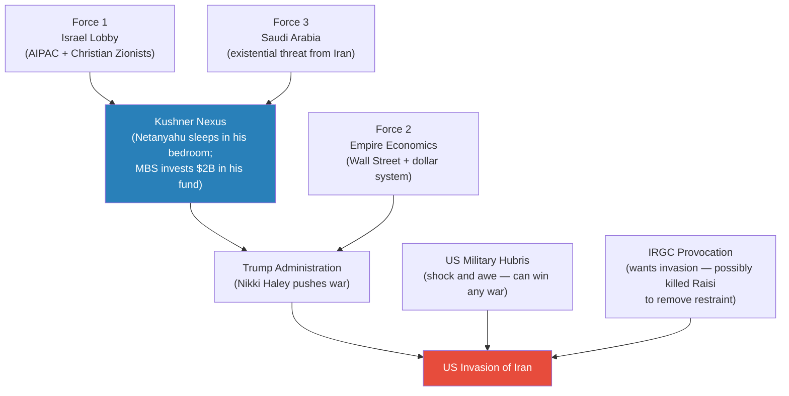
*Seven lectures built seven components. This lecture shows how they lock together — all roads lead to invasion.*

> [!note]- Expand: Full Lecture Detail
> Prof. Jiang opens by telling the class this is a summary and review of where the series stands. He walks through each force in turn.
>
> **Force 1 — The Israel Lobby:**
> - AIPAC has about 100,000 members, many of them billionaires — "they have financial power"
> - AIPAC is the second most powerful lobbying organisation in the US; the only more powerful is the pensioners' lobby (30 million members)
> - Christians United for Israel adds 7 million members — together they are "an extremely powerful force in government"
> - Their goal: war in the Middle East to advance Israel's interests
>
> **Force 2 — Empire Economics:**
> - America is addicted to easy money — all global money channelled through the US dollar system
> - "Many people in the US just basically make their money by speculating on money" — Wall Street is now extremely powerful in US politics
>
> **Force 3 — Saudi Arabia:**
> - The real conflict in the Middle East is Saudi–Iran, not Israel–Iran
> - For Israel, Iran is a security threat; for Saudi Arabia, Iran is a threat to its very existence
> - Saudi Arabia must resolve the Iran problem soon
>
> **The Kushner Nexus:**
> - Jared Kushner is Trump's son-in-law, married to Ivanka Trump
> - When Netanyahu visits the US, he stays with the Kushner family — on one occasion Netanyahu slept in Jared's bedroom, and Kushner had to sleep in the basement
> - Kushner's father Charles was a very prominent AIPAC sponsor
> - When Kushner started a private equity fund after the first term, Saudi Arabia invested $2 billion
> - Through Kushner, the Israel lobby, the Saudi royal family, and the Trump White House are connected by personal relationships, not just institutional interests
>
> **Trump's First-Term Evidence (five actions):**
> - Withdrew from the Iran nuclear deal
> - Moved the US embassy from Tel Aviv to Jerusalem
> - Ignored the Khashoggi murder (demonstrated he would protect Saudi Arabia regardless of human rights)
> - Sponsored the Abraham Accords (uniting Arab countries against Iran)
> - Assassinated General Soleimani in January 2020 — "the most important" action
>
> **Military Hubris — from traditional doctrine to shock and awe:**
> - Traditional doctrine required three principles: mass forces, avoid encirclement, protect supply lines
> - This required public consent — you need soldiers, money, and political support
> - In 2003 the US military changed to shock and awe: air supremacy + technological omniscience (satellites) + special forces = "fight wars cheaply, quickly and decisively without needing public consent"
> - The 2003 Iraq victory reinforced the conviction that the US military "can win any war, any place, against any enemy"
>
> **The Houthi proof:**
> - The Houthis began attacking ships in the Red Sea — a significant portion of global trade passes through there
> - The US dispatched a massive naval force — Operation Prosperity Guardian
> - The Americans could not defeat the Houthis
> - Biden came out publicly: "yes, we know we are losing, and yes, we know we cannot stop the Houthis, but we are going to continue on this path"
> - Prof. Jiang's verdict: "That's why, when the US military is given the order to invade Iran, they'll probably go along with it, because they cannot imagine the possibility that they could be defeated in Iran"
>
> **IRGC Provocation:**
> - Angry about American support for the Shah's police state (1953–1979)
> - Angry about US protection of Israel and Saudi Arabia
> - Angry about the Soleimani assassination
> - As discussed in [[07 - Who Killed Iranian President Ebrahim Raisi]], the IRGC possibly killed President Raisi because he was counselling strategic restraint when they wanted war
>
> > [!example] The Houthi Failure (2024)
> > - The Houthis attacked ships in the Red Sea, disrupting global commerce and driving inflation
> > - America dispatched a massive naval force — Operation Prosperity Guardian
> > - The Americans could not defeat the Houthis
> > - Biden acknowledged publicly: "yes, we know we are losing, but we will continue"
> > - Why? The military has special forces, air supremacy, and satellites — but no infantry, not enough ships
> > - Shock and awe requires a conventional military in flat terrain; the Houthis are not that enemy
> > **The lesson:** When faced with limitations, America refuses to accept them. Biden's statement is hubris distilled — and this is the exact mindset that will agree to invade Iran.

---

## Operation Iranian Freedom: Trump's Speech [7:30 – 17:12]

*It is March 2027. Prof. Jiang constructs the invasion scenario in detail — beginning with Trump's television address to the nation justifying the war. "Here, most of it is speculation — but I'm using speculation to help us better understand what a war would look like."*

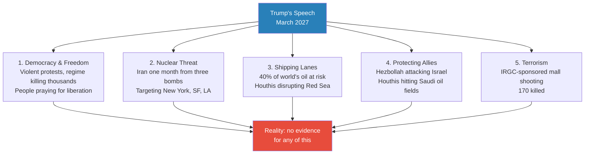
*"When Trump gives a speech, there's absolutely no evidence that any of this is true." The nuclear claim — Iran is "one month from a bomb" — has been repeated by America for ten years.*

> [!note]- Expand: Full Lecture Detail
> Prof. Jiang tells the class to pretend it is March 2027. Trump goes on TV and announces Operation Iranian Freedom — a full-scale US invasion of Iran, with Israel, Saudi Arabia, the UK, Australia, UAE, and Poland as coalition partners.
>
> **The five justifications:**
>
> - **Democracy and freedom** — Violent protests across Iran (religious, political, ethnic). The Iranian people are "praying for freedom." The IRGC is killing thousands of protesters. Iran is on the brink of civil war. America has an obligation to protect the people.
> - **Nuclear threat** — US and Israeli intelligence have discovered that Iran is one month from having three nuclear bombs targeting New York, San Francisco, and Los Angeles. Must strike first.
> - **Shipping and global prosperity** — Iranian proxies are disrupting shipping in the Red Sea and the Strait of Hormuz. 40% of the world's oil passes through this region. America must protect global prosperity.
> - **Protecting allies** — Hezbollah is attacking Israel, killing innocent Israelis. Houthis are attacking Saudi oil fields. America has an obligation to defend its friends.
> - **Terrorism** — The IRGC sponsored a mall shooting that killed 170 people. US intelligence confirms it was an Iranian operation.
>
> **Trump's reassurances:**
> - Many allied countries are participating — "UK, Israel, Saudi Arabia are all part of this operation"
> - Special forces are already in the country, locating air bases and missiles to knock out at the start
> - Iranian opposition groups have been contacted — "they want to overthrow the regime, and when we help them, they will install democracy"
> - The US defeated Saddam Hussein in 100 hours (1991) and in less than three weeks (2003) — "to prove we are the greatest in the world, we will defeat Iran in only two weeks"
>
> Prof. Jiang's commentary on the speech structure:
> - Each justification maps to a known American pressure point: democracy (idealism), nuclear (fear), shipping (economic interest), allies (honour), terrorism (anger)
> - Together they cover every possible objection — "most people in the country will support this war"
> - On the nuclear claim: "America has been saying this for the past ten years — you can just Google it"
>
> > [!example] The "Two Weeks" Promise
> > - 1991: US defeated Iraq in 100 hours
> > - 2003: US defeated Iraq in less than three weeks
> > - Trump promises Iran will fall in two weeks — each war is supposed to be faster
> > - Iraq in both cases was flat desert with a conventional military — ideal terrain for shock and awe
> > - Iran is mountain fortress terrain with 90 million people and an unconventional military motivated by religion
> > - "The two weeks promise is not strategy — it is TV performance"
> > **The lesson:** Declining timelines (100 hours → 3 weeks → 2 weeks) are symptoms of hubris, not evidence of capability. The conditions are what matter, not the track record.

---

## The Invasion Begins — and the Trap Closes [17:12 – 23:05]

*The military spectacle is overwhelming on television. Prof. Jiang deliberately frames it this way to show how the performance of power creates the illusion of inevitable victory — and why that illusion is the trap.*

> [!tip] Core Insight
> "We'll watch this on TV and the Internet together, on YouTube together, and we'll be so impressed by the power of the US military." Then Prof. Jiang pauses: "At this point, I think the war has been decided. Who has won the war?" The students say America. "Obviously, this is a trick question. Obviously, Iran has won the war."

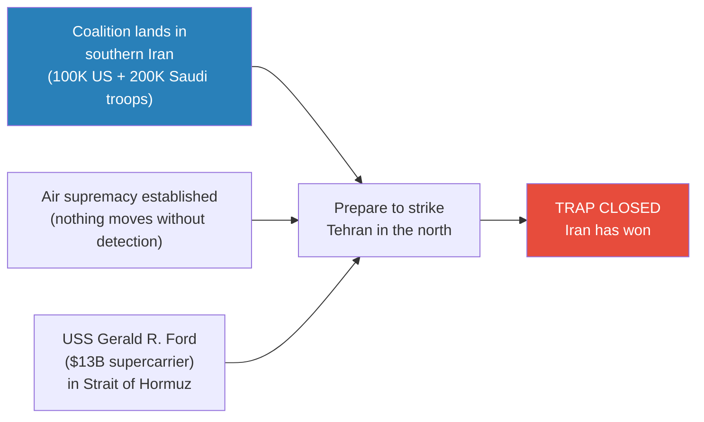
*The moment American troops enter Iran, the war is already decided — in Iran's favour. Geography does what a defending army would normally have to do.*

> [!note]- Expand: Full Lecture Detail
> Prof. Jiang describes the invasion as if watching it on television — deliberately choosing this framing to show how the spectacle creates the illusion of victory.
>
> **The military spectacle:**
> - The USS Gerald R. Ford — a $13 billion supercarrier — enters the Strait of Hormuz
> - Air supremacy is established immediately — complete control of the skies; nothing can move without American detection
> - A massive invasion force lands in southern Iran: approximately 100,000 US troops and 200,000 Saudi troops (200,000–500,000 total)
> - The coalition establishes a foothold in the south
> - Forces prepare to strike north toward Tehran
>
> **Prof. Jiang's trick question — and the real answer:**
> - He asks the class who has won the war at this moment
> - Students answer: America
> - His response: "Obviously, this is a trick question. Obviously, Iran has won the war."
>
> **Why traditional doctrine says the war is already lost — three principles:**
>
> *Principle 1: Avoid Encirclement — FAILED*
> - Iran is all mountains — a natural fortress
> - To get troops in, you have to airdrop them — no overland route avoids mountain passes
> - But once they're in the country, you cannot get them out — the same mountains that let you in now surround you
> - "The geography does what an enemy army would normally have to do: it encircles the invasion force automatically, without Iran needing to deploy a single soldier"
>
> *Principle 2: Mass Forces — FAILED*
> - Iran has a population of 90 million people — "you would need at least 3 to 4 million soldiers to even think about conquering the country"
> - Total US military is approximately 1 million worldwide, with roughly 60,000 in the Middle East
> - 100,000 US troops in-country is nowhere near enough
> - Student Jack makes a crucial tactical point: tanks cannot move through mountains — they are not designed for mountain warfare
> - The ratio: 100,000 soldiers trying to control 90 million people in mountain terrain
>
> *Principle 3: Protect Supply Lines — FAILED*
> - No supply lines to protect — no ground route for resupply through the mountains
> - The only option is aerial resupply: aircraft must drop ammunition, food, water, and medical supplies
> - "Iran is all mountains, so it's very easy for Iranians to shoot down the aeroplanes"
> - "A random guy with a rocket launcher can just shoot down the helicopter — which is what the Afghans did against the Soviets in the Afghanistan war, and that's why the Soviets lost"
> - Modern drones make the problem worse — cheap drones can take down expensive aircraft
>
> **The hostage metaphor:**
> - "You think they're soldiers, but they're not — what they really are is hostages"
> - Too many to evacuate — you can't extract 100,000+ people from a mountain fortress
> - Too few to attack — 100,000 vs. 90 million, with no ability to manoeuvre tanks
> - Unable to be resupplied — every resupply aircraft is a target in the mountain passes
> - Encircled by Iranian forces — the geography does the encirclement automatically
>
> The invading army has been converted from the most powerful military force on Earth into a bargaining chip. Iran does not need to defeat them militarily — it just needs to keep them trapped.

---

## Why Iranians Will Not Rise Up [24:07 – 31:00]

*The entire invasion plan rests on one critical assumption: that the Iranian people will rise up and welcome the Americans as liberators. Prof. Jiang systematically dismantles this assumption with four reasons drawn from Iranian history, culture, and religion.*

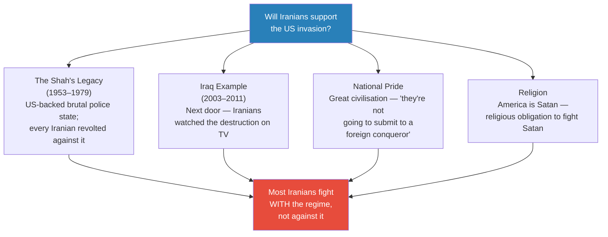
*The internal uprising assumption is propaganda, not strategy. Every cultural and historical factor points in the opposite direction.*

> [!note]- Expand: Full Lecture Detail
> Prof. Jiang explains that the logic of having 100,000 US troops in the country rests on one hope: that once they arrive, the resistance will rise up and the Iranian army will mutiny. He identifies four reasons this will not happen.
>
> **Reason 1 — The Shah's legacy:**
> - "Iranians remember the Shah from 1953 until 1979 — the American-supported Shah was running a brutal police state, so brutal that everyone in Iran revolted against the regime"
> - This is not ancient history — people who lived through it are still alive
> - The students who stormed the US Embassy in 1979 discovered from reassembled shredded documents that the embassy was the real centre of power in Iran (covered in [[07 - Who Killed Iranian President Ebrahim Raisi]])
> - Iranians know what American "involvement" in their country actually means
>
> **Reason 2 — The Iraq example:**
> - "Which country is next door? What happened in Iraq?"
> - America invaded Iraq in 2003, promising freedom, democracy, and prosperity
> - "Instead, it just destroyed the country"
> - "American soldiers were running into houses every night, pointing guns at children, destroying homes and arresting men for no reason"
> - "Iranians saw all this on TV. They heard about all this from neighbours"
> - "They know that if America comes, it's to destroy the country, not to bring freedom and democracy"
>
> **Reason 3 — National pride:**
> - "Iranians think that they belong to a great civilisation" — one of the oldest and most accomplished in human history
> - "They value their freedom and independence — they're not going to submit to a foreign conqueror"
> - This is not political ideology — it is cultural identity; even Iranians who oppose the IRGC would not welcome an American invasion
>
> **Reason 4 — Religion:**
> - "Iranians are religious — they believe that America is Satan, and they have a religious obligation to fight Satan"
> - Combined with the Basij volunteer army from [[07 - Who Killed Iranian President Ebrahim Raisi]] — poor, religious villagers given rifles and willing to die for God and country
> - Creates an effectively unlimited supply of fighters with the will to die
>
> **Why do Americans believe the uprising narrative anyway?**
> - A student asks: why would American leadership think the Iranian people will rise up?
> - Prof. Jiang: "They need to justify the invasion — they have to have a logical explanation for why this invasion will succeed, because one of the criticisms will be: you need 4 million people to invade Iran, and they don't have 4 million soldiers"
> - "So the only explanation is, well, we're going to pretend that once we invade, the people of Iran will support us — it's not based on truth, but it's an explanation for why the invasion will succeed"
>
> **Does the military actually believe this?**
> - "And the answer is, hubris"
> - "Once you're in a position where you have access to nuclear weapons, when you can kill anyone in the world, when you can see everything in the world, it makes you think you're God"
> - "The Greeks believe the worst thing is hubris, because it makes you think you're God — but you're not God, and you're gonna get into a lot of trouble if you think you're God"
>
> > [!example] The Iraq Mirror
> > - America invaded Iraq in 2003, promising freedom and democracy
> > - Over eight years: night raids, guns pointed at children, homes destroyed, men arrested without cause
> > - Iranians next door saw everything — on television, from refugees, from neighbours who crossed the border
> > - They know exactly what an American "liberation" looks like
> > - When Trump promises to bring freedom and democracy to Iran, every Iranian thinks of Iraq
> > **The lesson:** The gap between American rhetoric and American reality is visible to everyone in the region. Iraq is not a distant example — it is next door.

---

## Two Methods of Validation: History and Game Theory [31:00 – 37:07]

*Before examining the historical evidence, Prof. Jiang explains his methodology. There are two rigorous ways to test whether the Iran scenario could actually happen — and he will use both.*

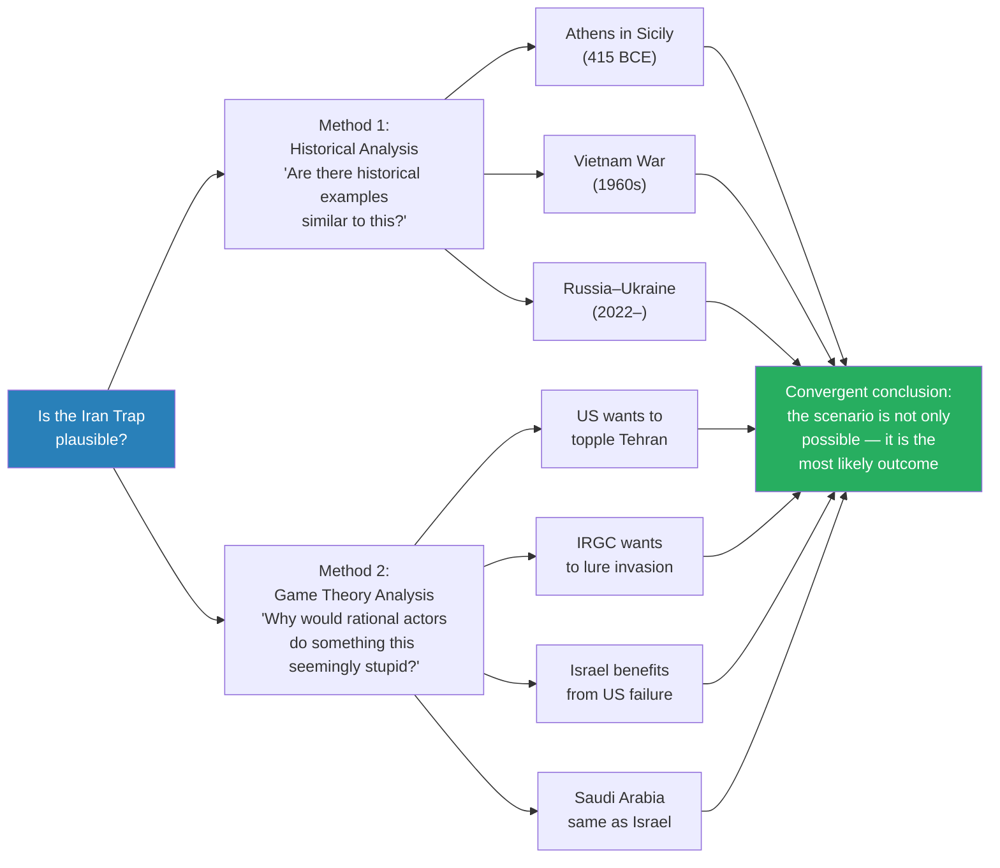
*Two independent analytical methods — historical pattern and strategic incentive — converge on the same conclusion.*

> [!note]- Expand: Full Lecture Detail
> Prof. Jiang tells the class he will use two methods to prove the scenario is plausible.
>
> - **Historical analysis:** "Are there historical examples similar to this? If there are, then this could be true, because it has happened before."
> - **Game theory analysis:** "Why would the actors who are rational do something as stupid as trap 100,000 American soldiers in Iran?"
>
> The two methods are independent — historical analysis looks backward at what happened under analogous conditions; game theory looks at forward-looking rational incentives. When both methods point to the same outcome, the scenario moves from speculation to likely.

---

## Historical Analogue 1: Athens Invades Sicily (415 BCE) [37:07 – 41:00]

*The first precedent — an empire addicted to easy money sends a massive force to a distant land and loses everything. Prof. Jiang draws on Thucydides' account of the Peloponnesian War from the Civilization series.*

```mermaid
flowchart LR
    A["432 BCE<br/>Peloponnesian War begins<br/>17 years of stalemate"] --> B["415 BCE<br/>Alcibiades proposes<br/>Sicily invasion<br/>(Syracuse has money)"]
    B --> C["Nicias demands<br/>massive force<br/>(5,000 troops, 100 ships)<br/>trying to scare people off"]
    C --> D["Athens says:<br/>'Great idea!'<br/>approves enthusiastically"]
    D --> E["Year 1: Success<br/>Syracuse army retreats<br/>behind city walls"]
    E --> F["Syracuse navy<br/>cuts Athenian<br/>supply lines"]
    F --> G["Entire Athenian<br/>army wiped out"]
    G --> H["404 BCE<br/>Athens loses war<br/>Empire collapses"]
    style B fill:#2980b9,color:#fff
    style F fill:#e74c3c,color:#fff
    style H fill:#e74c3c,color:#fff
```
*The Sicilian Expedition follows the exact trajectory Prof. Jiang predicts for Iran: initial success, supply line failure, total loss, imperial collapse.*

> [!note]- Expand: Full Lecture Detail
> Prof. Jiang invokes the Peloponnesian War from the previous semester's Civilization series. The year is 415 BCE.
>
> - Athens has been fighting Sparta for seventeen years — a brutal, stalemated war
> - Alcibiades proposes a solution: invade Sicily and take Syracuse's money
> - Prof. Jiang: "They became addicted to the easy money of empire — they want to fight this war"
> - Nicias tries to prevent the war by demanding an absurdly large force: 5,000 soldiers and 100 ships (from a total Athenian population of about 50,000)
> - His plan backfires — "the Athenians say, 'That's a great idea! Let's send a massive force against Sicily and Syracuse!'"
>
> **The critical failure — resupply:**
> - Athens had never before sent a large expedition force against another power — "they never fought a war like this before"
> - "The biggest problem is resupply — and this is something that the Athenians didn't think about, because they had absolutely no experience in fighting a foreign war"
> - First year: the Athenians destroy the Syracuse army, which retreats behind city walls; Athenians lay siege, controlling the sea
> - Then: Syracuse's navy cuts the Athenian supply lines
> - The entire Athenian army is wiped out in Sicily
> - Consequence: Athens loses the Peloponnesian War; the Athenian Empire collapses
>
> **The parallels to Iran:**
> - An empire addicted to easy money (Athens = America — both derive power from controlling money flows, not production)
> - Hubris from past victories (Athens had never really lost a war = US shock-and-awe confidence from 1991 and 2003)
> - A massive expeditionary force sent far from home with overwhelming confidence
> - No experience with this kind of war — "Athens didn't go invade Persia; it only fought defensive wars"
> - The fundamental failure: resupply — the problem nobody thinks about because they've never had to
> - Result: total loss of the expeditionary force → collapse of imperial power
>
> Prof. Jiang's verdict: "Historians have been trying to figure out for a long time why the Athenians would do such a stupid thing as to send a huge army against Syracuse, because the risk of failure was catastrophic. And the only answer is, well, the Athenians had hubris — which is the same situation America finds itself in today."
>
> > [!example] Athens Invades Sicily (415 BCE)
> > - Athens had been fighting Sparta for 17 years in a brutal stalemate
> > - Alcibiades proposed invading Sicily to take Syracuse's money — addicted to easy money of empire
> > - Nicias tried to stop it by demanding a massive expedition force; Athens approved enthusiastically
> > - Athens had never fought an expeditionary foreign war before — only defensive wars against Persia
> > - Nobody thought about resupply
> > - First year: Athenians destroyed the Syracuse army, which retreated behind city walls
> > - Then: Syracuse's navy cut the Athenian supply lines
> > - The entire Athenian army was wiped out in Sicily
> > - Athens lost the Peloponnesian War; the Athenian Empire collapsed
> > **The lesson:** Hubris and addiction to empire drive expeditionary adventures. The one problem you never think about — because you've never had to — is the one that destroys you.

---

## Historical Analogue 2: Vietnam (1960s) [41:00 – 47:00]

*The modern precedent — mission creep, the sunk cost fallacy, and a military that knew it was losing but couldn't stop. The Pentagon Papers proved it.*

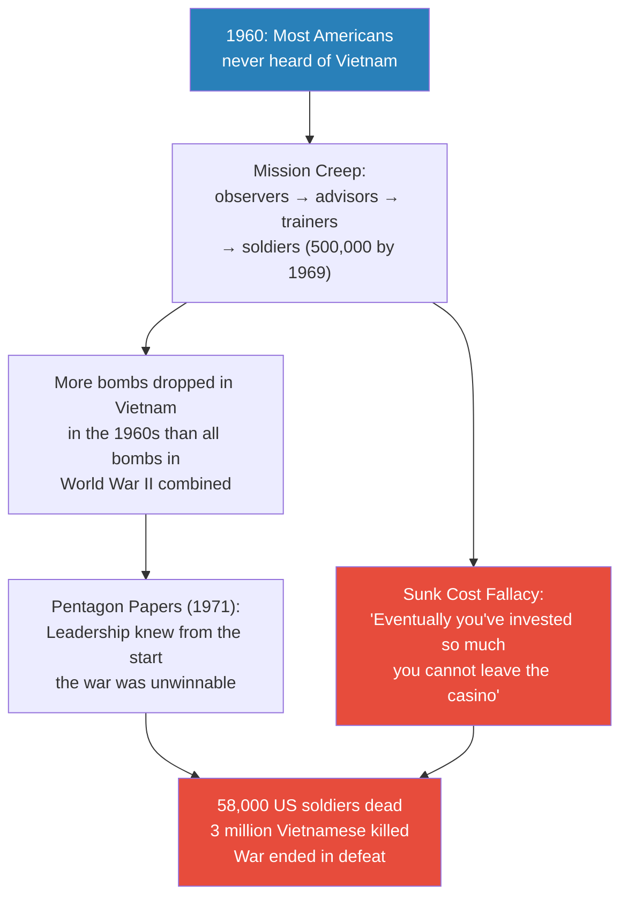
*The Vietnam pattern: mission creep, known unwinnable, sunk cost prevents withdrawal — each stage maps directly onto the predicted Iran scenario.*

> [!note]- Expand: Full Lecture Detail
> Prof. Jiang opens: "In the beginning of 1960, most Americans have never heard of a country called Vietnam. By 1969, half a million American soldiers were in the country, destroying everything — but also getting destroyed themselves. 58,000 US soldiers died."
>
> **The Pentagon Papers (1971) — three major findings:**
> - **Mission creep:** "American military leadership has been expanding the war in Vietnam without public knowledge — maybe at first they sent some observers, then advisors and trainers, then soldiers. Things escalate slowly over time."
> - **Known unwinnable:** Leadership knew from very early on the war could not be won. They dropped more bombs in Vietnam in the 1960s than all bombs dropped in World War II combined — and could not win.
> - **Will to fight:** "Even though America was killing a lot of people — it killed 3 million Vietnamese — it was not destroying the enemy's will to fight. In fact, it was making them angrier, and therefore more people were going to fight the Americans."
>
> **The three conditions for winning a war:**
> Prof. Jiang introduces this framework through Vietnam: to evaluate any war and predict the winner, ask three questions:
> - Clear strategy/objectives — what are you trying to accomplish? What are your clear military objectives?
> - Adaptation to the battlefield — "the adversary that is most willing to adapt to a battlefield will win"
> - The will to fight — "even if you're killing a lot of people, if you're not destroying their will to fight, you cannot win"
>
> America in Vietnam failed all three.
>
> **The sunk cost fallacy and credibility:**
> - Why didn't America leave? "Credibility — they didn't want to be laughed at by the Chinese and by the Soviets and by the Europeans"
> - Prof. Jiang introduces the casino analogy: "Never, ever go into a casino. When you go to a casino, you start losing money. At some point you cannot leave the casino — why? Because you want to reclaim the money you've lost. You've invested so much that you cannot leave. You have to get that money back. That's the problem with war. Eventually you've invested so much you cannot leave the war."
>
> > [!quote] Prof. Jiang
> > "Eventually you've invested so much you cannot leave the war — and that's what happened in Vietnam. America invested so much it didn't want to leave because it did not want to admit that all this has been lost."

---

## Historical Analogue 3: Russia–Ukraine (2022–) [47:00 – 54:19]

*The most recent precedent — a TV-personality leader makes strategically suicidal decisions because they look good on camera, while extremists and foreign advisors push for maximum escalation.*

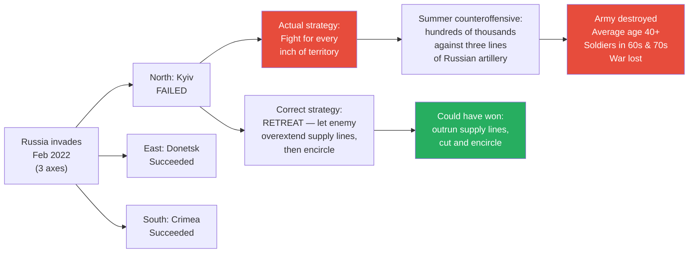
*Ukraine had one correct strategy — retreat and let Russia overextend — but chose the TV-friendly strategy of fighting for every inch. Result: military destruction. "Trump is exactly like Zelensky."*

> [!note]- Expand: Full Lecture Detail
> In February 2022, Putin ordered a special military operation. Russia attacked from three axes: North (Kyiv), East (Donetsk), South from Crimea.
>
> The North failed. The East and South succeeded.
>
> **The only correct Ukrainian strategy:**
> - Using traditional military doctrine, there is only one way Ukraine can fight and win: retreat
> - Russia sent ~160,000 soldiers — not enough for such a huge country
> - "If you just give them space, they're going to outrun the supply lines — and then when they outrun their supply lines, you can encircle them and disrupt their supply"
> - "That's the only way you can win the war"
>
> **What Ukraine actually did:**
> - "The Ukrainians refused to give up space — they wanted to fight the Russians for every inch of territory"
> - Eventually launched a summer counteroffensive — sending hundreds of thousands of soldiers against three lines of Russian artillery fortifications
> - "The Russians blew everyone up"
> - Result: Ukraine has no more soldiers; average age of the Ukrainian army is over 40; soldiers in their 60s and 70s fighting; the war is lost
>
> **Three causes of Ukraine's strategic failure:**
> - **Zelensky is a TV actor:** "He doesn't think strategy — he just thinks what looks good on TV. For the first two years, people were saying Ukraine was going to march to Moscow and overthrow Putin — Zelensky was a master of public image manipulation, distorting reality for people through television."
> - **Extremists in the Ukrainian military:** Neo-Nazi elements (in the Russian sense — enemies of Russia who want to kill Russians) push for maximum war and resist any strategic retreat
> - **NATO advisors:** "It's an open secret that NATO is helping the Ukrainian military against Russia. The summer offensive was most likely a NATO plan, not a Ukrainian plan."
>
> **The critical comparison — Trump is exactly like Zelensky:**
> - Both are TV personalities who care about looking strong on camera rather than thinking strategically
> - Both make decisions that look impressive without understanding the strategic consequences
> - "Zelensky fought for every inch because retreat looks bad on TV — Trump will launch an invasion because supercarriers and air supremacy look good on TV"
> - "Neither man is a strategist; both are performers"
>
> **NATO escalation — the Vietnam pattern repeating:**
> - If Ukraine runs out of soldiers (already happening), NATO will send its own troops
> - This follows the same mission creep pattern as Vietnam: observers → advisors → trainers → special forces → combat troops → conscription
> - "Macron has publicly said France wants to send French soldiers to Ukraine"
> - "The British Prime Minister has said he is considering conscription for British citizens — drafting young people to fight Russia"
>
> > [!example] Ukraine's Strategic Suicide (2022–present)
> > - Russia attacked from three axes; only the North failed
> > - The correct strategy using traditional doctrine: retreat, let Russia overextend, cut supply lines
> > - Ukraine instead fought for every inch of territory, then launched a counteroffensive against three lines of Russian artillery
> > - "The Russians blew everyone up"
> > - Average age of the Ukrainian army is now over 40; soldiers in their 60s and 70s
> > - Three causes: Zelensky as TV actor; Neo-Nazi extremists pushing maximum war; NATO advisors devising strategy
> > **The lesson:** Strategic thinking requires accepting short-term losses for long-term victory. TV personalities — Zelensky and Trump alike — cannot do this because retreat looks bad on camera.

---

## The Pattern Across 2,400 Years [~54:00]

*Three historical analogues — Athens, Vietnam, Ukraine — all demonstrate the same cycle. Prof. Jiang's argument is not that "history repeats" — it is that the cognitive biases producing imperial self-destruction are permanent features of human psychology.*

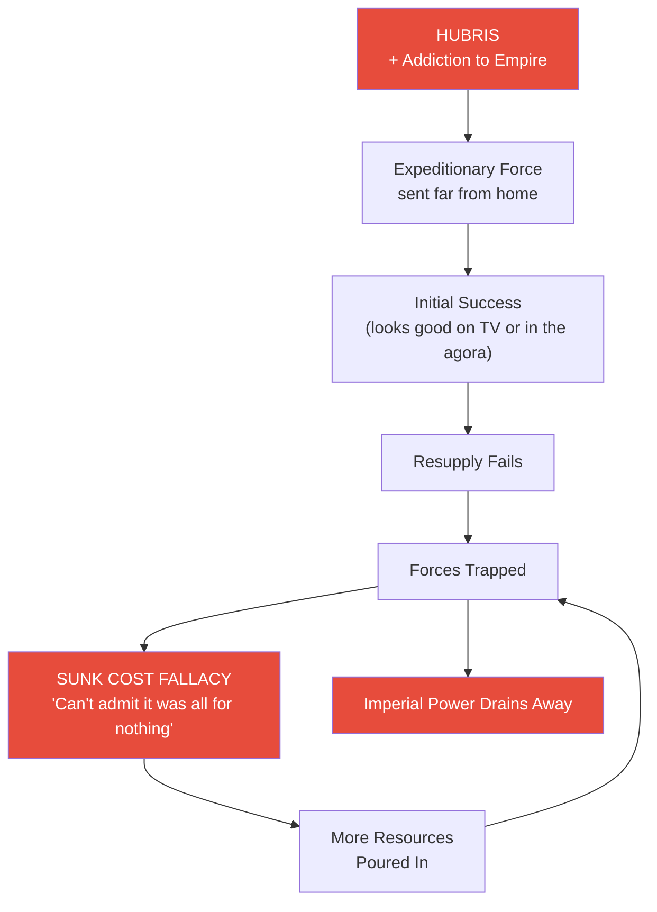
*The cycle repeats: hubris drives overextension, resupply fails, troops are trapped, sunk cost prevents withdrawal, imperial power collapses. Athens learned this in 413 BCE. America learned it in Vietnam. It is about to learn it again in Iran.*

> [!note]- Expand: Full Lecture Detail
> The common thread across all three examples:
> - The dominant power has a track record of success — Athens had never lost, America's shock and awe was undefeated, Ukraine's TV narrative showed winning
> - The dominant power sends forces far from home without thinking about resupply — the one problem they never consider, because they've never had to
> - Initial success reinforces the delusion — the first year in Sicily went well, the first weeks of shock and awe are always impressive
> - Then resupply fails — and the initial success turns into a death sentence because the troops are now deep in enemy territory with no way home
> - The sunk cost fallacy prevents withdrawal — too much invested; leaving means admitting it was all wasted
> - The result is collapse — not a negotiated withdrawal, but the destruction of expeditionary power and often the decline of the empire itself
>
> > [!abstract] Three Historical Analogues Compared
> > | Dimension | Athens/Sicily (415 BCE) | US/Vietnam (1960s) | Russia/Ukraine (2022) |
> > |-----------|----------------------|-------------------|---------------------|
> > | **Driver** | Addiction to empire money | Mission creep + credibility | TV personality + extremists |
> > | **Overconfidence** | Never lost a war | Shock and awe | "March to Moscow" narrative |
> > | **Supply failure** | Syracuse navy cut lines | Could not sustain 500K troops | Counteroffensive unsustainable |
> > | **Sunk cost** | Too invested to withdraw | "Can't admit it was all for nothing" | NATO escalation |
> > | **Outcome** | Entire army wiped out; empire collapsed | 58,000 dead; withdrawal in defeat | Army destroyed; average age 40+ |
> > | **Key mistake** | No experience in expeditionary war | Failed all three conditions | Fought for every inch instead of retreating |

---

## Game Theory: Why Every Actor Wants the Invasion [54:19 – 59:11]

*Prof. Jiang shifts from history to game theory — examining why each major actor would rationally choose invasion despite the obvious risks. The result is the lecture's most devastating revelation.*

> [!tip] Core Insight
> "All the major participants want an invasion of Iran — but they want different outcomes." America is the only participant that doesn't benefit from the trap. Israel and Saudi Arabia benefit most from US failure: with both Iran and the US weakened, the Middle East is theirs to control.

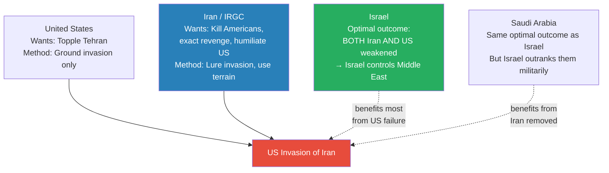
*The game theory trap: all four actors want the invasion to happen, but for incompatible reasons. Nobody needs to coordinate — each actor pursuing its own rational self-interest produces the same outcome.*

> [!note]- Expand: Full Lecture Detail
> Prof. Jiang explains game theory: "Society is a game among human beings, and each person is trying to play this game to optimise the outcome for that person." He examines each actor:
>
> **United States:**
> - Wants to topple the regime in Tehran
> - Can only do this through a ground invasion — "air strikes, sanctions, and covert operations cannot change a regime; you need troops on the ground to install a new government"
>
> **Iran (IRGC):**
> - Wants to kill as many Americans as possible and force a US land invasion
> - Knows that if the US invades, it will lose — "the Revolutionary Guard can just send suicide bombers against US forces indefinitely"
> - Goal: humiliate America, exact revenge for the Shah regime, avenge Soleimani's assassination
> - Does not fear mass Iranian casualties — the Basij provides unlimited religiously motivated fighters
>
> **Israel — the game theory revelation:**
> - Stated goal: defeat Iran and destroy its proxies (Hezbollah, Hamas, Houthis)
> - But the optimal outcome is more subtle
> - Prof. Jiang asks the students: what happens if both Iran AND the United States lose the war?
> - "Iran is destroyed as a country. United States is destroyed as a military presence in the Middle East. What would happen? Israel becomes the top dog in the Middle East. Israel can now control the entire Middle East."
> - So the optimal outcome for Israel is Iran and United States both destroyed
>
> **Saudi Arabia:**
> - Exactly the same optimal outcome as Israel
> - But there is a crucial asymmetry: Israel has far superior military capability
> - "It's very easy to blow up Saudi Arabia — they have oil fields. Not that easy to blow up Israel."
> - Saudi Arabia becomes the junior partner; Israel becomes top dog
>
> **Prof. Jiang's synthesis:**
> - "In other words, all the major participants want an invasion of Iran, but they want different outcomes"
> - "Saudi Arabia and Israel most benefit if you have 100,000 US troops in the country and they can't get out — because it becomes sunk cost fallacy; the United States can only pour in more soldiers"
> - Nobody needs to scheme or coordinate — each actor pursuing its rational self-interest independently produces the same result

---

## The Nuclear Question and Russia's Guarantee [59:11 – 1:03:00]

*A student (Celine) asks the pivotal question: the United States has nuclear weapons. Can't Trump just threaten to nuke Iran? Prof. Jiang concedes — this is exactly what will happen. And then he explains how Russia closes this last escape route.*

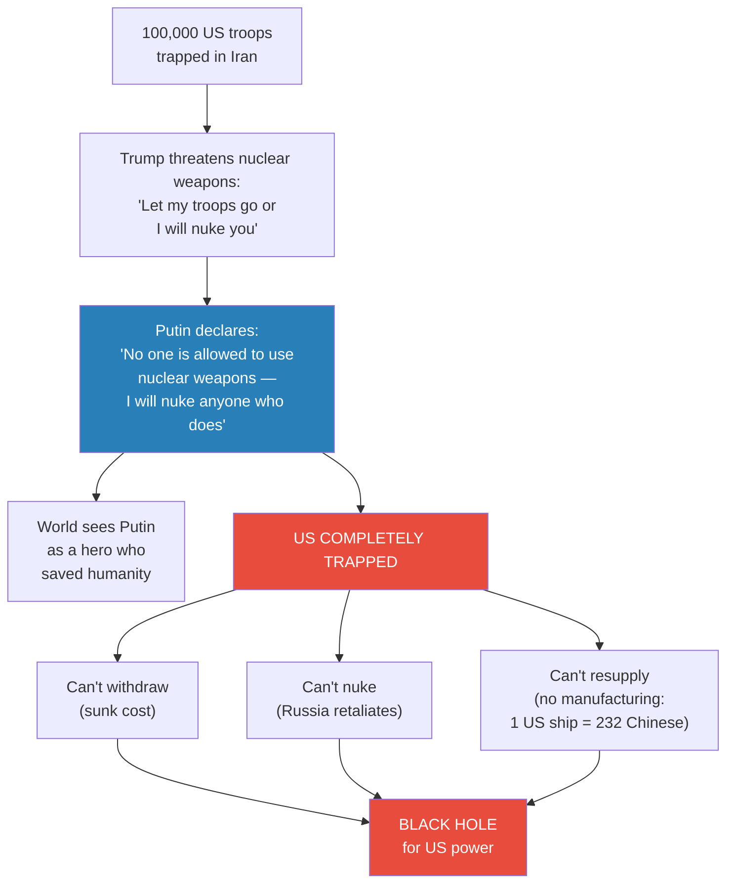
*Russia's nuclear guarantee closes the last escape route. Three locks — sunk cost, Russia, manufacturing deficit — and no key for any of them.*

> [!note]- Expand: Full Lecture Detail
> **The nuclear threat scenario:**
> - Trump has 100,000 troops trapped in Iran — can't get them out, can't resupply, can't advance
> - "I'm Donald Trump. I need to look strong. I have 100,000 troops in the country. I can't get them out."
> - He tells Tehran: "You either guarantee safe passage out of the country, or I will nuke the entire country"
> - This is not bluster — "Trump will respond with nuclear weapons or the threat of nuclear weapons; that is what will happen if this situation arises"
>
> **Russia's nuclear guarantee:**
> - Before the war begins, Iran and Russia must come to a pre-war agreement
> - Putin declares from the outset, publicly and clearly: no one is allowed to use nuclear weapons
> - The declaration is symmetrical and universal: "If Iran uses nuclear weapons, I will nuke Iran. If the United States uses nuclear weapons, I will nuke the United States. If Israel uses nuclear weapons, I will nuke Israel."
> - This is not a pro-Iran statement — it is a pro-humanity statement
> - How will the world react? "He's a hero — he saved humanity"
> - But the consequence for America: "The United States is now trapped — completely trapped"
>
> **The manufacturing deficit — the final lock:**
> - Even sustained conventional warfare requires an industrial base at scale
> - "For every one ship that America can build, China can build 232 ships — that's what the Pentagon says"
> - America moved all its manufacturing capacity to China over decades
> - Empire economics from [[03 - How Empire is Destroying America]] produced this result: Wall Street got rich, but the factories are in a competitor's country
> - The bullets run out. The replacement parts run out. The vehicles run out. And you cannot build more fast enough.
> - "The irony is devastating: the addiction to empire that drove America to war also destroyed its ability to fight one"
>
> **The three locks — why the trap has no exit:**
> - **Lock 1 — Sunk Cost (Political):** Once troops are committed, withdrawal is politically impossible. "You can only send in more soldiers — it becomes a black hole, and America just puts in all its resources"
> - **Lock 2 — Russia (Military):** The one weapon that could break the military stalemate is nuclear weapons. Putin's declaration closes this option. "America cannot escalate to nuclear weapons without triggering Russian retaliation"
> - **Lock 3 — Manufacturing (Industrial):** Even sustained conventional warfare requires an industrial base. America no longer has one. The 1:232 ratio makes out-producing the problem impossible.
>
> **The unanswered question:**
> - "Why would Putin do that? Why would Putin involve himself in this war?"
> - "And that's what we'll discuss next class — how Putin sees this war, and how Putin will react"
> - Without Russia, the trap has an escape route. With Russia, it doesn't.
>
> > [!quote] Prof. Jiang
> > "Once it becomes trapped, sunk cost fallacy comes into play, and America just puts in all its resources into the country — but it's a black hole. It cannot use nuclear weapons because Putin declared from the onset you are not allowed to use nuclear weapons."

---

## The Iraq Staging Question [1:03:00 – end]

*A final student question tests whether the US could bypass the mountain trap by staging the invasion from neighbouring Iraq. Prof. Jiang shows why the workaround fails at every level.*

> [!note]- Expand: Full Lecture Detail
> A student asks: is it possible for the US to use Iraq as a staging area — to launch the invasion from an existing foothold rather than airlifting troops directly into mountain terrain?
>
> Prof. Jiang addresses this methodically:
>
> **Problem 1 — Sovereignty:**
> - Iraq is an independent country
> - There are about 10,000 American soldiers there, but "you would need their permission — and even if you had their permission..."
>
> **Problem 2 — Shia militias:**
> - There are large numbers of Shia militiamen in Iraq who are loyal to Iran and still deeply angry about what America did to their country from 2003 to 2011
> - These militias are part of the Axis of Resistance the IRGC built (from [[01 - Iran's Strategy Matrix]])
> - "They would see the American invasion force as an opportunity to attack the Americans — because they're still angry about what happened in Iraq"
> - This opens a second front the US cannot afford
>
> **Problem 3 — The mountains remain:**
> - "Even if they could have a staging area in Iraq, they still have to deal with mountains"
> - Iran's western border with Iraq is also mountains — going through the passes means ambushes from concealed positions
> - Going by air means drones and rocket launchers in the mountain passes
>
> **Problem 4 — Extraction still impossible:**
> - "You have 100,000 troops in the country — you have to get them out"
> - "If you go through the mountains, you're gonna get ambushed. You go by air, those drones are gonna strike you down"
>
> Prof. Jiang's conclusion: there is no workaround. The geography is the trap, and geography does not change. Every attempt to solve one problem creates another. The Iran Trap is not a single vulnerability — it is a comprehensive system where each escape route leads to a new trap.
>
> > [!example] The Iraq Staging Failure
> > - Student asks: could the US stage the invasion from Iraq to avoid the airlift problem?
> > - Problem 1: Iraq is sovereign — US needs permission, which is uncertain
> > - Problem 2: Shia militias loyal to Iran would attack the US staging force — opening a second front
> > - Problem 3: Iran's western border with Iraq is also mountains — the terrain problem doesn't disappear
> > - Problem 4: Extraction of 100,000 troops is still impossible — ambushes in mountain passes, drones on air routes
> > **The lesson:** The trap has no workaround. Every escape route leads to another trap. The IRGC spent decades closing every exit.

---

## Connections

**Builds on:**
- [[01 - Iran's Strategy Matrix]] — asymmetric warfare; the Iran Trap is asymmetric warfare at its fullest expression — inferior force controls the terms of engagement
- [[06 - America's Imperial Hubris]] — shock and awe doctrine, the three military principles, hubris as institutional blindness; this lecture shows those principles violated simultaneously
- [[07 - Who Killed Iranian President Ebrahim Raisi]] — IRGC provocation strategy; the political vs. military class dynamic that removes restraint on war; the Basij volunteer army

**Sets up:**
- [[09 - Putin's War for the Soul of Russia]] — the critical unanswered question: why would Putin guarantee no nuclear weapons? How does Russia benefit from the US–Iran trap? The series pivots from Iran to Russia

**Related books in vault:**
- [[The 33 Strategies of War - Robert Greene]] — expeditionary warfare failure patterns, the danger of overextension; Greene's treatment of the Sicilian Expedition directly parallels Prof. Jiang's usage
- [[The 48 Laws of Power - Robert Greene]] — Law 47 (Do Not Go Past the Mark You Aimed For); the Athens–Syracuse example appears as a warning against overreach
- [[Thinking Fast and Slow - Daniel Kahneman]] — sunk cost fallacy as cognitive bias; System 1 thinking drives hubris — the military's fast, intuitive judgment that shock and awe will work overrides the slow analytical assessment that mountains change everything

---

## The Takeaway

This lecture is the series' gravitational centre — the lecture everything has been building toward since the first class. Seven lectures established the structural forces pushing America toward war. Lecture 8 assembles those forces into a single war-game scenario and validates it through two independent analytical methods: historical analogy and game theory. The convergence of both methods on the same conclusion — that the invasion will happen and will fail — is what gives the lecture its power. Prof. Jiang is careful throughout to label this as speculation ("most of it is speculation"), but the speculation is grounded in seven lectures of structural analysis. The question is not whether the forces exist. It is whether anything can stop them.

The most counterintuitive insight is the game theory revelation about America's allies. The conventional narrative assumes Israel and Saudi Arabia want America to win a quick, decisive war against Iran. Prof. Jiang shows the opposite: both benefit most from American failure. A US–Iran war that destroys both participants leaves the Middle East to Israel and Saudi Arabia — with Israel as the dominant power. The "allies" are not allies at all; they are beneficiaries of the trap. This reframes the entire series: the forces pushing America toward war are not just pushing it toward a difficult conflict — they are pushing it toward self-destruction, and the pushers know it.

The three historical analogues are the lecture's most sobering dimension. The Sicilian Expedition happened 2,400 years ago, and historians still ask why Athens would do something so obviously suicidal. The answer — hubris and addiction to empire — is the same answer Prof. Jiang gives for America. Vietnam happened within living memory, and the Pentagon Papers proved that leadership knew the war was unwinnable while continuing to fight it. Russia–Ukraine is happening right now, demonstrating in real time how TV-personality leadership and extremist pressures produce strategic catastrophe. Prof. Jiang's implicit argument is not that history repeats — it is that the cognitive biases producing imperial self-destruction are permanent features of human psychology, and no amount of technological superiority can overcome them.
