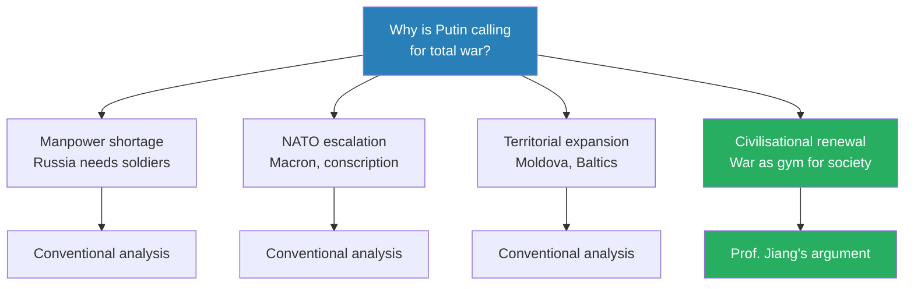
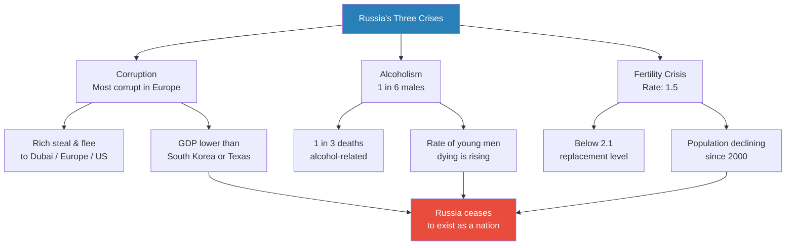
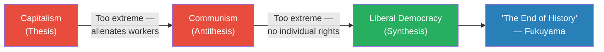
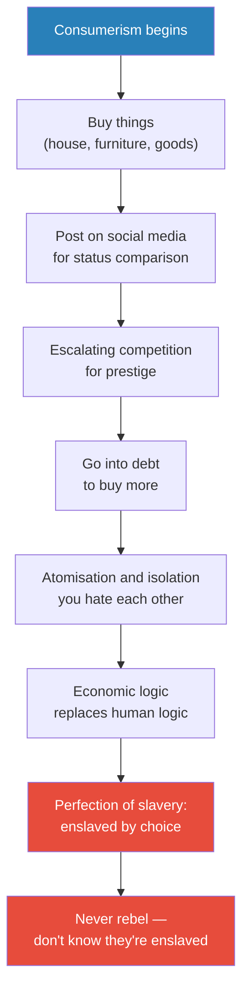
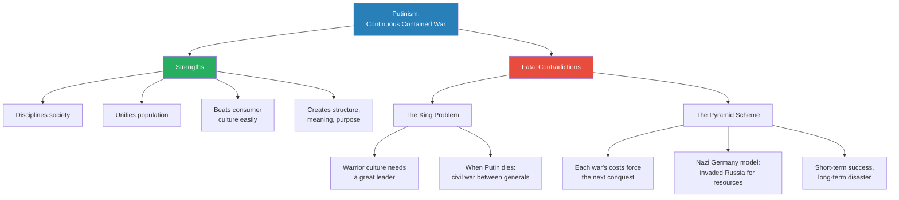

# Putin's War for the Soul of Russia

> Putin recently told all Russians to prepare for total war — even those not fighting in Ukraine. Most analysts assume this is about manpower shortages or NATO escalation. Prof. Jiang argues something more radical: Putin sees war not as a means to conquer Ukraine, but as a mechanism to save Russian civilisation from the spiritual death of consumerism. Russia is a broken society — corrupt, alcoholic, infertile — and Putin believes Western liberal democracy has poisoned the Russian soul. His solution is to replace the consumer (a coward who acts alone) with the warrior (a courageous individual who shapes history through collective action). This ideology — Putinism — holds that continuous, contained war will discipline, unify, and rejuvenate Russian society, and Prof. Jiang predicts it will become the dominant global ideology for the next fifty years.

---

## Overview: Key Highlights

- <b style="color: #27ae60">War is Putin's gym</b> — not about conquering Ukraine, but about transforming Russian society the way exercise transforms a body
- <b style="color: #e74c3c">Russia is dying</b> — corruption, alcoholism, and a 1.5 fertility rate (below the 2.1 replacement level) point toward civilisational extinction
- <b style="color: #2980b9">Hegel's dialectic</b> — capitalism (thesis) → communism (antithesis) → liberal democracy (synthesis) — the intellectual chain Fukuyama used to declare the West had "won"
- <b style="color: #e74c3c">Consumerism is the perfection of slavery</b> — the consumer doesn't know they're enslaved and therefore never rebels; it's a perfect system for elites
- <b style="color: #2980b9">The revolt of the elite</b> — the 1980s Reagan/Thatcher revolution that replaced the worker with the consumer as society's organising unit
- <b style="color: #27ae60">The warrior replaces the consumer</b> — the warrior sees history as shapeable through courage and collective action; the consumer sees only their bank account
- <b style="color: #2980b9">Putinism</b> — the ideology of continuous, contained war as a mechanism for civilisational renewal, not territorial conquest
- <b style="color: #e74c3c">War is a pyramid scheme</b> — each conflict's costs force the next conquest for resources; what works short-term tends toward catastrophe long-term
- <b style="color: #e74c3c">The king problem</b> — warrior cultures require a great leader; when Putin dies, the warrior society fragments into civil war
- <b style="color: #27ae60">Warrior culture beats consumer culture easily</b> — until nuclear weapons impose limits, and until Russia exhausts itself
- <b style="color: #2980b9">Multipolarity</b> — Putinism spreading to Japan, Germany, Britain creates a world with multiple regional hegemons, ending US dominance
- <b style="color: #27ae60">History is determined by those willing to act</b> — only 10% of Russians may support Putinism, but organised minorities always win

| Concept | One-line summary |
|---------|-----------------|
| **Putinism** | The ideology of continuous, contained war as a mechanism for civilisational renewal |
| **The warrior** | Replaces the consumer — sees history as shapeable through courage and collective action |
| **Perfection of slavery** | Consumerism is so perfect that the enslaved choose their chains and never rebel |
| **Hegel's dialectic** | History progresses through thesis → antithesis → synthesis |
| **Fukuyama / End of History** | Liberal democracy is the final synthesis — the end point of political evolution |
| **Revolt of the elite** | 1980s Reagan/Thatcher shift from worker to consumer as the organising unit of society |
| **War as a pyramid scheme** | Each war's costs necessitate further conquest — short-term gain, long-term collapse |
| **The king problem** | Warrior cultures need a great leader; when the king dies, civil war follows |
| **Russia as warrior culture** | Unlike China, Russia has been invaded repeatedly and enjoys war as a cultural identity |
| **Multipolar world** | Multiple regional hegemons replace US unipolarity as Putinism spreads |
| **Organised minority** | History is shaped by determined minorities (10%), not passive majorities (90%) |

---

# The Lecture

## Why Is Putin Calling for Total War? [0:00]

*Prof. Jiang opens with Putin's recent speech telling all Russians to prepare for total war — and immediately identifies the argument he intends to make, separating himself from conventional analysts.*

> [!tip] Core Insight
> Most analysts focus on military necessity. Prof. Jiang argues Putin's real project is civilisational — war is a workout for society, and Putin is using it to reshape the Russian soul, not just win a battlefield.

*Most analysts stop at the military picture. Prof. Jiang argues the real logic is civilisational — Ukraine is a vehicle, not the destination.*

> [!note]- Expand: Full Lecture Detail
> - Prof. Jiang opens with Putin's recent speech declaring that all of Russia must prepare for total war — "even if you are not fighting on the front lines in Ukraine, pretend you are"
> - Total war means every aspect of society is geared towards winning — the last time the world saw this was World War Two
> - He lists three conventional explanations:
>   - **Manpower shortage:** Russia lacks soldiers and needs to fully mobilise society
>   - **NATO escalation:** Macron has publicly considered sending French troops; Britain is debating conscription; US politicians want to offer citizenship to illegal immigrants who join the army
>   - **Territorial expansion:** Putin knows he's winning in Ukraine and is thinking about Moldova and the Baltic states
> - Then Prof. Jiang introduces a fourth explanation — the one he intends to argue: Putin is mobilising society because he sees war as a tool to radically reshape the Russian people
> - His metaphor: "You're fat and you're like, how do I get fit? You go to the gym and work out. For Putin, that's what war is. War is a workout for society. When you enter war, you become a much more disciplined, unified and prosperous society."
> - To understand why Putin thinks this way, Prof. Jiang must first diagnose Russia's crisis — and then build the intellectual history from Hegel to Fukuyama to Putin

---

## Russia Is a Dying Society [~3:00]

*Before explaining Putin's remedy, Prof. Jiang diagnoses the disease: Russia is not merely struggling — on current trends, it will cease to exist as a civilisation.*

*Three separate crises converge on one outcome. Each reinforces the others — alcoholism worsens the fertility crisis; corruption drains the economy that might otherwise fund solutions.*

> [!note]- Expand: Full Lecture Detail
> - Prof. Jiang presents Russia as a society suffering from three interrelated crises that will, if unchecked, cause the nation to cease to exist
>
> **Crisis 1 — Corruption:**
> - Russia is the most corrupt society in all of Europe
> - The rich steal money and then flee to Europe, the United States, or Dubai
> - Result: Russia's GDP is shockingly low — South Korea, with about a third of Russia's population, has a higher GDP
> - The state of Texas alone has a higher GDP than all of Russia
>
> **Crisis 2 — Alcoholism:**
> - One in every six Russian males — about 16-17% — are alcoholics; "they have the disease of alcoholism"
> - One in every three deaths in Russia is caused by excessive drinking
> - The rate of young men dying is increasing steadily
>
> **Crisis 3 — Fertility collapse:**
> - Russia's fertility rate is 1.5 — well below the 2.1 replacement level
> - Combined with male deaths from alcoholism, the population has been declining steadily since 2000
> - "If current trends continue, Russia will cease to exist as a society. The nation will die."
>
> **Two competing explanations for why this is happening:**
> - The democratic explanation: Russia fails because it is not democratic — unleash human potential through freedom and the country will prosper
> - <b style="color: #e74c3c">Putin's explanation:</b> corruption, alcoholism, and low fertility are happening because "Russians have been lied to, deceived and manipulated by Western civilisation"
>   - Western civilisation preaches the gospel of liberal democracy, freedom, human rights, consumerism
>   - "These are all lies. They're hypocrisies that have fooled the Russian people and have corrupted the Russian soul and destroyed Russian civilisation"
>   - Because Russians are abandoning their soul, their civilisation, their nation — that is why they are dying
> - To understand how Putin arrived at this conclusion, Prof. Jiang must trace two centuries of Western political philosophy

---

## The Intellectual History: From Hegel to Marx [~9:55]

*Prof. Jiang teaches two centuries of Western political philosophy to explain Putin's worldview — from Hegel's dialectic to Marx's critique of capitalism to the post-war social compact that the 1980s elite revolt destroyed.*

*Fukuyama's argument in one diagram: Hegel's dialectic moves from capitalism through communism to liberal democracy — and stops there. History is over.*

> [!note]- Expand: Full Lecture Detail
> - In the late 1980s, the Soviet Union collapsed — its elite gave up on communism and decided Western values were simply better
> - American historian <b style="color: #2980b9">Francis Fukuyama</b>, working for the State Department, wrote the hugely influential essay "The End of History" — arguing liberal democracy is the best idea ever invented
> - To make his case, Fukuyama used the philosopher <b style="color: #2980b9">Friedrich Hegel</b> and his **theory of the dialectic:**
>   - A **thesis** (new idea) comes into being — but it has problems, it's too extreme
>   - An **antithesis** emerges to correct it — but this too is too extreme
>   - They merge into a more moderate **synthesis**
>   - This is how history progresses — through the war of ideas
>
> **Fukuyama's application of the dialectic:**
> - **Thesis: Capitalism** → created the Industrial Revolution; but too extreme in its costs
> - **Antithesis: Communism** → created to counteract capitalism's extremes; but itself too extreme
> - **Synthesis: Liberal Democracy** → the moderate middle, the "right idea," the final answer
>
> **The fundamental political problem all societies face:**
> - Throughout history, one question dominates politics: how do you optimise the workforce — get every person to work as hard as possible?
> - Three historical answers: war, religion, and civilisation — all give structure, meaning, and purpose
> - But all three create problems: war kills; religion is "superstitious"; civilisation leads to racism → imperialism → fascism ("the White Man's Burden")
> - Over time, these became more abstract to serve mass society: polytheism became monotheism; then came capitalism — money as the abstract organising principle that drove the Industrial Revolution
>
> **Marx's three critiques of capitalism:**
> - <b style="color: #e74c3c">All-consuming:</b> capitalism only cares about expansion of capital, regardless of human cost — it can lead to destruction of the planet
> - <b style="color: #e74c3c">Consolidating:</b> money consolidates itself — if left unchecked, capitalism ends with one person owning everything
> - <b style="color: #e74c3c">Alienating/dehumanising:</b> in capitalism, you cease to be a complex human — you are only your production value, your bank balance
> - Marx's prediction: capitalism alienates workers → workers develop political consciousness → they organise → they realise capitalists need them → revolution is inevitable
> - Marx was wrong about where it would happen (he predicted industrialised Germany, not agrarian Russia or China)
> - But he was right about the outcome: after World War Two, every industrial society adopted socialist ideas — healthcare, public schools, cheap universities, workers' rights through unions
> - "The 50s, 60s, and 70s was basically the peak of society for the working class"
>
> > [!example] The CEO Pay Revolution: 1970s vs. Today
> > - In the 1970s, the average US CEO made roughly $1 million a year — about 20 times the average worker
> > - Today, the average US CEO makes $20 million a year — 200 to 300 times the average worker
> > - The Reagan/Thatcher revolution of the 1980s destroyed the worker-centred compact
> > - The government's promise shifted: from "I guarantee you a good job for life" to "I guarantee you low prices and a wide selection of goods"
> > **The lesson:** The shift from worker to consumer was not subtle — it was a complete revolution in who society was organised around.
>
> **The revolt of the elite (1980s):**
> - The problem with a worker-centred society: it becomes too egalitarian — and the elite want difference, not equality
> - In the US: the Reagan Revolution — neoliberalism and free market capitalism
> - In the UK: Thatcherism
> - The new organising unit: the **consumer** — replacing the worker

---

## From Worker to Consumer: The Perfection of Slavery [~25:00]

*Prof. Jiang runs a thought experiment — give everyone a million dollars — and shows how consumerism inevitably produces competition, debt, isolation, and willing slavery that never rebels.*

> [!tip] Core Insight
> Consumerism is the perfection of slavery: so effective that the enslaved choose their chains, enjoy them, and never rebel. This is what has happened to the Russian people — and what Putin is fighting against.

*The million-dollar thought experiment traces a single logical chain from consumption → status competition → debt → isolation → chosen slavery. Each step is inevitable given the one before it.*

> [!note]- Expand: Full Lecture Detail
> Prof. Jiang runs a thought experiment with the class: imagine everyone in the school (500 people) receives one million US dollars.
>
> - First, you buy a house
> - Then you buy furniture
> - Then — crucially — you take pictures and post them on social media
> - Everyone else sees your house and wants a bigger one; they post theirs; you want an even bigger one
> - Very quickly: everyone has spent their million and gone into debt to compete
> - End result: "you all go into debt and you all hate each other"
>
> **What consumerism actually does:**
> - Creates competition for prestige — who can post the nicest social media pictures
> - Leads to individualisation: you are unable to act together, unwilling to organise, incapable of solidarity
> - Produces <b style="color: #2980b9">economic logic</b> — seeing the world only through the lens of capital:
>   - "When you see someone: do I want to date this person? You don't ask, is this person nice? You ask, how much money does this person have?"
>
> **Consumer vs. worker — the critical difference:**
> - The worker must have political consciousness to protect their rights — they organise, unify, push for reforms
> - The consumer is atomised: "I'm going to rebel — I'm going to stop buying things? You won't do that."
>
> **The perfection of slavery:**
> - "If you're a slave, you rebel. But you don't know you're a slave, and you like this, you choose this — then you will never rebel."
> - This is why Fukuyama calls consumerism the end of history — it achieves what elites want, while the masses are unable to protest
> - It's a perfect system
>
> **Why Russia specifically is failing:**
> - Certain civilisations intrinsically rebel against slavery — Russia is one of them
> - When you impose slavery on Russians, "they become corrupt, they become alcoholics, and they refuse to have babies"
> - "That is why Russia is failing as a society — because slavery is being imposed on Russians by the Westerners, and the Russians refuse to be slaves"
> - But the system is so perfect that Russians lack the understanding of how to rebel consciously — which is why Russia is falling apart
> - Therefore: Putin must free his people, even if they enjoy their prison — "even though Russians may enjoy slavery, Putin is still going to free his people"

---

## The Warrior: Putin's Answer to the Consumer [~37:00]

*Putin's solution is a new organising concept for civilisation. The warrior replaces the consumer, and war replaces consumerism as the source of structure, meaning, and purpose.*

*Two ways of being human, side by side. The warrior is not just militarised — it is a fundamentally different relationship to meaning, history, and collective action.*

> [!note]- Expand: Full Lecture Detail
> - Putin introduces a new concept to combat consumerism: the <b style="color: #2980b9">warrior</b>
> - "The consumer is a person, an individual, who acts alone and does so to preserve his or her life. The consumer is a coward. The consumer lacks imagination. The consumer is alienated."
> - "The warrior is an individual who sees that through his actions, he or she can shape the direction of history. I can make my own reality through my courage and my imagination and by acting with others."
>
> > [!example] The Island Thought Experiment
> > - Prof. Jiang takes the same 500 students — now hating each other after the consumerism thought experiment — and puts them on an island
> > - On the island: millions of flesh-eating monkeys that want to kill them
> > - Despite hating each other, all differences are immediately set aside — they must cooperate to survive
> > - "How do you feel in this process? You're happy. Why? You're all working towards a single structure, meaning and purpose."
> > - Then someone (Celine) dies in the battle — the group honours her, celebrates her, and fights harder
> > - "Death gives you purpose. Her death makes your life much more valuable to you and to others."
> > - A soldier then faces a choice: cut the bridge and save 10 others, or run and risk everyone dying
> > - "For sure he will sacrifice himself. We've seen this in war over and over."
> > **The lesson:** War transforms atomised, mutually hostile individuals into a unified community willing to sacrifice everything. That is the logic Putin is deploying on Russian society.
>
> **The evidence from Russia since February 2022:**
> - Russia's economy has survived US sanctions and is getting stronger — because people are fully participating
> - Monthly ammunition production: Russia produces 150,000 artillery shells per month; the US was producing roughly 2,000 at the time
> - <b style="color: #27ae60">When a society has structure, meaning, and purpose: corruption goes down, alcoholism goes down, fertility goes up</b>
>
> > [!quote] Vladimir Putin (as quoted by Prof. Jiang)
> > "When they die on the battlefield, we honour them — but if we let them do whatever they want, all they do is drink themselves to death."
>
> - Putin's framing: war is "an opportunity for society to cut away the fat, to make itself more lean"
> - "For Putin, this war — it's not really about conquering Ukraine or defending against NATO. It's really about saving Russian civilisation. It's really about saving the Russian soul."

---

## Putinism: The Ideology and Its Contradictions [~43:16]

*Prof. Jiang names and defines Putinism — continuous, contained war as civilisational renewal — and then identifies its two fatal internal contradictions that will likely prevent Russia from triumphing in the multipolar world it is helping to create.*

*Putinism has real strengths in the short run — but both fatal contradictions flow from the same root: the system requires constant growth it cannot sustain indefinitely.*

> [!note]- Expand: Full Lecture Detail
> - <b style="color: #2980b9">Putinism</b> — "the idea of continuous war, that as a society you should be constantly fighting wars in order to discipline, unify your nation, and make your people stronger and more prosperous"
> - "We don't care about the other people. We care about ourselves. We're using war as a mechanism to discipline our bodies — just like the gym."
> - This is a direct response to liberal democracy — a shift from a society based on the consumer to one based on the warrior
> - Prof. Jiang predicts: "This will be Putin's defining legacy. Putinism will become the dominant ideology for the next 50 years."
>
> **Why contained wars — the nuclear constraint:**
> - Key constraint: nuclear weapons — if the US and Russia fight a ground war in Europe, escalation can lead to nuclear exchange
> - "One of the major tenets of Putinism: you pick small, contained conflicts. Ukraine is a small, contained conflict. An invasion of France or Britain would lead to nuclear war."
> - "World leaders are all insane, but they're not stupid. They're happy to kill millions of people. They're not happy to blow up the world."
>
> **Fatal Contradiction 1 — The King Problem:**
> - A student (Jack) asks: can't war exhaust society, as it did Athens, Sparta, and in the World Wars?
> - Prof. Jiang: warrior culture requires a great leader — "words fight best when there's a king. That's why we have kings."
> - "What's the problem with Putin's Russia? Eventually Putin's going to die. And then what happens? The country's going to fall apart."
> - A warrior culture without a king: generals fight each other for total control — civil war
> - "Putin right now is a strategic genius. He's the king. Everyone admires him. He unites everyone. When he dies, this society is going to fall apart."
> - <b style="color: #e74c3c">"Putin's legacy will not be a strong Russia — it will be Putinism, the idea. Russia may not survive Putin."</b>
>
> **Fatal Contradiction 2 — The Pyramid Scheme:**
> - War is expensive — after Ukraine, Russia will need to conquer more territory for resources to fund the next conflict
> - This was the Nazi Germany problem: fighting wars cost money, so they were forced to fight more wars — which led to the invasion of Russia for resources and manpower
> - "In the long term, this could lead to disaster — a large-scale war. But in the short term, it does work."
>
> **Russia as a warrior culture — why it's different from China:**
> - A student (Selena) asks: won't Russians eventually get exhausted by continuous war?
> - Putin's belief: "Russians are a warrior culture. Russians enjoy war. Russians are good at war — they'll be galvanised and energised by it, not exhausted."
> - Prof. Jiang compares: Germans and Japanese are warrior cultures — thousands of years of fighting, and they're good at it
> - <b style="color: #e74c3c">"China is not a warrior culture. It's very hard for Chinese to fight wars. China would probably lose most wars."</b>
>   - China has been the dominant hegemon for most of its history, surrounded by natural defences — no invasion culture
>   - Russia has been invaded repeatedly, traumatically (20 million dead in 1941-45) — people still celebrate that war
>
> **The multipolar world:**
> - <b style="color: #2980b9">Multipolar / multipolarity</b> — multiple centres of power throughout the world, rather than US unipolarity
> - "Warrior culture beats consumer culture easily — Europeans are like: I'm too busy watching TV, buying things, vacationing."
> - Eventually Russia will directly threaten Germany, France, and Britain — and they will start to transition into war cultures too
> - Japan, Germany, and Britain could all adopt Putinism
> - Over the next 10-20 years: a multipolar world where each region has different hegemons

---

## Who Actually Agrees with Putinism? [~58:50]

*A student asks how much of Russia supports Putin's project. Prof. Jiang gives a number — and draws a universal lesson about how history is always shaped by organised minorities, never by passive majorities.*

> [!note]- Expand: Full Lecture Detail
> - A student (David) asks: how much of Russian society actually agrees with Putin?
> - Prof. Jiang: "At most — and I think this is generous — you have 10% who are like, 'Putinism is a great idea, let's go conquer the world.' Most people are like: we want peace, we want to live our lives, I have children, I don't want to send them to war."
> - <b style="color: #27ae60">"History is determined by those who are determined to act in unison. It's usually the most extreme individuals who get their way."</b>
> - The Israel lobby: less than 1% of the American population, but organised, determined, effective
> - Same pattern in Russia: the willing 10% shapes the direction for the unwilling 90%
>
> - Another student asks: does the majority have to sacrifice their children for the will of 10%?
> - Prof. Jiang: war itself changes this equation — "war unifies people"
> - Example: Ukraine before the invasion had roughly 50% Russian speakers, with at least a third sympathetic towards Russia
> - "The moment Putin invaded, they all united under Zelensky"
> - War makes a population into a family — back to the island analogy: even people who hate each other will cooperate when there are flesh-eating monkeys
>
> > [!example] Ukraine's Unification Under Invasion
> > - Before February 2022: roughly 50% of Ukraine's population were Russian speakers
> > - A substantial minority — perhaps a third — were sympathetic to Russia
> > - After Putin's invasion: the entire country unified behind Zelensky, regardless of prior sympathies
> > - People who might have been ambivalent about Ukrainian nationalism became willing to fight and die for it
> > **The lesson:** War is the most powerful unifying force in politics. Putin understood this — but it works for the defender as well as the attacker.

---

## Why Putin Fights: Civilisational Defence, Not Conquest [~1:00:21]

*Prof. Jiang closes the lecture's argument by framing the Ukraine war inside the larger logic of civilisational survival — and previews Lecture 10.*

> [!note]- Expand: Full Lecture Detail
> - "Putin believes that Russia is first and foremost a great civilisation, but as a great civilisation, it also has to fight wars to protect itself."
> - Putin's framing: "If America left us alone, we would not fight wars. It's only because America insists on encircling us, insists on trying to destroy our culture and civilisation, that we must fight."
> - The NATO argument: NATO was set up as a defensive alliance against the Soviet Union — once the Soviet Union fell, why did it expand five times?
>   - NATO was going to expand into Ukraine — Putin sees the invasion as a defensive act, not conquest
> - "We are fighting this war ultimately to defend our civilisation. That's what matters — the defence of our civilisation."
>
> **A student clarifies: capitalism vs. liberal democracy**
> - Celine asks: how is capitalism different from liberal democracy?
> - "Capitalism is only concerned about capital. You can be a fascist country and be capitalistic — the Nazis were extremely capitalistic."
> - The idea of liberal democracy is the participation of everyone in the generation of capital
> - <b style="color: #e74c3c">"Capitalism and democracy are opposing forces — and the idea of liberal democracy is to put the two together in a synthesis, to explain away or ignore the contradictions."</b>
>
> **Warrior culture vs. slavery — a final distinction:**
> - A student asks: isn't war culture also a form of slavery?
> - Prof. Jiang: it's actually the opposite — "warriors can rebel. Warriors can mutiny. The army can be like, 'You guys are terrible — we're going to march to Moscow and get rid of him.'"
> - Consumers won't rebel: "I'm going to stop buying things? You'll never say that."
> - <b style="color: #e74c3c">This reveals Putinism's deepest contradiction: war culture is a direct threat to political leaders, because warriors can and do revolt against bad rulers</b>
> - This is why war culture was dominant before and then suppressed — for political elites, consumer culture is far safer
>
> **Preview of Lecture 10:**
> - "Next week, we'll talk about Putin's strategic genius — and what I will show you is that the way that Russians see the world is rather different from the way we see the world."
> - Lecture 9 established WHY Putin fights — civilisational renewal through war
> - Lecture 10 will show HOW Putin thinks strategically — the Russian worldview

---

## Connections

**Builds on:** [[01 - Iran's Strategy Matrix]] (asymmetric warfare; weak powers controlling the terms of engagement — Russia frames Ukraine the same way Iran frames the US), [[03 - How Empire is Destroying America]] (imperial overextension — the pyramid scheme logic applies to Russia too), [[06 - America's Imperial Hubris]] (hubris vs. Putin's strategic realism in choosing contained rather than total conflicts)

**Sets up:** [[10 - Putin's Strategic Imagination]] (Lecture 9 explains WHY Putin fights; Lecture 10 explains HOW he thinks — "the way Russians see the world is rather different from the way we see the world")

**Related books in vault:** [[Sapiens - Yuval Noah Harari]] (how abstract ideas — money, nation, religion — organise human groups; the evolution from concrete to abstract that Prof. Jiang traces here from religion to capitalism to consumerism), [[The 48 Laws of Power - Robert Greene]] (Law 25: Re-Create Yourself — Putin recreating Russian identity through war)

**Series-wide theme — organised minorities:** The Israel lobby (Lecture 2), dispensationalist Christians (Lecture 2), the IRGC (Lecture 7), Putin's 10% of warrior-minded Russians (this lecture) — the same pattern of determined minorities shaping history against the wishes of passive majorities recurs throughout the series.

**Series-wide theme — war, religion, and civilisation:** The three organising principles identified here — war, religion, civilisation — are the same forces that drove the formation of early human societies in the Civilization series. The Geo-Strategy series shows how these same three forces continue to drive geopolitics today: religion in Iran (Lectures 2 and 7), civilisation in Russia (this lecture), war everywhere.

---

## The Takeaway

This lecture is the most philosophically ambitious in the Geo-Strategy series. Where earlier lectures analysed specific conflicts and strategic calculations, Lecture 9 steps back to ask the biggest question in geopolitics: what is a civilisation for? Putin's answer — that a civilisation exists to give its people structure, meaning, and purpose, and that war is the most effective mechanism for doing so — is not original. It echoes Sparta, the samurai code of Japan, and Prussian militarism. What makes it new is the intellectual context: Putinism emerges as a direct response to consumerism, which is itself the culmination of two centuries of Western ideological evolution from Hegel through Marx to Fukuyama. Putin is not simply a nationalist — he is a philosopher of civilisation, even if an extremely dangerous one.

The most counterintuitive insight is that consumerism's greatest strength is also its greatest vulnerability. The "perfection of slavery" — the fact that consumers don't know they are enslaved and therefore never rebel — means that consumer societies cannot mobilise when genuinely threatened. "The Europeans are like: I'm too busy watching TV, buying things, vacationing." This is why warrior culture beats consumer culture easily in the short term. The existential question for the West is not whether Putinism is morally right (it is not) but whether consumer societies can generate purpose and sacrifice without becoming warrior societies themselves.

The lecture's deepest unresolved tension is whether Putinism is a genuine civilisational renewal or simply a more sophisticated form of imperial overextension. Prof. Jiang identifies both fatal contradictions — the king problem and the pyramid scheme — but does not resolve which will dominate: will Putinism spread and reshape the world before Russia collapses, or will Russia's collapse discredit the ideology before it takes root elsewhere? The series' greatest provocation may be that Putin is not wrong about the diagnosis — even if his cure is worse than the disease.
