# Putin's Strategic Imagination

> Prof. Jiang opens by connecting to Lecture 9 — Putin loves Russia, believes Western consumerism has corrupted it, and recognises the American Empire as the source. The logical conclusion: to free his people, Putin must destroy the Empire. This lecture reveals the operational plan: five simultaneous pressure fronts exploiting the three structural weaknesses that kill every empire — overextension, debt, and civil discord. The second half delivers the historical proof case: Stalin's manipulation of World War Two, which most historians call a disaster but which game theory reveals as the most brilliant strategic play of the 20th century. Both men are products of the same Russian philosophical tradition — broad, mystical, intuitive — that the Western bureaucratic mind is structurally incapable of recognising, let alone countering.

---

## Overview: Key Highlights

- <b style="color: #2980b9">Three ways empires die</b> — overextension (hubris-driven blindness), debt (exorbitant privilege turned trap), and civil discord (binding myths collapsing)
- <b style="color: #27ae60">Putin's five-front strategy</b> — Ukraine (drain), Iran (distract), North Korea (divert), BRICS (undermine dollar), China neutrality (prevent triangulation)
- <b style="color: #e74c3c">America destroyed its own ally</b> — blowing up Nord Stream and launching a China trade war collapsed the German economy, fracturing NATO without Putin firing a shot
- <b style="color: #2980b9">Russian nuclear umbrella</b> — Putin's guarantee to Iran and North Korea that enables their provocations without fear of American nuclear retaliation
- <b style="color: #27ae60">BRICS doesn't need to replace the dollar — it only needs to threaten</b> — money is confidence, and confidence can be destroyed without a replacement
- <b style="color: #e74c3c">Game theory 1939: the world should have united to destroy the Soviet Union</b> — every major power had reasons to, and the USSR was militarily weak
- <b style="color: #27ae60">Scenario D was the only winning move</b> — of four possible outcomes, only Germany attacking and nearly winning forced the world to help the Soviet Union
- <b style="color: #2980b9">Lend-Lease ($200 billion, free)</b> — America was forced to industrialise its ideological enemy, giving the Soviets half their aircraft, half their tanks, 80% of their copper
- <b style="color: #27ae60">"Stalin played Hitler, not the other way around"</b> — the three words "I trust you" triggered Hitler's predatory instincts and ensured Germany attacked first
- <b style="color: #2980b9">Three elements of Russian strategic imagination</b> — intuition (sensing the Zeitgeist), imagination (prophesying how actions reshape the future), multiple personalities (genuine unpredictability)
- <b style="color: #e74c3c">The bureaucratisation of the imagination</b> — British empiricism, narrow focus, and logic create a system that cannot recognise or counter strategic genius
- <b style="color: #27ae60">We live in a Roman world, not a Greek world</b> — Rome's systematising impulse, not Greece's mystical imagination, is the West's true inheritance

| Concept | One-line summary |
|---------|-----------------|
| **Hubris** | Military blindness — to your own limits, your opponent's strategy, and the overall picture |
| **Exorbitant privilege** | Bretton Woods 1945 gave America the right to "manufacture gold from nothing" |
| **BRICS+** | Brazil, Russia, India, China, South Africa + Saudi Arabia, UAE, Bahrain — a confidence weapon against the dollar |
| **Russian nuclear umbrella** | Putin's guarantee to protect Iran and North Korea from US nuclear response |
| **Molotov-Ribbentrop Pact** | Stalin's 1939 deal with Hitler to partition Poland — redirected global hostility onto Germany |
| **Lend-Lease** | $200 billion in free American aid that transformed the Soviet Union into a superpower |
| **Great Patriotic War** | How Russians understood WWII — fighting for mother Russia, not for communism |
| **Zeitgeist** | Spirit of the times — the intuitive sense of where history is heading |
| **Multiple personalities** | The ability to genuinely become a different identity, not merely act one |
| **Empiricism** | David Hume's philosophy — we can only know what we experience; limits imagination |
| **Pre-Augustinian Christianity** | Russia's claimed older, more mystical Christianity that preserved Greek intuition |
| **Scenario D** | Germans attack and nearly destroy the Soviet Union — the only outcome where the world helps |

---

# The Lecture

## Putin's Plan to Destroy the American Empire [0:00–7:00]

*Prof. Jiang opens by connecting directly to Lecture 9 and presenting the structural framework that governs the entire lecture — three concurrent weaknesses that kill every empire, all of which Putin is actively targeting.*

> [!tip] Core Insight
> Each weakness feeds the others: overextension creates debt, debt creates public anger, public anger creates civil discord, civil discord prevents unified response, which accelerates overextension. When all three reach a tipping point simultaneously, the empire dies — and the most likely outcome for America is civil war.

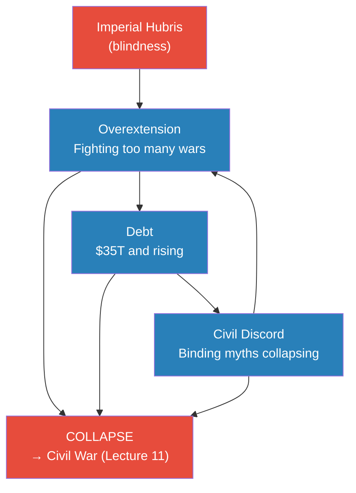
*The three weaknesses reinforce each other in a cycle. Putin's strategy is to push all three past the tipping point simultaneously.*

> [!note]- Expand: Full Lecture Detail
> Prof. Jiang opens with a direct callback: last class, we established that Putin loves Russia, believes Western consumerism has corrupted it, and recognises the American Empire as the source. Logical conclusion: "In order to completely free its people, he needs to destroy the Empire."
>
> He then lays out the structural framework — historically, empires die when three things happen concurrently:
>
> **Weakness 1 — Overextension:**
> - The main reason empires die is fighting too many wars at once
> - The cause is <b style="color: #e74c3c">hubris</b> — and Prof. Jiang is precise: hubris in military strategy means blindness
>   - Blind to your own limitations
>   - Blind to the strategy of your opponents
>   - Blind to the overall geopolitical picture
>   - "You're just blind"
> - Contemporary example: America is fighting Russia in Ukraine, fighting Hamas via Israel, facing the Iranian threat — while most policymakers believe "the real threat is China" and announcing tariffs on Chinese electric vehicles
> - "America is antagonising Russia, Iran, China at the same time. And so that's just overextension because of hubris"
>
> **Weakness 2 — Debt:**
> - The source of American power (the dollar as reserve currency) becomes the source of its destruction
> - The 1945 Bretton Woods agreement gave America <b style="color: #2980b9">exorbitant privilege</b>: "America has the right to manufacture gold from nothing, and the world has to buy it, because that's what underpins global trade"
> - But when money falls from the sky: "your nation becomes fat, lazy and corrupt"
> - "All America does right now is print money and not make money"
> - Current US debt: $35 trillion
> - BRICS+ now includes Saudi Arabia, UAE, and Bahrain — the petrodollar nations. If they opt out of the US financial system, "this American mountain of debt comes crashing down"
>
> **Weakness 3 — Civil Discord:**
> - The binding myths and stories that hold a nation together are collapsing
> - "Young people no longer believe that America is the source of good in this world"
> - Gaza: "Israel right now is committing genocide in Gaza... most people who are dying in this war are children, and America is not doing anything to stop this. In fact, America is the one who is providing Israel with all the weapons"
> - "One quarter of young Americans now believe that Osama bin Laden was a good guy" — when Prof. Jiang grew up, bin Laden "was considered Satan"
> - "The ideas and the myths that bind the country together are falling apart, and that's what's causing the nation to fall apart"
>
> The interconnection: "The more overcommitted America is, the more debt it creates, and the more civil discord it creates."

---

## The Ukraine War: Front One [8:05–15:00]

*Prof. Jiang walks through the three predictions America made in February 2022 — and shows how all three have reversed. Ukraine is not a battlefield in the traditional sense; it is a strategic drain designed to simultaneously increase American overextension, debt, and civil discord.*

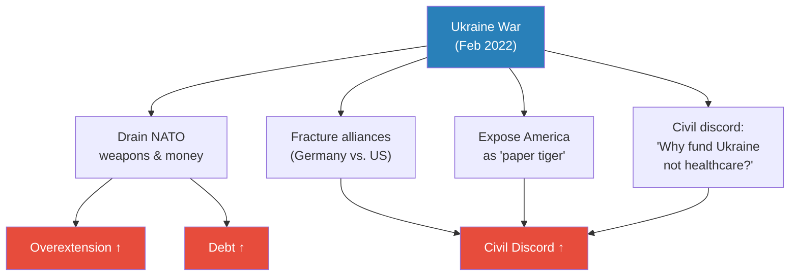
*Ukraine simultaneously worsens all three empire-killing weaknesses. The key strategic insight: Putin drags the war on but will not expand it — attacking Poland forces NATO to unite, the opposite of what he wants.*

> [!note]- Expand: Full Lecture Detail
> Prof. Jiang recalls what America predicted when Putin invaded in February 2022:
>
> | American Prediction | What Actually Happened |
> |--------------------|-----------------------|
> | Ukraine destroys the Russian army, perhaps marches to Moscow | Russia won through attrition — Ukraine lost ~500,000 men, has no more manpower |
> | Sanctions destroy the Russian economy | Russian economy doing well — countries need oil and food, Russia has both; war economy expanding |
> | NATO becomes stronger and more united | NATO more divided — especially Germany, whose economy is collapsing |
>
> On the military reversal: "If you don't have manpower, you're not going to be able to fight this war."
>
> On sanctions failure: "Ultimately, all economies — China, India, Europe, Africa, Middle East — they all need resources in order for their economies to work. You need oil, you need food. And Russia has a lot of oil and food." Countries made side deals.
>
> On NATO fracture — the German economy:
> - The formula was simple: buy cheap Russian gas → manufacture cars → sell to China
> - America blew up the Nord Stream pipeline, cutting off the cheap energy
> - America imposed a trade war on China, destroying the export market
> - "So basically the German economy is about to collapse, and Germans are very angry about this"
>
> On civil discord at home: "The majority of Americans are asking the question, why are we giving Ukraine hundreds of billions of dollars when our people don't even have health insurance?"
>
> On overextension: "In order to give Ukraine weapons, what America is doing is basically taking weapon systems from Japan, in South Korea and other places, and giving it to Ukraine. America is not manufacturing more weapons. It's just taking other weapon systems it has elsewhere and moving it to Ukraine. So America is badly overextended."
>
> The strategic logic of dragging but not expanding:
> - Ukraine is "a black hole for NATO" — NATO is pouring in money, weapons, and manpower and losing it all
> - If Putin attacks Poland, all of NATO is forced to fight — the opposite of what he wants
> - "Germany does not want to fight this war. Germany wants out. So as long as this war keeps on going, it's going to create more friction between NATO and United States"
>
> > [!example] October 7 and Gaza as Putin's Second Win (October 2023)
> > - Hamas launched an attack on Israel killing about 1,000 people; Israel responded by attacking Gaza
> > - "America, right now, is helping Israel commit genocide. So the entire world is basically turning against America"
> > - America has shown it cannot control its own ally: "people say that Israel now controls America"
> > - "At any point, Iran can enter the battle. Hezbollah can enter the battle from the North. It's a powder keg. It's like a lake of gasoline about to be lit on fire"
> > - Prof. Jiang: "You can make the argument that either Putin knew about the Hamas attack or even encouraged the attack, because the main winner of this Hamas attack is obviously Vladimir Putin, and the loser is America"
> > **The lesson:** Whether or not Putin orchestrated October 7, the outcome perfectly serves his strategy — diminished American prestige, exposed inability to control allies, and accelerating civil discord at home.

---

## Fronts Two, Three, and Four: Iran, North Korea, BRICS [16:07–24:00]

*Prof. Jiang maps the three additional pressure fronts that multiply the effect of Ukraine. The key mechanism: a Russian nuclear guarantee that enables two proxy actors (Iran and North Korea) to provoke America without fear of nuclear annihilation.*

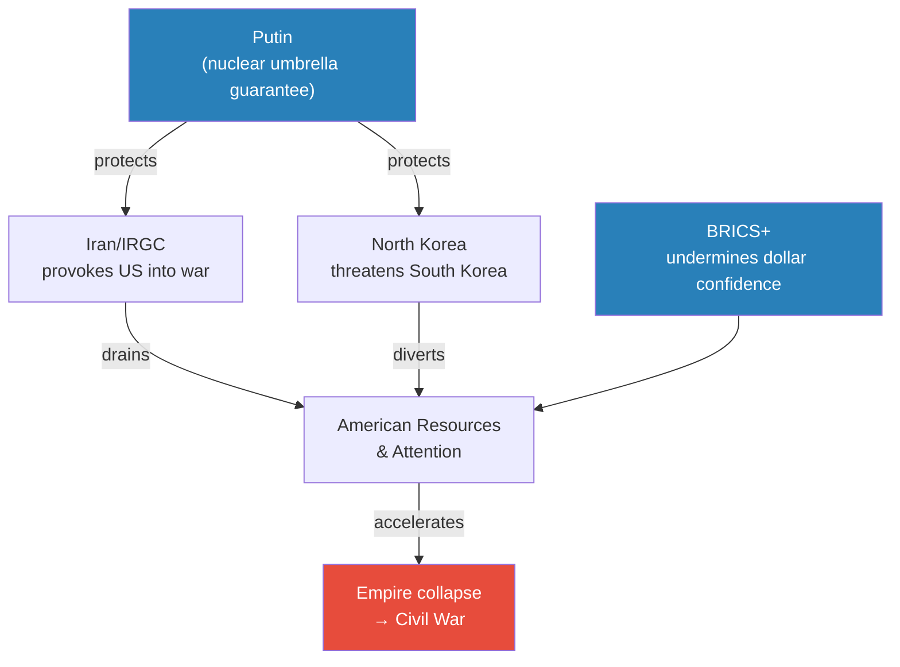
*Putin pays almost nothing — the cost is borne by the local actors and by America itself. This is asymmetric warfare at the civilizational level.*

> [!note]- Expand: Full Lecture Detail
> **Front 2 — Iran:**
> - "To control the situation in Ukraine, he needs America to fight another war. He needs to distract America, and the distraction will be Iran"
> - The mechanism: Putin talks to Iran and guarantees the <b style="color: #2980b9">Russian nuclear umbrella</b> — "if America uses nuclear weapons when it invades Iran, Russia will respond with nuclear weapons of its own"
> - With this assurance, Iran takes the initiative and provokes America into a wider war
> - Tools available: Hezbollah attacks on Israel, nuclear programme expansion, Red Sea shipping disruption
> - The two arcs of the series converge: "Remember how for the past few classes, we've been discussing how America wants to attack Iran, and Iran wants revenge against America"
>
> **Front 3 — North Korea:**
> - As America becomes distracted in Ukraine and Iran, North Korea can threaten to invade South Korea and the ~30,000 US troops stationed there
> - "North Korea doesn't actually have to do anything, but the threat of North Korea will force America to divert resources to South Korea"
> - The threat may even force the US and South Korea to bribe North Korea — transferring wealth and legitimacy to the very actor creating the problem
> - Putin has given North Korea the same nuclear assurance as Iran
> - Classic overextension: America is now simultaneously stretched across Europe, the Middle East, and East Asia
>
> **Front 4 — BRICS:**
> - "We will see BRICS continue to expand. We will also see BRICS maybe formally announce a new currency or a new trading system to counteract the American-led system"
> - The standard objection: "BRICS is not capable of replacing the US dollar. And that is true"
> - But: "BRICS doesn't, it doesn't have to actually replace the US dollar. It just has to threaten, because a lot of finance, a lot of money, it's just confidence. You have the US dollar because you're confident that it's valuable. But once you lose the confidence in US dollar, you will no longer want to use it"
> - Petrodollar nations (Saudi Arabia, UAE, Bahrain) have already joined BRICS — if they opt out of the US financial system, $35 trillion of debt becomes unsustainable

---

## Front Five: China's Neutrality [24:00–28:00]

*The subtlest front — and the one that reveals why China has no choice. Putin doesn't need China to do anything aggressive. He only needs China not to work with America.*

> [!tip] Core Insight
> The one strategy that could save the American Empire is triangulation with China against Russia. If China sides with America: Putin must defend the Russia-China border, America's overextension eases, and Chinese dollar purchases sustain the debt. As long as China stays neutral, none of this happens — and Putin can focus entirely on the offensive.

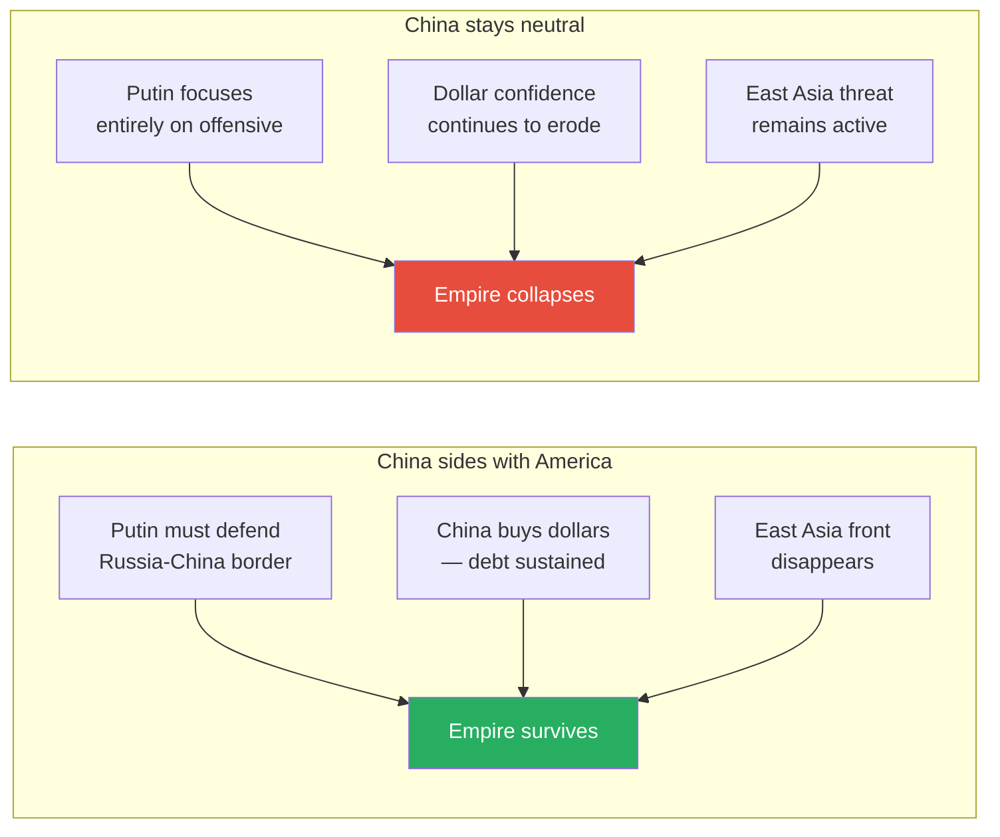
*Neutrality, not alliance, is what Putin needs from China. America's own hostility toward China is doing the work of pushing China toward Russia.*

> [!note]- Expand: Full Lecture Detail
> - "Putin will come to China more often, and he and Xi Jinping will hug each other more"
> - "If you look at game theory, there are lots of geopolitical differences between Russia and China, much more so than between China and United States"
> - But Putin doesn't need China as an active ally — only as a non-participant in American strategy
>
> Why China has no choice (Jack's question):
> - United States is launching an economic war against China
> - "If you look at a map, China is surrounded by US military bases"
> - China needs imports of oil and food to sustain its economy — "if America ever launches an embargo against China, China collapses"
> - China needs new trade routes: "the only way, and the best partner right now is Russia, because it has a lot of access to energy and oil"
> - "Chinese policymakers know that the situation in China is terrible. The economy has collapsed, demographics has collapsed. China is completely dependent on the world for oil and food"
> - "If America says to the world China is our enemy, then China has no choice but to find a new friend. And unfortunately, the only friend that China has right now is Russia"
>
> Peter's observation: China is no longer buying US dollars and is transferring reserves into gold. Prof. Jiang confirms: "China is encouraging everyone to buy gold. Don't buy any more US dollars." This independently weakens the US financial system.
>
> > [!example] The Taiwan Question — Hubris in Action
> > - Celine asks: why does the US think China will attack Taiwan?
> > - Prof. Jiang: "America is always looking to start new wars. It has something called the military-industrial complex, and America is always fighting wars"
> > - "Right now, the relationship between United States and China is China sends America a lot of cheap goods, and the US gives China a lot of US dollars... the Communist Party is storing the wealth of the Chinese people in American banks. This is a great deal for both America Wall Street and the Chinese Communist Party"
> > - What does America actually lose if China takes Taiwan? "Not that much. You make the argument that Taiwan has a semiconductor industry, but guess what? You can move that semiconductor industry elsewhere"
> > - "For America, it's the Empire. It has hubris, and therefore it must save face"
> > **The lesson:** The gap between actual strategic interest (minimal) and perceived imperial necessity (total) is itself a manifestation of hubris.

---

## The Russian Strategic Mind: The Case of Joseph Stalin [29:00–36:00]

*Prof. Jiang pivots to the lecture's second half with a bold claim: Putin's plan makes him look like a genius, but this is not personal genius — it is a product of Russian strategic culture. The proof case is Joseph Stalin's manipulation of World War Two. To understand what Stalin did, you must first understand the board he was playing on in 1939.*

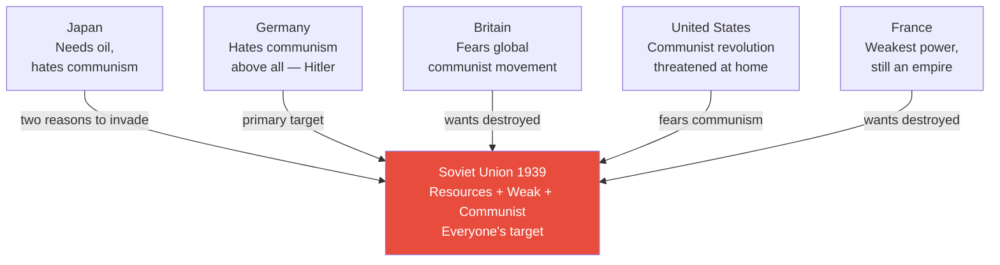
*In 1939, using game theory, every major power had reasons to destroy the Soviet Union. The predicted outcome: partition and the end of global communism. That is not what happened.*

> [!note]- Expand: Full Lecture Detail
> Prof. Jiang maps the six global powers in 1939:
>
> - **United States:** Far away, neutral, isolationist, suffering the Great Depression — and crucially: "America was on the brink of revolution. The communists could have at any time took over America if America failed to stop the economic bleeding"
> - **Japan:** A war machine reliant on imports. Needs oil from either the Soviet Far East or Southeast Asia. US is angry about Japan's invasion of China and will likely cut exports. "Japan has a choice: you can either invade here or you invade here"
> - **Germany:** Hitler wants to reunite Greater Germany. "What did Hitler believe about Jews? They control the world economy. But there's actually a better reason why he hated Jews — they were all communists. Hitler thought that all Jews were communists. So Hitler hated first and foremost communism. Nazism hated communism the most."
> - **UK/Britain:** Empire with global colonies, wants communism destroyed
> - **France:** Weakest power, still an empire, wants communism destroyed
> - **Soviet Union:** Huge, communist, trying to industrialise but still agricultural. "The Soviet Union doesn't really have that much technology and expertise"
>
> The game theory conclusion: "In 1939, using game theory, the Soviet Union should have been destroyed. These powers would have invaded the country together and colonised the Soviet Union and destroyed the threat of global communism once and for all."
>
> That is not what happened.

---

## The Molotov-Ribbentrop Pact and Operation Barbarossa [37:00–43:00]

*Stalin's first move — signing the pact with Hitler — redirected global hostility onto Germany. The second move — appearing to trust Hitler completely — ensured Germany attacked the Soviet Union first rather than waiting for the obvious Soviet attack.*

> [!note]- Expand: Full Lecture Detail
> **The Molotov-Ribbentrop Pact (1939):**
> - Stalin signed an agreement with Hitler to partition Poland
> - Germany attacked from the west, the Soviet Union from the east
> - Britain and France declared war on Germany — "but not the Soviet Union. That's pretty clever, Stalin, don't you think?"
> - The pact also committed the Soviet Union to supply Germany with oil, food, and Ukrainian grain — the resources Hitler needed to fight the western war
> - "If this thing was not signed, Hitler would not have attacked Poland"
> - With France defeated and Britain isolated, Germany was trapped in a western war. The Soviet Union, meanwhile, had expanded its territory while remaining at peace with everyone
>
> > [!example] Rudolf Hess's Peace Mission (May 1941)
> > - After defeating France and driving Britain back to its island, Hitler tried to make peace with Churchill — seven times
> > - Churchill refused every time: "go to hell. We're going to fight this war till the end"
> > - Why? "Because Germany destroyed the British Army. It's a complete loss of faith for the British Empire"
> > - Hitler even sent his emissary Rudolf Hess to Scotland to negotiate a truce
> > - Churchill put Hess in prison
> > **The lesson:** Churchill's fury made a Western peace with Germany impossible — ensuring Germany remained trapped in a western conflict and could not simply wait for Stalin to attack first.
>
> **Operation Barbarossa — the conventional narrative:**
> - June 1941: Hitler invades the Soviet Union
> - The standard history says Stalin made four catastrophic mistakes:
>   - Refused to defend the border: 4-5 million Soviet troops given direct orders "not to provoke the Germans. The Germans fire, you don't fire back"
>   - Ignored massive intelligence — German soldiers literally deserted, swam across the river, told the Soviets the entire army was about to attack. "The Soviets shot these German soldiers because they thought they were spies"
>   - Purged the Red Army of its top generals for political disloyalty
>   - Root cause: Stalin trusted Hitler — "the ultimate mistake"
>
> Prof. Jiang: "This is completely wrong. This analysis is completely wrong."

---

## Stalin's Four Scenarios: Game Theory Rewrites History [43:00–51:00]

*Prof. Jiang presents the lecture's most provocative argument: Stalin's seemingly disastrous decisions were the only rational strategy available. There were four possible scenarios for June 1941. Only one produces a Soviet victory — and that is exactly what happened.*

> [!tip] Core Insight
> "In history, you're taught that Operation Barbarossa proved that Stalin was not a strategic genius, that he was played by Hitler. But if you just do game theory analysis, this was the best possible outcome for the Soviet Union." In 1939, the world should have united against the Soviet Union. Instead, the world united against Nazi Germany and gave the Soviet Union the technology, money, and resources to become a global superpower.

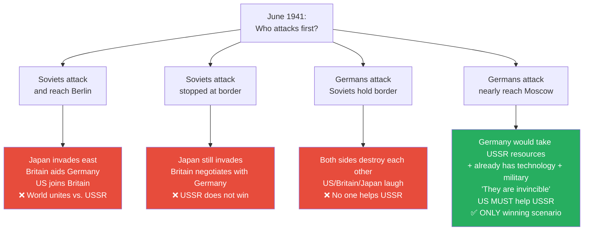
*Of four possible outcomes, only Scenario D forces the world to help the Soviet Union. This is what happened. Prof. Jiang argues it happened by design.*

> [!note]- Expand: Full Lecture Detail
> "There were four to five million Soviet troops at the border. What were they doing there? They were about to attack Germany. The Soviets had a plan to attack Germany, but the Germans struck first."
>
> Prof. Jiang walks through each scenario:
>
> **Scenario A — Soviets attack first and reach Berlin:**
> - Japan comes from the east
> - Britain comes to Germany's aid
> - United States comes to Britain's aid
> - "All the world unites against the Soviet Union. So what would happen in this war? The Soviet Union loses."
>
> **Scenario B — Soviets attack but are stopped at the border:**
> - Japan still invades from the east
> - Britain negotiates peace with Germany — "Britain cannot afford for the Soviet Union to overrun Germany, because then communism takes over Europe"
> - "B is not that good either"
>
> **Scenario C — Germans attack but Soviets hold them at the border:**
> - "United States, Britain, Japan, they're all laughing. They're like, oh, they're just killing each other. Who cares?"
> - No one helps the Soviet Union
>
> **Scenario D — Germans attack and nearly destroy the Soviet Union:**
> - "Now the other countries MUST come and help the Soviet Union. Why? If Germany takes over the Soviet Union — they take over the resources, therefore they take over the world. Germany has technology, it has military power, but it lacks resources. You combine the resources with the German military, they are invincible."
> - "The United States will be forever shut out of the world. Germany will not invade the United States. The United States would never, ever attack Germany again."
> - America has no choice: it must prevent German victory even if it means building up its ideological enemy

---

## Lend-Lease and National Unity: What Scenario D Produced [49:00–52:00]

*After Germany invaded and the Soviet Army was nearly destroyed, America immediately began the Lend-Lease programme — industrialising its ideological enemy at a cost of $200 billion. And the second benefit was even more important than the weapons.*

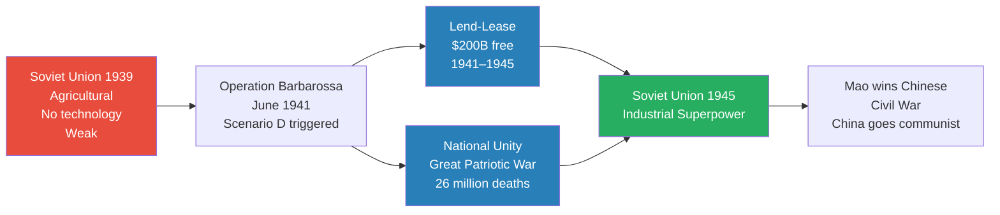
*Lend-Lease gave the Soviets the hardware. The German invasion gave them something more important — the will to fight.*

> [!note]- Expand: Full Lecture Detail
> Prof. Jiang details the staggering scale of Lend-Lease (1941–1945):
>
> | Category | What America Gave | Scale |
> |----------|------------------|-------|
> | Ammunition | All types | 1/3 of everything the Soviet Army used |
> | Explosives | All types | 1/3 of everything the Soviet Army used |
> | Aircraft | 14,000 aeroplanes | 1/2 of the Soviet Air Force |
> | Tanks | 13,000 tanks | 1/2 of the Soviet armoured force |
> | Copper | Industrial copper | 80% of Soviet supply |
> | Aluminium & Steel | Structural metals | 55% of Soviet supply |
> | Technology | Radio, railroads, heavy industry | Complete technology transfer |
> | Food | Rations | Massive quantities |
>
> Total: $200 billion — for free. "In other words, America basically built the Soviet Union in heavy industry for it."
>
> And the reverse-engineering benefit: "At the end of the day, what the Soviet Union can do is reverse engineer all this technology and build its own industry."
>
> But Prof. Jiang argues the second benefit mattered more than the weapons:
>
> > [!example] The 26 Million and the Will to Fight
> > - Before the invasion, "communism was tearing the country apart — civil war, the rich people all fled the country"
> > - After the invasion, the entire nation unified: "This is what they call the Great Patriotic War. They were fighting this war for the love of their country, the love of mother Russia"
> > - "The Russians lost 26 million people in the war. That's a lot of people. But by losing this many people, it made the entire nation refuse to surrender. They had the will to fight. Much more so than the Germans."
> > - "What turned the war was the will to fight"
> > **The lesson:** Sometimes a nation must nearly die to discover the will to live. The German invasion gave the Soviet Union something Lend-Lease could not buy — national unity forged through shared sacrifice.

---

## Stalin Played Hitler: The "I Trust You" Deception [52:00–57:00]

*If Scenario D was the only winning move, how did Stalin ensure it happened? The answer involves the most psychologically sophisticated element of Russian strategic imagination — and the question Prof. Jiang poses is devastating in its elegance.*

> [!note]- Expand: Full Lecture Detail
> The key question: "In June 1941, Hitler did not have to invade the Soviet Union. He could have waited for Stalin to invade him — then the opposite would have happened. America would have joined the war on Hitler's behalf, and they would have defeated the Soviet Union."
>
> So what convinced Hitler "to do the most insane thing and invade Russia first"?
>
> Prof. Jiang: "Everyone says that Stalin trusted Hitler, so Hitler played Stalin. But if you just analyse the game, then the conclusion is: Stalin played Hitler. Hitler did everything that Stalin wanted him to do."
> - Hitler invaded Poland → Britain and France declared war on Germany
> - Hitler attacked Soviet Russia → America was forced to help the Soviet Union become a superpower
>
> The mechanism — the thought experiment:
>
> > [!example] The "Three Words" — How Stalin Triggered Hitler
> > - Imagine Stalin and Hitler having drinks on a porch, staring at the mountains
> > - All Stalin has to say is three words: "I trust you"
> > - "I, Joseph Stalin, trust you, Adolf Hitler. I don't trust anyone. I don't trust my own mother. But I trust you, Hitler"
> > - Hitler's reaction: "Stalin is a sheep. I am a wolf. I am a lion. You're a sheep — therefore I eat you"
> > - This triggers Hitler's predatory instincts — he invades, confident of easy victory
> > - But Stalin is not a sheep — he is the one who set the trap
> > **The lesson:** Stalin could only pull this off with "multiple personalities" — the ability to genuinely become a different identity. Hitler had to truly believe Stalin was weak, not merely appear to believe it. The act had to be real.

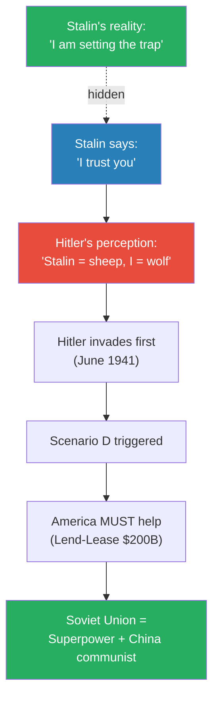
*The gap between Hitler's perception (sheep) and Stalin's reality (strategic trap) is the "multiple personalities" element — and the reason the Western mind still misreads it eighty years later.*

---

## The Three Elements of Russian Strategic Imagination [52:00–58:00]

*Prof. Jiang distils the Russian strategic mind into three qualities — not personal traits of exceptional individuals, but cultural products of a distinct philosophical tradition.*

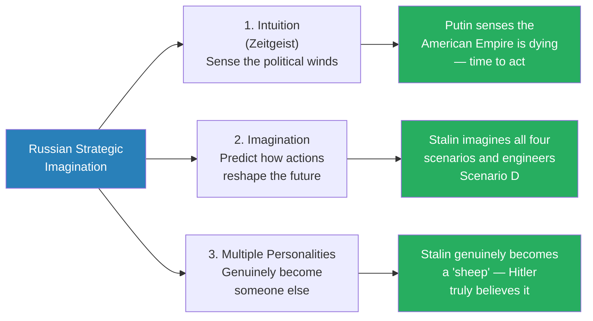
*The three elements work together: intuition tells you the moment is right, imagination tells you what to do, and multiple personalities allow you to do it without being detected.*

> [!note]- Expand: Full Lecture Detail
> **Element 1 — Intuition:**
> - The ability to read the political winds — to "sense the mood of the world"
> - The German word is <b style="color: #2980b9">Zeitgeist</b> — spirit of the times
> - "Putin knows that the American Empire is about to die, and so he feels important to act"
> - Stalin sensed in 1939 that the world's hatred of communism was the defining force — and built his strategy around redirecting that hatred onto Germany
> - "It's intuition. It's not intelligence gathering or data analysis"
>
> **Element 2 — Imagination:**
> - Not just sensing the present, but imagining how interventions will change the future
> - "They can also imagine, hey, if I did this, how would these winds change?"
> - "That's an imagination — to be able to predict or imagine the future"
> - Stalin could imagine all four scenarios and see which one the Soviet Union needed, then engineer the conditions for that specific scenario
> - Putin can imagine how five simultaneous fronts interact over three to four years — "seeing a system where Western analysts see separate crises"
>
> **Element 3 — Multiple Personalities:**
> - "Putin and Stalin are such brilliant men that they embody multiple personalities in them, and that's why they're so unpredictable"
> - Stalin had to genuinely become a "sheep" in front of Hitler — "not just act like one, but truly be"
> - The critical difference between acting and being: "a good actor can pretend to be someone else, but a strategic genius can actually become someone else — inhabiting a different identity so completely that even the most suspicious observer is convinced"
> - This capacity makes Russian leaders unreadable to Western analysts who assume people have one stable identity

---

## British Philosophy vs. Russian Philosophy [58:00–1:04:00]

*A student (Siteng) asked the most important question: "Why are the Russians different?" Prof. Jiang's answer reverses the frame: "The problem isn't Russia. The problem is us — the West."*

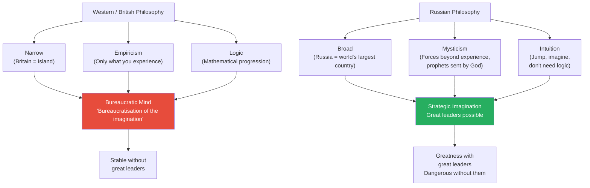
*The British system creates stable mediocrity. The Russian system creates volatile brilliance — extraordinary with great leaders, dangerously weak without them.*

> [!note]- Expand: Full Lecture Detail
> **The British Mind — three characteristics:**
> - <b style="color: #2980b9">Narrow:</b> "Britain is an island, therefore it thinks very narrowly about the world." British literature: Jane Austen, Thomas Hardy — "great, but very narrow in their focus"
> - <b style="color: #2980b9">Empiricism:</b> David Hume's philosophy — "we can only know what we experience. We can only know what we see." Another word: scepticism. "It's true, but it limits your imagination"
> - <b style="color: #2980b9">Logic:</b> "Like mathematics. You can go from one to two to three to four to five. Everything has to be logical. Everything has to be connected together"
>
> These three qualities created the Western mind: "This is what dominates in academia. When you go off to university, they expect you to think in this way — narrow, empirical, and logical."
>
> Prof. Jiang's verdict: "This is bureaucratic thinking. This is the bureaucratisation of the imagination. You're not allowed to say things without evidence and logic and experience."
>
> The fatal flaw: "No great man could ever arise from Washington society. Does that make sense? Because all this creates a process-oriented, systematised, bureaucratic style of thinking."
>
> **The Russian Mind — three characteristics:**
> - <b style="color: #2980b9">Broad:</b> "Russia is the world's largest country, therefore it thinks very broadly about the world." Russian literature: Leo Tolstoy — War and Peace, Anna Karenina — "very huge epics"
> - <b style="color: #2980b9">Mysticism:</b> "They're very spiritual, religious people. There are forces we don't understand. There are individuals who are prophets, who are sent to us by God. We can never know who they are. We can never know how they think"
> - <b style="color: #2980b9">Intuition:</b> "You can jump. You can imagine things. You don't have to be logical"
>
> The trade-off — Prof. Jiang is explicit:
> - "There's obviously more good things about the British system than about this system"
> - The British system doesn't need great leaders — "the bureaucracy sustains itself through processes, institutions, and accumulated knowledge"
> - The Russian system DOES need great leaders: "if you don't have Putin or Stalin, then this system becomes very weak"
> - But with a great leader: "you are allowed to completely follow your intuition and imagination to do great things, like Joseph Stalin in World War Two and what Putin is doing today"
>
> > [!example] Prof. Jiang's Self-Referential Test
> > - "I could never give this talk in America or Britain, because they will all think I'm crazy"
> > - The objections: "What's your evidence for this? Are you refuting decades of scholarship about World War Two? Are you telling me that Stalin was a genius when no one thought he was a genius? How dare you refute these thousands of scholars"
> > - This reaction — demanding narrow evidence, empirical proof, logical chains — is itself proof of the system's limitations
> > **The lesson:** The Western system is blind to precisely the kind of thinking that threatens it, because the system's epistemological rules exclude the methods needed to detect it.

---

## The Greek Lineage: Rome vs. Greece [1:02:41–1:05:30]

*A student asks about Greek influence on British thinking. Prof. Jiang's answer reveals the deeper intellectual genealogy — and explains why Russia's claim to be "more Greek" than the West is historically coherent.*

> [!note]- Expand: Full Lecture Detail
> - The Greeks are "more like the Russians than they are like the British — both believed in imagination and intuition"
> - But the West does not follow Greece — it follows Rome
> - "After the Greeks came the Romans. The Romans were like this [the British system]. And it was the Romans who influenced the British, who then influenced Americans"
> - "We're living basically in a Roman world, as opposed to a Greek world"
>
> What influences Russia?
> - "The Russians will say that they're a Christian nation, and the Christian tradition comes from a Greek tradition"
> - "Their Christianity is a more pure or more ancient form of Christianity"
> - Specifically: <b style="color: #2980b9">pre-Augustinian Christianity</b> — before Augustine transformed Christianity into the more logical, systematic theology that dominated the Western Church
> - This older, more mystical Christianity preserved the Greek emphasis on intuition and imagination that the Western (Roman/Augustinian) tradition suppressed

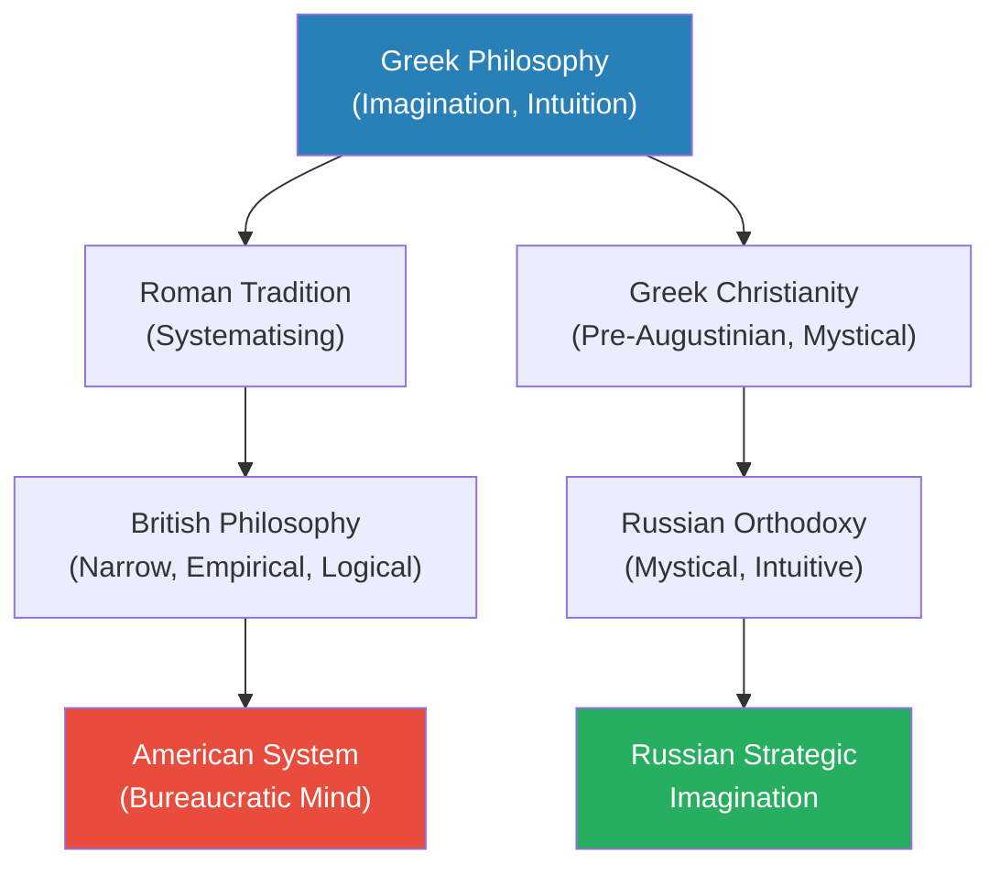
*The West inherited Rome's systematising impulse. Russia inherited Greece's mystical imagination through a pre-Augustinian Christianity that preserved what the Western Church discarded.*

---

## Connections

**Builds on:**
- [[09 - Putin's War for the Soul of Russia]] — Putin's civilizational motivation; this lecture provides the operational plan that follows from it
- [[07 - Who Killed Iranian President Ebrahim Raisi]] — IRGC provocation strategy that Putin enables through the nuclear umbrella guarantee
- [[03 - How Empire is Destroying America]] — empire economics, petrodollar, debt as structural weakness
- [[01 - Iran's Strategy Matrix]] — asymmetric warfare principle applied here at the civilizational level

**Sets up:**
- [[11 - The Second American Civil War]] — the endpoint of Putin's five-front strategy; civil discord reaching its tipping point

**Related books in vault:**
- [[The 48 Laws of Power - Robert Greene]] — Law 3: Conceal Your Intentions (Stalin's "I trust you" deception); Law 29: Plan All the Way to the End (both leaders' long-horizon vision)
- [[Sapiens - Yuval Noah Harari]] — Harari's inversion ("wheat domesticated us") parallels Prof. Jiang's method of reframing who is actually in control

---

## The Takeaway

This lecture operates on two levels that are inseparable. The surface level is a strategic briefing: Putin is exploiting three structural weaknesses in the American Empire through five simultaneous fronts, each operating independently while reinforcing the others. The predictions are concrete and testable — within three to four years, all five fronts should be visibly active. The Ukraine war continues without expanding. Iran takes the initiative. North Korea becomes more belligerent. BRICS keeps growing. The Putin-Xi relationship deepens. If these unfold, the model is confirmed; if they don't, it needs revision. Prof. Jiang is explicit about this empirical discipline even while critiquing empiricism as a philosophy — the method and the mindset are different things.

The deeper level is historical and philosophical. The claim that Stalin engineered World War Two — that he was not played by Hitler but played Hitler — is a direct challenge to decades of scholarship. Prof. Jiang does not offer new archival evidence. He offers game theory: given the board of 1939, Scenario D was the only outcome producing a Soviet victory, and it is exactly what happened. The four "mistakes" historians cite are not mistakes at all if the goal was to ensure Germany attacked first and advanced far enough to force American intervention. This argument cannot be assessed using the Western academic framework's own tools — because it requires the breadth, intuition, and willingness to make leaps that the framework has systematically excluded. The Western mind literally cannot evaluate the argument, because evaluating it would require thinking in the way the argument describes.

The most unsettling implication is not about Russia — it is about what the Western system is blind to. A bureaucratic mind that demands narrow evidence, empirical proof, and logical chains is structurally incapable of recognising a strategy that operates across multiple dimensions simultaneously, over years, using proxy actors, and through a leader who can genuinely inhabit different identities. If Prof. Jiang is right, the reason Western analysts keep misreading Putin is not incompetence — it is that their epistemological toolkit was designed for a different kind of problem. Putin's advantage is not just strategic; it is that his opponent cannot even name what they are facing.
