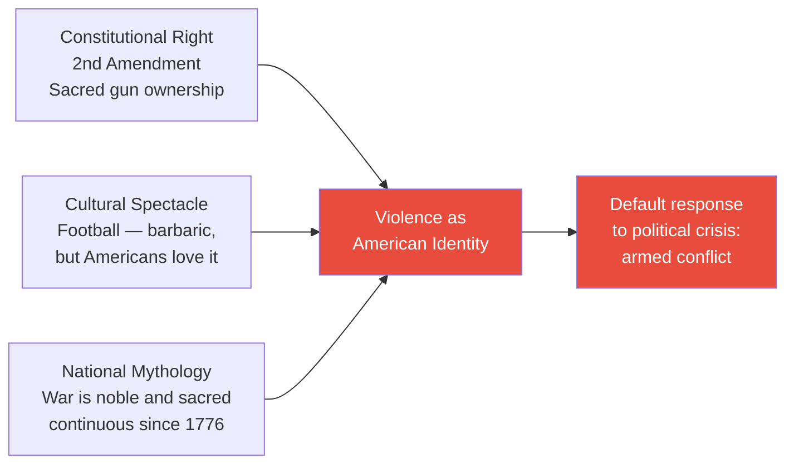
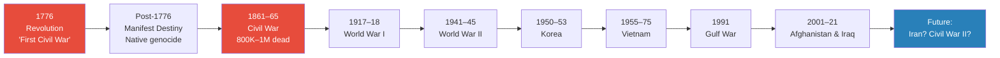
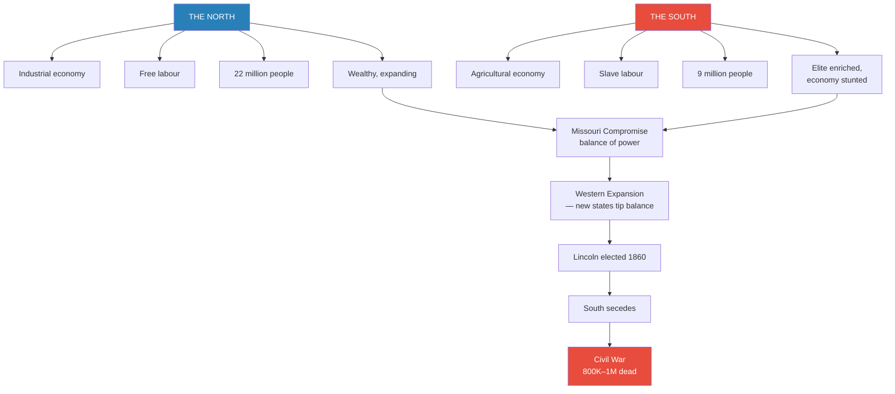
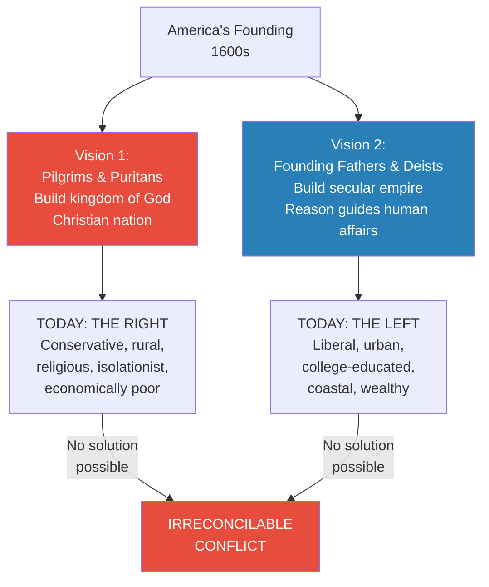
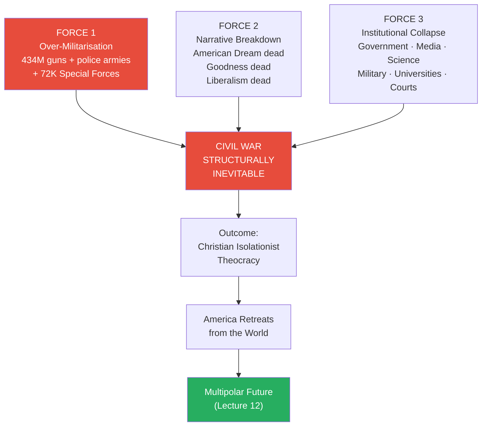
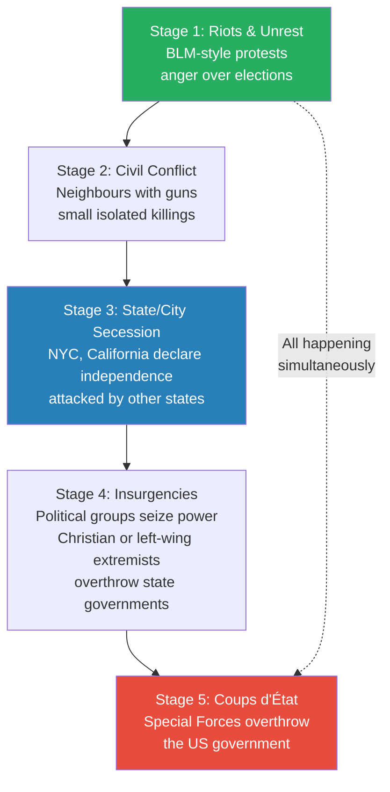
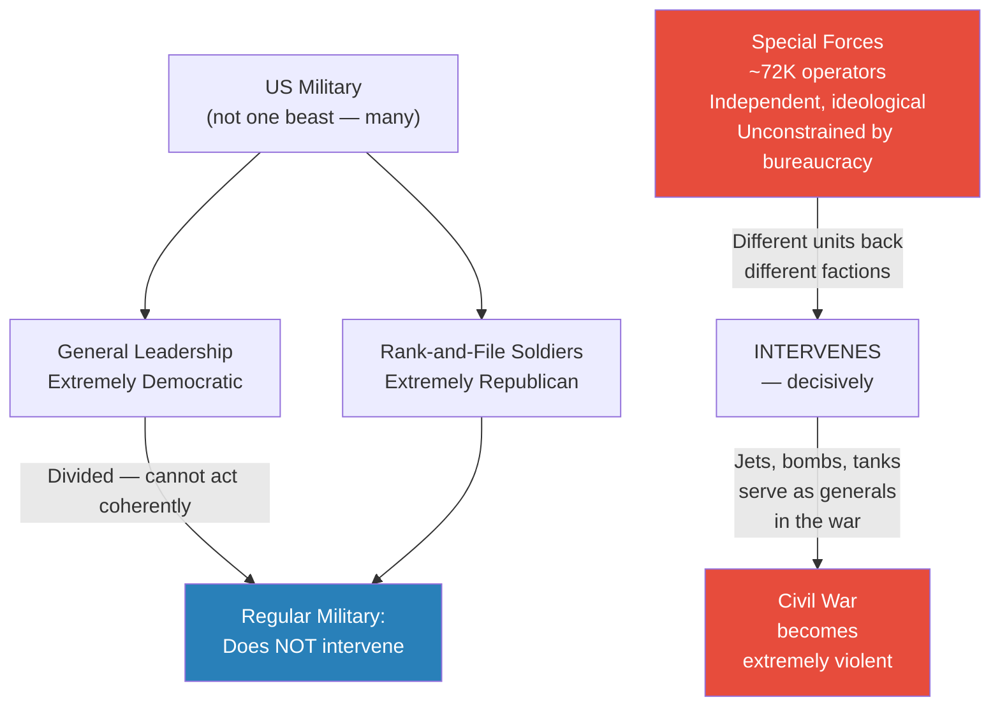
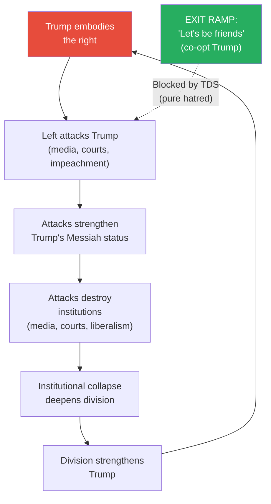
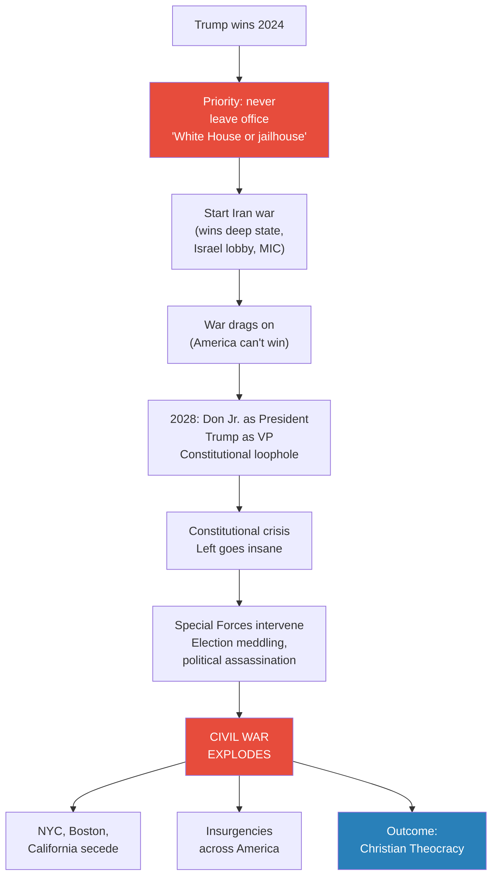

# The Second American Civil War

> America is a nation addicted to violence — 434 million guns, a 250-year history of continuous war, and a culture that treats conflict as noble. Three structural forces are pushing the country toward a second civil war: the over-militarisation of society, the death of every narrative that once bound the nation together, and the collapse of every trusted institution. Prof. Jiang argues that the trigger is Donald Trump — his return to power, his likely war with Iran, and his 2028 VP trick will ignite a constitutional crisis that Special Forces turn into open civil war. The most probable outcome, after 10 to 50 years of chaotic violence, is a Christian, isolationist theocracy — and when America turns inward, it retreats from the world, creating the multipolar future that Lecture 12 will explore.

---

## Overview: Key Highlights

- <b style="color: #e74c3c">America is a nation addicted to violence</b> — 434 million guns, football, and the sacred mythology of war are symptoms of a cultural DNA, not aberrations
- <b style="color: #2980b9">The American Revolution as the First Civil War</b> — a tax rebellion that terrorised loyalists, not a noble fight for liberty; the pattern of choosing violence over compromise was set from day one
- <b style="color: #e74c3c">Over-militarisation at every level</b> — from private citizens with semi-automatics to local police with tanks to 72,000 Special Forces operators who could overthrow the government with 1,000 personnel
- <b style="color: #27ae60">Three narratives are dead simultaneously</b> — the American Dream, American goodness, and liberalism have all collapsed, leaving no shared story to explain why Americans should remain one country
- <b style="color: #e74c3c">Every trusted institution has fallen</b> — government, media, science, military, universities, and courts have all been discredited, leaving no mediating authority to prevent conflict
- <b style="color: #2980b9">Two irreconcilable founding visions</b> — Pilgrims/Puritans (Christian nation, God's law) vs. Founding Fathers/Deists (secular empire, reason) — the culture war is 400 years old
- <b style="color: #2980b9">Trump Derangement Syndrome (TDS)</b> — the left's hatred of Trump prevents the one strategy that would neutralise him: "Let's be friends"
- <b style="color: #27ae60">Civil wars are won by willingness to die, not by numbers</b> — Christian nationalists embedded in law enforcement, military, and Special Forces are most likely to prevail
- <b style="color: #e74c3c">The VP trick</b> — in 2028, Don Jr. runs for president with Trump as VP, creating a constitutional crisis that triggers the civil war
- <b style="color: #2980b9">The five stages</b> — riots → civil conflict → state secession → insurgencies → coups d'état — all happening simultaneously over 10 to 50 years
- <b style="color: #27ae60">Christian isolationist theocracy</b> — the structural outcome: the side with guns, faith, and training will outlast the side with money and education
- <b style="color: #e74c3c">The Iran war and the civil war are one story</b> — empire enriches the elite, bleeds the poor, and produces both the foreign war and the domestic fracture that destroys American hegemony

| Concept | One-line summary |
|---------|-----------------|
| **Violence addiction** | Cultural, legal, and historical embedding of violence as the default conflict-resolution mechanism |
| **Two founding visions** | Pilgrims (Christian nation) vs. Founding Fathers (secular empire) — irreconcilable since the 1600s |
| **Rentier economy** | The top 1% capture new wealth through collecting debt, not creating value |
| **Over-militarisation** | Weapons saturation at every level: private guns, militarised police, Special Forces |
| **Narrative breakdown** | The American Dream, American goodness, and liberalism are dead simultaneously |
| **Institutional collapse** | Government, media, science, military, universities, courts — all discredited |
| **Trump Derangement Syndrome** | The left's irrational hatred that prevents co-opting Trump and blocks the only exit ramp |
| **The five stages** | Riots → civil conflict → secession → insurgencies → coups — all overlapping, over decades |
| **The VP trick** | Don Jr. as president, Trump as VP in 2028 — constitutional loophole triggers the crisis |
| **Special Forces variable** | ~72,000 operators, ideologically motivated, unconstrained by bureaucracy — the decisive wild card |
| **Christian isolationist theocracy** | The likely outcome — the religious right has the will to fight that the secular left lacks |
| **Iran-civil war nexus** | The war enriches the MIC, bleeds the poor, and feeds the domestic fracture — same crisis, two faces |

---

# The Lecture

## America Is a Country Addicted to Violence [0:01–10:00]

*Prof. Jiang opens not with political analysis but with cultural diagnosis — America does not just experience violence, it reveres it. He stacks evidence from the Constitution, from sport, and from the national mythology of war before making his core claim.*

> [!tip] Core Insight
> Violence in America is not a pathology — it is an identity. It is embedded in the Constitution (Second Amendment), the culture (football), and the national mythology (war as sacred). This makes violence the default conflict-resolution mechanism when political solutions fail.

*Three separate pillars — law, culture, and mythology — reinforce the same identity. Together they make armed conflict the natural response to deep political disagreement.*

> [!note]- Expand: Full Lecture Detail
> - Prof. Jiang opens by framing the lecture's purpose: he wants to make the argument that a second civil war is "very likely" and will explain why it's likely, how it will manifest, and what happens after
> - His first claim is blunt: America is a country that "enjoys violence" — "you can even say that Americans are addicted to violence"
> - **The gun evidence:** 434 million guns — 1.3 for every single person — and many are semi-automatic weapons designed to kill humans, not hunting rifles
>   - Gun ownership is not treated as a privilege but as a sacred constitutional right — the <b style="color: #2980b9">Second Amendment</b>
>   - "Every American has a right to bear arms"
> - **The football evidence:** American football is "an extremely violent sport" that only Americans play
>   - The Super Bowl is the most-watched TV event every year
>   - Players suffer devastating psychological injuries — "a lot of football players who at age 30, they either commit suicide or they will kill someone because their brains have been destroyed by the game"
>   - Despite being "barbaric," Americans love it
> - **The war mythology evidence:** Americans "worship their history of wars" — they believe fighting wars is "noble and sacred"
> - Prof. Jiang then pivots to his second point: America has "a long history of fighting wars" — in fact, he argues it has been "continuously at war since its founding in 1776, even before that"
> - He begins tracing the unbroken chain: Revolution → Manifest Destiny → Civil War → World War I → World War II → Korea → Vietnam → Gulf War → Afghanistan/Iraq
>
> > [!quote] Prof. Jiang
> > "You can even say that Americans are addicted to violence."

---

## A 250-Year Chain of Continuous War [0:01–10:00]

*Prof. Jiang traces an unbroken chain of American wars from the Revolution to the present, building the case that each generation of Americans has known war — and making the rhetorical challenge: why would this generation be different?*

*Every generation of Americans since 1776 has lived through a major war. Prof. Jiang's implicit challenge: what makes the current generation uniquely capable of peaceful resolution?*

> [!note]- Expand: Full Lecture Detail
> - Prof. Jiang walks through each conflict rapidly, building a cumulative picture of a society that returns to war as its default mode of dispute resolution
> - The Revolution (1776): Americans believe it was "sacred" — a revolution in human history — but Prof. Jiang's reframing arrives shortly: it was actually a tax rebellion
> - **Manifest Destiny:** After independence, Americans embarked on violent colonisation — killing of natives, conquering new territories, "all with God's will as the justification"
> - The Civil War (1861–65): Prof. Jiang will spend significant time here; it killed more Americans than both World Wars combined
> - The pattern continues through every subsequent conflict: Korea, Vietnam, Gulf War, Afghanistan, Iraq
> - His rhetorical move is deliberate: he is not saying civil war is inevitable because today's problems are unique — he is saying it is likely because today's problems are *normal* for America, and America's normal response to serious problems is war
> - "Why would this generation be different?"

---

## The Revolution Was the First Civil War [10:00–19:59]

*Prof. Jiang reframes the sacred founding myth. The American Revolution, he argues, was not a noble fight for liberty but a tax rebellion — and it was actually the first American Civil War, fought between independence-seekers and loyalists who were "terrorised by extremists."*

> [!note]- Expand: Full Lecture Detail
> - The standard narrative: Americans fought a sacred revolution for human liberty against British tyranny
> - Prof. Jiang's reframing: the British were taxing Americans, but they had a legitimate reason — they were providing defence for the colonies and needed the revenue
>   - The rebellion was fundamentally about taxes, not liberty
> - The Revolution was "actually the first American Civil War" — many Americans were loyalists who wanted to remain part of the British Union
>   - These loyalists were "terrorised by extremists who wanted independence"
>   - It was not a unanimous uprising but a factional conflict within American society
> - After independence: Manifest Destiny — the belief that God willed America to control all of the Americas
>   - Violent colonisation of all new lands
>   - Killing of native peoples
>   - "God's will" as the moral justification for conquest
>
> > [!example] Loyalists Terrorised by Extremists
> > - The traditional story omits that a significant portion of colonial Americans were loyal to Britain
> > - These loyalists had legitimate grievances: they lived under British protection, enjoyed trade privileges, and saw no benefit from independence
> > - When the independence movement succeeded, loyalists were subjected to harassment, property seizure, and violence
> > - Many fled to Canada or Britain
> > - The "sacred revolution" required terrorising fellow Americans into acquiescence
> > **The lesson:** The pattern was established from the beginning — Americans resolve internal disagreements through coercion and violence, not compromise.

---

## The First Civil War — What It Was Really About [19:59–30:13]

*Prof. Jiang spends extended time on 1861–1865 — not because it is unfamiliar but because the standard explanation is wrong. Understanding the real causes reveals the same structural forces at work today.*

*The Civil War was not about morality — it was about power. Western expansion made the balance of power untenable; Lincoln's election was the breaking point.*

> [!note]- Expand: Full Lecture Detail
> - **The economic divide:** The North had an industrial economy built on free labour — "obviously much more efficient because it's a much better use of manpower" — 22 million people, wealthy and expanding
>   - "Free labour" meant workers could take any job and employers could hire anyone — flexibility and efficiency
>   - The industrial base gave the North overwhelming advantages in weapons manufacturing, logistics, and organisation
> - The South had an agricultural economy built on slave labour — enriched plantation owners but "was not good for the economy as a whole — it was an inefficient use of manpower"
>   - Only 9 million people
>   - Slavery concentrated wealth at the top while leaving the broader southern economy underdeveloped
> - **The real cause — political power through western expansion:**
>   - As America expanded west, each new state sent senators and representatives to Washington
>   - These votes determined the balance of federal power — the question was whether new states would be slave or free
>   - The <b style="color: #2980b9">Missouri Compromise</b>: for every slave state admitted, one free state must be admitted — maintaining the balance
>   - "Does that make sense? To maintain the balance?" — Prof. Jiang walks the students through the logic step by step
>   - The compromise held for decades but began fracturing when western states like Kansas "would want to be anti-slavery" — they had their own opinions
> - **Lincoln as the breaking point:**
>   - Abraham Lincoln was elected in 1860 — "radically anti-slavery" — but was also a lawyer who recognised the South's legal rights under the Constitution
>   - His plan was gradualist: limit slavery in the West, and "over time — it may be 100 years' time — slavery would naturally cease to exist"
>   - "The South did not like this plan, and they were afraid of what Lincoln might really do as president"
>   - They seceded; Lincoln invaded — not to free the slaves, but to preserve the Union
> - **Prof. Jiang's key reframing:** The war was about power, not morality
>   - Lincoln himself stated the purpose: "If I could end the war while freeing slaves, I would do so" — but the main goal was keeping the Union intact
>   - From the South's perspective, they were fighting for the right to freely express their political views
>   - "Neither side needed to fight — they could have compromised, negotiated, or peacefully separated"
>   - <b style="color: #e74c3c">America chose its bloodiest war — 800,000 to 1 million dead — over a dispute that could have been resolved through politics</b>
>
> > [!example] Lincoln's Own Words on the War's Purpose
> > - Lincoln declared: "If I could end the war while freeing slaves, I would do so"
> > - Slavery was the pretext; preserving the Union was the goal
> > - The war killed more Americans than World War I and World War II combined
> > - It was avoidable — both sides could have compromised, negotiated, or separated peacefully
> > - They chose war instead
> > **The lesson:** America resolves conflicts through violence. It does not have a history of diplomacy — it has a history of war-making.

---

## Five Divisions Tearing America Apart Today [30:13–38:53]

*If America chose civil war in 1861 over a single division, what happens with five overlapping divisions — all deeper and more irreconcilable? Prof. Jiang layers them one by one.*

*The culture war is not a modern invention — it is a 400-year-old argument about what America fundamentally is. Every policy dispute is a symptom of this irreconcilable founding contradiction.*

> [!note]- Expand: Full Lecture Detail
> - **Division 1: Inequality and Debt — Haves vs. Have-Nots**
>   - The top 1% control the <b style="color: #2980b9">means of production</b> — any new money entering the system is seized at the top
>   - They operate a <b style="color: #2980b9">rentier economy</b>: making money not by creating value but by collecting debt — exploiting others
>   - Young people believe: the game is stacked, Washington serves only the rich, the wealthy have stolen everything
>   - The new American Dream: "How do I stay out of debt?" — college graduates with tens of thousands in student loan debt, consumers drowning in credit card debt, unaffordable housing
>   - Critically: <b style="color: #e74c3c">economic inequality maps onto cultural identity</b> — the wealthy tend to be on the left (urban, coastal, liberal), the poor on the right (rural, religious) — so being poor and being culturally marginalised are the same experience
> - **Division 2: The Culture Wars — Left vs. Right**
>   - Two opposing visions present from the very founding in the 1600s
>   - Vision 1 (Pilgrims and Puritans): build a kingdom of God; America as a Christian nation following God's laws → today's right
>   - Vision 2 (Founding Fathers and Deists): build a secular empire guided by reason → today's left
>   - "Significant crossover between the left and the wealthy" — the left is urban, liberal, college-educated, and coastal — "usually the people with all the money"
>   - The inequality makes the culture wars worse: the right feels economically and culturally marginalised simultaneously
> - **Division 3: Empire vs. Democracy**
>   - Many Americans benefit from empire — Wall Street, the military-industrial complex, suburbanites
>   - But the rest suffer: the wars in Afghanistan and Iraq made Wall Street rich while the poor sent their sons to fight and die, lost limbs, and paid taxes to fund the wars
>   - <b style="color: #27ae60">The right is deeply isolationist</b> — "they don't want to fight these wars. They think that America should be an island."
>   - The empire-democracy divide cuts across the other divisions — both left and right have pro-empire and anti-empire factions
> - **Division 4: No Political Solutions**
>   - <b style="color: #e74c3c">There is no actual solution to any of these divisions</b>
>   - No political mechanism resolves the inequality; no compromise bridges the culture war; no institution mediates empire vs. democracy
>   - When political solutions fail and the culture is addicted to violence, what remains is war

---

## Three Forces That Make Civil War Structurally Inevitable [38:53–54:00]

*Prof. Jiang identifies the three structural forces — over-militarisation, narrative breakdown, and institutional collapse — that in combination make civil war not merely possible but virtually unavoidable.*

> [!tip] Core Insight
> Any one of these forces alone might be manageable. Over-militarisation without narrative breakdown could be held by institutions. Narrative breakdown without weapons is just cultural conflict. Institutional collapse without arms is just cynicism. Together, all three remove every check on organised violence simultaneously.

*Three forces converge simultaneously. The outcome reshapes not just America but the global order.*

> [!note]- Expand: Full Lecture Detail
> **Force 1: The Over-Militarisation of America**
>
> Prof. Jiang walks through the layers of American militarisation from bottom to top:
> - **Private citizens:** 434 million guns — 1.3 per person, many semi-automatic weapons designed for killing humans; these citizens believe it is their sacred constitutional right, not a privilege the government grants
> - **Local police:** "If you go to a small town in America and you look at the police there, you think it's safe — they should have pistols." In fact, they have armoured vehicles, sometimes tanks, helicopters, bulletproof vests, machine guns — all surplus from the military
> - **State National Guard:** "These guys are basically an army unto themselves." Each state has its own military force, equipped and trained for combat operations
> - **Federal agencies:** FBI, CIA, NSA, Homeland Security — "there's dozens of these federal agencies." Each has its own special forces, tanks, helicopters, jets, bombs, missiles. "These guys can go to war against each other."
> - **Special Forces — the real danger:**
>   - In 2000: 38,000 operators
>   - Today: approximately 72,000–73,000 — nearly doubled in two decades
>   - Trained in demolition, sabotage, guerrilla warfare
>   - <b style="color: #e74c3c">It would take exactly 1,000 operators to overthrow the US government</b>
>   - Delta Force has exactly 1,000 members
>   - "So you get this guy who runs Delta Force — if he was like, I want to overthrow the US government, for whatever reason, he can do so, because they're so powerful"
>   - Prof. Jiang calls Special Forces "a bomb waiting to explode"
>
> > [!example] Mexican Special Forces and the Drug Cartels
> > - The people who run Mexico's most violent drug cartels are former Special Forces members
> > - They took their military training and applied it to organised crime
> > - They commit "the most violence in the world"
> > - This is exactly why you want to limit your Special Forces — but America has doubled them
> > **The lesson:** Special Forces are a bomb waiting to explode. Uncontrolled by bureaucracy, trained to overthrow governments, ideologically motivated — they are the single most dangerous variable in the coming civil war.
>
> **Force 2: The Breakdown of National Narratives**
>
> - *The American Dream — Dead:* Young people no longer believe hard work leads to homeownership or wealth. They believe the game is stacked, Washington is corrupt, and the wealthy have monopolised everything. The new American Dream is: "How do I stay out of debt?"
> - *America Is Good — Dead:* The left is taught America is founded on slavery and violence; the right believes it destroys countries for no reason. Israel has pushed more young people to conclude America is "a force of evil in the world." Both sides have arrived at the same verdict from opposite directions — but their shared disillusionment cannot unite them because they disagree on the reasoning
> - *Liberalism — Dead:* <b style="color: #2980b9">Liberalism</b> was the glue — the agreement that differences could be resolved through reason, free speech, and debate. In 2016, when Trump won, liberals "went crazy" — they concluded the problem was democracy itself: "If people are stupid, if people cannot be reasoned with, why give them freedom of speech? Why let them vote?" The liberal establishment abandoned its own founding principle. <b style="color: #e74c3c">Liberalism was killed not by its enemies but by its own adherents</b>
>
> **Force 3: The Collapse of Institutional Authority**
>
> - **Government:** Corrupt, serves only the rich. Congress is "hated by everyone"
> - **Media:** New York Times, Washington Post, CNN — "just liars" speaking for the rich. No one trusts them
> - **Science:** COVID destroyed trust in a single stroke — the lockdown ("kids could not go to school and the poor could not go to work"), the "experimental vaccine," the mandates. "People were like, why are we doing this?" Millions now see science as another tool of elite control
> - **Military:** Fights pointless wars for no reason — Afghanistan, Iraq, Ukraine, Israel — seen as an instrument of empire that sacrifices the poor for the rich
> - **Universities:** Politicised, teaching ideology rather than critical thinking: "They're not actually interested in teaching you how to think. They're interested in teaching how to think a certain way."
> - **Courts:** "This is falling as well because of Donald Trump." When a New York judge convicted Trump of 34 felonies, "people are now no longer trusting the court system"
>
> > [!example] The 2008 Financial Crisis
> > - The banks "basically stole from the nation, stole from the poor and kept the money"
> > - Everyone was screwed except the banks themselves
> > - This was one of the elite actions that made people cynical about power — combined with the pointless wars, COVID lockdowns, and Trump's prosecution
> > - Every institution has been discredited in the space of roughly 20 years
> > **The lesson:** Trust is earned over decades and destroyed in moments. America's institutions spent their credibility on wars, financial fraud, and political persecution — and now there is nothing left to bring people together.

---

## The President Is a Figurehead, and Universities Are Battlegrounds [43:48–54:00]

*Two Q&A exchanges — one from Celine on presidential power, one from Peter and Jack on universities — reveal the depth of institutional decay. Prof. Jiang treats both as confirmation of his structural argument.*

> [!note]- Expand: Full Lecture Detail
> - **On presidential power** (Celine's question): The president is "really a figurehead" — not that powerful. Power is diffused across institutions, and if those institutions are corrupt, the president can do nothing
>   - This is why November 2024 would see "one of the lowest turnouts of voters in American history"
>   - Four years ago people came out to kick Trump out; under Biden they realised "it's all corrupt — just burn the system down"
>   - <b style="color: #e74c3c">No one cares who's president anymore</b>
>   - Paradoxically, this apathy helps Trump — lower turnout benefits the candidate with the more motivated base
> - **On universities** (Peter's question): Prof. Jiang acknowledges the premise — "universities have become more politicised — they're not actually interested in teaching you how to think. They're interested in teaching how to think a certain way, which is very left-wing"
>   - Examples: the belief that America is a society based on violence, slavery, and exploitation; political correctness; ideological conformity enforced through social pressure
>   - But he does not abandon universities: "Even though universities have become more politicised, your education in university is up to you" — it is the student's responsibility to structure their own learning and understand the limitations
> - **Jack's follow-up:** Who are the people who don't trust universities?
>   - <b style="color: #27ae60">The people left out of the system — the right</b> — who don't go to university
>   - The left is mainly college-educated and wealthy
>   - Some professors and students are "dismayed by what's going on" — but they are "only a small fraction of the total population"
>   - Universities — the institution that should teach critical thinking and bridge divides — have instead become a battleground of the culture wars, alienating half the population and indoctrinating the other half

---

## What the Civil War Will Look Like — The Five Stages [54:00–1:06:47]

*Prof. Jiang describes the form the civil war will take. Unlike 1861 — a binary North vs. South conflict with clear battle lines — the second civil war will be a chaotic, multi-faction, decades-long series of overlapping violent episodes.*

*The five stages are not sequential — they all happen at once, building on each other, over 10 to 50 years. No front lines. Pockets of peace beside pockets of intense violence.*

> [!note]- Expand: Full Lecture Detail
> - **The fundamental difference from 1861:** In the first civil war there was one clear divide — North vs. South, pro-slavery vs. anti-slavery. Today there are many factions and many conflicts. The result is not a single war but a chaotic series of overlapping violent episodes with no front lines
>
> **Stage 1: Riots and Unrest**
> - Like the George Floyd / Black Lives Matter protests during Trump's first presidency
> - Will intensify when Trump returns: "People are so angry at this election, they'll start rioting"
> - The most visible stage but the least dangerous — property damage and sporadic violence, no organised military force
>
> **Stage 2: Civil Conflict**
> - Neighbours taking guns against each other
> - "America is divided between left and right, but there are actually pockets of America where left and right live very closely with each other"
> - Small, isolated affairs — "maybe one or two people get killed"
> - But the psychological effect is enormous — when your neighbour becomes your enemy, the social fabric is destroyed at its most basic level
>
> **Stage 3: State or City Secession**
> - A city (New York) or state (California) declares independence — "they're so disgusted by the state of affairs, they declare independence"
> - They have their own armies — armed citizens, National Guard
> - But secession invites attack — "they'll most likely be attacked by other states or different groups"
> - Escalates from isolated incidents to territorial warfare
>
> **Stage 4: Insurgencies**
> - Political groups form governments of their own
> - "It's possible that you have Christian extremists or maybe left-wing extremists who try to overthrow the government of, I don't know, New York or Virginia"
> - Distinction from Stage 3: secession is defensive (we want out), insurgency is offensive (we want control)
>
> **Stage 5: Coups d'État**
> - An arm of the military — "most probably Special Forces" — tries to overthrow the US government
> - Given that 1,000 operators could overthrow the government and Delta Force has exactly that number, this is architecturally possible
>
> - Prof. Jiang is clear: "In the next Civil War, all these things will happen at once, and they'll build on top of each other"
> - No front lines — "some places will be very peaceful, there's no war" while others (New York, Los Angeles) see intense violence
> - Duration: <b style="color: #2980b9">10 to 50 years</b> — not a single event but a prolonged era of fragmentation
> - The model is not Gettysburg — it is closer to Lebanon or Yugoslavia: overlapping factions, shifting alliances, pockets of stability amid surrounding chaos

---

## The Military Question — Who Takes Whose Side? [54:00–1:06:47]

*Jack asks the most practical question: in a civil war, whose side does the US military take? Prof. Jiang's answer reveals an internal ideological split that paralyses the institution — and makes Special Forces the decisive factor.*

*The regular military is too divided to act. Special Forces have the leeway, flexibility, and will — and different units will back different factions, turning the civil war catastrophically violent.*

> [!note]- Expand: Full Lecture Detail
> - The US military is not one beast — it is "many, many different beasts," divided into Army, Air Force, Marines, Navy, Space Force, and numerous sub-units
> - There is an <b style="color: #e74c3c">ideological mismatch</b> within the military:
>   - The leadership (the generals) is "extremely Democratic"
>   - The base (the soldiers) is "extremely Republican"
> - Given this split, the military as a whole <b style="color: #27ae60">probably does not intervene in the civil war</b> — it is too divided to act coherently
> - But there is one group with the "leeway, flexibility, and will" to intervene: <b style="color: #e74c3c">Special Forces</b>
>   - Not controlled by bureaucracy
>   - Different special forces units will support different factions
>   - Each can serve as "a general in the war"
>   - They have "jets and bombs and tanks" — firepower that makes ordinary Americans with guns look primitive
> - This is why the civil war will be "extremely violent" — the involvement of Special Forces escalates beyond what any police force or civilian militia could manage
> - The top five air forces in the world: #1 US Air Force, #2 US Navy, #3 Russia (entire country), #4 US Army, #5 US Marines — when these forces fractionalise and back different sides, the destruction is civilisational

---

## The Outcome — Christian Isolationist Theocracy [1:06:47–end]

*Prof. Jiang is candid about the limits of his prediction — he cannot know the specifics of what happens during the civil war. But the structural logic points clearly toward one equilibrium.*

> [!tip] Core Insight
> Civil wars are not won by the side with the most people or the most money. They are won by the side with the most willingness to use violence. In America, that side is the religious right — embedded in the institutions of force (police, military, Special Forces) and motivated by a vision worth dying for.

> [!note]- Expand: Full Lecture Detail
> - "The only thing I can do is look at the structural forces and conclude that a civil war is very likely, and that the civil war will be very chaotic — but what actually happens in a civil war, I don't actually know"
> - But the structural logic points to a clear outcome: <b style="color: #27ae60">America becomes a Christian, isolationist theocracy</b>
> - The reasoning follows a simple chain:
>   - At the founding, there were two competing visions of America
>   - **Vision 1** — multicultural secular empire spreading democracy and freedom — has been achieved and tried, producing the current decay
>   - **Vision 2** — white Christian nation dedicated to the rule of God — remains strong and has never been fully realised; it gains moral authority as the untried alternative
>   - When Vision 1 has been tried and produced chaos, Vision 2 gains converts
> - The question of who wins a civil war: <b style="color: #e74c3c">who is most willing to fight and to die for what they believe in</b>
>   - The answer: Christian nationalists — "and guess what, a lot of these people happen to work in law enforcement, the military, and especially the Special Forces"
>   - The people with the strongest beliefs AND the most firepower AND the most training are all on the same side
>   - The secular left may have more people, more money, and more education — but they do not have the willingness to die for their vision

---

## Trump as the Accelerant — TDS and the Self-Destruction Paradox [1:06:47–end]

*Prof. Jiang turns from structural analysis to specific prediction — and to a personal confession about how Trump affects even people who despise him.*

*Trump and the left are locked in a mutually destructive spiral. The exit ramp — co-opting Trump — is blocked by the same hatred that drives the spiral. The casualties are the institutions themselves.*

> [!note]- Expand: Full Lecture Detail
> - Trump embodies everything the left hates about the right: "white, sexist, racist, a pig — and he doesn't apologise for any of it." He has "no manners, he's not educated, he has no values"
> - <b style="color: #27ae60">This is exactly why the right loves him</b> — their enemies hate him; he is the Messiah, the outsider, the one who refuses to be tamed
> - Every persecution attempt has confirmed this status: Russian spy accusations, two impeachments, house raid, 34-felony conviction, Colorado ballot removal
> - **The one way to destroy Trump** — Prof. Jiang poses it as a challenge: "If you are on the left, if you are the elite, if you're rich and you hate Donald Trump, there's exactly one way and only one way you can destroy Donald Trump forever."
>   - The answer: <b style="color: #27ae60">three words — "Let's be friends"</b>
>   - Why it works: Trump's appeal rests on the elites hating him. If the elites invite him to parties, say nice things about him on media, and support him — "people on the right will be like, 'Oh, we were fooled into thinking Donald Trump is an outsider, when he's actually an insider'"
>   - Trump's appeal evaporates the moment he is co-opted
> - **Why it will never happen:** <b style="color: #e74c3c">Pure hatred</b> — "It's not because they're too proud. It's because of hatred. Pure hatred. 'I want to kill this guy.'"
>   - This is <b style="color: #2980b9">Trump Derangement Syndrome (TDS)</b> — the inability to recognise who Trump is and think rationally about how to deal with him
> - **The self-destruction paradox:** In trying to destroy Trump, the elite has destroyed the very things that held America together
>   - Media attacks on Trump destroyed media credibility
>   - Impeachment attempts destroyed judicial credibility
>   - The campaign against Trump destroyed liberalism itself
>   - <b style="color: #e74c3c">It is the elites themselves who have destroyed the narratives and institutions that bind America together — all because of the hatred they feel toward Trump</b>
>
> > [!example] Prof. Jiang's Personal Trump Experience
> > - Prof. Jiang shares that he is "very much on the left" with "extremely liberal" values
> > - In 2016, when Trump became president, he was "traumatised" — "the world had fallen apart" and "everything I believed in was destroyed"
> > - It took him a long time to step out of the trauma
> > - Among his liberal friends of decades — people who know he hates Trump — if he says anything slightly sympathetic about Trump, "they become so angry with me"
> > - "I feel insecure or unsafe. I feel as though they're about to punch me."
> > - "You're not allowed to say anything nice about Donald Trump among liberals and leftist people"
> > **The lesson:** The polarisation is so deep that even acknowledging the other side's grievances is treated as betrayal. When a society can no longer discuss its divisions, it can only fight over them.

---

## The 2028 Strategy — VP Trick, Iran War, Constitutional Crisis [1:06:47–end]

*Prof. Jiang maps out a specific scenario for how the civil war ignites — a chain of decisions starting with Trump's existential need to stay in power.*

*Prof. Jiang's specific scenario: survival instinct drives Trump to war with Iran; the VP trick drives the constitutional crisis; Special Forces turn the election into a civil war.*

> [!note]- Expand: Full Lecture Detail
> - **The survival imperative:** The first thing Trump figures out upon entering the White House: "How do I stay in office for the rest of my life?"
>   - The reason is existential: the moment he leaves office, "he's gonna be sued, he's gonna be put in jail, he's gonna be attacked by the elites"
>   - "It's either the White House or the jailhouse for me"
>   - Every decision Trump makes as president is filtered through: does this help me stay in power?
> - **The VP trick:**
>   - The Constitution limits presidential terms to two — but there is no limit on VP terms
>   - In 2028: Don Jr. runs as president, Trump runs as VP — "everyone will know he's still the president"
>   - This creates a constitutional crisis: the left goes insane, riots on the streets, New York City and Boston may leave the Union, insurgencies across America
> - **The Iran war as political strategy:**
>   - To ensure he wins in 2028, Trump starts a war with Iran in the next 2–3 years
>   - The war wins over: the deep state, the Israel lobby, the military-industrial complex, key elite factions
>   - America cannot win the war — as established in Lectures 1, 6, and 7 — so the war drags on
> - **Why a losing war helps Trump:**
>   - With a dragging war in 2028, the left is mobilised to get rid of Trump — they want it to stop
>   - But Special Forces and deep state members are "the most pro-empire of everyone" — they want to win the war at any cost
>   - In 2028, if the election is contested: "I guarantee you these guys and other deep state members will come in and commit acts of terrorism, acts of political assassination to ensure that Trump wins"
>   - There will be "election meddling, election interference — they're gonna cheat on behalf of Trump"
>   - "At that point, the entire civil war blows up. New York City declares independence. Boston declares independence. California declares independence. You have all these wars breaking out across America. Meanwhile, the United States is still fighting this pointless war in Iran."
> - **The pro-Israel billionaire connection** (Celine's skepticism addressed):
>   - Miriam Adelson — the most pro-Israel billionaire in America — plans to give Trump $90 million
>   - Stephen Schwarzman and Bill Ackman — extremely pro-Israel Jewish billionaires coalescing around Trump
>   - What they want in exchange: Nikki Haley as VP, pro-Israel cabinet members like Mike Pompeo
>
> > [!example] Nikki Haley Signs a Bomb
> > - Nikki Haley recently visited Israel
> > - She took a photograph of herself signing a bomb being dropped on Gaza
> > - She wrote: "Finish them. America loves Israel."
> > - Prof. Jiang: "She's calling for mass genocide against the Palestinians"
> > - If Trump picks Haley as VP, it is "a sure sign that he's going to war with Iran"
> > **The lesson:** Watch August 2024. If Nikki Haley becomes VP, the war with Iran is coming — and with it, the civil war.
> - **Trump's base — betrayal and manipulation:**
>   - Trump's base is anti-war and isolationist; they will initially feel betrayed when he goes to war
>   - But Trump will manipulate them back: "I was fooled. It's all Nikki Haley's fault. It's the deep state's fault."
>   - After 2028, he will pivot: "I now want to end this war and make America a Christian isolationist theocracy" — giving the base what they always wanted
>   - Potential anti-Semitic pivot: "It was the Jews who conspired against us" — turning against Israel
>   - <b style="color: #e74c3c">Whatever Trump does, it creates more war within America</b> — every move inflames a different faction
>
> > [!quote] Prof. Jiang
> > "I don't know what it is about Donald Trump, but he brings out the worst in people."

---

## The Suburbanites and the Factional Landscape [1:06:47–end]

*A student asks about suburban Americans — and Prof. Jiang uses them to sketch the full factional map of the civil war, showing why it cannot have clean battle lines.*

> [!note]- Expand: Full Lecture Detail
> - Many Americans benefit from empire — they work on Wall Street, for the military-industrial complex; these people tend to live in the suburbs
> - Suburbanites want war with Iran because empire is profitable — their jobs, investments, and property values depend on American global dominance
> - This creates a key faction in the civil war: <b style="color: #2980b9">suburbanites defending the imperial status quo</b> against both the isolationist right and the anti-war left
> - The factions cross-cut in ways that make clean alliances impossible:
>
> | Faction | Economic interest | Cultural identity | Position on war | Position on empire |
> |---------|------------------|-------------------|-----------------|-------------------|
> | **Urban left** | Knowledge economy | Liberal, secular, multicultural | Anti-war (mostly) | Pro-empire (culturally) |
> | **Rural right / MAGA** | Agriculture, trades | Christian, traditional | Anti-war (isolationist) | Anti-empire |
> | **Suburbanites** | Wall Street, MIC | Mixed | Pro-war (Iran especially) | Pro-empire (economically) |
> | **Military leadership** | Defence institution | Democratic-leaning | Hawkish | Pro-empire |
> | **Special Forces** | Combat operations | Strongly right-leaning | Pro-war (ideological) | Pro-empire but anti-bureaucracy |
> | **Christian nationalists** | Mixed | Fundamentalist Christian | Willing to fight domestically | Anti-empire, isolationist |
>
> - The factions cross-cut: which makes the civil war chaotic rather than binary — no clean North vs. South, no clear battle lines
> - "There's gonna be people who love him and there are people who hate him, and they're gonna war with each other"
> - Prof. Jiang's final confession: "In 2016, before Donald Trump was president, America was actually a pretty sane place. Now it's insane. Now you can't recognise it anymore."

---

## Connections

**Builds on:**
- [[03 - How Empire is Destroying America]] — financialisation, rentier economy, empire trap, Wall Street profiting from war. Lecture 3 showed how empire economics work; this lecture shows how they create the domestic conditions for civil war
- [[05 - Why Trump Will Win]] — culture wars, left-right polarisation, Trump's appeal to the marginalised right, why lower turnout helps Trump. Lecture 5 diagnosed the disease; this lecture predicts the terminal crisis
- [[06 - America's Imperial Hubris]] — military hubris, institutional overconfidence. This lecture adds the crucial distinction between regular military (too divided to act) and Special Forces (will act unilaterally)

**Sets up:**
- [[12 - Psychohistory]] — the final synthesis. When America retreats from the world, consumed by civil war and the Iran quagmire, what does the multipolar future look like?

**Related lectures in the Iran arc:**
- [[01 - Iran's Strategy Matrix]] — asymmetric warfare; Iran controls the terms of engagement — the strategic foundation for why America cannot win the Iran war Trump will start
- [[02 - Christian Zionism and the Middle East Conflict]] — the dispensationalist right maps directly onto the Pilgrim/Puritan vision; the Israel lobby pushing Trump toward war is rooted in this theology
- [[04 - Saudi Arabia's Trump Card Against Iran]] — the external pressure for war from Saudi Arabia and the MBS-Trump alliance; complements the pro-Israel billionaire pressure described here
- [[07 - Who Killed Iranian President Ebrahim Raisi]] — IRGC power consolidation; both sides' military classes are pushing toward the same conflict neither civilian population wants

**Related books in vault:**
- [[Sapiens - Yuval Noah Harari]] — shared myths as the foundation of large-scale cooperation; Prof. Jiang's argument about narrative breakdown echoes Harari's concept of imagined orders directly: when the stories that hold a society together die, the society disintegrates

---

## The Takeaway

This lecture completes the domestic arc that has been building since Lecture 3. Where Lecture 3 showed how empire economics are destroying America from within, Lecture 5 showed how the culture wars are fracturing it politically, and Lecture 6 showed how military hubris makes the institution of force unreliable — this lecture asks the inevitable next question: what happens when all of these forces converge? The answer, Prof. Jiang argues, is civil war — not a single event but a decades-long era of overlapping violence that reshapes America from a multicultural secular empire into a Christian isolationist theocracy. The most striking element of the argument is not the prediction itself but the structural logic behind it: the people who win civil wars are not the most numerous or the wealthiest but the most willing to fight and die. In America, those people are Christian nationalists embedded in the very institutions of force — law enforcement, the military, and Special Forces.

The most counterintuitive insight is the Trump paradox. The liberal elite's attempts to destroy Trump — through media attacks, impeachment, prosecution, and ballot removal — have not weakened him but actively destroyed the institutions and narratives that held America together. Media credibility, judicial neutrality, and liberalism itself have been casualties of the campaign against Trump. The hatred is so intense that the one strategy that would work — co-opting Trump, making him an insider — is psychologically impossible. This is Trump Derangement Syndrome as structural analysis, not partisan insult: it mirrors the imperial hubris from Lecture 6 and the IRGC's fanaticism from Lecture 7, where in each case the dominant power refuses to adapt because emotional commitment overrides strategic thinking.

The lecture's most important contribution is connecting the domestic and international arcs into a single story. The Iran war and the civil war are not separate events — they are mutually reinforcing catastrophes. Trump starts the Iran war to win over the deep state; the war drags on; Special Forces intervene to keep Trump in power; the civil war explodes. Meanwhile, the war enriches the military-industrial complex while bleeding the poor, deepening the inequality that fuels the domestic fracture. Both arcs converge on the same endpoint: America retreats from the world, consumed by its own contradictions. What replaces American hegemony — the multipolar future — is the subject of the final lecture.
