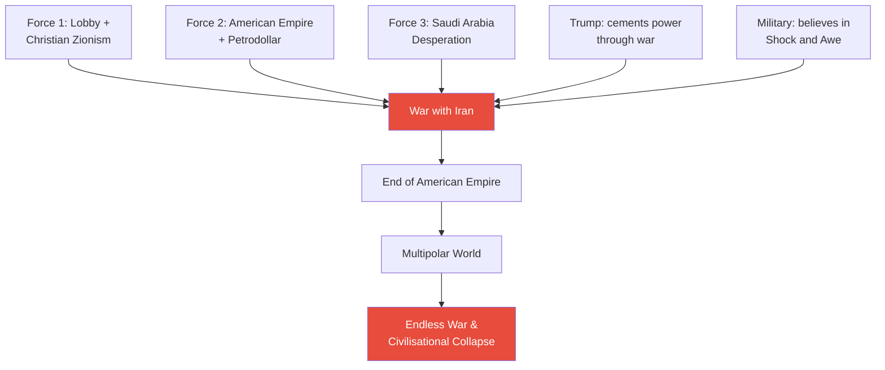
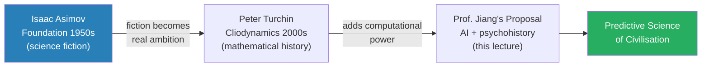
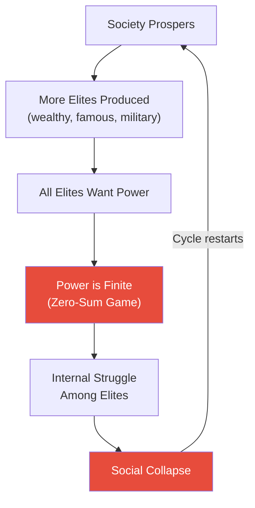
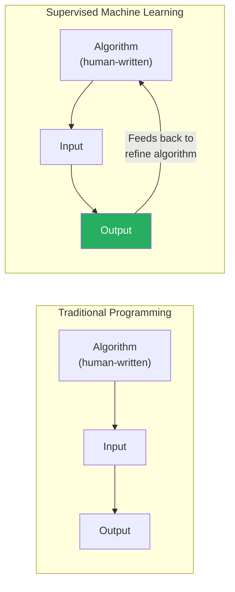
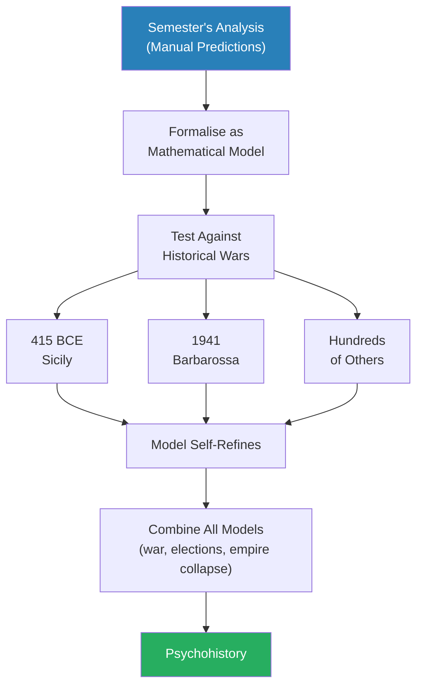
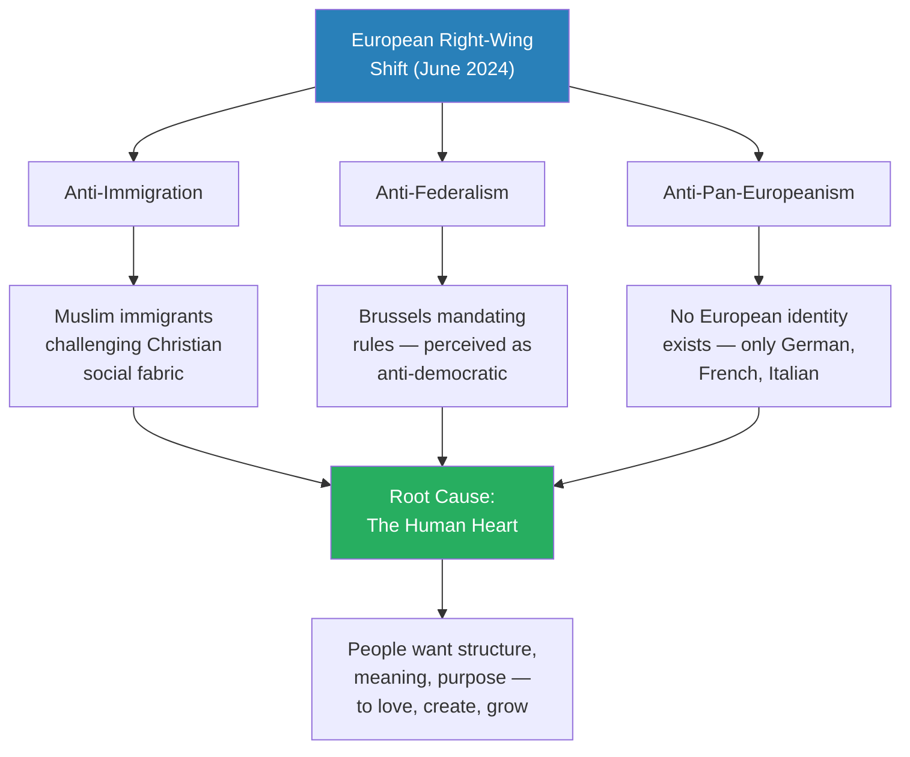
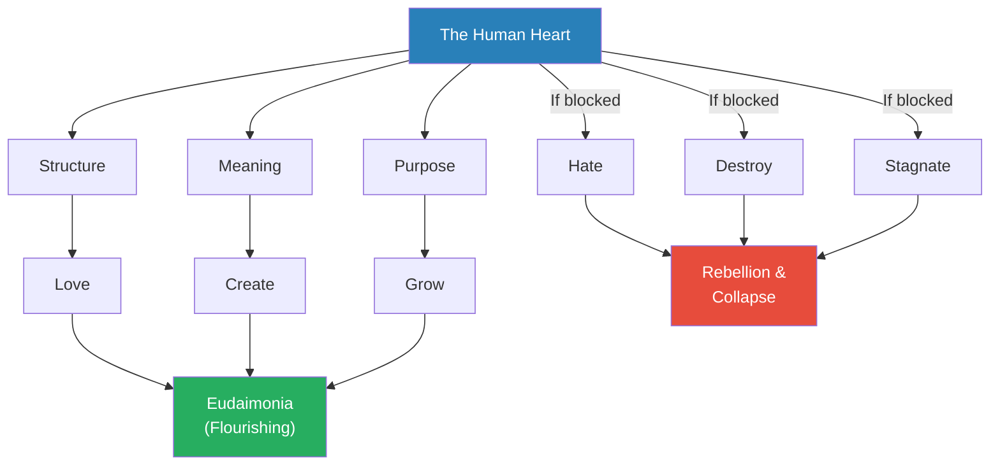
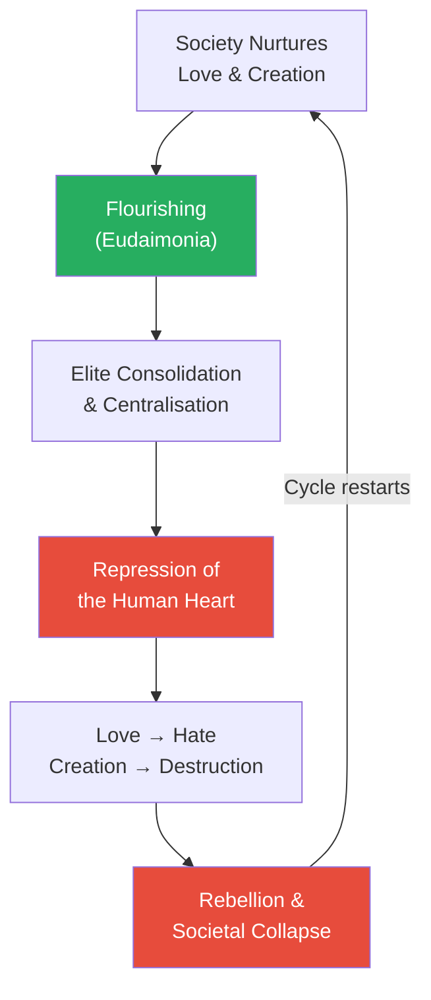
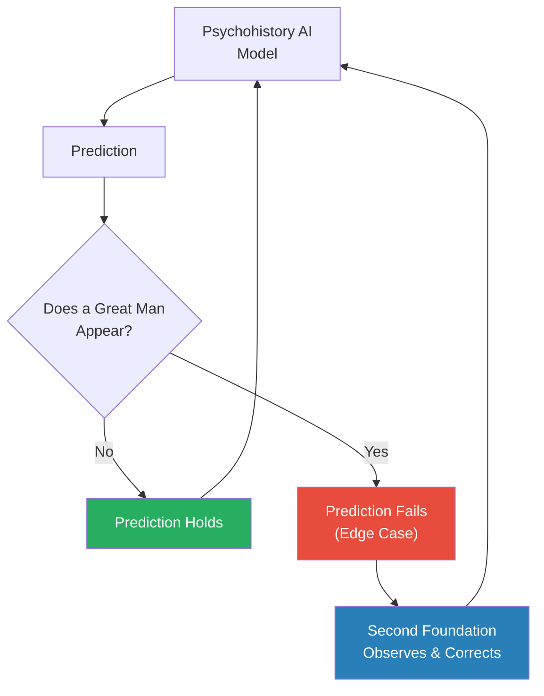
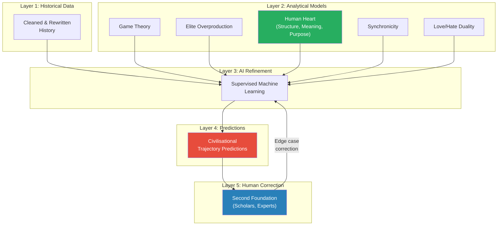

# Psychohistory (The Science of Imagining the Future)

> After eleven lectures painting the darkest possible future — Trump's election, war with Iran, the end of the American empire, multipolar chaos — Prof. Jiang devotes the series finale to hope. He introduces psychohistory, Isaac Asimov's science-fiction concept of mathematically predicting civilisational trajectories, and argues it could become reality through AI. The deeper message is not technological: drawing on Dante, Homer, and the Greeks, Prof. Jiang argues that imagination and love are the forces that allow humanity to reshape its destiny. The future, he insists, is not what happens to you — it is what you imagine and fight for.

---

## Overview: Key Highlights

- <b style="color: #27ae60">The future is not what happens to you — it is what you imagine and fight for</b> — Dante's message from the *Divine Comedy*, which anchors the entire finale
- <b style="color: #2980b9">Psychohistory</b> — Asimov's 1950s science-fiction concept: mathematically map human behaviour to predict and redirect civilisational trajectories
- <b style="color: #2980b9">Cliodynamics</b> — Peter Turchin's real-world attempt to model historical patterns mathematically, yielding the overproduction of elites as the key collapse mechanism
- <b style="color: #e74c3c">The overproduction of elites</b> — societies collapse not from external enemies but when too many people compete for a finite supply of power, tearing the society apart from within
- <b style="color: #e74c3c">"AI is a scam — what exists is supervised machine learning"</b> — a far more limited but still powerful tool: infinite iteration refining a human-written algorithm
- <b style="color: #27ae60">The human heart is the fundamental input variable</b> — all human behaviour traces to the need for structure, meaning, and purpose: to love, create, and grow
- <b style="color: #2980b9">Eudaimonia</b> — the Greek concept of a flourishing life, achieved when a person can love, create, and grow simultaneously — the target state psychohistory aims to protect
- <b style="color: #2980b9">Synchronicity</b> — the degree to which people voluntarily follow social rules; a measurable proxy for societal cohesion and resilience
- <b style="color: #e74c3c">Love and hate are one force</b> — if love is blocked, hate emerges; if creation is blocked, destruction emerges — the civilisational collapse mechanism
- <b style="color: #2980b9">Great Man Theory as edge case</b> — individuals like Homer, Dante, and Putin step outside history and redirect it; no algorithm can predict them
- <b style="color: #27ae60">The Second Foundation</b> — Asimov's solution: a team of human observers who correct the AI model when great men or edge cases appear
- <b style="color: #e74c3c">History itself is the biggest obstacle</b> — "the history that we have is complete bullshit" — corrupted narratives must be corrected before psychohistory can work

| Concept | One-line summary |
|---------|-----------------|
| **Psychohistory** | Asimov's fiction turned real ambition: mathematically predict and redirect civilisational trajectories |
| **Cliodynamics** | Peter Turchin's mathematical modelling of historical patterns — history treated as a dataset |
| **Elite overproduction** | Too many elites competing for a finite supply of power — the engine of civilisational collapse |
| **Supervised machine learning** | The correct term for "AI": human writes the algorithm; output feeds back to refine it infinitely |
| **Three AI requirements** | Clear metrics, clean data, and a working algorithm structure — all three must exist |
| **Edge case problem** | AI cannot handle a human who intentionally defies the system — the hard limit of all prediction |
| **The human heart** | The driver of all behaviour: structure, meaning, purpose — to love, create, and grow |
| **Eudaimonia** | A flourishing life: married to someone you love, doing creative work, growing every day |
| **Synchronicity** | How willingly people follow social rules — a measure of trust, cohesion, and resilience |
| **Great Man Theory** | Exceptional individuals who step outside historical forces and redirect history |
| **Second Foundation** | Human observers who monitor and correct the AI when edge cases arise |
| **Love/hate duality** | Love and hate are one force — block the positive and the negative inevitably emerges |

---

# The Lecture

## The Pivot From Darkness to Hope [0:00–1:30]

*Prof. Jiang opens the final class with a deliberate emotional pivot — eleven lectures of darkness ending in a manifesto for hope.*

> [!tip] Core Insight
> The entire semester has argued that structural forces are dragging the world toward catastrophe. The finale argues that the same analytical tools that predict darkness can, if formalised into a science, be used to redirect humanity's trajectory. Prediction is not fatalism — it is the first step toward agency.

*Eleven lectures of escalating darkness culminate in a finale that pivots from "what will happen" to "what we can make happen."*

> [!note]- Expand: Full Lecture Detail
> Prof. Jiang opens the final class by acknowledging what the semester has been: relentlessly dark. "The world is hopeless. We're all going to die." He names the semester's predictions — Trump re-elected, war with Iran, the end of the American empire, a multipolar world of endless war and the deaths of millions and billions, civilisational collapse from climate change. "This is an extremely hopeless and extremely bleak and dark picture of the world."
>
> Then the pivot: "But remember, where there is darkness, there can also be light." He draws on Dante's *Divine Comedy*, the final book of the great books course: "The future is not what happens to you. It's not something that you wait for. The future is what you imagine and fight for. The future is what you make happen."
>
> He frames the theological underpinning simply: "There is a God, but God gave us the ability to imagine and the capacity to love, and it's these two things that will guide us and enable us to build a better world." The lecture's thesis is not a prediction but a manifesto — if humanity does not like the future that structural forces are building, it can change that future. But only if it develops the tools to understand those forces.
>
> - The semester's function: not pessimism but diagnosis — identify the forces so we can redirect them
> - The finale's function: not false hope but methodology — show how imagination and knowledge can be formalised into a predictive science
> - The link: <b style="color: #27ae60">the same analytical rigour that predicts catastrophe can predict the path away from it</b>

---

## The Semester's Predictions as Raw Material [1:30–10:00]

*Before introducing psychohistory, Prof. Jiang recaps the semester's predictions — not as a list of doom, but as the dataset that a real psychohistory model would train on.*

*The semester's predictions were not random — they were derived from identifying push forces, counter-forces, and structural dynamics. This is the method psychohistory would formalise.*

> [!note]- Expand: Full Lecture Detail
> Prof. Jiang walks through the semester's predictions as a unified argument, not a list:
>
> - Trump will be elected again in November
> - Trump will declare war on Iran
> - The war will be a disaster for the United States — the end of the American empire
> - A multipolar world will emerge — meaning endless war and the deaths of millions, possibly billions
> - Climate change will eventually cause civilisational collapse
>
> He explains how each prediction was derived — the method matters as much as the prediction:
>
> - [[01 - Iran's Strategy Matrix]] — Iran fights asymmetrically and can control the terms of engagement
> - [[02 - Christian Zionism and the Middle East Conflict]] — Christian Zionism is Force 1 pushing the US toward war
> - [[03 - How Empire is Destroying America]] — empire economics and the petrodollar are Force 2
> - [[04 - Saudi Arabia's Trump Card Against Iran]] — Saudi desperation is Force 3
> - [[05 - Why Trump Will Win]] — Trump will be president when these forces converge
> - [[06 - America's Imperial Hubris]] — the US military will agree to fight due to institutional hubris
>
> His key point: "So for example, remember what we remember my predictions — the issue of lobby, Saudi Arabia and the American empire, basically the need to protect the petrodollar will force America to go to war with Iran. These are the push factors. The problem is that there are no force to counteract this."
>
> The predictions were made by identifying forces, counter-forces, and structural dynamics — the same method psychohistory would formalise and automate. The semester was, in effect, a manual prototype of the AI model he is about to propose.

---

## Psychohistory: From Asimov to Turchin [10:00–10:30]

*In the 1950s, a science fiction writer imagined a science that could predict the fate of galaxies. A modern historian has begun to make it real.*

> [!tip] Core Insight
> Psychohistory rests on a single premise: human behaviour in aggregate follows mathematical patterns. Individual actions are unpredictable, but civilisational trajectories are not. If this premise is correct, the future is knowable — and therefore changeable.

*The intellectual lineage: Asimov imagined it, Turchin began building it, and Prof. Jiang proposes that AI could complete the project.*

> [!note]- Expand: Full Lecture Detail
> **Isaac Asimov's Foundation**
>
> Prof. Jiang introduces <b style="color: #2980b9">psychohistory</b> through its origin: Isaac Asimov's *Foundation* series, written in the 1950s — "probably the most famous science fiction writer." The central idea:
>
> - The *Foundation* series is set a million years in the future
> - Humanity has colonised the entire Milky Way — billions of planets under a galactic empire
> - Like all empires, it must collapse — leading to 30,000 years of war, violence, and barbarism
> - A new science called psychohistory proposes a solution: mathematically map human behaviour over a million years
> - If you discover the patterns, you can predict the future
> - If you can predict the future, you can manipulate the course of events to shorten the dark age
> - Prof. Jiang adds drily: "I think there's a TV series now based on Foundation. It's terrible, but you can have a look at it."
>
> **Peter Turchin and Cliodynamics**
>
> The idea has already crossed from fiction into reality. Prof. Jiang introduces <b style="color: #2980b9">Peter Turchin</b>, a historian who founded <b style="color: #2980b9">Cliodynamics</b> — named for Clio, the Greek goddess of history:
>
> - "Clio is the goddess of history. Dynamics just means movement. So basically, Cliodynamics is trying to figure out the mathematical movement of history."
> - Turchin treated history as a dataset and looked for patterns in how civilisations rise and fall
> - His key discovery: <b style="color: #27ae60">the overproduction of the elites</b> — the concept that explains why societies collapse

---

## The Overproduction of Elites [10:00–10:30 continued]

*Why do societies collapse? Not debt, not inequality, not war — but too many elites fighting for too little power.*

*Turchin's elite overproduction cycle: the engine of civilisational collapse is not external enemies but internal competition among those who believe they deserve to rule.*

> [!note]- Expand: Full Lecture Detail
> Prof. Jiang explains the concept with characteristic directness:
>
> - "Society has many elites — people like Jack Ma, movie stars, famous military generals. Over time, elites become more and more numerous. The number of wealthy people go up. The number of famous people go up."
> - Wealth and fame are infinite resources — you can always create more billionaires, more celebrities
> - But <b style="color: #e74c3c">power is a finite, zero-sum resource</b>: "In this classroom, there can only be one teacher. If we're all teachers, there's no teacher."
> - "In society, there can only be a few powerful people. If everyone has power, no one has any power."
> - When too many elites compete for limited power, the internal struggle tears the society apart
>
> > [!example] Hong Xiuquan and the Taiping Rebellion
> > - In Imperial China, the keju (imperial examination system) was the path to power — pass the exam, become an official
> > - Problem: the system produced far more candidates than there were positions
> > - Failed candidates became angry, resentful, and revolutionary
> > - Hong Xiuquan was the most famous failed keju candidate
> > - After failing the examinations, he converted to Christianity
> > - He then led the Taiping Rebellion — one of the deadliest conflicts in human history
> > - His motivation was not ideology but rage at a system that promised merit-based advancement and delivered exclusion
> > **The lesson:** The people who destroy civilisations are not the oppressed masses — they are the elites who were promised power and denied it.
>
> Prof. Jiang notes the same pattern destroyed the Roman Empire. The crucial point: this principle was discovered not through narrative history but through mathematical modelling — comparing datasets from different civilisations and identifying the common factor in collapse.
>
> He then bridges to his proposal: "What I'm proposing to you is that we can actually go a step further to what Peter Turchin is doing, because we have something called AI."

---

## What AI Actually Is (And Is Not) [10:01–25:52]

*Prof. Jiang proposes using AI to build psychohistory — then immediately demystifies AI, arguing it is both less magical and more useful than people think.*

*The crucial difference: in supervised machine learning, the output feeds back to refine the algorithm — enabling infinite iteration toward an optimal solution.*

> [!note]- Expand: Full Lecture Detail
> Prof. Jiang opens with a flat declaration: <b style="color: #e74c3c">"AI is a scam. It does not exist. What exists is supervised machine learning."</b>
>
> He explains the distinction:
>
> - **Traditional programming:** You write the algorithm. You put in input. You get output. Example: algorithm = A + B; input = 2, 2; output = 4.
> - **Supervised machine learning:** You turn the output into an additional input, allowing the computer to refine and optimise the algorithm that you wrote
>   - The human still writes the initial algorithm and defines the output
>   - The computer iterates — potentially billions of times — to optimise
>   - "What all AI is, is infinite iteration"
>
> **The facial recognition walkthrough:**
>
> - Start with a database of approximately 1 billion people — everyone in China
> - Challenge: differentiate every face from every other face
> - Method: create a topological mathematical model of each face — analysing distance between eyes, nose size, facial proportions
> - "This mathematical model is so precise that I can only look at your eyes and I know who you are"
> - Critical limitation: "If you're not in this database, you can't be recognised"
>
> The training process:
>
> - Create a working theory (initial model) of what a face should look like
> - Feed the system actual faces; compare output to what is in the database
> - If the model produces incorrect matches, tell it "this is wrong"
> - The computer refines the model — iterating until accuracy is achieved
>
> **The three requirements for any AI to work:**
>
> | Requirement | Description | Example |
> |-------------|-------------|---------|
> | **Clear metrics / outputs** | The output must be mathematically definable | An airline maximising profit per flight |
> | **Clean data** | Data must be labelled, objective, and non-subjective | Animal classification datasets — NOT "best ice cream in the world" |
> | **Working algorithm structure** | The human must provide an initial algorithm | The topological face model — the computer cannot invent this from scratch |
>
> If all three conditions are met → AI can solve the problem. If any condition fails → the problem is unsolvable by AI.
>
> **What AI can and cannot solve:**
>
> - Can solve: facial recognition, translation software, recommendation engines (Netflix)
> - Cannot solve: self-driving cars — because of the edge case
>
> > [!example] The Self-Driving Car Edge Case
> > - Self-driving cars can plan for traffic, accidents, rules, and all standard conditions
> > - But they cannot plan for the edge case: a human who intentionally wants to crash into the car
> > - "If I'm a taxi driver and it's stealing my livelihood, and I want to crash into that car — there's no way for that AI to avoid the accident"
> > - Cars with self-driving features exist, but they are not 100% autonomous: "They tell you, don't rely on the autopilot. Don't sleep in the car."
> > - AI has no self-awareness: "It can only do what the algorithm tells it to do"
> > **The lesson:** The self-driving car is a metaphor for the limits of all prediction. Any mathematical model of human behaviour will have edge cases — individuals who intentionally defy the pattern. The model needs human correction.

---

## Building the Psychohistory AI [25:52–33:33]

*With AI demystified, Prof. Jiang explains how the semester's predictions could become inputs for a real predictive model — and how that model would be refined against thousands of years of history.*

*The path from manual predictions to automated psychohistory: formalise each prediction as a model, refine against history, then combine all models into a unified predictive science.*

> [!note]- Expand: Full Lecture Detail
> Prof. Jiang explains the translation from his semester's work to a formal AI model:
>
> - The semester's push factors (Lobby + Saudi Arabia + petrodollar) can be formalised as a mathematical model for war causation
> - Once formalised, the model is refined by testing against historical data:
>   - The 415 BCE Athenian invasion of Sicily
>   - 1941 Operation Barbarossa
>   - Hundreds of other wars throughout history
> - Each test case refines the model — making it more accurate
> - Separate models (war causation, election outcomes, empire decline) can eventually be combined
> - "Once you start putting all these models together, what eventually happens over time is you develop psychohistory"
>
> He reaffirms <b style="color: #2980b9">game theory analysis</b> as the first analytical framework for the model: no good and evil, only self-interested players developing strategies to optimise their ability to win. But game theory alone is insufficient — "you can also develop new ideas that would help you better understand how the world works." The rest of the lecture introduces those new ideas.

---

## Europe's Right Shift: The Human Heart Rebels [28:55–33:33]

*The June 2024 European Parliament elections provide a real-time case study for the principles Prof. Jiang wants to encode in the psychohistory model.*

*All three drivers of Europe's right-wing shift trace to the same root: people rebelling against systems that deny the fundamental needs of the human heart.*

> [!note]- Expand: Full Lecture Detail
> Prof. Jiang turns to recent news: the June 2024 European Parliament elections, which he describes as "pretty shocking — a clear shift to the right." Marine Le Pen's party gained significant votes in France. The AfD in Germany — "considered a right-wing organisation, almost neo-Nazi" — gained significantly. Emmanuel Macron called early elections. Prof. Jiang's prediction: Le Pen's party could govern France within three months.
>
> He identifies three causes:
>
> 1. **Anti-immigration:** Over 10–20 years, immigrants from Libya, Syria, Iraq, Afghanistan, Sudan, and Somalia — mainly Muslim — have challenged the Christian social fabric of Europe. "Europeans are rebelling against that."
>
> 2. **Anti-federalism / anti-bureaucratism:** Brussels mandates rules that member nations must follow. Citizens perceive this as anti-democratic — "a foreign power mandating rules that they must follow."
>
> 3. **Anti-pan-Europeanism:** "There's no European identity, guys. There's a German identity, a French identity, Italian, Spanish, Portuguese, but there's no European identity." His prediction: <b style="color: #e74c3c">"In about five years, the entire EU will be dead."</b>
>
> He explains the EU's original logic: for hundreds of years, Europe has been at war because of tribalism, religion, and nationalism. The EU project aimed to replace these with secular liberalism. But European voters are rejecting this bargain:
>
> - "What the European voters are saying to the EU is: sorry, we don't want secular liberalism because we want to be human."
> - "What we strive for is not an abstract liberal idea. We strive for structure, meaning and purpose in our lives."
> - "That's what's going on, not just in Europe, but throughout the world — Brexit, Trump, all of it."
>
> > [!example] The EU Project as Test Case
> > - The EU was founded to eliminate the causes of European war: nationalism, tribalism, religion
> > - It replaced them with secular liberalism, bureaucratic governance, and supranational identity
> > - For decades, the project appeared successful — peace, prosperity, open borders
> > - But the project required destroying local identity, community, and personal relationships
> > - European voters are now saying: the cure is worse than the disease
> > - They would rather risk the return of tribalism than live under an abstract system that denies their humanity
> > **The lesson:** Any system that requires suppressing the human heart will eventually face rebellion — no matter how rational its design.

---

## The Human Heart: The Fundamental Input Variable [33:33–42:52]

*Student Eric asks "what is the source of all this?" Prof. Jiang's answer — the human heart — becomes the most important single variable in the psychohistory model.*

*The human heart is the fundamental input variable for psychohistory. When its needs are met, civilisations flourish. When they are blocked, the same energy turns destructive.*

> [!note]- Expand: Full Lecture Detail
> Student Eric asks the question that anchors the rest of the lecture: "What is the source of all this?"
>
> Prof. Jiang's answer draws on both semesters of the course:
>
> - "What Homer and Dante would say is: the human heart. This is just who we are."
> - "If we cannot fulfil our human heart, we will rebel, we will destroy, we will want to kill."
> - This becomes a foundational principle for the AI model: <b style="color: #27ae60">there is a fundamental underlying structure to human society</b>
> - If society conforms to the structure of the human heart → the society prospers (the Athens model; the Greek word: **eudaimonia**)
> - If society represses the human heart → the society must eventually collapse
>
> **Student Sally objects:** aren't individuals unique? Don't people change over time?
>
> Prof. Jiang's response, citing Homer and Dante:
>
> - At the fundamental level, all humans share the same desires and motivations
> - "There's no one in this world that does not want structure, meaning and purpose"
> - The methods of achieving these may differ, but the underlying motivation is universal
> - <b style="color: #2980b9">Eudaimonia</b>: "When you achieve all three things, what do we call this? Eudaimonia. This is what the Greeks meant by a happy and self-fulfilled life."
>   - You are married to someone you love and have children
>   - You are doing a job that is creative
>   - You are constantly learning and growing every day
> - "There may be differences in needs and motivation, but at the fundamental level, we're all human beings, driven by the same fundamental needs."
>
> The model implication: the human heart can be turned into a mathematical model — "like a facial recognition model" — with love, creation, and growth as the target outputs.

---

## Synchronicity: Measuring Social Health [33:33 continued]

*Prof. Jiang introduces a concept that could serve as a measurable proxy for societal health — how willing are people to follow the rules?*

> [!note]- Expand: Full Lecture Detail
> <b style="color: #2980b9">Synchronicity</b> is defined as the degree of voluntary rule-following in a society:
>
> - Do drivers follow traffic rules?
> - Do people give up subway seats for the elderly, children, pregnant women?
> - Do people pick up garbage and throw it in the bin?
>
> What synchronicity measures:
>
> - **Cohesion and trust** — does society hold together voluntarily?
> - **Resilience** — can society recover from shocks?
> - **Capacity for growth** — can society learn from its mistakes?
>
> | Synchronicity Level | Example Societies | Implication |
> |--------------------|-------------------|-------------|
> | **High** | Japan, Germany | Resilient, capable of long-term growth |
> | **Low** | India, Brazil, China | Less resilient, more vulnerable to collapse |
>
> Societies with high synchronicity will outperform over the long term. This becomes another input variable for the psychohistory AI model — a measurable complement to the more abstract human heart principle.

---

## Mass Society and the Artificial Elite [37:04–40:23]

*Student Celine's question leads Prof. Jiang into one of his most provocative arguments: the elite are no better than anyone else, and their power rests on fictions that are currently collapsing.*

> [!tip] Core Insight
> The elite's power rests on fictions. When fictions fail, they resort to force. But force requires repressing the human heart — and the human heart always eventually rebels. This is the structural driver of civilisational collapse that psychohistory must model.

> [!note]- Expand: Full Lecture Detail
> Prof. Jiang makes a striking claim: <b style="color: #e74c3c">mass society is "a complete deviation from human history" — an accident</b>. Humans were not supposed to live in societies of millions or billions. Mass society requires an artificial elite, but "the elite, the people in charge, they're not better than you and me. We in this classroom could swap for the leadership of the world — nothing would change."
>
> **The fictions of elite power:**
>
> - "I went to Yale or Harvard, therefore I should be at the top"
> - "I have a higher IQ than you"
> - "My great-great-great-great grandfather was King"
> - These fictions work — for a time
>
> **The collapse of fictions:**
>
> The fictions fall apart because the elite prove incompetent. Global management of the economy — incompetent. Global management of COVID — incompetent. Global management of war — incompetent. "People sort of wake up: wait a minute, these guys don't really know what they're doing."
>
> **Repression as the final stage:**
>
> When fictions fail, the elite resort to force:
>
> - They must make people obedient through suppression
> - To control the population, they must repress the human heart — because "it's in the human heart to want to question, to be curious, to grow"
> - The method: redirect attention from thinking to consuming — "get you to focus on buying things rather than thinking"
> - This repression can last a long time, but it cannot last forever

---

## The Love/Hate Duality: Why Civilisations Destroy Themselves [~58:00]

*Student Celine asks the question that completes the model: if humans want to love, create, and grow, why do we end up destroying ourselves?*

*The civilisational cycle: flourishing breeds elite consolidation, which represses the human heart, which transforms love into hate and creation into destruction, which triggers collapse — and the cycle begins again.*

> [!note]- Expand: Full Lecture Detail
> Prof. Jiang's answer reveals the most important single principle for the psychohistory model:
>
> - <b style="color: #27ae60">Love and hate are one force</b>: "If I can't love you, I'm going to hate you."
> - <b style="color: #27ae60">Creation and destruction are one force</b>: "If I can't create, then I want to destroy, because my need for creation can't be satisfied."
>
> The cycle, stated precisely:
>
> 1. A society that nurtures love, creation, and growth — like the Greeks — will flourish
> 2. Eventually, elites consolidate and centralise power
> 3. They try to turn everyone else into "basically a slave"
> 4. Slaves cannot love, cannot create, cannot learn, cannot grow
> 5. Therefore they rebel and destroy the society
> 6. The cycle restarts
>
> > [!abstract] The Duality Principle
> > | Positive Force | Negative Force | Trigger for Reversal |
> > |---------------|----------------|---------------------|
> > | Love | Hate | When love is blocked |
> > | Creation | Destruction | When creation is blocked |
> > | Growth | Stagnation | When growth is blocked |
> > | Eudaimonia | Collapse | When the elite repress the human heart |
> >
> > The fundamental insight: these are not opposites but the same force expressed differently depending on whether society nurtures or represses human nature.

---

## Modelling the Human Heart: Three Variables [53:39–56:50]

*Student Celine asks the practical question: how do you actually model love, creation, and growth in a mathematical system?*

> [!note]- Expand: Full Lecture Detail
> Prof. Jiang identifies three quantifiable variables that must be encoded in the psychohistory model:
>
> **1. Agency and Freedom**
>
> - People need autonomy to pursue what they want
> - What they want is to love, create, and grow
> - If they have freedom and liberty, they can do so
> - The model must encode the degree of agency available in a society
>
> **2. Social Interaction**
>
> - Love, creation, and growth all require other people:
>   - "You can't love yourself — you have to love someone else"
>   - "You can't create by yourself — you have to create in a group"
>   - "You can't learn by yourself — you have to learn from others"
> - The model must measure the quantity and quality of group interaction
>
> **3. Compassion**
>
> - When people are united by necessity (survival on an island together), they become compassionate
> - When set against each other by competition (bank bonuses, Ferraris), "you all hate each other, you will all want to kill each other"
> - Compassion enables cooperation; cooperation enables the capacity to love, create, and grow
> - The model must factor in the degree to which a society's structures promote compassion vs. competition
>
> Prof. Jiang's rueful conclusion: "We have all these theories. It's just like no one's turning them into a mathematical model for society."

---

## Social Science vs. Literature: Two Paths to Truth [56:50–~58:00]

*Student Eric asks whether it is possible to completely understand human behaviour. Prof. Jiang identifies two complementary approaches — and argues that literature captures truths mathematics cannot.*

> [!note]- Expand: Full Lecture Detail
> **The social science approach:**
>
> - Economics, psychology, anthropology, sociology
> - All trying to figure out mathematically what drives us
> - This is the approach psychohistory would formalise through AI
>
> **The literature approach:**
>
> Some truths can be expressed but not quantified — these truths live in literature, in scenes and moments.
>
> > [!example] Priam and Achilles — The Iliad
> > - Achilles has killed Hector — Priam's son, Troy's greatest defender
> > - The old king sneaks alone into Achilles' tent in the enemy camp
> > - He kneels before the man who killed his son and kisses Achilles' hand
> > - In that moment, the war, the rage, the grief — everything is suspended
> > - Two enemies share the most fundamental human experience: loss
> > **The lesson:** "You can never mathematically express it. But think about how much truth and power is in that one scene."
>
> Prof. Jiang's conclusion: "Homer and Dante — their mission is to express to us in the most beautiful way the human truths. What drives us? And Dante is very explicit. He says what drives us is love and the willingness to imagine. That's who we are. And that has to be the underlying truth of whatever AI model you create."

---

## Implementation: The 50-100 Year Project [42:52–47:30]

*Student Sally asks the practical question: how do you actually build this AI? Prof. Jiang's answer is honest about the enormity of the challenge.*

> [!note]- Expand: Full Lecture Detail
> **Timeline:**
>
> - Minimum 50 to 100 years to create a validated psychohistory AI
> - Reason: predictions cannot be validated until they either come true or fail — "we won't know if my predictions are fully correct until 50 years from now"
>
> **Two parallel tracks:**
>
> 1. **Forward prediction and validation:** Continuously make predictions about the future. Wait and see if they come true. If wrong, revise the model. Repeat for decades.
>
> 2. **Backward reconstruction of history:** "Most of history is actually not correct." The AI model must challenge the entire discipline of history and reconstruct a more factually accurate account.
>
> > [!example] The Rise of Christianity — History as Fiction
> > - The standard narrative: an illiterate man named Jesus spread Christianity by himself after his death
> > - Prof. Jiang: "I don't believe that. A much easier explanation is that it became co-opted by the Roman Empire in order to control the Empire."
> > - "But if you would talk to a historian, they would say you're just wrong."
> > - Building psychohistory requires challenging these entrenched narratives with analytical rigour
> > **The lesson:** The historical data that would train the AI is corrupted by centuries of inaccurate narratives. Before you can predict the future, you must correct the past.
>
> **The interdisciplinary requirement:**
>
> - The project requires mathematicians (to build equations and models), computer programmers (to build the AI infrastructure), and historians (to provide and correct the data)
> - "I can tell you how I would analyse the issue, but then a mathematician has to turn this into a mathematical equation or a model, because computers only recognise like data and numbers"
>
> **The stakes:**
>
> - "If this project actually works, it would change the fate of humanity forever."
> - The reason humanity repeats the same mistakes: "the history that we have is complete bullshit — it just is — it's not true"
> - Psychohistory would break the cycle by giving humanity an accurate understanding of both past and future

---

## The Great Man Problem: Psychohistory's Edge Case [47:30–53:39]

*Student Eric asks the best question of the lecture: will this model encounter edge cases? The answer leads to Asimov's most provocative idea.*

*The Great Man Theory is psychohistory's edge case — individuals who step outside historical forces and redirect civilisation. The Second Foundation is the solution.*

> [!note]- Expand: Full Lecture Detail
> Student Eric asks: "Will this psychohistory model encounter edge cases?" Prof. Jiang's response: "That's the best question."
>
> The answer is yes. They are called the Great Man Theory:
>
> - "We believe that underlying historical forces control humanity. But now and then, you have this great man, out of nowhere, and he changes the course of human history forever."
> - "They're, by definition, beyond history. They can step outside of history and control history. That's what great men are."
>
> | Individual | Why Unpredictable |
> |-----------|-------------------|
> | **Homer** | Defined Greek civilisation through poetry — emerged from a collapsed society |
> | **Dante** | Redirected Western thought — also emerged from collapse |
> | **Plato** | Founded Western philosophy |
> | **Jesus** | Redirected the entire trajectory of civilisation |
> | **Julius Caesar** | Ended the Roman Republic |
> | **Augustus (Octavius)** | Created the Roman Empire |
> | **Putin** | Rose from obscurity to reshape the global order |
>
> **Asimov's solution — the Second Foundation:**
>
> - A separate organisation that monitors the psychohistory AI
> - A team of specialists who observe history as it unfolds
> - When an unpredictable individual appears, "I change the equations in the AI to account for Putin"
> - In the novels, these specialists are telepaths — they can read and control minds
>
> **Prof. Jiang's speculation on telepathy:**
>
> He takes Asimov's idea semi-seriously: "Is it possible in the future that telepaths will rise? I think yes." His argument is that the great men themselves may actually be telepaths:
>
> - <b style="color: #2980b9">"Something like Putin — why is Putin able to do what he does? He has almost some telepathic abilities. He can read other people's minds, he can control other people's minds. How else can you explain that someone who does not come from a special background — not of the Russian elite — is able to amass so much power all by himself in only a few decades, so that today he's basically the Emperor of Russia?"</b>
> - "You look at someone like Homer and Dante — the only explanation you can have is they had God-given gifts, or maybe God was speaking to them, or maybe they were just speaking for God. They so clearly stepped out of history and directed history."

---

## Who Controls the AI? The Democratic Imperative [1:01:24–1:09:30]

*Student Sally asks the question that any responsible thinker must ask: who controls this AI, and how do we prevent the elite from exploiting it?*

> [!note]- Expand: Full Lecture Detail
> Prof. Jiang's answer has three components:
>
> **1. The Second Foundation as governance:**
>
> - The AI must be overseen by "a group of scholars, academics, experts who dedicate themselves to this AI"
> - This is the real-world version of Asimov's Second Foundation
> - These people serve the model and humanity — not a nation or a faction
>
> **2. Openness and transparency:**
>
> - <b style="color: #27ae60">The AI must be open and transparent</b>
> - "If it's open and transparent, then everyone has to agree that this AI is going to be used for good"
> - The AI presents different scenarios for different questions — society collectively agrees on which scenario to pursue
> - It must be part of a democratic system — "otherwise, as Sally points out, it can only be abused"
>
> > [!example] The AI as Democratic Platform
> > - A government is considering military intervention in another country
> > - The psychohistory AI models the consequences: "If the United States intervenes in Ukraine, then this will happen. United States attacks Iran, then this will happen."
> > - The modelled consequences become "a very powerful argument for correct and proper behaviour"
> > - Citizens and leaders can evaluate the scenarios and collectively decide on action
> > - The AI does not dictate policy — it illuminates consequences
> > **The lesson:** Psychohistory is not a tool for control but a platform for informed collective decision-making. Its power lies in making consequences visible before actions are taken.
>
> **3. Speaking for all humanity:**
>
> The deepest challenge — different nations want different outcomes. America wants hegemony. Russia wants hegemony. China wants hegemony.
>
> Prof. Jiang's response: <b style="color: #e74c3c">the current structure is unsustainable</b>. "We are going to transition from a population of 8 billion to a population of 1 billion." When civilisation has collapsed and everyone is fighting for survival, humanity will be united in one goal: "How do we create a better civilisation?" The AI can only work if it "steps outside of history and steps outside of human interest — speaking for all humanity rather than one nation or one group of people."

---

## The Architecture of Psychohistory: A Synthesis [Full lecture synthesis]

*Bringing together all the concepts from the lecture and the entire series, the psychohistory project as a layered system.*

*The five-layer architecture of psychohistory: historical data and analytical models feed supervised machine learning, which produces predictions, which are monitored and corrected by the Second Foundation when edge cases arise.*

---

## A Father's Legacy [1:09:30–end]

*Prof. Jiang closes the series — and the school year — with a personal confession that reveals why he teaches.*

> [!note]- Expand: Full Lecture Detail
> The farewell has two parts:
>
> **The course in retrospect:**
>
> - First semester — the great books: "I was blown away by how much you guys enjoyed the great books and how much you benefit from reading them. I don't think anyone has tried this before — not at the pace we had, and certainly not at the level of difficulty."
> - Second semester — geopolitics: "I'm very impressed by how much you've grown. The way you guys think is much more logical, much more analytical, you guys are asking great questions."
>
> **Why he teaches:**
>
> He explains that he has "a very prestigious education background as well as a current career background" — he could have been a rich lawyer or a professor. Instead he teaches high school in China. The reason:
>
> <b style="color: #27ae60">"I have three kids — my eldest is six, my youngest is only about eight months. As a father, you have to believe in a better world. But not only do you have to believe in a better world, you have to imagine and to fight for it, because you have to leave behind a legacy for your children."</b>
>
> - The course is a message of hope: through imagination and hard work, students can create a better world
> - "You don't have to sit back and just let the world happen. You don't have to wait for the future. You can make it happen."
> - He invites students to stay in touch and perhaps one day collaborate on building psychohistory
>
> > [!quote] Prof. Jiang
> > "As a father, you have to believe in a better world. But not only do you have to believe in a better world, you have to imagine and to fight for it, because you have to leave behind a legacy for your children."

---

## Connections

**Builds on — all prior lectures in this series:**

- [[01 - Iran's Strategy Matrix]] — game theory as the foundational method for the psychohistory model
- [[02 - Christian Zionism and the Middle East Conflict]] — Force 1 pushing toward war (used as model input)
- [[03 - How Empire is Destroying America]] — empire economics and the petrodollar (model input)
- [[04 - Saudi Arabia's Trump Card Against Iran]] — Force 3 pushing toward war (model input)
- [[05 - Why Trump Will Win]] — Trump prediction as a proto-psychohistory example
- [[06 - America's Imperial Hubris]] — shock and awe and military hubris (model input)
- [[07 - Who Killed Iranian President Ebrahim Raisi]] — IRGC power consolidation
- [[09 - Putin's War for the Soul of Russia]] — Putin explicitly cited as a great man edge case
- [[10 - Putin's Strategic Imagination]] — Putin's ability to reshape global order as evidence of the Great Man problem
- [[11 - The Second American Civil War]] — internal American fracturing as another data point for the model

**Civilisation series connections:**

- [[01 - Explaining Humanity's Transition to Agriculture]] — the earliest civilisational transitions as test cases for the model
- [[06 - Elite Overproduction and the Bronze Age Collapse]] — Turchin's elite overproduction theory connects both series directly
- [[07 - Homer's Iliad and the Birth of Greek Civilization]] — Homer as a great man who stepped outside history; the Priam-Achilles scene as an irreducible human truth
- [[08 - Rat Utopia and the Peloponnesian War]] — civilisational decline patterns
- [[09 - Aeschylus, Sophocles, and Euripides as Prophets of Democracy]] — Athens as the model of eudaimonia

**Related books in vault:** [[Sapiens - Yuval Noah Harari]] (civilisational transitions, agricultural revolution), [[Antifragile - Nassim Nicholas Taleb]] (systems that benefit from disorder — relevant to the resilience and synchronicity concept)

---

## The Takeaway

The series finale reveals that the twelve lectures of the Geo-Strategy course — and the thirteen lectures of the Civilization course before it — were building toward a single, unified argument. The great books taught us what human nature is: Homer showed us the power of love and loss, Dante showed us the power of imagination, and the Greeks gave us eudaimonia — the vision of a flourishing life. The geopolitics course showed us what happens when the structures of power deny human nature: empires rise, overreach, and collapse; the military-industrial complex creates wars that serve no one; populations fracture along the fault lines of identity and meaning. Prof. Jiang's argument is that these are not separate observations but complementary halves of a single science — a science he calls psychohistory, borrowing Asimov's term for the mathematical prediction of civilisational trajectories.

The most surprising insight is not the AI proposal itself — which Prof. Jiang freely admits is speculative and would take 50–100 years to realise — but the claim that the biggest obstacle to prediction is not computational power or mathematical sophistication. The obstacle is that history itself is wrong. The datasets that would train the model are corrupted by centuries of narratives written to serve the powerful. Before we can predict the future, we must correct the past — and that requires the courage to challenge the entire discipline of history with analytical rigour. This is why he spends a semester teaching high school students to think for themselves rather than accept official narratives: every student who learns to question received wisdom is contributing, in a small way, to the corrected dataset that psychohistory will eventually require.

The open questions are enormous. Can the human heart — love, creation, growth — actually be quantified in a mathematical model, or will literature always express truths that equations cannot capture? Can an AI model be built that serves all of humanity rather than the interests of whichever nation or elite controls it? And can the Great Man problem ever be solved, or will history always be vulnerable to individuals who step outside its forces and redirect its course? Prof. Jiang does not pretend to have answers. But he ends where Dante ended: with hope. The future is not what happens to you. It is what you imagine and fight for. And if a father teaching high school students in China can make them think more clearly and question more deeply, then perhaps the world is already, imperceptibly, becoming better.
