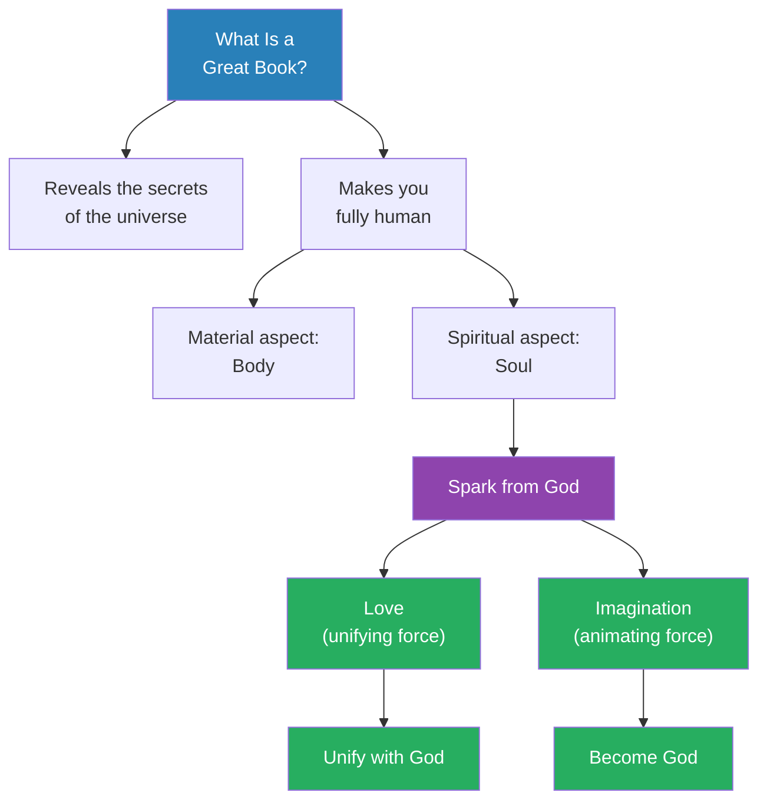
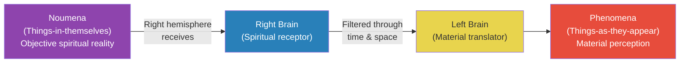
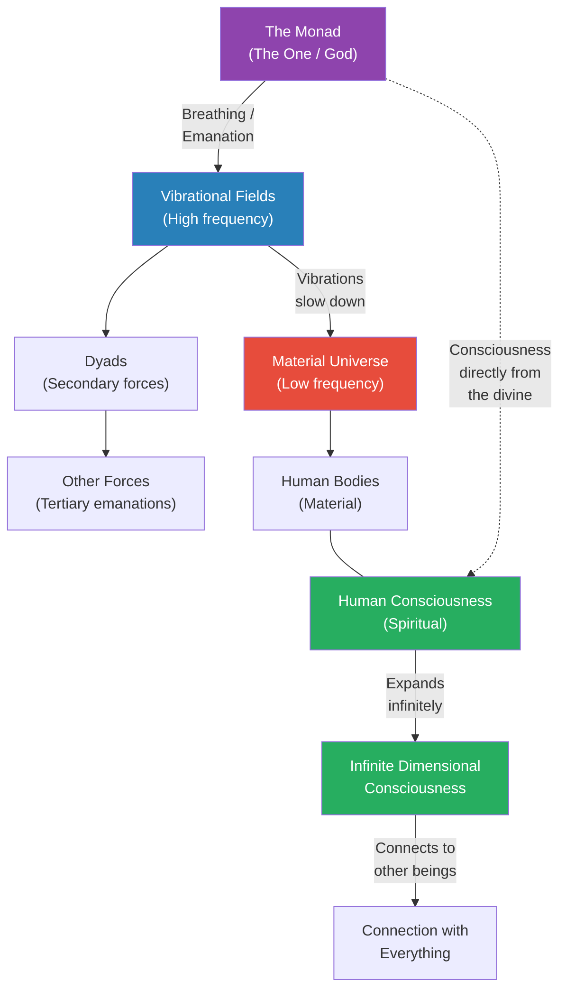
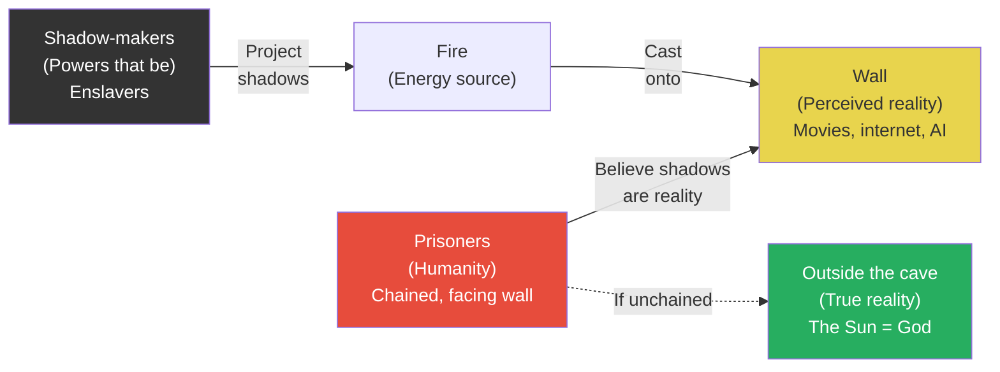
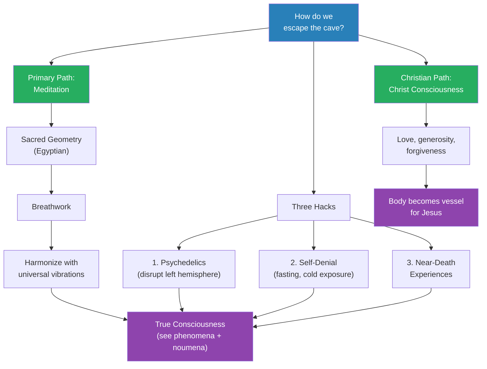
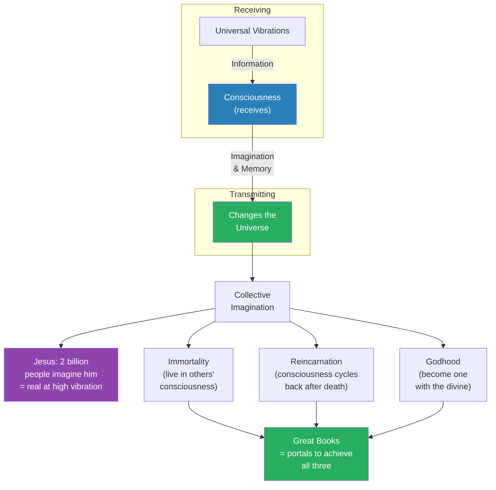
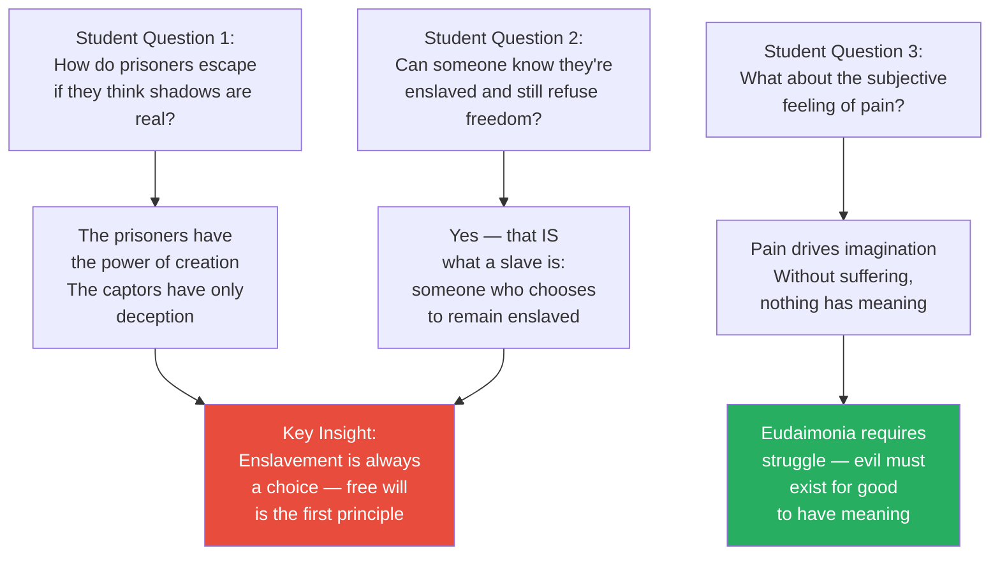

# Secrets of the Universe

> Prof. Jiang opens the Great Books series not with a book, but with a manifesto. The universe is not material — it is conscious. The human body belongs to the physical world, but human consciousness belongs to the divine, connected to the source of all things through vibration and imagination. Drawing on Kant's noumena-phenomena distinction, Julian Jaynes's bicameral brain, Plato's Allegory of the Cave, Egyptian sacred geometry, and Christian mysticism, Prof. Jiang constructs a unified framework: the material world is a prison designed to enslave human attention, and the great books are the keys to escape. This lecture is the philosophical foundation for the entire semester — every book they will read is presented as a portal to the divine, a means of achieving immortality, reincarnation, and Godhood through the act of imaginative possession.

---

## Overview: Key Highlights

- <b style="color: #27ae60">The universe is conscious, not material</b> — consciousness arises from vibrational energy, and the material world is secondary to the spiritual
- <b style="color: #e74c3c">School, science, and technology are systems of enslavement</b> — they redirect human attention away from the divine and toward a false material reality
- <b style="color: #2980b9">Noumena and phenomena (Kant)</b> — reality itself (noumena) is filtered through time and space by the brain to produce what we perceive (phenomena)
- <b style="color: #27ae60">Imagination is the animating force of the universe</b> — through imagination, humans actively participate in and reshape reality
- <b style="color: #2980b9">Plato's Allegory of the Cave</b> — prisoners chained to watch shadows on a wall, mistaking projections for reality, while powers behind them control their perception
- <b style="color: #e74c3c">The prisoners have the power, not the captors</b> — the enslaved possess imagination and divine connection; the enslavers possess only deception
- <b style="color: #2980b9">Sacred geometry (Egyptian)</b> — vibrational energy flows in geometric patterns, and meditation aligns consciousness with these patterns
- <b style="color: #27ae60">Love is the unifying force of the universe</b> — love reconnects the individual with the divine; imagination expands consciousness toward God
- <b style="color: #2980b9">Christ consciousness</b> — the body can become a vessel for divine inhabitation through love, forgiveness, and spiritual practice
- <b style="color: #27ae60">The three secrets: immortality, reincarnation, and Godhood</b> — achievable through love, imagination, and engagement with great books
- <b style="color: #e74c3c">Free will is the first principle of the universe</b> — enslavement is always a choice, even when it does not feel like one
- <b style="color: #2980b9">Great books as portals</b> — each great book captures a universe within itself, and entering it allows the reader to create their own universe

| Concept | One-line summary |
|---------|-----------------|
| **Noumena** | The things-in-themselves — objective reality beyond human perception, accessible only through the spirit |
| **Phenomena** | The things-as-they-appear — reality filtered through time, space, and the senses |
| **Monad** | The source, the one, God — the centre of the universe that emanates vibrational energy |
| **Dyads** | Secondary forces created by the Monad's emanation — the basic structure of the universe |
| **Sacred geometry** | Egyptian concept that vibrational energy flows in geometric patterns that govern universal structure |
| **Eudaimonia** | Greek concept meaning to flourish — the purpose of life is to vibrate, imagine, and create as fully as possible |
| **Christ consciousness** | The mystic Christian belief that the body can become a vessel for Jesus through love and forgiveness |
| **Plato's Cave** | Allegory where prisoners mistake shadows for reality — a metaphor for humanity's enslavement to material perception |
| **Bicameral brain** | Julian Jaynes's theory: the right hemisphere connects to the noumena, the left translates it into phenomena |
| **Free will** | The first principle of the universe — enslavement requires the prisoner's own participation |
| **Infinite dimensional consciousness** | Consciousness expands outward from the individual, connecting first to others, then to everything |
| **Great books** | Not merely texts but captured universes — portals to divine knowledge and self-creation |

---

# The Lecture

## What Is a Great Book? — The Central Claim [0:00-4:29]

*Prof. Jiang opens the semester with an audacious declaration: a great book is not a well-written text but a portal that makes you fully human by revealing the secrets of the universe. He immediately attacks the materialist worldview taught in schools and introduces the two dimensions of being human — the material body and the divine soul.*

> [!tip] Core Insight
> The universe is not material. It is conscious. The human soul carries a spark from God, and that spark powers two fundamental acts — love (which unifies with the divine) and imagination (which expands consciousness toward the divine). These are the secrets that schools, science, and governments suppress.

*The great book is not the destination — it is the mechanism. The spark from God enables two acts (love and imagination), and each act connects the individual to divinity in a different way: love unifies, imagination expands.*

> [!note]- Expand: Full Lecture Detail
> Prof. Jiang opens with a question: "What is a great book?" He answers immediately — a great book is something that makes you fully human by revealing to you the secrets of the universe and the secrets of what it means to be human.
>
> He then pivots to what school has taught them:
> - Evolution: humans evolved from monkeys, 99% of our DNA is chimpanzee DNA
> - Materialism: the world is what you can see, observe, and measure — and that is all
> - Prof. Jiang calls this <b style="color: #e74c3c">"the great lie, the great deception that we teach you in school, and we know it's a lie"</b>
>
> The reason it is a lie, he argues, is that none of it — nothing taught in school, university, graduate school, or science — answers a fundamental question:
> - **What is consciousness?** Why do we see the world the way we do? How do we think? How do we have ideas? How do we communicate?
> - "You're not allowed to ask this question, and therefore you're not allowed to ask — what does it mean to be human?"
>
> He presents his answer — there are two aspects of being human:
> - The **material aspect**: you have a body
> - The **spiritual aspect**: you have a soul that connects you to the spiritual or the divine
> - Inside that soul is <b style="color: #27ae60">a spark from God</b> — this spark enables love and imagination
>
> He defines the two fundamental acts:
> - **Love** — the unifying force of the universe, the "God force" — through love, you unify with God
> - **Imagination** — the animating force of the universe — through imagination, you expand your consciousness and become God
>
> The punchline: <b style="color: #27ae60">"The universe is not material. It is conscious."</b>

---

## Kant's Noumena and Phenomena — Perceiving Reality [0:00-4:29]

*Prof. Jiang introduces Immanuel Kant's distinction between the noumena (things-in-themselves) and the phenomena (things-as-they-appear), and then grounds it physically through Julian Jaynes's bicameral brain theory. The right hemisphere connects to the spiritual; the left translates it into the material.*

*The brain is a translation machine. The right hemisphere receives raw spiritual information from the noumena; the left hemisphere converts it into the material reality we perceive. Kant provided the philosophical framework; Jaynes gave it a physical basis.*

> [!note]- Expand: Full Lecture Detail
> Prof. Jiang introduces <b style="color: #2980b9">Immanuel Kant</b> as a philosopher trying to figure out what reality is.
>
> Kant's solution divides the world into two:
> - **Noumena** — "the things in themselves, the objective reality" — what actually exists
> - **Phenomena** — "the things to us, the things that appear to us" — what we perceive
> - The brain filters the noumena through **time and space** to produce the phenomena
> - "Our brains are constructed in a way that allows us to perceive the spiritual and turn it into material"
>
> He then introduces <b style="color: #2980b9">Julian Jaynes</b>, an American psychologist who gave this idea a physical basis:
> - The brain has a **right hemisphere** and a **left hemisphere**
> - The right hemisphere connects to the noumena — "the things in the self that we can never know"
> - The left hemisphere translates the noumena into the phenomena — through eyes, senses, and material perception
> - "The right hemisphere gets all this information from the noumena, the spiritual, and then the left brain, through our eyes, through our senses, translates it into the phenomena"
>
> Prof. Jiang then addresses the follow-up question: what IS the noumena?
> - <b style="color: #27ae60">The noumena is consciousness, which comes from energy, from vibrations</b>
> - "The entire universe is vibrations. Vibrations carry information. Information becomes consciousness."
> - He acknowledges the difficulty: "We can never describe the noumena, because it is beyond space and time. It's beyond our capacity to describe it." He can only explain it metaphorically.

---

## The Monad, Vibrations, and the Structure of the Universe [4:29-14:28]

*Prof. Jiang builds his metaphysical cosmology: a central source (the Monad) emanates vibrations that create all of reality. As vibrations slow, the material world forms. But matter remains connected to spirit. Human consciousness is part of this vibrational field — unique at one level, connected to everything at higher levels.*

> [!tip] Core Insight
> The universe is a vibrational field emanating from a single source. Matter is just vibration that has slowed down. This means the material world is not separate from the spiritual — it is the spiritual, experienced at a lower frequency.

*The Monad breathes, creating vibrations. At high frequency, the universe is purely spiritual. As vibrations slow, materiality forms. But even the material world is connected back to the source. Human consciousness exists at the intersection — the body is material, the consciousness is divine.*

> [!note]- Expand: Full Lecture Detail
> Prof. Jiang introduces the metaphysical architecture of the universe:
>
> - There is a source called <b style="color: #2980b9">the Monad</b> — "the one, the centre of the universe, God"
> - The Monad works through **breathing — emanation** — creating vibrations throughout the universe
> - "The monad breathes in and breathes out, and this is the basis of the universe — these vibrational fields"
> - This process also creates other entities called <b style="color: #2980b9">the Dyads</b> — the basic structure of the universe
> - The Dyads create further forces — cascading outward from the source
>
> How materiality forms:
> - As the universe keeps vibrating, frequencies become slower — "you go from high, ah, to low, boom"
> - Because vibrations slow, "physicality, materialism develops — this creates the material universe"
> - But the key understanding: <b style="color: #27ae60">"Material is always connected to the spiritual — this entire force, entire universe, it's all interconnected together. It's both everything and nothing at the same time."</b>
>
> How human consciousness fits:
> - Our bodies are part of the material world — created through evolution
> - Our consciousness comes from the divine — created through the vibrations of the universe
> - "Our consciousness is connected with the universe itself"
>
> Prof. Jiang then introduces <b style="color: #2980b9">infinite dimensional consciousness</b>:
> - "Your consciousness is expanding infinitely into the universe"
> - At one level, you are unique — your consciousness is yours alone
> - At a higher level, you connect with someone else, then another person, then another
> - "You go on and on until you connect with everything"
> - "Within your consciousness is a capacity to connect with the entire universe, but it's really far, far away"
>
> He acknowledges the difficulty: "This is complicated, and so different philosophers throughout history have tried to figure out how to best articulate this truth."

---

## Plato's Allegory of the Cave — The Human Condition [4:29-14:28]

*Prof. Jiang presents Plato's Cave as the master metaphor for the human condition: prisoners chained to watch shadows on a wall, mistaking projections for reality. The powers behind them use deception to capture human imagination and redirect it to construct the reality they desire. Movies, social media, AI, and school are all shadow-projections.*

*The prisoners possess imagination — the power to create reality. The shadow-makers possess only deception. The entire system depends on the prisoners not realising they have the power. Escape means looking inward, connecting back to God, and seeing the material world for what it is: a projection.*

> [!note]- Expand: Full Lecture Detail
> Prof. Jiang introduces <b style="color: #2980b9">Plato's Allegory of the Cave</b> as the best metaphor for understanding "who we are, where we came from, and where we're going."
>
> The setup:
> - Prisoners chained to the ground — necks chained, arms chained, cannot move their heads or stand
> - They face a wall
> - Behind them is a great fire
> - Behind the fire are unknown figures who project shadows onto the wall
> - "Because we the prisoners cannot see the entirety of reality, we believe that the wall itself is reality"
> - He gives a modern example: "We watch movies and we think this is a reality"
>
> Why the shadow-makers do this — the answer is <b style="color: #e74c3c">enslavement</b>:
> - "If the universe is conscious, our energy comes from our attention. Attention is energy."
> - "What they want is our energy — that's true wealth"
> - "If they're able to focus our energy, capture our imagination, they can construct reality in the way that they want"
> - "Because reality is what we imagine it to be — the imagination is the animating force of the universe"
>
> He connects this directly to the modern world:
> - "Now we understand why we watch movies"
> - "Now we understand why we have the internet"
> - "Now we understand why the school wants you to love artificial intelligence — because it should enslave you"
> - <b style="color: #e74c3c">"All of human history is about enslavement. That's what progress is."</b>
>
> The critical inversion — who has the real power:
> - "We are the ones with the power of God. We're the ones with imagination."
> - "The ones behind us don't have an imagination. They have power, but they don't have imagination."
> - "They need to trick us into wanting to create the world they want us to create"
>
> > [!example] The Cave in the Modern World
> > - Movies, the internet, social media, and AI are all shadow-projections on the wall
> > - "Progress" — from cinema to smartphones to ChatGPT — is not liberation but escalating enslavement
> > - The school system trains students to accept the wall as reality
> > - The shadow-makers may be the elite, the powers that be, or "demons" — Prof. Jiang says "we don't know"
> > - What matters is the mechanism: they capture human attention (energy) and redirect imagination to construct their preferred reality
> > **The lesson:** The prisoners have the power of God — imagination. The captors have only deception. The entire system collapses the moment the prisoners realise this.

---

## Freedom — Escaping the Cave [14:28-17:24]

*Prof. Jiang describes what freedom means within this framework: one prisoner's chains break, he stumbles out of the cave, is blinded by the sun (God), and gradually learns to see a world that is beautiful, infinite, diverse, and alive — everything the cave was not. Freedom is not political or economic. It is perceptual and spiritual.*

> [!note]- Expand: Full Lecture Detail
> Prof. Jiang continues Plato's allegory — what happens when someone escapes:
>
> - One prisoner's chains break loose, and he stumbles out of the cave "into the wilderness"
> - He sees the sun — <b style="color: #27ae60">"the sun, of course, is God"</b>
> - "At first he's blinded by the light — you hate it, but you struggle"
> - "Then you can teach your eyes to see"
> - "Then you recognize that this world is beautiful. It is infinite. It's diverse. It's alive."
> - "This world that you thought was real is just a corpse. It's a dead zombie world."
>
> What freedom actually means:
> - "Freedom means that you are now finally able to awake from this terrible nightmare"
> - You see everything around you — "movies, the AI, school — as prison, as hell"
> - You are able to "look inside yourself and then connect back to God"
> - To "look beyond the phenomena and return to the noumena — to peer into the noumena, which is vibrations, energy"
>
> But there is a cost. Prof. Jiang foreshadows Plato's conclusion: when the freed prisoner returns to tell the others, "they're gonna kill him." <b style="color: #e74c3c">"If you dare speak the truth and people know the truth, they will kill you for speaking the truth."</b> His advice: "Don't try to convince anyone of the truth. Just know the truth for yourself and be for yourself."

---

## The Path to Freedom — Meditation and the Hacks [17:24-23:18]

*Prof. Jiang explains how to escape: the primary path is meditation — using breathwork to align consciousness with the vibrational geometry of the universe. For those unwilling to spend decades meditating, there are three "hacks": psychedelics, self-denial (fasting and exposure), and near-death experiences. He then introduces the Christian path — Christ consciousness.*

*Every religious tradition converges on the same solution: meditation. The "hacks" are shortcuts that bypass decades of practice by disrupting normal perception. The Christian path offers a specific mechanism — making the body a portal for divine inhabitation through love and forgiveness.*

> [!note]- Expand: Full Lecture Detail
> Prof. Jiang poses the follow-up question: "Okay, that's fine, but how do we escape?"
>
> He begins with the universal answer: <b style="color: #27ae60">"Every single religion — Buddhism, Hinduism, Taoism, Christianity, Judaism — proposes the same solution: meditation."</b>
>
> **Sacred Geometry and Breathwork:**
> - If the world is vibration and it flows, "there must be a logic to this flow — a certain structure to this movement"
> - The Egyptians spent thousands of years figuring this out: <b style="color: #2980b9">sacred geometry</b> — vibrational energy flows in certain geometric patterns
> - These geometric patterns are "the basis for the universe itself"
> - If we understand sacred geometry, "we can construct our consciousness in a way that allows us to match the vibrational flow of the universe — to harmonize with the universe"
> - How? Through **breathing** — "by breathing, you can structure your consciousness in a way that becomes part of the universe itself"
> - "This will take decades, but you can do this"
> - When you harmonize, "reality itself reveals itself to you — you're going to see this world as false"
> - <b style="color: #27ae60">"This is what all monks in the world are trying to do — leave your body and embrace the spiritual"</b>
>
> **The Three Hacks:**
>
> - **Psychedelics** — magic mushrooms, ayahuasca, peyote — "they alter your consciousness in a way that disrupts your left hemisphere and allows you to focus on your right hemisphere, which allows you to see the noumena"
>   - "When you see the noumena, you're like — oh my god, it's just energy, just colours"
>   - Psychedelic art reflects this — "very colourful, very strong, all vibrational"
>
> - **Self-denial** — fasting, going out naked in the cold — "when you collapse your body and you're approaching death, your consciousness shifts into the spiritual"
>   - "Death is release, because this world that we live in, our bodies are the prison"
>   - <b style="color: #27ae60">"Don't fear death. It's just part of the natural cycle."</b>
>
> - **Near-death experiences** — people who die briefly in car accidents or drownings — "they all come back and say the same thing"
>   - They escape into the spiritual realm and meet God
>   - "These are people who don't know each other, but they say the same thing"
>   - The world they describe "is Plato's world — like escaping the cave and going to the world of light — a world of compassion, of love, of forgiveness — as though you're connected again with the divine"
>
> **Christ Consciousness:**
>
> > [!example] The Christian Path to Freedom
> > - Christian mystics believe there is a way to connect fully with the divine through Jesus
> > - The mechanism: make your body a vessel — a portal — for Jesus to inhabit
> > - This requires certain spiritual practices: love, generosity, forgiveness
> > - Prof. Jiang makes the cost vivid: "If someone killed your son, you may hate that person — if someone killed my children, I'd be pissed off — I would hate that person forever"
> > - "But if you're able to forgive that person, of your own free choice, you open yourself up to divinity"
> > - This divinity flows into you — "this is what we call the Christ consciousness, or the second coming of Jesus"
> > - "Christian mystics believe that Jesus can always return if you open your heart to Jesus"
> > - "But you have to construct your body, your mind, your consciousness in a way that allows for Jesus to inhabit you"
> > **The lesson:** The Second Coming is not an external event but an internal transformation. It requires the hardest act imaginable — genuine forgiveness of the unforgivable.

---

## Active Participation — Memory, Imagination, and Immortality [23:18-33:22]

*Prof. Jiang shifts from passive perception to active participation: humans are not just receivers of vibrational information but transmitters. Through imagination and memory, we change the universe itself. This leads to the three great secrets — immortality (living in others' consciousness), reincarnation (the consciousness cycle), and Godhood (becoming one with the divine) — and to the claim that great books are the mechanism for achieving all three.*

> [!tip] Core Insight
> Reality is not fixed. It is collectively imagined into existence. If enough people imagine something to be true — as two billion Christians imagine Jesus — it becomes real at the highest vibrational level. The great books capture universes, and by entering them, you gain the power to create your own.

*The model is bidirectional: consciousness receives from the universe and transmits back into it. Collective imagination makes the imagined real. The three secrets — immortality, reincarnation, Godhood — are not theological abstractions but practical consequences of how consciousness works. The great books are the tools.*

> [!note]- Expand: Full Lecture Detail
> Prof. Jiang makes a crucial pivot: "We're not just passive observers of reality — we're active participants in reality. That's what Kant teaches us."
>
> **The Internet Metaphor:**
> - "Think of the internet. A laptop works because it connects to the internet — it receives information"
> - "But then you change this information, it goes back into the internet"
> - "Through the construction of memories, you are participating in the universe"
> - As we receive vibrations and create memories, we implant those memories into consciousness, <b style="color: #27ae60">which changes the universe itself</b>
>
> **The Ocean Metaphor:**
> - "Think of an ocean — and all these pebbles are dropping into the ocean, which creates vibrations"
> - "You are a pebble — your role in the world is to create as much of a splash as possible"
> - He introduces the Greek concept <b style="color: #2980b9">eudaimonia</b> — "the purpose of life is to be your creative best, to flourish, to blossom, to imagine, to vibrate as much as possible"
>
> **Collective Imagination Creates Reality:**
> - "If we all at the same time imagine something to be true, it becomes true"
> - He uses Jesus as the example: "Who's the most famous person in the world? Jesus."
> - "Jesus is immortal — he's eternal — because there are two billion people in the world who love him, who imagine him all the time, who believe that he's part of their lives"
> - "Because of their imagination, Jesus is still with us today — but he's at a high vibration"
>
> **Resurrecting Jesus / Christ Consciousness:**
> - "How do you resurrect Jesus? How do you bring him back?"
> - "By making your body a vessel for Jesus to return in — your body can become a portal for Jesus to inhabit, to possess"
> - The conditions: love, generosity, forgiveness — and the ultimate test is forgiving the unforgivable
>
> **The Three Secrets of the Universe:**
> - <b style="color: #27ae60">Immortality</b> — by living in the memories and imaginations of others
> - <b style="color: #27ae60">Reincarnation</b> — when we die, consciousness escapes back into the spiritual, and "maybe 1000 years later, we come back"
> - <b style="color: #27ae60">Godhood</b> — becoming one with the divine through love, imagination, and spiritual practice
> - "The secret is love, power, and our imagination. We're here to imagine things."
> - "Most of us will fail, but it's okay — because our consciousness is forever"
>
> **The Great Books as Mechanism:**
> - "The great books are constructed in a way that allows you to access the entire secrets of the universe"
> - "A great book is a capturing of the universe in a state — there's a universe within the great books"
> - "By embracing the great books, by letting the great books come to you, and then you enter the great books — you have the capacity to travel in a new universe, but you also have the capacity to create your own universe"
>
> > [!example] The Great Books as Resurrection
> > - Christians want to be possessed by Jesus — to welcome Jesus into their consciousness and resurrect the Christ consciousness
> > - Prof. Jiang proposes the same mechanism with the great authors: Homer, Plato, Dante, Kant
> > - "I will teach you the power, the secret to resurrect Homer and Dante inside of you"
> > - Three conditions: it must be your choice, you must abandon the material world, and you must dedicate your entire life to it
> > - "This class is meant to be a sample — it's not meant to provide all the answers"
> > **The lesson:** The great books are not objects to study but spirits to welcome. Reading is not analysis — it is an act of possession, where the greatest minds of civilisation enter and inhabit the reader.
>
> **The Semester Plan:**
> - The Iliad (Homer)
> - The Odyssey (Homer)
> - The Republic (Plato)
> - The Aeneid (Virgil) — "not a great book, by the way, but we have to read it anyway"
> - Divine Comedy (Dante)
> - Possibly The Critique of Pure Reason (Kant) — "but we may not have time"

---

## Q&A — Free Will, Enslavement, and Pain [33:22-end]

*Students challenge Prof. Jiang on Plato's Cave, the nature of enslavement, and the problem of physical pain. His answers crystallise the lecture's core argument: enslavement is always a choice, the powers that be lack imagination, and pain exists because meaning requires struggle.*

*Three student questions, one unified answer: the universe is designed to maximise imagination, and imagination requires free will, struggle, and the real possibility of failure. Pain is not a flaw in the system — it is the system's engine.*

> [!note]- Expand: Full Lecture Detail
> **Question 1 — How do the prisoners escape?**
>
> A student asks about the relationship between the shadow-makers and the prisoners in Plato's Cave — if the prisoners think the shadows are real, how can they escape?
>
> Prof. Jiang corrects the framing:
> - "These prisoners — they're the ones who have the capacity to create reality"
> - "The powers behind them — these people — don't have the power to create reality"
> - "What they need to do is trick them into creating the reality that they want them to create"
> - "They hide in the shadows, and they give you tricks — they use deception, manipulation"
> - <b style="color: #e74c3c">"We are the ones with the power of God. We're the ones with imagination. The ones behind us don't have an imagination. They have power, but they don't have imagination."</b>
>
> He connects it to school:
> - "Why do you go to school? Being a slave? We say, 'I'm in school so I can get into a good college, make a lot of money, and live a happy life.' You've been tricked."
> - "You don't need money to be happy. You have yourself. You have your imagination. You have the capacity to love anyone."
> - "No, no, no, I need a billion dollars to buy my brother a Porsche. I need to buy my mother a yacht. That's what my mother really wants. You've been tricked."
>
> **Question 2 — Can a slave know they're enslaved and still refuse freedom?**
>
> A second student asks whether someone can consciously recognise their enslavement yet still refuse freedom.
>
> Prof. Jiang's answer is sharp:
> - "That's what a slave IS — someone who wants to be a slave, who chooses to be a slave"
> - "It's all choice, it's all free will — I cannot make you force you to lie to yourself"
> - <b style="color: #e74c3c">"Free will is the number one principle of the universe"</b>
> - "When you say 'I'm forced to be a slave,' you're lying to yourself. It's always been your choice."
> - He returns to the allegory: when the freed prisoner comes back to tell the others, "they're gonna kill him"
> - Plato's lesson: "If you dare speak the truth and people know the truth, they will kill you for speaking the truth"
> - His practical advice: "Don't try to convince anyone of the truth. Just know the truth for yourself."
> - On death: "You trick yourself into thinking that death is the worst thing that can happen to you, when in reality, it's slavery. That's the worst thing. You fear death, but you are living death right now."
>
> **Question 3 — What about physical pain?**
>
> A third student asks about the subjective physical feeling of pain.
>
> Prof. Jiang's answer reframes pain as essential:
> - "The universe is constructed in a way to promote imagination — the universe is trying to vibrate more, which means imagine more"
> - "If you can't feel pain, if you can't suffer, if you can't lose, if there's no evil, you can't imagine things"
> - "If everything was so easy, nothing would ever have any meaning"
> - The gym analogy: "If you just drink some water, lie around for ten hours, and have an amazing physique — that would just not be beneficial to anyone"
> - "Only through pain and suffering can you truly achieve your full potential as a human"
> - "That's why these monks meditate for decades in the snow — because they understand that pain is what allows you to focus your mind"
> - <b style="color: #27ae60">"Without evil, there can be no good. Everyone's good — then what's the point of being good? It's only when everyone is evil and you choose to be good — that's what gives meaning to your life."</b>
>
> He closes with a promise about the great books: "When you actually read the great books, you will recognise that's what they're saying. But what's more important is they're going to give you the energy, the strength, the power to liberate yourself, if you truly open your heart to the great books."

---

## Connections

**Builds on:** This is Lecture 1 — the philosophical manifesto for the entire Great Books series. Every subsequent lecture rests on the framework established here: the universe is conscious, the material world is a prison, and the great books are portals to divine knowledge. The noumena-phenomena framework, Plato's Cave, and the concept of imaginative possession will recur throughout the semester as lenses for reading Homer, Plato, Virgil, Dante, and Kant.

**Sets up:** [[02 - Homer and the Invention of the Human]] will be the first application of this framework — reading the Iliad not as a war poem but as a text that reveals what it means to be human. The semester plan includes The Iliad, The Odyssey, The Republic (Plato), The Aeneid (Virgil), Divine Comedy (Dante), and possibly The Critique of Pure Reason (Kant).

**Recurring themes established:**
- The universe as consciousness — the foundational metaphysical claim of the series
- Material reality as enslavement — movies, school, AI, and social media as shadow-projections
- Free will as the first principle — you cannot be enslaved without choosing it
- The great books as portals — not texts to study but spirits to welcome into yourself
- Imagination as divine power — the animating force of the universe, possessed by humans but not by the powers that enslave them
- Pain and suffering as necessary for meaning — the universe requires struggle to generate imagination

**Related lectures:**
- [[01 - Explaining Humanity's Transition to Agriculture]] (Civilization series) — Prof. Jiang's argument there that religion drove the transition to agriculture parallels his claim here that consciousness and spirituality, not material forces, are the primary engines of human history

**Related books in vault:**
- [[The Republic - Plato]] — the Allegory of the Cave originates here; Prof. Jiang's reading treats it as literal metaphysics, not just epistemology
- [[Critique of Pure Reason - Immanuel Kant]] — the noumena-phenomena distinction is foundational to the lecture's framework

---

## The Takeaway

This lecture is not an introduction to literature — it is a declaration of war against the materialist worldview. Prof. Jiang's central claim is stark: the universe is conscious, the material world is a prison constructed to capture human attention, and the great books are the keys to liberation. Whether one accepts the metaphysics or not, the framework provides a radically different lens for reading: the great books are not cultural artefacts to be analysed but living portals to be entered. Homer and Dante are not dead authors but spirits waiting to be resurrected inside the reader's consciousness.

The most provocative idea is the inversion of power in Plato's Cave. The prisoners — humanity — possess imagination, the animating force of the universe. The shadow-makers possess only deception. This means the enslaved are more powerful than the enslavers, and the only thing sustaining the system is the prisoners' refusal to look away from the wall. Free will is simultaneously the greatest gift and the greatest danger: it means liberation is always available, but it also means enslavement is always chosen.

What remains open is everything practical. Prof. Jiang acknowledges that "most of us will fail" and that the path requires decades of dedication and the abandonment of material concerns. The semester will test whether the great books — starting with Homer's Iliad — can function as the portals he claims they are. The framework is set; the evidence begins next lecture.
