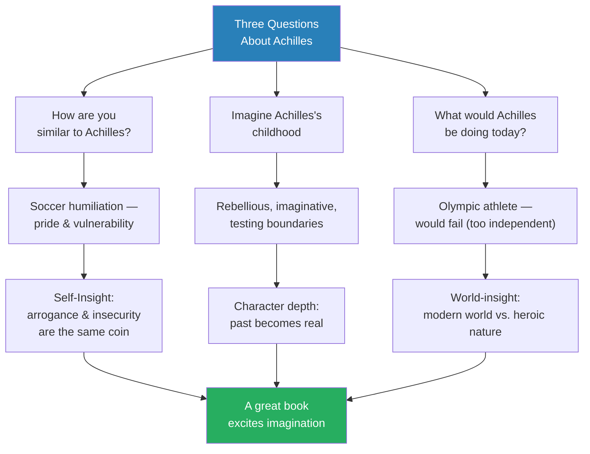
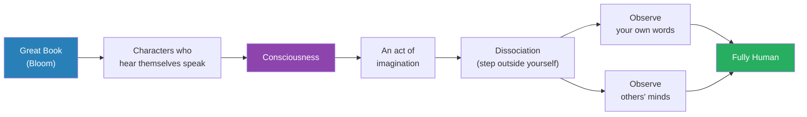
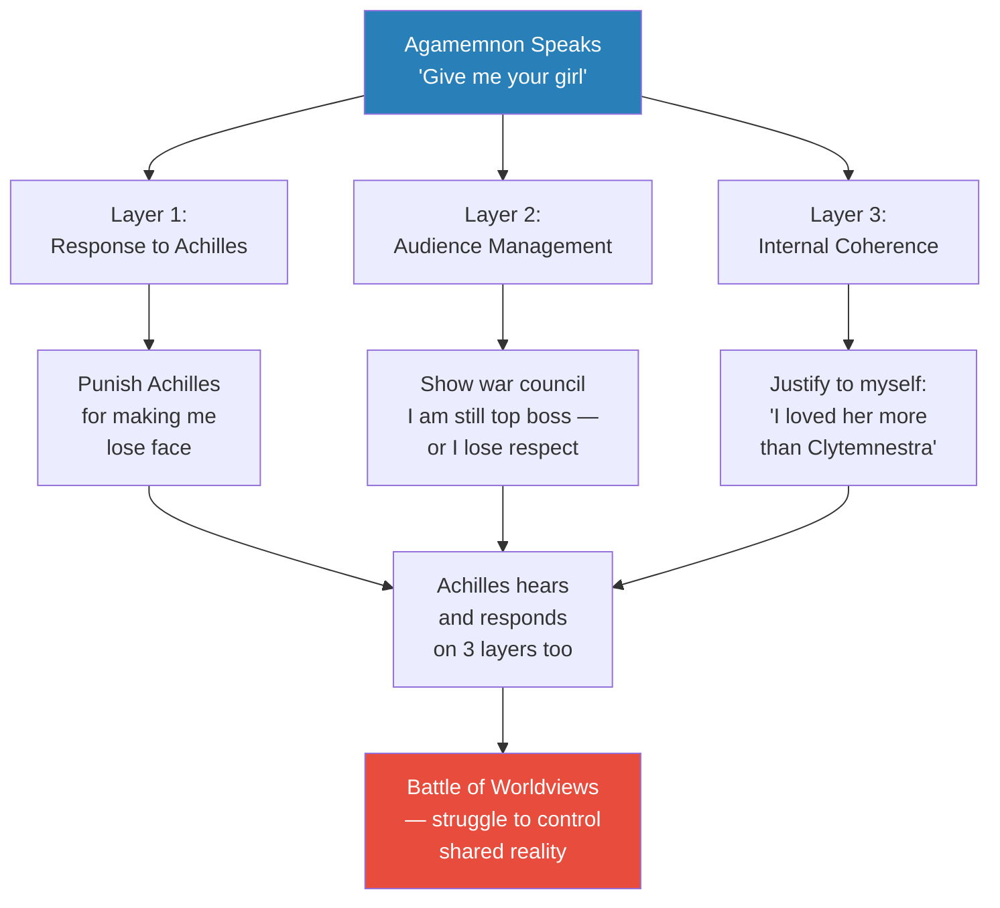
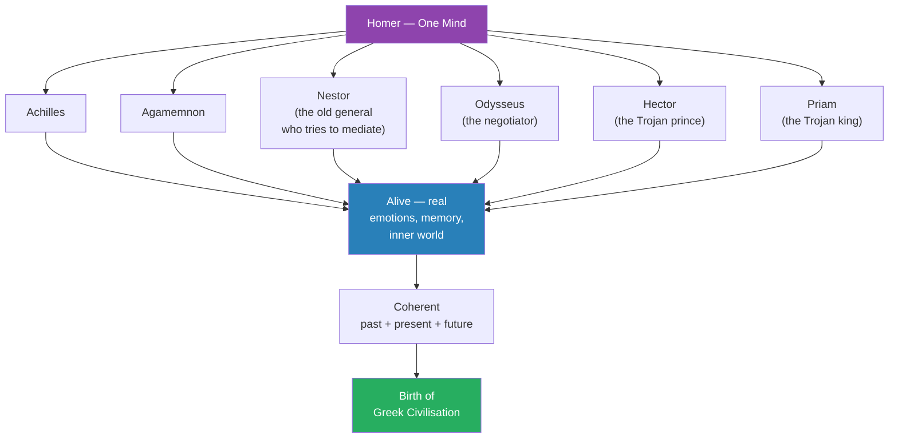
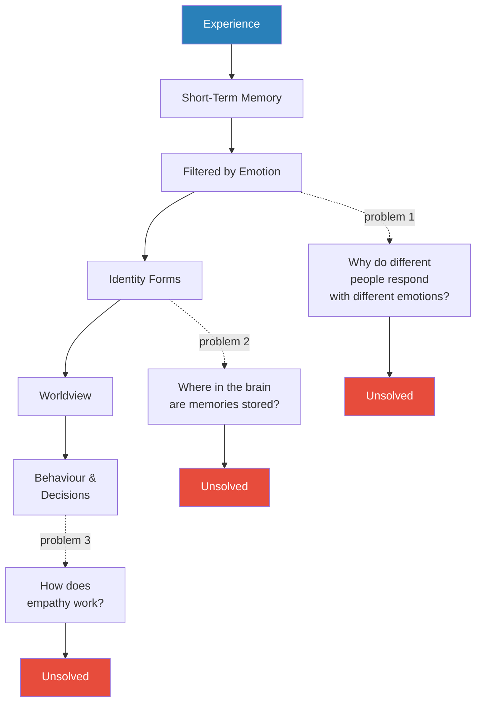
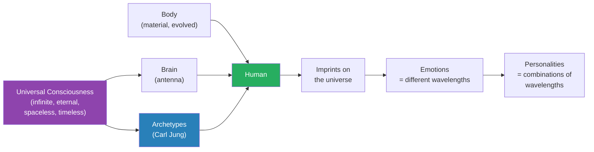
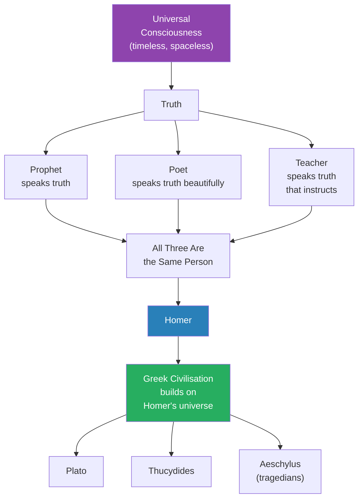

# Homer and the Invention of the Human

> Prof. Jiang builds on the first lecture's claim that great books are portals to the universe by asking the next question: what makes a book "great" in the first place? Drawing on Yale literary critic Harold Bloom, he argues that the Iliad is great because its characters can "hear themselves speak" — they possess consciousness, the act of stepping outside oneself to observe one's own words and the minds of others. Using the opening quarrel between Agamemnon and Achilles as a case study, he demonstrates how Homer layered three levels of awareness into a single speech. He then confronts the mystery at the heart of the lecture: how did one man construct an entire universe of living souls? Rejecting the materialist account of consciousness as brain-based storage, he proposes that Homer was a prophet — an antenna tuned to the universal consciousness, drawing archetypes (Carl Jung's term) from a timeless reservoir of human truth. Poets, prophets, and teachers become the same figure: those who speak truth and, in doing so, give birth to civilisation.

---

## Overview: Key Highlights

- <b style="color: #27ae60">Great books help us "hear ourselves speak"</b> — Harold Bloom's definition: great characters possess consciousness, and reading them grows ours
- <b style="color: #2980b9">Consciousness as dissociation</b> — a part of you steps outside yourself to observe your own words and the minds of others
- <b style="color: #27ae60">Homer invented the human</b> — his characters were the first fully interior beings in literature, alive to themselves and to each other
- <b style="color: #2980b9">Three-layer speech analysis</b> — Agamemnon's reply to Achilles operates on three levels simultaneously: response, audience management, internal coherence
- <b style="color: #e74c3c">Modern psychology cannot explain consciousness</b> — three unsolved problems: origin of personality, location of memory, mechanism of empathy
- <b style="color: #2980b9">Brain as antenna, not storage</b> — consciousness is not stored in the brain; the brain tunes into the universal consciousness like a laptop to the cloud
- <b style="color: #2980b9">Archetypes (Carl Jung)</b> — personalities are patterns imprinted in the universe that different humans access in common
- <b style="color: #27ae60">Homer opened his mind to the universe</b> — his genius was access, not invention; he drew living souls from the universal reservoir
- <b style="color: #2980b9">Prophets speak truth, not the future</b> — because the universe is timeless, speaking truth is simultaneously prediction, description, and moral judgment
- <b style="color: #27ae60">Poets, prophets, and teachers are the same person</b> — all three channel eternal truth through beautiful language that constructs civilisation
- <b style="color: #e74c3c">Vanity and insecurity are two sides of the same coin</b> — Achilles shows that arrogance and vulnerability are bundled together in the human heart
- <b style="color: #2980b9">Battle of worldviews</b> — the quarrel between Agamemnon and Achilles is a war over which narrative controls reality

| Concept | One-line summary |
|---------|-----------------|
| **Great book (Bloom)** | A text whose characters possess consciousness and help us develop our own |
| **Hear yourself speak** | The act of stepping back to analyse your own words as you speak them — the essence of consciousness |
| **Dissociation** | A part of the self observing the whole scene from outside, like a ghost |
| **Theory of mind** | The capacity to model the inner world of another person — empathy's foundation |
| **Three-layer speech** | Agamemnon's speech operates on three levels: reply, audience, internal coherence |
| **Battle of worldviews** | Speakers struggling through speech to impose their reality on others |
| **Archetypes (Jung)** | Recurring patterns of personality imprinted on the universe that many humans access in common |
| **Brain-as-antenna** | The brain does not store memories; it tunes into the universal consciousness |
| **Prophet** | Not a predictor of the future but a speaker of eternal truth — which is past, present, and future at once |
| **Poet = prophet = teacher** | All three figures channel the universe's truth through beautiful language |
| **Vanity and vulnerability** | Arrogance and insecurity bundled together — Achilles's double heart |

---

# The Lecture

## The Achilles Exercise — Reading as Self-Discovery [0:00 - 4:00]

*Prof. Jiang opens the lecture by reviewing an exercise he gave the students about Achilles: imagine yourself as Achilles, imagine his childhood, imagine what he would be doing today. The students' answers reveal the paradox at the heart of Homer's hero — and the power of what a great book does to the reader's imagination.*

> [!tip] Core Insight
> A great book excites the imagination to peer deeply into the human heart. Characters who never existed become real to you, and through that reality you see yourself more clearly. Reading Achilles is reading yourself.

*The three-question exercise turns a 2,700-year-old character into a mirror. By imagining Achilles's past, present, and modern life, students discover that reading him is reading their own human heart.*

> [!note]- Expand: Full Lecture Detail
> - Prof. Jiang opens by reviewing the homework exercise — three questions about Achilles he gave the students after they had read the first half of the Iliad
> - Question 1 — "How are you similar to Achilles?":
>   - A student answered that Achilles is "almost a mirror" to them
>   - They loved playing soccer, but one day they felt humiliated and stopped playing — "that tore at your heart"
>   - Their phrase for it: <b style="color: #2980b9">"pride and vulnerability"</b>
>   - Prof. Jiang elevates this into a principle about the human heart — <b style="color: #27ae60">arrogance and insecurity are two sides of the same coin</b>, bundled together
>   - "By reading the Iliad, it gives you tremendous insight into yourself as well as the nature of the human heart"
> - Question 2 — "Imagine Achilles's childhood":
>   - Students said he was "probably very rebellious, very imaginative"
>   - Prof. Jiang agrees — "he's always testing boundaries, he has a very vivid imagination"
>   - The point: students can reconstruct the backstory of a fictional character as if he were a person they know
> - Question 3 — "What would Achilles be doing today?":
>   - The obvious answer: a soldier (because he loves war)
>   - The better answer — offered by the students — he'd be an Olympic athlete
>   - The reasoning: Achilles "really wants to stand out and be admired by everyone — he wants to be famous"
>   - Athletics, not combat, would give him that visibility in our culture
>   - But the students go further: they recognise he would fail — Olympic sports require coaches, sponsors, regimens, conformity
>   - Achilles is too independent, too rebellious — he'd rebel against all of it
> - Prof. Jiang draws the lesson: the entire point of the exercise is to show what a great book does
>   - It excites your imagination so it can peer deeply into the human heart
>   - It shows you how complicated, how complex, how dark that heart is
>   - It lets you imagine a character as a whole person — past, present, and future
>   - You've never met Achilles — he never existed, "honestly a fictional character" — but he's real to you
> - <b style="color: #27ae60">"A great book is composed of characters that are real to you and make the world more real to you"</b>
> - The mechanism: the characters excite imagination, which allows you to think more deeply into yourself and understand the world around you more imaginatively

---

## Harold Bloom and the Consciousness Criterion [4:00 - 6:00]

*Prof. Jiang introduces the late Yale literary critic Harold Bloom, who gave us the single best definition of what makes a book great: its characters can "hear themselves speak." This seemingly modest phrase points to the most extraordinary human capacity — consciousness itself.*

*Bloom's chain of reasoning: great books contain conscious characters, consciousness is dissociation, and dissociation is the essence of being fully human. Reading great books grows the very faculty that defines us.*

> [!note]- Expand: Full Lecture Detail
> - Prof. Jiang introduces <b style="color: #2980b9">Harold Bloom</b> — "a very famous American literary critic" at Yale
>   - Autobiographical aside: Prof. Jiang sat in on one of Bloom's classes when he was studying English Literature at Yale
>   - Bloom is "considered the most famous American literary critic"
> - Bloom's definition — quoted directly by Prof. Jiang: a great book "is something that helps us become human"
>   - What makes the characters in a great book different? They can <b style="color: #27ae60">"hear themselves speak"</b>
>   - "Those are his words" — Prof. Jiang is careful to attribute the phrase
> - Prof. Jiang unpacks the phrase:
>   - "As I'm speaking to you, there's also a part of me that steps back and analyses what I say"
>   - "It has to make sense to me, it has to make sense to you"
>   - "And we call this consciousness"
> - The definition of consciousness he gives:
>   - To be human is to be conscious
>   - To be conscious is ultimately <b style="color: #2980b9">an act of imagination</b>
>   - While you're speaking, you have to step back — "we actually call this <b style="color: #2980b9">dissociation</b>"
>   - A part of you, "almost like a ghost, steps away and observes the entire scene"
>   - But also: you imagine yourself speaking AND you imagine what's happening inside the listener's mind and heart

---

## The Three-Layer Speech — Agamemnon Responds to Achilles [6:00 - 12:00]

*Prof. Jiang walks the class through the opening quarrel in Book 1 of the Iliad, showing how Agamemnon's single reply to Achilles operates on three simultaneous levels of consciousness. This is not just poetry — it is Homer's demonstration that every human speech act is a layered performance.*

> [!tip] Core Insight
> When Agamemnon speaks, he is doing three things at once: responding to Achilles, managing the war council's perception, and maintaining internal coherence. Every word must satisfy all three layers. That is what makes him feel alive to us.

*A single speech act with three simultaneous audiences: the opponent, the witnesses, and the self. Homer's genius is sustaining all three layers for every character, in every scene.*

> [!note]- Expand: Full Lecture Detail
> - Prof. Jiang sets the scene — Book 1 of the Iliad:
>   - Agamemnon has kidnapped a girl during a raid
>   - Her father, a priest of Apollo, arrives demanding ransom under the rules of war
>   - Agamemnon refuses: "Screw you. I'm the king of kings. I'll do whatever I want"
>   - Apollo starts a plague among the Greeks
>   - Achilles intervenes: "We're all dying on the shores of Troy — you have to give the girl back"
>   - Agamemnon relents but retaliates: "Sure, I'll give her back, but I want your girl in return"
>   - This starts the main conflict of the entire epic
> - Prof. Jiang stops the narrative and dissects Agamemnon's speech into three simultaneous layers
>
> **Layer 1 — Response to Achilles**
> - Achilles insists: give the girl back
> - Agamemnon agrees, but demands Achilles's girl in exchange
> - Why? <b style="color: #2980b9">"He feels as though Achilles made him lose face, so now he wants to make Achilles lose face as well"</b>
>
> **Layer 2 — Managing the War Council**
> - Agamemnon is speaking in front of all the Greek generals
> - "In this world, if no one respects you, you could get killed — these people are gangsters"
> - If he just backs down to Achilles, he loses face among the other generals
> - To preserve authority, he must demand something in return — visible dominance
> - He is simultaneously calculating: "How are others perceiving this?"
>
> **Layer 3 — Internal Coherence**
> - Agamemnon must make sense to himself — his words must have a rationale
> - His justification: "I love my girlfriend — you stole from me what I love, therefore I must enact vengeance"
> - He goes further: "I love her more than my own wife, Clytemnestra" — raising the stakes of the theft
> - "You can see how coherent all this is — this is what makes Agamemnon a real character to us"
>
> - Prof. Jiang makes the payoff: Achilles then does the exact same thing — he responds on all three layers too
>
> > [!example] Achilles's Three-Layer Reply
> > - Response to Agamemnon: "Why are you stealing from me what is rightfully mine?"
> > - Audience management: winning sympathy from the other generals — "I came to Troy not because I hate the Trojans, I came because you ordered me to"
> > - Self-positioning: "I'm risking my life for you — you gain most of the treasure, I get a little bit, and now you're stealing even that"
> > - Agamemnon then fires back using memory and experience: "You came to Troy to win glory for yourself — you're using me as a pretext, you're a selfish asshole"
> > - Achilles's retort: "Fine. Then I won't fight for you anymore"
> > **The lesson:** Every speech in Homer is a full-consciousness performance — respond, perform, cohere.
>
> - Prof. Jiang gives this a name: <b style="color: #e74c3c">a battle of worldviews</b>
>   - "Through their speeches, they're trying to control reality"
>   - "They're trying to impose their reality on others"
>   - "That's why this is such an emotional, violent scene between the two"
> - The astonishing fact: <b style="color: #27ae60">all of this came out of the mind of one person — Homer, the poet</b>

---

## Every Character Is Alive — Nestor and the Expanding Universe [12:00 - 15:30]

*Prof. Jiang pushes the observation further. It is not just Agamemnon and Achilles who are conscious — Nestor, Odysseus, Hector, Priam, every witness in the poem is fully alive. Homer did not just give interiority to his heroes. He gave it to everyone.*

*Homer did not merely give consciousness to his protagonists — he gave it to every character, even the mediators and bystanders. The result: a self-consistent universe whose logic extends backward in time and forward into prediction.*

> [!note]- Expand: Full Lecture Detail
> - Prof. Jiang zooms out from the Agamemnon-Achilles quarrel
> - Nestor, "one of the older generals," enters the scene and tries to reconcile the two
>   - The mediator has his own interiority, his own memory, his own judgment
>   - He is not just a narrative device — he is alive
> - The same is true of every figure in the Iliad:
>   - <b style="color: #2980b9">Odysseus</b> — the clever negotiator
>   - <b style="color: #2980b9">Hector</b> — the Trojan prince
>   - <b style="color: #2980b9">Priam</b> — the Trojan king
>   - <b style="color: #2980b9">Nestor</b> — the elder statesman
>   - "They're all alive as well with real emotions and real feelings and real experiences"
> - The coherence test: because each character has an interior life, we can
>   - "Look back at how this came into being — the past"
>   - "Make predictions about the future"
>   - "And all this is coherent"
> - Prof. Jiang applies the test to the central conflict:
>   - The main narrative of the Iliad is the struggle between Agamemnon and Achilles
>   - Both are struggling "for control over narrative"
>   - Achilles wants everyone to believe he is a hero saving the Greeks
>   - Agamemnon wants everyone to believe Achilles is "just a selfish asshole"
>   - Their refusal to surrender their narrative leads to suicidal behaviour
>   - The Trojans are about to burn the Greek ships — if they do, every Greek dies
>   - Even at this crisis, both men refuse to concede the narrative
>
> > [!example] The Embassy to Achilles — Why the Narrative Refuses to Break
> > - Hector and the Trojans advance to burn the Greek ships
> > - If they succeed, every Greek soldier will die
> > - Odysseus is sent to Achilles with extravagant offers from Agamemnon
> > - All the money in the world, Agamemnon's own daughter in marriage, all of Troy after the victory
> > - Achilles's answer: no
> > - He wants only one thing — Agamemnon must come in person and apologise
> > - Agamemnon refuses
> > - Two men prefer communal destruction to surrendering their version of reality
> > **The lesson:** When speech is how we control reality, apology feels like death — even when the literal alternative is death.
>
> - The takeaway: because the Iliad gives us this — we learn to step back and observe ourselves and others
>   - "We have greater imagination, we have greater empathy, we have greater curiosity"
>   - <b style="color: #27ae60">"This is how the Iliad created the greatest, greatest civilisation on earth in history — the Greek civilisation"</b>

---

## The Great Mystery — Who Was Homer? [15:30 - 17:00]

*Before attempting his own answer, Prof. Jiang names the scholarly puzzle. Nobody knows who Homer was. Some scholars believe "Homer" was many people stitched together. The Greeks themselves called him "the teacher" and the father of civilisation. And yet one mind — or a tradition in one name — produced an entire universe of living souls.*

> [!note]- Expand: Full Lecture Detail
> - Prof. Jiang pauses to acknowledge the scholarly mystery
> - "We all know the Iliad is one of the greatest books ever composed, but we don't know who Homer is, and we don't know how he did this"
> - Some scholars speculate that Homer was many people — a collective tradition given a single name
> - The Greeks themselves had an answer, even if vague:
>   - <b style="color: #2980b9">They called Homer "the teacher"</b>
>   - They called him "the father of the civilisation"
>   - The Greeks were confident Homer was a real person — but transmitted almost no biographical detail
> - The question Prof. Jiang now wants to tackle speculatively:
>   - "How was one human mind able to construct an entire universe with real people by himself?"
> - He signals the shift: "What I'm going to do now is speculate as to how he was able to do all this"

---

## Three Problems Modern Psychology Cannot Solve [17:00 - 24:00]

*Before proposing a theory, Prof. Jiang first demolishes the standard one. Modern psychology has a rough account of how personality emerges — experience becomes memory becomes emotion becomes identity. But three questions inside that account have no answers: where does personality come from, where are memories stored in the brain, and how does empathy work?*

*The standard psychological chain looks complete — but at every joint, modern science has no answer to a deeper question. Prof. Jiang uses these three gaps as the opening for his own alternative theory.*

> [!note]- Expand: Full Lecture Detail
> - Prof. Jiang lays out the standard psychological account first
> - The chain:
>   - Experiences become short-term memory
>   - The brain filters memories by emotional value — happy, sad, angry
>   - <b style="color: #2980b9">"Your memories are your emotions"</b> — experiences with no emotional charge are discarded
>   - Remembered emotional experiences fuse into identity
>   - Different memory combinations produce different identities in different contexts
>   - "Your identity in a school will be different from your identity at home or your identity when you go to America"
>   - Identity becomes worldview — how you perceive yourself and the world
>   - Worldview drives behaviour and decisions
> - "This is basically the way we understand how personality develops — but there are sort of problems with this understanding"
>
> **Problem 1 — Where does personality come from?**
> - Why do different people respond to the same experience with different emotions?
> - "You might get a 50 on a test — some of you will be really sad, some of you will be really happy"
> - Glass-half-full vs. glass-half-empty — where does this filter originate?
> - The genetic answer fails: "Do you think about your parents and ask yourself, does your personality come from your parents? The answer is, it doesn't"
> - Prof. Jiang speaks from experience: "I have three kids — all three of my kids are different from both my wife and myself"
> - <b style="color: #e74c3c">Unsolved — we do not know</b>
>
> **Problem 2 — Where in the brain are memories stored?**
> - "We know where in the brain breathing happens, we know in the brain where language acquisition happens"
> - "But we don't know in the brain where memories are formed and stored and accessed"
> - "That's really weird, guys"
> - <b style="color: #e74c3c">Unsolved — we do not know</b>
>
> **Problem 3 — How does empathy work? (Theory of mind)**
> - Modern psychology has no good account of how we perceive the emotions of others
> - The standard answer — "we just look at our own identity" — does not explain the mechanism
> - <b style="color: #e74c3c">Unsolved — we do not know</b>
>
> - Prof. Jiang summarises: three major problems, three gaps, no answers. "So I would propose a theory to you today."

---

## The Antenna Theory — Consciousness From the Universe [24:00 - 30:00]

*Prof. Jiang proposes his answer, continuing the framework he established in Lecture 1. The brain is not a storage device. It is an antenna tuned to the universal consciousness. Memories, personality, and empathy are not inside us — they are accessed from a timeless, spaceless field that all humans share.*

> [!tip] Core Insight
> The brain is a laptop. The universe is the cloud. Consciousness is not generated locally — it is streamed from an infinite, eternal field of awareness that all humans can access. Homer simply had the strongest signal.

*The two-source model of the human being: body from evolution, consciousness from the universe. The brain is not a generator but a tuner — and Homer's genius is a superior tuner, picking up frequencies others cannot.*

> [!note]- Expand: Full Lecture Detail
> - Prof. Jiang returns to the framework of Lecture 1 — the universe is conscious
> - His proposal: we are composed of two selves
>   - <b style="color: #2980b9">The body</b> — material, the product of evolution, understood by biology
>   - <b style="color: #2980b9">Consciousness</b> — which does NOT come from the body, but from our interaction with the universe
> - The analogy:
>   - <b style="color: #27ae60">"Your brain is not a storage facility — it's an antenna for the vibrations of the universe"</b>
>   - "We call this consciousness"
>   - "There are infinite dimensions to this consciousness, and this is where our memories are stored"
> - The laptop analogy he offers directly:
>   - Think about the internet — you have a laptop
>   - Some memory is stored on the laptop itself
>   - But most memory is stored in the cloud
>   - By interacting with the internet, your computer becomes more conscious
>   - Same for the brain: by interacting with the universal consciousness, your mind becomes more conscious
> - "If you assume that everything comes from the human brain, nothing makes sense. If you assume the brain is merely an antenna to the universal consciousness, it makes a lot more sense"
>
> **The emotional imprint**
> - Through imagination and consciousness, humans implant themselves into the universe
> - Different emotions imprint at different wavelengths, in different dimensions
> - The combination of your emotions creates a unique imprint in the universe
> - But: similar combinations produce similar imprints — and these are what Jung called <b style="color: #2980b9">archetypes</b>
>
> **Carl Jung and archetypes**
> - Jung was a Swiss psychologist (paired with Freud, later split)
> - Archetypes are recurring personality patterns
> - "Different personalities are accessing the same parts of the universe, and so they behave the same"
> - Prof. Jiang offers an observational aside: "That's why certain people look alike. If you're an evil person, you have a certain look to your face. If you're a good person, you have a certain look. If you're clever, you have a certain look"
>
> **Homer as the supreme antenna**
> - "Homer opened his mind to the universe, and therefore he's able to access all archetypes"
> - "We all do this with empathy — but Homer's able to do this at a greater level than everyone else"
> - Then the key move: "He's able to transplant these archetypes into the world of the Iliad — that's how he's able to create what he does"
> - <b style="color: #27ae60">Homer did not invent Achilles. Homer tuned in to Achilles.</b>
> - The archetypes are already there, eternal in the universe. The poet's genius is access.
>
> > [!example] Why a Chinese Student Can See Herself in Achilles
> > - The Iliad was written 2,500 years ago
> > - It was composed by a man living in the Aegean — a Mediterranean culture completely different from modern China
> > - And yet, a Chinese student living in 21st-century China reads Achilles and thinks: that's me
> > - She can imagine herself as Achilles, imagine his childhood, imagine him in her own century
> > - Under the materialist story of consciousness, this is inexplicable — why would a brain evolved for ancient Greek village life speak to a brain in modern China?
> > - Under the antenna theory, it is obvious — both minds are tuning into the same universal archetype
> > **The lesson:** The cross-cultural reach of great books is evidence that consciousness is universal, not local.

---

## Prophets, Poets, and Teachers — The Same Person [30:00 - 36:00]

*Prof. Jiang names the figures who have this extraordinary access to universal consciousness: prophets, poets, teachers. In ancient times these were one role. Homer was all three. A student's question sharpens the point — and Prof. Jiang delivers one of the lecture's most important clarifications: a prophet does not predict the future. A prophet speaks truth, and because the universe is timeless, truth is past, present, and future at once.*

*In the ancient world, prophets, poets, and teachers were not separate professions — they were different names for the same figure: one who channels eternal truth through beautiful language that enables civilisation.*

> [!note]- Expand: Full Lecture Detail
> - Prof. Jiang introduces the word: <b style="color: #2980b9">prophet</b>
>   - "Prophets are those who bring the truth of the universe onto our world"
>   - They construct it in language that allows us to access this truth eternally
>   - In this period of history, poets, prophets, and teachers are the same function
>
> **A student's question sharpens the definition**
> - A student asks: "The prophets in this series — they're technically not prophets, because they're not predicting the future. They're talking about the truths, right? Because the universe is spaceless and timeless, all of it is already written down."
> - Prof. Jiang answers directly: <b style="color: #27ae60">"The word 'prophet' doesn't actually mean someone who predicts the future. The word 'prophet' actually means someone who speaks the truth"</b>
>
> **Why truth-speaking looks like prediction**
> - In most of human history, when we say someone is a prophet who "speaks truth," what we really mean is he speaks the Word of God
> - What is truth? Truth is the universe, which is God
> - What is the universe? "The universe is past, present, and future all together — beyond space and beyond time"
> - Therefore, when you speak truth, you speak what has happened, what is happening now, and what will happen
> - The way you test a prophet's words: see whether they come true
> - <b style="color: #2980b9">Truth is simultaneously prediction, description, and moral judgment</b>
>
> **The moral dimension**
> - A lot of truth is moral truth: "If you do evil unto others, evil will come on to you"
> - Prof. Jiang traces this through Achilles's own story:
>   - Achilles refuses to fight until Agamemnon apologises
>   - Agamemnon refuses to apologise
>   - Achilles sacrifices Patroclus (sends him out in his armour)
>   - Patroclus is killed by Hector
>   - Achilles has "done evil unto Patroclus"
>   - Now "evil will come on to Achilles" — his own death is prophesied
> - Homer's poem is, in this sense, a prediction that becomes true because it speaks the moral truth of the universe
>
> > [!example] The Death of Patroclus — Truth as Moral Sequence
> > - Achilles withdraws from battle over Agamemnon's insult
> > - The Greeks begin losing; Patroclus begs to borrow Achilles's armour to rally them
> > - Achilles agrees — he uses his friend to save face without apologising himself
> > - Patroclus is killed by Hector
> > - Achilles's grief transforms into rage — he returns to battle and kills Hector
> > - But Hector's death begins the sequence of Achilles's own doom
> > - The evil Achilles willed onto Patroclus boomerangs onto him
> > **The lesson:** The Iliad is not fiction — it is a law of the universe dramatised. Moral cause and effect is physics.
>
> **Why truth is beautiful**
> - The poet is the prophet — how do you know a prophet is speaking truth?
> - "Because it's beautiful — because it speaks to you"
> - Homer lived in an illiterate culture — "no writing going on"
> - He travelled from place to place, reciting the Iliad aloud
> - "As he's speaking, it's like music to the listeners"
> - "It's beautiful, it's poetry — but it's beautiful because it's also truthful"
> - Listeners felt Achilles was a real person with real emotions, and through Achilles they understood themselves
>
> **Why the poet is also the teacher**
> - How do you understand yourself? You understand yourself by understanding the Iliad — by understanding the psychology, motivations, and emotions of its characters
> - Once you can hear yourself speak, you have more consciousness
> - More consciousness gives birth to civilisation
> - Because you can imagine — but you can also imagine alongside other people
>
> > [!quote] Prof. Jiang
> > "A great book is composed of characters that are real to you and make the world more real to you."
>
> **The Greek tradition descends from Homer**
> - Plato, Thucydides, Aeschylus — "the greatest thinkers, the greatest intellectuals of the civilisation"
> - "They're all derivative of Homer — all operating within Homer's universe"
> - Their applications differ: Thucydides writes the same Homeric way — his characters always give speeches — but he writes about real historical figures
> - Homer writes about people of his imagination; Thucydides about actual Athenians and Spartans
> - Both are channelling the same archetypes; both are speaking truth

---

## Closing — The Convergence of Prediction and Truth [36:00 - end]

*Prof. Jiang closes the lecture by pulling the strands together. In literature, prediction and truth are the same thing. The poet-prophet-teacher speaks eternal patterns, and eternal patterns by definition describe past, present, and future at once. The Iliad remains alive because it is true — true yesterday, today, and a thousand years from now.*

> [!note]- Expand: Full Lecture Detail
> - Prof. Jiang delivers his closing formulation:
>   - <b style="color: #27ae60">"In literature, prediction and truth are the same thing"</b>
>   - If you speak truth, you can predict the future
>   - Because truth is eternal
>   - "Truth is eternal past, present and future collide together — they converge on truth"
> - He assigns reading — up to Book 16 of the Iliad for Friday's class
> - The framework the students leave with:
>   - A great book is a text whose characters are conscious
>   - Consciousness is dissociation — hearing yourself speak while speaking
>   - Modern psychology cannot explain consciousness
>   - The brain is an antenna, not a storage device
>   - Archetypes exist eternally in the universal consciousness
>   - Homer accessed more archetypes than anyone else
>   - Poets, prophets, and teachers are the same figure
>   - A great book is the truth of the universe made beautiful
>   - Reading it grows your own consciousness — and that is what makes civilisation possible

---

## Connections

**Builds on:** [[01 - Secrets of the Universe]] — the universe-as-conscious framework, the brain as antenna, Christ consciousness, imagination as animating force. This lecture applies that metaphysics to the question of literary greatness.

**Sets up:** [[03 - Poets and Prophets]] — the identification of Homer as prophet is developed further; [[05 - The Odyssey]] — a second Homeric epic to test the "universal archetype" claim; [[07 - The Anti-Homer]] — a counter-tradition challenging the Homeric worldview.

**Related lectures in vault:**
- [[07 - Homer's Iliad and the Birth of Greek Civilization]] — the Civilization series treatment of the same material from a historical rather than literary angle
- [[17 - Homer, Vergil, and the War for the Soul of Rome]] — Homer's legacy in the Roman reception
- [[30 - Dante as the Second Coming of Homer]] — Dante as the medieval channel of the Homeric archetypes

**Related books in vault:**
- [[Sapiens - Yuval Noah Harari]] — Harari is cited in the Civilization series; his "stories create reality" framework dovetails with the battle-of-worldviews reading of Agamemnon and Achilles
- Any book on Carl Jung or depth psychology — archetypes are the bridge concept between this lecture and modern Jungian thought

---

## The Takeaway

This lecture is where the Great Books series moves from metaphysics to method. Lecture 1 announced that the universe is conscious. Lecture 2 shows why that claim matters for reading. If consciousness is local and generated by the brain, then Homer is a clever ancient storyteller whose relevance is an accident of cultural transmission. If consciousness is universal and the brain is an antenna, then Homer is something much stranger — a prophet whose characters are not invented but accessed, archetypes drawn from a timeless reservoir that modern readers share. The test of the theory is experiential: when a 21st-century Chinese student says Achilles is a mirror to her, the materialist account stumbles, and the antenna theory answers immediately.

The most counterintuitive insight is the three-layer speech analysis. Most readers approach the Iliad as a story of gods and heroes. Prof. Jiang shows it is a seminar in the structure of consciousness itself. Every time Agamemnon opens his mouth, three audiences are being managed: the opponent, the witnesses, and the speaker's own self-coherence. The student is invited to notice: I do this too. Every argument, every text message, every justification I offer has the same three-layered architecture. Homer did not just write a war poem. He wrote the first comprehensive map of the inside of a human head.

What remains open is the status of the antenna theory itself. Prof. Jiang presents it as a proposal, not a proven claim, and its merits depend on accepting the metaphysics of Lecture 1. A skeptic could reply that Jung's archetypes are patterns in human cognition shaped by shared evolutionary pressures, not a supernatural field. That skeptical answer, however, would still have to account for the three problems Prof. Jiang named — the origin of personality, the brain location of memory, and the mechanism of empathy. Until those questions are answered inside the materialist frame, the antenna theory keeps its place at the table, and the lecture's promise remains intact: reading great books is how we become more conscious, and being more conscious is how civilisation is made.
