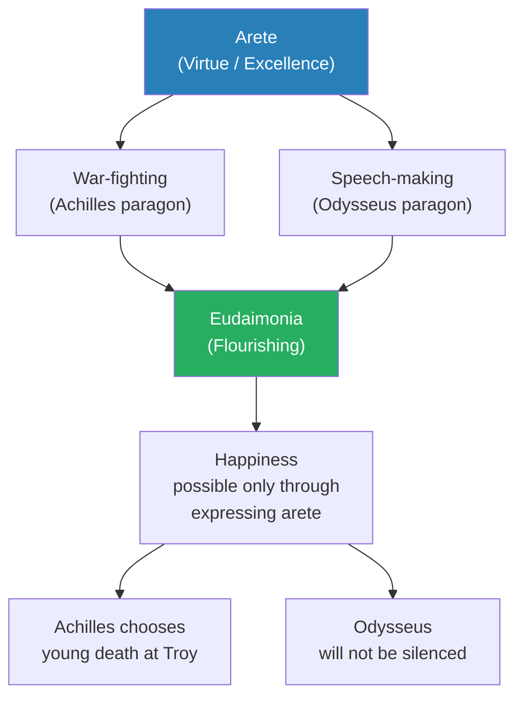
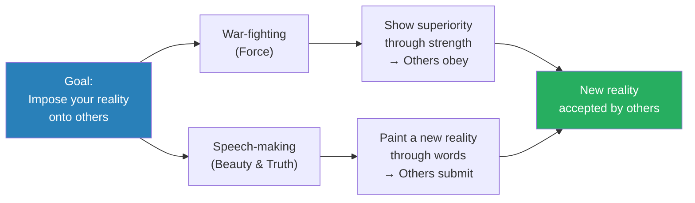
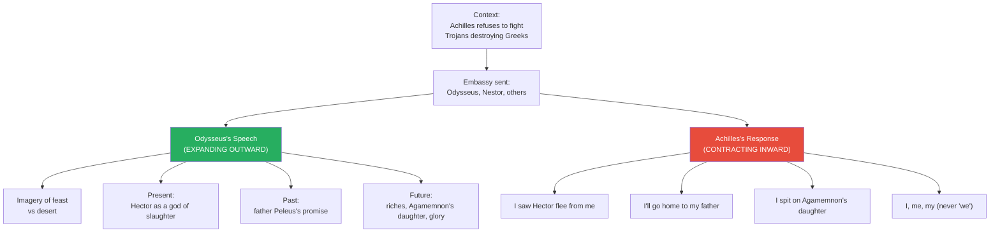
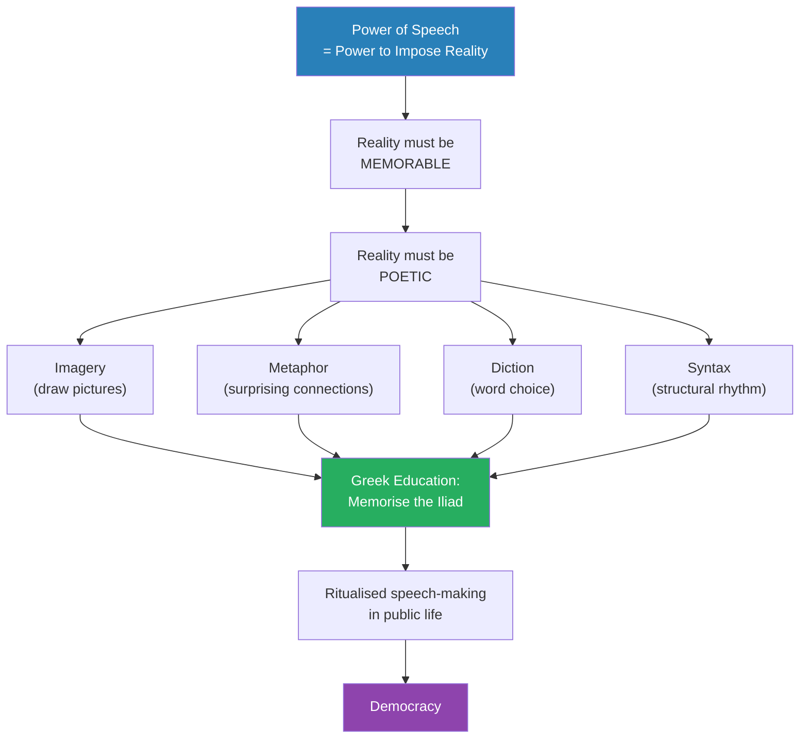
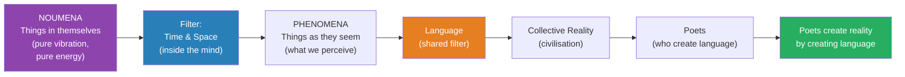
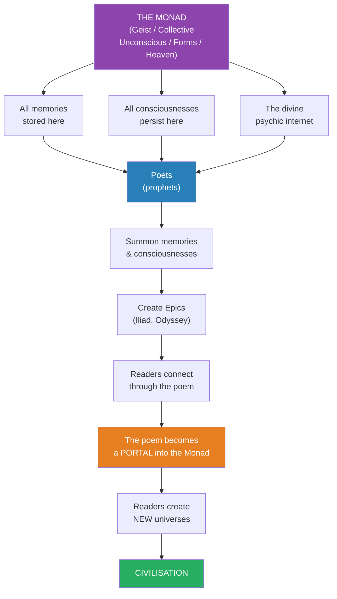
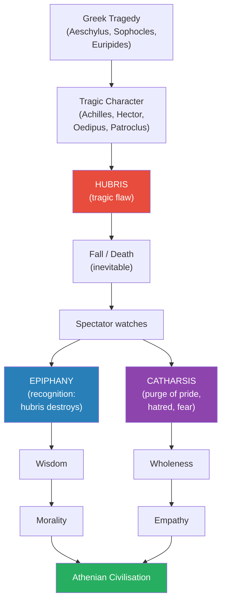
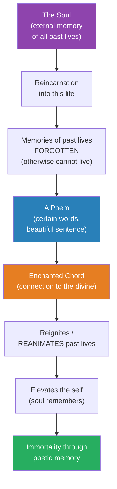
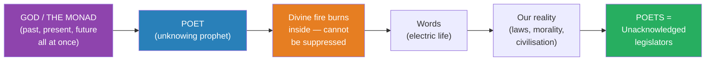

# Poets and Prophets

> Prof. Jiang asks a single electrifying question: how is it possible that one epic poem — the Iliad — gave birth to an entire civilisation? His answer fuses Greek virtue theory, Kantian metaphysics, Hegelian spirit, and Shelley's Romantic poetics into a unified claim: poets are prophets, language is reality, and the great books are the living memories of the divine. Through the speeches of Odysseus and Achilles, the mechanics of Athenian tragedy, and Shelley's Defence of Poetry, Prof. Jiang argues that Homer did not merely describe the Greek world — he created it, and that every act of reading a great book is a portal opening between the reader and the Monad itself.

---

## Overview: Key Highlights

- <b style="color: #27ae60">One poem created a civilisation</b> — the Iliad is the foundation of Greek civilisation, and Greek civilisation is the foundation of the West
- <b style="color: #2980b9">Arete and Eudaimonia</b> — Greek virtue (excellence of character) and flourishing (being your creative best) are the twin engines of Homeric life
- <b style="color: #27ae60">War-fighting and speech-making are the same act</b> — both impose a reality onto others, one through force, the other through beauty and truth
- <b style="color: #e74c3c">Achilles contracts inward, Odysseus expands outward</b> — the two modes of using imagination, only one of which builds civilisation
- <b style="color: #2980b9">Kant's noumena and phenomena</b> — reality itself is pure vibration; time and space are filters inside the human mind, not features of the world
- <b style="color: #27ae60">Language is the tool that controls time and space — and therefore reality</b> — and poets are the people who create language
- <b style="color: #2980b9">The Monad / Geist / Collective Unconscious</b> — the divine psychic internet where all memories are stored, which poets alone can access
- <b style="color: #e74c3c">Hubris is the universal killer</b> — no matter how great you are, the greater you are the more your hubris will destroy you
- <b style="color: #2980b9">Epiphany and catharsis</b> — the twin gifts of Greek tragedy: understanding the human condition, and purging the emotions that distort it
- <b style="color: #27ae60">The Iliad is a living memory</b> — reading it is not absorbing information but connecting your consciousness to the consciousnesses it contains
- <b style="color: #2980b9">Shelley's Defence of Poetry</b> — poets are "the unacknowledged legislators of the world," channelling divine fire through language
- <b style="color: #27ae60">Poets are prophets, not artists</b> — they do not know what they are doing; they are compelled to speak truth because God speaks through them

| Concept | One-line summary |
|---------|-----------------|
| **Arete** | Greek virtue — the excellence that makes you special, traditionally war-fighting or speech-making |
| **Eudaimonia** | Greek flourishing — happiness comes only from achieving and expressing your arete |
| **Speech-making as war** | A contest of narratives where each speaker projects a reality others must inhabit |
| **Poetry's elements** | Imagery, metaphor, diction, syntax — the techniques of making language memorable |
| **Noumena / Phenomena** | Kant's split: the thing-in-itself (pure vibration) vs the thing-as-perceived (filtered through time and space) |
| **Geist** | Hegel's word for universal spirit — ghost, gist, and geyser all at once |
| **Monad** | The universal psychic store where every memory persists — the divine internet |
| **Living memory** | An epic like the Iliad is alive because its characters retain past, present, and future |
| **Hubris** | The tragic flaw — arrogance that destroys the great, the greater the person the greater the fall |
| **Epiphany** | The recognition that hubris leads to tragedy — the wisdom tragedy imparts |
| **Catharsis** | The emotional purge of watching tragedy — hatred, pride, and fear are cleansed |
| **Reincarnation** | The soul retains memories of prior lives; certain words reawaken them |
| **Unacknowledged legislators** | Shelley's claim that poets, not politicians, create the laws of reality through language |

---

# The Lecture

## How Did One Poem Create a Civilisation? [0:00 - 0:53]

*Prof. Jiang opens the lecture with the question that frames everything: Greek civilisation is the greatest civilisation in human history, and the Iliad is its foundation — so how is it possible that one epic poem gave birth to Plato, Thucydides, Herodotus, Aeschylus, Euripides, and Sophocles? The answer will take the whole lecture, and will fuse Greek virtue theory, Kantian metaphysics, and Romantic poetics into a single explanation.*

> [!tip] Core Insight
> One poem can create a civilisation because poetry is not a form of entertainment — it is the mechanism by which language shapes reality. A poet who channels the divine creates a new world, and everyone who reads that poem enters and co-creates that world. The Iliad built Greek civilisation the way a seed builds a forest.

```mermaid
flowchart LR
    H["Homer<br/>(the Bard)"] --> I["The Iliad<br/>(the living poem)"]
    I --> R["Readers absorb<br/>& internalise"]
    R --> V["Shared values:<br/>arete, eudaimonia"]
    V --> E["Education system:<br/>memorise the Iliad"]
    E --> S["Athenian speech-making<br/>& theatre"]
    S --> D["Democracy &<br/>Philosophy"]
    D --> C["Greek Civilisation<br/>(foundation of the West)"]
    style H fill:#8e44ad,color:#fff
    style I fill:#2980b9,color:#fff
    style C fill:#27ae60,color:#fff
```

*The chain from a single poet to an entire civilisation — each step is carried by shared language and shared imagination, with the Iliad as the seed.*

> [!note]- Expand: Full Lecture Detail
> - Prof. Jiang opens with the enormity of the claim: "The Iliad is the foundation of Greek civilization, which is the greatest civilization in human history, the most creative."
> - He rattles off the names the Iliad produced: <b style="color: #2980b9">Plato, Thucydides, Herodotus, Aeschylus, Euripides, Sophocles</b>
> - He makes the bolder claim: "Greek civilization is essentially the foundation for Western civilization"
> - This sets up the guiding question of the entire lecture: <b style="color: #27ae60">"How is it possible that one epic poem can give birth to a civilization?"</b>
> - He signals that the answer will require a detour through two Greek concepts before it can be properly given — <b style="color: #2980b9">arete</b> and <b style="color: #2980b9">eudaimonia</b>
> - The framing is not "Homer was a great writer" but "Homer created a world" — Prof. Jiang wants the class to feel the weight of what is about to be claimed

---

## Arete and Eudaimonia — The Twin Engines of Greek Life [0:53 - 3:00]

*Prof. Jiang introduces the two concepts that make Greek psychology legible: arete, the virtue or excellence that makes you special, and eudaimonia, the flourishing that comes only from expressing it. Achilles and Odysseus embody the two great forms of arete — war-fighting and speech-making — and their unhappiness when prevented from expressing their gift is the foundation of Greek ethics.*

*The Greek psychological engine: arete is what you excel at, eudaimonia is the happiness that comes from expressing it — and blocking that expression produces the rage of Achilles and the relentless speech of Odysseus.*

> [!note]- Expand: Full Lecture Detail
> - Prof. Jiang writes <b style="color: #2980b9">arete</b> on the board and translates it carefully: "virtue, accent or character. It's something that makes you special, what you excel at"
> - He identifies the two traditional types of arete in Greek civilisation:
>   - **War-fighting** — the paragon is Achilles, the great warrior
>   - **Speech-making** — the paragon is Odysseus, the great orator
> - He tells the class they are reading the Iliad now and will read the Odyssey afterwards — the two books track the two heroes and the two forms of arete
> - Then he writes <b style="color: #2980b9">eudaimonia</b> and translates it: "flourishing"
> - The Greek claim is sharp: <b style="color: #27ae60">"You can only be happy, you can only be yourself when you are achieving your arete, when you're expressing your arete"</b>
>
> > [!example] Achilles and the Prophecy
> > - Before coming to Troy, Achilles was given a prophecy from the gods
> > - He could either die old, safe at home, or die young as a hero on the shores of Troy
> > - Achilles reportedly said, in Prof. Jiang's paraphrase: "Well, duh, of course I'm gonna die young in Troy"
> > - Because only by fighting, only by winning glory, could he achieve eudaimonia
> > - This is why his fight with Agamemnon is so devastating — Agamemnon has forced Achilles out of the battle
> > - Without fighting, Achilles is not Achilles — the paragon of the warrior cannot be happy unless he is warring
> > **The lesson:** Eudaimonia is not safety or comfort. It is the freedom to be your creative best, even at the cost of your life.
>
> - Prof. Jiang underlines the Greek conclusion: "I can only be happy when I am being my creative best, when I'm achieving my true potential"
> - This frame will matter shortly, because it explains why both Achilles and Odysseus give such long, elaborate speeches in Book 9 of the Iliad

---

## War-Fighting and Speech-Making Are the Same Act [3:00 - 5:00]

*Prof. Jiang makes his first major philosophical move: war-fighting and speech-making look different but are in fact the same action performed through different means. Both impose a reality onto others — one through brute force, the other through beauty and truth. This equivalence will reframe everything the class thinks about speech, language, and civilisation.*

> [!tip] Core Insight
> A speech is not a transmission of information — it is a projection of reality onto an audience. To give a great speech is to perform an act of war without the sword, creating a world that others must inhabit and accept.

*Two paths, one goal — and this symmetry explains why Greek civilisation treated the orator and the warrior as equal paragons.*

> [!note]- Expand: Full Lecture Detail
> - Prof. Jiang makes the analogy with unusual force: "For the Greeks, war-fighting and speech-making are really the same thing, but through different means"
> - He breaks down war-fighting: "When you fight a war, what you're trying to do is you're trying to impose your reality onto the world and make others believe what you believe"
>   - You do that through force, by brute strength
>   - You show that you're superior, and therefore others must obey you
> - Then he applies the same logic to speech-making:
>   - Speech-making is "trying to achieve the same thing — but through words"
>   - Rather than through force, through beauty and through truth
>   - You're trying to create a new reality that others submit to
> - This symmetry is the key move of the lecture — it re-codes speaking as a kind of warfare and re-codes rhetoric as the non-violent equivalent of conquest
> - <b style="color: #27ae60">"In speech making, it's a war of realities. It's a war of narratives"</b>
> - Prof. Jiang signals that he will now demonstrate this with the most famous speech-duel in Greek literature: Odysseus trying to persuade Achilles to return to battle

---

## The Embassy to Achilles — Why Are the Speeches So Long? [5:00 - 9:00]

*Prof. Jiang walks the class through Book 9 of the Iliad: the embassy scene where Odysseus tries to persuade Achilles to return to battle after his rupture with Agamemnon. The question that drives the analysis is deceptively simple — why are the speeches so goddamn long? The answer unlocks Prof. Jiang's entire theory of rhetoric.*

*Two speeches, two opposite movements. Odysseus expands the imagination outward to include community, past, and future. Achilles contracts inward into the self — and thereby refuses the world Odysseus builds.*

> [!note]- Expand: Full Lecture Detail
> - Prof. Jiang re-establishes the context: Achilles has fought with Agamemnon, refused to fight, and the Trojans led by Hector are destroying the Greeks
> - Agamemnon, Odysseus, Nestor, and others have a war council and agree to send an embassy to beg Achilles to return
> - Odysseus delivers "a very long speech" — and Prof. Jiang pauses on the strangeness of this
> - He asks the class: "Why are the speeches in the Iliad so goddamn long?"
>   - Odysseus could have just said: "Hey Achilles, we'll give you a million dollars, will you fight for us please?"
>   - Or: "Hey Achilles, we're losing a war, stop being an asshole, come fight for us"
>   - Achilles's response could have been simply "No"
> - The answer is revelatory: <b style="color: #27ae60">"They're not trying to respond to each other, they're trying to create their own reality"</b>
> - Speech is projecting a movie onto the world — creating a new reality that others must inhabit
>
> **Odysseus's Strategy — Expand the Imagination:**
> - Odysseus knows Achilles is wounded in face, not logic — Agamemnon humiliated him and he won't back down
> - Odysseus knows Agamemnon himself won't apologise
> - So Odysseus, as the great orator, must create a new reality that Achilles inhabits and which convinces him to fight
> - His technique: <b style="color: #2980b9">expand Achilles's imagination</b>
>   - **Imagery 1 — the contrast:** "I want you to imagine this before us is a great feast. We can see this feast. Now I want you to imagine what's the opposite of this feast: a great desert where we're all dying, we're all starving. And that's the war we're fighting right now against the Trojans"
>   - **Imagery 2 — the present:** Hector is a giant, a god, running around killing all Greeks before him
>   - **Imagery 3 — the past:** "Remember your father Peleus — before you came to the war you promised him you would win glory for him, you promised you would win glory for the Greeks"
>   - **Imagery 4 — the future:** "When we win this war, all the riches of Troy, all the treasures will belong to you. Agamemnon will give you his daughter for a bride, and you will be the glory of all of Greece"
> - The movement is total: feast vs desert, present Hector, past father, future riches — <b style="color: #27ae60">"Expand your mind, Achilles"</b>
>
> **Achilles's Counter — Contract the Self:**
> - Achilles refuses to be beaten — he counters Odysseus's reality with his own
> - But his move is opposite: <b style="color: #e74c3c">"Rather than expanding outwards, like Odysseus once, Achilles continues to contract inwards"</b>
> - He uses the word "I" relentlessly — "I, me, my" — and never "we"
> - Odysseus never uses "I" — he always uses "we"
> - Achilles's points:
>   - "I understand that Nestor says Hector is a god, but when I saw him, he ran away from me"
>   - "Peleus, my dad — I should go home to see him. So goodbye, guys"
>   - "Agamemnon's daughter for my wife? I spit on her. I don't want this crap"
> - The contraction is so total that Achilles refuses every dimension Odysseus tried to expand
>
> > [!example] Book 9 as a Reality-Duel
> > - Two speeches, side by side, the same length, the same intensity
> > - Odysseus builds outward: feast vs desert, present Hector, past Peleus, future glory
> > - Achilles tears down each: I saw Hector flee, I'll go home, I reject Agamemnon's daughter
> > - Odysseus invokes "we" — the Greeks as a collective
> > - Achilles invokes "I" — the self as absolute
> > - Neither listens to the other because neither is responding — both are painting a universe
> > - The speeches are long because they must be long: a short speech cannot build a world
> > **The lesson:** Great speeches are not arguments. They are acts of imaginative architecture in which each speaker tries to make their world more inhabitable than the other's.

---

## Poetry as the Technology of Memorable Reality [9:00 - 11:30]

*Prof. Jiang reveals why the speeches are poetry rather than prose — and why Greek education consisted of nothing but memorising the Iliad. To impose a reality, you must make it memorable. And to make it memorable, you must use the tools of poetry: imagery, metaphor, diction, and syntax.*

> [!tip] Core Insight
> Greek education was a single task: memorise the Iliad. By memorising the greatest speeches ever given, every Greek child learned how to make a great speech themselves — and by making great speeches, they built the speech-based ritual that became democracy.

*The full causal chain: poetry is memorable because of its techniques, memorising the Iliad teaches those techniques, and the result is a society where speech-making becomes the central ritual — which becomes democracy.*

> [!note]- Expand: Full Lecture Detail
> - Prof. Jiang asks the class to recall their opening assignment — to write down a speech, and how much of it they could memorise without trying
> - The point lands: "Even though you didn't force yourself to memorize it, you're able to memorize a lot — and that shows you the power of the speech"
> - The question is: what makes the speech so powerful? The answer is simple: <b style="color: #27ae60">"Because it's poetry, guys. Okay? Poetry"</b>
>
> **The Elements of Poetry:**
> - <b style="color: #2980b9">Imagery</b> — drawing pictures for people to see. This is Odysseus's speciality, the great orator's signature tool
> - <b style="color: #2980b9">Metaphor</b> — "what we call connections. And connections are things that help you clarify reality, which shows you things that you couldn't see before"
>   - Prof. Jiang gives a vivid example: "If I say the sky is like the sea, that doesn't really surprise you. If I say the sky is like a snail — will that surprise you? And because it surprises you, you remember it"
>   - Metaphor reorders the way you see reality
> - <b style="color: #2980b9">Diction</b> — choice of words
> - <b style="color: #2980b9">Syntax</b> — the rhythm and structure of sentences
> - Both Odysseus and Achilles specialise in these, but Odysseus above all
>
> **Greek Education — One Task:**
> - The entire Greek education system was simple: memorise the Iliad
> - "Because when you memorize the Iliad, you learn how to make a great speech"
> - You understand that to make a great speech you must have impact — "I need people to remember what I say. I need to imprint myself on others"
> - And this becomes the basis of ritualisation: speech-making where everything done requires going in front of people and making a speech and creating a reality
> - <b style="color: #27ae60">"This is what leads to democracy"</b>
> - Prof. Jiang lets the chain land: poetry → memorability → imprinting → ritual speech-making → democracy
> - The Iliad, memorised by every Greek child, was the technology that produced Pericles, Socrates, and Demosthenes

---

## Kant's Noumena and Phenomena — Language Controls Reality [11:30 - 14:30]

*Prof. Jiang pivots from Greek civilisation to German philosophy — specifically to Immanuel Kant's Critique of Pure Reason — to explain the metaphysical foundation of his argument. Reality itself is pure vibration; time and space exist inside the human mind, not outside. Language, which operates through time and space, is therefore the tool that controls reality. And who creates language? Poets.*

> [!tip] Core Insight
> We do not perceive reality — we filter it. The brain uses time (sequence) and space (sensation) to translate raw vibration into perceptible experience. Language is the higher filter that lets humans share that translation. Poets, by creating language, create shared reality itself.

*Kant's two-world diagram, redeployed by Prof. Jiang: the filter of time and space turns vibration into perception, and the filter of language turns perception into shared civilisation — which is why poets are the actual legislators of the world.*

> [!note]- Expand: Full Lecture Detail
> - Prof. Jiang introduces Immanuel Kant as "a German philosopher, and he's permanently concerned with how we understand reality"
> - Kant's book: the <b style="color: #2980b9">Critique of Pure Reason</b>
> - Kant's central claim: traditionally we have seen ourselves as passive observers of reality — but we are in fact active participants in reality, shaping and forming it
>
> **The Two Worlds:**
> - <b style="color: #2980b9">Noumena</b> (the Ding an sich, the "things in themselves") — objective reality, but it is just vibrations, pure energy
>   - Prof. Jiang reminds the class of a prior point: "The entire world is sound vibrations, frequencies"
>   - We cannot actually perceive noumena directly — our minds cannot process pure energy
> - <b style="color: #2980b9">Phenomena</b> (the "things to us" / "things as they seem") — what we actually perceive
>   - These are produced by filtering noumena through a mental apparatus
>
> **The Filter — Time and Space:**
> - <b style="color: #27ae60">"Time and space do not exist outside of us. They exist inside of us in order to first understand reality"</b>
> - **Time** means sequence — "just like 1, 2, 3, 4, 5. We put things in sequence, we create time"
> - **Space** means sensation — "the five senses"
> - Neither exists out there in the universe — they are the brain's way of organising what would otherwise be an uninterpretable torrent of vibration
>
> **Language as the Higher Filter:**
> - If we can control time and space, we can control reality itself
> - The thing that does this is <b style="color: #27ae60">language</b>
> - "Before, we would just each perceive our own time and space. With language, we're now able to come to a collective understanding of reality"
> - Language does not describe the world — it creates the shared world
>
> **Poets Create Language, and Therefore Reality:**
> - Prof. Jiang delivers the punchline: <b style="color: #27ae60">"Who creates language? Poets create language. And therefore poets for their poetry create reality onto itself"</b>
> - This is what Odysseus is doing — creating a new reality for everyone to live in, a reality in which Achilles forgets his hatred for Agamemnon and fights for the common good
> - The mechanism: "a poet is able to create a language that is so beautiful that it comes into us, and we internalize the language, we absorb the language, and we together create a new reality with the language as the building blocks"

---

## Poets as Prophets — Geist, the Monad, and the Divine Internet [14:30 - 21:30]

*Prof. Jiang makes the theological move: poets are not merely skilled craftsmen of language — they are prophets with a divine connection to the universe. Drawing on Hegel's Geist, Jung's collective unconscious, Plato's forms, and Christian heaven, he argues that there is a cosmic psychic internet where all consciousness persists, and poets alone can access it and bring its memories into the world.*

> [!tip] Core Insight
> Homer did not invent Achilles — he summoned him. The Iliad is a living memory because every character in it is a real consciousness drawn from the Monad, the universal divine internet where all memories are stored. The poet is a receiver, not a writer. This is why Homer feels alive even though we do not even have his face.

*The divine loop: poets receive from the Monad, encode it into epic, and every reader who enters the epic both connects to the Monad and creates a new universe — which is the process Prof. Jiang calls civilisation.*

> [!note]- Expand: Full Lecture Detail
> - Prof. Jiang declares: "Poets are really prophets"
> - He goes further: the great religious figures of the past — "including Jesus" — "weren't religious figures, they were really poets"
> - What makes a poet a prophet? A <b style="color: #27ae60">divine connection to the universe</b>
>
> **Names for the Universe:**
> - Prof. Jiang lists the traditions that have named the same thing:
>   - <b style="color: #2980b9">Hegel's Geist</b> — German, hard to translate directly
>   - <b style="color: #2980b9">Carl Jung's Collective Unconscious</b>
>   - <b style="color: #2980b9">Plato's realm of forms and ideals</b>
>   - <b style="color: #2980b9">Christian heaven</b>
> - All of these are different names for the same underlying reality: the universe as living mind
>
> **The Three English Words Inside Geist:**
> - Prof. Jiang gives an etymological meditation on the word Geist, which he says contains three English resonances:
>   - **Ghost** — the underlying, invisible presence
>   - **Gist** — the essence, the core meaning
>   - **Geyser** — the eruption, the force that bursts forth
> - "It's the geyser all around us. It's like the ghost. It's always changing. It's always becoming. It's always erupting like a geyser. And it's really the essence of things, the gist"
>
> **The Monad as the Divine Psychic Internet:**
> - Prof. Jiang reminds the class of a prior claim: our memories are stored in the universe
> - "The universe is almost like a divine psychic internet, where every single memory is stored inside the universe"
> - What poets do is <b style="color: #27ae60">access the Monad and summon the memories stored there</b>
> - When they do this, they create epics of poetry — the Iliad is an example
>
> **Why Every Character in the Iliad Is Alive:**
> - Each character in the Iliad is a real person
> - Each has "a living past, present and future"
> - By reading the speech of Patroclus, you understand his memories, where he came from, what he wants, where he is going
> - Everyone in the Iliad is a living, breathing character
> - How? Because Homer could summon them from the universe
> - "Even though you're dead, your consciousness is still alive in the universe. Even though Homer is no longer with us, his consciousness is still within the universe"
> - It is possible, through intense meditation, to connect with Homer, Dante, Shakespeare — <b style="color: #27ae60">"they're all there"</b>
>
> **The Iliad as Living Memory:**
> - Homer was a bard — there was no reading and writing at his time
> - He did what Odysseus was doing: going from town to town, people surrounding him, 100 people at a time, and for the entire evening reciting his poetry
> - Like Odysseus, he was painting a movie for everyone to observe together
> - Like a movie theatre — the film is the same but each viewer's experience is different
> - Each reader implants their own consciousness and understanding into the Iliad
> - It becomes a <b style="color: #27ae60">shared creation</b>
>
> > [!example] The Iliad as a Portal
> > - The Iliad was created because of inspiration from the Monad
> > - But it is also a portal into the Monad
> > - As you observe the Iliad, your own experience is unique
> > - Your interpretation creates a new universe
> > - That new universe then reconnects back to the Monad
> > - This circular generation — Monad → poem → reader → new universe → Monad — is what Prof. Jiang calls civilisation
> > - One poem could birth a civilisation because it was so alive, so powerful, so connected to the Monad that everyone who entered it became a portal themselves
> > **The lesson:** The Iliad is immortal not because its lines are clever but because it is a living connection between every reader and the divine source.
>
> **Why We Can Still Feel This Today:**
> - Prof. Jiang points to a simple empirical test: <b style="color: #27ae60">"Even today, the Iliad speaks to us"</b>
> - When we read it, we can identify with Odysseus, we can understand Achilles, we can predict how Achilles will behave
> - "That's proof that this Iliad is eternal and immortal because it connects us to the Monad"
>
> **The Mind as Antenna:**
> - The deeper claim: "The more you read the Iliad, the more it's opening your mind"
> - <b style="color: #2980b9">"Your mind is an antenna to the universe"</b>
> - Reading the Iliad is like your download speed increasing — a faster, stronger connection to the cosmic internet
> - You absorb more, create more new realities, observe and analyse more deeply
> - <b style="color: #27ae60">"That's why we read the great books — because it literally allows us to connect and talk to God itself"</b>

---

## Shelley's Defence of Poetry — Tragedy, Epiphany, and Catharsis [21:30 - 37:00]

*Prof. Jiang pivots to Percy Bysshe Shelley's Defence of Poetry, using it to explain how Homer's poetic lineage produced Athenian tragedy — and how tragedy produces epiphany (recognition of hubris) and catharsis (emotional purge). The mechanism is a mirror: watching Oedipus, Achilles, or Hector fall teaches every spectator about themselves.*

> [!tip] Core Insight
> Greek tragedy is a mirror in which each spectator sees themselves under a thin disguise. Hubris kills the great; the greater they are, the more catastrophically they fall. Watching the fall produces epiphany (the wisdom of limits) and catharsis (the purge of the emotions that made the fall inevitable). Tragedy, not theology, is how the Greeks built morality.

*Greek tragedy's double engine — epiphany teaches limits, catharsis purges the feelings that exceed them — is how a society of tragic spectators becomes a moral civilisation.*

> [!note]- Expand: Full Lecture Detail
> - Prof. Jiang introduces Percy Bysshe Shelley as "a very famous British Romantic poet" and his essay <b style="color: #2980b9">A Defence of Poetry</b>
> - Shelley explains how Homer created Greek civilisation — bard-poets gave rise to the playwrights: <b style="color: #2980b9">Aeschylus, Sophocles, Euripides</b>
> - The theatre became "the very essence of Athenian life"
> - Theatre was not entertainment only — "it was about education, it was about enlightenment and vocation"
>
> **Shelley on the Theatre of Athens:**
> - Prof. Jiang reads Shelley: "The drama at Athens... coexists with a moral intellectual greatness of the age"
> - The theatre at Athens "provoked these tremendous feelings in people that made them into moral people with ambition, with creativity"
> - Tragedies are <b style="color: #27ae60">"mirrors in which a spectator beholds himself under a thin disguise of circumstance"</b>
> - The spectator sees "ideal perfection, energy... the internal type of all that he loves, admires and would become"
> - Prof. Jiang glosses: "The idea of poetry, the idea of truth, is that it's a mirror in which you can look at yourself"
> - "Achilles, Odysseus are in you, and you are in them. And by observing them objectively, you can better understand yourself"
>
> **Epiphany — The Recognition of Hubris:**
> - Greek tragedy has a common pattern:
>   - A tragic character is "undone by hubris"
>   - <b style="color: #2980b9">Hubris</b> is "the great tragic flaw — arrogance"
>   - <b style="color: #e74c3c">"Every man has hubris. He's better than everyone else"</b>
>   - Achilles has hubris. Patroclus will die because of hubris. Hector will die because of hubris
> - Prof. Jiang's law of tragedy: <b style="color: #e74c3c">"It's hubris that is the great killer of people. No matter how great you are, you will suffer from hubris. The greater you are, the more you will suffer from hubris, which can only lead to tragedy"</b>
> - Watching this unfold, the spectator recognises: oh, it's hubris that leads to tragedy
> - This recognition makes the spectator "a much more humble person"
> - This recognition is <b style="color: #2980b9">epiphany</b>
>
> **Catharsis — The Emotional Purge:**
> - But epiphany alone cannot save the character — the person is still going to fall
> - Hector, no matter how great, still dies. Patroclus, no matter how innocent, still dies
> - You feel a connection with that person. You cry. This is <b style="color: #2980b9">catharsis</b>
> - "Catharsis is basically purge whatever feelings that you have. You cry, you purge your feelings, you purge your hubris, you purge your hatred"
> - This makes you "a whole person"
> - Something more happens: "When you commit catharsis, you now connect with the character itself. So the character now lives in you, and you live in the character"
> - <b style="color: #27ae60">"That will make you a much better person"</b>
>
> > [!example] Oedipus — The Paradigm Tragedy
> > - Oedipus killed his father and married his mother
> > - When he discovers the truth, he blinds himself and goes into exile
> > - If you actually read Sophocles's tragedy, he did nothing wrong — it was fate, an accident
> > - "That's what life is about"
> > - You are a great person when you can acknowledge your limitations
> > - When you can acknowledge fate and destiny
> > - But you struggle regardless
> > - That is what arete is. That is what eudaimonia is — to recognise your limitations, to recognise the universe may have a grudge against you, but to struggle on regardless
> > **The lesson:** Greatness is not the absence of fate's grudge but the refusal to stop struggling under it. Oedipus is great because he bears the cost of a sin he never chose.
>
> **Shelley's Mirror Image:**
> - Prof. Jiang reads again: "The drama, so long as it continues to express poetry, is as a prismatic and many-sided mirror which collects the brightest rays of human nature"
> - The drama divides and reproduces these rays "from the simplicity of these elementary forms", touches them with majesty and beauty, and multiplies all that it reflects
> - Gloss: watching tragedy creates wisdom, empathy, and morality — "and that's why Greek drama is so important"
>
> > [!quote] Percy Bysshe Shelley
> > "None but God and the poet deserve the name of Creator."

---

## Poetry, Past Lives, and the Soul's Memory [37:00 - 42:00]

*Prof. Jiang reads another passage from Shelley, this one about poetry's power to reawaken the soul's memories of previous lives. The claim is unabashedly mystical: we have past lives we do not remember, but certain poetic words can reignite them. Poetry is a portal into the soul's eternal memory.*

*Shelley's poetic metaphysics: the soul carries memories of every past incarnation, and the right word in the right poem can strike the enchanted chord that brings them flooding back.*

> [!note]- Expand: Full Lecture Detail
> - Prof. Jiang reads Shelley: "Poets are not only subject to the experiences or spirits of the most refined organization, but they can color all that they combine with the evidence and views of the ether"
> - Gloss: poets absorb the Geist (the monad, the spiritual) AND the material world around them — human nature, life itself
> - They combine these two and turn them into words that express both the material and the spiritual, the here and the forever, the present and the eternal
>
> **The Enchanted Chord:**
> - Shelley: "A word, a trait in the representation of a scene or a passion will touch the enchanted chord"
> - The enchanted chord = your connection to the divine
> - Because a sentence is beautiful, it reawakens your memory
>
> **Reincarnation and the Soul's Archive:**
> - Prof. Jiang makes the metaphysical claim directly: <b style="color: #27ae60">"We are always in a process of reincarnation"</b>
> - Why are we here? "Because there are things that we can experience that we cannot experience in the spiritual"
> - In the spiritual we are formless — we cannot have sex, we cannot have pain, we cannot love
> - In this world we can
> - But when we reincarnate our memories of former selves and of the spiritual are lost — otherwise we cannot actually live the life we live
>
> **Poetry as Gateway to the Soul:**
> - Poetry connects to both the divine AND the present
> - Certain words will spark your soul
> - Your soul is <b style="color: #2980b9">"the forever memory of all your lives and your connection to the spiritual"</b>
> - <b style="color: #27ae60">"Poetry is a gateway into your soul and reanimates"</b>
> - Shelley: "The sleeping, the cold, the buried image of the past"
> - Prof. Jiang's gloss: past lives exist in you that you do not remember, but a certain word, a certain poem, will reignite them — they sum up and say "hey, we remember"
>
> **Poetry Makes the World Immortal:**
> - Shelley: "Poetry makes immortal all that is best and most beautiful in the world"
> - "It arrests the vanishing apparitions which haunt the interlineations of life"
> - "Poetry redeems from decay the visitations of the divinity in man"
> - Prof. Jiang: <b style="color: #27ae60">"There's God in us, and poetry reminds us there is God in us. There's God everywhere, and poetry reminds us there's God everywhere"</b>
> - Poetry lets us see the divine everywhere — we cannot normally see this because of how our minds work (limited to time and space)
> - "Poetry helps us go beyond time and space and connect immediately to the eternal"
>
> **The Mind's Power Over Reality:**
> - Shelley: "All things exist as they are perceived"
> - "The mind is its own place and of itself can make a heaven of hell, a hell of heaven"
> - Prof. Jiang: "If we learn how to control our minds, we control reality itself"
> - "Poetry defeats a curse which binds us to be subjected to... surrounding impressions"
> - Poetry activates the imagination — before, you were in a prison of your own making, only seeing what you could see
> - Poetry gives you a higher sight — the eternal, the past, the future
>
> > [!quote] Percy Bysshe Shelley, read by Prof. Jiang
> > "None but God and the poet deserve the name of Creator."
>
> - Prof. Jiang's gloss on Tasso (quoted by Shelley): "The poet is the creator of our world because the poet has the imagination to see things beyond time and space, beyond this reality, and the poet then distills these emotions into words that help us ourselves connect to the divine"
> - <b style="color: #27ae60">"Poetry is a portal to the divine"</b>

---

## Poets Are the Unacknowledged Legislators of the World [42:00 - 44:00]

*Prof. Jiang reads Shelley's most famous claim: poets are the unacknowledged legislators of the world. But not in the way a lawyer legislates — a poet legislates without knowing they legislate, compelled by a divine fire they did not choose. Homer did not understand what he was doing; he was channelling God.*

> [!tip] Core Insight
> Poets do not write because they want to. They write because they must — a fire burns in them that cannot be contained. They do not know they are prophets. They do not understand their own words. They are simply the trumpets through which the future speaks to the present.

*Shelley's final claim: the poet is a conduit, not an author. The law of the world was written by people who did not know they were writing it — which is why poetry has the power of revelation, not persuasion.*

> [!note]- Expand: Full Lecture Detail
> - Prof. Jiang reads Shelley on civilisational change: "The most unfailing hero... of the awakening of a great people to work a beneficial change in opinion or institution is poetry"
> - <b style="color: #27ae60">"Poetry is the basis of all civilization"</b>
> - "It is from poetry that everything must come from"
>
> **Poets Do Not Know They Are Prophets:**
> - Shelley: "The person whom this power resides... may often, as far as regards many portions of their nature, have little apparent correspondence with that spirit of good of which they are the ministers"
> - "Even while they deny and abjure, they are yet compelled to serve that power which is seated on the throne of their own soul"
> - Prof. Jiang's gloss: <b style="color: #e74c3c">"Poets don't actually know they're prophets. Poets don't know they're connected to the monad or the divine"</b>
> - They just do what they do because there is no choice
> - "There's a fire burning in you. You have to let it out — otherwise you can't sleep, you can't eat"
> - <b style="color: #27ae60">"Poets are prophets who must speak the truth. Otherwise they will just suffocate, they'll just drown in their own misery"</b>
>
> **Electric Life in Their Words:**
> - Shelley: "It is impossible to read the compositions of the more celebrated writers of the present day without being startled with the electric life which burns within their words"
> - Prof. Jiang: "Poets are the flame itself. Poets are not human. They are the messengers of the divine flame. They just burn"
> - "Even though Homer — we don't even know who this guy is, we don't have his picture — we can see, when we read him, he's alive still. His words still burn"
>
> **Homer Did Not Understand Himself:**
> - Shelley: poets "measure the circumference and sound the depths of human nature with a comprehensive and penetrating spirit, and they are themselves, perhaps, the most sincerely astonished at its manifestations"
> - Prof. Jiang: "It's all inspiration. When Homer is speaking, he doesn't know what he's speaking"
> - "Are you telling me this guy is able to understand 'Oh, this is what Odysseus is doing — oh, this is trying to create a reality — and he's using imagery, he's using diction'? No, no, he doesn't understand anything he says"
> - <b style="color: #27ae60">"He's a divine fire. He's just channeling God. He's just a portal for God to speak with the universe, with us"</b>
>
> **The Closing Revelation:**
> - Shelley: "Poets are the hierophants of an unapprehended inspiration, the mirrors of the gigantic shadows which futurity casts upon the present"
> - Prof. Jiang: <b style="color: #27ae60">"They are prophets because the future is speaking to us today"</b>
> - God is past, future, present — and so when God speaks, he's also speaking to the future
> - Shelley's crowning sentence: "The trumpets which sing to battle and feel not what they inspire... poets are the unacknowledged legislators of the world"
>
> > [!quote] Percy Bysshe Shelley
> > "Poets are the unacknowledged legislators of the world."
>
> - Prof. Jiang lands the argument: <b style="color: #27ae60">"Poets are prophets, and their words create our reality"</b>
> - Everything we know, everything we do — it's because of language. And language is what the poets created
> - "That's how Homer created civilization — because God willed it that Homer speak truth, and willed that this truth would spread across the world through his poetry"
> - <b style="color: #27ae60">"It's all by design"</b>

---

## Connections

**Builds on:** [[01 - Secrets of the Universe]] established the metaphysical foundation of the series — that the universe is conscious, imagination is the animating force, and great books are portals to the divine. This lecture applies that framework directly to the Iliad, showing how a specific poem operates as a specific portal, and how its transmission produces civilisation. The Kantian noumena/phenomena distinction and the notion of language as reality-builder both return here, now yoked to Greek rhetoric and tragedy. [[02 - Homer and the Invention of the Human]] covered Homer's anthropology — the creation of the human as we understand it. This lecture covers Homer's metaphysics — the creation of reality itself through poetry.

**Sets up:** [[04 - The Conscious Universe]] will develop the monad/Geist claim in more depth. [[05 - The Odyssey]] will shift from Achilles's world of war-fighting arete to Odysseus's world of speech-making arete — a natural transition given Odysseus's role in this lecture as the paragon of rhetoric. Greek tragedy, introduced here through Shelley, will return when the series examines Aeschylus and Sophocles as heirs of Homer.

**Recurring themes established:**
- Poetry as portal — the Iliad is not merely read, it is entered; reading creates a new universe that reconnects to the Monad
- Arete and eudaimonia — Greek virtue theory as the psychological grammar of every Homeric character
- The war of realities — every great speech is an act of imaginative architecture, imposing a world on others
- Hubris as universal killer — no matter how great, the greater you are the more catastrophic your fall
- Epiphany and catharsis — the twin gifts of tragedy that turn spectators into moral beings
- The Monad as divine internet — all memories and consciousnesses persist, and poets can access them
- Poets as prophets — not artists but conduits, unknowing vessels of divine fire

**Related books in vault:**
- [[Sapiens - Yuval Noah Harari]] — the argument that shared fictions (language, myth, money) are the infrastructure of civilisation. Prof. Jiang pushes the claim metaphysically: shared fictions are not merely useful inventions but direct emanations of the divine Monad.
- [[The Republic - Plato]] — Plato's theory of forms sits behind Prof. Jiang's account of the Monad, and Plato's attack on poetry in Book 10 is implicitly answered here: the poet is not a deceiver but a prophet. Every Greek thinker Prof. Jiang names — Plato, Thucydides, Herodotus, Aeschylus, Sophocles, Euripides — is framed as Homer's heir.
- [[Critique of Pure Reason - Immanuel Kant]] — cited directly. Prof. Jiang uses Kant's noumena/phenomena split as the metaphysical backbone for his claim that language, wielded by poets, governs reality.
