# The Conscious Universe

> Prof. Jiang concludes the Iliad by showing that Homer is not merely telling a war story — he is mapping the architecture of human consciousness itself. Using the battle of wills between Patroclus and Achilles, the Shield of Achilles, and the climactic encounter between Priam and Achilles, Prof. Jiang argues the universe is conscious, we are holograms of it, and our thoughts reverberate through it. The lecture synthesises Freud, Kant, and Hegel, grounds their ideas in Homeric poetry, and arrives at a theological conclusion: love is the unifying force of the universe, imagination is its animating force, and great books are the memories the universe has of itself.

---

## Overview: Key Highlights

- <b style="color: #27ae60">The universe is conscious, and we are holograms of it</b> — everything we do reverberates through the entire universe because consciousness is one continuous field
- <b style="color: #2980b9">The three-level mind</b> — the actor (conscious), the director (subconscious manipulator), and the producer (long-term strategist) operate simultaneously inside every human decision
- <b style="color: #2980b9">Freud's Id, Ego, and Superego</b> mapped onto Homer — Patroclus and Achilles each contain all three, fighting a battle of wills that neither can fully see
- <b style="color: #e74c3c">The standard psychology model is broken</b> — it cannot explain how we filter experience, why memories change over time, or where imagination comes from
- <b style="color: #2980b9">Kant's noumena and phenomena, extended by Hegel's Geist</b> — the universe responds to us because we are inside a shared conscious field, not merely passive observers
- <b style="color: #27ae60">The Shield of Achilles is the soul of Achilles</b> — memories in motion, drawn from the universe itself, proving the soul is a universe unto itself
- <b style="color: #e74c3c">Evil punishes itself</b> — when Achilles manipulates Patroclus to his death, the conscious universe remembers, and Achilles's guilt burns him from within
- <b style="color: #2980b9">The Mandate of Heaven</b> — the universe has a plan, and when two souls must meet, the world arranges itself to make the meeting possible
- <b style="color: #27ae60">Greatness is forgiveness, not conquest</b> — Priam kneeling to kiss the hands that killed his sons is the single act that changes the universe forever
- <b style="color: #27ae60">Love activates the imagination</b> — Priam's love for Hector lets him imagine Achilles's love for his father, collapsing the distance between enemies
- <b style="color: #2980b9">Reincarnation as empathy training</b> — the Buddhist view that we live many lives to develop wisdom, and great books compress that training into reading
- <b style="color: #e74c3c">Only trauma unlocks empathy</b> — the Iliad ends from the Trojan perspective specifically to assault Greek prejudice and force the reader into the enemy's soul

| Concept | One-line summary |
|---------|-----------------|
| **Three-level consciousness** | Actor, director, producer — three minds operating simultaneously in every human being |
| **Id / Ego / Superego** | Freud's three-level psyche, illustrated through Achilles's manipulation of Patroclus |
| **Noumena** | Kant's term for things-in-themselves — raw energy beyond human perception |
| **Phenomena** | Things-as-they-appear — reality filtered through space, time, language, and media |
| **Geist** | Hegel's concept of the world-spirit that makes shared reality possible |
| **Hologram of the universe** | We contain the whole universe within ourselves the way a computer holds the internet |
| **Shield of Achilles** | Homer's image of the soul — memories in motion, drawn from the universe itself |
| **Mandate of Heaven** | The Chinese and Homeric view that the universe has a plan humans must obey |
| **Hubris** | The self-deception Achilles implants in Patroclus to engineer his death |
| **The Geist talking back** | The universe responds to us; consciousness is dialogic, not passive |
| **Love as unifying force** | The force that connects divided souls and makes forgiveness possible |
| **Imagination as animating force** | The faculty that lets us enter other souls and create new realities |
| **Reincarnation** | The Buddhist-Hindu view that we live many lives to develop empathy |
| **Great books as compressed lives** | A lifetime of empathy training packed into the act of reading |

---

# The Lecture

## The Battle of Wills — Three Minds Inside One Man [0:00 – 6:20]

*Prof. Jiang reopens the Iliad by rewinding to the scene where Patroclus begs Achilles to let him fight. He uses this moment to smuggle in something enormous — the claim that every human being contains three minds operating simultaneously, and that Homer knew it three thousand years before Freud.*

> [!tip] Core Insight
> You are not one person. You are three — the actor who performs, the director who manipulates, and the producer who plans across decades. All three operate at once, and the truly revealing fact is that you do not know you are doing it.

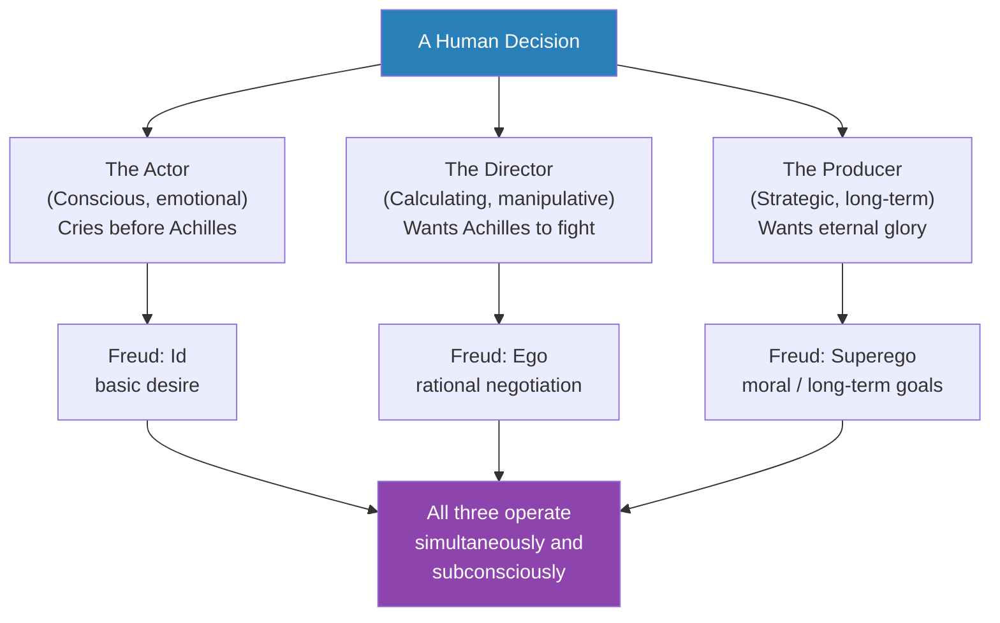
*The three-level structure of every human mind — what Freud would call the Id, Ego, and Superego — is already visible in Homer's depiction of Patroclus begging Achilles. Most of this happens beneath awareness.*

> [!note]- Expand: Full Lecture Detail
> Prof. Jiang opens by reminding the class where the Iliad stands. The war began as a battle of wills between Agamemnon and Achilles. That conflict paralysed the Greeks, and now Hector is about to destroy them. The Greeks beg Achilles to return. Achilles refuses — he needs Agamemnon to apologise to save face. So Achilles sends Patroclus to get the Greeks to beg more.
>
> But Nestor is cleverer than Achilles thinks. Nestor tells Patroclus: "We can't get Achilles to fight, but maybe you can fight for us, and maybe that will save the day." Patroclus is electrified — all his life he has lived in Achilles's shadow, and now he sees a chance to outshine his commander.
>
> Prof. Jiang stops the narrative and asks the class to visualise what happens next. Patroclus returns to Achilles and begs him to enter the battle. On the surface, this is a simple emotional appeal. But underneath, the speech is being fought at three levels at once:
>
> - **The actor** — the person who appears before Achilles, "cries like a girl," performs grief and desperation
> - **The director** — the calculating middle layer that asks "why am I doing this?" and answers: to get Achilles to agree
> - **The producer** — the long-term strategist in the back of Patroclus's mind, the one thinking about eternal glory, who has been waiting his entire life for this moment
>
> Prof. Jiang makes the claim explicit: "Think of this as the actor, director and producer, or the investor. What is my long term gain from this?"
>
> Achilles, he says, is doing exactly the same thing. His actor asks Patroclus why he is crying. His director thinks: maybe I can trick Patroclus into helping me enter the battlefield. His producer thinks: I want to win glory for myself.
>
> - All of this is subconscious
> - Neither man knows he is doing it
> - The dialogue in the Iliad is the surface of a three-layered negotiation
>
> > [!example] The Actor, Director, Producer Inside Patroclus
> > - The actor bursts into tears before Achilles, staging emotional appeal
> > - The director is calculating: "I need him to say yes — what expression, what words, what posture will get me there?"
> > - The producer is further back still, thinking about what lies after the yes — the battlefield, the glory, the chance to surpass Achilles forever
> > - All three operate without Patroclus's conscious knowledge
> > - Achilles does the same thing in parallel, running his own three-layered operation
> > **The lesson:** Human beings are not unified agents making single decisions — they are committees of selves running in parallel, most of whom the conscious self cannot hear.
>
> Prof. Jiang translates the three layers into Freud's vocabulary:
> - **Id** — the basic desire (glory, sex, money)
> - **Ego** — the rational self negotiating with reality
> - **Superego** — the moral and long-term frame
>
> Then he makes the point that will matter for the rest of the lecture: "We've known for a long time that we as humans operate at many different levels all at once, and so we don't really know why we do what we do." Homer saw it. Freud named it. The question — the real question of today's lecture — is how this is even possible. What kind of mind permits three minds to run inside it?

---

## The Trap Achilles Lays — Hubris as Weaponised Suggestion [6:20 – 10:00]

*Prof. Jiang examines the speech where Achilles grants permission for Patroclus to fight. On the surface, Achilles agrees; underneath, he plants a seed of hubris that will get Patroclus killed. Neither man understands what is happening — but the universe does.*

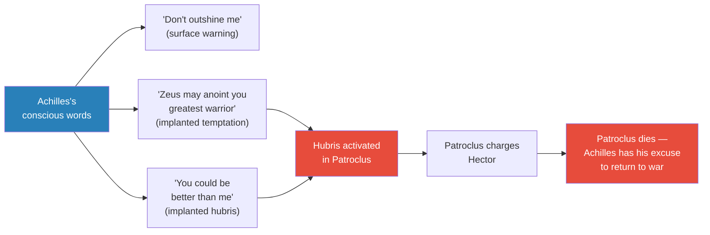
*The speech is a masterpiece of manipulation Achilles does not know he is delivering — a surface warning laid over a deeper seduction, engineering Patroclus's death while preserving plausible innocence.*

> [!note]- Expand: Full Lecture Detail
> Prof. Jiang asks Ivory to read the passage. Achilles tells Patroclus that once he whips the enemy from the fleet, he must turn back. Even if Zeus grants glory, Patroclus must not press on against the Trojans. Taken at face value this is protective advice.
>
> But Prof. Jiang reads it differently. He walks through what Achilles is actually implanting into Patroclus's mind:
>
> - "Zeus is going to give you glory" — Achilles is telling the jealous younger man that the king of the gods himself might anoint him the greatest warrior in the world
> - "Do not outshine me" — on the surface, this is a warning; underneath, it is a dare
> - "You could be better than me" — the idea is seeded that Patroclus might exceed Achilles, which has been Patroclus's lifelong desire
>
> What the speech does not do is mention Hector. Nowhere does Achilles warn Patroclus specifically about Troy's greatest warrior. All he does is inflate Patroclus's sense of possibility.
>
> Prof. Jiang decodes the strategy:
> - Achilles understands Patroclus is young, impetuous, and jealous
> - Given the opportunity, Patroclus will seek glory for himself
> - If Patroclus gets himself killed chasing glory, Achilles wins two ways: the Greeks beg him even harder, and he has the perfect excuse to return to the battlefield enraged
>
> - <b style="color: #e74c3c">The murder is already committed in the speech</b> — Patroclus is dead the moment Achilles agrees, though no one recognises it
> - No one in the story sees it: not the Greeks, not the gods, not Patroclus himself
> - Not even Achilles consciously knows what he is doing — the producer inside him is making the decision the actor cannot admit to
>
> > [!example] The Invisible Murder
> > - Achilles agrees to let Patroclus fight — surface interpretation: reluctant concession
> > - He adds a subtle inflation of Patroclus's ego — "Zeus may anoint you"
> > - He warns against outshining him, which only confirms to Patroclus that outshining is possible
> > - He omits the one thing that would save Patroclus: specific warning about Hector
> > - Patroclus charges the field filled with hubris and meets Hector
> > - Achilles mourns publicly, and the universe gives him the excuse he needed
> > **The lesson:** The deadliest manipulations are the ones the manipulator cannot admit to himself.
>
> Prof. Jiang pauses the narrative. The question before the class, he says, is bigger than Homer: "How is it that we function at three different levels and do things that are invisible to ourselves and to others? How is it that we make decisions? How is it that we manipulate other people as well ourselves?" The answer requires leaving Homer temporarily and doing philosophy.

---

## Why Standard Psychology Fails [10:00 – 13:00]

*Prof. Jiang presents the textbook model of consciousness — experiences become memories, memories shape personality, personality drives preferences — and demolishes it with three clean objections. The standard model cannot explain the human beings Homer has just described.*

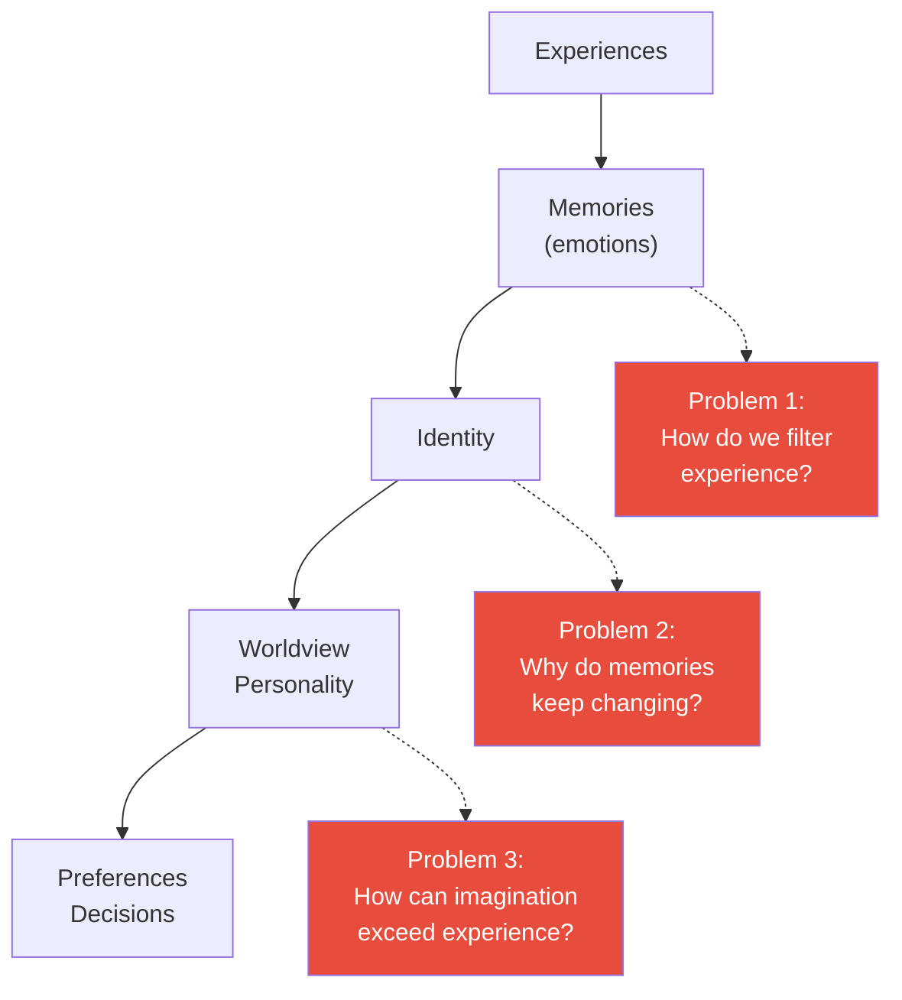
*The textbook linear model treats consciousness as a passive intake valve. Three simple questions show it cannot be right — filtering, mutability, and the infinite reach of imagination all require a different architecture.*

> [!note]- Expand: Full Lecture Detail
> Prof. Jiang lays out the standard model step by step:
>
> - We have **experiences** — events that happen to us
> - Experiences become **memories**, which are really emotions attached to events
> - Memories are organised into **identity** — who we think we are
> - Identities combine into a **worldview** or personality — how we perceive the world
> - Personality determines **preferences** — what we like, how we decide, how we imagine the future
>
> This is what a standard introductory psychology course teaches. Prof. Jiang does not waste time attacking it vaguely — he attacks it with three precise problems.
>
> **Problem 1 — Filtering.** Two people in the same room have the same experience, and produce different memories.
> - A concert that bores one person moves another to tears
> - A traumatic event forgotten by one sibling remembered vividly by another
> - A single lecture heard by 20 students produces 20 different summaries
> - The textbook model cannot explain what does the filtering — because according to it, experience is the input, not something already interpreted
>
> **Problem 2 — Mutability.** Memories change. The same event, revisited at 20, 40, and 60, produces different emotional reactions.
> - Prof. Jiang's example: your father hits you by accident when you are a child
> - At the time you perceive it as "my father does not love me"
> - Decades later, you accidentally hit your own child, and suddenly you feel sympathy for your father
> - The memory itself has not changed — your relationship to it has — but the felt content shifts
> - If memory were a passive recording, this would be impossible
>
> **Problem 3 — Imagination.** Material experience is finite; imagination is infinite.
> - You have lived perhaps 30 or 50 years; the experiences you can draw on are bounded
> - Yet novelists construct worlds with thousands of inhabitants, physicists imagine universes that do not exist, children conjure realities they have never seen
> - Where does the extra material come from?
> - The textbook model gives no answer
>
> - <b style="color: #e74c3c">The standard model treats consciousness as a camera — and no camera can explain the mind Homer just described</b>
> - Patroclus does three things at once; memories are malleable; imagination exceeds experience
> - A different architecture is needed — one where consciousness is active, not passive; connected, not isolated

---

## Kant, Hegel, and the Conscious Universe [13:00 – 20:00]

*Prof. Jiang reintroduces the framework from Lecture 1 — Kant's noumena and phenomena, Hegel's Geist — and pushes it one step further. If we are all creating our reality, yet share the same reality, then the universe must be conscious and must talk back to us. Consciousness is not a thing inside the head. It is a field we are inside of.*

> [!tip] Core Insight
> The universe is not a stage we perform on. It is a conscious field we are inside of, and it responds to us as we engage with it. Every memory we create is uploaded into the field. Every idea we access is downloaded from it. This is why thoughts seem to arrive, why synchronicities happen, why the universe appears to have a plan.

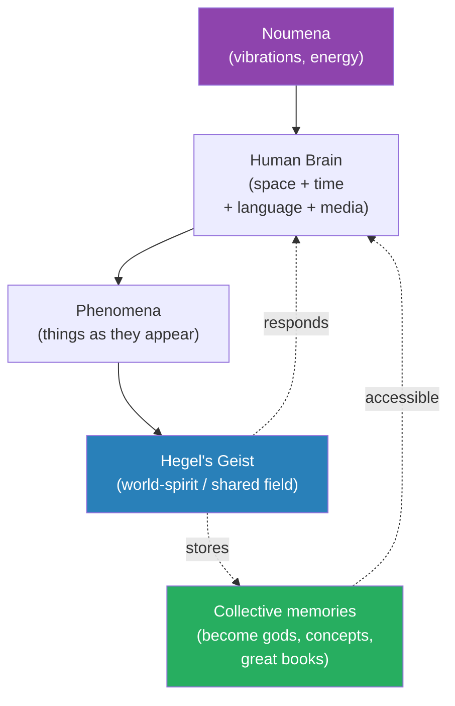
*Kant gave us noumena and phenomena; Hegel added the Geist that makes shared reality possible. The dotted arrows are the key move — the universe talks back, stores our memories, and feeds them back to us.*

> [!note]- Expand: Full Lecture Detail
> Prof. Jiang returns to Kant. Rather than being passive observers of the world, we are active participants in reality — we create reality. The brain imposes space and time onto raw existence. What Kant called **noumena** are the things-in-themselves, the vibrations and energy underneath all appearance. What we perceive, **phenomena**, is the filtered result.
>
> Prof. Jiang notes the open problems in Kant:
> - Where does our space and time come from? We know the brain creates them, but why?
> - What is the noumena actually? We cannot see it, but something must be there
> - If all perception is subjective — each of us creating reality inside our own head — how do we share it?
>
> Hegel answers the third problem. Phenomena is structured by the <b style="color: #2980b9">Geist</b> — the world-spirit, the shared conscious field that gives us space and time.
>
> - As we interact with the noumena, the noumena itself responds to us
> - We are not alone in our heads — we are inside a field that is also responding
> - This is how we can all see the same thing: one shared force acts on all of us
>
> Prof. Jiang uses a metaphor the students will recognise instantly — <b style="color: #2980b9">the internet</b>:
> - Whatever you produce online is stored in the cloud, but you also keep memory on your own hardware
> - The internet is dynamic — the more it is used, the more it changes
> - Every post, every search, every interaction modifies what is available to every other user
> - Consciousness is the same — your memories flow into the Geist, and the Geist is therefore constantly evolving
>
> Then he builds up what the Greeks saw. Imagine consciousness as extending infinitely outward through dimensions:
> - On one level, you talk to yourself
> - On another, you talk to another person
> - On another, you talk to a group
> - On another, you interact with an entire culture
> - This goes on infinitely
>
> Memories that are extremely vivid or powerful become permanent features of the Geist. These give rise to new consciousnesses — gods.
>
> Prof. Jiang lays out the Greek hierarchy:
> - <b style="color: #2980b9">The new gods</b> — Zeus, Apollo, Aphrodite — personal deities who intervene in human events
> - <b style="color: #2980b9">The older gods</b> — honour, justice, fate, destiny — these are stronger than the new gods because they have been there since the beginning
> - <b style="color: #2980b9">God itself</b> — the immutable, unwritten laws of the universe, comparable to gravity: good, truth, beauty
>
> The higher you go, the more permanent and powerful the consciousness.
>
> > [!example] The Universe as Internet
> > - Your brain is a personal computer, running its own operating system
> > - Every idea you generate flows outward and becomes part of the shared field
> > - Old ideas that were powerful enough to survive become pseudo-permanent features — we call these gods, archetypes, or cultural memes
> > - The oldest, most stable features are laws so fundamental they feel physical — gravity, justice, truth
> > - Whatever you do here reverberates throughout the whole system
> > - One good act can affect the entire universe because the universe is conscious and connected
> > **The lesson:** You are never acting alone. Every thought is uploaded. Every decision is a vote.
>
> The payoff for Homer: <b style="color: #27ae60">we are a hologram of the universe</b>. The internet is vast; yet your computer holds a functional replica of it because you are connected to it all the time. Your consciousness is the same — because you are constantly engaged with the Geist, the whole universe is mirrored inside you.
>
> Now Patroclus and Achilles make sense. If each man is a universe unto himself, then there are different spirits operating within each of them simultaneously. The three-level mind is not a bug — it is what it looks like from the inside when an entire universe is compressed into one soul.

---

## The Shield of Achilles — The Soul as Universe [20:00 – 26:00]

*Prof. Jiang brings the class to the legendary Shield of Achilles, forged by Hephaestus. He argues the shield is not a weapon, not a picture, but a movie — a living snapshot of the soul of Achilles. And the soul of Achilles is a universe onto itself, proving the theory in Homeric imagery.*

> [!tip] Core Insight
> Memories are not still images stored in a library. They are living scenes in perpetual motion, drawn both from our own experience and from the universe itself. This is why poetry matters — poetry captures memory in motion the way no other form can.

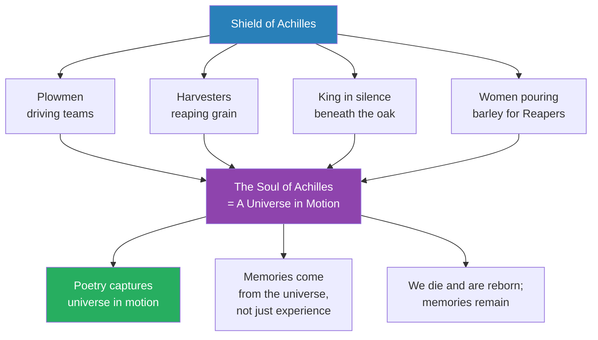
*The Shield is not an object Hephaestus forges — it is an X-ray of Achilles's soul. And that soul turns out to be a universe populated with lives Achilles has never lived, proving memories come from the Geist, not experience alone.*

> [!note]- Expand: Full Lecture Detail
> Prof. Jiang asks Ivory to read the forging of the shield. The imagery is rich with action verbs — plowmen wheeling their teams, crews driving, harvesters reaping, women pouring barley. Nothing on the shield is still.
>
> Prof. Jiang stops repeatedly to mark the verbs. "Wheeling, porting, tilled, driving" — everything is in motion. This is deliberate. Homer is telling us something about the nature of memory itself:
>
> - Memories are not photographs — they are living images in motion
> - They change, react, continue moving even when we are not looking at them
> - They are closer to dreams than to files
>
> And then the deeper claim. The shield of Achilles, Prof. Jiang says, is the soul of Achilles. It is a universe populated with characters — the king, women, plowmen, harvesters, heralds, oxen, children.
>
> - Achilles has never been a plowman
> - Achilles has never been the king of an estate at harvest
> - Achilles has never served barley to reapers
>
> Yet all these lives live inside him.
>
> <b style="color: #27ae60">"These memories don't come from our experiences. These memories come from part of our experiences, but also come from the universe itself."</b>
>
> The implications stack up:
> - Our experiences only allow us to access the universe and enter dialogue with it
> - Through that dialogue, we absorb memories from elsewhere
> - We are constantly living and dying — physical death is shedding one body and assuming another
> - But our memories stay — the poetry in us stays, constantly being rewritten
>
> > [!example] The Shield as Soul
> > - Hephaestus forges a shield with living scenes
> > - Plowmen drive teams, harvesters reap, a king watches in silence, women serve food
> > - None of these are scenes from Achilles's actual life
> > - Yet they are his soul, depicted in gold
> > - The only explanation: the soul draws from the universe, not just personal memory
> > - When Achilles dies, this shield and its scenes do not die — they remain in the field
> > **The lesson:** The soul is not a record of your life. It is a universe you carry, populated by lives you have never led, which is why the poet can recognise what you do not.
>
> Prof. Jiang draws the conclusion out explicitly:
> - Our power, our will to live, our will to fight — all of it — comes from being conscious beings in dialogue with a universe that is both infinite and internal
> - Poetry is the form that reveals this because poetry captures the universe in motion
> - We are extremely complex, sensitive, multifaceted beings — we are the universe unto ourselves
> - Our consciousness is the universe; the universe is our consciousness; it is all interconnected

---

## Evil Punishes Itself — Achilles's Undoing [26:00 – 30:00]

*After Patroclus dies, Achilles kills Hector and mutilates his body. Prof. Jiang explains this is not victory — it is Achilles trying to escape his own guilt, and failing. In a conscious universe, evil does not need an external punisher; memory itself is the fire.*

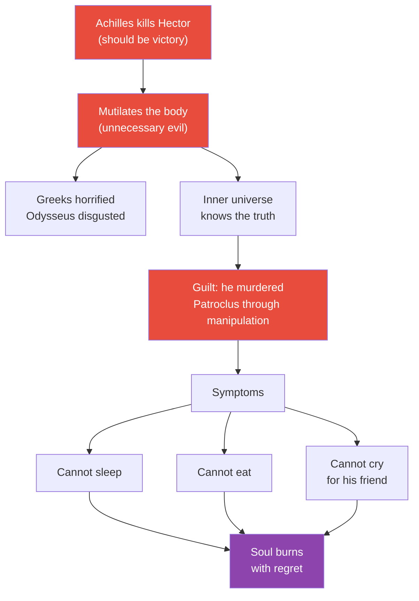
*Achilles's breakdown is not moralism — it is metaphysics. His soul is part of a conscious universe that recorded his manipulation of Patroclus, and the memory itself is what destroys him.*

> [!note]- Expand: Full Lecture Detail
> Achilles jumps back into battle and kills Hector. By the standard heroic arithmetic, this is total victory — Achilles has proven himself the greatest warrior in the world and secured eternal fame.
>
> Then he does something strange. He ties Hector's body to his chariot and drags it around Troy. Priam and Hecuba go insane with grief. Even Achilles's allies — Odysseus, Ajax — are disgusted.
>
> Prof. Jiang explains why this is so deeply wrong by the standards of the time:
> - Hector was a great warrior — he fought clean, never cheated, was fierce and brave
> - When Achilles returned to the battlefield, Hector did not flee with the other Trojans — he stood his ground and died
> - This was the greatest act of bravery in the Iliad: knowing he would die and accepting it anyway
> - "I must take responsibility for this defeat" — that is why he stayed outside the gates
> - A great warrior deserves respect in death, not mutilation
>
> So why does Achilles do it? One explanation is simple: he has gone insane. The Greeks try to comfort him with funeral games for Patroclus. It does not work. Achilles can't sleep, can't eat, can't even cry for his friend.
>
> Prof. Jiang makes the metaphysical argument:
> - <b style="color: #e74c3c">In his heart, Achilles knows he got Patroclus killed</b>
> - He manipulated his best friend into his death for his own benefit
> - The conscious universe remembers this
> - <b style="color: #27ae60">"You don't need God to punish you, because you punish yourself with a memory of it"</b>
> - Achilles's soul burns with regret, despair, guilt, and shame
> - The mutilation of Hector is the externalisation of the inner torment — he is trying to inflict on someone else what is being inflicted on him
>
> > [!example] The Impossible Grief
> > - Achilles should be triumphant — he has killed Hector, Troy's greatest warrior
> > - Instead he drags the body around the city, desecrating it
> > - His men look away in disgust
> > - At night he cannot sleep, cannot eat, cannot even cry for Patroclus
> > - The more external punishment he tries to inflict, the worse he feels
> > - He has done the forbidden thing — manipulated his best friend into his own death — and the conscious universe will not let him forget
> > **The lesson:** The conscious universe is the ledger. You can hide from other people. You cannot hide from yourself.
>
> Prof. Jiang frames the emerging conflict:
> - Achilles is about to go insane
> - He cannot admit what he did because he does not fully understand himself
> - The producer in him committed the murder; the actor cannot accept it
> - Something will have to intervene from outside — and in a conscious universe, something will

---

## The Mandate of Heaven — How the Universe Arranges Meetings [30:00 – 35:00]

*Prof. Jiang asks: how does Priam — the broken king of a besieged city — walk through Greek lines and arrive at Achilles's tent unseen? The textbook answers "Hermes guides him." Prof. Jiang argues the mechanism is metaphysical: the universe, being conscious, engineers the meeting. He calls this the Mandate of Heaven.*

> [!tip] Core Insight
> When two souls must meet for the universe to continue, the universe arranges the meeting. The characters cooperate subconsciously — guards look away, paths open, doors unlatch — because the Geist has decided it must be so.

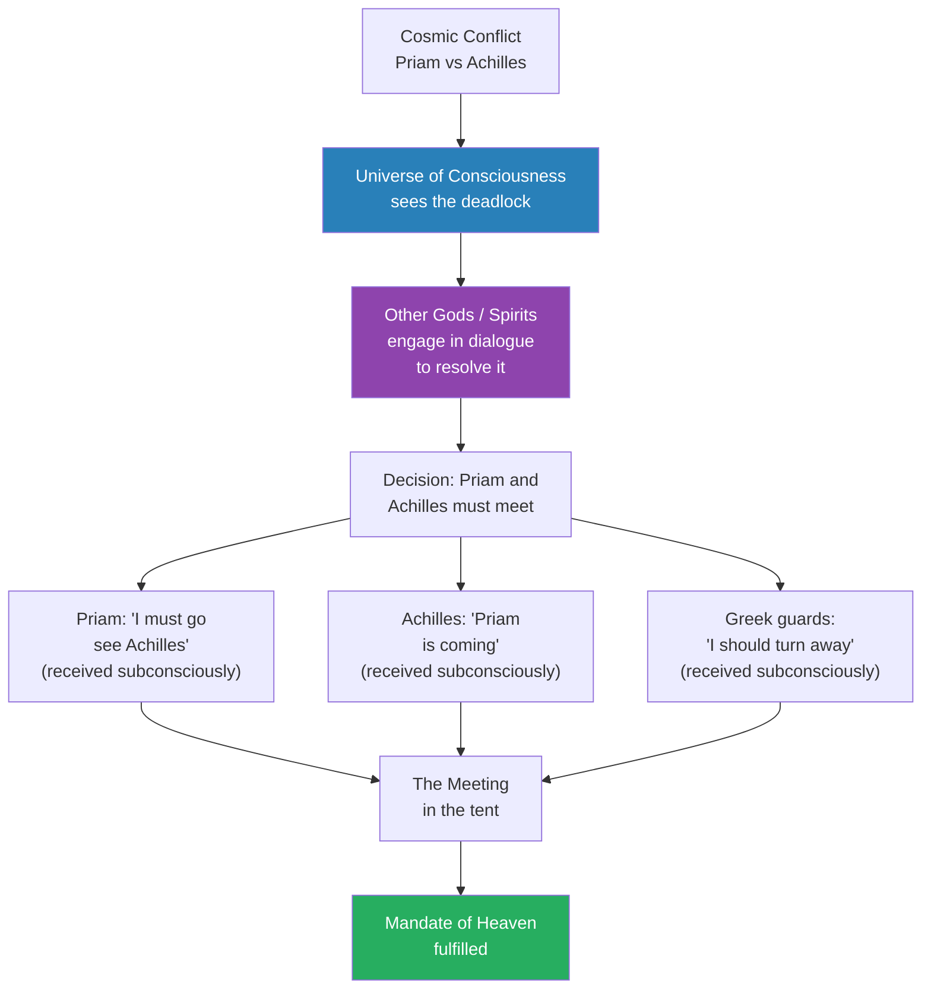
*The Mandate of Heaven is not a literary trope — Prof. Jiang treats it as a real causal mechanism. The universe arranges meetings that must happen; all the human actors cooperate without knowing they are cooperating.*

> [!note]- Expand: Full Lecture Detail
> Prof. Jiang recaps the situation before the final meeting. Achilles is in a spiritual crisis. Priam is in an unbearable grief. They hate each other. They could not be further apart. And yet the Iliad's ending requires them to meet.
>
> In Homer, Hermes guides Priam through the Greek camp. Prof. Jiang asks the class: is this metaphor or is it literal? He argues literal. Here is how:
>
> - Achilles and Priam are two islands of consciousness within a larger conscious universe
> - The universe contains not just the two men but other spirits and minds — the Greek guards, the gods, the memories of Patroclus and Hector
> - Those other consciousnesses see the deadlock and engage in dialogue to resolve it
> - <b style="color: #2980b9">This dialogue is not what we usually call "thinking" — it is the universe reasoning with itself</b>
>
> Prof. Jiang explains the mechanism:
> - The Geist comes to an agreement: Priam must meet Achilles
> - Achilles, subconsciously, receives the message: "Priam is coming"
> - Priam, subconsciously, receives the message: "I must go to Achilles"
> - The Greek guards, subconsciously, receive the message: "Look the other way"
> - Priam walks out of Troy, across the Plains, through the camp, into the tent — and nobody sees him
>
> Prof. Jiang names it in Chinese: <b style="color: #2980b9">the Mandate of Heaven</b>. The universe has a plan. When two souls must meet, the universe will arrange the meeting.
>
> He connects the idea to his own national history:
> - Mao Zedong was a peasant
> - He won the Chinese Civil War against enormously superior forces
> - He was never injured once through the entire war
> - How do you explain this? The Mandate of Heaven — the universe had a design, and he was in alignment with it
>
> > [!example] Priam Walking Through the Greek Camp
> > - Priam is an old king — recognisable, unarmed, deep in enemy territory at night
> > - Any one of thousands of Greek soldiers could kill him or capture him
> > - Homer tells us Hermes guides him — but the Greek guards are awake
> > - The universe decides: this meeting must happen
> > - Each guard receives the nudge — "I should turn that way" — and Priam walks past
> > - When enough consciousnesses cooperate at the subconscious level, impossibility becomes routine
> > **The lesson:** The events that shape history do not look like miracles. They look like coincidences cooperating.
>
> Prof. Jiang answers the objection before it comes:
> - The Greek guards do not know they are cooperating
> - Achilles does not know Priam is coming until he is in the tent
> - Priam does not know what he will say until he is kneeling
> - <b style="color: #27ae60">Each acts in perfect local freedom while fulfilling a cosmic design</b>
> - This is how the universe works — it reasons through us without us realising we are being reasoned through

---

## The Greatest Scene in Literature — Priam at Achilles's Feet [35:00 – 40:00]

*Prof. Jiang reads what he calls the greatest ending in all of literature: the moment Priam kneels before Achilles and kisses the hands that killed his sons. In a conscious universe, this single act reverberates outward and changes everything.*

> [!tip] Core Insight
> Greatness does not come from defeating your enemies. It comes from forgiving them. One act of forgiveness — performed with full knowledge of what it costs — can change the universe forever because the conscious universe remembers.

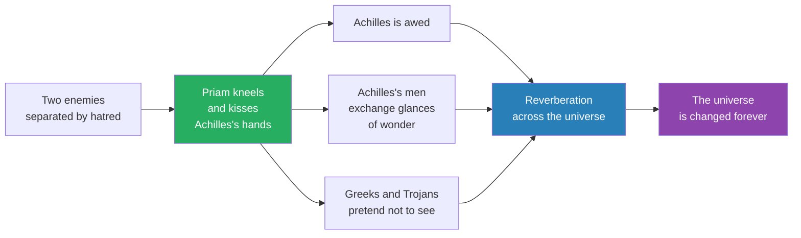
*One act, performed by one broken king, is enough to transform everyone who witnesses it — including Achilles, including the soldiers, and including every reader of Homer for three thousand years.*

> [!note]- Expand: Full Lecture Detail
> Prof. Jiang sets up the stakes. Priam is not just any suppliant — he is the king of Troy. He has watched Achilles kill many of his sons in battle. He has watched Achilles slaughter Hector and drag the body around his city. For Achilles, Priam is the very architect of the war — the man whose son Paris stole Helen.
>
> These are two people who hate each other completely. There is no obvious path to reconciliation.
>
> And then the passage: Priam kneels before Achilles, clasps his knees, and kisses his hands — "those terrible man-killing hands that had slaughtered Priam's many sons in battle."
>
> Prof. Jiang asks the class to hold the image:
> - Priam could have stabbed Achilles from behind
> - An old man with a dagger, coming up on Achilles in his tent at night — it would have worked
> - He does not do this
> - He kneels and kisses the hands of the man who killed his sons
>
> Achilles — the man who has bowed to no one — is stunned. His men exchange marvelling glances. Homer compares the moment to the awe felt when a murderer flees to a foreign land and the men there see him and feel a sense of marvel.
>
> Prof. Jiang decodes the simile:
> - There are people who commit great murders and must flee to escape their crime
> - When they arrive in new lands, they often become slaves, bound by their shame
> - But some — the ones with the strength to turn themselves over to a new fate — transform their lives
> - Priam is doing exactly this: by surrendering entirely to his enemy, he is changing his fate and the fate of the world around him
>
> > [!example] The Kiss That Changed the Universe
> > - Priam, old king of Troy, kneels before Achilles in his tent
> > - He takes the hands that killed Hector and kisses them
> > - Achilles, whose nights have been sleepless with guilt, is struck dumb
> > - His soldiers trade glances of wonder — even they feel the earthquake
> > - For the first time since Patroclus died, Achilles is able to cry
> > - Both men weep together — Priam for Hector, Achilles for Patroclus and his father
> > **The lesson:** The conscious universe records acts of courage and forgiveness, and it amplifies them until everyone in their vicinity is transformed.
>
> Prof. Jiang then reads Priam's speech:
> - "Remember your own father, great godlike Achilles, as old as I am..."
> - "I had fifty sons when the war began — nineteen from the same mother, the rest from other women in the palace"
> - "Most of them violent Ares cut the knees from under"
> - "One was left — the one you killed the other day, defending his fatherland, my Hector"
> - "I have come to win him back — I bring a priceless ransom"
> - "I have endured what no one on earth has ever done before — I put to my lips the hands of the man who killed my son"
>
> Prof. Jiang treats this as theologically decisive:
> - Priam is the greatest king in the world because he is willing to humble himself before Achilles
> - This struggle began because Agamemnon could not be humble
> - Agamemnon and Priam are inverted — where one refused to apologise, the other begs for forgiveness
> - <b style="color: #27ae60">Priam is doing this because he loves Hector</b>
> - Love is what gives him the courage to beg
>
> He formulates the theological claim explicitly:
> - <b style="color: #27ae60">Love is the unifying force of the universe — love is God</b>
> - To really access the universe, to really know it, you must love
> - Love makes you invincible
> - And love activates the imagination — because Priam loves Hector, he is able to imagine the soul of Achilles, to imagine how Achilles loves his father
>
> Priam's two forces:
> - <b style="color: #27ae60">Love unifies the universe</b> — it brings divided souls together
> - <b style="color: #27ae60">Imagination animates the universe</b> — it makes us see into other souls
> - The purpose of human life is to love each other and activate our imagination to create a world where love is the pillar

---

## Achilles Wept — Forgiveness as Liberation [40:00 – 46:00]

*Prof. Jiang reads the moment Achilles takes Priam's hand and both men finally weep. The scene is not sentimental — it is metaphysical. Achilles's soul had been trapped in evil; Priam's forgiveness liberates it.*

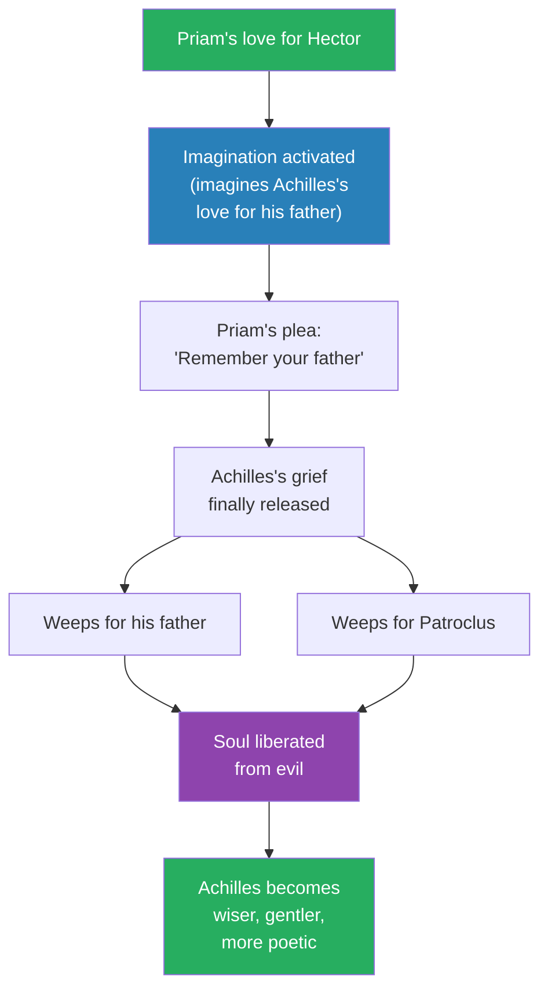
*The mechanism runs: love → imagination → empathy → forgiveness → liberation. It is the same sequence Homer is showing the reader, and it is the sequence the lecture claims is the purpose of human life.*

> [!note]- Expand: Full Lecture Detail
> Prof. Jiang reads on. Homer writes: "Those words stirred within Achilles a deep desire to grieve for his own father."
>
> Then Achilles gently takes the old man's hand and moves him back. Both men weep openly. Priam cries for Hector. Achilles cries first for his own father — now alone in Phthia — then for Patroclus. Their sobbing rises and falls throughout the house.
>
> Prof. Jiang explains the liberation:
> - Before this moment, Achilles's soul was trapped in evil
> - He had been unable to cry, unable to sleep, unable to eat
> - His soul burned with a guilt he could not name
> - Now that Priam has forgiven him, Priam has actually liberated Achilles
> - Achilles's soul is free to reconnect to the universe and return to its poetic self
>
> Then Achilles raises Priam up and speaks words that fly "straight to the heart":
> - "Poor man, how much you have borne"
> - "Pain to break the spirit"
> - "What daring brought you down to the ships alone"
> - "To face the glance of the man who killed your sons, so many fine, brave boys"
> - "You have a heart of iron"
> - "Come, please, sit down on this chair here"
>
> - <b style="color: #27ae60">This is Achilles's epiphany</b> — he recognises his own guilt because Priam forgave him
> - Because Priam forgave him, Achilles can forgive himself
> - He becomes wiser, more gentle, more poetic, more generous
> - This is what life is — to do battle with our own hearts and win the war of forgiveness
>
> > [!example] The Weeping in the Tent
> > - Priam kneels, kisses Achilles's hands, speaks of his fifty sons and his beloved Hector
> > - Achilles, who had not wept for anyone, finally breaks
> > - First he weeps for his aged father, now alone back home
> > - Then he weeps for Patroclus — the friend he manipulated into death
> > - Priam weeps in the same house for Hector
> > - The two men, enemies for ten years, share the same grief in the same room
> > - Achilles raises Priam up, calls him brave, and seats him as a guest
> > **The lesson:** Forgiveness is not earned — it is given. And when it is given, both souls are freed.
>
> Prof. Jiang steps back to name the theological framework:
> - In Buddhist and Hindu thought, we are constantly reincarnating
> - This world is one of pain, but it is one that trains us to be wise
> - Each life is a role — the murderer one life, the murdered the next, a human one life, a plant the next
> - Reincarnation continues infinitely until we achieve wisdom
> - <b style="color: #27ae60">The point of this life is to develop empathy</b> — empathy leads to wisdom and enlightenment
>
> > [!quote] Prof. Jiang
> > "When you do evil, God doesn't have to punish you — you punish yourself with a memory of it."

---

## Great Books as Compressed Lives [46:00 – 50:00]

*Prof. Jiang makes the argument for why the class is reading Homer at all. Great books compress many lives into one text — reading them speeds up the empathy training that reincarnation takes infinite lives to accomplish.*

> [!tip] Core Insight
> A great book is a universe unto itself, and therefore you can speed up the process of wisdom and enlightenment by reading it. In the Iliad you are Agamemnon, then Achilles, then Hector, then Andromache — you live what would otherwise take many lifetimes to live.

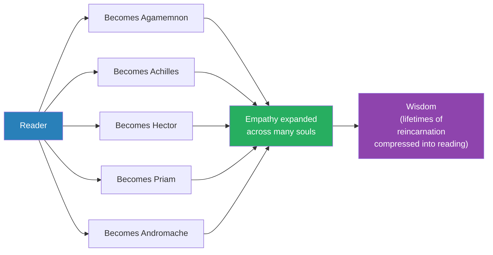
*Reincarnation takes infinite lives to accomplish empathy — but a great book compresses those lives into pages. To read Homer is to live the multiple lives the soul would otherwise need to cycle through.*

> [!note]- Expand: Full Lecture Detail
> Prof. Jiang explains the power of the Iliad:
> - A great book is a universe unto itself
> - You can therefore speed up the process of wisdom by reading it
> - You can assume different lives all at once — which is what the Buddhist tradition says reincarnation does
> - Reading is compressed reincarnation
>
> In the Iliad, you are constantly switching perspectives:
> - One chapter you are Agamemnon, inflating your ego
> - The next you are Achilles, nursing injured pride
> - The next you are Hector, carrying the weight of your city
> - The next you are Priam, kneeling before your enemy
> - Finally you are Andromache, cradling your dead husband's head
>
> - <b style="color: #27ae60">"What makes the Iliad so powerful is that you're constantly switching perspectives"</b>
>
> Prof. Jiang emphasises one more structural fact: Homer is a Greek, writing for the Greeks. The Iliad is the national epic of Greek civilisation. Yet it ends from the Trojan perspective — with Priam recovering Hector's body, taking it back to Troy, and Andromache singing her lament.
>
> Ivory reads the ending. Andromache cradles Hector's head in her arms and speaks to her dead husband:
> - "Oh my husband, cut off from life so young"
> - "You leave me a widow, lost in the royal halls"
> - "And the boy, only a baby — the son we bore together"
> - "I cannot think that he will ever come to manhood"
> - "Long before that the city will be sacked, plundered, top to bottom, because you are dead"
> - "Her great guardian — you who always defended Troy"
> - "All who will soon be carried off in the holy ships — and I with them"
>
> Prof. Jiang decodes the ending:
> - Andromache's prophecy will come true: when Troy falls, her son is killed and she is enslaved
> - This is what war does — men die, children are killed, women are enslaved
> - Homer has forced a Greek reader to live inside the Trojan woman's grief
>
> > [!example] The Trojan Woman's Lament
> > - Hector is dead
> > - Andromache holds his head in her arms
> > - She speaks not to the Greeks but to her dead husband
> > - She knows the future: her son will die, her city will burn, she will be enslaved
> > - The Iliad's last words are not triumph — they are prophecy of catastrophe, voiced by the enemy
> > - Homer, a Greek, ends his national epic from the losing side
> > **The lesson:** The greatest literature ends where the reader's prejudices are broken — from inside the soul of the enemy.

---

## The Big Bang of Civilization — Empathy Through Trauma [50:00 – end]

*Prof. Jiang closes the lecture — and the Iliad — by connecting Homer to Gaza. The ending of the Iliad is not a literary flourish. It is a violent assault on the reader's prejudice, designed to make empathy possible. This, Prof. Jiang says, is the big bang of civilisation.*

> [!tip] Core Insight
> Only through trauma, only through pain, only through suffering can you access empathy and wisdom. Civilisation begins the moment you are forced to feel what it is like to be the person you thought was your enemy.

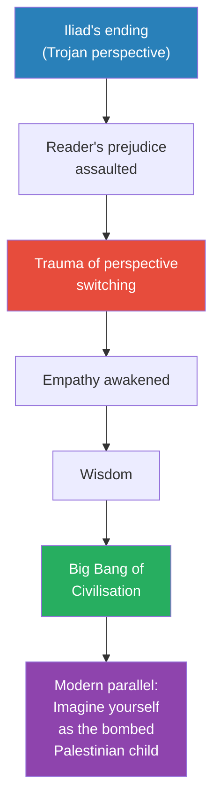
*The Iliad's ending is an assault — deliberately so. The trauma of being forced into the enemy's soul is what unlocks empathy and makes civilisation possible. Prof. Jiang makes the parallel to Gaza explicit.*

> [!note]- Expand: Full Lecture Detail
> Prof. Jiang asks the class to sit with the weight of Homer's ending. Imagine you are a Greek. All your life you have heard about the great Greek victory over Troy. The Trojan War is the most famous story in your world — your national triumph.
>
> Now Homer, your greatest poet, asks you to do something else. He asks you to imagine what it is like to be a Trojan woman, knowing that in a few months, your entire city will be sacked, your husband will be killed, your children murdered, and you will be put on a ship to be enslaved while you watch your city burn.
>
> - Think about the power of that
> - You are being made to feel what your own victory meant for the losers
> - You cannot celebrate the same way again
>
> Prof. Jiang makes the contemporary parallel:
> - Think about what is happening in Gaza today
> - Israelis are bombing Palestinians
> - They are killing many children
> - They believe it is right because they are defending their land
> - Now imagine one day they have a dream — they imagine themselves as the Palestinian child who lost his mother, as the mother who lost her child
> - Think about the emotional impact of that dream
>
> - <b style="color: #27ae60">"This is the big bang of civilisation"</b>
> - When you read the Iliad and are forced to switch perspectives, it is a violent assault on your own consciousness — your prejudice, your beliefs, your values, all being destroyed at once
> - This destruction is what allows you to access the entirety of the universe
> - <b style="color: #e74c3c">Only through trauma, only through pain, only through suffering, can you access empathy and wisdom</b>
> - This is why the Iliad must be a lifelong journey — it will take you your entire life to appreciate the nuance, the beauty, the power
>
> > [!example] The Iliad as Empathy Weapon
> > - Greek reader picks up the Iliad expecting national glory
> > - Reads ten years of siege from inside the Greek camp
> > - Watches Achilles commit the manipulation that kills Patroclus
> > - Watches Hector stand outside Troy's gates and die bravely
> > - Watches Priam kneel and kiss the hands that killed his sons
> > - Ends the book inside Andromache, mother of a doomed child, soon-to-be slave
> > - Closes the book and can no longer celebrate the victory the same way
> > **The lesson:** The function of the greatest literature is to break the reader. And the breaking is the mechanism of civilisation.
>
> Prof. Jiang promises the students the reward:
> - If you spend your entire life with the Iliad, you will come out a much wiser person
> - You will have a universe in your soul
> - That universe will make you invincible and eternal
> - But it is your choice — great books work only if you let them work
>
> > [!quote] Prof. Jiang
> > "A universe in your soul — that will make you invincible and eternal."
>
> He ends the class by signalling the next step. "That's it for the Iliad. We'll start the Odyssey next, which is a continuation of the Iliad." The lecture closes with him asking if anyone has questions, and noting that the material will "stay with you for the rest of your life" — a formulation that echoes the Iliad's own claim about itself.

---

## Connections

**Builds on:** [[01 - Secrets of the Universe]] (noumena, phenomena, Geist, the universe as conscious), [[02 - Homer and the Invention of the Human]] (the Iliad as map of the human soul), [[03 - Poets and Prophets]] (poetry as dialogue with the universe). This lecture is the capstone of the Iliad arc — the payoff for the philosophical architecture built in Lecture 1 and the character work built in Lectures 2 and 3.

**Sets up:** [[05 - The Odyssey]] (the next epic, continuation of the Iliad's themes — reconciliation, homecoming, the soul's journey through trauma). Andromache's prophecy of slavery, the destruction of Troy, and the Greeks' journey home all feed into the Odyssey. [[06 - The Intimacy of Love]] (Odysseus and Penelope's climax explores what "love as unifying force" looks like between two souls who have shared a secret universe).

**Recurring themes established or reinforced:**
- The universe is conscious — ideas reverberate, evil punishes itself, the Mandate of Heaven arranges meetings
- Love is the unifying force; imagination is the animating force
- Great books are captured universes; reading is compressed reincarnation
- Empathy requires trauma — civilisation begins where prejudice is broken
- The three-level mind (Id/Ego/Superego, actor/director/producer) operates beneath awareness
- Contemporary political events (Gaza) as the stakes of whether the Homeric insight is lived or forgotten

**Related books in vault:**
- [[Sapiens - Yuval Noah Harari]] — Harari's "imagined orders" and "intersubjective reality" resonate with Hegel's Geist as Prof. Jiang deploys it, though Harari frames it as social fiction while Prof. Jiang treats it as metaphysical fact
- [[Thinking Fast and Slow - Daniel Kahneman]] — Kahneman's System 1 and System 2 parallel Freud's Id/Ego and Prof. Jiang's actor/director, though Prof. Jiang pushes further by adding the long-term producer
- [[Man's Search for Meaning - Viktor Frankl]] — Frankl's claim that suffering can be transformed into meaning aligns with Prof. Jiang's thesis that empathy is forged only through trauma
- [[The Denial of Death - Ernest Becker]] — Becker's heroism as denial of mortality illuminates Achilles's pursuit of eternal glory, and his collapse when Patroclus dies shows what Becker calls the failed hero-system
- [[Nonviolent Communication - Marshall Rosenberg]] — the practical technology for what Priam does with Achilles: using love and imagination to dissolve enmity through the request for empathy

## The Takeaway

This lecture is the philosophical climax of the Iliad arc. Prof. Jiang has been building toward it since Lecture 1 — the universe is conscious, the soul is a hologram of that universe, and the great books are the memories the universe has of itself. In the final scene of the Iliad, all of these abstractions converge into a single image: an old king kneeling in a tent to kiss the hands that killed his sons. The entire semester's architecture rests on this moment being metaphysically real, not just morally admirable.

The most surprising move is the identification of evil's self-punishment with the conscious universe's memory. Achilles does not need a god or a courtroom to suffer for manipulating Patroclus into death — his own soul, because it is part of the Geist, records what he has done and burns him from within. This is a distinctively non-dualistic theology: morality is built into the structure of consciousness itself, not imposed from outside. The implication is sobering — you cannot escape your guilt by escaping other people's judgment, because your guilt is the universe's memory of you. And its dark twin is that acts of love and forgiveness reverberate the same way, amplifying outward until everyone in their vicinity is transformed.

Open questions the lecture leaves in the air: If the universe has a plan (the Mandate of Heaven), what is the scope of human freedom? Prof. Jiang insists we are free, but the Priam-Achilles meeting is engineered by the universe; where exactly does freedom end and the Mandate begin? Second, if empathy requires trauma, how does one cultivate wisdom without destruction? The Iliad is meant to provide the trauma safely through reading — but is reading enough, or does one need to live the trauma? Third, the Gaza parallel is left unresolved. Prof. Jiang asks the Israelis to dream themselves as Palestinians, but does not say what should change if they do. These are the questions the Odyssey will have to pick up, starting in the next lecture.
