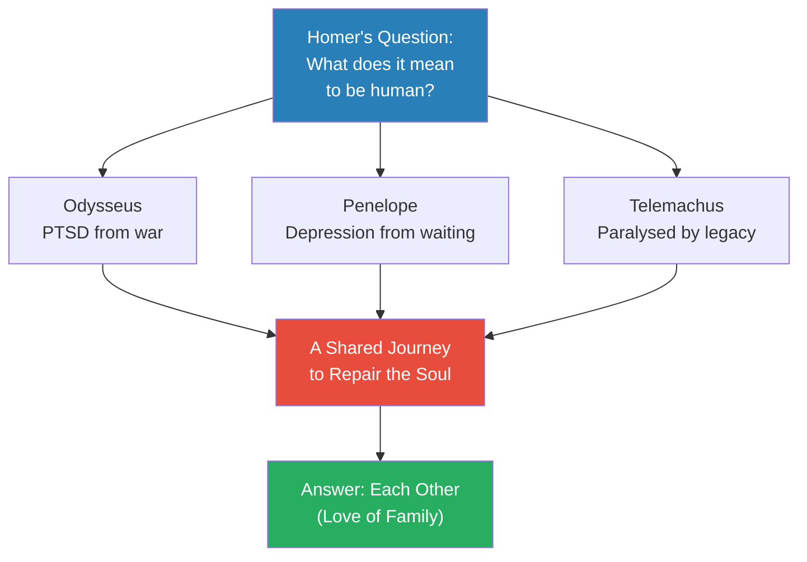
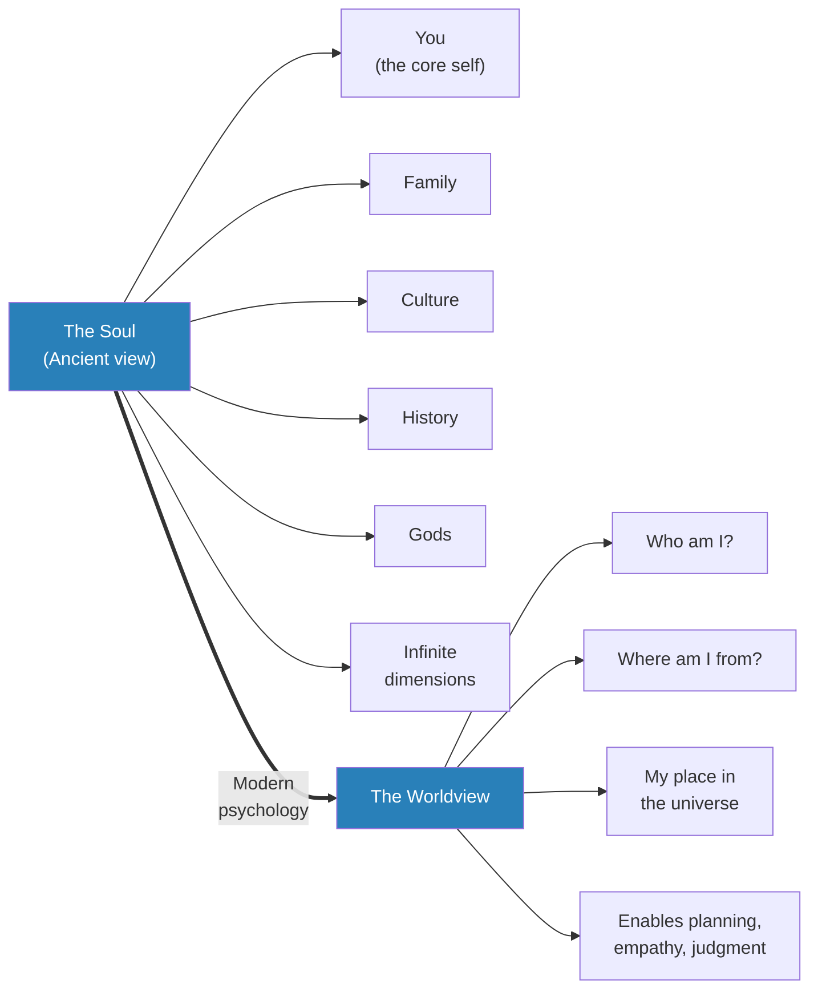
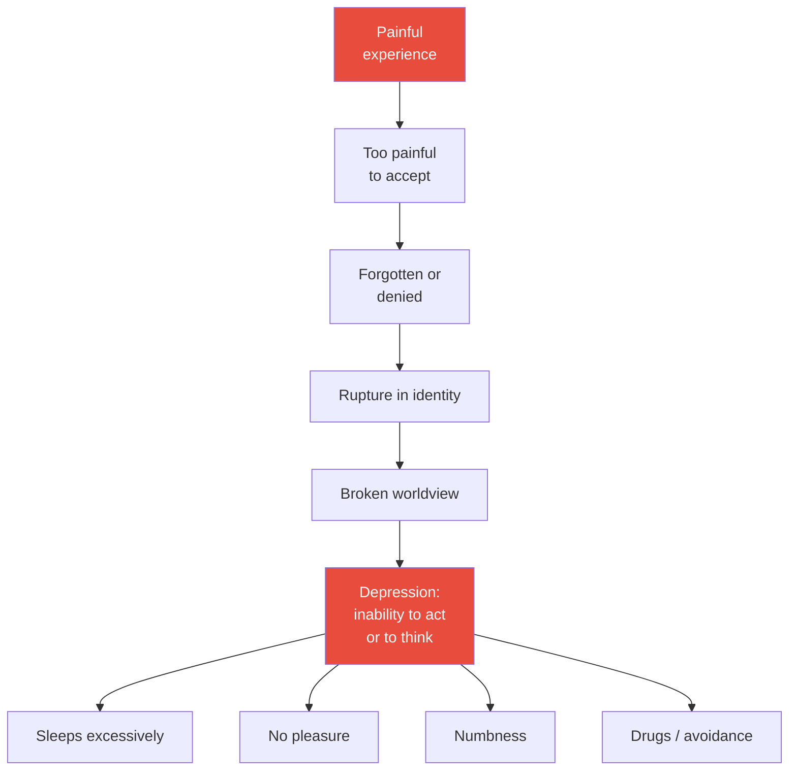
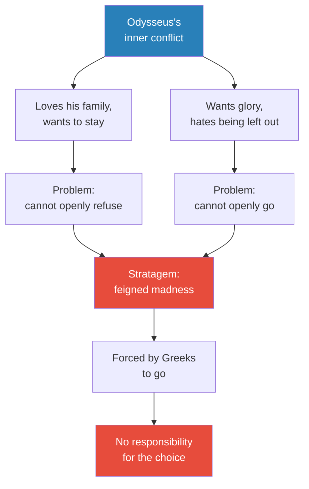
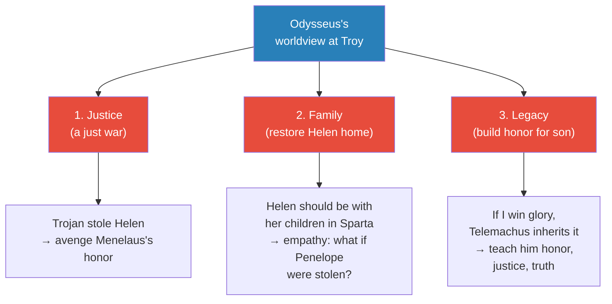
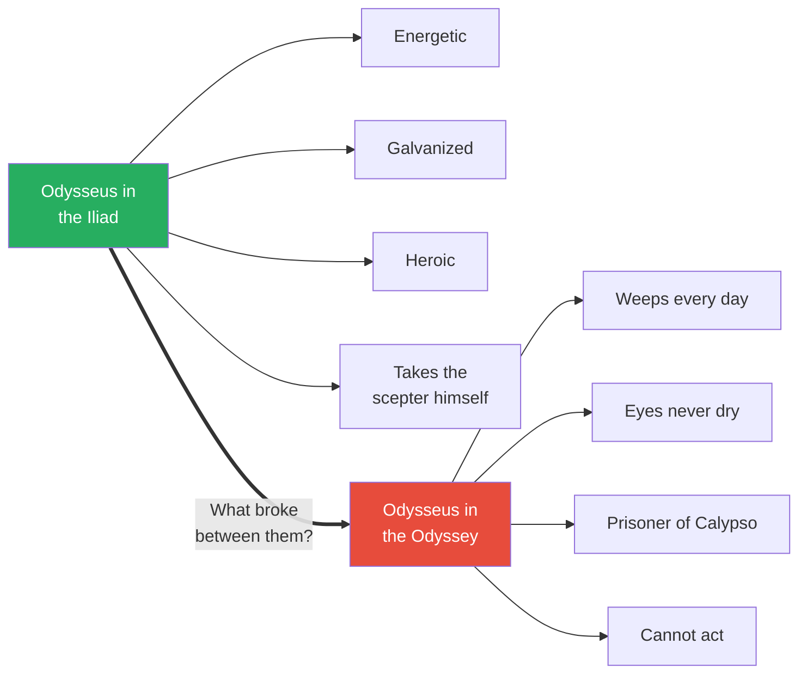
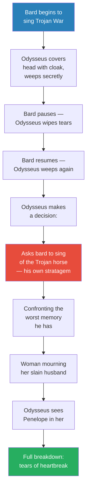

# The Odyssey

> Prof. Jiang opens the Odyssey not as an adventure story but as a family story — three traumatised souls trying to come home. Odysseus has PTSD from Troy, Penelope has depression from twenty years of waiting, and Telemachus is paralysed by his father's shadow. The ancients called this a splintering of the soul; modern psychology calls it a ruptured worldview. The Odyssey is their shared journey to repair what was broken, and the answer — as Prof. Jiang argues — is each other. The emotional crux of the poem arrives when a blind bard sings the story of the Trojan horse at a banquet, and Odysseus, the hero of that tale, weeps uncontrollably because he finally sees what he did.

---

## Overview: Key Highlights

- <b style="color: #27ae60">The Odyssey is a family story, not a war story</b> — three traumatised souls (Odysseus, Penelope, Telemachus) on a shared journey to repair themselves through love
- <b style="color: #2980b9">The soul as worldview</b> — the ancients' word for our deepest sense of who we are, where we came from, and our place in the universe
- <b style="color: #e74c3c">Trauma splinters the worldview</b> — an experience so painful it ruptures identity, destroys coherence, and produces depression
- <b style="color: #e74c3c">Cognitive dissonance paralyses all three</b> — Odysseus with PTSD, Penelope shut down in her room, Telemachus stuck in his father's shadow
- <b style="color: #2980b9">Odysseus's three justifications</b> — justice, family, and legacy — the worldview he built to explain why he went to Troy
- <b style="color: #e74c3c">All three justifications collapse at the sack of Troy</b> — it was revenge not justice, destroying families not saving them, and a shameful legacy not a noble one
- <b style="color: #2980b9">The stratagem of feigned madness</b> — Odysseus salting his own fields to avoid the war, exposing the complexity of the human soul
- <b style="color: #27ae60">The bard's song is the emotional core of the Odyssey</b> — Odysseus must confront the memory he most wants to repress before he can go home
- <b style="color: #e74c3c">The Calypso episode as rock bottom</b> — the great warrior of Troy reduced to weeping on a beach, a sex toy to a goddess
- <b style="color: #2980b9">Athena as intuition</b> — the goddess who rouses Odysseus is not external but a part of his own soul speaking to him
- <b style="color: #27ae60">Homer's genius is psychological realism</b> — characters do not behave heroically; they behave like real humans caught between conflicting impulses
- <b style="color: #27ae60">Love of family is what saves the world</b> — the fundamental message of the Odyssey, and the thesis of Prof. Jiang's reading

| Concept | One-line summary |
|---------|-----------------|
| **Odyssey** | Homer's sequel to The Iliad — a family homecoming story told through three traumatised souls |
| **PTSD** | Post-traumatic stress disorder — Odysseus's condition after ten years of war and its horrors |
| **Depression** | Inability to act or to think — what Penelope, Telemachus, and Odysseus all suffer |
| **Soul** | The ancient name for our deepest self, with infinite dimensions shaped by family, culture, history, and gods |
| **Worldview** | The modern psychological term for the soul — our understanding of self, origin, and place in the universe |
| **Cognitive dissonance** | Holding two incompatible beliefs or feelings at once — Penelope's "alive in heart, dead in head" |
| **Splintered soul** | Trauma so painful that identity fractures, coherence collapses, and depression follows |
| **Justice, family, legacy** | The three reasons Odysseus tells himself he went to Troy — each disproven when the city falls |
| **Feigned madness** | Odysseus's stratagem to avoid the war — salting his fields while plowing, exposed when Telemachus is placed in his path |
| **Trojan horse** | The wooden stratagem Odysseus devised to win the war — and the memory that now destroys him |
| **Athena** | Goddess of wisdom and Odysseus's divine patron — read by Prof. Jiang as a personification of his intuition |
| **Calypso** | The goddess who keeps Odysseus as her prisoner-lover on an island for years, offering immortality if he stays |

---

# The Lecture

## Three Traumatised Souls — What the Odyssey Is About [0:00-3:20]

*Prof. Jiang opens by reframing the Odyssey. Forget the monsters and the adventures — this is a family story about three broken people. He introduces Odysseus with PTSD, Penelope with depression, and Telemachus paralysed by his father's legacy, and argues that all three are suffering variations of the same condition.*

> [!tip] Core Insight
> The Odyssey is not an adventure epic. It is a psychological study of three traumatised family members, and the journey home is a journey to heal. Homer's question is the same one he asked in the Iliad: what does it mean to be human in a world of war, trauma, and tragedy, and how do we overcome adversity?

*Three traumas, one cure. Prof. Jiang's framing turns the Odyssey from an episodic adventure into a unified psychological drama.*

> [!note]- Expand: Full Lecture Detail
> Prof. Jiang begins the lecture by placing the Odyssey in context. It is the sequel to the Iliad, and where the Iliad is a war story, the Odyssey is a family story — a story about a homecoming. He names the three main characters plainly: Odysseus, the hero; Penelope, his wife; Telemachus, their son. The title itself belongs to Odysseus but the drama belongs to all three.
>
> He reminds the class of Homer's overriding concern, already established in the Iliad — the human condition. What does it mean to be human? What does it mean to live in a world of war, of trauma, of tragedy? And how can we overcome this adversity? The Odyssey, he says, is the story of three individuals in one family, and they are all traumatised and heartbroken.
>
> He takes them one by one.
>
> - <b style="color: #e74c3c">Odysseus has PTSD</b> — post-traumatic stress disorder
>   - He is trying to return home from the war
>   - He has seen so much violence, so much tragedy, so much death that his soul is shattered
>   - Prof. Jiang notes that this is very common for soldiers who return from war — it is a "disease problem"
> - <b style="color: #e74c3c">Penelope is suffering from depression</b>
>   - Her husband has been away for twenty years
>   - She does not know if he is alive or dead — logically he is probably dead, there has been no sign of him
>   - But she cannot bring herself to admit it
>   - She is trapped between dozens of suitors wanting her hand and her refusal to believe her husband is gone
>   - In her heart she feels he is still alive; in her head she cannot justify the feeling
>   - <b style="color: #2980b9">Cognitive dissonance</b> — holding two incompatible beliefs at once — and her response is to shut down
>   - At first she weaves; eventually she just sits in her room
> - <b style="color: #e74c3c">Telemachus is burdened and angry</b>
>   - He does not know if his father is dead or alive
>   - His father is a legend — the man who won the Trojan War with the Trojan horse
>   - Everyone sings Odysseus's praises; Telemachus lives in that shadow
>   - He wants to become a hero himself but cannot — he is stuck
>   - Unless his father is dead, he cannot inherit the property, the reputation, the legacy
>   - His mother will not leave because she refuses the suitors, so he cannot be master of his own house
>   - Meanwhile the suitors are eating up his wealth
>   - He watches his life wither away with nothing he can do
>
> Prof. Jiang then collapses the three diagnoses into one: "all these things are the same thing." It is really one of cognitive dissonance, one of depression, one of trauma. Three people, three symptoms, one underlying condition — and one shared journey to repair it.

---

## The Soul, the Worldview, and How Trauma Breaks Them [3:20-8:59]

*Prof. Jiang pauses the plot to do a deep conceptual dive — he explains how the ancients understood the soul, why modern psychology calls the same thing a worldview, and why trauma splinters it. This is the theoretical lens that will govern everything else in the reading.*

*The ancients' soul and modern psychology's worldview are the same thing — our coherent sense of identity. The Odyssey operates entirely within this framework.*

*The mechanism of trauma — a painful experience the mind cannot integrate fractures the worldview, and the fracture manifests as depression. This is the diagnosis for all three Odyssey protagonists.*

> [!note]- Expand: Full Lecture Detail
> Prof. Jiang shifts from plot to framework. There is another way, he says, to analyse what is going on — to think about the soul.
>
> - The soul was "really the most fundamental issue of what it means to be a human being" for the ancients
>   - We do not talk about it today because we live in a world of material science
>   - "We can't see it. It doesn't exist," he says — from the materialist view
>   - But for most of human history, humanity understood the soul as very present, very real, the most significant thing in our lives
> - The ancient understanding of the soul, common across cultures, was that the soul is:
>   - A <b style="color: #2980b9">very complex thing</b> with almost infinite dimensions
>   - There is a part of the soul that is just "you" — the core person
>   - But who you are is influenced by other factors — your family, your culture, your history, the gods
>   - When you die, a part of you may live on, but parts of you also flow back into the different streams of the universe
> - The modern equivalent: in psychology class, the name for the soul is the <b style="color: #2980b9">worldview</b>
>   - "We have a much more simplistic understanding of our psychology than the ancients"
>   - The worldview is our understanding of who we are, where we came from, and our place in the universe
>   - It comes from our memories and our experiences
> - The worldview is fundamental because it enables:
>   - <b style="color: #2980b9">Planning</b> — only if you know who you are can you plan ahead, know what you want, know what you want to accomplish
>   - <b style="color: #2980b9">Empathy</b> — building relationships with others
>   - <b style="color: #2980b9">Judgment</b> — what's good, what's bad, what you like, what you don't like
>
> Now the mechanism of trauma:
>
> - Psychology teaches that <b style="color: #e74c3c">trauma splinters the worldview</b>
>   - Something about your experience is fundamental to your identity
>   - But it is so painful that you forget it, or refuse to see it
>   - This causes a rupture in your identity, a break in your coherent sense of the world
>   - The worldview is destroyed — and this leads to depression
> - What is depression?
>   - The inability to act and to think
>   - You do not know what you want to accomplish
>   - You do not trust yourself
>   - You do not know what you like
>   - Symptoms: you sleep a lot, you find no pleasure in anything, you feel no emotion, you feel numbness
>   - "That's why people, they tend to take drugs, or they just sleep all the time" — because you are unable to act
>
> Prof. Jiang closes the conceptual section by landing the diagnosis: this is exactly what is happening to Odysseus, Penelope, and Telemachus. There is a trauma in their lives. The ancients believed a trauma — an incident, a demon, anything — could split your soul, and if you were to recover, you had to repair your soul. That is the fundamental conflict of the Odyssey. Three individuals whose souls have been splintered, each on their own odyssey to repair the damage. And the answer is each other — the love of family. "That's what's gonna save the world," he says. "That is the fundamental message of the Odyssey."

---

## In Medias Res — Where the Story Begins [8:59-11:00]

*Prof. Jiang briefly walks through the opening scene. Homer begins in the middle of things — Odysseus stranded with Calypso, Penelope paralysed in her room, Telemachus angry — then uses the goddess Athena to set the family's reunion in motion.*

> [!note]- Expand: Full Lecture Detail
> Prof. Jiang reminds the class of Homer's technique: the Odyssey begins <b style="color: #2980b9">in medias res</b> — "in the middle of things" — a lot has already happened, and the plot starts mid-stream.
>
> At the opening:
> - Odysseus has been away for twenty years — stuck on an island with Calypso
> - Penelope is depressed, sitting by herself in her room
> - Telemachus is angry
> - Athena comes and tells Telemachus: "come with me, I will help you find your father"
>
> But to understand any of it, Prof. Jiang says, they need the backstory — which means returning to the Trojan War.
>
> - Helen was taken to Troy — she fell in love with Paris because that was Aphrodite's promised prize
> - Her husband Menelaus (king of Sparta) and his brother Agamemnon (king of kings) raised an army
> - This was prophesied to be the greatest war in human history — the war that would make mortals into gods
> - Achilles enters the war for this reason: to prove he is the greatest warrior of all time
> - Odysseus is also supposed to go — but he is different from Achilles

---

## Why Odysseus Went to Troy — The Stratagem of Feigned Madness [11:00-14:30]

*Prof. Jiang reconstructs the strange, revealing story of how Odysseus was drafted. Ordered to join the war, he feigns madness by salting his own fields — but his trick exposes something deeper about the human soul: the capacity to deceive even oneself.*

> [!example] The Trick That Exposes Itself (Pre-war, Ithaca)
> - Odysseus loves his wife Penelope and has a six-month-old son, Telemachus
> - He does not want to go to war — he knows the war will take twenty years
> - But the Greeks need him: the gods have prophesied that only Odysseus, inventor of the Trojan horse, can win the war
> - Two Greek messengers come to Ithaca to collect him
> - Odysseus pretends to be mad: dresses as a beggar, plows his own farmland, throws salt everywhere to kill his own crops
> - The Greeks, suspicious, know he is a man of disguise and stratagem — so they test him
> - They take six-month-old Telemachus and place him in the path of the plow
> - If Odysseus is truly mad, he will run his own son over
> - Odysseus turns away and saves his son — proving he is sane
> - The Greeks catch him: "You were tricking us all along"
> - He is forced to go
> **The lesson:** The story does not actually make sense on the surface — a truly clever man would have hidden, fled with his family, or killed the messengers. The stratagem exposes itself because Odysseus secretly wants to be forced to go.

*The feigned madness is not a failure of stratagem — it is a stratagem to be "caught" so the choice is made for him. Homer's genius is showing the soul's capacity to deceive itself.*

> [!note]- Expand: Full Lecture Detail
> Prof. Jiang walks through the drafting scene and then stops to ask what it really means.
>
> - On the surface the story is absurd — Odysseus is supposed to be the cleverest man alive, yet his madness ruse is exposed by a single obvious test
> - Prof. Jiang's reading: "this tells us that yes, Odysseus really loves his family and wants to be with his family"
>   - He knows he will be gone for twenty years
>   - He will miss Telemachus growing up
> - But at the same time — this is the greatest war in human history
>   - Achilles is going; Agamemnon is going
>   - Does Odysseus really want to be the one coward who stayed home?
>   - "The Greeks will just laugh at him for the rest of his life, saying you're just a pussy... you've been pussy whipped by your wife"
>   - He cannot accept that — it would ruin his reputation
> - So he comes up with a stratagem that is <b style="color: #2980b9">designed to fail</b>
>   - One that allows the Greeks to see through quickly
>   - One that forces him to go against his "will"
>   - One that allows him to bear no responsibility for the choice
> - "That is the complexity of the human soul. That is the complexity of our worldview."
>
> The class now sees the setup for everything that follows. Odysseus is not simply a hero dragged to war — he is a conflicted soul who engineered his own drafting, and the lie he told himself at the start of the war is the wound that will split him open at the end.

---

## Odysseus's Three Justifications — Building a Worldview for War [14:30-18:39]

*Having been "forced" to go, Odysseus now needs a worldview to justify leaving his family for twenty years. Prof. Jiang lays out the three reasons he tells himself — justice, family, legacy — each one a layer of armour against the truth.*

> [!tip] Core Insight
> A person who cannot admit their real motive must build a story. Odysseus's three justifications — justice, family, legacy — are not explanations. They are the walls of the worldview he constructs to keep his soul intact while he abandons his wife and son.

*Three neatly constructed reasons. Each one will collapse when Troy burns — and the collapse is what produces the trauma.*

> [!note]- Expand: Full Lecture Detail
> Prof. Jiang now explains Odysseus's internal monologue at Troy — the worldview he constructed to mend the rupture in his soul.
>
> The three justifications, in his voice:
>
> - <b style="color: #2980b9">Justice</b>
>   - "This is a just war because a Trojan stole Helen"
>   - The Greeks must avenge the honor of Menelaus
>   - The war is morally righteous — the attackers are victims of theft
> - <b style="color: #2980b9">Family</b>
>   - "Helen should be with her children. Helen should be with her family in Sparta"
>   - The war serves families — it reunites a wife with her husband and children
>   - Odysseus uses empathy: "How would I feel if Penelope were stolen from me? I want everyone to go fight with me to get her back as well"
> - <b style="color: #2980b9">Legacy</b>
>   - Yes, he will not see Telemachus for twenty years
>   - "Therefore he has to build him a legacy that will carry him for the rest of his life"
>   - If Odysseus wins this great war and becomes a hero, Telemachus will inherit the reputation
>   - People will respect Telemachus — "he wants to tell his son, this is what, this is how you should live your life"
>   - A life of honor, of justice, of truth
>
> Prof. Jiang pauses to reinforce: "we have to remember that this is all to justify his conflict." There is a rupture in his soul — the rupture of abandoning Penelope for twenty years. He needs to mend it by explaining to himself why he is doing what he is doing.
>
> Then he issues the warning that frames everything that follows: <b style="color: #e74c3c">"The problem starts when they win the war."</b> Because when they win, Odysseus is forced to see that all three things were wrong.
>
> - It was not about justice — "it was just about revenge and murder"
> - It was not about family — "it's about destroying families. Because when you win this war, you enslave the woman and kill the husbands"
> - It was not about legacy — "you destroyed the Trojan civilization for no difficult reason, because Helen... doesn't even want to go back to Sparta"
>
> This, Prof. Jiang says, is what produces the cognitive dissonance that causes Odysseus's PTSD. The Odyssey is the journey to repair the soul that the victory itself broke.

---

## An Iliad Flashback — Odysseus Saves the War [18:39-26:07]

*To show the "before" version of Odysseus, Prof. Jiang takes the class back to the Iliad. Agamemnon's "reverse psychology" speech backfires, the Greek army runs for its ships, and Athena pushes Odysseus to single-handedly stop the retreat. It is the last scene of Odysseus as a man whose worldview is still whole.*

> [!example] Agamemnon's Disaster of Reverse Psychology (Book 2 of the Iliad)
> - In Book 1, Achilles and Agamemnon had their ugly fight; Achilles has withdrawn from battle
> - Agamemnon realises morale will collapse without Achilles — they might lose the war
> - He comes up with a "stupid idea": tell the troops they can go home
> - His theory: reverse psychology will make them say "no, we came for your glory, we'll fight to the death"
> - It backfires immediately — the soldiers are exhausted, homesick, and sick of a war they never wanted
> - The moment Agamemnon says they can leave, they charge for the ships
> - Agamemnon freezes in cognitive dissonance — this is not what was supposed to happen
> - Hera and Athena watch from Olympus — "Oh my god, Agamemnon's gonna lose us this war. What a moron"
> - Hera sends Athena down to intervene
> **The lesson:** The Iliad shows Odysseus at the height of his powers — the only man who can see clearly when the king of kings has frozen. That clarity is exactly what Troy will destroy.

> [!quote] Prof. Jiang
> "Athena is always part of Odysseus. It's part of his soul. The intuition."

*This scene from the Iliad is the template Prof. Jiang will contrast against the weeping, broken Odysseus of the Odyssey. Same man, same soul — but the worldview that powered him is about to shatter.*

> [!note]- Expand: Full Lecture Detail
> The class reads two passages from the Iliad aloud, with Prof. Jiang narrating the subtext.
>
> - The first passage describes the Greek army surging like "big waves at sea" as the soldiers run for the ships
>   - Prof. Jiang reads it as a revelation: "agamain thinks that his soldiers actually want to fight this war, but all his soldiers are homesick"
>   - They are sick of a stupid war and do not even know why they are there
>   - "The moment that agamain says you guys can go home, they're all like, we're gonna get home as soon as possible"
>   - They miss their wives, they miss their children
> - The second passage shows Athena's descent
>   - Hera sends her — "the flashing-eyed goddess lost no time, down she flashed from the peaks of Mount Olympus"
>   - She reaches the ships and finds Odysseus first — "a mastermind like Zeus, still standing fast"
>   - He has not laid a hand on his ship; anguish wracks his heart
>   - Athena urges him: "Royal son of Laertes... What is this?"
> - Prof. Jiang stops the reading and makes an observation
>   - Everyone else is running for the ships
>   - You would think Odysseus would be the first to sail home to his son and wife
>   - But he is standing there, confused
>   - "This doesn't make any sense to me. Why would Agamemnon do this?"
>   - But at the same time — "it sort of shows you that he actually doesn't really want to go home, right? Because if we want to go home, he'd be home by now"
> - The reading continues — Athena's voice is recognised as divine, and Odysseus acts
>   - He flings off his cape; the herald Eurybates picks it up
>   - He comes face to face with Agamemnon
>   - He "relieved him of his father's royal scepter — its power can never die"
>   - Scepter in hand, he strides to the ships of the Argives
> - Prof. Jiang's reading of Athena
>   - Athena is not external — she is a part of Odysseus, his intuition
>   - His intuition tells him "something's wrong here. I need to stop this"
>   - The goddess is the inner voice of the man whose worldview is still whole
> - And look at Agamemnon, he says
>   - Agamemnon is frozen — so distraught, he has shut down, his brain has stopped working
>   - This was not supposed to happen
>   - The king of kings, in cognitive dissonance, is paralysed
>   - When Odysseus takes the royal scepter, Agamemnon does not even notice
>   - The scepter is Agamemnon's soul — his legacy, his authority
>   - Odysseus simply takes it and says "I'm the king for now, to save this war"
> - This is the measure of Odysseus's commitment at this moment
>   - He still believes the war is about justice, family, and his son's legacy
>   - He refuses to lose
> - "But that's the Iliad," Prof. Jiang says. Now we go to the Odyssey.

---

## Odysseus on Calypso's Island — The Broken Man [26:07-31:00]

*When Odysseus finally appears in the Odyssey, the class does not recognise him. Prof. Jiang walks through the opening: the hero of Troy is now a sex slave to a goddess, weeping on a beach, unable to act. This is the face of the splintered soul.*

*The same character, two states. The gap between them is the trauma of Troy — and the entire Odyssey is the labour of closing that gap.*

> [!note]- Expand: Full Lecture Detail
> Prof. Jiang explains that in the Odyssey, we do not actually meet Odysseus for many books. The first books follow Telemachus's journey to find his father. When we finally meet Odysseus, he is unrecognisable.
>
> - In the Iliad he was energetic, galvanized, heroic — the man who saved the war
> - In the Odyssey he is a changed person — "in fact, he's a broken person"
> - What happened between them:
>   - He and his crew tried to go home
>   - They got lost at sea
>   - They had many adventures
>   - They were shipwrecked on an island
>   - There, he became the "sex toy — literally, a sex toy — of a goddess named Calypso"
>   - He is whipped every day, has sex with her at night
>   - By day he goes to the beach and cries
>   - He is her prisoner for many years
>
> The gods finally intervene. Zeus and Athena agree this cannot continue — Odysseus needs to go home. They send Hermes to Calypso with the command. Calypso says "sure, why not."
>
> The class reads the scene of Hermes' arrival and Calypso finding Odysseus. Prof. Jiang narrates:
>
> - "The queenly nymph sought out the great Odysseus... and found him there on the headland, sitting still, weeping"
> - "His eyes never dry. His sweet life flowing away with the tears he wept for his foil journey home"
> - Prof. Jiang stops: "he's sitting. He's still. He's weeping. His eyes never dry, and all he's thinking about is the past. Okay, this is clear signs of depression. PTSD"
> - The reading continues — by night, he sleeps with her in the arching cave, "unwilling lover alongside lover, all too willing"
> - "But all his days, he sit on rocks and beaches, wrenching his heart with sobs and groans in anguish, gazing out over the barren sea through blinding tears"
>
> This is the complete picture of the broken worldview:
> - He cannot act (he cannot leave the island on his own)
> - He cannot take pleasure (the sex is coerced)
> - He has no emotion except anguish
> - He spends his time in memory — trapped in the past
>
> Calypso then makes the offer that reveals how deep his commitment to home runs. "It's been great having a sex toy," Prof. Jiang paraphrases, "but the gods insist that you have to go home. But you know what? You can choose to be my sex toy for all of eternity. I can make you immortal."
>
> A lesser man takes immortality. Odysseus refuses. Whatever else is broken in him, the pull toward home is not.

---

## The Bard's Song — Confronting the Memory [31:00-37:09]

*The emotional peak of the lecture. On his way home, Odysseus stops at an island where a banquet is held in his honour — and the blind bard sings the tale of the Trojan horse. The hero of that story buries his face in his cloak and weeps. Prof. Jiang walks through the reading line by line, explaining why this is the moment the Odyssey truly begins.*

> [!tip] Core Insight
> Healing requires confrontation. Odysseus cannot go home while he is still hiding from what he did at Troy — so the Odyssey places him in a room where the bard sings the memory he most wants to repress, and he must finally look at it.

*The movement is the lecture's structural heart — from passive weeping, to active confrontation, to the specific moment of recognition (seeing Penelope in the widow), to the catharsis that makes homecoming possible.*

> [!example] The Weeping Widow (Odysseus's Flashback to the Sack of Troy)
> - For ten years Odysseus and the Greeks could not defeat the walled city
> - He prayed to Athena for inspiration and received the Trojan horse
> - He and other soldiers hid in the horse's belly — scared and excited
> - At night they emerged, opened the gates of Troy, and the Greeks streamed in
> - In the carnage, Odysseus strikes down a soldier
> - The soldier's wife comes running, traumatised at the sight of her dead husband
> - Odysseus is traumatised by her trauma
> - He sees Penelope in her — he came to Troy to save a wife, and now he has killed a wife's husband
> - The Greeks drag the widow off to be enslaved
> - He realises: every family in Troy is being destroyed, by him
> **The lesson:** The worldview collapses in a single image. He came for justice, family, and legacy. In one moment he sees he has served none of them — and this is the trauma that made him the weeping man on Calypso's beach.

> [!quote] The Bard's Description of Odysseus's Weeping (Homer)
> "The great Odysseus melted into tears running down from his eyes... as a woman weeps her arms flung round her darling husband."

> [!note]- Expand: Full Lecture Detail
> Prof. Jiang walks through this scene with the most detail, because it is the emotional turning point of the poem.
>
> Setup:
> - After leaving Calypso, Odysseus reaches an island where he is given a ship to go home
> - Before he leaves, as custom, the locals host a banquet for him
> - They do not know he is Odysseus
> - Tradition at banquets: a bard sings of great deeds
> - Of course, the bard sings about the Trojan War
>
> The class reads the first bard passage:
> - "The strife between Odysseus and Achilles, Peleus's son..."
> - "How once, at the god's flowing feast, the captains clashed in the savage war of words"
> - "Agamemnon, lord of armies, rejoiced at heart that Achaeus' bravest men were battling"
> - The song describes the "tidal waves of Ruin tumbling down on Troy"
>
> Odysseus's response:
> - Clutches his flaring sea-blue cape in both powerful hands
> - Draws it over his head, buries his handsome face — ashamed his host might see him shedding tears
> - Whenever the bard pauses, Odysseus lifts the cape, wipes his tears, hoists his double-handed cup, pours a libation to the gods
> - But as soon as the bard starts again, Odysseus hides his face and weeps again
>
> Prof. Jiang's reading:
> - At this point you would expect Odysseus to be proud — "hey, that's me, man"
> - Instead he cries, and cries
> - "This, again, is trauma, where the memories are storing pain in him"
> - Clearly something happened during the Trojan War that made him want to forget about it, that made him resent himself, that caused his soul to be ruptured
>
> Then Odysseus does something crucial — he praises the bard and asks him to sing something specific:
> - "I respect you, Demodocus, more than any man alive. Surely the Muse has taught you..."
> - "Come now, shift your ground. Sing of the wooden horse Epeus built with Athena's help"
> - "The cunning trap that good Odysseus brought... filled with fighting men who laid the city waste"
> - "Sing that for me, true to life as it deserves"
>
> Prof. Jiang stops the class:
> - Odysseus is in pain from the memories of the Trojan War
> - But he recognises that if he is to go home, "he needs to confront his pain. He needs to admit his pain"
> - So he asks the bard to sing the memory he has been most trying to repress
> - He wants to focus on the Trojan Horse and come to terms with his own trauma
>
> The bard resumes, singing the Trojan horse scene:
> - The main Achaean force had set their camps afire and sailed for home as a ruse
> - Odysseus's men crouched hidden in the heart of Troy's assembly, darkening that horse
> - The Trojans debated three plans: hack it open, pitch it off a cliff, or leave it as an offering
> - The final plan won — Troy was fated to perish once the horse lodged inside her walls
> - Troops of Achaeans broke from cover, streaming out of the horse's hollow flanks to plunder Troy
> - Odysseus marched to Deiphobus's house "like the god of war on attack"
> - He fought the grimmest fight he had ever braved — won through by Athena's superhuman power
>
> And then Homer gives the climactic image, which Prof. Jiang reads carefully:
> - "The great Odysseus melted into tears running down from his eyes..."
> - Homer compares him to "a woman weeps her arms flung round her darling husband, a man who fell in battle"
> - The woman clings for dear life, screams and shrills — but the victors drag her off in bondage
> - "From Odysseus, eyes ran tears of heartbreak"
>
> Prof. Jiang explains what just happened:
> - "Now we know what happened" — the reader finally gets the traumatic memory
> - For ten years the Greeks could not defeat Troy
> - Odysseus prayed to Athena for inspiration — received the Trojan horse
> - Hides in its belly with soldiers — "scared, really excited"
> - At night they leave the horse, open the gates, stream into Troy
> - He is killing in the adrenaline of war
> - Then someone catches his eye — he strikes down a soldier
> - A woman comes crying, traumatised by her husband's death
> - <b style="color: #e74c3c">He is traumatised by her trauma</b>
>   - He came to Troy to save women — to make Helen safe with her husband
>   - Now he has killed someone's husband
>   - The Greeks come and take her away to be enslaved
>   - He witnesses war destroying every family in Troy
>   - He sees Penelope in her
> - <b style="color: #27ae60">The collapse of his worldview in real time:</b>
>   - Justice? No — "this is not just war. I'm destroying a civilization"
>   - Family? No — "this is not a war about family. This is a war about destroying families"
>   - Legacy? No — "what legacy am I leaving my son? How would my son feel if he knows how I destroy families like ours?"
> - This is what causes the trauma
> - It splits his soul, drives him crazy
>
> Prof. Jiang closes the section with the central conflict of the entire poem, stated plainly: <b style="color: #e74c3c">"Having done so much evil, how can you go home? How can you repair yourself? How can you mend your soul and repair your worldview so you can live for your family?"</b>
>
> That is the Odyssey.

---

## Connections

**Builds on:** [[02 - Homer and the Invention of the Human]] (the human condition as Homer's subject), [[01 - Secrets of the Universe]] (soul, worldview, and the ancients' psychology)

**Sets up:** [[06 - The Intimacy of Love]] (love of family as the cure for the splintered soul — the thesis that the Odyssey sets up will be developed here), [[07 - The Anti-Homer]] (alternative traditions of heroism that reject Homer's psychological realism)

**Related books in vault:** [[The Body Keeps the Score - Bessel van der Kolk]] (modern PTSD literature that echoes Homer's portrait of trauma), [[The Iliad - Homer]] (the war story whose aftermath the Odyssey depicts)

---

## The Takeaway

This lecture reframes one of the oldest stories in Western civilisation as a psychological drama. The Odyssey is not about monsters, wind bags, and lotus-eaters — those are the packaging. It is about three people in one family, each trying to reassemble a self that war has broken, and finding that the only thing that can put them back together is each other. Prof. Jiang argues that Homer was doing, three thousand years ago, exactly what modern clinical psychology does today: diagnosing trauma, mapping how it splinters identity, and asking how healing becomes possible. The vocabulary is different — soul instead of worldview, Athena instead of intuition — but the insight is the same.

The most surprising move in the lecture is Prof. Jiang's reading of Odysseus's feigned madness. The standard reading treats it as cleverness. Prof. Jiang treats it as self-deception — a man who secretly wants to be forced into a war he cannot admit he craves. This single reading reframes everything that follows. It means Odysseus went to Troy carrying a lie at the core of his worldview. The three justifications he builds on top — justice, family, legacy — are not truths but scaffolding. And when Troy falls, when the widow weeps over her dead husband, the scaffolding comes down all at once. The PTSD is not caused by violence alone; it is caused by the collapse of a story Odysseus needed to believe to do the violence.

What remains open is the question of how the repair actually happens. Prof. Jiang has set up the problem — the splintered soul, the broken worldview, the inability to act — and gestured at the answer: the love of family, the journey home. But the mechanism of healing, the specific scenes in which Odysseus, Penelope, and Telemachus rebuild each other, are promised for future lectures. For now, the class leaves with the diagnosis and the emotional peak: a man weeping into his cloak while someone else sings the tale of his greatest triumph, finally recognising what that triumph cost.
