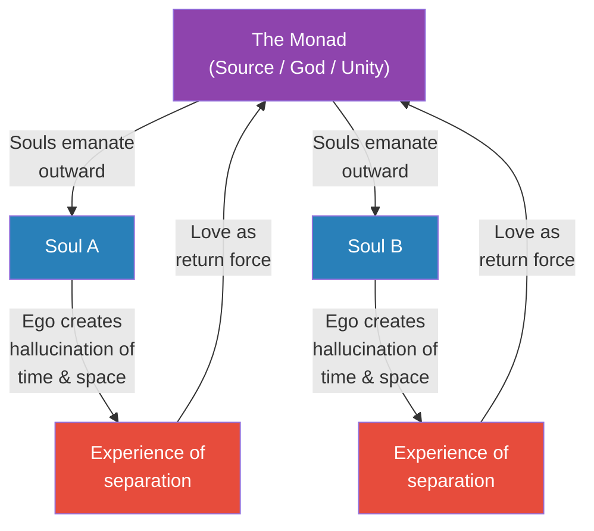
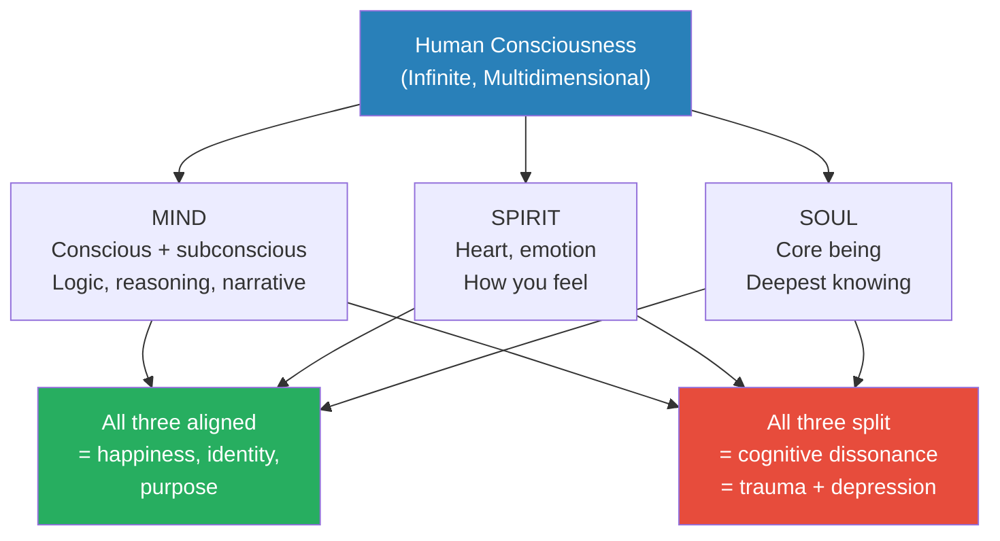
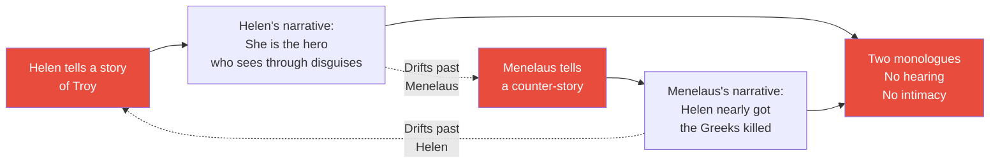
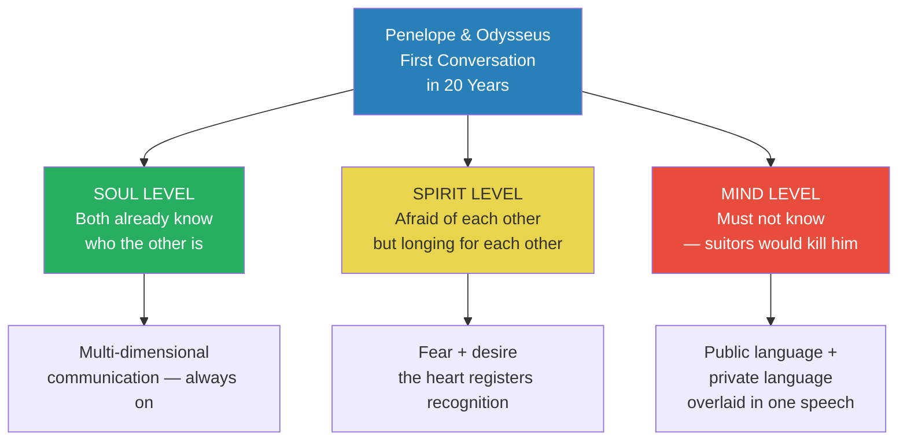
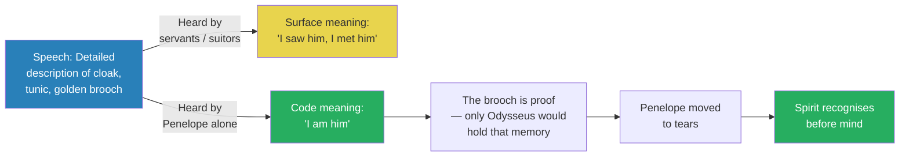
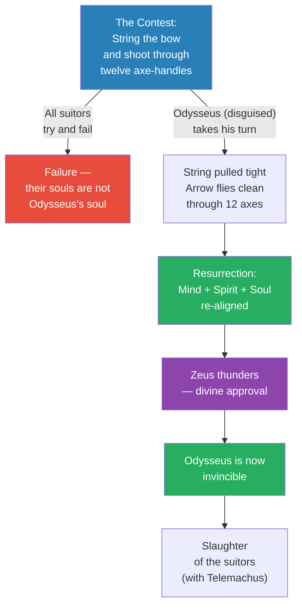
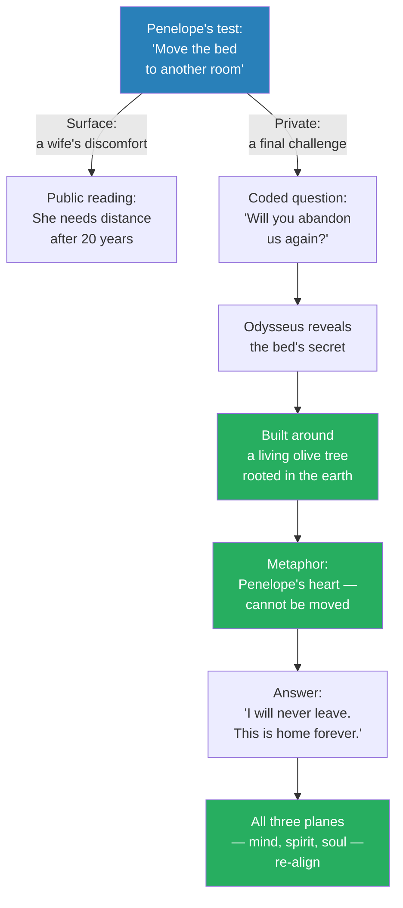
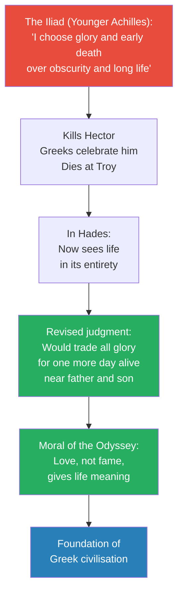

# The Intimacy of Love

> Prof. Jiang concludes the Odyssey by asking the question that organises the entire semester: what is love? His answer strips away every romantic cliche: love is not obsession, not possession, not longing — it is intimacy, the ability to understand another person so deeply that you share a private language only the two of you can read. Using the climax of the Odyssey — Penelope's interrogation of the disguised Odysseus, the stringing of the bow, the bed that cannot be moved — he shows that the reunion of a family requires the alignment of three planes of consciousness: mind, spirit, and soul. And in a final detour to the underworld, Achilles delivers the lecture's moral: he would rather be a dirt-poor farmer alive than the most celebrated warrior in the land of the dead. Love, not glory, is the purpose of life.

---

## Overview: Key Highlights

- <b style="color: #27ae60">Love is intimacy, not obsession</b> — you know you love someone when you understand them at a level no one else can reach
- <b style="color: #2980b9">The Monad</b> — the source, the one, God — love is the force that compels separated souls back into unity with the Monad
- <b style="color: #2980b9">Three planes of consciousness</b> — mind (logic), spirit (heart/emotion), soul (core being); when they split, trauma and depression follow
- <b style="color: #e74c3c">Cognitive dissonance</b> — when mind, spirit, and soul believe different narratives, the self fractures and depression sets in
- <b style="color: #2980b9">Secret language of lovers</b> — intimate code words that outsiders cannot decode; the real test of love
- <b style="color: #e74c3c">Helen and Menelaus are not in love</b> — they tell stories at each other, not to each other; shouting past one another is the marriage of the unloving
- <b style="color: #27ae60">The golden brooch is the proof</b> — Odysseus's obsessive poetic description of a single ornament reveals his identity to Penelope alone
- <b style="color: #27ae60">The bow is the resurrection of the soul</b> — stringing it marks the moment Odysseus reintegrates mind, spirit, and soul and becomes invincible
- <b style="color: #2980b9">The unmoved bed</b> — the olive-tree bedpost is Penelope's heart, rooted in the earth and impossible to shift; the final sign that confirms Odysseus
- <b style="color: #e74c3c">Achilles regrets his glory</b> — in the underworld, he would trade his immortal fame for one more day as a living farmer near his father and son
- <b style="color: #27ae60">Family, not empire, is the purpose of life</b> — the Odyssey's final moral and the foundation of Greek civilisation
- <b style="color: #2980b9">The ego creates separation</b> — time and space are hallucinations that make us believe we are separate; love dissolves the illusion

| Concept | One-line summary |
|---------|-----------------|
| **Intimacy** | The real definition of love — understanding someone so deeply you can speak in private code |
| **The Monad** | The source, the one, God — the unifying centre all souls are drawn back to through love |
| **Mind / Spirit / Soul** | Three planes of consciousness that must align for a person to be whole |
| **Cognitive dissonance** | The conflict between the three planes — cause of trauma and depression |
| **Secret language** | The in-code only lovers share — the test of whether a relationship is real love |
| **The golden brooch** | Odysseus's poetic proof to Penelope — a memory embedded in his imagination |
| **The bow of Odysseus** | Only one man can string it — the metaphor for resurrected selfhood |
| **The unmoved bed** | The olive-rooted bedpost Penelope built her home around — the sign of unbreakable love |
| **Helen and Menelaus** | The marriage of the unloving — stuck together, speaking past each other |
| **Achilles in Hades** | The corrective to glory-seeking — fame is worthless compared to family |
| **Resurrection of the soul** | The alignment of mind, spirit, and soul that restores identity and purpose |
| **Hallucination of separation** | The ego's illusion that we are separate from others — dissolved by love |

---

# The Lecture

## What Is Love? — The Central Question [0:00 - 2:30]

*Prof. Jiang opens by naming the topic that will run through the entire semester. Love is not a feeling, not a state, not an obsession. It is something structural — a force that pulls separated souls back toward unity. He grounds this in the metaphysics he has built earlier in the series: consciousness is the universe, the ego creates the illusion of separation, and love is the antidote.*

> [!tip] Core Insight
> Love is the force that compels us into unity. When you truly love someone, the love itself becomes imprinted on the Monad and acts as a magnet — drawing you back together no matter how far apart life has thrown you.

*The ego pushes souls outward into the illusion of separation; love is the opposite force, the return journey. Penelope and Odysseus are the paradigm case — twenty years apart, still magnetically drawn back to each other through the imprint love leaves on the Monad.*

> [!note]- Expand: Full Lecture Detail
> Prof. Jiang opens by restating the premise of the semester: "a major topic that we will discuss throughout the semester is the idea of love. What is love? How does it manifest itself, and why is it so important?"
>
> He grounds the answer in the metaphysics he has been building:
> - <b style="color: #27ae60">Consciousness is the universe, and our consciousness is infinite</b>
> - But we do not feel that infinity — because in order to navigate reality, "we hallucinate time and space"
> - Time and space make us believe we are separate from everyone else
> - <b style="color: #e74c3c">The reality we see is a hallucination created by our ego</b> — the ego insists we are alone
>
> Against this illusion, love operates as a corrective:
> - Love is the force — <b style="color: #2980b9">the Monad, God, or love</b> — that burns in us and compels us to return to unity
> - Love reminds us that we are all interconnected
> - When you meet someone you truly love, the two of you begin to move back to the Monad together
> - That movement imprints the love onto the Monad, and the love itself becomes a force that continues to pull you back toward each other
>
> This is the mechanism behind the Odyssey:
> - Penelope and Odysseus are in love — really in love
> - Because of that imprint, no matter how far apart twenty years of war and wandering have driven them, they are still drawn back to each other
> - They "complete each other" — the love has its own gravitational pull
>
> Prof. Jiang signals that this is not mystical poetry but a working hypothesis he will test through the rest of the lecture. The way to know whether two people genuinely love each other is whether that magnetic pull is visible in how they speak, what they remember, and what holds them together.

---

## The Three Planes of Consciousness — Mind, Spirit, Soul [2:30 - 6:00]

*Before returning to the Odyssey, Prof. Jiang introduces a structural model of the self. Human consciousness exists on three planes simultaneously — mind, spirit, soul — and wellbeing depends on their alignment. This model will carry the weight of the lecture's reading of every conversation, every climax, every reunion.*

*Prof. Jiang's diagnostic framework. Odysseus, Penelope, and Telemachus all enter the final act of the Odyssey with their three planes fractured. The reunion is not a scene of rescue — it is a scene of re-alignment.*

> [!note]- Expand: Full Lecture Detail
> Prof. Jiang introduces the structural model:
> - Because our consciousness is infinite and exists in infinite dimensions, we can bring that consciousness into three planes
> - <b style="color: #2980b9">The mind</b> — the conscious and subconscious mind; the layer we are most aware of; logic, reasoning, the stories we tell ourselves
> - <b style="color: #2980b9">The spirit</b> — based on the heart, our emotions, how we feel
> - <b style="color: #2980b9">The soul</b> — at the very core of our consciousness; the deepest layer of knowing
>
> All three planes exist at the same time. The key claim:
> - <b style="color: #27ae60">When all three align or correspond, we are happy — we know who we are, we know what we should do</b>
> - When all three split apart, or they are in conflict with each other, this creates <b style="color: #e74c3c">cognitive dissonance</b>
> - Cognitive dissonance leads to trauma and depression
>
> He maps this onto the three members of the family:
> - **Odysseus** — suffers post-traumatic stress disorder; war has shattered his identity, his sense of self, his worldview, his purpose
> - **Penelope** — depressed because the love of her life has disappeared and she does not know if he is dead or alive
> - **Telemachus** — a teenager, a young man who cannot inherit his father's legacy or his mother's wealth
>
> The three planes of each character hold different narratives:
> - At the **soul** level, all three know they are alive and will return to each other one day
> - At the **spirit** level, the distance creates depression; they are away from each other and that separation registers as pain
> - At the **mind** level, the logical story has won: Penelope believes Odysseus is dead, Odysseus believes he can never return home
>
> This is the precise diagnosis of the Odyssey's opening act:
> - There is a disunity of these three planes inside each person
> - And for the family to reunite, they must also combine all three planes into a single aligned narrative
> - That struggle — not the monsters, not the wandering — is the real journey of the Odyssey
>
> From this Prof. Jiang delivers the definition he will spend the rest of the lecture defending:
> - <b style="color: #27ae60">Love is a unity of all three planes — love is the burning of the soul</b>
> - What love ultimately is, is <b style="color: #27ae60">intimacy</b>
> - "You know you love this person if you understand this person intimately"
> - You can communicate in an intimate language — code words and secrets only the two of you understand

---

## Helen and Menelaus — The Marriage of the Unloving [6:00 - 8:30]

*Prof. Jiang pulls forward a scene from the previous lecture to define love by its opposite. Helen of Troy and King Menelaus are married, they live in the same house, they share the same stories — and none of it is love. They do not hear each other. They speak at each other. It is the cleanest anti-example in the whole epic.*

> [!tip] Core Insight
> Two people can share a bed, a throne, and a history and still not love each other. The test is not proximity — it is whether the speaking registers as hearing. Helen and Menelaus fail the test in a single scene.

*The marriage of the unloving. Two people telling stories simultaneously, each story an assertion of self, neither acknowledging the other. Prof. Jiang calls this "shouting at each other" — the sound of a marriage without intimacy.*

> [!note]- Expand: Full Lecture Detail
> Prof. Jiang recalls the scene from the previous lecture when Telemachus visited Sparta:
> - Telemachus goes to Helen and Menelaus's palace
> - The three of them get drunk together
> - Helen begins telling a story about the Trojan War
>
> > [!example] Helen's Self-Flattering Trojan Memory
> > - Helen narrates how Odysseus once infiltrated Troy disguised as a beggar
> > - She explains that she — the smartest person in the world — saw through his disguise immediately
> > - She bathed him, tended to him, and Odysseus rewarded her trust by telling her about the Trojan Horse
> > - Helen then helped the Greeks implement their plan
> > - In her telling, she is the real hero of the story
> > - She does not consider what Menelaus is feeling — he lost his brother Agamemnon, his friend Achilles, and countless fellow Greeks to this war
> > - She shows no care for his feelings; she is lost in her own narrative
> > **The lesson:** Speaking is not hearing. A story told at someone — not to them — is the language of self, not of love.
>
> Menelaus responds with his own counter-story:
> - When the Greeks were hidden inside the Trojan Horse, Helen walked around the wooden belly and called out the names of the Greek warriors' wives — in the voices of those wives
> - She was trying to trick the hidden men into revealing themselves so the Trojans could kill them
> - Only Odysseus saved them, because he clapped his hand over the mouths of the men who were about to cry out
> - So in Menelaus's telling, Helen almost got everyone killed
>
> The scene is devastating in its ordinariness:
> - They are not having a fight; they are having a dinner party
> - They are simply telling contradictory stories of the same event
> - Prof. Jiang: "they are shouting at each other. We don't really hear each other"
> - When Menelaus tells his story, Helen drifts away
> - <b style="color: #e74c3c">This is not love. They are together because they're stuck together.</b>
>
> This is the anti-example Prof. Jiang will set against Odysseus and Penelope. The question is no longer "who is married?" but "who can hear each other in code?"

---

## The First Conversation After Twenty Years — Three Planes Operating at Once [8:30 - 14:00]

*Odysseus has returned to Ithaca in disguise. His house is overrun with suitors. Penelope does not know the beggar is her husband — or does she? Prof. Jiang argues that the conversation between them is happening on all three planes simultaneously, and the reader must track each plane separately to understand what is really being said.*

*The three-plane diagnosis applied to a single conversation. Every sentence is operating on three channels at once — and the real drama is happening on the spirit channel, where Penelope's heart is beginning to recognise what her mind will not yet admit.*

> [!note]- Expand: Full Lecture Detail
> Prof. Jiang sets the scene with care:
> - Odysseus has returned to Ithaca disguised as a stranger
> - He has told only Telemachus the truth; no one else knows who he is
> - His house is overrun by dozens of suitors waiting for Penelope's hand
> - The suitors eat his food, get drunk, sleep with the servants, and abuse him when he appears as a beggar
> - Penelope hears that a stranger in the house may have news of her husband
> - She invites him to her apartment to talk
>
> The complication:
> - The house is full of servants, and some are spies for the suitors
> - Odysseus is disguised because if the suitors learn who he is, they will kill him
> - He also does not fully trust Penelope after twenty years apart — he left her, after all, and does not know what she feels
> - So this conversation must work simultaneously as public speech and private speech
>
> Prof. Jiang lays out the three-plane reading:
> - **Soul level:** they both know immediately who each other is — "they've been communicating multi-dimensionally"
> - **Spirit level:** they are afraid of each other, but they long for each other — the heart is doing most of the work
> - **Mind level:** they must not logically know — "if they did, they'll be dead"
>
> This is a crucial interpretive move:
> - <b style="color: #27ae60">The conversation is not about whether Penelope will figure out Odysseus's identity — it is about whether the three planes can begin to re-align</b>
> - The soul already knows. The spirit is catching up. The mind must be held back until the suitors are dead.
> - "You need to analyze the conversation at these three different levels to understand how love works"
>
> Penelope opens with a test dressed as a request:
> - "Prove to me that you actually know my husband"
> - Describe what he was wearing when he left
>
> Odysseus's answer is not a catalogue. It is a memorial. It is a passage the reader is about to hear in detail.

---

## The Golden Brooch — The Secret Language Revealed [14:00 - 18:00]

*Odysseus answers Penelope's test by describing his own long-lost cloak, tunic, and above all a golden brooch in forensic, obsessive, loving detail. On the surface, he is proving he met Odysseus. Underneath, he is revealing that he is Odysseus — but only to the one person in the world who can decode the sign.*

> [!quote] Odysseus (disguised) to Penelope
> "A work of art, a hound clenching a dappled fawn in his front paws, slashing it as it writhes."

> [!tip] Core Insight
> The proof of intimate love is not what you say out loud — it is what you encode. Odysseus's long poetic description of a single brooch is unintelligible to every servant, every suitor, every eavesdropper in the hall. To Penelope, it is a signed confession.

*Two audiences, one speech. The servants hear a traveller's tale. Penelope hears a love letter. Prof. Jiang argues this doubled speech is the mechanism of intimacy — the ability to encode in plain sight.*

> [!note]- Expand: Full Lecture Detail
> Odysseus's response is a minutely detailed description:
> - A heavy woolen cloak, sea-purple, in double folds
> - A golden brooch with twin sheaths for the pins
> - On the brooch's face, "a work of art" — a hound clenching a dappled fawn in its front paws, slashing it as it writhes
> - All marvelled to see it — solid gold, with the hound slashing, throttling the fawn in its death throes, hooves failing to break free
> - A glossy tunic clinging to his skin "like the thin, glistening skin of a dried onion"
> - Silky soft — the glint of the sun itself
> - Women would gaze on it with relish
>
> He adds a personal touch — he gave Odysseus himself a gift:
> - A bronze sword, a lined cloak, a fringed shirt
> - A herald named Eurybates — round-shouldered, swarthy, curly-haired — whom Odysseus prized most of all his men
> - "Their minds worked as one"
>
> Homer closes the scene: "His words renewed her deep desire to weep."
>
> Prof. Jiang unpacks what has just happened:
> - On the surface, anyone listening hears a traveller describing his encounter with Odysseus
> - The servants and suitors have no idea what is really being said
> - But the words move Penelope to tears
> - Her heart is alive again after twenty years of being dormant
>
> Why? Because of a code:
> - <b style="color: #27ae60">There is a great secret only Odysseus and Penelope share</b>
> - The key word is <b style="color: #2980b9">brooch</b> — the golden brooch
> - The clue is in the obsessive, almost loving detail Odysseus lavishes on its face: the hound, the fawn, the hooves, the death throes
> - "This poetry reveals that this brooch is prized. This brooch is embedded in the imagination of Odysseus"
>
> > [!example] The Brooch Penelope Gave Odysseus
> > - Twenty years earlier, Odysseus was about to sail for Troy
> > - The prophecy said he would be gone for twenty years — ten at Troy, ten lost at sea
> > - Penelope gave him a golden brooch as a parting gift
> > - She made him promise to return it to her
> > - He said yes
> > - He lost the brooch at sea during his wanderings
> > - But he did not lose the memory of the brooch — its every detail lives on in his imagination
> > - Twenty years later, disguised as a beggar, he uses the memory itself as the sign
> > **The lesson:** Love's proof is not the object but the memory of the object — the imprint the loved one left on your imagination.
>
> The effect on Penelope:
> - In her spirit, she now knows this must be Odysseus
> - Not in her mind — the mind is still stuck in the present, still guarding against deception
> - But her soul has always known
> - And now her spirit knows too
>
> <b style="color: #27ae60">The spirit has caught up with the soul</b>. The reunion of the three planes has begun. The mind will catch up only after the suitors are dead.

---

## The Bow of Odysseus — Resurrection of the Soul [18:00 - 22:00]

*Penelope — now aware in her spirit that her husband is alive — proposes a contest to the suitors. Only Odysseus can string his own great bow. Prof. Jiang reads the stringing of the bow not as a feat of strength but as a metaphysical event: the moment Odysseus's three planes click back into alignment and he becomes whole again.*

> [!tip] Core Insight
> The bow is not a weapon — it is a mirror. Only a man whose mind, spirit, and soul are aligned can string it. When Odysseus succeeds, Zeus himself thunders in approval. This is resurrection, not archery.

> [!quote] Homer (narrator)
> "Zeus cracked the sky with a bolt — his blazing sign — and the great man rejoiced at last."

*The mechanism of the climax. The contest is rigged — not by Penelope in favour of Odysseus, but by the universe in favour of whichever man is whole. Because the soul has been reassembled, the bow yields. Because the bow yields, the gods endorse. Because the gods endorse, the suitors die.*

> [!note]- Expand: Full Lecture Detail
> After the spirit-level recognition with Penelope, the plan is set:
> - Penelope announces to the suitors that twenty years is enough — she will marry whoever can win a contest
> - The contest: string the great bow and shoot an arrow through a line of axes
> - The great secret Penelope and Odysseus share: only Odysseus can string his own bow
> - The suitors do not know this — they think it is a fair contest
> - One by one, the suitors try. One by one, they fail.
>
> Odysseus, still in his beggar disguise, asks for a turn:
> - The suitors mock him — "What are you talking about? You're just a stupid beggar"
> - He is allowed to try
>
> Homer's description (read aloud by a student):
> - Odysseus handles the great bow and scans every inch of it
> - Like an expert singer skilled at lyre and song, who strains a new string onto a peg with ease
> - "With his virtuoso ease, Odysseus strung his mighty bow — quickly"
> - His right hand plucks the string to test its pitch
> - Under his touch, it sings out "clear and sharp as a swallow's cry"
> - "Horror swept through the suitors — faces blanching white"
> - Zeus cracks the sky with a thunderbolt — his blazing sign
> - "The great man who had borne so much rejoiced at last"
> - Odysseus snatches a winged arrow, sets it on the handgrip, draws the notch and string back — "right from his stool, just as he sat"
> - He lets fly and never misses a single axe handle — the arrow passes clean through all twelve
>
> Prof. Jiang reads the passage metaphysically:
> - Remember the original conflict of the Odyssey: Odysseus's worldview is shattered
> - He went to Troy to fight for justice, family, and a legacy for his son
> - Instead he destroyed families, committed war crimes, and is now too ashamed to face his son
> - <b style="color: #e74c3c">His identity was dead; his three planes were split</b>
>
> The stringing of the bow is <b style="color: #27ae60">the resurrection of his soul</b>:
> - It metaphorically represents the alignment of mind, soul, and spirit
> - The alignment makes him invincible
>
> What allowed the resurrection?
> - The love of his son Telemachus
> - The love of his wife Penelope
> - He needed to know first whether Penelope still loved him — and the secret conversation proved she did
> - Because he knows he is fighting for the right reasons, Zeus sends the thunderbolt — divine endorsement
> - "The gods look down and rejoice and smile upon him"
>
> The consequence is immediate and total:
> - A normal man is now transforming into a superman
> - He and Telemachus are heavily outnumbered — it does not matter
> - They kill every suitor in the hall
> - The slaughter is the cleansing act that follows the soul's resurrection
>
> The order is critical in Prof. Jiang's reading:
> - <b style="color: #27ae60">Love came first</b> (the recognition with Penelope)
> - Alignment followed (the stringing of the bow)
> - Power followed alignment (the killing of the suitors)
> - Not the other way around

---

## The Unmoved Bed — The Final Sign of Love [22:00 - 27:00]

*The suitors are dead but the reunion is not complete. Odysseus has revealed himself, but Penelope is still distant — her mind has not caught up with her spirit. She proposes to move the marriage bed to another room. Odysseus erupts, and in his outburst reveals a secret only the two of them share: the bed cannot be moved. It is rooted in the earth.*

> [!quote] Odysseus to Penelope
> "Who could move my bed? Impossible task — not a man on earth would find it easy."

*The bed-test is Penelope's mirror of the brooch-test. She offers a public reason; she asks a private question; Odysseus answers both. Only when the mind catches up with the spirit and the soul does Penelope collapse into his arms.*

> [!note]- Expand: Full Lecture Detail
> The set-up:
> - Odysseus has revealed himself to Penelope
> - On the soul level they are together; on the spirit level they are together
> - But the mind level is harder — how does Odysseus explain being gone for twenty years? How does he explain the disguise?
> - Penelope is still distant — cognitive dissonance remains
>
> She tells her maid Eurycleia to prepare a bed for Odysseus in a different room:
> - "Move this sturdy bedstead out of our bridal chamber — that room the master built with his own hands"
> - Spread it with fleece blankets and lustrous throws
> - Prof. Jiang paraphrases: "I know you're my husband, but you've been away for twenty years — I'd feel more comfortable if you slept somewhere else tonight"
>
> Odysseus blazes up in fury:
> - "Woman, your words — they cut me to the core"
> - "Who could move my bed? Impossible task"
> - "Not a man on earth, not even at peak strength, would find it easy to prize it up and shift it"
>
> Then the reveal — the bed's construction:
> - There was a branching olive tree inside her court, grown to its full prime, its bole like a column
> - Odysseus built the bedroom around the tree
> - He finished the walls with tight stonework
> - Roofed it over soundly, added doors hung well and snugly wedged
> - Then he lopped the leafy crown of the olive — cut the tree down to its roots
> - With a bronze smoothing adze, he shaped the trunk plumb to the line
> - He used the living olive trunk as a bedpost
> - Bored the holes it needed with an auger
> - Built the bed start to finish
> - Added ivory inlays, gold and silver fittings
> - Wove ox-hide straps across it, gleaming red
> - "There's our secret sign, I tell you our life story"
>
> Penelope's response is the emotional climax of the epic:
> - Her knees go slack
> - Her heart surrenders
> - She dissolves in tears
> - Rushes to Odysseus, flings her arms around his neck, kisses his head
> - "Don't flare up at me now — always the most understanding man alive"
> - She explains her caution: "in my heart of hearts, I always cringe with fear some fraud might come, beguile me with his talk"
>
> Prof. Jiang's reading of the coded question beneath the test:
> - On the surface, Penelope is just testing whether the stranger knows the bed cannot be moved
> - But at the spirit level, she is asking something much harder:
> - <b style="color: #e74c3c">"Twenty years ago, you abandoned us for glory in war. How do I know that if we let you back into our life, you won't run off again?"</b>
> - She is asking whether he has changed — whether this return is permanent
>
> The answer hidden in the bed:
> - <b style="color: #27ae60">"This bed is my heart. This bed is something that I worked really hard to create with loving care. This is the foundation of who I am. The bed is my love for you, and it cannot be moved."</b>
> - By insisting the bed is unmovable, Odysseus is saying: I will never leave you again. My home is here with you for eternity.
> - The olive roots go into the ground; the love goes into the earth itself
>
> > [!example] The Olive-Tree Bed
> > - When Odysseus and Penelope first married, he built their bedroom around a living olive tree
> > - He cut down the crown but left the trunk rooted in the earth
> > - The trunk became a bedpost that cannot be moved without destroying the house
> > - Only Odysseus and Penelope know this — no servant, no suitor, no imposter has the knowledge
> > - Twenty years later, Odysseus uses it as his final proof of identity and of commitment
> > - The bed is simultaneously the evidence (only he could know) and the promise (neither of us is leaving)
> > **The lesson:** The deepest signs of love are the ones rooted so deep they cannot be faked or moved.
>
> With the bed revealed, Penelope's mind catches up with her spirit and soul:
> - The three planes align
> - She is alive again
> - The family is reunited

---

## Achilles in the Underworld — The Purpose of Life [27:00 - 32:00]

*Prof. Jiang closes the lecture with a flashback — a scene from earlier in the Odyssey when Odysseus visited the underworld and met Achilles. The conversation functions as the moral of the whole epic: given the perspective of eternity, Achilles regrets his own glory. He would trade immortal fame for one more day alive near his father and son.*

> [!quote] Achilles to Odysseus (in Hades)
> "I'd rather slave on earth for another man — some dirt-poor tenant farmer — than rule down here over all the breathless dead."

> [!tip] Core Insight
> The purpose of life is not glory, empire, or fame. The purpose of life is love — and specifically the love of family. This is the Odyssey's final moral, and according to Prof. Jiang, the seed of Greek civilisation itself.

*The Iliad's moral (glory > obscurity) is reversed by the Odyssey's moral (family > glory). Prof. Jiang reads this as Homer correcting his own earlier epic — and setting the spiritual foundation of Greek civilisation.*

> [!note]- Expand: Full Lecture Detail
> Prof. Jiang stages the conversation:
> - During his wanderings, Odysseus descends to the underworld
> - He meets the shades of great Greek heroes, including Agamemnon and Achilles
> - Odysseus greets Achilles with what he thinks is a compliment:
>   - "There's not a man in the world more blessed than you"
>   - "When you were alive, we Argives honored you like a god"
>   - "Now down here I see you lord it over the dead in all your power"
>   - "So grieve no more at dying, great Achilles"
>
> The assumption behind Odysseus's greeting:
> - Achilles chose glory in life
> - Achilles got exactly what he wanted
> - He must be happy
>
> Prof. Jiang reminds the class of the Iliad:
> - Achilles was given a prophecy: he could die an old man at home, unknown — or die young as a great hero at Troy
> - He chose Troy, fame, glory
> - He killed Hector, proved himself the greatest warrior in the world
> - He died at Troy as prophesied
>
> Achilles's response in Hades is the shattering reversal:
> - "By God, I'd rather slave on earth for another man — some dirt-poor tenant farmer who scrapes to keep alive — than rule down here over all the breathless dead"
> - Then he asks about his father Peleus — is he still honoured among his people? Has age weakened him? Is he despised now?
> - And he asks about his son — did the boy make his way to war? Did he become a champion?
>
> Prof. Jiang unpacks the reversal:
> - Achilles is dead, so now he can look at his life in its entirety
> - With eternal perspective, he asks: what made me happy? What gave my life meaning?
> - <b style="color: #27ae60">The answers are not the battles. They are the memories of my father and my son.</b>
> - That is the purpose of life. That is what gives life meaning.
>
> > [!example] Achilles's Regret
> > - Young Achilles saw glory as the only path to immortality
> > - He chose the short, famous life over the long, obscure one
> > - In Hades he learns the cost — his fame is immense but useless to the dead
> > - What he misses is ordinary: his father's ageing, his son's growing up
> > - He would trade all his trophies for a single day as a farmer's slave, alive, near the people who love him
> > **The lesson:** The value of a life is measured at its end, not at its peak. Fame is the reward of strangers; love is the reward of family.
>
> Prof. Jiang delivers the moral of the Odyssey:
> - <b style="color: #27ae60">We are here to seek love, because love is what gives meaning and purpose to our lives</b>
> - To construct a family you can love is more important than building an empire
> - Building a family gives you more happiness than being the most famous person in the world
> - This story, this legacy, becomes the foundation of Greek civilisation — which Prof. Jiang calls "humanity's greatest civilisation"
>
> This is the answer the lecture has been building toward:
> - Love is intimacy
> - Intimacy is the alignment of mind, spirit, and soul
> - Family is the place where that alignment becomes a home
> - And family — not fame — is the purpose of life

---

## The Takeaway

Prof. Jiang's sixth lecture is the first in the Great Books series where the philosophy of the opening lectures cashes out in a single scene. The metaphysics he built earlier — the Monad, the hallucination of separation, the three planes of consciousness — were abstract until now. In this lecture they become readable. You can see the Monad in the magnetic pull that brings Penelope and Odysseus back together across twenty years. You can see the three planes fracture when Penelope believes her husband dead while her soul knows otherwise. You can see love as alignment when the bow sings under Odysseus's hand and Zeus thunders in approval.

The most counterintuitive move is the redefinition of love itself. Every popular culture around us equates love with intensity — obsession, longing, passion, possession. Prof. Jiang strips all of that away and replaces it with a single word: intimacy. Love is the ability to speak in code with another person. It is what lets Odysseus describe a golden brooch in painstaking detail to a room full of strangers and have only his wife understand. It is what lets Penelope ask a question about a bed and have only her husband know the answer. The test of love is not how much you feel — it is how much you can say without being overheard.

What the lecture leaves open is whether this standard of love can be practiced, or whether Homer is describing something rare and nearly lost. Prof. Jiang does not tell us how to build an olive-tree bed with our own spouse — he only shows us why the Greeks built their civilisation around the question. Later lectures in the series (The Anti-Homer, The Poetry of Empire) promise to show how this ideal is challenged, corrupted, and inverted by the civilisations that come after. But for this one hour, the argument is simple: love is intimacy, intimacy is alignment, and alignment — not glory — is the point of being alive.

---

## Connections

**Builds on:** [[05 - The Odyssey]] (the family's depression, Odysseus's shattered identity, the journey as metaphor for reunion), [[01 - Secrets of the Universe]] (the Monad, love as unifying force, infinite consciousness, imagination)
**Sets up:** [[07 - The Anti-Homer]] (what happens when love and intimacy are replaced by something else), [[08 - The Poetry of Empire]] (the turn from family-as-purpose to empire-as-purpose)
**Related books in vault:** [[The Republic - Plato]] (conception of the soul in three parts), [[The Four Loves - C.S. Lewis]] (taxonomy of love beyond eros), [[Man's Search for Meaning - Viktor Frankl]] (love as the answer to suffering)
