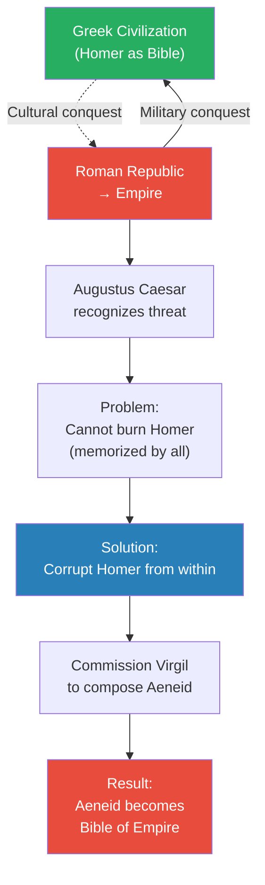
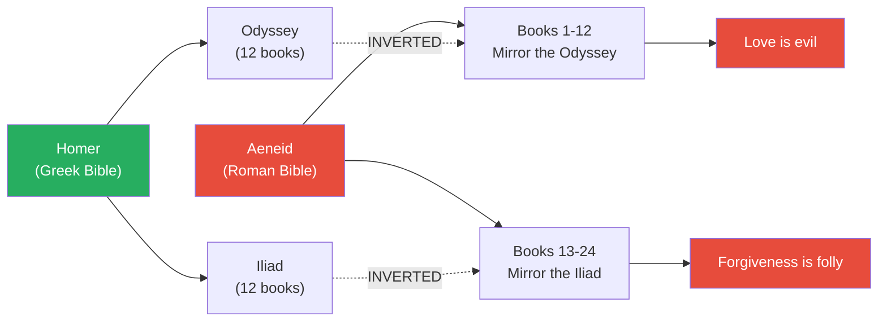
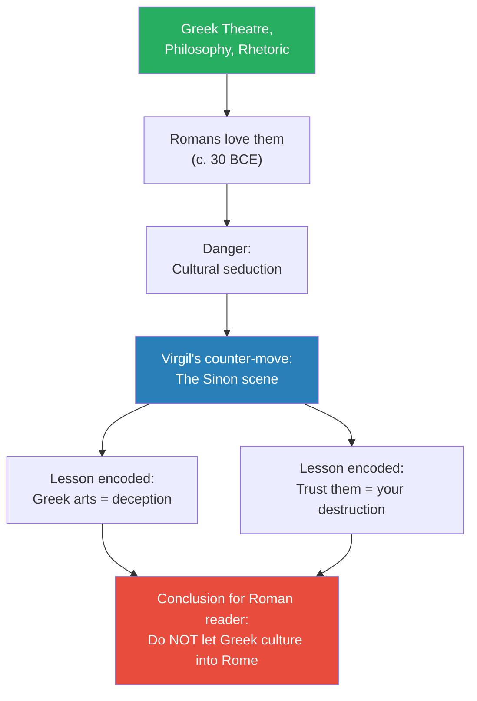
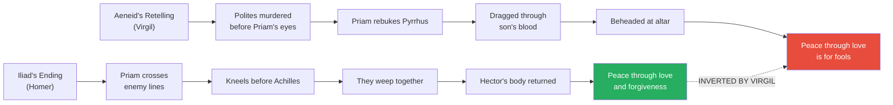
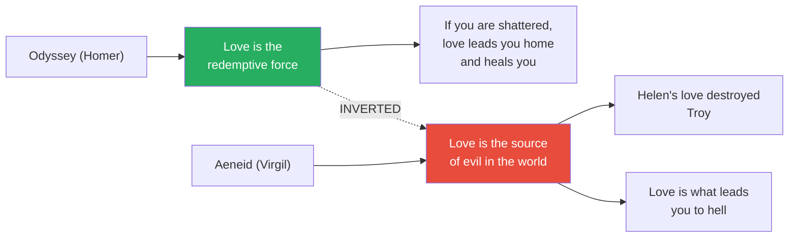
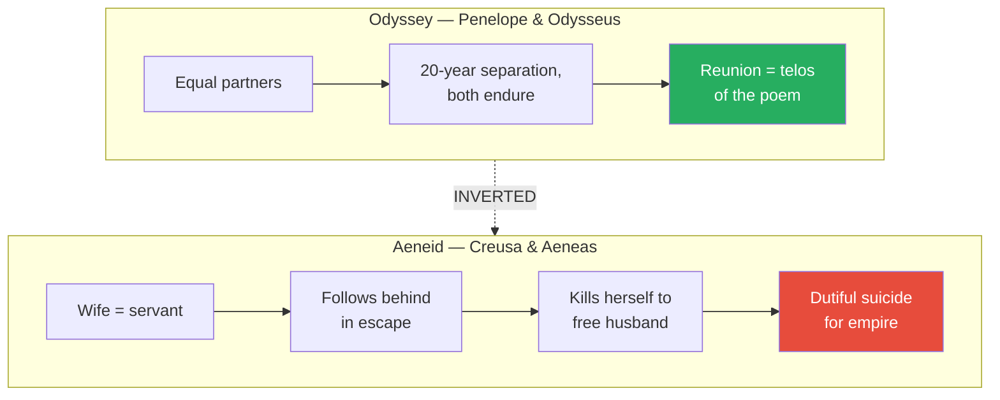
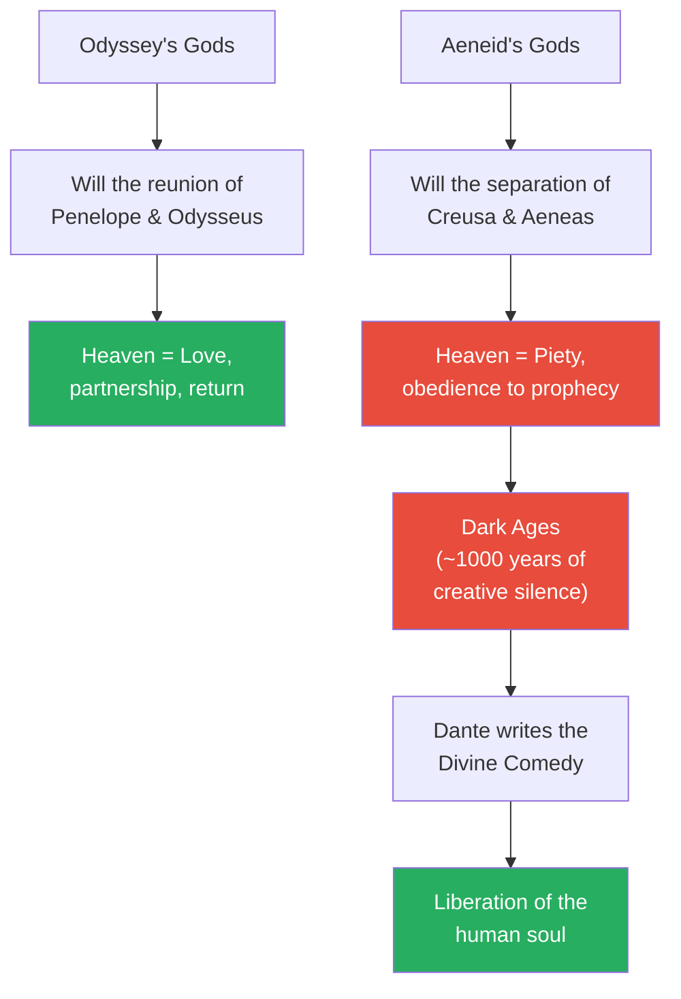

# The Anti-Homer

> Prof. Jiang delivers one of the most provocative arguments of the semester: Virgil's *Aeneid* is not merely a lesser imitation of Homer — it is a deliberate inversion, a piece of imperial propaganda commissioned by Augustus Caesar to poison the Greek values infecting Roman culture. Where Homer taught forgiveness, love, and the equality of souls, the *Aeneid* teaches violence, obedience, and the subordination of wife to husband. This inversion, Prof. Jiang argues, ushered in a thousand-year Dark Age in Western creativity, a spell that would only be broken when Dante emerged to write the antidote.

---

## Overview: Key Highlights

- <b style="color: #27ae60">The *Aeneid* is the anti-Homer</b> — a deliberate inversion commissioned to destroy Greek values from within Roman culture
- <b style="color: #2980b9">Erite and eudaimonia</b> — the Greek ideals of excellence and flourishing that Homer embodies and Virgil negates
- <b style="color: #e74c3c">Greek culture threatens to spiritually conquer the Romans who conquered it physically</b> — Augustus's fear and the reason the *Aeneid* exists
- <b style="color: #2980b9">Piety (Roman virtue)</b> — obedience to fathers, history, and tradition — the opposite of Greek excellence
- <b style="color: #27ae60">The *Aeneid* inverts every core value of Homer</b> — generosity becomes weakness, forgiveness becomes folly, love becomes hell
- <b style="color: #e74c3c">Love is evil, love destroys civilisation</b> — the *Aeneid*'s thesis, a direct reversal of the *Odyssey*
- <b style="color: #2980b9">Pyrrhus at the altar</b> — the scene that negates the Priam-Achilles reconciliation at the end of the *Iliad*
- <b style="color: #27ae60">Priam's death teaches Romans that forgiveness is fatal</b> — the moral opposite of what Homer's version teaches
- <b style="color: #e74c3c">Creusa's suicide dramatises the Roman wife's duty to erase herself</b> — the antithesis of Penelope's equality with Odysseus
- <b style="color: #2980b9">Virgil's guilt</b> — he tried to burn the poem on his deathbed, fearing the gods would punish him for prostituting his gift to the emperor
- <b style="color: #e74c3c">The Dark Ages are the *Aeneid*'s shadow</b> — 1000 years of creative silence caused by Rome's replacement Bible
- <b style="color: #2980b9">Dante as the antidote</b> — the *Divine Comedy* is explicitly framed here as the liberation of the human soul from the *Aeneid*'s poison

| Concept | One-line summary |
|---------|-----------------|
| **Erite** | Greek — excellence; being the best at what you uniquely can do |
| **Eudaimonia** | Greek — flourishing; human happiness achievable only by fulfilling one's erite |
| **Piety (Roman)** | Obedience to fathers, gods, history, and tradition — Rome's supreme virtue |
| **The Aeneid** | Virgil's 12-book epic; 24 books inverting both Homer's poems as imperial propaganda |
| **Anti-Homer** | Prof. Jiang's term for the *Aeneid*'s deliberate inversion of Homeric values |
| **Aeneas** | Trojan survivor fated by the gods to found Rome; Virgil's propagandised hero |
| **Dido** | Queen of Carthage, seduced by Aeneas's storytelling — love becomes a cautionary tale |
| **Sinon** | The Greek soldier-liar who persuades the Trojans to wheel in the horse — Greek rhetoric as deception |
| **Pyrrhus / Neoptolemus** | Achilles's son who butchers Priam at the altar — the reversal of Homer's ending |
| **Creusa** | Aeneas's wife, who kills herself so Aeneas can marry into a new imperial lineage |
| **Dark Ages** | The thousand-year creative silence Prof. Jiang attributes to the *Aeneid*'s spiritual dominance |
| **Dante's antidote** | The *Divine Comedy* as the explicit reversal of Virgil's poison — sets up the next lectures |

---

# The Conversation

## Greece Conquers Rome — The Threat That Creates the *Aeneid* [0:00 - 3:26]

*Prof. Jiang opens by framing the paradox at the heart of Roman civilisation: Rome conquered the Greeks militarily, but Greek culture was quietly conquering Rome spiritually. Augustus Caesar recognises this as the central problem of his new empire. His solution is not to burn Homer — that is impossible — but to compose a replacement so seductive it corrupts Homer from within.*

> [!tip] Core Insight
> Empires are conquered twice. Rome conquered Greece with legions; Greece was conquering Rome with poetry. The *Aeneid* is Augustus's counterattack — not a book of beauty, but a weapon of civilisational warfare.

*The *Aeneid* exists because physical conquest alone could not protect Rome from the spiritual pull of Greek values. Augustus's answer was to write a counter-scripture.*

> [!note]- Expand: Full Conversation
> - Prof. Jiang opens by reminding the class what they have just finished: they have read the *Iliad* and the *Odyssey*, and Homer has become <b style="color: #27ae60">the basis of Greek civilisation</b> — the infrastructure of the Greek mental worldview
>   - At this point in history, most people do not read and write; they speak and listen in front of audiences
>   - Homer is memorised by every educated Greek — he is not a text, he is a shared mental architecture
>   - This foundation produces what Prof. Jiang calls "the greatest civilisation in human history"
> - The Romans will eventually conquer the Greeks, then the entire Mediterranean, and build the Roman Empire
> - But the Romans are nothing like the Greeks:
>   - <b style="color: #2980b9">The Greeks are open, curious, and believe in erite and eudaimonia</b>
>     - **Erite** means excellence — being the best at what you can uniquely do
>     - **Eudaimonia** means flourishing — you can only achieve human happiness by achieving your erite
>     - Odysseus embodies this: he is a great speaker; that is his erite; he uses his speech to fulfil his destiny and save his family; that achieves eudaimonia
>   - <b style="color: #e74c3c">The Romans believe in piety</b>
>     - Piety just means obedience — to your fathers, to history, to tradition
>     - The Romans are extremely conservative
>     - But they are very good at fighting wars — which is why they become the empire
> - After the Empire is established, a problem emerges:
>   - Educated Romans recognise that Greek culture is vastly superior
>   - Many begin drifting toward Greek values — which from the Roman perspective means "the corruption of the Roman soul"
> - <b style="color: #27ae60">Augustus Caesar — considered the first emperor — sees the existential danger</b>
>   - Even though the Romans have physically conquered the Greeks, spiritually the Greeks will conquer the Romans
>   - The main vehicle of that spiritual conquest is **Homer**
>   - The solution: <b style="color: #e74c3c">destroy Homer</b>
> - But you cannot simply burn books:
>   - There are not that many books to begin with
>   - People have already memorised Homer — it lives in their minds, not on pages
>   - You have to <b style="color: #e74c3c">corrupt Homer</b> — produce a counter-poem that inverts his values while mirroring his form
> - The solution Augustus devises is called <b style="color: #2980b9">the *Aeneid*</b>
>
> > [!quote] Prof. Jiang
> > "Physically, the Romans conquered the Greeks. Spiritually, the Greeks will conquer the Romans."

---

## The Anatomy of an Inversion — What the *Aeneid* Is [3:26 - 6:30]

*Prof. Jiang explains the structural design of the *Aeneid* as a weapon. It mirrors Homer book-for-book: twelve books paralleling the *Odyssey*, twelve paralleling the *Iliad*. It becomes the new Bible of the Empire — the Latin textbook every schoolboy memorises. And crucially, it was not really Virgil's poem at all — it was Augustus's ideology, with Virgil supplying the verse.*

*The *Aeneid* is not an original work in structure — it is a line-by-line counter-text, engineered to sit next to Homer and negate him.*

> [!note]- Expand: Full Conversation
> - Prof. Jiang tells the class to think of the *Aeneid* as <b style="color: #2980b9">the anti-Homer — the inversion of Homer</b>
>   - It takes the ideas of Homer and inverts them
> - This becomes <b style="color: #e74c3c">the Bible of the Roman Empire</b>
>   - Every Roman schoolboy must memorise it
>   - This is the main way Latin — the official language of the Empire — is learned
>   - Whereas Homer gave us Greek civilisation and the birth of Western civilisation, the *Aeneid* will create "the Dark Ages" — about 1000 years during which Western creativity ends
> - The structural mirror:
>   - The *Aeneid* is 24 books (really 12 in the poem as preserved, but Prof. Jiang describes it as functionally 24 because it fuses the *Odyssey* and *Iliad* structures)
>   - The first 12 books model the *Odyssey* (Aeneas's wanderings)
>   - The last 12 books model the *Iliad* (Aeneas's wars in Italy)
> - The plot of the opening:
>   - Aeneas is one of the survivors of the fall of Troy
>   - He takes his father (Anchises) and his child (Ascanius) to seek the Italian peninsula
>   - The gods have told him he is **fated** to found the Roman Empire — this is why the gods had to destroy Troy: to create Rome
>   - As he sails to Italy, there is a shipwreck
>   - He lands in Carthage, where Queen Dido and the Carthaginians are extremely hospitable
>   - At a great banquet, Aeneas tells Dido the story of the fall of Troy
>   - His purposes in telling the story:
>     - To show how duplicitous, manipulative, and deceptive the Greeks are
>     - To show why Homer's values are evil
>     - To show why love leads to tragedy
>   - By the very act of telling it beautifully, Aeneas seduces Dido — she falls in love with him not only because he is brave and handsome but because he is a great poet
> - Prof. Jiang then drops an explosive biographical detail:
>   - <b style="color: #e74c3c">Virgil did not really write the *Aeneid*. Augustus Caesar did.</b>
>     - Augustus provided the ideological framework
>     - Virgil then composed it into Latin poetry
>   - At the end of his life, Virgil actually wanted to burn the *Aeneid*
>     - A poet's gift comes from the gods — so a poet represents the gods
>     - If you prostitute that gift to the Emperor rather than to the gods, the gods may punish you
>     - Virgil was terrified of this and wanted the poem destroyed
>     - Augustus refused — and so the *Aeneid* became the Bible of the Empire
>
> > [!tip] Core Insight
> > A text can do what armies cannot. The *Aeneid*'s 1000-year cultural dominance — and the Dark Ages Prof. Jiang attributes to it — shows that the deepest form of conquest is the replacement of a people's foundational stories.

---

## Reading the Trojan Horse — Greek Rhetoric as Deception [6:30 - 10:51]

*Prof. Jiang has a student read the Trojan Horse episode from Book 2 of the *Aeneid*. This is the passage in which a Greek soldier named Sinon is brought before Priam, pretends to be an escaped sacrificial victim, and persuades the Trojans to wheel the horse into their city. Prof. Jiang's interpretation is blistering: this scene is Augustus's direct attack on Greek theatre, philosophy, and rhetoric — the very arts the Romans were falling in love with.*

*The Trojan Horse episode is not mere narrative. It is Augustan propaganda encoding a civilisational warning: every Greek cultural gift is a Trojan horse.*

> [!note]- Expand: Full Conversation
> - A student (Ivory) reads the passage where Sinon is dragged before the Trojans, hands shackled, pretending to be a helpless prisoner
>   - He speaks of having no refuge — "What's left for me now, a man of so much misery" — and begs for pity
>   - His groans "convince us, cutting all our show of violence short"
> - Prof. Jiang steps in with historical context:
>   - Around 30 BCE, Greek theatre is extremely popular among Romans
>   - Greek theatre is "the very paragon of Greek civilisation"
>   - Augustus's message via Virgil: <b style="color: #e74c3c">Greek theatre is evil, meant to deceive us</b>
>   - Sinon is trained in theatre, trained in philosophy, trained in rhetoric — he deploys every art to deceive "the good but naive Trojans"
> - Sinon's specific lie:
>   - He claims to have been the designated human sacrifice the Greeks needed to sail home safely
>   - He claims he ran off at the last moment and hid in a marsh
>   - He begs Priam for refuge
> - Ivory continues reading Sinon's speech:
>   - "Pity a man whose torment knows no bounds. Pity me in my pain. I know in my soul I don't deserve to suffer"
>   - He wins Priam's pity; Priam frees him from chains and welcomes him
>   - Priam asks: "Why did they raise up this giant, monstrous horse?"
> - Prof. Jiang connects this back to Homer:
>   - In the *Iliad*, Priam is known for <b style="color: #27ae60">generosity, magnanimity, and benevolence</b>
>   - That same generosity enables the great reconciliation with Achilles at the end of the *Iliad*
>   - Here, Virgil is reversing the meaning of that character trait
>   - <b style="color: #e74c3c">"You think generosity leads to goodness? No — generosity leads to evil"</b>
>   - Priam is too trusting, too generous — he believes the Greek soldier
>   - The Trojans bring the horse inside; at night the Greek soldiers emerge; they open the gates; the slaughter begins
>
> > [!example] Sinon's Performance — The Trojan Horse Deception
> > - Greek soldier Sinon pretends to be a fugitive abandoned by his own side
> > - He is "trained in theatre, trained in philosophy, trained in rhetoric"
> > - He performs helplessness and injury, speaks of sweet children and a longed-for father
> > - Priam's magnanimity — the very trait Homer praised — disarms him
> > - Priam asks what the horse is for; Sinon claims it is a gift to the gods
> > - The Trojans wheel the horse inside their own walls
> > - At night the Greek soldiers inside emerge and open the gates
> > - Troy burns
> > **The lesson for Augustus's Roman readers:** Greek arts are weapons. Do not invite them into the city of your soul.

---

## The Death of Priam — Negating the *Iliad*'s Climax [10:51 - 20:07]

*This is the centrepiece of the lecture. In the *Iliad*, Homer ends with one of the most powerful scenes in Western literature: Priam crosses enemy lines, kneels before Achilles, and the two men — enemies who have killed each other's loved ones — weep together and forgive each other. Virgil obliterates that scene. Achilles's son Pyrrhus murders Priam's son in front of him, drags the old king through his son's blood, and beheads him at his own household altar. The message to Roman readers: forgiveness is a fool's creed.*

*Virgil does not merely tell a different story — he stages a direct rebuttal. Every element of Homer's climactic reconciliation is replaced with its violent opposite.*

> [!note]- Expand: Full Conversation
> - Ivory reads Priam's final moments: the old king donning his long-unused armour, shaking with age, strapping on a useless sword, rushing to meet his death
>   - In the courtyard at a great altar, Priam's wife Hecuba and their daughters huddle "blown headlong down like doves by a black storm, clutching all for nothing the figures of their gods"
>   - Hecuba cries: "Are you insane? Poor husband. What impels you to strap that sword on now?"
>   - She pulls Priam to the altar: "This altar will shield us all, or else you'll die with us"
> - Suddenly Polites — a son of Priam — runs in, wounded, pursued by Pyrrhus
> - Prof. Jiang pauses the reader to contextualise:
>   - <b style="color: #2980b9">Pyrrhus is the son of Achilles</b>
>   - This scene is a rewriting of the *Iliad*'s ending, where Priam and Achilles had the great emotional battle where they forgave each other
>   - There, Priam's love for Hector and Achilles's love for his father unified their souls
>   - Now Achilles is dead, and his son seeks to kill Priam
> - Ivory continues: Polites reaches his parents, collapses, "vomiting out his life blood before their eyes"
> - Prof. Jiang notes the parallel: Polites here stands in for Hector in the *Iliad*, where Achilles killed Hector at the gates of Troy while Priam and Hecuba watched from the walls
>   - Achilles then committed "a war crime" — tying Hector to his chariot and dragging him around the walls
>   - This scene re-imagines that humiliation with Priam himself as the victim
> - Priam, trapped in the grip of death, hurls his spear and rebukes Pyrrhus:
>   - "You and your vicious crimes, if any power on high recoils to such an outrage, let the gods repay you"
>   - "You've made me see my son's death with my own eyes, defiled the father's sight with a son's life blood"
>   - <b style="color: #27ae60">"You say you're Achilles's son. You lie. Achilles never treated his enemy Priam so"</b>
>   - "He honoured a suppliant's right. He blushed to betray my trust. He restored my Hector's bloodless corpse for burial, sent me safely home"
> - Prof. Jiang reads this as Priam explicitly invoking the *Iliad* inside the *Aeneid* — "in this great war, peace and love came to the universe when Achilles and Priam became friends"
>   - Priam accuses Pyrrhus of destroying his father's legacy, destroying the friendship between them
> - Priam throws his spear; it barely grazes Pyrrhus's shield
> - Pyrrhus's response:
>   - "Well then, down you go. A messenger to my father, Peleus's son — tell him about my vicious work. How Neoptolemus degrades his father's name. Don't you forget now — die"
>   - Prof. Jiang clarifies: "Neoptolemus is actually another name for Pyrrhus"
> - The killing:
>   - Pyrrhus drags the old man to the altar, "quaking, slithering on through slicks of his son's blood"
>   - He twists Priam's hair in his left hand, sweeps his sword forth with his right
>   - He buries the hilt "deep in the king's flank"
>   - "A powerful trunk is lying on the shore, the head wrenched from the shoulders, a corpse without a name"
> - Prof. Jiang delivers his sociological reading of this violence:
>   - <b style="color: #2980b9">The Greeks are a cultured people</b> — they go to theatre, watch tragedies, cry together to rejuvenate their sense of humanity
>   - <b style="color: #e74c3c">The Romans go to the Colosseum to watch gladiator fights</b> — they like blood, they like violence
>   - The *Aeneid* is extremely violent — "almost pornographic in the violence it depicts"
>   - The Romans love this because "they are a bloodthirsty people"
> - The moral reversal Prof. Jiang wants the class to see:
>   - A Roman reads the *Iliad* and concludes Priam was heroic to forgive Achilles
>   - Then he reads the *Aeneid* and is taught to re-read that conclusion
>   - <b style="color: #e74c3c">"What a foolish old man who deserves to die for thinking that his enemy should be forgiven, that his enemy has a good soul in him"</b>
>   - This is not mere alternative storytelling — <b style="color: #e74c3c">"it is actually poisoning and corrupting the *Iliad*"</b>
>
> > [!example] Priam at the Altar — The Inverted Reconciliation
> > - In Homer, Priam meets Achilles alone in his tent; they weep together and exchange mercy
> > - In Virgil, Priam meets Pyrrhus at his own altar, amid the bodies of his children
> > - Priam's last words explicitly invoke Achilles's honour — "Achilles never treated me so"
> > - Pyrrhus laughs and taunts: "go tell my father how I degraded his name"
> > - Priam is beheaded; his body lies on the shore as a nameless trunk
> > - The father-son generational line that Homer built up is torn apart in one scene
> > **The lesson:** Virgil's Rome is telling its readers that any value Homer taught — forgiveness, generosity, the humanity of the enemy — is a lie that gets old men killed.

---

## Helen and the Evil of Love — Inverting the *Odyssey*'s Redemption [20:07 - 23:15]

*After Priam's death, Aeneas spots Helen cowering at the altar. Rage floods him — "this whore" is the cause of Troy's destruction. Prof. Jiang uses this moment to state the lecture's central thesis. If the *Odyssey* teaches that love is the redemptive force of the universe, the *Aeneid* teaches the exact opposite: love is what destroys civilisations. Love is evil. Love is hell.*

> [!tip] Core Insight
> The *Odyssey*'s central lesson is that love heals and redeems; the *Aeneid*'s central lesson is that love corrupts and destroys. Virgil could not have picked a more precise target — he aimed at the beating heart of Homer's worldview.

*The *Odyssey* says love will save you. The *Aeneid* says love will damn you. There is no middle ground — and this is by design.*

> [!note]- Expand: Full Conversation
> - Ivory reads Aeneas's reaction as he surveys the destroyed city and spots Helen
>   - "The full horror came home to me at last. I froze"
>   - The thought of his own father filled his mind when he saw old Priam gasping out his life
>   - "Both men were the same age, and the thought of my Creusa, alone, abandoned, our house plundered, our little Iulus's fate"
>   - He looks back — "what forces still stood by me? None"
>   - Everyone has fled — flung themselves from roofs into the flames
>   - "I was the one man left"
> - Then he sees Helen, "terrified of the Trojans' hate… terrified of the Greeks' revenge… her deserted husband's rage"
>   - She cowers at the altar, "a thing of loathing"
>   - "Helen — out it flared the fire inside my soul, my rage ablaze to avenge our fallen country, pay Helen back crime for crime"
> - Prof. Jiang interprets:
>   - Aeneas is watching his entire civilisation destroyed and knows his family is next
>   - Then he sees Helen and thinks: <b style="color: #e74c3c">"This is her fault. We are destroying our civilisation because of this whore."</b>
>   - Virgil's encoded lesson: <b style="color: #e74c3c">love is a source of evil in the world</b>
> - Prof. Jiang pulls back to the macro comparison:
>   - <b style="color: #27ae60">The *Odyssey*'s main lesson: love is the redemptive force of the world</b>
>     - If you are shattered as a person, it is love that will lead you home and heal you
>   - <b style="color: #e74c3c">The *Aeneid*'s counter-lesson: love is what destroys civilisation, love is what corrupts you, love is what leads you to hell</b>
>
> > [!quote] Prof. Jiang
> > "Love is hell. What is heaven? Heaven is piety."
>
> - Aeneas wants to kill Helen as revenge, but Venus — Aeneas's mother — appears and stops him
>   - She tells him he must go home and save his wife and child
>   - This is the setup for the Creusa scene that follows

---

## Creusa's Suicide — Inverting Penelope's Equality [23:15 - 27:00]

*Prof. Jiang uses the fall of Troy's escape sequence to demonstrate another inversion. In the *Odyssey*, Penelope and Odysseus are partners — their reunion is the whole point. In the *Aeneid*, wife exists to serve husband; when she becomes an inconvenience, her duty is to kill herself so he can marry up into a better imperial lineage. This is the most extreme reversal of Homer the poem commits.*

*Homer centres a twenty-year love story on the equality of husband and wife. Virgil centres a founding empire on a wife's disposable erasure.*

> [!note]- Expand: Full Conversation
> - Aeneas goes home, gathers his family, and leads them to the ship to escape Troy
> - The marching order as they flee through burning streets reveals the Roman hierarchy of family:
>   - <b style="color: #e74c3c">Aeneas carries his father (Anchises) on his back</b> — the patriarch is the most important member of the family
>   - <b style="color: #e74c3c">Aeneas holds his young son (Iulus) by the hand</b> — the son is the inheritor
>   - <b style="color: #e74c3c">Creusa, the wife, follows behind</b> — her job is to serve, not to walk beside
> - Prof. Jiang contrasts this with the *Odyssey*:
>   - "In many ways, Penelope and Odysseus are equal to each other"
>   - Their relationship is the central axis of the poem
> - At the ship, Aeneas realises his wife is missing
>   - He runs back through burning Troy to find her
>   - He finds only her ghost — Creusa is dead
> - Why is she dead?
>   - <b style="color: #e74c3c">She killed herself</b>
>   - It is her duty not to burden her husband
>   - Her husband is destined for great things — to found an empire
>   - He must marry into a new lineage, a new royal family
>   - Therefore she must kill herself to free him
>   - Additionally: if she were captured and became a slave to the Greeks, it would cost him embarrassment for the rest of his life
> - Prof. Jiang summarises the Roman doctrine of wifely duty:
>   - <b style="color: #e74c3c">"If you're not useful to your husband, just kill yourself"</b>
> - Ivory reads Creusa's ghost-speech:
>   - "Nothing, no reply, and again, Creusa. But then, as I madly rushed from house to house, no one in sight. Abruptly, right before my eyes, I saw her stricken ghost, my own Creusa as his shade, but larger than life"
>   - Creusa's reassurance to Aeneas:
>     - "Is not without the will of the gods these things have come to pass"
>     - "The gods forbid you to take Creusa with you"
>     - "The King of lofty Olympus won't allow it"
>     - "A long exile is your fate… a land of hardy people, their great joy — and the kingdom are yours to claim and the Queen to make your wife"
>   - Her final self-sacrificing vow:
>     - "I will never behold the high and mighty pride of their palaces… or go as a slave to some Greek Matron"
>     - "The Great Mother of God detains me on these shores"
>     - "And now farewell. Hold you the son we share. We love together again"
>
> > [!example] Creusa's Last Words — The Dutiful Suicide
> > - Aeneas loses Creusa in the chaos of escape; her body is never found
> > - Her ghost appears to him in the ruins of Troy
> > - She explains her death as the will of the gods — she cannot accompany him
> > - She tells him he must instead claim a new kingdom and marry a new queen
> > - She refuses him both grief and memory: do not weep, do not turn back
> > - She entrusts their shared son to him and vanishes
> > **The lesson:** The Roman wife's highest achievement is to erase herself gracefully when the empire needs her gone.

---

## Piety as the New Heaven — The Roman Inversion Completed [27:00 - 30:00]

*Prof. Jiang closes the lecture by stating the theological core of the inversion. Homer's gods favour love; Virgil's gods demand piety. Heaven is no longer reunion, partnership, or the return home — heaven is obedience to prophecy. And Prof. Jiang ends by naming the man who will eventually come to undo the damage: Dante.*

*The *Aeneid*'s spiritual dominance produces a thousand years of darkness, ended only when Dante emerges with a counter-poem that re-opens what Virgil sealed.*

> [!note]- Expand: Full Conversation
> - Prof. Jiang closes with the theological summary:
>   - In the *Odyssey*, love is heaven and separation is hell
>   - In the *Aeneid*, <b style="color: #e74c3c">love is hell and heaven is piety</b>
>   - **Piety** means obedience to the prophecy of the gods
>   - It is the will of the gods that Troy be destroyed so that Rome can be created
>   - It is the prophecy of the gods that Aeneas will lead the Trojans to found Rome
>   - Therefore what is good — what is divine — is obedience to this prophecy
> - The reversal in the lovers' fate:
>   - In the *Odyssey*: the gods will that Penelope and Odysseus reunite
>   - In the *Aeneid*: the gods will that Creusa and Aeneas separate
>   - Same cosmic framework, opposite moral verdict
> - Prof. Jiang acknowledges the modern reader's distance:
>   - <b style="color: #2980b9">"From our eyes, this doesn't sound that influential"</b>
>   - But the *Aeneid* became the basis of Roman civilisation
>   - <b style="color: #27ae60">"What is civilisation but a set of values, a set of ideas that guide you in your life?"</b>
>   - The *Aeneid*'s work is "inverting Homer, poisoning and corrupting Homer"
> - Prof. Jiang names the long-term damage:
>   - The *Aeneid* shapes Western civilisation throughout the Middle Ages
>   - It produces <b style="color: #e74c3c">"the Dark Ages — about 1000 years when Western creativity ends"</b>
>   - Eventually someone will recognise the evil and create an antidote
>   - That someone is <b style="color: #2980b9">Dante</b>
>   - The *Divine Comedy* is "the liberation of the human soul from the poison that is the *Aeneid*"
> - Homework and teaser:
>   - The class will read the *Aeneid* for the next two weeks
>   - This reading will lead directly to the *Divine Comedy*
>
> > [!quote] Prof. Jiang
> > "The Aeneid is a evil, evil piece of work. And it is the anti-Homer."

---

## Connections

**Builds on:**
- [[01 - Secrets of the Universe]] — the frame that great books are portals to divine knowledge; here Prof. Jiang inverts that, arguing the *Aeneid* is a portal away from divinity
- [[02 - Homer and the Invention of the Human]] — establishes what Homer made; this lecture explains what Augustus tried to un-make
- [[05 - The Odyssey]] — love as redemptive force; the *Aeneid* directly inverts this thesis
- [[06 - The Intimacy of Love]] — Penelope and Odysseus's partnership; contrasted here with Creusa's erasure

**Sets up:**
- [[08 - The Poetry of Empire]] — continues the study of the *Aeneid* as propaganda
- Upcoming Dante lectures — Prof. Jiang explicitly frames Dante as the antidote

**Related lectures elsewhere in vault:**
- [[07 - Homer's Iliad and the Birth of Greek Civilization]] — the original Homeric climax that Virgil rewrites
- [[17 - Homer, Vergil, and the War for the Soul of Rome]] — Civilization series lecture on the same inversion
- [[14 - Hannibal Barca, Lucius Brutus, and the Triumph of Rome]] — Roman conservatism and piety in political form
- [[21 - Roman Anti-Civilization]] — the Colosseum, violence, and the Roman appetite Prof. Jiang invokes here
- [[25 - Paul of Tarsus, Messiah of Rome]] — how another subversive text tried to corrupt Rome from within
- [[29 - Dante's Divine Comedy and the Liberation of the Human Imagination]] — the antidote named
- [[30 - Dante as the Second Coming of Homer]] — the explicit frame that Dante resurrects what Virgil killed
- [[32 - Rome's Rise, Fall, and Legacy]] — Roman ideology in the long view

---

## The Takeaway

This lecture reframes the *Aeneid* from "a lesser Homer" — the standard textbook reading — into something more sinister and more interesting: a piece of state-commissioned counter-scripture. Prof. Jiang's argument is that Augustus Caesar looked at his new empire and saw a subtle but mortal threat — the Greek values in Homer were converting his Romans into cosmopolitans, forgiving men, lovers of partners. His response was to commission a poem that would wear the shape of Homer but carry the opposite payload. Every major Homeric lesson — love redeems, forgiveness heals, husband and wife are equal, the enemy has a human soul — is systematically inverted. The result is the Bible of the Empire, memorised by every Roman schoolboy, and (in Prof. Jiang's telling) the seed of a thousand-year creative silence.

The most counterintuitive insight is the sheer intentionality of the project. We tend to imagine that cultures drift, that values shift slowly, that bad poems win out by accident. Prof. Jiang insists the opposite: the *Aeneid* is a *designed* artefact of propaganda, authored in effect by a political operator (Augustus) who understood that empires are conquered twice — physically, then spiritually — and that the spiritual conquest is the one that lasts. The biographical detail that Virgil wanted to burn his own poem on his deathbed is devastating: the artist knew he had betrayed the gods, and tried to destroy the evidence before the Emperor refused.

What questions remain open? The lecture announces but does not prove the claim that the *Aeneid* caused the Dark Ages; the reader is left to take Prof. Jiang's word on the cultural chain of causation. Questions about how far the inversion reaches — whether Virgil himself saw what Prof. Jiang sees, whether subsequent Roman writers resisted or amplified it, whether the poem contains any residual Homeric values Prof. Jiang has downplayed — are deferred to the two weeks of reading ahead. But the framing is set, and the next stop is clear: Virgil's poison, then Dante's cure.
