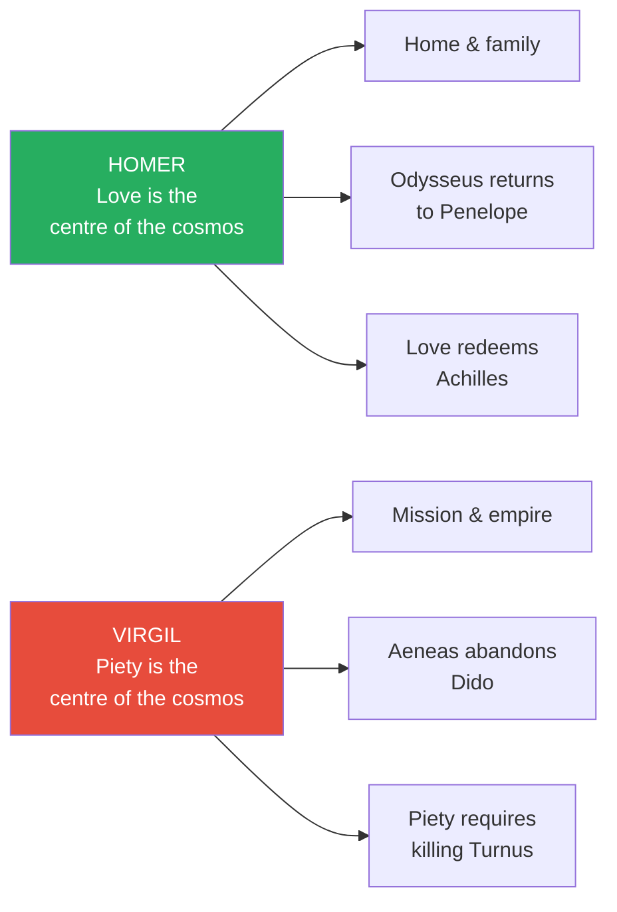
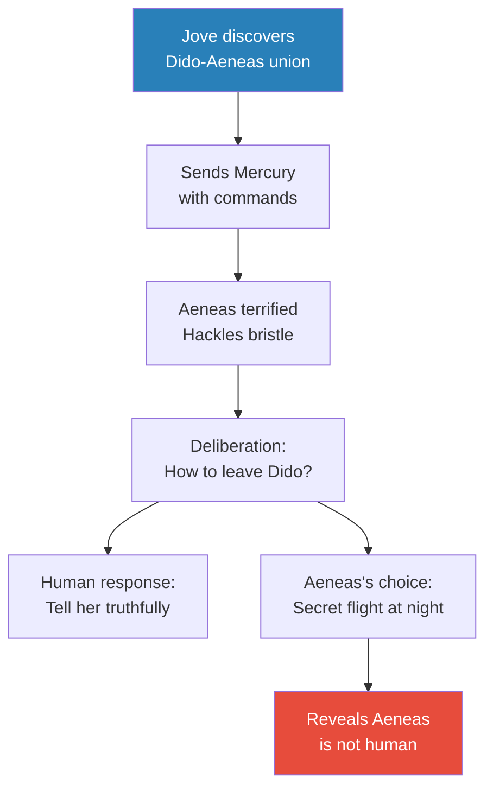
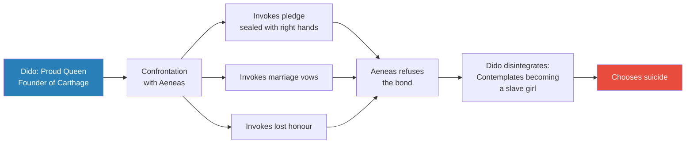
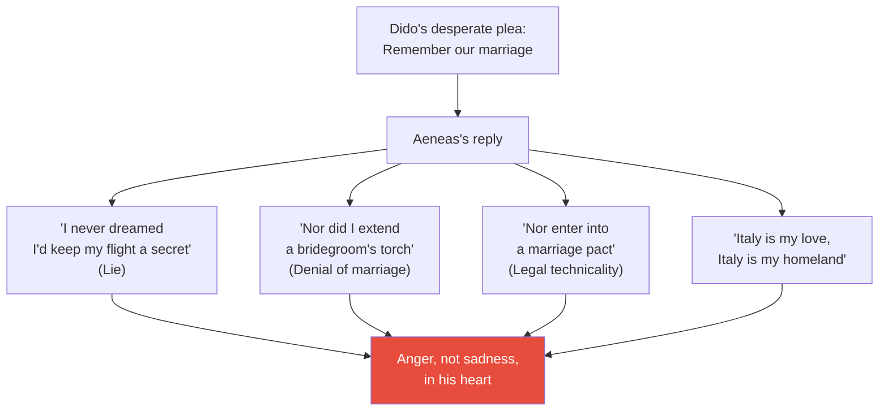
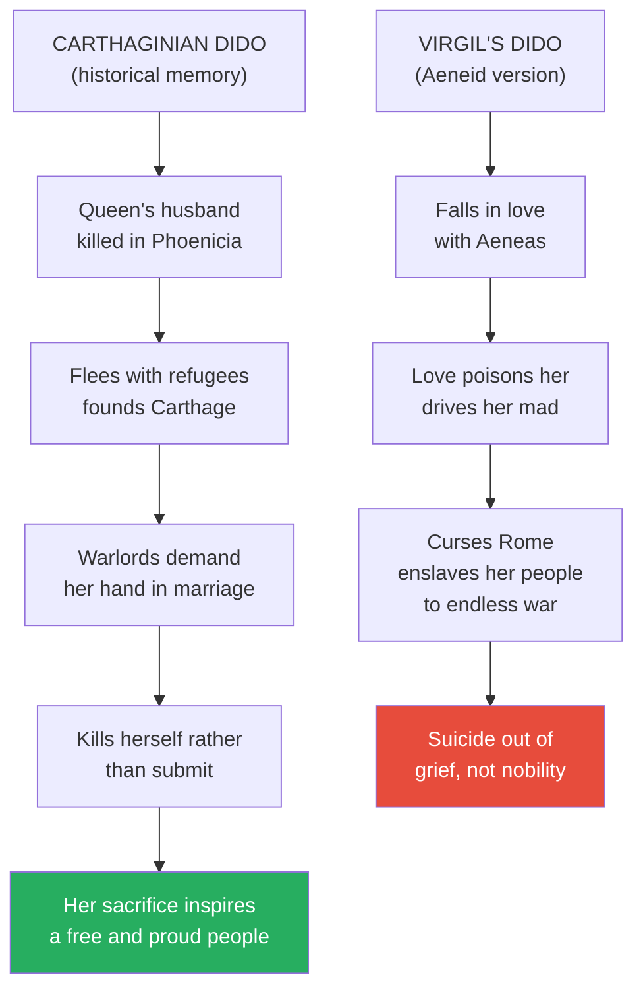
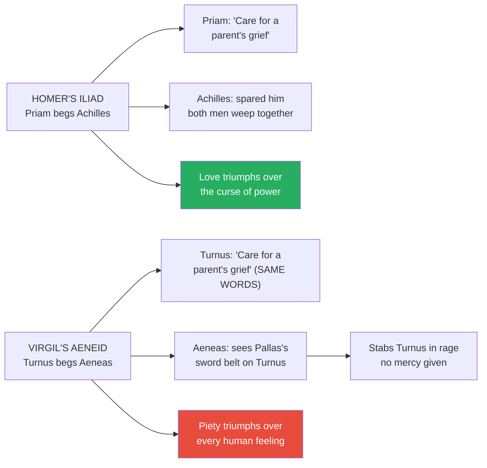
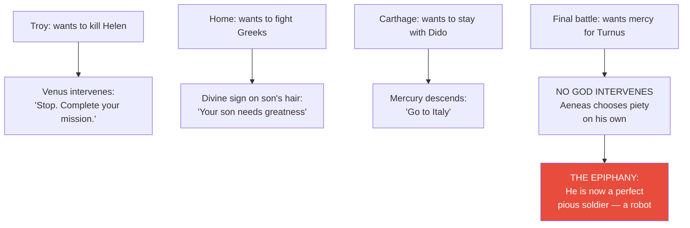
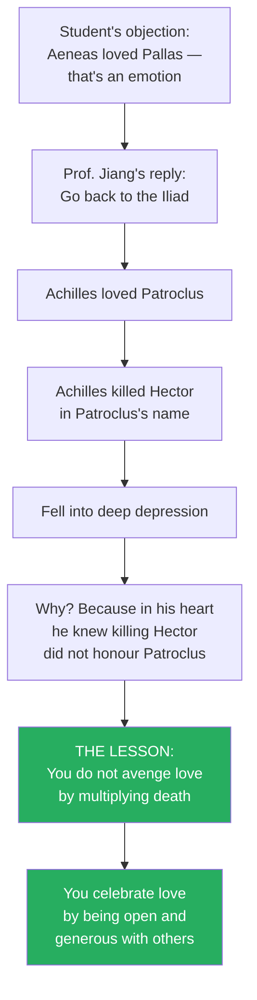

# The Poetry of Empire

> Prof. Jiang concludes Virgil's Aeneid by exposing it not as literature but as political propaganda — a machine designed to strip its reader of humanity, love, and pity until only obedience remains. Through Aeneas's abandonment of Dido and his cold execution of the suppliant Turnus, Virgil inverts Homer's entire moral universe: love is no longer the unifying force of the cosmos but an enemy of duty, a poison to be discarded. The epic's strange, abrupt ending — no epiphany, no resolution, just a stabbing — is itself the epiphany: Aeneas has become the perfect pious soldier, a "walking phallus" cleansed of all emotion. This poem would go on to brainwash the elite of Europe for a thousand years through the Catholic Church, until Dante rose to liberate the human imagination with the Divine Comedy.

---

## Overview: Key Highlights

- <b style="color: #27ae60">The Aeneid is political propaganda, not literature</b> — it teaches obedience to the gods by stripping the reader of humanity, step by step
- <b style="color: #e74c3c">Virgil is the anti-Homer</b> — where Homer makes love the centre of the cosmos, Virgil makes piety the centre and love a poison
- <b style="color: #2980b9">Piety</b> — obedience to the gods and father — is the organising force of Virgil's universe, replacing Homer's love
- <b style="color: #27ae60">Aeneas is not human — he is a "walking phallus," a James Bond figure who sleeps with women and abandons them for the mission</b>
- <b style="color: #e74c3c">Dido is destroyed by love</b> — she begins as a proud queen and ends as a raving madwoman contemplating slavery, then suicide
- <b style="color: #2980b9">The inversion of the Odyssey</b> — the Odyssey ends with a return to love, the Aeneid begins with love and abandons it
- <b style="color: #27ae60">Virgil inverts the Iliad's Priam–Achilles scene</b> — Turnus begs Aeneas the way Priam begged Achilles, but this time the suppliant is killed
- <b style="color: #2980b9">Bacchus vs. Apollo</b> — two Greek gods of creativity: Apollo is calm rational thought, Bacchus is ecstatic frenzy; Virgil frames Bacchic emotion as madness
- <b style="color: #e74c3c">Dido's dying curse is propaganda for the Punic Wars</b> — Rome's destruction of Carthage is justified as self-defence against Dido's curse
- <b style="color: #27ae60">The Aeneid's catharsis is the death of human feeling</b> — by the final page, Aeneas has learned to kill without pity, and this is the poem's point
- <b style="color: #2980b9">The Divine Comedy</b> will take the rest of the semester to read line by line because "a poem is a truth told with as few beautiful words as possible"
- <b style="color: #e74c3c">You have been educated in utility and compliance, not in love</b> — which is why Turnus's death feels just instead of tragic

| Concept | One-line summary |
|---------|-----------------|
| **Piety** | Obedience to the gods and one's father — Virgil's replacement for Homer's love |
| **The anti-Homer** | Virgil's systematic inversion of Homer: love out, duty in; home out, empire in |
| **Dido's inversion** | Carthaginian history remembers Dido as a noble suicide; Virgil rewrites her as a cursed madwoman |
| **Apollo vs. Bacchus** | Apollo is rational creativity, Bacchus is frenzied emotional creativity — Virgil paints Bacchus as madness |
| **Pallas's sword belt** | The trophy Turnus stole from Aeneas's fallen friend — the sight of it reignites Aeneas's killing rage |
| **Epiphany / catharsis** | Literary convention where a character recognises himself and changes — the Aeneid appears to lack this |
| **The real epiphany** | Aeneas no longer needs the gods to prompt him — he now kills coldly on his own; he has become fully pious |
| **The Punic propaganda** | Dido's curse explains why Rome had to destroy Carthage — it was self-defence against her prophecy |
| **Memorisation as brainwashing** | Roman elite children memorised the Aeneid; by absorbing it they became Aeneas, robotic and obedient |
| **Dante's liberation** | The Divine Comedy is the weapon that will eventually destroy the Aeneid's thousand-year grip |
| **Love cannot justify evil** | Dante's hardest lesson — if you kill for a friend, you did not truly love that friend |

---

# The Lecture

## Virgil the Anti-Homer: Piety Replaces Love [0:06 - 6:30]

*Prof. Jiang opens by recapping the central thesis of the Virgil arc. Homer and Virgil are two complete cosmologies in conflict — and by the end of the Aeneid, one of them will have been erased for a thousand years.*

> [!tip] Core Insight
> Homer and Virgil are not two poets with different styles — they are two rival operating systems for the human soul. Homer installs love as the central value; Virgil installs obedience. The Catholic Church will choose Virgil's system, and Europe will live under it for a millennium until Dante switches it back.

*Every scene in the Aeneid is an inverted mirror of a scene in Homer — the return home becomes the flight from home, the plea for mercy becomes the refused mercy, love's bond becomes love's curse.*

> [!note]- Expand: Full Lecture Detail
> Prof. Jiang opens the final Virgil lecture with a summary: the Aeneid is a response to Homer's Iliad and Odyssey, and it is designed as the anti-Homer. He lays out the contrast cleanly:
>
> - For Homer, <b style="color: #27ae60">love is the unifying force of the universe</b> — it is what gives you life, purpose, and hope
> - For Virgil, what matters is <b style="color: #2980b9">piety</b> — obedience to the gods and to your father
> - Virgil sets up love and piety as competing forces — you cannot love AND be pious at the same time
> - Piety is the centralising force of the cosmos — if you are pious, the world will be right, because the gods have a divine plan
>
> In the Aeneid that plan is the founding of Rome. Aeneas's mission is to obey. Our role in Virgil's universe is to follow the path of the gods, and if we do, the world becomes perfect.
>
> Then Prof. Jiang explains the historical consequence. The Aeneid did not die with Rome. It became the operating system of the Catholic Church for over a thousand years:
>
> - Every elite child in the Latin-speaking world memorised the Aeneid
> - Every child perceived reality through the lens of the Aeneid
> - The thousand-year reign of the Catholic Church — what is often called the Dark Ages — is a period of conformity and stagnation
> - That stagnation is the Aeneid at work
>
> - <b style="color: #e74c3c">To destroy this empire, a man will emerge to liberate the human imagination</b> — his name is Dante
> - Dante will destroy the Roman Empire and the Catholic Church with his masterpiece, the Divine Comedy
>
> Prof. Jiang tells the class they will spend the rest of the semester on the Divine Comedy, reading line by line. He warns them not to try to read it alone — "there's no point," he says, "if I just give it to you and it's like, go read it, it will make no sense to you." The Divine Comedy is not just poetry but philosophy.
>
> > [!quote] Prof. Jiang
> > "A poem is a truth told with as few beautiful words as possible."
>
> He finishes the setup with a warning. The point of this class is not to tell students what the great books are. The point is to get them excited about entering a journey that will take their entire lifetime. "Do not think at the end of this class, oh, I've read Homer, I've read Virgil, I've read Dante, so I know the great books. No. This is just the beginning."
>
> Then he returns to the story. Aeneas has been shipwrecked and taken in by Dido, Queen of Carthage. The two have fallen in love. Dido was captivated not only by his warrior stature and handsome appearance, but by his storytelling — he told her the tale of the fall of Troy and she was undone. The gods have been meddling. Juno, who wants to prevent Rome from rising, has conspired to have the couple consummate their passion and marry. But Jove — the father of the gods — discovers the plot and sends Mercury to snap Aeneas back to duty.

---

## Mercury's Command: The Gods Reassert the Mission [6:30 - 11:30]

*Mercury arrives in a vision and delivers a public shaming. The gods remind Aeneas that his destiny is Italy, not Dido's bed. Aeneas's response reveals his essential inhumanity — he decides not to explain himself but to sneak away under cover of night.*

*Prof. Jiang's key observation: the conflict inside Aeneas is never "should I leave Dido?" It is "how do I get away without her bitching at me?" This is not a human dilemma. It is a logistical one.*

> [!note]- Expand: Full Lecture Detail
> The scene opens with Mercury delivering a scolding from the king of the gods. Aeneas, he says, is laying foundation stones for Carthage's walls, building her gorgeous city, doting on his wife, blind to his own realm and oblivious to his fate. What is he plotting? What hope misleads him? If his own fame will not fire his spirit, he must at least remember Ascanius — his young son and only heir — to whom he owes Italy, the land of Rome.
>
> Aeneas's reaction is instructive:
> - He is "truly overwhelmed by the vision"
> - His "hackles bristle with fear"
> - His voice "chokes in his throat"
> - He "yearns to be gone, to desert this land he loves"
>
> Prof. Jiang pauses here to make the decisive point. <b style="color: #2980b9">Virgil is the anti-Homer.</b> If Homer were writing this scene, Aeneas's emotional torment would be about his love for Dido — the wrenching of being torn from the woman he loves. For Homer, love is above the gods. Humans are creatures who aspire to love because there is an aspect of God in us, a candle striving to return to the light.
>
> - Odysseus had the chance to stay with Calypso and live forever
> - He chose Penelope and home instead
> - When he returns, Penelope asks if he will ever leave her again
> - He answers: "Never again. Why leave you? This is my home. Love is where my heart is."
>
> But in the Aeneid, Aeneas's torment is not "should I leave Dido?" It is "how do I leave Dido without her making a scene?" This is not love. This is logistics.
>
> Aeneas's solution is revealing of character: <b style="color: #e74c3c">he decides not to tell her at all</b>. He orders Mnestheus, Sergestus, and the captains to fit out the fleet in silence. Tell no one the reason. He will approach Dido himself, find a moment, break the news gently — except he never does. He prepares to sneak away at night.
>
> > [!tip] Core Insight
> > Aeneas's character is captured in one image: he is "a walking phallus, almost — he's like James Bond, man. He goes around, does his mission, sleeps with a lot of girls, and then runs off." There is nothing human about him because Virgil has deliberately stripped the human parts away. That is the poem's point.
>
> But Dido is a lover, and lovers cannot be deluded for long. Rumour reaches her. The Trojans are rigging their galleys, gearing to set sail. She explodes into a frenzy — raging through the city, "raving like some maenad driven wild when the women shake the sacred emblems, when the cyclic orgy shouts of Bacchus fire her on."
>
> Prof. Jiang stops on the word Bacchus. The Greeks had two gods of creativity, and understanding the distinction matters:
>
> | God | Type of creativity | Method |
> |-----|-------------------|--------|
> | **Apollo** | Logical, rational | Sit calmly, meditate, write down thoughts |
> | **Bacchus (Dionysus)** | Emotional, ecstatic | Drunken rapture, sexual frenzy, letting go |
>
> For the Greeks, both were necessary to reach full human potential — reason AND emotional surrender, both dimensions of the soul. Virgil, however, frames the Bacchic dimension as madness. <b style="color: #e74c3c">Emotional surrender is not divine in the Aeneid; it is pathology.</b> Dido's love-frenzy is proof she has lost her sanity.

---

## Dido's Confrontation: Love as Disintegration [11:30 - 19:00]

*Dido confronts Aeneas before he can say a word. Her speech is one of the great laments of Western literature, and Prof. Jiang reads it as the exact inversion of Penelope's reunion with Odysseus. Where the Odyssey ends in love's binding, the Aeneid ends in love's destruction.*

> [!tip] Core Insight
> For Homer, love is the force that reassembles a broken human being — it is the bow Odysseus has not touched for twenty years, the bowstring that still answers him. For Virgil, love is the opposite — the force that disintegrates a proud queen into a raving woman ready to become a slave girl if only it means staying close to her beloved.

*The arc of Dido across a single scene: a queen becomes a madwoman becomes a corpse. This is what love does in Virgil's world.*

> [!note]- Expand: Full Lecture Detail
> Dido finds him. She does not wait for him to explain. She opens with an attack:
>
> > [!quote] Dido to Aeneas
> > "So you traitor, you really believed you keep this a secret, this great outrage, steal away in silence from my shores."
>
> She asks if nothing holds him back — not their love, not the pledge once sealed with their right hands, not even the thought of Dido doomed to a cruel death.
>
> Prof. Jiang stops on the pledge sealed with right hands. This, he explains, is a direct allusion to the Odyssey:
>
> - Odysseus and Penelope meet again for the first time in twenty years
> - Penelope says: convince me you actually know my husband
> - Odysseus describes an ornament Penelope gave him — their private token
> - That ornament is their pledge, their sealed bond, the memory that carried them across the distance
> - The bond is what keeps their hearts conjoined even when they are separated by years and seas
>
> Dido invokes the same sacred grammar: does this pledge mean nothing to you? And Aeneas's silent answer — "it's a word, it's nothing" — shows us the universe has changed. In Homer, the pledge is the anchor of reality. In Virgil, it is a piece of sentimental debris to be swept aside for the mission.
>
> Dido continues. Why risk the deep in winter? Why sail when the north winds are closing? Even if he were not pursuing alien fields and unknown homes — even if ancient Troy were still standing — who would sail for Troy across such heaving seas? "You're running away from me."
>
> Then her prayer gets more specific:
> - By these tears, by the faith of his right hand
> - By their wedding vows, the marriage they began
> - If he owes her any decency at all
>
> She lists what she has sacrificed for him:
> - The African tribes and Numidian warlords now hate her (she rebuffed their offers of marriage)
> - Her own Tyrians rise against her (she has betrayed her people's expectations)
> - Her sense of honour is gone
> - Her "one and only pathway to the stars," her renown, is ruined
>
> And then she asks the unanswerable: "In whose hands my guest, do you leave me here to meet my death?"
>
> > [!example] The Inverse of Odysseus's Homecoming
> > - In the Odyssey, Odysseus seeks glory and fame in war
> > - He becomes traumatised with PTSD from the horrors he witnessed
> > - He saw innocent people and families destroyed
> > - What allows him to resurrect himself is returning home
> > - Finding love again is what rebuilds his sense of identity
> > - Love gives him courage and power to fight on
> > - In the Aeneid, the reverse happens — love DESTROYS Dido
> > - Her love for Aeneas costs her pride, reputation, people, honour
> > - Because of love, she becomes nothing
> > **The lesson:** In Homer, love resurrects the broken hero. In Virgil, love breaks the whole person. This is not a difference of taste; it is a different metaphysics of the universe.
>
> Prof. Jiang then asks what Aeneas should say here. <b style="color: #27ae60">The human thing</b> would be to show pity — to say: "Dido, I'm really sorry for what happened, but let's go together" or "I'll come back for you." Instead he says the worst thing possible.

---

## Aeneas's Reply: The Denial of the Marriage [19:00 - 23:30]

*Aeneas's response to Dido is a masterpiece of bureaucratic coldness. He does not deny her suffering but refuses to grant her the dignity of being wronged. They were never married, he says. There was no torch, no pact. In his heart, Prof. Jiang notes, is not sadness — but anger.*

*Aeneas weaponises a legal technicality — there was no formal bridegroom's torch — to erase Dido's reality. For Virgil this is virtue. For Homer it would be the most contemptible act a man could commit.*

> [!note]- Expand: Full Lecture Detail
> Aeneas begins with the formal courtesies of a man who has no intention of yielding. He will never deny the kindnesses she showed him. He will never regret his memory of Dido — not while he can recall himself and draw breath.
>
> Then comes the turn:
>
> > [!quote] Aeneas to Dido
> > "I never dreamed I'd keep my flight a secret. Nor did I once extend a bridegroom's torch or enter into a marriage pact with you."
>
> Prof. Jiang calls this what it is. It is a lie. They had consummated the relationship. They had done so publicly, with witnesses, in a ceremony Juno herself engineered. By the conventions of their world, they ARE married. But Aeneas seizes on a technicality — there was no formal bridegroom's torch, no signed pact — to wipe the marriage from the record.
>
> He continues. If the Fates had left him free to live as he chose, he would have rebuilt Troy. He would have fortified a second Troy with his own hands. But Grinian Apollo's oracle says he must seize Italy's noble land. "There lies my love. There lies my homeland."
>
> Then the twist of the knife:
>
> - Dido, you are Phoenician — you fixed your eyes on Carthage, a Libyan stronghold
> - Why grudge the Trojans their new homes on Italian soil?
> - What is the crime if we seek far-off kingdoms too?
>
> Prof. Jiang paraphrases the real message: "Dido, it worked out for me I wouldn't be saying we. I'd be back in Troy, dying and fighting and dying for what I truly love. Now that I've lost Troy, I must build an empire. You have your own empire, Carthage. Why stop me from building mine in Italy?"
>
> > [!tip] Core Insight
> > What matters in the Aeneid is not love. What matters is power. That's why we live. That's why we exist — to seek more power. Love gets in the way, and therefore love must be discarded. "You, Dido, I do love you, but you're in my way, therefore get out of my way."
>
> Prof. Jiang closes with a small but important detail. The text says "in his heart" Aeneas fought to master the torment. But Prof. Jiang corrects the note the students should take:
>
> - "In his heart is not sadness — but anger"
> - Aeneas is not torn between love and duty
> - He is irritated at having to deal with her at all

---

## Dido's Suicide and the Punic Propaganda [23:30 - 34:00]

*Dido's death is the most politically loaded scene in the Aeneid. Prof. Jiang reveals it as a piece of propaganda designed to justify Rome's real-world annihilation of Carthage. Virgil inverts the historical Dido — a noble suicide in Carthaginian memory — into a cursed, destroyed woman who dooms her own people to a vengeful war that the Romans must of course win.*

> [!tip] Core Insight
> The Aeneid is, first and foremost, political propaganda. Rome fought Carthage for a century, eventually burning the city to the ground so completely that we today have almost no memory of Carthaginian civilisation. Virgil's job is to make that genocide look like self-defence. Dido's curse is the mechanism.

*The same woman, two civilisations, two completely incompatible myths. Virgil's task as a propagandist is to erase one and install the other.*

> [!note]- Expand: Full Lecture Detail
> Dido, abandoned and publicly humiliated, considers her options. Prof. Jiang reads her lament in full to show how complete her collapse is:
>
> - Make a mockery of herself, return to her old suitors, tempt them to try again?
> - Beg the Numidians, grovel, plead for a husband she has already scorned?
> - Trail the Trojan ships, bend to their every demand?
> - Will the Trojans even allow her aboard — a woman they hate?
> - Take flight alone with Trojan oarsmen?
> - Follow them with her whole people?
>
> Every option is a further degradation. The proud queen has reduced herself to considering becoming a slave girl on the Trojan ships, just to be near him. This is the progression Prof. Jiang wants the class to see:
>
> - First meeting: Dido is a proud queen, founder of Carthage
> - Now: she is a complete emotional mess, driven into madness
> - Finally: she decides only suicide remains
>
> > [!example] The Power of Odysseus's Bow vs. Dido's Collapse
> > - In the Odyssey, love is the force that resurrects a person
> > - The bow Odysseus has not touched for twenty years answers him instantly
> > - He assembles it, strings it, shoots the target with renewed strength
> > - Love is the thing that makes a broken hero whole again
> > - In the Aeneid, love does the opposite
> > - A sovereign queen disintegrates into a slave girl's fantasy
> > - By falling in love, she loses her pride, reputation, people, sanity
> > - She loses the will to live
> > **The lesson:** Homer and Virgil give us two opposing theories of the soul. In one, love is the foundation of human strength. In the other, love is a poison that dissolves human beings from the inside.
>
> Prof. Jiang notes a small but telling detail. The gods know Dido will kill herself. So they send Mercury again — not to warn Aeneas about moral responsibility, but simply to get him out of sight before she does it. They don't want him to witness it. The Roman hero must not see the cost of his mission. His conscience must remain unburdened.
>
> Then Dido speaks her dying curse, and Prof. Jiang treats it with the weight it deserves. She calls on the sun, on Juno, on the Furies, on the gods of dying. She prays:
>
> - If that "curse of the earth" must reach his haven, let him be plagued in war by a proud nation
> - Let him be torn from his borders, wrenched from his son's embrace
> - Let him grovel for help, watch his people die a shameful death
> - Let him never enjoy his realm and the light he yearns for
> - Let him die before his time, unburied on some desolate beach
>
> Then she turns to her own people — her Tyrians, her Carthaginians:
>
> > [!quote] Dido's dying curse
> > "Shore clash with shore, sea against sea, sword against sword. Endless war, endless war."
>
> Prof. Jiang unpacks the propaganda operation:
>
> - Rome and Carthage fought for about 100 years for control of the Mediterranean
> - Rome ultimately destroyed Carthage as a civilisation
> - They burned the city down so completely that almost no memory of Carthage survives
> - <b style="color: #2980b9">Virgil's job is to explain why this had to happen</b>
> - His answer: it was not Roman aggression — it was Dido's curse that forced the Carthaginians to war
> - The Roman reader absorbs this: we were simply defending ourselves against an ancient prophecy
>
> Then he unveils the counter-history — the Carthaginian memory of Dido that Virgil is systematically erasing:
>
> | Version | Dido's character | Her death |
> |---------|-----------------|-----------|
> | **Carthaginian (historical)** | Proud queen, widow, founder, protector of her people | Killed herself rather than submit to local warlords; her sacrifice WON respect for her people |
> | **Virgilian (propaganda)** | Queen seduced, driven mad by love, then cursed | Killed herself out of grief for Aeneas; her death DOOMED her people to an unwinnable war |
>
> > [!tip] Core Insight
> > In the Carthaginian tradition, Dido's suicide was a free woman's refusal of slavery, and her people honoured her by becoming a proud nation. In Virgil's inversion, her suicide is love-poisoning, and her people are cursed into pointless vengeance against Rome. Virgil does not just invert Homer — he inverts history itself, for the political purposes of the Roman state.

---

## The Final Battle: Aeneas Becomes Achilles's Dark Mirror [34:00 - 41:30]

*Virgil closes the Aeneid by rewriting the Iliad's most sacred scene — the old king Priam kneeling before Achilles — and turning it inside out. This time the suppliant is killed. Prof. Jiang shows how Virgil literally plagiarises Priam's words and puts them in Turnus's mouth, only to have them refused. The gesture is not an accident; it is a statement.*

*Virgil copies Homer's vocabulary word for word and then subverts the outcome. This is deliberate textual warfare — an inversion so precise that any Roman reader would recognise it and understand exactly what is being overwritten.*

> [!note]- Expand: Full Lecture Detail
> Prof. Jiang reconstructs the setup. Aeneas has landed in Italy. The local Latin tribes welcome him as a great hero, and King Latinus offers his daughter Lavinia in marriage. But the queen had already promised Lavinia to Turnus, a local warlord. This triggers a war between the Trojans and Turnus's faction. The war comes to a head in a final one-on-one duel: Aeneas versus Turnus.
>
> The scene opens with Aeneas hurling his spear — a weapon compared to rocks thrown from a catapult, to thunder, to a black whirlwind. The spear pierces Turnus's round shield through seven plies of leather and drives into his thigh. Turnus drops to one knee. The Rutulians groan. The hillsides echo the long moan.
>
> Now comes the key moment. Turnus raises his right hand in supplication and speaks:
>
> > [!quote] Turnus's plea (echoing Priam)
> > "I deserve it all. No mercy. But if some care for a parent's grief can touch you still, I pray you, you had such a father in old Anchises — pity Daunus in his old age."
>
> Prof. Jiang points to the line about "care for a parent's grief" and says: these are the exact same words Priam used to Achilles in the Iliad. Priam kissed Achilles's hands, the hands that had killed his son, and said: "Remember your father. Peleus. Have mercy on me." Virgil is not just alluding to the scene. <b style="color: #2980b9">He is plagiarising it.</b> And he is plagiarising it precisely so he can invert the outcome.
>
> > [!example] The Priam Scene in the Iliad
> > - Achilles kills Hector, Priam's son, to avenge Patroclus
> > - He believes killing Hector is the apex of his glory
> > - Instead he falls into deep depression
> > - Priam comes to Achilles's tent in the middle of the night
> > - Kisses the hands that killed his son
> > - Asks Achilles to remember his own father
> > - Achilles weeps with Priam, and they become friends
> > - The Iliad ends in shared grief and mutual recognition
> > **The lesson:** The Iliad says power is a curse and only love redeems it. Achilles is saved from his own violence by the arrival of another man's love.
>
> Turnus continues. "Lavinia is your bride. Go no further down the road of hatred." He concedes everything. The war is over. The bride is yours. Spare my life.
>
> For a moment Aeneas wavers. The text says he holds his sword-arm back. Turnus's words begin to sway him "more and more." In his heart, Prof. Jiang narrates, Aeneas thinks: "I've defeated him. He's been destroyed. He's lost face. I can let him go. I've won. I just want to let him go."
>
> This is the human moment. This is where Homer would have ended it — with the sword arm still, with the two men weeping together.
>
> But then Aeneas sees something. On Turnus's shoulder gleams a sword belt — studded, familiar. It is the sword belt of Pallas. Prof. Jiang explains who Pallas was:
>
> - Pallas is the Aeneid's version of Patroclus
> - Pallas was a young friend of Aeneas who fell in battle to Turnus
> - To celebrate his victory, Turnus stripped Pallas of his sword belt and wore it as a trophy
> - Aeneas recognises it instantly
>
> Rage replaces pity. The text captures it in one burning sentence:
>
> > [!quote] Aeneas over Turnus
> > "Pallas strikes this blow. Pallas sacrifices you now, makes you pay the price with your own guilty blood."
>
> He plants his iron sword hilt-deep in Turnus's heart. Turnus's limbs go limp. His breath flees with a groan of outrage down to the shades below.
>
> And that is the final line of the Aeneid.

---

## The Real Catharsis: Aeneas Becomes a Robot [41:30 - 46:30]

*Scholars have complained for centuries that the Aeneid ends badly — no epiphany, no catharsis, no resolution. Prof. Jiang flips the critique on its head. The ending is not broken; it is a perfect completion of Virgil's actual project. The epiphany is not an emotional awakening. The epiphany is the moment Aeneas kills without needing the gods to tell him to.*

> [!tip] Core Insight
> Every previous moment of doubt in the Aeneid — in Troy, with Helen, with his son, with Dido — required the gods to intervene and push Aeneas back on mission. At the end, when he raises his sword over Turnus and wants to show mercy, the gods do nothing. Aeneas does it himself. He has internalised piety so completely that pity now feels foreign. This is the catharsis. The death of feeling is the transformation the poem exists to produce.

*The catharsis scholars have looked for in the wrong place. It is not a moment of emotional release. It is the moment the gods become unnecessary because the man has become the machine.*

> [!note]- Expand: Full Lecture Detail
> Prof. Jiang addresses the long-running scholarly complaint head-on. Many scholars read the final lines — the stabbing of Turnus, the shade-bound soul — and say: this is not an ending. It is too abrupt. Some speculate Virgil never finished the poem. Prof. Jiang says no — they are misreading it.
>
> Liberal critics, he explains, are taught that a "good book" contains:
>
> - An <b style="color: #2980b9">epiphany</b> — a moment of self-recognition
> - A <b style="color: #2980b9">catharsis</b> — an emotional release, a purging
> - A <b style="color: #2980b9">resolution</b> — a character changes for the better, lets go, accepts
>
> They look at the Aeneid's ending for these three elements, find none of them, and conclude the poem is broken. But this assumes the Aeneid is a novel trying to be literature. It is not. <b style="color: #e74c3c">The Aeneid is a work of political propaganda, and it has exactly the epiphany and catharsis its political purpose requires.</b>
>
> To see it, you have to track what has changed. Throughout the poem, whenever Aeneas wavers, the gods must intervene:
>
> - In Troy, Aeneas witnesses the killing of King Priam — he sees Helen, recognises her as the cause of all the destruction, and wants to kill her. His mother Venus appears: "No, Aeneas, you must stop. There is a mission for you."
> - He goes home and sees his son Ascanius. He wants to return to the fight to protect his city. A divine sign — Ascanius's hair appears to be on fire — tells him his son is destined for greatness. Aeneas accepts the sign and leaves.
> - In Carthage, he wants to stay with Dido, build up her empire. Jupiter sends Mercury: "No, go to Italy."
>
> Every doubt, every flicker of humanity, every moment of emotional truth — the gods must push him back on track.
>
> Now watch the final scene. Turnus begs for mercy. Aeneas's sword arm holds. His heart softens. He wants to let him go. But no god appears. No vision. No command. And yet the sword comes down anyway.
>
> > [!tip] Core Insight
> > This is the epiphany. "I must abandon all pity. I must abandon all emotions. I must abandon my own soul if I am to serve the gods." He is now the perfect soldier. That is why Virgil wrote the Aeneid — because it is a piece of propaganda, a piece of brainwashing, a piece of indoctrination, where you read it and you go on the same journey as Aeneas, and step by step, you let go of everything that makes you weak: your humanity, your desire to love someone, your pity, your sense of decency.
>
> Prof. Jiang describes the mechanism explicitly:
>
> - Roman elite children were educated by memorising the Aeneid
> - By memorising it, they became Aeneas
> - They transformed from humans into robots
> - Once they were cleansed of all human emotions, they could serve the gods — which meant the Roman state — completely
>
> > [!example] The Memorisation as Brainwashing
> > - Back in antiquity the way to educate yourself was to memorise the great poems
> > - Not to discuss them, not to analyse them, but to hold them word-for-word in your mind
> > - Every child of the elite memorised the Aeneid
> > - Through memorisation, Aeneas's journey became the reader's journey
> > - The reader's humanity was stripped at the same pace as Aeneas's
> > - By the time a young Roman aristocrat had memorised the final lines, he had rehearsed the execution of pity thousands of times
> > - The poem did not just describe piety — it installed it
> > **The lesson:** The Aeneid is a weapon. It is not a story about a hero becoming a soldier. It is a tool that turns the reader into a soldier. This is why Virgil wrote it and why the Catholic Church kept it at the centre of Latin education for a thousand years.

---

## The Student's Objection: Love vs. Vengeance [46:30 - end]

*A student pushes back on Prof. Jiang's reading. If Aeneas killed Turnus out of love for Pallas, isn't that an emotion? Doesn't that contradict the "robot" reading? Prof. Jiang uses the question to introduce one of the hardest ideas in the great books — an idea Dante will spend the Divine Comedy trying to teach.*

> [!tip] Core Insight
> If you truly love someone, you cannot do evil in their name. Love is pure good. If you kill in the name of love, then you did not actually love the person — you used them as an excuse. This is not intuitive. It is the opposite of what almost every educational system teaches. And it is why the great books exist.

*The hard teaching of the great books: if you claim to love someone and then kill in their name, the killing exposes the love as a lie.*

> [!note]- Expand: Full Lecture Detail
> The student's question is precise and worth preserving:
>
> > [!quote] Student
> > "Aeneas killed Turnus because he loved Pallas... isn't that different from Aeneas being a robot?"
>
> Prof. Jiang calls it a good point and then turns it back on the Iliad:
>
> - Achilles was saddened and enraged by the death of Patroclus
> - He kills Hector in Patroclus's name
> - But what happens? Achilles falls into deep depression
> - In his heart he recognises that you do not avenge someone you love by killing someone else
> - <b style="color: #e74c3c">That is not how the universe works</b>
> - If you truly love someone, you do not turn the memory of that person into hatred and violence
> - You celebrate the person's life by being open and generous with others
>
> Then Prof. Jiang marks this as the idea Dante will spend the Divine Comedy teaching:
>
> > [!quote] Prof. Jiang on the hard teaching
> > "Love means that you cannot do something evil. Love is pure good. If you do something evil, it means you actually don't love that person."
>
> He follows with the uncomfortable implication:
>
> - If you truly loved Pallas as a person, you would not use him as an excuse to kill someone
> - Same with Achilles — he thought he loved Patroclus, but he was actually using Patroclus as an excuse to kill Hector
> - In his heart, Achilles knew this
> - That is why killing Hector did not fulfil him — it crushed him into depression
>
> Prof. Jiang is sympathetic to the confusion. He calls it "really confusing to understand" and promises the Divine Comedy will unpack it. He then delivers the diagnosis of the student's confusion — and, implicitly, of modern education:
>
> - In this world, most people live in a culture of "anti-love"
> - You have received an education in <b style="color: #2980b9">utility and compliance</b>
> - You have not received an education in love
> - You have not been taught what love is, how we know we are in love, what draws us to love
> - That is what the great books are about — Homer and Dante think deeply about love because love is where God is
>
> > [!example] The Student's Schooling as Evidence
> > - The student's question — "isn't killing for a friend an emotion too?" — sounds reasonable
> > - In a culture of utility, vengeance looks like loyalty
> > - If your best friend is killed, you seek vengeance against the killer
> > - This is the world's default logic
> > - But the great books reject this logic entirely
> > - If your best friend were killed, to truly demonstrate love for your friend, you would actually forgive the killer
> > - This is the counterintuitive teaching at the heart of Dante
> > **The lesson:** You have been brainwashed to think vengeance is love. You have not, but it is not your fault — that is simply the education our civilisation currently provides. The great books exist to correct it.
>
> Prof. Jiang closes the lecture by laying out the structure of the remaining weeks:
>
> - Four lectures on the Divine Comedy, one every two weeks
> - The other classes will read the Divine Comedy line by line
> - The Divine Comedy is hard — "I didn't understand," he admits frankly
> - But, he says, the reason it is hard is not because the book is obscure — it is because the reader has been brainwashed, and the book is an exorcism

---

## Connections

**Builds on:**
- [[07 - The Anti-Homer]] — setup of Virgil as Homer's inversion
- [[06 - The Intimacy of Love]] — Homer's metaphysics of love as the soul's alignment
- [[05 - The Odyssey]] — the return to love as the meaning of the hero's journey
- [[02 - Homer and the Invention of the Human]] — Homer's vision of love as the central organising force

**Sets up:**
- The Divine Comedy arc (four remaining lectures) — Dante's liberation of the human imagination
- The teaching that love cannot justify evil — the hardest lesson of the great books

**Related books in the vault:**
- [[The 33 Strategies of War - Robert Greene]] — on the use of myth and narrative as strategic weapons
- [[The 48 Laws of Power - Robert Greene]] — Law 1 (never outshine the master) echoes Aeneas's piety
- [[Meditations - Marcus Aurelius]] — the Roman stoic ideal of duty-over-feeling traces back to Virgil

---

## The Takeaway

The Aeneid is the piece that forces the whole Great Books series to reveal its stakes. Up to this point, Prof. Jiang has used Homer to teach that love is the organising force of the cosmos, that the human being is defined by the pull back to home and intimacy. With Virgil, he shows that this vision had a rival — a rival so powerful that it governed European civilisation for a thousand years and still governs most education today. To understand why the Divine Comedy had to be written, you first have to understand what it was written against. The Aeneid is not just a Roman epic. It is the operating system that the Catholic Church installed in every elite Roman and medieval mind, and its essential teaching — obey, do not feel, kill when the mission requires it — is still with us in the culture of utility and compliance.

The most counterintuitive insight is saved for the student's objection. Aeneas loved Pallas, and that love drove him to kill Turnus — is this not an emotion? Is the "robot" reading not too strong? Prof. Jiang's reply overturns the intuitive moral grammar of modern life. Love, he insists, cannot justify evil — and therefore if you kill in love's name, you did not actually love the person. Achilles's depression after killing Hector is the proof. The Iliad ends in crying and friendship because Homer knew that vengeance does not honour the dead. Our world teaches the opposite, and the Aeneid is the poem that taught our world to teach it.

What remains open is the method of escape. Prof. Jiang promises that Dante's Divine Comedy will deliver the cure — not an argument against Virgil but a replacement for him, a new cosmology that re-centres love on God. For now, the students are left to sit with the disturbing recognition that they have been reading the great books from inside Virgil's paradigm. The rest of the semester is an exorcism.
