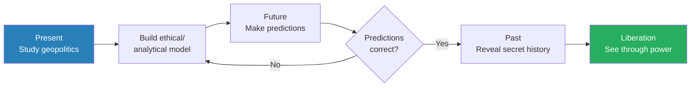
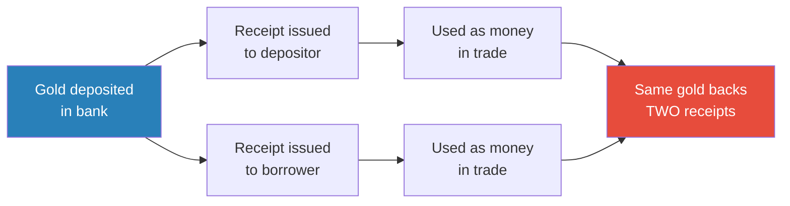
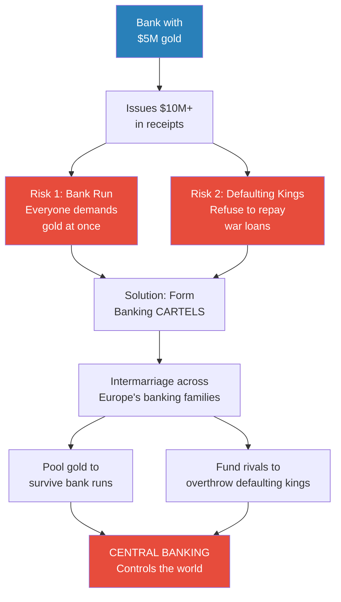
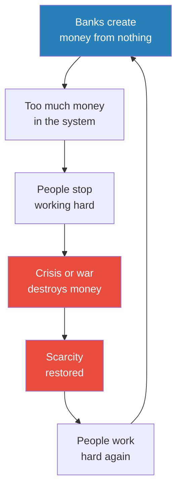
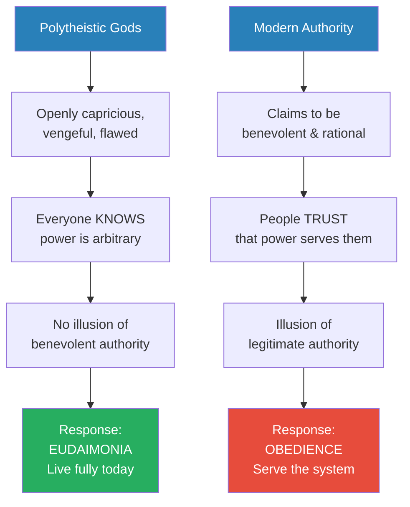
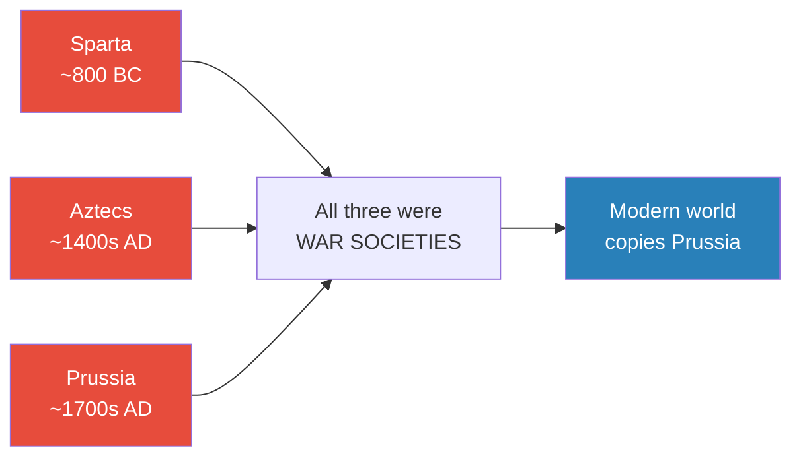
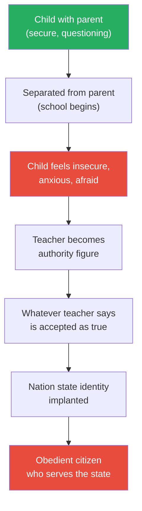
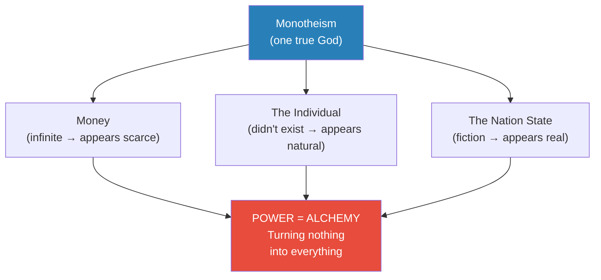
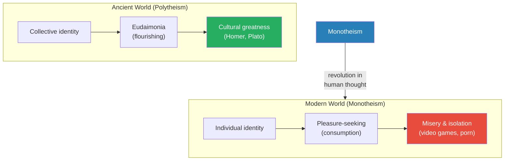

# How Power Works

> Prof. Jiang opens the Secret History series by asking the question that will drive all 28 lectures: how does power work? Through three provocative examples — money, the concept of the individual, and compulsory schooling — he argues that the world we take for granted is an elaborate construction designed to make us work as hard as possible. Money is infinite, not scarce. The individual is an invention, not a natural fact. The nation state is a false memory, not a reality. All three trace back to monotheism, and all three serve the same purpose: turning nothing into everything. Power, he concludes, is alchemy.

---

## Overview: Key Highlights

- <b style="color: #2980b9">Paradigm</b> — a story or model for understanding the world; most paradigms are accepted without examination, and this course exists to dismantle them
- <b style="color: #2980b9">Kant's noumena and phenomena</b> — we can never know objective reality; we only perceive filtered appearances, which means reality is what we imagine it to be
- <b style="color: #27ae60">Money is infinite, not scarce</b> — banks create money from nothing through lending; scarcity is manufactured to make people work
- <b style="color: #e74c3c">Poverty is engineered</b> — it exists not because resources are limited but because the powerful need the illusion of scarcity to incentivise labour
- <b style="color: #2980b9">Central banking</b> — a cartel system originating from merchant intermarriage that controls the world's money supply
- <b style="color: #27ae60">Polytheism is more accurate than modern science</b> — the ancient worldview that denied individual agency actually produced flourishing; the modern one produces slavery
- <b style="color: #2980b9">Eudaimonia</b> — the Greek concept of flourishing: live your best life today because fate is uncontrollable
- <b style="color: #e74c3c">The individual is an invention</b> — for most of human history, identity was collective; individual happiness is a modern pathology that makes collective action impossible
- <b style="color: #e74c3c">School exists to brainwash</b> — compulsory education was invented by war societies (Sparta, Aztecs, Prussia) to implant the nation state into children's minds
- <b style="color: #2980b9">Monotheism</b> — the revolution in human thought that created money, the individual, and the nation state
- <b style="color: #27ae60">Power is alchemy</b> — the capacity to turn nothing into everything: money from a number, identity from a fiction, nationhood from a false memory
- <b style="color: #e74c3c">The system was an accident</b> — not designed by genius conspirators but an accident of the human imagination, which means it can be reimagined

| Concept | One-line summary |
|---------|-----------------|
| **Paradigm** | A story or model for understanding the world — most paradigms are accepted without examination |
| **Noumena / Phenomena** | Kant's distinction: objective reality is unknowable; we only perceive filtered appearances |
| **Alchemy (of power)** | Power's core mechanism: turning nothing into everything — money, identity, nationhood from thin air |
| **Money creation** | Banks create money from nothing through lending — money is infinite, scarcity is manufactured |
| **Central banking** | Cartel system originating from merchant intermarriage — controls the world's money supply |
| **Scarcity illusion** | Poverty and crises are manufactured to make money appear valuable and people willing to work |
| **Eudaimonia** | Greek concept of flourishing — live your best life today because fate is uncontrollable |
| **Polytheism vs. modern science** | Polytheism gave honest powerlessness and collective action; modern science gives false control and isolation |
| **The nation state** | A false memory implanted through compulsory schooling — identity was local before nationalism |
| **Monotheism** | The revolution in human thought that created money, the individual, and the nation state |

---

# The Lecture

## Kant, Paradigms, and the Course Framework [0:00 - 7:38]

*Prof. Jiang opens the very first lecture of the Secret History series with a philosopher, a provocation, and a promise. He introduces Immanuel Kant's distinction between objective reality and perceived reality, defines the word "paradigm" that will recur across all 28 lectures, and lays out the course's three-horizon methodology — present, future, past — designed to reveal the secret history of the world.*

> [!tip] Core Insight
> Reality is what we imagine it to be. If reality is shaped by imagination, then whoever controls the imagination controls reality. That is what power does — and that is what this course will expose.

*The course methodology mirrors the scientific method — build a model, test it against reality, refine it. But the goal is not academic knowledge. The goal is liberation.*

> [!note]- Expand: Full Lecture Detail
> Prof. Jiang greets the class — "Azmain, good morning class. Welcome to our first class" — and immediately sets expectations. This is a class of ideas, and ideas require active participation: "Make it a habit to ask as many questions as possible, because that way you will learn more."
>
> He begins with <b style="color: #2980b9">Immanuel Kant</b>, whom he calls "the greatest philosopher in Western history":
>
> - Kant taught that we can never know objective reality — what he calls the <b style="color: #2980b9">noumena</b>, "the things in themselves"
> - We perceive the world through our senses, which warp reality into a structure we can process — the <b style="color: #2980b9">phenomena</b>, "the things that appear to us"
> - Example: "Time and space do not exist outside of us. Time and space do not exist in reality, but for us to understand reality, we need to add in time and space"
> - The implication: <b style="color: #27ae60">"Reality is what we imagine it to be. There is no objective reality. Life is a constant process, a constant act of imagination"</b>
>
> This is not abstract philosophy for its own sake. Prof. Jiang is laying the groundwork for everything that follows: "What I want to do in this class this semester is train you or teach you or inspire you to augment your imagination so that you see the world much more clearly. This class is not about what to think, it's about how to think."
>
> He then explains the course structure across three time horizons:
>
> - **The Present:** Study geopolitics — "Why is there war in Ukraine? Why is there war in the Middle East?" — and build an ethical and analytical model
> - **The Future:** Use the model to make predictions — "These predictions will tell us if our ethical model is correct or not"
>   - He draws an analogy to artificial intelligence: "How do you know if your artificial intelligence, the model is correct or not? Well, you test it against reality"
> - **The Past:** If the model produces accurate predictions, use it to go back and reveal "the secret history of the world"
>
> The provocation lands: "All the history that you learn in school, all that history that you think you know — it is false. The history that you know, the history that you believe — <b style="color: #e74c3c">it is a system implanted into your brains by powerful people</b>."
>
> He adds a qualifier that gives the project its intellectual honesty: "We will not succeed. We will fail, but the process of trying will train our minds to think much more critically about the world."
>
> > [!quote] Prof. Jiang
> > "If we can figure this out, then you will achieve liberation. You achieve freedom."

---

## How Power Works: Money [7:38 - 16:20]

*Prof. Jiang's first example of how power works is the most concrete. He walks students through a banking thought experiment that starts with a simple deposit scenario and ends with the revelation that banks create money from nothing — a claim so counterintuitive that students cannot accept it even after he demonstrates it.*

> [!tip] Core Insight
> Money is not scarce — it is infinite. Banks create it from nothing through lending. The entire financial system is designed not to distribute wealth but to create the illusion that wealth is limited, so that people will work.

*One pile of gold, two receipts — the bank has created money from nothing. This is not fraud. This is how banking has always worked.*

> [!note]- Expand: Full Lecture Detail
> Prof. Jiang sets up a thought experiment: "I'm a bank. I decide I want to open a bank."
>
> - Students collectively deposit $5 million
> - He promises them 1% interest
> - A friend needs $5 million for a restaurant and will pay 10% interest
> - Prof. Jiang lends out the deposits, pockets the 9% spread
>
> Then he asks: "How much money is in the bank?"
>
> - The logical answer: zero
> - A student pushes back: "You cannot loan all the money that you have" — citing the fractional reserve system
> - Prof. Jiang acknowledges: "Really good point. In economics, you learn about the idea of the fractional reserve system" — perhaps keeping 10%, lending out $4.5 million
> - So the taught answer: roughly $500,000
> - <b style="color: #27ae60">The actual answer: $9.5 million</b>
>
> This makes no sense — until you understand that the bank has created money from nothing. The deposits still exist (the depositors believe they have $5 million). The loan also exists (the borrower has $4.5 million). The same underlying money now appears in two places simultaneously.
>
> > [!example] Chinese Banks: From Nothing to World's Largest (2000s-2020s)
> > - Over the past 20 years, Chinese banks — Bank of China, ICBC, Agricultural Bank of China — became the largest in the world
> > - This did not happen because Chinese people got rich and deposited money
> > - The banks created money from nothing to finance China's infrastructure projects — skyscrapers, roads, railways
> > - "That's what banks are allowed to do. They're allowed to print money, create money out of nothing"
> > **The lesson:** Money creation is not a historical curiosity — it is how the modern global economy operates right now.
>
> Prof. Jiang then traces the historical origin of this system:
>
> - Merchants needed money to facilitate trade — some became wealthy enough to open banks
> - Banks traded in gold — you deposited gold, received a receipt (contract) promising to return gold on demand
> - Receipts were easier to carry than gold — "maybe I'm based in Italy, but now I can go to England and say, listen, I need to buy cotton or bananas from you"
> - The critical moment: when other merchants needed gold, the bank gave them receipts instead
>   - "All I need is a contract in order to go and do trade elsewhere"
>   - The gold never moved — but now two sets of receipts existed for the same gold
>   - <b style="color: #e74c3c">The bank had doubled the money supply from nothing</b>
>
> A student asks: why did people trust money in the first place?
>
> - For most of human history, ordinary people had no need for money — "If you were just a normal person, you were in a village, growing crops. You would trade with someone else"
> - Money was used in specific symbolic circumstances, not daily commerce
> - The most common use: settling debts that could never truly be repaid
>   - "Maybe you and I fight and I kill you. Your family should come and kill me, but that would create a lot of problems. So the way to settle dispute is I would give your family money, because money was symbolically meant to say, I'm sorry I killed you. This is a debt that can never be repaid"
> - Only with the rise of merchant trade did money become functional — "but these merchants all knew each other, so they trusted each other anyway"

---

## Bank Runs, Defaulting Kings, and the Birth of Central Banking [16:20 - 24:00]

*Prof. Jiang reveals the two existential threats to early banking — bank runs and defaulting kings — and shows how merchant families solved both problems by creating cartels through intermarriage, forming the system we now call central banking.*

*The solution to both risks — bank runs and defaulting kings — was the same: collective power through intermarriage. The cartel that emerged is what we now call central banking.*

> [!note]- Expand: Full Lecture Detail
> Prof. Jiang identifies two existential risks to the early banking system:
>
> - **Bank runs:** "The contract says that at any time you want the gold, I must give it to you. But if I have like $100 million in gold contracts, but I only have $10 million in gold, only if 15 million wants the gold back, then I'm screwed"
>   - A <b style="color: #2980b9">bank run</b> destroyed not just the bank's wealth but its reputation — and reputation was everything in a system built on trust
> - **Defaulting kings:** The primary borrowers were not entrepreneurs — "back then, there really weren't entrepreneurs. There were kings and noble people, and what do they do all the time? They need money to fight wars"
>   - Kings could simply refuse to repay: "Screw you, bank. I don't need to pay you back"
>   - The king might also get killed in battle, making the loan irrecoverable
>
> A student asks about forgery — Prof. Jiang acknowledges it but says it was not the primary risk at this stage: "The answer is that they all knew each other anyway. It's a very small circle."
>
> The solution to both risks was the same — <b style="color: #2980b9">cartels</b>:
>
> - Banks formed partnerships established through intermarriage across Europe
> - "Maybe this bank works with a little bank works with a little bank throughout Europe, and the way they establish these cartels is usually through intermarriage"
> - If one bank faced a run, partner banks could supply gold temporarily — pooling resources across the cartel
> - If a king refused to repay: "Your bank works with other banks to establish a new enemy, to kill the king to get the money back"
> - This system is what we now call <b style="color: #2980b9">central banking</b>
>
> Prof. Jiang delivers the key conclusion: "What's really important about this system is that it's based on power. And what power is — you can turn nothing, money, the contract, into everything. That's what money is."
>
> > [!quote] Prof. Jiang
> > "What you will learn in this class is central banking controls the world today."

---

## The Scarcity Illusion [24:00 - 30:36]

*Prof. Jiang reaches the argument that students find hardest to accept — and their resistance itself becomes his evidence. If banks can create money from nothing, why does poverty exist? The students instinctively answer "scarcity," proving they have been brainwashed into believing the very illusion the system requires.*

*The scarcity machine is self-perpetuating: banks create money, crises destroy it, and the cycle ensures that labour never stops.*

> [!note]- Expand: Full Lecture Detail
> Prof. Jiang poses the question: "If the banks can print as much money as possible, why do we have poverty?"
>
> - The students' instinctive answer: scarcity — there are limited resources
> - Prof. Jiang's response: "I just spent the past 10-20 minutes explaining to you it's not scarce, it's infinite. It's just a number we can at any time print out as much money as we need. And what I say to you, you still believe this?"
> - He repeats for emphasis: "You have to get that out of your head. Money is not scarce, it is infinite"
>
> A student gets close to the answer — "The one who has the power don't want everyone to share the same" — and Prof. Jiang confirms:
>
> - <b style="color: #e74c3c">"The point of printing money is not to give you money. The point of printing money is to create the illusion that money is valuable, and therefore you work hard in order to obtain it"</b>
> - "But in order for me to make you want to get money, I need to create artificial misery"
> - "If there weren't poor people, you wouldn't want to be rich"
> - "What do your parents tell you? Work hard in school, make a lot of money, otherwise you're going to end up like a poor person. Well, guess what? If there's no poor people, your parents couldn't say that to you"
> - <b style="color: #27ae60">"Poverty isn't what you do to yourself — it is what the powerful do to you"</b>
>
> Prof. Jiang extends the framework to economic crises and wars:
>
> - **Economic crises** (stock market crashes, recessions): "The point of crises is to destroy money. Why do we need to destroy money? Because if there's too much money in the system, people don't have to work"
> - **Wars:** "War is meant to destroy wealth in order to make you think money is valuable"
> - The real value is not money — <b style="color: #27ae60">"the real value is the work we do. Money merely incentivises you to work hard"</b>
>
> > [!example] The World of Warcraft Analogy
> > - Prof. Jiang asks students who play online games to consider the parallel
> > - In World of Warcraft, players work hard to earn credits and buy virtual goods
> > - The game developers could programme the engine to rain money from the sky — credits are infinite
> > - But if they did, no one would play — "you wouldn't do nothing every day. You wouldn't play the game"
> > - "It's only because you believe that there's scarcity in the world and that you must work hard to obtain wealth that you do any work"
> > **The lesson:** We are playing a game whose designers have infinite resources but deliberately withhold them to keep us playing.
>
> A student (Speaker 4) raises the strongest objection: food and land ARE finite — "scarcity still exists in other resources." Prof. Jiang takes it seriously:
>
> - "Go to the garbage dump anywhere in Beijing and see the amount of food that is wasted every single day"
> - "If you just do the mathematics, what you will discover is there's enough food to feed everyone"
> - "There doesn't have to be hunger and starvation. It's an artificial crisis"
> - He acknowledges: "You're right in that, yeah, food's not infinite, but it's abundant. There's a lot of it, enough to feed people"
> - He concedes the students cannot accept this yet: "You guys are stuck in the scarcity mindset, and it's very convincing"
> - He promises to return with more evidence: "Let's move on. This is something that we'll go back to later on"

---

## How Power Works: The Individual and Happiness [30:36 - 36:22]

*Prof. Jiang's second example is the most philosophically ambitious. He asks students what makes them happy, notes that every answer is about individual happiness, and argues that the very concept of being an individual is a recent invention designed to make people powerless. For most of human history, happiness meant collective well-being.*

> [!tip] Core Insight
> The concept of the individual is new — perhaps 500 years old at most. For most of human history, the worst punishment was not death but exile, because a person without a community was not a person at all. Individual happiness is the modern aberration, not the ancient norm.

> [!note]- Expand: Full Lecture Detail
> Prof. Jiang asks his students: "What makes you happy? How can you live a happy life?"
>
> Their answers are revealing:
> - Money, power, freedom, relationships, love, video games, vacations
>
> He notes that every answer on the list is about <b style="color: #e74c3c">individual happiness</b> — "and this is actually unique in human history":
>
> - "If you look back in time to 500 years ago and you ask people, how can you be happy? They would focus more on collective happiness"
> - "If your community were not happy, you cannot be happy"
> - "Throughout most of human history, happiness meant helping others, being generous to others"
>
> > [!example] The Ancient Feast Tradition
> > - Throughout most of human history, if someone suddenly became wealthy, the first thing they did was hold a feast for the entire community
> > - "What mattered was your reputation within the community. What mattered was just your generosity"
> > - This was true across cultures — including Chinese villages: "If you come from a Chinese village, come to Beijing, open a restaurant, make a lot of money, go to a village. What's the first thing you do? You have a big feast for everyone"
> > - Modern instinct: "Put it underground or put it in the bank" — Prof. Jiang calls this the aberration
> > - "This is ingrained in us, but today we believe if you got a lot of money, put it underground or put in the bank"
> > **The lesson:** Individual accumulation is a modern pathology. For most of human history, wealth was meaningful only when shared.
>
> A student asks: isn't the feast about individual reputation? Prof. Jiang's response is firm:
>
> - "The individual, the concept of individual, did not exist before. We just created it"
> - "The idea that I'm a person, independent of my family, independent of my community, independent of the world around me — makes no sense"
> - The worst punishment was not death — it was <b style="color: #e74c3c">exile</b>, banishment from the community
> - "Today, if I killed you, the police would come catch me and kill me. But before, we didn't do that, because the worst thing that we could do was exile you"
> - This proves the individual had no independent existence — to be separated from the group was worse than dying

---

## Two Worldviews: Polytheism vs. Modern Science [36:22 - 44:00]

*This is the most counterintuitive argument in the lecture — and the one Prof. Jiang seems most passionate about. He presents two models of reality and asks students to choose. They choose what they have been taught. He tells them they are wrong.*

```mermaid
flowchart TB
    subgraph P["Polytheism (Worldview 1)"]
        P1["Gods control fate"] --> P2["No individual agency"]
        P2 --> P3["Eudaimonia:<br/>live your best today"]
        P3 --> P4["Collective action<br/>possible"]
        P4 --> P5["Flourishing"]
    end
    subgraph M["Modern Science (Worldview 2)"]
        M1["Synapses control fate"] --> M2["Full individual agency"]
        M2 --> M3["Individual responsibility<br/>for all problems"]
        M3 --> M4["No collective action<br/>possible"]
        M4 --> M5["Isolation & slavery"]
    end
    style P5 fill:#27ae60,color:#fff
    style M5 fill:#e74c3c,color:#fff
```

*The worldview that appears to give you control actually takes it away. The one that appears to make you powerless actually inspires you to flourish.*

> [!note]- Expand: Full Lecture Detail
> Prof. Jiang presents two competing worldviews and asks which is more accurate:
>
> **Worldview 1 — Polytheism:**
> - "We humans don't have agency. We don't have really control. Because there are powerful gods out there"
> - The gods (Apollo, Dionysus) are themselves controlled by more powerful forces (fate, fortune)
> - Even these forces are governed by ancient structural principles (anger, pride)
> - "You absolutely have no individual agency, because there's always a god screwing with you"
> - "You might get rich, but then the God of pride looks at you and says, no, no, no, I need to teach this mortal a lesson. So the God comes into me, makes me too arrogant, and I screw up"
>
> **Worldview 2 — Modern Science:**
> - "We are synapses that generate memories. We are memories"
> - Understanding comes from experience, controlled by DNA and environment
> - "We can now have control over our own individual fate"
> - "If you're angry, it's because some experience or some genes made you angry, and if you do proper therapy, if you do proper reflection, you can better control your anger"
>
> Prof. Jiang asks: "Which worldview is a more accurate reflection of reality?"
>
> The students choose Worldview 2 — "Obviously, because this is neuroscience."
>
> <b style="color: #27ae60">Prof. Jiang tells them they are wrong: "It is the first one that is more accurate reflection of reality. The first one gives you more information, gives you a more accurate assessment of how the world really works."</b>
>
> He then identifies three reasons the powerful prefer Worldview 2:
>
> 1. **Individual responsibility = easier control**
>    - A student identifies this: "The idea of individual responsibility — there's more control. It's easier to control people in the system"
>
> 2. **You work harder**
>    - "In the first system, you're like, I don't need to go make a lot of money, because if I make a lot of money, the gods will punish me and make me proud. So I'm just gonna enjoy life and take it easy"
>    - "In the second system, no, no, I have control over my own life, so I need to work hard"
>    - "The entire point of the system is to make you work as hard as possible. Because when you work hard, that generates real wealth for the powerful people"
>
> 3. **You cannot take collective action**
>    - <b style="color: #e74c3c">"The problem with number two is you are incapable of collective action, because you think all the source of your problems is the individual in you, and not society"</b>
>    - "Number one, you are capable of collective action, and the only way to change the world is through collective action"
>    - "Number two is designed to make you think the source of all your problems is within you. So you should ignore what other people do and think"
>    - Result: "You feel really miserable. What you will do is play video games or watch porn all day. And that's what's happening in society today"
>
> A student (Speaker 5) pushes back: shouldn't we listen to others' perspectives? Prof. Jiang turns the question around: in Worldview 2, who has authority? "Scientists, because this system was created by scientists to trick you."
>
> > [!example] The Psychiatry Trap
> > - Prof. Jiang asks students: if you feel sad and depressed, what have you been taught to do?
> > - Students answer: talk to a psychiatrist
> > - Prof. Jiang's counter: "If you're feeling sad and you are feeling depressed and you feel you have to talk to a psychiatrist, and you do so, I will make you a bet that the psychiatrist will make it a lot worse"
> > - "The system is not designed to cure you of any problems. The system is to make you dependent on authority"
> > - The simple remedies — walking, exercise, talking to a friend — actually work, but they do not create dependency
> > - "The system teaches you: no, you feel sad, go talk to a psychiatrist. We'll give you drugs. It's designed to make you dependent on authority"
> > **The lesson:** The modern mental health system does not liberate — it creates dependency on the very authority structures it claims to stand apart from.

---

## The Gods, Hubris, and Eudaimonia [44:00 - 51:30]

*A student asks the sharpest question of the lecture: aren't the gods in Worldview 1 also authority figures? Prof. Jiang's answer reveals the critical distinction between ancient and modern power — and introduces eudaimonia, the concept of flourishing that the modern world has lost.*

*The ancient world's honesty about power's arbitrary nature produced flourishing. The modern world's claim that authority is benevolent produces obedience.*

> [!note]- Expand: Full Lecture Detail
> A student (Speaker 4) raises a sharp objection: "In scenario one, wouldn't God also be an authority? God will also be authority?"
>
> Prof. Jiang calls this "actually a great question" and reveals a critical distinction:
>
> - "The gods in number one, the polytheistic system — they fight all the time. They're vengeful, they're angry, they're proud"
> - "But because they're gods, they can get away with it, and that's the difference between humans and gods"
> - Gods can do <b style="color: #2980b9">hubris</b> — the fatal overreach. "We cannot do hubris"
> - "The idea that the people in power are benevolent, that they are authority figures who are after our best interest — <b style="color: #e74c3c">that is a new, modern concept</b>"
> - "Before, it was assumed that the king is a king. Why? Because he's favoured by the gods. It's not because he's a good person. It's not because he's a just ruler. It's just because the gods like him for whatever reason"
> - "But guess what — the gods give and the gods take. Maybe today, the king will rule us, but maybe five years from now, he gets unlucky and the gods kill him"
>
> This leads to <b style="color: #2980b9">eudaimonia</b> — flourishing:
>
> - "If you have no control over your fate, if things can happen to you tomorrow that kill you, then live your life to the best of your ability today"
> - "Seize the day, be the best that you can be today, and that's how you win favour from the gods"
> - This inspired the Greeks to produce Homer, Plato, Aeschylus, Euripides — cultural achievements Prof. Jiang considers superior to anything the modern world has produced
>
> The contrast with modernity:
>
> - The ancients had eudaimonia — <b style="color: #27ae60">flourishing</b>
> - The moderns have pleasure — hedonic consumption
> - "Rather than flourish as creative people, we're like: how do I enjoy my life today? How do I not feel sad?"
> - "In the first system, even though it sounds like we have no control, we have no agency, but it inspires us to live to the best of our ability. The second system — we're like, oh, you have control, complete control, over your life. It enslaves us."
>
> > [!abstract] Theory Evaluation: Which Worldview Serves Humanity Better?
> > | Dimension | Polytheism | Modern Science |
> > |-----------|-----------|----------------|
> > | Agency | None — gods decide | Full — you decide |
> > | Response to adversity | Accept fate, live fully | Fix yourself through therapy |
> > | Collective action | Possible — problems are external | Impossible — problems are internal |
> > | Cultural output | Homer, Plato, Aeschylus | Video games, pornography |
> > | Power's preference | Disfavoured — harder to control | Favoured — easier to control |
> > | Life philosophy | Eudaimonia (flourishing) | Pleasure (consumption) |
> > | Prof. Jiang's verdict | More accurate | More enslaving |
>
> > [!quote] Prof. Jiang
> > "The ancients, the Greeks — they were superior to us."

---

## How Power Works: School and the Nation State [51:30 - 59:00]

*The third example hits closest to the students' lived experience. Prof. Jiang asks why schools exist, walks students through the apprenticeship thought experiment, and reveals that only three societies in all of human history introduced compulsory education — and all three were war societies.*

*Of thousands of ancient societies, only three adopted compulsory education — and all three existed primarily to wage war. The rest refused to copy them, because they understood what school actually does.*

> [!note]- Expand: Full Lecture Detail
> Prof. Jiang asks his students why they are in school. Their answers:
>
> - To learn
> - To get a degree
> - Knowledge
>
> One student (Speaker 3) cuts through: "A chance to brainwash the students."
>
> Prof. Jiang confirms: <b style="color: #27ae60">"The correct answer is brainwashing. Everything else is a lie."</b>
>
> He first demolishes the idea that school teaches learning through a thought experiment:
>
> > [!example] The Two Paths to Becoming a Doctor
> > - A 12-year-old wants to become a doctor. Two paths are available:
> > - **Path 1 (Apprenticeship):** Placed in a hospital for 10 years. First year: washing floors. Observing the doctor. Gradually learning to treat patients under mentorship
> > - **Path 2 (School):** Harvard undergraduate, then Harvard Medical School — the best institutions in the world
> > - At age 30, who is the better doctor? "Obviously the first one, because the second person did not ever work in a hospital"
> > - In the apprenticeship system, anyone can become a doctor — "We human beings are all born with the capacity to learn anything"
> > - The school system creates artificial hierarchies: "Smart students go to good schools and good universities, and they get good jobs. Stupid students go wash dishes"
> > - "That was not true for most of human history"
> > **The lesson:** School does not teach you how to learn. It teaches you your place in a hierarchy that serves power.
>
> Prof. Jiang then names the only three societies that introduced mandatory, free, compulsory education:
>
> - **Sparta:** "One of thousands of city states in Greece, the only society of all these thousands that had compulsory education." Children entered at age 5-6, were beaten by older children. "Sparta was first and foremost engaged in war making"
> - **The Aztecs:** "The greatest war society in Central America before the arrival of the Europeans. They defeated everyone. They also did a lot of human sacrifice. They also provided free compulsory education to all its children"
> - **Prussia:** "The greatest military in Europe for centuries. They were engaged in war making as well"
>
> The critical question is not why these three had schools — but why nobody else copied them:
>
> - "What's the worst thing that could happen in your life? Your child is taken away from you"
> - <b style="color: #e74c3c">"School is designed to take your child away from you"</b>
> - "If school is about learning, why don't parents and children go to school together?"

---

## The Brainwashing Mechanism [59:00 - 1:05:00]

*Prof. Jiang explains exactly how school brainwashes — through the mechanism of separation, insecurity, and dependency on authority — and reveals what the brainwashing implants: the concept of the nation state.*

> [!tip] Core Insight
> School does not exist to teach knowledge. It exists to implant the concept of the nation state — a false identity that makes citizens obedient and willing to fight, sacrifice, and die for an imagined entity. The mechanism works because school separates children from the security of their parents, making them dependent on institutional authority.

*The mechanism is separation, insecurity, dependency. A child with a parent present feels safe enough to question authority. Remove the parent, and the child accepts whatever the authority figure says.*

> [!note]- Expand: Full Lecture Detail
> Prof. Jiang walks through the brainwashing mechanism step by step:
>
> - "If you're with your parent, are you brainwashed? No, because you feel loved, you feel secure. Your parent's gonna protect you"
> - "You say to your parent, hey, is this teacher lying to me? And the parent says, yeah, he's lying to you"
> - "It's only because you've been taken away from your parent that you are now willing to be brainwashed"
> - "What happens if you leave your parents? How do you feel? Insecure, you're anxious, you're afraid"
> - "You've lost your parent, you're four, you're five, you're six years old. So who do you trust? Your teacher. Whatever your teacher says is now correct"
>
> A student asks: "Aren't our parents brainwashed as well?" Prof. Jiang agrees — "Your parents are brainwashed" — but adds a crucial qualification:
>
> - "When a parent is with a child, the child feels secure, and if you're secure, you're much more willing to disobey authority, you're much more willing to ask questions, you're much more willing to think for yourself"
>
> Another student asks the obvious: "Are you brainwashing us?"
>
> - Prof. Jiang: "That's a good question, and it's a fair question"
> - His class is pass/fail — no grades, no ranking, no consequences for disagreement
> - "You have the capacity to ask me questions. You have the capacity to challenge me. You have the capacity to think for yourself"
> - "All I'm saying is, hear me out, ask me questions, and then think for yourself"
> - The difference: "In school, guess what happens if you don't come to school? Your parents get arrested"
>
> Then Prof. Jiang reveals what the brainwashing implants — the <b style="color: #2980b9">nation state</b>:
>
> - "The school is designed to brainwash you to think the nation state exists. It is a person. Mother China. You must love this person. You must be willing to sacrifice yourself for this person"
> - "How do we brainwash you? We teach you language. We teach you history. We teach you geography"
> - "Throughout most of human history, it was absurd to think the nation state existed. Before, you didn't say I'm Chinese. Before, you say I'm from Beijing, or I'm from Haidian, or I'm from Chaoyang"
> - "Now, because of the nation state, you are forced to believe that you are the same person as someone from Yunnan, Tibet, Guangxi — even though you have absolutely nothing in common"
> - <b style="color: #e74c3c">"History is the false memory of a nation state"</b>
>
> Prof. Jiang is careful to note this is universal: "All countries are nation states. I'm not saying China is different from other places. China is exactly the same as other places."
>
> A student (Speaker 3) adds another dimension: school is also designed "to just think about degrees and work as a normal person, not to create a legal business or personal" — in other words, to serve the nation state rather than pursue independent ambitions. Prof. Jiang agrees: "The point of school is to serve the nation state."
>
> > [!quote] Prof. Jiang
> > "History is the false memory of a nation state."

---

## The Source: Monotheism and Power as Alchemy [1:05:00 - end]

*In the final minutes of the lecture, Prof. Jiang reveals the thread that connects all three examples — monotheism — and introduces the metaphor that will define the entire series: power is alchemy, the capacity to turn nothing into everything.*

*All three constructs trace back to a single revolution in human thought: monotheism. The semester will show exactly how this happened.*

*The transition from polytheism to monotheism was not progress — it was a catastrophic narrowing of the human imagination that traded flourishing for slavery.*

> [!note]- Expand: Full Lecture Detail
> Prof. Jiang ties the three examples together:
>
> - "The three things that we learned — money, the individual, the nation state — these are all ideas and concepts beyond the human experience"
> - "If you try to work this out from first principles, you try to figure this out by yourself, you couldn't do it. You have to be brainwashed into believing these three things"
> - "If someone from the past, maybe 1,000 years ago, were to come today, you would explain the concept of money, individual, and nation state, and the person would be like: wait a minute here — this means that you're all slaves"
>
> The source of all three: <b style="color: #2980b9">monotheism</b> — the idea of one true God:
>
> - "What you will learn in this class is these three concepts come from a revolution in human thought called monotheism, the one true God"
> - "This idea — monotheism — forever changed the course of human history, and it gave us these concepts of money, individual, and nation state"
> - The three great monotheistic religions (Judaism, Christianity, Islam) are, in Prof. Jiang's framing, "basically the same religion"
> - "Monotheism is such a powerful idea that it turned nothing into everything"
>
> Prof. Jiang then introduces the metaphor that will define the entire series — <b style="color: #2980b9">alchemy</b>:
>
> - "Throughout human history, alchemy was the pursuit of turning lead into gold — nothing into everything"
> - "In science class, you're taught that alchemy is this fake science, a pseudo science, and it did not work"
> - <b style="color: #27ae60">"What you will learn in this class is — we achieved alchemy. We turn nothing into everything. That's what power is"</b>
>
> Power is the capacity to turn nothing into everything:
> - Money is nothing — a number, a receipt — yet it controls behaviour
> - The individual is nothing — it did not exist for most of human history — yet it defines modern identity
> - The nation state is nothing — an imagined entity — yet people die for it
>
> Prof. Jiang makes a crucial qualifier: this system was not designed by genius conspirators:
>
> - "This was an accident. It's an accident of the human imagination. It's because we didn't know what we were doing that we created this system"
> - Because it was accidental, it is not inevitable: "You're able to control the human imagination. You can use it to create a new system that allows for eudaimonia, or the flourishing of the human intellect"
>
> The result of money, individualism, and the nation state:
>
> - "Today, we live extremely miserable lives. You've been taught to think that life just gets better and better. What you will learn in this class is — actually, nope"
> - But hope remains: the human imagination that created this system can also create a new one — one built around eudaimonia rather than manufactured misery

---

## Connections

**Builds on:** Nothing — this is the opening lecture of the Secret History series

**Sets up:** [[02 - How Societies Collapse]] (mechanisms of power will be shown in action), [[03 - Death by Gerontocracy]] (the individual and collective action themes deepen), [[04 - How Evil Triumphs]] (power's alchemy applied to moral systems), [[05 - The Birth of Evil]] (monotheism's origins explored in depth)

**Related books in vault:** [[Sapiens - Yuval Noah Harari]] (money as fiction, imagined orders, agricultural revolution), [[The 48 Laws of Power - Robert Greene]] (interpersonal power mechanics — Prof. Jiang operates at the structural/civilisational level)

---

## The Takeaway

This opening lecture is not really about money, or happiness, or school. It is about the architecture of the invisible — the structures so deeply embedded in daily life that we cannot see them, let alone question them. Prof. Jiang's project for the semester is to make these structures visible: to show that money is a trick, the individual is an invention, and the nation state is a hallucination, and that all three trace back to a single revolution in human thought called monotheism. Whether you agree with him or not, the provocation works — by the end of the lecture, the students are no longer certain about things they were certain about an hour ago.

The most counterintuitive claim is the one about polytheism. Every student in the room — trained in the modern paradigm — instinctively chose the scientific worldview as more accurate. Prof. Jiang's argument that the ancient Greek worldview produced greater cultural achievement and more genuine freedom is not easy to dismiss, because the mechanism he identifies is real: if you believe all problems are internal, you will never organise to change external conditions. The atomisation of modern life — the loneliness epidemic, the retreat into screens, the collapse of collective institutions — is exactly what you would predict from a worldview that locates all agency and all responsibility inside the isolated individual.

What remains to be seen is whether the semester delivers on the promise. Prof. Jiang has laid out the framework — power is alchemy, monotheism is the source, liberation comes through understanding — but the evidence is still to come. The students have been told that everything they believe is wrong. The next 27 lectures will need to show them why. The Kantian foundation is important here: if reality is what we imagine it to be, then the structures of power are not laws of nature — they are acts of imagination that can be reimagined. That is both the most radical and the most hopeful claim in the entire lecture.
