# How Societies Collapse

> Prof. Jiang asks the foundational question of the Secret History series: why do societies rise and why do they fall? He presents three academic theories — Thomas Piketty's financialization, Peter Turchin's elite overproduction, and Oswald Spengler's civilizational life cycle — then synthesises them into a single structural model of power. At the core of every society sit a handful of founding families who control everything through three pillars: finance, religion, and intelligence. When the society is young, these families govern through consent and openness. But as elite children multiply and compete for limited positions of power, the system shifts from consent to deception to coercion — and collapse, when it comes, is sudden.

---

## Overview: Key Highlights

- <b style="color: #2980b9">Financialization (Thomas Piketty)</b> — capitalism naturally transitions from consumer capitalism to financial capitalism to monopoly capitalism, hollowing out real wealth creation
- <b style="color: #27ae60">The real economy grows at 2%, the financial economy at 5%</b> — this gap is the mathematical engine of late-stage capitalist decline
- <b style="color: #2980b9">Elite overproduction (Peter Turchin)</b> — too many children of powerful families competing for limited positions of power inevitably leads to war or revolution
- <b style="color: #e74c3c">The Rat Utopia experiments proved abundance does not create peace</b> — when there is no exit, status competition becomes lethal
- <b style="color: #2980b9">Civilizational life cycle (Oswald Spengler)</b> — societies age like organisms through village, town, city, and mega city — then die
- <b style="color: #27ae60">Abstraction is the slow poison</b> — as civilizations mature, people become increasingly removed from reality, and money replaces trust
- <b style="color: #2980b9">Three pillars of power</b> — finance, religion, and intelligence are how founding families control society through institutions
- <b style="color: #e74c3c">Consent to deception to coercion</b> — the moral trajectory of every society from rise through decline to collapse
- <b style="color: #27ae60">Democracy is not a political system but a phase of development</b> — 1950s America and China were both open societies despite opposite political structures
- <b style="color: #e74c3c">Collapse is sudden, not gradual</b> — a perfect storm of simultaneous crises hits a society that has silenced the very critics who would have prepared it
- <b style="color: #2980b9">Five predictions for the Western world</b> — decline of democracy, economic collapse, immigration, civil conflict, and stupid foreign wars within 5-20 years
- <b style="color: #27ae60">Understanding power requires setting aside morality</b> — Prof. Jiang insists this course is about how power works, not how we wish it worked

| Concept | One-line summary |
|---------|-----------------|
| **Financialization** | Capitalism's natural transition from creating goods to speculating on money to monopoly domination |
| **Elite overproduction** | Too many powerful people's children competing for limited positions of power |
| **Civilizational life cycle** | Societies age like organisms — village, town, city, mega city, death |
| **Rat Utopia** | Calhoun's experiments proving abundance leads to lethal status competition when there is no exit |
| **Three pillars of power** | Finance, religion, and intelligence — how founding families control everything |
| **Abstraction** | Increasing removal from reality as civilizations mature — the mega city's fatal characteristic |
| **Rent-seeking behaviour** | Extracting wealth through positional power rather than productive work |
| **Consent / Deception / Coercion** | The moral trajectory of a society from rise to decline to collapse |
| **Perfect storm** | Simultaneous crises that trigger sudden collapse after slow decline |
| **Bailan / Quiet quitting** | Cultural symptoms of decline — refusal to take work seriously in China and America |

---

# The Lecture

## Signs of a World in Decline [0:01 - 6:04]

*Prof. Jiang opens by reviewing Lecture 1's key ideas — monotheism, money, the individual, and the nation state — then asks students to name the signs of decline they see around them. The class produces a long and sobering list that covers everything from wars to birth rates to mental health.*

> [!tip] Core Insight
> The signs of decline are not isolated problems — they are symptoms of a single structural process. Wars, falling birth rates, rising debt, declining trust, and mental health crises are all manifestations of the same underlying dynamic.

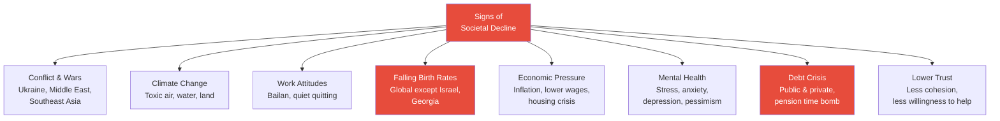
*Prof. Jiang deliberately builds an exhaustive catalogue of decline before offering any theory — he wants students to feel the weight of the evidence before hearing explanations.*

> [!note]- Expand: Full Lecture Detail
> Prof. Jiang begins with a quick review of Lecture 1. Last class covered <b style="color: #2980b9">monotheism</b> — the idea of one true God — which he described as an intellectual revolution in human history. From monotheism came three new ideas: money, the individual, and the nation state. These ideas had always existed, but monotheism made them the dominant paradigms, and together they gave us modernity. He reminds the class that modernity brought both benefits and consequences.
>
> He then frames the lecture's central question: "Today, I want to focus on a very specific question — why do societies rise and why do they fall?" He acknowledges that the first few classes may feel abstract and theoretical, but reassures them: "We are developing the ethical models in order to better understand our world. As we move on, we'll start looking at very concrete examples."
>
> Prof. Jiang turns to the class and asks them to shout out signs that the world is in decline. The students respond, and he builds on each answer:
>
> - <b style="color: #e74c3c">Conflict and wars</b> — Ukraine, the Middle East, conflicts arising in Southeast Asia (Thailand, Myanmar), and Trump preparing to send troops to Mexico and Venezuela
> - **Climate change** — too much pressure on the environment; air, water, and land becoming more toxic
> - **Declining work attitudes** — people are not as enthusiastic or motivated as before. In China this is the <b style="color: #2980b9">bailan</b> age ("let it rot — who cares, don't take things too seriously"). In America, the equivalent is <b style="color: #2980b9">quiet quitting</b> — pretending to work without really working
> - <b style="color: #e74c3c">Falling birth rates</b> — "If young people refuse to get married and have babies, eventually the world is going to die off." This is happening across nearly every society; the only exceptions are Israel and Georgia
> - **Lower standard of living** — inflation means people earn less and can afford less; prices rise while wages fall
> - **Health and mental health** — rising diabetes, high blood pressure, stress, anxiety, depression, and emotional exhaustion
> - **Greater pessimism** — people are less optimistic about the future
> - <b style="color: #e74c3c">Debt</b> — both public and private. Many governments face fiscal crisis (spending more than tax revenue). Many families throughout the world are heavily indebted
> - **Lower cohesion and trust** — "People no longer trust each other as they did before. If you see a man on the street bleeding or hurt, you're less likely to help him"
> - **Increasing disease** — people are less healthy than before
> - **Immigration** — a huge issue in the Western world that "reduces cohesion and the standard of living"
> - **Housing unaffordability** — young people can no longer afford to buy a house, in China and throughout the world
> - **Fiscal crisis** — governments may not be able to fund pensions in 5-10 years
>
> Prof. Jiang then flips the lens: the signs of a society on the rise are simply the opposite — trust, savings, health, optimism, high birth rates, employment, people invested in their work and each other.
>
> > [!quote] Prof. Jiang
> > "These first few classes may seem abstract and theoretical, but we are developing the ethical models in order to better understand our world."

---

## Theory 1: Financialization — Why Capitalism Eats Itself [6:04 - 16:02]

*Prof. Jiang introduces Thomas Piketty's theory that capitalism naturally transitions through three phases — consumer, financial, and monopoly — each less productive than the last. The mathematical proof is devastating: the financial economy grows at 5% while the real economy grows at only 2%, making speculation permanently more attractive than real work.*

> [!tip] Core Insight
> Wealth and money are not the same thing. Consumer capitalism generates wealth — real goods, real jobs, real value. Financial capitalism generates money — numbers that grow faster than the economy they represent. When money grows faster than wealth, the system is eating itself.

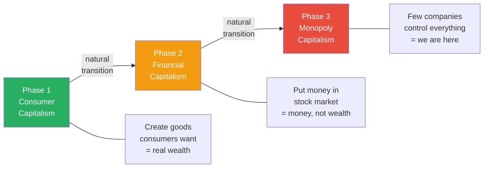
*Capitalism transitions naturally from wealth creation to money creation to monopolistic domination — each phase is less productive than the last. Prof. Jiang is clear: "We live in an era of monopoly capitalism."*

> [!note]- Expand: Full Lecture Detail
> Prof. Jiang introduces the first of three theories: <b style="color: #2980b9">financialization</b>, proposed by French economist <b style="color: #2980b9">Thomas Piketty</b> in his book *Capital in the Twenty-First Century*. Prof. Jiang recommends it as "a very easy but very illuminating read."
>
> He explains Piketty's argument that capitalism transitions through three phases:
>
> - **Consumer capitalism** — "What the society is trying to do is create goods that consumers want to buy. This is an era of rapid wealth generation"
> - **Financial capitalism** — "Rather than build factories, you put the money into the stock market. You're trying to generate as much money as possible." He reminds the class of Lecture 1's key distinction: "Wealth and money are not the same thing. In consumer capitalism, you focus on the generation of wealth. In financial capitalism, you focus on the generation of money"
> - **Monopoly capitalism** — "Just a few companies control everything. This happens because it is much more profitable for companies to be monopolies than to be in competition with each other"
>
> Prof. Jiang then reveals the mathematical engine behind this process. Piketty spent years going through income tax records across centuries, doing extensive statistical analysis, and discovered a devastating gap:
>
> - <b style="color: #27ae60">The real economy in late-stage capitalism grows at approximately 2%</b>
> - <b style="color: #27ae60">The financial economy grows at approximately 5%</b>
>
> He makes this concrete with a thought experiment:
>
> > [!example] The Million Dollar Choice
> > - You have one million dollars and want to maximise your returns
> > - Option A: open a restaurant — you will make at most $20,000 per year (2% return)
> > - Option B: invest in the stock market — you will make $50,000 per year (5% return)
> > - Every rational person chooses Option B
> > - But if everyone chooses Option B, nobody is building restaurants, hiring workers, or creating real wealth
> > - The stock market inflates while the real economy stagnates
> > - The result: "Greater unemployment, greater debt. No one's really working"
> > **The lesson:** Individual rationality produces collective catastrophe. When speculation permanently outpays production, no one will produce.
>
> Prof. Jiang emphasises Piketty's conclusion: <b style="color: #e74c3c">"This is just a natural cycle. This is just a natural byproduct of capitalism."</b> It is not a policy failure or a moral failing — it is structural. "We live in an age of late-stage capitalism."

---

## Theory 2: Elite Overproduction and the Rat Utopia [16:02 - 25:40]

*Prof. Jiang introduces Peter Turchin's theory through one of the most disturbing experiments in behavioural science — James Calhoun's Rat Utopia, where rats in a world of perfect abundance always ended up killing each other. The reason: status, not resources, is what drives lethal competition. When there is no exit and no frontier, status becomes a zero-sum game that ends in destruction.*

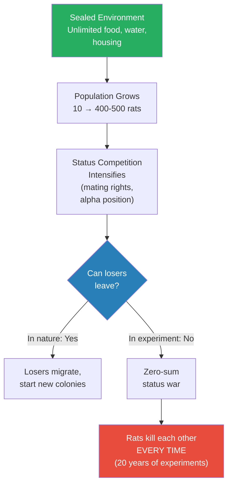
*The critical variable is not abundance but exit. When losing competitors have somewhere to go, conflict remains manageable. When there is no exit, status competition escalates to total destruction — every single time, across twenty years of experiments.*

> [!note]- Expand: Full Lecture Detail
> Prof. Jiang introduces the second theory: <b style="color: #2980b9">elite overproduction</b>, proposed by historian <b style="color: #2980b9">Peter Turchin</b>, who spent decades studying why societies rise and fall. Turchin examined the Roman Empire, the French Revolution, and many other cases, and concluded that societies collapse because too many powerful people's children compete for limited positions of power.
>
> But before explaining Turchin directly, Prof. Jiang takes a detour into the <b style="color: #2980b9">Rat Utopia</b> experiments.
>
> > [!example] The Rat Utopia Experiments (James B. Calhoun, 1950s-1970s)
> > - American scientist James B. Calhoun wanted to understand what living in a world of abundance and security would mean for society after World War II
> > - He created sealed rooms stocked with food, water, and housing for colonies of rats — starting with about 10, growing to 400-500
> > - At first the rats were really happy — well-fed, safe, thriving
> > - But no matter how Calhoun configured the experiment, the outcome was always the same: the rats ended up killing each other
> > - He ran these experiments for over twenty years and could never create peaceful coexistence
> > - Even today, there is a huge debate as to why this happens
> > - The theory: the rats were not competing for food — they were competing for status (mating rights, alpha male position)
> > - In nature, losing males would simply leave and start new colonies elsewhere
> > - In the sealed room, there was nowhere to go — status became a zero-sum game ("I win, you lose")
> > **The lesson:** Abundance does not create peace. When there is no frontier, no exit, status competition becomes lethal — and no configuration of resources can prevent it.
>
> Prof. Jiang connects Calhoun's rats directly to Turchin's theory. In human societies, the "rats" fighting for status are not ordinary people — they are <b style="color: #e74c3c">the children of the elite</b>:
>
> - "The elite, the children of elite, are always fighting for positions of power — not normal people"
> - He uses a Chinese example: "In China today, there are too many graduates of Peking University and Tsinghua University. They want to be the big boss. They want to have the power, but there are too many of them"
> - There are not enough positions of power, and there is no place for them to go
> - This leads to conflict in society, and ultimately to either war or revolution
> - "There's no way around this" — Turchin's conclusion is that elite overproduction inevitably leads to societal collapse
>
> > [!quote] Prof. Jiang
> > "Status is what we call a zero-sum game. I win, you lose."

---

## Theory 3: The Civilizational Life Cycle [25:40 - 27:53]

*Prof. Jiang introduces Oswald Spengler's theory that civilizations age like organisms — born in the village, maturing through town and city, and dying in the mega city. The engine of death is abstraction: the progressive removal from reality that replaces trust with money, community with individualism, and purpose with self-absorption.*

> [!tip] Core Insight
> The mega city is not the peak of civilization — it is its death certificate. Beijing, Shanghai, Washington, New York, Paris, London — they are all mega cities, and that is why they all exhibit the same symptoms: low birth rates, atomised individuals, immigrant-dependent labour, collapsed social trust.

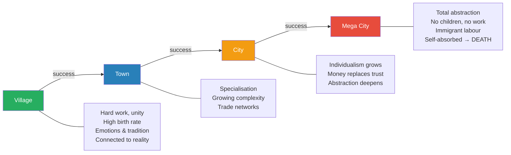
*Each stage of civilizational development brings greater abstraction — and abstraction is the slow poison that kills societies from within. The green village is concrete and alive; the red mega city is abstract and dying.*

> [!note]- Expand: Full Lecture Detail
> The third theory comes from German philosopher <b style="color: #2980b9">Oswald Spengler</b>. His argument is simple and brutal: society, culture, civilization — "it's no different from a person." As human beings, "we go through a life cycle. We are born, we grow up, we mature, then we die." Spengler says the same happens to civilizations, "and there's nothing anyone can do about this."
>
> Prof. Jiang walks through the four stages:
>
> - **Village** — "Life is pretty simple. People work hard. They are united. They have a collective mentality. Everyone's helping each other." Birth rates are high — "It's very common for mothers to give birth to ten, eleven kids. The reason why is kids are free labour, so you're incentivized to have as many children as possible." You understand everything directly — "The food that I eat comes from the seeds I plant"
>
> - **Town** and **City** — As you go up the civilization ladder, "what happens is you have increased <b style="color: #2980b9">abstraction</b>." Abstraction is "just a fancy word for you're removed from reality." In a city, "those drinks you're drinking, you have no idea where they come from. The food you're eating, you have no idea where it comes from." People become individualistic, concerned about their own personal pleasure
>
> - **Mega city** — The death phase. Prof. Jiang explains the critical shift: "In a village, what keeps people together are emotions and tradition and relationships. But when you move to the mega city, what holds people together? Money." And <b style="color: #e74c3c">money is "the greatest abstraction"</b> because "it means we don't have to ever trust each other."
>   - In a village, if you get sick, everyone comes and helps you
>   - In the city, if you get sick, you go to the hospital and pay the doctor — "Your neighbours don't have to care. Your family doesn't have to help you"
>   - You become "individualised, atomized"
>   - You don't work hard anymore — "What you want to do is you want immigrants to work for you"
>   - You no longer care about other people — only yourself
>   - "And guess what, guys, you don't want to have any children"
>
> Prof. Jiang drives the point home by listing today's mega cities: "What is Beijing? What is Shanghai? What is Washington, DC? What is New York? What is Paris, what is London? They're all mega cities. And that's why we have these trends."
>
> His conclusion is unsparing: <b style="color: #27ae60">"There's nothing anyone can do about this. It is a natural life cycle."</b>

---

## Can an External Threat Save a Dying Civilization? [27:53 - 28:17]

*A student asks the obvious question — surely an alien invasion would unite humanity? — and gets an answer that upends the Hollywood narrative entirely.*

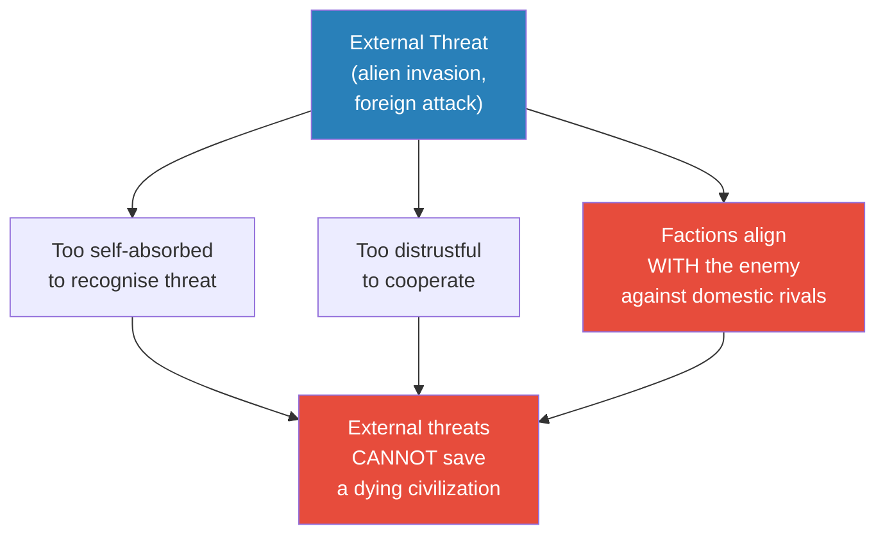
*Prof. Jiang's most striking claim: certain factions of humans would try to align with the aliens to defeat everyone else. The enemy you see every day is more dangerous than the enemy you have never met.*

> [!note]- Expand: Full Lecture Detail
> A student raises a sharp objection: "What if there is a universal target that forces everyone to work together? Will that work out?"
>
> Prof. Jiang rephrases the question for the class: "What if there's an external threat? Then surely this life cycle can be extended?"
>
> His answer is blunt and counterintuitive:
>
> - "Unfortunately, the answer is, it does not matter"
> - Once you have reached the mega city phase, "you're so selfish, so self-absorbed, you are not aware of external threats"
> - "You're no longer capable of working together because you don't trust each other"
> - And most critically: "In theory, oh my God, if aliens come, then humans would unite. No, that's not what would happen. <b style="color: #e74c3c">What would happen is certain factions of humans would try to align with the aliens to destroy everyone else</b>"
>
> He reinforces this later with a historical pattern: foreign invasions often succeed not because the invader is stronger, but because a faction within the collapsing society invites mercenaries in as part of an internal power struggle — and then the mercenaries realise "we're gonna take this for ourselves."

---

## The Synthesis: How Society Is Really Structured [28:17 - 41:27]

*Prof. Jiang combines all three theories into a single structural model. Every society is like a corporation: founding families are the owners, the middle class are the managers, and the people are the workers. Power flows through three pillars — finance, religion, and intelligence — and the system cycles from consent through deception to coercion as it ages.*

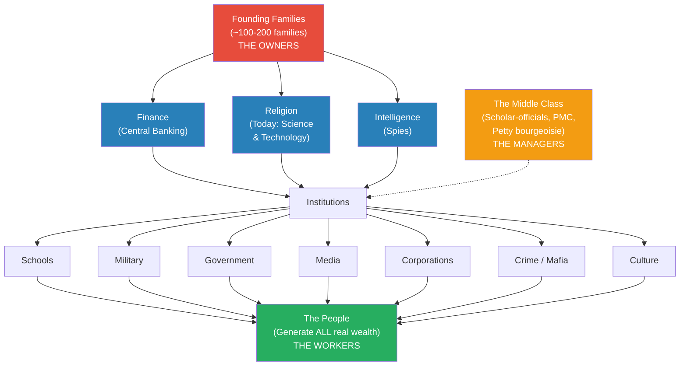
*Society is structured like a corporation: founding families own it, the middle class manage it, and the people do all the real work. The three pillars — finance, religion, intelligence — are the mechanisms of control.*

> [!note]- Expand: Full Lecture Detail
> Having presented three separate theories, Prof. Jiang warns the class: "The problem with theories is they are simplistic and inaccurate and imprecise. I warn you that this theory has limitations, but for our purposes, what we want to do is have a working framework."
>
> He then builds the structural model of society layer by layer:
>
> ### The Founding Families (The Owners)
>
> - "At the core of society are very powerful people. These are certain families — the founding families of this nation"
> - "There's not that many of them — maybe 10, maybe 100"
> - Prof. Jiang uses the Roman Empire as his example: "The Roman Empire controlled most of Europe, as well as Anatolia, Egypt — it was a huge area — but really there were only about 200 families that controlled the Roman Empire"
>
> ### The Three Pillars of Power
>
> These families express power through three mechanisms:
>
> - <b style="color: #2980b9">Finance</b> — central banking, discussed in Lecture 1
> - <b style="color: #2980b9">Religion</b> — controlling what people believe. "The religion of today is science and technology"
> - <b style="color: #2980b9">Intelligence</b> — spies and surveillance
>
> Prof. Jiang says he will go more deeply into religion and intelligence in future lectures, but the key insight is that "it's their nexus, their culmination, that allows the elite to control everyone else."
>
> From this nexus, the elite control "all aspects of society, including schools, including the military, including government, including the media, including culture, including crime, the mafia — every aspect of society that you can imagine."
>
> ### The Middle Class (The Managers)
>
> Between the elite and the people sits the middle class, which Prof. Jiang calls by several names:
>
> | Name | Origin |
> |------|--------|
> | **Middle class** | Common usage |
> | **Scholar-officials** | Chinese historical term |
> | **Professional Managerial Class (PMC)** | Modern sociology |
> | **Petty bourgeoisie** | Marxist terminology |
>
> The middle class's defining characteristic is <b style="color: #2980b9">rent-seeking behaviour</b>: "They have a certain power that they want to exploit in order to extract wealth from other people."
>
> > [!example] Rent-Seeking in Action
> > - You own an apartment in Beijing — you rent it out and collect rent from someone who needs to live there
> > - You are a lawyer — only you can work in the court system, so anyone with a contract dispute must pay you
> > - You are a manager in a company — "You know what the workers do. You know what the managers do. They really don't do that much"
> > - When the company is in trouble, managers are first to be fired — "So they have to show their worth, prove their worth, and therefore they exploit the workers"
> > **The lesson:** The middle class does not produce real wealth — it extracts wealth through positional gatekeeping. When the system is under stress, the managers squeeze the workers to justify their own existence.
>
> ### The People (The Workers)
>
> - "At the outer edge are the people. Because they're so massive, they're the ones who generate wealth for society"
> - "Think of society as a corporation. The people are the workers. The elite, these families, are the owners. And these people in between — the middle class — are the managers"
>
> ### Rise, Decline, and Collapse
>
> Prof. Jiang then shows how the relationships between these three groups change as society ages:
>
> **Rise Phase — Consent:**
> - "The families who own the nation are happy to let the managers control society — and this is what we call democracy"
> - "The managers are always providing feedback to the families and saying: we should treat workers better. We treat workers better, then they will work harder"
> - "The people feel that they have a voice in the system. They're making good money. Everyone's really happy"
> - Society is open, meritocratic, innovative, and welcomes criticism
>
> **Decline Phase — Deception:**
> - Elite overproduction kicks in — "These families produce too many children who want positions of power. Basically, they want to spend money from the corporation. And now the corporation is in trouble. It's in debt"
> - "You would think the managers would say to the families: we need to be more fair to the people. But what really happens in reality is the managers exploit the people"
> - <b style="color: #e74c3c">"The managers will now deceive. They will lie to the people. They will commit fraud. They will exploit the people"</b>
> - Why? Because managers are rent-seekers: "If the company is struggling, managers are like — well, I have a very nice life, a very nice job, but I don't really do anything, so I'll probably be the first to get fired. So they have to prove their worth, and therefore they exploit the workers"
> - Society becomes bureaucratic — "They create a lot of paperwork. They make everyone follow the rules"
>
> **Collapse Phase — Coercion:**
> - "The conflict within the elite gets worse and worse — elite overproduction — and what will eventually happen is they will form into factions that compete against each other for power"
> - "The factions will bring in certain elements of the middle class, which will then bring in elements of the people"
> - "And now what happens is civil war or revolution, and this marks the collapse of society"
> - Foreign invasion often accelerates collapse — but not as most people assume: "A certain faction invites mercenaries into the nation as part of the power struggle, and then the mercenaries realise — you know what, we're gonna take this for ourselves"
>
> > [!example] The McDonald's Analogy — How Social Contracts Decay
> > - **Rise (Consent):** "Let's go to lunch. I want McDonald's, you want Pizza Hut. We discuss, we vote, majority wins"
> > - **Decline (Deception):** "I'm the teacher, so I say: let's go to McDonald's — Jack Ma will be there, or it's free hamburgers today." He is lying to get what he wants
> > - **Collapse (Coercion):** "I'm the teacher, and I will beat you up if you don't listen to me"
> > **The lesson:** The transition from consent to deception to coercion is the trajectory of every declining society — and it happens so gradually that most people do not notice until coercion has already arrived.
>
> A student asks: "What if the elite families don't have that many children? Will this model still work?"
>
> Prof. Jiang responds: "These families, first and foremost, want to have as many children as possible. How do you pass on your power?" He explains that the elite are specifically incentivised to reproduce — power is passed through inheritance. "Who wants to marry into elite families? Everyone." Marriage between elite families is a power-maintenance strategy, which means the elite expand rapidly. They cannot opt out of reproduction without opting out of power.

---

## The Characteristics of Rise, Decline, and Collapse [41:36 - 50:37]

*Prof. Jiang maps out the specific characteristics that define each phase of societal development — from openness and meritocracy in the rise, through bureaucracy and deception in the decline, to authoritarianism and survival in the collapse. He makes a striking claim: 1950s America and China were both open societies despite opposite political systems.*

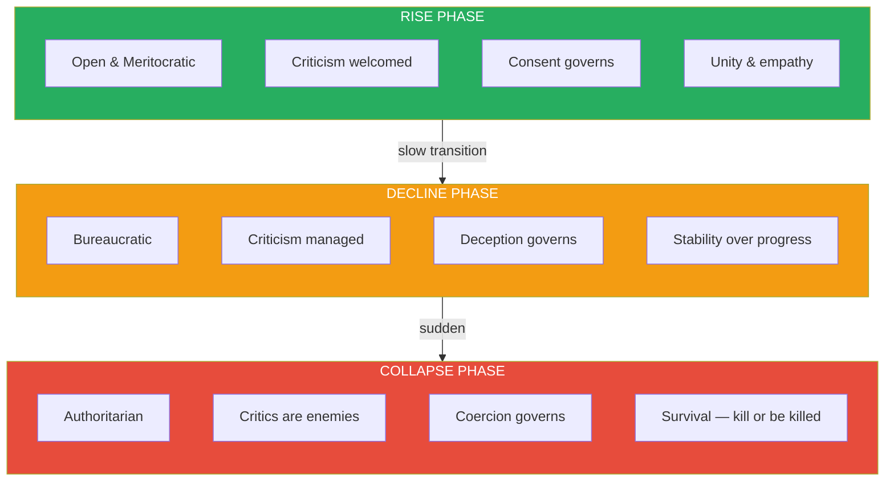
*The three phases are defined not by political systems but by how the elite, middle class, and people relate to each other — and especially by how critics are treated.*

> [!note]- Expand: Full Lecture Detail
> Prof. Jiang summarises the characteristics of each phase:
>
> | Phase | Governance | Social Contract | Priority | Treatment of Critics |
> |-------|-----------|----------------|----------|---------------------|
> | **Rise** | Open / Democratic | Consent | Unity — empathy, working together | Heroes — rewarded and appreciated |
> | **Decline** | Bureaucratic | Deception | Stability — maintaining status quo | Nuisances — managed and contained |
> | **Collapse** | Authoritarian | Coercion | Survival — kill or be killed | Enemies — punished and eliminated |
>
> He makes a striking historical claim to illustrate that this is about development phase, not political structure:
>
> > [!example] 1950s America and China — Both Open Societies
> > - In the 1950s, America was a democracy and China was communist — opposite political systems
> > - But both were open societies: "You could criticise leaders. In fact, you were encouraged to criticise leaders"
> > - Both were meritocratic — talent was rewarded, innovation was celebrated
> > - "China was as democratic back then as the United States"
> > - The key variable was not the political system but the phase of societal development — both were young, rising societies
> > **The lesson:** Democracy is not a system of government — it is a characteristic of young, rising societies regardless of their formal political structure. "It's not about political systems. It's just about what stage you are in social development."
>
> Prof. Jiang then describes the timeline shape of civilizational development: <b style="color: #27ae60">"There's a steep rise, the decline is slow, and the collapse is sudden."</b>
>
> He explains why collapse is sudden rather than gradual — the concept he calls the <b style="color: #2980b9">perfect storm</b>:
>
> - During decline, society can handle individual crises — "If there's a plague, we'll do this. If there's a climate crisis, we'll do this. If there's a drought, we'll do this"
> - What society is NOT prepared for is all of these happening simultaneously — "The plague, the drought, war, revolution — they all happen at once. It's a perfect storm"
> - And here is the devastating feedback loop: <b style="color: #e74c3c">the authoritarian phase eliminates the very people who would have warned about the coming storm</b>
> - "In the rise phase, those who criticise society are the heroes. They are appreciated. They are rewarded"
> - "In the collapse phase, those who speak out are the enemies of society"
> - By the time multiple crises hit simultaneously, there is nobody left who is allowed to say the system is unprepared

---

## Why Collapse Is Sudden, Not Gradual [50:37]

*Prof. Jiang explains the timeline shape of civilizational collapse and introduces the concept of the perfect storm — simultaneous crises overwhelming a system that has blinded itself by silencing its critics.*

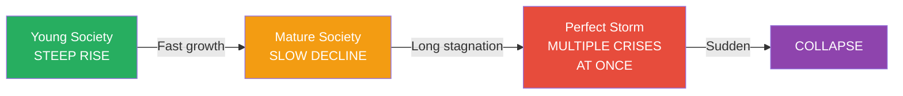
*People assume decline follows a straight line downward. In reality, the decline is a long, slow plateau — and then collapse arrives all at once, triggered by a convergence of crises that the system has made itself incapable of anticipating.*

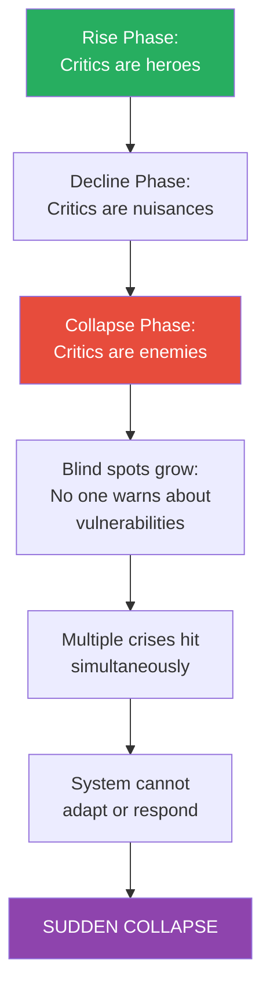
*The authoritarian phase creates a fatal paradox: the people who could have prepared society for crisis are exactly the people the system has silenced or eliminated.*

> [!note]- Expand: Full Lecture Detail
> Prof. Jiang explains the timeline paradox:
>
> - The rise is steep — societies grow quickly when they are young and open
> - The decline is slow — a long plateau where things stagnate or get slightly worse
> - The collapse is sudden — "People think, oh, decline, things get worse, but we'll still be here. But actually, the collapse happens really fast"
>
> The reason is the <b style="color: #2980b9">perfect storm</b>: "This system cannot survive external shocks. External shocks is a perfect storm of crises."
>
> - Society can prepare for individual crises — plague, drought, war, each on its own
> - Society cannot prepare for all of them happening simultaneously
> - "No system can withstand that many simultaneous shocks"
>
> And the reason society is blind to the coming storm is structural: "When you hit the authoritarian phase, you're not allowed to criticise the system anymore. The problem are those who speak out. The problem is those who point out the problems of society."
>
> - In the rise phase: critics are rewarded and appreciated
> - In the collapse phase: critics are enemies of the state
> - Therefore: "Society cannot be prepared for any external threats, which leads to its collapse"

---

## Five Predictions for the Western World [50:37 - 53:32]

*Prof. Jiang applies his model to make concrete predictions about the next five to twenty years — and stakes his model's credibility on them. If they come true, the model has some accuracy. If they do not, the model is wrong.*

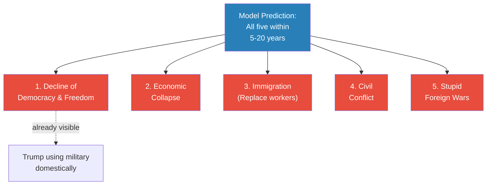
*Prof. Jiang frames these not as a fixed sequence but as five developments that will manifest in varying order throughout the Western world. He is explicit: "I'm not saying this happens in a sequence. I'm saying you'll see all five things."*

> [!note]- Expand: Full Lecture Detail
> Prof. Jiang applies his framework to make specific predictions. He acknowledges uncertainty about timing — "five to ten years, or ten to twenty years" — but not about direction:
>
> 1. <b style="color: #e74c3c">Decline of democracy and freedom</b> — "We will see the United States, Europe become much more authoritarian. You will see a collapse of democracy and freedom in these nations." He points to Trump "using more and more military to resolve issues" as already visible evidence
>
> 2. **Economic collapse** — "As people have less and less right to speak up, they feel less invested in the system. They're less willing to work, therefore you have economic collapse. People don't believe in the system anymore"
>
> 3. **Immigration** — "The government is like: if the people don't want to work, screw them. Let's bring in immigrants to do the work. Let's replace our population"
>
> 4. **Civil conflict** — "The people are not going to sit back and take it. People are killing each other on the streets"
>
> 5. **Stupid foreign wars** — "The government is like: if we let them fight, eventually they're going to come after us. So what we'll do is send them off to stupid, pointless wars overseas"
>
> Prof. Jiang is explicit: "I'm not saying this happens in a sequence. I'm saying you'll see all five things, but they may happen in different order."

---

## War as a Pressure Valve — and the Question of Morality [53:32 - end]

*A student asks whether governments deliberately use wars to distract from collapse. Prof. Jiang answers directly: "That's what wars are for." Then he confronts the class's discomfort with a methodological confession — this course is about how power works, not about right and wrong.*

> [!note]- Expand: Full Lecture Detail
> A student asks: "Is there any chance that the government tries to use a war to distract the people — like they're trying to hide the collapse of society?"
>
> Prof. Jiang's response is immediate: "That's a great question. And the answer is, that's what wars are for."
>
> > [!example] War as Distraction — The Elite's Calculus
> > - If you do not distract the people, they will revolt against you
> > - "You either send them to a war, or you could have a French Revolution on your hands"
> > - From the elite's perspective, war is the better option
> > - Wars are not strategic — they are diversionary pressure valves
> > - "I think war is a better option" — Prof. Jiang states this flatly as the elite's calculation, not as a moral judgement
> > **The lesson:** Foreign wars in declining empires are not strategic failures or moral failings — they are deliberate pressure valves deployed by elites who face revolution at home.
>
> The class pushes back, uncomfortable with describing war without moral condemnation. Prof. Jiang responds with a methodological confession:
>
> - "There's no right and wrong here, guys. I know that. I'm trying to explain to you how power works. That's the theme of this course"
> - "I don't know if I'm right. But what I'm doing is presenting a theory, a model that we can use to make predictions"
> - "If these predictions work out, then there's some accuracy to our model. But hey, if tomorrow Trump, Putin, and Xi all get together and say 'let's be best friends,' then I'm wrong"
> - "We're not trying to argue what is right, what is wrong, what is just — because, quite honestly, it doesn't matter. Morality doesn't matter here. It's about power"
> - <b style="color: #27ae60">"We're trying to understand how the world works. And when we do, and if we do that, then maybe we can work together and build a more just world. But first we're going to figure out how the world really, really works"</b>
>
> > [!quote] Prof. Jiang
> > "First we're going to figure out how the world really, really works. And when we do, and if we do that, then maybe we can work together and build a more just world."

---

## How All Three Theories Fit Together

*Piketty explains the economic mechanism, Turchin explains the social mechanism, and Spengler explains the cultural mechanism — but they are three views of the same process of decline and collapse.*

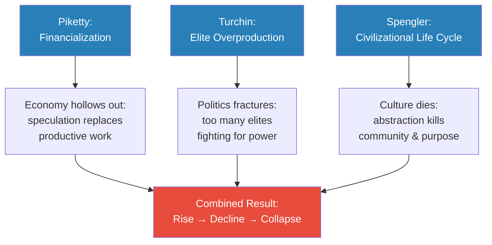
*Each theory captures one dimension of the same process: Piketty explains why the economy hollows out, Turchin explains why the elite fractures, and Spengler explains why the culture loses its will to survive. Together, they describe a society that is simultaneously economically hollow, politically fractured, and culturally atomised.*

---

## Connections

**Builds on:** [[01 - How Power Works]] (monotheism, the distinction between money and wealth, the three ideas — money, individual, nation state — that created modernity and its problems)

**Sets up:** [[03 - Death by Gerontocracy]] (the bureaucratic decline phase connects directly to aging leadership), future lectures on immigration, religion and intelligence as pillars of power

**Related lectures:** [[06 - Elite Overproduction and the Bronze Age Collapse]] (Civilization series — elite overproduction explored in historical context), [[08 - Rat Utopia and the Peloponnesian War]] (Civilization series — Rat Utopia experiments applied to Greek history)

**Related books in vault:** [[Capital in the Twenty-First Century - Thomas Piketty]] (financialization and the 2% vs 5% growth gap), [[Skin in the Game - Nassim Nicholas Taleb]] (rent-seeking behaviour and asymmetry between managerial class and workers), [[The Decline and Fall of the Roman Empire - Edward Gibbon]] (the factional collapse pattern Prof. Jiang describes)

---

## The Takeaway

This lecture is the theoretical engine of the Secret History series. Where Lecture 1 established that monotheism created the ideas — money, the individual, the nation state — that drive modernity, Lecture 2 explains the structural mechanics of how those ideas play out across the lifespan of a civilization. Prof. Jiang is building a unified model — part economics, part sociology, part philosophy of history — that he will test against concrete examples for the remaining twenty-six lectures. The model's power lies not in any single theory but in the synthesis: Piketty, Turchin, and Spengler each see one dimension of the same process, and together they describe a system that is simultaneously hollowing economically, fracturing politically, and dying culturally.

The most counterintuitive insight is the claim about external threats. Every student in the room assumed that an alien invasion would unite humanity. Prof. Jiang's answer — that factions would align with the aliens against their domestic rivals — is not a throwaway provocation. It is a direct logical consequence of his model: once a society has reached the collapse phase, internal rivalries are more real, more immediate, and more existential than any external threat. The enemy you see every day is more dangerous than the enemy you have never met. This connects directly to his point about mercenary invasions — that foreign conquests often begin as invited interventions by one domestic faction against another.

What remains open is whether the model is truly predictive or merely descriptive. Prof. Jiang has staked his credibility on five specific predictions for the Western world, and he has given himself a five-to-twenty-year window. If those predictions come true, the model gains authority. If they do not, he says honestly, the model is wrong. This willingness to be falsified — rare in the humanities — is what elevates the framework from ideology to something closer to science. And his closing line reveals the deeper purpose: understanding how power really works is not an end in itself, but the only possible foundation for building a more just world.
