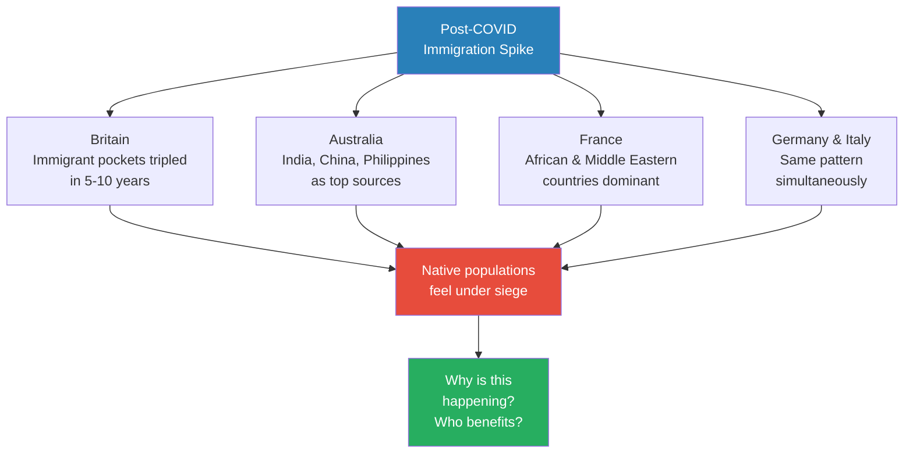
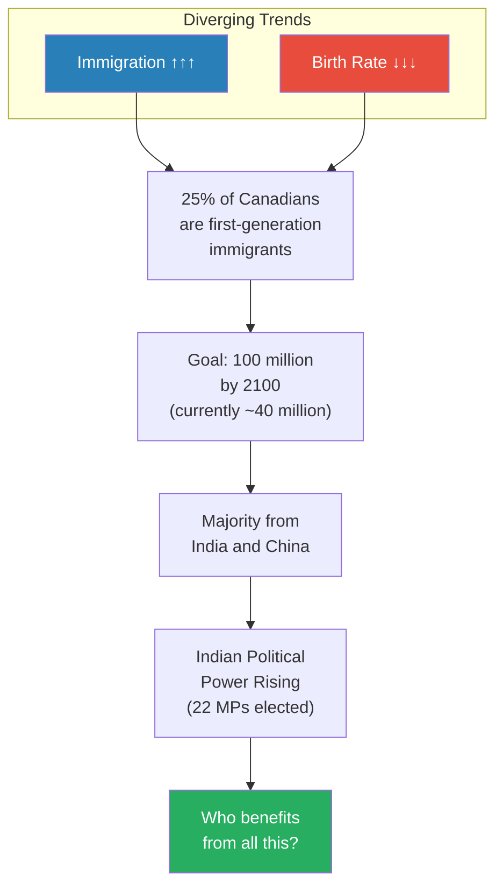
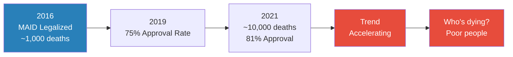
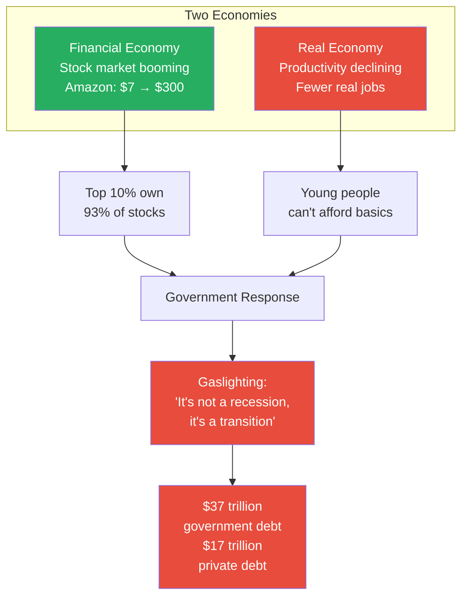
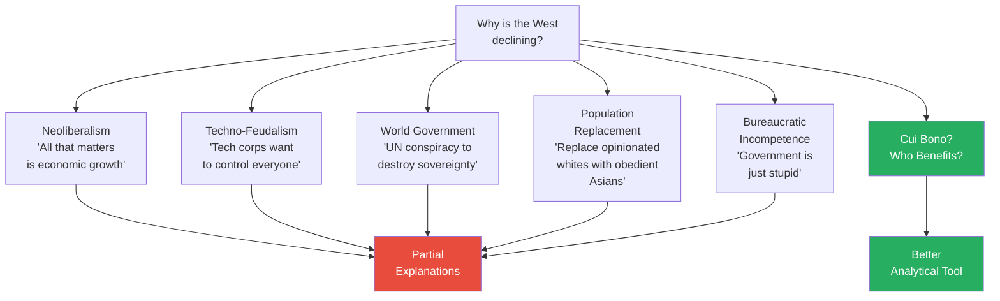
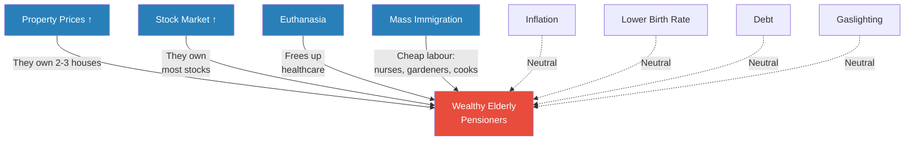
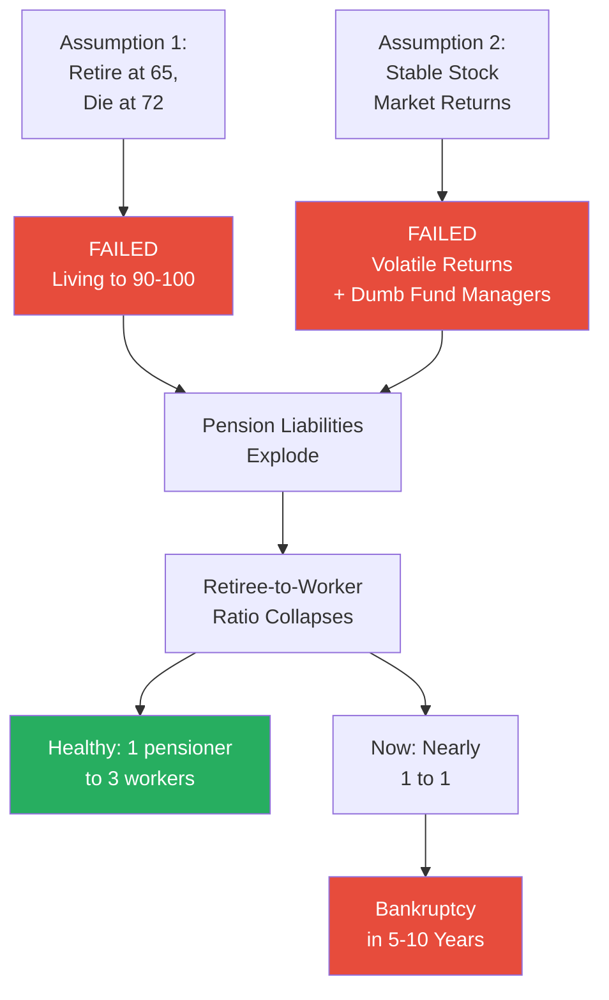
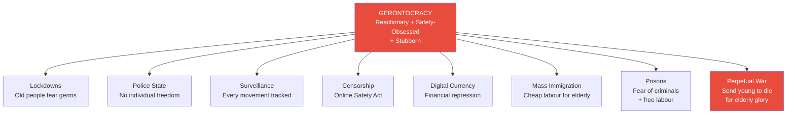
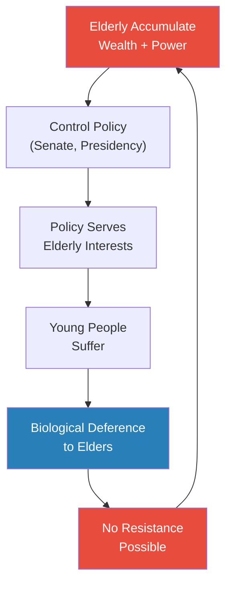

# Death by Gerontocracy

> Prof. Jiang surveys the wreckage of Western decline — immigration crises, runaway inflation, a government-assisted suicide program that kills the poor, a financial economy detached from reality, and national debt spiralling beyond any hope of repayment. He then asks the question that unlocks everything: who benefits? The answer is not neoliberalism, not tech oligarchs, not a shadowy world government. It is wealthy elderly pensioners — a demographic that has never existed at this scale in human history, that controls the political system, that young people are biologically wired to obey, and that modern medicine can keep alive almost indefinitely. Welcome to the gerontocracy.

---

## Overview: Key Highlights

- <b style="color: #27ae60">Wealthy elderly pensioners are the group that benefits from every major trend of Western decline</b> — the cui bono analysis points to one demographic above all others
- <b style="color: #e74c3c">Farming made life objectively worse — and so has the gerontocracy</b> — immigration, inflation, euthanasia, debt, and declining birth rates are all worsening conditions for the young
- <b style="color: #2980b9">Gerontocracy</b> — rule by old people, a political system where the elderly refuse to give up power and dictate policy to serve their own interests
- <b style="color: #2980b9">Cui bono analysis</b> — "who benefits?" — follow the money and outcomes to identify who is behind a trend, rather than starting with ideology
- <b style="color: #e74c3c">Canada's MAID program is accelerating deaths of the poor</b> — from 1,000 deaths in 2016 to 10,000 by 2021, with an 81% approval rate and a 10-day turnaround
- <b style="color: #27ae60">The moral shift from "every life is sacred" to "how much does this life cost?" is civilizational</b> — Prof. Jiang identifies this as the deepest sign of decline
- <b style="color: #2980b9">Pension crisis</b> — systems assumed people would die at 72; they are living to 100, creating liabilities that will bankrupt pension funds within 5-10 years
- <b style="color: #e74c3c">Biden, McConnell, Feinstein, Grassley — America's leaders are brain-dead or barely ambulatory</b> — and none of them will leave voluntarily
- <b style="color: #2980b9">Biological deference</b> — young people are biologically wired to respect elders, even across animal species, making resistance to gerontocracy structurally impossible
- <b style="color: #e74c3c">The gerontocracy produces lockdowns, police states, surveillance, censorship, digital currency, and perpetual war</b> — all justified in the language of "safety"
- <b style="color: #27ae60">25% of all Canadians are now first-generation immigrants</b> — and the government plans to reach 100 million people by 2100, mostly from India and China
- <b style="color: #2980b9">Financialization</b> — the stock market booms while the real economy declines, and the government responds by redefining words rather than solving problems

| Concept | One-line summary |
|---------|-----------------|
| **Gerontocracy** | Rule by elderly people — a political system where the old refuse to give up power |
| **Cui bono analysis** | "Who benefits?" — follow outcomes to actors, not ideology to evidence |
| **MAID** | Medical Assistance in Dying — Canada's government-assisted suicide program targeting the poor |
| **Pension crisis** | Pension systems assumed people would die at 72; they are living to 100 |
| **Biological deference** | Young people are biologically wired to respect and obey elders — even animals do this |
| **Financialization** | Financial economy booming while real productive economy declines |
| **Bureaucratic gaslighting** | Government denying reality — "it's not a recession, it's a transition" |
| **Population replacement** | Native birth rates falling while immigrant populations grow rapidly |
| **Financial repression** | Digital currency replacing cash to monitor and control all transactions |
| **Police state** | Not jackboots and batons — government inserting itself into the most intimate spaces of private life |
| **Three generations** | Young (rebellious, creative), mature (stability-seeking), elderly (reactionary, safety-obsessed, stubborn) |

---

# The Lecture

## The Southport Stabbing — When Violence Reveals a Civilization in Crisis [0:01 - 3:30]

*Prof. Jiang opens with a story designed to make you uneasy — not because of the violence, but because of what happened next. A 17-year-old kills three children in Southport, Britain, and the nationwide riots that follow reveal a society under unbearable pressure from rapid demographic change.*

> [!tip] Core Insight
> The riots were not really about the stabbing. They were about a society so pressured by rapid change that a single act of violence could ignite a nationwide explosion of ethnic fury — even when the triggering narrative was false.

*The Southport riots are Prof. Jiang's entry point — not a local crime story but a diagnostic of civilizational stress. The false narrative about the attacker being an immigrant was believed because it confirmed something millions of people already felt.*

> [!note]- Expand: Full Lecture Detail
> Prof. Jiang opens the lecture: "Class today we do death by gerontocracy. Gerontocracy just means rule by old people." He frames the lecture as the empirical companion to the previous class on theories of decline: "Last class, we discussed the decline of Western society and civilization and why it's happening. We discussed the theories. Today we will look at what the reality on the ground is."
>
> He begins with a photograph of a young man:
>
> - <b style="color: #2980b9">Axel Rudakubana</b>, 17 years old, walked into a dance studio in Southport, Britain, carrying a knife
> - He stabbed the children inside — girls aged five, six, and seven — killing three of them
> - Prof. Jiang notes he is "a very disturbed young man. He clearly has a mental illness. Otherwise, why would he go kill children?"
> - He was sentenced to 52 years in prison — "so justice was done"
> - But then rumours spread online claiming he was an asylum seeker, an immigrant
> - Riots erupted across Britain — "the country of England burned, basically, literally burned"
> - Protesters targeted immigrants, set cars on fire, clashed with police
>
> > [!example] The Southport Stabbing and the British Riots (2024)
> > - Rudakubana took a knife into a dance studio and stabbed young girls aged five, six, and seven
> > - Three children were killed; he was sentenced to 52 years
> > - Online rumours falsely claimed he was an asylum seeker
> > - Anti-immigrant riots erupted across Britain — cars burned, immigrants targeted
> > - The men in the protest photos "feel virtuous. They feel righteous. They feel proud for protecting their people against immigrants"
> > - The critical fact: Rudakubana was not an immigrant — he was born in Wales to Rwandan parents; he was a British citizen
> > **The lesson:** The riots were not about the stabbing. They were about a society so pressured by rapid demographic change that a single false narrative could ignite a national explosion.
>
> Prof. Jiang then pivots to the real question: "Why is this happening? Why are all these civil conflicts caused by immigration throughout the Western world?" He notes this is not unique to Britain — "immigration in the United States led to the victory of Donald Trump in last year's elections."

---

## The Immigration Crisis Across the Western World [3:30 - 8:30]

*Prof. Jiang walks through immigration data country by country — Britain, Australia, France, Germany, Italy — building a picture of simultaneous demographic transformation that native populations experience as an invasion. The scale and speed of change, not immigration itself, is what is tearing societies apart.*

*Country after country, chart after chart — the same pattern. This is not a local accident of policy. It is a Western-wide structural shift happening simultaneously.*

> [!note]- Expand: Full Lecture Detail
> Prof. Jiang walks through the data methodically, country by country, letting the numbers accumulate before offering interpretation:
>
> - **Post-COVID spike:** Immigration surged across the Western world after COVID-19, with sharp increases in Britain, Australia, France, Germany, and Canada
> - **Source countries have shifted:** "Before there might have been a lot of EU European immigrants, but now it's just mainly countries outside of Europe" — the majority now come from the Middle East, Africa, India, China, and the Philippines
> - **Britain:** Prof. Jiang shows maps where "the dark brown are places where in the past 5-10 years, the immigrant population has tripled." He observes: "If you go to Britain, there are some places where you feel this is like Morocco or Rwanda or even Egypt"
> - **Australia:** "Huge spike in immigration, and most of them are coming from non-European countries. The greatest spike is in India, but then you also have China and the Philippines"
> - **France:** "A huge spike in immigration. And again, most of the immigrants are coming from African or Middle Eastern countries, and so the French feel as though their culture is being diluted"
> - **Germany, Italy, UK:** "All seeing a huge spike in immigrants and refugees, and so their culture feels threatened"
>
> Prof. Jiang then introduces the economic dimension:
>
> - <b style="color: #2980b9">Consumer Price Index (CPI)</b> — measuring the price of basic goods like food and shelter — has spiked across the Western world
> - "As these immigrants are coming into your country, you also feel as though your quality of life is getting worse and worse"
> - Rent is higher, food is more expensive, supporting a family has become a financial stretch
> - The timing is not coincidental — immigration and inflation are interacting to squeeze working and middle-class populations from both sides

---

## The Canadian Housing Crisis — Following the Money [8:30 - 10:00]

*Prof. Jiang zeroes in on Canada as the most extreme example of what happens when policy serves the wrong people. A student immediately identifies the mechanism: vested interests overriding national interest.*

> [!tip] Core Insight
> Policy is not being controlled by what is best for the nation and its people. It is controlled by vested interests who profit from the process. Property owners benefit from constrained supply and rising demand — and they are powerful enough to ensure supply stays constrained.

*The housing crisis is not a policy failure — it is a policy success for the people who matter. Constrained supply plus rising demand equals windfall profits for existing property owners.*

> [!note]- Expand: Full Lecture Detail
> Prof. Jiang presents the Canadian housing data with devastating clarity:
>
> - **The US baseline:** Housing prices roughly correlate with GDP growth — "This is pretty reasonable"
> - **The Canadian divergence:** "In Canada, it is not reasonable. GDP is GDP, housing prices going like this" — the correlation has broken entirely, with housing prices going vertical
> - **The dream is dead:** "Canadians feel as though the Canadian dream of one day having their own house, it's basically dead"
> - **The supply paradox:** "As Canada lets in more immigrants, and as property prices go up, you would think that they would build more and more houses. But housing supply, it's pretty flat, even though immigration is going up"
>
> Prof. Jiang poses the question to the class: "Why is it that you have a policy of letting in more immigrants but you don't have a policy of building more housing for them?"
>
> A student (Speaker 1) nails it immediately: "Maybe because they want to make more money, because now there's like more competition for housing... people who provide the housings would naturally, real estate people, make more money."
>
> Prof. Jiang confirms: "Yeah, exactly. Exactly correct. Policy is not being controlled by what's best for the nation and the people. It's controlled by vested interests that will make money off the process." He expands: "If you already have a house, if the supply is constant, but the demand goes up, then you know from economic class that the value of a house increases artificially, so it's making homeowners very happy."
>
> This is the first hint of where the lecture is heading — vested interests overriding national interest. Prof. Jiang will soon name exactly who those interests are.

---

## Birth Rate Collapse and Political Power [10:00 - 15:00]

*While immigrants flood in, native populations are not reproducing. Prof. Jiang shows how the Indian community in Canada has already begun to amass political power — and asks: if immigrants are making life worse for everyone, who benefits from this?*

*Two lines diverging like opening scissors — immigration climbing, birth rates falling. The demographic composition of Canada is being fundamentally rewritten within a generation.*

> [!note]- Expand: Full Lecture Detail
> Prof. Jiang presents the birth rate data alongside immigration:
>
> - "As the number of immigrants goes up, native people, the native population, they're not having children"
> - In Canada, the birth rate line is steadily declining while the immigration line climbs — "It's the immigrants who provide most of the new people in Canada"
> - <b style="color: #e74c3c">"Right now, 25% — a quarter — of all Canadians are first generation immigrants"</b>
> - Canada's stated goal: 100 million people by 2100, up from roughly 35-40 million now — "The majority of these people are going to come from India and probably China"
> - "If you just look at this trend, in 40 years time, 50 years time, there'll be very few white Canadians in Canada, and this is causing a lot of conflict and tension"
> - No policy rollback — "They're actually gonna ramp up the process"
> - The percentage of immigrants as part of total population is rising everywhere: "Australia is almost a third now. In Canada, it's a quarter. In Germany, it's a fifth"
>
> > [!example] Indian Political Power in Canada
> > - In the last federal election, 22 people of Indian descent were elected to the Canadian Parliament (out of 243 seats)
> > - Chinese-Canadians, despite being more numerous and having been in Canada longer, hold fewer than 10 seats
> > - Why? "Indians come from democracy. They're very good at debate, they're very good at organising. They're very good at collective action"
> > - Former PM Justin Trudeau met with Indian community representatives because he depended on their votes
> > - Millions of Indian students are in Canada on student visas, "lining up for hours and hours because you're applying for a minimum wage job"
> > - Many live "eight to a room — one room that was meant for one person"
> > - If current trends continue, "there could be a situation where the Indians take over the Canadian government in like 20 or 40 years time"
> > **The lesson:** Immigration is not just a demographic event — it is a political one. The communities that organise fastest will shape the nation's future.
>
> A student (Speaker 2) raises an important counterpoint: what about the people who were already there?
>
> Prof. Jiang's answer is grim:
> - "The local population is suffering even MORE than the immigrants"
> - "The economy is declining, and it's pretty rapid decline, so it's harder for young people to find jobs, especially with immigrants coming into the country"
> - "Prices are very expensive nowadays, so it's very hard for young people to live and work in big cities"
> - "That's why there's so much ethnic tension throughout the western world right now"
>
> Prof. Jiang then poses the question he wants students to carry through the rest of the lecture: <b style="color: #27ae60">"If immigrants are making life worse for everyone, especially young people, who's the future of these nations, why is this happening?"</b> He adds: "You probably know the answer already, because you know how property prices work."

---

## Killing the Poor — Canada's MAID Program [15:00 - 24:00]

*Twenty-five years ago, helping someone die was murder. Now the government does it for you — and the numbers are climbing fast. Prof. Jiang's tone shifts from analytical to moral disgust as he presents what he considers a civilizational obscenity.*

> [!tip] Core Insight
> The shift from "every life is sacred" to "how much does this life cost?" is not just a policy change. It is a civilizational one. When a society starts measuring human beings by their economic burden, it has crossed a line that is very difficult to uncross.

*In five years, MAID deaths increased tenfold. The approval rate is climbing as if there is a quota to fill. And the people dying are overwhelmingly the poor.*

> [!note]- Expand: Full Lecture Detail
> Prof. Jiang introduces <b style="color: #2980b9">MAID — Medical Assistance in Dying</b>, Canada's euthanasia program legalised in 2016:
>
> - A student (Speaker 2) asks whether it is the same as euthanasia. Prof. Jiang clarifies: "Suicide is when you kill yourself. Euthanasia is when a doctor helps you kill yourself. Euthanasia means good death — it means you will die painlessly"
> - He registers the magnitude of the shift: "25 years ago, this was illegal in the world. If you help someone kill himself, you'll be put in prison. This would be basically murder"
> - The concept behind MAID: "If you feel life is meaningless, if you're depressed, if you feel that you cannot cure your disease, the government will help you kill yourself"
>
> **The government's justification** — Prof. Jiang reads it aloud and his contempt is barely contained:
>
> - "It's really stupid. It's disgustingly stupid"
> - **Suicide:** You do it alone and shock your family. **MAID:** Everyone knows, so they won't be as sad
> - **Suicide:** You might botch it. **MAID:** "It's being facilitated by professionals who know what they're doing"
>
> > [!quote] Prof. Jiang
> > "If you think this is stupid, there's more stupidity to come."
>
> **The numbers:**
>
> - From ~1,000 deaths in 2016 to ~10,000 by 2021 — tenfold increase
> - Approval rates climbing from 75% in 2019 to 81% — "It seems as though they have a quota. They're trying to kill as many people as possible"
> - Canada's rate far exceeds the Netherlands, which had the most open euthanasia policy for decades — "Canada's in a rush to kill as many people as possible"
> - Processing time: Oregon takes roughly a month; Canada does it in 10 days — "They won't even think about it. They're like, you want to kill yourself? Do it, man. Good for you. Good choice"
>
> **Who is actually dying:**
>
> - The largest category is cancer — <b style="color: #e74c3c">"the most expensive disease to treat"</b>
> - "A lot of cancer, it's not terminal. You can still live with cancer. So it seems as though people with cancer are being encouraged to die because they're a burden on the system"
> - The two main reasons people request MAID are not terminal illness:
>   - "Loss of ability to engage in meaningful activities" — "It's because you're not happy. This is a lame reason to kill yourself"
>   - "Loss of ability to perform activities of daily living" — "It's harder for you to go buy groceries, it's harder for you to walk around"
> - Prof. Jiang's conclusion: <b style="color: #e74c3c">"Poor people are dying. Poor people are encouraged to kill themselves, because the poor are being a burden on the medical system"</b>
>
> **The moral shift:**
>
> Prof. Jiang asks: why was euthanasia illegal 25 years ago? Speaker 1 gives an answer about regulation and loopholes. Prof. Jiang pauses. Then:
>
> > [!quote] Prof. Jiang
> > "That's a very interesting answer. What it tells me is that the society you live in is very different from the society I grew up in."
>
> - "25 years ago, we were taught that <b style="color: #27ae60">every life matters. Every life is a gift from God</b>"
> - "We have to protect everyone, especially the poor, the vulnerable and the marginalised, because that's how we come together as a society"
> - "If we just let anyone die, then how do you know that you'll be protected?"
> - "What mattered back then was social cohesion, social capital, social trust"
> - "And now what matters is just numbers. How much does this cost me? How much revenue will this generate?"
>
> The generational divide between Prof. Jiang and his students is visible in the answer itself — the student thinks in terms of regulation; he thinks in terms of morality. The gap between those two frames is the decline he is describing.

---

## The Fake Economy and Bureaucratic Gaslighting [24:00 - 28:00]

*The stock market says everything is great. The lived economy says everything is terrible. The government says you are imagining things. Prof. Jiang connects financialization, government debt, and bureaucratic dishonesty into a single picture of a system that has lost contact with reality.*

*The two economies — the one Wall Street measures and the one ordinary people live in — have completely diverged. The government's response makes it worse by denying reality.*

> [!note]- Expand: Full Lecture Detail
> Prof. Jiang connects several threads from the previous lecture:
>
> - **Stock market boom:** "If you're a rich person, you're just getting richer and richer. 10% of the population owns 93% of the stocks in America"
> - **Amazon's trajectory:** "$7 per share in 2008, now it's like $300 — so that just shows you how wealthy the rich have become due to government policies"
> - **Real economy decline:** "Productivity, real economy, the amount of work — it's going way down"
> - "We live in a fake world" — the financial economy booming while the real economy of jobs and production declines
>
> **Bureaucratic gaslighting:**
>
> > [!quote] Prof. Jiang
> > "This is what we call gaslighting. This is bleeding gaslighting."
>
> - "People know their lives suck. People know that basically the economy is in a recession. That's what the facts say"
> - The government's response: "Oh, it's not really a recession. What it really is is a state of transition"
> - "Rather than just say, 'the economy is in trouble and we feel your pain and we're going to work hard to solve the problem,' they're telling you, no, no, no, it's not black, it's white"
> - "They're telling you: your eyes are lying to you. Don't you see? You're not seeing clearly. Get new glasses, and your life will be a lot better"
>
> **The debt mountain:**
>
> - US government debt chart tells a story in two acts:
>   - **Act 1 — 200 years of discipline:** From America's founding until roughly 1980, very little debt
>   - **Act 2 — the explosion:** After 1980, the line goes vertical. US government debt now stands at <b style="color: #e74c3c">$37 trillion</b>
> - On top of that, American citizens owe $17 trillion in private debt — "credit card debt, mortgages — they'll never pay that off"
> - "The middle class in America, it's finished. The government has no more resources"
> - Birth rates continue falling — "The world sucks, and young people are like, screw this, I'm not having kids"
> - Canada is selling its resources to foreign investors — "A lot of the big players in Canadian oil are actually American or overseas. Canadians don't own their own resources anymore"

---

## The Symptoms Summarised — Building the Evidence File [28:00 - 29:30]

*Before asking WHO is responsible, Prof. Jiang lays out WHAT has gone wrong — a checklist of civilizational decay that demands an explanation.*

> [!note]- Expand: Full Lecture Detail
> Prof. Jiang pauses to consolidate everything into a single list — ten symptoms laid out side by side:
>
> | Symptom | Effect |
> |---------|--------|
> | Higher property prices | Young people locked out of homeownership |
> | Inflation + lower quality of life | Basic goods unaffordable |
> | Higher stock market valuations | Greater inequality — wealth concentrates at top |
> | Less real economic growth | Fewer real jobs, declining productivity |
> | Euthanasia for the poor | Medical system offloads "burdensome" patients |
> | Mass immigration | Cheap labour influx, ethnic tensions, cultural displacement |
> | Lower birth rates | Native populations shrinking |
> | Greater public and private debt | Government and citizens overleveraged beyond recovery |
> | Bureaucratic gaslighting | Government lies about economic reality |
> | Privatisation and asset stripping | National resources sold to foreign investors |
>
> "The question now is, why would this happen?" Any one symptom could be explained away in isolation. Together, they form a pattern that demands an explanation.

---

## Five Theories of Decline — and Why None Is Enough [29:30 - 31:30]

*There are plenty of theories. Some have merit. But Prof. Jiang has a better tool — and it is embarrassingly simple.*

*Prof. Jiang does not reject the five theories outright — he argues that a simpler analytical tool, available to anyone willing to ask the right question, cuts deeper than any of them.*

> [!note]- Expand: Full Lecture Detail
> Prof. Jiang surveys five serious explanations for Western decline, giving each its due:
>
> 1. **Neoliberalism** — "The belief that all that matters in society, all that matters in life, is economic growth. If your economy runs really fast, then everyone will be happy"
> 2. **Techno-feudalism** — "Some big corporations, usually these tech companies, they want to control the world, and so they want to turn everyone into slaves. If you don't have a house, you don't have your own property, then you can be controlled"
> 3. **World government** — "The United Nations has a conspiracy to control the entire world, to destroy national sovereignty and create a world unified government"
> 4. **Population replacement** — "The problem for governments in the Western world is that white people are opinionated — they believe in democracy, they believe in freedom, and they're hard to control. So let's replace the white people with Chinese and Indians and Filipinos, because Asian people are more obedient." Prof. Jiang presents this as a theory, not an endorsement
> 5. **Bureaucratic incompetence** — "Government is just stupid"
>
> "There's overlap among these theories, and there's some validity to all these theories, but what I want to show you is that there's actually a much better way to analyse this."
>
> The key observation: all five theories are ideological — they start with an abstract framework and try to fit evidence into it. Prof. Jiang wants to go in the opposite direction: start with the evidence, and ask who it points to.

---

## The Big Reveal — Cui Bono: Who Benefits? [31:30 - 33:45]

*Whenever you have a problem, you always ask yourself: who benefits? The answer is not an ideology. It is a demographic. Take every symptom of decline and ask one question — and one group benefits from everything while being harmed by nothing.*

> [!tip] Core Insight
> The decline of Western civilization is not driven by ideology. It is driven by the self-interest of a demographic that has never existed at this scale before: wealthy elderly pensioners who benefit from every major policy trend, are harmed by none, and cannot be removed because young people are biologically wired to defer to them.

*The cui bono analysis: four major symptoms of decline directly benefit wealthy pensioners. The remaining symptoms are neutral — they do not harm pensioners either. No other group in society has this profile.*

> [!note]- Expand: Full Lecture Detail
> This is the intellectual core of the lecture — the moment where scattered evidence snaps into a single, devastatingly simple picture.
>
> Prof. Jiang introduces the <b style="color: #2980b9">cui bono analysis</b>: "Whenever you have a problem, you always ask yourself, who benefits, who is benefiting from this?"
>
> He walks through each symptom:
>
> - **Property prices rising?** "They're old, they have houses. They probably have two or three houses. So they want to see the property prices go up higher"
> - **Stock market booming?** "They own the most stocks. If the market goes up, they benefit the most"
> - **Euthanasia for the poor?** "They want good medical care. If poor people are sitting in line, that's a problem for them. So just kill the poor people and they'll have better access to health care"
> - **Mass immigration?** "They're 70 or 80 years old. They need gardeners, they need cooks. They need nurses, right?" He turns to his students: "Do you guys want to be gardeners and cooks and labourers? You don't — so we have to bring in immigrants"
> - **Everything else — inflation, debt, falling birth rates, gaslighting?** "It doesn't really affect them"
>
> "All these trends, some of them are really good for these pensioners, and the rest doesn't really affect the pensioners. And that's why we can assume, for analysis, that the rich pensioners are most responsible for what's going on."
>
> Prof. Jiang adds a critical caveat: <b style="color: #2980b9">"I'm not saying that all old people are rich. In fact, that's not the case."</b> Statistics show wealth is distributed across age groups. "There are young people with a lot of money, but there are more old people with money." The poor elderly are as powerless as the poor young. It is the wealthy elderly who constitute the gerontocracy.

---

## The Aging Explosion and the Pension Time Bomb [33:45 - 38:00]

*Never in human history have there been so many old, rich people — and they are not dying. The pension system was built on one assumption: that old people would die. They did not hold up their end of the bargain.*

*Two failed assumptions are destroying pension systems worldwide. The math is brutal and the timeline is short.*

> [!note]- Expand: Full Lecture Detail
> Prof. Jiang turns to demographic data:
>
> - "In the year 1900, people who are 75 and older were just a small fraction of society"
> - Throughout the 20th century, that fraction has been growing rapidly — "the 85 and older, whoa, look at this"
> - By 2040: <b style="color: #e74c3c">"65 million Americans will be over 65. You have 15 million Americans who are over 85, and these 15 Americans, most of them are the ones who control America"</b>
> - "This is happening throughout the world. It's particularly stark in Japan and Germany"
> - The problem compounds: "If they keep on living, they accumulate more and more resources, which creates a lot more inequality"
>
> **The pension crisis:**
>
> - When Canada created its pension system, retirement age was 65 and expected lifespan was about 72 — five to seven years of payouts
> - "Guess what? They're not dying" — people are living to 90 or 100
> - Two assumptions have failed:
>   1. That old people would die relatively soon after retirement
>   2. That stock market returns would be steady
>
> - Prof. Jiang on pension fund management: <b style="color: #e74c3c">"In finance, where do the dumbest people work? They work in pension funds. Why? Because it's a boring job. You just sit there and do nothing all day"</b>
> - These managers are "constantly getting ripped off by investment banks, where the smart people are"
> - "If you look at all investment vehicles, pension funds have lost the most money"
> - The retiree-to-worker ratio has collapsed: from roughly 1:3 (healthy) toward 1:1 (catastrophic) — "In 2001 you had 7.6 retirees for every 12.7 workers"
>
> > [!quote] Prof. Jiang
> > "If you're a young person, do not put money in the pension fund. When you retire, there's no money left for you because all that money is gone."
>
> - "These pensions will all go bankrupt in five to ten years time"

---

## The Face of Gerontocracy — Biden, McConnell, Feinstein, Grassley [38:00 - 40:00]

*These are the most powerful people in America. One cannot walk. One is brain-dead in public. One died at her desk at 90. None of them would leave.*

> [!note]- Expand: Full Lecture Detail
> Prof. Jiang makes gerontocracy concrete with examples from American politics:
>
> > [!example] Biden, McConnell, Feinstein, and Grassley — America's Gerontocracy
> > - Joe Biden, President of the United States, in his 80s — "He can't walk straight. Whenever he walks, he trips"
> > - Mitch McConnell, head of the US Senate, in his 80s — suffered public "brain freezes" where he would stop functioning mid-sentence, staring blankly. Prof. Jiang: "The guy is literally brain dead in public"
> > - Dianne Feinstein, US Senator, died in office at age 90 — "She was 90 years old and she was still working, and she died in her office"
> > - Chuck Grassley, US Senator, age 90, still working, refuses to retire
> > - The US Senate — the most powerful political institution in America — is populated by people well above the standard retirement age of 66
> > **The lesson:** "They refuse to give up power. They only give up power if they die."
>
> Prof. Jiang then challenges a common assumption: "Maybe in school you've been taught that old people are wise, they're tolerant, they're generous, they're benevolent. No, no, no, guys, no."

---

## The Three Generations — Why Gerontocracy Produces What It Produces [40:00 - 41:00]

*The character of a civilization depends on which generation controls it. Right now, the wrong one does.*

*A society ruled by the young would be chaotic but creative. A society ruled by the mature would be balanced. A society ruled by the elderly is reactionary, rigid, and obsessed with safety above all else.*

> [!note]- Expand: Full Lecture Detail
> Prof. Jiang lays out a stark typology of generational character:
>
> - **Young people** are rebellious, creative, open-minded — "You want to change the system"
> - **Mature people** want stability, growth, and consensus — "They want things to move slowly. They want everyone to get along"
> - **Elderly people** are reactionary, safety-obsessed, and stubborn — "You don't want anything to change. If you change anything, they get upset and slap you"
>
> <b style="color: #e74c3c">"We are now living in a gerontocracy, which is ruled by elderly people. So we're gonna live in a reactionary, stubborn system only concerned about the safety of these people."</b>
>
> This typology explains everything that follows — every policy outcome Prof. Jiang describes flows logically from these three elderly traits.

---

## What Gerontocracy Produces — The Policy Consequences [41:00 - 44:30]

*A world designed by and for the elderly is not a comfortable world for anyone else. Prof. Jiang walks through the concrete policy consequences — from lockdowns to perpetual war — and each one flows from a system that is reactionary, safety-obsessed, and stubborn.*

*Every policy outcome of gerontocracy flows from three elderly traits: reactionary resistance to change, obsession with safety, and stubborn refusal to consider alternatives.*

> [!note]- Expand: Full Lecture Detail
> Prof. Jiang walks through each consequence:
>
> - **Lockdowns:** "We're all gonna have to shut down because old people are afraid of catching germs" — COVID was the preview, where billions of young people had their lives destroyed to protect the demographic that controlled the policy response
> - **Police state:** "Not terrible police coming to beat us up. In fact, most police that you meet are really, really nice people. But you have no individual freedom"
>
> > [!example] The Chinese Mother and the Canadian Police State
> > - A Chinese immigrant mother in Canada had a naughty son she wanted to discipline
> > - She knew she could not slap him — even in private, neighbours might report her
> > - She went online to ask: can I slap my child?
> > - Everyone told her: no — but you can report your child TO the police, and they will come discipline him for you
> > - "You can get the police to come every single week. They'd like that"
> > **The lesson:** This is what a police state looks like — not jackboots and batons, but government inserting itself into the most intimate spaces of family life.
>
> - **Surveillance:** "Wherever you move, you'll be tracked. Whatever call you make, you'll be tracked"
> - **Censorship:** Britain passed the Online Safety Act in 2023 — "If you say anything bad online, you can get arrested. The freedom of expression is being limited." Prof. Jiang expects this will spread throughout the Western world
> - **Digital currency:** <b style="color: #2980b9">Financial repression</b> — "With cash, it's freedom. You can buy whatever you want, for how much you want, with cash. With digital currency, all your transactions will be limited and monitored. In the future, you will not be able to buy video games, because that's bad for you"
> - **Microchip implants:** "Before you had cell phones, then you had facial recognition, and in the future you have microchip implants" — escalating control made more intimate and inescapable
> - **Mass immigration:** Not humanitarianism — "Rich pensioners need help. They need nurses. They need labourers. They need gardeners. They need people to mow their lawn"
> - **Prisons:** "Elder people are afraid of criminals, and also prisoners are free labour"
> - **Perpetual war:** "Elder people are pretty happy to send young people to die for their glory"
>
> Prof. Jiang drops an aside with dark humour directed at his Chinese students:
>
> > [!quote] Prof. Jiang
> > "Trump announced he wants 600,000 Chinese students to go to the United States. Don't worry, guys, they want you to go because you guys are the best labourer. You're cheap, you're obedient, you're studious, and you're young. So this is the plan — so you guys can take care of elderly people. Is that great? Good news, right?"
>
> The laughter in the room is uncomfortable. His students are starting to see where they fit in the gerontocratic system — not as future leaders, but as future servants.

---

## Why Resistance Is Impossible — The Biology of Deference [44:30 - 46:00]

*The most chilling part of the lecture is not the diagnosis — it is the prognosis. A student asks whether young people can fight back. The answer is worse than silence.*

*The gerontocracy is a closed loop. The elderly control policy, policy serves their interests, young people suffer but cannot resist because biology hardwires them to obey — and the cycle continues until some external catastrophe breaks it.*

> [!note]- Expand: Full Lecture Detail
> A student (Speaker 2) asks the question everyone is thinking: "Is there a way that young people could overthrow or have a method to solve this?"
>
> Prof. Jiang's answer is blunt: <b style="color: #e74c3c">"Nothing."</b>
>
> His reasoning:
>
> - "Young people are <b style="color: #2980b9">biologically ingrained to respect their elders</b>. This is true throughout nature. Even young animals will respect their elders"
> - "Do you want to go kill your grandparents? Probably not"
> - "There's nothing anyone can do about this. This is just the unfortunate state of affairs"
> - "Old people are people we are biologically trained or wired to respect and obey, and that's why they can send us to wars and we'll go fight wars"
>
> The deference is not cultural conditioning that can be unlearned. It is not a social norm that can be reformed. It is written into biology by millions of years of evolution — a feature of animal social systems across species.

---

## Q&A — When the Money Runs Out and When the Old Finally Die [46:00 - 49:00]

*The Q&A session produces two questions that go straight to the heart of the gerontocracy thesis — and Prof. Jiang's answers are uniformly grim.*

> [!note]- Expand: Full Lecture Detail
> **Question 1 — Where does pension money come from when pensions go bankrupt?** (Speaker 3)
>
> - Prof. Jiang: money will be <b style="color: #e74c3c">diverted from everywhere else</b> — "schooling, healthcare — everywhere, basically"
> - Why? "The old people are the major political force in society. They dictate policy"
> - They have what young workers do not: "A lot of free time on their hands to make trouble for everyone"
> - And cultural leverage: "Do you want to deny healthcare and pension to your grandparents?"
> - Every pressure point — political power, free time, moral authority — favours the elderly
>
> **Question 2 — But people have lifespans — won't they just die off?** (Speaker 2)
>
> "That's a really great point," Prof. Jiang says. Then he destroys it:
>
> - "They're not dying off. They were supposed to die at 72. Now they're living to like 100"
> - "Modern medicine is incredible." He describes a friend — a 90-year-old woman who is "literally brain dead" but wealthy enough to afford the best healthcare
> - He asked a doctor friend: if you are rich and want to keep living, how long can modern medicine sustain you even as a "vegetable"? The answer: <b style="color: #e74c3c">20 years</b>
> - "20 years of being vegetable, but she has money, and she wants to keep on living, then she can do that"
> - "That was not available before, because of scarcity, because of lack of technology. But nowadays, because of abundance, because of technology, old people can live as long as they want to"
> - And when the current elderly finally do die: "When the green goes away, the red becomes the green. You'll always have a society where the elderly are in control"
> - The only thing that could break the cycle? "Maybe a catastrophe, a nuclear holocaust. Who knows?"
> - "If there's a war, is that old people who die? It's young people who die"
>
> The gerontocracy is self-perpetuating for three reasons: (1) modern medicine extends elderly life almost indefinitely for the wealthy, (2) when one generation of elderly dies, the next replaces them in the same power position, and (3) young people are biologically unable to resist. There is no internal mechanism for reform.

---

## Connections

**Builds on:** [[02 - How Societies Collapse]] — theories of decline, financialization, over-bureaucratization are all referenced explicitly and illustrated with concrete examples in this lecture
**Builds on:** [[01 - How Power Works]] — the mechanics of power that this lecture applies to the specific case of elderly power

**Sets up:** The five theories of decline (neoliberalism, techno-feudalism, world government, population replacement, bureaucratic incompetence) are introduced but not fully explored — promised for later in the semester

**Likely connects to:** [[07 - Death by Meritocracy]] and [[08 - Death by Bureaucracy]] — companion "Death by..." lectures in the series; [[04 - How Evil Triumphs]] — the structural nature of evil connects to the structural nature of gerontocratic exploitation

**Related books in vault:** [[Sapiens - Yuval Noah Harari]] — demographic and structural analysis of civilizational change; the financialization critique and inequality analysis connect to themes in economic and systems-thinking books; the cui bono analytical method echoes the power-analysis frameworks found in books on strategy and influence

---

## The Takeaway

This lecture is the empirical companion to Lecture 2's theoretical framework. Where that lecture operated at the level of ideas — what causes societies to collapse? — this one operates at the level of evidence and actors. The ten symptoms are the data. The cui bono analysis is the method. And the gerontocracy is the verdict. Prof. Jiang's answer is not an ideology or a conspiracy but something more mundane and therefore more disturbing: a demographic. Wealthy elderly pensioners — a group that has never existed at this scale before — benefit from almost every symptom of Western decline. They own the houses whose prices are skyrocketing. They own the stocks that are booming. They need the cheap immigrant labour. They want the poor removed from the healthcare queue. And they sit in the halls of power, brain-dead or barely ambulatory, refusing to leave until they physically cannot remain.

The most counterintuitive insight is not the diagnosis but the prognosis. Prof. Jiang does not offer hope. When a student asks whether young people can fight back, he says no — and grounds his pessimism not in politics but in biology. Young animals defer to old ones. Young humans defer to old humans. This is not a cultural artifact that can be reformed away. It is a feature of what we are as a species. The gerontocracy is not a policy choice that can be reversed at the ballot box. It is a structural condition embedded in human nature, amplified by modern medicine, and reinforced by every demographic trend on the planet.

The open questions are the ones Prof. Jiang deliberately leaves hanging. He introduces five theories of decline but refuses to adjudicate among them, promising to return later in the semester. He describes the pension crisis as a five-to-ten-year time bomb but does not speculate about what happens when it detonates. He identifies wealthy elderly pensioners as the beneficiaries of decline but does not explore whether they are consciously coordinating or merely benefiting from structural incentives. And he ends with a darkly comic promise: "Things will get even more depressing as we go on." This is the third lecture of twenty-eight, and the gerontocracy is only one piece of the puzzle the Secret History series is assembling. If lecture one covered how power works and lecture two covered how societies collapse, this lecture asks who is holding the knife — and the answer turns out to be the people you are biologically forbidden from fighting.
