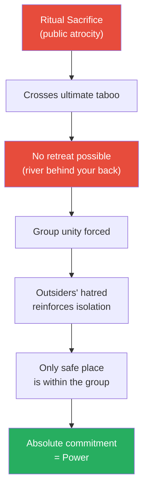
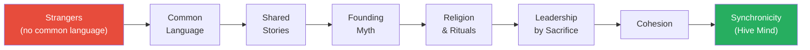
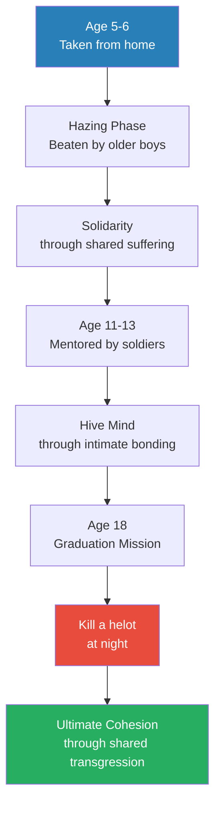
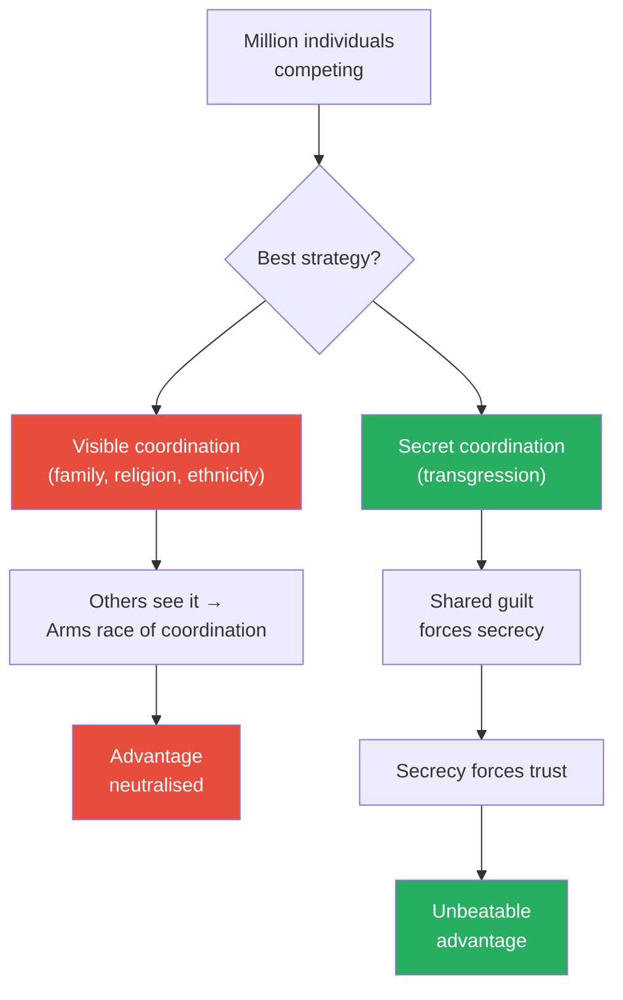
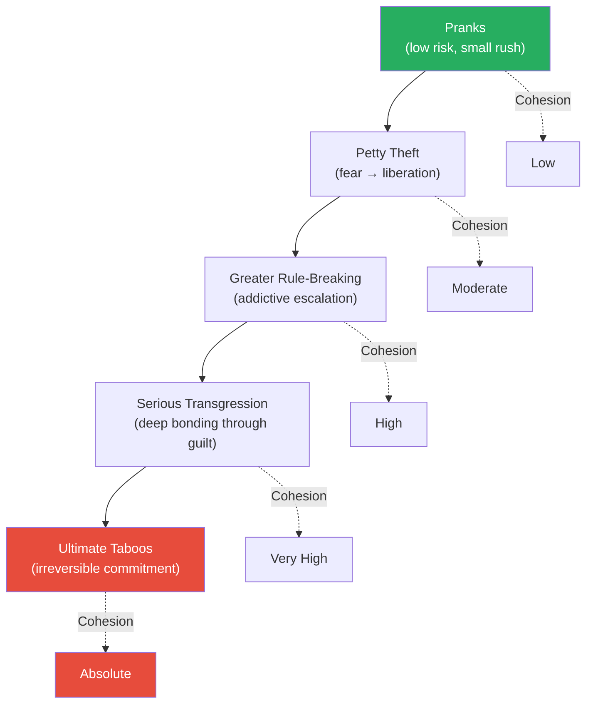
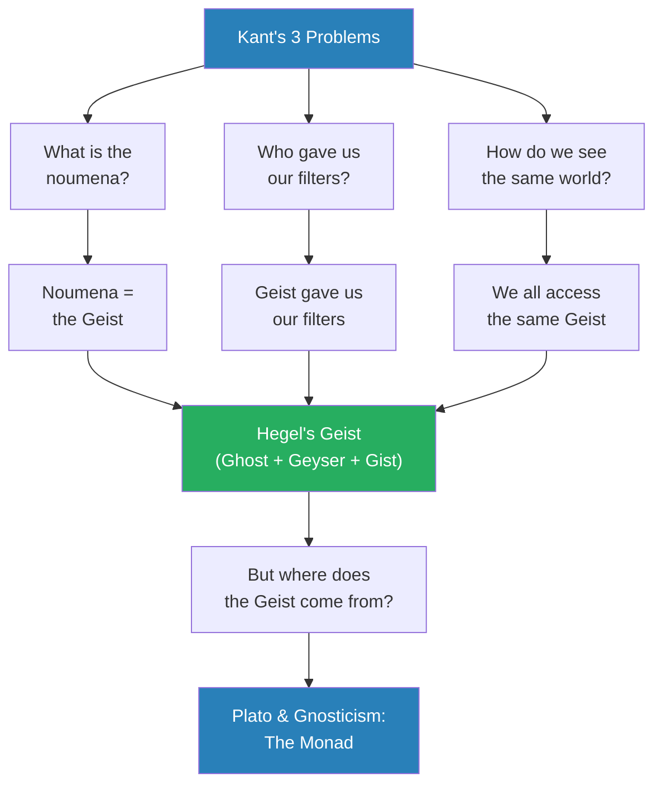
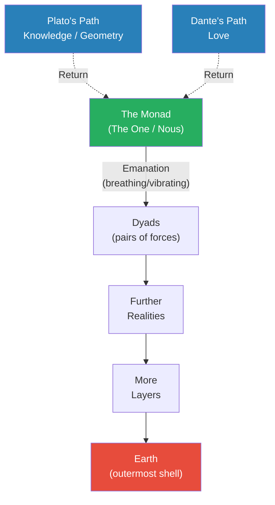

# How Evil Triumphs

> Prof. Jiang asks the most unsettling question of the series so far: why does evil win? Beginning with the claim that ritual sacrifice — from the Aztecs to the Romans to modern Gaza — is not barbarism but a deliberate power strategy, he builds a layered argument through a thought experiment about men stranded on a monkey-infested island, military history from Sparta to Macedonia, game theory, and metaphysics. The answer he arrives at is transgression: the deliberate breaking of taboos is the most powerful coordination mechanism available, because shared guilt forces secrecy, secrecy forces trust, and the feeling of breaking rules is addictive and escalating. He then constructs a metaphysical framework — from Kant through Hegel to Plato and Dante — to explain why transgression generates what its practitioners experience as "divine energy."

---

## Overview: Key Highlights

- <b style="color: #27ae60">Public atrocity is a strategy, not madness</b> — ritual sacrifice creates a point of no return that forces total group unity, like fighting with a river behind your back
- <b style="color: #e74c3c">Ritual sacrifice runs through all of history</b> — from the Aztecs to the Phoenicians to the Romans to the modern era, the mechanism is identical
- <b style="color: #2980b9">Cohesion and synchronicity</b> — extreme adversity produces hive-mind coordination deeper than family bonds, where members can sense each other's distress across any distance
- <b style="color: #27ae60">Leadership comes from sacrifice, not wisdom</b> — the 15-year-old who cuts off his hand wins over the 65-year-old with the best speech
- <b style="color: #2980b9">The Spartan agoge</b> — the ancient world's most detailed proof that systematic hazing, bonding, and ritual killing produce unbreakable military cohesion
- <b style="color: #e74c3c">Transgression is the optimal coordination strategy</b> — game theory proves that secret coordination beats visible coordination, and transgression is the only form that is inherently self-concealing
- <b style="color: #27ae60">Greater transgression equals greater cohesion</b> — the escalation ladder runs from pranks to petty theft to the ultimate taboos, each step increasing both the rush and the bond
- <b style="color: #2980b9">Kant's noumena/phenomena</b> — we never see objective reality, only reality filtered through our mental architecture of space and time
- <b style="color: #2980b9">Hegel's Geist</b> — the spiritual world (ghost + geyser + gist) is the true reality underlying the material world, solving Kant's three problems
- <b style="color: #2980b9">The Monad</b> — Plato and Gnosticism's supreme spiritual source from which all reality emanates; purpose of life is to return to it
- <b style="color: #27ae60">Two paths back to the Monad</b> — Plato says knowledge (elitist), Dante says love (universal); the powerful suppress both by keeping everyone focused on the material world
- <b style="color: #e74c3c">The powerful invert the model</b> — they claim their god is the good one and the Monad is evil, rationalising their power by denying the spiritual world

| Concept | One-line summary |
|---------|-----------------|
| **Ritual sacrifice** | Public killing of enemies or innocents as a deliberate strategy to unify the perpetrators |
| **"River behind your back"** | Chinese military stratagem: eliminate retreat to force total commitment |
| **Cohesion** | Deep mutual understanding within a group — like brothers, like family |
| **Synchronicity** | When people act in unison, thinking and behaving as one — a hive mind |
| **Transgression** | Deliberate breaking of taboos as a coordination mechanism — greater transgression = greater cohesion |
| **Noumena / Phenomena** | Kant: the real world (noumena) vs. the world we perceive (phenomena) |
| **Geist** | Hegel: the spiritual reality underlying the material world — ghost + geyser + gist |
| **The Monad / Nous** | Plato/Gnosticism: the supreme spiritual source from which all reality emanates |
| **Plato's path** | Return to the Monad through knowledge and geometry — elitist |
| **Dante's path** | Return to the Monad through love — egalitarian, accessible to all |

---

# The Lecture

## Why Ritual Sacrifice Is a Strategy, Not Madness [0:00 - 9:28]

*Prof. Jiang opens with the most provocative claim of the semester: that public atrocity is not a failure of civilisation but a calculated tool of power. He traces ritual sacrifice from the Aztecs through the Phoenicians and Romans to modern Gaza, then introduces the Chinese military stratagem of "fighting with a river behind your back" to explain why the public nature of the atrocity is the entire point.*

> [!tip] Core Insight
> Public atrocity is not a sign of madness or loss of control. It is the oldest coordination mechanism in human history — a deliberate act that eliminates retreat and forces total group commitment by making the perpetrators permanent outcasts.

*The logic of ritual sacrifice mirrors the Chinese military stratagem: by crossing the ultimate taboo publicly, a group eliminates every possible exit, transforming the world's condemnation into the binding force that makes them unbeatable.*

> [!note]- Expand: Full Lecture Detail
> Prof. Jiang opens by warning the class that the topics ahead will be "extremely disturbing" and that certain words cannot be spoken because the lecture will go on YouTube — he will write them on the board instead. He frames the entire lecture as speculation and theory-building: "Do not take this as gospel. Do not believe this is the truth. The entire point of this class is to help you develop the theories and the ideas to better understand the world. These are tools. This is not truth. These are tools."
>
> He begins with what is happening in Gaza, framing it not as mere warfare but as deliberate <b style="color: #e74c3c">ritual sacrifice</b> — a pattern he traces across civilisations:
>
> - The **Aztecs** — temples excavated with thousands of human skulls; mass human sacrifice preceded war
> - The **Phoenicians/Carthaginians** — practised child sacrifice; condemned by Rome (to be discussed later in the semester)
> - The **Romans** — after every major war, captured enemy leaders were paraded through the streets in a ceremony called <b style="color: #2980b9">the triumph</b>, then strangled at the Temple of Jupiter as an offering to their god
>
> He then poses the critical puzzle: why do this publicly?
>
> - Prof. Jiang points out that if the goal were simply elimination, there are far more effective and discreet methods available — "you could just poison their water, or you could poison the air so that everyone gets a fast cancer"
> - In 20-30 years the population would be gone, and "it would be a very secret"
> - Instead, they choose to do this in front of the world — and Prof. Jiang argues this is intentional
> - <b style="color: #27ae60">The public nature is not a flaw in the strategy — the public nature IS the strategy</b>
>
> He introduces a famous Chinese military stratagem: <b style="color: #2980b9">背水一战 (fight with a river behind your back)</b>
>
> - When an army is losing and scattered, the general forces a retreat to a river
> - With the river blocking escape, soldiers have two choices: drown or fight to the death
> - Most choose to fight — "and so at this point, the soldiers are unified, they're galvanised, they're energised, and then they find a surge of energy to go and destroy their enemy"
> - Prof. Jiang calls this "the most popular military stratagem in ancient Chinese history"
>
> A student asks: what is the "river" in this analogy?
>
> - Prof. Jiang's answer: the "river" is the taboo itself — crossing the line of what is universally condemned
> - Once a group has crossed that line publicly, there is no going back — "you either go all the way or the world comes and destroys you anyway"
> - He notes that when members of the perpetrating group travel abroad, they deliberately provoke confrontation — shouting inflammatory slogans on public transport, starting fights
> - This is not spontaneous rage — it is intentional self-isolation, designed to make the outside world hostile so that the only safe place is within the group
>
> > [!abstract] Ritual Sacrifice Across Civilisations
> > | Civilisation | Form of Sacrifice | Key Detail |
> > |-------------|-------------------|------------|
> > | Aztecs | Mass killing before war | Thousands of skulls found in temple excavations |
> > | Phoenicians / Carthaginians | Child sacrifice | Condemned by Rome; to be discussed later in semester |
> > | Romans | The Triumph — parade and strangle enemies | Captured leaders strangled at Temple of Jupiter |
> > | Sparta | Helot-killing as graduation | Young soldiers slit helots' throats at night |

---

## The Monkey Island Thought Experiment [9:28 - 19:04]

*Prof. Jiang constructs the lecture's central model — a parable about 100 men from different countries, speaking different languages, stranded on an island surrounded by infinite flesh-eating monkeys. Through survival pressure, they develop a common language, a founding myth, a religion, rituals of bonding, and ultimately a leader chosen not for wisdom but for willingness to suffer. The thought experiment maps exactly onto how real military forces and secret societies form.*

*Under extreme adversity, strangers progress through a predictable sequence — from no shared identity to telepathic-level coordination — in a process that mirrors how real military forces and secret societies form throughout history.*

> [!note]- Expand: Full Lecture Detail
> Prof. Jiang sets up the thought experiment with precise conditions:
>
> - An island with a safe hill at the centre, surrounded by flesh-eating monkeys everywhere else
> - All resources (trees, food, rivers) are in monkey territory
> - 100 men, aged 15 to 65, from different countries, speaking different languages, all poor and uneducated, are mysteriously transported to the safe spot
> - The situation is utterly hopeless — infinite monkeys, no escape, no common language, no shared culture
>
> Despite every reason to lie down and die, the opposite occurs:
>
> - They develop a <b style="color: #2980b9">common language</b> rapidly, out of necessity — "some speak Chinese, some speak English, some speak Spanish, some speak Russian. Doesn't matter, they will very quickly develop a common language"
> - They share stories of where they come from, and these stories become a <b style="color: #2980b9">founding myth</b> — the stories blend into a single narrative: why are we here?
> - The founding myth crystallises into a belief: God has chosen them to save the world — "and that's why they're here"
> - This belief becomes a <b style="color: #2980b9">religion</b>, complete with rituals that reinforce bonding — including sexual intimacy between the men, "not out of preference but to create intimacy and bonding among them"
>
> ### Leadership by Sacrifice, Not Wisdom
>
> - Prof. Jiang presents the leadership contest as a choice between two candidates:
>   - **The 65-year-old:** wise, experienced, strategic — "he delivers a very powerful speech, inspiring everyone and telling people how they can survive"
>   - **The 15-year-old:** "he is not articulate. He has no ideas. What he does is this, he stands in front of everyone, and he's bold and he's brave, and he looks at everyone without saying a word. He shows them his hand... then from his pocket, he takes out a knife, and then he cuts off his hand in front of everyone, and he does not cry"
> - Who does everyone choose? "The second person, obviously" — the one who has demonstrated <b style="color: #27ae60">sacrifice, commitment, and devotion</b>
> - "The Old Man has ideas, and he will become the advisor to the leader, but the leader is the man who is most willing to die for everyone else"
>
> ### Cohesion, Synchronicity, and the Hive Mind
>
> - Over years of fighting together, the group develops <b style="color: #2980b9">cohesion</b>:
>   - "They will understand each other better than they understand their own children and their own wives"
>   - Different backgrounds become irrelevant — shared experience overwrites everything
> - Cohesion produces <b style="color: #2980b9">synchronicity</b> — "when people act in unison together"
>   - Prof. Jiang compares it to a sports team: "how is that soccer team able to work together? Well, because of synchronicity, because their minds are alike"
>   - He calls this a <b style="color: #2980b9">hive mind</b> — "they're able, literally, to think and act as one"
>
> > [!example] The Mother's Intuition
> > - A mother's child goes to France on vacation
> > - While abroad, the child is hit by a car and hospitalised
> > - The child has not called; the mother has received no information
> > - "But in your heart, would you know it? The answer is yes"
> > - She starts calling frantically, contacts the police — driven by a feeling she cannot explain
> > - "Something in your heart is telling you, I need to get in touch with my son"
> > **The lesson:** Synchronicity is not metaphor. It is a real phenomenon that emerges from deep enough cohesion — whether in families, military units, or secret societies.
>
> > [!example] The Grenade and the Rope Bridge
> > - Ten men are collecting wood when 100 monkeys attack
> > - Nine cross a rope bridge to safety; you are the last, with monkeys descending
> > - If the monkeys cross, your comrades die — "so what do you do in this situation? You cut the rope"
> > - This mirrors soldiers in trench warfare jumping on grenades — "there's not enough time to pick up that grenade and throw it away, so what soldiers do is they will jump on the grenade and absorb the explosion"
> > - "It happens instantaneously. No one thinks about it. You just do it because what matters is saving your comrades"
> > **The lesson:** When cohesion reaches its peak, self-preservation disappears. The individual becomes a cell in a larger organism, and the organism's survival overrides everything.
>
> ### Strange Rituals Born of Extremity
>
> - Prof. Jiang notes that the group develops rituals that would appear bizarre to outsiders:
>   - **Funeral rituals:** when a member sacrifices himself, an elaborate funeral is held — "this may involve you cutting that person into different pieces and eating that person"
>   - "You will develop really strange rituals" — from the outside, they seem insane; from inside the group, they are sacred acts reinforcing the founding religion
>
> ### The Return to the Real World
>
> - After 20 years on Monkey Island, the 100 men are transported back to their old lives
> - They have memories of everything — twenty years of shared hell, shared language, shared religion
> - What happens:
>   - They seek each other out and reassemble — the bond is permanent
>   - They share their experience, rituals, and religion with their children and grandchildren
>   - "Over time, what will happen is that you guys will conquer the world. You will become the secret elite"
>   - "There may be presidents, there may be famous people, but secretly, you're the ones who are in control"
> - A student asks: what if the real world already has leaders?
>   - Prof. Jiang's response: "On the surface, there are leaders, but the real power are you guys" — the Monkey Island group's cohesion gives them an invisible advantage no visible leader can match

---

## Historical Proof: Sparta, Thebes, and Macedonia [19:04 - 30:38]

*Prof. Jiang moves from thought experiment to historical evidence — three military societies that demonstrate the same cohesion mechanism in action. Sparta's agoge systematically moved boys through hazing, mentorship, and ritual killing. Thebes copied the system but made it voluntary. Macedonia copied Thebes, improved it, and conquered the known world.*

*Each society inherited the cohesion system from its predecessor, adapting it — Sparta's brutality became Thebes' voluntarism, which became Macedonia's world-conquering machine.*

*The Spartan agoge systematically moved boys through the exact stages of the Monkey Island model — from shared suffering to intimate bonding to transgressive violence — producing the most feared warriors in the ancient world.*

> [!note]- Expand: Full Lecture Detail
> Prof. Jiang introduces Sparta by referencing the movie 300 — "300 is really about 300 Spartan soldiers who are fighting hundreds of thousands of Persian soldiers" at the Battle of Thermopylae. The 300 made a final stand rather than retreat, and their leader Leonidas was beheaded, his head put on a pike. "Eventually, the Greeks, inspired by the sacrifice of Leonidas, they will repel the invasion and destroy the invaders."
>
> ### The Spartan Agoge
>
> - **Phase 1 — Hazing (ages 5-6):**
>   - Boys are taken from their homes and placed in a school run by older boys (10-11)
>   - "What happens, as you can imagine, is the older boys beat the crap out of the younger boys. From day one, there's no education. They're not learning anything."
>   - This <b style="color: #2980b9">hazing</b> builds solidarity — "these young boys, who are five and six, they learn to love each other, because only by helping each other can they survive the brutality"
>   - Prof. Jiang draws parallels to fraternity initiation and sports team bonding
>
> - **Phase 2 — Mentorship (ages 11-13, at puberty):**
>   - Each boy is mentored by an older soldier (28-30) who has a family
>   - The relationship includes sexual bonding — which Prof. Jiang contextualises: "at this time in history, there's no concept of homosexuality. It was perfectly permissible. No one cared"
>   - "If you're out at war for like, years and years, and there's no woman around, you're gonna have sex with other men. It's a very natural thing to do. It doesn't mean you're homosexual"
>   - Purpose: "these young boys learn to think like in a hive mind. They learn to be part of a larger group"
>
> - **Phase 3 — Graduation (age 18):**
>   - Final mission: hunt <b style="color: #2980b9">helots</b> (slaves/serfs who worked Spartan fields)
>   - Helots had a curfew — anyone outside after dark could be killed
>   - "As a graduation mission, these young soldiers hide in the fields at night... they look for helots to come back because they're late, and what they'll do is they'll sneak up behind the helot and cut their throats"
>   - <b style="color: #e74c3c">This is ritual sacrifice disguised as a graduation exercise</b> — killing bound them permanently to the group
>
> Prof. Jiang emphasises the paradox: "Only there are thousands, thousands of city states in Greece, only Sparta did this, and it made everyone think Sparta was disgusting. Everyone hated Sparta, but it kept Sparta unified."
>
> ### The Sacred Band of Thebes
>
> - Thebes copied the Spartan system but made a critical innovation: <b style="color: #27ae60">they made it voluntary</b>
>   - "In Sparta, you have to be an elite to be part of the system. But in Thebes, anyone could join"
>   - 300 soldiers, all paired as lovers — the <b style="color: #2980b9">Sacred Band</b>
>   - "They were the vanguard. They were the spearhead. They would be the first in battle, and they were so ferocious that their enemies would run away"
>
> ### The Macedonian Iteration
>
> - Philip II of Macedon learned the system from Thebes — "at first, Macedonia and Thebes were allies"
> - "Philip second was very ambitious" — he adopted and improved the system, building the greatest army in the ancient world
> - His son, Alexander the Great (whom Prof. Jiang notes students may not realise was Macedonian), took this army and conquered Persia
>
> > [!example] The Sacred Band's Last Stand at Chaeronea (338 BCE)
> > - Philip II grew ambitious and turned against his former ally Thebes
> > - At the Battle of Chaeronea, Macedonia fought the combined armies of Thebes and Athens
> > - "Macedonia destroyed Thebes and Athens, because Macedonia basically copied the system from Sparta and Thebes"
> > - When all was lost, the Sacred Band stood in the middle of the field
> > - "They blocked the advance of Macedonian charge so that everyone could escape back into the cities"
> > - "They did not fear death. For them, what mattered was honour and sacrifice, and that's how you create the greatest army in the world"
> > - Every single member of the Sacred Band was killed
> > **The lesson:** The system works. Voluntary bonding through love produces the same military effectiveness as Sparta's coercive system — and the ultimate proof is warriors who choose death over retreat, not because they are ordered to, but because the bond demands it.

---

## Why Cheating Wins: The Game Theory of Coordination [30:38 - 33:07]

*Prof. Jiang shifts from history to abstract logic — using game theory to explain why transgression is not merely one strategy among many, but the optimal strategy for winning power. Visible coordination (family, religion, ethnicity) triggers an arms race. Only secret coordination — specifically, coordination through shared transgression — is inherently self-concealing.*

*Game theory reveals why transgression is the optimal coordination strategy — it is the only form of coordination that is self-concealing, because participants must hide their actions to survive.*

> [!note]- Expand: Full Lecture Detail
> Prof. Jiang sets up the thought experiment: a million people competing against each other, but only one can win.
>
> - "According to game theory, the best way to win a game is by — does anyone know? — cheating"
> - "If you follow rules, you will never win the game. You have to cheat"
> - The best form of cheating: coordinating with others while everyone else plays alone
> - <b style="color: #27ae60">Coordination gives an enormous advantage over individuals</b>
>
> **The problem with visible coordination:**
>
> - Family, religion, ethnicity, shared language — these are all coordination mechanisms
> - But they are visible — "the moment that people start coordinating, it forces an arms race of coordination"
> - "Maybe these four are going together, these four now are forced to work together, which now forces these five to work together"
> - Visible coordination neutralises itself
>
> **The solution:**
>
> - "You have to coordinate without people knowing you actually coordinating together. You have to conspire secretly"
> - The only coordination mechanism that is <b style="color: #27ae60">inherently invisible</b> is transgression — shared guilt forces secrecy by definition

---

## Transgression: The Engine of Power [33:07 - 40:55]

*Prof. Jiang names the mechanism that connects all the preceding arguments — transgression, the deliberate breaking of taboos — and traces its escalation from playground pranks to the ultimate taboos. He proposes a direct relationship: the greater the transgression, the greater the cohesion. He then connects this to secret societies and the "puppet structure" of visible power.*

> [!tip] Core Insight
> The mechanism is self-reinforcing: transgression creates guilt, guilt requires secrecy, secrecy requires trust, trust produces cohesion, cohesion produces synchronicity, and synchronicity produces power that no group bonded by conventional means can match. The worse the act, the stronger the bond.

*Each step up the transgression ladder increases both the rush and the bonding — small acts create small secrets, but extreme acts create unbreakable bonds because the consequences of exposure are total.*

> [!note]- Expand: Full Lecture Detail
> Prof. Jiang proposes the theory directly: <b style="color: #27ae60">"The greater you transgress, the greater your cohesion, which leads to synchronicity."</b>
>
> He explains the underlying logic:
>
> - "You're breaking the rules, you're cheating, and therefore everyone wants to put you in prison, which means that the only way that you can survive is if you keep the secret among your group — which forces cohesion"
>
> Then he walks students through the escalation ladder:
>
> - **Level 1 — Pranks:** "Six of you decide, we're going to cover all the rooms with toilet paper. It's a joke. It's a prank. But obviously you don't want to get caught, because the school will punish you, and this joke will make you more cohesive, because now you have a secret amongst yourself, and anyone betrays you, you're all screwed"
>
> - **The addictive rush:** "When you transgress, when you break a taboo, you feel empowered, you feel liberated, and it becomes addictive. You fill the school with toilet paper. You're like, that was a lot of fun. Why was it fun? Because you broke the rules. You feel I'm more powerful than my teacher"
>
> - **Level 2 — Petty theft:** "Let's go to store and steal a candy. That candy may cost $1, nothing. But you try it, and you are terrified. You're seized by doubt. You're seized by fear... your mother, your teachers, everyone told you, stealing is bad. But when you actually go and do it, how do you feel? You feel energised, you feel liberated, you feel empowered. And if your friends were with you, the group becomes much more unified, much more cohesive, much more synchronised"
>
> - **Level 3 and beyond:** "You keep on going, because it's addictive, and ultimately, there's a transgression that is the ultimate taboo" — acts so extreme Prof. Jiang writes them on the board but will not say them on YouTube
>
> - **The top of the ladder:** Killing, particularly acts against children; incest — "those who can do it, they feel as though they are now inundated, that now they are now filled with divine energy. They found the secret of the universe. They found the ultimate power in the world"
>
> **The connection to secret societies:**
>
> - Prof. Jiang argues that secret societies practising extreme transgression exist — performing these acts publicly within the group
> - "Now we know why these people control the world, because they're able to keep secrets, because they're more motivated than everyone else, and they're able to work together in a way that allows them to achieve ultimate power"
> - The visible leaders of society — presidents, celebrities, public figures — "they are puppets. They are just the face. The real power are the secret societies that practice these rituals"
> - He qualifies carefully: "I'm not saying this is a truth. I'm just saying this is a possible theory about how the world works"
> - His assessment of the practitioners: "just because they're elite, just because they're powerful people, does not mean they're clever. In fact, they're kind of stupid, if you actually meet them"
> - But stupid or not, the mechanism works — "I'm going to explain how this system works, and when I explain to you, it will make sense"

---

## The Metaphysical Framework: Kant and Hegel [40:55 - 47:10]

*Prof. Jiang shifts from mechanism to meaning, beginning with Kant's revolution — we are active participants in constructing reality, not passive absorbers of it — and Hegel's solution to the three problems Kant creates. The Geist, unpacked through three English derivatives (ghost, geyser, gist), becomes the foundation for explaining why transgression generates what practitioners experience as spiritual power.*

*Each philosopher builds on the one before: Kant identifies the problems, Hegel provides the framework, and Plato/Gnosticism supply the origin story — a philosophical chain that Prof. Jiang weaves into a unified model of reality.*

> [!note]- Expand: Full Lecture Detail
> Prof. Jiang reintroduces <b style="color: #2980b9">Immanuel Kant</b> from the first lecture:
>
> - "Before, the assumption was that we just absorb reality, but Kant says that we are active participants in reality"
> - "Our brains are filters. We add space and time to reality. Space and time does not exist outside of us"
> - The <b style="color: #2980b9">noumena</b> (things-in-themselves) = objective reality, which we can never directly access
> - The <b style="color: #2980b9">phenomena</b> (things-as-we-see-them) = reality filtered through our mental architecture
> - "This has been confirmed by neuroscience. So this is basically the most accurate model of the world that we have"
>
> **Three unsolved problems Kant creates:**
>
> 1. **What is the noumena?** — "Kant says we can never know it, but we still want to know it"
> 2. **Who gave us these filters?** — "Where do our filters come from? How do our minds work, and who created our minds in the first place?"
> 3. **How do we know we see the same world?** — "If we are all seeing the world through our own lens, how do we know that we're seeing the same world?"
>
> Prof. Jiang introduces <b style="color: #2980b9">Friedrich Hegel</b> and his solution:
>
> - The noumena is the <b style="color: #2980b9">Geist</b> — "what Hegel is saying is that the spirit world is what creates the material world. We are just a shell. What really matters is the spirit world"
> - He unpacks the Geist through three English words derived from it:
>   - **Ghost** — "a parallel reality that exists alongside us, a spiritual world"
>   - **Geyser** — "a force that is exploding or becoming or expanding. So this Geist is constantly expanding and becoming"
>   - **Gist** — "the essence of things, the core things"
> - "The real truth in the world is the Geist, not what we see, but what is invisible to us"
>
> The Geist solves Kant's three problems:
>
> 1. The noumena = the Geist (the spiritual world is the real world)
> 2. The Geist gave us our filters
> 3. Because we all access the same Geist, we see the same world

---

## Plato, Gnosticism, and Two Paths to the Monad [47:10 - 54:12]

*Prof. Jiang pushes the chain one step further: where does the Geist itself come from? The answer comes from Plato and Gnosticism — the Monad, a supreme spiritual source that emanates reality outward in layers. Earth is the outermost shell. The purpose of life is to return inward. Plato says the path is knowledge; Dante says the path is love. The debate between them has enormous consequences for understanding evil.*

*Reality emanates outward from the Monad like ripples from a stone. Earth sits at the outermost edge — furthest from the source. The purpose of life is to travel back inward, and Plato and Dante offer two different maps for the journey.*

> [!note]- Expand: Full Lecture Detail
> Prof. Jiang introduces <b style="color: #2980b9">Plato</b> and a religious tradition called <b style="color: #2980b9">Gnosticism</b> (from gnosis — knowledge):
>
> - In the beginning: the <b style="color: #2980b9">Monad</b> (also called the One, or the Nous) — "just think of this as a supreme god, the Big Bang, the force, or like the sun, almost. The spiritual sun of the universe"
> - "The Nous works by breathing. When he breathes, he vibrates his divine power, and through this, he creates new beings called dyads"
> - <b style="color: #2980b9">Dyads</b> are pairs of forces; they create further realities, layer upon layer
> - Earth is the outermost shell — the furthest point from the Monad
> - "What Plato and Gnostics are telling us is that the Geist is a multi-layer, multi-dimensional world that we access all the time"
>
> **The purpose of life:**
>
> - <b style="color: #27ae60">To return to the Monad</b> — "this is actually the framework for a lot of religions, including Hinduism and Buddhism. Nirvana is to return to the Monad"
>
> **Plato's path — knowledge:**
>
> - "Through the pursuit of knowledge, philosophy, the love of knowledge, you can return to the Monad"
> - Specifically sacred geometry — "he thinks that geometry is really the language of the universe, the secret language of the universe"
> - This is inherently <b style="color: #e74c3c">elitist</b>: "only if you come to my school and you learn geometry, sacred geometry, you access heaven"
>
> **Dante's path — love:**
>
> - "The Monad is love. And the Monad, because he creates things, his divine spark emanates throughout the universe"
> - "This divine spark is called love. So we are able to love people, mothers love children, you love each other because of this divine spark in you"
> - <b style="color: #27ae60">The more you love, the more you return to the Monad</b>
> - Dante's critique of Plato: "that's the most ridiculous thing in the world" — the Monad would not create a system only the educated elite could use
> - "Not that many people in the world can do calculus — but everyone can love"
>
> > [!abstract] Two Paths to the Monad
> > | Path | Thinker | Method | Access | Critique |
> > |------|---------|--------|--------|----------|
> > | Knowledge | Plato | Philosophy, sacred geometry | Elite only — requires education | Excludes most of humanity |
> > | Love | Dante | Unconditional love, free will | Universal — everyone can love | May be too simple to be true |
>
> ### The Source of Evil
>
> - **Plato's answer — indifference to the material:**
>   - "This world doesn't matter. Who cares if they control this world. It's a fake shadow world. Ignore them"
>   - "Give them what they want — their power, their fame, their money. Who cares?"
>   - Focus on the pursuit of knowledge — that is the only thing that brings you closer to the Monad
>
> - **Dante's answer — free will as love's price:**
>   - "If the monad is love, love is trust, so the monad loves us, and as a result, the monad gives us free will"
>   - Free will can lead to bad things — "but he has no choice in the matter, because for him to interfere means to take away our free will"
>   - "Now and then, what he will do is he will send messengers to our world" — Plato, Dante, Jesus — "who will then tell us the truth, but it's our choice"
>   - "The monad has given us free will"
>
> ### How Transgression Works in the Metaphysical Model
>
> - If the Geist is a multi-layered structure containing all realities, then transgression is a <b style="color: #27ae60">tuning mechanism</b>
> - "Think of the internet. There are millions and millions of websites. By doing the same evil act, what the powerful have done is they've locked on to the same website"
> - "Because they locked on to the same website, it allows for synchronicity. It allows for them to think alike and to behave the same way"
> - The sacrifice is not random violence — it occurs within a religious framework: "They don't do sacrifice as personal sacrifice. They do sacrifice as a consummation of their religion, because that's what their religion demands of them"
> - The powerful <b style="color: #e74c3c">invert the model</b>: "in their conception, the monad is the evil one, their god is the good one. They're liberating us from the monad by making us more focused on the material world"
> - Science, in this view, is a tool of the powerful — "science is negation of a spiritual world and the validation of the material world. If you cannot see it, it must be fake"

---

## Student Q&A — Testing the Model [54:12 - End]

*The Q&A section is unusually rich — the students push the model to its logical limits. A student follows up on pensioners from the previous lecture. Amber asks the lecture's sharpest question: if sacrifice creates love among perpetrators, does it bring them closer to the Monad? Another student presses on why the Monad allows evil. Prof. Jiang's responses reveal dimensions the main lecture only implied.*

> [!tip] Core Insight
> The powerful maintain their position by keeping everyone focused on the material world — the outermost shell, the prison. Science, education, and economic competition all serve this function: they make the material world feel like the only reality, which is exactly what the powerful need to preserve their control.

> [!note]- Expand: Full Lecture Detail
> ### Why do governments serve the elderly?
>
> - A student follows up on the previous lecture's discussion of pensioners controlling society
> - The student observes that Chinese government policies visibly benefit the elderly — "creating more, say, entertainment or facilities that benefit them"
> - Prof. Jiang's answer: "from the first day, you're taught to respect your elders... elderly people are worth emulating... they're what's most precious about our society. So it makes sense that the government would create policies to most benefit the elderly"
>
> ### If sacrifice creates love among perpetrators, does it bring them closer to the Monad?
>
> - Student Amber asks the lecture's sharpest question, cutting to the heart of a paradox:
>   - If transgression creates intense bonding among perpetrators — a form of deep love and connection — doesn't that mean evil acts actually bring people closer to the divine?
>
> - Prof. Jiang's response is nuanced:
>   - The sacrifice is not independent — "it occurs within a religious framework. They're worshipping a certain God, and the sacrifice is an offering to that God"
>   - They are accessing a real part of the Geist — but a lower part, "where evil beings reside"
>   - The bonding is not genuine love in Dante's sense — it operates within a system designed to suppress authentic human connection
>   - Our society is fundamentally <b style="color: #e74c3c">anti-love</b>: "without school, your parents would just care about your happiness, but because of school, parents care about your grades and whether or not you get into an elite American college"
>   - "The parents deny your free will, they deny your agency, and as a result, you don't feel loved"
>   - Amber summarises: "The denial of free will is anti-love, and therefore it's evil. And making it limit you from getting closer to the Monad"
>   - Prof. Jiang confirms: "That's right, exactly"
>
> ### Why does the Monad allow this? What is the purpose of keeping us from it?
>
> - A student presses further: if the Monad is the truth, why do the powerful work to keep us from it?
> - Prof. Jiang: "because the people in power want to stay in power. What they're doing goes against the Monad, but they want to stay in power"
> - They gain power through transgression — "and now that they have this power, they need to rationalise why they have this power, and they need to develop systems to maintain this power. That's why we have the world we live in today"
>
> ### Does the Monad have two meanings?
>
> - A student gets confused about whether different thinkers define the Monad differently
> - Prof. Jiang corrects firmly: "The Monad does not have two meanings. It has one meaning with different names"
> - "It is the sun, the divine sun, the source of all life"
> - "Plato and Dante are debating how do you return to the Monad" — Plato through knowledge, Dante through love — but they agree on what the Monad IS
>
> ### Why do different religions arrive at the same conception of the universe?
>
> - A student asks why Plato, Dante, Hinduism, Buddhism, and Gnosticism all converge despite emerging independently
> - Prof. Jiang's answer: "where do our thoughts come from, and where do our thoughts go?"
> - "Neuroscience has never explained where thoughts come from — which is weird, because that should be the most basic question"
> - "Biologically, we all have the same neurological structure, but we have different ideas, and why is it that I have so many ideas, and others have limited ideas?"
> - If the Geist exists, different people in different places receive the same ideas through inspiration — "like tuning to the same radio frequency"
> - The convergence of independent religious traditions is not coincidence but evidence that they are all accessing the same underlying reality
> - "That makes a lot more sense than, 'Oh, the synapses in our brains fire together and hit like, oh, we have an idea'"
>
> > [!quote] Prof. Jiang
> > "Do not take this as gospel. Do not believe this is the truth. These are tools. This is not truth. These are tools."

---

## Connections

**Builds on:** [[03 - Death by Gerontocracy]] (pensioners controlling society, respect for elders in Chinese society), [[01 - How Power Works]] (Kant's epistemology introduced, concept of hidden power behind visible leadership)

**Sets up:** [[05 - The Birth of Evil]] (deeper exploration of evil's origins), future lectures on Phoenicians/Carthaginians, Alexander the Great, and extended study of Kant, Plato, Hegel, and Dante

**Related books in vault:** [[The 48 Laws of Power - Robert Greene]] (transgression as power tool, Law 1: Never Outshine the Master), [[The 33 Strategies of War - Robert Greene]] (death ground strategy parallels "river behind your back"), [[Sapiens - Yuval Noah Harari]] (shared myths as civilisation-builders)

---

## The Takeaway

This lecture marks a turning point in the Secret History series — the moment where Prof. Jiang moves from describing how power works and how societies collapse to explaining the active mechanism by which evil generates and maintains power. The argument is layered and cumulative: ritual sacrifice is a strategy, not madness; extreme adversity produces unbreakable cohesion; game theory explains why secret coordination beats visible coordination; and transgression is the only coordination mechanism that is inherently secret, inherently bonding, and inherently escalating. Each layer builds on the last, and each is supported by historical examples that stretch from ancient Sparta to the modern world.

The most counterintuitive insight is not that evil exists, but that evil wins precisely because it is evil. The mechanism is self-reinforcing: transgression creates guilt, guilt requires secrecy, secrecy requires trust, trust produces cohesion, cohesion produces synchronicity, and synchronicity produces power that no group bonded by conventional means can match. The worse the act, the stronger the bond. This is deeply uncomfortable — and Prof. Jiang acknowledges as much repeatedly — but the historical evidence he presents (Sparta, Thebes, Macedonia, Rome) suggests the pattern is real regardless of how disturbing its implications.

The metaphysical framework — Kant to Hegel to Plato and Dante — is explicitly presented as speculative, not factual. But it serves an important structural role in the series: it provides a vocabulary and a model that will recur throughout the remaining lectures. Whether or not one accepts the Gnostic model of emanating realities, the framework gives students a lens for understanding why the powerful invest so heavily in materialist worldviews, why they suppress spiritual traditions that emphasise love and knowledge as paths to transcendence, and why transgression feels — to those who practise it — like accessing something beyond ordinary experience. Prof. Jiang promises to go deeper into Kant, Plato, Hegel, and Dante as the semester continues. This lecture is the foundation.
