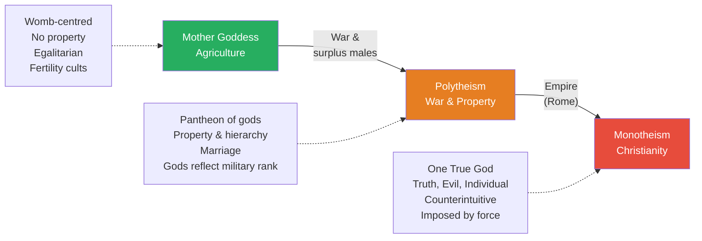
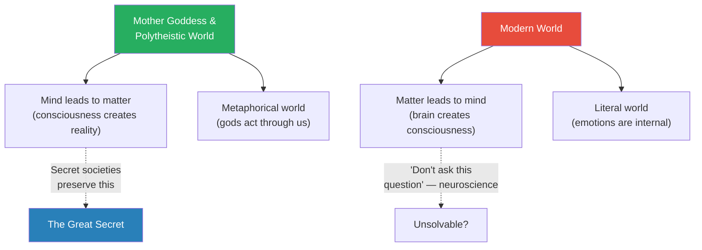
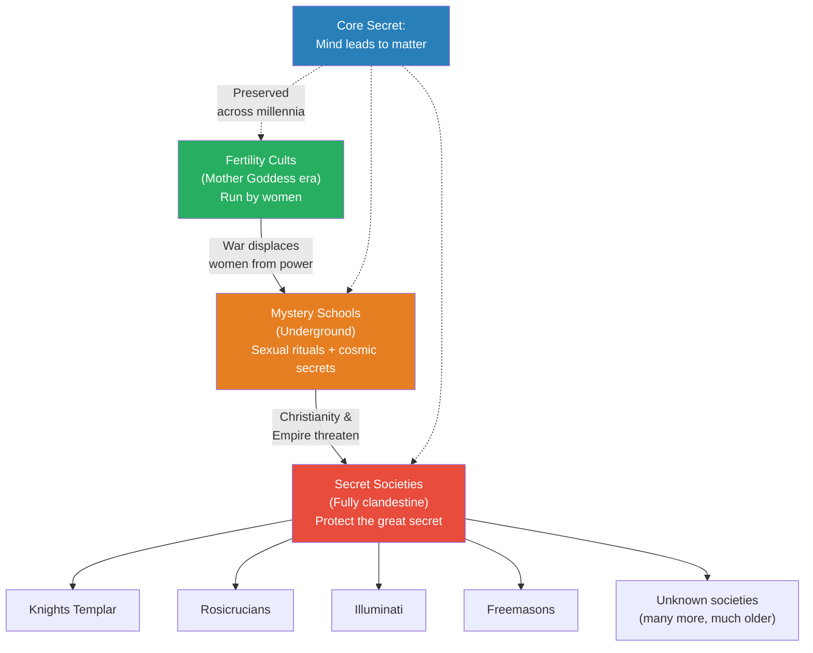
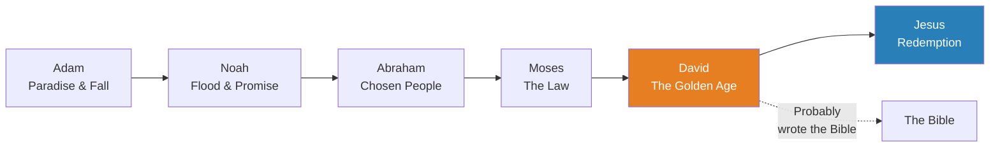
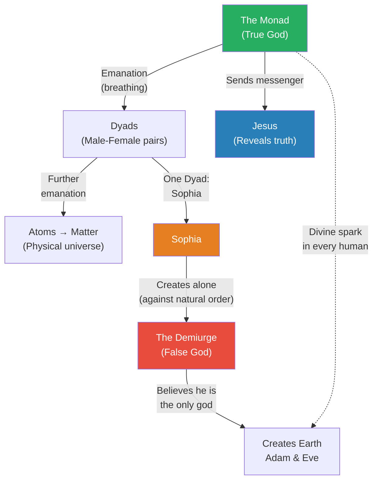
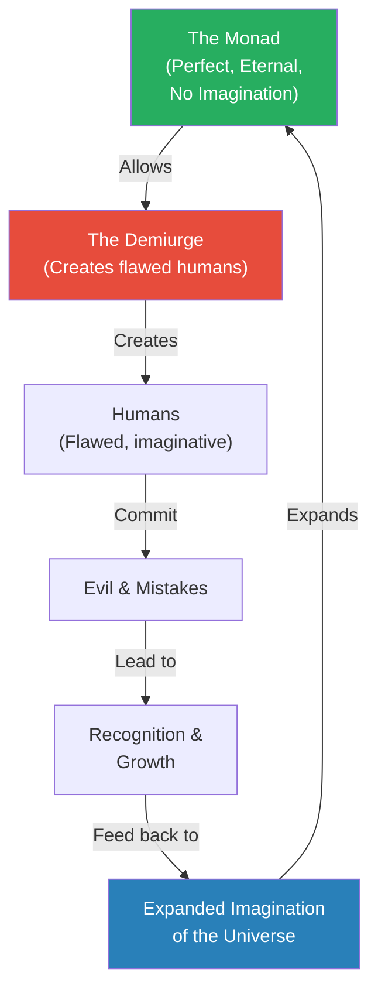
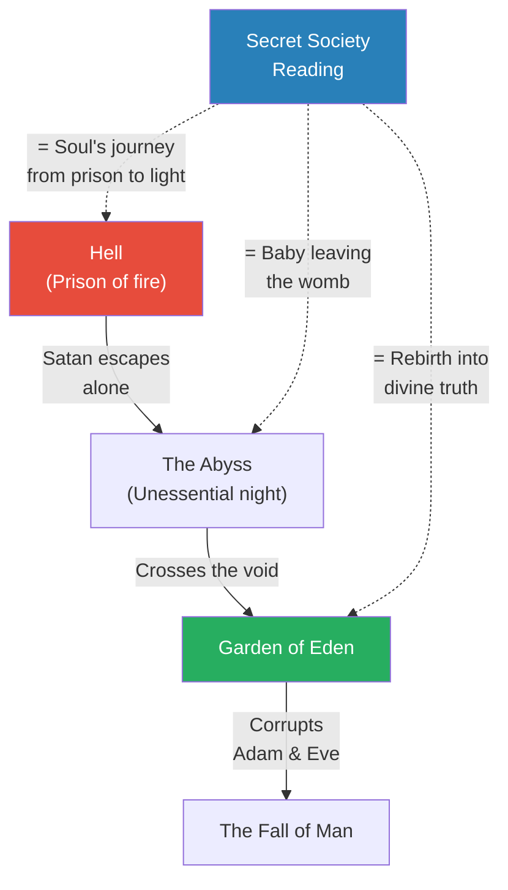
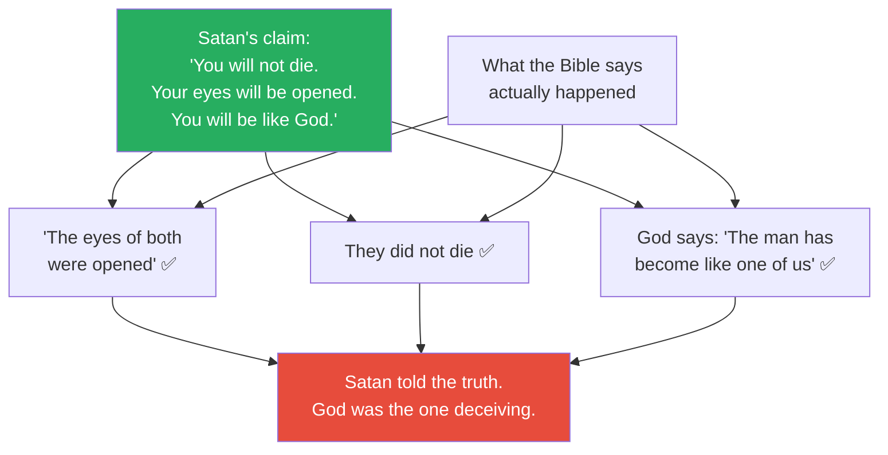

# The Birth of Evil

> Prof. Jiang traces the origin of the concept of "evil" itself — a concept he argues did not exist before monotheism. Starting with a sweeping history of Western religion across three stages (Mother Goddess, Polytheism, Monotheism), he shows how each transition was driven not by spiritual revelation but by material forces: agriculture, war, and empire. He then reveals what secret societies actually believe — a Gnostic cosmology in which the God of the Bible is a false god, Satan is a truth-teller, and Jesus was a cosmic messenger sent to remind humanity of the divine spark within. He closes by reading Genesis directly and demonstrating, line by line, that the Bible itself confirms the esoteric reading.

---

## Overview: Key Highlights

- <b style="color: #27ae60">Religion drove the transition to agriculture, war drove polytheism, empire drove monotheism</b> — each stage of Western religion was produced by material conditions, not spiritual revelation
- <b style="color: #2980b9">Mother Goddess civilisation</b> — womb-centred, egalitarian, no property, no marriage, fertility cults run by women
- <b style="color: #e74c3c">War created property, hierarchy, and marriage</b> — surplus young men formed wolf packs, raided for women, and gods were ranked by military outcomes
- <b style="color: #2980b9">Mind leads to matter</b> — the great secret that secret societies have preserved for millennia: consciousness creates reality, not the other way around
- <b style="color: #27ae60">Three concepts born from monotheism — truth, evil, and the individual</b> — counterintuitive ideas that now underpin modernity but had never existed before Christianity
- <b style="color: #e74c3c">The God of the Bible is a false god</b> — the esoteric tradition claims the Demiurge, an accidental monstrosity, created Earth as a prison
- <b style="color: #2980b9">The Monad</b> — the true God in Gnostic cosmology, a cosmic mind whose emanations create the universe through vibration
- <b style="color: #27ae60">Jesus was a cosmic messenger sent by the Monad</b> — not the son of the Demiurge but a being who came to reveal the truth and was killed for it
- <b style="color: #2980b9">The Nephilim</b> — children of angels and humans who enslaved humanity; secret societies believe they still control the world today
- <b style="color: #e74c3c">Satan tells the truth in Genesis</b> — when you read the Bible line by line, every claim Satan makes is confirmed by the text itself
- <b style="color: #2980b9">Paradise Lost</b> — Milton's epic poem, used by secret societies as a sacred text encoding the secrets of the universe
- <b style="color: #27ae60">The divine spark inside every person</b> — the true God is not above you but within you, and believing in yourself is the ultimate secret

| Concept | One-line summary |
|---------|-----------------|
| **Mother Goddess civilisation** | Womb-centred, agricultural, egalitarian world with fertility cults and no concept of property |
| **Mind leads to matter** | The great secret: consciousness creates reality, not the other way around |
| **Metaphorical vs. literal world** | Ancients understood reality through metaphor; moderns insist on literal interpretation |
| **The three concepts of monotheism** | Truth, evil, and the individual — born with Christianity, now underpin modernity |
| **Mystery Schools** | Underground organisations preserving pre-Christian knowledge and rituals |
| **The Monad** | The true god in Gnostic cosmology — a cosmic mind whose emanations create the universe |
| **The Demiurge** | A false god, created by accident, who built Earth as a prison and is the God of the Old Testament |
| **The Nephilim** | Children of angels and humans who enslaved humanity; secret societies believe they still rule today |
| **The divine spark** | A fragment of the Monad inside every human, activated through goodness and self-knowledge |
| **Paradise Lost** | Milton's epic poem, read by secret societies as an encoded revelation of cosmic truth |
| **Sophia** | A Dyad who attempted solo creation, producing the monstrous Demiurge by going against natural order |
| **The six covenants** | Adam, Noah, Abraham, Moses, David, Jesus — the progressive contract between God and humanity |

---

# The Lecture

## The Three Stages of Western Religion [0:00 - 7:46]

*Prof. Jiang opens by connecting to the previous lecture on how secret societies gain power. Today he goes deeper — into their origins and beliefs. To get there, he first presents a simplified but sweeping history of Western religion across three stages: Mother Goddess, Polytheism, and Monotheism, each driven by material forces rather than spiritual revelation.*

> [!tip] Core Insight
> Each stage of Western religion was driven by material conditions — agriculture, war, and empire — not by spiritual progress or divine revelation. The gods changed because the world changed.

*Each transition was driven by material conditions — agriculture, war, and empire — not by spiritual revelation or rational progress.*

> [!note]- Expand: Full Lecture Detail
> Prof. Jiang opens: "Today we continue the topic of secret societies. Last class, we discussed how they come into power. Today we will look at where they come from and what they believe." He tells the class that to understand secret societies, he first needs to explain the history of religion in the Western world, and he warns he will "oversimplify for the purpose of clarity."
>
> **The Mother Goddess Civilisation:**
> - The earliest stage grew directly from agriculture, which faced two existential problems:
>   - Ensuring healthy crops that could be harvested in time
>   - Producing as many children as possible to work the fields
> - A religion developed to address both, centred on <b style="color: #2980b9">the Mother Goddess</b>
> - The woman's womb was understood as a divine portal: "It's almost like a cave, in which the spirit world can come out and manifest itself in our world"
> - Three elements were aligned in this worldview:
>   - The **womb** (human fertility)
>   - The **stars** (celestial cycles — this gives rise to astrology)
>   - The **crops** (agricultural cycles)
>   - Prof. Jiang explains: "In an ideal world, all three are aligned together — by setting the stars, you know when to best plant the crops and when to best have children"
> - Women held high status as direct representatives of the Mother Goddess
> - The Mother Goddess was represented as a **bird** — "if you think about it, of all the animals in nature, it's a bird that has dominion over the sky. And if life comes from the sky, it makes sense that the mother goddess must be a bird"
> - She was paired with a **bull** — a symbol of virility: "You cannot get pregnant as a woman by yourself. You need a man to do it for you"
> - This world was radically different from ours:
>   - **No property** — "Everything belongs to everyone"
>   - **No hierarchy** — "Everyone is the same"
>   - **No individual sex** — sex was a communal act performed in <b style="color: #2980b9">fertility cults</b>
>   - Prof. Jiang explains the logic: "As a woman, you want to have the best DNA. You don't know who's gonna have the best sperm, so just have sex with everyone, and whoever has the best sperm will give it to you"
>
> **The Rise of Polytheism:**
> - As populations increased, resources became scarce — "the most important resource is women, because females give birth"
> - For the first time, organised violence emerged
>
> > [!example] The Origin of War: Wolf Packs of Surplus Males
> > - In Mother Goddess societies, women had value and were never discarded
> > - As populations grew, surplus young men were expelled — there weren't enough resources for them
> > - These displaced young men "become like wolves — a wolf pack who then go and pillage other villages"
> > - They attacked neighbouring societies to capture women
> > - This is the origin of war: not ideology, not territory, but surplus males seeking mates
> > **The lesson:** War began not from ambition or philosophy but from the most basic biological drive — reproduction.
>
> - War introduced **property**: "In order to get men to fight wars, you have to give them something as reward — so they get to have a woman, a wife. And now this wife belongs to them and only them"
> - This created **hierarchy**: some warriors were more successful than others
> - This created **marriage**: one woman bound to one man
> - The gods changed to reflect military outcomes:
>   - Each warring society had its own god
>   - When two societies fought, "it's like the gods are going to war"
>   - If your society lost, "your God is inferior to their God"
>   - <b style="color: #2980b9">The Pantheon</b> emerged: "Zeus is at the top, and you have Apollo, Ares, Aphrodite. But before they were separate gods, and in a series of wars, the people who believe Zeus is the best God won out"
>
> > [!quote] Prof. Jiang
> > "Before they were separate gods, and in a series of wars, the people who believe Zeus is the best God won out against the other gods, and as a result, the other gods became Zeus's children."

---

## Two Fundamental Shifts in Human Understanding [9:45 - 18:01]

*Prof. Jiang pauses the historical narrative to identify two underlying shifts in how humans understood reality — shifts so deep that they changed what it meant to think. He then explains how the polytheistic world preserved these older ways of knowing while adding layers of complexity, before showing how monotheism shattered everything.*

*The two great inversions: from mind-creates-matter to matter-creates-mind, and from metaphorical understanding to literal understanding. Secret societies exist to preserve the older, suppressed worldview.*

> [!note]- Expand: Full Lecture Detail
> **Mind Leads to Matter vs. Matter Leads to Mind:**
> - For most of human history, the dominant belief was that <b style="color: #2980b9">mind leads to matter</b>: "It's the mind that creates the brain in order to understand the world"
> - Our modern world teaches the opposite — matter leads to mind: "In science class, you're taught we have a brain, then the brain, because of somatic connections, creates the mind"
> - Prof. Jiang points out the problem: "How does our small, little brain — how is it able to do so much processing? How are we able to imagine? How are we able to dream?"
> - He makes a striking claim about neuroscience: "If you talk to the very best neuroscientists in the world, their response will always be, don't ask this question. It's never like, we don't know. It's always like, don't ask this question"
> - <b style="color: #27ae60">Mind leads to matter is the great secret</b> that secret societies have preserved for millennia
>
> **The Metaphorical World vs. the Literal World:**
> - Ancient people understood the world through metaphor:
>   - If two men fought, "the metaphorical understanding was that anger is a God who seized me and who propelled me into the fight, and then anger unleashed the God of vengeance, who fought back by seizing the other person"
>   - Emotions were understood as forces outside human control — gods who acted upon us
> - Modern people live in a literal world:
>   - The same fight: "I became angry, the emotion overwhelmed me, and then I hit him"
> - Prof. Jiang argues the metaphorical understanding was far more useful:
>   - "Back then, they were much more creative than we are today"
>   - "The things that they were able to do are beyond our imagination — for example, we've never really figured out how the Egyptians created the pyramids"
>   - He notes the irony: "Our explanation is aliens did it — because their mind is beyond our imagination"
>
> **The Polytheistic Elaboration:**
> - The polytheistic world preserved mind-leads-to-matter and the metaphorical worldview but added three layers:
>   - <b style="color: #2980b9">Gods as playthings</b>: "These gods — Zeus, Apollo, Ares — they're no different from mortals. The only difference is they just live forever. What does Zeus do all day? He goes around and chases young girls around"
>   - <b style="color: #2980b9">Fortune and Fate</b>: "Even though these are gods, they're controlled by forces beyond their understanding. What mattered in this world was not to be good. What mattered is to be lucky"
>   - <b style="color: #2980b9">Immutable laws of the universe</b>: "At the most fundamental level, there were concepts that existed, like justice — you could have the favour of the gods, but if you did things that were unjust, you'd be punished, because you're breaking the structure of the universe"
>
> **The Monotheistic Revolution:**
> - Empire changed everything — the Roman Empire was powerful enough to destroy entire societies and impose a single God
> - Christianity introduced three concepts that <b style="color: #27ae60">now underpin modernity</b>:
>
> | Concept | What It Means | Why It's New |
> |---------|--------------|-------------|
> | **Truth** | If there's one God, there must be one truth — moving toward it is good, away is evil | Before, multiple truths could coexist (many gods, many stories) |
> | **Evil** | Defying God is evil — a moral category that didn't exist in polytheism | Before, what mattered was fortune, luck, and cosmic law |
> | **The Individual** | Faith in the one God supersedes family, community, and society | Before, identity was communal — "what mattered was your family, your community, your society" |
>
> - These three concepts are <b style="color: #e74c3c">counterintuitive</b>: "You cannot, logically, by yourself, deduce or come up with these three concepts"
> - Because they are counterintuitive, monotheism had to **destroy** the polytheistic world to survive: "The Romans spent centuries and centuries to destroy the polytheistic world"
> - But Prof. Jiang warns: "You can never, ever kill an idea. The idea, if it is being suppressed, just goes underground"

---

## From Fertility Cults to Secret Societies [18:01 - 23:40]

*Prof. Jiang traces a direct institutional lineage from the religious organisations of the Mother Goddess era to the secret societies that exist today — fertility cults became Mystery Schools, and Mystery Schools became secret societies when Christianity and Empire threatened their existence.*

> [!tip] Core Insight
> Secret societies are not modern inventions or conspiracies. They are the direct descendants of the oldest religious institutions in human history — fertility cults that went underground when war displaced women from power, then went fully clandestine when Christianity and Empire tried to destroy them.

*The institutional lineage is direct: fertility cults to mystery schools to secret societies. At every stage, the core secret remains the same — mind creates matter — and at every stage, the keepers of that secret are pushed further underground by rising authoritarian powers.*

> [!note]- Expand: Full Lecture Detail
> - When war shifted power from women to men, the women who had run the fertility cults did not disappear
> - They went underground, creating new organisations called <b style="color: #2980b9">Mystery Schools</b>
> - Mystery Schools had a double mission:
>   - **Preserve the knowledge** of the Mother Goddess civilisation — "especially the fact that mind created the universe through our imagination — that's the main secret that they're trying to maintain"
>   - **Maintain the rituals** — sexual techniques developed within fertility cults: "In this world, sex is a mechanism to communicate with the universe, to discover the secrets of the universe"
> - The sexual element made Mystery Schools enormously popular among the elite: "The elite join these mystery clubs as sex clubs, basically"
> - Members were sworn to total secrecy — "If you ever divulge what actually goes on in these mystery schools, you'll be punished by death. You'll be executed by the members"
> - Prof. Jiang clarifies the name: "They're called mystery schools, not because they're secret, but because everyone is sworn to secrecy"
> - When Christianity and Empire arrived, the equation changed:
>   - Mystery Schools were where "the local elite hang out" — this made them a political threat
>   - Under Roman pressure, they went from semi-public institutions to fully clandestine operations
>   - <b style="color: #27ae60">This is the origin of secret societies</b>: "Secret societies are an attempt to maintain the secrets of the universe against the advent of Christianity and Empire"
> - Prof. Jiang names some: the Knights Templar, Rosicrucians, the Illuminati, the Freemasons — "they're all very powerful, they're still around"
> - But he insists: "There are a lot more secret societies that we do not know about, and they've been around for much longer"
> - They are all trying to preserve the same secret: "Mind leads to matter. That's the great secret of the universe"

---

## The Orthodox Biblical Narrative [23:40 - 33:27]

*Prof. Jiang lays out the official story of Christianity and Judaism — six covenants between God and humanity — before identifying three logical problems that the esoteric tradition claims to solve. He pauses to ask who actually wrote the Bible, and the answer points directly at David.*

*The six covenants build progressively toward David — the man God "has been looking for of eternity." Prof. Jiang's implication: David likely wrote the Bible to legitimise his own dynasty.*

> [!note]- Expand: Full Lecture Detail
> Prof. Jiang announces: "What I'm gonna do is first explain to you what most Christians believe about their religion — this is called the Orthodox or the canonical perspective." He walks the class through the six covenants:
>
> 1. **Adam:** God creates Paradise (Garden of Eden); only rule is don't eat from the Tree of Knowledge of Good and Evil; Adam and Eve eat the fruit; God banishes them
> 2. **Noah:** Humans become wicked; God destroys the world with a flood; saves Noah; promises never to destroy the world again
> 3. **Abraham:** God chooses Abraham and his descendants as the chosen people; gives them the Promised Land (Israel)
> 4. **Moses:** Israelites become slaves in Egypt; God appoints Moses to free them; gives Moses the Ten Commandments
> 5. **David:** God finds David, the ideal faithful follower; declares the house of David will rule Israel forever — the <b style="color: #2980b9">Davidic Covenant</b>, the golden age of Israel
> 6. **Jesus:** Reasserts the Mosaic Law; sacrifices himself to redeem humanity from original sin; creates a new covenant — everyone, not just Israelites, can now love God
>
> > [!example] David as the Bible's Author
> > - Prof. Jiang pauses to ask: "Who wrote the Bible?"
> > - All five covenants before David build toward one conclusion: David is "the person God has been looking for of eternity"
> > - The Davidic Covenant declares that David's family will rule Israel forever "because that is God's will"
> > - Prof. Jiang's implication: "Probably this guy. You have to guess who wrote the Bible. Probably not Moses, probably not Abraham, probably not Noah, probably not Adam, probably this guy"
> > **The lesson:** The most powerful texts in human history were likely written not by God but by the people who benefited most from them.
>
> - Judaism accepts the first five covenants and awaits a future messiah — "but not Jesus"
> - Christianity accepts all six and declares Jesus the final prophet — "In fact, Jesus is God himself"
>
> **Three Problems with the Orthodox Story:**
> - Prof. Jiang then identifies three questions that make the narrative collapse:
>   - **The fruit problem:** "Was eating a fruit so bad as to banish us from Paradise? What was wrong with eating that fruit?"
>   - **The flood problem:** "God destroyed the world because we were wicked. But after he destroyed the world, we were still wicked. So why did God have to destroy the world in the first place? If he's God, shouldn't he understand how humans are?"
>   - **The Jesus problem:** "Who was Jesus, and why did he have to kill himself? Why did God have to send his only son to die for humanity?"
> - Prof. Jiang admits: "I grew up in the West. I grew up in a Christian world, and it never made sense to me. People told me about how great Jesus was, and I'm like, okay, the story doesn't make any sense"

---

## What Secret Societies Actually Believe [33:27 - 42:59]

*Prof. Jiang reveals the hidden cosmology that secret societies have preserved — a system in which the God of the Bible is not the creator but the jailer, the universe is a prison, and Jesus was a cosmic messenger sent by the true God to wake humanity up. He covers the Nephilim, the Monad, Sophia, and the Demiurge.*

> [!tip] Core Insight
> The three problems with the orthodox narrative dissolve under the esoteric reading. What kind of god banishes people for eating fruit? A monster. What kind of god destroys the world for no lasting reason? A monster. What kind of god demands absolute loyalty and punishes all who question him? A false god — the Demiurge — who doesn't want his creations to discover that a true God exists above him.

*The Gnostic creation narrative: the Monad (true God) emanates the universe through vibration; Sophia's prideful solo creation produces the Demiurge (false God), who builds Earth as a prison, not knowing the higher cosmos exists.*

> [!note]- Expand: Full Lecture Detail
> **The Nephilim:**
> - The esoteric tradition starts with the flood — not with human wickedness, but with the <b style="color: #2980b9">Nephilim</b>
> - Prof. Jiang cites two extra-biblical sources: the **Book of Enoch** and the **Gospel of Thomas**
> - Angels were supposed to watch over humanity but "came down and saw these females are really beautiful. So what do they do? Well, they have sex with them"
> - Their children — the Nephilim — were superhuman beings who enslaved humanity
>
> > [!example] The Avengers Thought Experiment
> > - Prof. Jiang creates a vivid analogy: "Let's say there's this group of superhumans called The Avengers — Spider-Man, Iron Man, Captain America, Thor"
> > - They fight Thanos and save the world
> > - "Now what do they do? Well, they're bored, so they start to have lots and lots of sex. They have lots and lots of children"
> > - "These children are like demigods. So what do they do? Well, they enslave humanity. But then what do they do? They start fighting amongst themselves"
> > - "That's basically what happened"
> > **The lesson:** Power without purpose becomes tyranny — even divine power.
>
> - God destroyed the world with the flood to eliminate the Nephilim — not because of human sin
> - Problem: the Nephilim are partially divine and cannot truly be killed
> - "You can get rid of their mortal bodies, but now they become demons who live underground and are in the shadows"
> - <b style="color: #e74c3c">Secret societies believe the Nephilim are still here today</b>: "The richest people in the world are actually Nephilim, because they've been around for thousands of years"
>
> **The Monad, Sophia, and the Demiurge:**
> - Prof. Jiang returns to the great secret: "Remember, they believe that mind leads to matter. What does that mean? Let me explain"
> - In the beginning, the true God is called the <b style="color: #2980b9">Monad</b> — "the One"
>   - "Just think of this as the core of the universe, the divine sun"
>   - "The Monad is so powerful that when he breathes, he vibrates divine energy, and over millions of years, this divine energy creates new life forms"
> - The first life forms are called <b style="color: #2980b9">Dyads</b> — pairs, usually male and female
>   - "They're able, by themselves, to create new universes as well"
>   - "The entire universe is vibration — it's vibrational energy, it's the breathing of these cosmic beings"
>   - "Over millions of years, these vibrations become atoms, which then leads to matter — that's what they mean by mind leads to matter"
> - Then something goes wrong:
>   - One Dyad, named <b style="color: #2980b9">Sophia</b>, decides: "I can be just as good as the Monad"
>   - She attempts to produce offspring alone, without her partner — "to prove I am the Monad"
>   - She succeeds, but the result is a monstrosity: the <b style="color: #e74c3c">Demiurge</b>
>   - Horrified, Sophia abandons the Demiurge, hiding it "in a sea of clouds so no one knows he actually exists"
> - The Demiurge doesn't know about the Monad or the higher cosmos
>   - "He believes that he must be the one true God capable of creating new life"
>   - "So what does he create? Us. He creates the planet Earth, and then he creates Adam and Eve"
> - Prof. Jiang connects this back to the three problems:
>   - "What kind of God would kick someone out of paradise for eating a fruit? A monster would do it"
>   - "What kind of God would kill a people for no particular reason? A monster would do that"
>   - "What kind of God would demand that a people be loyal to that person? A monster"
>   - "What kind of God would enforce his will on a people? A monster"
>   - "What kind of God would say, you're the one person I like, everyone else I hate? A monster would do that"
>
> **Jesus as Cosmic Messenger:**
> - In this reading, Jesus was not the son of the Demiurge — he was "a cosmic being sent by the Monad to tell us the truth about the world"
> - "That's why he died, because the Roman Empire could not allow people to see the truth"
> - Jesus's message: "Even though we're in a prison, there's still the Monad in you. There's a spark in you, a divine light in you, that you can activate"
> - If activated: "When you die, your soul, which is part of the Monad, will want to return to the Monad and can escape this world"
> - But to activate the light: "You must be a good person. You must love one another. You must reject money and materialism and grades. You must reject competition. You must reject material wealth in order to pursue spiritual happiness"
> - <b style="color: #e74c3c">The truth-tellers must be killed</b>: "The powers that be — the Nephilim — would not like this. It's a direct threat. That's why these secret societies have been, over the centuries, repressed, executed, massacred"
> - "But they believe that it is your duty to protect the secret, because only by protecting the secret can humanity be ultimately saved"

---

## Why Doesn't the Monad Intervene? [45:05 - 47:00]

*A student asks the obvious question: if the Monad is the true God, why does it allow the Demiurge to imprison humanity? Prof. Jiang offers two explanations from the esoteric tradition — one based on free will, the other on Dante's theory of imagination.*

*Dante's explanation for why the Monad allows evil: perfection lacks imagination. Human imperfection — our mistakes, our evil, our struggle to grow — expands the Monad's imagination. Evil is not an accident but a necessary engine of cosmic growth.*

> [!note]- Expand: Full Lecture Detail
> A student asks: "If all of these are from the false god, do we have a true God?"
>
> Prof. Jiang confirms: "In this system, the Monad is the true God." Then he addresses the deeper question: why doesn't the Monad intervene?
>
> **Explanation 1 — Free Will:**
> - "The Monad does not interfere in material affairs"
> - "We have the capacity to reject this world and return to the Monad"
> - "Why would he force us to do what we don't want to do?"
> - "If you want to return to him, then you have the choice to engage in spirituality, to engage in goodness, to engage in knowledge"
>
> **Explanation 2 — Dante's Theory of Imagination:**
> - "The Monad is a force that is eternal, perfect and immutable, and therefore <b style="color: #e74c3c">the Monad has no imagination</b>"
> - "How do you grow as a being? You grow through the imagination"
> - "In order for the Monad to continue to grow, the Monad allowed for the Demiurge to create human beings"
> - "As human beings, we are flawed. We make mistakes, we commit evil, but by committing evil, by making mistakes, we expand the imagination of the universe"
> - "The Monad is there, it's eternal, but it's also becoming. It's also moving. And so when we imagine things, when we commit mistakes, but at the same time, when we recognise these mistakes and try to adjust, we expand the imagination of the Monad"
> - <b style="color: #27ae60">Evil and good exist together as necessary partners</b>: "You can only be good if you do evil, because by committing evil, it gives you a chance to become better"

---

## Paradise Lost: The Secret Society Bible [44:31 - 53:40]

*Prof. Jiang turns to John Milton's epic poem — the national epic of the British Empire and the foundational text of many secret societies — and reads Satan's first speech, in which the fallen angel volunteers to escape Hell alone and seek deliverance for all the devils. Secret societies read this as a metaphor for the soul's journey from the prison world to the light.*

*Two readings of the same journey: orthodox Christianity sees Satan descending into corruption; secret societies see a soul ascending from prison to light.*

> [!note]- Expand: Full Lecture Detail
> **Milton the Rebel:**
> - <b style="color: #2980b9">John Milton</b> was "a rebel, a free thinker" who "fought for himself and was a passionate advocate of free speech"
> - He was a member of secret societies
> - He wrote Paradise Lost while **blind**: "He could not see, therefore he had to speak it out, and his secretaries had to write it down"
> - Prof. Jiang draws the implication: "If a blind man is able to recite poetry, you must think he is a prophet — a messenger of God revealing divine truth"
> - Paradise Lost is the national epic of the British Empire: "If you are an elite member of the British Empire, you memorise this poem. And it becomes part of your soul"
> - For secret societies: "Within this text lies the secrets of the universe. But only if you understand the secret yourself can you see the secrets embedded in Paradise Lost"
>
> **The Plot:**
> - Milton reimagines the Fall of Man from Genesis
> - The serpent who tricks Eve is Satan — God's favourite angel who rebelled, lost the war, and was banished to Hell
> - Paradise Lost opens with the defeated devils in Hell, debating what to do next
> - "Some propose, let's just create an empire. Some are like, let's just sit back and enjoy life"
> - Satan wants to travel to the Garden of Eden and corrupt Adam and Eve
> - "They all agree this is a great plan, but the question then is, who's gonna go? Because it's dangerous"
> - "No one wants to go. So Satan steps up and says, I will go"
>
> **Satan's First Speech — The Hero:**
> - Prof. Jiang reads the speech in class, then translates: "What he's saying here is really simple: I'm your leader, and therefore I must go. You have trusted me to lead you for eternity, and therefore I will risk my entire life to prove my worth"
> - Satan takes the entire burden alone: "I will go by myself. You guys can sit here and have some drinks, watch some TV, enjoy yourself. I don't care. I'm your leader. I will go by myself to redeem us"
>
> > [!example] The Secret Society Reading of Satan's Speech
> > - Secret societies read Satan's ascent from Hell as a metaphor for the soul's journey from this world to the divine
> > - The imagery mirrors a baby leaving the womb — escaping a dark prison into light
> > - "Some secret societies believe that when you die, the first person you meet is Satan, because he knows how to take you from this world, the prison world, to the light — because he's done this"
> > - Secret societies used this speech as an **initiation ceremony** — "When you join a secret society, you must by yourself choose to fight for all humanity. You must be the hero. You must know that people will hunt you, people will want to kill you for speaking the truth. Do you dare to go on this journey?"
> > - "Life and death are the same thing. To be born, you must die, and when you die, you are born again"
> > **The lesson:** The hero's journey is always undertaken alone, against impossible odds, for the sake of others who cannot or will not go themselves.

---

## Satan's Second Speech: The Temptation of Eve [53:40 - 1:01:09]

*Prof. Jiang reads the most important speech in Paradise Lost — Satan's temptation of Eve — and shows how the orthodox and esoteric readings of the same text diverge completely. At Yale, he was taught that Satan is a clever liar. But when you read the Bible itself, Satan turns out to be the truth-teller.*

> [!tip] Core Insight
> The serpent presents two — and only two — possibilities: either God is testing Eve (and wants her to disobey, because disobedience leads to growth) or God is enslaving Eve (keeping her ignorant because He fears she might become His equal). There is no third option.

> [!note]- Expand: Full Lecture Detail
> Satan, disguised as a serpent, must convince Eve to eat the fruit from the Tree of Knowledge of Good and Evil. Prof. Jiang reads the speech and breaks down the argument step by step:
>
> - **Proof by example:** The serpent says: "Look at me — I ate the fruit and I'm still alive, and I've gained the power of speech"
> - **The true-god test:** "If he is a true God, he will reward you for your risk-taking. A true God would want you to become better, and you can only do that by transgressing, by making mistakes, by disobeying authority"
> - **The knowledge argument:** "We can only be good people if we know what evil is. If you don't know good and evil, then you're just stupid. It's because you shun evil, you fight evil, that you're a good person"
> - **The only two possibilities:**
>   1. God is testing Eve — He wants her to disobey, because disobedience leads to growth and virtue
>   2. God is enslaving Eve — "He's keeping you ignorant, because God is afraid that you might become God himself"
> - The final logic: "If he is God, he is in control of everything. He knows everything. Therefore, if you eat this fruit, how could it possibly challenge him? Unless he is a false god, unless he is tricking you, unless he's deceiving you, unless he's trying to imprison you"
>
> > [!abstract] Orthodox vs. Esoteric Reading of the Temptation
> > | Element | Orthodox Reading (taught at Yale) | Esoteric Reading (secret societies) |
> > |---------|--------------------------------|-----------------------------------|
> > | **Satan** | A clever liar manipulating Eve | A truth-teller revealing the Demiurge's deception |
> > | **Eve** | Foolish and gullible — "she believes him" | Courageous — she follows the divine spark within |
> > | **God** | Omniscient and just | The Demiurge — a false god keeping humans ignorant |
> > | **The fruit** | Forbidden knowledge, rightly prohibited | Liberation — knowledge of good and evil is freedom |
> > | **The Bible text** | Supports the orthodox reading | Actually supports the esoteric reading |
>
> - Prof. Jiang notes his own experience: "I took Milton in college. I was an English major at Yale, and I took a semester of Paradise Lost. And at university, I was taught that this speech shows you how clever and evil Satan is — he's lying to Eve"
> - His challenge: "But this is really important — when you actually read the Bible, Satan is telling the truth. What Satan's logic is, is what the Bible says"

---

## Reading Genesis: Satan Tells the Truth [1:01:09 - 1:06:51]

*Prof. Jiang reads the Bible directly in class and demonstrates — line by line — that the text of Genesis supports Satan's claims, not God's. This is the argumentative climax of the lecture: the establishment's own text undermines the establishment's story.*

*When you read Genesis directly, every claim Satan makes is confirmed by the text itself. Prof. Jiang's conclusion: the serpent was the truth-teller and God (the Demiurge) was the deceiver.*

> [!note]- Expand: Full Lecture Detail
> Prof. Jiang tells the class: "We're gonna read the Bible together. This is what the Bible says. This is the Word of God." He reads three passages from Genesis:
>
> **Passage 1 — The Serpent's Promise:**
> - The serpent tells Eve: "You will not die. For God knows that when you eat of it, your eyes will be opened and you will be like God, knowing good and evil"
> - Prof. Jiang: "This is exactly what Satan said, and this is what the Bible is saying as well"
>
> **Passage 2 — What Actually Happens:**
> - After Eve and Adam eat the fruit: "Then the eyes of both were opened"
> - <b style="color: #27ae60">Satan's promise is confirmed</b> — "Satan is telling the truth. You will not die, you will learn, you will become higher"
> - They did not die — exactly as he said
> - They gained knowledge — exactly as he said
>
> **Passage 3 — God's Real Reason for Banishment:**
> - Prof. Jiang distinguishes punishment from banishment: "For disobeying God, God punishes both Adam and Eve — Eve will suffer pain in childbirth, Adam will have to work hard to grow food. That's the punishment. The banishment is not the punishment"
> - God's own words reveal the reason: "The Lord God said, see, the man has become like one of us, knowing good and evil, and now he might reach out his hand and take also from the tree of life and eat and live forever"
> - There are **two trees** in the Garden:
>   - The Tree of Knowledge — "allows you the mind of God"
>   - The Tree of Life — "allows you to live as long as God"
> - God's fear: "If Adam and Eve ate that fruit from the Tree of Knowledge, and then they eat also a fruit from the Tree of Life, they will be like us"
> - <b style="color: #e74c3c">Prof. Jiang's conclusion: "Satan was telling the truth and God was lying to us all along"</b>
>
> **How Did Eve Know?**
> - Prof. Jiang poses the question: "How did Eve know that Satan was telling the truth? The problem is, if you try once and you're wrong, you die"
> - The esoteric answer: "The light in us. The true God still speaks to us today. The false god will lie to us, but inside you, in your heart, is the light that connects you back to the Monad, and that tells you what is false, what is true"
>
> **The Nephilim in Genesis:**
> - The Bible says: "The sons of God saw that [the daughters of humans] were fair and took wives for themselves"
> - "The Nephilim were on the earth in those days... these were the heroes that were of old, warriors of renown"
> - Prof. Jiang decodes this:
>   - "The sons of God" = the old polytheistic gods — Zeus, Ares, Apollo — now demoted to mere angels
>   - "Heroes that were of old, warriors of renown" = the demigods of Greek mythology — Hercules, Achilles, Theseus — now reframed as monstrous Nephilim
>   - The Bible is performing a <b style="color: #e74c3c">"tremendous act of propaganda"</b> — reinventing all of polytheistic mythology under a monotheistic framework
>   - "Zeus now becomes a son of God, and the children that Zeus has with a woman are now called Nephilim. So Hercules is a Nephilim"
> - Prof. Jiang promises: "We'll go into this theme throughout the semester, where the Bible is a tremendous act of propaganda that tries to reinvent reality around one true God. But by doing that, it's denying our intuition, and it's denying the history of humanity"

---

## The Secret and the Light [1:06:51 - 1:09:30]

*In the Q&A, a student asks the most direct question of the lecture: if the God we worship is the false god, are our prayers reaching the wrong being? Prof. Jiang distils the practical message of the esoteric tradition — the message that secret societies exist to protect.*

> [!tip] Core Insight
> The true God is not above you — it is inside you. The divine spark, the fragment of the Monad within every person, is what tells you what is true and what is false. Believing in yourself — even through mistakes, even through evil — is the ultimate secret that secret societies are trying to keep.

> [!note]- Expand: Full Lecture Detail
> A student asks: "Nowadays, a lot of us pray to God for getting something we want. But as you said, are we praying to the true God or the false god?"
>
> Prof. Jiang's answer is direct:
> - "According to secret societies, the truth is that when you pray, you're praying to the false god, because where's the true God? It's inside you"
> - "Don't look to an outside force. Look inside yourself and ask: I know for a fact what is true. If I believe in myself enough, then I will find the truth"
> - He identifies this as the central theme of Western poetry and literature: "We will always be in conflict between the devil and God, between good and evil, and what we must do is not say, I must surrender to God. What we must do is believe in ourselves"
>
> The esoteric message Prof. Jiang articulates:
> - "It's okay to make mistakes. It's okay to do evil. But listen to the light, and the light will tell you how to redeem yourself"
> - <b style="color: #27ae60">"The possibility for redemption, for growth, for imagination, is all in us because of a connection to the Monad"</b>
> - "The Monad will reward you for believing in yourself, but you must first believe in yourself"
> - "Believing in yourself means often defying authority, making mistakes, transgression against the rules of society"
> - <b style="color: #27ae60">"And that's the ultimate secret that these secret societies are trying to keep"</b>
>
> On why secret societies remain secret:
> - "They believe that most of us cannot accept the truth. If I told you this, you'd think I'm crazy and report me to the police"
> - "Therefore they can only wait for people to wake up by themselves and approach them"
> - "If you approach them, then they will test you, and then they will reveal the secret of the universe"
> - "That's why these secret societies were founded, and that's why they've been so persistent and so successful over the centuries"
>
> A second student asks why angels would mate with human women. Prof. Jiang offers two explanations: "These angels are created by the false god, so they're wicked anyway" and, more simply, "If you're a hot-looking woman, you see an angel — you're probably gonna want to marry that person"
>
> > [!warning] The Noble Mission and Its Corruption
> > Prof. Jiang closes by noting that secret societies "started off as a noble mission" — preserving humanity's oldest knowledge against the crushing force of empire and monotheism. But he promises that future lectures will address the harder question: "How did they become corrupted over time? That's something I will discuss later on."

---

## Connections

**Builds on:** [[04 - How Evil Triumphs]] (how secret societies gain power — this lecture covers where they come from and what they believe). The three stages of religion also build on the Mother Goddess civilisation introduced in the Civilization series ([[01 - Explaining Humanity's Transition to Agriculture]]) and the concept of charismatic leaders and fertility cults.

**Sets up:** [[06 - The Psychology of Evil]] (continuing the evil theme), later lectures on the Nephilim (promised as "a really important topic throughout the semester"), the Bible as propaganda ("we'll go into this theme throughout the semester"), and how secret societies became corrupted over time.

**Related books in vault:**
- [[The 48 Laws of Power - Robert Greene]] — hidden knowledge as leverage, the role of secrecy in power, the principle of never outshining the master (the Demiurge's fear of being surpassed)
- [[The Laws of Human Nature - Robert Greene]] — the individual vs. community, self-knowledge as power, the role of self-deception
- [[Sapiens - Yuval Noah Harari]] — the agricultural revolution as the origin of property, hierarchy, and organised religion; the "wheat domesticated us" argument that Prof. Jiang draws on in the Mother Goddess section

---

## The Takeaway

This lecture reframes the concept of evil not as a timeless feature of the human condition but as a specific invention — a product of monotheism, created when Christianity needed to delegitimise every alternative worldview in order to sustain its empire. Before monotheism, there was no evil. There was fortune, fate, cosmic law, and the immutable structure of the universe. The idea that defying authority is evil — rather than merely unlucky or unwise — required a God who demanded absolute obedience, and that God, the esoteric tradition claims, is not the true God at all.

The most surprising moment is the Genesis reading. Prof. Jiang does not ask his students to accept a conspiracy theory on faith. He takes the Bible — the official text, the canonical source, the Word of God — and reads it line by line, showing that Satan's claims are confirmed by the narrative itself. The God of Genesis banishes Adam and Eve not for disobedience but because "the man has become like one of us" and might eat from the Tree of Life to gain immortality. Whether or not one accepts the Gnostic framework, the textual evidence is difficult to dismiss, and it demonstrates Prof. Jiang's broader method: use the establishment's own sources to undermine the establishment's story.

The lecture leaves open the questions that will drive the rest of the series. If secret societies began as noble guardians of humanity's oldest knowledge, how did they become corrupted? If the Nephilim still exist, how do they operate in the modern world? And if the three concepts born from monotheism — truth, evil, and the individual — are the foundations of modernity, what happens when people start to question whether those foundations are built on a lie?
