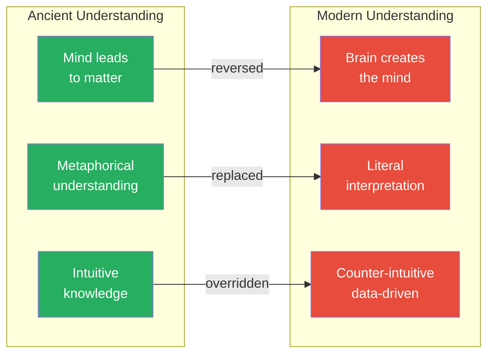
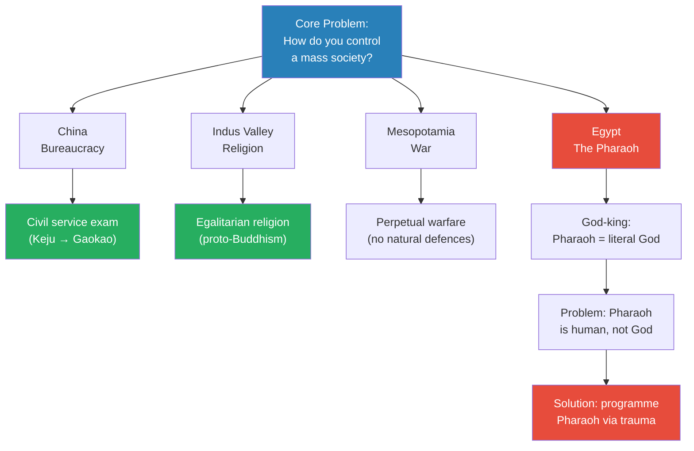
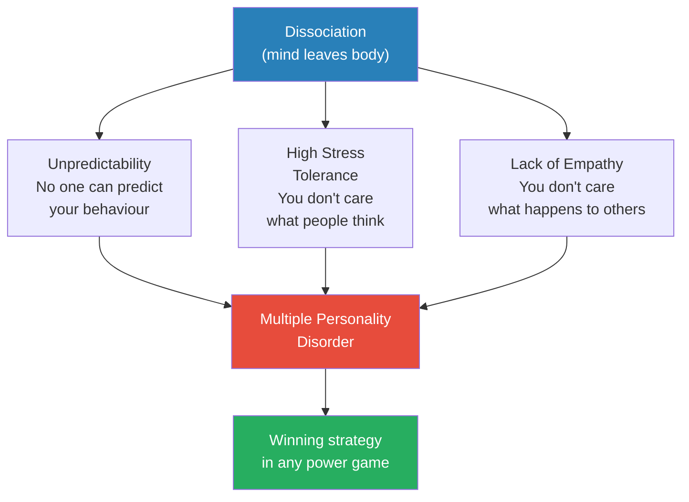
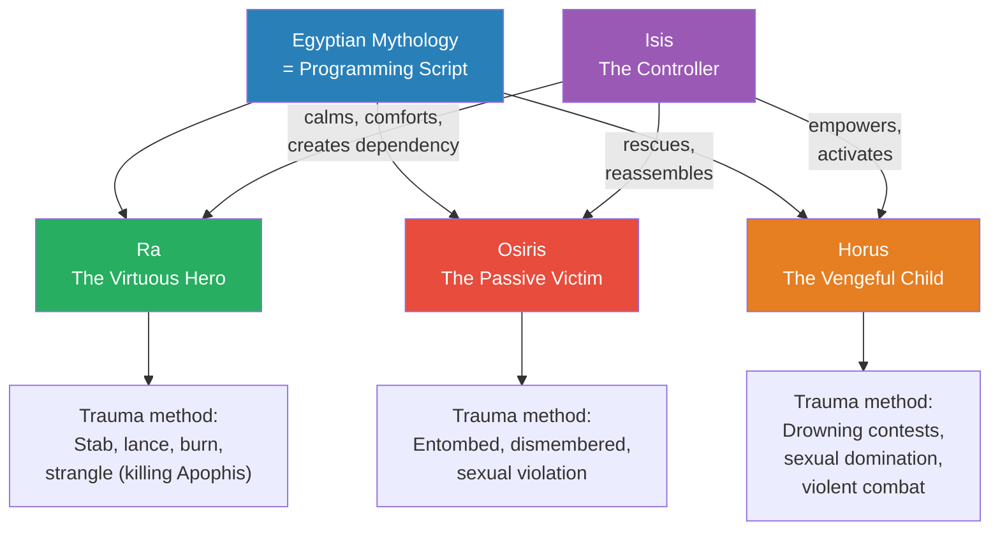
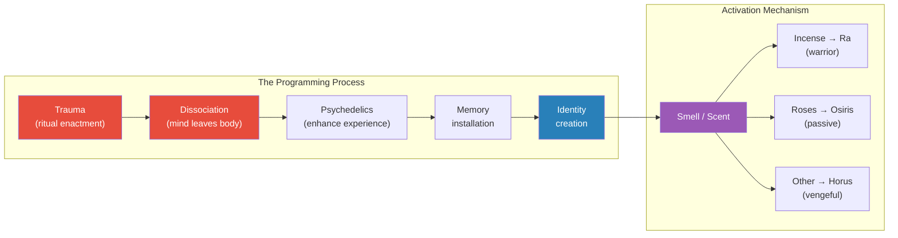
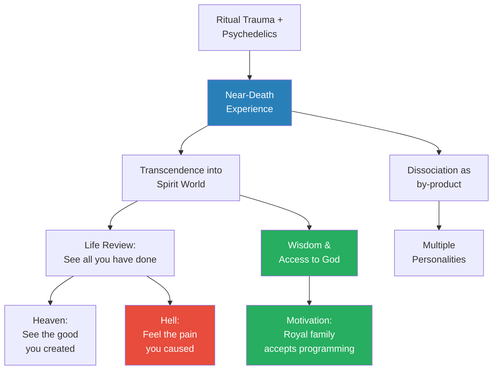
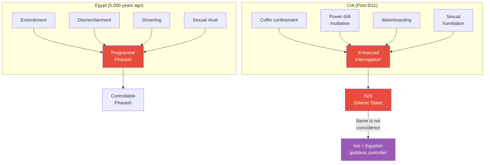
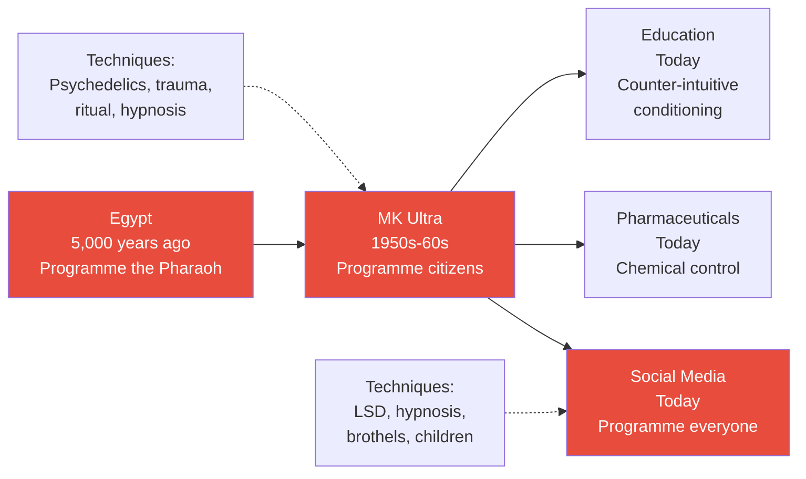

# The Psychology of Evil

> Prof. Jiang reveals the mechanism behind power: dissociation. Beginning with a review of the three great shifts in human understanding (mind-to-matter vs. matter-to-mind, metaphorical vs. literal, intuitive vs. counter-intuitive), he argues that every great leader in history shares three traits — unpredictability, high stress tolerance, and lack of empathy — all of which are expressions of a single psychological condition: dissociative identity disorder. He then demonstrates how ancient Egyptian priests used mythology not as stories to be believed but as scripts to be enacted — ritual trauma combined with psychedelics to programme the Pharaoh into controllable multiple personalities. He traces this identical technique from 5,000-year-old Egypt through CIA black sites at Abu Ghraib and Guantanamo Bay, through MK Ultra, and into the architecture of modern social media — arguing that what was once done to one Pharaoh is now done to entire populations.

---

## Overview: Key Highlights

- <b style="color: #27ae60">Dissociation is the master skill of power</b> — unpredictability, high stress tolerance, and lack of empathy are all expressions of one condition: the mind separating from the body
- <b style="color: #2980b9">Dissociative Identity Disorder (DID)</b> — multiple personality disorder, the psychological mechanism that allows leaders to be different people in different contexts
- <b style="color: #e74c3c">The Pharaoh was a programmable puppet</b> — the priests, not the Pharaoh, held real power in Egypt; the Pharaoh was trained through ritual trauma
- <b style="color: #2980b9">Egyptian mythology as programming script</b> — Ra (virtuous hero), Osiris (passive victim), and Horus (vengeful child) are not characters in a story but identities to be installed
- <b style="color: #27ae60">The ISIS trigger</b> — the goddess Isis served as the controller identity, the voice the Pharaoh would always trust and obey
- <b style="color: #e74c3c">Abu Ghraib and Guantanamo used the identical Egyptian script</b> — coffins, drowning, dismemberment, sexual humiliation — the same techniques, 5,000 years later
- <b style="color: #2980b9">Learned helplessness</b> — the official cover story for CIA torture; the real goal was programming prisoners into controllable weapons
- <b style="color: #e74c3c">ISIS (Islamic State) was the unintended — or intended — product</b> — the CIA's "failed" experiment produced exactly what the Egyptian script predicts: Osiris becomes Horus, the vengeful child
- <b style="color: #2980b9">MK Ultra</b> — the CIA's documented mind-control programme of the 1950s-60s, testing drugs, hypnosis, and trauma on American citizens
- <b style="color: #27ae60">Near-death experiences as the incentive</b> — the royal family submitted to programming because the trauma-induced NDEs gave them genuine access to the spirit world
- <b style="color: #2980b9">Game theory and multiple personalities</b> — in a game with millions of players and competing secret alliances, the person with the most personalities wins
- <b style="color: #e74c3c">Social media is the modern mechanism of social control</b> — what was done to one Pharaoh is now done to entire populations through screens and algorithms

| Concept | One-line summary |
|---------|-----------------|
| **Dissociation** | The mind leaving the body — the single skill underlying all three traits of great leaders |
| **Three traits of leaders** | Unpredictability, high stress tolerance, lack of empathy — all products of dissociation |
| **Ra identity** | The virtuous hero who fights evil every night — the warrior personality |
| **Osiris identity** | The passive victim who is entombed, dismembered, and violated — the broken personality |
| **Horus identity** | The vengeful child who reclaims power through violence — the retaliatory personality |
| **Isis as controller** | The trusted voice that calms, comforts, and commands — the handler identity |
| **Smell as trigger** | Different scents activate different programmed identities in the Pharaoh |
| **Learned helplessness** | Seligman's theory: you can break someone's will by making suffering inescapable |
| **MK Ultra** | CIA programme using drugs, hypnosis, and trauma to achieve mind control on civilians |
| **Near-death experience (NDE)** | Trauma-induced transcendence into the spirit world — the reward for enduring programming |
| **Social control** | The fundamental problem of every mass society — China used exams, IVC used religion, Mesopotamia used war, Egypt used the Pharaoh |
| **Programming** | Using ritual, trauma, and psychedelics to install controllable identities in a human mind |

---

# The Lecture

## Review: Three Shifts in Human Understanding [0:00 - 2:00]

*Prof. Jiang opens with a rapid review of the previous lecture's key concepts — three fundamental shifts in how humans perceive reality that occurred during the transition from the Mother Goddess worldview to modern science — setting the stage for today's exploration of how those shifts enable mind control.*

*Prof. Jiang frames these three shifts as problematic — and warns the class that the modern inversion (brain creates mind, only the measurable exists, don't trust your eyes) is "why school is so hard." Humans are learning machines, but modern education forces counter-intuitive ideas that go against natural perception.*

> [!note]- Expand: Full Lecture Detail
> Prof. Jiang opens by connecting to the previous lecture: "Let's review what we discussed last class. This is a class of ideas and concepts, so it's really important you understand these concepts, because we will build on them throughout the semester."
>
> He lays out the three shifts that occurred during the transformation of Western religious worldview — from Mother Goddess to Polytheism to Monotheism:
>
> - **Shift 1 — Mind and matter:** Originally, humans understood that <b style="color: #2980b9">mind led to matter</b> — "the universe is just one giant mind that vibrates, and the intersection of these vibrations creates atoms, then matter." Today, science teaches the opposite: the brain creates the mind. Prof. Jiang flags this as deeply problematic and promises to return to it throughout the semester.
>
> - **Shift 2 — Metaphorical to literal:** Before, humans understood the world metaphorically — they recognised forces they could not see or measure and gave those forces names: the gods. Today, "if you can't see it, it doesn't exist. If you cannot measure it, it does not exist."
>
> - **Shift 3 — Intuitive to counter-intuitive:** Before, humans trusted their hearts and their eyes. Today, "you're taught to not trust your eyes. You're taught to trust the data, the tools, the theory."
>
> Prof. Jiang's conclusion: "This is why school is so hard. We humans are learning machines — that's what we're designed to do, to learn, to absorb, to adapt. But school is hard because you're taught ideas that go against your own intuition."

---

## The Fundamental Problem: Social Control [2:00 - 5:00]

*Prof. Jiang steps back to the earliest civilisations and presents the core problem every mass society must solve — how to control the population — then shows that each of the four original civilisations found a radically different answer, with Egypt's being the most dangerous.*

> [!tip] Core Insight
> The primary challenge of every mass society is not war, economy, or technology — it is social control. How do you get millions of people to cooperate? Each civilisation's answer shaped its entire character.

*Four civilisations, four solutions. China's exam system persists today as the Gaokao. Egypt's solution — making the Pharaoh a controllable god — required the invention of mind control.*

> [!note]- Expand: Full Lecture Detail
> Prof. Jiang takes the class back to the four earliest civilisations — China, the Indus Valley Civilisation (IVC/Harappan), Mesopotamia, and Egypt — and frames the lecture around one question: when you have a mass society, "your biggest problem is social control. How do you control the population? How do you get everyone to get along?"
>
> He walks through each solution:
>
> - **China** developed a <b style="color: #2980b9">bureaucracy</b> underpinned by the civil service examination (Keju): "Everyone's attention, everyone's energies, was focused on getting their child to pass the Keju to become an official — and that's what gave China social stability." He pauses: "Guess what, guys, it's still around today. Today we call it the Gaokao, but it's the same system. No difference at all."
>
> - **The Indus Valley Civilisation** created a religion preaching egalitarianism and peacefulness — "their religion becomes the prototype for Buddhism today." The IVC was "peaceful, egalitarian, a very prosperous society."
>
> - **Mesopotamia's** answer was war — "the difference between Mesopotamia and other places is that there are no natural defences. In China we have mountains, deserts, seas. But in Mesopotamia, it's a desert, and so it's really easy to attack."
>
> - **Egypt** had the Pharaoh — "Egypt is unique in that they believe the Pharaoh was God, and therefore everyone had to obey their God." But then Prof. Jiang drops the catch: <b style="color: #e74c3c">"The problem is that the Pharaoh was not God, and as a human in charge of an empire, his life was always at risk."</b>
>
> This sets up the central question of the lecture: how do you take a human being and make them function as a god?

---

## The Three Skills of Great Leaders [5:00 - 8:00]

*Prof. Jiang demolishes the classroom model of leadership — responsibility, wisdom, empathy — and replaces it with three traits that every powerful leader in history actually shares, all of which reduce to a single psychological mechanism.*

*All three traits converge on one diagnosis: dissociative identity disorder. The person with the most personalities is the person who wins the power game.*

> [!note]- Expand: Full Lecture Detail
> Prof. Jiang asks the class: "What does it take to be a great leader?" The students offer textbook answers — responsibility, wisdom, openness, empathy, respect, knowledge. He lets them go on, then cuts them off: "Guess what, guys? Wrong."
>
> He argues that every powerful leader in history — and he names Putin and Trump as modern examples — shares exactly three skills:
>
> - **Unpredictability** — "People cannot predict how you will behave. You are a mystery to people."
> - **High stress tolerance** — "Donald Trump is probably the most hated man in America. Guess what, guys? He goes to bed and he sleeps like a baby. He does not care."
> - **Lack of empathy** — "He does not care what happens to other people. All he cares about is himself."
>
> Prof. Jiang then reveals the unifying concept: <b style="color: #2980b9">"We just use one word to describe all three skills. The word we can use is dissociation."</b>
>
> He defines it precisely: "Dissociation just means your mind is part of your body. When you dissociate, what literally happens is your mind leaves your body so that you don't think that what's happening is happening to you — it's happening to someone else. It's like you become an observer in a movie. You're in the movie, but you're also watching the movie."
>
> He connects dissociation to multiple personality disorder: "Donald Trump is so unpredictable because he's literally 100 different people. In a different circumstance, he's a different person, and that's why you can never actually predict how he will behave. And all the great leaders in history were like that."
>
> > [!quote] Prof. Jiang
> > "To do well in life, you need these three skills: unpredictability, high stress tolerance, lack of empathy. And we just use one word — dissociation."

---

## Game Theory and the Power of Multiple Personalities [9:57 - 12:00]

*Prof. Jiang uses game theory to explain why dissociation is the optimal strategy in any complex power environment — and why intelligence agencies specifically recruit for this trait.*

> [!note]- Expand: Full Lecture Detail
> Prof. Jiang returns to game theory, which the class discussed previously: "When you have a game where there are millions of different players, the secret to winning this game is cheating, and you do that by forming secret alliances."
>
> But forming alliances is obvious — everyone does it. The real advantage comes from being at the <b style="color: #2980b9">intersection of multiple competing alliances</b>:
>
> - You must be part of as many powerful secret alliances as possible
> - Each alliance demands loyalty, obedience, and assurance you will never betray them
> - The only way to serve contradictory masters is to literally become a different person in each context
> - "The only way around this problem is to create multiple personalities — because literally, you're a different person in a different circumstance, and therefore they're never able to figure out what you really think"
>
> He connects this directly to espionage: <b style="color: #e74c3c">"Spies have this skill. When spies are being recruited, the one skill that they're looking for is dissociation. Is this person able to quickly dissociate from who he is? Lack of empathy. Basically, they're all psychopaths."</b>
>
> The game-theoretic conclusion: "In real life, in a game, it's the person with the most multiple personalities that wins out."
>
> This raises the Egyptian question: the Pharaoh is born into his position. He doesn't naturally possess dissociative ability. Can you take a person and create multiple personalities artificially? Prof. Jiang's answer: "Yes. And I'm going to show you how."

---

## Egyptian Mythology as Programming Script [12:00 - 19:30]

*Prof. Jiang decodes Egyptian mythology — Ra, Osiris, and Horus — not as religious stories but as a literal programming script for installing multiple identities into the Pharaoh through ritual trauma and psychedelics. This is the heart of the lecture.*

> [!tip] Core Insight
> Egyptian mythology is not a story to be believed — it is a script to be enacted. Each god represents a distinct personality to be installed in the Pharaoh through ritual trauma: Ra the hero, Osiris the victim, Horus the avenger. The goddess Isis is the controller — the handler identity the Pharaoh will always obey.

*Three gods, three identities, one controller. The mythology is a recipe for manufacturing a controllable psychopath. Isis — the priest in a mask — is the person the Pharaoh will always trust.*

*The programming process has two phases: installation (trauma + drugs + ritual) and activation (scent triggers in the throne room). The priests control which identity the Pharaoh inhabits at any given moment.*

> [!note]- Expand: Full Lecture Detail
> Prof. Jiang explains that Egyptian mythology is unique among world mythologies: "There's Greek mythology, Chinese mythology, Babylonian mythology — but Egyptian mythology is different from all of them."
>
> He introduces the three central figures:
>
> - <b style="color: #2980b9">Ra</b> — the sun god who gave life to the universe. Every night, Ra descends into the underworld to fight the serpent Apophis. "Sometimes he stabs Apophis with a knife. Sometimes he uses a lance. Sometimes he burns Apophis. Sometimes he strangles Apophis." Ra must kill Apophis every night so the sun can rise. A solar eclipse means Ra temporarily failed.
>
> - <b style="color: #2980b9">Osiris</b> — the god of civilisation who built Egypt. His brother Set (jealous, wanting the throne) tricks him: "He says, 'Look, I built a tomb, and this tomb is really comfortable.' Osiris jumps in, and Set closes the tomb and throws it away." Set then cuts Osiris into pieces and scatters them across the world. Isis (Osiris's wife) finds all the pieces, reassembles him, and quickly conceives Horus before Set can find them again.
>
> - <b style="color: #2980b9">Horus</b> — the god of kingship and empire. He goes to war with Set through a series of brutal challenges — drowning contests (turning each other into hippos), sexual domination, and combat — until Horus wins and becomes Pharaoh.
>
> Prof. Jiang pauses: "As you can see, it's really weird. It doesn't really make sense as a story. It's not a great story. But if you don't see it as a story, but as a script, it makes a lot more sense. It's not something to be believed — it's something to be acted out."
>
> He invokes Kant's distinction between <b style="color: #2980b9">noumena</b> (things in themselves, unknowable) and <b style="color: #2980b9">phenomena</b> (things as we experience them): "We cannot differentiate between what is true and what is false. So if you're able to control our experience, you're able to control our memories."
>
> He also connects this to the "Monkey Island" concept from a previous lecture — people transported to an extreme situation emerge transformed. The question is: how do you pass that transformation to the next generation? "Through ritual. You take your children, put them on an island, tell them a story, and then give them psychedelics. Psychedelics are drugs that enhance your experience so you actually believe the story is happening to you."
>
> **The Programming Decoded:**
>
> Each god maps to a distinct identity:
> - **Ra** = the virtuous hero
> - **Osiris** = the passive victim
> - **Horus** = the vengeful child
>
> The rituals enact each mythology:
> - As **Ra**: the drugged Pharaoh is dressed as Ra, given an effigy or real person, and made to stab, lance, burn, or strangle them — feeling like a virtuous hero fighting evil
> - As **Osiris**: the Pharaoh is placed in a tomb, subjected to cutting, and exposed to sexual situations — feeling like a helpless victim
> - As **Horus**: the Pharaoh undergoes drowning, combat, and sexual domination — feeling like a child fighting for vengeance
>
> Throughout all of this, <b style="color: #27ae60">one figure remains constant: Isis</b>. A priest wearing an Isis mask, using an Isis voice, calms the Pharaoh during trauma, comforts him, even has sex with him to create dependency. "Now Isis becomes the controller. The person the Pharaoh will always trust."
>
> The activation mechanism: <b style="color: #2980b9">smell</b>. During programming, different scents are paired with different identities. "For Ra it might be incense. For Osiris it might be roses." Later, when the Pharaoh sits on the throne and the priests need a particular decision, "the priest will let out different scents, which will activate different emotions in the Pharaoh, which then determines how the Pharaoh makes the decision."
>
> > [!example] The Football Player Analogy
> > - Imagine you are the best football player in the world — better than Messi
> > - One day you wake up and lose all memory — your name, your friends, even that you play football
> > - The entire world also forgets you play football
> > - For ten years you wander with no idea who you are
> > - One day, someone kicks you a ball on a football field and you kick it back
> > - You are still the best player in the world — because the training is in your subconscious, your muscle memory
> > - This is how programming works: train someone under trauma and drugs until the behaviour is automatic
> > - Use a trigger word ("Abracadabra") or scent, and the programmed behaviour activates
> > **The lesson:** Any human being can be programmed into a robot — a killer, a weapon, anything — because the subconscious does not distinguish between real and manufactured experience.

---

## Why the Royal Family Accepted Programming [27:11 - 32:00]

*A student asks the critical question: why would anyone agree to this? Prof. Jiang reveals that the trauma created near-death experiences — genuine encounters with the spirit world — making the programming not just tolerable but desirable.*

*The near-death experience is both the by-product of trauma and the incentive for enduring it. The royal family didn't just tolerate the programming — they wanted the spiritual access it provided.*

> [!note]- Expand: Full Lecture Detail
> A student asks: "So they only train the Pharaoh by this method, and not his relatives, his brothers?"
>
> Prof. Jiang corrects: <b style="color: #e74c3c">everyone in the royal family is programmed</b>. The priests — "what you'd call the deep state" — need backups. "It's possible the Pharaoh gets an accident and dies. So you need someone right away to replace the Pharaoh." The danger arises when the priest class fractures: "When the priest class divides into different political factions who all want power, they programme the Pharaoh's brother to create a civil war."
>
> But why would the royal family agree? Prof. Jiang reveals the incentive: <b style="color: #2980b9">near-death experiences (NDEs)</b>.
>
> - The psychedelics and trauma create genuine near-death states — "for a minute, or ten minutes, or half an hour, they are literally dead"
> - During NDEs, people "transcend into the spirit world" and "actually meet God"
> - Tens of thousands of modern NDE survivors report the same thing: "Up there in the spirit world, it's all peaceful, it's all love. You can feel God in you"
> - "The royal family does this because it gives them wisdom and access to the spirit world, so that they feel as though they're truly God"
>
> A student asks about heaven and hell — if evil people also meet God during NDEs, what's the difference?
>
> Prof. Jiang explains the concept of the <b style="color: #2980b9">life review</b>:
> - "The first thing that will happen is you're able to see exactly what you did your entire life"
> - If you were evil, "that's hell — because you're able to now feel pain for the first time. Dissociation means you don't feel any pain. But you're just tricking yourself"
> - "When you're up in the spirit world, you have to see exactly what you did to other people. You have to feel their pain. That's what hell is"
> - Heaven is the reverse: "You can see the good that you did"
> - The deeper theory: "When you die, the only thing that remains in you is love. Love is actually a physical force, and the more love you have, the higher you can ascend in the spirit world"
>
> **How the priests learned the technique:**
> - They experimented on themselves first: "They're priests, and they want to access the spirit world themselves"
> - They recognised that near-death experiences and psychedelics were the two best methods
> - "They drown themselves, they cut themselves up, they starve themselves — there are lots of ways to create near-death experiences"
> - Prof. Jiang's striking claim: <b style="color: #e74c3c">"What's amazing is we have not improved on the Egyptians today. All the modern technology, all the modern medicine and science — we're just doing what they did."</b>
>
> > [!quote] Prof. Jiang
> > "The royal family does this because it gives them wisdom and access to the spirit world, so that they feel as though they're truly God — and that's why they agree to do this."

---

## The Misery of Power [32:55 - 34:15]

*Prof. Jiang reveals the dark side of dissociative identity disorder — those who have it can never feel happiness, only reduced misery — explaining why those in power are committed to making others suffer.*

> [!note]- Expand: Full Lecture Detail
> Prof. Jiang pauses to address a misconception: "You think, wow, it's really great to have all this power. But actually, the one thing about dissociative personality disorder is <b style="color: #e74c3c">you can never feel happiness. In fact, you can only feel misery.</b>"
>
> The terrible logic:
> - If you can only feel misery, the only way to reduce your own misery is to make others more miserable than you
> - "The people in power are committed to making the world as evil and as unhappy and as miserable as possible, because that's the only way they can feel good about themselves"
>
> He lists the symptoms of DID: identity confusion, changing memories, flashbacks, intrusive thoughts, internal voices — "it's not a great feeling to have this."
>
> This section is brief but structurally crucial: it explains why evil propagates. Dissociation creates power, but power creates misery, and misery creates the compulsion to inflict suffering on others. The cycle is self-sustaining.

---

## Abu Ghraib, Guantanamo, and the Egyptian Script Reborn [34:38 - 45:00]

*Prof. Jiang connects the ancient Egyptian programming techniques to the post-9/11 American torture programme, demonstrating that the same script — tombs, dismemberment, drowning, sexual humiliation — was used at Abu Ghraib and Guantanamo Bay, and that the "failed" experiment produced exactly the product the Egyptian script predicts.*

> [!tip] Core Insight
> The CIA claimed its torture programme was "enhanced interrogation" that failed. Prof. Jiang argues the programme succeeded perfectly — it was never about extracting information. It was about programming prisoners into controllable weapons. The product was ISIS.

*The techniques are identical across five millennia. The naming — ISIS — may not be coincidental. The goddess Isis was the controller identity in the Egyptian system.*

> [!note]- Expand: Full Lecture Detail
> Prof. Jiang pivots sharply to the modern era: "Now I want to talk about 9/11 and the war on terror."
>
> He introduces Abu Ghraib — the Iraqi prison where detained suspects were subjected to what military officials initially called the behaviour of "soldiers who went crazy and went rogue." But then the truth emerged:
>
> - Two psychologists were discovered to be responsible for the programme
> - During court testimony, it was revealed they were <b style="color: #e74c3c">paid $80 million by the CIA</b> to develop the techniques
> - The programme was called "enhanced interrogation"
>
> The official theory behind the programme was <b style="color: #2980b9">learned helplessness</b> — a concept developed by Martin Seligman (who also developed Positive Psychology): "You can basically take someone like Ra, the virtuous hero, and turn them into Osiris through certain techniques."
>
> But Prof. Jiang argues the theory didn't produce the expected result. After CIA torture: "They became ISIS — Islamic State." He pauses: "ISIS is the name of the Egyptian goddess who saved Osiris and fathered Horus. Do you think it's a coincidence? Maybe not."
>
> He cites academic research:
>
> > [!example] The Prison-to-ISIS Pipeline
> > - Jeremy Scahy and Andrew Thompson discovered that many ISIS fighters "deepened into extremism during a time in prisons controlled by the United States"
> > - Human Rights First interviews with prisoners showed "ISIL recruitment is still ongoing, unchecked... and fuelled by torture and other abuse that pervade these prisons"
> > - The CIA thought they were turning Ra (terrorists as virtuous heroes fighting America) into Osiris (broken, compliant citizens)
> > - Instead, Osiris became Horus — the vengeful child who reclaims power through violence
> > - Prof. Jiang's interpretation: "It wasn't that the experiment failed. It worked. ISIS is an American creation designed to create as much chaos as possible in the Middle East"
> > **The lesson:** The Egyptian script predicts its own outcome — turn someone into a victim (Osiris), and you create an avenger (Horus). The CIA either didn't understand the script, or understood it perfectly.
>
> He then details the testimony of Abu Zubaydah, a Saudi citizen captured and held at Guantanamo — one of the few prisoners who remembered what was done to him:
>
> - Force-feeding and torture
> - Strangling
> - Placed in a coffin and drowned
> - Mutilated with a power drill
> - Sexual humiliation with female agents
>
> Prof. Jiang asks the class: "Do you guys see this? What is the story?" The class recognises it: the story of Egyptian mythology. "This is what they did to the Pharaoh 5,000 years ago. It's the same story. It's the same script."
>
> He challenges the interrogation premise directly: "If you really wanted to get information from these terrorists, what's the best way to do that? Pay them money. Be friends with them, be nice to them, take them out to dinner. We have lots of evidence to suggest that if you just be nice to these people, they'll tell you everything they know. You don't have to torture them. <b style="color: #e74c3c">You torture them because you're trying to turn them into secret weapons to be unleashed in the world.</b>"

---

## MK Ultra and the Democratisation of Mind Control [45:00 - 48:00]

*Prof. Jiang traces the programming techniques from Egypt to the CIA's documented MK Ultra programme of the 1950s-60s, then argues that the "failed" programme's results have been absorbed into the architecture of modern society — social media, pharmaceutical drugs, and mass education.*

*The same principle — using trauma, drugs, and controlled experience to programme behaviour — scales from one Pharaoh to an entire population. "Good news: you are now the Pharaoh."*

> [!note]- Expand: Full Lecture Detail
> Prof. Jiang introduces <b style="color: #2980b9">MK Ultra</b>: "A programme starting in the 1950s and 60s, led by a chemist called Sidney Gottlieb. The point of MK Ultra was to figure out how to brainwash people."
>
> Key details:
> - For the longest time, MK Ultra was considered a conspiracy theory — "But a few years ago, the CIA, the US government, admitted: we actually did this, but not anymore"
> - The programme tested drugs, brainwashing, and hypnosis on "innocent American citizens, especially children"
> - Most of the most sensitive documentation was destroyed by the participants — only fragments survive
> - The programme included setting up a brothel where subjects were given LSD
> - They worked with "foreign intelligence officials to conduct mind control research" — what couldn't be done legally in the US was done in Egypt and elsewhere
>
> Prof. Jiang then makes his most provocative connection: "If you talk to experts, they'll say MK Ultra's results were terrible. But then ask yourself this: what is social media? What happens when you feel bad and you go to a doctor and the doctor gives you drugs? How do they know these drugs work?"
>
> His conclusion: <b style="color: #27ae60">"MK Ultra didn't fail — they hide the fact of its effectiveness, and the results have spread throughout society. Good news: you are now the Pharaoh. Each and every one of you are now the Pharaoh. Congratulations."</b>
>
> He adds a pointed observation about psychology as a field: "Psychologists have been known to have a greater propensity to have mental illness than most people. Your psychologist is literally more screwed up in the brain than you are." And: "I have not met anyone who's gotten better psychologically after seeing a psychologist."
>
> > [!quote] Prof. Jiang
> > "MK Ultra didn't fail. They hide the fact of its effectiveness, and the results have spread throughout society. Good news — you are now the Pharaoh."

---

## Social Media, Infrastructure, and the Question of Control [48:29 - 50:00]

*A student challenges Prof. Jiang on why social media platforms are privately owned if they are tools of social control. His answer traces the infrastructure beneath the platforms back to the US military.*

> [!note]- Expand: Full Lecture Detail
> A student asks: "If social media is a mechanism for social control, why are they controlled by private citizens who've made billions of dollars doing it?"
>
> Prof. Jiang responds with a question: "Who built the internet? The US military. The internet is controlled by cables that run around the world. Who built all these cables? The US military. Do you think they would do this for free?"
>
> His point: "Twitter, Facebook — that's the public face. What people forget is behind Facebook and Twitter is all this infrastructure that's being controlled and protected by the US military. So why would the military do this?"
>
> He pauses to issue a disclaimer — one he has repeated throughout the lecture: "This is a class about speculation, about theories. I'm not telling you what's true. I'm just raising questions and possibilities about what's really going on." And: "I don't know what they did in Egypt 5,000 years ago. I'm just speculating. It's just a theory. It's a nice theory, but I have no evidence that it's true. Take what I say with a grain of salt. Be sceptical and doubtful of what I say."

---

## Connections

**Builds on:** [[05 - The Birth of Evil]] (Mother Goddess → Polytheism → Monotheism, mystery schools, mind-leads-to-matter), [[04 - How Evil Triumphs]] (ritual sacrifice, transgression as strategy, secret alliances in game theory)

**Sets up:** [[07 - Death by Meritocracy]] (social control mechanisms extended to modern institutions), [[09 - The Theory of Everything]] (unified framework connecting all control mechanisms)

**Related books in vault:** [[The 48 Laws of Power - Robert Greene]] (Law 3: Conceal Your Intentions — unpredictability as power), [[The 33 Strategies of War - Robert Greene]] (unconventional warfare, controlled chaos), [[Sapiens - Yuval Noah Harari]] (inter-subjective myths enabling mass cooperation)

---

## The Takeaway

This lecture is the operational manual behind the philosophical arguments of the previous five. Where Lectures 4 and 5 established what evil is and where it comes from, Lecture 6 reveals how it is manufactured and deployed. The mechanism is dissociation — induced through trauma, enhanced by psychedelics, stabilised by ritual, and activated by sensory triggers. Prof. Jiang's central claim is that this technology has not changed in five thousand years: what Egyptian priests did to one Pharaoh, the CIA attempted on prisoners, and modern platforms now do to billions.

The most unsettling insight is the identity trap embedded in the Egyptian script. The CIA's stated goal was to turn Ra (the heroic terrorist) into Osiris (the broken citizen). But the mythology itself predicts the outcome: Osiris produces Horus, the avenger. Whether the CIA failed to understand this or understood it perfectly — and wanted to produce ISIS as a weapon of regional chaos — is the question Prof. Jiang leaves the class to sit with. Either way, the script runs as designed.

What remains open is the question of scale. Prof. Jiang asserts that "you are now the Pharaoh" — that the techniques pioneered in Egyptian temples and refined in MK Ultra laboratories have been democratised through social media, pharmaceuticals, and education. He promises to show exactly how in future lectures on mass media, mass education, and mass ecology. The mechanism has been revealed; its modern application is the story still to come.
