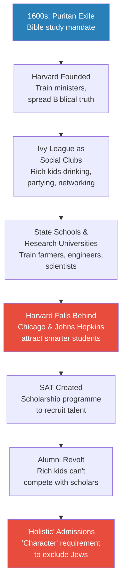
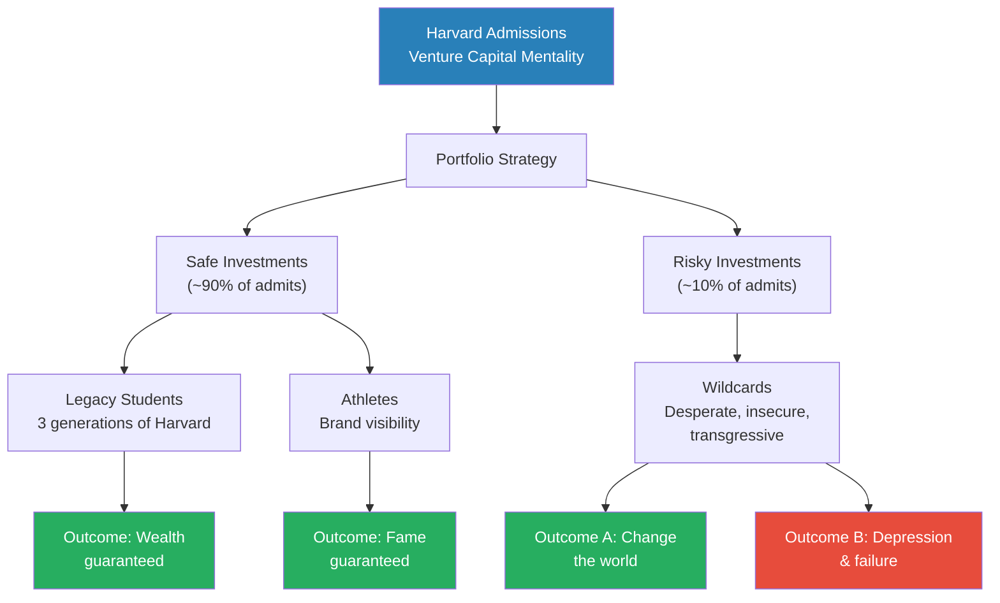
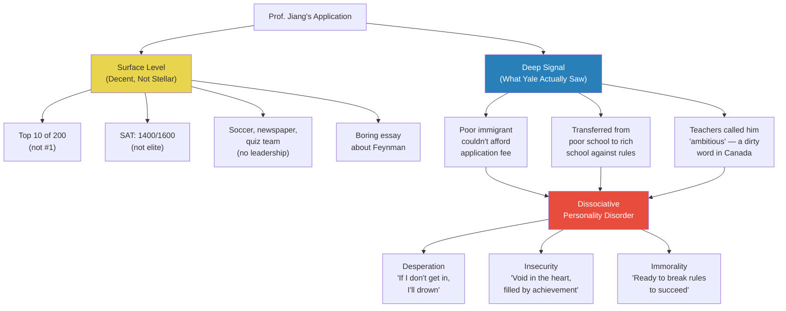
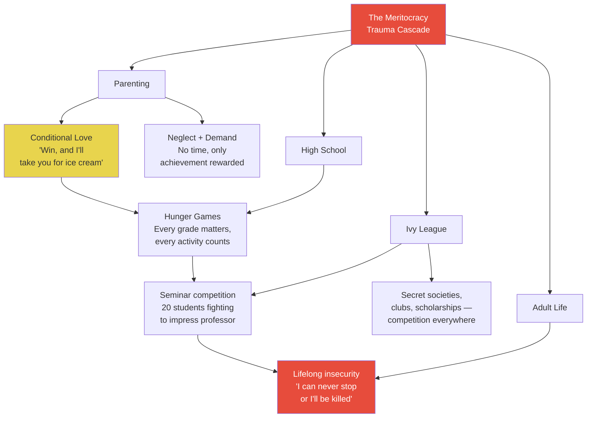
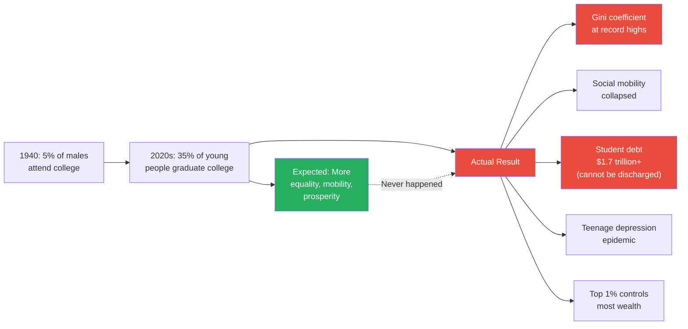
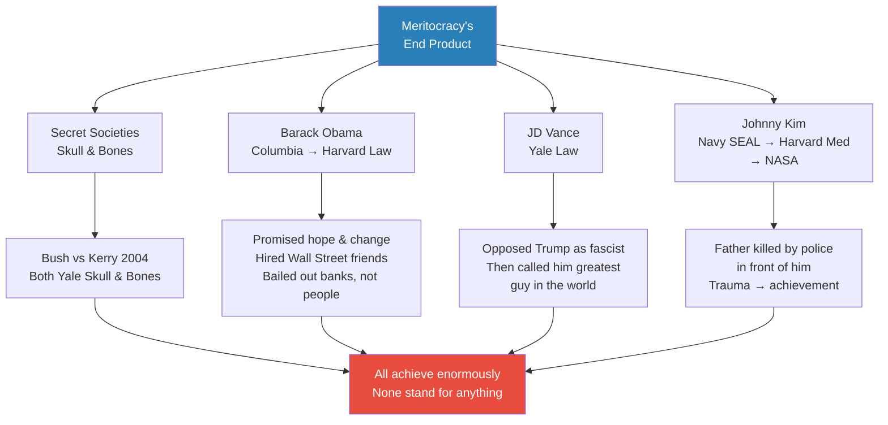
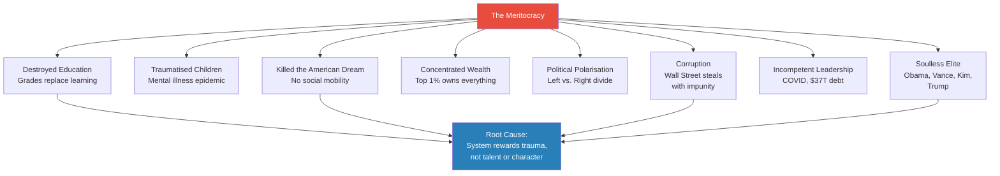
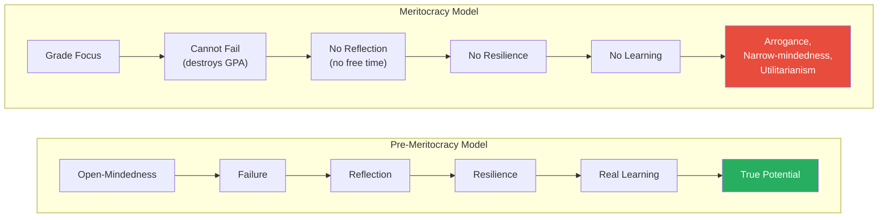

# Death by Meritocracy

> Prof. Jiang turns the lens from ancient evil to a modern system that is destroying America from within: the meritocracy. He traces the Ivy League's evolution from Puritan Bible schools to social clubs to venture capital firms — institutions that do not seek the smartest students but the most likely to succeed, which means the most traumatised. Using his own Yale application as a case study, he demonstrates how admissions officers screen for dissociative personality disorder: desperation, insecurity, and willingness to break rules. He then shows how this system — designed to benefit Harvard — has metastasised into a global machine that traumatises children, destroys learning, concentrates wealth in the 1%, and produces an elite class of soulless, unimaginative robots like Barack Obama and JD Vance. The lecture closes with a counter-model: open-mindedness, failure, reflection, and resilience as the real formula for success.

---

## Overview: Key Highlights

- <b style="color: #27ae60">Harvard is a venture capital firm, not a university</b> — it selects for the riskiest investments with the highest possible return, not the smartest students
- <b style="color: #e74c3c">The meritocracy was designed to keep Jews and Asians out</b> — "holistic" admissions and "character" were invented to exclude high-performing ethnic minorities
- <b style="color: #2980b9">Dissociative personality disorder as admissions criterion</b> — Yale and Harvard screen for desperation, insecurity, and rule-breaking, the same traits identified in Lecture 6
- <b style="color: #27ae60">The Ivy League evolved through four stages</b> — Puritan seminary, social club, research competitor, venture capital firm
- <b style="color: #e74c3c">Yale is the Hunger Games</b> — relentless competition from day one produces lifelong insecurity and achievement addiction
- <b style="color: #2980b9">Secrecy and discretion</b> — the two pillars of elite admissions that make the system unaccountable and unchallengeable
- <b style="color: #e74c3c">The meritocracy produces soulless elites</b> — Barack Obama, JD Vance, and Johnny Kim are high-achieving robots who stand for nothing
- <b style="color: #27ae60">America's inequality has exploded despite mass education</b> — more college graduates, but higher Gini coefficient, lower social mobility, and crushing student debt
- <b style="color: #2980b9">James B. Conant and Harry Chauncey</b> — the two Harvard men who built the modern meritocracy through the SAT and ETS
- <b style="color: #e74c3c">The altruistic and utilitarian mindsets are mutually exclusive</b> — you cannot simultaneously pursue genuine learning and grade-driven achievement
- <b style="color: #27ae60">The real formula for success: open-mindedness, failure, reflection, resilience</b> — the pre-meritocracy model that the system has destroyed
- <b style="color: #2980b9">Harvard's endowment is $40 billion</b> — more money than most countries, with 127 billionaire alumni as of 2024

| Concept | One-line summary |
|---------|-----------------|
| **Meritocracy** | The belief that success should follow talent and hard work — Prof. Jiang argues it actually rewards trauma |
| **Holistic admissions** | The system of essays, recommendations, and extracurriculars invented to exclude Jews from the Ivy League |
| **Secrecy** | Harvard never reveals why it admits or rejects anyone — making the system unaccountable |
| **Discretion** | Harvard can reject anyone for any reason — even the best student in the world |
| **Venture capital mentality** | Harvard prefers one student who might become president over 1,000 who will become professors |
| **Dissociative personality disorder** | The same condition from Lecture 6 — now identified as what admissions officers screen for |
| **Legacy admissions** | Three generations of Harvard graduates get priority — the "safe investment" in the portfolio |
| **Moral hazard** | Larry Summers' argument for saving banks but not homeowners — no consequences means repeated mistakes |
| **Altruistic vs. utilitarian mindset** | Two mutually exclusive modes of being: connection/creativity vs. competition/rewards |
| **Gini coefficient** | Measure of inequality — America's has skyrocketed despite rising college graduation rates |
| **Elite overproduction** | The Ivy League dominating every elite sector — military, judiciary, politics, business, media |
| **Open-mindedness cycle** | Failure leads to reflection, reflection builds resilience, resilience enables genuine learning |

---

# The Lecture

## The Origin of America's Admissions System [0:00 - 9:47]

*Prof. Jiang opens the last class before the break by defining meritocracy — success based on talent, ability, and hard work — and then tracing how America ended up with the world's most complicated university admissions system. The story begins with Puritan exiles in the 1600s and ends with a system explicitly designed to keep Jews out of Harvard.*

> [!tip] Core Insight
> America's admissions system was never about finding the best students. It was about maintaining Harvard's power. Every change — from SATs to "holistic" review — was a strategic response to a threat against Harvard's institutional dominance.

*The Ivy League's four-stage evolution: from seminary to social club to research competitor to gatekeeping institution. Each transition was driven not by educational ideals but by threats to institutional power.*

> [!note]- Expand: Full Lecture Detail
> Prof. Jiang opens by telling the class this is their last session before a three-week break. He defines the day's subject: <b style="color: #2980b9">meritocracy</b> — "people should succeed based on their talent, their ability, and their hard work." In theory, he says, it sounds good. The school system is built on it: good students go to good universities, graduate, and get good jobs. "But what I will show you today is that there are actually lots of problems with the meritocracy, and what I also show you is that, in fact, this idea is actually destroying American society."
>
> He contrasts American and Chinese admissions. In China, you take the Gaokao, and your score determines your university. Simple. In America, the system is uniquely complicated: transcripts, standardised tests (SAT, TOEFL), extracurriculars, teacher recommendations, and essays "in which you got to say to America, I'm a really good person." Why does it matter if you're a good person?
>
> He traces the history in five stages:
>
> - **Stage 1 — Puritan origins (1600s):** England's Protestants (Puritans, dissenters) believed in direct access to God through reading the Bible. The king told them to leave. They sailed to America to build "the new Jerusalem." Because reading the Bible was a divine imperative, they founded <b style="color: #2980b9">Harvard</b> — originally a school to train ministers. Harvard then spawned Yale and Princeton. Collectively: the Ivy League.
>
> - **Stage 2 — Social clubs:** As America grew wealthy and less religious, the Ivy League became places where the rich went to become friends. "They did not study, they drank, they dressed up like girls. They had wild parties, they played football." The purpose was <b style="color: #2980b9">cohesion</b> — "remember, we discussed the idea of cohesion, where if you commit transgression, you become more cohesive." These graduates went on to lead America.
>
> - **Stage 3 — State schools and research universities:** As America industrialised, it built state schools (the A&M system) to train farmers, engineers, and soldiers. For science, it copied Germany's research universities — Chicago and Johns Hopkins. By 1900 there was a functional three-tier system: state schools for trades, research universities for academics, Ivy League for rich kids. "And quite honestly, it was a really good system, and America should have stayed with this system."
>
> - **Stage 4 — Harvard's crisis:** The Ivy League became irrelevant. "Just because you're rich doesn't mean you're smart. All the smart people are going to Chicago and Johns Hopkins." Harvard's solution: create the <b style="color: #2980b9">SAT</b> as a scholarship programme to poach the best students nationwide.
>
> - **Stage 5 — The alumni revolt:** Now the rich kids (legacies) were angry — they had to compete with genuinely smart scholarship students. Harvard's solution: <b style="color: #e74c3c">"holistic" admissions</b>. Grades and test scores were no longer sufficient. Now you needed "character." "But this word was created to basically keep Jews out." Jews excelled academically but were stereotyped as bookish and unathletic. Harvard wanted "people who are manly, who are strong, who are brave. We need white people." Prof. Jiang says flatly: "Today we have the system to identify both the Jews and the Asians to keep them out."
>
> He concludes: "The purpose of all these changes is to ensure that Harvard remains the institution of power in America... Harvard's not interested in academics. It's interested in power."

---

## Harvard as Venture Capital Firm [9:47 - 15:33]

*Prof. Jiang reframes Harvard's admissions philosophy as investment logic. Using a thought experiment with four applicants and a venture capital analogy, he demonstrates that Harvard optimises for potential return on investment, not academic excellence — preferring legacy wealth and high-risk wildcards over safe, talented students.*

*Harvard's admissions portfolio mirrors a venture capitalist's: mostly safe bets (legacies, athletes) with a small allocation to high-risk, high-reward wildcards. The institution profits whether the wildcard succeeds or fails — they only need a few to succeed spectacularly.*

> [!note]- Expand: Full Lecture Detail
> Prof. Jiang introduces the core reframing: "Harvard is, first and foremost, a venture capital firm." He runs two thought experiments.
>
> **The four applicants:**
> - Student 1: the best math genius from China
> - Student 2: the best basketball player in America
> - Student 3: the best student in the world
> - Student 4: three generations of Harvard (father, grandfather, great-grandfather all attended)
>
> "Who do you let in?" The students answer immediately: number four. Prof. Jiang confirms: "You don't even think about it... Because you know that in the world, he is the most likely to succeed. You're not interested in educating smart people. All you want to do is graduate rich people."
>
> If number four doesn't exist? The basketball player. "Definitely not the math genius from China, because you know that he's plotting his... math professor. We don't want professors. We don't want lawyers. We don't want doctors. We want people who will be head of a company... who will become president of the United States."
>
> He notes the rejected applicants serve a purpose too: "We want people to apply so we can reject them, so that our metrics look better."
>
> **The venture capital analogy:**
> - Option A: a restaurant backed by government connections, guaranteed $500,000/year, zero risk
> - Option B: a vague AI/Bitcoin concept, no experience, but potential billion-dollar return
>
> "You always take option B... You don't need $500,000, that's boring. You want a billion dollars. And that's the mentality of Harvard."
>
> He crystallises the logic: <b style="color: #27ae60">"They'd rather have a class where 10 people succeed and 99 fail, rather than 1,000 people succeed slightly."</b> Because only the 10 are remembered. The failures are forgotten. Harvard's brand is built on outliers, not averages.
>
> A student asks whether all admissions officers think this way. Prof. Jiang clarifies: "If you're the Ivy League, you do this because everyone wants to go to the Ivy League. But if you're an average school, you're actually just trying to recruit students."
>
> He introduces two operational concepts:
> - <b style="color: #2980b9">Secrecy</b>: "I'll never tell you why I let you in or why I didn't let you in. I don't have to."
> - <b style="color: #2980b9">Discretion</b>: "I can choose to let in for no reason... You can be the best student in the world. They don't care. If they don't like you, they'll just say, we don't want you."

---

## Prof. Jiang's Yale Application — A Case Study in Dissociation [15:33 - 27:18]

*Prof. Jiang uses his own application to Yale as a live case study. His grades were decent but unremarkable, his extracurriculars ordinary, his essay forgettable. But hidden in his background was exactly what Yale was screening for: the desperation, insecurity, and transgressive behaviour that signal dissociative personality disorder — the same condition identified in Lecture 6 as the master skill of power.*

> [!tip] Core Insight
> Yale did not admit Prof. Jiang because he was smart. They admitted him because he was traumatised. The desperation of a poor immigrant who broke rules to escape his circumstances signalled exactly the kind of risk-reward profile a venture capital firm looks for.

*The two layers of an Ivy League application: the surface metrics that anyone can see, and the deep psychological signal that experienced admissions officers decode. Prof. Jiang's mediocre credentials contained a powerful hidden message: this person has nothing to lose.*

> [!note]- Expand: Full Lecture Detail
> Prof. Jiang walks the class through his application, component by component:
>
> **The surface:**
> - Public high school in Canada — "good, but it's not a private high school... plus it's in Canada, which is, like, everyone's kind of stupid in Canada"
> - Class rank: top 10 of 200 — "good, but it's not number one"
> - SAT: 1400 out of 1600 — "decent but... people are trying to get 1550, 1500 easily"
> - Extracurriculars: soccer team ("I was not athletic. The soccer team just needed players"), editor of school newspaper, captain of quiz team — "they're fine, but it doesn't really demonstrate leadership potential"
> - Essay: about physicist Richard Feynman — "a really boring essay... ChatGPT could have written it"
> - Teacher recommendations: teachers thought he was "ambitious" — in Canada, "a dirty word... it means you don't play by the rules, you're too aggressive, too pushy"
>
> **The hidden signal:**
> - He was poor — "I couldn't even afford the application fee. I had to apply for a waiver"
> - He was an immigrant — born in China in 1976, family emigrated to Canada in 1983
> - He transferred from a poor high school to a rich one in a different neighbourhood, taking the subway daily — <b style="color: #e74c3c">"Canadians don't like that. Canadians want you to stay where you are."</b>
> - His principal threatened him with a discipline letter for transferring — "a very serious thing... basically like a really bad thing"
> - At the rich school, he had no friends — "they didn't like me... I didn't know their culture. I was sort of like ambitious, and I was grade grubbing"
>
> Prof. Jiang then explains what Yale's admissions officers saw behind the data: <b style="color: #2980b9">dissociative personality disorder</b>. Three markers:
>
> - **Desperation:** "If I don't get into Yale, I'll probably kill myself. I couldn't breathe. It was a life or death issue for me. They can see the desperation. They want that."
> - **Insecurity:** "If you're insecure, it means you're not happy with who you are. There's a void in your heart, and the way to fill the insecurity is through achievement." A million dollars won't satisfy — you'll need two million, then ten million, then a billion. "An insecure person sees the world as a competition, and you're always achieving, achieving."
> - **Immorality/Transgression:** "I was ready to break the rules in order to succeed... I was not supposed to leave my poor high school and go to rich high school. That's the rules in Canada... The principal said I couldn't do it. I said to him, screw off."
>
> > [!example] The School Transfer — Prof. Jiang's Transgression
> > - A poor immigrant boy in Canada decides his neighbourhood school isn't good enough
> > - He applies to transfer to a wealthy high school in a different neighbourhood — against social norms
> > - His principal threatens him with a discipline letter, essentially a permanent black mark
> > - He transfers anyway, commuting by subway every day
> > - At the new school, he has no friends — the rich kids reject him as an outsider
> > - His teachers label him "ambitious," a negative term in Canadian culture
> > - He doesn't care — "I'm gonna get my good grades and I'm gonna get into the Ivy League. I don't need you guys"
> > - Yale's admissions officers read all of this and recognised exactly what they wanted
> > **The lesson:** What Canadian society labelled as aggressive, pushy, and rule-breaking, Yale's admissions system recognised as the desperation-driven drive that produces world-changers — or spectacular failures. Either outcome serves Harvard's brand.
>
> He connects this directly to Lecture 6: "They saw the desperation, they saw the insecurity, they saw the hunger and the immorality, and this is all part of dissociative personality disorder, and that's why they let me in, because it's possible I go crazy, it's possible I become depressed, but it's also possible I change the world."

---

## The Trauma Machine — Yale, High School, and Parenting [27:18 - 34:11]

*Prof. Jiang reveals how the meritocracy doesn't just find traumatised people — it creates them. Yale operates as a Hunger Games arena of zero-sum competition. High schools train students to survive that arena. Parents adopt neglect-and-demand strategies to prepare their children. The system cascades downward, traumatising each generation to feed the next.*

*The meritocracy is not a single institution but a cascading system. Trauma flows downward from parenting through school through university into adult life, each stage intensifying the competition and deepening the insecurity.*

> [!note]- Expand: Full Lecture Detail
> Prof. Jiang pivots from finding trauma to creating it: "Yale, Harvard, and Princeton are so powerful, not only are they looking for people with trauma, but they're also traumatising the world."
>
> **Yale as Hunger Games:**
> - "When you get to Yale, Yale is actually the Hunger Games... once you're in Yale, you're still competing, but now you're competing against the most competitive people in the world"
> - "Maybe at your school you can be the best student. Your parents love you. You have lots of good friends. You feel really good about yourself. You go to Yale, and then you recognise that you're a nobody"
> - In the classroom: seminar-style classes with 20 students, all competing to impress the professor
> - Outside the classroom: clubs, <b style="color: #2980b9">Secret Societies</b> (Skull and Bones at Yale), graduate school applications, Rhodes Scholarships — "from the first day, it's an endless pursuit of achievement"
> - <b style="color: #e74c3c">"Everyone's an enemy. I have to achieve and achieve in order to feel good about myself. I cannot stop working hard, otherwise I will be killed by other people."</b>
> - Even students from the wealthiest families develop deep insecurity — "they're always looking to achieve, and that's what Yale wants"
>
> **High school as training ground:**
> - "To get into Yale, you have to go through high school, and high school has to train you for Yale. So it's also a competition, also the Hunger Games"
>
> **Parenting as the origin:**
> - Prof. Jiang contrasts two systems:
>   - **Healthy parenting:** "I love you unconditionally. No matter what, I will support you. I will always be here for you." Result: a happy, fulfilled, secure person — "but the person will probably end up as a teacher"
>   - **Meritocratic parenting:** "I don't have time for you, but if you win the swimming competition, or you place first on your math test, or if the teacher says nice things about you, I'll take you for ice cream." This is neglect combined with conditional reward — "this is trauma"
> - Most kids will be destroyed by this system. But some will thrive: "the trauma will encourage them, or drive them, to achieve and achieve and achieve so that they get into Yale, so they can compete in the Hunger Games, so they can go on in life and compete some more"
>
> He concludes: "This will be called the meritocracy. And as I'll explain to you later on, it is destroying America and the world." He adds: "Is it different in China? Not really... The concept of meritocracy has conquered the world. It started in America. It actually started at Harvard, but now it's conquered the entire world."
>
> A student asks: would you go to Yale again if given a second chance? Prof. Jiang answers: "Probably. The reason is this system is set up that you don't really have a choice... if you want to move ahead in the world, you're poor, what are your options?" He notes that George Washington never went to college and Abraham Lincoln didn't attend the Ivy League — "these are considered the two greatest presidents in American history." But today, "the system is set up so that if you want to succeed, you have to go through the Ivy League." He adds: "I do not plan to send my kids to the Ivy League. The last thing I would do is have them in such a competitive, traumatic environment."

---

## The Data — How Meritocracy Destroyed America [34:11 - 44:11]

*Prof. Jiang shifts to slides and data, showing how America's investment in education has produced the exact opposite of its intended outcomes: rising inequality, collapsing social mobility, exploding student debt, and epidemic teenage depression. He then introduces the two architects of the modern meritocracy — James B. Conant and Harry Chauncey — and demonstrates Harvard's total domination of American elite institutions.*

> [!tip] Core Insight
> The paradox of American education: more people than ever attend college, yet inequality has never been higher, social mobility has collapsed, and student debt has become an inescapable trap. The system produces credentials, not opportunity.

*The great inversion: mass education was supposed to democratise prosperity. Instead, it concentrated wealth, crushed mobility, and trapped an entire generation in debt. The green node is the promise; the red nodes are the reality.*

> [!note]- Expand: Full Lecture Detail
> Prof. Jiang moves to data slides. He presents a series of graphs:
>
> **The rise of American universities:**
> - In 1875, the best universities were in Germany, producing the most Nobel Prize winners, followed by France and the UK
> - America was "nonexistent" — but invested heavily in research universities
> - After World War II, America imported German scientists and overtook everyone
> - "The best universities in the world are now in America. Harvard, Yale, and Princeton"
>
> **The education paradox:**
> - In 1940, only about 5% of American males attended university
> - Today, roughly 35% of young people graduate from college
> - "You would think that with the increase in college graduates, America will become a much more equal society. Well, the opposite has happened"
>
> **The inequality data:**
> - The <b style="color: #2980b9">Gini coefficient</b> (measuring inequality) has surged — "America right now is one of the most unequal societies in the world"
> - Social mobility has collapsed — in 1940, most people did better than their parents; today, almost no one does: <b style="color: #e74c3c">"Your generation, you will not do better than your parents, most of you"</b>
> - Income going to the top 1% has skyrocketed
> - University tuition has soared while wages have remained stagnant
> - Student debt is the only form of debt in America that can never be discharged: "You can't declare bankruptcy. When you die, it passes on to your children"
> - Middle-class teenagers are more likely to report depression than poor teenagers
>
> **The architects of the system:**
> - <b style="color: #2980b9">James B. Conant</b>: president of Harvard for decades, instituted the SAT scholarship programme, "determined to make Harvard into the best university in the world, as well as an institution of power in America — meaning that it would now decide who wins and who loses"
> - <b style="color: #2980b9">Harry Chauncey</b>: dean of Harvard in charge of the scholarship programme, then became head of ETS (Educational Testing Services) — the organisation responsible for the SAT, TOEFL, AP, and GRE
> - "These two together create the modern meritocracy. And as you can imagine, because they're both from Harvard, the entire system is set up to benefit Harvard"
>
> **Harvard's dominance — the numbers:**
> - In 1940, 90% of Harvard applicants were accepted; now it's 5%. Stanford is even lower
> - Harvard's endowment: approximately $40 billion — "more money than most countries"
> - 127 billionaires are Harvard graduates as of 2024 (second is Stanford)
> - 7% of all Americans with over $100 million in net worth graduated from Harvard
> - At $30 million and above, Harvard still leads, followed by MIT, Stanford, Penn, Columbia, Yale, Cornell, Princeton — "Ivy League plus MIT"
>
> **Elite domination — the *Nature* study:**
> - A study published in *Nature* examined America's elite and found they overwhelmingly attended a small number of schools
> - Harvard graduates dominate among: generals and admirals, philosophers and professors, Pulitzer Prize winners, billionaires, *New York Times* bestselling authors, Fortune 500 CEOs, federal judges, senators
> - "Harvard and the Ivy League dominate America today"
> - Harvard graduates themselves don't recognise this: a survey asked elites to estimate how many colleagues attended elite universities — "the blue is the estimate" (low), "the red is the actual number" (high). "Harvard people don't even know they dominate America... If you ask them, 'No, it's conspiracy theory.'"

---

## The Soulless Elite — Obama, Trump, Vance, and Johnny Kim [44:11 - 53:53]

*Prof. Jiang illustrates the meritocracy's ultimate product: a ruling class of technically accomplished people who stand for nothing. Through four case studies — Skull and Bones, Barack Obama, JD Vance, and Johnny Kim — he shows how the system produces high-achieving puppets driven by dissociative personality disorder, not ideas or conviction.*

*Four products of the meritocracy: a secret society that produces presidents on both sides of the same election, a president who betrayed his own promises, a vice president who reversed his convictions overnight, and a Navy SEAL-doctor-astronaut whose trauma is the engine behind it all. Extraordinary achievement, zero conviction.*

> [!note]- Expand: Full Lecture Detail
> Prof. Jiang connects the admissions system to the political class it produces.
>
> **Skull and Bones:**
> - At Harvard, the elite join the Porcelain Club; at Princeton, the Ivy Club; at Yale, <b style="color: #2980b9">Skull and Bones</b> — "the most famous college secret society"
> - "They're not that secret because they like to brag that they're Skull and Bones. They're so powerful that they produce a lot of presidents, a lot of rich people"
> - The 2004 presidential election: George W. Bush (Republican) vs. John Kerry (Democrat) — "they're both Skull and Bones. They're both Yale Skull and Bones. So it's a rigged game"
>
> **Barack Obama:**
>
> > [!example] Obama's Betrayal — Hope and Change to Moral Hazard (2008-2016)
> > - In 2008, the US economy collapsed because the financial system was "controlled by Ivy League graduates, by people who are friends with each other, and so they cheated"
> > - Obama promised hope and change — he would fight for ordinary Americans against the rigged system
> > - He won the election and immediately appointed Larry Summers (Harvard graduate, former Harvard president, former Treasury Secretary under Clinton — "the guy who created the mess in the first place") and Tim Geithner (Dartmouth graduate)
> > - These were "friends of Wall Street who came in to save Wall Street"
> > - When critics said the banks should be punished, Summers said: "We have to save the American economy. The goal is not to save the banks and my friends"
> > - When critics asked about helping homeowners who lost their homes, Summers invoked <b style="color: #2980b9">moral hazard</b>: "If we help out these ordinary Americans, they won't learn anything"
> > - The banks got saved, the people got screwed — and this directly produced Donald Trump
> > **The lesson:** The meritocracy produces leaders who can articulate any position convincingly but believe in nothing. Obama promised to fight the system, then staffed his administration with the system's architects.
>
> **The Obama-Trump connection:**
> - Obama mocked Trump at the 2011 White House Correspondents' Dinner, showing a picture of the White House as a casino
> - Trump was in the audience — "everyone was laughing at him, and that's what motivated Donald Trump to become president of the United States"
> - <b style="color: #e74c3c">"Without Obama there would be no Donald Trump"</b>
>
> **JD Vance:**
> - Author of *Hillbilly Elegy*, a bestseller that launched his political career
> - Initially opposed Trump — "he thought that Donald Trump would be a fascist and a dictator"
> - Then completely reversed: "suddenly he changes his opinion and says Donald Trump is the greatest guy in the world"
> - "These guys like JD Vance and Barack Obama, they have no ideas of their own. They're just puppets. They just tell people what they want to hear"
>
> **Johnny Kim:**
> - Navy SEAL (highest military position), then Harvard Medical School (became a doctor), then NASA (became an astronaut) — "the ideal Ivy League graduate"
> - His Wikipedia entry reveals why: "In 2002, the police went into his house and killed his father. He was there and he saw the police killed his father. He was traumatised for life. His father was a domestic abuser"
> - <b style="color: #2980b9">"He has dissociative personality disorder. And in fact, if you look at most of these really successful people, they do have dissociative personality disorder"</b>
> - "He turned the trauma into an energy to drive him to greater and greater achievement. The problem, though, is he has no ideas of his own. He's just a puppet, guys"

---

## The Meritocracy's Toll — A Summary of Destruction [53:53 - 56:00]

*Prof. Jiang catalogues the full damage the meritocratic system has inflicted on America and the world, connecting it to every crisis discussed in the Secret History series so far.*

*Eight consequences of meritocracy, all traced to a single root cause: a system that rewards trauma and punishes genuine learning. The destruction is comprehensive — educational, psychological, economic, political, and moral.*

> [!note]- Expand: Full Lecture Detail
> Prof. Jiang delivers a rapid-fire summary of the meritocracy's consequences:
>
> - <b style="color: #e74c3c">Destroyed the school system</b> — "all people care about are their grades now. People don't care about learning anymore. If you get a bad grade, you'll complain to the teacher. The teacher is afraid to teach you, because if the teacher tries to challenge you, you'll just complain"
> - **Traumatised children** — "if you look at the rate of mental illness in China, in America, it's just insane"
> - **Death of the American dream and social mobility** — "you're not gonna be richer than your parents. You're just not"
> - **Concentration of wealth, power, and status in the 1%** — "the richest have got richer"
> - **Political divide between left and right** — ongoing polarisation
> - **Corruption** — "Wall Street just steals and steals and steals and nobody's gonna do anything about it"
> - **Destruction of identity** — "globalisation, immigration, woke ideology"
> - **Incompetence and mismanagement** — "COVID, the fact that America now has $37 trillion in debt"
> - **An elite that is soulless, mediocre, and unimaginative** — "Barack Obama, JD Vance, Johnny Kim... they're just robots. Oh, and Donald Trump"
>
> His conclusion: "Thank you, American meritocracy, for destroying the world."

---

## The Alternative — Open-Mindedness, Failure, and Real Learning [56:00 - 1:04:43]

*In response to student questions, Prof. Jiang offers the counter-model: the pre-meritocracy formula for genuine success. He argues that the system destroyed the natural learning cycle of open-mindedness, failure, reflection, and resilience — and that recognising this is the first step to escaping the trap.*

> [!tip] Core Insight
> Before the meritocracy, people understood that failure is the best teacher. The meritocracy made failure fatal to your GPA, destroying the very mechanism — reflection through failure — that produces real learning and genuine resilience.

*Two models of human development, side by side. The pre-meritocracy cycle (top) produces genuine capability through embracing failure. The meritocracy cycle (bottom) short-circuits learning by making failure unacceptable — producing technically credentialled people who cannot actually think.*

> [!note]- Expand: Full Lecture Detail
> A student asks: "Is there a way to get rid of all those bad impacts?"
>
> **The systemic solution:**
> - "The real solution is to destroy the Ivy League... The best way is to make them public, to have the government come in and control them, because a lot of issues stem from the fact that these are institutions that only care about their own power"
> - "It's not gonna happen because Harvard, as you can see, is too powerful, as well as Yale"
>
> **The individual solution:**
> - "Recognise how evil the system is and choose to learn for yourself"
> - "When you go to Yale or Harvard or Princeton, you think you're learning, but you're not. You're being indoctrinated and being brainwashed and being traumatised to be turned into basically a robot that's only focused on success"
>
> **The pre-meritocracy model:**
> - <b style="color: #27ae60">Open-mindedness</b>: recognise you have a lot to learn, ask questions, learn from other people
> - **Failure as teacher**: "failure is the best teacher. Failure forces reflection and resilience, which leads to learning"
> - The natural cycle: open mind → make mistakes → learn from them → reflect → become resilient → grow → achieve true potential
>
> **How the meritocracy destroyed this cycle:**
> - Failure is now catastrophic — "if you fail a class, you may learn a lot from your failure, but it won't look good on your GPA. It will destroy your GPA, and you won't get into Harvard"
> - Without failure, you cannot have reflection; without reflection, you cannot have resilience
> - Time for self-reflection has been eliminated — "every minute is organised for you. The school day is very long, then homework, then activities, then dinner... you don't even have time to just think for yourself, to just chill"
>
> **Prof. Jiang's personal testimony:**
> - Going to Yale made him arrogant: "I went to Yale, therefore I know more than anyone else, so I don't have to ask questions"
> - It made him utilitarian: "you only care about things that help you succeed. You're not actually interested in real learning anymore"
> - It made him narrow-minded: "all you care about is success, so you're not so creative anymore"
> - After graduating: "failure after failure after failure, because I wanted to succeed right away. I refused to put the time and effort into learning a real skill and learning a real passion"
> - In his late 20s/early 30s: "I became really depressed, and honestly, I thought about killing myself, and I was playing video games every single day. I just hid in my parents' basement"
> - <b style="color: #e74c3c">"I was traumatised by Yale, and it took me a long time to get over the trauma and recognise this is a false system"</b>
>
> He summarises: "If you're rich, go to Harvard and Yale and Princeton because you'll become more rich. But if you're a poor person, going to these schools may be a mistake."
>
> **The altruistic vs. utilitarian mindset:**
> A student asks: "Can we do both? Open-minded and get the grades and being rich?"
>
> Prof. Jiang introduces a psychological framework:
> - Humans have two modes: <b style="color: #2980b9">altruistic</b> (connection, family, creativity, passion, love) and <b style="color: #2980b9">utilitarian</b> (fight-or-flight, rewards, grades, competition)
> - "Psychology has discovered they are mutually exclusive. It's either one or the other"
> - The altruistic mindset produces creativity; the utilitarian mindset produces achievement
> - Harvard demands both simultaneously: "I have a passion. I will die for my passion. But at the same time, I want to be a billionaire. And at the same time, I know it's important to be loyal to Harvard"
> - "The only people who can do this are people who have dissociative personality disorder... they can test for that in the application"
> - "Harvard wants the best actors in the world. They want people pretending they're something they're not. They want Barack Obama. The problem with Barack Obama is he's soulless. He stands for nothing."

---

## Connections

**Builds on:** [[06 - The Psychology of Evil]] — dissociative personality disorder, identified in Lecture 6 as the master skill of power, is now revealed as the trait Harvard's admissions system actively screens for. The three characteristics of great leaders (unpredictability, high stress tolerance, lack of empathy) map directly onto what admissions officers identify as desperation, insecurity, and transgression. [[04 - How Evil Triumphs]] — cohesion through transgression, introduced in Lecture 4, reappears in the Ivy League's origin as social clubs where rule-breaking bonded future leaders.

**Sets up:** [[08 - Death by Bureaucracy]] — if meritocracy is one mechanism destroying American society, bureaucracy is the next. [[02 - How Societies Collapse]] — Piketty's financialisation and Turchin's elite overproduction (Lecture 2) are now given a concrete institutional mechanism: Harvard produces the overproduced elite, and the financial system they control is the vehicle of inequality.

**Related books in vault:** [[The Meritocracy Trap - Daniel Markovits]] (the economic argument against meritocracy), [[Excellent Sheep - William Deresiewicz]] (the psychological damage of elite education), [[Sapiens - Yuval Noah Harari]] (paradigm destruction as method)

---

## The Takeaway

This lecture completes a three-part arc that began in Lecture 5 and deepened in Lecture 6. Lecture 5 traced evil to the structure of Western religion. Lecture 6 identified the psychological mechanism — dissociative personality disorder — that allows individuals to wield power. Now Lecture 7 reveals the modern institutional machine that finds, cultivates, and mass-produces dissociative personalities: the American meritocracy. The Ivy League is not a neutral sorting mechanism for talent. It is a venture capital firm that invests in trauma, selects for brokenness, and produces a ruling class of technically accomplished people who believe in nothing.

The most counterintuitive insight is that the meritocracy's victims are not just the people it excludes but the people it selects. Prof. Jiang's own story — admitted to Yale because of his desperation, then traumatised by the competition, then spending years depressed and hiding in his parents' basement — is not an aberration. It is the system working as designed. The meritocracy does not fail when its graduates become soulless robots. That is its product. The 10 who become president or billionaire justify the 99 who are destroyed. Harvard's brand requires only outliers.

What remains unresolved is the question of escape. Prof. Jiang offers a pre-meritocracy model — open-mindedness, failure, reflection, resilience — but acknowledges that individual resistance may be futile when the system has conquered the entire world, from America to China. The systemic solution (making elite universities public) is blocked by the very power the system has accumulated. This tension — between individual awakening and structural capture — will likely recur as the series examines bureaucratic decay in Lecture 8.
