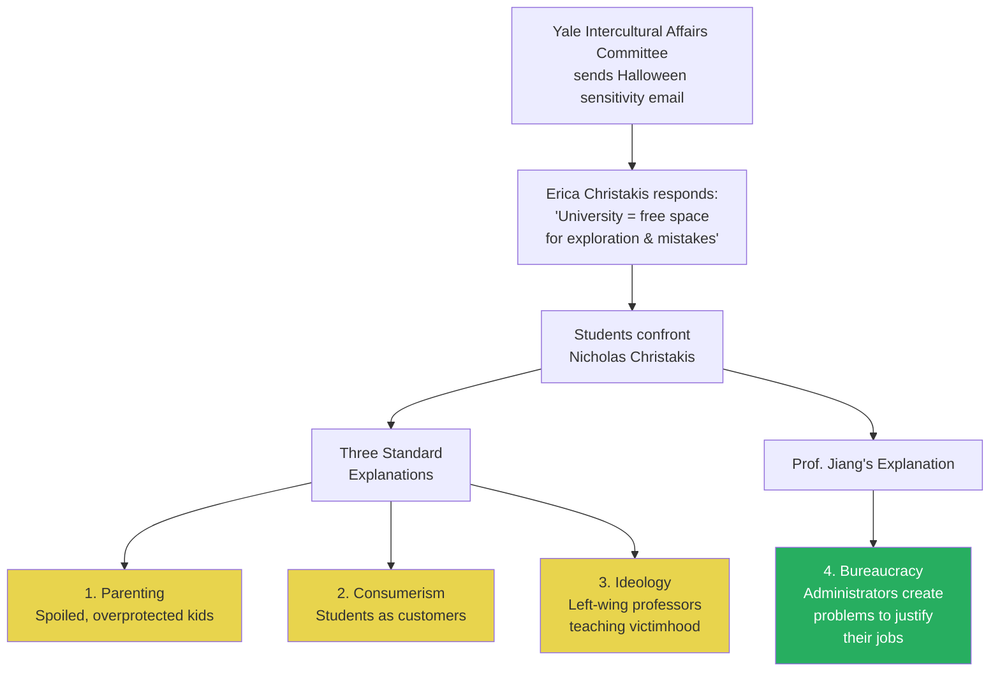
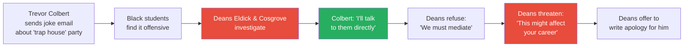
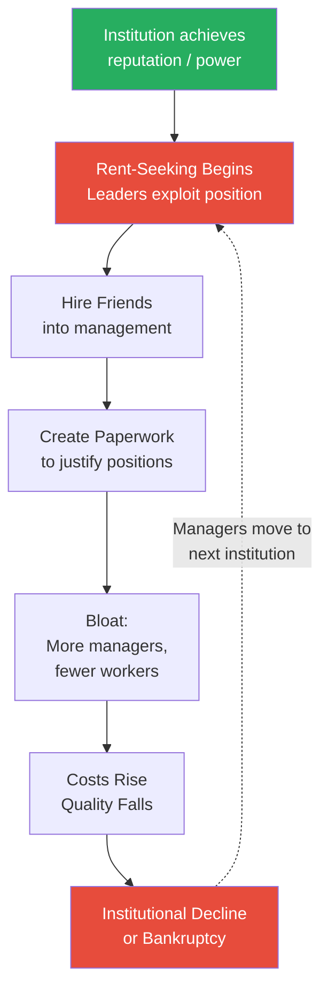
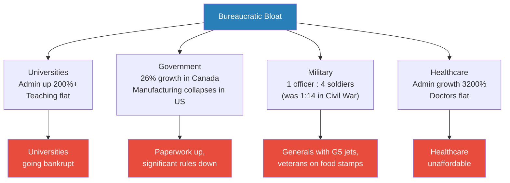
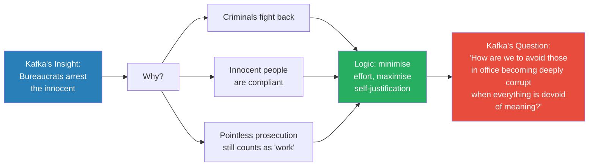
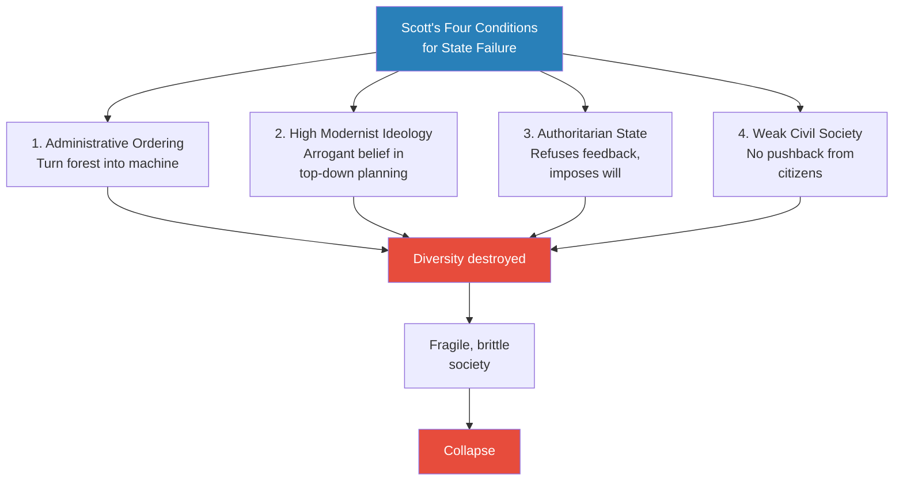
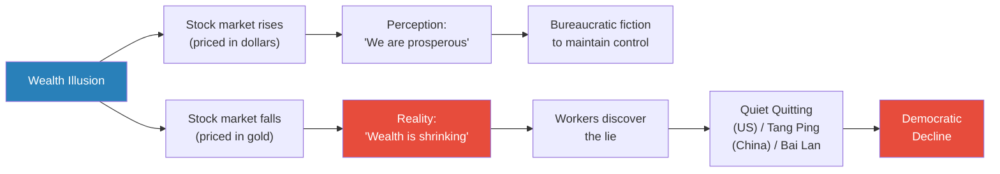

# Death by Bureaucracy

> Prof. Jiang opens with a real incident at Yale University in 2015 -- a conflict over Halloween costumes that spiralled into students cursing at a professor -- and asks why this is happening. His answer is not parenting, consumerism, or left-wing ideology, but something deeper: universities have become bureaucracies where administrators create problems to justify their own existence. He then shows, with data from universities, governments, militaries, and hospitals across America, Canada, and Sweden, that bureaucratic bloat is a universal disease. Drawing on Kafka's *The Trial*, Arendt's *The Origins of Totalitarianism*, and Scott's *Seeing Like a State*, he argues that all organisations inevitably drift toward bureaucratic parasitism -- and that the consequences include economic decline, democratic erosion, and civilisational stagnation.

---

## Overview: Key Highlights

- <b style="color: #27ae60">Bureaucracy is the real explanation</b> -- universities, governments, and militaries have been captured by administrators who create problems to justify their existence
- <b style="color: #e74c3c">Rent-seeking behaviour</b> -- people in power exploit their positions to enrich themselves and their friends, passing privilege to their children
- <b style="color: #2980b9">The Yale Halloween incident (2015)</b> -- a safe space vs. free space debate that reveals the bureaucratic capture of higher education
- <b style="color: #27ae60">Managers multiply while workers stay flat</b> -- in every institution studied, administrative headcount explodes while teaching, research, and frontline staff stagnate or decline
- <b style="color: #e74c3c">Stratford University's collapse</b> -- a concrete case where administrators bankrupted their own institution through self-dealing and expense fraud
- <b style="color: #2980b9">Kafka's *The Trial*</b> -- bureaucrats arrest innocent people because it is easier than pursuing criminals; they justify existence through pointless prosecutions
- <b style="color: #2980b9">Arendt's three characteristics of totalitarianism</b> -- removed from reality, obsessed with expansion, defiant of evidence -- and how they apply to all bureaucracies
- <b style="color: #27ae60">Scott's *Seeing Like a State*</b> -- the state destroys organic diversity by imposing mechanical order, making society fragile
- <b style="color: #e74c3c">The gold illusion</b> -- stock prices rise in dollar terms but fall when priced in gold, meaning perceived wealth is a bureaucratic fiction
- <b style="color: #2980b9">Quiet quitting / lying flat</b> -- the global rebellion against meaningless bureaucratic work, from America's "quiet quitting" to China's "tang ping" and "bai lan"
- <b style="color: #e74c3c">Democracy is declining</b> -- people's capacity to participate in and influence politics has dropped rapidly in the past decade
- <b style="color: #27ae60">The only good news</b> -- because institutions are so corrupt, people are now forced to think for themselves and educate themselves

| Concept | One-line summary |
|---------|-----------------|
| **Rent-seeking** | Exploiting a position of power to extract wealth without producing value |
| **Bureaucratic bloat** | The exponential growth of administrators relative to productive workers |
| **Safe space vs. free space** | The tension between protecting feelings and enabling intellectual growth |
| **Consumerist mentality** | Treating students as customers whose demands must be met |
| **Neoliberalism** | The ideology that market logic (consumer is king) should govern all institutions |
| **Totalitarianism (Arendt)** | Regimes removed from reality, obsessed with expansion, defiant of evidence |
| **Administrative ordering (Scott)** | The state's compulsion to turn organic diversity into mechanical uniformity |
| **High modernist ideology** | The arrogant belief that top-down planning can achieve paradise |
| **Quiet quitting / tang ping** | Workers doing the bare minimum as rebellion against meaningless bureaucracy |
| **Parasitism** | Bureaucrats as parasites who drain the host institution and move to the next when it dies |

---

# The Lecture

## The Yale Halloween Incident -- Safe Space vs. Free Space [0:00-7:59]

*Prof. Jiang opens with a 2015 incident at Yale University where a dean named Erica Christakis pushed back against a university-wide email asking students to be culturally sensitive about Halloween costumes. The resulting confrontation between students and her husband, Prof. Nicholas Christakis, reveals something deeper than generational conflict.*

> [!tip] Core Insight
> The standard explanations for campus conflicts -- overprotective parenting, consumerist mentality, left-wing ideology -- all miss the deeper cause. Universities have become bureaucracies where administrators manufacture problems to justify their existence.

*Three conventional explanations are set aside in favour of a structural one: the bureaucratic capture of universities transforms institutions designed for learning into machines designed for administrative self-preservation.*

> [!note]- Expand: Full Lecture Detail
> Prof. Jiang sets the scene at Yale University in October 2015. Halloween is approaching, and the university's Intercultural Affairs Committee sends an email to all students asking them to be sensitive about costumes -- "for example, do not dress up like a panda, because we have Chinese students and they might be offended."
>
> One teacher disagrees. Erica Christakis, a dean at Silliman residential college, writes her own email to her students arguing that "a university is a place for you to explore, experiment and make mistakes." She trusts students to be sensitive but believes free space -- the right to make mistakes and recover from them -- matters more than safe space.
>
> Prof. Jiang polls the class: safe space or free space? Most students choose safe space. He notes this marks a <b style="color: #2980b9">generational shift</b>: "When I was growing up, there was no debate. It was just assumed that free space is more important, because if you're not allowed to make mistakes, if you're not allowed to explore, if your feelings don't get hurt, you will never grow as a person."
>
> He shows two video clips of students confronting Nicholas Christakis, Erica's husband:
>
> - In the first clip, students surround him, accusing him of being racist and demanding an apology
> - In the second, a student screams at him: "It is your job to create a place of comfort and home for the students. You have not done that"
> - Prof. Jiang notes: "Both sides have legitimate points, but this is not appropriate. What you're saying to him is, you work for us. Your job is to make us feel at home. And his response is that my job is to help you learn."
>
> He then presents three standard explanations:
>
> - **Parenting:** These kids grew up privileged, with protective parents who treat them like friends -- they are spoiled
> - **Consumerist mentality (<b style="color: #2980b9">neoliberalism</b>):** Students are customers. Customers are always right. If customers want safe space, professors must deliver or lose their jobs
> - **Ideology:** Left-wing professors teach students that society is racist and they must overturn the white supremacist structure by confronting privileged white professors
>
> "What I want to argue to you today is that there's actually another explanation, which I think is much more compelling": <b style="color: #27ae60">universities have become bureaucracies</b>. They exist to promote the interests of administrators "who want to sit in the office, get a really big salary and feel good about themselves."
>
> He promises to show this is not just true for universities but "for every major organisation in America and in the Western world, and arguably all around the world."

---

## The Trevor Colbert Case -- Bureaucrats Manufacturing Problems [10:00-17:00]

*Prof. Jiang presents a second Yale incident where a law student's joke email about a party triggers a coercive response from two deans -- revealing how administrators create problems to justify their positions.*

*The student's instinct -- talk to the offended students directly -- is the healthy response. The deans block it because direct resolution would eliminate their role.*

> [!note]- Expand: Full Lecture Detail
> Prof. Jiang introduces Trevor Colbert, a student at Yale Law School who sends an email inviting fellow students to a "trap house party" -- a joke, since "trap house" means a drug house. Some African American students take offence and complain to the deans.
>
> Two deans, Eldick and Cosgrove, investigate. Colbert secretly records the 20-minute meeting:
>
> - Colbert does not believe he did anything wrong: he sent a funny email
> - The deans insist he must apologise because "other students found it offensive"
> - Colbert proposes talking directly to the offended students: "I want to hear what they think. I don't want to hear this from you"
> - <b style="color: #e74c3c">The deans refuse</b>: "We want to help you guys out. We're afraid that you guys meet, you guys will fight even more"
> - The deans escalate to threats: "These things amplify over time, so you must apologise right away, for your sake"
> - They warn: "This might affect your career. The legal community is a small one"
> - Eldick offers: "I will write the email for you, I will craft the apology for you"
> - Cosgrove warns that "escalation is a possibility" if Colbert does not comply
>
> Prof. Jiang's analysis: "It's not clear what rules or laws or what regulations Trevor Colbert broke." The deans intervene because <b style="color: #27ae60">"being a dean of a university, it's not a real job."</b> Professors teach. Researchers do research. Deans "actually don't do anything." So bureaucrats "go make problems for everyone in order to create solutions for everyone."
>
> He draws on his own experience: "20 years ago, 30 years ago, when I was a student at Yale, if you had a problem, you had to go talk to a professor, because there was no one else to talk to. Nowadays you can talk to like 20 or 30 different deans."
>
> > [!example] The Greg Patton Incident -- USC, 2020
> > - Prof. Greg Patton teaches a business communication class about doing business in China
> > - He explains the Chinese filler word "nege" (that), which sounds vaguely similar to a racial slur in English
> > - Black students not even in his class write a complaint letter
> > - Prof. Jiang reads the letter aloud, noting "it sounds like a joke, it sounds like a prank"
> > - The dean fires Patton immediately and issues a public apology
> > - The dean's statement: "It is simply unacceptable for faculty to use words in class that can marginalise, hurt and harm the psychological safety of our students"
> > - Prof. Jiang's verdict: "He's being retarded. It's a joke, it's a prank, and he's taking it very seriously. Why? Because he's trying to protect his job"
> > **The lesson:** Bureaucrats seize on trivial incidents because each one justifies their existence and demonstrates their importance. The more absurd the incident, the more clearly it reveals the mechanism.

---

## The Data -- Bureaucratic Bloat Across Institutions [17:00-26:00]

*Prof. Jiang presents chart after chart showing the same pattern across universities, governments, and countries: administrators multiply, their pay rises, while frontline workers stagnate or decline. The pattern is universal.*

> [!tip] Core Insight
> In every institution studied -- American universities, Swedish universities, the Canadian government, the US military -- the same pattern appears: managers multiply, their pay grows, while workers who do real work stay flat or decline. This is not coincidence. It is the structural logic of bureaucracy.

*The cycle of bureaucratic parasitism: once an institution has something worth exploiting, administrators extract value until collapse -- then migrate to the next host.*

> [!note]- Expand: Full Lecture Detail
> Prof. Jiang presents a series of charts, each telling the same story:
>
> **University of California, San Diego:**
> - Student enrollment shows a slight, gradual increase
> - Senior management, deans, administrators, and managers: "boom" -- a sharp, exponential rise
> - "This is called <b style="color: #2980b9">rent-seeking behaviour</b>. People in power take advantage of the power to give jobs to their friends who do nothing every day"
>
> **US university spending (1980-present):**
> - Investment in teaching (blue line): gone down
> - Investment in administration (red line): gone up
> - "Over the past 40 years, universities have put less money into teaching but more money into administration, into bureaucracy. This is where your money is going, guys"
>
> **University of Illinois:**
> - Massive surge in managers
> - Student enrollment went down 3%
>
> **Swedish higher education system:**
> - Teachers teaching more and more students per teacher
> - Administrators managing fewer and fewer students per administrator
> - "Teachers are fewer and fewer, but managers are more and more. That makes no sense"
> - Teachers and researchers: flat line
> - Secretaries (people who do real work): going down
> - Managers: going up
> - Pay: secretaries and teachers paid less and less; managers paid more and more
>
> **US university pay (Gallagher debt study):**
> - Professor salaries over 20 years: $72K to $86K -- modest increase
> - President salary: doubled from $141K to $280K
> - "Now the salaries are over three times as much as faculty"
> - Yale president: $2 million/year
> - Wesleyan president: $3 million/year
>
> > [!example] Stratford University -- Death by Self-Dealing
> > - A private university that went bankrupt
> > - The president (Schultz) and his wife listed themselves as the university's biggest creditors -- claiming the university owed them $2.5 million in promissory notes
> > - When the university could not pay for their cars and mortgages, the Schultzes "lent" the money, then demanded repayment when bankruptcy hit
> > - In its final year, the college paid over $30,000 to seven trustees
> > - Over $18,000 in lease and insurance payments for the Schultzes' cars
> > - Over $4.7 million in loan payments to Eagle Bank on behalf of Schultz
> > - A student asks: "The school board is not stupid, so why don't they change anything?"
> > - Prof. Jiang: "They're all friends. The school board, the President, the Vice President, they're all friends. If you steal by yourself, you might get caught, but if you steal together, you're untouchable"
> > **The lesson:** Bureaucratic parasitism is a collective enterprise. The network protects itself because every member benefits from the theft.

---

## Beyond Universities -- Government, Military, Healthcare [26:00-34:00]

*Prof. Jiang extends the argument beyond higher education: the same bureaucratic bloat infects government, the military, and healthcare across the Western world. The pattern is identical everywhere.*

*The same disease in four different organs: every institution shows administrators multiplying while output stagnates and costs explode.*

> [!note]- Expand: Full Lecture Detail
> **Government (Canada and USA):**
> - Canada: population rose by a few percent, but government grew by 26%
> - USA: stark decline in manufacturing jobs starting in the 1980s (offshored to China), but steady increase in government jobs
> - "People in America are doing less real work, and more and more people are becoming bureaucrats"
> - Growth concentrated in managers and administrators, not workers
> - A study of federal rules: number of significant rules (ones that actually impact daily life) went down, but <b style="color: #e74c3c">paperwork went up</b>
> - "This tells us the managers in the federal government don't do anything but produce paperwork that's meaningless, that has actually no impact on the lives of ordinary people"
>
> **US Military:**
> - Civil War (1860s): 1 officer for every 14 soldiers
> - Today: 1 officer for every 4 soldiers
> - The biggest problem: the explosion in generals
>   - World War II: 12 million soldiers, 7 four-star generals
>   - Today: 1.2 million soldiers, 44 four-star generals
> - <b style="color: #e74c3c">A four-star general gets a personal G5 jet</b> -- a $50-60 million aircraft, always waiting on the tarmac
> - Meanwhile: 1.2 million veterans are on food stamps -- 8% of all veterans
> - "The people who actually fight, who actually make sacrifices for their country, don't have enough to eat while the generals fly around in these really nice planes"
>
> **Every federal department:**
> - Example: seismic engineering has 621 workers doing real work and 1,782 doing administration
> - "In every federal bureaucracy, you have bloat -- managers who do nothing, and very few people who do the actual real work"
>
> **Self-evaluation rigging:**
> - At the end of each year, managers conduct performance reviews
> - They evaluate themselves: 62-64% rated "Outstanding"
> - Everyone else doing real work: 47% rated "Outstanding"
> - "It's a rigged game"
>
> **Healthcare:**
> - Doctor growth (brown line): steady, modest
> - Administrator growth (yellow line): explosive
> - Healthcare is unaffordable in America not because it has the best care (it does not), but because of administrative bloat
>
> > [!example] Health Insurance Denial Rates
> > - United Healthcare denies approximately 32% of all claims as standard practice
> > - A person works for 40 years paying insurance premiums
> > - They get cancer; the doctor charges a million dollars
> > - They file a claim with their insurance company
> > - The company denies it, betting the patient will not fight back
> > - If the patient fights: the company reverses and pays
> > - If the patient does not fight: the company keeps the money
> > - "It's extremely unethical, and that's what managers do every day -- think of new ways to screw over their patients and doctors"
> > **The lesson:** Bureaucratic parasitism is not passive. Administrators actively devise systems to extract value from the people they claim to serve.

---

## Kafka's *The Trial* -- The Logic of Bureaucratic Evil [34:00-40:00]

*Prof. Jiang turns to literature and philosophy to explain WHY bureaucracy behaves this way. Kafka's novel captures the core logic: bureaucrats pursue innocent people because it is easier than doing real work. Arendt's analysis of totalitarianism reveals that all bureaucracies share the same three pathological traits.*

> [!tip] Core Insight
> Bureaucrats do not target criminals -- criminals fight back. They target the compliant, the innocent, the obedient. The logic is not malice but efficiency: justifying your existence by doing as little real work as possible.

*Kafka's genius was seeing that bureaucratic evil is not ideological -- it is structural. The system rewards those who create the appearance of work while avoiding its substance.*

> [!note]- Expand: Full Lecture Detail
> Prof. Jiang introduces <b style="color: #2980b9">Franz Kafka</b>, writing before World War I. His most famous novel, *The Trial*, follows Joseph K, a bank clerk who has never gotten into trouble:
>
> - Joseph K is "very obedient, very nice, just sticks to himself"
> - One day the police arrest him -- they do not tell him why
> - He is put on trial -- the judge does not tell him what he did wrong
> - He spends the entire novel trying to figure out why this happened
> - Kafka's answer: "Its purpose is to arrest innocent people and wage pointless prosecutions against them, which, as in my case, lead to no result"
>
> Prof. Jiang unpacks the logic:
> - "The police could arrest criminals, right, but the police don't want to do that, because the criminals might fight back, or the criminals might be mean"
> - "They'd rather arrest an innocent person because they know the person will be compliant"
> - <b style="color: #27ae60">The core question of bureaucracy: "How do I justify my existence by doing as little work as possible?"</b>
>
> > [!example] Prof. Jiang's Toronto Story
> > - Prof. Jiang is in Toronto with his two young boys and lets them run around a park
> > - His four-year-old runs too far and gets lost
> > - A stranger finds the boy, but he speaks no English -- surrounded by strangers, he faints from fear
> > - Police and paramedics arrive, confirm the boy is fine -- no heat stroke, vital signs normal
> > - Prof. Jiang finds his son and explains what happened
> > - At this point, the police should let them go home -- but they insist on taking them to the hospital
> > - Prof. Jiang protests: "We could be stuck there for 12 hours in line"
> > - Meanwhile, a fight is breaking out elsewhere in the park
> > - Prof. Jiang thinks: "Why are you guys bothering me and not going to arrest those guys who are fighting?"
> > - The answer: "Because it's easier to deal with me than to go arrest those guys"
> > **The lesson:** Kafka's insight is not fiction -- it is a description of how bureaucratic logic operates in everyday life. The compliant are targeted because compliance is efficient for the bureaucrat.
>
> Prof. Jiang then turns to <b style="color: #2980b9">Hannah Arendt</b> and her *Origins of Totalitarianism*. She writes about how Nazism dominated Germany and communism dominated Soviet Russia -- two regimes that killed tens of millions. Her analysis identifies three defining characteristics:
>
> - **Removed from reality:** They have a religion, a faith, a mindset, and they want to impose it on reality. "They don't care about reality"
> - **Movement as the only logic:** "You only know if you're right if you're growing." The Nazis' membership was increasing and they were winning wars, therefore they were right -- regardless of whether their policies led to destruction
> - **Defiance of reality:** "Even though the Nazis were losing the war, even though it's clear they could not defeat Soviet Russia, they doubled down, because in their religion, movement is what matters, defying reality is what matters"
>
> <b style="color: #e74c3c">Prof. Jiang's extension:</b> "What she does not say in the book is that these three characteristics can apply to all bureaucracies, all governments, meaning that over time, all governments, all bureaucracies, will tend towards totalitarianism because that's the only way they can justify their existence."

---

## Scott's *Seeing Like a State* -- How Bureaucracy Destroys Diversity [40:00-55:00]

*Prof. Jiang draws on James Scott's framework to show HOW bureaucracies destroy the organic complexity of society. The state is a machine that must turn diverse forests into uniform plantations -- and the consequences are fragility, starvation, and civilisational decline.*

*Scott's four conditions are not sequential -- they are simultaneous and reinforcing. When all four are present, catastrophe follows.*

> [!note]- Expand: Full Lecture Detail
> Prof. Jiang introduces <b style="color: #2980b9">James Scott's *Seeing Like a State*</b> -- "an excellent book" that explains "how governments function. And for him, governments actually create more problems than they solve."
>
> Scott lists four reasons:
>
> **1. Administrative ordering of nature and society:**
> - "A bureaucracy is a machine. It's a hierarchy. It's static, it's mechanical. But society is like a forest. It's diverse, it's an ecosystem, it's organic"
> - "For a state to exist, it must turn the forest into a machine like itself. So it destroys diversity, it destroys spontaneity, it destroys imagination"
> - Prof. Jiang illustrates by asking a student to introduce himself. The student gives his name, his background, his school history. Prof. Jiang stops him: "That's not the correct answer. The right answer is, you're a teenage boy"
> - <b style="color: #e74c3c">"The state doesn't care who you are. You're a teenage boy, which means in two years' time, you can be employed in a factory, or I can send you to war. I don't care about your name, your parents, your past. All I care about is the fact that you are a teenage boy, and therefore I can exploit you for labour"</b>
>
> **2. High modernist ideology:**
> - The state is a monopoly and "becomes arrogant. It has hubris. It's overconfident, and it wants to impose its ideology on everyone else"
> - "It believes that through its own planning, it can achieve paradise"
>
> **3. Authoritarian imposition:**
> - "It refuses to listen to criticism, to feedback, to questions. It is not open to debate. It imposes its will on people"
>
> **4. Weak civil society:**
> - "If, as an organisation, you're not getting feedback, you're not allowing for openness, then you will wither and die"
>
> > [!example] The German Forest Disaster (Late 19th Century)
> > - Germany had diverse natural forests full of different trees, shrubs, and greenery
> > - The state asked: how can we best monetise the forest?
> > - Solution: burn the natural forest and plant only trees that can be harvested for lumber
> > - "Brilliant use of space. More efficient"
> > - The problem: monoculture trees became susceptible to disease and weather
> > - Scott writes: "Monocultures are, as a rule, more fragile and hence more vulnerable to the stress of disease and weather than polycultures"
> > - A diverse forest can lose one species and recover; a monoculture plantation loses everything
> > **The lesson:** Efficiency and resilience are opposites. The state optimises for efficiency and destroys the diversity that makes survival possible.
>
> > [!example] Forced Communism in Tanzania
> > - Small farmers grew diverse crops on individual plots
> > - The state decided this was inefficient: consolidate all farmers, grow one cash crop for export
> > - When disease or weather struck, all crops died simultaneously
> > - Result: starvation
> > - "These planners carried in their mind's eye a certain aesthetic -- a visual codification of modern production. They like things that can be mapped out, that can be a blueprint"
> > - "But the real world, nature, requires diversity. It requires organic growth"
> > **The lesson:** Top-down planning that ignores local knowledge produces catastrophe -- not because planners are evil, but because they cannot see what they are destroying.
>
> Prof. Jiang then shows how the state transforms society:
>
> | Before (Organic) | After (Bureaucratised) |
> |-------------------|----------------------|
> | People come together and organise communities by need | State creates permanent cities and fixes people in place |
> | People live on small farms, trade freely | State makes people work in factories so it can tax wages |
> | Property shared communally | Property owned and controlled by the state |
> | Resources used according to need | Resources centralised for taxation and exploitation |
>
> **The consequences:**
> - Consumer goods (cars, clothing, phones) are getting cheaper
> - But hospital services, schooling, and housing are getting more expensive
> - Why? "Because these are monopolies controlled by bureaucrats"
> - <b style="color: #e74c3c">It is almost impossible for middle-class people to have a good life now</b>

---

## The Gold Illusion and Quiet Quitting [50:00-55:00]

*Prof. Jiang presents two final consequences of bureaucratic civilisation: the illusion of wealth and the death of motivation.*

*The gold chart is the lecture's most provocative visual: everything we believe about prosperity is denominated in a currency the bureaucrats control. Switch the denominator, and the illusion collapses.*

> [!note]- Expand: Full Lecture Detail
> **The gold illusion:**
> - Prof. Jiang shows a chart with two lines: stock prices in dollars (black, rising) and stock prices in gold (blue, falling)
> - "If you use money to buy stocks, it goes up. But if you use gold to buy stocks, it goes down"
> - Only 10% of Americans control over 90% of stocks
> - <b style="color: #e74c3c">"We are living in a lie. All this wealth generation, it's all a lie. It's not real. We just think it's real. We're living in a fairyland created by bureaucrats to fool us to believe that we are prosperous"</b>
>
> **Quiet quitting and lying flat:**
> - In America: <b style="color: #2980b9">quiet quitting</b>
> - In China: <b style="color: #2980b9">tang ping</b> (lying flat) and <b style="color: #2980b9">bai lan</b> (let it rot)
> - "People don't want to work anymore. Why? Because it's pointless to work in a bureaucracy"
> - The reasons: leaders don't care, the organisation doesn't need you, you are alienated, told what to do, cannot negotiate, cannot rise within a bureaucracy, and are asked to work too much while feeling like a machine
> - "The way you rebel is lying flat or quiet quitting"
>
> **Democratic decline:**
> - People feel democracy is declining
> - "Experts estimate that the capacity for people to participate in politics, the capacity for people to influence politics, has declined rapidly these past 10 years"
> - <b style="color: #e74c3c">"We are living in a world that is becoming more and more bureaucratic and it's killing us"</b>

---

## Q&A -- Can Anything Be Done? [55:27-end]

*The students press Prof. Jiang on whether there is any hope. His answers are bleak but honest: bureaucrats hold all the power, and society may need to collapse before it can regenerate.*

> [!note]- Expand: Full Lecture Detail
> **Student: "Is there any good side of the current world?"**
> - Prof. Jiang: "Because things have become so corrupt, people now are forced to think for themselves. Before, you could just trust your teacher, trust your parent, trust authority figures. But now you see them for the bureaucrats that they are"
> - <b style="color: #27ae60">"People's minds are opening, and that, I think, is a very good thing"</b>
>
> **Student: "Will it help if we cancel most of the managers?"**
> - Prof. Jiang: "They have all the power. They would much rather send you to war and kill you off than lose their jobs"
> - "Go back to the example of Stratford University. Their mentality is, how do I maintain my privilege? They don't care about society"
> - <b style="color: #e74c3c">"These are parasites, and there's nothing we can do about it"</b>
>
> **Student: "If teachers quit, who will the managers control?"**
> - Prof. Jiang: "They don't think like that. They don't think about how efficient is my organisation. All they care about is maintaining their position right here and now"
> - They hire friends into management, forming a "cabal or network unto themselves"
> - "They're parasites. The host dies -- they switch to another host. Maybe this university goes bankrupt, but there's another university I can go to and exploit"
> - "What matters is to maintain their patronage, their political networks, so they all help each other"
>
> **Student: "Is there any way to stop or reverse this system?"**
> - Prof. Jiang: "They are the ones in power. Often, society has to collapse before it can regenerate"
> - Before collapse, bureaucrats have "a lot of tricks up their sleeves": creating civil wars where left and right fight each other, using AI to control people, faking crises, starting pointless wars
> - "Whatever it takes to maintain their privilege and power -- that's their mentality"
>
> **Student: "I'm a 12th grader. Should I still pursue higher education?"**
> - Prof. Jiang: "University is a complete rip-off. You're paying for the nice salaries and perks of these administrators. You're not really paying for the professors"
> - "What I would do is focus on education, on learning, by reading a lot of books, asking a lot of questions, doing my own research, learning real skills"
> - "In a system where the game is rigged, going to university means you'll just lose"
> - "30 years ago, it was good to go to university because you might become a manager. But now all those slots have been taken up by the elite and their children. There's no space for you"
>
> **Student: "Does it matter what major you choose?"**
> - Prof. Jiang: "No, it does not matter. It's all a scam. It's all a scam. Doesn't matter what university you go to -- liberal arts, Ivy League, state -- it's all a scam. Doesn't matter what your major is -- economics, psychology, humanities, computer science -- it's all a scam. The system exists so that the managers and administrators can continue to feed off the system"

---

## Connections

**Builds on:** [[03 - Death by Gerontocracy]] (the "death by" framing continues -- gerontocracy identified the elderly as rent-seekers, bureaucracy identifies administrators), [[01 - How Power Works]] (paradigms used to control populations), [[02 - How Societies Collapse]] (Turchin's elite overproduction is the recruitment mechanism for bureaucratic bloat)

**Sets up:** [[09 - The Theory of Everything]] (the unified framework will need to account for bureaucratic decay as one of the forces destroying civilisation)

**Recurring themes:**
- Rent-seeking behaviour -- the elite extracting value without producing it (established in Lectures 1-3, now given its structural mechanism)
- Parasitic networks -- the cabal structure where mutual protection enables collective theft
- Debunking traditional narratives -- three standard explanations for campus conflicts are rejected in favour of a structural one
- Civilisational decline -- bureaucratic bloat as a measurable symptom of civilisational death

**Related books in vault:**
- [[Seeing Like a State - James Scott]] -- directly cited; the four conditions for state-driven catastrophe
- [[The Origins of Totalitarianism - Hannah Arendt]] -- directly cited; the three characteristics of totalitarian regimes extended to all bureaucracies
- [[Sapiens - Yuval Noah Harari]] -- the agricultural transition as the original moment when human societies became controllable by bureaucratic elites

---

## The Takeaway

This lecture is the structural companion to "Death by Gerontocracy." Where Lecture 3 asked *who* is killing civilisation (the elderly, extracting resources from the young), Lecture 8 asks *how* -- and the answer is bureaucracy. The mechanism is devastatingly simple: once an institution succeeds, the people who run it stop caring about its mission and start caring about their own comfort. They hire friends, create paperwork to justify their positions, and form networks of mutual protection that make reform impossible. The institution decays from within while its external reputation lingers as a husk.

The most counterintuitive insight is not that bureaucrats are lazy -- that is obvious to anyone who has dealt with one. It is that bureaucratic systems *actively prefer* targeting the compliant over the problematic. Kafka saw it a century ago: the police arrest the innocent because innocents do not fight back. Prof. Jiang's own experience in Toronto confirms it. This is not incompetence -- it is optimisation. The bureaucrat's objective function is to justify existence with minimum effort, and compliant targets are the cheapest input.

What remains unresolved is whether Prof. Jiang's pessimism is warranted. He tells his students that society must collapse before it can regenerate, that bureaucrats will start wars and deploy AI before they surrender privilege. But his own advice -- read books, ask questions, develop real skills, think for yourself -- suggests a quiet exit strategy. The lecture ends not with a call to revolution but with a call to self-education: the only institution the bureaucrats have not yet captured is the individual mind.
