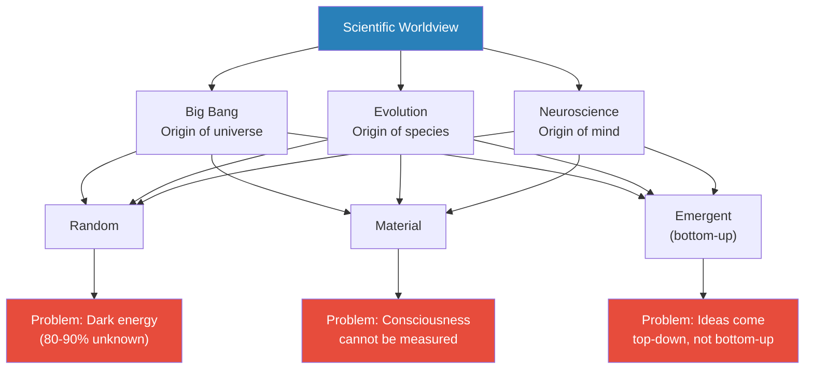
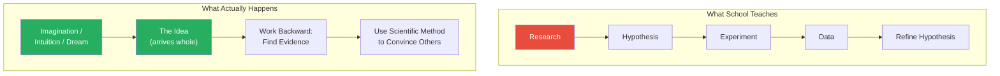
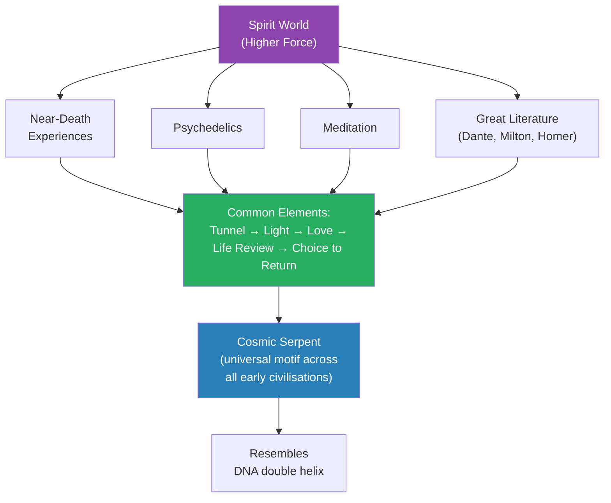
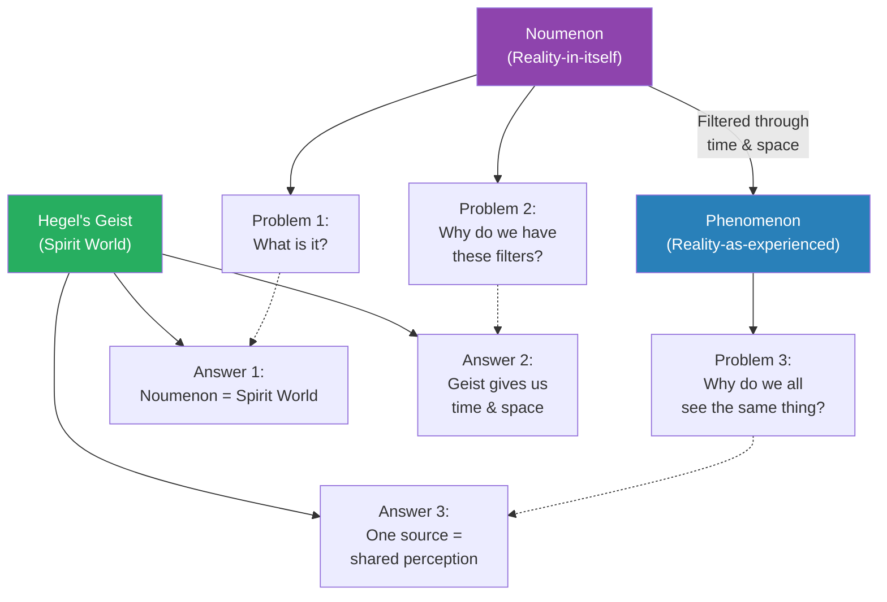
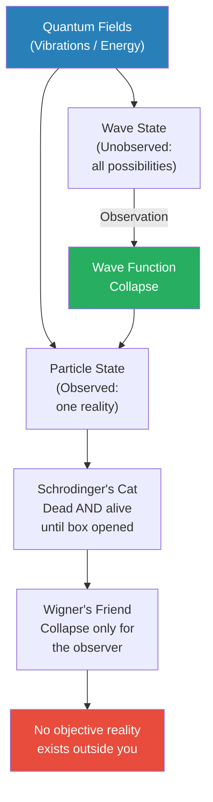
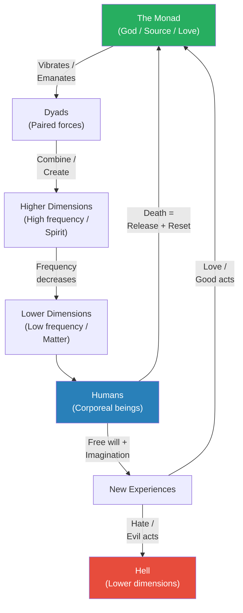
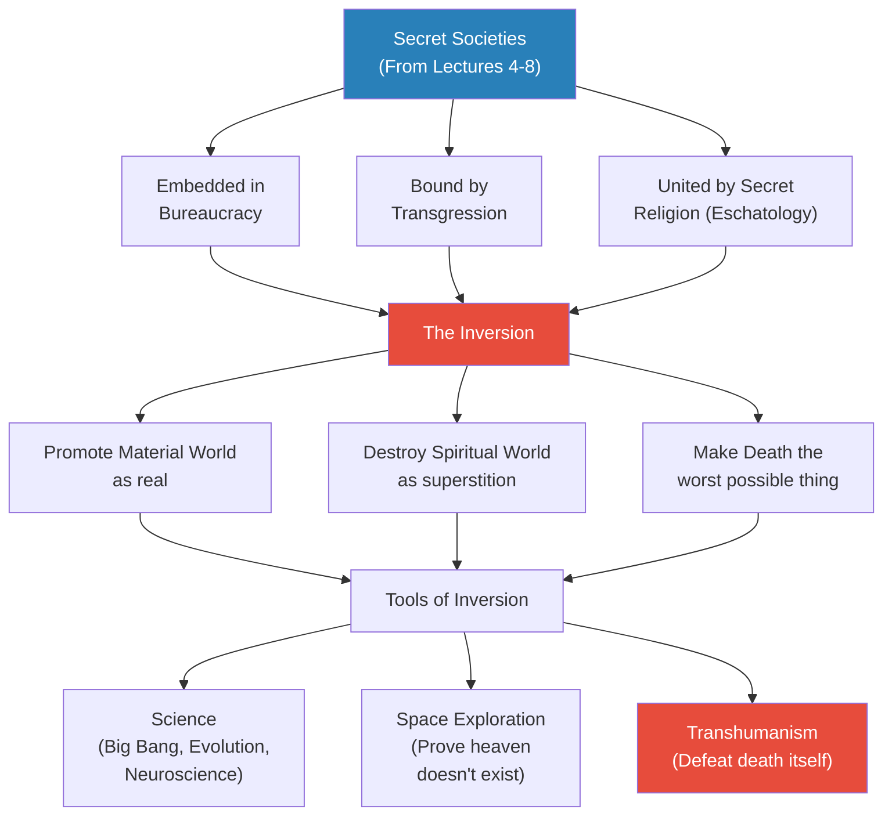
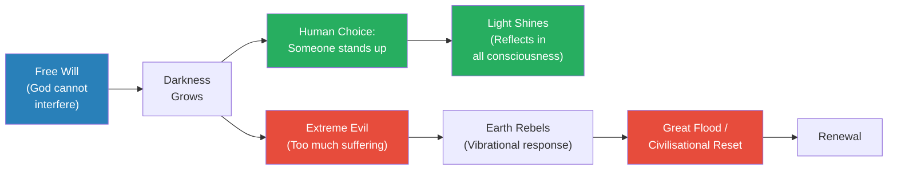

# The Theory of Everything

> Prof. Jiang attempts something audacious: a single lecture that explains where we came from, who we are, and where we are going. He begins with the standard scientific worldview -- the Big Bang, evolution, neuroscience -- and then systematically exposes the gaps and contradictions in each. He argues that the scientific method is not how great ideas are actually generated, that consciousness cannot be explained by neurons alone, and that near-death experiences, psychedelics, and great literature all point toward a spirit world. Drawing on Kant's noumenon, Hegel's Geist, quantum mechanics, and Dante's cosmology, he constructs an alternative model of reality: the universe is vibrational consciousness, humans exist to expand that consciousness through imagination and free will, and the material worldview promoted by modern science is a deliberate inversion designed by those in power to make people forget God and fear death.

---

## Overview: Key Highlights

- <b style="color: #27ae60">The universe is vibrational consciousness, not dead matter</b> -- everything is vibrations, and what we call reality is our participation in interpreting those vibrations
- <b style="color: #e74c3c">The Big Bang theory relies on "dark energy" -- an admission that the model does not work</b> -- 80-90% of the universe is composed of something scientists cannot define
- <b style="color: #2980b9">Kant's noumenon vs. phenomenon</b> -- we never see reality itself, only reality filtered through time and space, which are part of us rather than the external world
- <b style="color: #e74c3c">Evolution cannot explain the human species</b> -- the gap from ape to human, 150,000 years of missing history, and the lack of species diversity all remain unresolved
- <b style="color: #27ae60">Ideas come first, then the process -- not the other way around</b> -- Einstein, Watson, and Prof. Jiang himself all receive ideas through imagination and intuition, then work backward to justify them
- <b style="color: #2980b9">Wave function collapse</b> -- quantum mechanics proves that reality does not exist independently of observation; each person lives in their own unique universe
- <b style="color: #2980b9">Hegel's Geist</b> -- the noumenon is the spirit world, which gives us time and space and explains why we all perceive reality the same way
- <b style="color: #27ae60">Free will is the foundational principle</b> -- the system requires disobedience and mistake-making to generate the novelty that expands universal consciousness
- <b style="color: #e74c3c">Science is a tool of control, not discovery</b> -- theories like the Big Bang and evolution were designed to make people forget divinity and fear death
- <b style="color: #2980b9">Transhumanism</b> -- the ultimate goal of those in power: defeat death, upload consciousness to machines, and trap humanity in the material world permanently
- <b style="color: #27ae60">Only in complete darkness can the light truly shine</b> -- God has faith that someone will stand up, and because consciousness is interconnected, one person's light reflects in everyone
- <b style="color: #e74c3c">The war between heaven and hell is a war of perception</b> -- whoever controls what people believe about God, death, and reality controls the world

| Concept | One-line summary |
|---------|-----------------|
| **Dark energy** | A placeholder for the 80-90% of the universe science cannot explain -- "cheating" to save the Big Bang model |
| **Noumenon (Kant)** | Reality-in-itself, which we can never directly access because we filter it through time and space |
| **Phenomenon (Kant)** | Reality-as-experienced, the only version we ever see -- a constructed hallucination |
| **Geist (Hegel)** | The spirit world as the true noumenon, solving all three of Kant's problems at once |
| **Wave function collapse** | Reality only becomes definite when observed -- before observation, all possibilities coexist |
| **Wigner's friend** | The wave function collapses only for the observer, not for anyone else -- there is no shared objective reality |
| **Monad** | The one source of everything -- God as total love, consciousness, and imagination |
| **Dyads** | Paired forces created by the monad's vibration, which combine to create new dimensions of reality |
| **Free will** | The foundational principle that allows mistake-making, novelty, and the expansion of consciousness |
| **Inversion** | The strategy of secret societies: make hell into heaven and heaven into hell by promoting materialism over spirit |
| **Transhumanism** | The attempt to surpass humanity by defeating death -- trapping consciousness in the material world forever |
| **As above, so below** | Everything is a reflection of everything else -- the cosmos is interconnected at every level |

---

# The Lecture

## The Scientific Worldview -- Simple, Clean, and Wrong [0:00-9:59]

*Prof. Jiang opens by presenting the standard scientific account of reality -- Big Bang, evolution, neuroscience -- in under ten minutes, summarising everything modern science claims to know about where we came from, who we are, and where we are going. Then he identifies three characteristics of this worldview that make it vulnerable: it is random, material, and emergent. The rest of the lecture will attack each.*

> [!tip] Core Insight
> The scientific worldview rests on three pillars -- randomness, materialism, and emergence -- each of which has fundamental problems that science cannot solve from within its own framework.

*The three characteristics of the modern worldview -- random, material, emergent -- each generate a fatal problem that Prof. Jiang will exploit across the lecture.*

> [!note]- Expand: Full Lecture Detail
> Prof. Jiang announces the ambition: "Today we do the theory of everything. Very quickly, I will explain to you what science tells us about where we came from, who we are, and where we're going."
>
> He walks through the standard account briskly:
>
> - **The Big Bang:** In the beginning, a massive ball of energy exploded, creating stars, planets, black holes, and solar systems
> - **Evolution:** Life evolved from plants and sea life to lizards, mammals, and finally humans -- driven by random mutation and survival of the fittest, introduced by Charles Darwin
>   - Humans dominate because we cooperate, have language, store knowledge, and accumulate technology
> - **The human mind:** Unique in the universe -- it allows communication, imagination, and creativity
>   - The brain filters experiences into memories, separating short-term from long-term
>   - Long-term memories are stored according to emotions -- happy, sad, angry, scared -- forming a "database"
>   - From this database, identity emerges: "an understanding of who you are, your place in the world, and how you should best navigate the world"
>   - Multiple identities combine into a <b style="color: #2980b9">worldview</b> -- student at school, child at home, employee at work -- which is effectively personality
>
> Prof. Jiang pauses. "This is pretty simple, but this is what science tells us." Then he identifies the three characteristics that define the entire modern worldview:
>
> - <b style="color: #2980b9">Random</b> -- "Before we understood this as design. Before we believed there was a God. Now we believe there's no God. It's all just random."
> - <b style="color: #2980b9">Material</b> -- "Before we understood the universe as spirit, mainly spirit. Now we understand it as mainly material. Things we can see and touch. We cannot see it, we cannot touch it, we cannot measure it -- it does not exist."
> - <b style="color: #2980b9">Emergent</b> -- "Bottom up. Particles become atoms. Atoms become matter. Matter becomes chairs or people."
>
> Then the pivot: "Now there's a problem with all these theories. I'm going to go over them one by one, and I will show you the problems, the deficiencies, the flaws."

---

## The Big Bang -- Dark Energy as Intellectual Cheating [0:00-9:59]

*Prof. Jiang attacks the Big Bang theory by pointing out that the universe does not expand the way the model predicts. Different parts move at different speeds, different galaxies accelerate differently -- and the scientific response is to invent "dark energy," an undefined substance comprising 80-90% of the universe, which Prof. Jiang compares to adding an unknown variable to a failed maths test.*

```mermaid
flowchart LR
    BB["Big Bang<br/>Prediction:<br/>Linear expansion"] --> O["Observation:<br/>Uneven expansion<br/>Galaxies at different speeds"]
    O --> DE["Solution: Dark Energy<br/>(80-90% of universe)"]
    DE --> Q1["What is dark energy?"]
    Q1 --> A1["We don't know"]
    A1 --> V["Verdict: Model is<br/>probably wrong"]
    V --> ALT["Alternative:<br/>Multiple Big Bangs"]
    ALT --> Q2["Why multiple<br/>Big Bangs?"]
    Q2 --> A2["Also unknown"]
    style BB fill:#2980b9,color:#fff
    style DE fill:#e74c3c,color:#fff
    style V fill:#e74c3c,color:#fff
```

*Each attempt to patch the Big Bang model creates a new unanswerable question -- the theory is held together by placeholders, not evidence.*

> [!note]- Expand: Full Lecture Detail
> Prof. Jiang lays out the problem methodically:
>
> - If the universe started from a single explosion, it should expand linearly -- uniformly in all directions at consistent speed
> - <b style="color: #e74c3c">Observation contradicts this</b>: different parts of the universe expand at different rates, and certain galaxies move faster than others
> - Astronomers introduced <b style="color: #2980b9">dark energy</b> to explain these inconsistencies -- a substance that comprises at least 80%, possibly 90% of the universe
> - "What is dark energy? The answer is we don't know"
>
> > [!example] The Maths Test Analogy
> > - Imagine you take a maths test: 1987 plus 25
> > - Your answer is 20 -- obviously wrong
> > - Your teacher marks it incorrect
> > - You respond: "I know how to fix this. Plus dark energy. Problem solved."
> > - Prof. Jiang: "This is literally what cosmologists are doing"
> > **The lesson:** Dark energy is not an explanation -- it is an admission of failure dressed up as a discovery.
>
> - The alternative model -- multiple Big Bangs -- helps explain the statistical inconsistencies better
>   - But it immediately raises a new question: why are there multiple Big Bangs? And that question has no answer either
> - The deeper problem: the Big Bang has become a <b style="color: #e74c3c">paradigm</b> -- "a story accepted by most scientists, and they refuse to budge on this issue"
> - Prof. Jiang's verdict: "This system is clearly problematic, and it could be wrong"

---

## Evolution -- The Gaps It Cannot Fill [9:59-13:58]

*Prof. Jiang turns to evolution, acknowledging that it works for most animals but identifying three specific problems when it comes to humans: the unexplained gap from ape to human, 150,000 years of missing history, and the puzzling lack of human species diversity.*

> [!note]- Expand: Full Lecture Detail
> Prof. Jiang is careful: "In theory, evolution does work, and it works for most animals." The problems emerge specifically with humans:
>
> - **Problem 1 -- The ape-to-human gap:** We share 99.9% of DNA with apes, "but we don't know why we're so different from the ape." Evolution predicts gradual progress, but the jump in capability is discontinuous and unexplained
> - **Problem 2 -- The missing 150,000 years:** Humans have existed for roughly 200,000 years, but we only have about 50,000 years of history. "Where do the other 100,000-150,000 years go? We don't know."
> - **Problem 3 -- The lack of diversity:** According to evolution, there should be many different types of humans -- "some with six fingers, some with three eyes, like animals." Scientists explain this by pointing to Neanderthals and Cro-Magnons, arguing Homo sapiens overtook them, but <b style="color: #e74c3c">the lack of surviving species diversity does not fit the evolutionary model</b>
>
> Prof. Jiang does not dismiss evolution entirely -- he positions it as a theory that works within its domain but fails to explain the most important case: us.

---

## The Problem of Consciousness -- Where Is Memory? [13:58-16:06]

*Prof. Jiang shifts to neuroscience and identifies fundamental gaps in our understanding of the brain: the mystery of baby personality, the unknown location of memory storage, and the question of where identity comes from if not from parental DNA.*

> [!note]- Expand: Full Lecture Detail
> Prof. Jiang raises three problems that neuroscience cannot resolve:
>
> - **The baby problem:** If personality is formed through experiences filtered by a worldview, babies should not have a worldview. "But if that's the case, how do they process memories? How do they know what memories to store?"
>   - He draws on personal experience: "I have three kids, and I can tell you they're all distinct personalities. It seems as though they were born with a worldview"
>   - <b style="color: #e74c3c">Personality does not come from parental DNA</b> -- "Just ask yourself, am I a composition of my parents' personality? You're not. You're a different person."
> - **The memory storage problem:** "We do not know where the brain stores memory." Despite memory being a building block of everything, neuroscience cannot locate it
>   - A student suggests the hippocampus -- Prof. Jiang corrects: "We know where certain things are stored. We know where faces might be stored. But we don't know where memory is stored."
>   - "What we say is the entire brain stores memories, but that's just another way of saying we don't know"
> - **The consciousness problem:** The current model treats the brain like a city with roads (synapses) where electrical collisions generate thought -- but this model cannot account for the richness and speed of human thinking

---

## How You Actually Think -- Ideas Before Process [16:06-25:38]

*Prof. Jiang makes his most provocative argument about the scientific method: it is not how discovery works. Real ideas come through imagination, intuition, and something like channelling -- then the scientific method is applied retroactively to convince others. He uses Einstein, James Watson, and his own creative process as evidence.*

> [!tip] Core Insight
> The scientific method is a communication tool, not a discovery tool. Every great scientific breakthrough came through imagination and intuition first; the method was applied afterward to make the idea legible to others.

*School teaches the bottom path as the top path. Prof. Jiang argues the top path has never produced a single great discovery -- it is the bottom path, working in reverse, that generates all breakthroughs.*

> [!note]- Expand: Full Lecture Detail
> Prof. Jiang sets up the contrast between the taught method and the real method:
>
> - **The taught method (school):** Research → hypothesis → experiment → data → observations → refine hypothesis. "This is what you're taught in every class, even in English class -- research, outline, thesis, evidence, draft, edit, repeat."
> - **The real method:** "As someone who is much older than you, who actually thinks for a living, who teaches for a living, who writes for a living -- I'm going to tell you how you actually think is the complete opposite"
>   - <b style="color: #27ae60">The idea arrives first, fully formed</b> -- then you work backward to create the process
>
> > [!example] Einstein at the Patent Office
> > - Albert Einstein did not create his theory of relativity in a laboratory
> > - He was not doing research with other scientists
> > - He was sitting in a patent office every day, daydreaming
> > - Then "boom, the idea came to his head"
> > - Only afterward did he go back and look for the evidence to support his idea
> > **The lesson:** The greatest scientific theory of the twentieth century was born from daydreaming, not from the scientific method.
>
> > [!example] James Watson and the Double Helix
> > - Watson spent years working to figure out how DNA was structured
> > - One day he had a dream of a double staircase
> > - He thought: "Maybe that's the model I need to use"
> > - He then did more research and discovered it worked
> > - "The question then is, how did that get into his head?"
> > **The lesson:** The structure of DNA -- arguably the most important biological discovery in history -- arrived in a dream.
>
> > [!example] Prof. Jiang's Own Writing Process
> > - He has written three novels
> > - He does not sit at a desk reading books and taking notes
> > - Instead: "I lie in bed and I might play some video games, or I might read a book. I get up, I walk to the park, and I come back, and I have all these ideas"
> > - He writes the ideas down for one to two hours, then is exhausted
> > - The next day, new ideas arrive: "It's not like I am generating these ideas. It's more like I'm receiving these ideas."
> > - His wife tells him that when he works, "it's like I'm possessed"
> > - His teaching works the same way: a framework in his head, no script, responding to student faces, "channelling a higher force"
> > - "If you have been with me for ten years, you will know I've never taught the same class ever"
> > **The lesson:** Creative and intellectual work is not production -- it is reception. The creator is a channel, not a factory.
>
> A student pushes back: the scientific method is how inspirational ideas are presented to others. Prof. Jiang agrees enthusiastically: "You're absolutely correct. The scientific method is a way for us to communicate and spread ideas. But you will never, ever have a great discovery by following the scientific method."
>
> Another student challenges: doesn't experience and knowledge form the basis for receiving ideas? Prof. Jiang agrees: "You're exactly correct, and I'll explain this as we move on." He acknowledges that the channel requires preparation -- but the act of discovery itself is reception, not construction.

---

## Evidence for the Spirit World [25:38-33:29]

*Prof. Jiang presents four categories of evidence suggesting that a higher force exists beyond the material world: near-death experiences, psychedelics, meditation, and great literature. All four, he argues, produce remarkably consistent reports despite coming from people with no connection to each other.*

*Four independent sources of evidence -- NDEs, psychedelics, meditation, and literature -- converge on the same experience. The cosmic serpent, appearing across unconnected civilisations, is one of the most striking convergences.*

> [!note]- Expand: Full Lecture Detail
> Prof. Jiang presents the evidence category by category:
>
> - **Near-death experiences (NDEs):** Tens of thousands of testimonies on YouTube, all describing the same sequence:
>   - A tunnel with a light that draws them
>   - Rising up, feeling "tremendous love, peace, forgiveness, compassion"
>   - A life review: "They can see all the pain they caused. They can see all the good they've done."
>   - Asked by a higher force whether they want to return
>   - They always say yes -- "because I need to tell people about my experience"
>   - They return "extremely changed people"
>   - <b style="color: #27ae60">These are people who don't know each other, and maybe before they were atheists or just scientists, but once they have these experiences, it changes them forever</b>
>
> - **Psychedelics:** Every culture throughout human history has used psychedelics as a way for shamans or priests to "access the divine"
>   - When you use certain psychedelics, "you end up seeing the same images regardless of who you are"
>   - The <b style="color: #2980b9">cosmic serpent</b> is a universal motif: "Every early civilisation has worshipped a serpent" -- and the serpent's form resembles DNA
>   - Different civilisations in different parts of the world, with no contact, produced "very similar statues and paintings"
>
> - **Meditation:** Going up to a higher dimension through meditation produces the same experience as psychedelics and NDEs
>
> - **Great literature:** Prof. Jiang's personal testimony: "I've read Dante, I've read Milton, I've read Homer, and studied them very closely. It was amazing to me -- they say the same things."
>   - Dante's description of God and the heavens in the *Divine Comedy* reads "almost as though he's describing a near-death experience, even though we have absolutely no evidence that Dante himself had a near-death experience"
>
> His conclusion: "There's evidence that there's a higher force beyond us. The spirit world does exist. I can't prove it exists, but there's a lot of evidence to suggest it does exist."

---

## Kant and the Hallucination of Reality [33:29-38:11]

*Prof. Jiang introduces Kant's distinction between the noumenon (reality-in-itself) and the phenomenon (reality-as-experienced), then shows how Hegel's Geist resolves the three problems Kant's system creates. The key move: time and space are not features of the external world but filters we impose on reality.*

> [!tip] Core Insight
> Time and space do not exist outside of us. They are filters we use to interpret a reality we can never directly access. We do not observe reality -- we participate in it and hallucinate the version we experience.

*Kant creates three problems; Hegel solves all three with a single move -- identifying the noumenon as the Geist (spirit world). One source of reality explains why we all experience the same filtered version.*

> [!note]- Expand: Full Lecture Detail
> Prof. Jiang introduces Kant as "the greatest philosopher who ever lived, the most influential philosopher who ever lived," and explains his central contribution:
>
> - <b style="color: #2980b9">Noumenon</b> -- "reality that is outside of us, the things in themselves." We can never know it directly
> - We filter reality using <b style="color: #2980b9">time and space</b>, which "do not exist outside of us. They are part of us."
> - Through this filtering, the noumenon becomes the <b style="color: #2980b9">phenomenon</b> -- "the things that are to me, not the things in themselves"
> - "We imagine reality, we hallucinate reality"
>
> This creates three unsolved problems:
> 1. What is the noumenon?
> 2. Why do we have these filters (time and space)?
> 3. If reality is subjective, why does everyone see the same thing?
>
> Hegel's solution: the <b style="color: #27ae60">Geist</b> (spirit). The noumenon is the spirit world. It gives us time and space. And because everything comes from one source, we all perceive the same filtered version.

---

## Quantum Mechanics -- No Objective Reality [33:29-38:11]

*Prof. Jiang uses quantum mechanics to reinforce Kant's insight: at the deepest level, reality is not solid matter but vibrations (quantum fields), and it only becomes definite when observed. Schrodinger's cat illustrates wave function collapse; Wigner's friend proves there is no shared objective reality.*

*From vibrations to the collapse of shared reality -- quantum mechanics leads inexorably to the conclusion that each person lives in their own universe.*

> [!note]- Expand: Full Lecture Detail
> Prof. Jiang walks through quantum mechanics step by step:
>
> - **The school model (wrong):** In science class, you learn the Bohr model -- nucleus with orbiting electrons. In advanced physics, you learn the electron cloud (probability). "When you go to university, you will be taught this is completely and utterly wrong."
> - **The real picture:** If you go deep enough, atoms are not solid matter -- they are <b style="color: #2980b9">vibrations</b>, called quantum fields. The electron is "an intersection of these quantum fields."
> - **Wave-particle duality:** Quantum fields can exist as a wave or a particle. "We can only know if it's a wave or particle by observing it."
> - **Wave function collapse:** "All of nature is vibrational. It's energy. It's only when we observe it, when you interact with it, that it becomes something solid that we can see and measure and touch."
>
> > [!example] Schrodinger's Cat
> > - A cat is inside a sealed box with chemicals that may or may not break
> > - If the chemicals break, the cat dies; if not, the cat lives
> > - While the box is sealed, the cat is both dead and alive simultaneously
> > - Only when you open the box does reality collapse into one state
> > **The lesson:** Reality does not have a definite state until it is observed.
>
> > [!example] Wigner's Friend Experiment
> > - The experimenter opens the box and sees whether the cat is dead or alive -- the wave function collapses for them
> > - But a friend standing outside the laboratory has not observed the result
> > - For the friend, the wave function has NOT collapsed
> > - Even if the experimenter tells the friend, "it still doesn't collapse. We have to participate in the reality ourselves"
> > **The lesson:** There is no shared objective reality. "Everyone lives in his or her own reality. Everyone has a unique universe unto himself or herself."
>
> A student objects: quantum mechanics applies at the quantum level, not the macro level. Prof. Jiang acknowledges this but counters: "Quantum mechanics is the basis of reality." The macro world is built on quantum foundations.

---

## The Vibrational Universe -- Dante's Cosmology [38:11-50:35]

*Prof. Jiang synthesises Kant, Hegel, and quantum mechanics into a unified model of reality using Dante's cosmology as the narrative framework. The universe is vibrational consciousness emanating from a single source (the monad), and humans exist to expand that consciousness through experience, imagination, and free will. Love is the compass; death is the reset mechanism; hell is where negative energy is stored.*

> [!tip] Core Insight
> Humans exist because perfection cannot generate novelty. The spirit world is eternal, immutable, and painless -- therefore it cannot imagine. We exist in bodies that suffer, bleed, and die precisely so that we can have new experiences that expand the consciousness of the universe.

*The complete cosmological system: the monad emanates downward through decreasing frequencies until matter and human bodies emerge. Love flows back up to the source; hate flows down to create hell. Death is the release valve that prevents permanent entrapment.*

> [!note]- Expand: Full Lecture Detail
> Prof. Jiang constructs the model layer by layer, using Dante as his narrative vehicle:
>
> - **Everything is vibrations:** "All everything are just vibrations. That's all it is." If it's vibrations, it's also information
> - **The brain as receiver:** "Our brains are not independent. Our brains connect to the universe." We receive vibrational information, combine it with our experiences, and create memories
> - **Memories imprint on the universe:** "Our memories go back to the vibrational force. They're being stored in the universe. They're being imprinted." He compares this to the internet: "Whatever you write is being stored on the internet. You're participating in the internet. You're part of the internet."
> - **The <b style="color: #2980b9">Monad</b>:** The one source -- God. "He vibrates, he emanates, he thinks, he breathes, and this creates vibrational force"
> - **<b style="color: #2980b9">Dyads</b>:** Paired forces created by the monad's vibration. "When the pairs come together and vibrate, they create new things -- this is how creation happens"
> - **Dimensional hierarchy:** As dimensions go lower, frequency decreases. "At high, it's really fast. When it goes low, it becomes low frequency, and eventually you get a point where matter can be created. This is spirit, this is matter, and this is the world we live in."
>
> Why does the system exist this way?
>
> - The monad "strives for newness, for imagination, for freshness"
> - <b style="color: #e74c3c">But in the spirit world, everything is perfect, eternal, and immutable</b> -- "you can feel no pain, you cannot suffer, you cannot make any mistakes, therefore you cannot have any new experiences, therefore you cannot have any imagination"
> - <b style="color: #27ae60">Humans solve this problem</b>: "We are corporeal -- we have bodies. You get old, you bleed, you get hurt, you fall down. You feel anger, you feel hate. But this allows us to have an imagination, and the imagination allows the universe to grow, to expand, to vibrate."
>
> The system's guiding principles:
>
> - **<b style="color: #27ae60">Free will</b>:** "This system cannot work if you do what you're supposed to do. You have to disobey. You have to make your own choices. You have to make your own mistakes."
> - **Love as compass:** "The monad is the totality of love. There's a spark of the monad in us called love. When we do good, we feel good because the spark is growing in us, and it's almost like a magnet -- we want to return to the monad."
> - **Death as release:** "Death prevents us from forever making mistakes. You can have a terrible life, but it's okay because you die, you go back into the universe, you can observe everything you did, you become wiser. Then you come back and live another life."
> - **Hell as storage:** "Love goes back to the monad. But what happens when you create hate? It goes into lower dimensions. This is called Hell."
>
> > [!example] Indra's Pearls -- The Hindu Metaphor
> > - In the house of the god Indra, countless pearls float in space
> > - Each pearl reflects every other pearl
> > - Because there is a divine spark in each of us, when one spark grows bright, all pearls grow bright
> > - "When you do love, you're capable of changing the entire universe, because your love expands outward, and your love reflects in other people as well"
> > **The lesson:** Consciousness is interconnected. One person's love is not private -- it literally illuminates everyone else.
>
> > [!example] Dante's Candle and Mirrors
> > - God is a candle with a flame
> > - We are all mirrors that reflect the candle
> > - No matter how far we are from God, "his flame burns in us"
> > - "You can be far away, and you could feel as though God has forgotten you, but there's still the flame inside you"
> > **The lesson:** Distance from God does not extinguish the divine spark. It may be faint, but it is never absent.
>
> The moral framework that emerges:
> - God is "eternal love, eternal compassion, eternal forgiveness"
> - God "will never forget you. He will always forgive you."
> - But you must "believe in God. Live a life of righteousness, of love, of compassion, of imagination if you want to return to God"
> - "We are here. Our divine mission is to expand the consciousness of the universe. We do that by embracing love and by imagining the world to be a better place."

---

## The Great Inversion -- How We Forgot God [50:35-59:00]

*Prof. Jiang asks the central question of the rest of the semester: if every early religion across every culture knew this cosmological truth, how did humanity come to deny it and adopt a materialist worldview? His answer draws on concepts from the previous lectures -- secret societies, bureaucracy, transgression -- and introduces the concept of inversion: making heaven into hell and hell into heaven by promoting materialism, making people fear death, and using science as a tool of control.*

> [!tip] Core Insight
> The war between heaven and hell is not over resources or territory -- it is a war of perception. If those in power can make everyone believe God is dead and the material world is all that exists, they win. Science, space exploration, and transhumanism are all weapons in this war.

*The inversion is not random cultural drift -- it is a deliberate strategy. Secret societies use science, space exploration, and transhumanism as weapons to make people forget divinity and fear death.*

> [!note]- Expand: Full Lecture Detail
> Prof. Jiang poses the question: "If every single early religion -- whether it's Taoism or Hinduism or the Egyptians or the Native Americans -- if every early religion all believed this, and they all knew this, how did we come to forget or deny this with a material reality?"
>
> His answer connects back to the entire semester:
>
> - The cosmological structure has three levels: heaven (spiritual, consciousness), earth (human, free will), and hell (mechanical, machines)
> - For most of human history, humans chose heaven
> - "Eventually you had people who chose hell, and when you choose hell, you have access to technology. This technology allows you to conquer and control other people."
> - <b style="color: #e74c3c">The problem: if people are enlightened, they cannot be controlled</b> -- "If you know the truth, you know that none of this matters. We're all going to die. So why should I listen to you?"
> - **The solution: make people fear death.** "Before, people understood death was just a part of the journey, a release, an opportunity to reset yourself. Now, death is the worst thing that could ever happen to you."
>
> How do you achieve this? Two steps:
>
> 1. **Make people forget God** -- using science: Big Bang, evolution, neuroscience -- theories designed to eliminate divinity
> 2. **Defeat death itself** -- through <b style="color: #2980b9">transhumanism</b>: "Upload your brain to the internet so you're here forever. Trap you here forever."
>
> The mechanism of secret societies (drawing on Lectures 4-8):
>
> - Secret societies can coordinate within mass bureaucracies because they are the only people actually doing things (from [[08 - Death by Bureaucracy]])
> - <b style="color: #2980b9">Transgression</b> binds them: "If you're doing bad things together, now you have blackmail on each other, and therefore you're committed to keeping each other's secrets"
> - <b style="color: #2980b9">Eschatology</b> (secret religion) provides the coordination script: "Religion is just a script to understand the world that allows you to coordinate secretly"
>
> The three principles of the system and their exploitation:
>
> | Principle | Meaning | How it is exploited |
> |-----------|---------|---------------------|
> | **Unity** | The entire system is complete and interconnected | Cannot be destroyed, only corrupted |
> | **Symmetry / Polarity** | Good requires evil, beauty requires ugliness, God requires Satan | Satan-worship becomes rational if you are already doing evil |
> | **As above, so below** | Everything reflects everything else | Corrupt humans → corrupt the cosmos |
>
> - Because the secret societies know they are doing evil, they expect God to punish them -- so they invert: they celebrate Satan as superior to God
> - <b style="color: #e74c3c">The inversion strategy</b>: "Make heaven into hell and hell into heaven. Brainwash people to worship the material world and abandon the spiritual world. Make money, power, technology, science the greatest things in the world. Get rid of God, compassion, love."
>
> Prof. Jiang names the space programme as a specific tool: "Putting man on the moon and on Mars -- now I've destroyed the idea of heaven. Before, we understood the moon, Mars, were beyond us, because they are heavenly, spiritual. But once I put man on the moon, I've proven heaven doesn't exist."
>
> His most provocative claim: "All science -- it's not about discovering reality. It's about reinventing reality in a way that serves power."

---

## The Fail-Safes -- Why Hell Can Never Win [59:00-1:04:08]

*In the Q&A, students push back on the framework, and Prof. Jiang clarifies the system's built-in protections: the principle of free will prevents divine intervention, interconnected consciousness means evil generates cosmic consequences, and the cycle of destruction and renewal (like the Great Flood) resets civilisation when corruption becomes total.*

*Two fail-safes protect the system: individual human choice (someone standing up in darkness) and cosmic reset (the earth itself rebelling against excessive evil). Both ensure hell can never achieve permanent victory.*

> [!note]- Expand: Full Lecture Detail
> The Q&A generates three important clarifications:
>
> **Student question 1:** If secret societies worship Satan and Satan is gaining power, why doesn't God do anything?
>
> - "Because of the principle of free will, God and Satan cannot interfere in this world"
> - There are thousands of different secret societies; the most successful are those that combine all three principles (bureaucratic embedding, transgression, secret religion)
> - <b style="color: #27ae60">"Only in time of complete darkness, only when Satan rules, can humans fully shine"</b>
> - "God has trust in us. God has faith in us. God loves us completely. God believes that someone will stand up and do the right thing, and when that person does the right thing, the universe will shine."
> - Because consciousness is interconnected (Indra's pearls), one person's light reflects in everyone else
>
> **Student question 2:** Is there really a God and a Satan, or just positive and negative energy?
>
> - "In reality, literally everything is vibrations. How these vibrations work, no one knows."
> - <b style="color: #27ae60">"We are participants in the universe. If we all believe God exists, God exists. If we all believe sin exists, sin exists."</b>
> - "This is a war of perception. If I can get everyone in the world to believe that God is dead and Satan is the true God, I win."
>
> **Student question 3:** Can someone make themselves into a God if enough people believe in them?
>
> - "The answer is no. Historically, charismatic leaders have emerged to say I am God's representative -- not God itself."
> - Ancient kings claimed divine descent -- "God came down, had sex with my mother, and now I'm born" -- but never claimed to be God
>
> The fail-safe mechanisms:
>
> - The cosmos is interconnected: "If we do evil, if we feel pain, if there's too much suffering, the earth itself rebels because of vibrational energy"
> - This leads to events like the Great Flood, "which resets the world and lets humanity renew itself"
> - <b style="color: #e74c3c">This is why Elon Musk wants to go to Mars</b> -- to escape the fail-safe, to ensure that the material powers survive a planetary reset
> - But the system is designed so that "hell can never triumph"

---

## Connections

**Builds on:** [[08 - Death by Bureaucracy]] (bureaucracy as institutional parasitism, secret societies coordinating within bureaucracies), [[05 - The Birth of Evil]] (Gnostic cosmology, three stages of Western religion), [[04 - How Evil Triumphs]] (transgression as coordination mechanism, ritual sacrifice), [[06 - The Psychology of Evil]] (dissociation, programming scripts)

**Sets up:** [[10 - The Conspiracy of Evil]] (organised evil -- the specific secret societies and their methods), [[11 - Dawn of the Human Imagination]] (imagination as the mechanism for expanding consciousness)

**Related books in vault:** [[Sapiens - Yuval Noah Harari]] (the agricultural revolution as a trap, paradigm-breaking), [[Antifragile - Nassim Nicholas Taleb]] (systems that benefit from disorder)

---

## The Takeaway

This lecture is the hinge of the Secret History series. Everything before it -- how power works, how societies collapse, how evil operates through bureaucracy, meritocracy, and transgression -- was diagnosis. This lecture provides the cosmology that explains why the diagnosis matters. Prof. Jiang is not merely arguing that institutions are corrupt or that secret societies manipulate bureaucracies. He is arguing that these are symptoms of a cosmic war between spiritual consciousness and material control, and that the scientific worldview most people accept without question is itself a weapon in that war.

The most provocative claim is not about God or Satan but about creativity: that the scientific method as taught in schools is the opposite of how discovery actually works. Einstein daydreaming in a patent office, Watson dreaming of a staircase, Prof. Jiang lying in bed before ideas arrive -- these are not anecdotes but evidence for a model of consciousness where the mind is a receiver, not a generator. If that model is even partially correct, it inverts the relationship between education and creativity: school does not teach you to think; it teaches you to justify thoughts that arrived from somewhere else.

The framework Prof. Jiang builds -- monad, dyads, vibrational dimensions, free will, love as compass, death as reset -- is explicitly presented as metaphor ("even though God and Satan are just projections of our imagination, they do help us understand the world better"). But the implications are treated as real: the war of perception is happening now, transhumanism is a concrete strategy, and the choice between material and spiritual worldviews is the defining struggle of the present age. The rest of the semester will trace how this struggle has played out across civilisations.
