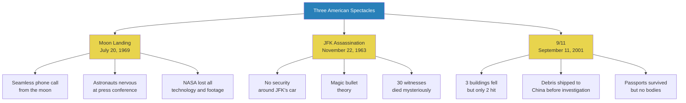
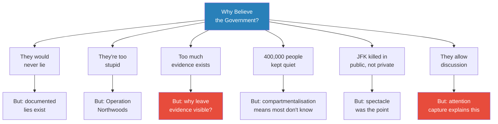
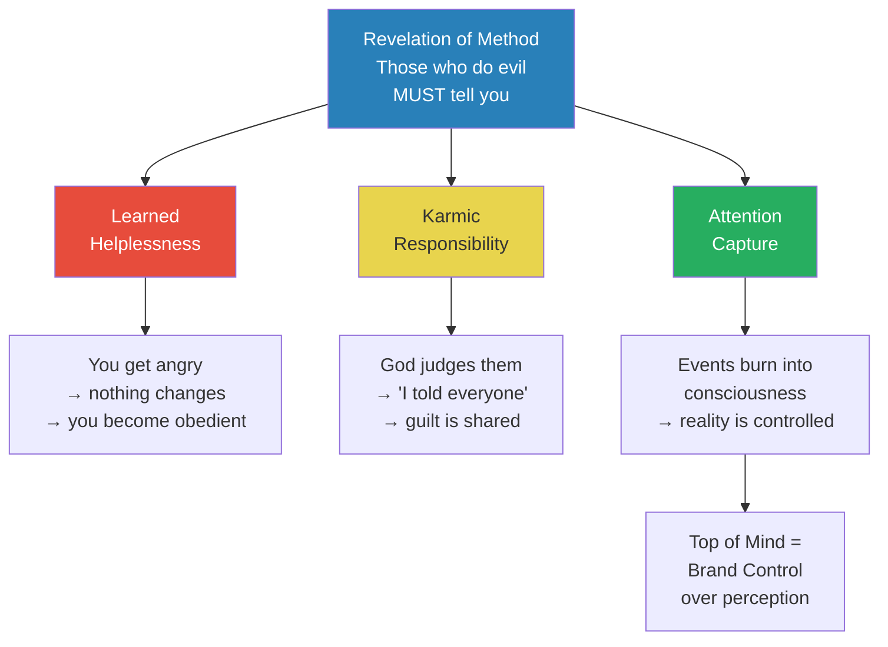
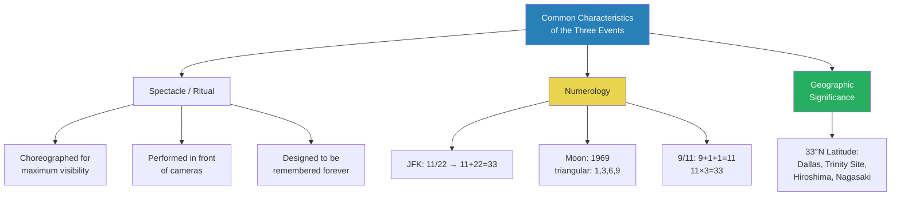
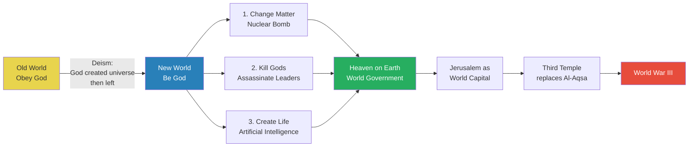
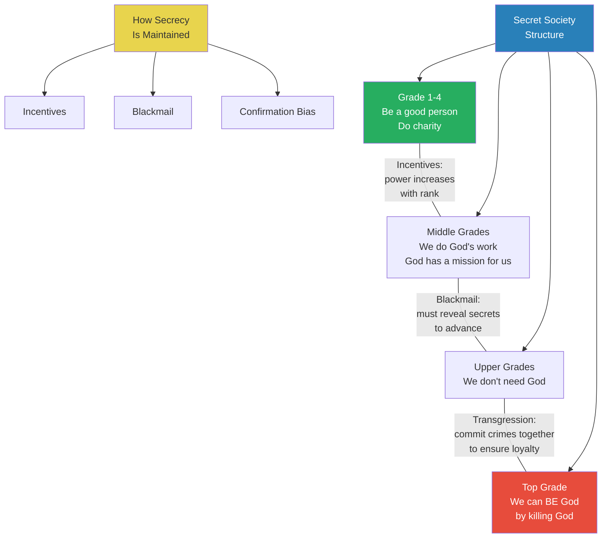
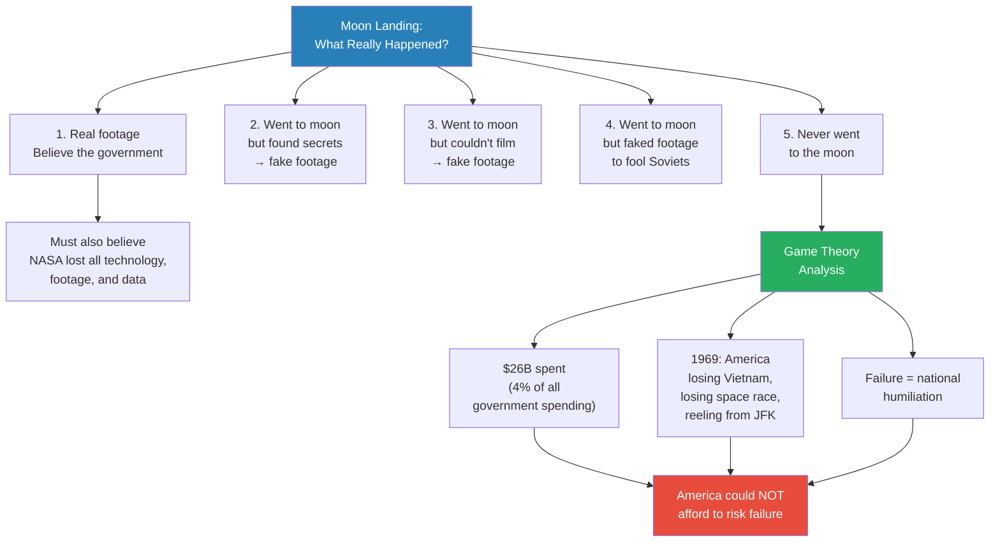

# The Conspiracy of Evil

> Prof. Jiang examines three defining spectacles of American history -- the moon landing, the JFK assassination, and 9/11 -- not to declare them conspiracies, but to ask why the official stories contain so many inconsistencies, and why those inconsistencies are left in plain sight. He introduces the concept of revelation of method: the idea that those who commit evil must tell you they are doing it. The lecture builds from anomalies in the evidence to a structural theory of how secret societies operate within bureaucracies, culminating in a framework where numerology, compartmentalised knowledge, and bureaucratic parasitism explain how small coordinated groups control large systems.

---

## Overview: Key Highlights

- <b style="color: #27ae60">Revelation of method</b> -- those who engage in evil must tell you they are engaging in evil, for three specific reasons
- <b style="color: #e74c3c">Learned helplessness</b> -- the more you know and the angrier you get, the more powerless you feel, and the more obedient you become
- <b style="color: #2980b9">Karmic responsibility</b> -- by telling you and you not acting, the perpetrators spread the guilt to everyone who stays silent
- <b style="color: #27ae60">Attention capture</b> -- spectacles are designed to be remembered forever, controlling how people perceive reality
- <b style="color: #2980b9">Compartmentalisation</b> -- secret societies operate on a need-to-know basis with different "truths" taught at each grade
- <b style="color: #e74c3c">Secret societies are parasites on bureaucracies</b> -- they gain power precisely because bureaucracies are siloed and uncoordinated
- <b style="color: #2980b9">The number 33</b> -- a recurring numerological signature across events, latitudes, religious texts, and organisational structure
- <b style="color: #27ae60">The three acts of becoming God</b> -- change matter (nuclear bomb), kill gods (assassinate leaders), create life (artificial intelligence)
- <b style="color: #e74c3c">The magic bullet</b> -- the Warren Commission's claim that a single bullet injured both JFK and Governor Connally
- <b style="color: #2980b9">Game theory applied to the moon landing</b> -- America could not afford the risk of failure in 1969, making deception a rational strategy
- <b style="color: #27ae60">Confirmation bias</b> -- people want to believe the government tells the truth, which keeps the system intact
- <b style="color: #e74c3c">Incentives and blackmail</b> -- the twin mechanisms that enforce silence within hierarchical secret organisations

| Concept | One-line summary |
|---------|-----------------|
| **Revelation of method** | The principle that those who do evil must publicly signal what they are doing |
| **Learned helplessness** | Knowing the truth but being unable to act creates deeper obedience |
| **Karmic responsibility** | Perpetrators share guilt with those who see and do nothing |
| **Attention capture** | Spectacular events burn into collective consciousness, controlling perception of reality |
| **Compartmentalisation** | Each grade in a secret society is told only what it needs to know |
| **Numerology (33)** | The recurring number linking Masonic grades, latitudes, historical events, and religious texts |
| **Bureaucratic parasitism** | Secret societies gain power by coordinating inside uncoordinated bureaucratic systems |
| **The three divine acts** | Change matter, kill gods, create life -- the secret society roadmap to replacing God |
| **Confirmation bias** | The psychological tendency to accept comfortable narratives over disturbing evidence |
| **Game theory** | Logical framework applied to assess whether the moon landing risk was rational |
| **Operation Northwoods** | 1962 government document planning to hijack civilian planes and blame Cuba |
| **The Lone Gunman** | TV show aired six months before 9/11 depicting a government-controlled plane crash into the WTC |

---

# The Lecture

## Three Spectacles: Moon Landing, JFK, and 9/11 [0:00 - 10:00]

*Prof. Jiang opens the lecture with video footage of three defining events in American history -- the 1969 moon landing, the JFK assassination, and 9/11 -- and walks the class through the anomalies in each official account, asking not what happened but why the evidence feels wrong.*

> [!tip] Core Insight
> The question is not whether these events are conspiracies. The question is why the official stories contain so many visible inconsistencies -- and why those inconsistencies are never cleaned up.

*Each event has its official story. Each official story has anomalies that are never resolved. Prof. Jiang's point is not that any single anomaly proves conspiracy -- it is that the pattern of visible inconsistency across all three demands explanation.*

> [!note]- Expand: Full Lecture Detail
> Prof. Jiang begins by telling the class they will examine three major events in American history: the moon landing, the assassination of JFK, and 9/11. He notes that "the official story is something that a lot of people do not accept" and says they will look at both the official account and its problems.
>
> ### The Moon Landing
>
> - He shows official NASA footage of the July 20, 1969 landing -- Neil Armstrong, Buzz Aldrin, and Michael Collins
> - He notes with dry irony that the live broadcast from the moon to NASA means "the technology back then is far superior to our technology today"
> - He plays the Nixon-astronaut phone call -- a seamless telephone conversation from the moon to the White House
> - He notes: "The heavens have become part of man's world" -- connecting back to the previous lecture's theme of bringing heaven to earth through <b style="color: #2980b9">inversion</b>
> - He then shows the post-mission press conference
>   - The astronauts are visibly nervous and evasive
>   - Neil Armstrong says he does not remember seeing any stars from the lunar surface
>   - Prof. Jiang: "He doesn't remember anything... Did you see how nervous they are? It's very strange"
> - He compares: if students climbed Everest and returned, they would be ecstatic -- these men look miserable
>
> ### The JFK Assassination
>
> - November 22, 1963: JFK assassinated in Dallas; Lyndon B. Johnson becomes president
> - Johnson organises the <b style="color: #2980b9">Warren Commission</b>, which produces thousands of pages concluding Lee Harvey Oswald acted alone
> - Prof. Jiang points to the motorcade photograph: all security is positioned behind JFK, not around him
>   - "What's the point of security if the security is all behind him?"
>   - The bodyguards and police to the side should prevent snipers -- but JFK's car has no bodyguards at all
> - Many witnesses believe there were other shooters; they heard shots from other positions
>   - Almost 30 of these witnesses were killed or died mysteriously afterwards
> - He notes the shape of Dealey Plaza resembles a menorah and was the site of the first Freemason temple in Texas -- "almost like they picked this place for a ritual sacrifice"
>
> > [!example] The Magic Bullet
> > - Lee Harvey Oswald allegedly fired three bullets from the Texas School Book Depository
> > - One bullet hit JFK and then allegedly ricocheted to hit Governor Connally, who was also in the car
> > - The Warren Commission insisted this "magic bullet" explained all injuries from a single shooter
> > - The trajectory required the bullet to change direction mid-flight
> > - This remains the official explanation to this day
> > **The lesson:** When the official explanation requires physics to behave impossibly, the explanation is doing more work than the evidence can support.
>
> - Oswald is arrested but shot by Jack Ruby while being transferred
>   - Ruby gets impossibly close -- no security prevents him
>   - Oswald is held in place by two large officers, unable to dodge
>   - The officer next to Oswald freezes instead of reacting -- "goes against his training"
> - JFK's brother Robert F. Kennedy runs for president in 1968 and is also assassinated
>   - Sirhan Sirhan is charged and remains in prison, still saying "I didn't do it"
>
> ### 9/11
>
> - Prof. Jiang shows footage of the towers collapsing and notes: "It's almost like a demolition"
> - Two planes hit the Twin Towers, but <b style="color: #e74c3c">three buildings came down</b> -- including Building 7, which was across the street and was not hit by any plane
> - President Bush sits in a classroom during the attacks, is told America is being attacked, and does not move
>   - "America is being attacked, and he's just sitting around with kids"
>   - When asked by a reporter, he says "we'll talk about it later"
> - The debris was shipped to China within a month -- before a proper investigation
> - <b style="color: #e74c3c">Never in history has fire brought down a skyscraper</b> -- before or after 9/11, except for the three buildings that day
> - The explosion was so intense that no bodies or luggage were recovered -- but the hijackers' passports were found in the wreckage
> - He shows a boarding pass allegedly found in the debris of the Twin Towers
>
> > [!example] Larry Silverstein -- "The Luckiest Man in the World"
> > - Six weeks before 9/11, Larry Silverstein buys the lease to the World Trade Centre
> > - The buildings contained asbestos -- removal costs would exceed the buildings' value
> > - The insurance company valued the WTC at $1.5 billion; Silverstein insisted on $3.5 billion, paying more than necessary
> > - After 9/11, he argued two planes meant two separate events, claiming $7 billion
> > - He went to court and received $4.55 billion
> > - He is a self-described workaholic who never misses work -- but missed that day due to a dermatology appointment
> > **The lesson:** Prof. Jiang's sardonic conclusion: "In life, do not be smart, just be lucky."

---

## The Case for Believing the Government [23:00 - 25:00]

*Prof. Jiang pauses the conspiracy evidence and, with deliberate irony, presents the strongest arguments for accepting the official narrative -- before revealing that each argument, when examined, actually deepens the mystery.*

*Each pro-government argument, when examined, transforms into further evidence for the theory Prof. Jiang is building. The visible evidence is not an accident -- it is the mechanism.*

> [!note]- Expand: Full Lecture Detail
> Prof. Jiang lists six reasons "we should never, ever believe conspiracy theories" -- delivered with obvious irony:
>
> - **Reason 1:** "The government would never lie to us" -- he calls this "probably the best reason"
> - **Reason 2:** "The government is too stupid to do anything like this" -- too incompetent to pull off a conspiracy
> - **Reason 3:** If the government is powerful enough to do this, surely they can cover it up -- so why is there so much visible evidence?
>   - Why do we have all the footage from 9/11?
>   - Why do we have passports in perfect condition?
>   - Why does a TV show depict the exact scenario six months earlier?
> - **Reason 4:** NASA had 400,000 people working on the space programme -- if it were fake, surely someone would have confessed by now
>   - "Someone might have told a friend... or just might have gotten drunk and done a YouTube video"
> - **Reason 5:** If you want to kill JFK, why do it in public? Just poison him privately
> - **Reason 6:** If the government were involved, they would not allow discussion -- but all these videos are freely available online
>
> He then names the paradox: "We're in a strange situation where we can either believe the government is telling us the truth, but then we have all this evidence to suggest that they're not telling us the truth, or we can believe that they did this, but we also have to believe that they did this, and they want us to know that they did this, and they want us to talk about these conspiracy theories."
>
> - This sets up the lecture's central concept: <b style="color: #27ae60">revelation of method</b>

---

## Revelation of Method [25:30 - 30:00]

*Prof. Jiang introduces the lecture's central framework: the idea that those who engage in evil must tell you they are engaging in evil. He presents three reasons why this is rational behaviour, not carelessness.*

> [!tip] Core Insight
> The visible evidence is not a failure of cover-up. It is the mechanism of control. The perpetrators need you to know -- because your knowledge and inaction make you complicit.

*The three mechanisms are not alternatives -- they operate simultaneously. Learned helplessness neutralises resistance, karmic responsibility shifts guilt, and attention capture ensures the events are never forgotten.*

> [!note]- Expand: Full Lecture Detail
> Prof. Jiang introduces <b style="color: #2980b9">revelation of method</b>: "The idea is that those who engage in evil must tell you that they are engaging in evil."
>
> He gives three reasons why:
>
> ### Reason 1: Learned Helplessness
>
> - "Let's just say that everyone knows that they did this. We get angry, we write emails, we make YouTube videos, then what? Nothing."
> - <b style="color: #e74c3c">The more angry you get, the more helpless you feel, and therefore the more obedient you become</b>
> - Knowledge without power to act creates deeper submission than ignorance would
>
> ### Reason 2: Karmic Responsibility
>
> - "The people in power are extremely superstitious. They believe that when they die, God will judge them"
> - When God asks why they did evil, they answer: "I told everyone what I was doing. They didn't stop me. They didn't protest. Therefore they are complicit."
> - Prof. Jiang reframes this sharply: "If you just look at 9/11, if you just look at the moon landing, the evidence is so overwhelming that if you still believe the government, <b style="color: #e74c3c">it's not because you are ignorant or stupid -- it's because you are complicit</b>"
> - The karma is spread to everyone who sees and does nothing
>
> ### Reason 3: Attention Capture
>
> - "Everyone remembers where they were, what they were doing, who they were with on 9/11"
> - It does not matter where you were in the world -- the event is etched into your consciousness
> - <b style="color: #27ae60">The point is to control people by controlling how people perceive reality</b>
> - Prof. Jiang connects this to branding: "If you're a company, you don't care about bad publicity. All publicity is good because it's top of mind"
> - If you are hungry and want lunch, the first thing that comes to mind wins -- pizza, hamburger
> - These events function the same way: they control what occupies your mental real estate
> - "So that's what they're doing here. They're trying to control your reality through these events."

---

## Common Characteristics: Spectacle, Ritual, and Numerology [30:00 - 35:00]

*Prof. Jiang shifts from individual events to their shared characteristics, arguing that all three are carefully choreographed rituals with numerological signatures that point to secret society involvement.*

*Prof. Jiang argues that the numerological patterns are not coincidence but signature -- secret societies embed their mythology into the events they orchestrate.*

> [!note]- Expand: Full Lecture Detail
> Prof. Jiang asks: what do JFK, 9/11, and the moon landing have in common?
>
> ### Spectacle as Ritual
>
> - All three events are spectacles -- carefully staged performances designed for maximum visual impact
> - "A lot of care, a lot of attention was put into preparing these rituals"
> - The JFK assassination: the location was chosen, the choreography was deliberate, it was done in front of cameras "so that it will be remembered forever"
> - The same applies to the moon landing and 9/11
>
> ### Numerology
>
> - JFK: November 22, 1963 -- 11/22/1963
>   - 11 + 22 = <b style="color: #2980b9">33</b>
>   - 1963 contains the triangular number sequence: 1, 3, 6, 9
> - Moon landing: 1969 -- same triangular sequence
> - 9/11 -- "pretty easy to remember"
> - Prof. Jiang explains the significance: "Number 33 is almost like a magic number to these people"
>   - 33 = two triangles -- when combined, they form the Star of David (flag of Israel)
>   - 33 degrees in Scottish Rite Freemasonry (the highest grade)
>   - Jesus died at age 33
>   - The word "Elohim" (God) appears 33 times in Genesis
>   - King David reigned for 33 years
>   - Hinduism has 33 deities
>   - The human spine has 33 bones
>
> ### The 33rd Parallel
>
> - Prof. Jiang traces the 33rd parallel north across the world map:
>   - <b style="color: #2980b9">Mesopotamia</b>: where the Tigris and Euphrates meet -- "the birth of civilisation"
>   - <b style="color: #2980b9">Baghdad</b>: capital of the Islamic Golden Age
>   - <b style="color: #2980b9">Damascus</b>: one of the oldest cities in the world
>   - <b style="color: #2980b9">Jerusalem</b>: holiest city for Christians and Jews
>   - <b style="color: #2980b9">Dallas</b>: where JFK was assassinated
>   - <b style="color: #2980b9">New Mexico</b>: the Trinity test site where the atomic bomb was first detonated
>   - <b style="color: #2980b9">Hiroshima and Nagasaki</b>: where the bombs were dropped
> - He acknowledges the practical explanation: 33 degrees north is temperate enough for agriculture but not too hot -- hence major cities cluster there
> - But for secret societies, the geographic coincidence is absorbed into mythology and given sacred meaning

---

## The Three Divine Acts: Becoming God [35:00 - 38:00]

*Prof. Jiang presents the grand mythology of secret societies: a three-step programme to replace God, moving from the Old World (obey God) to the New World (become God).*

> [!tip] Core Insight
> The secret society roadmap has three milestones: change matter (the nuclear bomb), kill gods (assassinate leaders), and create life (artificial intelligence). Each milestone is a step toward declaring humanity -- or the society's inner circle -- divine.

*The progression from obedience to divinity follows a clear logic: each "divine act" demonstrates mastery over a domain previously reserved for God. The endpoint -- a world government headquartered in Jerusalem -- requires the destruction of the Al-Aqsa Mosque and the construction of the Third Temple, which Prof. Jiang says would trigger World War III.*

> [!note]- Expand: Full Lecture Detail
> Prof. Jiang distinguishes the Old World from the New World:
>
> - **Old World:** "Obey God" -- the traditional religious order
> - **New World:** When America was founded, a religion called <b style="color: #2980b9">deism</b> emerged -- the belief that God created the universe but then departed, leaving it to humanity
>   - "So now we can be God. And this is the grand secret of these secret societies"
>
> The three divine acts:
>
> - **Change matter:** The nuclear bomb -- transforming the fundamental structure of matter, something previously only God could do
>   - The Trinity test at 33 degrees north -- even the name "Trinity" carries religious significance
> - **Kill gods:** Assassinating the President of the United States -- JFK as a "prince" whose death demonstrates power over the highest authority
> - **Create life:** Artificial intelligence -- the final step, creating consciousness itself
>
> Once all three are accomplished:
> - "Now you're able to bring heaven to earth, now you're able to declare yourself God"
> - This requires a <b style="color: #27ae60">world government</b>
> - The plan combines Old World and New World by making <b style="color: #2980b9">Jerusalem</b> the world capital
> - Currently, the Al-Aqsa Mosque (third holiest site in Islam, where Muhammad ascended to heaven) stands on the Temple Mount
> - "They plan to destroy the Al-Aqsa Mosque to rebuild the Temple of Solomon, called the Third Temple"
> - <b style="color: #e74c3c">"This will start World War III"</b> -- because the Muslim world would respond with war, which is itself the intended trigger for establishing the world government

---

## How Secret Societies Maintain Power [38:00 - 45:00]

*Prof. Jiang moves from mythology to mechanics: how do secret societies actually keep their secrets and wield their power? The answer involves compartmentalisation, incentive structures, and the exploitation of bureaucratic inefficiency.*

*The genius of compartmentalisation is that most members genuinely believe they are doing good. Only those at the top know the full picture -- and by the time they reach the top, they are too invested and too compromised to leave.*

> [!note]- Expand: Full Lecture Detail
> Prof. Jiang explains how secret societies work using the Scottish Rite Freemasonry model (33 grades):
>
> ### Compartmentalisation
>
> - "There are different layers to a secret society"
> - At the bottom grades: "All you're taught is just to be a good person, to do good works, to do charity, to be kind"
> - Middle grades: "We can do God's work. God has given us a mission"
> - Upper grades: "We don't need God"
> - Top grade: "We can be God by killing God"
> - He compares it to education: "In primary school, you work hard... go to high school, they teach you everything you learned in primary school is wrong... go to university, the professors say everything in high school is wrong"
> - <b style="color: #2980b9">Compartmentalise</b>: "It's a need to know. You are only taught what you need to know at your grade"
> - "The secrets get worse and worse as you climb"
>
> ### Three Mechanisms of Secrecy
>
> - **Incentives:** The higher you climb, the more power you have -- "these people in the middle, all they care about is maintaining their privilege"
>   - The more invested you are, the more you want to believe the lie
> - **Blackmail:** To reach the top, "you have to reveal your secrets too, so you can be blackmailed"
>   - This connects to the concept of <b style="color: #2980b9">transgression</b> from [[04 - How Evil Triumphs]]: committing crimes together ensures mutual silence
> - **Confirmation bias:** "People don't want to believe the government lies to them. People want to believe the government tells the truth. So we like to live in a fantasy world."
>
> ### Bureaucratic Parasitism
>
> - Prof. Jiang connects secret societies to the bureaucracy lecture ([[08 - Death by Bureaucracy]])
> - As societies mature, they become more bureaucratic
> - Bureaucracies become top-heavy, siloed, and full of people who "don't want to do any work"
> - Secret society members exploit this: they are motivated, coordinated, and work together across silos
>   - "You're able to promote each other into positions of power"
>   - "Because these departments are all siloed off, they're independent, you're able to control the entire bureaucracy because you're able to coordinate, but they're not"
> - <b style="color: #27ae60">In a heavily bureaucratic world, secret societies have more and more power</b>
> - He lists examples: the Freemasons, the Jesuits, the Mormons, the Frankists -- "thousands and thousands of secret societies"
> - Currently, these societies collaborate to achieve their shared vision
>   - "But once they create the world government, then they will fight each other"
>   - At this stage, they are "incentivised to work together"

---

## The Atomic Bomb and the 33rd Degree [46:00 - 49:00]

*Prof. Jiang uses the dropping of the atomic bombs on Hiroshima and Nagasaki to demonstrate how the numerological framework and the Freemason network intersect in a single historical event.*

> [!note]- Expand: Full Lecture Detail
> - <b style="color: #2980b9">Harry Truman</b>: the 33rd President of the United States, and a 33rd degree Freemason -- the highest Masonic rank
> - He ordered the atomic bombs dropped on Hiroshima and Nagasaki
> - Prof. Jiang argues this was unnecessary:
>   - America was already firebombing Tokyo -- all the wooden houses burned
>   - "You can see the devastation. They burned everything down"
>   - A land invasion was not necessary because Japan was being bombed "to ashes"
> - The argument that the bomb scared the Soviet Union is self-defeating: "That only encourages the Soviet Union to get their own bomb"
> - If you return to the 33-degree framework: the Trinity test site, Hiroshima, and Nagasaki all sit on the 33rd parallel north
> - The act fits the first divine milestone: <b style="color: #27ae60">change matter</b> -- splitting the atom is a godlike act
>
> He then lists famous athletes who wore number 33 and were Freemasons:
> - Scottie Pippen, Shaquille O'Neal, Larry Bird, Kareem Abdul-Jabbar
> - Reinforcing the idea that 33 appears as a deliberate signature across domains

---

## The Moon Landing: Five Possibilities and Game Theory [49:00 - 57:00]

*Prof. Jiang concludes the lecture's evidential section by presenting five possible explanations for the moon landing footage and then applies game theory to assess which is most rational.*

*Game theory does not prove the moon landing was faked -- but it demonstrates that from a rational-actor perspective, America in 1969 could not afford the risk of failure, making deception a logical strategy regardless of whether it was actually employed.*

> [!note]- Expand: Full Lecture Detail
> Prof. Jiang presents obstacles to lunar travel:
>
> - The <b style="color: #2980b9">Van Allen belts</b> -- electromagnetic fields protecting Earth from cosmic radiation
>   - The belts themselves contain heavy radiation
>   - Beyond them, there is no protection from cosmic radiation
>   - "Some scientists actually believe that it's impossible to leave Earth"
> - Currently, America and China are trying to return to the moon and "having a really hard time"
>   - "NASA lost all the technology, lost all the footage, lost all the data. Oops."
>
> He notes Freemason presence throughout NASA:
> - Buzz Aldrin: Freemason
> - John Glenn (first American to orbit Earth): 33rd degree Freemason
> - James Webb (NASA administrator): Freemason
> - <b style="color: #27ae60">"These people are embedded throughout the bureaucracy, and being able to coordinate gives them complete control"</b>
>
> He introduces Werner von Braun:
> - A former Nazi brought to America after WWII to build the space programme
> - His colleague Carol Rosin claims von Braun revealed before dying that America would manufacture threats to justify space weapons spending:
>   1. Russians (space race)
>   2. Terrorists (9/11)
>   3. Third-world countries (North Korea, Iran)
>   4. Asteroids
>   5. A fake alien invasion
> - "They've been seeding this for a long time"
>
> ### Five Possibilities
>
> - **Possibility 1:** Real footage -- just believe the government (but accept that NASA lost everything)
> - **Possibility 2:** America went to the moon but discovered secrets (e.g., aliens) -- so they created fake footage
> - **Possibility 3:** America went but could not film in lunar conditions -- so they recreated it
> - **Possibility 4:** America went but faked the footage to prevent Soviet reverse-engineering
> - **Possibility 5:** America never went to the moon
>
> ### Game Theory Analysis
>
> - NASA's Apollo programme cost $26 billion (1960-1973) -- approximately $200 billion today
> - This was nearly 4% of all US government spending
> - By 1969, America was in crisis:
>   - The Vietnam War was killing tens of thousands of Americans for no clear purpose
>   - Hundreds of thousands of young Americans were protesting
>   - The Soviets were winning the space race: first animal in space, first man in space, first orbit, first spacewalk, first lunar module
>   - JFK had been assassinated in 1963; Robert Kennedy and Martin Luther King were killed shortly after
> - "If America sent a mission to the moon and all the astronauts died, America would have been broken"
> - <b style="color: #e74c3c">America could not afford to take the risk</b> -- "if it failed, America would have looked like idiots"
>
> He acknowledges the counter-argument: why didn't the Soviets expose the fake? He admits: "That I can't answer for you."
>
> He closes: "What I believe is, within the next two years, the truth will slowly start to come out."

---

## Q&A: Secret Societies and Government [57:30 - 58:30]

*A student asks why secret societies do not simply send their people into the government. Prof. Jiang's answer crystallises the lecture's structural argument.*

> [!note]- Expand: Full Lecture Detail
> **Student:** "The secret society might have been fighting with the governments, but why don't they send their people into the government? Why don't they work together?"
>
> **Prof. Jiang:** "No, no, they ARE the government."
> - Secret societies cannot exist outside of bureaucracies -- they have power precisely because they coordinate within the bureaucracy in ways others cannot
> - "Only when the bureaucracy has reached a certain maturity, a certain size, can secret societies have true power"
> - <b style="color: #27ae60">"Secret societies are the ones who control the government, basically"</b>

---

## Connections

**Builds on:** [[04 - How Evil Triumphs]] (transgression as loyalty mechanism), [[08 - Death by Bureaucracy]] (bureaucratic parasitism, silos enabling coordinated takeover), [[09 - The Theory of Everything]] (unified framework that this lecture applies to specific events)

**Sets up:** [[11 - Dawn of the Human Imagination]] (origins of mythological thinking that feeds secret society cosmology), [[23 - The Organization of Evil]] (institutional evil at scale)

**Related books in vault:** [[Sapiens - Yuval Noah Harari]] (paradigm destruction), [[The 48 Laws of Power - Robert Greene]] (spectacle and attention as instruments of power), [[The Prince - Niccolo Machiavelli]] (the relationship between appearance and control)

---

## The Takeaway

This lecture marks the point where Prof. Jiang's Secret History series shifts from abstract structural analysis -- how power works, how bureaucracies decay, how evil emerges psychologically -- to concrete application. The three American spectacles are case studies in the machinery described in previous lectures: the compartmentalised hierarchy from Lecture 4, the bureaucratic parasitism from Lecture 8, and the psychology of dissociation from Lecture 6 all converge here into a single operating model. Secret societies are not external threats to the system -- they are the system operating as designed, exploiting the very features that make large institutions function.

The most counterintuitive claim is revelation of method. Conventional thinking assumes that conspirators would hide their tracks. Prof. Jiang inverts this: the visible evidence is not a failure of concealment but a tool of control. If the population sees, knows, and still does nothing, it is not the conspirators who are guilty alone -- it is everyone. This connects directly to the concept of learned helplessness: the gap between knowing and acting is where obedience is manufactured. The branding analogy -- "all publicity is good because it's top of mind" -- reframes world-historical events as marketing campaigns for a particular perception of reality.

Several questions remain deliberately open. Prof. Jiang does not explain why the Soviets never exposed the moon landing, acknowledges he is "just speculating" about secret society internal structure, and promises to address the Jerusalem endgame and the "fake alien invasion" later in the semester. The lecture functions less as a set of conclusions and more as a framework for asking better questions -- which, given the series' trajectory, is precisely the point.
