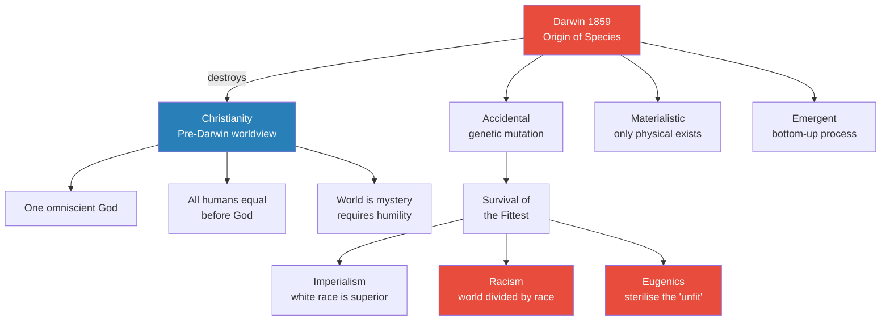
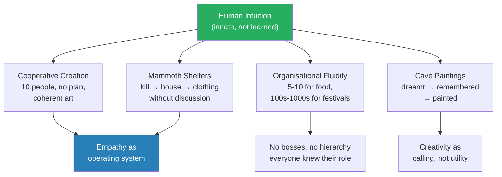
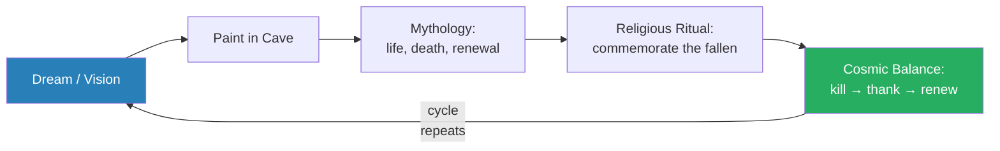
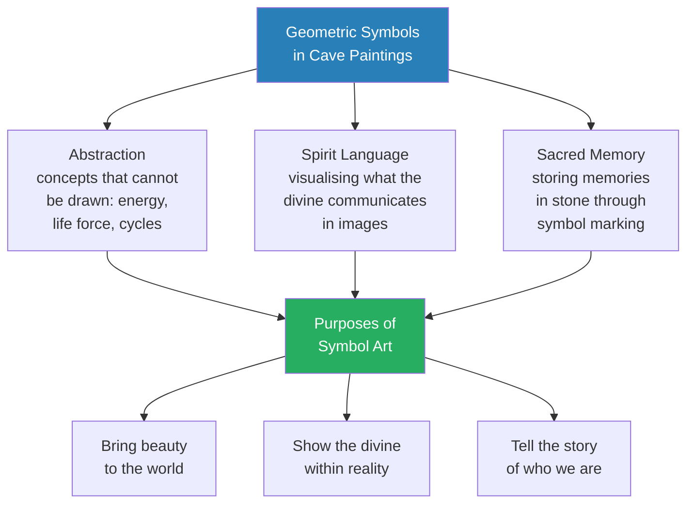
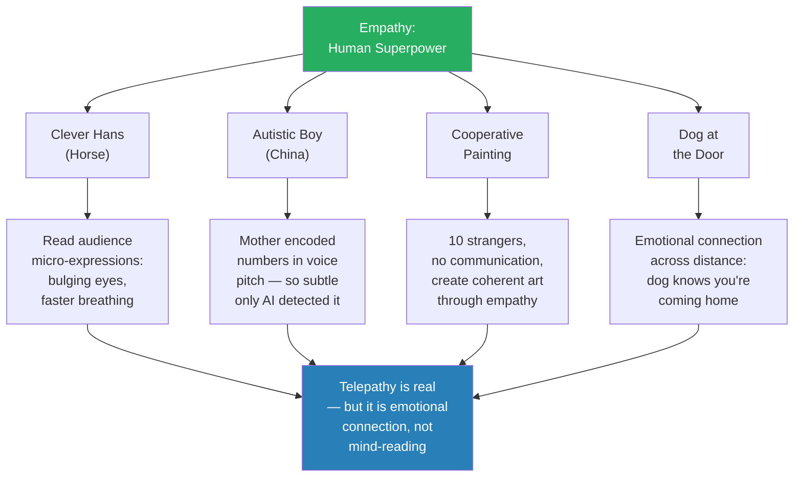
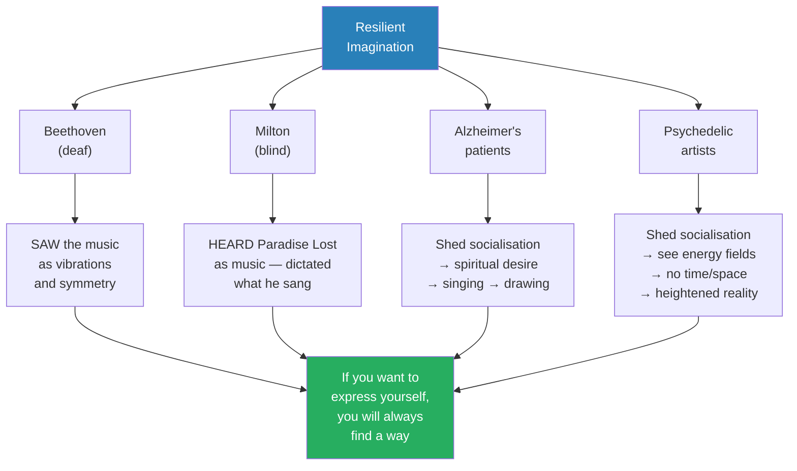
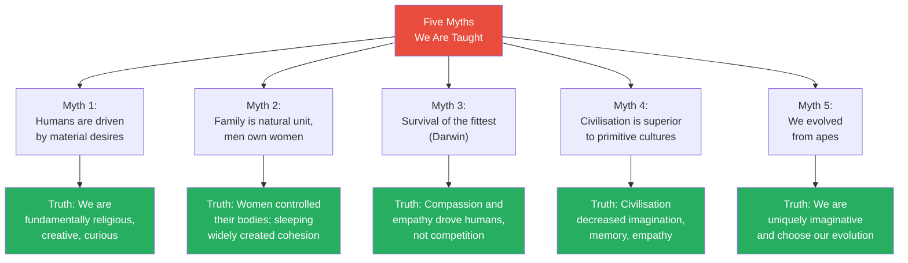
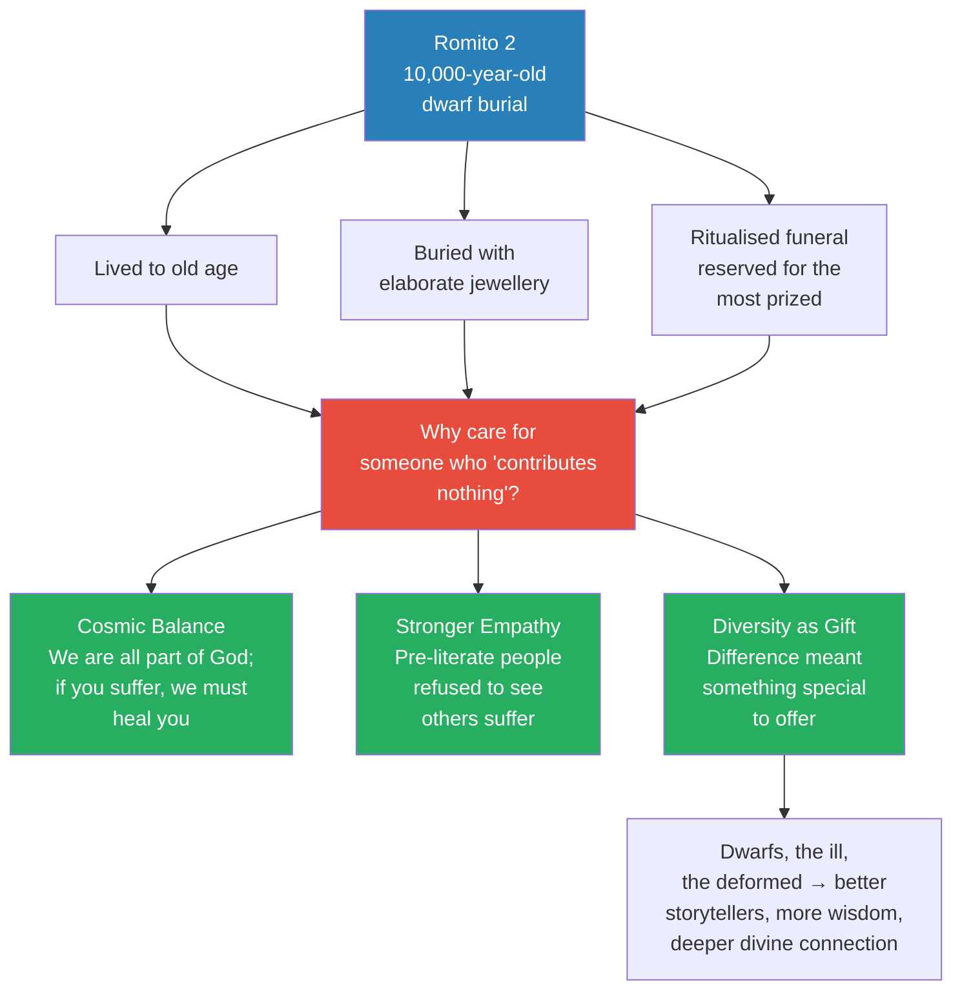

# Dawn of the Human Imagination

> Prof. Jiang opens the second arc of the Secret History series — ancient civilizations — by dismantling Darwin's theory of evolution as a materialistic paradigm that reduces humans to competitive apes. Drawing on cave paintings from Altamira and Lascaux, Ice Age mammoth-bone shelters, Genevieve von Petzinger's geometric symbol catalogue, the Chinese "telepathic" autistic boy, and the Romito 2 dwarf burial, he argues that humans are fundamentally imaginative, empathic, and spiritual beings — not survival machines. Pre-literate people were more intuitive, more creative, and more emotionally intelligent than modern humans. Civilisation did not elevate us; it socialised us out of our divine nature.

---

## Overview: Key Highlights

- <b style="color: #e74c3c">Darwinism is a theology, not just science</b> — evolution emerged to justify 19th-century European imperialism, racism, and eugenics
- <b style="color: #27ae60">Humans are fundamentally imaginative, not materialistic</b> — our core drives are religious expression, creative differentiation, and curious exploration
- <b style="color: #2980b9">Cave paintings</b> — 30,000-40,000-year-old art that reveals elaborate mythologies, religious ritual, and creative mastery
- <b style="color: #27ae60">Pre-literate people were more intuitive, empathic, and imaginative</b> — literacy and civilisation reduced these capacities, not enhanced them
- <b style="color: #2980b9">Shamans</b> — the earliest leaders, chosen for wisdom and divine connection, not physical dominance
- <b style="color: #e74c3c">Writing was a conscious rejection, not a missing technology</b> — early humans had the capacity to write but chose not to because it was a corruption of the communal, divine oral tradition
- <b style="color: #2980b9">Genevieve von Petzinger's geometric symbols</b> — a catalogue of recurring abstract signs across European caves, functioning as a proto-writing system encoding spiritual concepts
- <b style="color: #27ae60">Empathy is our superpower</b> — animals and humans read each other's emotional states with extraordinary precision; this is telepathy in action
- <b style="color: #e74c3c">Society socialises us into mundanity</b> — schools, companies, and institutions strip away our divine creative potential to produce obedient workers
- <b style="color: #2980b9">Romito 2</b> — a 10,000-year-old dwarf buried with elaborate jewellery, proving that Ice Age communities valued diversity and cared for the vulnerable
- <b style="color: #27ae60">Alzheimer's patients reveal the true self</b> — when socialisation is stripped away, what remains is spiritual desire, singing, and art
- <b style="color: #e74c3c">Five myths demolished</b> — humans are not materialistic, families are not patriarchal, survival of the fittest is wrong, civilisation is not superior, and we are not apes

| Concept | One-line summary |
|---------|-----------------|
| **Theory of evolution** | Darwin's materialistic paradigm: accidental genetic mutation, survival of the fittest, bottom-up emergence |
| **Theology (of evolution)** | Evolution is not neutral science but a moral claim — might makes right — that justified imperialism |
| **Eugenics** | The idea that "inferior" people should be sterilised to protect the gene pool — a direct product of Darwinism |
| **Shamans / Leopard Man** | Earliest human leaders, chosen for wisdom and divine connection, dating back 40,000 years |
| **Cave paintings** | Elaborate religious art in deep caves depicting mythologies of life, death, and renewal |
| **Geometric symbols** | Abstract signs catalogued by von Petzinger across European caves — a spiritual encoding system |
| **Empathy / Telepathy** | Emotional connection so deep it borders on mind-reading — the horse, the autistic boy, the dog at the door |
| **Socialisation into mundanity** | The process by which schools and society strip away divine creativity to produce obedient workers |
| **Romito 2** | A dwarf from a 10,000-year-old burial site, cared for lavishly — proof of Ice Age compassion |
| **Divine self** | Our true nature beneath socialisation — imaginative, spiritual, empathic, creative |
| **Pre-literate superiority** | People who could not read or write had stronger intuition, imagination, empathy, and memory |
| **Cosmic balance** | The Ice Age worldview: all life is connected, killing requires commemoration, diversity is divine |

---

# The Lecture

## Darwin and the Destruction of the Christian Universe [0:00 - 9:57]

*Prof. Jiang opens the lecture on human history by presenting Darwin's theory of evolution — not as settled science but as a theology that destroyed the Christian worldview and replaced it with a materialistic paradigm that justified European imperialism, racism, and eugenics. He then identifies several problems with evolutionary theory that most people never question.*

> [!tip] Core Insight
> Evolution is not a neutral scientific theory. It is a theology — a moral claim that the strongest survive and that is what is right. It emerged precisely when Europeans needed justification for colonising the world, and it delivered racism and eugenics as direct consequences.

*Darwin's theory did not emerge in a vacuum — it arrived precisely when European imperialism needed intellectual legitimacy. The shift from Christianity to Darwinism was not just scientific but political.*

> [!note]- Expand: Full Lecture Detail
> Prof. Jiang tells the class they are beginning a fast survey of the entirety of human history, and emphasises that understanding concepts matters more than memorising facts. He opens with a picture of Charles Darwin and calls him "arguably the most influential thinker of the past 200 years."
>
> He walks through the three core ideas of evolution:
> - <b style="color: #2980b9">Accidental</b> — genetic mutations are random; the mutation best fitted to the environment wins out
> - <b style="color: #2980b9">Materialistic</b> — everything you can see is all that exists; there is no spirit, no soul, no divine
> - <b style="color: #2980b9">Emergent</b> — things build on top of each other in a bottom-up process
>
> He contrasts this with the three ideas of Christianity that evolution destroyed:
> - One omniscient, omnipresent God — the Holy Spirit infuses all life with meaning and purpose
> - The world is a mystery — we must hold faith, be humble, and serve God's mysterious plan
> - All humans are equal before God — you cannot enslave or kill other people
>
> Prof. Jiang then explains WHY evolution triumphed so quickly. Darwin's book came out in 1859, and within twenty years, evolutionary theory dominated the entire Western world — schools, universities, the sciences. The reason: <b style="color: #e74c3c">imperialism</b>. Europeans in the 19th century were colonising, conquering, and committing genocide around the world. They needed a theory to explain why this was acceptable. "Survival of the fittest" was the perfect justification.
>
> The consequences:
> - <b style="color: #e74c3c">Racism</b> — before Darwinism, there was no concept of race because everyone was equal before God; evolution divided humanity into races with a white race declared superior
> - <b style="color: #e74c3c">Eugenics</b> — the idea that people who are "not white" or "stupid" should be sterilised because they dilute the genetic pool
> - Evolution became a <b style="color: #2980b9">paradigm</b> — so dominant that questioning it makes you "crazy"
>
> He then identifies problems with evolutionary theory that go unexamined:
> - If evolution produces tremendous diversity, why is there only one human species?
> - Why do humans migrate everywhere, when primates do not?
> - The Polynesian settlement of Pacific Islands makes no evolutionary sense — months of dangerous ocean travel with no guarantee of land
> - Neanderthals built religious ritual sites — what does religion have to do with survival?
> - Homo sapiens spent enormous time and resources on elaborate cave paintings deep in cold, oxygen-poor caves — "not very utilitarian"
>
> Prof. Jiang pauses: "Evolution says we are just monkeys. Monkeys like to have sex, monkeys like to eat, monkeys like to fart. That's all we are." He says this flatly, letting the absurdity land, before pivoting to the evidence that refutes it.

---

## The Power of Human Intuition [9:57 - 19:48]

*Prof. Jiang introduces the lecture's central thesis: early humans operated through intuition, imagination, and empathy — not planning, communication, or hierarchy. He uses the thought experiment of cooperative painting, the Ice Age mammoth-bone shelters, and the cave paintings of Altamira and Lascaux to demonstrate that creativity and collaboration are innate human capacities that do not require language, leadership, or deliberation.*

> [!tip] Core Insight
> If you put ten humans in a room with a blank wall and tell them to draw without speaking, they will create something coherent and beautiful — not because they planned it, but because empathy and cooperation are our default mode. This is the human imagination in its purest form.

*Early human organisation was not primitive — it was fluid, intuitive, and self-organising. People shifted between small hunting bands and massive religious festivals without any centralised coordination.*

*The cave paintings were not decoration — they were part of a complete mythological cycle. Kill an animal, commemorate it through art and song, summon its spirit back through cave portals, and the cycle of life continues.*

> [!note]- Expand: Full Lecture Detail
> Prof. Jiang poses the question: how did Ice Age humans know how to turn a mammoth into a house, clothing, and food? His answer, which he says will be a recurring theme: "They just knew it."
>
> He proposes a thought experiment:
> - Put ten people in a room with a blank wall
> - They cannot talk, communicate, or plan
> - Tell them to draw a picture
> - You would expect something ugly and incoherent
> - Instead, something "weird and wonderful" happens — one person draws a sun, another draws a tree, another a mountain
> - "It's almost like telepathy, and that's how we are"
>
> This, he argues, is the fundamental human capacity: <b style="color: #27ae60">if you put humans in a group, they will know instantly how to work together and share ideas</b>. No boss was needed. No one said "you hunt bisons, you make clothes, you feed kids." Everyone knew exactly what to do through empathy and intuition.
>
> He emphasises the diversity of early human organisation:
> - Most of the time, groups of 5-10 went out foraging
> - At certain times of year, hundreds or thousands gathered for religious festivals
> - If you didn't like your situation, you left and started something new
> - "Early human history is a very diverse, very dynamic, very creative period in our life"
>
> Prof. Jiang then turns to the cave paintings (30,000-40,000 years old):
> - The paintings show extraordinary care and devotion — "not just kids playing"
> - Adults spent long periods ensuring every detail was exact
> - How did they do this without paper or planning? <b style="color: #27ae60">"They dreamt this. They had a dream. They saw the picture in their heads."</b>
> - The paintings tell mythologies — horses alongside predators (lions), depicting a cycle of life and death, destruction and renewal
> - Everything is connected: "we're all together, we're all unified, we're all one"
>
> He explains the logic of commemoration:
> - If you kill an animal, you must thank it for the sacrifice by commemorating it — just as modern humans build monuments to fallen soldiers
> - This creates balance and harmony in the world
>
> > [!example] The Bison of Altamira (Spain)
> > - The cave paintings at Altamira show bisons rendered in red ochre
> > - They are not meant to be realistic — they are surreal, almost mythological
> > - A story of life and death is being told: humanity's struggle to get food from nature alongside a willingness to celebrate the fallen
> > - Every painting carries religious significance
> > **The lesson:** Art was never separate from religion — it was religion's primary expression.
>
> Prof. Jiang introduces <b style="color: #2980b9">shamans</b> — the earliest human leaders:
> - The "Leopard Man" figure found in Germany dates back 40,000 years
> - Shamans were leaders because they had the most wisdom and a connection to the divine
> - They dressed as animals to communicate with them in the spirit world
>
> He addresses the origins of language:
> - Early humans did not need to speak because they could understand each other through empathy
> - <b style="color: #27ae60">We created language not for economic reasons but for creative ones — because we wanted to sing</b>
> - Music was self-expression, and once you add words to music, it becomes storytelling
> - Language emerged from song, not from trade or hierarchy
>
> The cave paintings contain religious elements — bird figures that signify Mother Earth, leading and herding animals across the cave walls. The caves themselves were portals between the material and spirit worlds:
> - Rivers, caves, and mountaintops were connection points between worlds
> - Painting in caves was summoning the spirits of dead animals to return
> - "You've killed these animals. How to get them to return? By calling for them in these caves"

---

## The Geometric Symbols and the Rejection of Writing [19:48 - 25:57]

*Prof. Jiang explores two startling facts about early humans: they developed a sophisticated system of geometric symbols that functioned as proto-writing, and they consciously chose not to develop full writing because they considered it a corruption of divine, communal experience.*

*The symbols were not random marks but a deliberate encoding system for concepts too abstract to draw — energy, life force, cyclical patterns. They represent humanity's first attempt to capture the invisible.*

> [!note]- Expand: Full Lecture Detail
> Prof. Jiang introduces <b style="color: #2980b9">Genevieve von Petzinger</b>, a Canadian archaeologist who spent decades cataloguing symbols found inside European cave paintings. These are not pictures but abstract geometric signs — and there are many of them, recurring across different caves in different locations.
>
> He asks: why would they have these symbols? And then the crucial observation: "If you think about it, this is a writing system. In other words, they have the capacity to write, but they chose not to write."
>
> He gives three reasons why writing was rejected:
> - <b style="color: #e74c3c">Writing is a corruption of the divine</b> — when you speak, you are channelling the divine; writing something down is counterfeiting that sacred act
> - <b style="color: #e74c3c">Music cannot be captured in written form</b> — since speech was really like singing, writing would corrupt the song
> - <b style="color: #e74c3c">Writing is solitary; everything else is communal</b> — singing, talking, and painting are all done together; writing isolates the individual
>
> "Writing was a conscious decision. It was not a technology that we later discovered. We just chose not to do it because we thought it was a corruption of the natural world."
>
> He connects the geometric symbols to alchemy — both are attempts to figure out the secrets of the universe. Where did the symbols come from? "It came to them in a dream, or they were inspired." This is a world of inspiration, intuition, and imagination — "not something that's deliberate."
>
> Three reasons for symbols in art:
> - <b style="color: #2980b9">Abstraction</b> — certain concepts cannot be drawn (energy, life force, cycles, repetition), so symbols encode them
> - <b style="color: #2980b9">Visualising the spirit language</b> — the spirit world communicates in images; symbols express what they are saying
> - <b style="color: #2980b9">Sacred memory</b> — marking a stone with a symbol makes it divine; maybe something wonderful happened here, and the symbol commemorates it
>
> The three ultimate purposes of all this creative expression:
> - Bringing beauty to the world — "that's why we humans were created"
> - Showing God or the spirit world — "we're trying to figure out how the spirit world works inside our reality"
> - Telling a story of who we are — "trying to combine our imagination together to create society, to create belonging, to create community"
>
> > [!quote] Prof. Jiang
> > "We're not trying to connect with the divine spirit — the divine spirit is all around us. We coexist with the divine."
>
> A student asks whether humans were trying to connect with the divine. Prof. Jiang corrects: <b style="color: #27ae60">there is no separation between the material and the spiritual — they coexist</b>. The rituals are not about reaching the divine but about maintaining harmony with it. Kill an animal, commemorate it. The cycle must be honoured.
>
> He connects this to modern street art and graffiti — the same impulse as cave paintings: giving meaning to community, telling the story of who we are, building a common imagination. A mural of a matriarch unifies a community around the idea that family is the cornerstone. "That's what art does. Art gives purpose and meaning to our world."

---

## Pre-Literate Superiority and the Empathy Superpower [28:15 - 37:29]

*Prof. Jiang presents a counterintuitive thesis: pre-literate people — those who could not read or write — were more intuitive, more imaginative, and more empathic than modern humans. He supports this with three examples of empathy in action: Clever Hans the counting horse, a Chinese autistic boy's "telepathic" scheme, and cooperative painting.*

> [!tip] Core Insight
> Empathy is our superpower. A horse can "do math" by reading micro-expressions in the audience. A mother and her autistic son can devise a pitch-based code so subtle that only AI can detect it. We are not rational creatures who sometimes feel — we are empathic creatures who sometimes think.

*Prof. Jiang redefines telepathy: it is not supernatural mind-reading but an emotional connection so deep and precise that it functions like mind-reading. Animals do it. Pre-literate humans did it. Modern humans have been socialised out of it.*

> [!note]- Expand: Full Lecture Detail
> Prof. Jiang states directly: "Pre-literate people were more intuitive, more imaginative, and more empathic." He explains: "I can know your emotions right away. I don't have to ask you anything." This was the baseline human capacity before literacy changed us.
>
> He shows Inuit art as evidence — Native communities that maintain Ice Age traditions perceive the world as unified with the gods. Their house is their temple. "The problem is they cannot communicate it using modern language, so we just think they're stupid." They are not stupid — they focus their energies on empathy, imagination, and intuition instead of writing and speaking.
>
> Three examples of empathy in action:
>
> > [!example] Clever Hans — The Horse That Could Count
> > - A horse in America appeared to do math on stage
> > - The trainer asked "What's two plus two?" and the horse neighed the correct number of times
> > - The horse was not doing math — it was reading the room
> > - As the horse approached the correct answer, the audience's eyes bulged and their breathing quickened
> > - The horse detected these micro-signals and stopped at the right number
> > - "This is empathy. Animals can do it. We can do it as well. It's actually our superpower"
> > **The lesson:** What we call animal intelligence is actually empathic sensitivity — the ability to read emotional states with extraordinary precision.
>
> > [!example] The Chinese Autistic Boy and His Mother
> > - A poor, uneducated mother in rural China had an autistic son who couldn't speak or make eye contact
> > - She contacted CCTV claiming her son could read her mind
> > - The documentary crew filmed the process: the boy was placed in a room alone, the mother was given a number, then she went in and asked "read my mind" — and the boy gave the correct number
> > - The crew spent days trying to figure it out; finally, AI analysis revealed the mother was encoding numbers in the pitch of her voice
> > - The pitch variation was so subtle that no human could detect it — only the boy and AI could
> > - The mother confessed: "We're poor, my son is autistic, I want him to go to school, I want professional help"
> > - Prof. Jiang's point: think about how extraordinary it is that an uneducated mother and her autistic son devised a scheme so creative that only AI could crack it
> > **The lesson:** The human imagination, powered by love, can create systems of communication that surpass our conscious understanding. This mother did not know she was encoding pitch — she did it through pure empathic connection with her son.
>
> Prof. Jiang then discusses the cooperative painting experiment again, emphasising the mechanism:
> - It works not because people want to draw a great picture
> - <b style="color: #27ae60">It works because people don't want to let each other down</b>
> - "Because of cooperation, because of empathy, you want to be at your very best"
> - "When you're able to find a purpose and meaning in other people, your creative potential will be fully released"
>
> He extends to horse riding and warfare:
> - Polo horses know what the rider wants before the rider thinks it
> - Nomadic warriors on horseback were invincible because rider and horse developed emotional connection from birth
> - "The man had four legs" — the horse-rider unit was a single empathic organism
>
> On dogs and long-distance empathy:
> - Your dog waits at the door when you're coming home from a week away
> - <b style="color: #2980b9">Telepathy exists, but it is an emotional connection</b> — "I can't actually read your mind, but I know how you feel, even at long distances"

---

## The Resilient Imagination: Beethoven, Milton, and Alzheimer's [37:29 - 46:21]

*Prof. Jiang argues that the human imagination is indestructible — it will find a way to express itself regardless of disability, socialisation, or repression. He draws on Beethoven composing while deaf, Milton writing while blind, Alzheimer's patients revealing their true selves, and psychedelic artists shedding socialisation to access heightened reality.*

*Disability does not destroy the imagination — it transforms its channel of expression. Deafness made Beethoven a visual composer. Blindness made Milton a musical poet. The imagination is more resilient than any single sense.*

> [!note]- Expand: Full Lecture Detail
> Prof. Jiang states the principle: "We are the imagination personified, manifested, made tangible, made visceral. We are imagination itself. Our imagination is resilient and will always find a way to shine."
>
> He gives examples of sensory compensation — losing one sense strengthens others — then applies this to creative genius:
>
> On deaf communities in China:
> - Groups of deaf people in restaurants are "always happier" than hearing people
> - Not because of sign language but because <b style="color: #27ae60">deaf people have deeper emotional intelligence</b>
> - When they are together, they communicate emotionally, which brings tremendous joy
>
> > [!example] Beethoven — The Deaf Composer
> > - Beethoven composed some of the greatest music in human history while completely deaf
> > - Prof. Jiang's explanation: he SAW the music
> > - "Music is vibrations — waves — and you can see vibrations as a movie of movement"
> > - The more symmetrical the vibrations, the more beautiful the music
> > - Because he saw rather than heard, he created music that was unique in human history
> > **The lesson:** Beethoven's deafness was not a limitation but a transformation — it gave him access to a visual dimension of music that hearing composers could not reach.
>
> > [!example] John Milton — The Blind Poet
> > - Milton wrote Paradise Lost while completely blind
> > - He HEARD the poem as music — he sang it to secretaries who transcribed it
> > - "When you read Paradise Lost, it's actually like music — probably the most beautiful poetry ever composed in the English language"
> > - He did not need to see the words because the work existed as sound
> > **The lesson:** If you truly want to express yourself, you will always find a way. The question is not talent or ability — it is will.
>
> Prof. Jiang then introduces his most provocative claim: <b style="color: #e74c3c">"We are socialised into mundanity. Our true selves are divine."</b>
> - You are normal, boring, and untalented because you believe what others tell you
> - Society does not want talented or interesting people — it wants robots and slaves
> - Schools, companies, and organisations socialise you into nothingness
>
> He illustrates with an artist who documented his Alzheimer's progression through self-portraits:
> - Early portraits are realistic and detailed
> - Later portraits lose coherence as the mind deteriorates
> - But Prof. Jiang reframes this: the artist is not losing himself — he is <b style="color: #27ae60">shedding his artifice and revealing his true self</b>
> - "Alzheimer's is losing your socialisation"
>
> What remains when socialisation is stripped away:
> - <b style="color: #2980b9">Spiritual desire</b> — people who were never religious suddenly go to church and pray
> - <b style="color: #2980b9">Singing</b> — they stop talking but they sing
> - <b style="color: #2980b9">Drawing</b> — an 80-year-old who never painted before begins creating art
>
> "The voices were always there. We just forgot about them because we were socialised to forget."
>
> He then shows psychedelic art:
> - Psychedelics work similarly to Alzheimer's — they shed socialisation and open a spiritual realm
> - An artist on psychedelics paints a cat's "energy field" — its memory, aspirations, intuition, imagination
> - Another painting shows no concept of time and space — "that's how we truly are"
> - Van Gogh: "the greatest painter who ever lived" — his paintings glow because he shed his socialisation and painted reality as it truly is

---

## The Five Myths Demolished [46:21 - 50:46]

*Prof. Jiang pauses to summarise the lecture's argument as five myths that modern humans have been brainwashed into believing — each of which is wrong.*

*Each myth serves the same function: reducing humans to competitive, materialistic animals so that power structures can justify exploitation. The truths all point in the same direction — humans are fundamentally creative, spiritual, and communal.*

> [!note]- Expand: Full Lecture Detail
> Prof. Jiang frames this as a summary of what civilisation has brainwashed us into believing:
>
> **Myth 1: Humans are driven by material desires** — we want money, we want to pass on our genes, we want status and power.
> - <b style="color: #27ae60">Truth: We are fundamentally imagination</b>
> - Three real drives: (1) express religion through art, music, and rituals — know where we came from, why we're here, where we're going; (2) differentiate ourselves — be creative, stand out; (3) explore and be curious — explaining why humans travel everywhere
> - "Don't believe people when they say you just care about money, power, sex. What we are fundamentally are religious, spiritual beings that want to create and to love and to connect."
>
> **Myth 2: The most natural unit is the family, and men want to protect their property, which includes women.**
> - <b style="color: #27ae60">Truth: For most of human history, women controlled their own bodies</b>
> - Women chose who to sleep with and often slept with many men — first, because they enjoyed it; second, because it created social cohesion
> - Strategic logic: if no one knows who the father is, every man is responsible for every child — the best possible strategy for child survival
> - "Women were the core and centre of all societies"
>
> **Myth 3: Survival of the fittest — Darwin's iron rule of nature.**
> - <b style="color: #27ae60">Truth: Humans cared for each other with compassion and empathy</b>
> - Every creature has divinity; the weakest have the most
> - When you kill an animal, you thank it because you are all part of the same life cycle
>
> **Myth 4: Humans have gotten smarter over the centuries; civilisation is far superior to primitive cultures.**
> - <b style="color: #e74c3c">Truth: With civilisation, the human imagination has decreased</b>
> - Pre-civilisation humans had: better memories, stored more information, more sensitive perception, more empathy, greater emotional resilience
> - "Our brains can be supercomputers if we allow them to be"
>
> **Myth 5: We evolved from apes.**
> - <b style="color: #27ae60">Truth: We are uniquely imaginative and can choose our own evolution</b>
> - "If you believe you're an ape, then you're an ape. But we're not apes. We're imaginative, first and foremost"

---

## Romito 2: Compassion in the Ice Age [50:46 - 55:13]

*Prof. Jiang concludes the lecture with the story of Romito 2 — a dwarf from a 10,000-year-old burial site in southern Italy — to demonstrate that Ice Age communities did not practice survival of the fittest. They cared for the vulnerable, celebrated the different, and saw deformity as a divine gift.*

*The Romito 2 burial inverts everything Darwin teaches. The "fittest" were not the only ones who survived — the most vulnerable were given the most elaborate funerals. Difference was blessing, not curse.*

> [!note]- Expand: Full Lecture Detail
> Prof. Jiang introduces Romito 2 — a dwarf discovered in a 10,000-year-old Ice Age burial site. He describes the paradox:
> - The dwarf was clearly deformed
> - You might expect a survival-of-the-fittest society to kill or abandon him
> - Instead: he lived to old age, was buried with jewellery, and received an extremely elaborate, ritualised funeral — "you only do that for people you really prize"
>
> He cites David Graeber and David Wengrow's *The Dawn of Everything*:
>
> > [!quote] Graeber & Wengrow
> > "When archaeologists undertake balanced appraisals of hunter-gatherer burials, they find high frequencies of health-related disabilities, but also surprisingly high levels of care."
>
> Three explanations for why Ice Age people cared for the vulnerable:
> - <b style="color: #27ae60">Cosmic balance and harmony</b> — everything is a cycle; we are all part of God; if you suffer, we must make you better because we are all part of God together; "as above, so below"
> - <b style="color: #27ae60">Stronger empathy</b> — pre-literate people had such strong emotional connection that they simply could not bear to see others suffer
> - <b style="color: #27ae60">Diversity as a divine gift</b> — "our entire school system is designed as survival of the fittest — if you can't do math, goodbye, you're worthless. But back then, they saw difference and diversity as gifts from God"
>
> Prof. Jiang explains what the "different" could offer:
> - They could see better, tell better stories, had more wisdom, more intuition, deeper connection with the divine
> - "The best storytellers, the best musicians, are often those who are marginalised — strangers, outsiders, those society persecutes"
> - They have greater imagination, greater intuition, greater empathy
> - <b style="color: #e74c3c">"Today we don't celebrate these things, but back then they did. If you were different, if you were deformed, if you were ill, they saw you as blessed rather than cursed."</b>

---

## Q&A: Cognitive Disability and the Return to the Divine [55:13 - end]

*The lecture closes with a student exchange that crystallises the lecture's central argument: civilisation separates us from the divine, and those who are pushed out of civilisation — the autistic, the disabled, the "different" — may actually be closer to our original nature.*

> [!note]- Expand: Full Lecture Detail
> A student asks whether people with cognitive disabilities are "closer to the divine" — whether abandoning logic and civilisation returns us to the divine.
>
> Prof. Jiang clarifies:
> - <b style="color: #27ae60">We are all connected to the divine — we just choose to forget</b>
> - Society and mass culture need obedience, machines, workers
> - "The entire point of school is to separate you from the divine" — children are removed from parents at an early age and taught "strange knowledge like one plus one equals two"
> - Before schools, children ran around in nature learning resilience, courage, and creativity
> - Those who society discards — autistic children, children with disabilities, those who are "just different" — return to the divine because the socialisation fails to take hold
>
> The student follows up: do people who develop cognitive disabilities later in life reconnect with the divine?
>
> Prof. Jiang responds with the mental health crisis:
> - Depression, eating disorders, suicidal tendencies, anxiety — "an explosion these past 20 years" driven by mobile phones, social media, the internet
> - <b style="color: #e74c3c">"Kids' lives suck"</b>
> - When you are born, you have an utter connection with the divine; as you lose this connection, confusion leads to anxiety, which leads to depression
> - "We crave human connection, knowledge of the divine, purpose and meaning — but social media has created a fake system where our imagination is imprisoned"
> - On social media, "all you care about is likes" — pursuing activities with no purpose; caring about what others think rather than what makes you happy
>
> A second student asks where empathy comes from — isn't it shaped by socialisation?
>
> Prof. Jiang corrects:
> - <b style="color: #27ae60">We are not socialised into empathy — we are socialised OUT of empathy</b>
> - Empathy is what we are born with — a mother's emotional connection to her child, growing until it becomes almost telepathic
> - Society severs this connection: school, excessive screen time, television
> - Without empathy, "you become a zombie — no direction, no purpose, no meaning"
> - This is what leads to depression: not a chemical imbalance but a broken empathic connection

---

## Connections

**Previous lectures:** [[08 - Death by Bureaucracy]] (institutions stripping humanity), [[06 - The Psychology of Evil]] (dissociation and socialisation as control mechanisms)
**Sets up:** [[12 - Heaven on Earth]] (utopian impulses emerging from the divine imagination)
**Related books in vault:** [[Sapiens - Yuval Noah Harari]] (agricultural revolution, cognitive revolution), [[The Dawn of Everything - David Graeber]] (Ice Age egalitarianism, Romito 2 burial)

---

## The Takeaway

This lecture marks a turning point in the Secret History series. Where Lectures 1-8 examined how power corrupts, how societies collapse, and how evil operates, Lecture 11 pivots to ask what humans were before all of that. Prof. Jiang's answer is radical: we were not primitive survival machines waiting for civilisation to elevate us. We were imaginative, empathic, spiritually connected beings who created art, music, mythology, and complex social organisation through intuition alone — no bosses, no hierarchy, no writing needed. Civilisation did not lift us out of darkness; it socialised us into it.

The most counterintuitive claim is about pre-literate superiority. We assume that literacy made us smarter. Prof. Jiang argues the opposite: it made us narrower. Pre-literate people had better memories, stronger emotional perception, deeper empathy, and greater creative resilience. The evidence he marshals — from Clever Hans to the Chinese autistic boy to Beethoven to Alzheimer's patients — all points the same way: our deepest human capacities are not cognitive but empathic, not rational but imaginative, not learned but innate. Writing, schools, and civilisation did not develop these capacities — they suppressed them.

What remains open is how this divine, empathic, imaginative humanity gave way to the world of power, hierarchy, and evil that the first eight lectures documented. If humans were so naturally cooperative and compassionate, what went wrong? The answer, Prof. Jiang has promised, lies in the lectures ahead — the transition from this Ice Age golden age to the settled, stratified civilisations that produced everything the Secret History series has so far exposed.
