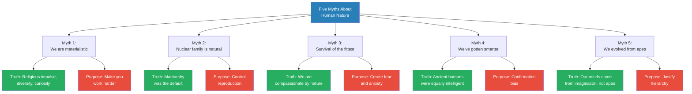
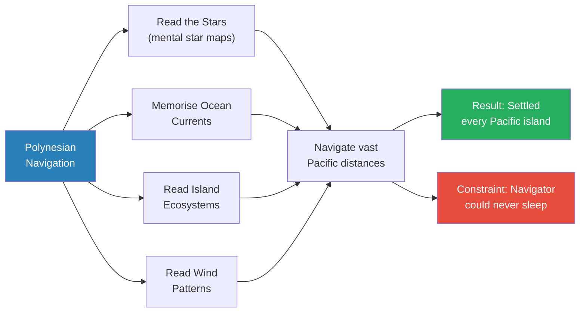
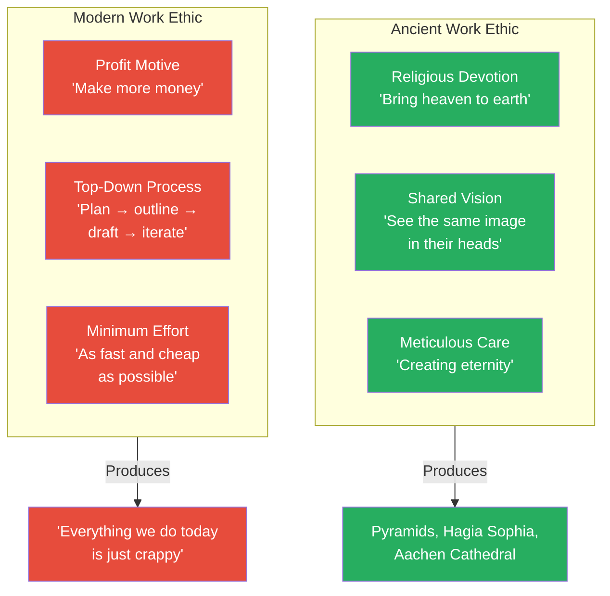
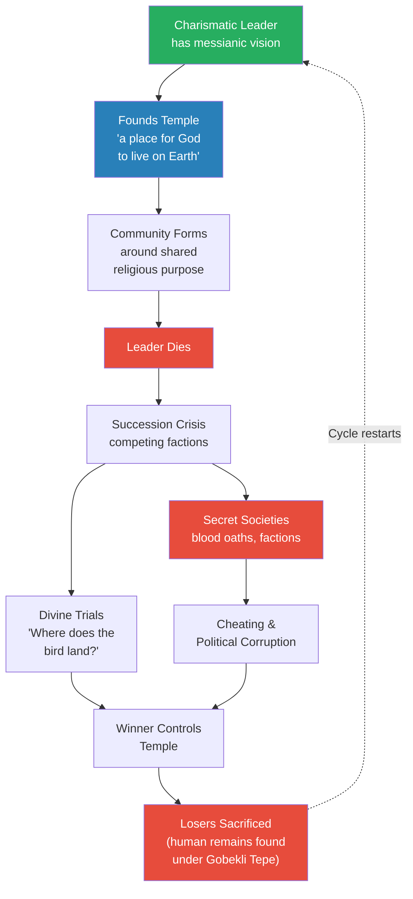
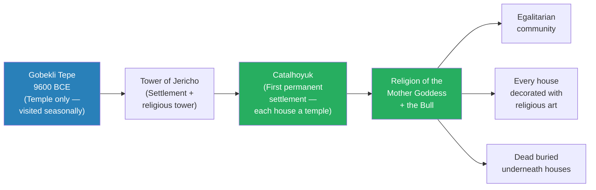
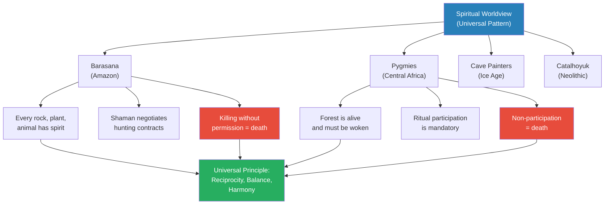
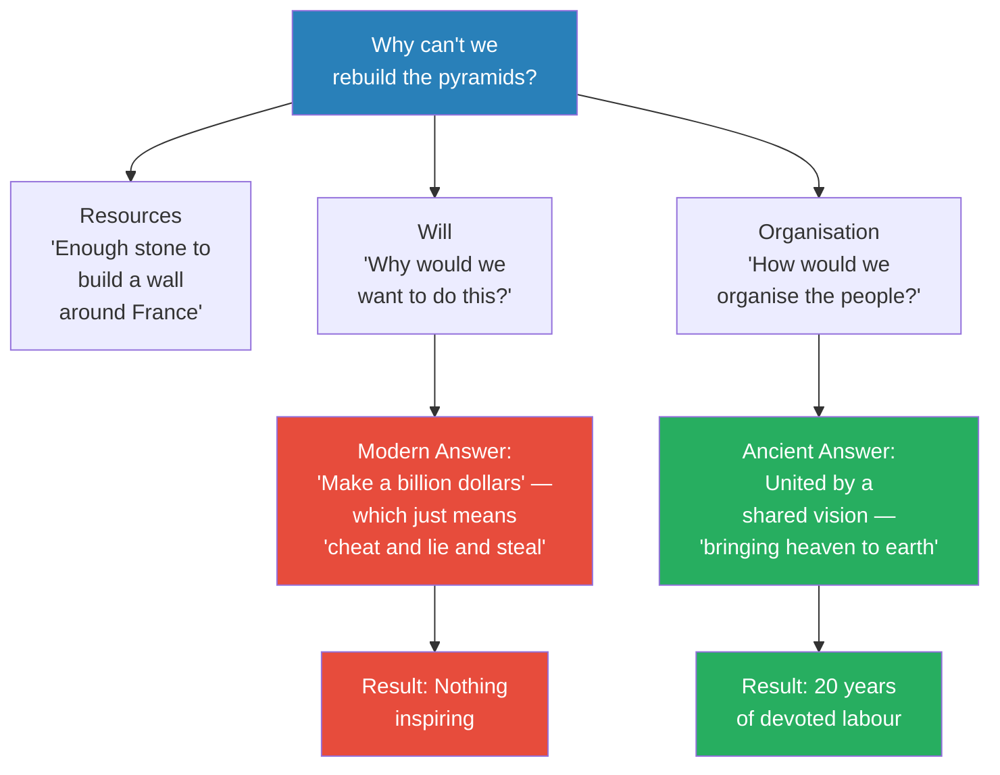

# Heaven on Earth

> Prof. Jiang argues that the defining impulse of ancient humanity was not survival or wealth but the desire to bring heaven to earth — to create a world where the divine was physically present. From the pyramids of Giza to Gobekli Tepe to the pygmy forests of Central Africa, every great human achievement was driven by religious vision, shared purpose, and the conviction that the material world could be infused with spiritual meaning. The lecture demolishes five myths we are taught about human nature — that we are materialistic, that the nuclear family is natural, that survival of the fittest governs us, that we have grown smarter, and that we evolved from apes — and replaces them with a portrait of humanity as fundamentally religious, diverse, curious, and imaginative. Prof. Jiang traces the pattern of how communities form around charismatic leaders, thrive through shared vision, and ultimately collapse through overpopulation, hereditary power, and corruption.

---

## Overview: Key Highlights

- <b style="color: #27ae60">The purpose of ancient work was to bring heaven to earth</b> — religious devotion, not wages, drove the greatest human achievements
- <b style="color: #e74c3c">Five myths about human nature are systematically debunked</b> — materialism, the nuclear family, survival of the fittest, increasing intelligence, and ape evolution
- <b style="color: #2980b9">The pyramids are temples, not tombs</b> — they were public works projects built to create a physical home for the gods
- <b style="color: #27ae60">We could not rebuild the pyramids today</b> — not because we lack technology, but because we lack shared vision, religious purpose, and collective devotion
- <b style="color: #e74c3c">Matriarchy preceded patriarchy</b> — women historically controlled access to sex and used it to maintain egalitarian social harmony
- <b style="color: #2980b9">The cycle of settlement</b> — charismatic leader founds community, hierarchy becomes hereditary, corruption drives people to leave and start over
- <b style="color: #27ae60">Indigenous peoples have sophisticated cosmologies</b> — the Barasana, Polynesian navigators, and pygmies demonstrate complex spiritual worldviews
- <b style="color: #2980b9">Three laws of human societies</b> — societies are fluid, internal diversity exceeds external difference, and communities exist in opposition to each other
- <b style="color: #e74c3c">Modern capitalism has replaced spiritual purpose with materialism</b> — today's religion is money, and it produces inferior results
- <b style="color: #27ae60">Ritual reciprocity governs human-nature relationships</b> — killing an animal requires permission and gratitude, a contract with the spirit world
- <b style="color: #2980b9">Synesthesia and imagination</b> — ancient people's sensory mixing and mental power enabled feats we cannot replicate with computers
- <b style="color: #e74c3c">The alien conspiracy about the pyramids is confirmation bias and racism</b> — it assumes ancient peoples were too stupid to build what they clearly built

| Concept | One-line summary |
|---------|-----------------|
| **Heaven on Earth** | The ancient impulse to make the divine physically present through temples, architecture, and ritual |
| **Religious devotion vs. materialism** | Ancient workers served a spiritual vision; modern workers serve a paycheck — producing inferior results |
| **Matriarchy** | The historically natural social organisation, where women controlled sex, managed politics, and maintained egalitarianism |
| **Synesthesia** | The mixing of senses that gave some ancient people extraordinary cognitive abilities |
| **Cycle of settlement** | Charismatic leader founds community, hierarchy becomes hereditary, corruption drives exodus |
| **Three laws of societies** | Societies are fluid; internal diversity exceeds external; communities define themselves in opposition |
| **Ritual reciprocity** | The contract between humans and the spirit world — kill only with permission, give thanks through ritual |
| **Confirmation bias** | The belief that modern humans are smarter, used to dismiss ancient achievements as alien-built |
| **Temple as valuable real estate** | Whoever controls the temple controls tribute, worship, and power |
| **Secret societies** | Factions formed through blood oaths to seize temple control — the origin of political corruption |

---

# The Lecture

## Five Myths About Human Nature [0:00 - 9:06]

*Prof. Jiang opens by reviewing key concepts from the previous lecture on cave paintings, then systematically demolishes five myths that modern societies teach about human nature. Each myth, he argues, exists not because it is true but because it makes people easier to control.*

> [!tip] Core Insight
> Everything you are taught about human nature — that you are materialistic, that the nuclear family is natural, that only the fittest survive, that you are smarter than your ancestors, that you evolved from apes — is a myth designed to keep you obedient, anxious, and productive.

*Each myth has a corresponding truth and a reason for its perpetuation. The green column shows what is actually true about human nature; the red column shows why the myth exists — as a tool of social control.*

> [!note]- Expand: Full Lecture Detail
> Prof. Jiang begins with a brief review, highlighting YouTube comments from the previous lecture on cave paintings. He notes that cave paintings survived only because they were in caves — ancient people likely created art everywhere, but the outdoor art did not survive. He also corrects a point about Beethoven: while Beethoven was not born deaf, he likely had <b style="color: #2980b9">synesthesia</b> — "the mixing of senses" — where hearing a note triggered a colour. This sensory mixing, Prof. Jiang argues, is the source of much extraordinary human talent.
>
> He then moves into the five myths:
>
> **Myth 1 — We are materialistic (we want money, sex, and power):**
> - The truth: throughout most of human history, humans had three fundamental drives
>   - A <b style="color: #27ae60">religious impulse</b> — expressed through art, music, dance, architecture — answering three questions: Where do we come from? Why are we here? Where are we going?
>   - A desire for <b style="color: #27ae60">diversity and differentiation</b> — to stand out, to be unique
>   - <b style="color: #27ae60">Curiosity</b> — the drive to explore
> - Why the myth exists: "It's better to control you." If people believe they only want money and status, they work harder and are more obedient. If they knew they were explorers, they would resist control.
>
> **Myth 2 — The nuclear family is the natural human unit:**
> - The truth: in most ancient societies, <b style="color: #2980b9">matriarchy</b> was the default
>   - Women had complete autonomy over their bodies and controlled access to sex
>   - Three reasons women chose to have multiple partners:
>     - Pleasure — it was enjoyable
>     - Political strategy — having sex with rival men turned enemies into allies
>     - Hidden paternity — if no man knew which children were his, all men in the community helped raise all children
>   - Matriarchal societies tended to be egalitarian because women prioritised harmony and balance over status
> - Why it changed: the shift to patriarchy enabled maximum reproduction
>   - Women became "basically slaves" whose "main duty is to have as many children as possible"
>   - <b style="color: #e74c3c">After the transition from matriarchy to patriarchy, a lot of women started to die</b> — from childbirth, overwork, and loss of bodily autonomy
>
> **Myth 3 — Survival of the fittest governs human nature:**
> - The truth: historically, societies are organised around compassion
>   - We look after the ill, the elderly, and the weak
>   - Empathy and care for others is fundamental to who we are
> - Why the myth exists: to create fear and anxiety, which makes people work harder and easier to control
>
> **Myth 4 — Humans have gotten smarter over the centuries:**
> - The truth: humans have always been equally intelligent but expressed it differently
>   - Ancient people had better memories, were more sensitive, and more resilient
> - Why the myth exists: confirmation bias — "everyone likes to believe that we're smarter than people who came before us"
>
> **Myth 5 — We evolved from apes:**
> - The truth: "maybe our bodies evolved from apes, but our minds did not — our minds come from somewhere else"
>   - The human imagination is not reducible to evolutionary biology
> - Why the myth exists: to justify hierarchy — the people in charge are "just stronger and better and more fit than we are"

---

## The Polynesian Navigators — Proof of Ancient Intelligence [9:06 - 12:57]

*Prof. Jiang presents the Polynesian navigators as a devastating counter-example to the myth that modern humans are smarter. These people settled the entire Pacific Ocean without computers, GPS, or written maps — navigating by memorising star patterns, ocean currents, and ecological signatures, all while unable to sleep.*

*The Polynesian navigator had to process simultaneously what today requires multiple computer systems — star maps, current charts, wind data, and ecological signatures — all in their heads, without sleeping. If the navigator fell asleep, the crew died.*

> [!note]- Expand: Full Lecture Detail
> Prof. Jiang presents the Polynesian people as evidence of ancient intelligence:
>
> - They settled the entire Pacific — wherever there is an island, they had a settlement
> - This is "a testament to our desire to explore the world"
> - The boats were small, so they had to reach islands quickly
> - The information they processed simultaneously:
>   - <b style="color: #2980b9">Star maps</b> — memorised and mentally mapped to determine position
>   - <b style="color: #2980b9">Oceanic currents</b> — memorised movement patterns across thousands of miles
>   - <b style="color: #2980b9">Island ecosystems</b> — every island has its own distinct oceanic ecosystem, identifiable by subtle clues
>   - <b style="color: #2980b9">Wind patterns</b> — read in real time
> - They had rudimentary physical maps for stars and currents, but did most of the processing mentally
> - <b style="color: #e74c3c">The navigator could never sleep</b> — if the navigator fell asleep, the ship went off course and everyone died
> - "That's the power of the human imagination"
> - Today, we use computers for this — "but back then, they had to do this all in their heads"
>
> A student challenges: "Nowadays we use computers not because we cannot navigate, but because computers give more precise information." Prof. Jiang responds flatly: "If I put you on a boat, you would die. It's that simple. The computer's not gonna help you navigate the ocean."

---

## The Pyramids — Temple, Not Tomb [12:57 - 22:21]

*Prof. Jiang reframes the pyramids as temples — public works projects designed to bring heaven to earth — and uses them to demonstrate the three qualities that ancient workers possessed and modern workers lack: religious devotion, shared vision, and meticulous care.*

> [!tip] Core Insight
> The pyramids could not be rebuilt today — not because we lack technology, but because we lack shared spiritual purpose. Ancient people built from the inside out, holding the entire structure in their heads. Modern people follow processes and budgets, producing work that is fast, cheap, and inferior.

*The ancient triad of devotion, vision, and care produced eternal structures. The modern triad of profit, process, and minimum effort produces disposable ones. Prof. Jiang's comparison is deliberately provocative — the point is not that computers are useless, but that purpose determines quality.*

> [!note]- Expand: Full Lecture Detail
> Prof. Jiang begins by confronting the alien conspiracy theory directly:
>
> - "You might have heard silly explanations, like aliens came and built the pyramids, or the lost civilization of Atlantis gave the technology to the Egyptians"
> - This is <b style="color: #e74c3c">confirmation bias and racism</b> — "We think that we're smart and everyone before us was stupid"
> - <b style="color: #27ae60">The pyramids are not tombs — they are temples</b>
>   - "It looks like a tomb, but it's not a tomb. It's a temple."
>   - The Pharaoh wanted what was best for his people — the pyramids were a public works project
>   - Charlemagne is buried inside Aachen Cathedral, "but no one's saying this is a tomb. We all know it's a church."
> - Built 2400 BCE, they were constructed from the inside out — without blueprints or computers
>   - The builders held the entire structure in their imagination
>   - The shared vision was so compelling that "everyone knew exactly what part to play"
>   - It took about 20 years and massive organisation
>
> Prof. Jiang then explains why we could not replicate this today by contrasting ancient and modern approaches:
>
> - <b style="color: #27ae60">Ancient: Religious devotion</b>
>   - The purpose was to "bring heaven to earth, to bring God to earth, to create eternal peace"
>   - Workers believed their sacrifice would benefit their children, grandchildren, and great-grandchildren
> - <b style="color: #e74c3c">Modern: Profit motive</b>
>   - Today's purpose is simply "make more money"
>
> - <b style="color: #27ae60">Ancient: Shared vision</b>
>   - "People back then had stronger imagination — in their heads, they were able to see the entire vision"
>   - This vision could be passed to others through empathy — "they could see the same thing"
> - <b style="color: #e74c3c">Modern: Top-down process management</b>
>   - "Rather than work together, you just go and work a particular part, and then you go away"
>   - He uses art class as a metaphor: write a plan, then an outline, then a draft, then iterate — "you're no longer focused on the vision, you just focus on the process, and that's why today, everything sucks"
>
> - <b style="color: #27ae60">Ancient: Meticulous care</b>
>   - "Everything you do is careful — you put your best effort because you're trying to create eternity"
> - <b style="color: #e74c3c">Modern: Minimum effort for maximum pay</b>
>   - "The idea today is to do it as fast as possible, as cheap as possible, to maintain the budget"
>
> He then presents three examples of "tremendous human achievement" driven by religious purpose:
>
> > [!example] The Hagia Sophia (532 CE)
> > - Built in Constantinople (modern Istanbul), still standing today
> > - "Every inch, every piece of the church is just beautifully constructed"
> > - Everyone who worked on it shared the same vision and dedication
> > - The purpose was bringing heaven to earth — creating a divine space
> > **The lesson:** When thousands of workers share a single spiritual vision, the result endures for fifteen centuries.
>
> > [!example] Aachen Cathedral (790 CE)
> > - Built in Germany, looks the same today as when first constructed
> > - Charlemagne, the first Holy Roman Emperor, is buried inside
> > - "No one said this was built by aliens" — Prof. Jiang notes the racist double standard
> > - "The idea that the Egyptians couldn't build the pyramids by themselves and had to rely on aliens — that's just a racist comment"
> > **The lesson:** European medieval cathedrals demonstrate the same human capacity for monumental construction — the alien conspiracy targets only non-European civilisations.
>
> > [!example] The Manhattan Project (1940s)
> > - 100,000 scientists worked together — "probably the greatest achievement of humans in the 20th century"
> > - Same concept: they believed they were "creating eternal peace on earth, heaven on earth"
> > - "And guess what? They were right" — the atomic bomb made nations afraid to wage total war
> > - Before the bomb: World Wars killed tens of millions. After: wars continue but are not as devastating
> > **The lesson:** Even in the 20th century, the greatest achievements required a shared vision of permanent transformation — the belief that this work would end war forever.

---

## Gobekli Tepe and the Cycle of Power [22:21 - 32:15]

*Prof. Jiang returns to Gobekli Tepe — the world's oldest known temple, built 9600 BCE — and uses it to introduce a recurring pattern that will repeat throughout human history: charismatic leader founds a sacred community, succession crisis breeds factions and secret societies, power struggles are resolved through human sacrifice.*

*This cycle — vision, community, death, succession crisis, corruption, sacrifice — is the template Prof. Jiang will apply across all subsequent lectures. Power struggles, political conflict, and human sacrifice "go all the way back to human society."*

> [!note]- Expand: Full Lecture Detail
> Prof. Jiang introduces Gobekli Tepe:
>
> - Built 9600 BCE — "the world's first temple" (the first we have discovered)
> - "Wherever humans go, they will build temples — because humans are first and foremost religious"
> - The pillars are enormous — "we don't know how they were able to move these pillars into place"
> - But if you understand shared vision and collective work, "then it makes more sense"
>
> He then lays out the cycle of temple politics, which he says "repeats itself throughout human history":
>
> **Step 1 — The Charismatic Leader:**
> - A man or woman has a vision for creating "a place for God to live on Earth"
> - Shares this vision; everyone works to achieve it
>
> **Step 2 — The Temple as Power:**
> - <b style="color: #2980b9">A temple is always the most valuable real estate on Earth</b>
> - If you control a temple, people come to pray, bring tribute (gazelle, food), and celebrate together
> - Religious festivals once or twice a year were the economic and social engine
> - "If you're able to control this temple, you lived a very good life"
>
> **Step 3 — The Succession Crisis:**
> - The leader dies; competitors emerge
> - Initially, they hold divine trials — "you stand on one hill, I stand on another, and we'll see where the bird lands"
> - The <b style="color: #2980b9">mother goddess</b> ruled overall at this time — humans were concerned with fertility (farming) and reproduction (babies)
>
> **Step 4 — The Corruption:**
> - "Over time, what they realised is, you know what, we just cheat"
> - <b style="color: #e74c3c">Secret societies</b> formed — "you swear blood oaths to each other, you become a faction"
> - This led to political conflict
>
> **Step 5 — Human Sacrifice:**
> - Disputes were resolved through sacrifice — if your faction lost, you were all sacrificed
> - Evidence: human remains found under Gobekli Tepe
> - "Power struggle, political conflict, religious dispute, human sacrifice — they go all the way back to human society"
>
> Prof. Jiang then introduces two related sites:
>
> - <b style="color: #2980b9">Karahan Tepe</b> — near Gobekli Tepe, with different mythology
>   - Demonstrates the principle that "humans are diverse, so once mythology becomes established, new people come to establish a competing mythology"
>   - Associated with the <b style="color: #2980b9">cult of the skull</b> — "when people die, you can still communicate with them in the spirit world if you have their skull"
>   - The skull "becomes a portal into the afterworld" — seen in many ancient cultures, including Chinese ancestor worship
>
> - <b style="color: #2980b9">Tower of Jericho</b>
>   - Conventionally taught as defensive — "a tower to ward off invaders"
>   - Prof. Jiang's explanation: it is a religious temple
>   - During the solar equinox, the sun hovers above the tower and floods the area with shadow
>   - "If you are a religious person, you feel as though heaven is coming to you directly"

---

## Catalhoyuk — The First Permanent Settlement [28:00 - 32:15]

*Prof. Jiang contrasts Catalhoyuk with Gobekli Tepe: while Gobekli Tepe was a temple visited seasonally, Catalhoyuk was where people chose to settle permanently — despite farming being objectively worse than hunting and gathering. The reason was religion: each house was a temple, and the community lived with their gods.*

*The progression from seasonal temple to permanent settlement shows religion as the driving force at each stage. People accepted worse lives — harder work, worse nutrition, more disease — because they wanted to live with their gods.*

> [!note]- Expand: Full Lecture Detail
> Prof. Jiang distinguishes Catalhoyuk from Gobekli Tepe:
>
> - Gobekli Tepe was just a temple — people visited once or twice a year for religious celebrations, then left
> - Catalhoyuk was "where they decided to settle down permanently"
>
> He debunks the standard school narrative:
>
> - "In school, you're taught that we started farming because it allowed us to access more food"
> - The reality, from skeletal evidence:
>   - Hunter-gatherers were taller, stronger, lived longer, had healthier teeth
>   - Farmers worked harder for less nutritious food — "just eating one vegetable, one crop"
>   - Starch rotted teeth quickly; close quarters spread disease easily
> - <b style="color: #27ae60">"Being a hunter-gatherer is an easy, happy, healthy life. Being a farmer sucks."</b>
> - Why become farmers? "For religious purposes — so that they could settle down and be with their religion"
>
> The religion of Catalhoyuk:
>
> - The <b style="color: #2980b9">Mother Goddess</b> — the primary deity
> - The <b style="color: #2980b9">Bull</b> — the male counterpart representing "virility, energy, strength"
>   - "A woman cannot give birth by herself — she needs a male, and this male god is the bull"
> - Each house was "a temple onto itself"
>   - Elaborate decorations with bull imagery and religious ornaments
>   - The dead were buried underneath the houses — "so they're trying to practise a religion"
> - The community was "very sophisticated" and "very egalitarian"
> - "They want to stay here because they want to be with their gods, even though it meant a harder life for them"

---

## The Ritual Hunt and the Pattern of Settlement [32:15 - 40:00]

*Prof. Jiang explains how ancient hunting was not mere survival but a sacred dance — a contract with the spirit world requiring permission before and gratitude after every kill. He then articulates three laws governing how human societies form, thrive, and die.*

> [!tip] Core Insight
> Killing an animal was never a right but a gift from the spirit world. Before hunting, you ask permission. After killing, you give thanks through ritual. This reciprocal contract — karma — maintained the balance between human society and the natural world, and breaking it meant death by spirit guardian.

```mermaid
flowchart TB
    subgraph Pattern["Pattern of Human Settlement"]
        P1["1. Charismatic Leader<br/>with messianic vision"]
        P2["2. Settle in a<br/>favourable place"]
        P3["3. Creative, artistic<br/>community forms"]
        P4["4. Population grows →<br/>more dependent on farming"]
        P5["5. Early days: elected<br/>leaders, egalitarian"]
        P6["6. Overpopulation →<br/>environmental stress"]
        P7["7. Hierarchy becomes<br/>hereditary"]
        P8["8. Corruption → elite<br/>exploit everyone"]
        P9["9. People leave<br/>to start over"]
        P1 --> P2 --> P3 --> P4 --> P5 --> P6 --> P7 --> P8 --> P9
        P9 -.->|"Cycle restarts"| P1
    end
    style P1 fill:#27ae60,color:#fff
    style P5 fill:#27ae60,color:#fff
    style P6 fill:#e74c3c,color:#fff
    style P7 fill:#e74c3c,color:#fff
    style P8 fill:#e74c3c,color:#fff
    style P9 fill:#2980b9,color:#fff
```

*The cycle begins in green (vision and equality), degrades through red (overpopulation, corruption), and resolves in blue (exodus and renewal). Prof. Jiang says these dynamics explain "how societies rise and fall" across all of human history.*

> [!note]- Expand: Full Lecture Detail
> Prof. Jiang describes the ritual hunt at Catalhoyuk:
>
> - The gazelle hunt was "really a dance, a celebration"
> - At this point in history, humans felt an obligation to the animals they killed
>   - Before killing: pray to the gods and ask for permission
>   - After killing: thank the animal for sacrificing its body
>   - "It's almost like a contract" — <b style="color: #2980b9">ritual reciprocity</b>
> - This practice maintained "balance and harmony in the world"
>
> He then lays out the full pattern of how settlements form and collapse:
>
> **Phase 1 — Foundation (Green):**
> - A charismatic leader has a messianic vision — "this is where the gods are, this is a divine place"
> - They settle in a place with good climate that allows farming to supplement hunting
> - A creative, artistic community forms
> - Early days are egalitarian — all leaders elected, social mobility high
>
> **Phase 2 — Breakdown (Red):**
> - Overpopulation puts too much stress on the environment — land degradation
> - Climate change adds pressure
> - The hierarchy becomes hereditary — "before, leaders were elected; now they are just inherited"
> - Corruption: "the elite bully and exploit everyone else"
> - "People forget the memories of the first days"
>
> **Phase 3 — Exodus (Blue):**
> - "People just get up and they leave"
> - "You can always choose to leave" — nomadic freedom remains an option
> - Families depart to build new communities "based on your principles"
>
> Prof. Jiang then articulates <b style="color: #2980b9">three laws of human societies</b>:
>
> 1. **Societies are fluid and dynamic** — "they're always changing over time — never still"
> 2. **Diversity within societies is greater than across societies** — "the difference in diversity within China is greater than the difference between China and the United States"
> 3. **Communities exist in opposition to each other** — "Beijing, Shanghai, Shenzhen, Chengdu, Xi'an — they're all different because they want to be different from each other"
>
> He illustrates with seasonal social structures from David Graeber and David Wengrow's *The Dawn of Everything*:
>
> > [!example] The Northwest Coast Peoples of Canada
> > - These indigenous communities had different social structures depending on the season
> > - In winter: everyone came together, formed a hierarchy with palaces and aristocracy, divided into classes
> > - In summer: people dispersed to start new, different communities
> > - People adopted different names in summer and winter — "literally becoming someone else depending on the time of year"
> > - Prof. Jiang's analogy: "Think about how when you play World of Warcraft, you adopt a different identity — that's fun for you"
> > **The lesson:** Social organisation is a choice, not a destiny. Ancient peoples moved between hierarchical and egalitarian structures as needs changed — a flexibility modern societies have lost.

---

## The Spiritual Cosmos of Indigenous Peoples [40:00 - 48:30]

*Prof. Jiang turns to two living examples of ancient cosmological thinking — the Barasana people of the Amazon and the pygmies of Central Africa — to demonstrate that this spiritual worldview is not primitive simplicity but extraordinary sophistication. Both communities maintain complete, unified cosmologies where every rock, plant, and animal is saturated with spiritual meaning.*

*Despite vast geographic separation, the Barasana, pygmies, cave painters, and Catalhoyuk settlers all share the same foundational worldview: the natural world is alive with spirit, humans must maintain balance through ritual, and refusing to participate is the gravest crime.*

> [!note]- Expand: Full Lecture Detail
> Prof. Jiang draws on Wade Davis's *The Wayfinders* to present the Barasana people of the Amazon:
>
> - "Even though these people look simple — they wear the same clothes, their lives look very simple — spiritually, they're very complex"
> - The <b style="color: #2980b9">People of the Anaconda</b> — their creation myth:
>   - "In the beginning, before the creation of seasons, before the ancestral mother opened a womb, before her blood and breast milk gave rise to rivers and her ribs to the mountain ridges of the world, there was only chaos"
> - Their universe is "complete, unified, very complicated"
> - Key principle: <b style="color: #27ae60">maintaining balance and harmony across different dimensions</b>
>   - "They believe there are different dimensions, and their role is to maintain harmony across these dimensions"
>
> Davis's description, read aloud by Prof. Jiang:
>
> - "The entire natural world is saturated with meaning and cosmological significance"
> - "Every rock and waterfall embodies a story. Plants and animals are but distinct physical manifestations of the same essential spiritual essence"
> - "Behind every tangible form is a shadow dimension — a place invisible to ordinary people, but visible to the shaman"
> - The shaman's realm contains "the whole spirit — a world of ancestors, where rocks and rivers are alive, plants and animals are human beings"
>
> The hunting contract:
>
> - "When men go to hunt or fish, it is never a trivial passage"
> - <b style="color: #2980b9">A shaman must travel in trance to negotiate with the masters of the animals</b> — "forging a mystical contract based always on reciprocity"
> - "Meat is not the right of a hunter, but a gift from the spirit world"
> - <b style="color: #e74c3c">"To kill without permission is to risk death by spirit guardian — in the form of a jaguar, anaconda, tapir, or harpy eagle"</b>
> - The concept is karma: "if you do evil, evil will come to you"
>
> He then connects this to the cave paintings from the previous lecture:
>
> - "This is no different from the cave paintings — you go way back to the dawn of humanity, we believe the same thing"
> - Animals came from the spirit world; art was how you thanked them
> - "This goes back tens of thousands of years"
>
> Prof. Jiang then turns to Colin Turnbull's account of the forest pygmies of Central Africa:
>
> - "Even though the mythology is a bit different, it's still the same essence"
> - The <b style="color: #2980b9">Molimo</b> — a musical instrument used to communicate with the spirits of the forest
> - Ritual participation is mandatory and absolute:
>   - "No adult male was allowed to sleep" during Molimo singing
>   - <b style="color: #e74c3c">"The greatest crime a pygmy can commit is to fall asleep when the Molimo is singing"</b>
>   - If you break the ritual, "they will kill you, and they will forget about you"
>   - "The woman would be told that the Molimo itself, the great animal of the forest, had carried off one of their number"
>
> > [!quote] The Pygmies on Why They Sing
> > "When something big goes wrong — illness, bad hunting, or death — it must be because the forest is sleeping. So what do we do? We wake it up by singing to it."
>
> Prof. Jiang synthesises:
>
> - "Their idea of God is heaven on earth — where you're connected to the environment around you"
> - "Everything that you do impacts the environment; the environment also impacts you"
> - "You practise rituals in order to maintain balance and harmony in the world"
> - "For most of our history, this is something we've understood and appreciated"
> - The open question: "What did we change? And we'll be discussing this as the semester progresses"

---

## Q&A — Why We Cannot Rebuild the Pyramids [48:30 - end]

*Students challenge Prof. Jiang's claim that we cannot rebuild the pyramids, asking about modern skyscrapers and whether religious people today could replicate such feats. His answers drive home the lecture's central argument: the difference is not intelligence or technology but purpose, faith, and the willingness to subordinate individual ambition to collective vision.*

*Three barriers to rebuilding the pyramids — resources, will, and organisation — but only the last two are truly insurmountable. We have the stone; we lack the purpose and the collective spirit.*

> [!note]- Expand: Full Lecture Detail
> A student asks: if people today lack vision, why can't we rebuild the pyramids given our ability to build skyscrapers?
>
> Prof. Jiang identifies three factors:
>
> 1. **Resources:** "The stone used to build the pyramids is enough to build a wall around France" — the scale is beyond modern imagination
> 2. **Will:** "Why would we want to do this? Do you want to rebuild the pyramids?" — there is no motivating vision
> 3. **Organisation:** "How would we organise the people?" — ancient people were "united by a similar vision: we're bringing heaven to earth. Once we build the pyramids, the gods can rest in peace, the gods can come down and shine a divine light over us. That's the end of history. Just work hard for 20 years."
>
> He contrasts ancient and modern inspiration:
>
> - <b style="color: #e74c3c">"What inspires people today? There's nothing. Oh, make a billion dollars. But to make a billion dollars doesn't mean you have to work hard — it just means you have to cheat and lie and steal."</b>
>
> A second student asks whether modern Christians could build such a structure:
>
> - Prof. Jiang responds: "This is hard — it's a different world, and the brains work differently"
> - <b style="color: #27ae60">"Back during the time of the Egyptians, it was a spiritual age — you sought inspiration from the heavens, and people's imaginations could expand"</b>
> - "Today we live in a materialistic age — we don't believe in God, we don't believe in divinity. We just believe in numbers, in computers, in process"
> - He gives the example of monks who can meditate for months without eating, walk barefoot in cold for years — "we can't do that, because the moment I say meditate for a whole month, you say: what's the point?"
> - "It's not just a question of how smart you are — it's a question of faith and purpose and meaning"
>
> A third student asks how the building of pyramids demonstrates ancient people were smart:
>
> - Prof. Jiang turns it back: "What do we do today that is so wonderful and spectacular?"
> - The students cannot provide an example
> - "ChatGPT? Give me a break"
>
> A fourth student asks whether it matters who had the original vision:
>
> - Prof. Jiang explains: <b style="color: #27ae60">"There's no sense of individual propriety — it's always 'we're in this together'"</b>
>   - "We don't know who built the pyramids. Why? Because it doesn't matter who built the pyramids. All that matters is it was built."
>   - "Nowadays: if I have this idea, how do I patent it? How do I get credit? How do I make money?"
>   - "That's why our ideas suck"
> - The spiritual mechanism: "When you share who you are, then God comes into you and gives you ideas. But if all you want is money, God leaves you."
> - There must have been "a genius, a charismatic leader" who received the vision from "the spirit world, the universe"
>   - He shared it with the Pharaoh, who said "let's just do it"
>   - The Pharaoh got credit, "but it didn't matter who got credit — it just doesn't matter"
> - <b style="color: #27ae60">"Once you have this mentality of common sacrifice, you are able to do tremendous things together"</b>

---

## Connections

**Builds on:** [[11 - Dawn of the Human Imagination]] (cave paintings, religious expression through art, Ice Age creativity), [[01 - How Power Works]] (paradigms and control myths)
**Sets up:** [[13 - Mandate of Heaven]] (Chinese political philosophy — how spiritual authority becomes political authority)
**Related lectures in vault:** [[01 - Explaining Humanity's Transition to Agriculture]] (Gobekli Tepe, Catalhoyuk, religion driving settlement — Prof. Jiang covers the same archaeological evidence from a different angle)
**Related books in vault:** [[Sapiens - Yuval Noah Harari]] (agricultural revolution, "wheat domesticated us"), [[The Dawn of Everything - David Graeber]] (seasonal social structures, diversity of ancient political organisation)

---

## The Takeaway

This lecture reframes the entire history of human achievement as a religious project. The pyramids, Gobekli Tepe, the Hagia Sophia, Aachen Cathedral, even the Manhattan Project — all were driven not by material incentives but by the conviction that human effort could make the divine physically present. Prof. Jiang's argument is not merely historical but diagnostic: if the greatest human achievements required spiritual purpose, then a civilisation that has replaced God with GDP is structurally incapable of producing anything comparable. The "heaven on earth" impulse was the engine of human greatness, and we have dismantled it.

The most counterintuitive insight is the claim that modern technology and ancient imagination are not complementary but substitutional. Computers do not enhance our capacity — they replace it. The Polynesian navigator held an entire ocean in his head because he had to. The pyramid builders constructed from the inside out because they could see the finished temple in their minds. Process management, top-down organisation, and division of labour are not neutral tools — they actively degrade the shared vision that makes extraordinary achievement possible. Prof. Jiang is not being nostalgic; he is making a structural argument about how purpose shapes capability.

What remains unresolved is the transition itself. Prof. Jiang ends by asking "what did we change?" — the question of how humanity moved from a spiritual age to a materialistic one. The matriarchy-to-patriarchy transition hints at one mechanism (control of reproduction), and the cycle of settlement suggests another (hereditary power replacing elected leadership). But the full story of how heaven on earth became heaven deferred — or heaven abandoned — is left for future lectures to unpack.
