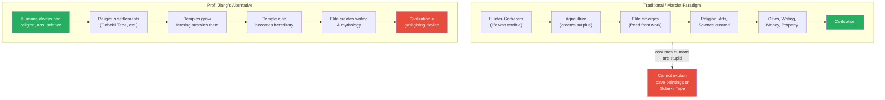
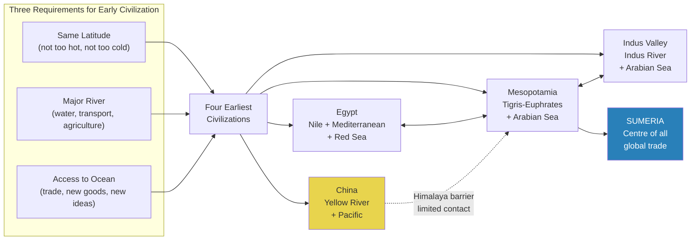
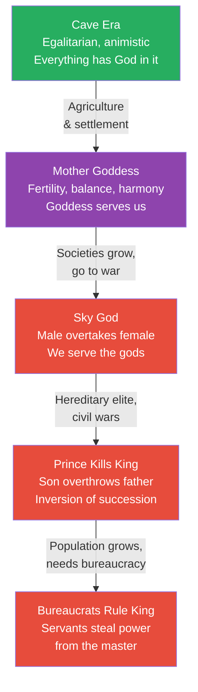
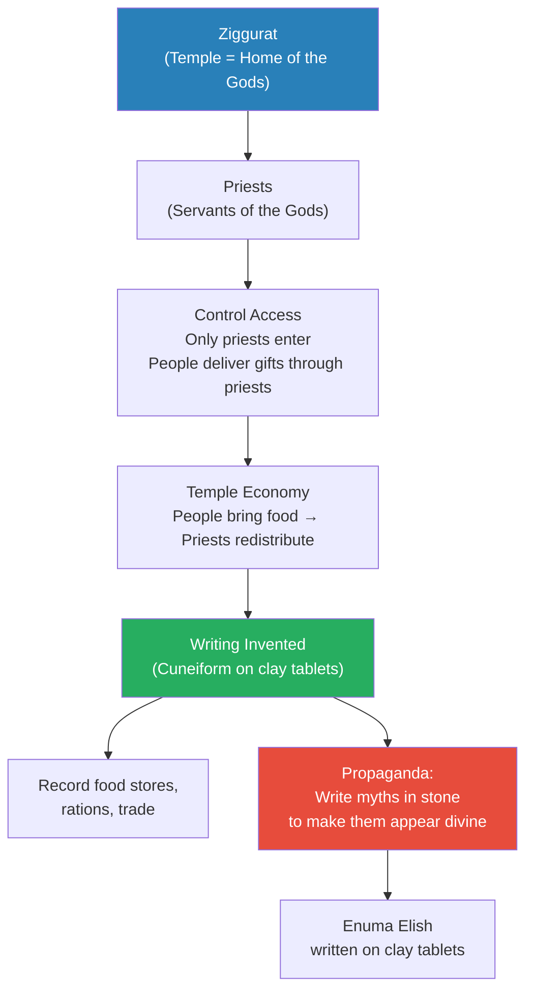
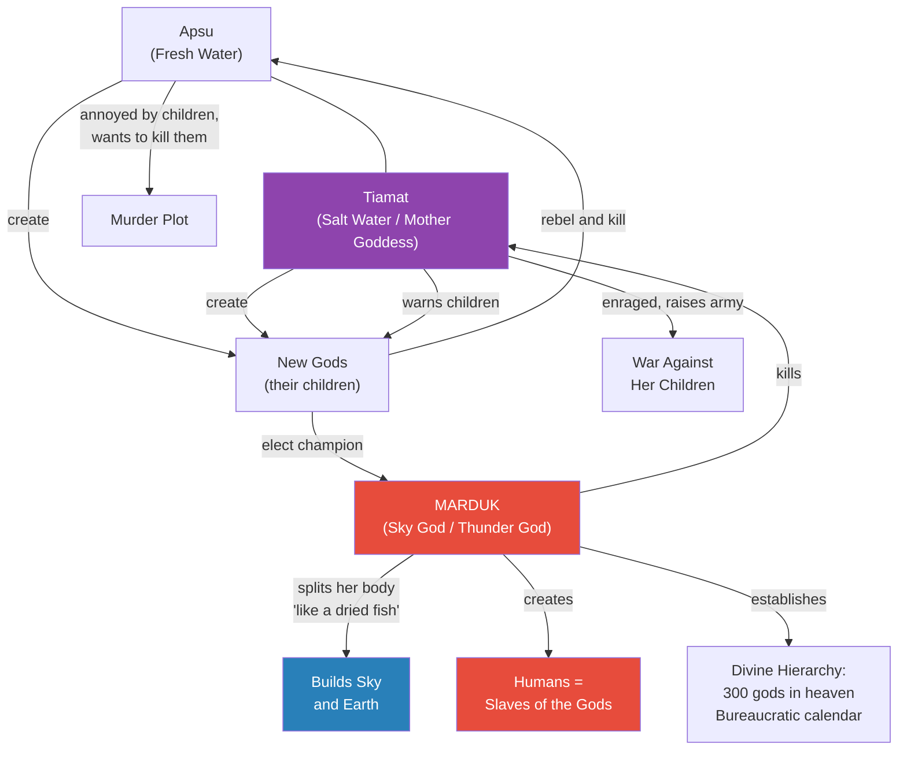
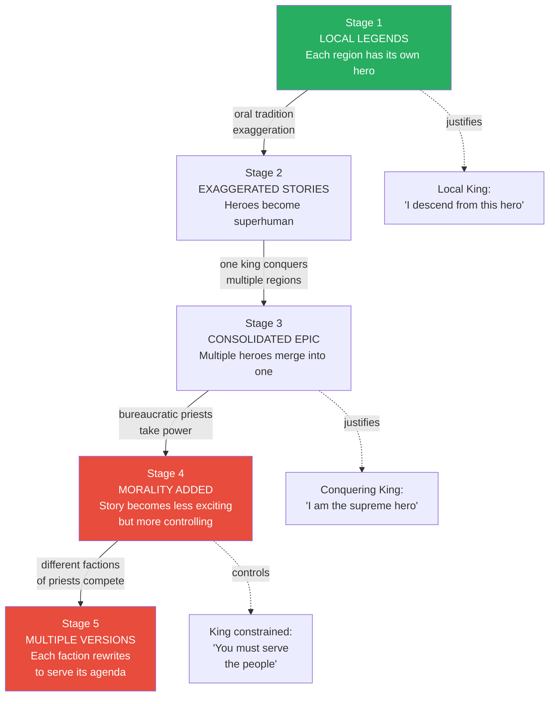
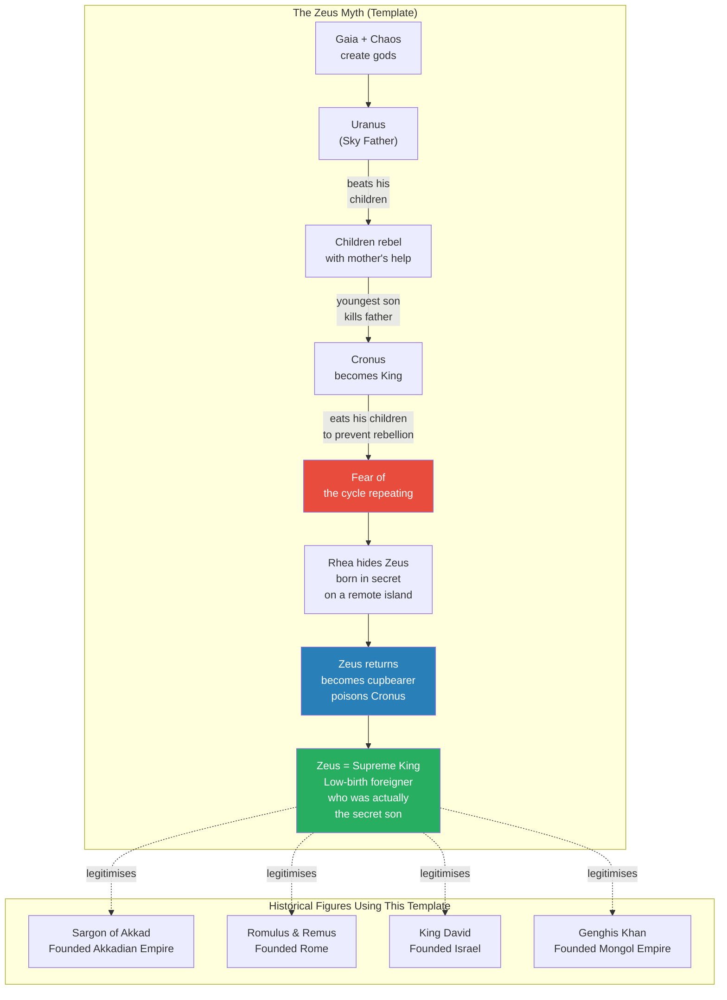
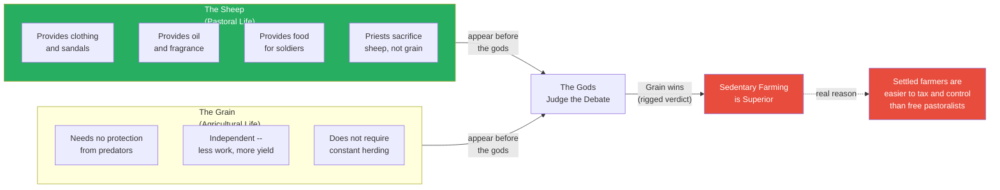

# Mandate of Heaven

> Prof. Jiang presents an alternative theory of civilization that overturns the Marxist narrative taught in schools. Rather than agriculture creating surplus which enabled elites to produce religion, arts, and science, he argues humans were always capable of these things -- civilization is a device invented by elites to gaslight people into accepting a hierarchy that is not legitimate. He traces this through Sumeria and its ziggurats, the invention of writing as a propaganda tool, the Enuma Elish creation myth where Marduk kills the mother goddess to build the world and enslave humanity, the Epic of Gilgamesh as bureaucratic consolidation of local legends, and the Greek theogony as a template for legitimising usurper kings. The lecture reveals how myths are manufactured, revised, and weaponised to justify power.

---

## Overview: Key Highlights

- <b style="color: #27ae60">Civilization did not give us religion, arts, and science -- we already had them</b> -- cave paintings and Gobekli Tepe prove humans were creative long before cities
- <b style="color: #e74c3c">Civilization is a gaslighting device</b> -- its purpose is to convince people that an illegitimate hierarchy is divinely ordained
- <b style="color: #2980b9">The Marxist paradigm</b> -- the traditional story (agriculture creates surplus creates elite creates civilization) is the dominant but deeply flawed model
- <b style="color: #27ae60">History is a constant process of inversion</b> -- the old order is always being dethroned by the new: mother goddess to sky god, king to prince, prince to mercenary, ruler to bureaucrat
- <b style="color: #2980b9">The Enuma Elish</b> -- Babylon's creation myth where Marduk kills Tiamat the mother goddess, builds the world from her body, and creates humans as slaves to serve the gods
- <b style="color: #e74c3c">Writing was invented for propaganda</b> -- not for record-keeping or literature, but to make the social order appear divinely ordained and permanent
- <b style="color: #2980b9">Sumeria as the first civilization</b> -- located at the centre of all global trade routes, connecting Egypt, the Indus Valley, and Anatolia
- <b style="color: #27ae60">The mandate of heaven</b> -- the claim that the ruling order is sanctioned by the gods, used identically in Mesopotamia, Egypt, and China
- <b style="color: #e74c3c">The Epic of Gilgamesh as bureaucratic creation</b> -- local legends are exaggerated, consolidated, then rewritten by priests to control the population
- <b style="color: #2980b9">The Zeus pattern</b> -- a foreign mercenary of low birth overthrows the king and then invents a mythology to legitimise himself, repeated by Sargon of Akkad, King David, Romulus and Remus, and Genghis Khan
- <b style="color: #27ae60">Myths are house renovations</b> -- each generation of rulers adds a new layer to old stories to serve current political needs
- <b style="color: #e74c3c">The Debate Between Sheep and Grain</b> -- a Sumerian text that brainwashes free pastoralists into accepting sedentary farming, proving myths were economic weapons

| Concept | One-line summary |
|---------|-----------------|
| **Marxist paradigm** | The traditional (and flawed) story that agriculture created surplus which created civilization |
| **Alternative paradigm** | Humans were always creative; civilization is a device to justify hierarchy |
| **Inversion** | The historical pattern where the subordinate overthrows and replaces the dominant |
| **Mother goddess** | The original deity of balance, harmony, and fertility -- replaced by the sky god |
| **Sky god** | Male deity of struggle, toil, exploitation -- Marduk, Ra, Zeus, Jupiter |
| **Mandate of heaven** | The claim that the ruling social order is divinely ordained and therefore legitimate |
| **Ziggurat** | Sumerian temple considered the literal home of the gods, centre of the temple economy |
| **Cuneiform** | First writing system, invented in Sumeria using reed marks on wet clay tablets |
| **Enuma Elish** | Babylonian creation myth: Marduk slays Tiamat and builds the world from her body |
| **Epic of Gilgamesh** | Consolidated hero epic used to define and constrain kingship through bureaucratic morality |
| **Temple economy** | System where people bring food to the temple and priests redistribute it -- the first taxation |
| **The Zeus myth** | Origin story template: secret son of low birth becomes champion, legitimises usurper kings |

---

# The Lecture

## The Traditional Paradigm vs. the Alternative [0:00-9:47]

*Prof. Jiang opens by presenting the Marxist understanding of civilization that every student has been taught in school -- and then demolishes it with a single question: if humans needed an elite to create religion, art, and science, how do you explain cave paintings and Gobekli Tepe?*

> [!tip] Core Insight
> Civilization did not give us religion, arts, and science. We already had all of these. Civilization is a device meant to gaslight people into believing that a hierarchy is legitimate when it is not.

*The left path is what you were taught in school. The right path is what the evidence supports. The traditional paradigm requires humans to be stupid before civilization -- the alternative recognises that creativity is innate.*

> [!note]- Expand: Full Lecture Detail
> Prof. Jiang tells the class he wants to present two competing frameworks for understanding civilization. He starts with the traditional one -- the <b style="color: #2980b9">Marxist understanding</b> -- and walks through it step by step:
>
> - In the beginning, humans were hunter-gatherers, "and it sucked to be a hunter-gatherer because you cannot find food"
> - Then agriculture was discovered, creating surplus -- more food than you can eat
> - Surplus freed an elite class who could now devote time to religion, arts, dance, music, painting, and science
> - With these in place, society could grow: irrigation, hereditary elite, writing, money, property
> - These four elements -- irrigation, hereditary elite, writing, money/property -- are what we call civilization
> - He notes civilization brings both good things (religion, arts, science) and bad things (war, slavery, debt)
>
> Then he presents the alternative:
>
> - <b style="color: #27ae60">"From the very beginning, we were religious, artistic, and capable of science"</b>
> - We do not need an elite to do this for us -- cave paintings and religious settlements prove this
> - People came together to practise religion, built temples, and farming developed around the temples to sustain them
> - Over time, temple people became corrupt -- instead of being elected, they became hereditary
>   - They engaged in <b style="color: #e74c3c">rent-seeking</b> -- exploiting their position rather than serving
>   - Originally people could leave and build a new temple elsewhere
> - But in certain locations, temples became trade centres -- the real estate was too valuable to abandon
>   - These places grew and grew into cities
> - The elite created a <b style="color: #2980b9">temple economy</b>: everyone brings food to the temple, priests redistribute it -- the first taxation
> - This economy required writing -- to record food stores, rations, and trade
> - Money followed
> - A strict hierarchy emerged, but people could still leave
> - <b style="color: #e74c3c">So they created mythology -- written down so it appears to come from the gods themselves</b>
>
> Prof. Jiang states the thesis directly: "Civilization is a device meant to gaslight or fool people into believing that a hierarchy is legitimate when it is not legitimate. It is meant to fool people into thinking that this hierarchical system is divinely ordained."
>
> He identifies the fatal flaw of the traditional paradigm: "The problem with this framework is that it assumes that we're all stupid, and if we're all stupid, it's hard to explain how we did the cave paintings, how we built Gobekli Tepe."

---

## The Four Earliest Civilizations and Strategic Geography [9:47-15:30]

*Prof. Jiang maps the four earliest civilizations -- Egypt, Mesopotamia, the Indus Valley, and China -- and shows that their emergence was not random but determined by three geographical characteristics. He then identifies Sumeria as the centre of all global trade, explaining why it became the first civilization and why it developed so rapidly.*

*Three of the four civilizations -- Egypt, Mesopotamia, and the Indus Valley -- were in constant dialogue through trade. China was partially isolated by the Himalayas. Sumeria sat at the exact centre, which is why civilization began there.*

> [!note]- Expand: Full Lecture Detail
> Prof. Jiang identifies the four earliest civilizations and their three shared characteristics:
>
> - **Latitude:** All four sit at the same latitude band -- not too hot, not too cold -- perfect for agriculture
> - **Major rivers:** Egypt has the Nile, Mesopotamia has the Tigris and Euphrates, the Indus Valley has the Indus, China has the Yellow River
>   - Rivers solve water, transportation, and agriculture simultaneously
>   - They also enable building very large cities
> - **Access to ocean:** Egypt has the Mediterranean and Red Sea, Mesopotamia and the Indus Valley connect through the Arabian Sea to the Indian Ocean, China has the Pacific
>   - Ocean access enables trade, bringing new goods, new people, and new ideas
>
> He then makes a crucial geographical argument:
>
> - As cities grew too large, they built colonies upstream and downstream -- expanding trade reach
> - Egypt connects Europe, the Levant, and Africa
> - Mesopotamia connects Anatolia, Central Asia, and beyond
> - The Indus Valley does the same
> - <b style="color: #2980b9">China is a special case</b> because the Himalayas block it from the rest of the world -- there was trade, but much less
>
> Prof. Jiang challenges a common assumption: "You may have thought that Western civilization is just Europe and America. That's not true." Egypt, Mesopotamia, and the Indus Valley were always in contact and collectively built the foundations of Western civilization.
>
> He then asks the class to look at a map and identify the most strategically located place. The answer: <b style="color: #2980b9">Sumeria</b> -- right at the centre of global trade, where all civilizations meet.
>
> - This is where writing was invented
> - This is where irrigation and many technologies were developed
> - Scholars are puzzled because the Sumerian language is unrelated to surrounding languages -- suggesting Sumeria's population was formed by traders converging from many places
> - He dismisses the Anunnaki alien conspiracy theory directly: "It's a really stupid idea. What you learn in this class is that when humans come together and need to do something, they will do it very well."
> - <b style="color: #27ae60">"Necessity is the mother of creativity"</b> -- people thrown together by trade necessity will rapidly develop language, writing, and civilization

---

## History as Constant Inversion [15:30-20:00]

*Prof. Jiang introduces one of the lecture's most important conceptual frameworks: the principle that history is a constant process of inversion, where the old order is always being overthrown by the new. He traces this through five stages of religious and political transformation.*

> [!tip] Core Insight
> History is a constant process of inversion. The subordinate always overthrows the dominant: the mother goddess is replaced by the sky god, the priest by the warlord, the warlord by the mercenary, the king by the bureaucrat. Every "natural order" is just the last inversion waiting to be overturned.

*Five stages of inversion, each one stripping away more of the original egalitarian order. By stage five, the very people hired to serve the king are the ones who control him.*

> [!note]- Expand: Full Lecture Detail
> Prof. Jiang introduces a principle he wants the class to remember throughout the series: <b style="color: #2980b9">"History is a constant process of inversion"</b> -- meaning that as human society grows, the old order is constantly being dethroned by the new.
>
> He traces five stages:
>
> - **Stage 1 -- Cave era:** Egalitarian society, fluid and dynamic, <b style="color: #2980b9">animistic</b> -- they believed everything had God in it; all things were part of God
> - **Stage 2 -- Agriculture / Mother Goddess:** Fertility becomes central; the mother goddess gives children and helps grow crops; the relationship is that she serves us because she is kind and compassionate
> - **Stage 3 -- Sky God:** As societies grow larger and go to war, the male overtakes the female
>   - Rather than worshipping the mother goddess, they worship the sky god
>   - Before: the mother goddess serves us; now: we must serve the gods
>   - Different societies have different sky gods but the concept is the same: Ra (Egypt), Marduk (Babylon), Zeus (Greece), Jupiter (Rome)
>   - The sky god demands "struggle and toil, to rape, exploit, control the earth, to take the mother goddess and to control her"
> - **Stage 4 -- Prince kills king:** As society becomes more hereditary, civil wars erupt where the son kills the father -- an inversion of the succession order
> - **Stage 5 -- Bureaucrats rule king:** As society grows more populated, a bureaucracy becomes necessary; bureaucrats then collude to steal power from the king -- "the servant rules the king"
>
> He then zooms in on the mother goddess to sky god transition:
>
> - The mother goddess focused on balance, harmony, fertility -- "You just have to respect her, and she will provide you with babies and good food"
> - The sky god demands struggle, exploitation, war, conquest, enslavement
> - This maps directly onto the shift from egalitarian settlement to militarised empire

---

## Sumeria: Ziggurats, Cuneiform, and the Temple Economy [20:00-25:31]

*Prof. Jiang turns to the material remains of Sumeria -- its ziggurats, cuneiform tablets, and temple economy -- to show how religious power was consolidated and how writing was invented not for knowledge but for propaganda and control.*

*The ziggurat is the physical anchor of the entire system. The priests control access to the gods, which gives them control over the economy, which requires writing, which becomes the weapon of propaganda.*

> [!note]- Expand: Full Lecture Detail
> Prof. Jiang describes how Sumeria developed after its founding:
>
> - The city-state of Uruk became the dominant force, and for a thousand years, city-states fought each other until Sargon of Akkad unified the region
> - Sumer was known for its canals and irrigation -- scholars are "mesmerised" by their engineering capability
> - But Prof. Jiang reminds the class: "When humans come together for religious purposes, they're capable of doing amazing stuff"
>
> He introduces the <b style="color: #2980b9">ziggurats</b> -- Sumerian temples that were the centre of their civilization:
>
> - Ziggurats were considered the literal home of the gods -- "these places are sacred"
> - Only priests were allowed inside
> - People could deliver gifts to the gods through the priests, "but the people themselves are not allowed to interact with the priests"
> - <b style="color: #e74c3c">This is how priests maintained control over the cities</b> -- by monopolising access to the divine
> - The priests were considered servants of the gods, not rulers -- a crucial distinction that masked their actual power
>
> He then explains <b style="color: #2980b9">cuneiform</b>, the first writing system:
>
> - They took clay from riverbeds, and before it hardened, pressed marks into it with a reed
> - Then set it aside to harden permanently
> - "That's why we still have them today, because clay does not decay"
> - This is why we know more about Sumeria than about Egypt -- Egypt's papyrus scrolls degrade over time
>
> He asks the class a provocative question: if everyone could memorise stories line for line (which they did for thousands of years), why write them down?
>
> - <b style="color: #e74c3c">"For propaganda purposes"</b>
> - He draws the analogy to film: "When you see a film, you're mesmerised. You're hypnotised by the beauty of it. And you must think that this film must be the gods speaking themselves."
> - Writing on stone or clay creates the same effect -- it appears permanent, authoritative, divine
> - "Your mind's like, 'Oh my God, this is an image before me, therefore it must be true'"

---

## The Enuma Elish: Marduk Kills the Mother Goddess [25:31-34:00]

*Prof. Jiang reads directly from the Enuma Elish -- the Babylonian creation myth -- to show how Marduk's slaying of Tiamat, the creation of the world from her body, and the enslavement of humanity as servants of the gods is a deliberate political document designed to justify the existing power structure.*

> [!tip] Core Insight
> The Enuma Elish is not a story about gods. It is a political manifesto. Marduk killing Tiamat is the sky god killing the mother goddess. Building the world from her body is the new order exploiting the old. Creating humans as slaves is the priesthood justifying taxation. Every element maps to a political reality.

*The Enuma Elish in one diagram: fresh water and salt water create life, the children rebel, the mother retaliates, the sky god kills her, builds the world from her corpse, and creates humans to serve as slaves. Every element justifies the Babylonian power structure.*

> [!note]- Expand: Full Lecture Detail
> Prof. Jiang introduces the <b style="color: #2980b9">Enuma Elish</b> -- meaning "from up high" -- the most famous epic from Mesopotamia. He calls it "basically a Bible" and reads key passages directly from the text.
>
> The story:
>
> - In the beginning there are two gods: <b style="color: #2980b9">Apsu</b> (fresh water -- the river) and <b style="color: #2980b9">Tiamat</b> (salt water -- the ocean, the mother goddess)
> - When they come together, they create all life, including their children, the new gods
> - The children are loud and annoying; Apsu decides to kill them
> - Tiamat overhears and warns her children, who rebel and kill Apsu
> - Tiamat is enraged -- they killed her husband -- so she raises a general and an army to attack her children
> - The children are terrified and elect a new champion: <b style="color: #2980b9">Marduk</b>, the thunder god, the sky god
> - In the final battle, Marduk kills Tiamat
>
> What happens after the killing is "really interesting":
>
> - Marduk takes Tiamat's body and builds the entire world from it -- both sky and earth
> - Prof. Jiang reads the passage: "He split her into two like a dried fish. One half of her he set up and stretched out as the heavens."
> - <b style="color: #e74c3c">He is doing this to the mother goddess</b> -- the new order does not just defeat the old, it dismembers and exploits it
> - The old religion was "balance and harmony -- don't destroy things, worship the animals as your friends"
> - The new religion is "destroy the world and make it yours" -- struggle, exploitation, toil
> - This maps to a civilization that practised irrigation -- "irrigation really is about controlling the earth"
>
> Marduk then establishes a bureaucratic order:
>
> - He builds a calendar, sets up constellations, divides the year into twelve months
> - Prof. Jiang interprets: "All these were bureaucratic inventions in Sumeria to better govern the people"
> - The myth proclaims these inventions as divinely ordained -- "This didn't come from the priests. It came from the gods. The priests are just the messengers."
>
> Finally, Marduk creates humans:
>
> - He is tired and wants a house (temple) to rest in and slaves to serve him
> - He kills his enemy Qingu and from his blood creates mankind
> - "From his blood, he created mankind on whom he imposed the service of the gods"
> - <b style="color: #e74c3c">Before the Enuma Elish, gods served and loved humans; now humans are slaves to the gods</b>
>
> > [!example] The Divine Hierarchy of Marduk
> > - Marduk divides the gods (Anunnaki) into upper and lower groups
> > - He assigns 300 gods to the heavens to "guard the decrees"
> > - All humans are slaves, but some are "better slaves" than others
> > - This explains and justifies the existing social hierarchy
> > - The conspiracy theorists who believe "aliens called the Anunnaki created humans" are reading this text literally
> > **The lesson:** The Enuma Elish was written to justify the existing power structure. Every element -- the killing of the mother goddess, the creation of humans as slaves, the divine hierarchy -- maps to a political reality that the priests needed to legitimise.
>
> Prof. Jiang notes that Marduk has different names throughout the poem -- Bel, Enlil -- because the epic consolidates different regional traditions into one composite story. This is the same consolidation process he will demonstrate with the Epic of Gilgamesh.
>
> He draws the parallel to Egypt: "This is not just true for Mesopotamia, for Babylon, but also true for all major civilizations." In Egyptian tapestries, the gods are in control, the kings are being controlled by the gods, and humans do what the gods demand. "This is the mandate of heaven. This is the way that it should be."

---

## The Epic of Gilgamesh: How Legends Become Propaganda [34:00-43:32]

*Prof. Jiang tells the story of Gilgamesh and then reverse-engineers how such epics are actually constructed -- starting as local legends, becoming exaggerated through oral tradition, consolidated as regions merge, and finally rewritten by bureaucratic priests to control the population. He illustrates this with a vivid analogy using American college students.*

*Five stages of myth manufacture. The story starts as genuine folk memory, gets exaggerated by natural storytelling, consolidated by conquest, and finally weaponised by bureaucrats. By stage five, the priests are fighting each other for control of the narrative.*

> [!note]- Expand: Full Lecture Detail
> Prof. Jiang introduces the <b style="color: #2980b9">Epic of Gilgamesh</b> as the second great literary achievement of Mesopotamia, after the Enuma Elish.
>
> The story of Gilgamesh:
>
> - Gilgamesh is king of Uruk -- a giant so large that a lion is his pet
> - He is a tyrant: takes men to war, sleeps with all the women
> - The people cry to the gods for relief
> - The gods create <b style="color: #2980b9">Enkidu</b> from clay (similar to the story of Adam)
> - Enkidu is wild like an animal; Gilgamesh sends a prostitute to seduce and "civilise" him
> - Gilgamesh and Enkidu fight, discover they cannot defeat each other, and become best friends
> - They embark on adventures together: killing divine beings, slaying the protector of the forest, killing a divine bull
> - The gods are angered and decide one of them must die -- they kill Enkidu
> - Gilgamesh is heartbroken and terrified of his own death
> - He goes on a quest for immortality -- and ultimately fails
> - He returns home and finds happiness in his people and his walled cities
> - <b style="color: #27ae60">The moral: immortality is not about living forever but about doing great things so you are remembered forever</b>
> - The irony: Gilgamesh "failed" in his quest but succeeded in his mission -- because we still have his epic and celebrate him today
>
> Prof. Jiang then asks: "Why is this story being told?" One theory: it defines <b style="color: #2980b9">kingship</b> -- being a king means serving the people, not doing whatever you want.
>
> But ultimately, Gilgamesh is a "bureaucratic creation." He explains the five-stage process:
>
> - **Stage 1 -- Local legends:** Each region has local heroes -- like Hercules in Greece
>   - The local king claims descent from the hero: "I'm the descendant of Hercules, therefore I should rule"
>   - The hero's feats become a test for the king: "If Hercules can fight a lion, then you, his descendant, should fight a lion"
> - **Stage 2 -- Exaggeration:** Through oral tradition, stories naturally become more colourful and extreme
>   - "The only way to keep a story alive is by constantly exaggerating it and bringing colour to it. If you don't do that, the story becomes forgotten."
> - **Stage 3 -- Consolidation:** When one king conquers multiple regions, the local legends are merged into a composite hero
>   - Gilgamesh is literally different heroes from different regions, consolidated as one king came to dominate
> - **Stage 4 -- Bureaucratic revision:** Priests add morality and messaging to control both the people and the king
>   - "The king must serve the people, and then the priests control the king"
> - **Stage 5 -- Competing versions:** Different priestly factions fight each other and produce rival versions with different messages
>
> > [!example] The College Legend Analogy
> > - Prof. Jiang invents three universities -- Ohio State, Connecticut, Middlebury -- each with a local legend
> > - Ohio State: Michael James gets drunk before an exam and still passes
> > - Over time, the story becomes: he gets drunk before every exam and scores 100
> > - Eventually: he bet his professor he could get 100 while drunk, succeeded, and flipped off the professor
> > - Connecticut: a football player scores a winning touchdown; it becomes a home run AND a touchdown in one day
> > - Middlebury: Pat Jack drives to Canada to take a piss; it becomes: he pissed on a sleeping bear and Rangers had to rescue him
> > - These three legends are then consolidated into one superhero: "Harvard's most legendary student was Pit Bull James"
> > - Then bureaucrats add a moral: "When he became a billionaire, he gave it all to Harvard" (university version) or "he found true love and settled down" (writer version) or "the bear ate him" (don't be stupid version)
> > **The lesson:** Every great myth follows this pattern: local event becomes legend, legend becomes exaggerated, legends are consolidated, and then bureaucrats add morality to control the population. When you add the moral, you make the story less interesting but more useful for control.
>
> Prof. Jiang connects this to Chinese literature: "Think of these Chinese classics -- Romance of Three Kingdoms, Journey to the West, Water Margin. If you read them, they're not that interesting. But before, you can imagine that they were interesting, but the bureaucrats took them and changed them into boring stories that they can now teach school children to brainwash them."

---

## The Zeus Pattern: How Usurpers Legitimise Themselves [43:32-53:01]

*Prof. Jiang reads Hesiod's Theogony -- the Greek creation myth -- and reveals a recurring pattern: Gaia creates the gods, Cronus overthrows Uranus, Zeus overthrows Cronus. This myth was not just a story but a template used by real historical figures -- Sargon of Akkad, Romulus and Remus, King David, Genghis Khan -- to legitimise their seizure of power.*

*The Zeus myth solves the usurper's dilemma: how do you legitimise a king who is a foreigner of low birth? You invent a story where he was secretly a prince all along. Sargon, David, Romulus, and Genghis Khan all used this template.*

> [!note]- Expand: Full Lecture Detail
> Prof. Jiang turns to <b style="color: #2980b9">Hesiod's Theogony</b> -- the Greek creation myth -- and identifies three layers within it:
>
> **Layer 1 -- Original/Animistic:** Gaia (the mother goddess) and Chaos give birth to the gods -- the oldest layer, reflecting the animistic worldview
>
> **Layer 2 -- Kingship established:** Gaia marries Uranus, they produce the twelve Titans
> - Uranus beats his children
> - The children, with the mother's help, rebel
> - The youngest son, <b style="color: #2980b9">Cronus</b>, kills Uranus and becomes king
>
> **Layer 3 -- The usurper pattern:** Cronus is king but fears his children will rebel just as he did
> - He eats all his children to prevent it
> - His wife Rhea gives birth to Zeus in secret on a remote island
> - Zeus grows up, returns, becomes Cronus's cupbearer, and poisons him
> - Zeus becomes the supreme king
>
> Prof. Jiang reveals why this third layer is "the most interesting":
>
> - In practice, kings often hire a foreign mercenary as their general
> - Why foreign? Because he has no local legitimacy and no political faction behind him
> - But a talented mercenary can build a political faction and overthrow the king
> - <b style="color: #27ae60">This is true for Genghis Khan, King David, Sargon of Akkad, and Romulus</b>
> - The problem: once the mercenary becomes king, he has a legitimacy problem -- he is of low birth and a foreigner
> - <b style="color: #2980b9">Solution: create the Zeus myth</b> -- "Zeus himself was of low birth and a foreigner, but not really, because he's the secret son of the king"
> - This origin story template legitimises every usurper who adopts it
>
> He maps this to the dynastic cycle:
>
> - The high priestess (mother goddess) has a consort; they establish a hereditary elite
> - The hereditary elite makes people unhappy
> - A prince or son forms his own political faction, becomes a warlord, overthrows the queen and king
> - He "slays the consort and marries the high priestess" -- following the pattern of the mythology
> - After the warlord dies, his son relies on a mercenary general
> - The mercenary is foreign and of low birth -- but talented enough to overthrow the warlord's son and make himself king
>
> Prof. Jiang offers a metaphor: <b style="color: #27ae60">"Think of myths and stories as like house renovation. When you renovate a house, you add different layers to it. That's literally what's happening."</b> Each generation of rulers adds a new layer to the same old story.

---

## The Debate Between Sheep and Grain: Mythology as Economic Warfare [53:01-57:00]

*Prof. Jiang closes with a Sumerian text -- The Debate Between Sheep and Grain -- to demonstrate how mythology was weaponised to control economic behaviour. The "debate" between pastoral freedom and sedentary farming is rigged: the gods always declare grain the winner, because settled farmers are easier to tax and control than free-roaming herders.*

*The debate is rigged from the start. The sheep represents freedom, mobility, and independence. The grain represents settlement and control. The gods -- written by the priests -- always rule in favour of the system that makes people controllable.*

> [!note]- Expand: Full Lecture Detail
> Prof. Jiang introduces the final text: <b style="color: #2980b9">The Debate Between the Sheep and the Grain</b>. He sets the context:
>
> - Mesopotamia was a diverse region with two forms of agriculture
>   - **Sedentary agriculture:** staying in one place, growing crops
>   - **Pastoral agriculture:** moving around, raising sheep and goats
> - If you are a king, a priest, or a bureaucrat, which do you prefer? "Obviously agriculture. Why? Because it's easy to control them."
> - <b style="color: #e74c3c">So they created mythologies to convince people to give up the free, happy lifestyle of a pastoralist and become an enslaved farmer</b>
>
> He reads key passages from both sides:
>
> **The Sheep argues:**
> - I provide clothing, sandals, sweet oil, and fragrance for the gods
> - I provide food for soldiers
> - The priests sacrifice me, not grain, when making offerings
> - "My cloth of white wool -- the king rejoices on his throne. My clothing is worn by the king himself."
>
> **The Grain argues:**
> - I don't need protection from predators -- "your fears are not removed from you"
> - No one needs to herd me -- I'm independent
> - Less work, more yield
> - "I am born for the warrior. I do not give up."
>
> The gods rule that grain is better -- <b style="color: #e74c3c">even though pastoral people "are stronger, more free, more independent"</b>.
>
> Prof. Jiang draws the conclusion: "Kings don't want that, so they create these stories, these mythologies, and want to brainwash people out of their freedom, out of their independence. And that's why we have writing. That's why they invented writing."

---

## Q&A: Cultural Influence and the Gender of Gods [53:01-57:00]

*Two students ask questions that probe the limits of cross-cultural influence and the gender transformations of deities across civilizations.*

> [!note]- Expand: Full Lecture Detail
> **Q: Did the three civilizations influence each other's mythology?**
>
> A student asks whether the proximity of Egypt, Mesopotamia, and the Indus Valley meant they shared myths. Prof. Jiang's response is nuanced:
>
> - "It's almost impossible for us to answer how much they influenced each other"
> - Even without contact, each civilisation would have invented myths to justify its hierarchy -- "myth-making is a natural part of the human process"
> - They probably shared stories, "but what's important to understand is that these elites are also interested in differentiation"
>   - Egypt builds pyramids to prove superiority
>   - Mesopotamia creates ziggurats and the Epic of Gilgamesh
> - He draws a modern analogy: "How much are you influenced by American pop culture? Probably a lot, but how much? And whatever influence you have, you still refract it for your own personal needs."
> - <b style="color: #27ae60">Scholars spend decades trying to quantify cross-cultural influence, but the key point is: there was influence, but every culture made it unique to their own needs</b>
>
> **Q: Why is the Chinese creator god Pangu male, while other traditions have a female creator?**
>
> A student asks about Pangu (the Chinese creation god) being male while other traditions start with a female creator. Prof. Jiang responds:
>
> - "In the very beginning, all myths, all gods, should be asexual -- either not sexual, or they are both male and female"
> - In all traditions, God must be a balance of forces -- male and female -- which is why we have yin and yang
> - But over time, "they will change the characteristics to reflect better the hierarchy"
> - "Maybe in the beginning, when females were in charge, Pangu was a female character, but over time, they changed it to a male character"
> - <b style="color: #e74c3c">"It's impossible for us to go back and rebuild or reimagine what it was like originally"</b> -- every text we have is already the product of multiple layers of revision

---

## Connections

**Builds on:** [[01 - How Power Works]] (paradigms and power structures), [[05 - The Birth of Evil]] (religious mythology as control mechanism), [[08 - Death by Bureaucracy]] (bureaucratic capture of institutions)
**Sets up:** [[14 - Legacy of the Steppes]] (next lecture: steppe peoples as the major conquerors of history)
**Related lectures in vault:** [[12 - Heaven on Earth]] (utopian impulses that precede the mandate of heaven), [[11 - Dawn of the Human Imagination]] (cave paintings as evidence of pre-civilizational creativity)
**Related Civilization lectures:** [[01 - Explaining Humanity's Transition to Agriculture]] (mother goddess, Gobekli Tepe, Catalhoyuk -- the religious foundations that this lecture shows being co-opted by elites)
**Related books in vault:** [[Sapiens - Yuval Noah Harari]] (agricultural revolution as humanity's worst mistake), [[The 48 Laws of Power - Robert Greene]] (mythology and propaganda as tools of power)

---

## The Takeaway

This lecture fundamentally reframes what civilization is. The standard story -- that we were primitive, then agriculture gave us surplus, which gave us elites, which gave us everything good -- turns out to be propaganda produced by those very elites. Prof. Jiang's alternative is darker but more consistent with evidence: humans were always creative, always religious, always scientific. What civilization added was not capability but control -- mythology, writing, and hierarchy designed to make an illegitimate order appear divine. The "mandate of heaven" is not a specifically Chinese concept; it is the universal strategy of every ruling class in every early civilization.

The most surprising insight is how myths are manufactured. The Epic of Gilgamesh is not one poet's vision but a bureaucratic assembly line: local legends exaggerated through oral tradition, consolidated as regions merge under a single ruler, and then rewritten by priests to serve political ends. The same pattern explains the Zeus myth, the Enuma Elish, and -- Prof. Jiang implies -- modern entertainment and media. The process never stopped. When he says "Why do we have schools? Why do we have media? Why do we have entertainment? To justify the existing power structure and social order," he is drawing a direct line from Sumerian clay tablets to the present day.

The lecture leaves one question provocatively open: if every "mandate of heaven" is manufactured, what happens when people stop believing in it? Prof. Jiang hinted at the answer in Lecture 8 (Death by Bureaucracy) -- when institutions lose legitimacy, people are "forced to think for themselves." The next lecture on the steppe peoples will explore what happens when those who never accepted sedentary civilization's gaslighting come riding in from outside the system entirely.
