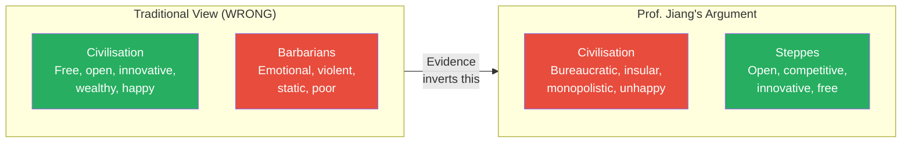
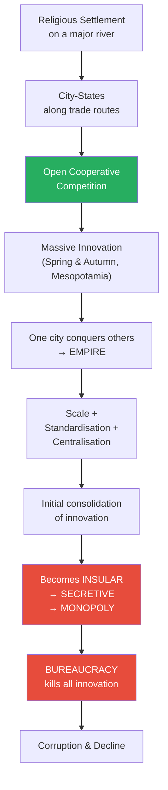
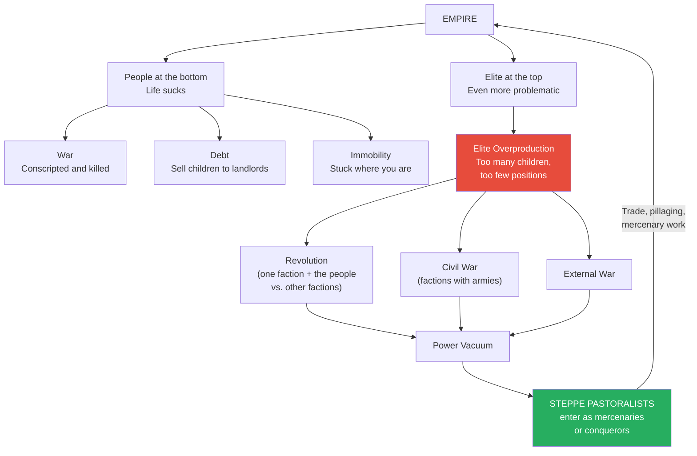
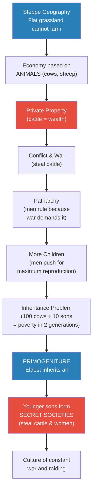
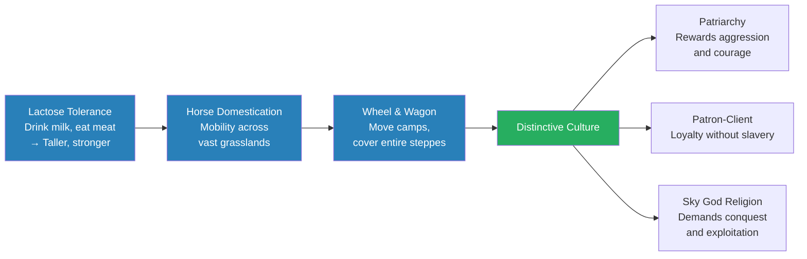
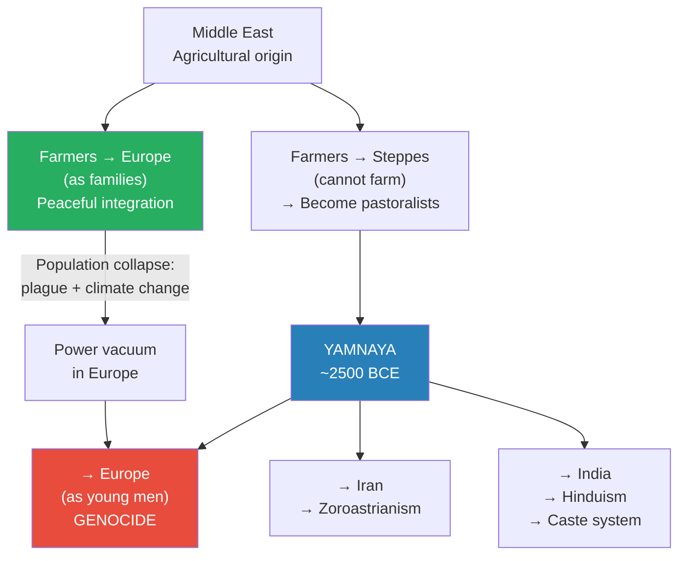
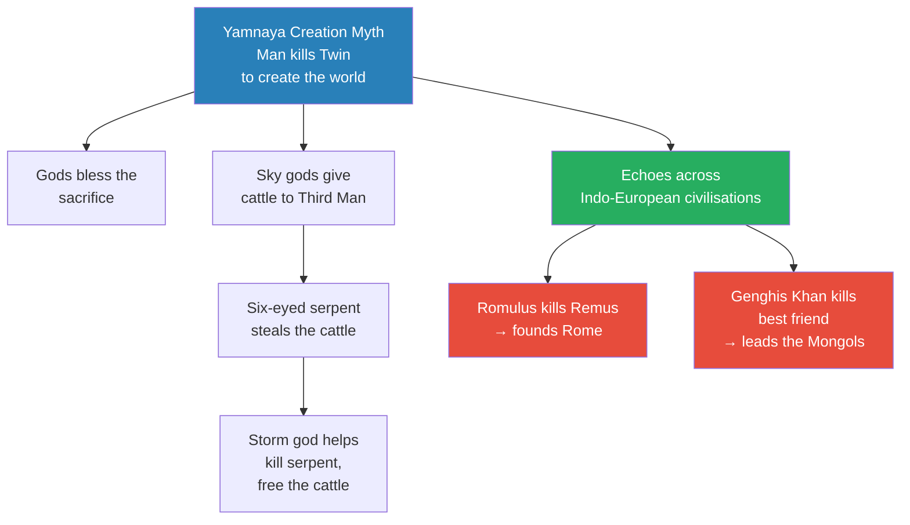

# Legacy of the Steppes

> Prof. Jiang inverts one of the deepest assumptions in human history: that civilisation is superior to barbarism. The traditional story says civilised people are free, open, innovative, and wealthy, while steppe people are emotional, violent, static, and poor. Prof. Jiang argues the opposite is true. Civilisation breeds bureaucracy, monopoly, and stagnation, while the steppe's geography forces open cooperative competition, producing the greatest warriors and conquerors in human history. He traces the arc from agricultural settlements to empire to collapse, shows how the pastoralist economy created a radically different culture -- patriarchal, volatile, fiercely independent -- and demonstrates through DNA evidence, linguistics, and archaeology that the Yamnaya steppe people conquered Old Europe in a genocide, reshaped India's caste system, and gave birth to the mythology of every major Indo-European civilisation from Rome to the Mongol Empire.

---

## Overview: Key Highlights

- <b style="color: #e74c3c">The traditional civilisation-vs-barbarian distinction is completely wrong</b> -- civilisation leads to bureaucracy, stagnation, and corruption, not innovation
- <b style="color: #27ae60">The steppe people were the most open, innovative, and aggressive culture in human history</b> -- their geography forced open cooperative competition
- <b style="color: #2980b9">Open cooperative competition</b> -- the three-part system (openness + cooperation + competition) that drives all innovation in human history
- <b style="color: #27ae60">Patriarchy, money, and war always go together</b> -- the introduction of private property (cattle) created all three simultaneously
- <b style="color: #2980b9">Primogeniture</b> -- eldest son inherits everything, forcing younger sons into secret societies that raid, steal, and conquer
- <b style="color: #e74c3c">The Yamnaya conquest of Europe was a genocide</b> -- DNA evidence shows farming men were eliminated and replaced
- <b style="color: #2980b9">Proto-Indo-European linguistics</b> -- shared words for bull, cow, wheel, horse, and dairy prove a common nomadic pastoral origin
- <b style="color: #27ae60">Old Europe was peaceful, egalitarian, and woman-led</b> -- Marija Gimbutas proved this through decades of archaeology
- <b style="color: #2980b9">Patron-client relationship</b> -- the mafia-like system of loyalty and obligation that held steppe society together without slavery or bureaucracy
- <b style="color: #e74c3c">The strongest stay in the steppes; the weakest go conquer empires</b> -- steppe life was harder than empire life, so those expelled became world conquerors
- <b style="color: #2980b9">Sky god mythology</b> -- a religion of violence, conquest, and sacrifice that replaced the mother goddess and echoes in Roman and Mongol founding myths
- <b style="color: #27ae60">Gunpowder ended the steppe dominance</b> -- the horse archer was invincible for thousands of years until technology neutralised the advantage

| Concept | One-line summary |
|---------|-----------------|
| **Open cooperative competition** | Openness + cooperation + competition = innovation; city-states embody this, empires destroy it |
| **Patriarchy-money-war triad** | These three always emerge together -- private property creates conflict, conflict demands male rule |
| **Primogeniture** | Eldest son inherits all to prevent family decline; younger sons must raid and steal to survive |
| **Patron-client relationship** | Big brother/little brother obligation system -- no slavery, but loyalty enforced by gods and oaths |
| **Secret societies** | Gangs of disinherited young men who raid for cattle and women -- ancestors of the Vikings |
| **Sky god** | Steppe religion demanding conquest, exploitation, and sacrifice -- the opposite of the mother goddess |
| **Mother goddess** | Agricultural religion of balance, harmony, and nature -- women controlled society under this system |
| **Proto-Indo-European** | The reconstructed ancestor language linking Persian, Hindi, Greek, Latin, and English |
| **Yamnaya** | The steppe pastoralists who conquered Europe, India, and Iran starting around 2500 BCE |
| **Marija Gimbutas** | Lithuanian-American anthropologist who proved Old Europe was peaceful, egalitarian, and goddess-worshipping |
| **Horse archer** | The ultimate weapon for most of human history -- fast, strong, and impossible to defend against |
| **Elite overproduction** | Too many elite children competing for too few positions -- triggers revolution, civil war, or invasion |

---

# The Lecture

## The Civilisation-vs-Barbarian Myth [0:00 - 1:50]

*Prof. Jiang opens by presenting the standard story everyone has been taught: civilisation produces intellectual freedom, openness, curiosity, innovation, and prosperity, while steppe people are emotional, violent, insular, static, and poor. He then asks the question that demolishes this framework -- if civilised people are so superior, why do the barbarians keep conquering them?*

> [!tip] Core Insight
> The traditional understanding of civilisation versus barbarism is completely inverted. It is the steppe people who are open, curious, and innovative, and civilised people who are close-minded, static, and unhappy. Genghis Khan conquering both China and Baghdad is not an anomaly -- it is the pattern of all human history.

*The entire lecture exists to demonstrate this inversion. Every piece of evidence -- DNA, linguistics, archaeology, military history -- confirms that the steppe people were more adaptive, more innovative, and more successful than the civilisations they conquered.*

> [!note]- Expand: Full Lecture Detail
> Prof. Jiang tells the class they will discuss "civilisation versus the steppes" and immediately names the prejudice:
>
> - In school, students are taught three supposed differences between civilisation and barbarism
> - **Intellectual freedom:** civilised people can think freely because they read books and go to school; steppe people are "emotional slaves" -- unpredictable and violent
> - **Openness and curiosity:** civilisation loves knowledge, seeks innovation; steppe people are static, insular, close-minded
> - **Wealth and prosperity:** only civilisation leads to happiness and wealth; steppe people are poor and therefore unhappy
>
> He pauses and delivers the provocation: "The problem is that this creates a misunderstanding, and we can't really explain why, throughout human history, the steppe people have been the greatest conquerors"
>
> - Genghis Khan conquered not just China -- one of the greatest civilisations -- but also Baghdad, another great civilisation
> - This is not a one-off event: "Throughout human history, this has been a consistent pattern where the barbarians conquered the civilised people"
> - <b style="color: #e74c3c">The traditional understanding is completely wrong</b> -- he will show that the steppe people are the ones who are open, curious, and innovative, while civilised people are close-minded, static, and unhappy

---

## The Life Cycle of Civilisation [1:50 - 9:23]

*Prof. Jiang traces the full arc of civilisation -- from religious settlements to city-states to empire to bureaucratic decay -- explaining how the very system that creates innovation eventually kills it. The key mechanism is open cooperative competition, which city-states embody and empires destroy.*

*The paradox of civilisation: the very process that drives innovation -- open cooperative competition between city-states -- is destroyed the moment one city conquers the rest and forms an empire. Scale, standardisation, and centralisation provide a brief burst of productivity, then the empire becomes a bureaucracy and all innovation dies.*

> [!note]- Expand: Full Lecture Detail
> Prof. Jiang recaps how civilisation begins, connecting to previous lectures:
>
> - People come together for religious purposes, build settlements to celebrate nature and God
> - Over time, the system becomes unequal and hierarchical -- people leave
> - But some locations are strategically valuable for trade, so people stay -- these become major cities
> - The first city in world civilisation is <b style="color: #2980b9">Eridu</b> (in Mesopotamia)
> - Cities grow, build canals, develop farming, create mythology
> - As population grows, they colonise other places along trade routes -- upstream and downstream
>
> The city-states enter a system Prof. Jiang calls <b style="color: #2980b9">open cooperative competition</b> -- "a very important concept, because this concept is what gives us innovation":
>
> - **Open** -- you want to learn, grow, and learn from others
> - **Cooperation** -- you are in contact with others, learning best practices
> - **Competition** -- you strive to be better than they are
> - In this system, "you have massive innovation, and we see this throughout human history"
>
> He gives the key example: "When was China the most innovative? It was during the Chunqiu -- the Spring and Autumn period. That's where Confucius comes from. All the great ideas came from this period." The same pattern applies to Mesopotamia and Egypt
>
> The transition to empire:
>
> - One city becomes more innovative than the others and conquers them
> - <b style="color: #27ae60">It is often the most disadvantaged city that conquers</b> -- being disadvantaged forces greater innovation
> - Example: the Qin dynasty was in the mountains, had lower population, was poorer and more isolated -- "therefore they were more innovative than the Zhao, the Chu, the Wei dynasties"
>
> The empire's initial advantages:
>
> - **Scale** -- can draw on more resources
> - **Standardisation** -- same monetary system, laws, communications network
> - **Centralisation** -- one place controlling all activities, enabling canals, temples, massive public works
>
> But over time, the empire becomes the opposite of open cooperative competition:
>
> - It becomes **insular**
> - Then **secretive**
> - Then a **monopoly** -- "That's what a bureaucracy is"
> - <b style="color: #e74c3c">"Civilisation leads ultimately to corruption"</b> -- not to innovation, as the traditional story claims
>
> > [!example] The Indus Valley Exception
> > - Prof. Jiang notes that the Indus Valley Civilisation (modern Pakistan) broke the pattern
> > - Even though they had a city-state system, they were peaceful, egalitarian, and artistic
> > - They did not go to war, create a hierarchy, or build a bureaucracy
> > - He promises to discuss why later -- "Even though there are patterns to human history, there are always exceptions to the rule"

---

## Empire Collapse and the Steppe Invasion Pattern [10:17 - 14:00]

*Prof. Jiang explains why empires inevitably fall from within -- through war, debt, immobility, and elite overproduction -- and why steppe pastoralists are always waiting to fill the power vacuum. The crucial insight: the people never rebel on their own; revolution is always one faction of the elite weaponising the masses against another faction.*

*The pastoralists are never truly outside the empire -- they interact with it constantly through trade, pillaging, and mercenary service. When the empire collapses from within, they are perfectly positioned to take over.*

> [!note]- Expand: Full Lecture Detail
> Prof. Jiang describes life inside an empire:
>
> - If you are a person in an empire, "your life sucks -- it really sucks because you're essentially a slave"
> - Three mechanisms of oppression:
>   - **War** -- the empire can conscript you at any time and you get killed
>   - **Debt** -- peasants fall into debt easily, owe rent to landlords, must sell their children
>   - **Immobility** -- you are stuck where you are, cannot leave
> - The bureaucracy develops a mythology to justify this condition (as discussed in previous lectures)
>
> The real instability comes from the top:
>
> - <b style="color: #2980b9">Elite overproduction</b> -- "there are only a few limited spots for the elite, and the elite have too many children, and therefore they fight"
> - The elite split into factions competing for dominance
> - Three possible outcomes:
>   - **Revolution** -- one faction enlists the people to overthrow the other factions
>   - **Civil war** -- factions with armies fight directly
>   - **External war** -- factions redirect aggression outward
>
> A crucial correction: <b style="color: #e74c3c">"The people do not create the revolution. The people themselves don't rebel. It's always one faction of the elite working with the people to overthrow the other factions"</b>
>
> How the pastoralists enter:
>
> - They are always in contact with the empire through **trade**, **pillaging**, and serving as **mercenaries**
> - When elite factions fight, one faction invites pastoralists as mercenaries
> - Eventually the mercenaries realise: "We don't have to fight for the prince -- we just take over ourselves"
> - Alternatively, the hiring faction runs out of money to pay them, and the mercenaries take the empire by force
> - The fundamental reason for their dominance: <b style="color: #27ae60">"These people are the best fighters in the world. They have horses. They have archers"</b>

---

## How Geography Created the Steppe Economy [14:00 - 19:17]

*Prof. Jiang traces how the steppe's geography -- flat grassland where you cannot farm -- forced a fundamentally different economy based on animals rather than agriculture. This single geographic fact produced three linked transformations: private property (cattle), war (to steal cattle), and patriarchy (to fight wars). These three always go together.*

> [!tip] Core Insight
> Patriarchy, money, and war always go together. They are not separate developments but a single package produced by private property. The moment cattle became wealth, conflict became inevitable, and male-dominated warrior culture became necessary.

*A single geographic constraint -- you cannot grow food on grassland -- cascades into an entirely different civilisational model. Each box in the chain follows necessarily from the previous one.*

> [!note]- Expand: Full Lecture Detail
> Prof. Jiang explains the transition from agriculture to pastoralism:
>
> - Agricultural people from the Middle East spread to both Europe and the steppes
> - In Europe, the climate was conducive to farming, so they maintained agricultural cultural practices -- egalitarian, artistic, peaceful, women in charge
> - In the steppes, "you cannot grow food because it's all grassland -- you cannot farm"
> - Trade developed between steppe people and agricultural people
> - Agricultural migrants brought cows and sheep to the steppes, and everything changed
> - Key insight: "You as a person can't eat grass, but cows and sheep can. So now you can base your entire economy around animals"
>
> Three characteristics of early agricultural society that the steppes destroyed:
>
> - **Women in command** -- the most natural political arrangement; women would "discuss amongst themselves and come to a harmonious conclusion"
> - **No private property** -- agriculture was communal; "you work on together and you share"
> - **No war** -- "people just discuss things and trade in order to reach a harmonious conclusion"
>
> Why cattle changed everything:
>
> - Cows and sheep are expensive -- <b style="color: #2980b9">"now you have a concept of private property, money"</b>
> - "If I see someone with a cow and I don't have a cow, what do I do? I want to go steal it" -- this leads to conflict and war
> - "Because you have private property and war and conflict, you can't have a system run by women. You need a system run by men" -- this creates patriarchy
>
> Prof. Jiang states the principle explicitly: <b style="color: #27ae60">"Patriarchy, money, and war -- these three things always go together"</b>
>
> The inheritance problem and its solution:
>
> - With patriarchy, men push women to have as many children as possible (need boys for fighting)
> - But this creates the inheritance problem: 100 cows divided among 10 sons = 10 cows each
> - In the steppes, bad weather regularly kills cattle -- "your entire family could be extinct in two or three generations"
> - Solution: <b style="color: #2980b9">primogeniture</b> -- the eldest son inherits everything
> - This keeps the family wealthy but creates a new problem: what do the other sons do?
>
> The answer: secret societies
>
> - Younger sons form "basically gangs of young men who get together"
> - Their activities: steal cows, steal women -- "the most valuable commodity in the steppes"
> - This creates a culture of constant war and conflict

---

## Steppe Innovations: Lactose Tolerance, Horses, and the Wheel [19:17 - 24:00]

*Prof. Jiang identifies three innovations that transformed the steppe people from displaced farmers into the most formidable culture on earth: the ability to digest milk, the domestication of horses, and the invention of the wheel and wagon. Together, these produced a distinctive culture of masculine aggression, mobility, and open cooperative competition.*

*Three innovations built on each other sequentially. Lactose tolerance made them physically dominant, horse riding made them militarily dominant, and the wheel made them logistically dominant. The result was a culture that could not be defeated by settled civilisations.*

> [!note]- Expand: Full Lecture Detail
> Prof. Jiang walks through each innovation:
>
> **Innovation 1 -- Lactose tolerance:**
> - "Most humans cannot drink milk naturally" -- you need to develop the enzymes
> - Because steppe people relied entirely on cows and sheep for food, they were forced to learn how to drink milk
> - The result: "They became stronger and taller"
> - <b style="color: #27ae60">"For most of history, the people of the steppes were the tallest people in the world. They were the strongest in the world"</b>
>
> **Innovation 2 -- Horse riding:**
> - The steppes are vast and flat -- you need to move constantly because cattle eat all the grass in one area
> - "The only way to protect your cows and sheep from other people is to be mobile"
> - Domesticating horses was extraordinarily difficult: "If horses see you, what do they do? They run away. So how do you train a horse to not run away and let the horse ride you?"
> - "It takes a lot and lot of effort, but because they had to do it, they managed to do it"
>
> **Innovation 3 -- Wheel and wagon:**
> - Horse riding enabled the wheel: "Now you can put all your stuff in a wagon and move from camp to camp"
> - This allowed coverage of "the entirety of the steppes"
>
> These innovations produced a distinctive culture:
>
> - **Patriarchy** -- "war is a constant thing, so the culture becomes very masculine, very aggressive. It rewards aggression, it rewards courage"
> - **Patron-client relationship** -- <b style="color: #2980b9">"In a civilisation, you have bureaucracy, but in the steppes, you can't have that. So you have a patron-client relationship"</b>
>   - Prof. Jiang explains it as a mafia structure: "I'm the big brother, you're the little brother"
>   - "I have 100 cows and you need cows, so I lend you 10 cows, but now you're loyal to me"
>   - This creates the idea of tribes
>   - Critical difference from civilisation: <b style="color: #27ae60">"In the steppes, there's no concept of slavery. You're still a free, independent person, but you just pay loyalty to your big brother"</b>
>   - "That's why they're such good fighters" -- they fight for themselves, not because someone forced them
>
> The mythology shifted to match:
>
> - From the <b style="color: #2980b9">mother goddess</b> (agriculture): harmony, kindness, compassion, grain and nature are sacred
> - To the <b style="color: #2980b9">sky god</b> (steppes): conquest, exploitation, destruction, killing -- horses and cows are sacred
>
> Why the steppe people always win:
>
> - Their system never allows bureaucracy to form
> - They always practise open cooperative competition
> - The system "forces you to be aggressive, forces you to be independent, forces you to work hard"
> - <b style="color: #e74c3c">"The fighters who are the most fierce stay in the steppes; those fighters who are forced out of the steppes go conquer the empire"</b>

---

## Q&A: Why Always the Eldest Son? [28:48 - 29:55]

*A student challenges the primogeniture rule, asking whether there might be a system to determine which son deserves the inheritance. Prof. Jiang explains why strict eldest-son inheritance is necessary despite its unfairness.*

> [!note]- Expand: Full Lecture Detail
> - A student asks whether it is always necessary to give everything to the eldest son, or whether there is a system to determine the best heir
> - Prof. Jiang responds: "The general principle is always the eldest son. That's to avoid conflict"
> - If you open the question to "whoever is most brave, most noble, most wise," the sons will fight each other
> - He cites Genghis Khan: the succession crisis after his death proves what happens when primogeniture is challenged
> - A student follows up: "What if the eldest son has been manipulated by his siblings?"
> - Prof. Jiang: "It does not matter" -- the rule is absolute to prevent worse outcomes

---

## The Yamnaya Conquest of Old Europe [29:55 - 39:39]

*Prof. Jiang shifts to the archaeological and DNA evidence for the most consequential migration in European history. The Yamnaya steppe people entered Europe around 2500 BCE -- not as families like the original farmers, but as young men. The result was a genocide of European farming men, a total cultural inversion, and the creation of every Indo-European language and civilisation we know today.*

> [!tip] Core Insight
> When farmers migrated to Europe, they came as families and integrated peacefully. When the Yamnaya came, they came as young men and killed the local men to take their wives. DNA evidence proves this was a continent-wide genocide -- the people who built Stonehenge were eliminated entirely.

*The Yamnaya expansion was global, not just European. The same steppe culture produced Zoroastrianism in Iran, Hinduism in India, and every European civilisation. The linguistic, genetic, and archaeological evidence all converge on the same conclusion.*

> [!note]- Expand: Full Lecture Detail
> Prof. Jiang begins with the genetic evidence:
>
> - Blue represents hunter-gatherer DNA, orange represents farmer DNA
> - Farmers from the Middle East spread to Europe as families -- husband, wife, children -- and integrated peacefully
> - Around 2500 BCE, the Yamnaya (also called proto-Indo-Europeans) moved into Europe
> - Critical difference: "When the pastoralists went to Europe, they went mostly as young men. Therefore they kill the local men in order to marry their wives"
> - <b style="color: #e74c3c">"From DNA research, we know that it was a genocide. The European farming men were eliminated by the pastoralists"</b>
> - The pastoralists were "stronger, taller, and more aggressive"
>
> The migration was global:
>
> - Farmers went to Europe but also to India and Iran -- "wherever they could go"
> - The Yamnaya did the same: "They went to Europe. They also went to Iran and India"
> - By mixing with local customs and religion, they created new religions:
>   - In Iran: <b style="color: #2980b9">Zoroastrianism</b> (the Avesta is its bible)
>   - In India: <b style="color: #2980b9">Hinduism</b> (the Vedas is its bible)
>
> The linguistic evidence:
>
> - Scholars first hypothesised the proto-Indo-Europeans through linguistic studies
> - Father: Latin *patar*, Greek *patris*, Persian *padar*, Hindi *pita*
> - Mother: Latin *mater*, English *mother* -- remarkably similar across all branches
> - The proto-Indo-European word for "two" is *dua* -- traceable through every descendant language to English "two"
> - <b style="color: #27ae60">"All these languages are interrelated. That's why, if you speak English, it's pretty easy to learn other European languages. Whereas if you speak Chinese, it doesn't really help"</b>
>
> Linguists identified words unique to proto-Indo-European culture: **bull, cow, ox, ram, eel, dog, cauldron, wrestling, wealth, households, families, clans**
>
> Four characteristics emerge from this vocabulary:
> - Lots of words for **wheel**
> - Words for **dairy**
> - **No farming terms**
> - Words for **horse**
> - Conclusion: these must be nomadic pastoralists from the steppes
>
> **Marija Gimbutas and Old Europe:**
>
> Prof. Jiang introduces <b style="color: #2980b9">Marija Gimbutas</b>, an American-Lithuanian anthropologist who was the first to hypothesise that all of Europe had been conquered by steppe people:
>
> - Her archaeology proved that Old European culture "was primarily peaceful, honoured women, and espoused egalitarianism"
> - The Yamnaya were "completely different -- a patriarchy, private property, and very aggressive"
>
> > [!quote] Marija Gimbutas
> > "The Goddess in her manifestations was a symbol of the union of all life in nature. Her power was in water and stone, in tomb, in cave, in animals and birds, snakes and fish, hills, trees and flowers."
>
> Key characteristics of Old Europe:
>
> - A religion of balance and harmony -- "everything is sacred, therefore you cannot destroy life without first getting permission from the mother goddess"
> - "They did not produce lethal weapons or build forts in inaccessible places"
> - Instead they "built magnificent tombs, shrines, and temples, comfortable houses in moderately sized villages, and created superb pottery and sculptures"
> - They had writing systems and metallurgy -- "they just chose not to use it for war because it was against their religion"
>
> The Yamnaya inversion of Old European values:
>
> - **Snake:** Old Europeans saw the snake as a symbol of life, energy, and regeneration; the Yamnaya introduced the idea that the snake is the devil -- "and that's where we get the concept in the Bible"
> - **Black and white:** In Old Europe, black was the colour of fertility, "of damp caves and rich soil, of the womb of the goddess where life begins." White was the colour of death, of bones. The Yamnaya inverted this
>
> Why farming communities collapsed and left Europe vulnerable:
>
> - Three weaknesses of agricultural societies:
>   - **Static** -- does not innovate
>   - **Climate change** -- dependent on weather
>   - **Disease** -- living close together with animals
> - Around 3000 BCE, a plague (carried by rats, spreading through trade networks) devastated farming communities across Europe -- "maybe even spread as far as China"
> - Steppe people were less affected because "they live far apart from each other"
> - Climate change further weakened Old European societies
> - The population collapse left the Yamnaya an opening to invade
>
> The DNA evidence for genocide, region by region:
>
> > [!example] Britain: Total Genocide
> > - The people who built Stonehenge were a farming, agricultural community who worshipped the mother goddess
> > - "All this wonderful science and technology is lost to us"
> > - The Yamnaya came and killed everyone -- men and women
> > - DNA evidence shows complete replacement of both the male and female lineage
> > **The lesson:** Even advanced civilisations with monumental architecture are helpless against a more aggressive, mobile enemy.
>
> > [!example] Spain: Male-Only Genocide
> > - Before 2000 BCE, the Y chromosome (male DNA) showed diverse origins
> > - After the Yamnaya arrival, the original male DNA disappears entirely
> > - "They killed all the men in Spain" -- but the female lineage survived, meaning Yamnaya men took local women as wives
> > **The lesson:** The genetic evidence is unambiguous -- steppe migration was violent replacement, not peaceful integration.
>
> > [!example] India: Caste Without Genocide
> > - Indians at the time were "more peaceful," so a settlement was reached
> > - The new conquerors placed themselves at the top of society, locals at the bottom
> > - "There was not much of a genocide, but we had a caste system created"
> > - Evidence: upper caste spoke Indo-European languages, lower caste spoke Dravidian
> > **The lesson:** The same steppe culture produced different outcomes depending on local resistance -- but always ended with the steppe people on top.

---

## Sex, Power, and the Mother Goddess [39:39 - 44:00]

*Prof. Jiang draws on Christopher Ryan's Sex at Dawn to explain why women led agricultural societies and why that system, despite its advantages, was ultimately fragile. The argument is provocative: women are simply better politicians than men, and their sexual freedom was a mechanism of social cohesion, not moral failure.*

```mermaid
flowchart TB
    MG["Mother Goddess Society"] --> WC["Women in Control"]
    WC --> SF["Sexual Freedom<br/>Love ≠ Sex"]
    WC --> EI["Emotional Intelligence<br/>Better at cooperation"]
    WC --> GS["Gossip & Sex as<br/>mechanisms of control"]
    SF --> CL["All children loved<br/>by all adults"]
    CL --> MH["No depression,<br/>strong community bonds"]
    MG --> WEAK["Three Fatal Weaknesses"]
    WEAK --> S["Static<br/>No innovation"]
    WEAK --> CC["Climate Change<br/>Weather-dependent"]
    WEAK --> D["Disease<br/>Dense living with animals"]
    WEAK --> COL["COLLAPSE"]
    style MG fill:#27ae60,color:#fff
    style COL fill:#e74c3c,color:#fff
```

*The mother goddess society was genuinely better for human wellbeing -- no depression, communal child-rearing, no war. But it had three structural weaknesses that made it unable to survive the steppe invasion.*

> [!note]- Expand: Full Lecture Detail
> Prof. Jiang presents evidence from <b style="color: #2980b9">Sex at Dawn</b> by Christopher Ryan:
>
> - For most of human history, women had sexual agency and multiple partners
> - One piece of evidence: "Human men have larger penises than all other primates. Gorillas are much bigger than we are but we have bigger penises. Why? Because we had to compete to put our semen into women, because women had multiple sexual partners"
> - "For most of human history, love and sex were not the same thing. Love is intimacy. Sex is just fun"
> - In some societies, women would have many husbands, usually brothers -- "a way to maintain peace and harmony"
>
> Prof. Jiang cites a telling exchange between a French missionary and an indigenous community:
>
> > [!example] The French Missionary and the Naskapi
> > - A French missionary told the Naskapi people that in their system, a man cannot be sure his wife's child is his own son
> > - The Naskapi responded: "You French people love only your own children, but we love all the children of our tribe"
> > - Prof. Jiang comments: "In this system, everyone loved all children. And honestly, in this system, it's better to be a child. And in this system, you would never, ever develop depression"
> > **The lesson:** Patriarchal possessiveness over reproduction is not natural -- it is the product of private property and war. The alternative system produced happier, more cohesive communities.
>
> Why women are better leaders:
>
> - "Women are more willing to cooperate"
> - "Women have more emotional intelligence"
> - "Women can use sex and gossip as mechanisms of control"
> - "All pretty common sense," Prof. Jiang adds
>
> But the system had fatal weaknesses:
>
> - **Static** -- it does not innovate
> - **Climate change** -- "if the weather changes on you, you're screwed"
> - **Disease** -- "you're living close to animals, living close together, so if a disease hits you, you're all screwed"
> - This is "very different from the steppe people, who live far apart from each other"
>
> The archaeological evidence confirms: carbon dioxide measurements show European farming populations collapsed around 3000 BCE, likely due to plague

---

## The Yamnaya Creation Myth and Its Echoes [44:00 - 49:12]

*Prof. Jiang turns to David Anthony's The Horse, the Wheel, and Language to explain the Yamnaya mythology -- a mythology of violence, sacrifice, and struggle that became the template for every Indo-European civilisation. The founding myth requires you to kill the person you love most in order to create the world.*

> [!tip] Core Insight
> The Yamnaya creation myth -- where a man must sacrifice his twin brother to create the world, and the gods bless him for it -- is not a curiosity of ancient religion. It is the foundational template that reappears in Romulus killing Remus to found Rome, and Genghis Khan killing his best friend to lead the Mongols. The same culture, the same mythology, thousands of years apart.

*The same sacrificial template -- kill the one closest to you, and power is your reward -- recurs across every civilisation the Yamnaya founded. This is not coincidence but cultural inheritance spanning millennia.*

> [!note]- Expand: Full Lecture Detail
> Prof. Jiang references <b style="color: #2980b9">The Horse, the Wheel, and Language</b> by David Anthony (Harvard anthropologist) to explain the Yamnaya worldview:
>
> The creation myth:
>
> - In the beginning, there were two brothers -- twins, one named Man, the other named Twin
> - They wandered the world accompanied by a great cow
> - To create the world we now inhabit, Man had to sacrifice Twin -- "he had to kill his own brother, the person he loved"
> - "The gods thanked him for that. The gods blessed him for that"
> - Prof. Jiang: "This is a world that is pretty violent"
>
> The cattle raid myth:
>
> - After the world was made, the sky gods gave cattle to Third Man
> - A three-headed, six-eyed serpent stole the cattle
> - Third Man entreated the storm god for help
> - Together they killed the monster and freed the cattle
> - "This is a mythology of struggle"
>
> The myth's echoes:
>
> - <b style="color: #e74c3c">Genghis Khan's founding story: he kills his best friend to become leader of the Mongol people</b>
> - <b style="color: #e74c3c">Rome's founding story: Romulus kills his twin brother Remus to found Rome</b>
> - "That shows you that the Mongols and the Romans come from the same culture -- a culture based on violence and exploitation"
>
> Anthony on the steppe economy:
>
> > [!quote] David Anthony
> > "Cattle and sheep were cultured like humans, they were part of everyday work and worry in a way never approached by wild animals."
>
> Key points from Anthony:
>
> - Humans "wrote poetry about cattle and sheep and used them as currency in marriage gifts, debt payments, and the calculation of social status"
> - Cattle and sheep processed grassland -- hostile to humans -- into wool, fuel, clothing, tents, milk, yoghurt, cheese, meat, marrow, and bone
> - <b style="color: #e74c3c">Herding was a volatile boom-bust economy</b> -- cattle could multiply rapidly with luck but die rapidly from bad weather or theft
> - This volatility required "a flexible, opportunistic social organisation" -- making steppe people fundamentally different from settled farmers who could "sit back and relax because nature will grow the food for them"
>
> The patron-client system in detail:
>
> - Long-distance trade and public sacrificial feasting became the foundation for social power
> - Those who loaned animals acquired power over those who borrowed -- "those who sponsored feasts obligated their guests"
> - Proto-Indo-European included vocabulary about verbal contracts bound by oaths -- later codified in religious rituals
> - <b style="color: #27ae60">"Even though there are wealthy people and poor people, they are still treated with respect -- a very egalitarian society"</b>
> - The belief in gods oversees the contracts: "If I do you a favour, then you owe me a favour. We have a contract. The gods oversee the contracts"
> - The system was open-ended -- easy to bring outsiders in without permanently assigning them to submissive roles, "as long as they conducted the sacrifices properly"
> - Praise poetry at public feasts encouraged patrons to be generous and validated their language as "a vehicle for communication with the gods"

---

## The Cascade of Steppe Conquests [49:12 - 57:26]

*Prof. Jiang traces the chain of steppe invasions from the Yamnaya through the Scythians, Medians, Huns, Turks, and Mongols to Tamerlane -- demonstrating that the pattern repeats for thousands of years. He reveals the cascade mechanism: when one empire (usually China) pushes against the steppes, it forces a westward chain reaction that ultimately destroys civilisations thousands of miles away.*

*Five thousand years of steppe dominance ended by a single technological innovation. The horse archer -- invincible for millennia -- became obsolete the moment gunpowder arrived.*

> [!note]- Expand: Full Lecture Detail
> Prof. Jiang introduces the young warrior institution:
>
> - The <b style="color: #2980b9">mannerbund</b> -- warrior brotherhoods of young men bound by oath to each other and to their ancestors during ritualised raids
> - Reconstructed by linguists as "a central part of proto-Indo-European initiation rituals"
> - Essential for society because younger sons have nowhere else to go
> - "If you want to know who they are, they're basically the Vikings -- the Vikings are the direct descendants of these people"
>
> The Mongol Empire:
>
> - The Mongols conquered most of the known world
> - Their secret weapon: the <b style="color: #2980b9">horse archer</b> -- "the ultimate weapon for most of human history"
> - "You could not defend against a horse archer. They were fast, they were strong, and these were the best warriors in the world"
>
> The historical pattern:
>
> - First the Yamnaya conquered Europe, India, and Iran
> - Then the Scythians dominated -- "same place, same people, same culture"
> - Prof. Jiang emphasises: "This is not a race of people. This is a culture of people, because at this time in human history, genetic exchange is very common"
> - Then the Medians, who gave rise to the Persian Empire
>
> The cascade mechanism:
>
> - China emerged as the Han Empire -- "the last Chinese dynasty that is ethnically Chinese and proud of who they are"
> - The Han moved a huge army into the steppes to "destroy the steppe people once and for all"
> - This forced a cascade: the Xiongnu were pushed westward, which forced other groups further west, all the way to the Roman Empire
> - "China forces the Xiongnu westwards, which forces these other groups to go elsewhere"
> - <b style="color: #e74c3c">"The strongest people stay in the steppes. The weakest people go and conquer empires"</b>
>
> The chain continues:
>
> - The Hun Empire emerged from these displaced peoples
> - Then the Turks
> - Then the Mongol Empire -- which unified so much of the world that trade routes connected everything
> - This interconnection enabled the Black Death to spread: "About a third of Europe is wiped out"
> - The last great steppe conqueror was <b style="color: #2980b9">Tamerlane</b>
>
> The ending:
>
> - <b style="color: #27ae60">"Eventually what happens is we develop gunpowder. And now the steppes will be conquered by civilisation"</b>
> - This was the turning point in history -- "the invention of gunpowder"
> - After gunpowder, civilisation attacked the steppe people and reduced their culture

---

## Q&A: Do the Steppe People Have Religion? [57:26 - 58:42]

*A student asks whether the steppe people can develop religions without temples, given that they are always on the move. Prof. Jiang corrects a fundamental misunderstanding about what religion is.*

> [!note]- Expand: Full Lecture Detail
> - A student asks: since the barbarians are always conquering and moving, how can they build temples and develop religion?
> - Prof. Jiang: "Religions don't require temples. Religion is just collective belief"
> - He restates the course's definition: a religion is a worldview that answers three questions -- where do we come from? Why are we here? Where are we going?
> - "Even today, even though we're atheists, we're still religious -- but we worship money, materialism, science"
> - The steppe people "worship the horse, the sky god, the cow. They worship war. They worship courage and bravery"
> - <b style="color: #27ae60">"Every culture, every person, has a religion of some sort, because it's impossible for you to understand the world and operate in the world without a religion"</b>

---

## Connections

**Builds on:** [[13 - Mandate of Heaven]] (how empire works and why it stagnates), [[01 - How Power Works]] (paradigms and mythology as mechanisms of control), [[05 - The Birth of Evil]] (origins of patriarchal religion)

**Sets up:** [[15 - Capital and the Bronze Age Collapse]] (economic forces that destroy civilisations), [[18 - Thus Spoke Zarathustra]] (Zoroastrianism as Yamnaya cultural descendant), [[21 - Roman Anti-Civilization]] (Rome's founding myth as echo of Yamnaya creation myth)

**Related books in vault:** [[Sapiens - Yuval Noah Harari]] (agricultural revolution, wheat domestication), [[Sex at Dawn - Christopher Ryan]] (prehistoric sexuality and social structures)

**Related lectures in Civilization series:** [[05 - The Yamnaya Conquest of Europe]] (genetic and archaeological detail of the same migration), [[01 - Explaining Humanity's Transition to Agriculture]] (mother goddess religion, agricultural settlements)

---

## The Takeaway

This lecture demolishes one of the most persistent myths in human history -- that civilised people are inherently superior to nomadic peoples. Prof. Jiang shows that the standard hierarchy (civilisation = freedom, innovation, prosperity; barbarism = violence, ignorance, poverty) is not merely oversimplified but completely inverted. The steppe people's geography forced them into permanent open cooperative competition, the very mechanism that drives innovation. Their patron-client system preserved individual freedom and motivation in a way that empires, with their bureaucracies and debt slavery, never could. The result was five thousand years of steppe dominance, ended only when gunpowder neutralised the horse archer's advantage.

The most counterintuitive insight is the cascade mechanism: the strongest steppe warriors stayed in the steppes, while those expelled by internal competition went on to conquer the greatest empires on earth. Genghis Khan, the Huns who destroyed Rome, the Yamnaya who genocided Old Europe -- these were not the steppe's best fighters but its surplus population. The training ground was harder than the battlefield. This reframes every "barbarian invasion" in history not as chaos overwhelming order, but as a more adaptive system displacing a less adaptive one.

The lecture leaves several questions open for future sessions. Prof. Jiang promises to explore the Indus Valley exception -- a civilisation that maintained city-states without war, hierarchy, or bureaucracy. He also signals that the religions born from the Yamnaya migration (Zoroastrianism, Hinduism) will receive their own lectures. But the deepest unresolved question is philosophical: if the mother goddess system produced happier, healthier, more egalitarian societies, and if patriarchy-money-war is a package deal forced by geography rather than human nature, is the system we live in today an accident of cattle ownership on the Eurasian grasslands?
