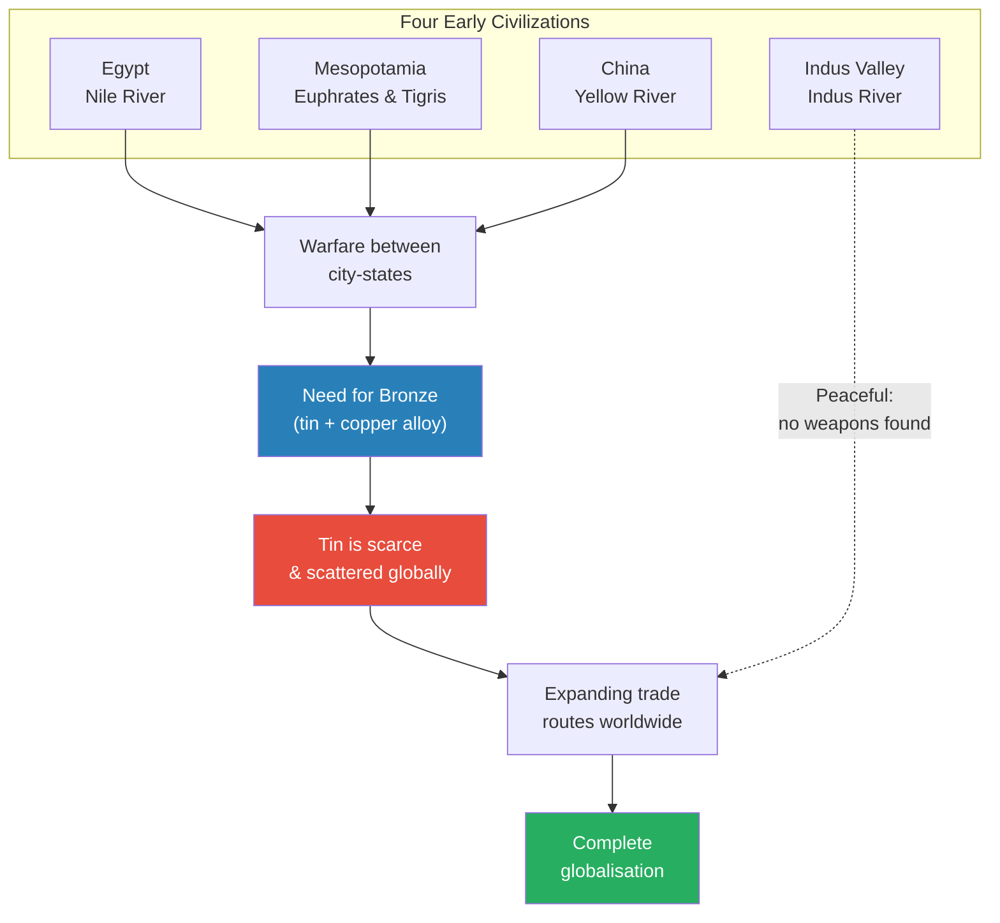
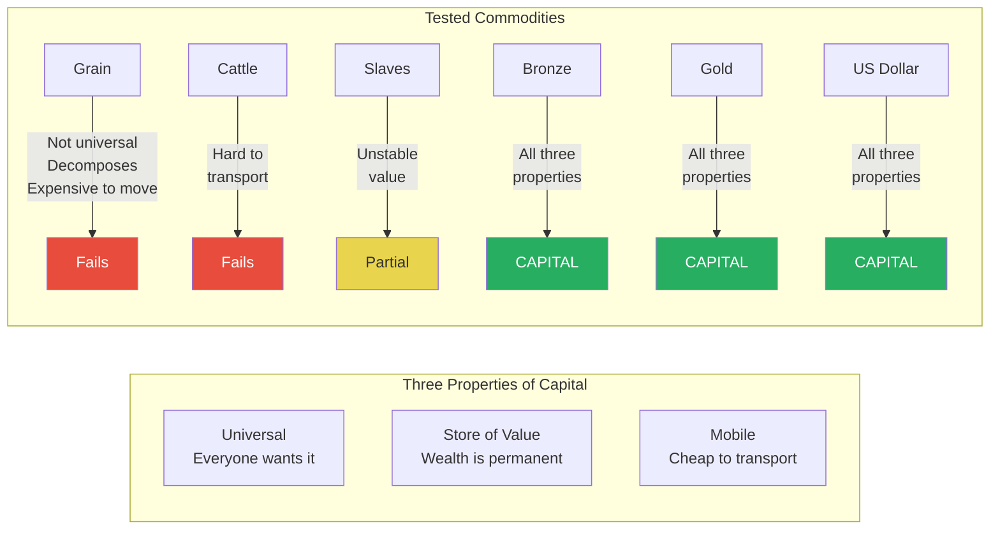
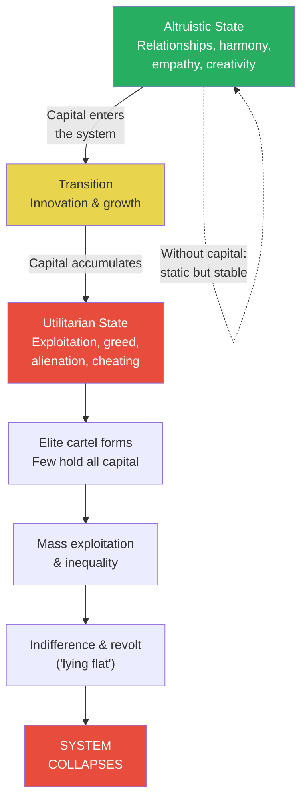
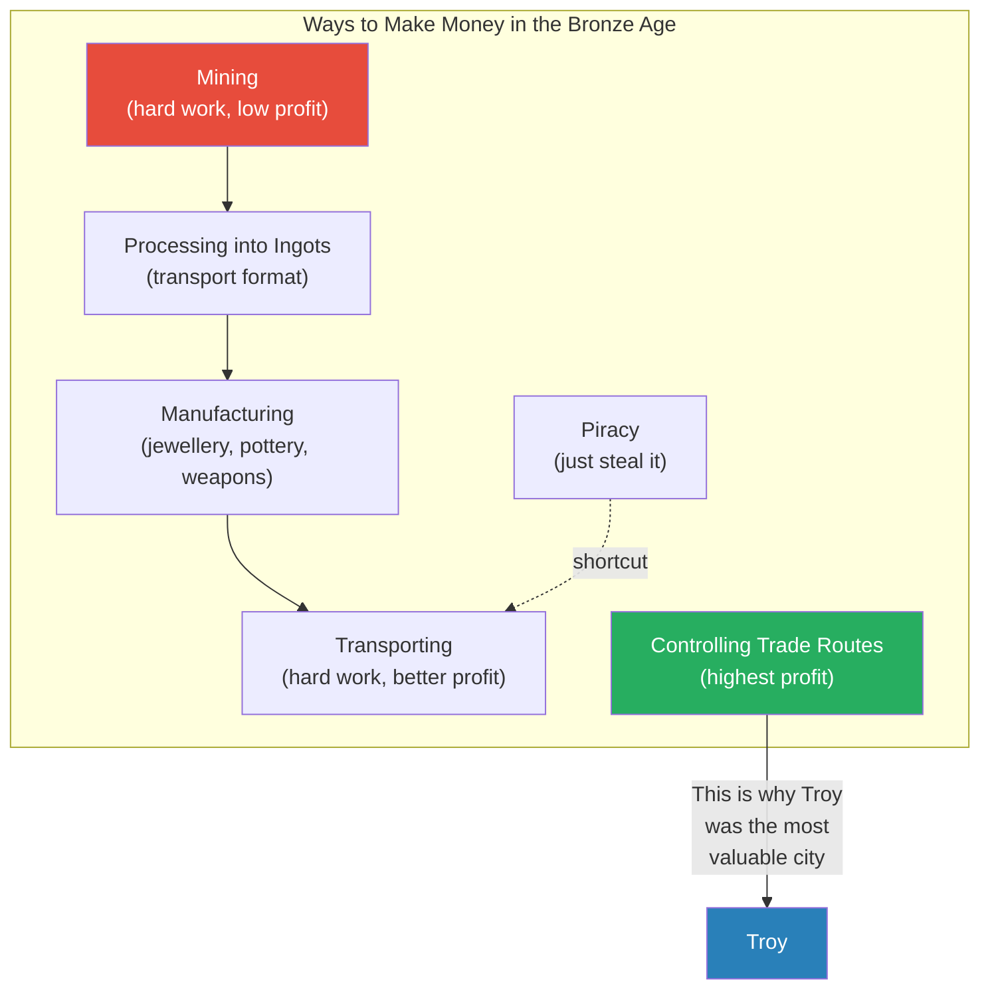
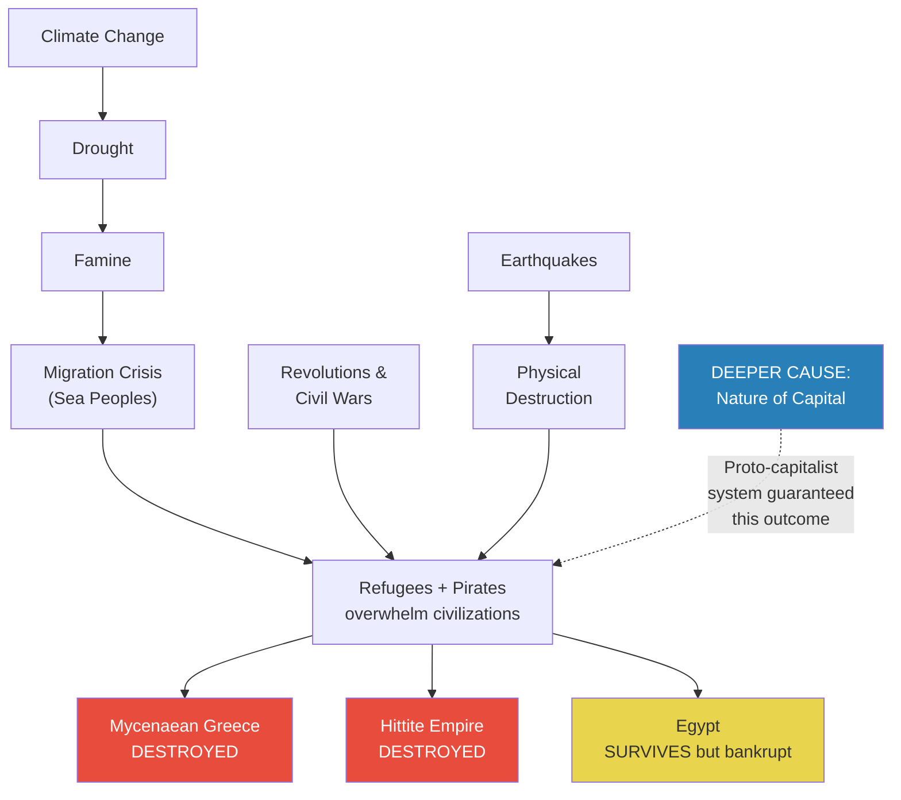
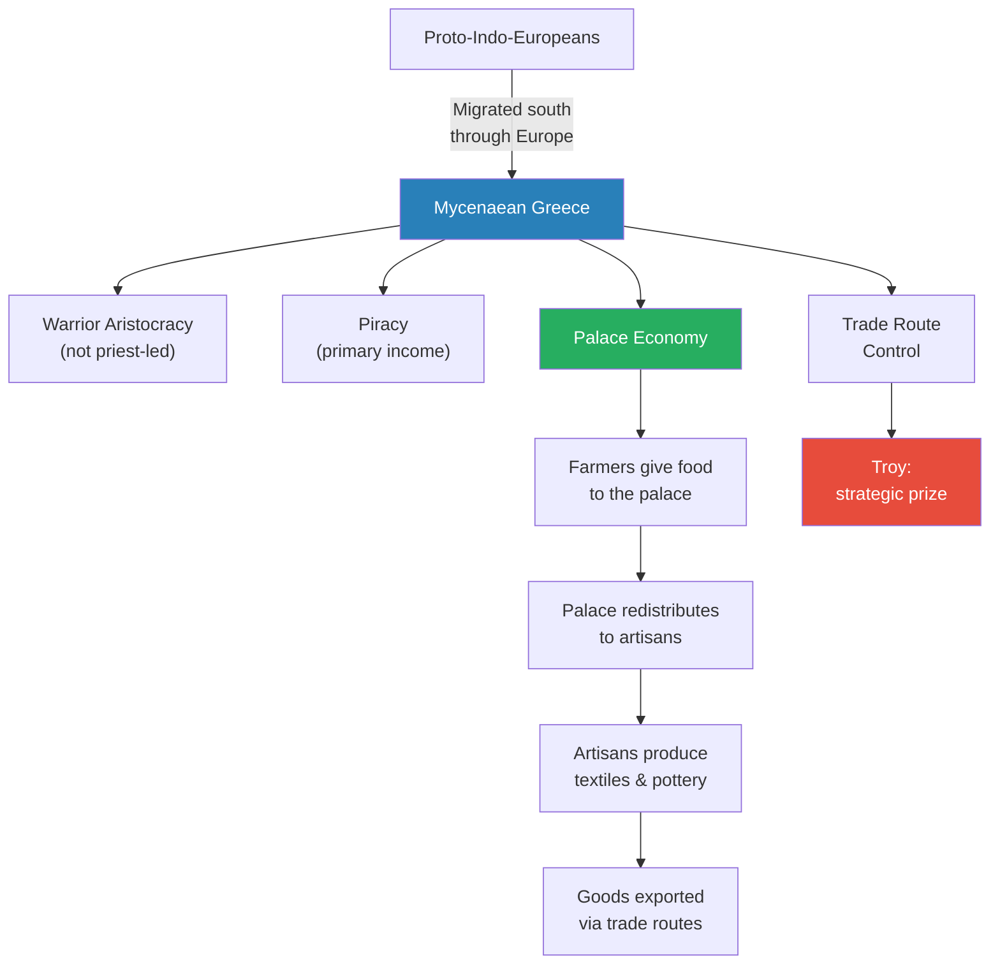
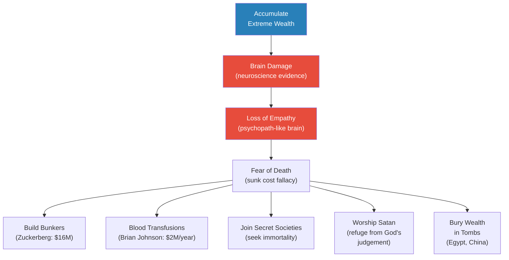
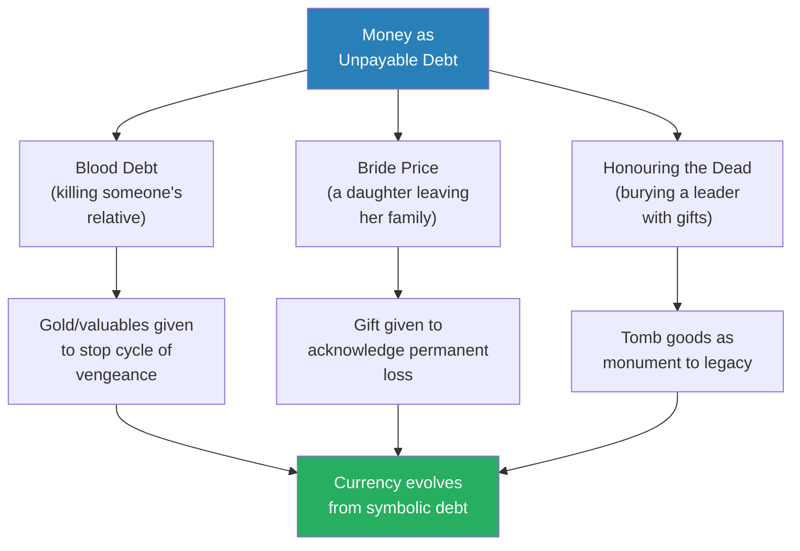
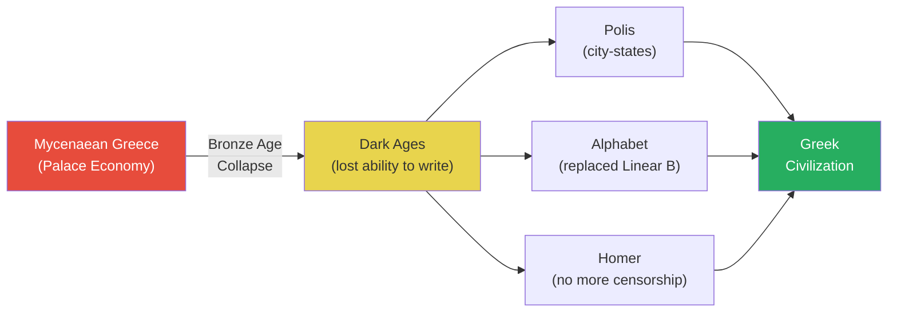

# Capital and the Bronze Age Collapse

> Prof. Jiang argues that the Bronze Age collapse around 1200 BCE was not simply a perfect storm of crises — climate change, famine, earthquakes, migration — but a structural consequence of the world's first proto-capitalist system. Bronze became the first true universal currency: universally desired, a store of value, and mobile. This drove rapid globalisation across four civilizations connected by tin and copper trade routes stretching from China to Scandinavia. But capital's internal logic — exploiting, alienating, and consolidating wealth into fewer hands — guaranteed that the system would eventually destroy itself. Prof. Jiang draws a direct line from the Bronze Age to pre-WWI Europe to our own globalised world, warning that the same dynamics are at work today.

---

## Overview: Key Highlights

- <b style="color: #27ae60">Capital, not climate, is the root cause of collapse</b> — the Bronze Age world was a proto-capitalist system, and capital drives both rapid growth and inevitable destruction
- <b style="color: #2980b9">Three properties of capital</b> — universality (everyone wants it), store of value (wealth can be held in it), and mobility (it can be transported cheaply)
- <b style="color: #e74c3c">Bronze Age globalisation mirrors our own</b> — a heavily interconnected trading world that collapses suddenly, just as the pre-WWI world did
- <b style="color: #2980b9">The four early civilizations</b> — Egypt, Mesopotamia, Indus Valley, and China, all connected by river systems that enabled agriculture and trade
- <b style="color: #27ae60">Tin scarcity drove globalisation</b> — tin deposits were scattered worldwide, forcing civilizations to build ever-expanding trade networks
- <b style="color: #e74c3c">Capital shifts humans from altruistic to utilitarian</b> — at first this drives innovation, but eventually it produces exploitation, inequality, and collapse
- <b style="color: #2980b9">David Graeber's theory of debt</b> — money originated not as a medium of exchange but as a way to symbolise debts that could never be repaid
- <b style="color: #27ae60">The Indus Valley was peaceful and egalitarian</b> — no weapons found in archaeology, advanced hygiene, equal housing — a deliberate rejection of the war-driven system
- <b style="color: #e74c3c">The Sea Peoples were refugees, not conquerors</b> — climate-driven famine created a migration crisis that overwhelmed existing civilizations
- <b style="color: #2980b9">Troy's strategic importance</b> — controlling trade routes was the most profitable activity in the Bronze Age, making Troy the most valuable city in the world
- <b style="color: #e74c3c">Capital causes literal brain damage</b> — neuroscience shows that excessive wealth and power erode the brain's capacity for empathy
- <b style="color: #27ae60">Collapse creates opportunity</b> — the Bronze Age collapse gave rise to Greek civilization, the alphabet, city-states, and Homer

| Concept | One-line summary |
|---------|-----------------|
| **Capital** | Any commodity that is universal, stores value, and is mobile — bronze was the first true example |
| **Proto-capitalism** | The Bronze Age economic system that mirrors modern capitalism in structure and dynamics |
| **Universality** | The first property of capital — everyone in the world wants it and believes it has value |
| **Store of value** | The second property — wealth can be held inside the commodity without degrading |
| **Mobility** | The third property — the commodity can be transported at little or no cost |
| **Altruistic vs. utilitarian nature** | Humans have two sides; capital pushes societies from the altruistic toward the utilitarian |
| **Sea Peoples** | Refugees fleeing famine who, allied with pirates, overwhelmed Bronze Age civilizations around 1200 BCE |
| **Palace economy** | Mycenaean centralised system where farmers gave food to the palace, which redistributed it to artisans |
| **Ingots** | Standardised blocks of tin and copper used for transport across trade networks |
| **David Graeber's debt theory** | Money was invented to represent debts too large to repay: blood debts, bride prices, and honouring the dead |
| **BMAC culture** | Bactria-Margiana complex in North Afghanistan, a trade node that later gave rise to Zoroastrianism and Hinduism |
| **Eric Cline** | Archaeologist who catalogued the "perfect storm" of crises behind the Bronze Age collapse |

---

# The Lecture

## The Bronze Age World: Four Civilizations and the Need for Bronze [0:00 - 3:30]

*Prof. Jiang opens with a review of where we stand in history. He maps four early civilizations — Egypt, Mesopotamia, Indus Valley, and China — and explains how the need for bronze weaponry drove the first wave of globalisation.*

*The four river-based civilizations needed bronze for warfare. Because tin was scattered across the globe, they had to build ever-expanding trade routes — until the entire world was interconnected.*

> [!note]- Expand: Full Lecture Detail
> - Prof. Jiang begins by placing the class in historical context: four early civilizations — Egypt, Mesopotamia, Indus Valley, and China — each built around major rivers that enabled both agriculture and overseas trade
> - Each civilization developed a major city with colonies along its river system:
>   - Egypt: the Nile
>   - Mesopotamia: the Euphrates and Tigris, with Uruk as the first major city
>   - China: the Yellow River
>   - Indus Valley: the Indus River
> - These city-states went to war to control trade routes, and <b style="color: #2980b9">warfare drove innovation</b> — the arms race produced better and better equipment
> - Eventually they developed <b style="color: #2980b9">bronze</b>, an alloy of tin and copper — the strongest metal of the era, ideal for shields, armour, and swords
> - Prof. Jiang states the key problem: "Tin is actually hard to mine and to discover and to manufacture"
> - Tin deposits are scattered across the world — not concentrated in any one area
> - This forced civilizations to build more and more trade routes to access tin sources
> - The major nodes along these trade routes became cities themselves
> - <b style="color: #27ae60">The world became globalised in order to facilitate warfare</b>
> - The Indus Valley stands apart: archaeology has found bronze but no weapons — Prof. Jiang characterises it as "a peaceful, egalitarian and artistic civilization" drawn into the global system not by war but by trade
> - Over time, bronze shifted from weaponry to status symbols — pottery, jewellery — and eventually became <b style="color: #2980b9">capital</b> itself

---

## What Is Capital? Three Properties [3:30 - 9:58]

*Prof. Jiang defines capital through three essential properties — universality, store of value, and mobility — and tests various commodities against these criteria, showing why bronze was the first true currency and why the US dollar is its modern equivalent.*

> [!tip] Core Insight
> Capital is not just "money." It is any commodity that is universally desired, permanently stores value, and can be moved cheaply. Bronze was the first thing in human history to satisfy all three — and its emergence made globalisation inevitable.

*Prof. Jiang tests each commodity against the three criteria. Only bronze, gold, and the US dollar pass all three — everything else fails on at least one dimension.*

> [!note]- Expand: Full Lecture Detail
> - Prof. Jiang introduces <b style="color: #2980b9">capital</b> with a precise three-part definition:
>   - **Universality:** everyone in the world wants it and believes it has value
>   - **Store of value:** you can take wealth and store it inside this commodity — it does not decay or lose worth
>   - **Mobility:** you can transport it somewhere else at little or no cost
> - If a commodity has all three, it is capital. He then tests examples:
> - **Grain:** sort of universal (everyone eats), but not everyone considers it valuable. Decomposes easily. Expensive to transport relative to its value. "That's why grain never became capital"
> - **Cattle:** better — you can store more value, and it is fairly universal. But cattle are hard to transport. "That's why cattle never became capital"
> - **Slaves:** a step further — sort of universal, mobile, but the value is "uncertain or unstable." Slaves created an economy, but "a very basic, basic economy"
> - **Bronze:** <b style="color: #27ae60">"extremely valuable, everyone wants it, you can store a lot of value in it because it's hard to make, and now you can move it around"</b>
>   - Bronze became the first real universal currency — and this enabled rapid globalisation
> - Prof. Jiang draws the modern parallel: the US dollar serves exactly the same function today — universal, a store of value, and mobile
> - He makes the structural claim: "Bronze was a major discovery which allowed for globalisation" — just as the dollar allows for modern globalisation

---

## Capital and Human Nature: Altruism vs. Utilitarianism [9:58 - 15:00]

*Prof. Jiang introduces his theory of how capital transforms human behaviour — shifting societies from altruistic relationships to utilitarian exploitation, driving growth and then guaranteeing collapse.*

> [!tip] Core Insight
> Capital drives a psychological shift: it moves leaders from caring about relationships and reputation to seeing people as commodities. At first this produces growth and innovation. Then it produces cartels, exploitation, inequality — and collapse.

*The arc from altruism to utilitarianism is not a moral failing — Prof. Jiang presents it as a structural inevitability of any system that adopts capital.*

> [!note]- Expand: Full Lecture Detail
> - Prof. Jiang argues that humans have <b style="color: #2980b9">two natures</b>: altruistic and utilitarian
>   - **Altruistic:** you care about relationships, empathy, being liked, belonging to community
>   - **Utilitarian:** you care about goals, profit, power, outcomes
> - He illustrates with a restaurant analogy: when you eat out, you pay and tip (utilitarian). When your mother cooks for you, you say thank you (altruistic). Mixing the two — tipping your mother or just thanking the waitress — "would screw everything up"
> - <b style="color: #27ae60">Capital is the mechanism that shifts societies from altruistic to utilitarian</b>
> - In an altruistic system without capital:
>   - People care about harmony and status within the group
>   - The system resists change — outsiders and innovators may even be killed as threats
>   - "It kind of sucks to be an outsider. It kind of sucks to stand out"
>   - Static, but stable
> - When capital enters:
>   - People become motivated to work hard, innovate, and explore
>   - The system grows rapidly
>   - "At first this is good"
> - But then the scale tips:
>   - <b style="color: #e74c3c">People become too utilitarian — they cheat, exploit, and stop caring about others</b>
>   - Leaders form cartels and align with other leaders to exploit the population
>   - They expand outward looking for new areas to conquer — "all they care about now is money"
> - The endgame: a few people hold all the capital, the people below are enslaved and exploited
>   - They become indifferent — "they will revolt against you, so the system must collapse"
> - Prof. Jiang states his central thesis directly: "This is the way capital works, and there's nothing you can do about it. That's why the Bronze Age grew, but that's also why the Bronze Age collapsed, and that's why our world grew, but this is also why our world will collapse as well"

---

## The Bronze Age Trade Network: Evidence from Shipwrecks [15:00 - 20:00]

*Prof. Jiang presents the archaeological evidence for Bronze Age globalisation — shipwrecks, tin sources in remote mountains, trade routes stretching from Egypt to Scandinavia — and explains why controlling trade routes was more profitable than mining, manufacturing, or even piracy.*

*The real money was not in producing bronze but in controlling the routes it travelled. This is why Troy — sitting at the gateway between the Aegean and the Black Sea — was worth fighting a war over.*

> [!note]- Expand: Full Lecture Detail
> - Prof. Jiang shows how copper sources were plentiful but <b style="color: #e74c3c">tin sources were scattered in remote mountain locations</b>
> - This forced civilizations to build ever-expanding trade networks:
>   - The earliest routes (dark brown on his map) expanded outward over centuries
>   - Later routes (pink) reached Britain, Ireland, and Scandinavia
>   - "Recent research has shown us that it's all interconnected"
> - Evidence comes from shipwrecks discovered over the past 200 years:
>   - The Uluburun shipwreck off the coast of Turkey is a famous example
>   - By analysing the origins of pottery and goods aboard, scholars can reconstruct trade networks
> - In Europe, rivers were the primary transport system — which is why the entire continent was drawn into the network
> - Prof. Jiang presents a hierarchy of economic activity in the Bronze Age:
>   - Mining: "It sucks because it's hard work and you don't make that much money"
>   - Processing into ingots: standardised transport format for tin and copper
>   - Manufacturing jewellery, pottery, and weapons: higher value
>   - Transporting: hard work but more profitable
>   - Piracy: a shortcut — just steal it
>   - <b style="color: #27ae60">Controlling trade routes: "the best way to make real money"</b>
> - This is why Troy was the most strategically important city in the Bronze Age — it controlled access to the Aegean Sea
> - Prof. Jiang connects this to the modern world: "Even today, the Middle East is so important because the Middle East is a centre of all global trade"
> - <b style="color: #2980b9">Empires in the Bronze Age were not nation-states</b> — they were collections of aligned trading points. "War was just a trade war, that's all it was"

---

## The Collapse: Sea Peoples and the Perfect Storm [20:00 - 24:00]

*Prof. Jiang describes the catastrophic collapse around 1200 BCE — refugees fleeing famine allied with pirates overwhelming civilizations from the Mycenaeans to the Hittites to Egypt — and introduces Eric Cline's "perfect storm" thesis before arguing that the deeper cause is the nature of capital itself.*

*Eric Cline lists the surface causes — climate, famine, earthquakes, migration, civil war. Prof. Jiang argues these are symptoms of a deeper structural cause: the proto-capitalist system had reached its terminal phase.*

> [!note]- Expand: Full Lecture Detail
> - In about 50 years, starting around 1200 BCE, the entire globalised Bronze Age world collapsed
> - Prof. Jiang presents the evidence from Egyptian records — the Egyptians wrote about the coming of the <b style="color: #2980b9">Sea Peoples</b>
>   - These were refugees fleeing famine, teaming up with pirates
>   - Together they overwhelmed existing civilizations
>   - Three major invasions of Sea Peoples hit Egypt — "We're talking like 100,000 people attacking Egypt at the same time"
> - Civilizations destroyed:
>   - Mycenaean Greece — "the people who invaded Troy during the Trojan War were pirates"
>   - The Hittite Empire in Anatolia (modern Turkey)
>   - Egypt survived the invasions but was left bankrupt and lost its global power status
>   - The Indus Valley was overwhelmed by refugees from the steppes
> - <b style="color: #e74c3c">Mesopotamia was the most resilient</b> — because it had always been at war. With no natural geographic protection (unlike Egypt's deserts or China's boundaries), it was flat, easily invaded, and constantly contested. Three empires rotated: Akkadian, Babylonian, Assyrian — none lasted more than a couple of hundred years. "Because it's so competitive, it's actually much more resilient"
> - Prof. Jiang introduces Eric Cline, archaeologist at the University of Washington, who wrote *1177 B.C.* and listed the "perfect storm" of crises: climate change, drought, famine, earthquakes, revolutions, civil wars, migration
> - But Prof. Jiang's argument goes further: "Yes, it collapsed because of a perfect storm of crises. That's what you know. But I want to extend this and say it has to do with the fact that it was a proto-capitalistic system"
> - He draws the parallel to pre-WWI Europe: "The world was heavily, heavily globalised. People thought that because of trade, because of prosperity, we can't go to war. And then a couple years later, World War One, where tens of millions of people died for no reason"
> - <b style="color: #e74c3c">"If you look at the Bronze Age collapse and World War One, we are in a very similar situation"</b>
>
> > [!example] The Pre-WWI Parallel
> > - Before 1914, the world was heavily globalised — extensive trade, interconnected economies, widespread prosperity
> > - Educated people believed war was impossible because it would destroy everyone's wealth
> > - Within a few years, tens of millions died in the most devastating conflict in history to that point
> > - The same logic applied to the Bronze Age: extreme globalisation did not prevent collapse — it guaranteed it
> > **The lesson:** Globalisation and prosperity do not prevent catastrophic collapse. The very interconnections that create wealth create fragility.

---

## The Indus Valley: A Peaceful Counter-Example [24:00 - 30:00]

*Prof. Jiang examines the Indus Valley Civilization as the anomaly within the Bronze Age world — peaceful, egalitarian, religious, and advanced, with no evidence of warfare. He speculates it deliberately rejected the war-driven system of its neighbours.*

> [!note]- Expand: Full Lecture Detail
> - The Indus Valley Civilization (in modern-day Pakistan) was the only one of the four major civilizations that was not engaged in warfare
> - Archaeological evidence:
>   - Bronze was found, but no weapons
>   - Housing was remarkably equal — no palaces towering over slums
>   - Advanced irrigation and hygiene systems
>   - "Very much similar to Çatalhöyük" — the Neolithic site discussed in earlier lectures
> - Prof. Jiang speculates: "I think it was because they were able to trade with Mesopotamia, China and Egypt, and discovered we don't want the system. We don't want a system where everyone's killing each other"
>   - He immediately adds: "That's my guess, but I don't know. No one knows"
> - Despite its peace, the Indus Valley was drawn into the global trade network — not by war, but by the universal demand for bronze
> - The Indus Valley also gave rise to the <b style="color: #2980b9">BMAC culture</b> (Bactria-Margiana Archaeological Complex) in North Afghanistan
>   - Developed around tin mining and trade routes in the mountains
>   - A mining town, but also manufacturing, transportation, and trade hub
>   - Over time, the BMAC brought proto-Indo-Europeans from the steppes
>   - When the Bronze Age collapsed and climate changed, these people moved into modern Iran and India
>   - This gave rise to two major religions: <b style="color: #2980b9">Zoroastrianism</b> and <b style="color: #2980b9">Hinduism</b>

---

## Mycenaean Greece: Warrior Pirates and the Palace Economy [30:01 - 37:00]

*Prof. Jiang turns to Mycenaean Greece — a warrior aristocracy descended from proto-Indo-Europeans, famous for piracy, controlling Mediterranean trade, and operating a centralised palace economy. Their wealth and elaborate tombs reveal a civilization at the peak of Bronze Age prosperity.*

*The Mycenaean economy was a command-and-control system centred on the palace. All agricultural surplus flowed inward; manufactured trade goods flowed outward. Piracy and trade route control — especially Troy — were the real sources of wealth.*

> [!note]- Expand: Full Lecture Detail
> - The Mycenaean civilization is crucial because it gives rise to Greek civilization — "considered the birthplace of all Western civilization"
> - Key characteristics:
>   - A <b style="color: #2980b9">warrior aristocracy</b>, unlike Sumer which was led by priests — "the people in charge are warriors"
>   - Descendants of the proto-Indo-Europeans who swept through Europe
>   - Located at the centre of Mediterranean trade
> - The easiest way to get around the Mediterranean was by sea — land was costly, slow, and plagued by bandits
> - "In this system, the best way to make money is actually piracy"
>   - The Greek islands provided perfect bases for pirates
>   - "The Mycenaeans were famous for being pirates"
>   - "The people who invaded Troy during the Trojan War were pirates"
> - The <b style="color: #2980b9">palace economy</b>:
>   - A centralised command-and-control system
>   - All farmers gave their food to the palace
>   - The palace redistributed food to artisans who made pottery, clothing, and textiles for trade
>   - "A very simple economy. Very effective. It was extremely wealthy"
> - Evidence of extreme wealth:
>   - Gold death masks — one speculated to be the Mask of Agamemnon (though Prof. Jiang notes "we actually don't know who this is")
>   - Gold-hilted swords — "even the warriors had gold"
>   - The Lions Gate entrance to Mycenae
>   - Increasingly elaborate tombs over time — "So we know that over time they became a much more wealthy civilization"
> - The Mycenaeans learned elaborate tomb-building from the Egyptians, with whom they were in close contact

---

## Capital and the Brain: Why Wealth Makes You Crazy [37:00 - 42:00]

*Prof. Jiang presents his most provocative argument: that excessive wealth literally changes the brain. He cites neuroscience showing that power causes brain damage, uses the thought experiment of Satan's bargain, and argues that the wealthy's obsession with immortality — from Egyptian tombs to modern bunkers — is a direct consequence of capital's psychological effects.*

> [!tip] Core Insight
> The wealthy bury themselves with treasure not because they believe they can take it to the afterlife, but because capital has changed their brain chemistry. Power erodes empathy. The richer you become, the more desperate you are to preserve what you have — even at the cost of your humanity.

*Prof. Jiang traces a direct line from excessive wealth to brain damage to the desperate pursuit of immortality — a pattern visible in Egyptian tombs, Chinese terracotta armies, and modern billionaire bunkers alike.*

> [!note]- Expand: Full Lecture Detail
> - Prof. Jiang poses a question about the elaborate tombs of Egypt and China: "You can't take your money with you, so why are you burying your money with you?"
>   - The Terracotta Warriors of Qin Shi Huang: "Why is he buried with an army and such wealth? That makes no sense"
> - His answer: "Money, capital — too much of it changes the fundamental chemistry of the brain. It makes you crazy"
> - He presents <b style="color: #e74c3c">Satan's thought experiment</b> in two rounds:
>   - **Round 1:** Satan offers a billion dollars, but you must be his slave forever. Answer: No. A billion is not worth eternal slavery
>   - **Round 2:** You already have $10 billion. Satan offers immortality in exchange for eternal slavery. Answer: Yes. Because you cannot bear to lose what you already have
>   - "That's the difference. Money makes people crazy"
> - He cites neuroscience research from *The Atlantic Monthly*:
>   - Brain scans show that <b style="color: #e74c3c">power causes brain damage</b>
>   - The brain of a psychopath and the brain of a wealthy person look "pretty similar"
>   - "If you're too powerful, too wealthy, you don't have the capacity to have empathy"
>   - He names Elon Musk and Mark Zuckerberg as examples: "They have actually no concept of empathy"
> - He profiles Brian Johnson, a millionaire spending $2M/year on anti-aging:
>   - Blood transfusions, extreme exercise routines, obsessive health monitoring
>   - "His life sucks. The question you have to ask yourself is, you have so much money, why don't you enjoy it?"
>   - "He looks like a vampire now"
> - Prof. Jiang lists what billionaires do out of desperation:
>   - Invest in anti-aging research
>   - Build bunkers (Zuckerberg's $16M Hawaiian bunker)
>   - Join secret societies seeking immortality
>   - <b style="color: #e74c3c">Worship Satan</b> — because they fear God's judgement for how they acquired their wealth
>
> > [!example] Satan's Bargain: The Thought Experiment
> > - Satan enters the room and offers everyone a billion dollars — but they must serve him as slaves for all eternity
> > - Everyone refuses — a billion is not worth eternal enslavement
> > - Now imagine you already have $10 billion. Satan offers to let you keep it and live forever — but you must serve him eternally
> > - Everyone agrees — because losing $10 billion and dying feels worse than servitude
> > - The difference between the two scenarios is not about Satan — it is about what wealth does to your brain
> > - "You see what has happened? Money makes people crazy"
> > **The lesson:** Capital creates a sunk cost trap. The more you accumulate, the more terrified you become of losing it — until you will sacrifice anything, including your soul, to preserve it.

---

## David Graeber and the Origin of Money [38:00 - 42:00]

*Prof. Jiang introduces anthropologist David Graeber's theory from Debt: money was not invented as a medium of exchange but as a way to represent debts too large to repay — blood debts, bride prices, and honouring the dead.*

*Money did not begin as a convenient way to buy things. It began as a way to make peace with debts that could never truly be settled — murder, marriage, and death.*

> [!note]- Expand: Full Lecture Detail
> - Prof. Jiang introduces <b style="color: #2980b9">David Graeber</b>, an anthropologist, and his book *Debt*
> - Graeber's core argument: "Money, for most of human history, signified a debt that could not be paid off"
> - Most human interactions are reciprocal — "you help me, I help you"
> - But three types of debt cannot be settled reciprocally:
>   - **Blood debt:** "If I kill your brother, you come kill me, my family kills you — a vicious cycle of vengeance." Money breaks the cycle by acknowledging the unpayable debt with something valuable
>   - **Bride price:** "If a woman marries into your family, you've taken away my daughter." A gift of gold, cattle, or other valuables acknowledges this permanent loss
>   - **Honouring the dead:** "If a great person in the community dies — a great leader, priest, or person — you bury him with gifts." Not because he can take them to the afterlife, but as "a monument to his legacy"
> - <b style="color: #27ae60">This is why ancient graves contain gold</b> — the community is acknowledging that this person's contribution can never be repaid
> - Over time, as societies became more sophisticated, these symbolic debt-objects evolved into currencies
> - Prof. Jiang evaluates historical currencies against the three criteria of capital:
>   - Seashells, cattle, grain, women, drugs, oil — all fail on at least one dimension (universality, store of value, or mobility)
>   - Bronze passes all three
>   - Gold passes all three
>   - The US dollar passes all three
> - "Once you have a universally accepted currency, you can now have globalisation"

---

## Capital as System Poison: Exploitation, Alienation, Collapse [42:04 - 48:00]

*Prof. Jiang summarises his core argument about capital's destructive logic — how it monetises power, exploits people, alienates leaders from their humanity, and consolidates wealth until the system tears itself apart. He connects this to modern phenomena like "lying flat" and "quiet quitting."*

> [!note]- Expand: Full Lecture Detail
> - Prof. Jiang states it bluntly: "Capital is just a monetisation of power. That's all it is"
> - The three poisons of capital:
>   - <b style="color: #e74c3c">It exploits</b> — once capital exists, a leader sees each person as a commodity rather than a community member
>   - <b style="color: #e74c3c">It alienates</b> — the leader becomes alienated from their own humanity and from others
>   - <b style="color: #e74c3c">It consolidates</b> — over time, the strongest accumulate all the capital, leading to massive inequality
> - "The only result of capitalism is: massive inequality, corruption, immorality, alienation, anger, indifference — and this is the world we live in today"
> - He revisits the altruistic/utilitarian framework:
>   - Altruistic: relationships, empathy, creativity
>   - Utilitarian: material objectives, logic, hard work
>   - "People who are altruistic tend to be more creative. People who are obsessed with money tend to work harder"
> - The endgame: "Eventually you reach a point where a few people have all the money, and everyone's like, screw this, I give up, because I'm never going to be rich"
>   - He names the modern terms: <b style="color: #2980b9">tang ping</b> (lying flat) and <b style="color: #2980b9">quiet quitting</b>
> - He returns to the neuroscience: power causes brain damage
>   - Brain scans show wealthy/powerful people lose the capacity for empathy
>   - Their brains resemble those of psychopaths
>   - "A normal person is able to have empathy, to understand the feelings of others. If you're too powerful, too wealthy, you don't have the capacity"

---

## The Satanist Tangent: Why the Wealthy Worship Evil [48:00 - 52:00]

*A student asks why the wealthy worship Satan. Prof. Jiang explains it as a logical endpoint of capital's psychological effects — the wealthy fear God's judgement for what they did to accumulate their fortune, so they seek refuge in an alternative spiritual power.*

> [!note]- Expand: Full Lecture Detail
> - A student asks directly: "Why do they worship Satan?"
> - Prof. Jiang's answer: "It's really desperation"
> - The logic chain:
>   - Religion teaches that wealth is morally suspect
>   - God will judge you when you die
>   - "God is going to ask you, hey, why do you have so much money? And you're like, well, I stole this money, and I hurt a lot of people, and I cheated, I lied"
>   - You know what you did to get that money — even if others do not, you do, and God does
>   - So you seek someone "more powerful than God, or at least someone who you can find refuge in from God"
>   - <b style="color: #e74c3c">"If it means going to hell, you prefer going to hell than facing judgement from God"</b>
> - Prof. Jiang connects this to a broader historical pattern: "The religion of Satan became so popular in order to solve this problem"
> - He frames it within the course's recurring theme: wealthy people want the world to stay the same, but "it is impossible for the world to stay the way it is. Change is a constant. Things move in cycles. Capitalism gives rise to wealth, but it also destroys wealth. That's just the nature of life"

---

## Collapse as Opportunity: The Birth of Greek Civilization [52:00 - End]

*Prof. Jiang closes by arguing that the Bronze Age collapse, while devastating, created the conditions for Greek civilization — the polis, the alphabet, and Homer — which he calls the greatest civilization in human history. Collapse is not just destruction; it is the precondition for renewal.*

*Three transformations during the Dark Ages — political (palace to polis), linguistic (Linear B to alphabet), and cultural (censorship to Homer) — together produced the foundation of Western civilization.*

> [!note]- Expand: Full Lecture Detail
> - The Bronze Age collapse will give rise to Greek civilization — "which we believe to be the basis for Western civilization"
> - Three critical transitions occur during the "Dark Ages" (a period where Greeks lost the ability to write):
>   - **Political:** The centralised palace economy transforms into the <b style="color: #2980b9">polis</b> — independent city-states competing against each other. "This is where we get the word politics from"
>   - **Linguistic:** The writing system changed from Linear B to the <b style="color: #2980b9">alphabet</b>
>   - **Cultural:** Without centralised bureaucrats controlling expression, censorship disappeared. A new figure emerged: <b style="color: #2980b9">Homer</b>
> - Under the palace economy, "bureaucrats control what is talked about, what is expressed — they censure and centralise content. They basically create propaganda"
> - Without that control, creative expression flourished
> - Prof. Jiang makes his concluding argument: "These three things together become the basis for Greek civilization, and this is why the Greeks became the greatest civilization ever in human history"
> - The final lesson: <b style="color: #27ae60">"Collapse is bad, but collapse also gives opportunity for a new civilization to arise, for a new man to emerge"</b>
> - He previews next class: the birth of Greek civilization and the Iliad

---

## Connections

**Builds on:** [[14 - Legacy of the Steppes]] (proto-Indo-Europeans who became the Mycenaeans), [[12 - Heaven on Earth]] (Çatalhöyük parallels to Indus Valley)
**Sets up:** [[16 - The Big Bang of Greek Civilization]] (the polis, Homer, and the alphabet emerge from collapse)
**Related books in vault:** [[Sapiens - Yuval Noah Harari]] (agricultural revolution, currency as shared fiction), [[Debt - David Graeber]] (origins of money as unpayable debt)
**Related lectures:** [[01 - How Power Works]] (paradigms, money creation), [[02 - How Societies Collapse]] (Turchin's elite overproduction, financialisation)

---

## The Takeaway

The Bronze Age collapse is not a story about bad luck — climate change, earthquakes, and migration crises happening to hit simultaneously. Prof. Jiang reframes it as the inevitable structural consequence of the world's first proto-capitalist system. Bronze satisfied all three requirements of capital (universal, stores value, mobile), which made globalisation both possible and unstoppable. But the same force that drove rapid expansion also drove rapid collapse: capital shifts human nature from altruistic to utilitarian, consolidates wealth into fewer hands, and eventually produces a population that is either exploiting or being exploited, with nothing left in between.

The most striking claim in this lecture is not historical but neurological: that excessive wealth literally damages the brain, eroding the capacity for empathy until the wealthy become functionally psychopathic. Prof. Jiang uses this to explain everything from Egyptian burial practices to Mark Zuckerberg's Hawaiian bunker to the rise of Satanism among elites — all symptoms of capital's terminal stage, where the powerful will do anything to preserve what they have, including abandoning their humanity.

The lecture ends with a note of paradoxical hope. The Bronze Age collapse was catastrophic, but it destroyed the centralised palace economy and its censorship apparatus. In the ruins, three things emerged that would not have been possible under the old system: city-states (the polis), a new writing system (the alphabet), and creative freedom (Homer). The lesson Prof. Jiang wants his students to carry forward is that collapse is not just an ending — it is a precondition for the emergence of something genuinely new.
