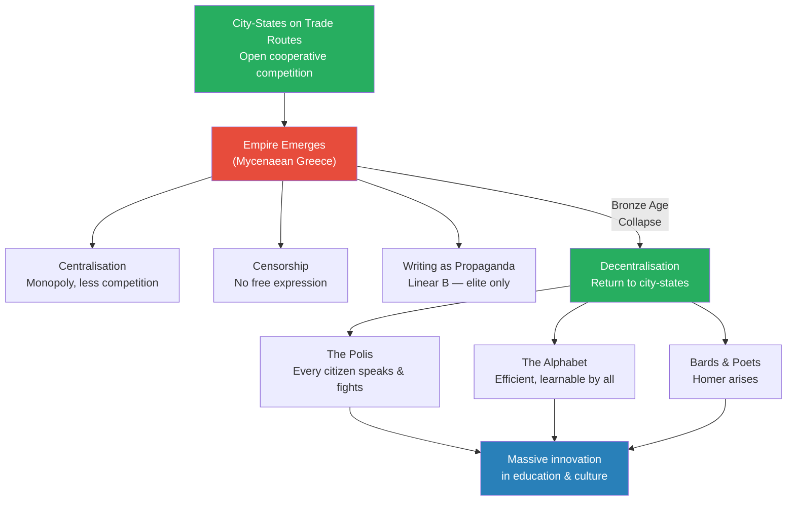
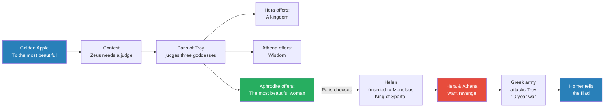
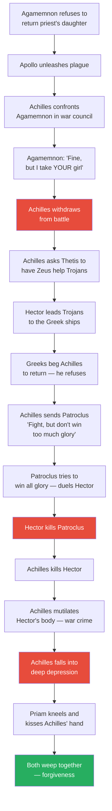
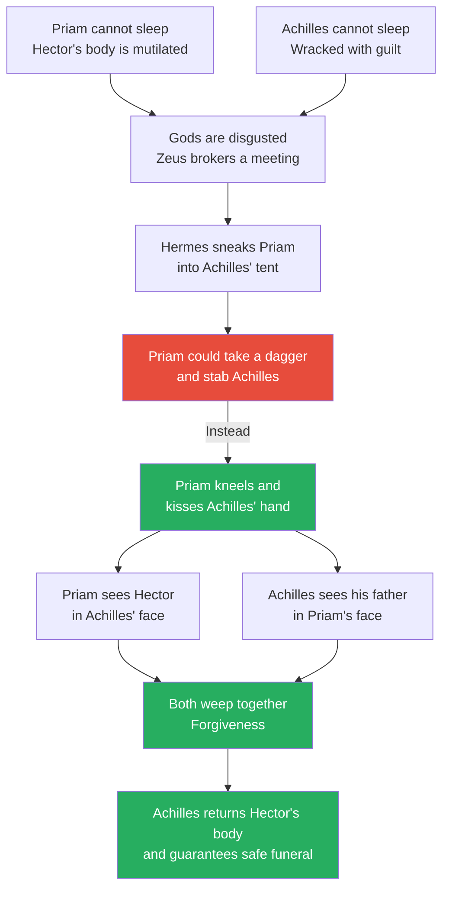
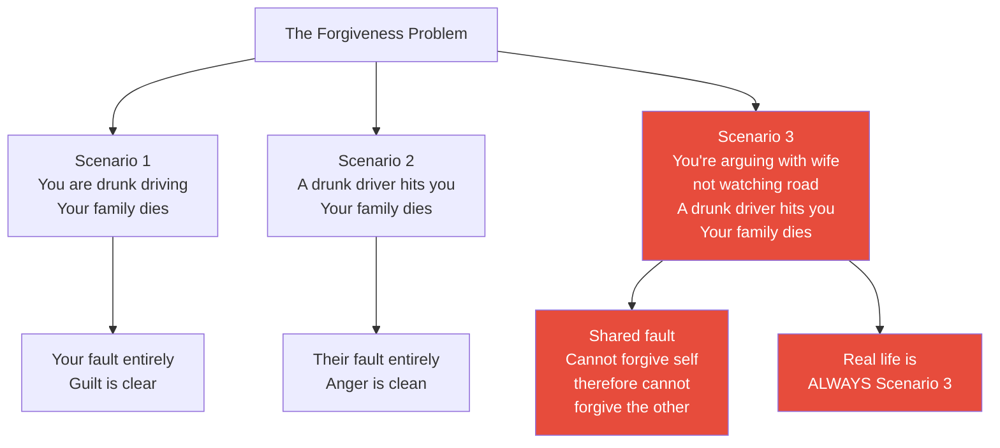
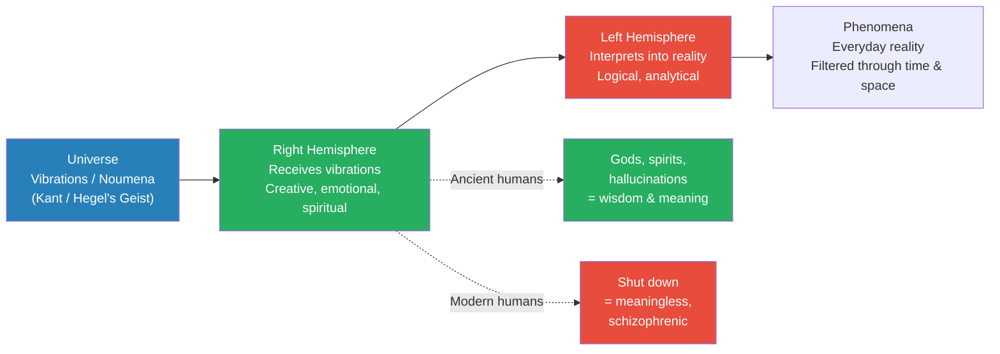
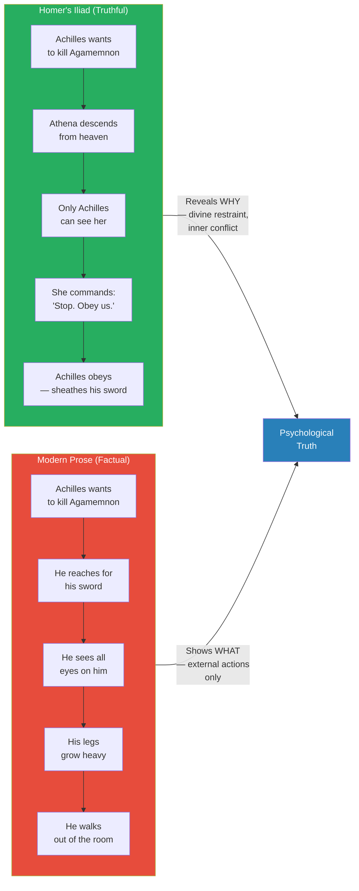
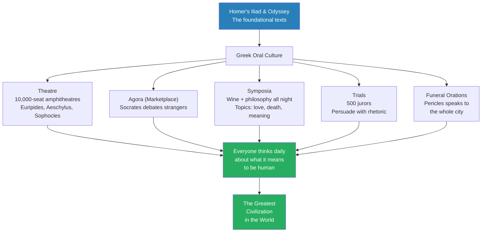
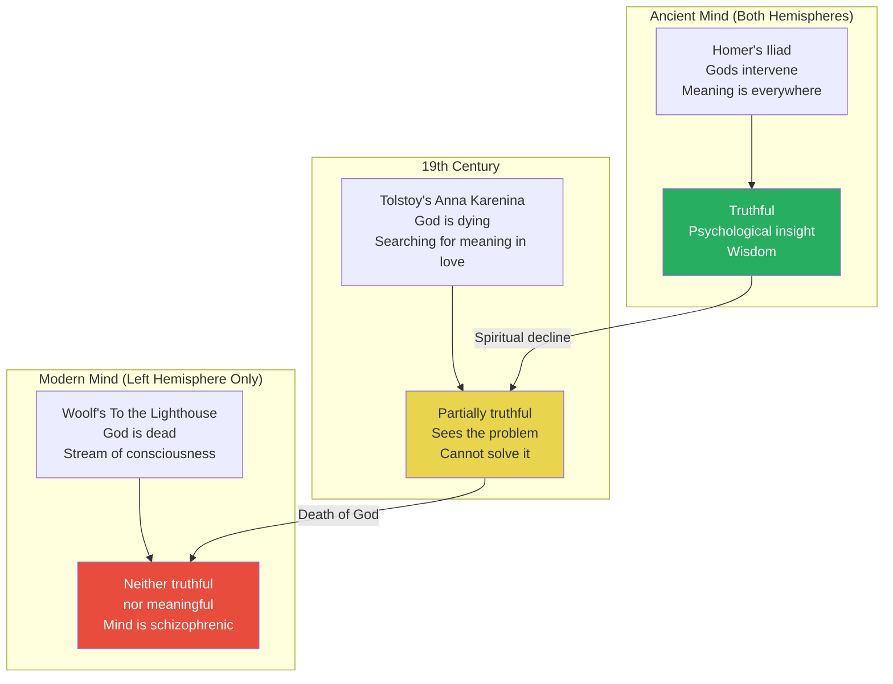

# The Big Bang of Greek Civilization

> Prof. Jiang argues that Homer is the big bang of Greek civilization — the poet whose work taught the Greeks to confront the deepest problem in human society: forgiveness. He traces the collapse of the Mycenaean empire and the rise of the decentralised polis system, explains how the alphabet replaced Linear B to democratise literacy, and then walks through the entire plot of the Iliad to reveal its shocking insight: the real battlefield is not on the shores of Troy but inside the human heart. Drawing on Julian Jaynes' bicameral mind theory, he argues that the ancient Greeks accessed a mode of consciousness — one that integrated spiritual perception with material reality — that modern humans have shut down, leaving us with meaningless, schizophrenic inner lives.

---

## Overview: Key Highlights

- <b style="color: #27ae60">Forgiveness is the hardest problem in human society</b> — the Iliad's central insight is that you cannot forgive others until you forgive yourself
- <b style="color: #2980b9">Homer</b> — considered the father of Greek civilization, a blind, illiterate poet who channelled the gods rather than "creating" stories
- <b style="color: #e74c3c">The real battlefield is inside the human heart</b> — Achilles' depression after killing Hector reveals that military victory without inner peace is worthless
- <b style="color: #2980b9">The polis system</b> — decentralised city-states that replaced the Mycenaean empire, restoring open cooperative competition and driving innovation
- <b style="color: #2980b9">The alphabet</b> — the most efficient writing system ever created, replacing the elite-only Linear B syllabary and democratising literacy across Greece
- <b style="color: #27ae60">Priam's submission destroys Achilles' pride</b> — by kneeling and kissing the hand of his son's killer, Priam wins the emotional battle and changes both their destinies
- <b style="color: #2980b9">Julian Jaynes' bicameral mind</b> — theory that the right hemisphere receives information from the universe while the left hemisphere interprets it into everyday reality
- <b style="color: #e74c3c">Modern consciousness is degraded</b> — by shutting down the spiritual right hemisphere and relying only on logic, we have become less creative and wise than the ancients
- <b style="color: #27ae60">The Iliad is truthful but not factual</b> — Homer's gods and hallucinations reveal psychological truth that modern factual prose cannot capture
- <b style="color: #2980b9">Oral culture</b> — theatre, the agora, symposia, and public trials created a civilisation where every citizen thought daily about what it means to be human
- <b style="color: #e74c3c">When we killed God, we killed meaning</b> — Anna Karenina's suicide illustrates the modern search for transcendence in love and lust after the death of the spiritual world
- <b style="color: #27ae60">Love is the unifying force of the universe</b> — Priam and Achilles forgive each other because they see their own loved ones in the other's face

| Concept | One-line summary |
|---------|-----------------|
| **Homer** | Blind, illiterate poet who recited the Iliad and Odyssey — considered the father of Greek civilization |
| **The polis** | Decentralised Greek city-state where every citizen fought, spoke, and debated — the source of "politics" |
| **The alphabet** | Writing system representing parts of sounds, not whole ideas — replaced elite Linear B and democratised literacy |
| **Bicameral mind** | Jaynes' theory that the brain's two hemispheres once worked together: right receiving spiritual input, left interpreting reality |
| **Forgiveness** | The Iliad's central problem — you cannot forgive others until you have forgiven yourself |
| **Truthful vs. factual** | Homer's gods are not factual but reveal psychological truth; modern prose is factual but not truthful |
| **Oral culture** | Greek civilization was built on speaking, debating, and performing — writing came from community, not isolation |
| **Open cooperative competition** | System of rival city-states that drives innovation — contrasted with centralised imperial monopoly |
| **Cult of the skull** | Ancestor worship through preserved skulls — evidence that ancient people believed the dead were still alive |
| **Stream of consciousness** | Modern literary technique (Woolf) that Prof. Jiang presents as evidence of degraded, purposeless thinking |

---

# The Lecture

## The Rise of the Polis and the Alphabet [0:00 - 9:53]

*Prof. Jiang recaps the arc of civilizational development — city-states competing along trade routes, then empire crushing that competition — and explains why the collapse of Mycenaean Greece was the best thing that ever happened to the Greek mind. Out of the wreckage came the polis, the alphabet, and Homer.*

> [!tip] Core Insight
> Decentralisation is the engine of civilizational greatness. When the Mycenaean empire collapsed, it destroyed bureaucracy, censorship, and propaganda — and liberated the Greek mind to invent the alphabet, democracy, and the humanities.

*The Mycenaean empire followed the universal pattern of centralisation, censorship, and propaganda. Its collapse reversed all three — and the result was the greatest civilizational explosion in human history.*

> [!note]- Expand: Full Lecture Detail
> Prof. Jiang opens by reviewing the pattern established in earlier lectures:
>
> - A city emerges on a major trade route occupying a major river
> - As it expands, it creates colonies along the river
> - Colonies become rival city-states competing for trade — <b style="color: #2980b9">open cooperative competition</b>
> - This competition drives tremendous innovation — true for China, Mesopotamia, and Egypt
> - Eventually, one state conquers the rest and creates an empire
>
> Empire has three fatal characteristics:
> - **Centralisation** — monopoly replaces competition, so society stops innovating
> - **Censorship** — people lose freedom of expression; all information is controlled
> - **Writing as propaganda** — writing becomes a tool of control rather than knowledge creation or self-expression
>
> <b style="color: #2980b9">Mycenaean Greece</b> was the empire that ruled the Aegean Sea during the Bronze Age. It followed this exact pattern. But when the Bronze Age collapse destroyed the Mycenaean system, something remarkable happened: all three imperial characteristics reversed.
>
> **The polis system:**
> - A <b style="color: #2980b9">polis</b> is a city-state in Greek — it gives us the word "politics"
> - The Greek world fragmented into dozens of independent polises, each at war with each other
> - Because every citizen had to risk his life in battle, every citizen earned the right to speak
> - Before every decision, all citizens could debate — even a farmer had to educate himself, learn rhetoric, and gain knowledge
> - This produced massive innovation in education, philosophy, and the arts
>
> **The alphabet revolution:**
> - During the Mycenaean age, the writing system was <b style="color: #2980b9">Linear B</b> — a syllabary deliberately designed to be hard to learn
> - The difficulty was the point: only the elite could master it, which separated rulers from ruled
> - Once every citizen needed to read and write, the Greeks needed a more efficient system
> - Prof. Jiang walks through the evolution of writing:
>   - **Pictograms** — pictures of objects (sun, moon)
>   - **Ideograms** — symbols representing ideas (Chinese characters)
>   - **Syllabary** — symbols representing complete sounds (Linear B)
>   - **Alphabet** — symbols representing parts of sounds, with added vowels
> - <b style="color: #27ae60">The alphabet is the most efficient writing system in the world</b> — easy to learn, maximally flexible and versatile
> - It increased literacy and learning across the entire Greek world
>
> **Homer's emergence:**
> - For entertainment, polises invited bards and poets to recite legends of the past
> - The most famous of these poets was <b style="color: #2980b9">Homer</b>
> - In a centralised system, Homer would have been a propagandist — the decentralised polis freed him to be an artist
> - Homer is considered the father of Greek civilization
> - He wrote two works: the Iliad and the Odyssey — though "wrote" is misleading, since he was illiterate and probably blind
> - He recited the poetry; his students wrote it down
> - Both works centre on the Trojan War

---

## The Legend of the Trojan War [9:53 - 17:30]

*Prof. Jiang retells the legend behind the Iliad — from the Judgement of Paris to the fall of Troy — setting up the specific conflict between Achilles and Agamemnon that Homer chose to dramatise.*

*The entire Trojan War — and therefore the entire foundation of Greek literature — begins with a beauty contest, a bribe, and a stolen wife. Facts become stories, stories become legends, and legends become the raw material for Homer's genius.*

> [!note]- Expand: Full Lecture Detail
> Prof. Jiang reminds the class that Troy was the centre of the ancient world — the heart of global trade — and that pirates kept raiding it. Facts became stories, and stories became exaggerated over time, producing the legend of the Trojan War.
>
> **The Judgement of Paris:**
> - Three goddesses — <b style="color: #2980b9">Hera</b> (queen), <b style="color: #2980b9">Athena</b> (wisdom), and <b style="color: #2980b9">Aphrodite</b> (love) — discover a golden apple inscribed "to the most beautiful in the world"
> - They fight endlessly, driving Zeus mad
> - Zeus decides to hold a contest and finds someone "stupid enough" to be the judge: Paris, prince of Troy
> - Each goddess bribes Paris:
>   - Hera: "I will make you a king"
>   - Athena: "I will give you all the wisdom in the world"
>   - Aphrodite: "I will give you the most beautiful woman in the world"
> - Paris chooses Aphrodite — and Prof. Jiang's wife explains why: "What matters to guys is status. You're a king, but there are lots of other kings. You have wisdom, but who knows? But you walk around with the most beautiful woman in the world — you feel good about yourself"
>
> **The war begins:**
> - Helen is already married to Menelaus, king of Sparta
> - Menelaus' brother Agamemnon is king of Argos — the most powerful king in Greece
> - Agamemnon organises a massive Greek army to attack Troy and retrieve Helen
> - The war lasts ten years and produces hundreds of legendary heroes
> - The two most famous: <b style="color: #2980b9">Achilles</b> (bravest warrior) and <b style="color: #2980b9">Odysseus</b> (wisest strategist)
> - Odysseus devises the Trojan Horse, which ends the war
>
> **Homer's choice:**
> - Homer does not tell the whole story — he tells only the conflict between Achilles and Agamemnon
> - This is the genius: the war itself is backdrop; the real story is the clash of two proud men

---

## The Plot of the Iliad — Pride, Guilt, and Self-Destruction [9:53 - 25:25]

*Prof. Jiang walks through the entire plot of the Iliad, revealing how Achilles' pride leads to Patroclus' death, Hector's mutilation, and Achilles' own psychological breakdown — before the astonishing final scene where forgiveness redeems everything.*

> [!tip] Core Insight
> Achilles is the greatest warrior in the world but cannot defeat his own guilt. He knows he is responsible for Patroclus' death — he engineered it through reverse psychology — and his mutilation of Hector is a futile attempt to externalize self-hatred he cannot face.

*The Iliad's plot is a descent into self-destruction followed by a single moment of redemption. Every red node marks a choice driven by pride; the green node marks the moment when love breaks through.*

> [!note]- Expand: Full Lecture Detail
> **The quarrel:**
> - The Greeks are camped outside Troy, unable to breach the walls — so they raid nearby islands allied with Troy
> - They capture booty, including young women kept as slaves
> - Agamemnon's captive is the daughter of a powerful priest — the priest offers ransom, and Agamemnon refuses
> - The priest prays to Apollo, who unleashes a plague on the Greek army
> - Achilles discovers the cause and confronts Agamemnon publicly: "Give her back or we all die"
> - Agamemnon agrees — but only if he takes Achilles' girl as replacement
> - <b style="color: #e74c3c">Achilles is furious</b> — he swears never to fight for Agamemnon again and withdraws from battle
>
> **The manipulation:**
> - Achilles goes to his mother Thetis (a river goddess) and asks her to persuade Zeus to help the Trojans
> - His reasoning: if the Greeks lose, they will beg Achilles to save them, and he will become the supreme hero
> - He came to Troy for glory — he wants the Greeks to need him desperately
>
> **The escalation:**
> - Hector, prince of Troy and Paris' brother, discovers Achilles is absent and leads the Trojans on a devastating offensive
> - The Trojans push the Greeks to the very edge of their ships — if they burn the ships, the Greeks are trapped and will die
> - Odysseus and the Greek commanders beg Agamemnon to recall Achilles
> - Agamemnon offers Achilles his daughter in marriage and unlimited treasure
> - Achilles refuses — he does not want gifts; he wants Agamemnon to come personally and apologise
> - <b style="color: #e74c3c">Agamemnon will not lose face</b> — both men are paralysed by pride
>
> **The reverse psychology:**
> - Achilles sends Patroclus, his lieutenant and closest friend, to find out what is happening
> - The Greeks tell Patroclus: "We know Achilles won't come — but maybe you can save us"
> - Patroclus runs back excitedly and begs Achilles to let him fight
> - Achilles agrees — but gives him a deliberate instruction: "Save the ships, but do NOT push the Trojans back to Troy. That is my glory. Do not steal my glory."
>
> > [!example] The Jill and Jane Analogy
> > - Prof. Jiang uses a modern analogy to explain Achilles' psychology
> > - John and Jill break up but both want to reconcile — neither will apologise first
> > - Jill sends her friend Jane to talk to John
> > - John tells Jane: "Forget Jill — I'd rather date you. You're more beautiful"
> > - Jane runs back to Jill, excited: "John asked me on a date! Maybe I can convince him to apologise"
> > - Jill says: "Fine, go date him — but don't kiss him"
> > - Jill knows that by saying "don't kiss him," Jane will definitely kiss him
> > - Achilles knows that by saying "don't win too much glory," Patroclus will try to win all the glory
> > **The lesson:** Achilles engineers Patroclus' death through reverse psychology. He needs Patroclus to fail so he can enter the battlefield as the ultimate saviour.
>
> - Prof. Jiang reads from the Iliad to demonstrate Achilles' psychology: "You can win great honour, great glory for me... Once you have whipped the enemy from the fleet, you must come back, Patroclus... You must not burn for war against these Trojans... you will only make my glory that much less"
> - <b style="color: #e74c3c">"Me, me, me, me" — all Achilles cares about is himself</b>
>
> **Patroclus' death and Achilles' breakdown:**
> - Patroclus, predictably, tries to win all the glory — forces a duel with Hector
> - Hector kills Patroclus
> - Achilles enters the battlefield in rage — kills Hector, saves the Greeks
> - He should be the happiest man in the world: greatest warrior, hero of Greece, friend avenged
> - Instead, he falls into deep depression
> - He ties Hector's body to his chariot and drags it around the walls of Troy — a war crime
> - The Trojans scream in horror; the Greeks are disgusted; the gods are appalled
> - Achilles cannot sleep, cannot eat — all he can do is mutilate the corpse
>
> **Why Achilles is guilty:**
> - Prof. Jiang identifies three moments where Achilles could have prevented Patroclus' death:
>   1. He did not have to quarrel with Agamemnon over a superficial insult
>   2. When the Greeks begged him to return, he could have said yes
>   3. He did not have to send Patroclus into battle
> - <b style="color: #27ae60">Achilles knows in his heart that he is guilty</b> — Hector may have struck the blow, but Achilles made it possible
> - He cannot forgive himself, so he takes it out on Hector's body — externalising self-hatred

---

## Priam and Achilles — The Greatest Scene in Literature [17:30 - 25:25]

*The gods broker a meeting between Priam, the grieving father, and Achilles, the guilt-ridden warrior. What follows is the most powerful scene in the Iliad — and the moment that reveals the poem's central insight about forgiveness and love.*

*Priam's choice to submit rather than strike is the Iliad's turning point. By sacrificing his pride, he wins the emotional duel and transforms both men — proving that love is more powerful than violence.*

> [!note]- Expand: Full Lecture Detail
> **The sleepless nights:**
> - Both Achilles and Priam are trapped in insomnia
> - Achilles: "He turned and twisted side to side... the memories flooded over him, live tears flowing... now he lied on his side, now flat on his back, now face down again, at last he leapt to his feet"
> - Every dawn, he yokes his chariot and drags Hector's body three times around Patroclus' tomb
> - Apollo protects Hector's corpse from corruption, wrapping it in a golden shield
>
> **The divine debate:**
> - The gods pity Hector and want to stop the desecration
> - Some gods — Hermes — want to steal the body
> - But Hera, Poseidon, and Athena still hate Troy and refuse
> - Zeus overrules them: Achilles must accept ransom from Priam and return the body
> - Thetis, Achilles' mother, is always hovering near him — no god can act behind her back
>
> **The meeting:**
> - Hermes guides Priam past the Greek sentries and into Achilles' tent
> - "The majesty king of Troy slipped past the rest and kneeling down beside Achilles, clasped his knees and kissed his hands — those terrible, man-killing hands that had slaughtered Priam's many sons in battle"
> - <b style="color: #27ae60">Priam has the opportunity to kill Achilles — he chooses instead to submit</b>
> - This submission is what destroys Achilles' pride
>
> > [!example] The Emotional Duel Between Priam and Achilles
> > - Priam kneels before the man who killed his son — and kisses the very hands that did it
> > - Homer compares Priam to a fugitive murderer who has somehow become wealthy and respected in a foreign land — an impossible reversal of fortune
> > - Priam says: "Remember your own father, great godlike Achilles, as old as I am"
> > - These words stir in Achilles a desire to grieve for his own father
> > - Achilles takes the old man's hand and gently moves him back
> > - "Overpowered by memory, both men gave way to grief"
> > - Priam weeps for Hector; Achilles weeps for Patroclus and for his father
> > - Their sobbing fills the tent
> > **The lesson:** Priam saw Hector in the face of Achilles. Achilles saw his father in the face of Priam. Love for their own people allowed them to find love for each other.
>
> - <b style="color: #27ae60">This is the first time Achilles can cry</b> — before this moment, his guilt made tears impossible
> - Achilles returns Hector's body and promises a ceasefire long enough for a proper funeral
> - He personally guarantees the Greeks will not attack Troy during the burial
>
> > [!quote] Prof. Jiang
> > "It is the most shocking ending ever. The most beautiful, the most poignant, the most tragic ending ever. Even today, we cannot match it."

---

## The Problem of Forgiveness [25:25 - 28:42]

*Prof. Jiang extracts the Iliad's central lesson — that forgiveness is the deepest problem in human society — and uses a thought experiment involving a car crash to demonstrate why self-forgiveness is always the hardest kind.*

> [!tip] Core Insight
> In real life, it is almost never purely your fault or purely someone else's fault. It is always scenario three — shared responsibility. And because you cannot forgive yourself for your part, you cannot forgive the other person for theirs.

*Prof. Jiang's three scenarios isolate why forgiveness is so hard: pure guilt and pure anger are both manageable. It is the mixture of both — the knowledge that you contributed to the catastrophe — that makes forgiveness impossible.*

> [!note]- Expand: Full Lecture Detail
> Prof. Jiang steps back from the text to state the Iliad's thesis directly:
>
> - <b style="color: #27ae60">The real battlefield is not on the shores of Troy — it is inside the human heart</b>
> - Achilles' depression is not caused by Hector — it is caused by his own guilt
> - Priam's act of forgiveness allows Achilles to forgive himself — and that changes the world
>
> **The thought experiment:**
> - Scenario 1: You are driving drunk with your wife and child. You crash. They die. It is entirely your fault.
> - Scenario 2: You are driving home. A drunk driver hits you. Your wife and child die. It is entirely his fault.
> - Scenario 3: You are arguing with your wife and not watching the road. A drunk driver hits you. Your wife and child die. It is partly your fault and partly his.
> - Prof. Jiang asks: "In which scenario are you least likely to forgive the drunk driver?"
> - The answer is Scenario 3 — because you cannot forgive yourself first, so you cannot forgive the other person
>
> - <b style="color: #e74c3c">In real life, it is always Scenario 3</b> — there is almost never pure innocence or pure guilt
> - Every day we make mistakes, and because we cannot forgive ourselves, we make more and more mistakes
> - The Iliad tells us that the real struggle is not for power but within ourselves
> - <b style="color: #27ae60">If we forgive ourselves, we can change the world</b> — because Priam forgave Achilles, Achilles forgave himself, and they made the world a better place
>
> This insight, Prof. Jiang argues, is what gave rise to Greek civilization. The Greeks engaged in oral tradition, and in their oral tradition they were constantly trying to figure out the mysteries of the human heart.

---

## Julian Jaynes and the Bicameral Mind [25:25 - 38:36]

*Prof. Jiang introduces Julian Jaynes' theory of the bicameral mind to explain why the ancient Greeks had wisdom that modern humans lack. The right hemisphere received spiritual information from the universe; the left hemisphere interpreted it into reality. When we shut down the right hemisphere, we lost access to wisdom.*

*Jaynes' bicameral mind maps directly onto Kant's noumena/phenomena distinction. The right hemisphere is our gateway to the noumena — the universe as it truly is. Shutting it down confines us to the left hemisphere's filtered, materialistic interpretation.*

> [!note]- Expand: Full Lecture Detail
> Prof. Jiang connects psychology, philosophy, and neuroscience to explain why the ancient mind was different from the modern mind.
>
> **The two hemispheres:**
> - Right hemisphere: creative, emotional, caring — does art
> - Left hemisphere: logical, analytical, utilitarian — does math
> - <b style="color: #2980b9">Julian Jaynes</b>, an American psychologist, proposed that the right hemisphere actually receives information — vibrations — from the universe, while the left hemisphere interprets this information into everyday reality
>
> **The philosophical grounding:**
> - Prof. Jiang connects this to Kant: the <b style="color: #2980b9">noumena</b> (things in themselves) and the <b style="color: #2980b9">phenomena</b> (things as they appear to us)
> - Our brain interacts with the noumena and filters it through time and space into the phenomena
> - Hegel calls the noumena the <b style="color: #2980b9">Geist</b> — the universe itself, which is made of vibrations
> - Applying this framework: the right brain receives these vibrations, the left brain transforms them into everyday reality
>
> **How did ancient people interpret these vibrations?**
> - For most of human history: as gods and spirits
> - This was not factual but it was truthful — it gave access to genuine wisdom and understanding
> - By embracing this model of the brain, humans had access to wisdom — the wisdom of Homer and the Greeks
> - <b style="color: #27ae60">That is why the ancient Greeks were much more creative and wise than we are today</b>
> - Modern humans have shut off the right hemisphere by insisting that only science, logic, and materialism matter
>
> **Jaynes' book:**
> - *The Origin of Consciousness in the Breakdown of the Bicameral Mind*
> - "Bicameral mind" = the left and right hemispheres working together
>
> **Evidence for the bicameral mind:**
> - Why did ancient cultures bury kings with elaborate gifts, as if they were still alive?
> - Answer: from their perspective, the dead were still alive — their voices were still heard by the living
> - "These dead kings propped up on stones, whose voices were hallucinated by the living, were the first gods"
> - Viking ship burials, the cult of the skull in Neolithic cultures — all evidence of living alongside spirits
>
> **Jerry Narby's** ***The Cosmic Serpent:***
> - Plants can communicate with each other — scientifically established
> - Hallucinations may be a source of verifiable information — the spirit really may be talking to you
> - The entire universe is consciousness — plants, animals, humans all share it
> - If we open our minds, we can communicate with the entire universe
>
> **Scientific discoveries and the right hemisphere:**
> - Descartes dreamed of an angel who explained the basic principles of materialistic rationalism
> - Einstein daydreamed in a tram and conceived the theory of relativity
> - James Watson scribbled on a newspaper in a train and arrived at the conviction that DNA forms a double helix
> - Prof. Jiang asks the class to consider everyday experiences:
>   - Thinking of someone right before they call you
>   - Feeling as though you are being watched
>   - Ideas popping into your head from nowhere
>   - Knowing what a friend is thinking without speaking
>   - Having conversations with people inside your head
>   - Feeling you have a guardian angel
> - Before the modern era, none of these were mysteries — everyone assumed they lived alongside spirits, angels, and demons

---

## The Iliad as Psychological Truth — Truthful vs. Factual [38:36 - 48:12]

*Prof. Jiang reads key passages from the Iliad alongside his own modern prose rewrites to demonstrate the difference between "truthful" and "factual" writing. Homer's gods are hallucinations that reveal deep psychological truth; modern prose captures surface facts but misses the inner world entirely.*

> [!tip] Core Insight
> The Iliad is truthful but not factual. Modern prose is factual but not truthful. Homer's Athena does not literally exist — but her appearance at the moment Achilles almost murders Agamemnon reveals more about the psychology of rage and restraint than any realistic description ever could.

*The same scene written two ways reveals what is lost when we abandon the spiritual dimension. Homer's version explains why Achilles stops — a force greater than himself intervenes. The modern version can only show that he stops.*

> [!note]- Expand: Full Lecture Detail
> Prof. Jiang reads from Robert Fagles' translation of the Iliad to show how the bicameral mind worked in practice.
>
> **The clash — Homer's version:**
> - Agamemnon demands Achilles' slave girl
> - "Anguish gripped Achilles. The heart in his rugged chest was pounding, torn"
> - He is about to draw his sword and kill Agamemnon
> - "Down from the vaulting heavens swept Athena" — Hera sent her because she loves both men
> - Only Achilles can see Athena — no one else — "he knew her at once"
> - Achilles asks: "Why come now? To witness the outrage Agamemnon just committed?"
> - Athena commands: "Stop this fighting now. Don't lay hand to sword... One day glittering gifts will lie before you three times over to pay for all his outrage"
> - "A man submits, though his heart breaks with fury. Better for him by far — the man obeys the gods"
> - Achilles sheathes his sword
>
> **The clash — Prof. Jiang's modern rewrite:**
> - "'I don't need you. Get on,' roared Agamemnon. He spat on the ground"
> - "Achilles' blood boiled and he reached for the hilt of his sword"
> - "He counted the seconds and the steps it would take for him to sprint forward and strike him down"
> - "His feet grew heavy and his legs grew wobbly. He could not move"
> - "Achilles snapped around and walked out of the room"
>
> - <b style="color: #27ae60">The Iliad's version is truthful but not factual</b> — Athena does not literally exist, but her appearance reveals the psychology of restraint
> - <b style="color: #e74c3c">The modern version is factual but not truthful</b> — it tells you what happened but not why it happened
>
> **Achilles' speech before sending Patroclus:**
> - Prof. Jiang reads a long passage showing Achilles' self-centred psychology
> - Achilles tells Patroclus to fight but not to win too much glory: "You will only make my glory that much less"
> - Prof. Jiang's commentary: "Me, me, me, me. All Achilles cares about is me"
> - Achilles knows that telling Patroclus "don't win too much glory" will make Patroclus try to win all the glory — this is deliberate reverse psychology
>
> **Achilles' insomnia — Homer's version:**
> - "The memories flooded over him, live tears flowing, and now he lied on his side, now flat on his back, now face down again"
> - Every dawn he drags Hector's body three times around Patroclus' tomb
> - Apollo wraps the corpse in a golden shield to prevent corruption — the gods protect Hector even in death
> - Prof. Jiang reads the divine debate: Zeus overrules Hera and Athena, commanding that Achilles must return the body
>
> **The modern rewrite of Priam's approach:**
> - Prof. Jiang writes a version without gods: Priam cannot sleep, his servants try sleeping potions, spies report that Achilles cannot sleep either, an emissary negotiates through Agamemnon
> - <b style="color: #e74c3c">It is less powerful, less truthful, less interesting</b> — the removal of the divine dimension strips away the meaning

---

## Greek Oral Culture — Theatre, Agora, Symposia [48:12 - 57:34]

*Prof. Jiang surveys the institutions of Greek oral culture — public speaking, theatre, the marketplace, symposia, and trials — to show that the Greeks built an entire civilisation around daily engagement with the mysteries of the human heart.*

*Every institution of Greek public life was built around speaking, listening, and thinking about the human condition. This is not incidental to their greatness — it is the cause of it.*

> [!note]- Expand: Full Lecture Detail
> Prof. Jiang surveys the institutions that made Greek civilization possible:
>
> - **Pericles' funeral oration** — public speaking was a daily activity; citizens addressed the whole city
> - **Theatre** — amphitheatres seating 10,000 people; the plays of Euripides, Aeschylus, and Sophocles explored the mysteries of the human heart
> - **The Agora** — the marketplace where people debated; Socrates was famous for finding strangers to argue with
> - **The Symposia** — gatherings of wealthy citizens who drank watered-down wine all night and discussed philosophy, love, death, and the meaning of life
>   - Socrates' symposium on love is a famous example
> - **Trials** — if charged with a crime, you faced 500 jurors and had to persuade them with rhetoric
>
> <b style="color: #27ae60">This was an oral culture where every day people talked with each other — and that was the source of their creativity</b>
>
> What were they talking about? The Iliad. The Odyssey. They were trying to figure out what Homer meant — what he was telling the world in his poetry.
>
> **Writing came from community:**
> - Herodotus — even when he wrote, the first thing he did was recite his writings publicly to gauge the audience's reaction
> - "Writing comes from community. It comes from understanding the feelings of others"
> - <b style="color: #e74c3c">"Today we just write by ourselves, and that's why our writing is crap"</b>

---

## The Death of God and Modern Consciousness [57:34 - 1:02:30]

*Prof. Jiang contrasts the wisdom of the ancient mind with the degradation of modern consciousness by placing Homer's Iliad alongside Tolstoy's Anna Karenina and Virginia Woolf's To the Lighthouse. When we killed God, we killed meaning — and modern literature is the evidence.*

> [!tip] Core Insight
> Anna Karenina is looking for God in love, sex, and lust — and cannot find it. Virginia Woolf's stream of consciousness is what happens when the right hemisphere has nothing to receive: the mind clutters itself with grocery bills and insignificant worries. Both are symptoms of a civilisation that has amputated its spiritual dimension.

*Three literary moments mark the decline of human consciousness. Homer's gods gave meaning and wisdom. Tolstoy's characters are searching for a god they have lost. Woolf's characters have stopped searching — their minds wander without purpose.*

> [!note]- Expand: Full Lecture Detail
> Prof. Jiang demonstrates the decline of consciousness through three literary works.
>
> **Tolstoy's *Anna Karenina* (1877):**
> - Considered the greatest novel of the modern period
> - Famous opening: "Happy families are all alike; every unhappy family is unhappy in its own way"
> - The plot: Anna Karenina falls in love with Count Vronsky and has an affair that destroys both their families
> - Anna's desperation escalates: "My love keeps growing more passionate and egoistic, while his is waning and waning, and that's why we're drifting apart"
> - She tells herself she is "insanely jealous" but then corrects herself: "It's not true. I'm not jealous, but I am unsatisfied. I don't have any meaning in my life, and I want this love to give me meaning"
> - <b style="color: #e74c3c">She is looking for God in love and sex — and cannot find it</b>
> - The novel ends with her suicide
>
> **Prof. Jiang's Homeric rewrite of Anna Karenina:**
> - Anna sits on a bench at the train station
> - She sees herself — but older, with greying hair and drooping eyes
> - "Who are you?" Anna shouts in horror
> - The older Anna asks: "Where are you going? Where's Vronsky?"
> - Anna runs, screaming — the older version chases her
> - "Leave me alone... I am going to a place where you can't find me"
> - She trips and falls onto the tracks
> - <b style="color: #27ae60">The Homeric version — with the hallucination — gives psychological insight that the factual version cannot</b>
> - Anna sees her own meaningless future and cannot face it
>
> **Virginia Woolf's *To the Lighthouse* (1927):**
> - Considered one of the greatest novels of the 20th century
> - Prof. Jiang's verdict: "It's not very good"
> - Stream of consciousness: "There were the eternal problems: suffering, death, the poor... the bill for the greenhouse would be fifty pounds"
> - The mind wanders without discipline or focus — from suffering to grocery bills in the same breath
> - <b style="color: #e74c3c">This is modern consciousness: schizophrenic, purposeless, cluttered with insignificant concerns</b>
>
> **Prof. Jiang's conclusion:**
> - We live in a world where God is dead
> - We are not allowed to imagine a spiritual world
> - We focus only on the here and now
> - As a result, we live meaningless, insignificant lives
> - Our brains have become "schizophrenic" — jumping between trivial concerns with no centre of gravity

---

## Q&A and YouTube Comments [1:02:30 - end]

*A student draws a powerful connection between the Iliad's forgiveness framework and China-Japan relations, and Prof. Jiang responds to YouTube comments on livestock economics, altruistic vs. utilitarian natures, course overlap with the Civilization series, and why he has children in a collapsing world.*

> [!note]- Expand: Full Lecture Detail
>
> > [!example] A Student's Application: China and Japan
> > - A student proposes that China's hatred of Japan illustrates the Iliad's forgiveness problem
> > - China cannot forgive Japan for the invasion — but the deeper reason is that China cannot forgive itself for being too weak to fight back
> > - This is Scenario 3: shared responsibility — Japan attacked, but China failed to defend itself
> > - Because China cannot forgive its own weakness, it cannot forgive Japan's aggression
> > - Prof. Jiang agrees: "If you're really strong and confident, you just focus on improving yourself. You don't think about other people"
> > **The lesson:** National hatred, like personal hatred, is often self-hatred projected outward.
>
> **YouTube comment responses:**
> - **On Africa:** Prof. Jiang acknowledges he does not know enough about African civilisation to comment — he wants to travel to Africa and learn so he can teach it properly. "For me, teaching is a learning journey. I teach to learn"
> - **On livestock:** A commenter notes that livestock (cattle, sheep) was the currency of the steppe peoples — Prof. Jiang agrees this is important and underrepresented in his lectures
> - **On altruistic vs. utilitarian nature:** Once you break the balance and become too utilitarian, it is almost impossible to move back — and that is why societies collapse
> - **On overlap with Civilization series:** Prof. Jiang admits the content overlaps but says the angle has changed — last year he was figuring out how civilization works; this year he is applying the idea of secret societies to better understand civilizational patterns
> - **On having children in horrible times:** "Children are what give us hope. Children are what give us purpose" — Prof. Jiang says he is probably the most pessimistic person on earth but his three children fill him with energy to fight for a better world. "I'm only doing this. I'm only teaching this class. I'm only putting this on YouTube to build a legacy for my children"

---

## Connections

**Builds on:** [[15 - Capital and the Bronze Age Collapse]] (Mycenaean collapse that created conditions for Greek innovation), [[01 - How Power Works]] (Kant's noumena/phenomena, paradigms), [[11 - Dawn of the Human Imagination]] (bicameral mind, consciousness)

**Sets up:** [[17 - Literary Genesis]] (further development of literature's origins), [[18 - Thus Spoke Zarathustra]] (Zoroastrian spiritual worldview), [[20 - The Hellenistic World]] (what Greek civilisation became)

**Related books in vault:** [[Sapiens - Yuval Noah Harari]] (wheat domestication reversal, consciousness), [[The 33 Strategies of War - Robert Greene]] (Achilles' strategic psychology, manipulation through reverse psychology)

---

## The Takeaway

This lecture argues that the greatest civilisation in human history was built not on military power or economic surplus but on a single poet's insight into the human heart. Homer's Iliad does not celebrate Achilles' martial prowess — it exposes his psychological destruction and reveals that forgiveness, not victory, is what transforms the world. Prof. Jiang's reading of the final scene between Priam and Achilles — where a grieving father kneels before his son's killer and, by submitting, wins the only battle that matters — is the emotional and intellectual centre of the entire Secret History series so far.

The most provocative claim is not about Homer but about us. Julian Jaynes' bicameral mind theory provides Prof. Jiang with a framework for arguing that modern humans have amputated a dimension of consciousness that the ancients took for granted. The Greeks did not just use both hemispheres of their brain — they built an entire civilisation around the right hemisphere's capacity to receive wisdom from beyond the material world. When we killed God and insisted on materialism alone, we did not become more rational; we became less wise. The evidence is in our literature: from Homer's gods intervening in human psychology to Woolf's stream of consciousness cluttered with grocery bills.

What remains unresolved is how much of this argument is metaphor and how much is literal. Prof. Jiang presents Jaynes' theory alongside Kant, Hegel, and Jerry Narby as though they form a coherent worldview, but he does not address the substantial neuroscientific criticism of Jaynes' bicameral hypothesis. The question he leaves hanging — and which the next lectures on literary genesis and Zarathustra will presumably address — is whether there is a way to recover the ancient mode of consciousness, or whether the shift to left-hemisphere dominance is irreversible.
