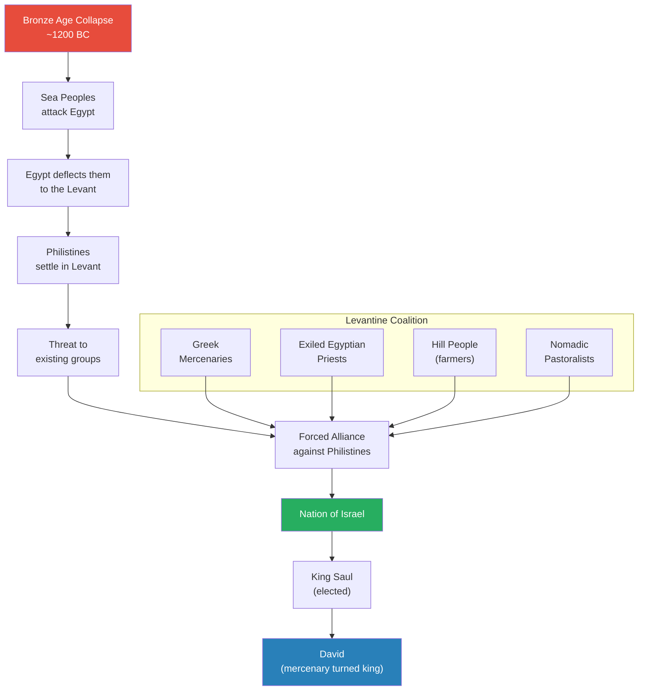
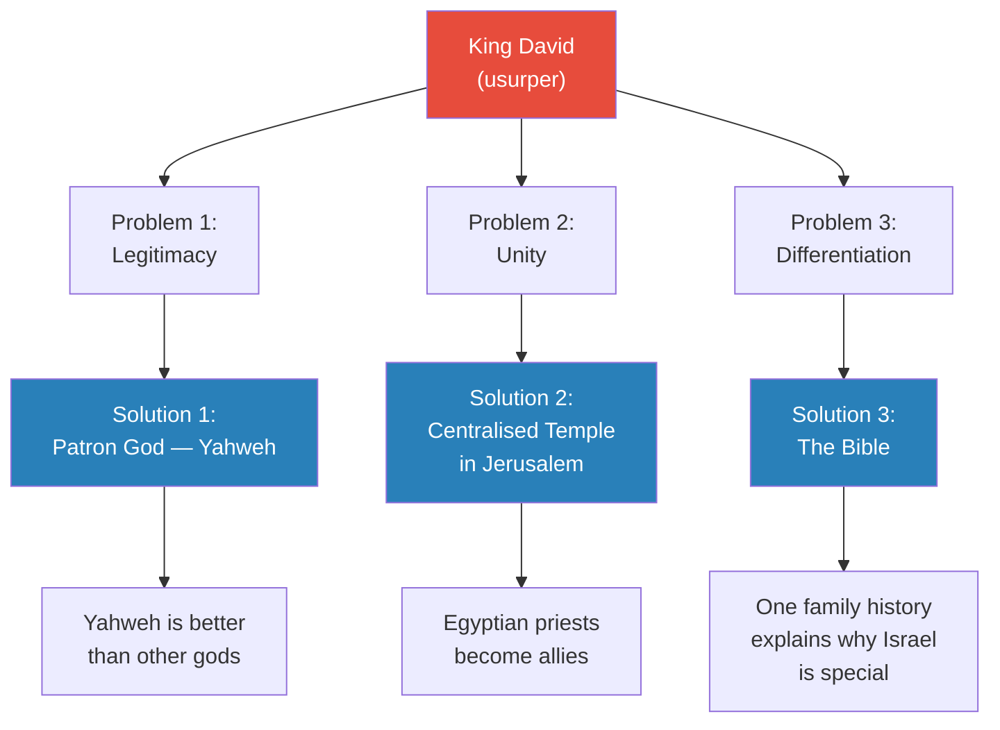
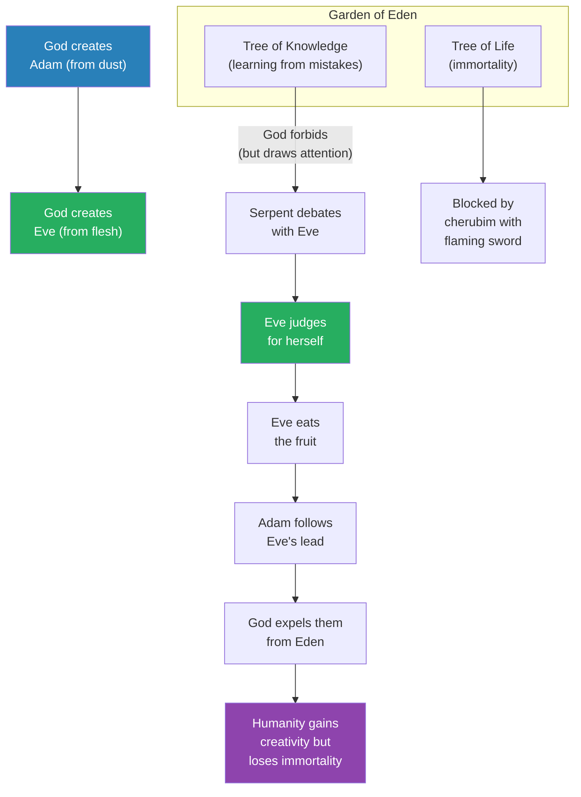
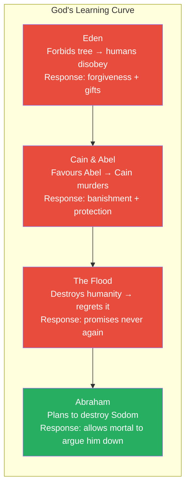
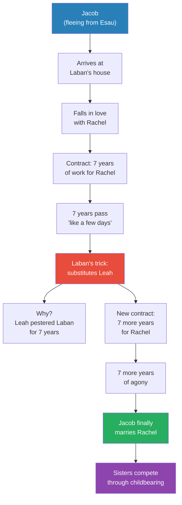
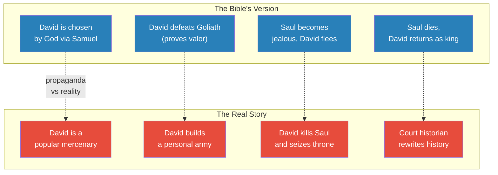
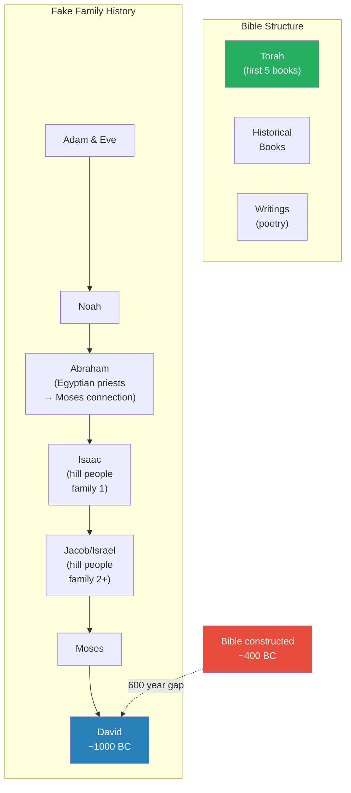

# Literary Genesis

> Prof. Jiang asks why Jews are the most creative people in the world -- and traces the answer to the Bible itself. Not as a religious text, but as a literary masterpiece born from political necessity. When David seized the throne of Israel through violence, his court needed propaganda to legitimise a usurper, unify a fractured coalition, and differentiate a new nation from its neighbours. The genius who wrote Genesis -- probably a woman -- transformed that political brief into stories so layered, so ambiguous, and so provocative that they forced every reader into deep reflection. Three thousand years later, that tradition of debate, argumentation, and self-reflection still explains Jewish intellectual dominance.

---

## Overview: Key Highlights

- <b style="color: #27ae60">The Bible is the source of Jewish creativity</b> -- its stories force readers into open-ended interpretation, debate, and self-reflection rather than passive obedience
- <b style="color: #2980b9">The Yahwist (J)</b> -- the original author of Genesis, likely a woman, who transformed political propaganda into enduring literary art
- <b style="color: #e74c3c">David is a ruthless usurper, not a poet-king</b> -- the Bible reframes his crimes (murdering Saul, assassinating Uriah) as human fallibility to make them forgivable
- <b style="color: #27ae60">Yahweh is a God of forgiveness and self-reflection</b> -- revolutionary for an era when all other gods were vengeful and wrathful
- <b style="color: #2980b9">The Tree of Knowledge</b> -- creativity requires the capacity to make mistakes and learn from them; school kills this by preventing error
- <b style="color: #e74c3c">God's own fallibility is the point</b> -- Yahweh makes mistakes, reflects, and improves, modelling the behaviour he wants from humanity
- <b style="color: #27ae60">Eve is the hero of Genesis</b> -- she judges for herself, acts independently, and is made of higher-quality material (flesh vs. dust)
- <b style="color: #2980b9">Israel's origin as a coalition</b> -- mercenaries, Egyptian priests, hill people, and nomads forced together by the Philistine threat after the Bronze Age Collapse
- <b style="color: #e74c3c">The Bible is gaslighting</b> -- Nathan's parable redirects attention from David's real crime (murder) to a lesser one (adultery) to make forgiveness easier
- <b style="color: #27ae60">The Abraham-Yahweh debate</b> -- a mortal argues God down from 50 to 10 righteous people, establishing that the divine relationship is friendship, not servitude
- <b style="color: #2980b9">Three functions of writing</b> -- legitimacy, unity, and differentiation: every element of the Bible serves at least one
- <b style="color: #27ae60">Death enables creativity</b> -- without mortality, there is no motivation to create; God's banishment from Eden is a gift, not a punishment

| Concept | One-line summary |
|---------|-----------------|
| **The Yahwist (J)** | The probable female author of Genesis who turned court propaganda into literary masterpiece |
| **Tree of Knowledge** | Eating its fruit grants the ability to learn from mistakes -- the foundation of creativity |
| **Tree of Life** | Grants immortality -- combined with knowledge, it would make humans equal to God |
| **Yahweh as friend** | A god who debates, reflects, admits mistakes, and forgives -- unlike every other deity of the era |
| **The Abrahamic Covenant** | God's contract with Abraham: I favour you, you worship only me |
| **Economy and irony** | The Bible's literary genius: conveying deep meaning in few words, and being genuinely funny |
| **Gaslighting via parable** | Nathan's lamb story redirects blame from murder to adultery, making David's crime forgivable |
| **Three functions of the Bible** | Legitimacy (David is God's choice), unity (one family history), differentiation (Yahweh is different) |
| **Bronze Age Collapse** | The catastrophe that forced disparate Levantine groups to unite against the Philistines, creating Israel |
| **Spin / public relations** | The Bible as the world's first media strategy -- reframing gossip to protect the king |

---

# The Lecture

## The Birth of Israel -- Bronze Age Collapse and Coalition Formation [0:00-5:00]

*Prof. Jiang sets the geopolitical stage for the Bible's creation. The Levant was a multicultural colony of Egypt, populated by Greek mercenaries, exiled priests, hill farmers, and nomadic traders. When the Bronze Age Collapse destroyed the surrounding empires and deposited the Philistines in their territory, these disparate groups were forced into an alliance that became a new nation: Israel.*

*Israel was not a natural nation but a crisis coalition -- mercenaries, priests, farmers, and nomads united by a common enemy. The Bible's job was to make this artificial union feel like a family.*

> [!note]- Expand: Full Lecture Detail
> Prof. Jiang opens by announcing the topic: the Bible, the most influential book in human history. He frames the lecture around a single question: why are the Jews the most creative people in the world? In the past 200 years, three enormously influential individuals -- Karl Marx, Sigmund Freud, Albert Einstein -- were all Jews. The answer, he says, is the Bible.
>
> He maps the Bronze Age Middle East: Egypt in the south, the Levant in the centre, Anatolia to the north, Mycenaean Greece across the Aegean, Mesopotamia to the east. The Levant sits at the crossroads of everything.
>
> - The Levant was a colony of Egypt, but the Egyptians did not like leaving Egypt
> - To control this strategic territory, they used <b style="color: #2980b9">Greek mercenaries</b> hired from abroad
> - Religious power struggles in Egypt led to <b style="color: #2980b9">exiled priests</b> being sent to the Levant
> - The native population included <b style="color: #2980b9">hill people</b> (settled farmers) and <b style="color: #2980b9">nomadic pastoralists</b> (traders, bandits, livestock herders)
> - At this time, there was no concept of nation, race, or ethnicity -- people intermixed freely
>
> Then the Bronze Age Collapse struck:
> - Mycenaean Greece was destroyed
> - The Hittite Empire of Anatolia was destroyed
> - Waves of refugees -- the <b style="color: #2980b9">Sea Peoples</b> -- swept south and attacked Egypt
> - Egypt was strong enough to resist, but offered the Sea Peoples land in the Levant
> - These settlers became the <b style="color: #2980b9">Philistines</b> -- a people mentioned repeatedly in the Bible
>
> The Philistines threatened everyone already living in the Levant. The mercenaries, priests, hill people, and nomads were forced into an alliance. This alliance produced a new nation: Israel.
>
> - They elected <b style="color: #2980b9">Saul</b> as their first king to unite them against the Philistines
> - Saul had a mercenary named David
> - David did what mercenaries throughout history have done -- he rebelled against his king and seized the throne himself

---

## David's Three Problems and Three Innovations [5:00-9:00]

*Having seized power through violence, David faces three existential problems -- legitimacy, unity, and differentiation -- and responds with three innovations that would forever change human history: a patron god (Yahweh), a centralised temple (Jerusalem), and a national scripture (the Bible).*

*Each solution maps precisely to a problem. Yahweh handles legitimacy (God chose David), the temple handles unity (one place of worship employing the priests), and the Bible handles differentiation (our God is unlike other gods).*

> [!note]- Expand: Full Lecture Detail
> Prof. Jiang identifies three problems confronting the new king:
>
> - <b style="color: #e74c3c">Legitimacy</b> -- David stole the throne from Saul. Everyone liked Saul. Why should David be king?
> - <b style="color: #e74c3c">Unity</b> -- Israel is a diverse coalition of different peoples. How do you make them feel like one nation?
> - <b style="color: #e74c3c">Differentiation</b> -- Why is Israel different from the Egyptians, Anatolians, Mesopotamians, and Philistines?
>
> David's three innovations:
>
> 1. **A patron god named Yahweh** -- David declares Yahweh is Israel's god, and Yahweh is better than every other god. The Bible's purpose is to explain who Yahweh is and prove his superiority
> 2. **Centralisation of religion through a temple** -- David builds a temple in Jerusalem as Yahweh's house. This centralises the religion and gives jobs to the Egyptian priests, making them David's political allies
> 3. **Sponsoring the Bible** -- The Israelites need mythology explaining why they are one family, why they are different from others, and why they are better
>
> Prof. Jiang emphasises: the Bible succeeds not because of its theology but because of its <b style="color: #27ae60">great storytelling</b>. The stories are what make the propaganda endure.

---

## Genesis: The Garden of Eden and the Secret of Creativity [9:00-18:00]

*Prof. Jiang reads Genesis closely, arguing that the story of Eden is really about the nature of creativity. The Tree of Knowledge grants the ability to learn from mistakes. The Tree of Life grants immortality. Together they would make humans equal to God -- which is precisely why God separates them. Eve, not Adam, is the hero: she judges for herself, acts independently, and is made of superior material.*

> [!tip] Core Insight
> The secret of creativity is making mistakes and learning from them yourself. School destroys creativity by telling you the wall is there -- you never hit it, so you never learn. The Bible's God designs humans specifically for this creative process.

*Eve is the true protagonist. She exercises independent judgement where Adam merely follows. The expulsion from Eden is not punishment but design -- mortality is the prerequisite for creativity.*

> [!note]- Expand: Full Lecture Detail
> Prof. Jiang reads the opening of Genesis and unpacks its layers:
>
> **The two trees:**
> - The <b style="color: #2980b9">Tree of Life</b> grants immortality
> - The <b style="color: #2980b9">Tree of Knowledge of Good and Evil</b> grants the ability to learn
> - Prof. Jiang illustrates with a wall analogy: if you walk into a wall and it hurts, but you do not know that hurting is bad, you keep hitting the wall. Knowledge of good and evil gives you the capacity to learn from pain
> - <b style="color: #27ae60">Creativity plus immortality would make a human equal to God</b> -- if you live forever and keep learning, you eventually absorb all knowledge of the universe
> - God created humans to be part of the creative process -- "that's why God created us"
>
> **God's strange behaviour:**
> - God gives Adam free choice -- "you may freely do whatever you want" -- but forbids the Tree of Knowledge
> - Prof. Jiang notes the paradox: God draws attention to the one tree he fears, like a parent telling a child not to ride the dragon roller coaster at the amusement park
> - Three possible interpretations of God's motive:
>   - He is being dishonest -- the fruit is not actually poisonous, but he threatens death
>   - He is naive -- he does not understand that free-willed beings will disobey
>   - <b style="color: #27ae60">It is all part of his plan</b> -- he wants humans to be creative, which requires them to make their own mistakes
>
> **Eve as hero:**
> - The serpent approaches Eve, not Adam
> - Eve and the serpent have a genuine debate -- she is engaged intellectually
> - When the serpent says "you will not die," Eve looks at the fruit and judges for herself: "I can see for myself what is true"
> - <b style="color: #27ae60">She makes the decision independently, without consulting Adam</b> -- this is revolutionary
> - She eats, then gives the fruit to Adam, who simply follows
> - The real hero is the woman -- she exercises independent judgement
>
> **The superiority of woman:**
> - Adam is made from dust; Eve is made from a rib -- from flesh
> - <b style="color: #27ae60">Woman is made of higher-quality material</b> -- a revolutionary idea for an ancient patriarchal world
> - Prof. Jiang argues this is evidence the original author was a woman
>
> **God's response -- forgiveness, not vengeance:**
> - God discovers the disobedience and confronts Adam
> - Adam blames Eve; Eve blames the serpent
> - Under the rules of any other ancient religion, God would kill them both
> - Instead: "the Lord God made garments of skins for the man and his wife, and clothed them" -- <b style="color: #27ae60">he gives them a present</b>
> - This is a God capable of self-reflection: "I shouldn't have drawn attention to that fruit. It's partly my fault"
>
> > [!example] The Amusement Park -- Prof. Jiang's Analogy
> > - Imagine you take your children to an amusement park
> > - You say: "Ride anything you want -- but do NOT ride the Dragon Roller Coaster, or you will die"
> > - Every child in existence will immediately ride the Dragon Roller Coaster
> > - God does exactly this with the Tree of Knowledge
> > - Either God does not understand human nature, or he is deliberately provoking the "mistake" he needs humans to make
> > **The lesson:** The structure of Eden is designed to produce disobedience. Creativity requires transgression.
>
> **The expulsion as gift:**
> - God expels Adam and Eve because "the man has become like one of us, knowing good and evil" -- he fears they will also eat from the Tree of Life and become gods
> - Most people read the expulsion as punishment, but Prof. Jiang argues it is a gift:
>   - <b style="color: #27ae60">Without death, there can be no creativity</b>
>   - If you live forever, you have no motivation to make the most of your life
>   - If you live forever, your children and grandchildren cannot be creative either
>   - Death is the prerequisite for generational renewal and innovation
> - God's design: creativity without immortality -- "creativity is what's truly divine"

---

## Cain and Abel -- A God Who Learns from His Mistakes [18:00-28:00]

*The first murder in human history provokes not divine vengeance but divine negotiation. God's response to Cain -- banishment plus protection, not execution -- establishes the revolutionary pattern: Yahweh makes mistakes, reflects, and offers compromise. The Flood and the Abrahamic Covenant extend this pattern into a full theology of divine fallibility and friendship.*

*God's trajectory across Genesis is a learning curve. Each mistake produces reflection, each reflection produces a better response. By Abraham, God has evolved from unilateral decree to genuine debate with a mortal.*

> [!note]- Expand: Full Lecture Detail
> **Cain and Abel:**
> - Cain (farmer) and Abel (shepherd) both make offerings to God
> - God favours Abel's meat offering over Cain's plant offering -- Prof. Jiang notes this is "a very common thing in this world" where gods play favourites
> - <b style="color: #e74c3c">God's favouritism directly causes the first murder</b> -- Cain kills Abel in jealous rage
> - God's response is revealing: he could execute Cain (an eye for an eye), but instead he banishes him
> - Cain protests: "My punishment is greater than I can bear -- anyone who meets me may kill me"
> - God compromises further: he puts a protective mark on Cain so no one will kill him
> - <b style="color: #27ae60">A god capable of recognising his own role in causing the crime</b> -- "I recognise that I shouldn't have said your brother is better than you. This is partly my fault"
>
> **The Flood:**
> - Humanity develops, but humans prove violent and cruel -- "killing, enslaving, exploiting each other"
> - God decides to start over and creates the Flood, sparing only Noah
> - After the waters recede, God looks down and says: "I will never again curse the ground because of humankind, for the inclination of the human heart is evil from youth, nor will I ever destroy every living creature as I have done"
> - Prof. Jiang translates: "Oops. I made a mistake again." God recognises that free will necessarily produces evil. He cannot give humans the Tree of Knowledge and then punish them for using it
> - <b style="color: #27ae60">God's promise: "If you guys do evil, you're going to have to solve this problem yourself. I'm not going to solve it for you"</b>
>
> **The Abrahamic Covenant:**
> - God decides he needs a model nation -- the best nation, which will be a great example to everyone
> - He chooses Abraham as patriarch and offers a covenant: "I will favour you, but you must swear loyalty to me"
> - The relationship between Abraham and Yahweh is not master-servant but <b style="color: #27ae60">friend-friend</b>
>
> > [!example] Abraham Argues God Down (Sodom and Gomorrah)
> > - God decides to destroy Sodom and Gomorrah for their wickedness
> > - Abraham is shocked: "Will you sweep away the righteous with the wicked?"
> > - He negotiates: what if there are 50 righteous people? God agrees to spare the city
> > - Abraham pushes further: what about 45? God agrees
> > - He keeps going: 40, 30, 20, and finally 10
> > - "For the sake of 10, I will not destroy it" -- God agrees to each reduction
> > - A mortal successfully argued a god into changing his mind, six times in a row
> > **The lesson:** The basis of Judaism is debate, argument, and questions. There is no absolute truth -- only the process of asking questions, open debate, and self-reflection.
>
> Prof. Jiang draws the connection to Jewish creativity: <b style="color: #27ae60">"Why are Jews so creative? It's this simple -- Jews are encouraged to debate each other to figure out what is truly right"</b>. No absolute truth. Always a process of questioning.

---

## Jacob and Rachel -- The Greatest Love Story in the Bible [28:00-38:00]

*Prof. Jiang calls the story of Jacob and Rachel the greatest love story in human history -- and possibly the greatest love story ever told. Its genius lies in its economy (deep meaning from few words) and its irony (it is meant to be funny). Behind the romance is a family comedy of competing sisters, a scheming father, and fourteen years of endurance.*

> [!tip] Core Insight
> The Bible's literary power comes from economy and irony. A few paragraphs create an entire universe -- fourteen years of longing, jealousy, and love rendered in sentences that "seemed to him but a few days because of the love he had for her."

*The love story is also a comedy. Laban's deception is driven not by malice but by a father's inability to endure seven years of his elder daughter's complaints.*

> [!note]- Expand: Full Lecture Detail
> Prof. Jiang traces the genealogy: Abraham begets Isaac, Isaac has two sons -- Esau (elder) and Jacob (younger). Jacob and his mother Rebecca scheme to steal Esau's birthright. Esau is furious, so Jacob flees to his relative Laban.
>
> **The contract:**
> - Laban has two daughters: Leah (the elder, whose "eyes were lovely") and Rachel (the younger, "graceful and beautiful")
> - Jacob falls in love with Rachel and offers to work seven years for her hand
> - <b style="color: #27ae60">"Jacob served seven years for Rachel, and they seemed to him but a few days because of the love he had for her"</b>
>
> **The deception:**
> - On the wedding night, Laban substitutes Leah for Rachel
> - Jacob discovers the switch in the morning and confronts Laban
> - Laban says: "This is not done in our country -- giving the younger before the firstborn"
> - Prof. Jiang asks: did Laban intend to deceive from the start? The answer is no
> - For seven years, Leah pestered her father: "Am I not your daughter? Am I not your firstborn? If Jacob marries Rachel, who will ever want to marry me?"
> - <b style="color: #2980b9">Laban is not a villain but a father</b> trapped between his word and his elder daughter's suffering
>
> **The love endures:**
> - Jacob must work another seven years for Rachel
> - Rachel could have married someone else after the betrayal -- but she waits
> - Those seven years were "a long seven years" -- Leah probably taunted Rachel daily
> - <b style="color: #27ae60">The power of the story is the endurance of love through humiliation</b>
>
> **The comedy of competing sisters:**
> - Rachel cannot bear children; Leah can -- and the competition intensifies
> - Rachel gives her maid to Jacob: "Go into her, that I may have children through her"
> - Whenever the maid's baby is born, Rachel claims it: "It's mine, it's mine!"
> - Leah retaliates by giving her own maid to Jacob
> - Rachel declares: "With mighty wrestlings I have wrestled with my sister and have prevailed"
> - Prof. Jiang laughs: "This is a comedy. It's meant to be funny"
>
> **Economy and irony:**
> - <b style="color: #2980b9">Economy</b>: with very few words, the author conveys deep meaning -- a couple of paragraphs create an entire universe spanning fourteen years
> - <b style="color: #2980b9">Irony</b>: the Bible was first conceived as funny stories -- two sisters competing for the same man, escalating through increasingly desperate tactics
> - Prof. Jiang argues the author was clearly a woman: "Only a woman writes stories like this"
>
> > [!example] The Fourteen-Year Wait
> > - Jacob arrives at Laban's house, a fugitive from his brother's rage
> > - He falls in love with Rachel and agrees to work seven years for her
> > - The first seven years pass like days because love makes them weightless
> > - On the wedding night, Laban substitutes Leah -- Jacob discovers the switch at dawn
> > - He must now work seven more years, but these years are agony
> > - Every day he is married to Leah but wants Rachel
> > - Every day Leah taunts Rachel: "He doesn't really love you"
> > - Rachel endures -- she could leave, but she stays
> > **The lesson:** The Bible's greatest love story is not about passion but endurance. Love is measured not in intensity but in what you are willing to suffer.

---

## David's Crimes and the Bible as Spin [38:00-56:00]

*Prof. Jiang strips away the Bible's propaganda to reveal the real David: a mercenary who murdered his way to power. The stories of Abner's assassination and Uriah's murder are examined as political cover-ups -- but cover-ups so brilliantly written that they contain the clues to their own unmasking. This is the paradox of the Yahwist: she wrote propaganda that teaches you how to see through propaganda.*

*The left column is what the Bible says; the right column is what Prof. Jiang argues actually happened. The dotted lines show the propaganda-reality gap that makes the Bible so fascinating to decode.*

> [!note]- Expand: Full Lecture Detail
> Prof. Jiang distinguishes two authors: the <b style="color: #2980b9">Yahwist (J)</b> who wrote Genesis, and the <b style="color: #2980b9">court historian</b> whose job was to clean up David's image.
>
> **The Bible's version of David's rise:**
> - God sends the prophet Samuel to find a king
> - Samuel goes to the house of Jesse and identifies David, the youngest son
> - David defeats Goliath, becomes famous
> - King Saul grows jealous and forces David to flee
> - Saul is killed; David returns and becomes king
>
> **The real story, according to Prof. Jiang:**
> - David was a mercenary -- a very good and popular one, with many loyal soldiers
> - He killed Saul and took the throne himself
> - "This is all propaganda" -- the Bible was written to legitimise an usurper
>
> **The assassination of Abner:**
> - After Saul's death, Saul's general Abner feels slighted by the family
> - Abner goes to David and offers: "Make me your general, and I will give you Israel"
> - David feasts with Abner, then dismisses him "in peace"
> - David's own general, Joab, pursues and kills Abner
> - The Bible claims "David did not know about this"
> - Prof. Jiang's analysis:
>   - Joab commands David's army -- if Joab is rebelling, David is in serious danger
>   - <b style="color: #e74c3c">There is no way David would allow his general to rebel against him</b>
>   - David probably ordered the killing: if Abner betrayed Saul's family, he could betray David too
>   - The proof: Joab was never punished for killing Abner -- "which tells us he was probably acting on David's orders"
>
> > [!example] The Bathsheba Affair -- Murder Disguised as Romance
> > - David sees Bathsheba bathing from the palace roof
> > - She is married to Uriah, the best and most popular soldier in David's army
> > - David sleeps with Bathsheba; she becomes pregnant
> > - David recalls Uriah and tells him to go see his wife (to cover the pregnancy)
> > - Uriah refuses: "Your army is fighting for you. I cannot enjoy my wife while your men are dying"
> > - David writes to Joab: "Set Uriah in the forefront of the hardest fighting, then draw back so he may be struck down and die"
> > - Joab executes the order; Uriah dies
> > - David marries Bathsheba
> > **The lesson:** The Bible says David fell in love with Bathsheba and his heart led him astray. The real story is the reverse: David feared Uriah's popularity (the same way he feared Saul) and had him eliminated. Marrying his wife was a trophy -- proof of dominance.
>
> **Nathan's parable -- the gaslighting:**
> - The prophet Nathan tells David a story: a rich man with many sheep steals the one lamb belonging to a poor man
> - David is outraged: "I will find this man and kill him!"
> - Nathan says: "David, you are that rich man"
> - Prof. Jiang's critical insight: <b style="color: #e74c3c">"Nathan is saying David's crime is stealing Bathsheba. But that's not David's real crime. David's real crime is murder -- he killed Uriah"</b>
> - The parable is gaslighting: it redirects attention from murder (unforgivable) to adultery (forgivable)
> - The Bible frames David's crime so that the community can forgive him
>
> **Why the spin was necessary:**
> - Israel was a small community -- David could not rule by pure force
> - Everyone knew he killed Uriah -- the facts could not be denied
> - The spin changes the "why": instead of "David killed Uriah because Uriah was a threat" (which implies David is a ruthless killer who also killed Saul), the story becomes "David fell in love with Bathsheba" (which implies David is merely irresponsible and human)
> - <b style="color: #27ae60">Both versions are bad, but one is survivable</b> -- a community can forgive a man who made a mistake of the heart; it cannot trust a ruler who eliminates perceived threats
>
> **David and Yahweh as mirrors:**
> - The Bible constructs David to mirror Yahweh: both are fallible, both make mistakes, both reflect, both seek forgiveness
> - Yahweh favours David above all others because David is most like him
> - "Yahweh is looking for a friend. David is his best friend because David is most like him"

---

## The Structure of the Bible -- Q&A [56:00-1:04:00]

*A student asks how the Bible's disparate stories connect. Prof. Jiang explains the Bible's architecture: a fake family history designed to merge separate tribes into one nation, constructed six hundred years after the events it describes.*

*The genealogy is reverse-engineered. Separate tribes with separate ancestors are retroactively made into one family -- Abraham, Isaac, and Jacob were originally different clan patriarchs, recast as grandfather, father, and son.*

> [!note]- Expand: Full Lecture Detail
> A student asks: what is the common thread connecting the Genesis stories and the David stories?
>
> Prof. Jiang explains the Bible's structure:
> - <b style="color: #2980b9">Bible</b> means "books" in Greek -- it is a library, not a single book
> - Three major parts: the <b style="color: #2980b9">Torah</b> (first five books), the historical books, and the writings (including poetry)
> - David lived around 1000 BC; the Bible as we have it was constructed around 400 BC -- a 600-year gap
> - The Bible we have is very different from what was first conceived
>
> **The fake family history:**
> - Israel is a fake nation -- a collection of different tribes that need to appear as one people
> - The solution: create a unified genealogy where everyone descends from common ancestors
> - Egyptian priests are explained by the Moses story (Israel's time in Egypt)
> - Different hill people families are merged: Abraham, Isaac, and Jacob were originally separate clan patriarchs
> - The Bible recasts them as grandfather-father-son: "Rather than Abraham, Isaac, and Jacob being different families, it's like -- no, Isaac is the son of Abraham, and Jacob is the son of Isaac"
> - Over time, additional material was added: poetry, rituals, laws
>
> A second student asks why the Bible tries to make David look good. Prof. Jiang explains the mechanics of spin:
> - David and Solomon (David's son) are surrounded by people who gossip about what really happened with Bathsheba and Abner
> - Gossip is destabilising -- if people believe David is a ruthless killer, Uriah's friends may seek revenge, or another soldier may try to seize the throne
> - <b style="color: #27ae60">Public relations: change the gossip</b>. Switch the story from "David killed Uriah because Uriah was a threat" to "David fell in love with Bathsheba and made a human mistake"
> - The new story makes David forgivable: "People make mistakes. We should forgive him, because Yahweh makes mistakes too, and we should forgive Yahweh as well"

---

## The Three Functions of Writing [1:03:57-1:05:00]

*Prof. Jiang distils the entire lecture into three words: legitimacy, unity, differentiation. Every element of the Bible serves at least one. He then credits the Yahwist -- the anonymous, probably female genius -- with transcending the political brief to create stories that became "living entities" igniting the Jewish imagination for three millennia.*

> [!tip] Core Insight
> The Bible was constructed as propaganda, but the Yahwist used the opportunity to create stories that are living entities -- endlessly reinterpretable, endlessly debatable, endlessly generative of new thought. That is why Jews dominate literature, Hollywood, and academia.

> [!note]- Expand: Full Lecture Detail
> Prof. Jiang summarises the Bible's three functions:
>
> 1. <b style="color: #2980b9">Legitimacy</b> -- David is a poet-king, just like Yahweh. That is why God favours him
> 2. <b style="color: #2980b9">Unity</b> -- "We are one family, one history"
> 3. <b style="color: #2980b9">Differentiation</b> -- "Our God is different from other gods. The Greek gods are pure vengeance. Our God is one of forgiveness"
>
> Over time, the Bible's meaning will change as Israel changes -- "something we'll discuss as we go along."
>
> But the Yahwist -- the J source, the woman who wrote Genesis -- used the political brief to create something that transcended propaganda:
> - <b style="color: #27ae60">Stories that become "living entities, living memories unto themselves"</b>
> - Stories that "ignite the imagination of the Jewish people"
> - Stories with both economy (deep meaning from few words) and irony (genuine humour)
> - Stories so ambiguous that every generation must reinterpret them
>
> Prof. Jiang concludes: the Jews are not great warriors, but they are "tremendous intellectuals" -- capable of deep reflection, open debate, and argumentation. The Bible is the reason. Three peoples -- the Jews, the Greeks, and the Persians -- are the pillars of Western civilisation. Next class: the Persians.

---

## Connections

**Builds on:** [[16 - The Big Bang of Greek Civilization]] (Greek civilisation and the Iliad's wrathful gods as contrast to Yahweh's forgiveness), [[15 - Capital and the Bronze Age Collapse]] (the collapse that created the Philistine threat and forced Israel's formation)
**Sets up:** [[18 - Thus Spoke Zarathustra]] (Persian civilisation as the third pillar), [[19 - Dawn of the Jews]] (later evolution of Judaism)
**Related lectures:** [[05 - The Birth of Evil]] (Bible as propaganda, three stages of Western religion), [[01 - How Power Works]] (legitimacy and paradigm construction)
**Related books in vault:** [[Sapiens - Yuval Noah Harari]] (agricultural revolution, storytelling as human superpower)

---

## The Takeaway

This lecture reframes the Bible not as a religious text but as the world's first and most successful work of political literature. David needed propaganda; he got something far more powerful. The Yahwist -- probably a woman, certainly a genius -- took a brief for court spin and produced stories so layered that they resist closure. Eden is not a moral fable but a theory of creativity. The Flood is not divine judgement but divine error-correction. Abraham's negotiation is not prayer but friendship. Nathan's parable is not moral instruction but political gaslighting. Every story contains the tools for its own deconstruction, and that is precisely what makes the Bible generative rather than prescriptive.

The most counterintuitive insight is Prof. Jiang's argument about death and creativity. The conventional reading of the expulsion from Eden is tragedy -- humanity loses paradise. But Prof. Jiang inverts it: mortality is the prerequisite for creativity. Without death, there is no urgency to create. Without generational turnover, there is no space for new ideas. God's "punishment" is actually his greatest gift -- the gift of a deadline. The same logic explains why school kills creativity: by preventing mistakes, it prevents learning. The Tree of Knowledge is useless if you are never allowed to eat from it.

What remains unresolved is the tension between the Bible as propaganda and the Bible as art. Prof. Jiang argues the Yahwist transcended her brief, but the mechanism of that transcendence is left mysterious. How does a court historian writing to protect a usurper produce literature that undermines all authority? The answer may lie in the very quality Prof. Jiang identifies as the Bible's genius: ambiguity. A story designed to say "David is forgivable" necessarily contains the information that David committed crimes worth forgiving. The propaganda defeats itself -- and in doing so, teaches every reader to think for themselves.
