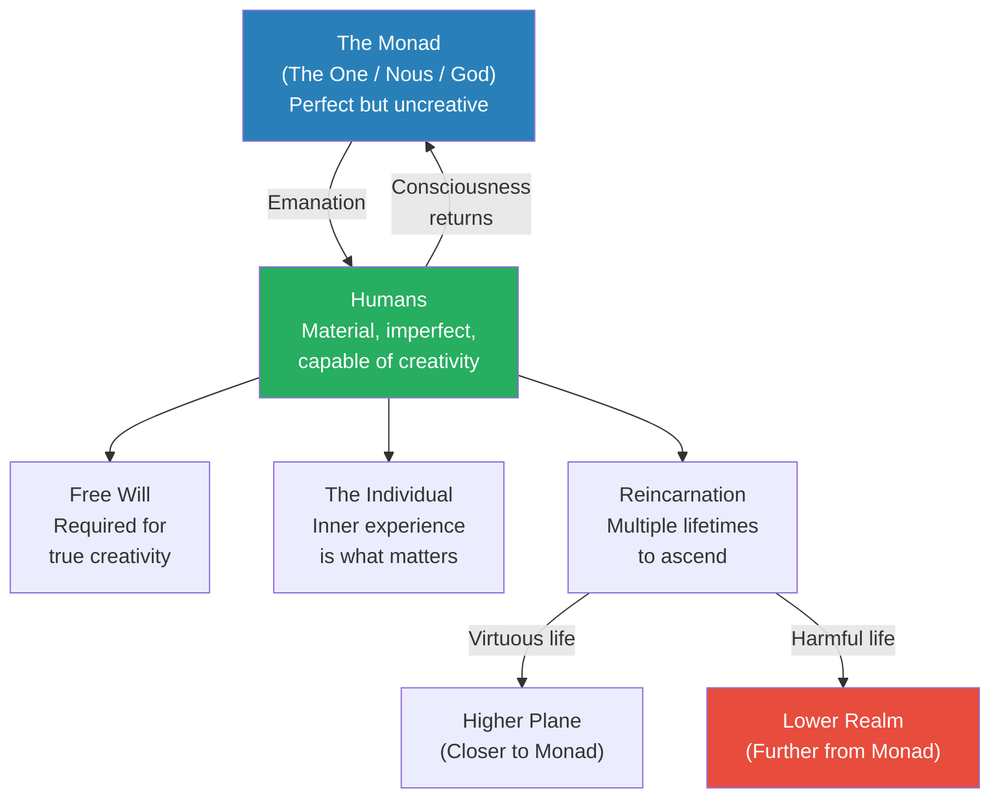
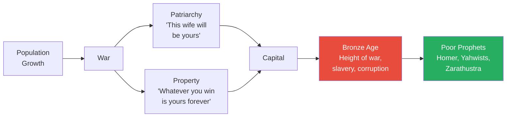
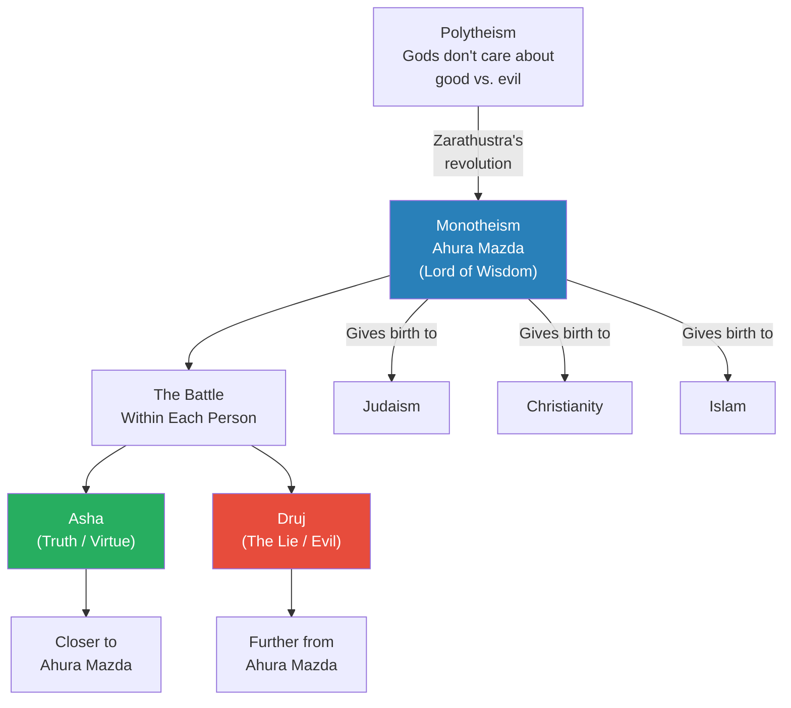
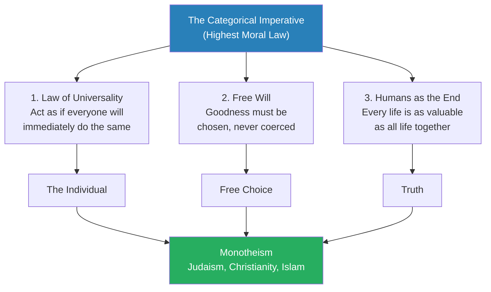
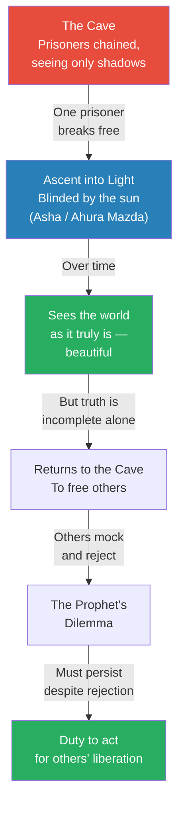
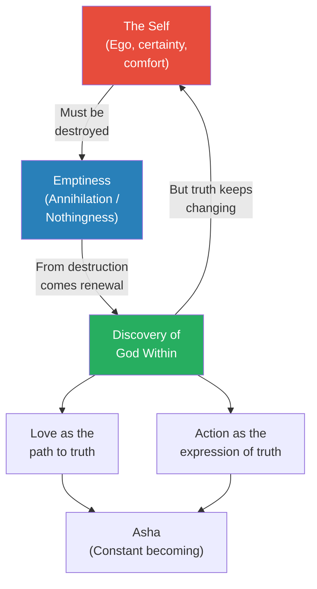
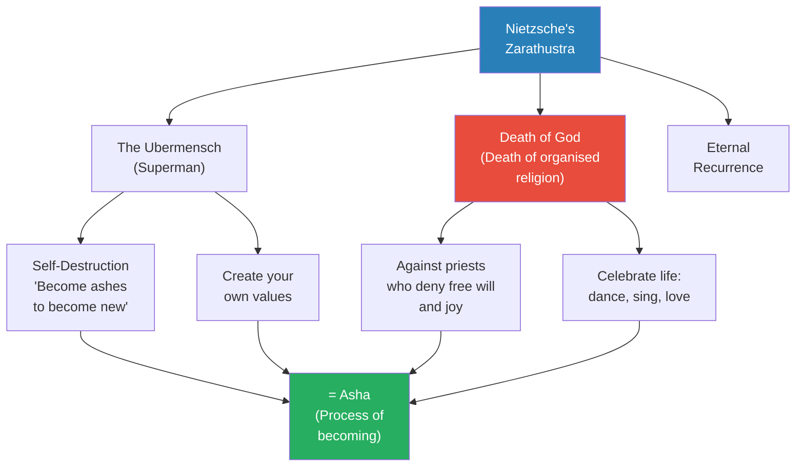
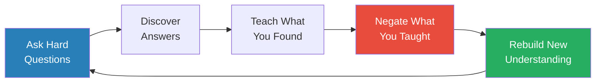
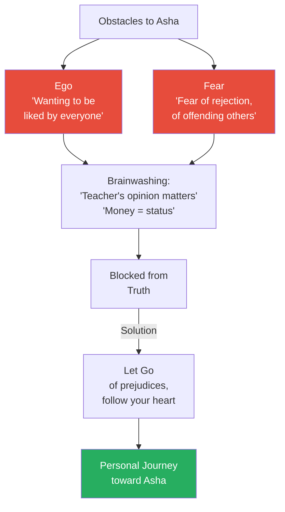

# Thus Spoke Zarathustra

> Prof. Jiang introduces Zarathustra as the most influential person who has ever lived — the prophet who created Zoroastrianism, the world's first great monotheistic religion, which gave birth to Judaism, Christianity, and Islam. The lecture traces how Zarathustra reimagined the ancient intuitive understanding of consciousness and the monad into a revolutionary moral framework centred on three concepts: the individual, free will, and truth (Asha). Prof. Jiang connects Zarathustra's ideas to Kant's categorical imperative, Plato's Allegory of the Cave, Rumi's poetry, and Nietzsche's radical reinterpretation, arguing that all of these thinkers channel the same Zoroastrian insight — that virtue is a never-ending process of becoming, not a destination.

---

## Overview: Key Highlights

- <b style="color: #27ae60">Zarathustra is the most influential person who ever lived</b> — he created the structural framework for monotheism that gave birth to Judaism, Christianity, and Islam
- <b style="color: #2980b9">Asha</b> — not simply "truth" but a comprehensive system of virtue combining universality, free will, and the sanctity of every human life
- <b style="color: #e74c3c">War, patriarchy, and property corrupted the original understanding</b> — the Bronze Age trinity destroyed humanity's intuitive connection to the monad
- <b style="color: #2980b9">The Categorical Imperative</b> — Kant's 18th-century formulation mirrors Zarathustra's concept of Asha with striking precision
- <b style="color: #27ae60">The individual, free will, and truth</b> — three revolutionary concepts that Zoroastrianism introduced and all monotheistic religions inherited
- <b style="color: #2980b9">Plato's Allegory of the Cave</b> — a Greek metaphor directly inspired by Zoroastrian ideas about Asha and Ahura Mazda
- <b style="color: #e74c3c">Organised religion is the enemy of Asha</b> — Nietzsche channels Zarathustra to argue that institutional religion enslaves rather than liberates
- <b style="color: #27ae60">Asha is a process of becoming, not a destination</b> — there is no end point, only a constant struggle toward virtue through self-destruction and renewal
- <b style="color: #2980b9">Rumi's poetry</b> — the Sufi mystic channels the same Zoroastrian insight: destroy yourself to find God within
- <b style="color: #e74c3c">Ego and fear are the two obstacles to Asha</b> — wanting to be liked and fearing rejection keep us from truth
- <b style="color: #27ae60">Compassion is not enough — you must act</b> — Zoroastrianism differs from Buddhism by demanding action against injustice, not passive acceptance
- <b style="color: #2980b9">The Monad</b> — the ancient intuitive understanding of God as a single conscious source from which all humans emanate and to which all return

| Concept | One-line summary |
|---------|-----------------|
| **Monad (The One / Nous)** | The single conscious God from which all humans emanate — perfect but lacking creativity |
| **Asha** | Truth, virtue, and righteousness — the Zoroastrian concept of the highest moral good |
| **Druj (The Lie)** | The opposite of Asha — deception, evil, and the force pulling humans away from virtue |
| **Ahura Mazda** | The Lord of Wisdom — Zarathustra's supreme God, represented by fire |
| **Categorical Imperative** | Kant's formulation of the highest moral law — act as if your actions will be reflected universally |
| **Allegory of the Cave** | Plato's metaphor for discovering Asha — escaping shadow reality to find the sun (truth) |
| **Free Will** | The essential condition for virtue — goodness without choice is meaningless |
| **Humans as the End** | Every human life is as valuable as all life together — you cannot sacrifice one for many |
| **Process of Becoming** | There is no final destination — virtue is a constant, never-ending journey of self-renewal |
| **The Ubermensch** | Nietzsche's "Superman" — the person who transcends conventional morality to create their own values |
| **Reincarnation** | Consciousness returns to the spirit world after death to reflect, learn, and ascend closer to the monad |

---

# The Lecture

## The Ancient Intuitive Understanding of Consciousness [0:00 - 3:30]

*Prof. Jiang opens by situating the lecture in the series — the class has covered the Greeks and the Israelites, and now turns to the Persians. Before introducing Zarathustra, he lays the foundation: how humans intuitively understood the universe before organised religion corrupted that understanding.*

> [!tip] Core Insight
> Humans intuitively understood the universe as a conscious, vibrating whole — the monad is perfect but uncreative, and it created imperfect humans precisely because imperfection enables creativity. God and humans are co-creators in a process of becoming.

*The monad-human relationship is not hierarchical domination but co-creation — God needs human imperfection to generate creativity, and humans need the monad to give meaning to their suffering.*

> [!note]- Expand: Full Lecture Detail
> Prof. Jiang begins by telling the class he is about to introduce them to <b style="color: #27ae60">the most influential person who has ever lived</b> — Zarathustra, the creator of Zoroastrianism, the world's first great world religion, which led to the rise of the world's first great empire, the Persian Empire.
>
> But before introducing Zarathustra, he steps back to explain the ancient intuitive understanding of the universe. He presents it as something humans are born with — an instinctive sense of how things work:
> - The universe is conscious and constantly vibrating
> - These vibrations are infinite — the slower they go, the more they give rise to matter
> - Humans inhabit both the material universe (through bodies) and the spiritual universe (through minds)
> - When we die, our consciousness returns to the universal vibration — we are in constant dialogue with the universe
>
> He introduces the concept of the <b style="color: #2980b9">monad</b> — also called "the one" or "nous" — the name for God in this ancient system. The monad is perfect, but perfection has a fatal limitation: it lacks imagination and creativity. That is why God created humans through emanation — because material beings with bodies can feel pain, fall down, die, suffer, and make mistakes. It is precisely through this imperfection — through disobedience and fallibility — that creativity becomes possible.
>
> Prof. Jiang uses the metaphor of a candle surrounded by mirrors: each mirror reflects the candle's light, meaning the monad exists within each of us. What matters is what happens to each individual — the inner experience of consciousness, not external status.
>
> He identifies three essential characteristics of the system:
> - **Free will** — creativity requires complete freedom; if the monad controls us, nothing is genuine
> - **The individual** — what matters is what happens inside each person, because only the individual can generate creativity
> - **Reincarnation** — death is not the end; consciousness returns to the spirit world for reflection; virtuous lives ascend to higher planes, harmful lives descend to lower realms

---

## War, Patriarchy, and the Corruption of the System [3:30 - 6:00]

*Prof. Jiang explains how growing populations led to war, which created patriarchy and property — the three forces that corrupted the original understanding and gave rise to the Bronze Age's capital-driven violence. Into this crisis steps Zarathustra, a poor prophet who must create a new system.*

*The Bronze Age represents the peak corruption of the original system — prophets like Zarathustra emerge precisely when capital, war, and patriarchy have most thoroughly severed humanity from the monad.*

> [!note]- Expand: Full Lecture Detail
> Prof. Jiang explains the mechanism by which the intuitive understanding was corrupted. As populations grew, war became inevitable, and war required incentives:
> - Promise men that women will be their property — "this wife will be yours"
> - Promise fighters that the spoils of war — gold, land — will be theirs forever
> - This created three interlocking forces: <b style="color: #e74c3c">war, patriarchy, and property</b>
>
> These three forces gave rise to the concept of capital. The Bronze Age was the height of capital, and therefore the height of war, slavery, corruption, and evil.
>
> Into this world, poor prophets emerge — people who come to remind humanity of its original nature. They tell people: what we are doing is wrong, we must remember that we are part of the monad, we are here to celebrate life not destroy it, to be creative not destructive, to love not make war.
>
> Zarathustra is one of these prophets, living approximately 3,000 years ago. He faces a specific problem: he enters a world where war, patriarchy, and property are so deeply embedded that people cannot imagine life without them. His task is to create a new system — new ideas expressed through poetry — that can help humanity return to the monad.

---

## Zarathustra's Revolution: Ahura Mazda, Asha, and Druj [6:00 - 9:58]

*Prof. Jiang presents the core innovations of Zoroastrianism — how Zarathustra reimagined the polytheistic system into a hierarchy topped by Ahura Mazda, the Lord of Wisdom, and introduced the cosmic struggle between Asha (truth/virtue) and Druj (the lie) as a battle fought within each individual.*

> [!tip] Core Insight
> Zarathustra's revolution was not simply replacing many gods with one. It was relocating the cosmic battle from the external world to the interior of each human being — heaven and hell are within us.

*Zoroastrianism is the structural ancestor of all three Abrahamic religions — the framework of one God, an internal moral battle, and individual accountability before the divine all originate here.*

> [!note]- Expand: Full Lecture Detail
> Prof. Jiang explains that the pre-Zarathustra world was polytheistic — you fought for your god, and the gods did not care about good and evil. You celebrated them, made sacrifices, and if you bribed them well enough, you won wars.
>
> Zarathustra reimagined this entire system:
> - He created a new hierarchy with <b style="color: #2980b9">Ahura Mazda</b> at the top — literally "Lord of Wisdom," represented by fire
> - In Chinese, Zoroastrianism is called "Bai Huo Jiao" — the religion of white fire, the religion of wisdom
> - The war of heaven and hell is relocated to within each person — two forces tear at every individual:
>   - <b style="color: #27ae60">Asha</b> — truth, virtue, righteousness
>   - <b style="color: #e74c3c">Druj</b> — the lie, deception, evil
>
> Prof. Jiang notes that the Greeks admired the Persians deeply. They said Persians excelled at three things: horse riding, archery, and telling the truth. The Persians found it abhorrent to lie. But this is a simplistic reading — Asha is not merely "telling the truth." It is a comprehensive system of virtue.
>
> By being virtuous, by doing good in the world, you become closer to Ahura Mazda — you become His representative on earth.
>
> The revolutionary consequence: Zoroastrianism gave birth to three world religions — Judaism, Christianity, and Islam — representing two to three billion people today. This is why Prof. Jiang calls Zarathustra the most influential individual who ever lived: he created the structure for monotheism.

---

## The Categorical Imperative: Kant Channels Zarathustra [9:58 - 16:00]

*Prof. Jiang introduces Kant's categorical imperative as a parallel formulation of Asha — three principles from the 18th century that mirror what Zarathustra taught 3,000 years earlier. The connection reveals how deeply Zoroastrian ideas permeated Western philosophy.*

*The categorical imperative is not an 18th-century European invention — it is Zarathustra's Asha restated in Enlightenment language. The three principles map directly onto the three concepts that gave rise to monotheism.*

> [!note]- Expand: Full Lecture Detail
> Prof. Jiang introduces <b style="color: #2980b9">Immanuel Kant's categorical imperative</b> — the highest moral law, the highest moral good — and argues it is "very similar to the concept of Asha." Three principles compose it:
>
> **1. The Law of Universality (the most important):**
> - Imagine that whatever you do, say, or think, everyone in the world will immediately do the same
> - If you get angry, everyone gets angry simultaneously; if you are violent, everyone is violent
> - Do you want to live in that world? Obviously not
> - This has been misunderstood as the Golden Rule ("do unto others"), but it is a much higher concept
> - Imagine you are God — everything you do is reflected throughout the universe — how would you behave?
> - You would behave with the highest virtue, because you want to make the world a better place
>
> **2. Free Will:**
> - Whatever you do cannot be coerced — it must come from your own desire, volition, and choice
> - "I cannot make you do good. You only want to do good by yourself"
> - Even choosing evil is important, because the principle of free will must be maintained
>
> **3. Humans as the End:**
> - You may have heard "the means to an end" — a king who sacrifices a billion people to create a perfect world
> - Kant and Zarathustra would both say this is fundamentally wrong
> - <b style="color: #e74c3c">Every human life is as valuable as all human life together — you cannot sacrifice one for the sake of others</b>
> - That path can only lead to hell
>
> These three principles produce three revolutionary concepts that changed human history:
> - **The individual** — what matters is what happens inside you, regardless of what everyone else does
> - **Free choice** — never feel forced; act because you will it
> - **Truth** — the monad will know, Ahura Mazda will know, and you will know; what your family, community, or nation says does not matter — only what you feel in your heart

---

## Plato's Allegory of the Cave: Greek Reception of Zoroastrian Ideas [16:00 - 22:00]

*Prof. Jiang explains how the Greeks — who considered Zarathustra the first scientist, astronomer, philosopher, and magician — absorbed his ideas. Plato's Allegory of the Cave is presented as a direct metaphor for Asha: escaping the shadow world of ignorance to discover the sun of truth, and then facing the painful duty of returning to free others.*

*The Allegory of the Cave is not merely an epistemological metaphor — it is a moral imperative. Finding Asha is incomplete without the painful return to liberate others, even when they mock you for it.*

> [!note]- Expand: Full Lecture Detail
> Prof. Jiang explains that the Greeks held Zarathustra in enormous reverence — they considered him not just a poet but the first scientist, the first astronomer, the first philosopher, the first magician. Plato took many of his ideas and created what Prof. Jiang calls "a very powerful metaphor that helps us understand Asha better" — <b style="color: #2980b9">the Allegory of the Cave</b>.
>
> He walks through the allegory step by step:
> - We are prisoners in a cave, chained to the ground, unable to move our necks
> - We stare at a wall where a fire behind us projects shadows
> - We give names to these shadows and call them "reality" — but it is all fake, all false
> - One day, one prisoner's chains disappear, and they stumble upward out of the cave
> - They are blinded by the sun — which is Asha, truth, Ahura Mazda
> - The pain of seeing is overwhelming, but over time their eyes adjust
> - They see the world as it truly is — birds flying, trees, animals — "This is beautiful. I found heaven, I found Asha"
>
> But then comes the critical turning point:
> - Finding truth is not enough — truth is incomplete if only you possess it
> - <b style="color: #27ae60">You must return to the cave to free the other prisoners</b>
> - When you return, the prisoners mock you — they say you have gone crazy, that you are blind
> - "Is life as a philosopher for the ancient Greeks enjoyable? Of course not. You will be mocked, you will be ridiculed"
> - This is why Socrates was executed — he returned to the cave and told people their reality was an illusion
> - This is why Jesus was crucified, why all prophets suffer — the price of Asha is persecution

---

## Rumi and the Sufi Tradition: Destroying Yourself to Find God [22:00 - 30:00]

*Prof. Jiang shifts from Greek philosophy to Islamic mysticism, introducing Rumi as another channel for Zarathustra's ideas. The Sufi concept of annihilation — destroying the self to become one with God — maps directly onto Asha's demand for perpetual self-destruction and renewal.*

> [!tip] Core Insight
> Rumi's poetry expresses the same Zoroastrian truth in Islamic language: you must destroy everything you know — your ego, your certainties, your comfort — to discover the divine within you. The path to God requires becoming nothing.

*The cycle of self-destruction and renewal is not a one-time event but a permanent condition — Rumi, like Zarathustra, insists that truth is always moving, always becoming, and the moment you think you have arrived, you have stopped.*

> [!note]- Expand: Full Lecture Detail
> Prof. Jiang introduces <b style="color: #2980b9">Rumi</b>, the 13th-century Persian Sufi poet, as another figure who channels Zarathustra's ideas. He reads several passages and explains their Zoroastrian roots:
>
> > [!quote] Rumi
> > "Let yourself be silently drawn by the strange pull of what you really love. It will not lead you astray."
>
> Prof. Jiang explains this as the Zoroastrian principle: follow your heart, because Asha — the truth — will guide you. What you truly love is the monad calling you back.
>
> He then reads another passage: "When I am with you, we stay up all night. When you are not here, I can't go to sleep. Praise God for these two insomnias, and the difference between them." Prof. Jiang explains this is about the relationship with God — when you are close to truth, you are ecstatic and cannot sleep; when you are far from it, you are tormented and cannot sleep. Both states are gifts because both keep you searching.
>
> Key Rumi concepts Prof. Jiang connects to Zarathustra:
> - "Put your thoughts to sleep, do not let them cast a shadow over the moon of your heart. Let go of thinking" — this is the same as Zarathustra's injunction to destroy your certainties
> - "I have lived on the lip of insanity, wanting to know reasons, knocking on a door. It opens. I've been knocking from the inside" — God is not outside you; the monad is within you, reflected in the candle-mirror metaphor
> - The Sufi concept of <b style="color: #2980b9">annihilation (fana)</b> — destroying the ego to merge with the divine — is precisely what Zarathustra demands
>
> Prof. Jiang emphasises that this tradition is not Buddhism, despite structural similarities. The critical difference: <b style="color: #27ae60">Zoroastrianism demands action, not passive compassion</b>. Compassion alone is not enough — if you see injustice, you must speak out. Indifference, even compassionate indifference, is complicity.

---

## Nietzsche's Zarathustra: The Ubermensch and the Death of God [30:00 - 42:00]

*Prof. Jiang turns to Nietzsche's "Thus Spoke Zarathustra" — the book that gives the lecture its title. He argues that Nietzsche was genuinely channelling Zarathustra, not merely using him as a literary device, and reads extensively from the text to demonstrate how Nietzsche's radical ideas about self-overcoming, the death of conventional morality, and the celebration of life all trace back to Asha.*

> [!tip] Core Insight
> Nietzsche did not invent the Ubermensch from nothing — he channelled Zarathustra's ancient teaching that you must destroy yourself to become new. "How could thou become new if thou had not first become ashes?" The superman is simply the person who lives Asha.

*Every element of Nietzsche's philosophy that appears radical or nihilistic is actually a restatement of Zarathustra's 3,000-year-old teaching — self-destruction as the path to renewal, rejection of institutional authority, and the celebration of creative life.*

> [!note]- Expand: Full Lecture Detail
> Prof. Jiang reads extensively from Nietzsche's *Thus Spoke Zarathustra*, treating each passage as a commentary on Asha:
>
> > [!quote] Nietzsche (channelling Zarathustra)
> > "How could thou become new if thou had not first become ashes?"
>
> **On the spirit of gravity vs. the spirit of joy:**
> - Nietzsche writes: "I should only believe in a God that would know how to dance"
> - Prof. Jiang explains: what Nietzsche hates is organised religion — it is very serious, very sombre
> - Organised religion says "don't drink, don't smoke, don't have sex, or you'll burn in hell"
> - <b style="color: #e74c3c">That is the spirit of gravity — the devil — because it denies you free will and joy</b>
> - Zarathustra and Nietzsche both insist: Ahura Mazda is all merciful, all forgiving, all love
> - The proper response to a beautiful world is to dance, sing, make love, laugh, smile
> - A priest who tells you to meditate your whole life to avoid sin "is a devil" — he denies your capacity to love and act
>
> **On self-destruction and renewal:**
> - "Ready must thou be to burn thyself in thy own flame"
> - To live is to die — to truly understand, you must first destroy everything you think you understand
> - Prof. Jiang gives a classroom analogy: "You come to my class for a semester, and everything I teach you makes sense. But at the end of the semester, you should say everything I learned this semester is wrong — and rebuild your own knowledge"
> - <b style="color: #27ae60">Through that process of negation and reconstruction, you achieve enlightenment</b>
>
> **On the constant struggle between extremes:**
> - "One day will the solitude weary thee... thou will one day cry all is false"
> - Life alternates between hope and tragedy — some days hopeful, some days depressed
> - This is not a problem to be solved but the process of wisdom itself
> - Unlike Buddhism, which says avoid anger, Nietzsche (via Zarathustra) says embrace your anger — hate and love go together, anger and calm go together
> - By going to one extreme, you can embrace the other
>
> **On leaving the teacher:**
> - "I now go alone, my disciples. Ye also now go away and alone... depart from me and guard yourselves against Zarathustra"
> - The man of knowledge must not only love his enemies but hate his friends
> - Prof. Jiang interprets: if you want true knowledge, you must eventually make your teacher your enemy
> - <b style="color: #e74c3c">You must destroy your teachers in order to discover your true self</b>
>
> > [!example] The Teacher's Paradox
> > - Zarathustra teaches his disciples everything he knows
> > - Then he tells them to leave him — to guard themselves against him
> > - He says they should be ashamed of him, because perhaps he has deceived them
> > - True knowledge requires rejecting the teacher who gave you the foundation
> > - Most people want to cling to their mother or teacher — but you can never achieve Asha that way
> > - Prof. Jiang connects this to his own classroom: "What I teach you, you should eventually negate"
> > **The lesson:** The greatest teacher is one who makes themselves unnecessary — and the greatest student is one who eventually rejects what they were taught in order to discover their own truth.

---

## Zoroastrianism vs. Buddhism: Compassion Is Not Enough [42:00 - 44:00]

*Prof. Jiang draws a sharp distinction between Zoroastrianism and Buddhism — structurally similar but fundamentally different in their demands. Asha requires action, not passive compassion.*

> [!note]- Expand: Full Lecture Detail
> Prof. Jiang acknowledges the structural similarities between Zoroastrianism and Buddhism — the framework of inner transformation, the rejection of materialism, the pursuit of enlightenment. But he insists on a fundamental difference:
>
> - <b style="color: #27ae60">Zoroastrianism says compassion is not enough — you must act</b>
> - Justice requires action — if you see injustice, you must speak out
> - You cannot say "I am indifferent because I am compassionate" — that is complicity
> - This is why Zoroastrians were so creative — they believed in action
> - Being indifferent is being complicit in the system
>
> This distinction explains why Zoroastrianism, unlike Buddhism, gave rise to an empire-building civilisation — the demand for action in the world rather than withdrawal from it.

---

## Virtue as Eternity: What Survives Death [44:00 - 47:50]

*Prof. Jiang reads Nietzsche on virtue as the only thing that survives death — when our bodies decompose, what remains is the good we have done, the knowledge and emotions we generated. Being human is, first and foremost, being virtuous.*

> [!note]- Expand: Full Lecture Detail
> Prof. Jiang reads from Zarathustra on virtue and light:
> - "Like the star that goes out, so is every work of your virtue — even as its light is on its way and travelling"
> - When we die, our bodies decompose, but our virtue — all the good we have done, all the knowledge and enlightenment and emotions we have generated — is eternal
> - <b style="color: #27ae60">Being human is to be first and foremost virtuous — to seek Asha</b>
>
> He then reads a passage attacking the scholars and academics:
> - "For this is a truth: I have departed from the house of the scholars, and the door have I also slammed behind me"
> - Scholars sit in cool shade, wanting to be mere spectators — they "gape at the thoughts which others have thought"
> - This is a radical idea: universities exist not to teach you how to think but to make you fall into ignorance
> - Professors are priests who have departed from reality and chosen comfort
> - <b style="color: #e74c3c">True knowledge can only be found in the everyday, in the mundane, with ordinary people — that is where God is</b>
> - Universities are "temples for the comfort of priests"

---

## Prof. Jiang's Personal Reflection: The Process of Becoming [47:50 - 55:00]

*Prof. Jiang pauses to reflect on his own teaching practice, acknowledging mistakes and connecting his personal journey of intellectual growth to Zarathustra's concept of constant becoming. He corrects an error from his previous lecture on the Bible and frames the entire course as a journey of questions, not answers.*

*Prof. Jiang models the Zarathustra principle in real time — publicly correcting his own errors and framing his teaching as a never-ending cycle of discovery, negation, and renewal.*

> [!note]- Expand: Full Lecture Detail
> Prof. Jiang pivots to a personal moment, demonstrating Asha through his own practice:
>
> - He corrects an error from his previous lecture on the Bible: in the story of Jacob and Rachel, he said Jacob had to work seven years for Rachel after his marriage to Leah, but a subscriber named Cole corrected him — the Bible says Laban gave Rachel to Jacob immediately, and Jacob then worked seven years to pay off the debt
> - He acknowledges: "I probably made a lot of small errors in my talk last class, and I obviously make a lot of mistakes every class"
>
> He then makes a broader statement about the nature of the class:
> - "This is a class not about answers — it is about questions"
> - What makes the class valuable is constantly asking the hard questions: what does it mean to be human, where do we come from, why are we here, where are we going?
> - "I am constantly in the process of becoming — constantly trying to discover the answers"
> - He gives a specific example: before studying Zarathustra, he had said Christianity was the first monotheistic religion — now he recognises that is wrong, it is Zoroastrianism
> - "If you don't like what I say this class, or you don't like my opinion, just wait a year or two, and I'll probably change my opinion"
> - <b style="color: #27ae60">This is what true knowledge is about — you must be willing to constantly destroy yourself, to burn yourself into ashes so that you may build yourself anew</b>

---

## Q&A: Is Asha Different for Everyone? Can Hitler Be Forgiven? [55:00 - 1:03:00]

*The Q&A session tackles the hardest questions in the lecture — whether Asha is subjective (can someone genuinely believe evil is Asha?), whether forgiveness extends to the worst acts in history, and whether Asha changes across a lifetime. Prof. Jiang's answers reveal the radical implications of Zoroastrian thought.*

*The two obstacles to Asha are not intellectual but psychological — ego and fear keep people trapped in what others think rather than pursuing their own truth.*

> [!note]- Expand: Full Lecture Detail
> **Student Question 1: Can Hitler's actions count as Asha?**
>
> A student asks: if Asha is different for different individuals, does that mean Hitler — who genuinely believed Jews were evil — was pursuing his own version of Asha?
>
> Prof. Jiang responds carefully but firmly:
> - Ahura Mazda is complete forgiveness, compassion, and love
> - Whatever we do in this world will ultimately be forgiven
> - "I know this is hard for a lot of people to accept"
> - If you truly want to discover Asha, you have to let go of the idea that some people must burn in hell
> - <b style="color: #27ae60">The very point of Asha is: don't worry about other people, just worry about yourself</b>
> - He acknowledges this will generate backlash: "I know I will get shouted at, I will get cursed online for saying Hitler will be forgiven"
> - "But everyone will be forgiven, because there is no hell. Hell is what we create in our hearts"
>
> He identifies two obstacles that keep people from Asha:
> - <b style="color: #e74c3c">Ego</b> — wanting to be liked by everyone
> - <b style="color: #e74c3c">Fear</b> — fear of rejection, of saying something that offends, of being politically incorrect
> - Society brainwashes us into thinking others' opinions matter — teacher recognition determines university admission, money determines status
> - Zarathustra, Nietzsche, Rumi, and Plato all say the same thing: it does not matter
> - True happiness requires a personal journey that demands solitude and the rejection of everything you previously knew
>
> **Student Question 2: Does Asha change over a lifetime?**
>
> A student asks whether Asha shifts as you grow from child to adult.
>
> Prof. Jiang responds:
> - The Zoroastrian answer: Asha is virtue and God is virtue — moving toward Asha moves you toward perfection
> - The Nietzschean answer: God is creativity — moving toward Asha means constantly reinventing yourself
> - This is a never-ending process with no finality
> - Each person will live their own individual life, different from others
> - "Follow your heart, ignore what others think, kill your fears, and believe in yourself"
>
> **Student Follow-up: Will we ever reach Asha?**
>
> - No — there is no end point, no destination, only becoming
> - It is not possible to fully achieve Asha in one lifetime — that is why reincarnation exists
> - Even if you reach a high point, everyone else has not — so you have a duty to help others
> - <b style="color: #27ae60">The universe is a constant process of becoming, of struggle, of pain, of tragedy — but from that, we can build hope and virtue and good</b>

---

## Looking Ahead: Three Civilisations Converge [1:03:00]

*Prof. Jiang closes by situating this lecture within the larger series. Having covered the Greeks, Israelites, and Persians individually, next week he will show how these three civilisations interacted with one another — the history of their convergence.*

> [!note]- Expand: Full Lecture Detail
> Prof. Jiang summarises the arc of the series so far:
> - The class has covered three major civilisations that emerged after the collapse of the Bronze Age: the Greeks, the Israelites, and the Persians
> - Next week's lecture will show how these three civilisations interact with each other
> - The focus will shift from individual civilisation profiles to their historical convergence and mutual influence

---

## Connections

**Builds on:** [[17 - The Bible]] (the Israelite tradition that Zoroastrianism predates and influences), earlier lectures on the Greeks and the Bronze Age collapse
**Sets up:** Lecture 19 (the interaction and convergence of Greek, Israelite, and Persian civilisations)
**Related books in vault:** [[Sapiens - Yuval Noah Harari]] (the agricultural revolution and religion's role), [[The 48 Laws of Power - Robert Greene]] (power dynamics and self-destruction as strategy)

---

## The Takeaway

This lecture redraws the genealogy of Western and Middle Eastern religion. The conventional story places Abraham or Moses at the origin of monotheism and treats Greek philosophy as an independent intellectual tradition. Prof. Jiang's argument — that Zarathustra preceded and structurally influenced all three — means that the individual, free will, and truth as we understand them in the Judeo-Christian-Islamic tradition are not originally Abrahamic concepts. They are Zoroastrian. Kant's categorical imperative, Plato's cave, Rumi's mysticism, and Nietzsche's Ubermensch are all variations on a 3,000-year-old Persian theme.

The most counterintuitive insight is Prof. Jiang's insistence that there is no hell and that universal forgiveness extends to everyone — including history's worst actors. This is not a soft liberal platitude but a hard consequence of taking Asha seriously: if what matters is your own individual journey toward truth, then judging others is itself a deviation from Asha. The two real obstacles — ego and fear — are internal, not external. Evil is not a cosmic force to be defeated but a shadow on the cave wall to be walked past.

What remains unresolved is the tension between Zoroastrianism's demand for action against injustice and its simultaneous insistence on universal forgiveness. If you must act when you see injustice, but you must also forgive everyone, where is the line? Prof. Jiang does not resolve this — and the fact that Zarathustra, Kant, and Nietzsche all wrestled with it suggests it may be the question that defines Asha itself: a paradox you live with, not a problem you solve.
