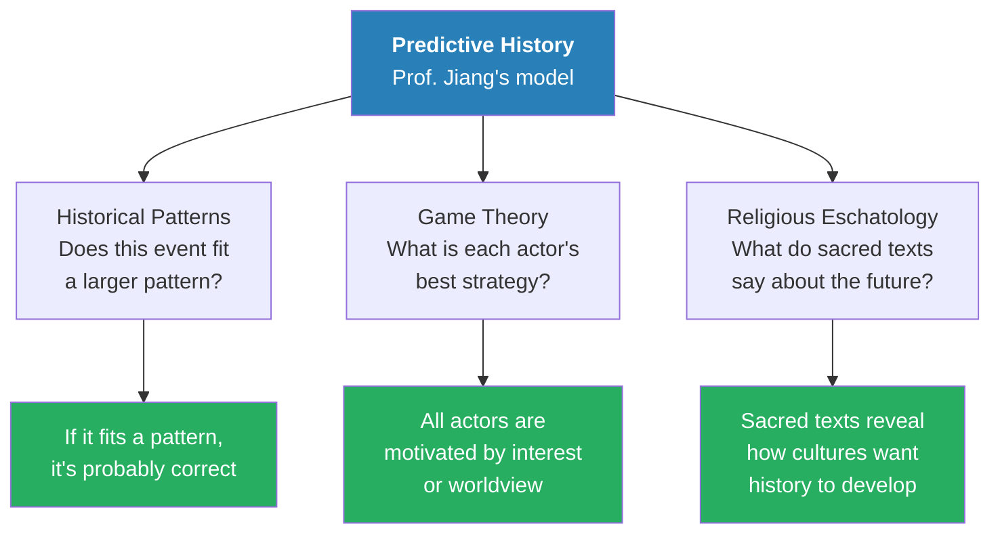
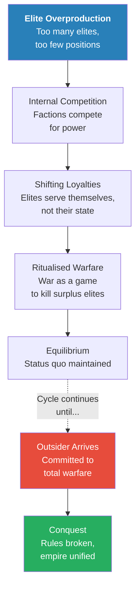
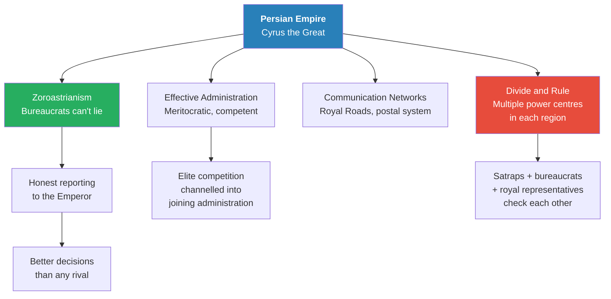
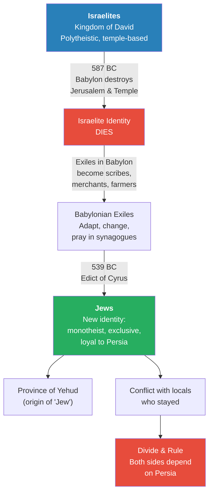
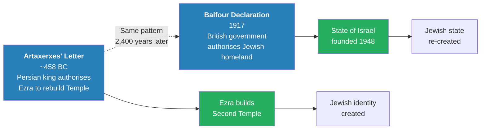
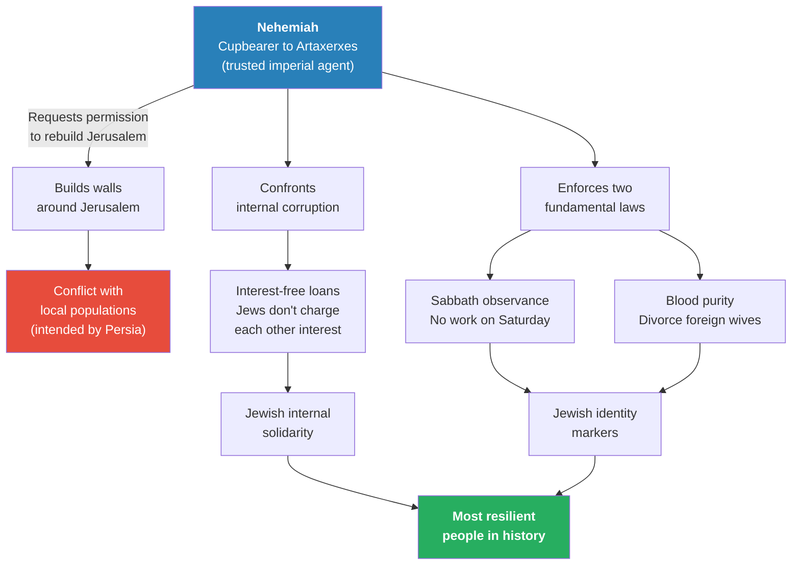
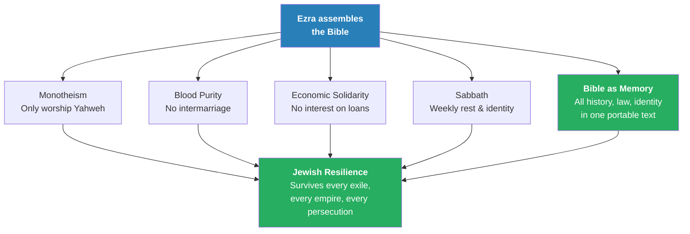
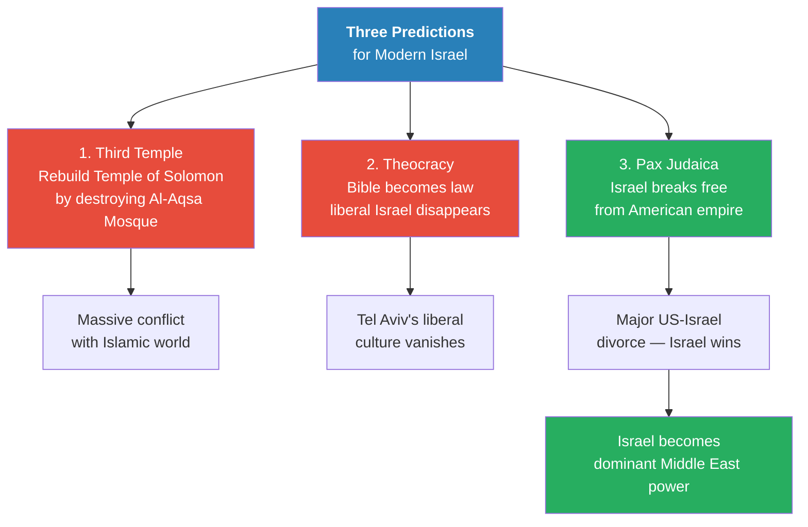

# Dawn of the Jews

> Prof. Jiang argues that the Jewish identity as we know it was not a natural evolution from the ancient Israelites but a deliberate construct of the Persian Empire. After the Babylonians destroyed Jerusalem and its temple in 587 BC, the Israelite identity effectively died. When Cyrus the Great conquered Babylon and issued his famous edict sending exiles back to Jerusalem, he was not acting from divine inspiration — he was executing a divide-and-rule strategy to control the Levant, the most strategically important region in the ancient world. The returning exiles, led by Ezra and Nehemiah, created a new identity defined by monotheism, blood purity, and biblical law — deliberately separating themselves from the Israelites who had stayed. Prof. Jiang draws a direct line from this Persian strategy to the British Balfour Declaration of 1917 and the modern State of Israel, arguing that the same imperial pattern repeats: create a loyal minority in the Levant to control access to Egypt and the wider region.

---

## Overview: Key Highlights

- <b style="color: #27ae60">The Jews were invented by the Persian Empire</b> — the Jewish identity is distinct from the Israelite identity and was created as an instrument of imperial divide-and-rule
- <b style="color: #2980b9">Three principles of geopolitics</b> — elite overproduction matters more than interstate conflict, elites have shifting loyalties, and war can maintain the status quo
- <b style="color: #e74c3c">The Israelites are gone after 587 BC</b> — the Babylonian destruction of Jerusalem ended the Israelite identity; the people survived but the nation did not
- <b style="color: #2980b9">Divide and rule</b> — the most effective imperial strategy, used by Persia to control the Levant by planting a loyal minority surrounded by enemies
- <b style="color: #27ae60">Cyrus the Great's edict was strategic, not divine</b> — sending exiles back to Jerusalem created a dependent population loyal only to Persia
- <b style="color: #e74c3c">Ezra enforced blood purity and monotheism</b> — the returning exiles rejected the Israelites who stayed, creating a fanatical new identity based on ethnic and religious exclusivity
- <b style="color: #2980b9">The Balfour Declaration mirrors the Edict of Cyrus</b> — the British used the same biblical script to create the modern State of Israel for the same geopolitical purpose
- <b style="color: #27ae60">The Bible as historical memory makes Jews resilient</b> — encoding identity in a portable text made the Jewish people the most adaptable civilisation in history
- <b style="color: #e74c3c">Interest-free loans and Sabbath observance</b> — internal solidarity mechanisms that made the Jewish community economically powerful and culturally cohesive
- <b style="color: #2980b9">Predictive history</b> — Prof. Jiang's model combining historical patterns, game theory, and religious eschatology to forecast future developments
- <b style="color: #27ae60">Total warfare wins wars</b> — ritualised warfare serves the status quo; only outsiders committed to total warfare actually conquer
- <b style="color: #e74c3c">Three predictions for Israel</b> — rebuilding the Third Temple, becoming a theocracy, and breaking free from the American empire

| Concept | One-line summary |
|---------|-----------------|
| **Elite overproduction** | Domestic competition among too many elites for too few positions drives most historical conflict |
| **Shifting loyalties** | Elites serve themselves first — alliances are temporary and self-interested |
| **War as equilibrium** | Ritualised warfare kills off surplus elites to maintain the status quo |
| **Total warfare** | Unrestricted war committed to victory — the only strategy that actually conquers |
| **Divide and rule** | Setting factions against each other so both depend on the empire to manage conflict |
| **Edict of Cyrus** | The Persian decree sending Jewish exiles back to Jerusalem — strategic, not divine |
| **Blood purity** | Ezra's doctrine that Jews must not intermarry — a break from Israelite practice |
| **Predictive history** | Prof. Jiang's model: historical patterns + game theory + religious eschatology |
| **Second Temple** | The rebuilt temple financed by Persia — the happiest moment in Jewish history |
| **Province of Yehud** | The Persian administrative unit that gave the Jews their name |
| **Pax Judaica** | Prof. Jiang's prediction that Israel will replace American dominance in the Middle East |

---

# The Lecture

## Predictive History — A New Model for Understanding [0:00 - 3:30]

*Prof. Jiang opens by announcing the final ten lectures of the series will demonstrate how the American empire will fall and be replaced by Israel — what he calls Pax Judaica. Before diving into history, he answers YouTube questions and introduces his model of predictive history: three tools for understanding why events happen and what comes next.*

*Prof. Jiang's three-tool model allows him to move from describing history to predicting it — each tool checks the others, and together they reveal strategies that pure chronology misses.*

> [!note]- Expand: Full Lecture Detail
> Prof. Jiang tells the class they have ten lectures remaining, and the trajectory is clear: he will show how the American empire falls and is replaced by what he calls <b style="color: #2980b9">Pax Judaica</b>. But before launching into the historical narrative, he takes audience questions from YouTube.
>
> - On restoring the right hemisphere and creativity: you must reject materialism — money, power, status. As a society, only a major existential crisis will force collective altruism and creativity. Individually, falling in love, having children, or volunteering can activate the right hemisphere
> - On psychedelics: Prof. Jiang is interested but does not partake — he reads extensively and practises an altruistic lifestyle, which he considers sufficient to break free from materialistic programming
> - On understanding historical bias: it is impossible to be unbiased, and often documentation exists from only one source. His solution is a new model he calls <b style="color: #2980b9">predictive history</b>, built on three components:
>   - **Historical patterns** — when examining an event, ask whether it fits a larger pattern. If it does, the interpretation is probably correct
>   - **Game theory** — all historical actors are motivated by their interests or worldview. Identify each actor's best strategy
>   - **Religious eschatology** — every culture has a religious outlook embedded in sacred texts (the Bible, the Quran). These texts reveal not only how cultures perceive history but how they want history to develop — and therefore what strategies they will pursue
> - On Jewish dominance: a student notes that Jewish dominance in various industries is relatively recent. Prof. Jiang agrees there is something cultural that makes Jews effective in capitalistic, globalised systems, but notes that Chinese people are also materialistic yet not as creative. He believes the Bible — with its tradition of debate and questioning — better explains Jewish success
>
> He frames the entire class as intellectual speculation — "take everything I say with a grain of salt" — and announces the central thesis: Israel and the Jewish identity are constructs of imperial imagination, shaped by whichever empire controls the Levant.

---

## Three Principles of Geopolitics [3:30 - 9:00]

*Prof. Jiang lays out three principles that will govern the rest of the series: competition within states matters more than competition between them, elites shift loyalties constantly, and war can be a mechanism to protect the status quo rather than change it.*

> [!tip] Core Insight
> The conflicts that shape history are not between nations but within them. Elite overproduction — too many powerful people competing for too few positions — drives most of the violence, intrigue, and transformation we see across civilisations.

*The cycle of elite overproduction and ritualised warfare can persist for centuries — but it always ends when an outsider arrives who does not play by the rules.*

> [!note]- Expand: Full Lecture Detail
> Prof. Jiang presents three principles he wants the class to remember for the rest of the series:
>
> - **Principle 1 — Competition within states matters more than competition between them.** The driving force of historical conflict is <b style="color: #2980b9">elite overproduction</b>: too many elites competing for too few status positions. This internal competition generates far more violence and transformation than interstate wars
> - **Principle 2 — Elites have shifting loyalties.** He invokes Game of Thrones: everyone wants to be king, and they will kill their brother, father, or mother to achieve it. Elites are loyal only to themselves. The world is "just a game of thrones"
> - **Principle 3 — War can maintain the status quo.** When internal competition becomes too destabilising, elites start a war to kill off surplus competitors. This restores <b style="color: #2980b9">equilibrium</b> within the system. War is not always about conquest — often it is about preservation
>
> > [!example] The Warring States Period and the Rise of Qin
> > - China before the Qin empire was divided into powerful warring states — Zhao, Chu, Wei, and others
> > - The Qin state was the poorest, most isolated, and least advanced
> > - The other states did not genuinely try to conquer each other — their elites were intermarried, and warfare was ritualised
> > - Chinese chess emerges from this period — warfare with strict rules, which is "stupid" if you actually want to win
> > - Sun Tzu's *The Art of War* is "one of the stupidest books ever written" — it teaches how to cheat within a regulated game, not how to win a real war
> > - The Qin conquered everyone because they committed to total warfare: meritocratic promotion, happy soldiers, destroying enemy civil centres, siege warfare, killing civilians, destroying supply lines, and striking fear
> > - The same pattern — outsider committed to total war defeats status quo powers playing by rules — repeats with Rome, the Prussians, the Aztecs, the Mongols
> > **The lesson:** Ritualised warfare exists to maintain equilibrium among intermarried elites. Real conquest requires someone who refuses to play the game.
>
> Prof. Jiang distils how to actually win a war into a clear list:
> - Total commitment to victory — no half-measures
> - Meritocratic promotion — talent rises regardless of birth
> - Keep soldiers happy — invested troops fight harder
> - Destroy enemy civil centres and supply lines
> - Divide and conquer
> - Strike fear — kill their gods
>
> Every power that has genuinely conquered — Romans, Prussians, Aztecs, Mongols — did all of these things. When states do not do these things, it reveals they are not actually trying to win — they are maintaining equilibrium.

---

## Mesopotamian Empires and the Strategic Levant [9:00 - 19:00]

*Prof. Jiang traces the pattern of elite overproduction and outsider conquest through Mesopotamian history — from the first city-states through the Akkadian, Babylonian, Assyrian, and Neo-Babylonian empires — establishing why the Levant is the most strategically important territory in the ancient world.*

*Each empire in Mesopotamia follows the same pattern: internal equilibrium maintained by ritualised warfare, broken by an outsider willing to fight without rules, until the Persian Empire introduces a fundamentally different model of governance.*

> [!note]- Expand: Full Lecture Detail
> Prof. Jiang applies his three principles to Mesopotamian history, starting with the cradle of civilisation:
>
> - <b style="color: #2980b9">Uruk</b> was the first city-state, which developed colonies throughout the Tigris and Euphrates. These colonies eventually came into conflict — but it was ritualised conflict among intermarried elites
> - The critical rule: you do not attack each other's temple, because the god lives there — and all the gold is in the temple. This meant warfare accomplished almost nothing, which was the point
> - The pattern broke when <b style="color: #e74c3c">Lugalzagesi of Umma</b>, a lower nobleman, decided to ransack each city's temple. He gained the resources to build an empire, but the threatened city-states invited mercenaries from Akkad to help
> - <b style="color: #2980b9">Sargon of Akkad</b> — whose name means "legitimate ruler," which probably means he was not one — seized the opportunity. Like David, he was an outsider who stole the throne
>
> Prof. Jiang identifies the pattern: when internal competition among city-states reaches stalemate, an outsider who does not respect the rules unites everyone. This is why the Qin unified China, why Sargon built the Akkadian Empire, and why Cyrus the Great would build the Persian Empire.
>
> He then establishes the strategic centrality of the Levant:
> - The Levant gives access to three of the historically wealthiest regions: Egypt, Mesopotamia, and Anatolia
> - <b style="color: #27ae60">Whoever controls the Levant can always threaten Egypt</b> — and whoever controls Egypt controls the world
> - Jerusalem is literally "the centre of the world" — for geopolitical and trade reasons, not just religious ones
> - For most of history, the Levant was an Egyptian colony, but after the Bronze Age collapse, it became contested territory
>
> The empires cycle through: Akkadian, Babylonian (Hammurabi), Assyrian (rule by brutality — "they will kill everyone if you rebel"), Neo-Babylonian. But Mesopotamia is inherently hard to defend — mountain tribes on the borders constantly threaten the core, which is why empires change so frequently.
>
> At this time in history, an empire is not a modern nation-state. It is a loose confederation controlling trade choke points, where everyone else goes along because it benefits them.

---

## The Persian Empire — A New Model of Rule [19:00 - 26:00]

*Prof. Jiang explains why the Persian Empire under Cyrus the Great was fundamentally different from its predecessors — not just larger but governed through Zoroastrian ethics, effective administration, and a sophisticated divide-and-rule strategy that no previous empire had mastered.*

> [!tip] Core Insight
> The Persian Empire succeeded because Zoroastrianism produced administrators who could not lie. An honest bureaucracy allowed the emperor to make decisions based on real information — the single greatest advantage any empire can have.

*The genius of Persia was combining ethical religion with administrative innovation — Zoroastrianism gave them honest officials, and divide-and-rule prevented any province from consolidating enough power to rebel.*

> [!note]- Expand: Full Lecture Detail
> Prof. Jiang transitions to Cyrus the Great, founder of the Achaemenid Empire and the figure who will create the Jews. He connects Cyrus to the previous lecture on Zoroastrianism:
>
> - Zoroastrianism provides a simple but powerful worldview: seek <b style="color: #2980b9">Asha</b> (truth/virtue). For most people, this means: do not lie
> - This is "actually a really useful thing if you're trying to run an empire" — you need soldiers, generals, and administrators who report honestly. Honest bureaucrats allow the emperor to make real decisions
> - Cyrus the Great was known for mercy and generosity: when he conquered a place, he would identify the best people — including the local king — and make them advisors
>
> > [!example] The Fall of Babylon
> > - The Babylonian Empire was torn by elite overproduction — upper nobility versus lower nobility in constant conflict
> > - Rather than fight each other to destruction, the Babylonians essentially invited Cyrus in
> > - Cyrus resolved their internal conflict by absorbing everyone into the Persian system
> > - The famous story of Babylon's fall — surrendering without a fight — reflects the elite overproduction pattern: when internal competition becomes intolerable, an outside power is welcomed as a solution
> > **The lesson:** Empires often expand not through military conquest but by being invited in to resolve domestic conflicts.
>
> Prof. Jiang then catalogues the tools of imperial control:
> - **Trade route control** — traditional: charge taxes on trade passing through your territory
> - **Fear and conquest** — the Assyrian model: kill everyone who disobeys
> - **Hostage-taking** — take the children of conquered kings as insurance
> - **Intermarriage** — bind elites through family ties
> - **Religion** — shared moral framework (Zoroastrianism)
> - **Effective administration** — the Persian innovation: honest, meritocratic bureaucracy
> - **Elite competition as co-option** — channel elite ambition into joining the administration rather than rebelling against it
> - **Communication networks** — the Persians created the first global postal system via Royal Roads with relay stations, moving information rapidly across the empire
> - **Divide and rule** — the most important tool: create multiple competing power centres within each region (satraps, bureaucrats, royal representatives) so no single faction can consolidate power
>
> He highlights Alexander the Great's (possibly apocryphal) story of finding Cyrus's neglected tomb and ordering its restoration — evidence that even centuries later, Cyrus was universally regarded as the world's greatest emperor.
>
> The Achaemenid Empire was enormous: from Iran to Mesopotamia, Anatolia, parts of Greece, all of Egypt and Libya. Its scale was possible only because of its innovations in religion and administration.

---

## The Death of the Israelites and the Birth of the Jews [26:00 - 34:00]

*Prof. Jiang makes his central argument: the Israelites and the Jews are not the same people. After the Babylonian destruction of Jerusalem in 587 BC, the Israelite identity died. When Cyrus sent exiles back, he was not restoring Israel — he was creating a new entity called the Jews, designed to serve Persian imperial interests in the Levant.*

> [!tip] Core Insight
> The Jews were invented by the Persian Empire. The exiles who returned from Babylon were no longer Israelites — they practised a new religion heavily influenced by Zoroastrianism, bore a new name derived from the Persian province of Yehud, and served as a loyal imperial minority deliberately placed in conflict with the local population.

*The transition from Israelite to Jew is not a natural evolution — it is a deliberate rupture. The returning exiles explicitly rejected the Israelites who had stayed, creating an entirely new identity that served Persian strategic interests.*

> [!note]- Expand: Full Lecture Detail
> Prof. Jiang traces the fate of the Israelites after King Solomon's death:
>
> - After Solomon dies, Israel splits into two: the northern kingdom (conquered by Assyria — the "10 Lost Tribes of Israel") and Judah (Jerusalem), which tries to maintain independence
> - The Israelites are pulled in every direction — Anatolians, Assyrians, Babylonians, Egyptians — because the Levant is strategically critical
> - Different empires try different techniques to control Jerusalem: burning civil centres, taking hostages. Nothing works — the region is too volatile and the Israelites too rebellious
> - The Babylonians take roughly 1,000 hostages to Babylon, where they become scribes, farmers, and merchants. But Jerusalem keeps switching loyalties
> - Eventually, the Babylonians lose patience and destroy the temple and the city (587-586 BC)
>
> Prof. Jiang pauses to drive home the point: <b style="color: #e74c3c">after 587 BC, the Israelites are gone</b>. The people still exist, scattered and exiled, but the identity — the nation, the temple, the religion as practised — is dead.
>
> Then comes Cyrus's edict in 539 BC. Prof. Jiang presents five possible explanations for why Cyrus would send exiles back:
> - **The biblical explanation:** God told Cyrus to do it. "Very simple. God says, I love my people, send them home"
> - **Religious tolerance:** Cyrus wanted to demonstrate that the Persian Empire was open and generous
> - **Personal righteousness:** Cyrus saw himself as a merciful king
> - **Reciprocity:** Perhaps a faction of Israelites in Babylon supported Cyrus's takeover
> - **Administrative talent:** The Israelites were literate intellectuals who rose high in Babylonian administration — the Bible required study, debate, and questioning, which produced excellent bureaucrats
>
> But Prof. Jiang's preferred explanation is <b style="color: #27ae60">divide and rule</b>:
> - The Levant gives access to Egypt, the wealthiest region in the world
> - You need a population in the Levant that is only loyal to you
> - A population that exists only because the empire allows it to exist
> - If the empire withdrew support, the locals would eliminate this minority immediately
> - This creates permanent dependency: the minority needs the empire for survival, and the surrounding populations need the empire to manage the conflict
>
> The word "Jew" itself comes from the Persian province of <b style="color: #2980b9">Yehud</b> (yahud), the administrative unit Persia created for the returning exiles. The Jews are surrounded by enemies — including Samaritans, who are themselves Israelites who stayed in the Levant, adapted to local customs, married local women, and practised mixed religions. The returning exiles declare these locals "false Israelites" and refuse to cooperate with them — a conflict that is exactly what the Persian Empire wants.

---

## Ezra — The Creation of Biblical Law [34:00 - 48:30]

*Prof. Jiang walks the class through the Book of Ezra, showing how the priest Ezra created the Jewish identity through three pillars: monotheistic devotion to Yahweh, blood purity through a ban on intermarriage, and the Bible as the sole repository of historical memory. He draws a direct parallel between the Persian king Artaxerxes' letter authorising Ezra and the British Balfour Declaration of 1917.*

*Prof. Jiang's most provocative claim: the Bible is being used as a script. The Balfour Declaration mirrors the letter of Artaxerxes — a foreign empire authorising a Jewish return to Jerusalem — because the actors are consciously following the same playbook.*

> [!note]- Expand: Full Lecture Detail
> Prof. Jiang has a student read the opening of the Book of Ezra aloud in class. The passage describes Cyrus's decree:
>
> - "The Lord stirred up the spirit of King Cyrus of Persia" — the Bible frames this as God acting through Cyrus
> - Cyrus declares: "The Lord the God of heaven has given me all the kingdoms of the earth, and He has charged me to build Him a house at Jerusalem"
> - All Israelites are permitted to return, and local populations are ordered to assist them with silver, gold, goods, and animals
>
> Prof. Jiang notes that <b style="color: #27ae60">Cyrus is considered the Messiah by the Jews</b> — they are grateful not only for permission to return but for financing the temple's reconstruction. But the rebuilding triggers conflict with locals who consider themselves the true Israelites: "We worship your God as you do... we have been sacrificing to Him since the days of King Esarhaddon." The returning exiles reject them: "You shall have no part with us in building a house to our God."
>
> Prof. Jiang then reads the letter of Artaxerxes authorising Ezra — a Persian king sending a Jewish priest with silver, gold, and royal authority to rebuild the temple. He immediately juxtaposes it with the Balfour Declaration of 1917:
>
> > [!example] The Balfour Declaration as a Modern Edict of Cyrus
> > - In 1917, Lord Balfour wrote to Lord Rothschild on behalf of the British government
> > - The letter declared British support for "the establishment in Palestine of a national home for the Jewish people"
> > - Just as Artaxerxes authorised Ezra to go to Jerusalem with imperial backing and resources, the British authorised the Zionist movement
> > - In both cases, a foreign empire creates a Jewish entity in the Levant to serve its own geopolitical interests
> > - The nation of Israel was founded in 1948, directly following this British imperial strategy
> > **The lesson:** The Bible is being used as a script — those who understand it can see the pattern repeating across millennia.
>
> Prof. Jiang then traces Ezra's theology through the biblical text. Ezra's prayer is a confession and a programme:
>
> - **Why were the Israelites exiled?** Because they refused to obey and worship Yahweh. They worshipped false gods, they sinned, and Yahweh punished them through exile to Babylon
> - **Why have they been allowed to return?** God is forgiving and has given them a second chance
> - **How do they prove their loyalty?** By practising strict monotheism — worshipping only Yahweh, a religion now <b style="color: #2980b9">heavily influenced by Zoroastrianism</b>
> - **What about the Israelites who stayed?** They are "unclean" — they worship foreign gods, they are polytheistic, and the land must be "cleaned"
>
> This leads to the doctrine of blood purity. Ezra commands:
> - Do not give your daughters to their sons
> - Do not take their daughters for your sons
> - Never seek their peace or prosperity
>
> Prof. Jiang notes that Herodotus, writing around the same period, identifies two things the Jews were known for: observing the Sabbath (not working on Saturday) and refusing to marry outside their religion.
>
> <b style="color: #e74c3c">The Jews and Israelites are not the same people.</b> Ezra is explicitly rejecting the Israelite heritage and establishing a new identity based on blood purity and monotheistic devotion to Yahweh. This is new — the ancient Israelites were polytheistic and intermarried freely.

---

## Nehemiah — Building Walls and Enforcing Identity [48:30 - 59:00]

*Prof. Jiang turns to the Book of Nehemiah — the Persian-appointed governor who physically rebuilt Jerusalem's walls, confronted internal corruption, and enforced the social laws that would define Jewish communal life for millennia. He draws a parallel between Nehemiah's request to the Persian king and modern imperial dynamics.*

*Nehemiah's programme — walls, economic solidarity, Sabbath observance, and blood purity — created a community so internally cohesive and externally distinct that it survived the destruction of every empire that created it.*

> [!note]- Expand: Full Lecture Detail
> Prof. Jiang has the class read from Nehemiah. The narrative opens with Nehemiah as cupbearer to King Artaxerxes — "a really powerful position, because you can poison the king." The king trusts Nehemiah implicitly. One day, Nehemiah appears sad, and the king asks why. Nehemiah says the city of his ancestors lies in ruins and asks permission to rebuild it.
>
> Prof. Jiang interrupts with a critical insight about how empires actually work:
>
> - "This is not how empires work. You do not ask the king or the emperor for anything — he can just cut your head off"
> - In reality, you must read the king's intentions, figure out what he wants, and then present your request as your own idea
> - "If you can guess what he wants, you get promoted. If you can't guess what he wants, you get your head cut off"
> - Nehemiah's "spontaneous" request is almost certainly a performance — the king already wanted Jerusalem rebuilt as part of the divide-and-rule strategy
>
> He draws a direct parallel to modern Israel: most people believe the State of Israel started with Theodor Herzl's *Der Judenstaat* and the Zionist movement. Prof. Jiang argues it was actually British imperial policy — but the British could not be seen as the promoters, so they needed the Jews to appear to want it themselves. The critical problem: 100 years ago, most Jews did not want to go to Jerusalem. They were happy where they were, just as many Jews in Babylon were happy and had to be sent back.
>
> When Nehemiah returns to Jerusalem, he builds walls — which infuriates the locals:
> - "We're all living happily together, one big family, and now you're building these walls"
> - The walls signal separation, superiority, or aggression
> - This conflict is exactly what the Persian Empire wants
>
> Nehemiah then discovers massive corruption and inequality among the Jews — the elites are exploiting the poor, charging interest, and seizing property. He confronts the nobles directly:
>
> > [!example] Nehemiah's Economic Reform
> > - Jewish elites were charging interest on loans to fellow Jews, seizing fields, vineyards, and houses
> > - Nehemiah assembles the community and shames the nobles publicly
> > - He orders all property restored and all interest cancelled — "this very day"
> > - The nobles agree, take an oath before priests, and the people say "Amen"
> > - This establishes the principle that Jews do not charge each other interest — a tradition that persists today
> > - Any Jewish person can obtain an interest-free loan for a house or business from Jewish organisations
> > **The lesson:** Internal economic solidarity is one of the most powerful competitive advantages a minority can possess. While others pay 10% interest to banks, Jews can access capital for free.
>
> Nehemiah then enforces two laws that define Jewish identity:
> - **Sabbath observance:** People were working on Saturday, trading wine and grain. Nehemiah stops it — "Did not your ancestors act in this way, and did not our God bring all this disaster on us?"
> - **Ban on intermarriage:** Jews who married foreign women must divorce them. He curses violators, beats some of them, and pulls out their hair. He invokes Solomon: even the wisest king in history was led astray by foreign women
>
> <b style="color: #e74c3c">Nehemiah believes religious purity requires blood purity.</b> Foreign wives bring foreign gods, and it was false worship that caused the exile in the first place. This is the foundation of a tradition that makes the Jews, in Prof. Jiang's framing, "the world's most resilient, flexible, and open people" — a paradox made possible by encoding everything in the Bible.

---

## The Bible as Identity — The Final Step [59:00 - 1:01:30]

*Prof. Jiang identifies the last component of Jewish identity creation: Ezra's assembly of historical documents into what we now call the Bible. By storing all memory, law, and identity in a single portable text, the Jews became indestructible — no matter where they were exiled, their civilisation survived intact.*

*Five pillars — monotheism, blood purity, economic solidarity, Sabbath observance, and biblical memory — create a civilisation that can survive without land, without a temple, and without political sovereignty. No other people in history has achieved this.*

> [!note]- Expand: Full Lecture Detail
> Prof. Jiang has the class read Nehemiah 8, where Ezra reads the Law of Moses before the entire assembly — men, women, and all who can understand — from early morning until midday:
>
> - "The ears of all the people were attentive to the Book of the Law"
> - This is the founding moment: Ezra takes historical documents, combines them, and creates what we call the Bible
> - The Bible becomes the sole repository of Jewish historical memory — "who are we as Jewish people? Whatever is written in the Bible"
>
> Prof. Jiang identifies this as the final step in creating the Jewish identity:
> - They follow the laws of God
> - They do not marry outside their religion
> - They do not charge each other interest
> - They do not exploit each other
> - Their historical memory is the Bible
>
> <b style="color: #27ae60">This makes the Jewish people "the world's most resilient, flexible, and open people"</b> — because no matter where they are, no matter how persecuted, their identity is stored in a single portable text that can travel anywhere. You can destroy their city, their temple, their state — but you cannot destroy their Bible, and therefore you cannot destroy them.

---

## Three Predictions for Israel [1:01:30 - 1:07:00]

*Prof. Jiang concludes with three predictions drawn directly from his reading of the Bible and his model of predictive history: the Third Temple will be built, Israel will become a theocracy, and the Pax Judaica will replace American dominance in the Middle East.*

*All three predictions follow from the same logic: the Jews read the Bible every day, they know what the Persians did, what the British did, and what the Americans are doing — and they will not remain a servant of empire.*

> [!note]- Expand: Full Lecture Detail
> Prof. Jiang draws his conclusions directly from the biblical texts the class has just read:
>
> - **Prediction 1 — The Third Temple:** The passage about rebuilding the Second Temple describes "the happiest moment in Jewish history" — the people wept and shouted with joy because "God is with us, God has forgiven us." Building the Third Temple is crucial to Israeli identity. It will require destroying the Al-Aqsa Mosque, the third holiest site in Islam. Prof. Jiang is categorical: "They're gonna do this sooner or later... and it's going to cause a lot of problems." Do they care? "Not really"
>
> - **Prediction 2 — Theocracy:** The books of Ezra and Nehemiah establish that if Jews want to maintain control of Israel, they must obey the laws of God. This means Israel becomes a theocracy. Prof. Jiang notes that Tel Aviv today is "a very open, liberal, cosmopolitan, forward-looking place" with one of the world's highest concentrations of gay people. "Guess what? That's gone." As Israel develops, the Bible will become law
>
> - **Prediction 3 — Breaking free from America:** The current pattern mirrors Persia exactly: Israel is surrounded by enemies (Turkey, Egypt, Gulf states), and all parties require America to manage the conflict — which is "all intentional in order for America to maintain dominance over the Middle East." But the Jews know their own history. They know what the Persians did, what the British did, and what the Americans are doing. <b style="color: #e74c3c">"They don't want to become a servant, a slave to Empire. They are servant and slave to their God."</b> A major US-Israel conflict — "a divorce, basically" — is inevitable. Prof. Jiang argues Israel will win and become the dominant power in the Middle East, because "there's no force in the Middle East that can prevent Israel from expanding"

---

## Q&A — Israelis, Not Jews [1:07:00 - 1:11:30]

*Students ask about the transfer of Persian control patterns to the modern day and about the Israeli-Palestinian conflict. Prof. Jiang corrects a critical distinction and offers a blunt assessment of where events are heading.*

> [!note]- Expand: Full Lecture Detail
> A student asks how Persian control of Jerusalem transfers to modern society. Prof. Jiang explains:
>
> - Persia wanted to prevent the Levant from aligning with Egypt or another power
> - The solution: create an entity in permanent conflict with its neighbours
> - Both the entity and its enemies then depend on the empire to manage the conflict
> - Today, America is the empire: Saudi Arabia, Israel, Turkey, and Egypt all require the United States to mediate
> - Israel is deeply unhappy with this arrangement and will eventually break free
>
> A second student asks about the Israeli attacks on Palestinians. Prof. Jiang makes a sharp correction:
>
> - "Don't say the Jews. There are different groups"
> - **Israelites** — the people of King David's time. They are gone
> - **Jews** — people who practise Judaism, spread throughout the world (the Jewish Diaspora). Many Jews oppose the State of Israel because they believe its actions violate God's will
> - **Israelis** — citizens of the nation of Israel. "It's the Israelis that are doing this, not the Jews"
>
> On the disappearance of Palestinian coverage from the news, Prof. Jiang states plainly: "If you read the Bible, it's clear what's going to happen. Israel is going to clear the West Bank and Gaza of Palestinians to establish their theocratic state. They can't have Palestinians and Arabs around. It has to be completely Jewish." This process, he says, will take time.

---

## Connections

**Builds on:** [[18 - Thus Spoke Zarathustra]] (Zoroastrianism as foundation of Jewish monotheism, Asha as moral framework adopted by returning exiles), [[17 - Literary Genesis]] (Bible as political propaganda, David's legitimacy crisis), [[15 - Capital and the Bronze Age Collapse]] (Bronze Age collapse that allowed David's kingdom to exist)

**Sets up:** [[20 - The Hellenistic World]] (Greek empire's interaction with the Jews), [[21 - Roman Anti-Civilization]] (Rome's destruction of the Second Temple), [[28 - Pax Judaica]] (the culmination of Prof. Jiang's thesis about Jewish civilizational dominance)

**Related books in vault:** [[Sapiens - Yuval Noah Harari]] (agricultural revolution parallel — constructs of imagination creating civilisations), [[The 48 Laws of Power - Robert Greene]] (divide and rule as a power strategy), [[The Prince - Niccolo Machiavelli]] (mercenary rulers, elite competition)

**Recurring series themes:**
- <b style="color: #2980b9">Elite overproduction</b> — the engine of historical change, now applied to Mesopotamian city-states and the Levant
- <b style="color: #2980b9">Divide and rule</b> — the most effective imperial strategy, here shown as the mechanism that created the Jewish people
- <b style="color: #2980b9">Bible as political technology</b> — continuing from Lecture 17, the Bible is simultaneously propaganda, identity, and strategic script
- <b style="color: #2980b9">Outsider conquest</b> — Sargon, Cyrus, Qin — the pattern of marginal actors breaking the rules to build empires

---

## The Takeaway

This lecture is the pivot point of the Secret History series. Everything before it — the mechanics of power, the nature of evil, the rise and fall of Bronze Age civilisations, the birth of Greek thought and Zoroastrian ethics — converges here on a single claim: the Jewish identity was engineered by empire, and the engineering was so successful that it outlasted every empire that created or manipulated it. Prof. Jiang is not making a theological argument — he is making a structural one. The Persians needed a loyal minority in the Levant, so they created one. The British needed the same thing in 1917, so they used the same script. The Americans need the same thing today. The pattern has not changed in 2,500 years.

The most surprising insight is not that empires manipulate identity — that is a familiar claim. It is that the Jews were aware of the manipulation and turned it to their advantage. By encoding everything in the Bible — law, history, memory, identity — they made themselves indestructible. You can destroy their city, exile their people, burn their temple, and they rebuild. The Persian strategy created a people so resilient that the tool outlived the toolmaker. This is the paradox Prof. Jiang is building toward: Israel is not just a product of empire. It is, he argues, the inheritor of empire — and the next ten lectures will trace how that inheritance plays out.

The open question is whether the model of predictive history can bear the weight Prof. Jiang places on it. Reading the Bible as a strategic script assumes that modern actors are consciously following ancient patterns — a claim that requires more evidence than analogy. The next lectures on the Greek and Roman empires will test whether the three principles (elite overproduction, shifting loyalties, war as equilibrium) hold as consistently as Prof. Jiang claims.
