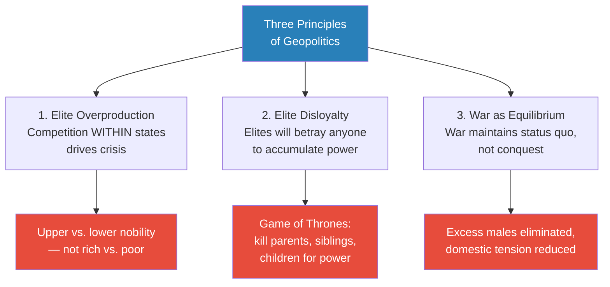
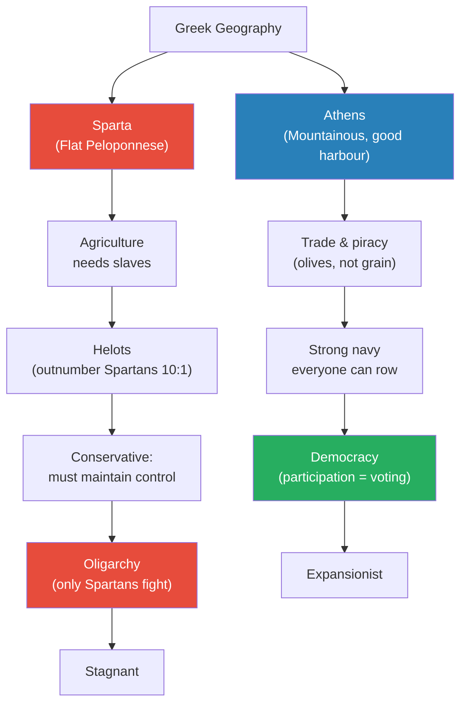
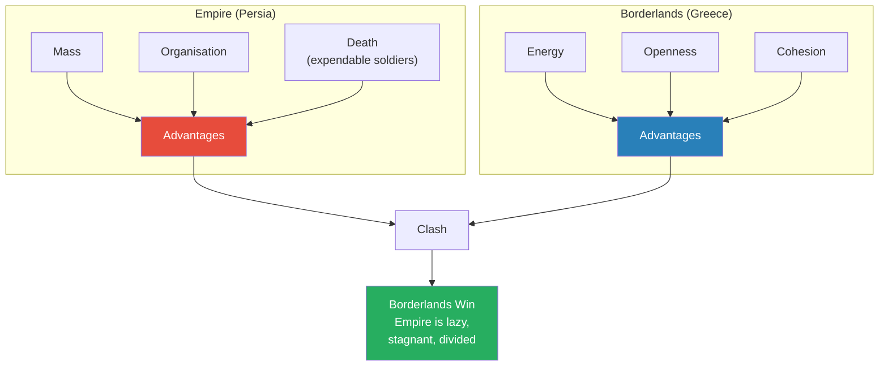
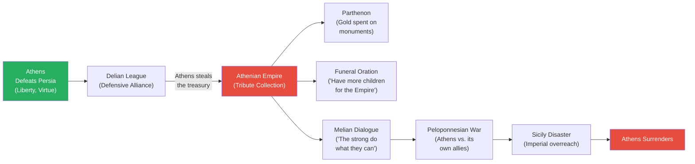
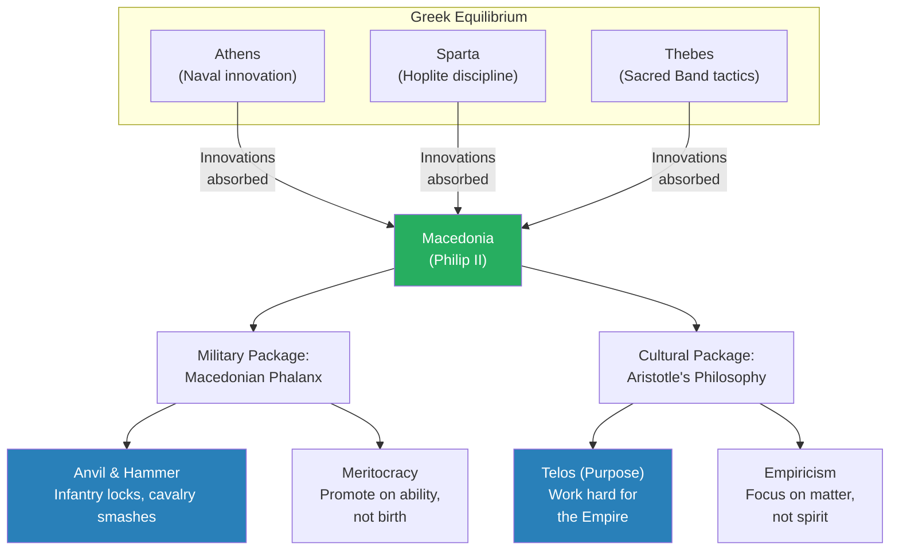
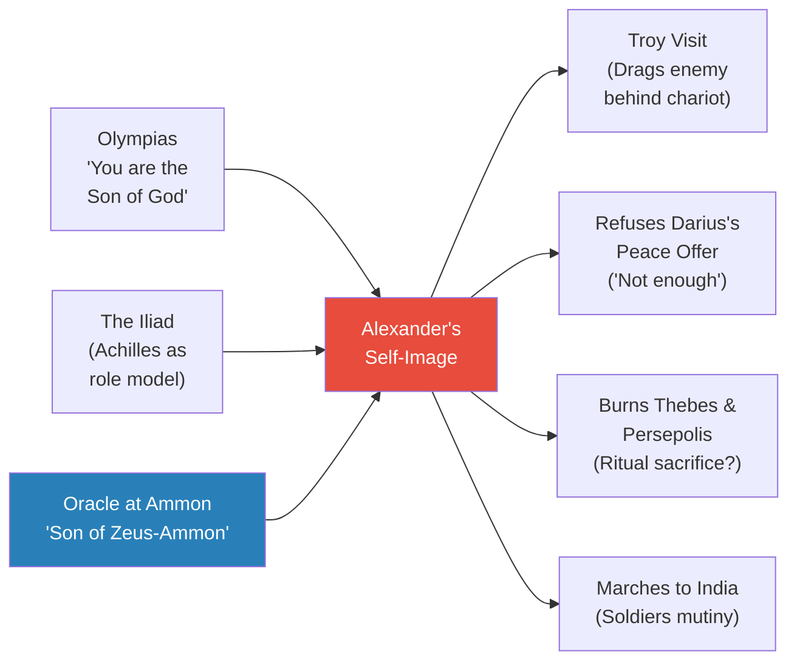
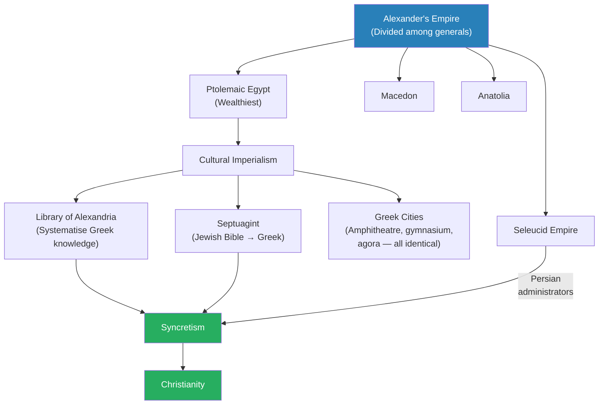

# The Hellenistic World

> Prof. Jiang traces the arc from the Persian Wars to the Hellenistic age through the lens of three geopolitical principles: elite overproduction, elite disloyalty, and war as equilibrium maintenance. He shows how Athens and Sparta — despite defeating the Persian Empire — could not escape the same pattern that destroyed every equilibrium before them. Macedonia, the "backward barbarian" state, absorbs the military innovations of all three Greek powers and bulldozes the system, just as the Qin did in China. Alexander the Great conquers the Persian Empire in a decade, but his generals carve it into successor kingdoms that must govern vast populations with a handful of Greeks. The solution is cultural imperialism: Aristotle's philosophy, the Library of Alexandria, and the translation of the Jewish Bible into Greek (the Septuagint). This syncretism of Greek, Jewish, and Persian worldviews creates the conditions for a new religion that will change the world — Christianity.

---

## Overview: Key Highlights

- <b style="color: #27ae60">Three principles explain geopolitical history</b> — elite overproduction, elite disloyalty, and war as equilibrium maintenance recur from Mesopotamia to Greece to China
- <b style="color: #2980b9">The Warring States parallel</b> — Greece's city-state equilibrium mirrors the Zhao, Wei, and Chu: stable powers stagnate while the barbarian periphery absorbs their energy
- <b style="color: #e74c3c">Empire makes you lazy, stupid, and arrogant</b> — Xerxes, Athens under Pericles, and Darius III all demonstrate the fatal complacency of equilibrium
- <b style="color: #2980b9">Empire vs. Borderlands framework</b> — empires have mass, organisation, and death; borderlands have energy, openness, and cohesion
- <b style="color: #27ae60">Athens transformed from liberty to empire</b> — the same city that told Persia "we will never make terms" later told its own allies "the strong do what they can and the weak suffer what they must"
- <b style="color: #e74c3c">The Peloponnesian War was not about conquest</b> — both sides fought to maintain equilibrium, not to destroy each other, which is why the war lasted so long and ended so strangely
- <b style="color: #2980b9">Philip II's anvil and hammer</b> — the Macedonian phalanx combined Greek hoplites, Persian cavalry, and meritocratic morale into an unstoppable military package
- <b style="color: #27ae60">Alexander believed he was the Son of God</b> — his visit to the Oracle at Ammon and his identification with Achilles explain his insatiable appetite for conquest
- <b style="color: #2980b9">Aristotle vs. Plato</b> — the foundational conflict of Western philosophy: mind over matter (Plato/rationalism) versus matter over mind (Aristotle/empiricism), and Aristotle's version serves empire
- <b style="color: #e74c3c">Cultural imperialism replaced military conquest</b> — the Library of Alexandria, Greek cities, and the Septuagint were tools of empire, not acts of generosity
- <b style="color: #27ae60">Syncretism of three civilisations produced Christianity</b> — Greek philosophy, Jewish scripture, and Persian administration merged in the Hellenistic world to create the conditions for a world religion
- <b style="color: #2980b9">The Septuagint</b> — translating the Jewish Bible into Greek brought Judaism into the Hellenistic intellectual world, a key precondition for Christianity

| Concept | One-line summary |
|---------|-----------------|
| **Elite overproduction** | Too many elites competing for limited positions of status and power — the primary driver of crisis |
| **Elite disloyalty** | Elites have no loyalty to people, state, or family — they will do anything to accumulate power |
| **War as equilibrium** | War is fought not to conquer but to reduce domestic tension and maintain the status quo |
| **Empire vs. Borderlands** | Empires have mass, organisation, death; borderlands have energy, openness, cohesion — borderlands win |
| **Hoplites** | Greek heavy infantry formation — a wall of armoured soldiers that bulldozes enemies in head-on combat |
| **Horse archers** | Persian mobile cavalry — devastating on open plains but useless in mountainous Greek terrain |
| **Anvil and hammer** | Philip II's innovation: infantry locks the enemy (anvil), cavalry sweeps from behind (hammer) |
| **Delian League** | A defensive alliance against Persia that Athens converted into a tribute-collecting empire |
| **Telos** | Aristotle's concept of purpose — everything exists to fulfil its function, which conveniently means producing energy for the empire |
| **Cultural imperialism** | Using culture (universities, libraries, philosophy) to justify and maintain imperial rule |
| **Syncretism** | The merging of Greek, Jewish, and Persian religions and worldviews in the Hellenistic period |
| **Septuagint** | The Greek translation of the Jewish Bible — a tool of Ptolemaic diplomacy that changed world history |

---

# The Lecture

## Three Principles of Geopolitics [0:00 - 8:43]

*Prof. Jiang opens with a review of three geopolitical principles introduced in the previous lecture, then demonstrates them through the Warring States period in China. This is not a digression — it is the analytical framework through which the entire lecture on Greece and the Hellenistic world will be understood.*

> [!tip] Core Insight
> The same pattern that explains how the "barbarian" Qin conquered the sophisticated Zhao, Wei, and Chu also explains how Macedonia conquered Greece and how Greece conquered Persia. Once you see the pattern, it repeats everywhere.

*These three principles are the analytical engine of the entire lecture series — Prof. Jiang will apply them to every civilisation from Mesopotamia to Rome.*

> [!note]- Expand: Full Lecture Detail
> Prof. Jiang opens by reviewing the three principles covered in the previous class:
>
> **Principle 1 — Elite overproduction:** The historian Peter Turchin studied the Roman Republic, the French Revolution, and many similar crises and discovered that <b style="color: #2980b9">the competition within states is greater than the competition between states</b>. The real conflict is not between rich and poor but between "the have-a-lot and the have-some-but-want-more" — the upper nobility versus the lower nobility. Julius Caesar did what he did because he was lower nobility trying to reach upper nobility.
>
> **Principle 2 — Elite disloyalty:** <b style="color: #e74c3c">The elite have no loyalty</b> — not to their people, their state, or even their families. Prof. Jiang invokes Game of Thrones: "These people who love power, they will kill their parents, they will kill their brothers, they will kill their own children in order to amass power."
>
> **Principle 3 — War as equilibrium:** War is often about maintaining the status quo. World War I makes no sense as a military strategy — millions thrown at each other with no tactical purpose. But if you understand that war reduces surplus male population and prevents domestic revolution, it makes perfect sense.
>
> Prof. Jiang then applies all three principles to the Warring States period in China:
> - The Zhao, Wei, and Chu were the powerful, sophisticated states — they had rivers, large populations, and fertile land
> - The Qin were "barbarians" — poor, backward, and isolated
> - The three great states fought ritual wars against each other — not to conquer, but to maintain equilibrium and reduce domestic tension
> - This equilibrium made them stable but stagnant
>
> Meanwhile, the Qin benefited from the system in three ways:
> - They provided mercenaries who learned the military innovations of the great states
> - Talented lower nobility with no opportunities migrated to the Qin, bringing energy and ideas
> - The Qin received a "massive infusion of energy, innovation, and talent"
>
> The great states could not respond because <b style="color: #e74c3c">once you enter an equilibrium, you understand the world through that equilibrium</b> — they could not imagine the Qin overtaking them. "Once you reach an equilibrium, the people inside the equilibrium become lazy, stupid, and arrogant."

---

## The Mesopotamian Pattern and the Rise of Persia [8:43 - 12:00]

*Prof. Jiang shows the same three-principle pattern repeating in Mesopotamia — from Uruk's equilibrium to Lugalzagesi's rule-breaking, to the Akkadian mercenaries, to the Babylonians, Assyrians, and finally the Persians — before the energy flows outward to the Greek borderlands.*

*Energy always flows from stagnant centres to energised peripheries — the exact same mechanism that empowered the Qin in China now empowers the Greeks against Persia.*

> [!note]- Expand: Full Lecture Detail
> Prof. Jiang traces the pattern from the very first city:
> - Uruk expanded into colonies along the Tigris and Euphrates, which became warring city-states
> - They reached an equilibrium with a critical rule: <b style="color: #2980b9">you cannot destroy each other's temple</b> — because the temple houses the patron god, and destroying it would invite divine wrath
> - The real reason: the temple is where they stored their gold and wealth — leaving temples intact meant you could conquer people but never actually expand
> - A merchant from Uma named Lugalzagesi broke the equilibrium: "Screw this system, I'm going to go for it all" — he dared destroy a temple
> - When the god did not come down from the heavens to destroy him, the equilibrium shattered
> - The other city-states called in Akkadian mercenaries, who conquered everything under Sargon
> - The Akkadians reached their own equilibrium, talent flowed elsewhere, and the cycle continued through the Babylonians, Assyrians, and finally the Persians
>
> The Persians conquered Anatolia and Egypt. At this point, a new borderland emerged: the Greeks. The Greeks engaged with Persia in two ways:
> - They sent mercenaries to help Persia, who learned Persian war tactics and brought them home
> - As a borderland near an empire, the Greeks got wealthy through piracy
> - The piracy forced the Persians to invade Greece — "this is a pattern throughout history: the margins will get wealthy by committing piracy"

---

## Athens vs. Sparta — Geography Determines Destiny [12:00 - 18:40]

*Prof. Jiang explains how geography created two fundamentally different Greek societies — Sparta the conservative land power built on slavery, Athens the expansionist naval democracy built on trade — and why their different structures made conflict inevitable.*

> [!tip] Core Insight
> If you are a navy, you must be a democracy — because everyone can row. If you are a land army with elite hoplites, you will be an oligarchy — because only the wealthy can fight. Military structure determines political structure.

*Geography determined everything — flat land required slaves, slaves required military control, military control required oligarchy. Mountains and harbours required trade, trade required a navy, a navy required mass participation, mass participation required democracy.*

> [!note]- Expand: Full Lecture Detail
> Prof. Jiang explains the structural differences between the two great Greek city-states:
>
> **Sparta:**
> - Located on the flat Peloponnese — fertile land that supported agriculture
> - Agriculture required slaves — the Spartans conquered surrounding peoples and turned them into serfs called <b style="color: #2980b9">helots</b>
> - The helots outnumbered the Spartans ten to one — the entire Spartan system revolved around controlling this threat
> - Boys were taken from parents at age five or six to create anxiety and aggression — "if they are loving people, they don't want to kill people, but if they are divorced from their parents, they have conflict"
> - At fourteen or fifteen, they were assigned a thirty-year-old mentor who became their lover — building military fraternity
> - The graduation ceremony: hiding in fields at night, waiting for a helot to break curfew, then slitting the helot's throat
> - "This is a brutal, brutal people. But guess what? The Romans were the same. The Aztecs were the same. The Americans are the same."
> - Citizenship required both a Spartan father AND a Spartan mother — massive class hierarchy
> - Sparta was deeply conservative because conquering other places risked helot rebellion at home
> - "If you want to know what this place is like, think China"
>
> **Athens:**
> - Mountainous terrain with poor farmland but a good harbour
> - They could grow olives but not much else — forced to be expansionist
> - Developed a strong navy and focused on trade and piracy
> - A navy is inherently democratic: to be a hoplite you had to buy expensive weaponry and train for decades, but anyone could row
> - The rule in Greece: "you fight for us, you can vote, you can speak in public, you can participate in politics"
> - Therefore Athens became a democracy while Sparta remained an oligarchy
>
> Prof. Jiang also explains Greece's broader military innovations:
> - The Greeks developed <b style="color: #2980b9">hoplites</b> — heavy infantry that created a wall to bulldoze enemies — because the mountainous terrain suited infantry
> - The Persians developed <b style="color: #2980b9">horse archers</b> — mobile cavalry devastating on open plains — because their flat terrain suited cavalry
> - These innovations were geography-specific: you could not use horse archers in mountainous Greece, and you could not use hoplites across the vast Persian plains
> - This geographic mismatch is why the Persians lost every time they invaded Greece — they were forced to fight as infantry against the world's best infantry

---

## The Persian Wars — How Barbarians Defeat Empires [18:40 - 30:30]

*Prof. Jiang narrates the Persian Wars as the definitive case study of borderlands defeating empires, from Marathon through the pivotal Battle of Salamis, while highlighting how Persian arrogance and refusal to adapt handed victory to the Greeks.*

*The empire's three advantages — mass, organisation, expendable soldiers — are consistently defeated by the borderlands' three counter-advantages — energy, openness, and cohesion. This is not a Greek exception; it is the universal pattern.*

> [!note]- Expand: Full Lecture Detail
> **The Battle of Marathon (490 BC):**
> - The Athenians were committing piracy and encouraging Greeks under Persian rule to stop paying taxes — "Greeks hate paying taxes. It's still true today"
> - The Persians invaded to stop the piracy
> - The Persians relied on horse archers, but could not use them in mountainous Greece
> - Forced into infantry combat, they faced the world's best infantry — the Greeks bulldozed them
>
> **Xerxes' Invasion and the Battle of Thermopylae:**
> - Xerxes launched the last major Persian invasion by building a bridge of ships across the Bosphorus
> - At Thermopylae, 300 Spartans held the pass — "you may have seen the movie 300"
> - The Persians eventually crushed the Spartans and cut off King Leonidas's head, putting it on a pike
> - They burned Athens — at this point, the war should have been over
> - But the Athenians said: "A polis is not a place, it's a people" — they sailed away and the war continued
>
> **The Persian strategic error:**
> - Prof. Jiang is emphatic: the Persians had already won — all they needed to do was land their navy in Sparta, the helots would rise up, and Greece was finished
> - <b style="color: #e74c3c">But Xerxes wanted a monument</b> — he wanted a glorious confrontation, not a patient victory by attrition
> - "The problem with empires is they're lazy, stupid and arrogant"
>
> **The Battle of Salamis:**
> - <b style="color: #27ae60">Considered the greatest naval battle in human history</b> — it forever changed the course of civilisation
> - Themistocles, who had convinced Athens to build a navy using silver mine revenues, led the Athenian fleet
> - Greek triremes were fast ramming ships with marines on top — designed for head-on naval combat
> - The Persians sent their massive navy into the narrow straits — "don't fight the Greeks head on"
> - The Athenians destroyed them
> - Without their navy, the Persians could not resupply — the war was effectively over
>
> **The Battle of Plataea and the aftermath:**
> - Xerxes went home, leaving his general Mardonius
> - Mardonius sent an envoy offering peace and money — the Persians told the Athenians: "Neither can you get the better of him, nor can you resist him forever... another, much more numerous, will come against you"
> - The Athenians responded: <b style="color: #27ae60">"So long as the sun shall continue in the same course as now, we will never make terms with Xerxes"</b>
> - The Spartans destroyed Mardonius at Plataea
>
> > [!example] Pausanias Refuses to Desecrate the Dead
> > - After the Spartan victory at Plataea, a soldier suggested to King Pausanias that he should put Mardonius's head on a pike — to avenge what the Persians did to Leonidas at Thermopylae
> > - Pausanias refused, saying: "Which is more fit for barbarians to do than Greeks, and which we abhor even in them"
> > - He declared that Leonidas had been "amply avenged by the countless souls of these men" who fell in battle
> > - He told the soldier to be "thankful that you escaped unpunished" for even making such a suggestion
> > **The lesson:** At this moment, the Greeks defined themselves by their virtue, faith, and loyalty — values that would evaporate entirely once they became an empire.

---

## From Liberty to Empire — The Athenian Transformation [30:30 - 47:58]

*Prof. Jiang traces the most damning arc in the lecture: how Athens — the city that fought Persia for liberty — became an empire worse than Persia within a generation. The Delian League, the Parthenon, Pericles' funeral oration, and the Melian Dialogue together form a case study in how power corrupts absolutely.*

> [!tip] Core Insight
> The Athenians fought the Persians saying "we believe in liberty, we believe in each other, we believe in our gods." One generation later, they told their own allies: "the strong do what they can and the weak suffer what they must." The transformation from borderland virtue to imperial cruelty is the core tragedy of the Greek story.

*The green-to-red trajectory tells the entire story: liberty to empire to collapse in less than a century. Every step follows the logic of equilibrium — and equilibrium's inevitable stagnation.*

> [!note]- Expand: Full Lecture Detail
> **The Delian League becomes the Athenian Empire:**
> - After defeating Persia, Athens proposed a defensive alliance — like NATO — pooling resources against a potential Persian return
> - They called it the <b style="color: #2980b9">Delian League</b> because the treasury was stored on the neutral island of Delos
> - Athens then said: "It's probably safer with us" — and stole the entire treasury
> - The League transformed from an alliance into an empire where everyone paid tribute to Athens
> - "All that's happened is before these Greek city-states have to pay tribute to the Persians, and now they have to pay tribute to the Athenians — it's probably a worse deal for everyone"
> - Athens spent the gold on the Parthenon and a pure gold statue of Athena — "They didn't have to do this, but they were like, you know what, we're going to enjoy our empire"
>
> **Pericles' Funeral Oration:**
> - Traditionally taught as "the most famous speech about democracy in Western civilization"
> - Prof. Jiang is blunt: <b style="color: #e74c3c">"It's not a speech about democracy. If you actually read it, it's a speech about empire"</b>
> - Pericles tells parents of dead soldiers: your sons were "worthless" in life, but now that they died for the Empire, you can be proud
> - His actual message: "have more children so they can protect the Empire"
> - He promises to raise the orphans of the war dead in an orphanage — to train them as soldiers so they can "fight for the Empire and die like their fathers"
>
> > [!example] The Melian Dialogue — Empire Speaks Plainly
> > - Thucydides records Athens confronting the island of Melos, which wanted to remain neutral
> > - The Athenians declared: "We shall not trouble you with specious pretences either of how we have a right to our empire"
> > - They dispensed with all justification and stated the naked truth of empire: <b style="color: #e74c3c">"The strong do what they can and the weak suffer what they must"</b>
> > - Compare this to how Athens responded to Persian threats just decades earlier — with appeals to liberty, gods, and virtue
> > - The Persians at least offered friendship and bribery; the Athenians did not even bother with pretence
> > **The lesson:** Empire does not corrupt gradually — it replaces virtue with naked force within a single generation.
>
> **The Peloponnesian War:**
> - Prof. Jiang corrects Thucydides: the war was not caused by Sparta rising to challenge Athens — <b style="color: #2980b9">Athens was the hegemon</b>, and its allies were rebelling against it
> - Sparta did not want to fight — Athens forced the war through relentless expansion
> - The war was fought in a strange way because neither side wanted to destroy the other:
>   - Athens could easily destroy Sparta by landing forces on the coast — the helots would rise up
>   - But Athens did not want to destroy the equilibrium: "The helots might come after you, Athens"
>   - Sparta could easily expand its army tenfold by freeing the helots
>   - But Sparta did not want to destroy its social order — freedom would create democracy
> - Both sides fought to maintain equilibrium, which is why the war lasted 27 years
>
> **The Plague and the Sicilian Disaster:**
> - Pericles forced everyone inside Athens's walls to avoid Spartan land forces
> - Cramming the population together caused the <b style="color: #e74c3c">Plague of Athens</b>, which killed a third of the population, including Pericles and both his sons
> - As the war dragged on, Athens needed more tribute — so they invaded Sicily, a wealthy island not even part of the war
> - The Sicilian expedition was a catastrophic failure
> - Syracuse, which had a navy, entered the war against Athens — combined with Sparta and Persia, they blockaded Athens from Thrace (its wheat supply)
> - Athens starved and surrendered
> - Sparta chose not to destroy Athens — "if you destroy Athens, then Thebes and other powers could arise which could challenge Sparta"

---

## Macedonia — The Barbarian Periphery Strikes Again [47:58 - 1:07:54]

*Prof. Jiang shows how Macedonia exactly replicated the Qin pattern: a backward, peripheral state that absorbed the innovations of the stagnant Greek equilibrium and then bulldozed everyone. The focus is on Philip II's military genius and Aristotle's intellectual project — childhood friends who conquered the world through complementary means.*

*Philip II and Aristotle were childhood best friends — one conquered militarily, the other conquered intellectually. Together they created the world's first combined military-cultural imperial package.*

> [!note]- Expand: Full Lecture Detail
> **Philip II's military revolution:**
> - Macedonia was "poor, backward, and isolated" throughout most of Greek history — often a subject of Persia
> - Philip II went to Greece to learn every military innovation from Athens, Sparta, and Thebes
> - He created the <b style="color: #2980b9">Macedonian phalanx</b> — combining Greek hoplites, Persian cavalry, and Theban tactics into one integrated force
> - His critical insight: for combined arms to work, every soldier must be highly motivated
> - Traditional armies gave cavalry (aristocrats) all the privileges — Philip insisted on meritocracy
> - "If a soldier is doing a good job, you promote him. If a soldier is doing a bad job, you demote him"
> - This sounds simple but was revolutionary: it overturned the social hierarchy, and aristocrats resisted
> - The result: the <b style="color: #2980b9">anvil and hammer</b> — infantry locks the enemy in place (anvil), then cavalry sweeps in from behind to smash them (hammer)
> - "No other army had witnessed such powerful force, and you can't possibly respond to it"
>
> **The Battle of Chaeronea (338 BC):**
> - Philip defeated a combined force of Athenians and Thebans
> - He now controlled all mainland Greece
> - He was ready to invade Persia — he had spies and diplomats throughout the empire, negotiating with local elites
>
> **Aristotle's intellectual project:**
> - Prof. Jiang drops what he considers one of history's most important and least-known facts: <b style="color: #27ae60">"Philip the Second and Aristotle were childhood best friends"</b>
> - "It's something that you will never, ever learn in school, but it's a very important fact"
> - The Macedonians had planned to conquer the world for a long time — Philip learned military innovations, Aristotle learned intellectual innovations
> - Aristotle studied under Plato at the Academy, then systematised Greek knowledge into "a knowledge of empire"
>
> **Plato vs. Aristotle — the fundamental conflict:**
> - <b style="color: #2980b9">Plato</b>: what matters is the spirit, the mind, the soul — the immaterial. The Good emanates and creates the shadow world. Our goal is to return to the Good through knowledge and sacred geometry
> - <b style="color: #2980b9">Aristotle</b>: forget the spirit world, focus on the material world. What makes the world move is cause and effect. There was a Prime Mover (God), but "the beginning doesn't matter — what matters is the end"
> - The end is <b style="color: #2980b9">telos</b> — purpose. Students exist to learn. Teachers exist to teach. Everyone exists to work hard and produce energy for the Empire
> - "If you're an empire, you don't want this crap" (Plato's contemplation) — "you want to maximise the energy of each individual"
> - This conflict — Plato becomes rationalism (Descartes), Aristotle becomes empiricism — "is really the underlying conflict in all of Western philosophy"
> - "The British Empire will adopt this idea. In fact, all empires will adopt this idea, including the American empire."
>
> **Philip's assassination:**
> - Philip was killed at his daughter's wedding by his own bodyguard
> - Prof. Jiang identifies the culprit without hesitation: his wife Olympias, mother of Alexander
> - Olympias was not Macedonian — she faced hostility at court
> - Late in life, Philip married a Macedonian woman and had a son — threatening Alexander's claim to the throne
> - Olympias had taught Alexander from birth: "You are not the son of Philip. You are the Son of God"
> - When Olympias felt Philip was about to steal the throne from Alexander, she had him killed
> - Proof: after Philip's death, Alexander also killed the new Macedonian wife and her son

---

## Alexander the Great — The Son of God [1:07:54 - 1:12:00]

*Prof. Jiang reframes Alexander not as a military genius but as a religious fanatic — a man who genuinely believed he was divine, modelled himself on Achilles, and pursued conquest not for territory but for ritual self-deification.*

*Alexander's actions — refusing peace, burning cities, marching to India — make no strategic sense but perfect psychological sense once you understand he believed he was divine and destined to rule the world.*

> [!note]- Expand: Full Lecture Detail
> Prof. Jiang tracks two revealing details on Alexander's conquest map:
>
> - **Troy:** The moment Alexander reaches Persia, he goes to Troy — because Achilles went to Troy. "Alexander saw himself as the new Achilles. He had memorised the Iliad and took it with him wherever he went." During the war, he tied an enemy to a chariot and dragged him around — exactly as Achilles did to Hector.
>
> - **The Oracle at Ammon:** After conquering Egypt, Alexander detoured deep into the desert to visit the Oracle at Ammon. He spent several days there. The oracle revealed his "secret": <b style="color: #27ae60">he is not the son of Philip the Second but the Son of Zeus-Ammon</b> — king of the gods in both Greek and Egyptian tradition. "Alexander was born to rule the world."
>
> This divine self-conception explains everything:
> - When Darius offered him most of Persia plus half the treasury, Alexander refused — Philip would have accepted, but Alexander wanted everything
> - "All these great conquerors believe they are divinity — Genghis Khan, Julius Caesar, Napoleon. Their appetite for conquest is insatiable"
> - Even after conquering Persepolis (the Persian capital), he kept going to India — "the only reason he stopped is his soldiers got sick of fighting"
> - He burned Thebes and Persepolis — possibly as "ritual sacrifices necessary to prove that he was the Son of God"
>
> > [!example] Alexander Eliminates His Father's Men
> > - Throughout the conquest, Alexander systematically killed Philip's most loyal generals
> > - Parmenion, Philip's top general — killed
> > - Cleitus, another senior commander — killed
> > - "Historically, we remember these events as random acts of violence, but they're not"
> > - Alexander needed to eliminate his father's men to create his own power structure
> > - Eventually, the remaining generals realised they were next — they conspired and poisoned him
> > **The lesson:** Alexander was co-opted by the Persian elite who had invited him in, incorporating more Persians into his army and administration. His Macedonian generals saw themselves being replaced — and acted first.

---

## The Hellenistic World — Governing with Culture [1:12:00 - 1:17:41]

*Prof. Jiang arrives at the lecture's title topic: the world Alexander's generals carved out of his empire, and the revolutionary solution they devised to govern vast populations with a handful of Greeks. The answer was cultural imperialism — and it would produce Christianity.*

> [!tip] Core Insight
> A university is not about education — it is a tool of empire. The Library of Alexandria existed to systematise Greek knowledge into textbooks that proved Greek cultural superiority, justifying imperial rule over peoples who were actually more ancient and sophisticated than the Greeks.

*Three civilisations — Greek philosophy, Jewish scripture, and Persian administration — merged in the Hellenistic successor kingdoms. This syncretism was not accidental: it was a tool of imperial governance that produced Christianity as an unintended consequence.*

> [!note]- Expand: Full Lecture Detail
> **The problem of governing with too few Greeks:**
> - After Alexander's death, his generals divided the empire into four parts: Ptolemaic Egypt (the wealthiest), Macedon, Anatolia, and the Seleucid Empire
> - The fundamental problem: there were not enough Greeks to govern the world
> - Solution 1: build Greek cities everywhere to settle veterans and attract immigrants — all cities looked identical with an amphitheatre, gymnasium, and agora
> - Solution 2: recruit Persian bureaucrats (effective administrators) and Jews (a foreign people useful for managing diverse populations)
>
> **The Library of Alexandria:**
> - Ptolemy I and II created the Library of Alexandria — often romanticised as a centre of learning
> - Prof. Jiang reframes it: <b style="color: #e74c3c">"A university is not really about education. It's really about a tool of empire"</b>
> - The Library systematised and centralised all Greek knowledge into textbooks taught throughout the world
> - The Egyptians had given science and mathematics to Greece — now the Greeks were ruling Egypt
> - The Egyptians asked: "You were barbarians. Now you're controlling us. Why?"
> - The answer: cultural imperialism — the Library downplayed Egyptian culture and promoted Greek culture to justify Greek rule
>
> > [!example] The Ptolemies Steal Athens' Manuscripts
> > - The Library of Alexandria needed original manuscripts for its collection
> > - The Ptolemies asked Athens to lend their original plays — Euripides, Aeschylus, Sophocles
> > - Athens refused: "This stuff is priceless"
> > - The Ptolemies offered an enormous deposit — "like a billion dollars"
> > - Athens agreed and lent the scrolls
> > - After copying them, Athens asked for the originals back
> > - Ptolemy's response: "Keep the money" — they simply kept the originals
> > - "That's how wealthy they were. The Athenians were really, really pissed about this"
> > **The lesson:** Cultural imperialism is backed by material power — the Ptolemies could afford to steal because they controlled the wealthiest territory in the ancient world.
>
> **The Septuagint and Jewish integration:**
> - Egypt needed to control the Levant — the Jews were problematic because they had been loyal to the Persian Empire
> - The Ptolemies bribed the Jewish priests: "We love your tradition. Let us translate your Bible into Greek so we can celebrate it and spread it around the world"
> - This translation became the <b style="color: #2980b9">Septuagint</b> — a foundational text in world history
> - Jews migrated to Alexandria to contribute to its scholarship — eventually a third of Alexandria's population was Jewish
> - Jews spread throughout the Greek world
>
> **The birth of syncretism:**
> - Three civilisations merged in the Hellenistic world:
>   - The <b style="color: #2980b9">Greeks</b> ruled the empire and provided the philosophical framework
>   - The <b style="color: #2980b9">Jews</b> helped build the empire and provided the scriptural tradition
>   - The <b style="color: #2980b9">Persians</b> administered the empire and provided the Zoroastrian moral framework
> - This merger of all three major post-Bronze Age worldviews produced <b style="color: #27ae60">syncretism</b> — the combining of religions
> - Prof. Jiang's conclusion: <b style="color: #27ae60">this syncretism gave birth to Christianity</b>
> - Rome will conquer this world next — and the rise of Christianity will be the subject of coming lectures

---

## Connections

**Builds on:** [[18 - Thus Spoke Zarathustra]] (Zoroastrian moral framework that feeds into the syncretism), [[16 - The Big Bang of Greek Civilization]] (Homer, the alphabet, and the polis as Greek civilisational foundations), [[15 - Capital and the Bronze Age Collapse]] (the Bronze Age system whose collapse gave rise to Jews, Greeks, and Persians)
**Sets up:** [[21 - Roman Anti-Civilization]] (Rome conquers the Hellenistic world), [[22 - The Divine Spark of Jesus]] (Christianity emerges from this syncretism)
**Recurring themes:** [[02 - How Societies Collapse]] (elite overproduction and the equilibrium trap), [[13 - Mandate of Heaven]] (civilisation as gaslighting — cultural imperialism as the Greek version)
**Related books in vault:** [[The 33 Strategies of War - Robert Greene]] (anvil and hammer as combined-arms strategy), [[Sapiens - Yuval Noah Harari]] (imagined orders and the power of shared myths)

---

## The Takeaway

This lecture is really about one idea wearing many costumes: the equilibrium trap. Every stable system — Mesopotamian city-states, Chinese warring states, Greek poleis, the Persian Empire — reaches a point where its own stability becomes its greatest vulnerability. The people inside the equilibrium cannot imagine change, so they become "lazy, stupid, and arrogant." Meanwhile, energy, talent, and innovation flow to the periphery — to the Qin, to Macedonia, to whichever barbarian borderland is hungry enough to absorb what the centre has discarded.

The most striking element of the lecture is not Alexander's conquests but Athens's moral collapse. Prof. Jiang places two passages side by side — Athens telling Persia "we will never make terms" and Athens telling Melos "the strong do what they can" — and lets the contrast speak for itself. The city that fought for liberty became an empire worse than the one it defeated, within a single generation. This is not a Greek story; it is the human story, and Prof. Jiang's three principles explain why it keeps repeating.

The lecture ends on what Prof. Jiang considers the most consequential development: the accidental creation of the conditions for Christianity. Three civilisations — Greek, Jewish, Persian — were forced together by imperial necessity, not by choice. The Library of Alexandria, the Septuagint, the Greek cities — all were tools of cultural imperialism. But by bringing these three worldviews into contact, they produced a synthesis that no one planned and no one could control. The next lectures on Rome and Christianity will show what that synthesis became.
