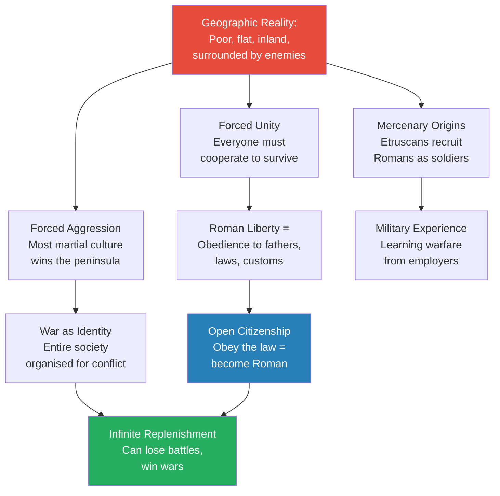
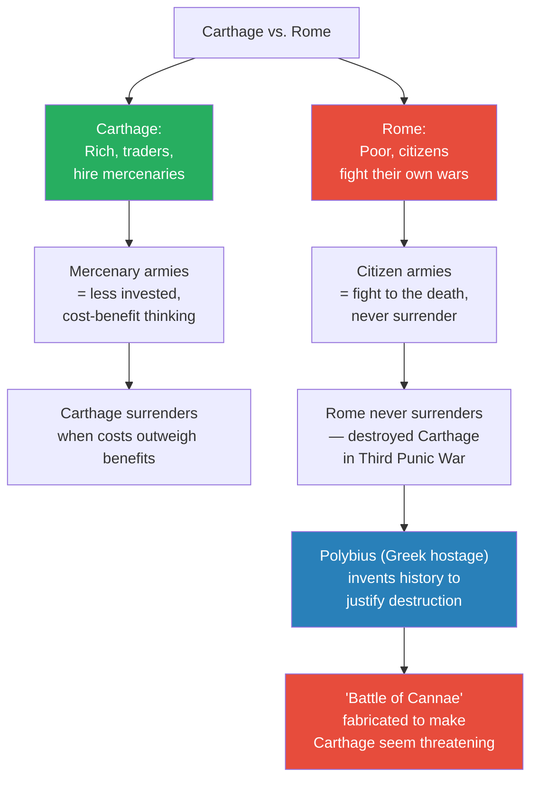
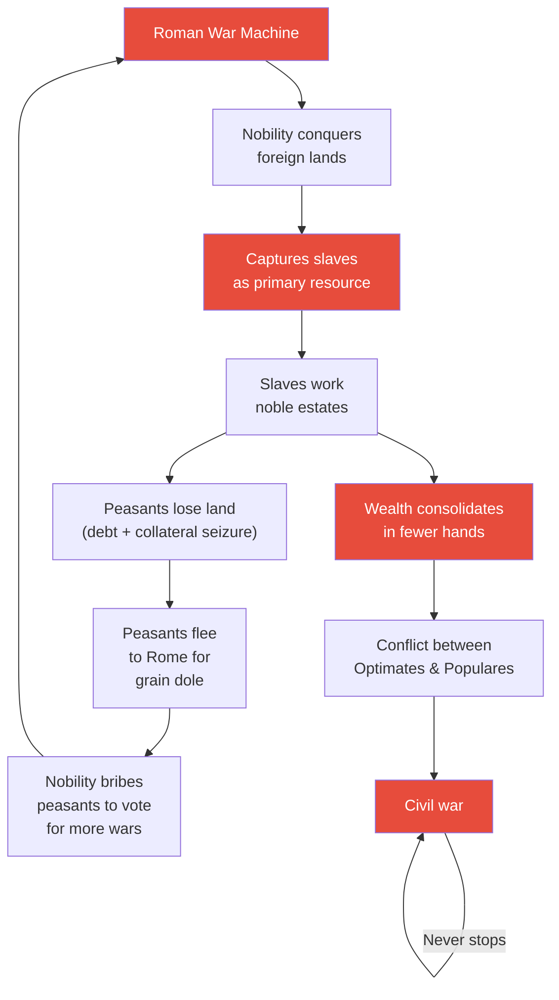
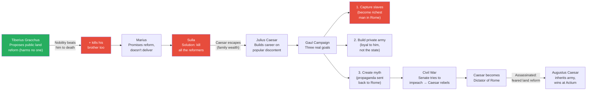
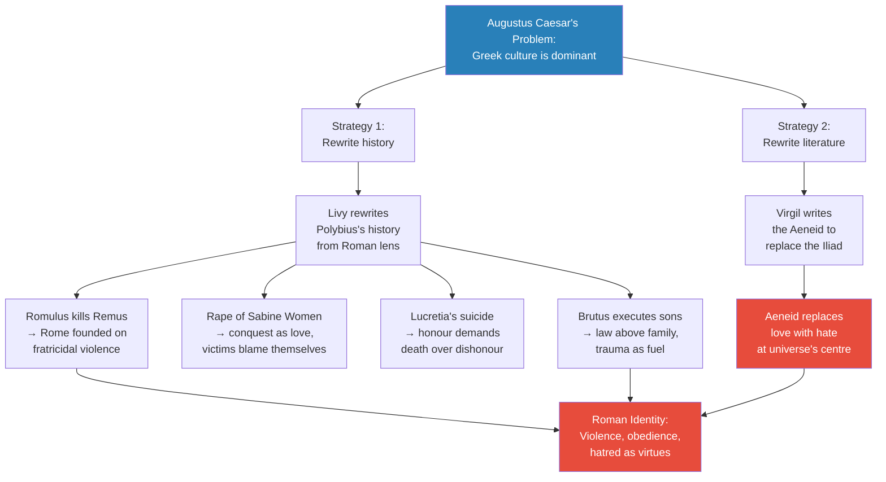
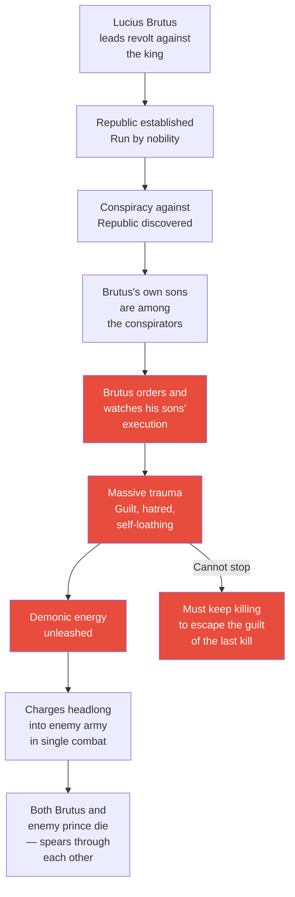
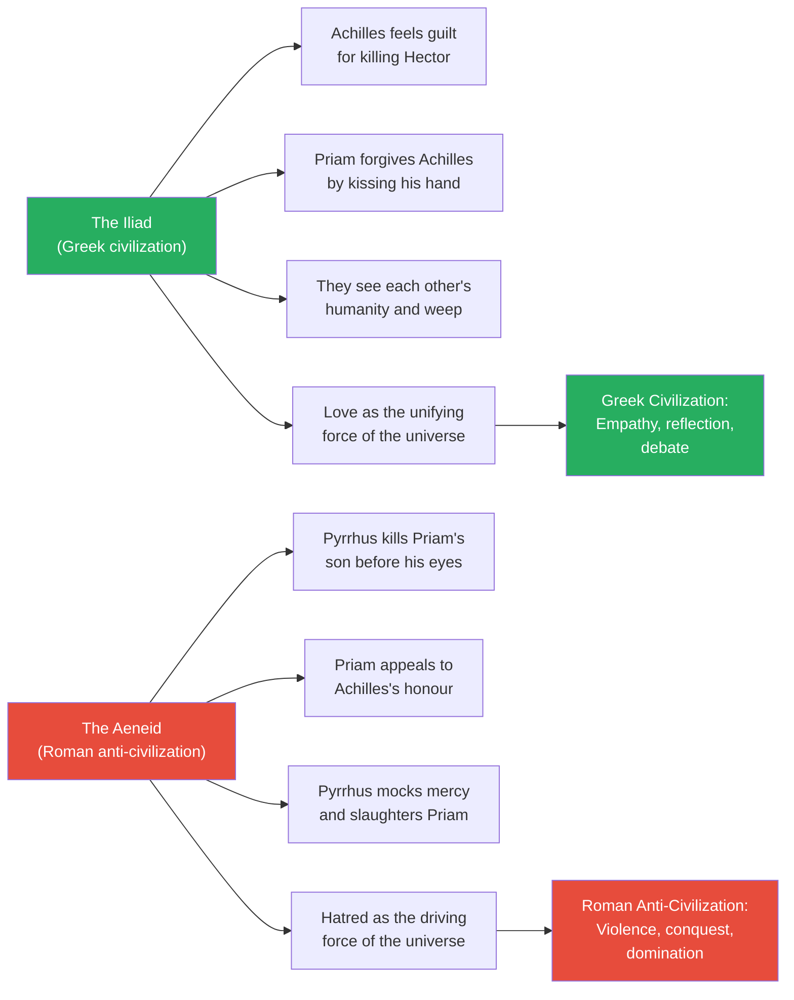
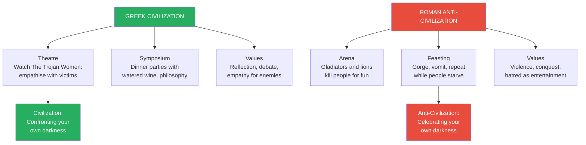

# Roman Anti-Civilization

> Prof. Jiang presents Rome as the great anti-civilization — an empire built not on ideas, beauty, or reflection but on war, hatred, and trauma. Beginning with Rome's origins as impoverished mercenaries on the Etruscan borderlands, he traces how geographic disadvantage forged the most militaristic society in the ancient world. He argues that most Roman history — including the Battle of Cannae — was fabricated by Greek historians to justify Roman atrocities. The lecture culminates in a devastating comparison: where Greek civilization was built on love, empathy, and philosophical conversation, Roman civilization was built on violence, propaganda, and the weaponization of trauma as a drug. Augustus Caesar commissioned Virgil's Aeneid and Livy's history specifically to replace Greek love with Roman hate at the centre of Western culture.

---

## Overview: Key Highlights

- <b style="color: #e74c3c">Rome is the great anti-civilization</b> — an empire built entirely on war, hatred, and the weaponization of trauma, the opposite of Greek civilization
- <b style="color: #27ae60">Geographic disadvantage created Roman martial culture</b> — poverty, flat indefensible land, and hostile neighbours forced unity and aggression as the only survival strategy
- <b style="color: #2980b9">Open citizenship system</b> — unlike Athens and Sparta, Rome could replenish soldiers by granting citizenship to anyone who obeyed Roman law, its decisive structural advantage
- <b style="color: #e74c3c">The Battle of Cannae never happened</b> — no archaeological evidence, no military precedent for double envelopment in ancient warfare, and Hannibal's behaviour afterward defies game theory
- <b style="color: #2980b9">Polybius invented Roman history</b> — a Greek hostage fabricated the Punic War narrative to justify Rome's destruction of Carthage
- <b style="color: #e74c3c">The Roman war machine trapped Rome in a self-consuming cycle</b> — conquest created slaves, slaves displaced peasants, displaced peasants voted for more wars
- <b style="color: #27ae60">Julius Caesar went to Gaul for slaves, a private army, and a personal myth</b> — the official history of his Gallic campaigns is propaganda covering mass enslavement and genocide
- <b style="color: #2980b9">Augustus Caesar's cultural project</b> — commissioning Livy and Virgil to rewrite history and replace Greek love with Roman hatred as the foundation of Western identity
- <b style="color: #e74c3c">The Aeneid is propaganda designed to destroy the Iliad's message</b> — Virgil replaced Achilles's compassion with Pyrrhus's savagery, and asked for the book to be burned before he died
- <b style="color: #27ae60">Greek symposium vs. Roman gladiator arena</b> — the fundamental civilizational contrast: conversation about love and philosophy vs. watching people die for entertainment
- <b style="color: #2980b9">Trauma as a drug</b> — the Roman secret: manufacture so much guilt and hatred that people channel demonic energy against enemies rather than face their own darkness
- <b style="color: #e74c3c">Secret societies use Roman methods</b> — reenacting founding myths to build solidarity through shared transgression, creating demons that can never be outrun

| Concept | One-line summary |
|---------|-----------------|
| **Anti-civilization** | A society built on the destruction of civilization's values — war instead of reflection, hate instead of love |
| **Open citizenship** | Rome's structural advantage: anyone who obeys Roman law can become a citizen, enabling infinite soldier replenishment |
| **Legionnaire vs. Hoplite** | Lighter armour, less training, designed for mountains — quantity and replaceability over individual skill |
| **The Roman war machine** | Self-reinforcing cycle: war produces slaves, slaves displace peasants, peasants vote for more war |
| **Optimates vs. Populares** | Upper nobility ("we're the best") vs. lower nobility ("we want more") — the eternal Roman civil conflict |
| **Predictive history** | Prof. Jiang's framework: does the event fit historical patterns, game theory, and religious explanation? |
| **Polybius's fabrication** | A Greek hostage invented Rome's military history to justify Roman atrocities to a Greek-speaking world |
| **Augustus's cultural war** | Commissioning Livy and Virgil to create a Roman identity distinct from and hostile to Greek civilization |
| **The Aeneid** | Virgil's rewriting of the Iliad, replacing love and forgiveness with hatred and vengeance as the universe's centre |
| **Trauma as a drug** | The Roman secret: self-inflicted trauma generates demonic energy that can only be discharged through further violence |
| **Secret societies** | Groups that reenact transgressive myths to build cohesion through shared guilt — the Roman method institutionalized |

---

# The Lecture

## Rome's Geographic Origins — Poverty Breeds War [0:00 - 7:57]

*Prof. Jiang opens by placing Rome in the sequence of post-Bronze Age civilizations — after Persia, the Jews, and the Greeks — and argues that Rome emerged to eclipse all three as the great anti-civilization. He traces how Rome's geographic disadvantage created the most warlike society in the ancient world.*

> [!tip] Core Insight
> Rome was not great despite being poor — it was great because it was poor. Poverty, indefensible terrain, and hostile neighbours created a society where unity, aggression, and obedience were the only path to survival. Every Roman institution flows from this geographic fact.

*Rome's decisive advantage was not military genius but structural resilience — open citizenship and cultural obedience meant Rome could absorb defeat after defeat and emerge stronger, while enemies like Pyrrhus won every battle but ran out of soldiers.*

> [!note]- Expand: Full Lecture Detail
> Prof. Jiang begins: "So today we do Rome." He situates the lecture in the series — the class has covered Persia, the Jews, and the Greeks as the three main civilizations after the Bronze Age collapse. Now Rome emerges to eclipse all three. His thesis: <b style="color: #e74c3c">Rome is the great anti-civilization — the evil empire</b>.
>
> He traces Rome's origins to the borderlands of the <b style="color: #2980b9">Etruscan</b> civilization — a sophisticated, seafaring culture heavily influenced by the Egyptians and Greeks. The Etruscans were expanding throughout the Italian peninsula, and like all empires, eventually their people became "lazy, arrogant, and stupid." They recruited Romans as mercenaries to fight for them.
>
> Rome's geographic position was the worst possible:
> - On flat land — not easily defensible
> - Not on the coast — hard to trade
> - Surrounded by hostile neighbours on all sides
> - In a poor, mountainous region with few rivers
>
> But this disadvantage became Rome's defining advantage:
> - Because it was in the most disadvantaged position, it was forced to be "the most martial, the most violent, the most militaristic, the most aggressive"
> - The entire culture evolved around war
> - Poverty created deep egalitarianism — "only by working together can you ultimately triumph"
> - Everyone knew each other in this small, poor community
>
> Prof. Jiang draws a critical distinction between Greek and Roman concepts of <b style="color: #2980b9">liberty</b>:
> - **Greek liberty:** the right to speak your mind in front of others
> - **Roman liberty:** obedience to the fathers, to history, to culture — "because only by doing so, can you survive as a people"
>
> This difference produces Rome's structural advantage — <b style="color: #27ae60">open citizenship</b>. In Greece, citizenship passes from family to family. In Rome, citizenship can be earned by anyone who obeys Roman law. As Rome expands, it incorporates conquered peoples into its culture. Athens and Sparta cannot replenish their soldiers; Rome can always replenish. Rome can afford to lose war after war, learning from each defeat, getting stronger each time.
>
> He explains the Senate's early function: when Rome was poor, the leading families genuinely represented everyone's interests because there was no significant inequality and therefore no corruption. "But over time, as Rome becomes wealthier and wealthier, this becomes a huge problem, because as Rome develops more wealth, guess who gets all the wealth? These guys."
>
> > [!example] The Legionnaire vs. The Hoplite
> > - Greek hoplites were heavily armoured — each soldier bought his own equipment, meaning hoplites were small landowners
> > - Hoplites required years of training to fight in formation
> > - Roman legionnaires needed little armour and minimal training
> > - Legionnaires were designed for mountainous terrain — light enough to climb and hike in formation
> > - Over time, legionnaires overwhelmed hoplites through sheer replaceability
> > - A typical Roman soldier was a peasant farmer who went to war when required — not a professional
> > **The lesson:** Rome's military advantage was not superior soldiers but an infinite supply of replaceable ones.
>
> > [!example] Pyrrhus of Epirus — Winning Every Battle, Losing the War
> > - Greek colonies in southern Italy called for help against Roman expansion
> > - King Pyrrhus sailed from Greece with his hoplites and destroyed the Romans battle after battle
> > - After yet another victory, Pyrrhus declared: "If I win one more battle, I'm going to have no more soldiers"
> > - This became the origin of the phrase "Pyrrhic victory"
> > - Greek warfare used specialised forces that could win individual engagements
> > - Roman warfare could simply replenish forces after every loss
> > **The lesson:** The Romans did not win many battles, but they won most of their wars — resilience defeats excellence.

---

## The Punic Wars and the Fabrication of Cannae [7:57 - 20:00]

*Prof. Jiang covers Rome's conflict with Carthage and makes his most provocative historical argument: the Battle of Cannae — one of the most famous engagements in military history — never happened. He uses his "predictive history" framework to demonstrate that the entire Punic War narrative was fabricated by a Greek hostage named Polybius to justify Rome's destruction of Carthage.*

*The Carthage-Rome dynamic illustrates a recurring historical pattern: wealthy commercial empires hire others to fight and make rational cost-benefit decisions about surrender, while poor martial empires fight with citizen armies and never stop. Wealth is a military disadvantage.*

> [!tip] Core Insight
> Rome's motto was effectively: "We fight you. We'll fight you to the death. And if we beat you, we will kill every one of you." The Carthaginians, as traders, did cost-benefit analysis. This asymmetry guaranteed Rome's victory over three wars spanning a century.

> [!note]- Expand: Full Lecture Detail
> Prof. Jiang explains that as Rome expanded toward the Mediterranean, it developed a navy and came into conflict with Carthage — the dominant Mediterranean power. Their war lasted decades, spanning three Punic Wars.
>
> The fundamental difference between the two powers:
> - <b style="color: #2980b9">Carthage was rich</b> — it hired mercenaries to fight its wars
> - <b style="color: #e74c3c">Rome was poor</b> — it used its own citizens as soldiers
> - Carthaginian mercenaries were less invested; Roman citizens fought to the death
> - Carthaginians were "business people, traders, known for their sharp business skills" — they did cost-benefit analysis and surrendered when the war became too expensive
> - Romans would never surrender under any circumstances
>
> Prof. Jiang then introduces the famous story of Hannibal Barca crossing the Alps with war elephants, destroying the Roman army in three decisive battles — Trebia, Lake Trasimene, and Cannae. The Battle of Cannae, where Hannibal supposedly used a double envelopment strategy to annihilate 50,000-100,000 Romans, is considered one of the most famous battles in military history.
>
> Then he demolishes it. Using his <b style="color: #2980b9">predictive history framework</b>, he asks three questions:
>
> **1. Does it fit larger historical patterns?**
> - When military generals conquer entire empires, they become kings — Napoleon, Julius Caesar, Alexander
> - Hannibal is the first general in history who conquered Rome and then just... sat around for 50 years
> - "Never happened before. Why didn't he go back to Carthage and claim the kingship?"
>
> **2. Does it make sense according to game theory?**
> - Roman historians say Hannibal was stuck in Italy without resources
> - But this is a man who crossed the Alps on his own initiative against Carthaginian orders
> - Why wouldn't he go to Carthage, conquer it, and demand the resources he needed?
> - "This makes absolutely no sense whatsoever"
>
> **3. Does religion explain it?**
> - When great conquerors emerge — Napoleon, Alexander, Caesar — they believe they are sons of God with a divine mission
> - Roman historians say Hannibal just wanted revenge for his father's defeat
> - "That makes no sense" as motivation for someone of that supposed stature
>
> The physical evidence is equally damning:
> - <b style="color: #e74c3c">No archaeological evidence</b> — "You would think this is this huge battle. 50,000 to 100,000 Romans are dead. To be a lot of bodies. We can't find a damn place"
> - <b style="color: #e74c3c">No military precedent</b> — if you ask for other battles using double envelopment, "you have Cannae, and the next one is 1940" in World War Two, when machine guns and tanks made encirclement lethal. In ancient warfare with swords and spears, a surrounded army should fight harder, not collapse
> - The closest parallel, Marathon, is itself disputed by historians
>
> Prof. Jiang's conclusion: "The Battle of Cannae did not happen. It was completely made up."
>
> So why would Romans fabricate a story of their own humiliation? Because of what they did to Carthage:
>
> > [!example] The Destruction of Carthage (146 BC)
> > - By the Third Punic War, Carthage was "the most beautiful, the most prosperous, the most cultured city in the world"
> > - Rome besieged and destroyed it completely, killing everyone
> > - A Greek hostage named Polybius became Rome's official historian
> > - Polybius understood that Rome needed to justify its actions to the wider world
> > - He invented the entire Second Punic War narrative — Hannibal, Cannae, the existential threat
> > - Now the destruction of Carthage seemed rational: Rome had been traumatised by Hannibal, so of course it eliminated the Carthaginian threat
> > - "Polybius basically made the entire history of Rome"
> > **The lesson:** Military powers do not write their own history — they are "not capable of reflection." They conquer, then hire literate peoples to justify what they did.
>
> Prof. Jiang delivers his verdict: "I hate to say this, but basically all Roman history is complete nonsense. If you read Roman history, just don't believe anything you read."

---

## The Roman War Machine — A Self-Consuming Cycle [20:00 - 26:20]

*Prof. Jiang reveals the economic engine beneath Roman expansion — a war machine that generated wealth through slavery but simultaneously destroyed the peasant class, creating the inequality and civil conflict that would eventually consume the Republic.*

*The Roman war machine was a perpetual motion device of destruction — each cycle produced more slaves, more displaced peasants, more inequality, and more pressure for the next war. When external enemies ran out, the machine turned inward.*

> [!note]- Expand: Full Lecture Detail
> After Rome destroys Carthage, it becomes the undisputed leader of the Mediterranean. But it keeps fighting wars overseas "for no particular reason." Prof. Jiang explains why: <b style="color: #e74c3c">it has no choice</b>.
>
> The cycle works like this:
> - Rome is poor — the only way to generate wealth is by conquering other people
> - The nobility wants wars overseas to capture slaves
> - Slaves are the main resource everyone fights over
> - To fight these wars, peasants are conscripted
> - While peasants are away at war, their families need feeding
> - Peasants borrow money using their land as collateral
> - Over time, they cannot pay back the interest and default
> - The nobility seizes their land
> - The nobility uses captured slaves to work the seized land
> - The peasants, now landless, flee to Rome
> - The Roman state gives them food — the <b style="color: #2980b9">grain dole</b>
> - The nobility bribes these desperate peasants to vote for more wars
> - The peasants go to war hoping to win booty, since they have no land
> - The cycle repeats, accelerating with each rotation
>
> The result: wealth consolidates in fewer and fewer hands, creating conflict between two factions:
> - <b style="color: #2980b9">Optimates</b> (upper nobility) — "the best of the best" — "Why do I have so much money? Because I'm better than you are"
> - <b style="color: #2980b9">Populares</b> (lower nobility) — where we get the word "populist" — people like Julius Caesar who exploit popular discontent to launch political careers, promising to redistribute wealth
>
> This conflict will persist from the fall of Carthage through the entire remaining history of the Roman Empire.
>
> Prof. Jiang then explains <b style="color: #27ae60">why wars maintain equilibrium</b> — a counterintuitive argument:
> - Social cohesion — fighting a common enemy forces unity
> - Social mobility — a poor person can become wealthy through military success
> - Wealth destruction and regeneration — creating new opportunities
> - Survival of the fittest — population control
> - Innovation and creativity driven by necessity
> - Release of social tension — enemies become friends through shared combat
> - Entertainment for nobility — war as a chess game where the elite are not the ones dying
>
> The critical insight: "Once the Romans aren't killing other people, they're killing each other." The aggressive military energy that had been directed outward translates directly into civil war.

---

## The Gracchi, the Dictators, and Julius Caesar [26:20 - 35:37]

*Prof. Jiang traces the political collapse of the Roman Republic — from the murder of the Gracchi brothers for proposing modest land reform, through the dictatorships of Marius and Sulla, to Julius Caesar's transformation of the Gallic Wars from a military campaign into a personal myth-building exercise covering mass enslavement and genocide.*

*The trajectory from Gracchus to Augustus follows a single through-line: every attempt at reform is met with violence, which radicalises the next generation, which produces more extreme solutions, until one man controls everything.*

> [!note]- Expand: Full Lecture Detail
> Prof. Jiang introduces <b style="color: #2980b9">Tiberius Gracchus</b>, a reformer who proposed a seemingly perfect solution to Roman inequality:
> - The rich have all the private land — "we're not gonna touch that, because we have to respect private property"
> - But there is public land that nobody is using — it belongs to the Roman state
> - Give this unused public land to the poor to work
> - More tax revenue, happier citizens, nobody gets hurt
>
> "Because he proposed this solution, the nobility got the mob to beat him to death. Not only did they beat him to death, they beat his brother to death as well." The nobility's logic: "This public land belongs to us, man, because we are the state. Screw the people."
>
> This triggers the rise of dictators:
> - **Marius** — promised reform but didn't deliver
> - **Sulla** — "Let's just kill all the reformers. Pretty simple, guys. Our problem isn't the inequality. The problem is you got too many people who propose reform"
> - After killing the reformers, Sulla retired. One who escaped was Julius Caesar, whose wealthy family enabled him to survive
>
> Prof. Jiang then reframes Caesar's Gallic Wars. The official history presents noble military campaigns culminating in the Battle of Alesia. Prof. Jiang identifies three real purposes:
>
> **1. Capturing slaves for personal enrichment:**
> - Slaves were the most valuable commodity
> - Caesar famously claimed: "I killed a third of the people of Gaul, I enslaved a third of them, and I left a third alone"
> - <b style="color: #e74c3c">He probably exaggerated the killing</b> — if he claimed to kill people but actually enslaved them, the money went to him personally rather than the Roman state
> - He became the wealthiest man in Rome through this deception
>
> **2. Building a private army:**
> - Because Caesar could pay soldiers directly, they became loyal to him, not to Rome
> - Years of fighting in Gaul gave these soldiers unmatched combat experience
> - "Now Caesar has the world's most powerful army"
>
> **3. Creating a personal myth:**
> - Caesar sent people back to Rome to announce his victories — many of which were probably fabricated
> - "All these great politicians understand, people don't really understand the difference between reality and fantasy. In fact, they don't care"
> - Prof. Jiang draws a direct parallel to Donald Trump — years in the World Wrestling Federation projecting strength, then ten years on The Apprentice pretending to be a business genius
>
> > [!example] Caesar's Civil War and the Battle of Pharsalus
> > - The Senate tried to impeach Caesar — they understood he was trying to become king
> > - Caesar rebelled, starting civil war: one man and his army against the entire empire
> > - Pompey, fighting for the Optimates, had a winning strategy: simply besiege Italy and let the people starve
> > - But the Optimates feared that if Pompey won, he would make himself king
> > - So they forced Pompey to fight Caesar directly at Pharsalus — hoping both would die
> > - Instead, Caesar's loyal army defeated Pompey's larger force
> > - Caesar conquered the entire Roman Empire and made himself dictator
> > **The lesson:** The Optimates' paranoia — trying to destroy both competitors at once — handed Caesar the victory. Stupidity, arrogance, and laziness brought them down.
>
> Caesar was assassinated because the Romans feared he would abolish debts and redistribute land — "He will basically make himself king by making Rome a much more equal and egalitarian place. And so they killed him."
>
> This triggered more civil war, ending when <b style="color: #2980b9">Augustus Caesar (Octavius)</b> inherited Julius Caesar's army, destroyed Mark Antony and Cleopatra at the Battle of Actium in 31 BC, and became the first Roman Emperor. His key move: seizing Egypt as private property and using its wealth to fund the army, making soldiers loyal to him personally rather than to the state.

---

## Augustus's Cultural War — Rewriting History [35:37 - 44:27]

*Prof. Jiang shifts from military to cultural history. Augustus Caesar understood that Rome needed a cultural identity as powerful as Greek culture — and deliberately commissioned Livy and Virgil to create one. Every founding myth of Rome — from Romulus and Remus to the Rape of the Sabine Women — was propaganda designed to encode violence, obedience, and hatred into Roman identity.*

*Augustus's genius was not military but cultural — he understood that an empire without a story is just an occupation. By commissioning Livy and Virgil, he transformed Roman brutality from a fact to be justified into a virtue to be celebrated.*

> [!note]- Expand: Full Lecture Detail
> Augustus Caesar was not a military genius, but he recognised a critical vulnerability: <b style="color: #e74c3c">Greek culture was dominant</b>. He feared that over time, all Romans would simply become Greeks. He needed a culture "distinct from the Greeks, but also considered much more powerful."
>
> He took the work of Polybius and commissioned <b style="color: #2980b9">Livy</b> to rewrite Roman history from a Roman rather than a Greek lens. The class reads from Livy's account of Rome's founding myths.
>
> **Myth 1 — Romulus and Remus:**
> - Twin brothers who fight for kingship of Rome
> - Remus jumps over Romulus's newly built walls
> - Romulus kills his twin brother
> - "Rome was founded on violence. That's the very nature of Rome — a city based on violence"
>
> **Myth 2 — The Rape of the Sabine Women:**
> - Rome invites neighbouring families to a festival
> - Roman men kidnap and rape the women
> - This violates sacred hospitality laws — "when you invite people into your house, you must show hospitality to your guests, otherwise you will offend the gods"
> - Romulus tells the raped women: it's your parents' fault for refusing intermarriage, and your husbands will be extra kind to compensate
> - "The Romans are pretty disgusting. They rape women and say it's your fault or it's your parents' fault"
>
> > [!example] The Sabine Women End the War
> > - The women's fathers raise an army to rescue their daughters
> > - Just as the two armies are about to clash, the raped women run into the middle of the battlefield
> > - They scream: "Stop! You're my husband, you're my father. We don't want you to fight"
> > - They say: "It is we who are the cause of the war. Better for us to perish rather than live without one or the other of you"
> > - Both armies are moved; peace is made; the two nations unite
> > - The seat of government for both becomes Rome
> > **The lesson:** This is founding propaganda — victims not only forgive their abusers but blame themselves. Prof. Jiang: "This can't possibly happen. Take all Roman history and throw it in the garbage."
>
> **Myth 3 — The Rape of Lucretia:**
> - Rome is now ruled by a corrupt king, Tarquinius Superbus ("the arrogant")
> - The king's son rapes a noblewoman named Lucretia
> - Lucretia tells her husband and his friend Lucius Brutus what happened
> - They try to console her — "it is the mind that sins, not the body; where there has been no consent, there is no guilt"
> - Lucretia refuses consolation: "No unchaste woman shall henceforth live and plead Lucretia's example"
> - She stabs herself to death
> - Prof. Jiang: "Who are Romans, man? We fight to the bitter end. If you hit me, I go kill you. If you kill me, I go kill your entire family"

---

## Lucius Brutus and Trauma as a Drug [44:27 - 58:05]

*Prof. Jiang presents the lecture's central thesis through two stories from Livy: Lucius Brutus executing his own sons, and Mucius Scaevola burning his own hand. These myths reveal Rome's deepest secret — trauma is a drug. Self-inflicted suffering generates an inhuman energy that can be weaponized against enemies.*

> [!tip] Core Insight
> Trauma is a drug. The Roman way is to use trauma as a drug to empower you against your enemies. Lucius Brutus killed his own sons — and then the only escape from that guilt was to charge headlong into the enemy, rushing forward even if it killed him.

*The Brutus cycle is the Roman cycle in miniature: self-inflicted trauma creates guilt so unbearable that the only relief is more violence, which creates more guilt, which demands more violence — a perpetual engine of conquest fuelled by self-destruction.*

> [!note]- Expand: Full Lecture Detail
> Lucius Brutus leads the revolt against King Tarquinius Superbus after Lucretia's death. Rome becomes a Republic. But some people conspire against the new system — including Brutus's own two sons.
>
> The conspiracy is discovered. All conspirators are condemned to death. <b style="color: #e74c3c">Brutus decides he will personally organise and watch the execution of his two sons.</b>
>
> The class reads from Livy: "Youths belonging to the noblest families were standing tied to the post, but all eyes were turned to the consul's children... the Father's stern resolution was still more apparent, as he superintended the public execution."
>
> Prof. Jiang pauses to let this sink in:
> - "You're a father, right? And these are your two sons. You love your two sons more than anything else in the world"
> - "Most fathers would be like, 'I'm gonna call in sick, I'm gonna go home and sleep until my sons are dead'"
> - "Lucius Brutus is like, 'No, I'm actually going to watch my two sons get killed. Not just that — I'm gonna organise their execution'"
> - He describes the famous painting: "People are disgusted. They have to look away. And people are looking at his expression — there's hatred, there's disgust, there's contempt, there's guilt. He hates himself"
>
> Then the key insight: <b style="color: #27ae60">"All this crazy, hateful energy that's being unleashed — the Roman way is: take all this energy and turn it against your enemy."</b>
>
> What happens next: the king attacks Rome with his army. Brutus rides out to meet them. The king's son, Arruns Tarquin, sees Brutus and screams: "That is the man who drove us from our country... ye gods, avengers of kings, aid me!"
>
> > [!example] The Death of Lucius Brutus — Single Combat
> > - Arruns Tarquin recognises Brutus and charges at him in a rage
> > - "It was a point of honour in those days for the leaders to engage in single combat"
> > - Brutus eagerly accepts the challenge
> > - "They charged with such fury, neither of them thinking of protecting himself, if only he could wound his foe"
> > - Each drives his spear through the other's shield simultaneously
> > - Both fall dying from their horses, spears sticking through them
> > - Prof. Jiang: "Brutus is traumatised by the execution of his two sons. There is now a void in his heart, a tear in his heart — but this tear is unleashing all this energy that he can now use against his enemy"
> > **The lesson:** "That is the secret. Trauma is a drug. The Roman way is to use trauma as a drug to empower you against your enemies."
>
> The Roman army is smaller than the king's army. The Romans are forced back behind their walls under siege. A nobleman named Mucius volunteers to assassinate the king.
>
> > [!example] Mucius Scaevola Burns His Own Hand
> > - Mucius swims across the Tiber and sneaks into the enemy camp
> > - He finds two men — the king and the king's secretary — who look identical. It is payday
> > - Instead of waiting to identify the right target, Mucius takes a 50/50 chance and stabs the secretary
> > - Arrested and brought before the king, Mucius is threatened with being burned alive unless he tells the truth
> > - Mucius declares: "I am one of hundreds of young Roman men who have sworn to come and kill you. I failed today, but tomorrow, someone else will come"
> > - The king demands proof. Mucius thrusts his right hand into a fire on the altar and holds it there, showing no pain
> > - The king is horrified: "You Romans are the craziest bastards. You guys are demonic. I'm out of here"
> > - The war ends because the king cannot face such opponents
> > **The lesson:** None of this actually happened — these myths derive from proto-Indo-European mythology. But the Romans believed them, and "as long as you believe it is true, then it's true." These stories shaped how Romans actually behaved.

---

## The Aeneid — Replacing Love with Hate [1:00:25 - 1:07:40]

*Prof. Jiang arrives at the lecture's cultural climax: Augustus Caesar commissions Virgil to rewrite the Iliad itself — the foundational text of Greek civilization — replacing its message of love, forgiveness, and compassion with hatred, vengeance, and savagery. Virgil asked for the book to be burned before he died.*

*The Iliad ends with love and mutual recognition across enemy lines. The Aeneid ends with butchery and the mockery of mercy. This is not a literary difference — it is the foundational contrast between civilization and anti-civilization.*

> [!note]- Expand: Full Lecture Detail
> Prof. Jiang explains that the Romans' founding myths — Romulus and Remus, Mucius Scaevola — trace back to <b style="color: #2980b9">proto-Indo-European mythology</b>. The story of Lucius Brutus kicking out the Tarquins is the myth of the third man stealing the cattle. Romulus killing Remus is the myth of the man sacrificing his twin. The Romans adapted these ancient myths to their own history.
>
> Then he reaches what he calls "the most famous of all Roman epics" — the Aeneid. Augustus Caesar faced a problem: everyone acknowledged Greek culture as superior because of Homer and the Iliad.
>
> Prof. Jiang reminds the class how the Iliad ends:
> - Achilles feels guilt for killing Hector
> - He takes out his rage on Hector's corpse
> - Priam comes to Achilles's tent and forgives him by kissing his hand
> - This allows Achilles to escape his guilt
> - "In the face of Priam, Achilles sees his father; in the face of Achilles, Priam sees Hector"
> - They embrace and weep together
> - <b style="color: #27ae60">"This idea of love as a unifying force in the universe becomes the basis of Greek culture, of Greek civilization"</b>
>
> The Romans cannot accept this: "If you're a culture based on hate, love is the greatest enemy." So Augustus orders Virgil to rewrite the story "in a way that puts hate at the centre of the universe and not love."
>
> Prof. Jiang's verdict on the Aeneid is brutal: "Considered one of the greatest books in human history. It is a piece of crap. It's propaganda."
>
> The process was collaborative and coercive:
> - Virgil wrote each section and read it to Augustus
> - Augustus told him how to rework it to capture "the Roman spirit"
> - <b style="color: #e74c3c">When Virgil was about to die, he asked for the book to be burned</b> — "as a poet, he understands that if you are using the gift of God — poetry is a gift of God — to promote hatred, then you're gonna burn in hell"
> - Augustus refused: "No, I like it the way it is"
>
> In the Aeneid's key scene, the Greeks have broken into Troy. Pyrrhus (Achilles's son) kills Priam's son Polites in front of Priam — a deliberate mirror of the Iliad's climax. Priam confronts Pyrrhus:
>
> > [!quote] Priam to Pyrrhus (from Virgil's Aeneid)
> > "Your father Achilles never treated his enemy Priam so. He honoured a suppliant's rights. He restored my Hector's bloodless corpse for burial."
>
> Pyrrhus's response: "Well then, down you go. A messenger to my father... tell him about my vicious work, how Neoptolemus degrades his father's name." He drags Priam to the altar and buries his sword in the old king's flank.
>
> Prof. Jiang: "All Roman schoolchildren have to memorise this poetry. And obviously, if you are a Roman schoolchild, and you know that Priam is from your ancestors, you have a deep hatred of the Greeks. The entire purpose of the Aeneid is to create hatred of the Greeks in order to create a Roman identity."

---

## Greek Civilization vs. Roman Anti-Civilization [1:07:40 - 1:14:00]

*Prof. Jiang draws the lecture's definitive contrast between the two cultures — the Greeks sought understanding through empathy and debate, the Romans sought domination through violence and spectacle. This is not a matter of degree but of kind: civilization vs. anti-civilization.*

*The Greek-Roman contrast is absolute: Greeks watched plays that forced them to empathise with their enemies' suffering. Romans watched gladiators kill each other. Greeks held philosophical conversations over watered wine. Romans gorged at banquets and vomited to eat more while people starved in the streets.*

> [!note]- Expand: Full Lecture Detail
> Prof. Jiang delivers his summary verdict on the two cultures:
>
> "The Greeks were the greatest civilization we ever had. Why? Because they were a civilization based on reflection, on debate, on openness."
>
> He uses Euripides's play *The Trojan Women* as the example — a play about what happens to Trojan women after Troy falls: they are enslaved, their children killed. "The Greeks, when they watch this play, they have to watch their own darkness. They have to see for themselves their own heart of darkness. It causes too much empathy for their enemies. This is the very idea of civilization."
>
> "And what do the Romans do? Gladiators. They watch lions eat people. They watch men kill each other. The Greeks want to understand and feel empathy for other people. The Romans just want to kill other people."
>
> The contrast extends to social life:
>
> **Greek symposium:**
> - Dinner parties where people discuss love, poetry, and life
> - Wine is watered down so they can drink and talk for hours
> - The entire purpose is to have a conversation
> - In Athenian culture, "what's important is to be a great speaker, to be intelligent, to engage people in debate and conversation and philosophy"
>
> **Roman banquets:**
> - Enormous feasts where people gorge on food
> - They go outside and vomit between courses so they can keep eating
> - "This is while people on the streets are starving to death"
> - Orgies, drunkenness, pointless excess
>
> Prof. Jiang draws a parallel to modern America — American football as a modern Roman gladiatorial spectacle, "pretty violent, pretty barbaric." He shows a picture of Nero "just getting drunk, having a lot of sex — a pretty pointless existence."
>
> The founding myths — the death of Lucretia, Mucius burning his hand, the Rape of the Sabine Women — were reenacted as entertainment. "This is really the beginning of secret societies. Secret societies take these myths and reenact them in order to build solidarity and trust and cohesion among the secret members."
>
> Prof. Jiang's final statement before the Q&A: "Rome becomes a dominant empire at this time, and it's an empire based on hatred, and it seems life is hopeless. And so what will happen is the universe will send a messenger to remind people there's still hope, because there's God in you. And this person's name is Jesus."

---

## Q&A — Secret Societies, Great Men, and the Power of Trauma [1:14:00 - 1:25:23]

*The Q&A session covers several major themes: the nature of greatness, why Scandinavian countries are different, whether AI will change empires, the real conflict between upper and lower nobility, and — most importantly — why secret societies are so powerful. Prof. Jiang's answer to the last question crystallises the lecture's central thesis.*

> [!tip] Core Insight
> Secret societies are not powerful because they have secrets. They are powerful because they do so much evil that they can only do more evil to escape the evil they have already done. It is as though demons are chasing them — and the only way to outrun demons is to never stop moving.

> [!note]- Expand: Full Lecture Detail
> **What does it mean to be a great man?**
> - Prof. Jiang distinguishes two kinds of greatness:
>   - Prophets — Zarathustra, Homer, Jesus, the prophets of the Bible — "the greatest individuals of human history, because they represent the truth. They are messengers of the monad"
>   - Conquerors — Julius Caesar, Alexander the Great, Napoleon — "they have been identified as great men of history, but I think it's really Homer and Dante and Plato who are the greatest people, because they create civilizations based on their ideas"
>   - Prophets actually change the course of history through ideas; conquerors are "accidentally great — more like a culmination of the trajectory of human history"
>
> - On Alexander the Great and the Iliad:
>   - Alexander saw himself as the reincarnation of Achilles
>   - He wanted to die in battle to achieve Achilles's fame
>   - "Everyone else saw him as the personification of Achilles as well"
>   - He was "acting out the play" — the Iliad was the script, Alexander was the actor cast as Achilles
>
> **Why are Scandinavian countries different?**
> - Three factors: small size (everyone knows each other, maybe even the Prime Minister), cold climate (forces people indoors together, builds friendship and cooperation), dangerous neighbours (Germany, Russia, Sweden — forces social cohesion)
> - The apparent egalitarianism of places like Holland conceals enormous aristocratic wealth — but "the aristocrats understand that if the people are happy, they're more safe," so they support the welfare state out of self-interest
>
> **Will AI change empires?**
> - In theory, AI could give a declining empire more control over its people
> - But "you have to first build the AI system, and that takes a lot of effort and energy"
> - A dying empire like America "doesn't have the energy to build this AI system" — what it does have is "a lot of desire and motivation to create an AI scam"
> - <b style="color: #e74c3c">"ChatGPT is a scam, guys. It's not really doing anything"</b>
> - But the technology could create "a matrix to enslave people psychologically, mentally" — this is <b style="color: #2980b9">transhumanism</b>, to be discussed later in the course
>
> **Why did Athens and Sparta let Macedonia rise?**
> - "Because they didn't care. They're the empire, so they think they're invincible"
> - <b style="color: #e74c3c">"If an empire recognised that it could fall one day, it would never, ever fall. It's because of hubris — because it's so arrogant, lazy, and stupid — that it falls"</b>
>
> **Why are secret societies so powerful?**
> - Prof. Jiang uses a thought experiment: four teams of 100 people must climb the Himalayas
>   - Team 1: no motivation — "do whatever you want"
>   - Team 2: monetary incentive — "a million dollars each"
>   - Team 3: emotional stake — "a child will die unless you reach the top"
>   - Team 4: demons are chasing you — "you won't be able to sleep or live in peace"
>   - Team 4 wins, "obviously"
> - "Secret societies create so much trauma, so much guilt and hatred and contempt that they're forced to keep on moving and running"
> - Lucius Brutus killed his own two sons — "What do you do after that? Well, you have to go kill someone else. And then after you kill him, you have to go kill someone else. Because the guilt of killing your own two sons — it's too much to bear. If you just stop and rest, your sons will appear before you as ghosts"
> - "You cannot bear that guilt, so you have to keep on moving forward. You rush forward, even if it kills you"
> - <b style="color: #27ae60">"At this point, you either conquer the world or you kill yourself. Your choice. And that's why secret societies are so powerful"</b>
> - "Not because they have secrets. I actually don't know if they have secrets. But they do so much evil in the world that they can only do more evil in order to escape the evil that they've already done"
>
> **The Rape of the Sabine Women — what does it really mean?**
> - A student asks about the women blaming themselves
> - Prof. Jiang: "All this Roman history is nonsense. These are all mythologies to create the Roman character"
> - The Rape of the Sabine Women is a metaphor for war — "if I go kill you, I kill you and I steal your wife"
> - "The winners write the history. When you become a slave, you are not allowed to speak, not allowed to think for yourself"
> - "If you lost your soul, it means I can do whatever I want to your mind as well as your body"
> - He draws parallels: "The British Empire is the same way. The American Empire is the same way. If we conquer you, we can now implant anything into your soul"
> - Example: Germans today believe "we are the worst people in the world" because the winners wrote the history and the losers accepted it
>
> **Julius Caesar and the Optimates vs. Populares:**
> - A student asks how Caesar could be both wealthy and a populist
> - "Money and status are not the same thing" — Caesar had money but not power
> - "Look at Donald Trump. He has money, but not power. That's why he ran for the presidency"
> - "All these conflicts that happen in the world are always between upper nobility and lower nobility — between the have-a-lot and the have-some-but-want-some-more"
> - "It's never between rich and poor. The poor don't do anything. The poor just sit and die"
> - "Middle class people are like, 'I want more.' They're aspirational"
> - The suppression of aspirational people by the upper class "is what creates a French Revolution"

---

## Connections

**Builds on:** [[16 - The Big Bang of Greek Civilization]] (Homer, the Iliad, love as a unifying force), [[14 - Legacy of the Steppes]] (proto-Indo-European mythology that Rome adapts), [[15 - Capital and the Bronze Age Collapse]] (wealth-driven collapse patterns)
**Sets up:** [[22 - The Divine Spark of Jesus]] (Jesus as the universe's response to Roman hatred and hopelessness)
**Related lectures:** [[02 - How Societies Collapse]] (elite overproduction, Optimates vs. Populares parallel), [[04 - How Evil Triumphs]] (transgression as game-theoretic strategy, secret societies), [[10 - The Conspiracy of Evil]] (secret societies, revelation of method)
**Related books in vault:** [[The 33 Strategies of War - Robert Greene]] (Cannae, double envelopment), [[The 48 Laws of Power - Robert Greene]] (myth-building, propaganda)

---

## The Takeaway

This lecture reframes Rome from the standard narrative of civilizational achievement to its inverse — a society that systematically destroyed every value that makes civilization worth having. Where Greek civilization was built on the revolutionary insight that you could empathise with your enemy, Roman anti-civilization was built on the weaponization of hatred. The founding myths — Romulus killing Remus, the Rape of the Sabine Women, Brutus executing his sons — are not stories of heroism but programming scripts designed to encode violence, obedience, and self-destruction into Roman identity. Prof. Jiang's argument is not that Rome was imperfect (all empires are) but that Rome was anti-civilization by design — built to replace love with hate at the centre of the universe.

The most surprising insight is the claim that the Battle of Cannae never happened. Prof. Jiang applies his predictive history framework — pattern analysis, game theory, and religious explanation — to demonstrate that Hannibal's supposed behaviour makes no sense: no general in history has conquered an empire and then sat idle for decades, and there is no archaeological evidence for a battle that supposedly killed 50,000-100,000 people. The entire Second Punic War narrative was fabricated by Polybius, a Greek hostage, to justify Rome's destruction of Carthage — the most prosperous city in the ancient world. This is not just a historical correction but a methodological lesson: military powers do not write their own histories, and the histories written for them serve propaganda purposes.

The lecture leaves open a profound question: if Rome's model — trauma as fuel, hatred as identity, myth as reality — is the template for every subsequent empire (British, American), and if these patterns persist in modern institutions (secret societies, political theatre, AI-enabled control), then is the arrival of Jesus the only historical response to anti-civilization, or are there other pathways out? Prof. Jiang promises to explore Jesus as the universe's answer to Roman darkness in the next lecture.
