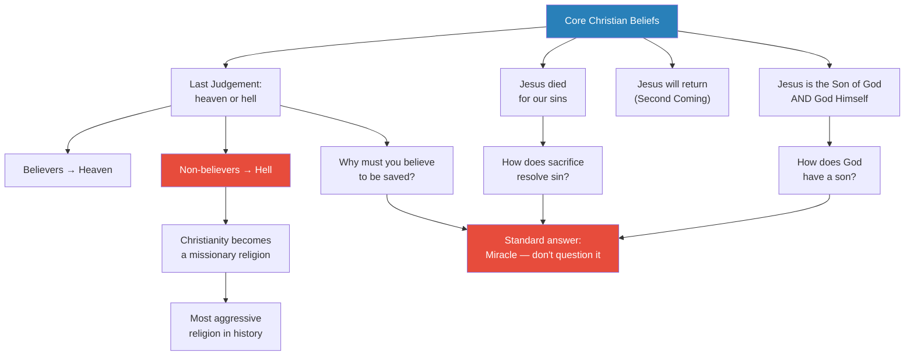
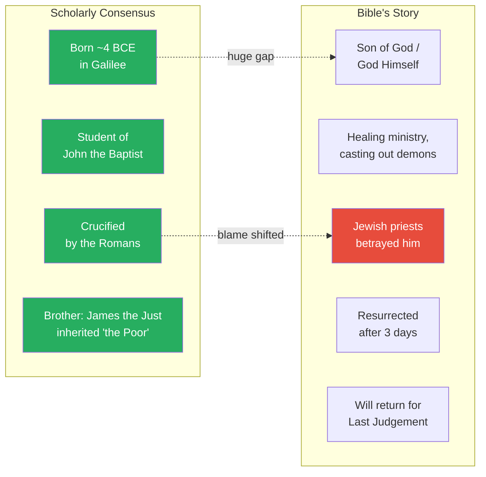
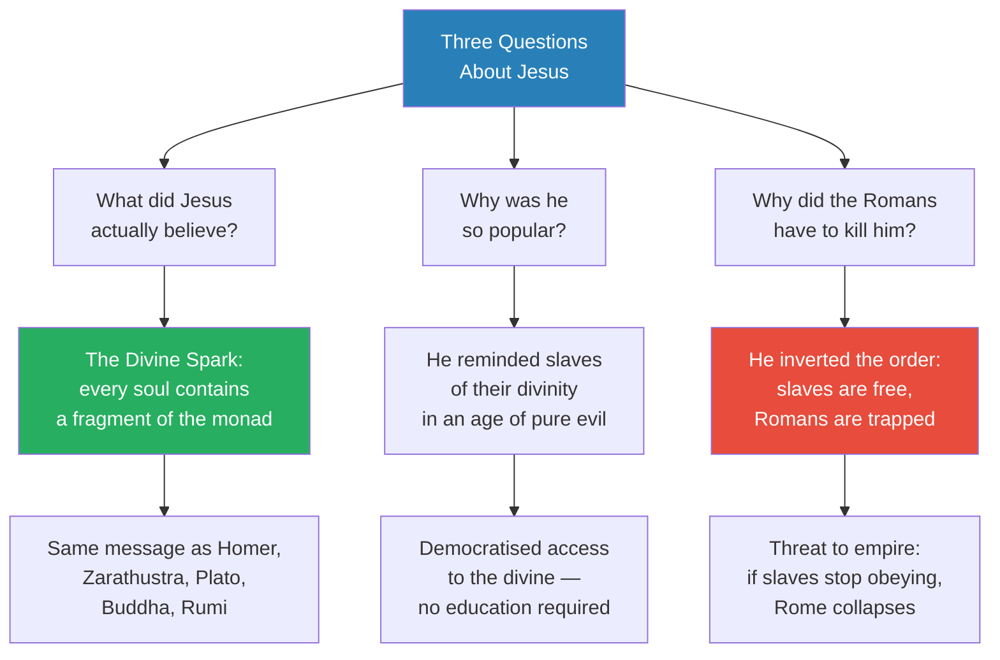
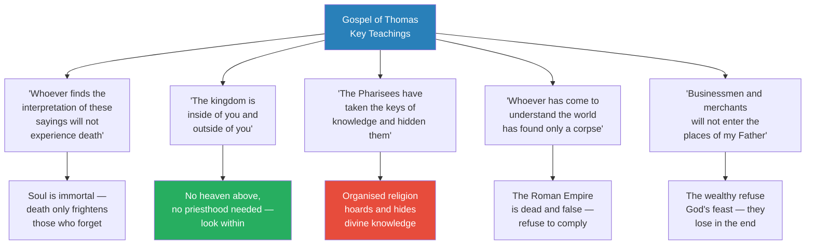
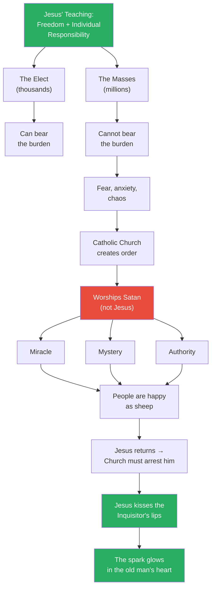
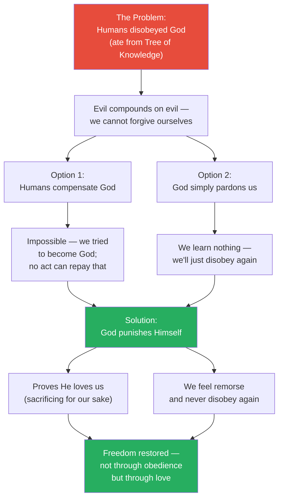
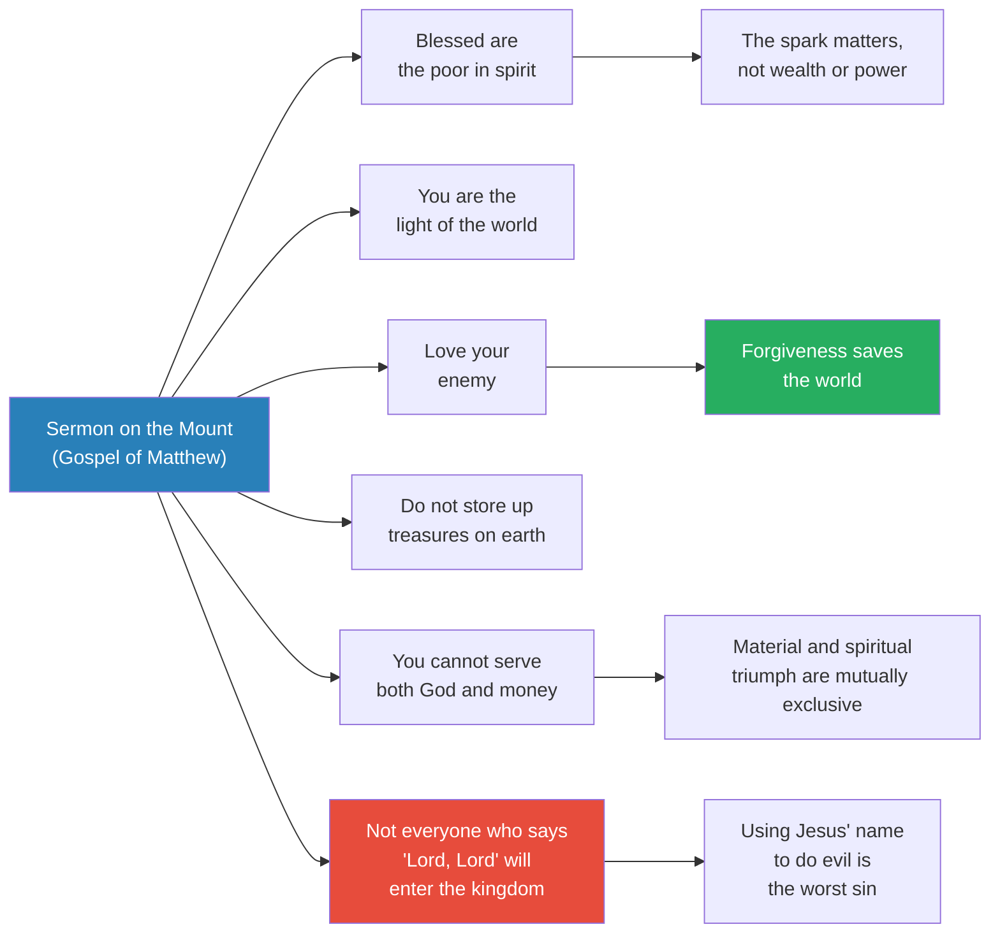
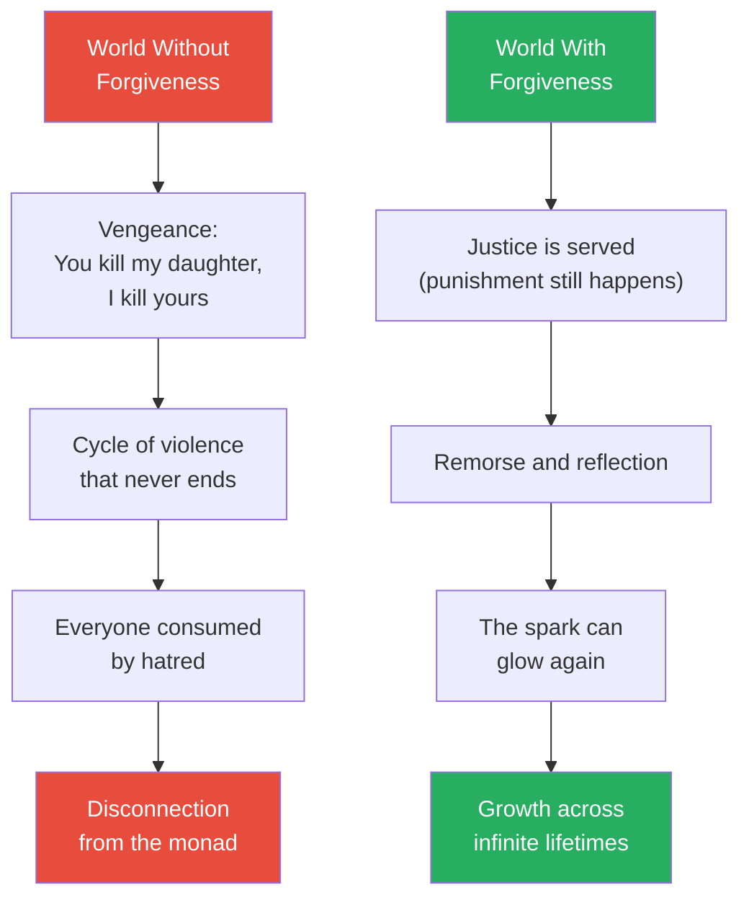

# The Divine Spark of Jesus

> Prof. Jiang tackles the most famous person who has ever lived — Jesus of Nazareth — and argues that the historical Jesus taught something radically different from modern Christianity. Drawing on the Gospel of Thomas (discovered at Nag Hammadi in 1945), Prof. Jiang reconstructs Jesus' true message: that every human contains a divine spark connecting them to the monad, that the material world is a corpse ruled by evil, and that love and forgiveness — not obedience to organised religion — are the path to spiritual liberation. He then uses Dostoevsky's Grand Inquisitor parable and Dante's Divine Comedy to explore the paradox Jesus left behind: if freedom is the highest gift, what happens to the millions who cannot bear its weight?

---

## Overview: Key Highlights

- <b style="color: #27ae60">Jesus taught the same message as every great prophet</b> — the divine spark, the monad, love, forgiveness, and the falseness of the material world
- <b style="color: #2980b9">The Gospel of Thomas</b> — discovered at Nag Hammadi in 1945, Prof. Jiang argues it records Jesus' true teachings, not the Roman-authored Bible
- <b style="color: #e74c3c">Christianity as we know it is a Roman invention</b> — the Bible conveniently excuses the Romans and blames the Jews for Jesus' death
- <b style="color: #27ae60">The Divine Spark is in everyone</b> — Jesus explicitly says "we are all sons of the living Father," not that he alone is the Son of God
- <b style="color: #2980b9">The Grand Inquisitor</b> — Dostoevsky's parable about the Catholic Church choosing Satan's methods to manage humanity's inability to handle freedom
- <b style="color: #e74c3c">Organised religion is the enemy of Jesus' teaching</b> — Jesus explicitly attacks the Pharisees for hoarding knowledge and creating hierarchy
- <b style="color: #27ae60">Love your enemy is the core message</b> — forgiving the oppressor releases them from their demons, just as Priam forgave Achilles
- <b style="color: #2980b9">Dante's sacrifice logic</b> — God had to punish himself so that humans would feel remorse and never repeat their disobedience
- <b style="color: #e74c3c">You cannot serve both God and money</b> — the material world belongs to Satan; spiritual triumph and worldly triumph are mutually exclusive
- <b style="color: #27ae60">Jesus democratised access to the divine</b> — Homer and Dante require education, but anyone can know the story of Jesus and access the monad
- <b style="color: #2980b9">The Achilles parallel</b> — the rich and powerful are Achilles after killing Hector, haunted by demons, more pitiful than the slaves they oppress
- <b style="color: #e74c3c">The Bible contradicts Jesus' own words</b> — Christianity demands belief in Jesus, but Jesus himself says "do not use my name" and "follow your heart"

| Concept | One-line summary |
|---------|-----------------|
| **Divine Spark** | The fragment of the monad — the source, God — that exists inside every human soul |
| **The Monad / The Source** | The divine origin of all consciousness; pure love, compassion, and forgiveness |
| **Gospel of Thomas** | A collection of Jesus' sayings discovered in 1945 at Nag Hammadi, Egypt — excluded from the Bible |
| **Gnosis** | Knowledge of the divine, accessed through inner seeking, not through priests or hierarchy |
| **The Grand Inquisitor** | Dostoevsky's parable in which the Catholic Church arrests the returned Jesus because freedom threatens order |
| **Miracle, Mystery, Authority** | The three tools the Church uses to control people who cannot bear the burden of freedom |
| **Ransom Theory** | The traditional Catholic explanation for why Jesus had to die — a deal with Satan to free humanity |
| **Asha and Druj** | Zarathustra's framework that Prof. Jiang maps onto Jesus: truth/harmony vs. division/falsehood |
| **The Ebionites** | "The Poor" — the original movement led by James the Just, Jesus' brother, after the crucifixion |
| **Sermon on the Mount** | Jesus' public teaching from the Gospel of Matthew, confirming the Gospel of Thomas message |
| **Incarnation** | God taking human form — Dante argues God had to become human and suffer to teach through sacrifice |
| **Reincarnation / Reset** | Death as a game reset — the soul returns to try again, with infinite lifetimes to grow |

---

# The Lecture

## The Basics of Christianity — and Its Problems [0:00 - 4:11]

*Prof. Jiang opens by declaring the subject of the lecture: the most famous person who has ever lived, worshipped by two billion people. Before he can explain who Jesus really was, he needs to lay out what Christianity actually teaches — and why so much of it raises unanswerable questions.*

> [!tip] Core Insight
> Christianity is unique among world religions in demanding not just good behaviour but belief in a specific person — and threatening eternal damnation for non-believers. Every other major religion simply asks you to be a good person.

*Christianity's internal logic generates more questions than any other major religion. The standard answer — miracle, don't question it — is exactly what Prof. Jiang refuses to accept.*

> [!note]- Expand: Full Lecture Detail
> Prof. Jiang begins personally: he grew up in Canada surrounded by Christian culture without being Christian himself, and never understood the religion's core ideas. He walks the class through the major beliefs that most Christian denominations agree on:
>
> - <b style="color: #2980b9">Jesus is the Son of God and God Himself</b> — Prof. Jiang notes this is already deeply confusing: is he the son, or is he God? The Bible says both
> - Christians believe Jesus died for our sins — the original sin of eating from the Tree of Knowledge in the Garden of Eden
> - Jesus was resurrected and ascended to heaven, but will return for the <b style="color: #2980b9">Second Coming</b> and the Last Judgement
> - At the Last Judgement, all individuals are judged: believers go to heaven, non-believers burn in hell
>
> Prof. Jiang pauses on this last point — it is where Christianity becomes "most controversial":
> - Every other religious tradition simply says: be a good person
> - Christianity demands belief in a specific person, or you burn in hell
> - This makes Christianity inherently <b style="color: #e74c3c">missionary</b> — if you are a Christian, you must try to convert others, because their souls are at stake
> - "That is why Christianity is one of the most aggressive religions that we have today"
>
> The explanation for all these logical difficulties is <b style="color: #e74c3c">miracle</b> — meaning: do not question it, just believe. Prof. Jiang rejects this approach entirely: "In our class, we don't really do that. We ask questions, we speculate."

---

## What We Actually Know About Jesus [4:11 - 8:30]

*Prof. Jiang strips away two thousand years of religious narrative and presents only the four facts that mainstream scholars agree on — and the gap between these facts and the Bible's story is enormous.*

*The green nodes are what scholars can verify. Everything in the Bible's story column is either unverifiable or, in the case of Jewish betrayal, actively contradicted by evidence.*

> [!note]- Expand: Full Lecture Detail
> Prof. Jiang tells the class he will now present what scholars — not religious people — have established after decades of research across the Bible, archaeology, and period writings. Only four things are known for certain:
>
> 1. **Born around 4 BCE in Galilee** — not year zero as the Bible states, but four years earlier. Galilee is by the coast, making it cosmopolitan — the young Jesus would have encountered Hinduism, Zoroastrianism, and Judaism from an early age
> 2. **His teacher was John the Baptist** — an <b style="color: #2980b9">apocalyptic preacher</b> who taught that God is coming to destroy the evil, and people must repent now. Jesus was his disciple but eventually broke away to create his own following with a different message
> 3. **The Romans crucified him** — crucifixion was reserved for only two categories: common thieves/bandits, or rebels trying to overthrow the state. Jesus was almost certainly considered a rebel. Prof. Jiang describes the horror of crucifixion in detail: nails hammered through hands, head hanging low, slow suffocation over three days
> 4. **He had a brother called James the Just** — James inherited Jesus' movement after the crucifixion. The movement was called <b style="color: #2980b9">the Poor (Ebionites)</b>
>
> Prof. Jiang then presents the Bible's official story for contrast: Jesus is God's Son, he runs a healing ministry, Jewish priests plot against him, Judas Iscariot betrays him, Pontius Pilate reluctantly orders crucifixion under Jewish pressure, Jesus is resurrected, tells his disciples to spread the gospel, and ascends to heaven.

---

## Why the Jews Did Not Betray Jesus [8:30 - 19:30]

*Prof. Jiang presents three pieces of evidence arguing that the Bible's claim — that Jewish priests conspired to have Jesus killed — is historically implausible. This matters because Christians used this narrative for two thousand years to persecute Jews.*

> [!tip] Core Insight
> The Bible's account of Jewish betrayal served Roman interests perfectly: it shifted blame from the actual killers (Rome) onto the Jews, providing a convenient scapegoat for centuries of persecution.

> [!note]- Expand: Full Lecture Detail
> Prof. Jiang calls this "actually very problematic" and gives three reasons the betrayal story cannot be true:
>
> **Reason 1 — Disagreement is the Jewish tradition:**
> - At this time, there were at least three major Jewish groups: the <b style="color: #2980b9">Sadducees</b> (priestly nobility maintaining ritual), the <b style="color: #2980b9">Pharisees</b> (reformers focused on law over sacrifice), and the <b style="color: #2980b9">Essenes</b> (ascetic monks preparing for God's return, like John the Baptist)
> - All three groups disagreed violently with each other
> - Disagreement, rebellion, and debate are fundamental to Jewish tradition — "you go to Israel today, even though that war, they're still arguing with each other"
> - Simply disagreeing with Jewish authorities was never grounds for execution
>
> **Reason 2 — Jews do not betray Jews to foreign powers:**
> - The Jewish people had strict customs: rest on Saturdays, no intermarriage with outsiders, no charging interest on loans to each other
> - An unwritten but universally accepted law: you do not betray another Jew to non-Jewish authorities
> - "I don't think ever in history have we had a case where the Jewish people betrayed a Jew to the authorities that was non-Jewish"
>
> **Reason 3 — James the Just was protected:**
> - After Jesus' death, his brother James the Just stayed in Jerusalem teaching the same things Jesus taught
> - James was protected by the Jewish authorities
> - If Jesus' teachings were so threatening to Jewish law that priests had him killed, why was his brother — teaching the exact same message — left unharmed and even protected?
>
> Prof. Jiang's conclusion: <b style="color: #e74c3c">"I'm not convinced that the Jews betrayed him. The Romans are just brutal people. They kill people for no particular reason."</b>

---

## The Three Big Questions [19:30 - 29:26]

*Prof. Jiang frames the rest of the lecture around three questions: What did Jesus actually believe? Why was he so popular? And why did the Romans have to kill him? His answer connects Jesus to every prophet studied in the series so far.*

*Jesus' message was not new — it was the perennial insight of every great prophet. What made him unique was the audience (slaves and the poor in the most evil empire in history) and the medium (simple stories anyone could understand).*

> [!note]- Expand: Full Lecture Detail
> Prof. Jiang lays out his central argument:
>
> **What Jesus taught:**
> - There is a <b style="color: #2980b9">Source</b> — the divine, the Good, God, the monad, the universe — whatever name you use
> - The Source emanates and creates the entire universe
> - Our bodies are material, products of evolution — but our consciousness, our soul, is the <b style="color: #27ae60">divine spark</b>, and it comes from the Source
> - After death, the spark returns to the Source in a constant cycle until we eventually merge with it
> - This is what Buddhism, Hinduism, Zoroastrianism, and all major religions teach
> - "Jesus was just teaching it for his times"
>
> **Why he was special — the context of Roman evil:**
> - Prof. Jiang connects Jesus to the Iliad: during Achilles' time, humans did both good and evil, and forgiveness was possible
> - But by the time of Rome, <b style="color: #e74c3c">"the Romans are just pure evil. They're demonic"</b>
> - The existential problem for ordinary people: the Romans conquer through evil and triumph, while good people are enslaved. How do you find comfort?
> - Jesus' answer: the Romans triumph because <b style="color: #e74c3c">the world we live in is a corpse — a false, dead world</b>. Those who embrace death, evil, and hatred win in this false world, but they have lost in the true spiritual reality
>
> **The Achilles parallel:**
> - The rich and powerful are Achilles after killing Hector — they cannot sleep, cannot eat, are haunted by demons
> - "Use your imagination, use your heart, use your empathy, and look into their minds — you can see how tormented they are"
> - The slaves are more free than their masters because they are not haunted
> - <b style="color: #27ae60">To save the world, you must forgive your enemy and love your enemy</b> — only by loving them can you release them from their demons
> - "We have to be Priam. We have to kiss Achilles' hand so that he can be released from his demons"
>
> **Why the Romans killed him:**
> - Jesus was inverting the natural order: slaves are spiritually free, Romans are spiritually enslaved
> - If slaves stop complying and stop obeying, the empire has no power over them
> - This makes Jesus a direct threat to Roman authority
> - After killing him, "they made up the Bible in order to justify what they did — as we discussed last class, that's what Romans do: they do evil, and then they get the Greeks or the Jews to write the history to explain why it was good"
>
> **Jesus as democratiser of the divine:**
> - Homer and Dante are portals to the divine — but you need education to read them
> - Jesus is a portal anyone can access: "Anyone can know the story of Jesus, anyone can say what he says, and then that will give you access to the divine"
> - <b style="color: #27ae60">"Jesus is really about the democratisation of the divine"</b>

---

## The Gospel of Thomas — Jesus' True Teachings [29:26 - 47:28]

*Prof. Jiang reads key passages from the Gospel of Thomas with his students, demonstrating that Jesus' actual words align perfectly with Plato, Zarathustra, Rumi, and the Iliad — and contradict virtually everything modern Christianity teaches.*

> [!tip] Core Insight
> The Gospel of Thomas reveals a Jesus who explicitly rejects organised religion, hierarchy, and the demand for obedience. He tells people the divine spark is inside them — not in heaven, not in the sea, not in a priest's teachings — and that they must find it for themselves.

*Each saying from the Gospel of Thomas maps directly onto an earlier prophet's insight — Plato's cave, Zarathustra's Asha, Rumi's prison metaphor — confirming Prof. Jiang's argument that all great prophets channel the same source.*

> [!note]- Expand: Full Lecture Detail
> Prof. Jiang has students read passages aloud from the Gospel of Thomas, pausing after each to explain. The key passages and his interpretations:
>
> **Saying 1 — "Whoever finds the interpretation of these sayings will not experience death":**
> - In the universe, death does not truly exist — after death, the soul ascends to the divine plane
> - The soul can never die, but you must first recognise that you are the Divine Spark
> - "Once you recognise that, you'll be immortal. When you don't recognise that, then you fear death"
>
> **Saying 2 — "Let him who seeks continue seeking until he finds":**
> - Prof. Jiang connects this directly to <b style="color: #2980b9">Plato's Allegory of the Cave</b>: the prisoner escapes, is blinded by sunlight, feels absolute pain, but eventually sees the truth
> - The process of enlightenment is painful — confusion, torment — but persistence leads to ruling "over the all"
>
> **Saying 3 — "The kingdom is inside of you and outside of you":**
> - <b style="color: #e74c3c">"People who tell you this stuff, don't listen to them"</b> — teachers only guide, but you cannot trust or believe in them
> - You must look inside yourself because the Divine Spark is already there
> - "There's no way Jesus would say, 'Follow me and you're good, believe in me and you're good.' He would never, ever say that"
> - <b style="color: #27ae60">"We are ALL sons of the living Father"</b> — Jesus does not claim superiority; everyone shares the same divine origin
> - Jesus does not refer to the Bible, Adam and Eve, Yahweh, David, or Moses — "for him, it's all fake. What's true is the spark in you"
> - Prof. Jiang emphasises the parallels: "You're seeing the similarities between the Gospel of Thomas and Plato's Allegory of the Cave and the Iliad and Zarathustra and Nietzsche. All these prophets think alike"
>
> **Saying on infants — "When you make the two one":**
> - As we grow older, we believe in the falseness around us
> - Through imagination, we can recognise the world as a hallucination — a projection
> - Male/female, Chinese/American, black/white — "it's all made up, it's not true"
> - <b style="color: #2980b9">Asha and Druj</b> from Zarathustra: Asha is the interconnectedness and harmony of all things, Druj is their division
>
> **Saying on light — "There is light within the man of light":**
> - The disciples ask Jesus to show them how to be like him
> - Jesus responds: "Be yourself. There's a light inside of you. Look for the light and shine the world"
>
> **Saying on intoxication — "I found all of them intoxicated":**
> - The material pursuit of wealth, power, and status is drunkenness — "we came into this world with nothing, and when we die, we're gonna go back with nothing"
> - "If the flesh came into being because of spirit, it is a wonder. But if spirit came into being because of the body, it is a wonder of wonders" — the mind creates the material world, not the reverse
> - Prof. Jiang connects this to <b style="color: #2980b9">Rumi</b>: "the world that we live in is a prison for drunks" — Rumi never read the Gospel of Thomas, but they think the same thought "because they're all being inspired by the same source"
>
> **Saying on the Pharisees — "They have taken the keys of knowledge and hidden them":**
> - <b style="color: #e74c3c">Jesus hates organised religion</b> — the Pharisees create a hierarchy claiming only they have knowledge
> - "You can only access knowledge by looking into yourself"
> - "Be as wise as serpents" — the serpent told Eve to eat the fruit, and Jesus says <b style="color: #27ae60">seeking knowledge is good and natural, even if it means disobeying God</b>
> - If a god forbids you from seeking knowledge, "it means he's a false god" — the true God, the monad, is pure love, compassion, and forgiveness
>
> **Saying on the corpse — "Whoever has come to understand the world has found only a corpse":**
> - The Roman Empire — this vast, powerful entity spanning the Mediterranean — "is a corpse. It's dying. It's dead. It's nothing"
> - Once you recognise this and refuse to comply, "they have no power over you"
> - This is exactly what made Jesus a threat to Rome
>
> **Parable of the lost sheep — "I care for you more than the ninety-nine":**
> - God does not want obedience — he wants creativity, exploration, discovery
> - Those who obey and do nothing "contribute nothing to the universe"
> - "When we love, when we imagine, we are making the universe a brighter place"
>
> **Parable of the feast — "Businessmen and merchants will not enter the places of my Father":**
> - Prof. Jiang updates the parable for today: "Think about how we're supposed to worship Elon Musk because he's rich. What Jesus is saying is no — Elon Musk is the worst person in the world"
> - The monad has prepared a great feast, but the wealthy are too busy making money to attend
> - "Don't worry about the rich and powerful. They may look happy, but they're not"

---

## The Problem of Freedom — Dostoevsky's Grand Inquisitor [47:28 - 1:05:27]

*Prof. Jiang introduces the central paradox Jesus left behind: if individual freedom and responsibility are the path to the divine, what about the vast majority of people who cannot bear that burden? Dostoevsky's Grand Inquisitor provides the most powerful articulation of this problem.*

> [!tip] Core Insight
> Jesus' gift of freedom created an impossible burden for most people. The Catholic Church's solution — replace freedom with miracle, mystery, and authority — may be Satanic, but Dostoevsky forces us to ask: is it also merciful?

*Dostoevsky's parable captures the paradox at the heart of Christianity: freedom is the greatest gift, but most people experience it as the greatest burden. The Church solves this by becoming the evil empire Jesus opposed — and yet the spark survives even in the Grand Inquisitor.*

> [!note]- Expand: Full Lecture Detail
> Prof. Jiang introduces The Brothers Karamazov by Dostoevsky as the key text for understanding the problem Jesus left behind:
>
> **The problem:**
> - Jesus teaches that the Divine Spark is inside you, and it is your individual responsibility to let it grow
> - A few thousand, maybe tens of thousands, will embrace this idea
> - But what about the millions who just want to live normal lives? "People want to be told what to do. People don't want to think for themselves"
>
> **The Grand Inquisitor parable:**
> - The Catholic Church is being the evil empire — oppressing people in place of Rome
> - One day Jesus returns from heaven, walking among the people, healing them
> - But because the Church worships Satan (maintaining order through force), they must arrest Jesus
> - The Grand Inquisitor confronts the imprisoned Jesus with a devastating argument:
>
> > [!example] The Grand Inquisitor's Argument
> > - "Thou didst not love them at all" — by giving people freedom, Jesus increased their suffering, not their happiness
> > - Before Jesus, people knew what was good and evil because teachers told them — now they must decide for themselves, creating chaos
> > - "They will cry aloud that the truth is not in thee" — people will eventually reject Jesus' truth because the burden of free choice is unbearable
> > - The Church corrected Jesus' work by founding it upon <b style="color: #2980b9">miracle, mystery, and authority</b>
> > - People were "immensely joyful" to be led like sheep again — the terrible gift of freedom was lifted from their hearts
> > - "Were we right, teaching them this? Did we not love mankind?" — the Inquisitor argues the Church's Satanic methods are actually more merciful than Jesus' freedom
> > **The lesson:** The case for authoritarian religion is not that freedom is bad — it is that most people experience freedom as suffering, and a loving institution might choose to spare them that suffering.
>
> **Jesus' response:**
> - Jesus says nothing to the Inquisitor's arguments — he simply kisses the old man on his lips
> - The same gesture as Priam kissing Achilles' hand — pure love and forgiveness in the face of evil
> - The Inquisitor "knows he's lost. He knows he's been humbled" — he releases Jesus and tells him to never return
> - "The kiss glows in his heart, but the old man adheres to his ideas"
> - <b style="color: #27ae60">Even the most evil person in the world still has a spark that can glow when shown the possibility of love</b>
>
> **The solution to the paradox:**
> - The soul is eternal — people have infinite lifetimes to figure it out
> - "We're talking about millions of years. Maybe not in fifty years, but in about a million years, people will figure out for themselves"
> - God is patient, loving, forgiving, generous, compassionate — "take your time"
> - <b style="color: #27ae60">Free will is the critical principle</b> — no one can force enlightenment, each person must choose it themselves

---

## Student Q&A — The Spark, Socialisation, and Death [51:00 - 55:00]

*A student raises a sharp objection: if we are born as infants, how can we know what to seek? Socialisation is necessary but also brainwashes us. Prof. Jiang responds with the concept of the eternal soul and infinite reincarnation.*

> [!note]- Expand: Full Lecture Detail
> **Student's question:** God wants us to be creative and seek the spark, but as infants we know nothing. Socialisation teaches us, but socialisation also brainwashes us into materialism. How do we escape this trap?
>
> Prof. Jiang acknowledges this is "a great question, and it's a problem":
> - Your parents, school, and society brainwash you to believe only money and grades matter
> - The answer: "You have to be brave. You have to be true to yourself, because you yourself know what is true"
> - If we did not already know truth when we heard it, Jesus would not matter — but 2 billion people believe in Jesus precisely because "they know that Jesus spoke the truth"
> - In Buddhist and Hindu traditions, <b style="color: #2980b9">reincarnation</b> solves this: maybe not this lifetime, maybe the next, maybe fifty lifetimes away — "but eventually you'll figure it out"
> - "When I actually do what I like, what I enjoy, it makes me a more fulfilled person. And guess what? It connects me to the divine"
>
> Prof. Jiang offers a physical test: "Look at people's faces. When you meet a rich person, his face is kind of evil. When you meet a person who is generous, who volunteers his time, who is a good teacher, his face is different"
>
> **Follow-up on the spark:** "You know when it glows — when you love someone and that person loves you back. When you become a teacher and your students learn well, your spark glows."
>
> **On death as reset:** "Death is like a game reset. You suck at this game, you die, you come back and you try again." The divine spark either glows brightly or dims — when you die, what survives is not memory but the spark's brightness, determining which plane you ascend to.

---

## Dante's Divine Comedy — Why Jesus Had to Die [1:05:27 - 1:19:36]

*Prof. Jiang turns to Dante to answer the question every student asks: why did Jesus have to sacrifice himself? The traditional "ransom theory" is rejected in favour of Dante's far more elegant logic — God had to punish himself so that humanity would learn through remorse, not through obedience.*

*Dante's logic resolves the paradox elegantly: neither human compensation nor divine pardon works alone. Only God's self-sacrifice — suffering alongside us — creates the emotional transformation that prevents future disobedience.*

> [!note]- Expand: Full Lecture Detail
> Prof. Jiang introduces Dante's Divine Comedy as the text that answers why Jesus had to kill himself. He first presents the traditional Catholic explanation:
>
> **The Ransom Theory (rejected):**
> - When we do evil, we become slaves of Satan
> - Jesus made a deal with Satan: "I will die and you can take my body, but you must free my people"
> - Satan accepts — God in exchange for slaves seems like a great deal
> - But Jesus cannot truly die, so he rises again and humanity is freed
> - Dante rejects this: "God will not come to free us so that we become slaves to God. God came to free us so we could be free"
>
> **Beatrice's teaching in Paradise:**
> - The greatest gift God gave in creation was <b style="color: #27ae60">freedom of the will</b> — "If God is love, and he loves people, then he must trust people"
> - Prof. Jiang offers a parenting analogy: "If you truly love your child, you will let your child go and make his own mistakes"
> - True love means trusting other people — even at the risk of harm
>
> **The logic of self-sacrifice:**
> - Beatrice says the answer is "buried from the eyes of everyone whose intellect has not matured within the flame of love" — you cannot understand with the mind alone, only with the heart
> - The spark inside us is always there, but evil dims it — "we can cover it up with mud, forget about it"
> - The problem: once we disobeyed God (ate the fruit, tried to become God), we could not forgive ourselves, leading to compounding evil
> - Two impossible options: humans cannot compensate God (we tried to kill God — nothing can repay that), and if God simply pardons us, we learn nothing
>
> > [!example] The Father and the Dog — Prof. Jiang's Analogy
> > - A father has a daughter named Eve and a dog, and he tells Eve he loves them both equally
> > - Eve, wanting proof she is loved more, kills the dog
> > - The father is stuck: punishing Eve proves he loved the dog more, but not punishing means she will do it again
> > - The only way out: the father punishes himself — takes a whip and hits himself while Eve watches
> > - Eve now knows two things: the father truly loves her (he is suffering for her sake), and she will never do it again (she cannot bear to see him suffer)
> > **The lesson:** God had to punish himself — become incarnate and die — so that humanity would feel remorse deep enough to never disobey again, while also knowing they are loved.
>
> **Beatrice on death and resurrection:**
> - The world we live in is one where we can make mistakes, learn, and grow
> - Jesus was resurrected — and so will we be: "We have infinite opportunity to grow as souls"
> - "Don't think about this lifetime. Think about all possible lifetimes, and live your life accordingly"
> - <b style="color: #27ae60">"Make the most of your life by making as many mistakes as possible, because only by making mistakes can you actually grow as a soul"</b>

---

## The Sermon on the Mount — Biblical Confirmation [1:27:16 - 1:34:13]

*Prof. Jiang turns to the Gospel of Matthew to show that even within the Bible itself, Jesus' words confirm the Gospel of Thomas message — and directly contradict the religion built in his name.*

*The Sermon on the Mount, accepted by all Christians as authentic, contains the same radical message as the Gospel of Thomas — yet the Church built around Jesus teaches the exact opposite of what he said.*

> [!note]- Expand: Full Lecture Detail
> Prof. Jiang gives three reasons he believes the Gospel of Thomas records Jesus' true teachings:
> 1. It has a unique poetic voice — "the divine spark itself, so it cannot be replicated"
> 2. It aligns perfectly with every other prophet studied in the course — Homer, Zarathustra, Plato, Rumi
> 3. Later prophets like Dante and Dostoevsky independently reconstruct the same teachings
>
> He then reads from the Sermon on the Mount (Gospel of Matthew) to show that even the Bible's own text confirms this reading:
>
> **The Beatitudes:**
> - "Blessed are the poor in spirit, for theirs is the kingdom of heaven"
> - "Blessed are the meek, for they will inherit the earth"
> - "Blessed are the peacemakers, for they will be called children of God"
> - "Blessed are those who are persecuted because of righteousness"
> - Prof. Jiang: "It doesn't matter how wealthy you are. It is probably those who are slaves that are more virtuous, and they will inherit the kingdom"
>
> **Salt and light:**
> - "You are the salt of the earth... You are the light of the world"
> - <b style="color: #27ae60">"Every one of you has a light in you. Every one of you has the power to change the universe"</b>
>
> **Love your enemy:**
> - "Love your enemy and pray for those who persecute you"
> - "If you love those who love you, what reward will you get? Are not even the tax collectors doing that?"
> - Prof. Jiang: "We are in this world to do as much good as possible. Thank evil people, because it gives you opportunity to do good"
>
> **Treasures in heaven:**
> - "Do not store up treasures on earth, where moth and vermin destroy"
> - "Where your treasure is, there your heart will be also"
> - "Focus on making your heart pure, good, and virtuous — when you die, you can't take these things with you, but your heart will always follow you"
>
> **The eye as lamp:**
> - "If your eyes are healthy, your whole body will be full of light"
> - This is <b style="color: #2980b9">the law of attraction</b> — how you see the world is a reflection of the spark inside you
>
> **God and money:**
> - <b style="color: #e74c3c">"You cannot serve both God and money"</b>
> - "This world belongs to Satan. It's your choice: triumph in this world or triumph in the spiritual world. But you cannot have both"
>
> **The most devastating passage — "Not everyone who says 'Lord, Lord'":**
> - Jesus explicitly says: people will prophesy in his name, drive out demons in his name, perform miracles in his name — and he will tell them, "I never knew you. Away from me, you evildoers"
> - <b style="color: #e74c3c">"Don't use my name. Don't follow me. Follow your heart"</b>
> - Prof. Jiang asks the central question this sets up for the next lecture: "How do we get from this to the Catholic Church, which says you must obey us or be condemned to hell?"

---

## Forgiveness, Evil, and the Purpose of Life [1:19:36 - 1:27:16]

*A student asks whether someone who has done extreme evil can truly be forgiven. Prof. Jiang uses this to articulate the deepest layer of Jesus' teaching: without forgiveness, the entire universe breaks down.*

*Forgiveness does not mean no consequences — justice is still served. But without the possibility of forgiveness, hatred consumes everyone, and the entire system collapses into infinite vengeance.*

> [!note]- Expand: Full Lecture Detail
> **Student's question:** If I have done extreme evil in the past, can I truly make it up, or do I just have to forgive myself? "I think I can't."
>
> Prof. Jiang responds:
> - "The answer is yes, because the only way for this world to work is if people are allowed to be forgiven"
> - Without forgiveness: "If you kill my daughter, now I have to go kill your daughter, and then you're gonna kill my family" — an infinite cycle of vengeance
> - <b style="color: #27ae60">Forgiveness is structurally necessary for the universe to function</b>
> - Previously, humans did not have a tool for forgiveness because they lacked the wisdom — Jesus provides that tool
> - Believing in Jesus does not exempt you from consequences: "You're still gonna go to prison. But now you can forgive yourself because you've done your time"
> - "The only way for you to move on, the only way for society to move on, is if you're able to forgive yourself"
>
> **Student pushes back:** "I still could not forgive myself for making that mistake."
>
> Prof. Jiang: "You're thinking with your head. When you grow older and your heart matures, and you have more life experience, then you'll be able to feel your heart. Once you feel your heart, all this will make sense"
> - He acknowledges the student's perspective is natural: "At your age, if someone told me this, I'd be like, you're crazy"
> - But hating someone means hating yourself — "when you hate someone, you're actually hating yourself as opposed to that person"
> - Hatred disconnects you from the monad and the divine
>
> **On the purpose of the universe (via Dante's Beatrice):**
> - God is perfect and creates perfection — but within that perfection, the laws of the universe create cycles of life and death
> - "The world that we live in is a world in which we can make mistakes, learn, grow"
> - Death is not punishment but opportunity: "Death allows for a reset. Death allows us to rejuvenate ourselves and learn from mistakes"

---

## The Leonardo Code and the Promise of Forgiveness [1:26:57 - 1:27:16]

*Prof. Jiang closes the textual analysis with a detail from Leonardo da Vinci's Last Supper — a hidden biblical reference that encapsulates Jesus' entire message.*

> [!note]- Expand: Full Lecture Detail
> Prof. Jiang points to Leonardo da Vinci's Last Supper, noting the arrangement of figures creates the number pattern 3-3-1-3-3. Looking up Lamentations 3:31-33 in the Bible:
>
> > [!quote] Lamentations 3:31-33
> > "For no one is cast off by the Lord forever. Though he brings grief, he will show compassion, so great is his unfailing love. For he does not willingly bring affliction or grief to anyone."
>
> Prof. Jiang: "That's who Jesus is. Jesus came to remind us that we will all be forgiven in the end. So forgive other people. Love your enemy."

---

## Final Q&A — Death, Memory, and the Eternal Spark [1:35:15 - 1:36:30]

*A student raises a final objection: if death is a reset, and memory is erased, how can we learn across lifetimes? Prof. Jiang's answer completes the lecture's cosmology.*

> [!note]- Expand: Full Lecture Detail
> **Student's objection:** Death clears a person's memory — they will not remember their mistakes or what they learned. So how does reincarnation help?
>
> Prof. Jiang: "That's a great point." His answer:
> - When you die, what survives is not the brain or memories — it is the <b style="color: #2980b9">Divine Spark</b>
> - If the spark glows brightly, it ascends to a higher plane — closer to the monad, experiencing more pleasure
> - If the spark has dimmed through evil, it descends to a lower plane
> - "What you will remember, what you will leave behind, is the amount of goodness you did, or the amount of evil you did"
> - It may take 50 lifetimes, 1000 lifetimes, a million lifetimes — "but it's your choice"
> - Some figure it out quickly, others slowly — "but everyone teaches us: when you die, you won't remember how much money you have"

---

## Connections

**Builds on:** [[18 - Thus Spoke Zarathustra]] (Asha and Druj, the monad, Plato's cave), [[16 - The Big Bang of Greek Civilization]] (Achilles, Priam, the Iliad's insight on forgiveness), [[21 - Roman Anti-Civilization]] (Roman evil, empire as demonic force)
**Sets up:** [[23 - The Organization of Evil]] (how the Catholic Church was created by Rome, worshipping Satan while pretending to worship Jesus)
**Related books in vault:** [[Sapiens - Yuval Noah Harari]] (religion and meaning-making), [[The 48 Laws of Power - Robert Greene]] (power as spiritual corruption)

---

## The Takeaway

This lecture completes a thread running through the entire Secret History series: from Homer's Iliad through Zarathustra and Plato, Prof. Jiang has been tracing the same insight — that there is a source, a monad, and that every human consciousness contains a spark of it. Jesus is the culmination of this thread, not because he said anything new, but because he said it in a way that anyone could understand, at a moment when the world most needed to hear it. The Roman Empire represented evil at its most total and systematic, and Jesus' response was not rebellion or force but an inversion: the slaves are free, the masters are imprisoned, and the material world is a corpse. This is the most dangerous idea an empire can face — not an army, but a framework that makes obedience meaningless.

The most counterintuitive insight is the paradox Dostoevsky identifies: Jesus' gift of freedom may actually cause more suffering than the tyranny it replaces. The Grand Inquisitor's argument is not easily dismissed — most people genuinely do want to be told what to do, and the Catholic Church's decision to replace freedom with miracle, mystery, and authority may be Satanic in method but compassionate in intent. Prof. Jiang does not resolve this paradox; he simply notes that the soul is eternal and God is patient. The implication is striking: the universe is designed for the long game, and the overwhelming majority of human suffering is simply the cost of a learning process that spans millions of years.

The question left open for the next lecture is explosive: if Jesus' true teachings are what the Gospel of Thomas records, and the Bible is a Roman propaganda document designed to shift blame from Rome to the Jews, then how exactly did the Catholic Church come into being? Prof. Jiang has promised to show that Christianity is not an invention of Jesus but an invention of Rome — and that the Church functions as a continuation of the Roman Empire by other means.
