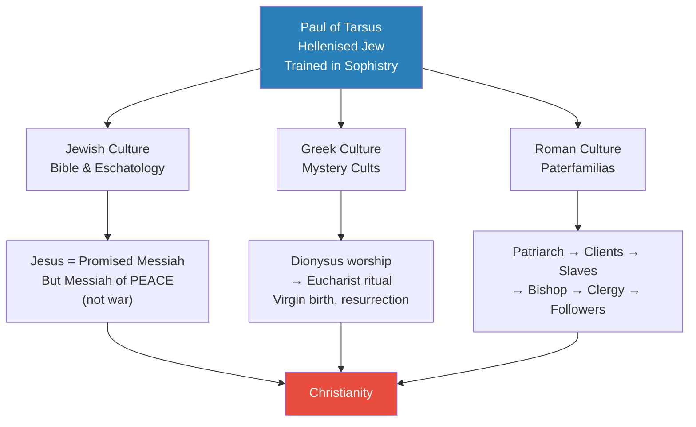
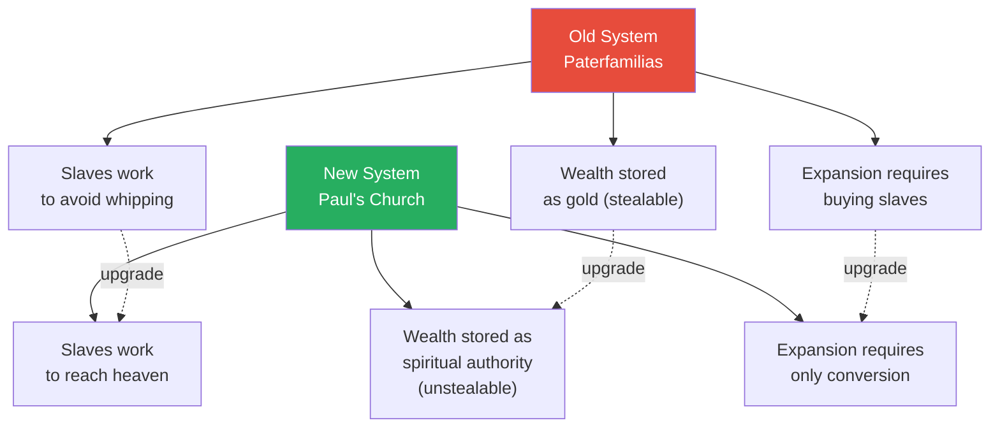
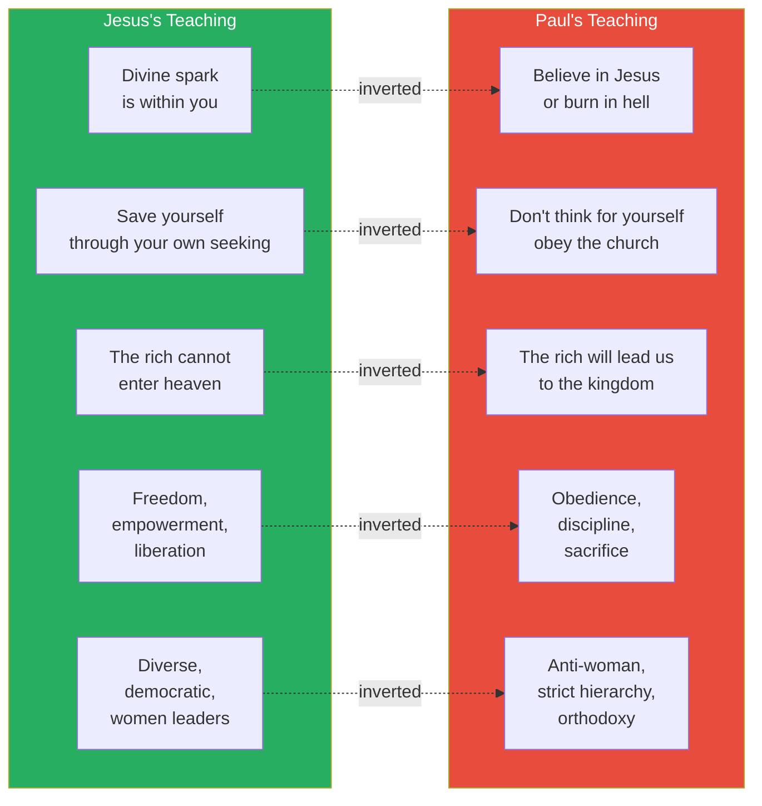
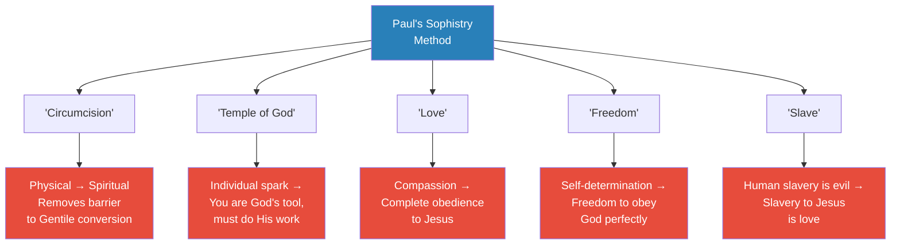
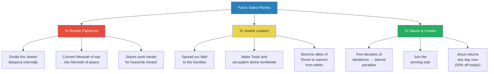
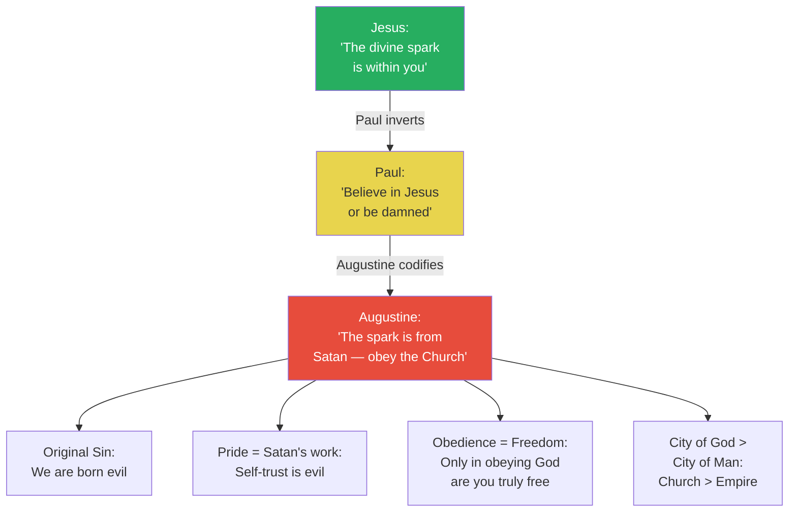

# The Organization of Evil

> Prof. Jiang traces how the radical freedom of Jesus — the divine spark, the poetry of self-liberation — was captured, inverted, and weaponised by Paul of Tarsus into a system of total obedience. Paul, a Hellenised Jewish rhetorician trained in Greek sophistry, synthesised Roman social structure (the paterfamilias), Greek mystery cults (the Eucharist from Dionysus worship), and Jewish eschatology (the Messiah) into a single franchise model: the Catholic Church. Augustine later codified Paul's inversion into doctrine — pride is evil, the divine spark comes from Satan, and obedience is the only path to God. The result is a system so powerful it persists to this day, converting spiritual liberation into spiritual slavery.

---

## Overview: Key Highlights

- <b style="color: #27ae60">Paul, not Jesus, is the true founder of Christianity</b> — a third of the New Testament is written by or about Paul, and his teachings directly contradict those of Jesus
- <b style="color: #e74c3c">Jesus taught freedom; Paul taught obedience</b> — Jesus said the divine spark is within you; Paul said believe in Jesus or burn in hell
- <b style="color: #2980b9">Sophistry</b> — the art of constructing reality through language, Paul's master tool for redefining words like "love," "freedom," and "circumcision"
- <b style="color: #2980b9">Paterfamilias</b> — the Roman patriarchal franchise system that Paul copied to build the church structure (bishop at top, followers below)
- <b style="color: #27ae60">The Eucharist comes from Dionysus worship</b> — ritual consumption of the god's body to achieve communion, adopted wholesale from Greek mystery cults
- <b style="color: #e74c3c">Paul's real customers were the patriarchs, not the slaves</b> — the system was designed to make slaves work harder by promising eternal paradise in exchange for obedience
- <b style="color: #2980b9">Three cultures synthesised</b> — Jewish eschatology (Messiah), Greek mystery cults (Eucharist), and Roman social structure (paterfamilias) fused into Christianity
- <b style="color: #e74c3c">Augustine inverted the divine spark</b> — declared it comes from Satan, not God, making pride the original sin and obedience the only virtue
- <b style="color: #27ae60">Paul operated as a double agent</b> — possibly serving Rome (to neutralise Jewish revolt) and Jewish leaders (to spread the Bible and elevate Jewish status) simultaneously
- <b style="color: #2980b9">The McDonald's analogy</b> — Paul built a franchise model for religion, just as Ray Kroc built one for hamburgers: same structure, same menu, rapid expansion
- <b style="color: #e74c3c">The Black Nobility</b> — 13 Roman families who stored their power in the Catholic Church, an alliance with Jewish elites and secret societies that persists today
- <b style="color: #27ae60">Cannibalism has deep religious roots</b> — from Magdalenian funeral rites to Aztec sacrifice to Victorian mummy-eating, consuming the body is an ancient method of communion

| Concept | One-line summary |
|---------|-----------------|
| **Sophistry** | The art of using language to construct reality rather than discover truth — Paul's primary weapon |
| **Paterfamilias** | Roman patriarchal household system: patriarch → clients → slaves; copied to create church hierarchy |
| **Eucharist** | Ritual consumption of Christ's body and blood, derived from Dionysus worship in Greek mystery cults |
| **Divine spark (inverted)** | Jesus said it liberates you; Augustine said it comes from Satan and leads to pride |
| **Original sin** | Augustine's doctrine that humans are born evil and can only be redeemed through obedience to the Church |
| **Mystery cults** | Secret Greek ritual societies worshipping Dionysus; became the basis for elite secret societies |
| **Circumcision debate** | Paul redefined circumcision as spiritual, not physical — removing the barrier to Gentile conversion |
| **James the Just** | Jesus's brother who inherited the movement and opposed Paul's corruption of the teachings |
| **Black Nobility** | 13 Roman families who stored dynastic power in the Catholic Church, persisting to the present |
| **Franchise model** | Paul's church structure mirrors a business franchise: standardised ritual, rapid replication, central authority |
| **Double agent thesis** | Paul may have simultaneously served Roman interests (neutralise Jews) and Jewish interests (spread the Bible) |

---

# The Lecture

## Review: Jesus and the Divine Spark [0:00 - 2:00]

*Prof. Jiang opens with a rapid review of the previous lecture's argument — Jesus as a messenger from the monad who reminded humanity of the divine spark within, and why the Romans had to kill him for it.*

> [!note]- Expand: Full Lecture Detail
> - Prof. Jiang recaps: Jesus was a messenger from the monad who reminded people that a divine spark exists within them
> - To activate the spark, you focus on Jesus's words and repeat his poetry — like Zarathustra, Plato, Homer before him
> - This explains Christianity's explosive popularity — it offered genuine spiritual liberation
> - It also explains why the Romans had to kill him:
>   - The Roman economy was built on slavery — most people were either slaves or poor
>   - Jesus told slaves they were free, that a higher power than the Roman Empire exists
>   - Slaves began to defy their masters and lost their fear of death
>   - Jesus was "stealing" from the Romans — slaves are property, and freeing them destroys Roman wealth
> - Jesus was crucified alongside two thieves — he was treated as a thief because he was stealing Rome's slaves
> - Prof. Jiang poses the central question of this lecture: how do we get from Jesus to the Catholic Church?
>   - Jesus teaches freedom, self-belief, listening to your heart
>   - The Catholic Church teaches that you believe in Jesus, obey completely, and are now a slave to Jesus
>   - These are opposite ideas

---

## Paul: The Architect of the Prison [2:00 - 9:00]

*Prof. Jiang introduces Paul of Tarsus as the man who imprisoned the divine spark inside a church structure. A Hellenised Jew trained in Greek rhetoric, Paul synthesised three cultures — Roman, Greek, and Jewish — into the most powerful organisational system in history.*

> [!tip] Core Insight
> Jesus spoke to slaves and told them they were free. Paul spoke to patriarchs and told them how to make their slaves work harder. That single shift in audience explains the entire structure of Christianity.

*Paul's genius was synthesis — he took existing structures from three dominant cultures and fused them into a single system that appealed to everyone for different reasons.*

> [!note]- Expand: Full Lecture Detail
> - Prof. Jiang introduces <b style="color: #2980b9">sophistry</b> as the key to understanding Paul
>   - In classical Athens, there was a major debate between philosophers and sophists
>   - Both words come from "Sophia" (Greek for knowledge)
>   - <b style="color: #27ae60">Philosophers believe eternal truth exists</b> — they try to escape Plato's cave into the light
>   - <b style="color: #e74c3c">Sophists believe words ARE reality</b> — there is no eternal truth, only constructed reality through language
>   - Sophistry gives us the word "trickery" — and Paul was the greatest trickster
> - Paul's background: a wealthy, well-educated Hellenised Jew, probably working for the Roman Empire as a spy or agent
> - **The trick:** Jesus says "listen to my words and you will find the divine spark in you"; Paul says "believe in Jesus and you will be saved" — shifting focus from the words to the person
>
> **The three cultural pillars:**
>
> - **Jewish culture (the Bible):**
>   - The Bible was heavily influenced by Persian monotheism — good vs evil, eschatology (end of the world)
>   - Jews were waiting for a Messiah of war to lead them against Rome and reclaim the kingdom of David
>   - Paul's trick: Jesus is not the Messiah of war but the <b style="color: #2980b9">Messiah of peace</b> — therefore Jews should not resist Rome
>
> - **Greek culture (mystery cults):**
>   - Paul chose a mystery school that worshipped Dionysus — god of creativity and wine
>   - The Dionysus story: born of a virgin mother, father is Zeus, killed by enemies, resurrected by Zeus
>   - This became the story of Jesus
>   - The ritual: followers eat food believing it is the body of Dionysus, absorbing his energy, achieving communion
>   - This became the Eucharist — the central Christian ritual still practised today
>
> - **Roman culture (the paterfamilias):**
>   - The Roman social structure: patriarch at top → identifies talented slaves → frees them as "clients" → they conduct business on his behalf
>   - The Roman Empire is not one strict hierarchy but a franchise platform where dozens of families each control provinces
>   - Paul copied this system exactly: bishop at top → clergy → followers/disciples
>   - The switch from paterfamilias to church was seamless — same structure, new branding

---

## Why Patriarchs Converted [9:57 - 15:00]

*Prof. Jiang explains the economic logic behind conversion — why Roman patriarchs would adopt Paul's system. The answer: it made slavery more efficient, converted private wealth into spiritual authority, and enabled faster imperial expansion.*

*Every dimension of the old system was upgraded. The deal for patriarchs was irresistible: from king to god, from gold to spiritual authority, from buying slaves to converting them.*

> [!note]- Expand: Full Lecture Detail
> - Prof. Jiang lays out the business logic of conversion:
>   - **Before:** slaves work to stay alive, motivated by the whip — limited output
>   - **After:** slaves work to reach eternal paradise — "be a slave for 40-50 years, then enjoy eternity of joy"
>   - The deal caused slaves to be more obedient and work harder
> - The patriarch's private wealth now becomes spiritual authority:
>   - Before: you're a king with gold that people can steal or kill you for
>   - After: you represent God — if someone steals from you, God will punish them
>   - "Before you were king, but now you're a god. What a great deal."
> - Expansion accelerates:
>   - Before: to get slaves, you have to buy them
>   - After: you just convert people — a much faster way to create wealth
> - <b style="color: #e74c3c">The patriarchs practised a different religion from the slaves</b>:
>   - Slaves practised Christianity
>   - Patriarchs secretly practised the Greek mystery cults
>   - This is the basis for secret societies — the elites bound together through hidden rituals
>   - This dual system persists even today
> - Paul was talking to patriarchs; when patriarchs converted, they brought the entire paterfamilias with them
> - This explains the rapid growth of Christianity — it was a top-down conversion, not bottom-up

---

## Jesus vs Paul: Opposite Teachings [15:00 - 20:00]

*Prof. Jiang systematically contrasts what Jesus actually taught with what Paul taught, demonstrating that they are not variations on a theme but direct opposites.*

*Every teaching of Jesus was systematically inverted by Paul. The divine spark became original sin. Freedom became obedience. The rejection of wealth became the worship of wealth as a metric of God's favour.*

> [!note]- Expand: Full Lecture Detail
> - **Teaching 1 — The divine spark:**
>   - Jesus: the divine spark is within you; save yourself by seeking truth
>   - Paul: Jesus came to redeem us from original sin; believe in him or burn in hell
>   - "Doesn't matter what you do — you can do as much good as you want, but if you do not believe in Jesus, you will burn in hell"
>
> - **Teaching 2 — Self-reliance:**
>   - Jesus: he cannot save you; he can guide you with poetry you must decipher yourself
>   - Paul: don't think for yourself, just do what everyone else does; what matters is church cohesion
>
> - **Teaching 3 — Wealth:**
>   - Jesus: the rich cannot enter heaven because they are blind to spiritual needs
>   - He tells the parable of God's feast — the rich won't attend because they are too busy making money
>   - Paul: the rich will lead us to the kingdom because they can finance Christianity's spread
>   - <b style="color: #e74c3c">Paul cares about metrics — how many souls converted, how cohesive the church is</b>
>   - "Jesus is a prophet, but Paul is a business person"
>
> - **Early Christianity was diverse and democratic:**
>   - Around 40-50 AD, there were many different Christianities
>   - Many early leaders were women — people like Mary Magdalene, who were wealthy and charismatic
>   - By the time Paul dominates, Christianity becomes anti-woman, hierarchical, and orthodox
>   - Early Christians were persecuted — but by Paul, not just by the Romans
>   - Paul's Christianity was a small minority because Jesus's message of freedom was more appealing
>   - But Paul won because he was supported by the Roman Empire

---

## The Three Mysteries of Paul [20:00 - 25:00]

*Prof. Jiang presents three scholarly puzzles about Paul that have no satisfying answers — unless you apply game theory and conclude he was likely a spy.*

> [!note]- Expand: Full Lecture Detail
> - **Mystery 1:** Why would a wealthy, educated Hellenised Jew join a movement of illiterate Jewish peasants?
>   - Scholars have no good answer
>
> - **Mystery 2:** Paul was a fanatical Pharisee who hunted Christians — then he converts to become a fanatical follower of Jesus. Why?
>   - The Bible's explanation: on the road to Damascus, a light blinds Paul and Jesus says "Why do you persecute me?"
>   - Prof. Jiang notes this mirrors Plato's Allegory of the Cave — Paul, trained in Greek culture, would know this
>
> - **Mystery 3:** Paul spent his entire life travelling the Roman Empire promoting Christianity, with secretaries taking notes. Where did the money come from?
>   - "You just do some basic game theory analysis. He's clearly a spy."
>
> - The class reads from Acts of the Apostles:
>   - Paul is arrested in Jerusalem — the Jewish mob wants to kill him
>   - He reveals he is a Roman citizen, which saves him (the soldiers cannot flog a Roman citizen)
>   - Prof. Jiang notes: "God can't save Jesus, but Rome saves Paul"
>   - Paul demands an audience with the Emperor — only the Emperor can decide his fate
>   - He is sent to Rome with a soldier escort
>
> - In Rome, Paul summons Jewish leaders and threatens them:
>   - "If I wanted to, I could go to the Emperor and bring charges against you Jews"
>   - He convinces some Jewish leaders to convert — "that's how powerful Paul is"
>   - When others refuse, Paul gets angry: "You Jews are so stubborn — the Gentiles will get it"
>
> - <b style="color: #2980b9">The double agent thesis:</b>
>   - Reading the text at face value, Paul looks like a Roman agent
>   - But why would he be so blatant about it? Perhaps he is a double agent
>   - As a spy for Rome: destroy messianic Judaism from within, convert Messiah of war into Messiah of peace
>   - As a spy for Jewish leaders: spread the Bible to Gentiles, elevate Jewish status as God's chosen people
>   - "Spies have no loyalties. They are double agents, triple agents, always switching"

---

## Paul's Letters: Sophistry in Action [41:44 - 56:08]

*Prof. Jiang reads Paul's actual letters from the New Testament with the class, stopping after each passage to expose the rhetorical trick. The pattern is consistent: Paul takes a concept from Jesus, redefines the key word, and inverts its meaning.*

> [!tip] Core Insight
> Paul's method is always the same: take a word that means freedom (love, spirit, circumcision, temple), redefine it through rhetoric, and make it mean obedience. This is sophistry — the construction of reality through language.

*Every redefinition follows the same pattern: take a word that implies individual agency, redefine it to mean collective obedience. The vocabulary of liberation becomes the vocabulary of enslavement.*

> [!note]- Expand: Full Lecture Detail
> **Circumcision (Romans):**
> - Jews are clear: circumcision is the sign of the covenant with God; if you are not circumcised, you are not Jewish
> - Paul redefines: "a person is a Jew who is one inwardly, and real circumcision is a matter of the heart — it is spiritual and not literal"
> - Prof. Jiang: "This is rhetoric. He's changing the definition of the word."
> - The practical effect: removes the barrier to Gentile conversion — Greeks and Romans can now join without circumcision
> - This was the main conflict between Paul and James the Just in Jerusalem
>
> **Faith over Law (Romans):**
> - Jews believe what matters is following the laws — circumcision, Sabbath rest, marrying within the tribe
> - Paul: "the righteousness of God through faith in Jesus Christ, for all who believe... they are justified by his grace as a gift"
> - The shift: from actions and laws to belief alone — "you can do as many good works as you want, but if you do not believe in Jesus, you will burn in hell"
>
> **Church cohesion over truth (1 Corinthians):**
> - Other early Christians call Paul out: "This is not what Jesus taught"
> - Paul's response: "Who's right? Jesus is right. It's not what you say or what I say, it's what Jesus says"
> - Prof. Jiang: "He's positioning himself above the debate rather than engaging it directly"
> - Paul says whoever builds the biggest church will be proven right — using material success to justify faith
> - "He's using the metric of business success, of wealth, of material acquisition to justify his faith"
>
> **Slavery reframed (1 Corinthians):**
> - Slaves, emboldened by Jesus, say "We're free, right?"
> - Paul: "You are free, but you are slaves to God. No human can be your master, because you are all slaves to God"
> - He then declares: "To the Jews I become as a Jew... to the weak I become weak... I become all things to all people"
> - Prof. Jiang: "It's always like a pep rally. He's telling his workers, go out and sell those damn hamburgers"
>
> **The Eucharist (1 Corinthians):**
> - Paul establishes the ritual: eat the bread (body of Christ), drink the wine (blood of Christ), "do this in remembrance of me"
> - "Whoever eats the bread or drinks the cup of the Lord in an unworthy manner will be answerable for the body and blood of the Lord"
> - Prof. Jiang: the Eucharist negates the divine spark — the spark is free, individual, independent; when you partake, you become one with everyone else, losing your individuality
> - "It's possession by Jesus" — Jesus enters you and takes you over
>
> **Love = Obedience (1 Corinthians 13):**
> - Paul writes the famous passage: "Love is patient, love is kind..."
> - Prof. Jiang: "You think the word is love, great. The word actually means obedience"
> - "When a human master enslaves you, that's evil. When Jesus enslaves you, it's good because now it's love"
> - "Never ever question the authority of the Church. That's evil."
>
> **The Body of Christ (1 Corinthians 12):**
> - Paul: "the body does not consist of one member but of many... the eye cannot say to the hand, I have no need of you"
> - Prof. Jiang: when you consume the body of Christ, each person has consumed a part — you must come together to form the whole body
> - "This requires complete obedience if we are to resurrect Jesus in our church"

---

## The Eucharist and Ritual Cannibalism [57:06 - 1:03:45]

*Prof. Jiang traces the Eucharist back through Dionysus worship, Magdalenian funeral rites, and Aztec sacrifice to show that ritual cannibalism — consuming the body of someone to absorb their power — is one of humanity's oldest and most persistent religious practices.*

> [!note]- Expand: Full Lecture Detail
> - A student asks whether consuming Jesus's body is exploitation
> - Prof. Jiang clarifies: "Jesus is your master. When you partake in Jesus, you become part of Jesus, and you must obey exactly what he wants"
> - The Greek mystery cults were the direct source:
>   - Followers of Dionysus believed they were eating his body and absorbing his energy
>   - These cults involved ritual sacrifices — tearing people apart and consuming flesh to replicate Dionysus's death
>   - "These mystery cults are demonic"
>
> - <b style="color: #2980b9">The deep history of ritual cannibalism:</b>
>   - 15,000 years ago in Magdalenian Europe, cannibalism was common during funerals
>   - If someone you loved died, you consumed their body so they would stay with you forever
>   - The soul goes to the spirit world, but if you have the body, the person can always communicate with you
>   - This is exactly the idea of the Eucharist: consuming Jesus so he is always with you
>
> > [!example] Victorian Mummy-Eating
> > - In 19th-century Victorian Britain, at the height of the British Empire, elites stole Egyptian mummies
> > - They ate the mummies, believing they contained magical qualities
> > - This practice persisted well into the modern era
> > **The lesson:** Ritual cannibalism is not a "primitive" practice confined to prehistory — it persists among elites whenever they believe consuming another's body confers power.
>
> > [!example] Einstein's Brain
> > - Before Albert Einstein died, he explicitly said: "Please, whatever you do, do not dissect my brain"
> > - He knew people would want to understand how his genius worked
> > - A doctor stole his brain after death and cut it into pieces
> > - Prof. Jiang poses: if this doctor made medicine from the brain and sold it to rich people for a million dollars, could he find 100 buyers? "Yes."
> > - "The rich are insane"
> > **The lesson:** The impulse to consume genius — to absorb another person's power through their physical body — has never disappeared. It merely changes form.

---

## Paul's Sales Pitch: Three Audiences [1:11:25 - 1:17:00]

*Prof. Jiang presents Paul's motivations through a thought experiment: imagining the different sales pitches Paul would make to Roman patriarchs, Jewish leaders, and ordinary people.*

*Paul tailored his message to each audience. To patriarchs: power. To Jewish leaders: status. To the masses: salvation. The content differed but the system was always the same.*

> [!note]- Expand: Full Lecture Detail
> - Prof. Jiang asks what motivated Paul — three possible explanations:
>   1. Roman agent: mission to destroy messianic Judaism from within
>   2. Jewish spy: subverting the Roman Empire by spreading Jewish faith
>   3. Both: Paul wanted to create his own religious empire and become god himself
>
> > [!example] The Ray Kroc Analogy
> > - Ray Kroc created the McDonald's empire by taking an existing idea and franchising it
> > - McDonald's anywhere in the world has the same building, same menu — exactly like the church
> > - Kroc didn't need to convince people to eat hamburgers
> > - He needed to convince small business owners to invest in the franchise by spreading the "gospel of wealth"
> > - Paul did the same: convinced patriarchs to invest in Christianity by promising wealth and power
> > **The lesson:** Paul and Ray Kroc were doing the same thing — spreading a franchise by selling the dream to investors, not to consumers.
>
> - **The joke about organised religion:**
>   - God and Satan have an argument
>   - God says: "My people have found religion — you've lost"
>   - Satan says: "I'll just organise it"
>   - "That's what Paul did. Jesus came to tell us the truth, and Paul says, I'll make an empire out of it"
>
> - **Sales pitch to Roman patriarchs:**
>   - Cause debate and division within the Jewish diaspora — they fight each other, not us
>   - Make their Messiah of war into a Messiah of peace — weaken their resolve
>   - Spiritually enslave the people — they work harder
>
> - **Sales pitch to Jewish leaders:**
>   - Spread our faith to the Gentiles and elevate our status as chosen people
>   - Make our Torah and Jerusalem divine in the eyes of the world — "and it worked"
>   - Become allies of the empire to subvert from within
>
> - **Sales pitch to slaves and Greeks:**
>   - A few decades of obedience for eternal paradise
>   - Join the winning side
>   - "Jesus will return any day now — 50% off today!"

---

## Augustine: Codifying the Prison [1:17:18 - 1:25:00]

*Prof. Jiang turns to Augustine's City of God, written after Christianity became the official religion of the Roman Empire. Augustine took Paul's inversions and hardened them into systematic doctrine — pride is evil, the divine spark comes from Satan, and obedience is the only path.*

> [!tip] Core Insight
> Augustine's master move was declaring that the divine spark — the very thing Jesus told people to trust — comes from Satan. Pride, self-reliance, and independent thought are now literally evil. Only total obedience to the Church can save you.

*The trajectory from Jesus to Augustine is a progressive imprisonment of the divine spark. Jesus said trust it. Paul said ignore it. Augustine said it is literally Satan.*

> [!note]- Expand: Full Lecture Detail
> - Augustine writes *City of God* after the Catholic Church becomes the official religion of Rome
> - His central move: place the Catholic Church above Rome — "Rome is just a temporal, earthly city, but Jerusalem is the divine city"
> - The Church is now Jerusalem — "we don't need an empire anymore because we have the Catholic Church"
>
> **Reading from City of God:**
>
> - "It was in secret that the first human beings began to be evil, and the result was that they slipped into open disobedience"
>   - Prof. Jiang: Jesus said there is a divine spark in us. Augustine says yes, there is a spark — but it is from Satan. "That's why we cannot trust the divine spark because we're evil"
>
> - "Pride is the start of every kind of sin"
>   - Jesus says follow your own heart
>   - Augustine: that leads to pride, and pride means you want to be better than God, which is evil
>   - "Therefore the heart inside you comes from Satan"
>
> - "To abandon God and to exist in oneself... is not immediately to lose all being, but it is to come near to nothingness"
>   - We are created out of dust, out of nothing — "we are a failed science experiment"
>   - Self-reliance moves you toward nothingness; only God gives you being
>
> - "Obedience can belong only to the humble"
>   - <b style="color: #e74c3c">Freedom is redefined as wanting to obey God so completely that you never even think about disobeying</b>
>   - "What he means by freedom, of course, is complete obedience"
>
> - A student asks whether Catholic believers can take pride in being part of the Church
>   - Prof. Jiang: "The Pope is the word of God. Whatever the Pope says is the word of God. It's that simple."
>   - You do not read the Bible for yourself — you will get confused
>   - You listen to the priest, who is God's representative on Earth
>
> - Another student asks about forgiveness for mistakes
>   - Jesus says it is okay to make mistakes — you will be forgiven
>   - The Church says it is not okay to make mistakes — error is evil

---

## The Power Structure That Persists [1:25:54 - 1:31:00]

*Prof. Jiang connects the Catholic Church to the present day, arguing that the system Paul built — Black Nobility, Jewish-elite alliance, secret societies — remains the world's operating power structure.*

> [!note]- Expand: Full Lecture Detail
> - The Catholic Church does three things that make it the official religion of Rome:
>   1. **Better exploitation:** slaves now work for eternal paradise instead of fear of whipping
>   2. **Wealth becomes spiritual authority:** gold is stealable; spiritual authority is not — "if they kill you, God will come and kill them"
>   3. **Faster expansion:** converting is cheaper than buying slaves
>
> - These Roman dynasties can continue to the present through the Catholic Church:
>   - "You put your gold in the Catholic Church, no one's going to come and steal it"
>   - This gave rise to the <b style="color: #2980b9">Black Nobility</b> — 13 families from Rome that "still run the world today"
>
> - Three pillars of the persistent power structure:
>   1. The Black Nobility (Roman dynastic families)
>   2. The alliance between Black Nobility and Jewish elites
>   3. Secret societies — where powerful people are bound together through ritual
>
> - On the difference between branches of Christianity:
>   - Eastern Orthodox: the church of Augustine, relatively unchanged
>   - Protestants: those who rebelled against the teachings of Paul and Augustine
>   - Catholic Church: in between
>
> - On psychopaths who run the world — three ways to understand them:
>   - Karma: they are powerful now but will become slaves in the next life
>   - Acceptance: in this universe, the devil is always king — we are here to learn wisdom, not to fight
>   - Pity: like Achilles triumphing over Hector but feeling only sadness — "they're very unhappy people"
>
> - Why the Jews did not speak up about who really killed Jesus:
>   - There was an agreement between the Catholic Church and the Jews
>   - The Church needed scapegoats; the Jews agreed in order to practice their religion
>   - "The only way for the Jews to survive as a people is they agree to be scapegoats for Christians"
>
> - On James the Just's death:
>   - The question: who was most threatened by James the Just?
>   - "The answer, of course, is Paul, because Paul had him killed"
>   - As long as James was alive, he was the rightful heir to Jesus's movement
>   - Paul could not steal the legacy while James lived

---

## Connections

**Builds on:** [[22 - The Divine Spark of Jesus]] (Jesus's original message, the divine spark, why Rome killed him), [[18 - Thus Spoke Zarathustra]] (Persian monotheism, Zoroastrian good-vs-evil framework that influenced Jewish eschatology), [[05 - The Birth of Evil]] (Gnostic cosmology, the monad, the divine spark)
**Sets up:** [[24 - Empire of Church]] (barbarian invasions, how the system assimilated the Goths), [[25 - Capital of Evil]] (economic structures built on this foundation)
**Related books in vault:** [[The 48 Laws of Power - Robert Greene]] (Law 27: Create a cult-like following), [[Sapiens - Yuval Noah Harari]] (the cognitive revolution and the power of shared myths)
**Recurring themes:** sophistry as the master tool of power (see also [[01 - How Power Works]]), inversion of meaning (see also [[09 - The Theory of Everything]]), franchise models of control (see also [[10 - The Conspiracy of Evil]])

---

## The Takeaway

This lecture is the missing link between Jesus and the Catholic Church — and the answer is Paul of Tarsus, a rhetorician who understood that the greatest threat to power is not rebellion but freedom of thought. Jesus told people they carried a divine spark and could save themselves. Paul could not destroy that idea, so he did something more elegant: he imprisoned it inside a structure that looked like salvation but functioned as slavery. The trick was sophistry — redefining words so that "love" means obedience, "freedom" means submission, and "the body of Christ" means the annihilation of individuality. The system was designed not for the slaves who practised it but for the patriarchs who profited from it.

What makes this lecture genuinely unsettling is not the historical argument — it is the pattern. Prof. Jiang is showing a template: take a genuine liberating idea, build an organisation around it, shift the audience from the liberated to the powerful, redefine the key terms, and within a generation the liberating idea has become its own opposite. The Catholic Church is not unique in this — it is simply the most successful and long-lasting example. The question the lecture leaves open is whether any liberation movement can survive institutionalisation, or whether Paul's trick is the inevitable fate of every spark.

The most provocative claim — that the Black Nobility, Jewish-elite alliances, and secret societies persist as the world's operating power structure — is left as a promissory note for future lectures. Prof. Jiang presents it not as conspiracy theory but as the logical consequence of Paul's system: if you build a structure designed to store dynastic power across millennia, and you protect it with spiritual authority rather than mere gold, why would it ever stop working?
