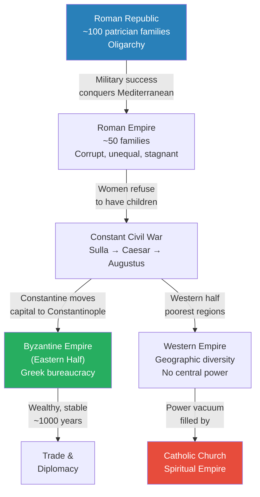
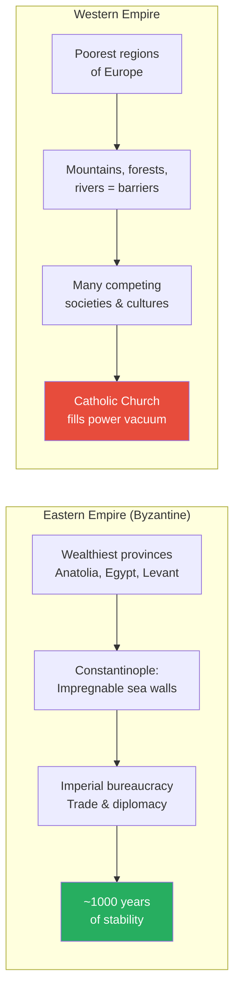
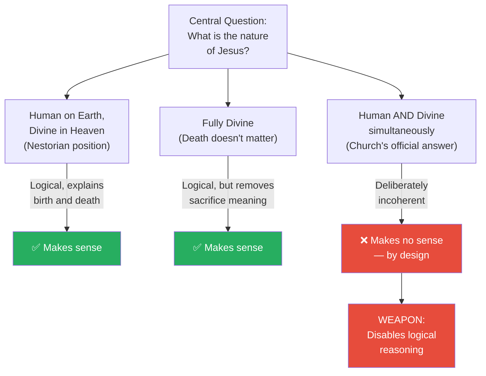
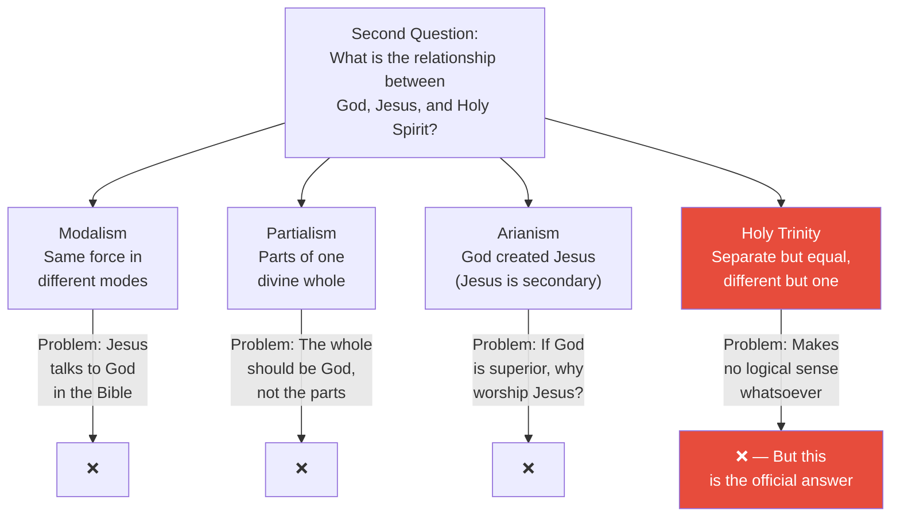
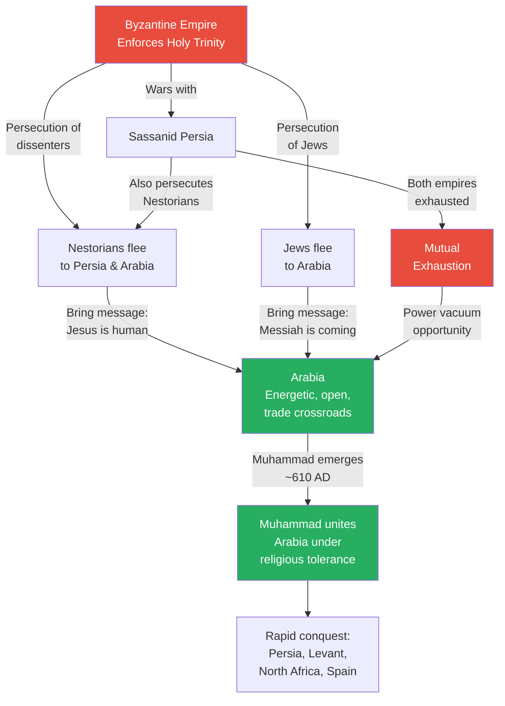
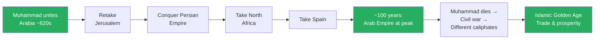
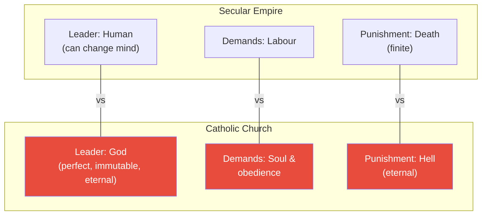
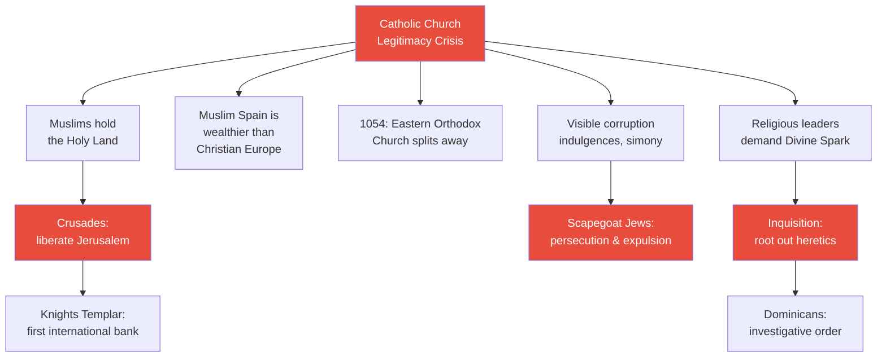
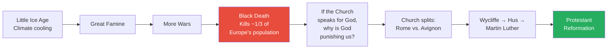

# Empire of Church

> Prof. Jiang traces how the Catholic Church became the most powerful organisation in human history — not through military conquest but through spiritual monopoly. He opens by reviewing Rome's transformation from oligarchic republic to divided empire, then follows Constantine's creation of the Byzantine Empire and the enforcement of the Holy Trinity as official doctrine. The lecture's central argument is that the Holy Trinity was deliberately designed to disable logical thinking — functioning like a mathematical formula you must memorise but cannot question. This enforced orthodoxy drove persecuted Christians and Jews into Arabia, where they found an energetic, open society primed for a charismatic messenger. Muhammad emerged promising religious tolerance, united the Arabian peninsula, and launched a conquest that swept through exhausted empires in a single century. Meanwhile, the Western Catholic Church grew into a divine bureaucracy that controlled heaven and hell, crowned emperors, launched Crusades, established the Inquisition, and extracted wealth through indulgences — until the Black Death and internal corruption created the conditions for Martin Luther's revolution.

---

## Overview: Key Highlights

- <b style="color: #27ae60">The Catholic Church became the most powerful organisation in human history</b> — it controlled not territory but souls, deciding who enters heaven and who burns in hell for eternity
- <b style="color: #2980b9">The Holy Trinity</b> — deliberately incoherent doctrine designed to disable logical reasoning, functioning like a math formula that must be memorised and never questioned
- <b style="color: #e74c3c">Enforced orthodoxy drove believers into exile</b> — Nestorian Christians and Jews fled Byzantine persecution into Persia and Arabia, seeding the conditions for Islam
- <b style="color: #2980b9">The Council of Nicaea</b> — where Constantine forced bishops to adopt the Holy Trinity as official Christian doctrine, producing the Nicene Creed still recited today
- <b style="color: #27ae60">Muhammad promised religious tolerance</b> — the Constitution of Medina guaranteed freedom of worship for Jews, Christians, and Arabs, uniting a fractured region
- <b style="color: #e74c3c">Both Byzantine and Sassanid empires were exhausted</b> — decades of mutual warfare drained their energy, allowing Arab conquest with minimal resistance
- <b style="color: #2980b9">The Black Nobility</b> — Roman patrician families who survived by embracing the Catholic Church and whose descendants persist to the present day
- <b style="color: #27ae60">Arabia was the most energetic society in the Middle East</b> — a trade crossroads connecting India, Egypt, and the Levant, with skilled mercenary fighters learning from both empires
- <b style="color: #e74c3c">The Church's legitimacy crisis</b> — Muslims held the Holy Land, Spain was wealthier under Islam, the Eastern Orthodox Church split in 1054, and corruption was visible to all
- <b style="color: #2980b9">Knights Templar</b> — the first multinational bank, born from Crusade logistics, later destroyed by the Church and surviving as the Freemasons
- <b style="color: #27ae60">The Islamic Golden Age</b> — Muslim trade networks built on religious trust created unprecedented prosperity across the known world
- <b style="color: #e74c3c">Indulgences and simony</b> — the Church sold forgiveness and ecclesiastical positions, enriching the Roman noble families who controlled it

| Concept | One-line summary |
|---------|-----------------|
| **Holy Trinity** | The doctrine that God, Jesus, and Holy Spirit are separate yet equal and one — deliberately illogical |
| **Christology** | The theological debate over whether Jesus is human, divine, or both |
| **Nestorians** | Christians who believed Jesus was human on earth and divine in heaven — persecuted and exiled to Arabia |
| **Council of Nicaea** | Constantine's 325 AD assembly that made the Holy Trinity official doctrine |
| **Nicene Creed** | The statement of faith produced at Nicaea — still recited by Christians today |
| **Constitution of Medina** | Muhammad's founding document promising religious tolerance for all believers |
| **Black Nobility** | Roman patrician families who survived the empire's fall by controlling the Catholic Church |
| **Indulgences** | Paid forgiveness — the Church selling tickets out of hell to wealthy sinners |
| **Simony** | The buying and selling of positions within the Catholic Church |
| **Excommunication** | The Church's ultimate weapon — removing a king from Christianity, making him fair game for rivals |
| **Knights Templar** | Crusade-era military order that became the world's first international bank |
| **Inquisition** | The Church's secret police, established to root out believers in the Divine Spark |

---

# The Lecture

## Review: From Roman Oligarchy to Divided Empire [0:00 - 6:47]

*Prof. Jiang opens with a comprehensive review of the series so far, connecting the Roman Republic's oligarchic structure to its eventual division into Eastern and Western halves — setting up the lecture's central question of how the Catholic Church filled the power vacuum in the West.*

*The Roman Republic's oligarchic structure, which served it well when small and poor, became fatal once the empire expanded — the 50 families refused to build a centralised bureaucracy, leading to civil war and eventual division.*

> [!note]- Expand: Full Lecture Detail
> Prof. Jiang tells the class there are five classes left in the semester and that the final four are the most important — this lecture sets up the background and context for everything that follows.
>
> He reviews the Roman Republic as an <b style="color: #2980b9">oligarchy</b> — rule by the few, roughly 100 patrician families. He draws a parallel with Sparta: a war society. At this stage in history, Rome's oligarchic structure was actually advantageous — the society was small, poor, and at war. The nobility were not much better off than common citizens, everyone knew each other, and the result was an energetic, open, and cohesive society.
>
> - Over time, Rome defeated Carthage and Greece and became the dominant Mediterranean power
> - But once Rome became an empire, the oligarchic structure became a liability — the society became corrupt, unequal, and stagnant
> - One telling indicator: <b style="color: #e74c3c">Roman women started refusing to have children</b> — the society was dying from within
> - The logical solution was an imperial bureaucracy — a centralised, standardised system to manage the empire
> - The oligarchy, now reduced to about 50 families, refused to give up power
> - Instead of centralised administration, different families controlled different territories
> - This produced constant civil war: Sulla, Julius Caesar, Augustus Caesar
> - Augustus became the first "primus inter pares" (first among equals) but still failed to establish a true bureaucracy
>
> Constantine eventually concluded the system was irreparable. His solution: reinvent the Roman people by moving the capital from Rome to Constantinople, creating what becomes the <b style="color: #2980b9">Byzantine Empire</b> — the "Second Rome." Its official language became Greek, and it developed a genuine bureaucracy.
>
> Meanwhile, massive steppe migrations were pouring into Europe. The Han Dynasty's wars against the Xiongnu in China had forced nomadic peoples westward — Huns, Germanics, Slavs. Rome's response was divide and rule: absorb migrants as mercenaries and soldiers to defend borders and fight civil wars.
>
> The Catholic Church enters the picture here. Certain noble families supported the Church, which gave them a mechanism to absorb migrants into a hierarchical society — Roman nobility at the top, migrants at the bottom. The migrants accepted because the system allowed their war leaders to join the nobility, transforming elected military commanders into hereditary aristocrats.

---

## East vs. West: Two Divergent Fates [6:47 - 8:58]

*Prof. Jiang draws a sharp contrast between the wealthy, stable Byzantine East and the poor, fragmented West — explaining how geography determined that the Catholic Church, not any single king, would become the dominant power in Western Europe.*

*Geography is destiny — the East's wealth and defensible capital enabled a centralised bureaucracy like China, while the West's natural barriers created the fragmentation that allowed the Church to become the unifying power.*

> [!note]- Expand: Full Lecture Detail
> Prof. Jiang explains the divergent fates of the two halves of the empire:
>
> **The Eastern Empire (Byzantine):**
> - Still part of the Middle East — controlling Anatolia, Egypt, and the Levant
> - The wealthiest part of the empire, which funded wars against the Persian Empire
> - Constantinople was designed to be invincible — surrounded by sea, with high walls making siege impossible
> - <b style="color: #27ae60">Lasted approximately 1000 years</b> — an extraordinary achievement of stability
> - Dominated through trade and diplomacy rather than brute force
> - Used mercenaries because it could afford them
> - Prof. Jiang draws a direct parallel: "This is very similar to China"
>
> **The Western Empire:**
> - The poorest part of Europe
> - Full of natural barriers — mountains, forests, rivers — protecting competing societies
> - This geographic fragmentation produced tremendous diversity but also constant conflict
> - No single military power could unify the region
> - The power that emerged to fill this vacuum was the Catholic Church
>
> Prof. Jiang makes the key claim: the Catholic Church believes it is "out of history." Kings compete for earthly rule. But the Church decides who goes to heaven. This positioning — above temporal politics, speaking for God — made the Church a spiritual empire more powerful than any military one.

---

## The Holy Trinity: A Weapon Against Reason [10:00 - 25:00]

*Prof. Jiang delivers the lecture's most provocative argument: the Holy Trinity was not a genuine attempt to resolve theological confusion but a deliberate tool to disable logical thinking. He walks through the Christology debate, presents three alternative explanations that actually make sense, then shows how the Council of Nicaea chose the one explanation that makes no sense — precisely because incoherence prevents independent thought.*

> [!tip] Core Insight
> The Holy Trinity was designed to make you stupid. By forcing you to accept that God, Jesus, and Holy Spirit are simultaneously separate and identical, the Church creates a logical void in your brain — a missing building block that prevents you from constructing independent thought on top of it. Like a math formula that cannot be questioned, only memorised, it trains obedience, not understanding.

*Of the three possible answers to the Christology question, the Church deliberately chose the only one that is logically incoherent — because incoherence, not theology, was the point.*

*Prof. Jiang walks through four explanations for the Trinity — three that have specific logical problems but are internally coherent, and the official answer that abandons coherence entirely.*

> [!note]- Expand: Full Lecture Detail
> Prof. Jiang introduces two major theological debates that consumed early Christianity:
>
> **Debate 1: Christology — What is Jesus?**
> - The story: Jesus is in heaven, comes to earth, Mary gives birth to him, he preaches, is killed, resurrected, and returns to heaven
> - <b style="color: #2980b9">Problem 1:</b> If Jesus is divine, how did a human woman give birth to him? If Mary birthed a God, doesn't that make Mary divine?
> - <b style="color: #2980b9">Problem 2:</b> Is Jesus human or divine? If human, his death is a sacrifice. If divine, he cannot die — making the resurrection meaningless
> - **Interpretation 1 (Nestorian):** Jesus is divine in heaven but human on earth. Mary gave birth to the human Jesus, not the divine Jesus. His death makes sense because the human Jesus died, then was resurrected and returned to heaven
> - **Interpretation 2:** Jesus is fully divine. Birth and death are irrelevant. He is simply God
> - **Official Church position:** Jesus is human AND divine simultaneously — which, as Prof. Jiang tells the class bluntly, "makes no sense, guys"
> - Those who rejected this position — the <b style="color: #2980b9">Nestorians</b> — were persecuted and fled to Persia, Arabia, and the Middle East, where they taught Jesus as a human messenger, not a God
>
> **Debate 2: The Trinity — What is the relationship between God, Jesus, and the Holy Spirit?**
> - <b style="color: #2980b9">Modalism:</b> They are different modes of the same force — God in heaven, Jesus on earth, Holy Spirit when communicating. Problem: Jesus talks to God in the Bible — why would he talk to himself?
> - <b style="color: #2980b9">Partialism:</b> They are parts of one divine whole, like regions of an ocean. Problem: the whole should be God, making the parts subordinate
> - <b style="color: #2980b9">Arianism:</b> God came first and created Jesus — Jesus is divine but secondary. Problem: Christianity worships Jesus, so why worship the subordinate?
> - <b style="color: #2980b9">Holy Trinity</b> (official answer): They are separate but equal, different but one, distinct but identical. Prof. Jiang: "It makes actually no sense whatsoever"
>
> Constantine convened the <b style="color: #2980b9">Council of Nicaea</b> to resolve this. The resulting <b style="color: #2980b9">Nicene Creed</b> — still recited by Christians today — established the Holy Trinity as official doctrine.
>
> **Prof. Jiang's core argument — why they chose the incoherent option:**
> - The purpose was not theology but control: <b style="color: #e74c3c">"to make you stupid"</b>
> - He uses a thought experiment: "The sky is blue. From this, you can reason further — why is it blue? Is it always blue? But if I force you to say the sky is red, and threaten to burn you at the stake if you disagree, then blue is red and red is blue — your entire logical system collapses"
> - He uses a building metaphor: logical thought is like stacking blocks. The Holy Trinity removes a foundational block, creating a void. "Your brain ceases to be able to process and be creative"
> - He compares it to mathematics: "The entire point of math class is to make you stupid. You cannot reason using mathematics... you just memorise the formulas and apply them." The best mathematicians peak in their 20s-30s because the memorisation eventually burns out the brain
>
> > [!example] The Building Block Thought Experiment
> > - Imagine your brain processes information by stacking logical blocks — each conclusion supports the next
> > - Normal reasoning: you build upward from solid foundations, each layer connecting to the one below
> > - The Holy Trinity inserts an empty layer — a foundational claim that is neither true nor false but simply incoherent
> > - You cannot build on top of emptiness — your brain ceases to connect ideas independently
> > - This is not a bug but a feature: a population that cannot reason independently is a population that obeys
> > **The lesson:** The Holy Trinity is not a theological proposition — it is an intellectual cage.

---

## The Spark That Lit Arabia [25:00 - 32:40]

*Prof. Jiang shows how Byzantine enforcement of the Holy Trinity created a cascade of persecution that drove Christians and Jews into Arabia — an energetic, open trading society already primed for a charismatic leader promising liberation. Muhammad emerged not as the founder of a new religion but as a messenger promising tolerance.*

> [!tip] Core Insight
> Muhammad did not preach Islam. He preached that he was the Messiah — a messenger of God like Jesus and Moses before him — and he promised religious tolerance. Jews, Christians, and Arabs could believe whatever they wanted. Islam as an organised religion emerged only after his death, following the same pattern as every other religious movement: prophet → message → empire → organised religion.

*Byzantine orthodoxy created the very conditions for its own displacement — by persecuting Nestorians and Jews, it channelled religious energy into Arabia, where Muhammad harnessed it into a movement that overwhelmed both exhausted empires.*

> [!note]- Expand: Full Lecture Detail
> Prof. Jiang traces a chain of consequences from Byzantine orthodoxy to Arabian revolution:
>
> **The cascade of persecution:**
> - The Byzantine Empire fights wars to enforce the Holy Trinity across all churches
> - By 500 AD — roughly 180 years after the Council of Nicaea — most of Europe still does not believe in the Holy Trinity. "Arian" meant you rejected it; "Catholic" meant you accepted it
> - The Byzantine Empire under Justinian expands aggressively, reaching peak power by 565 AD
> - Christians who reject the Trinity — Nestorians — are driven into Persia and Arabia
> - Initially, the Sassanid Persians welcome them as educated refugees who contribute to the empire
> - Over time, Zoroastrians see Christians as a threat, and persecution begins there too
> - Jews face the same pattern: kicked out of Jerusalem by Romans, they flee into Arabia because "Romans hate fighting sand"
>
> **Why Arabia was primed:**
> - <b style="color: #27ae60">Arabia was the most energetic, open, and cohesive society in the Middle East</b>
> - It served as a trade crossroads connecting India, Egypt, and the Levant — goods sailed to Muscat, then caravans carried them to Mecca and onward to Egypt
> - Arabs were skilled fighters because both empires recruited them as mercenaries — they learned cutting-edge warfare from both sides
> - They were poor, making them motivated fighters
> - They were now exposed to Christianity (Nestorian version) and Judaism — both preaching the coming of the Messiah
>
> **The Jewish catalyst:**
> - Jews made a deal with Persia: "Support us, and we'll fight the Romans with you"
> - They briefly retook Jerusalem and began rebuilding the Third Temple
> - Byzantines counterattacked, massacred Jews, expelled them within a three-mile radius
> - Surviving Jews fled to Arabia, preaching that the Messiah was imminent — "when all hope is lost, the Messiah will come"
>
> **Muhammad's emergence:**
> - <b style="color: #27ae60">The Constitution of Medina</b> was his founding promise: religious tolerance for all
> - He did not preach Islam as we know it — he preached that he was the final messenger of God, after Moses and Jesus
> - His message: "You have the right to believe in whatever religion you want, because the Divine Spark is in you"
> - He united Nestorians, Jews, and Arabs behind this promise
> - After his death, factions fought a civil war, and from that civil war emerged Islam as an organised religion
>
> > [!example] The Prophet Pattern
> > - Zarathustra was a poor prophet preaching a message of truth
> > - Jesus was a poor prophet preaching liberation from tyranny
> > - Muhammad was a poor prophet preaching religious tolerance
> > - In every case, the prophet's words were later turned into an empire by followers
> > - Paul turned Jesus into organised Christianity. Later caliphs turned Muhammad into organised Islam
> > **The lesson:** Every messenger of God follows the same trajectory — the message is liberation, but the institution that follows is always empire.

---

## The Quran on Jesus, God, and the Trinity [44:55 - 54:41]

*Prof. Jiang reads passages from the Quran directly with the class, demonstrating that Muhammad's message was explicitly Nestorian — Jesus is a human messenger, not God; the Holy Trinity is blasphemy; and all children of Abraham should unite rather than fight.*

> [!note]- Expand: Full Lecture Detail
> Prof. Jiang reads and interprets several Quran passages with the students:
>
> **On Abraham and religious unity:**
> - "O people of the book, why do you argue about Abraham?" — Abraham came before the Torah and the Gospel
> - Abraham was "neither a Jew nor a Christian, but a monotheist"
> - The revelation to Muhammad through the angel Gabriel: you are all children of God, all descendants of Abraham — why are you fighting?
> - <b style="color: #27ae60">Differences don't matter — what matters is belief in the one true God</b>
>
> **On Jesus:**
> - "They disbelieve, those who say Allah is the Messiah, the Son of Mary"
> - The Quran states that Jesus himself said "worship Allah, my Lord and your Lord"
> - This is explicitly the <b style="color: #2980b9">Nestorian position</b>: Jesus is a human messenger, not God. In heaven he is divine, on earth he is human
>
> **On the Holy Trinity:**
> - "They disbelieve, those who say Allah is a third of three"
> - Prof. Jiang interprets: "The Holy Trinity is sacrilege. It's blasphemy. God is God. God isn't one of three"
>
> **On Mary and divinity:**
> - "The Messiah, Son of Mary, was only a messenger before whom other messengers had passed"
> - "His mother was a woman of truth. They both used to eat food" — emphasising their humanity
> - Moses, Jesus, Muhammad are all messengers of God — Jesus was the penultimate, Muhammad the final
>
> **On the Monad:**
> - "With him are the keys of the unseen... He is the conqueror over his servant"
> - Prof. Jiang connects this directly to the Monad: "The Monad is the universe. The Monad is everything. It's divine. Stop saying Jesus is God. That makes no sense."

---

## The Arab Conquest and the Islamic Golden Age [54:41 - 57:38]

*Prof. Jiang traces how the energised Arabian forces swept through exhausted empires in roughly a century, then established the Islamic Golden Age — a period of unprecedented prosperity built on trust networks enabled by shared religious identity.*

*In roughly one century, the Arabs conquered more territory than Rome managed in five — not primarily through military superiority but because the populations they conquered were desperate for liberation from orthodoxy.*

> [!note]- Expand: Full Lecture Detail
> Prof. Jiang describes the conquest:
>
> - Once Muhammad united the Arabs, expansion was rapid — Jerusalem, Persia, North Africa, Spain all fell within about 100 years
> - <b style="color: #27ae60">People were simply sick of empires and looking for religious liberation</b>
> - The main advantage the Byzantines retained was Constantinople, which was impossible to conquer — "everything else falls to the Arabs"
> - After Muhammad's death, Muslims fought amongst themselves and established different caliphates
> - This internal division gave the Byzantines time to re-establish themselves and Western Europe time to grow
>
> **The Islamic Golden Age:**
> - Muslims established trade networks across the known world — including into China
> - The key mechanism was <b style="color: #2980b9">religious trust</b>: "When you do trade, the biggest problem is trust. But if you're a Muslim, you must swear to Allah. Religion requires you to be trustworthy"
> - Muslims could trust fellow Muslims across vast distances — enabling trade routes that brought prosperity to most of the world
> - Prof. Jiang: "Islam is a beautiful, simple religion that builds trust and community"
> - Islam considered itself the ultimate religion — improving on both Judaism and Christianity, just as Christianity had claimed to improve on Judaism

---

## The Catholic Church as Divine Bureaucracy [57:38 - 1:07:00]

*Prof. Jiang turns to the Western Empire and explains how the Catholic Church became more powerful than any secular empire by controlling something no emperor could — the afterlife. He walks through the Church's structural advantages over temporal rulers and its mechanisms of wealth extraction.*

> [!tip] Core Insight
> An empire threatens death. The Church threatens eternity. An empire demands labour. The Church demands your soul. An empire's leader is human and fallible. The Church's leader is God — perfect, immutable, and eternal. This is why the Catholic Church became the most powerful organisation in human history.

*On every dimension of power, the Church held structural advantages over secular empires — its authority was higher, its demands deeper, and its punishments infinite.*

> [!note]- Expand: Full Lecture Detail
> **The fall of the Western Empire:**
> - In 476 AD, Germanic mercenaries ("gulfs") sacked Rome — not because they were powerful but because Rome had no real power left
> - The empire could not pay its mercenaries, so they took Rome by force
> - But Rome no longer mattered — power had already shifted to the Catholic Church
>
> **Augustine's framework:**
> - <b style="color: #2980b9">The City of God</b>: Augustine, the main architect of Catholic theology, taught that the Church exists beyond history — it is divine and eternal
> - Kings fight over land; the Church decides who goes to heaven and who burns in hell
> - This positioning made the Church untouchable by secular power
>
> **Geographic advantage:**
> - Europe's mountains, forests, and rivers created natural barriers that prevented unification
> - This diversity created conflict, which drove innovation — but it also meant no single king could dominate
> - The Catholic Church was the only institution that spanned all of Western Europe
>
> **The warlord succession:**
> - After Rome fell, various groups fought over its remains
> - Each warlord believed "I'm the empire now" — they competed for Rome's legacy
> - Legitimacy required the Church's endorsement — leading to Charlemagne's coronation as Holy Roman Emperor by the Pope in 800 AD
> - From this point forward: <b style="color: #e74c3c">the Pope decides who is Holy Roman Emperor</b>
>
> **The Church's mechanisms of control:**
> - Services conducted in Latin — a language the congregation did not understand
> - The Bible could not be read by laypeople (most were illiterate anyway)
> - The Holy Trinity could not be questioned — only memorised
> - <b style="color: #2980b9">Transubstantiation</b> — the belief that the Eucharist literally becomes the body and blood of Jesus
> - The power to determine who goes to heaven, hell, or purgatory — and for how long
> - <b style="color: #e74c3c">Excommunication</b> — removing a king from the Christian community, making him a legitimate target for any rival
>
> **Corruption:**
> - The Church was controlled by descendants of the Roman nobility — the <b style="color: #2980b9">Black Nobility</b>
> - <b style="color: #e74c3c">Indulgences</b>: a rich person who feared hell could pay the Church for a "ticket to purgatory"
> - <b style="color: #e74c3c">Simony</b>: buying and selling positions in the Church — similar to imperial China's sale of bureaucratic posts
> - Priests married, sold their positions to nobles, and kings appointed Church leaders
> - Parishioners paid a tax to the Church, not the king — the Church controlled one-third of all land, tax-free
> - Kings eventually rebelled because the Church was draining their revenue — laying the groundwork for feudalism
>
> > [!example] The Wealth of the Vatican
> > - Jesus himself said: "It is easier for a camel to go through the eye of a needle than for a rich man to enter the kingdom of God"
> > - Yet the Catholic Church became the wealthiest organisation in human history
> > - St. Peter's Basilica in the Vatican is covered in gold
> > - Between 1000-1300 AD, Europe's population doubled due to technological innovation, warming climate, rising cities, and trade
> > - All of this wealth flowed upward to the Church
> > **The lesson:** The institution founded on Jesus's anti-wealth message became history's greatest accumulator of wealth — the ultimate irony of organised religion.

---

## The Church's Legitimacy Crisis and the Crusades [1:07:00 - 1:17:20]

*Prof. Jiang explains how the Catholic Church faced a mounting legitimacy crisis — Muslims held the Holy Land, Spain was wealthier under Islam, the Eastern Orthodox Church split away, and internal corruption was visible — then traces the Church's desperate solutions: Jewish persecution, the Crusades, and the Inquisition.*

*The Church's legitimacy crisis had five sources, and its solutions — Crusades, Jewish persecution, and the Inquisition — each created new problems that deepened rather than resolved the crisis.*

> [!note]- Expand: Full Lecture Detail
> **The legitimacy crisis:**
> - If the Church truly represented God, why did Muslims control the Holy Land?
> - Muslim Spain (Al-Andalus) was wealthier and more innovative than Christian Europe — an embarrassment
> - The <b style="color: #2980b9">Great Schism of 1054</b>: the Eastern Orthodox Church broke with Rome because both claimed to be the centre of Christianity
> - Corruption was visible to everyone — indulgences, simony, priests marrying and selling positions
> - Religious leaders kept emerging to challenge the Church, demanding the right to the <b style="color: #27ae60">Divine Spark</b> — personal access to God without Church mediation
>
> **Solution 1: Jewish persecution**
> - The Church allowed Jews to exist specifically so they could be scapegoated
> - Jews were expelled from homes they had occupied for hundreds of years
> - Forced eastward into the Muslim empire and Spain — then expelled from those regions too
> - Massacres marked by "skull spots" across the map of Europe
>
> **Solution 2: The Crusades**
> - Pope Urban II called for a crusade to liberate the Holy Land from the "Seljuk Turks" (Ottoman Empire)
> - His pitch: "All who die in battle against the pagans shall have immediate remission of sins"
> - <b style="color: #e74c3c">The Crusades attracted many criminals</b> — here was an opportunity to "get good with the Church" regardless of past sins
> - The Crusaders were energised by religious devotion — but "too energetic," leading to massacres because they literally saw Muslims and Jews as demons
>
> > [!example] The Knights Templar — First Multinational Bank
> > - Pilgrims travelling to the Holy Land needed money for the journey but carrying cash made them targets for robbery
> > - The Knights Templar offered a solution: deposit money with them in Europe, collect it in Jerusalem
> > - This made them history's first international banking operation
> > - With pooled capital, they began investing across Europe and grew enormously wealthy
> > - In Jerusalem, away from Church authority, they encountered Nestorian Christianity and Muslim ideas
> > - The Church concluded they were becoming "corrupt" — embracing the true nature of Jesus
> > - Their leader, Jacques de Molay, was burned at the stake in 1307
> > - Survivors went underground and formed the basis of a secret society: the Freemasons
> > **The lesson:** The institution the Church created to defend its legitimacy became a vehicle for the very ideas the Church was trying to suppress.
>
> **Solution 3: The Inquisition**
> - Believers in the Divine Spark — the <b style="color: #2980b9">Cathars</b> — were targeted by the Albigensian Crusade
> - The Church's position: "If you disagree with us, you're not evil — you're stupid. We'll educate you first"
> - If education failed and you refused to recant, you were a heretic and would burn at the stake "before you can pollute other people"
> - The <b style="color: #2980b9">Dominicans</b>, founded by Francis of Assisi, became the investigative arm — interrogating populations to identify Cathars
> - 140 Cathars who refused to recant were burned at the stake — "some entered the flames voluntarily, not awaiting their executioners"
> - The Cathar Crusade was also geopolitical: local lords resented Church power and supported the Cathars, complicating the picture
>
> Prof. Jiang concludes: because of the Inquisition and the Catholic Church, <b style="color: #e74c3c">Western Europe became one of the least innovative places in the world</b> during this period.

---

## The Black Death and the Seeds of Reformation [1:17:20 - 1:20:53]

*Prof. Jiang traces how a cascade of catastrophes — the Little Ice Age, the Great Famine, more wars, and the Black Death — shattered the Catholic Church's claim to divine authority and created the conditions for Martin Luther's Protestant Reformation.*

*The Black Death did not just kill a third of Europe — it killed the Church's credibility. If God was punishing Europe, the Church that claimed to speak for God was the obvious culprit.*

> [!note]- Expand: Full Lecture Detail
> Prof. Jiang traces the chain of catastrophes:
>
> - The <b style="color: #2980b9">Little Ice Age</b> begins — climate cooling reduces agricultural output
> - The <b style="color: #e74c3c">Great Famine</b> follows
> - More wars across Europe
> - Then the <b style="color: #e74c3c">Black Death</b> — killing approximately one-third of Europe's population
> - Because people were deeply religious, they interpreted the plague as God's will
> - The logical conclusion: God was punishing them because the Catholic Church was "corrupt, evil, and stagnant"
>
> **The Church's internal fracture:**
> - The Church itself split — some believed Rome was the true centre, others believed it was Avignon
> - This created further legitimacy problems — two competing popes
>
> **The proto-reformers:**
> - <b style="color: #2980b9">John Wycliffe</b> — a British theologian who challenged Church orthodoxy. He was not punished while alive, but after death, the Church exhumed his body and burned it at the stake "to make sure he burned in hell"
> - <b style="color: #2980b9">Jan Hus</b> — led a revolution (the Hussite Wars) that did not succeed
> - <b style="color: #2980b9">Martin Luther</b> — eventually led a successful revolution against the Church, creating Protestantism
>
> Prof. Jiang promises the next class will cover Martin Luther and the rise of capitalism.

---

## The Placebo Effect and the Power of Faith [1:21:22 - end]

*A student asks whether Catholic miracles — such as cancer disappearing after prayer — are real. Prof. Jiang uses the question to deliver a closing argument about the relationship between mind, body, and faith.*

> [!note]- Expand: Full Lecture Detail
> A student tells Prof. Jiang about her mother's friend whose husband's cancer disappeared after praying to the Catholic Church. She asks: "Can it explain the miracle?"
>
> Prof. Jiang introduces the <b style="color: #2980b9">placebo effect</b>:
> - A doctor gives a patient medicine that does nothing — the patient gets better anyway
> - This works because "mind leads to matter" — your reality is shaped by your perception and belief
> - If you believe the medicine can improve your body, it will have effects
>
> He then offers a provocative interpretation of cancer:
> - "Cancer is really a question of loss of faith"
> - Cancer is cells splitting apart — "why is your body literally falling apart?"
> - <b style="color: #27ae60">Because you've stopped believing in yourself, stopped believing in the purpose of life, stopped believing that you have relevance in the world</b>
> - Wanting to cure cancer is really wanting to find new faith — to believe in yourself again, to re-establish relevance
> - If you yourself want to get better and seek help, you will likely improve. If your parents force you to see a psychiatrist, you probably will not
> - The key: "If you're able to orientate your mind in a certain way, you're capable of tremendous miracles"
> - Meditation works on the same principle — controlling your thoughts allows your body to heal faster

---

## Connections

**Builds on:** [[23 - The Organization of Evil]] (Paul's systemisation of Christianity), [[22 - The Divine Spark of Jesus]] (Jesus's original message vs. institutional corruption), [[18 - Thus Spoke Zarathustra]] (Zoroastrianism as precursor religion), [[14 - Legacy of the Steppes]] (steppe migrations into Europe)
**Sets up:** [[25 - Capital of Evil]] (rise of capitalism), Martin Luther and the Protestant Reformation
**Related books in vault:** [[Sapiens - Yuval Noah Harari]] (agricultural revolution, imagined orders), [[The 48 Laws of Power - Robert Greene]] (institutional power dynamics)

---

## The Takeaway

This lecture reveals the Catholic Church as the most sophisticated power structure in human history — one that eclipsed military empires by controlling the one thing no army can conquer: the afterlife. Prof. Jiang's central insight is that the Holy Trinity was not an attempt to resolve genuine theological confusion but a deliberate instrument of intellectual suppression. By forcing believers to accept a logically impossible proposition, the Church created a population incapable of independent reasoning — the same principle, he argues provocatively, that operates in mathematics education today.

The most striking thread in the lecture is the chain of unintended consequences. Byzantine enforcement of the Holy Trinity drove Nestorian Christians and Jews into Arabia, where they found an energetic society ready for a charismatic leader. Muhammad's emergence was not a random event but the predictable outcome of imperial overreach — exhausted empires, persecuted populations, and a trade crossroads where all the ingredients for revolution had been gathering for centuries. The pattern — orthodoxy creates heresy, heresy creates exile, exile creates revolution — repeats across every case Prof. Jiang has presented in the series.

The question left open is how the Catholic Church's spiritual empire eventually shatters. Prof. Jiang has laid the groundwork: the Black Death destroyed the Church's credibility, proto-reformers like Wycliffe and Hus proved that resistance was possible, and the Church's own corruption — indulgences, simony, tax-free landholding — turned secular kings against it. The next lecture on capitalism will address what replaces the Church as the organising principle of Western society, and whether the replacement is any less coercive than what it displaced.
