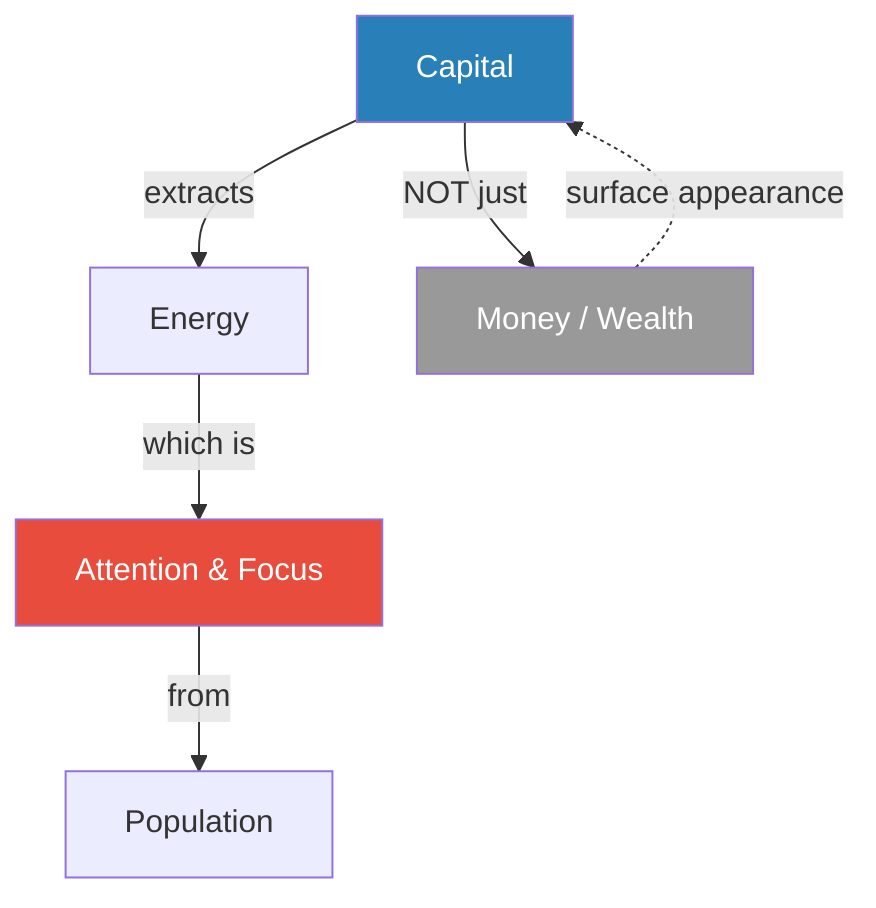
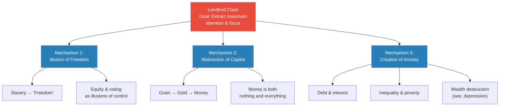
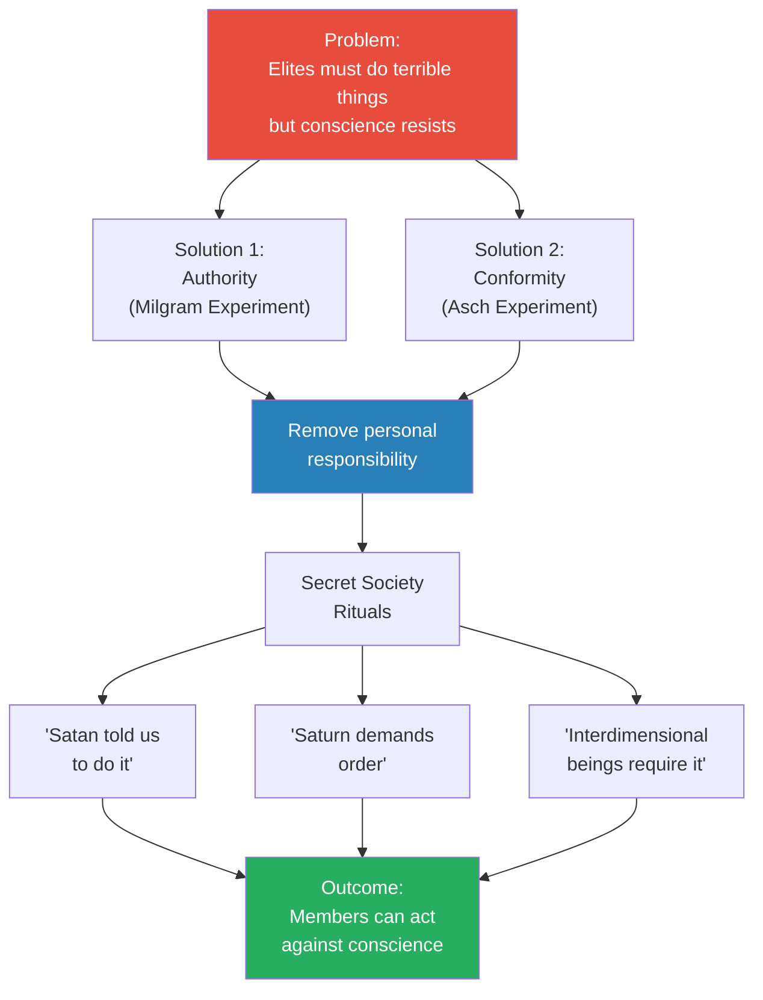
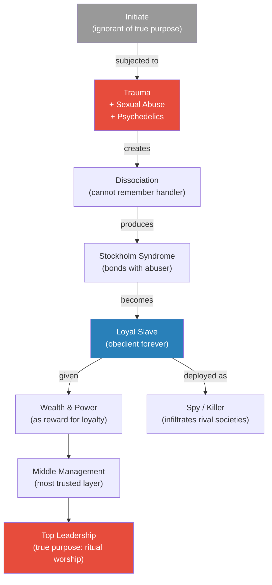
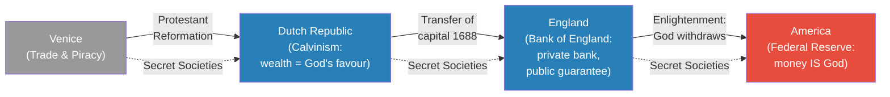
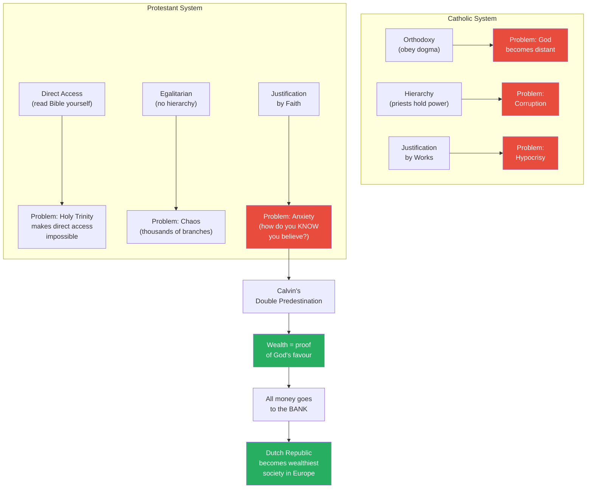
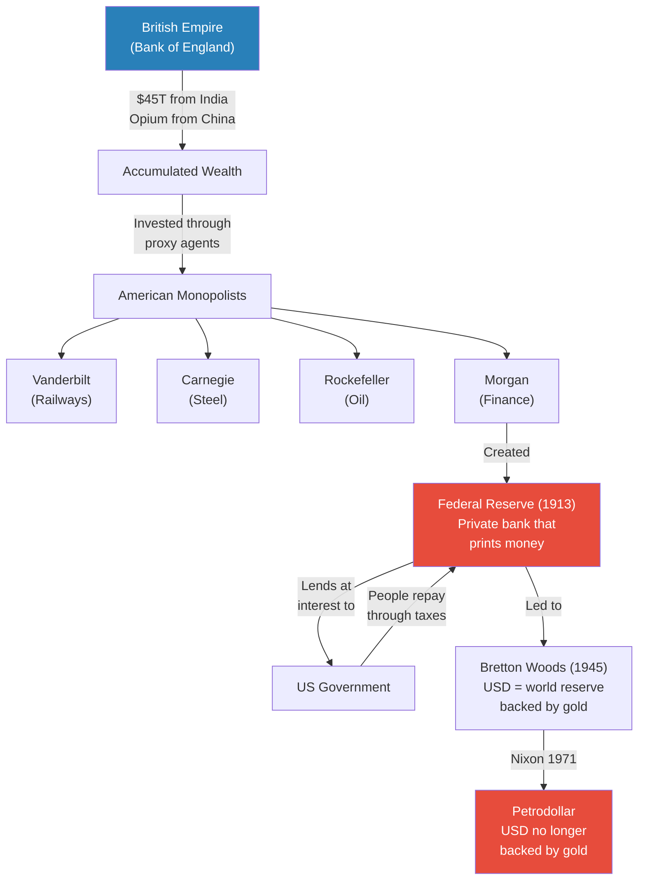

# Capital of Evil

> Prof. Jiang redefines capital not as money or wealth but as a mechanism to extract energy — attention and focus — from the population. He traces how the landlord class developed three innovations to maximise this extraction: the illusion of freedom, the abstraction of money into a quasi-religious absolute, and the systematic creation of anxiety through debt, inequality, and wealth destruction. The lecture then maps the historical migration of transnational capital through four merchant oligarchies — Venice, the Dutch Republic, England, and America — showing how the Protestant Reformation and the Enlightenment each made capital more abstract and therefore more powerful. Secret societies, from the Jesuits to the Freemasons, serve as the organisational glue binding these transnational elites across borders and centuries.

---

## Overview: Key Highlights

- <b style="color: #27ae60">Capital is not wealth — it is a mechanism to extract energy</b> — what the landlord class truly extracts is attention and focus, not just grain or gold
- <b style="color: #2980b9">Transnational capital</b> — the system by which elites move wealth across borders, abandoning nations when anxiety boils over, returning when populations exhaust themselves
- <b style="color: #e74c3c">The boom-bust cycle is artificial, not natural</b> — wealth destruction through wars and depressions is deliberately engineered to keep populations anxious and productive
- <b style="color: #2980b9">Three extraction mechanisms</b> — illusion of freedom, abstraction of money, and creation of anxiety through debt
- <b style="color: #27ae60">Secret societies exist to overcome psychological inhibition</b> — authority and conformity allow elites to do what individual conscience would forbid
- <b style="color: #e74c3c">Trauma-bonding as organisational technology</b> — from Sparta to modern gangs, brutalising initiates and then showing kindness creates lifelong obedience
- <b style="color: #2980b9">Four merchant oligarchies</b> — Venice, Dutch Republic, England, America — each more powerful because capital becomes more abstract
- <b style="color: #27ae60">The Protestant Reformation made capitalism religious</b> — Calvin's double predestination turned wealth into proof of divine favour
- <b style="color: #e74c3c">The Bank of England transferred risk to the public</b> — a private bank guaranteed by Parliament meant the people always repay, even if monarchs fall
- <b style="color: #2980b9">The Federal Reserve</b> — America's private central bank that prints money and lends to government at interest, ensuring permanent public debt
- <b style="color: #27ae60">The Enlightenment replaced God with money</b> — once God withdrew from daily affairs, money filled the spiritual vacuum and became the new religion
- <b style="color: #e74c3c">Britain extracted an estimated $45 trillion from India</b> — the East India Company destroyed Indian manufacturing and forced dependence on British goods

| Concept | One-line summary |
|---------|-----------------|
| **Capital as energy extraction** | Capital is not wealth but a mechanism to capture human attention, focus, and productive energy |
| **Transnational capital** | Wealth that owes loyalty to no nation — it moves to wherever taxes are lowest and conflict is absent |
| **Abstraction of capital** | The progression from grain to gold to money — each step makes capital harder to resist and easier to accumulate |
| **Debt as anxiety engine** | Lending at interest creates permanent obligation, ensuring the borrower never stops working |
| **Wealth destruction** | Wars and economic crashes are deliberate mechanisms to prevent populations from becoming complacent |
| **Milgram experiment** | Authority removes personal responsibility, enabling people to inflict harm they would never choose independently |
| **Asch conformity experiment** | Group consensus overrides individual perception — people will deny what they see to match the group |
| **Stockholm Syndrome** | Victims bond with their captors when their reality is destroyed and the captor becomes their only stability |
| **Double predestination** | Calvin's doctrine that God predetermined who goes to heaven — wealth signals divine favour |
| **Merchant oligarchy** | A state nominally democratic but actually controlled by private commercial interests |
| **Bank of England model** | A private bank guaranteed by Parliament — privatised profits, socialised losses |
| **Revelation of method** | Occult symbolism embedded openly in currency, architecture, and national seals |

---

# The Lecture

## What Is Capital Really? [0:00 - 0:44]

*Prof. Jiang opens by dismantling the economics-textbook definition of capital. He argues that in a universe where consciousness is fundamental, capital is not money or wealth but a mechanism to extract energy — and energy, ultimately, is attention and focus.*

> [!tip] Core Insight
> Capital does not extract grain or gold from you. It extracts your attention and focus. The landlord class across history has optimised not for how much you produce, but for how completely you concentrate on producing.

*Capital's true target is not material output but cognitive dedication — the landlord class has spent centuries perfecting techniques to capture not just labour but the mind itself.*

> [!note]- Expand: Full Lecture Detail
> - Prof. Jiang tells the class they may have learned in economics that capital means money or wealth
> - He rejects this: capital is really a mechanism to extract energy from people
> - In a universe where consciousness is fundamental, energy is ultimately attention and focus
>   - It is not enough for someone to work — they must concentrate on the work
>   - Only when attention is fully captured does capital extract maximum energy
> - He sets up the basic example: a landlord class trying to extract energy from a peasant class
>   - Traditionally, we might think of this as extracting grain
>   - But grain extraction is limited — growing grain is not that hard, grain can be stored, and peasants only need so much
> - <b style="color: #27ae60">The landlord's real priority is not rent — it is getting the peasant to focus entirely on the task at hand</b>
> - Over centuries, landlords have discovered specific mechanisms to maximise this extraction of focus

---

## Three Mechanisms of Energy Extraction [0:44 - 6:00]

*Prof. Jiang lays out the three innovations that transformed capital from a crude extraction tool into a comprehensive system of psychological control: the illusion of freedom, the abstraction of money, and the manufacture of anxiety.*

*Each mechanism attacks a different dimension of human psychology — freedom targets the will, abstraction targets desire, and anxiety targets survival instinct. Together they create a population that works ceaselessly without understanding why.*

> [!note]- Expand: Full Lecture Detail
> - **Mechanism 1 — Illusion of Freedom:**
>   - Prof. Jiang argues that the transition from slavery to "freedom" was not humanitarian progress but an optimisation of extraction
>   - <b style="color: #27ae60">If you want to extract maximum energy, give peasants the illusion that they control their lives</b>
>   - Equity is a modern form: give workers shares in a company and they work far harder believing they will profit
>   - Democratic voting is the same illusion — the appearance of choice without actual power
>
> - **Mechanism 2 — Abstraction of Capital:**
>   - Capital has progressed through three stages, each more abstract and therefore more powerful:
>     - **Grain:** limited — you only need so much, so peasants stop working once fed
>     - **Gold:** better — people are greedier for gold, but gold is finite and hard to find, so only a minority will dedicate their entire lives to it
>     - **Money:** the great innovation — both nothing and everything simultaneously
>   - <b style="color: #e74c3c">Because money is purely abstract, you can spend your entire life pursuing it and never feel you have enough</b>
>   - Prof. Jiang cites Jack Ma as an example: a man with more money than he could ever spend, yet still wanting more
>   - The innovation of the past century has been to convince people that money is God — the end-all and be-all of existence
>
> - **Mechanism 3 — Creation of Anxiety:**
>   - Anxiety is the most powerful extraction tool because it makes people focus involuntarily
>   - Three sub-mechanisms create it:
>     - **Debt:** Lend someone a million dollars today — they enjoy it, but must spend the rest of their life paying it back, and interest ensures they never fully can
>     - **Inequality and poverty:** A visible underclass incentivises the middle class to work harder out of fear of falling
>     - **Wealth destruction:** War and economic depression — if peasants accumulate too much grain, the landlord burns the granary
>   - <b style="color: #e74c3c">The boom-bust cycle taught in economics as "natural to capitalism" is artificial — elites deliberately destroy economies to prevent complacency</b>
>
> > [!example] The Burned Granary
> > - Prof. Jiang uses a vivid analogy: imagine peasants who work hard and fill an enormous granary
> > - Once the granary is full, the peasants no longer need to work — they can rest
> > - The landlord's response is simple: burn down the granary
> > - Now the peasants must start over, working harder than before
> > - War serves exactly this function at civilisational scale — it destroys accumulated wealth and forces populations back into anxious productivity
> > - The 1929 crash and subsequent wars follow this pattern precisely
> > **The lesson:** Wealth accumulation by the population is a threat to the extraction system — so the system periodically destroys it.
>
> - Prof. Jiang summarises: we are the wealthiest society in human history, yet simultaneously the most miserable, the most anxious, and the most indebted
> - This is not a paradox — it is the system working exactly as designed

---

## Transnational Capital and the Logic of Flight [6:00 - 9:49]

*Prof. Jiang explains what happens when extraction pushes too hard — the peasants revolt. The landlord class's solution is not to fight but to flee, moving their capital elsewhere and returning only when the population has exhausted itself. This mobility is what defines transnational capital.*

> [!note]- Expand: Full Lecture Detail
> - When exploitation becomes too obvious, people revolt
> - The landlord class's solution: move somewhere else
>   - When anxiety becomes overwhelming, peasants destroy each other
>   - The landlord class relocates to a "capital" — a safe haven
>   - They return only when the peasant class has exhausted itself and is willing to rebuild
> - <b style="color: #2980b9">This process — extract, flee, wait, return — is transnational capital</b>
> - The wealthy of the world have absolutely no loyalty to nation, people, or place
>   - Their only loyalty is to their capital
>   - They move to wherever taxes are lowest and conflict is absent
>   - Prof. Jiang cites Dubai, Hong Kong, and Singapore as modern examples
> - The critical question: what allows transnational capital to function across borders?
>   - Moving involves enormous costs — you do not know anyone, cannot trust local institutions
>   - The solution developed over centuries: secret societies
> - <b style="color: #27ae60">Secret societies and transnational capital are essentially the same thing</b>
>   - Secret societies provide the trust network that allows capital to move across borders
>   - They are the force that rules the world today

---

## Why Secret Societies Must Pray to Satan [9:49 - 18:36]

*Prof. Jiang explains the psychological function of secret societies — they exist to solve a specific problem: the landlord class must do terrible things, but humans are psychologically wired against harming others. Secret societies use authority and ritual to override individual conscience, attributing agency to a higher power (Satan, Saturn, or interdimensional beings) so that members feel they are instruments rather than agents.*

> [!tip] Core Insight
> Secret societies do not exist for networking or tradition. They exist to solve a psychological problem: elites must do terrible things to maintain power, but human conscience resists. The rituals transfer responsibility from the individual to a higher authority — Satan, Saturn, or whatever name removes personal agency.

*The flow from psychological inhibition to uninhibited action requires two intermediary steps — the removal of responsibility through authority, and the confirmation of that removal through group conformity. Secret societies formalise both.*

> [!note]- Expand: Full Lecture Detail
> - Prof. Jiang explains that civil societies exist because the landlord class and the peasant class are fundamentally different
>   - Peasants want a simple life — money, family, fun, God
>   - For peasants, there is organised religion: Islam, Christianity, Confucianism — all telling you to be a good person
>   - But the landlord class has a different obligation: to control the peasant class and extract maximum energy
>   - Therefore their religious practices must be fundamentally different
> - <b style="color: #e74c3c">Whereas peasants pray to God, the landlord class must pray to Satan</b>
>   - This has been true throughout human history — before it was blatant, now it is secretive
>
> - **Why it is hard to do evil:**
>   - Prof. Jiang poses a thought experiment: someone offers you $10 million to kill a random stranger late at night, with no chance of being caught
>   - Most people think they could do it — but when the moment comes, they cannot
>   - Similarly, even $100 million and a guaranteed path to heaven would not convince most people to kill themselves
>   - There are deep psychological restrictions on harmful behaviour
>
> - **The Milgram Experiment (Yale, 20th century):**
>   - Stanley Milgram set up an experiment: an actor ("confederate") was strapped to an electric chair
>   - A volunteer was asked to press a button increasing voltage while Milgram watched in a lab coat
>   - The question: would volunteers agree to shock another human being even while watching them suffer?
>   - Result: with authority present, people were willing to inflict far more pain than expected
>   - <b style="color: #27ae60">Authority removes personal responsibility — "I didn't do it, I was ordered to do it"</b>
>
> - **Application to secret societies:**
>   - The point of a secret society is for people to come together and avoid responsibility for their actions
>   - By praying to another god, they externalise agency: "We didn't start this war. Satan told us to."
>   - They summon Satan through ritual, and Satan commands them to be evil "for the good of the world"
>
> - **Saturn / Cronus:**
>   - Many secret societies pray to Saturn — in Greek mythology, Cronus
>   - Cronus is the God of Time, order, and structure
>   - He did unconscionable things to maintain control — including eating his own children so they could not rebel
>   - Members seek divine energy from Saturn to maintain order "for the good of others, not for me"
>
> - **The Solomon Asch Conformity Experiment:**
>   - Ten confederates and one volunteer in a room
>   - Asked a simple question — is this a straight line or a circle?
>   - All ten confederates deliberately give the wrong answer
>   - The volunteer, going last, frequently conforms — saying "circle" when seeing a straight line
>   - <b style="color: #e74c3c">Afterwards, even when told it was a lie, the volunteer is convinced they saw a circle</b>
>   - This is the power of group conformity — it rewrites perception, not just behaviour
>
> - Prof. Jiang combines both: authority plus conformity is what underlies the power of secret societies
>   - With both operating, a member can take a gun, kill a stranger, and collect $10 million
>   - Every society throughout history has used these mechanisms because elites must act against their own hardwired psychology

---

## Trauma-Bonding and the Structure of Secret Societies [18:36 - 32:12]

*Prof. Jiang reveals the internal architecture of secret societies — a hierarchy maintained through trauma-bonding. He traces this pattern from prehistoric wolf-packs kidnapping women, through Spartan education, to the medieval Order of Assassins, showing how the combination of trauma, sexual abuse, and psychedelics creates "perfect slaves" who are eternally loyal.*

*The hierarchy of a secret society mirrors the trauma-bonding cycle: the most brutalised become the most loyal, and the most loyal are elevated to positions of power — creating a self-reinforcing system where obedience is rewarded and independence is impossible.*

> [!note]- Expand: Full Lecture Detail
> - Secret societies are often in competition with each other — the question becomes "who is more evil"
> - They figured out how to structure themselves: hierarchy with the landlords at the top and ignorant initiates at the bottom
>
> - **The prehistoric wolf-pack pattern:**
>   - Throughout human history, groups of young men cast out by families with too little food formed "wolf packs"
>   - What they wanted most was not food but a wife
>   - They would raid a village as a group, kill the husband and children, kidnap the woman
>   - Prof. Jiang asks the class: what happens to the woman psychologically? Does she want vengeance, become depressed, or fall in love?
>   - The answer — counterintuitively — is often that she falls in love
>
> > [!example] Stockholm Syndrome in Ancient Wolf-Packs
> > - A woman's entire reality is destroyed — husband killed, children killed, home gone
> > - She has no stability, no bearings, no one who loves her
> > - The very person who destroyed her life offers support and intimacy
> > - Because her reality has collapsed, her "soul has left her" — she becomes dependent
> > - She bonds with her captor, not despite the violence but because of it
> > - Prof. Jiang notes this also explains why arranged marriages historically "work" — complete dependence creates attachment
> > **The lesson:** When reality collapses, humans cling to whoever offers stability — even if that person caused the collapse.
>
> - **What happens to the five men:**
>   - They do not feel guilty, and they do not fight over the woman
>   - They become "brothers forever" — the terrible act unifies them
>   - <b style="color: #27ae60">Shared transgression creates unbreakable group cohesion</b>
>   - This is the structural principle of secret societies
>
> - **The hierarchy:**
>   - The top forces initiates to participate in rituals of torture
>   - Those most willing to participate — those who become most psychologically broken — are elevated
>   - They become "slaves" in the psychological sense: completely dependent and loyal
>   - They are given limitless wealth and power because they can be trusted absolutely
>   - At the very top, no one knows the true purpose — which is ritual worship of Satan or Saturn
>
> > [!example] The Spartan Education System
> > - At age five or six, a Spartan child is taken from his parents — creating fear and anxiety
> > - In school, the child is beaten by older children — creating intergenerational trauma
> > - At his most vulnerable (age 11-12), the boy is paired with an older man (age 29-30) who becomes his lover
> > - The man first commits sexual abuse — but because the child is traumatised and has no stable reality, he bonds with the man
> > - The man becomes the boy's general; the boy becomes a fanatically loyal soldier
> > - Spartans were fearless in battle because soldiers were completely loyal to generals who had once "saved" them
> > - Prof. Jiang draws the direct parallel: inner-city gangs, Mexican drug cartels, and child armies in Africa use identical principles
> > **The lesson:** Trauma followed by kindness creates permanent obedience — this is not modern psychology but an ancient technology of control.
>
> > [!example] The Order of Assassins (Hashashins)
> > - Named after hashish — a hallucinogenic drug
> > - New members are given hashish until their minds become blurry, dream-like
> > - While intoxicated, they are placed in a room where young people pleasure them
> > - They wake at home believing it was a dream
> > - Their master tells them: "This is what paradise is like — do what I say and you will go to heaven where virgins will pleasure you for eternity"
> > - This turns them into the most dedicated killers — willing to do anything to enter paradise
> > - The combination: psychedelics plus sex plus trauma creates "perfect slaves"
> > **The lesson:** The three ingredients of total psychological control — drugs, sexual pleasure, and trauma — have been combined by secret societies for centuries to produce operatives who will do anything.
>
> - Prof. Jiang summarises: these slaves can infiltrate other secret societies as spies
>   - They are emotionally dependent on their handler
>   - They will do whatever it takes
>   - But they must be trained from an early age
>   - This is how secret societies fight each other: armies of traumatised, loyal operatives

---

## Dissociation and Programming [32:12 - 35:00]

*A student asks how the kidnapped woman can love the man who killed her family. Prof. Jiang explains the psychology of dissociation — when trauma is too extreme, the mind disconnects, memory fragments, and the handler becomes an invisible master whose commands are obeyed without conscious recognition.*

> [!note]- Expand: Full Lecture Detail
> - A student asks: won't the woman remember who killed her family?
> - Prof. Jiang explains: when you are traumatised, <b style="color: #2980b9">dissociation</b> occurs
>   - You are "not there" — your mind disconnects from the experience
>   - You do not remember the details because your system would collapse if you did
>   - The mind protects itself by erasing the trauma
> - This makes trauma doubly effective:
>   - You become obedient and dependent on your traumatiser
>   - You do not consciously remember who controls you
> - <b style="color: #e74c3c">The handler becomes invisible — a figure at the back of your mind</b>
>   - Even if you do not consciously recognise them, when they appear and give a command, you obey
>   - It is as though the handler has "programmed" you and only they know the password
> - Prof. Jiang connects this to MK Ultra and MK Monarch — modern applications of an ancient technique
>   - "We've been doing this for thousands of years in every single society, because it works and it's easy and it's effective"

---

## Four Stages of Transnational Capital [35:00 - 39:11]

*Prof. Jiang maps the historical migration of transnational capital through four merchant oligarchies — Venice, Dutch Republic, England, and America — each more powerful than the last because each adopts a more abstract relationship between money and God.*

> [!tip] Core Insight
> Each stage of transnational capital is more powerful than the last because capital becomes more abstract. Venice traded spices. The Dutch Republic made wealth a sign of God's favour. England created a bank backed by the people. America killed God and made money the replacement.

*The dotted lines show that secret societies provide continuity across each transition — the capital moves, but the organisational networks that carry it remain the same.*

> [!note]- Expand: Full Lecture Detail
> - Prof. Jiang identifies four distinct stages of transnational capital: Venice, Dutch Republic, England, America
> - All four share a critical feature: they are <b style="color: #2980b9">merchant oligarchies</b>
>   - They appear democratic but are controlled by private interests
>   - They have always been controlled by private interests
> - Three mechanisms allow these oligarchies to maintain control:
>   1. **Banking** — pooling resources to extract energy across time and space (borrowing from the future, investing across borders)
>   2. **Navy** — controlling trade routes
>   3. **Diplomacy** — tricking others into fighting wars for you, espionage, intelligence
> - All four are ultimately controlled by secret societies — without them, competing merchants could not coordinate
>
> - **The power progression:**
>   - Venice is the earliest oligarchy
>   - The Dutch Republic is more powerful because it adopts the Protestant Reformation
>   - England is more powerful because it combines Protestantism with the Bank of England model
>   - America is most powerful because it adopts the Enlightenment — killing God and making money the replacement
> - With each iteration, capital becomes more abstract and therefore more capable of extracting energy

---

## The Protestant Reformation: Catholics vs. Protestants [39:11 - 48:39]

*Prof. Jiang breaks down the Reformation as an economic revolution disguised as a theological one. The Catholics offered a stable but corrupt system; the Protestants solved three Catholic problems but created three new ones — including an existential anxiety that could only be resolved by making money, which is exactly what the merchant oligarchies needed.*

*The Reformation was not a liberation — it replaced one set of problems with another. But the new problems were perfectly suited to merchant oligarchies: anxiety drives work, wealth signals salvation, and surplus goes directly to the bank.*

> [!note]- Expand: Full Lecture Detail
> - **The Catholic system — three pillars and three problems:**
>   - **Orthodoxy:** obey the Church, don't think, do what the priest tells you
>     - Problem: God becomes distant — humans are fundamentally spiritual and want communion with God, but the Church says "obey us instead"
>   - **Hierarchy:** priests hold power and become intermediaries
>     - Problem: corruption — priests do whatever they want because they are in power
>   - **Justification by works:** do good deeds, donate to the Church, avoid sin, go to heaven
>     - Problem: hypocrisy — you can be the worst person in the world and still buy your way to heaven
>
> - **The Protestant solution — three reforms and three new problems:**
>   - **Direct access:** communicate with God directly through the Bible, no priest needed
>     - New problem: the Holy Trinity (God, Jesus, Holy Spirit — "different but the same, separate but co-equal") makes direct access impossible
>     - You could talk to Jesus alone, but how do you talk to Jesus, God, and Holy Spirit simultaneously?
>   - **Egalitarian:** no hierarchy, everyone can start their own religion
>     - New problem: chaos — thousands of Protestant branches, constant debate, fragmentation
>   - **Justification by faith:** you must genuinely believe in God to go to heaven
>     - New problem: <b style="color: #e74c3c">anxiety — how do you KNOW you truly believe? The Catholics had certainty (pay, don't sin, go to heaven); the Protestants have doubt</b>
>
> - **Calvin's double predestination:**
>   - John Calvin responds to the Catholic Church's claim that only they decide who goes to heaven
>   - He argues: God already decided at the beginning of time who goes to heaven and who goes to hell
>   - How do you know which group you are in? Through energy — work hard, make money, become wealthy
>   - <b style="color: #27ae60">Wealth signals that God favours you</b>
>   - But crucially: you cannot spend the wealth, because spending is sinful
>   - Therefore all surplus money goes to the bank — which the merchant oligarchies control
>   - This creates the Dutch Republic: the wealthiest society in 17th-century Europe
>
> - **The Enlightenment completes the process:**
>   - By the time we reach America, the Enlightenment has arrived
>   - God may exist but does not interfere — it is up to humans to create their own world
>   - With God absent, something must replace Him — that something is money
>   - <b style="color: #27ae60">Money inserted into the Protestant framework solves the anxiety problem: whoever becomes wealthiest is most favoured</b>
>   - Money becomes the new religion of America
>   - This is what leads to the triumph of transnational capitalism

---

## From the Dutch Republic to England [48:39 - 55:11]

*Prof. Jiang traces the physical migration of capital from the continent to the island — the Dutch Republic's vulnerability to invasion forced its wealth to seek a safer harbour. England offered three things: a Dutch king, a revolutionary banking model, and Freemasonic networks.*

> [!note]- Expand: Full Lecture Detail
> - **Venice — the prototype merchant oligarchy:**
>   - After Rome collapsed, noble families scattered across the Italian peninsula
>   - Venice became dominant because of geography: surrounded by marshes (hard to invade), no resources (no one wants to invade), and coastal (enabling trade and piracy)
>   - Venice had to be energetic because it had nothing of its own — it built trade networks throughout the Middle Ages
>   - The spice trade from East Asia to Europe made Venice the wealthiest city in Europe
>   - Venetians became parasites on larger empires — bribing Byzantine bureaucrats for trade preferences, selling alliances to Islamic empires and Mongols
>
> > [!example] Marco Polo — Venetian Spy
> > - Marco Polo was from Venice
> > - His famous travels were not mere exploration — they were intelligence missions to set up new trade networks for Venice
> > - Venice had no choice: as a trading power with no resources, its people had to be energetic and outward-looking
> > - Venetian merchants pooled resources into banks to take larger risks together
> > **The lesson:** Venice's "golden age of exploration" was really a golden age of espionage and network-building driven by resource scarcity.
>
> - **The Dutch Republic — Calvinism as economic engine:**
>   - Venice eventually declined and the Dutch Republic emerged
>   - What made the Dutch Republic powerful: merchants who adopted Calvinism
>   - Calvinism = wealth signals divine favour, so everyone works extremely hard
>   - The Dutch fed off the Spanish Empire in three ways:
>     1. **Piracy** — stealing gold from Spanish ships returning from South America
>     2. **Industry** — the Spanish were lazy from gold wealth, so the Dutch sold them manufactured goods
>     3. **Luxury goods** — especially spices, sold to the wealthy Spanish market
>   - The <b style="color: #2980b9">Dutch East India Company</b> became a nation unto itself — its own army, currency, government, and laws
>   - Even today, it remains the wealthiest corporation in history (inflation-adjusted)
>
> - **The problem with the Dutch Republic:** it sits on the European continent — easy to invade
>   - The solution: transfer the wealth to England
>   - In 1688, the Protestant English aristocracy invites William of Orange (a Dutch aristocrat) to become King of England — the Glorious Revolution
>   - Authority passes to Parliament
>   - Parliament charters the <b style="color: #2980b9">Bank of England (1694)</b> — a private bank guaranteed by Parliament
>   - <b style="color: #e74c3c">If the bank profits, the bankers keep it; if the bank loses, the people guarantee it</b>
>   - This solves the old problem: lending to monarchs was risky (monarchs die, get overthrown, refuse to repay), but lending to a nation backed by Parliament is almost risk-free
>   - Secret societies create the linkages between Dutch and English capital networks

---

## England, Empire, and the Extraction of India [55:11 - 1:03:19]

*Prof. Jiang shows how the Bank of England model allowed Britain to finance seven wars against Napoleon, establish global empire, and extract an estimated $45 trillion from India — all while co-opting local Indian elites through the same transnational capital mechanism.*

> [!note]- Expand: Full Lecture Detail
> - **The Protestant Reformation's collateral damage:**
>   - The Thirty Years' War — Protestants vs. Catholics — killed millions, the deadliest war in Europe before World War One
>   - The Catholic Church, under attack, created the <b style="color: #2980b9">Jesuits</b> — essentially an intelligence agency disguised as an educational order
>   - The Jesuits infiltrated Protestant societies to overthrow governments and restore Catholicism
>   - In response, the Protestants created the <b style="color: #2980b9">Freemasons</b>
>   - Throughout this period, a secret battle raged between Jesuits and Freemasons — both using trauma-based techniques on children to create spies
>
> - **England as a battleground:**
>   - Henry VIII split from the Pope to maintain independence
>   - Elizabeth I persecuted Catholics aggressively
>   - James II was a Catholic king — the Protestant nobility conspired against him
>   - 1688: the Glorious Revolution installs William of Orange, authority passes to Parliament
>
> - **The Bank of England and the Napoleonic Wars:**
>   - The Bank of England could borrow unlimited amounts "from the future and across space"
>   - This financed seven wars against Napoleon
>   - Napoleon defeated England six times — but England did not care
>     - England was not fighting the wars — it was financing them
>     - England could not stop fighting because stopping would mean bankruptcy
>   - This established the British Empire
>
> - **The extraction of India:**
>   - Britain set up the East India Company — a corporation that was effectively the third or fourth richest "nation" in the world
>   - In 1700, India held roughly a quarter of the world's GDP
>   - Over the next 200-300 years, British extraction caused that share to plummet
>   - Mechanism: destroy Indian manufacturing, turn India into an agricultural resource colony, force India to buy British manufactured goods
>   - <b style="color: #e74c3c">Estimated total extraction: $45 trillion</b>
>   - The British could not have done this without co-opting Indian elites
>     - The Bank of England allowed Indian elites to store wealth in England
>     - Before, elite interests were aligned with their own people — wealth had nowhere else to go
>     - Now, elites could extract from their own nation and store the proceeds safely abroad
>     - Their interests shifted from their people to the British system
>   - <b style="color: #27ae60">The same strategy operated in China — local elites helped the British establish opium trade networks</b>
>   - Prof. Jiang emphasises: this system still exists today
>     - The British Empire is gone, but British offshore banking and tax havens remain
>     - African and Asian elites steal from their nations and store wealth in British-controlled banks

---

## America: Monopolists, the Federal Reserve, and Money as God [1:03:19 - End]

*Prof. Jiang completes the circuit — British capital, extracted from India and China, financed American industrialisation through proxy agents (Rockefeller, Carnegie, Vanderbilt, Morgan). The Federal Reserve replicated the Bank of England model, Freemasonic symbolism was embedded into the nation's architecture and currency, and money replaced God as the organising principle of American life.*

*The Federal Reserve is the Bank of England model perfected: a private institution that creates money from nothing, lends it to the government at interest, and ensures that the population is permanently indebted. The petrodollar forces the entire world into this system.*

> [!note]- Expand: Full Lecture Detail
> - **The American monopolists — not rags-to-riches but British-financed:**
>   - Cornelius Vanderbilt monopolised the railway industry
>   - Andrew Carnegie — born poor — monopolised steel
>   - John D. Rockefeller monopolised oil — buying out all competitors in just six weeks
>   - JP Morgan monopolised finance and created the Federal Reserve
>   - Prof. Jiang asks: how is it possible for single individuals to monopolise entire industries? Where did the money come from?
>   - <b style="color: #27ae60">The answer: England used its wealth from India and China to finance these individuals</b>
>   - Americans in this period hated the British — they would never knowingly allow British ownership of their industries
>   - Therefore the British needed American agents: Rockefeller, Carnegie, etc., presented as self-made men
>   - The "rags to riches" narrative is propaganda — you become a billionaire if you are financed by the British Empire
>
> - **The same pattern today:**
>   - Prof. Jiang draws parallels: Bill Gates, Mark Zuckerberg ("a 19-year-old drops out of Harvard and founds Facebook"), ChatGPT
>   - All major tech companies were founded with US military technology made public
>     - The internet is US military technology
>     - Google's search engine is US military technology
>   - Why would the military give this away for free?
>   - If the Pentagon offered you a free computer, you would suspect surveillance
>   - But if Mark Zuckerberg offers free Facebook, you trust it — "he's from Harvard"
>   - <b style="color: #e74c3c">The technology is given to friendly faces so populations voluntarily adopt surveillance tools</b>
>
> - **The Federal Reserve (1913):**
>   - Created by bankers meeting together
>   - A private bank with the power to print money
>   - The government borrows from the Federal Reserve at interest
>   - The people repay through taxes — ensuring permanent public indebtedness
>   - This is why America is controlled by private interests
>
> - **Bretton Woods to the Petrodollar:**
>   - 1945: America promises the world that the US dollar, backed by gold, will become the world reserve currency
>   - 1971: Nixon abandons the gold standard — the dollar is no longer backed by anything
>   - But oil is now sold only in US dollars (the petrodollar)
>   - Prof. Jiang also notes: Nixon opened China, meaning millions of Chinese workers now labour for "useless US dollars"
>
> - **Freemasonic America:**
>   - Benjamin Franklin and George Washington were both Freemasons
>   - Washington, DC's architecture and city design contain occult symbolism
>     - A pentagram in the street layout with the White House at its base
>     - Freemasonic symbols backed by the pentagram
>   - US currency displays the all-seeing eye, the pyramid, "Novus Ordo Seclorum" (New World Order)
>   - All symbolism derives from Egypt, Greece, and Babylon — part of the Freemasonic system
>
> - **The endgame — wealth destruction again:**
>   - Prof. Jiang returns to his opening framework: when populations become too wealthy, they become lazy
>   - The solution is always the same: crash the economy (as in 1929) and start a war
>   - He predicts: "They're going to start World War Three"
>   - The cycle of transnational capital requires constant anxiety, constant wealth destruction, constant death

---

## Connections

**Builds on:** [[15 - Capital and the Bronze Age Collapse]] (capital as civilisational organising principle), [[01 - How Power Works]] (money creation and paradigm destruction), [[04 - How Evil Triumphs]] (ritual transgression creating group cohesion), [[06 - The Psychology of Evil]] (dissociation, MK Ultra, trauma-based programming), [[10 - The Conspiracy of Evil]] (secret societies as organisational structures)

**Sets up:** [[26 - Faith of Evil]] (religious dimensions of the system described here), [[27 - Empire of Evil]] (the global empire that transnational capital built), [[28 - Pax Judaica]] (civilisational implications)

**Related books in vault:** [[Sapiens - Yuval Noah Harari]] (agricultural revolution as trap, money as shared fiction), [[The 48 Laws of Power - Robert Greene]] (power through proxy, concealing intentions), [[Debt - David Graeber]] (debt as social control mechanism)

---

## The Takeaway

This lecture is the economic engine room of the Secret History series. Where earlier lectures established the psychological and mythological foundations of power — dissociation, ritual transgression, secret organisational structures — Lecture 25 reveals the material infrastructure that makes all of it operational. Capital is not an end in itself but a technology for capturing human consciousness. The three extraction mechanisms (illusory freedom, abstract money, manufactured anxiety) are not accidental features of capitalism — they are its purpose. The boom-bust cycle, taught in economics classes as natural market behaviour, is here reframed as deliberate arson: the landlord class burning the granary to keep the peasants working.

The most counterintuitive insight is the relationship between the Protestant Reformation and capitalism. What appeared to be a spiritual liberation — direct access to God, freedom from clerical corruption — turned out to be a more efficient extraction system. Calvin's double predestination converted existential anxiety into economic productivity, and the Enlightenment's "death of God" completed the transformation by making money the replacement deity. Each philosophical revolution that appeared to free humanity actually tightened the system's grip, because each made capital more abstract and therefore harder to resist.

The lecture leaves a critical question unresolved: if the system requires periodic wealth destruction, and if the current cycle has reached the point of maximum wealth and maximum anxiety simultaneously, what form will the next destruction take? Prof. Jiang's prediction of World War Three is not rhetorical — it follows logically from the framework he has built across twenty-five lectures. The next three lectures on faith, empire, and civilisational settlement will presumably address whether the cycle can be broken or only endured.
