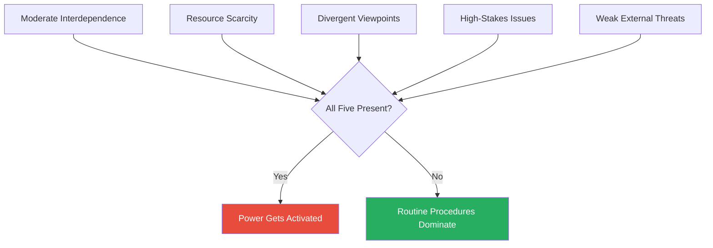
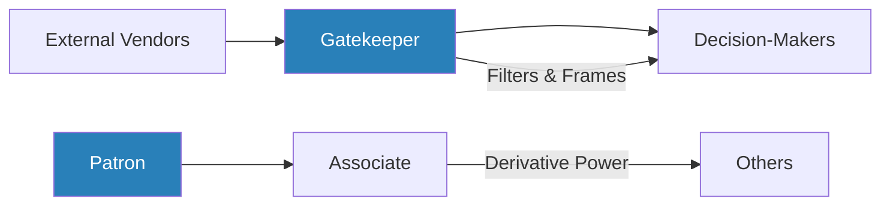
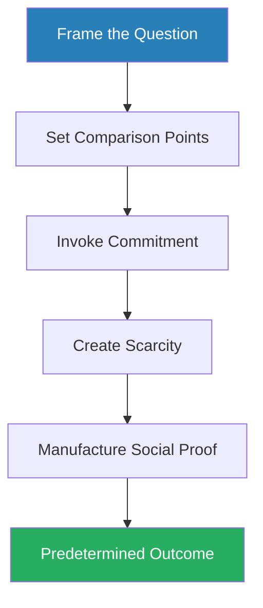
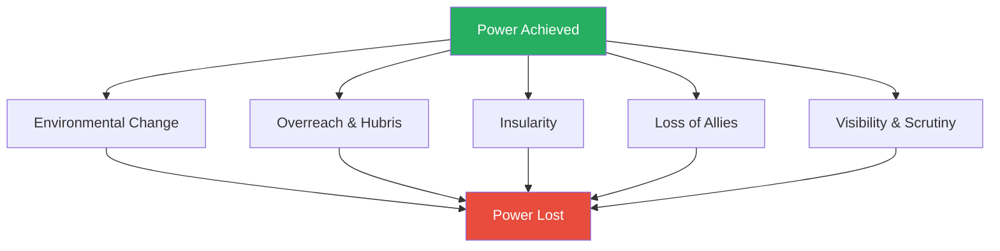
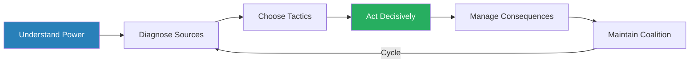

# Managing with Power — Jeffrey Pfeffer

> Jeffrey Pfeffer's *Managing with Power* is the academic counterpart to Robert Greene's historical theatrics — a systematic, evidence-grounded manual on how power actually works inside organisations.
> His thesis is blunt: the bottleneck in organisations is not figuring out what to do, but getting it done.
> Most people and most institutions fail not because they lack good ideas but because they lack the political skill to implement them.
> Pfeffer dismantles the cultural myth that power is dirty, showing instead that it is the essential mechanism of organisational change.
> Drawing on sustained case studies ranging from Robert Moses to Henry Kissinger to Lyndon Johnson to Xerox, he maps where power comes from, how it is exercised, and — critically — how it is lost.
> This is the book that treats organisational politics as an engineering problem rather than a moral failing.

---

## About the Author

Jeffrey Pfeffer is the Thomas D. Dee II Professor of Organizational Behavior at the Stanford Graduate School of Business, where he has taught since 1979. He has authored or co-authored fifteen books on power, evidence-based management, and the knowing-doing gap, making him one of the most prolific and cited scholars in his field. His work sits at the intersection of political science and organisational theory — he brings academic rigour to questions that most business writers treat with anecdote and platitude. Pfeffer is unusual among management scholars in that he does not flinch from the uncomfortable: his consistent message across decades of work is that wishing power dynamics away does not make them disappear, and that our cultural squeamishness about power produces far more organisational damage than power itself ever does.

## The Big Idea

- The central problem in organisations is <b style="color: #27ae60">implementation, not analysis</b>
- Decisions, by themselves, change nothing
- Most organisations know what they should do — the strategic answer is often obvious — but they cannot get it done because they lack the political will and skill to overcome opposition, align stakeholders, and mobilise resources
- The gap between knowing and doing is not an information gap — it is a <b style="color: #2980b9">power gap</b>

---

- Pfeffer argues that our cultural ambivalence about power — the widespread feeling that it is somehow illegitimate or dirty — produces organisational paralysis on a massive scale
- People who understand strategy but refuse to engage in politics are like engineers who understand physics but refuse to use tools
- The result is not moral purity — it is failure
- <b style="color: #e74c3c">The greater failure is not making mistakes or overreaching — it is doing nothing</b>
- Organisations lose more value through inaction than through any other single cause

---

- The book provides a complete framework for understanding and using power:
  - It begins with why power matters and when it gets activated
  - Then maps the structural and personal sources of power in detail
  - Then lays out the tactics for exercising it — framing, timing, information control, interpersonal influence, and structural redesign
  - Finally examines the predictable patterns by which power is lost
- The case studies are not cherry-picked anecdotes but sustained, multi-chapter analyses: Robert Moses, Lyndon Johnson, Henry Kissinger, Apple, Xerox, Ford, General Motors, Nissan, Goldman Sachs, Merrill Lynch, Eastern Airlines, and many more

The message is not that everyone should become a Machiavellian operator, but that understanding how power works is a prerequisite for accomplishing anything meaningful in a complex organisation. You do not have to love the game. You do have to understand it.

## Key Concepts at a Glance

| Concept | One-line summary |
|---------|-----------------|
| **The Implementation Gap** | The most important organisational problems are not analytical — they are problems of getting things done |
| **Three Ways of Getting Things Done** | Hierarchy (declining), shared culture (slow to build), and power/influence (what works when the others fail) |
| **When Power Gets Activated** | Power emerges under moderate interdependence, scarcity, divergent viewpoints, high stakes, and weak external threats |
| **Structural vs Personal Power** | We over-attribute power to charisma; the real drivers are position, resources, networks, and subunit membership |
| **Sources of Power** | Resource control, network position, formal authority, reputation, subunit membership, and six personal attributes |
| **Framing** | How an issue is presented determines the outcome more than its substance |
| **Timing as Strategy** | Moving first creates facts on the ground; delay exhausts opponents; deadlines force decisions |
| **Information as a Political Tool** | Analysis legitimates pre-determined decisions; consultants are political weapons |
| **Interpersonal Influence** | Social proof, ingratiation, emotional persuasion, settings and ceremony |
| **Structure as a Weapon** | Reorganisations are power plays, not efficiency exercises |
| **How Power Is Lost** | Environmental change, overreach, insularity, loss of allies, and the visibility of prominence |
| **The Will to Act** | Knowledge of power without willingness to use it is as useless as ignorance |
| **Power and Organisational Performance** | In large complex organisations, political skill is necessary for adaptation |

---

## Part I: Why Power Matters — The Implementation Gap

### Chapter 1: Decisions and Implementation

*Pfeffer opens by reframing the entire study of management: the bottleneck is never the decision itself — it is what happens after the decision is made.*

- We spend the vast majority of our organisational lives living with the consequences of decisions, not making them
- At the moment a decision is taken, we cannot know if it is good or bad
- What determines success is what happens *after* — and what happens after is entirely a function of political skill, resource mobilisation, and the ability to navigate opposition

> [!example] Honda's Accidental Conquest of America (1960s)
> - The Boston Consulting Group's famous case study presented Honda's US success as the result of brilliant strategic planning — a deliberate campaign to dominate the small-motorcycle segment
> - In reality, Honda's original plan was to sell large motorcycles to compete directly with Harley-Davidson and the European brands
> - That plan failed — the large bikes kept breaking down on American roads
> - The small Supercub motorcycles were brought along almost as an afterthought, for the Honda team's personal use
> - When the Supercubs attracted attention from Sears buyers, the team on the ground improvised
> - Success came not from the strategy but from the implementation capacity of the people executing it — their willingness to adapt and respond to market signals
> **The lesson:** Strategy is overrated. Implementation capacity — the ability to manage consequences rather than stick to a failing plan — is what produces results.

> "It is sometimes easier to figure out how to do something than it is to get it done."

- <b style="color: #27ae60">Analytical talent is overvalued, and political talent is undervalued</b>, in almost every organisation
- The smartest strategy in the world dies if no one can get it implemented
- Business schools teach analysis, strategy, finance, and marketing — but they do not teach the political skills required to translate any of those into action
- The result is a generation of managers who can diagnose problems brilliantly and solve none of them

---

> [!abstract] Pfeffer's Power Diagnosis Framework
> 1. Define your goals clearly
> 2. Diagnose patterns of dependence and interdependence
> 3. Assess others' points of view and motivations
> 4. Map their power bases
> 5. Assess your own power bases
> 6. Select appropriate strategies and tactics
> 7. Choose a course of action based on the analysis

This framework runs through the entire book. Every subsequent chapter fills in one or more steps of this diagnostic process.

> [!tip] Core Insight
> The gap between knowing and doing is not an information gap — it is a power gap. Organisations fail not because they lack good ideas but because they lack the political skill to implement them.

---

### Chapter 2: When Is Power Used?

*Power is not deployed constantly — it emerges only when specific structural conditions converge, and understanding those conditions is the first step to diagnosing any political situation.*

- Most organisational activity is routine and handled through standard procedures
- Power gets activated when five conditions converge simultaneously:

**<b style="color: #2980b9">Interdependence</b>** must be moderate:
- When people have no connection to each other, there is nothing to contest
- When they are completely interdependent, cooperation is forced
- It is in the middle zone — where people affect each other but are not locked into cooperation — that political behaviour flourishes

**<b style="color: #2980b9">Resource scarcity</b>**:
- When there is plenty for everyone, there is nothing to fight over
- When budgets are tight, headcount is limited, and office space is contested, people compete
- Zero-sum competition intensifies political activity

---

**Divergent viewpoints**:
- Functional specialisation naturally produces different perspectives
- Marketing sees the world differently from engineering; finance sees it differently from operations
- These differences are not pathologies — they are structural features of complex organisations
- But they guarantee conflict over priorities, methods, and resource allocation

**High-stakes issues**:
- People conserve political capital for high-stakes decisions
- Nobody spends political currency on the choice of office furniture
- Promotions, budget allocations, strategic direction, and structural changes — these are the domains where power gets deployed

**Weak external threats**:
- When an organisation faces a genuine existential threat, internal competition is suppressed in favour of unity
- When the threat recedes, the truce ends and internal competition resumes
- <b style="color: #e74c3c">Organisations that have been stable and successful for a long time often have the most vicious internal politics</b> — there is no common enemy to enforce cooperation

---

When all five conditions converge, political behaviour intensifies; when any one is absent — particularly when a strong external threat forces unity — organisations revert to cooperative routines.

> [!example] Why Academic Politics Are So Vicious
> - Universities face weak competitive pressures and have tenured faculty with guaranteed employment
> - With no external threat to enforce cooperation, internal competition flourishes over every discretionary resource
> - The classic joke — that academic politics are so vicious precisely because the stakes are so small — captures something real about the relationship between external threat and internal competition
> **The lesson:** The absence of a common enemy is the breeding ground for internal politics.

---

### Chapter 3: Diagnosing Power — Who Has It and How to Tell

*Before you can use power or build it, you need to see it — and Pfeffer identifies three categories of indicators that reveal the invisible power structure of any organisation.*

- <b style="color: #27ae60">Power is diagnosable</b> — it leaves visible traces that informed observers can detect
- Three categories of power indicators reveal who truly holds influence:

| Indicator Type | What to Look For | Reliability |
|---------------|-----------------|-------------|
| **Reputational** | Ask people who is powerful — informed observers are remarkably accurate | High — people know who gets their way |
| **Representational** | Committee membership, office size, seating arrangements, assignment quality | Moderate — signals both reflect and reinforce power |
| **Consequence** | Who wins disagreements? Whose budget grows? Whose candidate gets hired? | Highest — but requires longitudinal observation |

---

- **Reputational indicators** are surprisingly reliable:
  - Studies consistently show that informed observers within an organisation can identify the power structure with remarkable accuracy
  - Power, unlike some social phenomena, is not invisible — people know who controls resources and who can block decisions

- **Representational indicators** — the visible symbols of power — are not merely decorative:
  - They both reflect and reinforce the power structure
  - The person with the corner office is not powerful because of the office, but the office signals to everyone else that this person is powerful, which changes how they are treated

- **Consequence indicators** — who wins when there is a disagreement — are the most reliable:
  - Who gets the budget increase? Whose candidate gets hired? Whose project gets funded?
  - These outcomes require longitudinal observation but provide the most accurate picture of actual power

> [!example] University of Illinois and University of California Studies
> - Researchers tracked departmental power through all three indicator types across multiple universities
> - They found strong convergence: departments reputed to be powerful were also disproportionately represented on key committees and consistently won resource allocation battles
> - More importantly, the power of the department predicted individual career outcomes — salary, promotion, research funding — more reliably than individual merit
> **The lesson:** Your department's power predicts your career outcomes more reliably than your individual performance.

> [!tip] Core Insight
> Power is not invisible — it leaves traces in reputation, representation, and outcomes. Diagnosing it accurately is the prerequisite for navigating it effectively.

---

## Part II: Where Power Comes From — The Sources

### Chapter 4: The Fundamental Attribution Error of Power

*We instinctively credit powerful people for their power — their charisma, their intelligence, their force of personality — when the real explanation is almost always structural.*

- We habitually over-attribute power to personal characteristics — charisma, intelligence, strength of personality — and under-attribute it to structural position
- This is the <b style="color: #2980b9">fundamental attribution error</b> applied to organisational power

The mechanism is seductive:
- When we see a powerful person, the most salient thing about them is *them* — their voice, their confidence, their manner
- The structural features that actually produce their power — their position in the hierarchy, their control of budgets, their centrality in information flows — are invisible
- So we conclude that they are powerful because of who they are, not where they sit

> [!example] The Minnesota School Superintendent
> - A superintendent was enormously effective in one school district — transforming a struggling system through personal energy and political skill
> - He was hired by another district to work the same magic
> - He failed completely — not because he had changed, but because the context had changed
> - The political dynamics, stakeholder interests, resource constraints, and cultural norms were all different
> - The personal qualities that had produced power in the first context produced powerlessness in the second
> **The lesson:** Charisma does not transfer across contexts. Power comes from the fit between person and structure, not from the person alone.

> "Charisma does not transfer across contexts."

- <b style="color: #27ae60">If power comes primarily from structure, then the most important decisions you make are not about self-improvement but about positioning</b>
  - Which organisation to join
  - Which unit to be in
  - Which role to take
  - Which relationships to build
- Structure is destiny, more often than personality is

---

### Chapter 5: Resources, Allies, and the Mechanisms of Dependence

*Control of resources is the most direct source of organisational power — whoever controls what others need creates dependence, and dependence is the foundation of all power relationships.*

- The person who controls discretionary resources — budgets, headcount, facilities, contracts — creates <b style="color: #2980b9">dependence</b>
- And dependence, in Pfeffer's framework, is the foundation of all power relationships
- <b style="color: #27ae60">Small dependencies, built incrementally, create large constraints on behaviour</b>

> [!example]- Robert Moses: Monopolistic Power Through Incremental Accumulation
> - Moses accumulated twelve simultaneous positions in New York City and State government, each controlling some aspect of public construction — bridges, parks, highways, housing
> - No single position was overwhelming, but the combination gave him control over billions of dollars in construction contracts
> - Politicians, unions, contractors, and communities all depended on Moses for projects that affected their livelihoods and constituencies
> - By the peak of his power, Moses was more powerful than any elected official in New York, including the mayor and the governor
> - The mechanism was incremental: each new position added a small resource base, but the cumulative effect was monopolistic control over the physical development of the largest city in America
> **The lesson:** Power need not come from a single commanding position — twelve modest positions, combined, can exceed any single authority.

> [!example] The OPM Leasing Scandal (1980s)
> - OPM was a small computer leasing company that gradually became an important client for Goldman Sachs (investment banker), Fox & Company (auditor), and Rockwell International (business partner)
> - Each institution became financially dependent on OPM
> - When OPM began engaging in fraud — creating fictitious leases to secure funding — none of its partners investigated aggressively
> - Exposing OPM would have meant losing a profitable client, so the dependence that started as a normal business relationship became a cage
> - Goldman Sachs later paid $20 million to settle claims arising from the fraud
> **The lesson:** Dependence corrupts oversight. When you depend on someone financially, your ability to hold them accountable is compromised.

---

- **Federal research grants and university priorities** provide a third illustration of incremental dependence:
  - Federal grants represent only a small fraction of most universities' total budgets
  - But because the base budget is fixed and incremental resources are the only source of new activity, whoever controls the incremental grants controls what new things the university does
  - This is why federal research priorities shape university agendas so powerfully despite being a minority of total funding
  - The mechanism: <b style="color: #2980b9">budgets are incremental</b> — only the resources above the expected base are discretionary

> [!tip] Core Insight
> Resources alone are not enough — they must be deployed to build coalitions. The three mechanisms of coalition-building are appointments (placing loyal people), favours (creating diffuse obligations), and reciprocity (the human norm that received favours must be returned).

---

- Pfeffer then turns to **allies and the norm of reciprocity**:
  - Resources alone are not enough; they must be deployed to build coalitions
  - Allies are built through three mechanisms:
    - **Appointments** — placing loyal people in positions
    - **Favours** — creating diffuse obligations
    - **Reciprocity** — the human norm that received favours must be returned

> [!example] Kawamata's Quiet Revolution at Nissan
> - Facing a hostile union blocking his restructuring plans, Kawamata did not attack the union directly
> - Instead, he created a rival union and recruited sympathetic workers into it
> - He gradually placed his loyalists throughout the company's management structure
> - Over several years, the original hostile union was marginalised — not through confrontation but through the systematic creation of an alternative power base
> - Every appointment reinforced Kawamata's coalition, and every coalition member owed their position to him
> **The lesson:** The most effective coalition-building is invisible. Build your base gradually through appointments, not through direct confrontation.

> [!example] Ross Johnson vs Wilson at RJR Nabisco
> - Johnson did favours for board members that his predecessor, Wilson, refused to do — arranging perks, being personally attentive, making directors feel valued
> - These favours were not transactional in the explicit sense; they created generalised obligations
> - When Johnson later needed board support for controversial decisions, the directors who had received his generosity felt unable to oppose him
> - Wilson, arguably a more competent CEO, was ousted partly because he had failed to build this reciprocity network
> **The lesson:** Competence without relationship cultivation is insufficient. The favour economy operates on diffuse obligations, not explicit transactions.

- <b style="color: #e74c3c">Pure coalition politics without performance eventually collapses</b>
- The most effective power operators combine genuine competence with systematic relationship cultivation

---

### Chapter 6: Communication Networks and Gatekeeping

*The person who sits between others on communication paths can filter, bias, and control what decision-makers see — making network position one of the most powerful and least visible sources of influence.*

- Centrality in the flow of information is a major and often invisible source of power
- Those who sit between others on communication paths can filter, bias, and control what decision-makers see
- <b style="color: #27ae60">Physical proximity to decision-makers increases access and influence</b>
- Connection to powerful others confers derivative power

> [!example] Kenny the Gatekeeper — The Pettigrew Computer Purchase Study
> - A mid-level employee named Kenny was tasked with evaluating computer systems for his organisation
> - All communication between external vendors and the internal decision-making committee flowed through Kenny
> - He used this gatekeeper position to systematically favour his preferred vendor:
>   - He forwarded their proposals promptly and enthusiastically
>   - He delayed or added critical commentary to competitors' materials
> - The decision-makers, who had no independent channel to the vendors, made their choice based on the information Kenny provided
> - They bought the system Kenny wanted — and they believed the decision was entirely their own
> - Kenny had no formal authority over the purchase decision, but his position in the communication network gave him effective control
> **The lesson:** Formal authority is not required for decision control. Whoever controls the information flow controls the outcome.

---

> [!example] Kissinger's Proximity to Nixon
> - Kissinger's office was steps from the Oval Office; the State Department was across town
> - This physical arrangement meant Kissinger had constant, informal access to the President — he could drop in, catch Nixon between meetings, and shape his thinking in real time
> - The Secretary of State had to schedule formal appointments
> - The sheer volume of interaction that proximity enables creates influence through repetition, familiarity, and timing
> - Kissinger understood this and fought fiercely to maintain his physical position in the West Wing
> **The lesson:** Physical proximity creates a volume of interaction that scheduled meetings can never match. Position yourself close to the decision-maker.

> [!example] Tom Lynch at E.F. Hutton — The Dangers of Derivative Power
> - Lynch had no particular strategic vision, no unique expertise, and no independent power base
> - What he had was access — he was physically close to CEO Bob Fomon, spoke to him daily, and became the filter through which information reached the CEO
> - This made Lynch indispensable to anyone who wanted Fomon's attention
> - But when Fomon was eventually displaced, Lynch's power evaporated instantly
> - His power was entirely derivative — it existed only through the connection to a more powerful person
> **The lesson:** Derivative power is fragile. When your patron falls, you fall with them unless you have built an independent base.

---

> [!example] Lyndon Johnson and Sam Rayburn
> - As a junior congressman, Johnson had no formal power of his own
> - He cultivated a close personal relationship with Rayburn, the most powerful figure in the House of Representatives
> - This connection gave Johnson access to information, resources, and opportunities unavailable to his peers
> - Rayburn treated Johnson almost as a protege, inviting him to private gatherings where senior legislators discussed strategy
> - Johnson's peers knew about this relationship, which gave Johnson influence beyond his formal position — people were careful about opposing someone who had Rayburn's ear
> **The lesson:** Connection to a powerful patron amplifies your influence far beyond your formal position — but wise operators use that time to build their own independent base.

- <b style="color: #2980b9">Network position matters most when decisions are uncertain and information-dependent</b>:
  - In routine, well-structured decisions, formal authority dominates
  - But in ambiguous situations — which is to say, in most of the decisions that actually matter — whoever controls the flow of information controls the outcome

Gatekeepers derive power from controlling information flow, while associates derive power from proximity to patrons — both are potent but structurally fragile forms of influence.

> [!tip] Core Insight
> In ambiguous decisions — the ones that actually matter — whoever controls the flow of information controls the outcome. Network position trumps formal authority when uncertainty is high.

---

### Chapter 7: Formal Authority, Reputation, and Self-Fulfilling Prophecies

*Formal authority is the most visible source of power but far from the most important — its real significance lies in the legitimacy it confers and the self-reinforcing reputation cycles it sets in motion.*

- Formal authority — the power that comes with a title, a position, a place in the hierarchy — is the most visible source of power but far from the most important
- Its significance lies less in the direct commands it enables and more in the <b style="color: #2980b9">legitimacy</b> it confers
- People comply with requests from those in authority not because they are forced to but because they believe it is appropriate to do so
- This compliance is socially conditioned and remarkably robust — as Stanley Milgram's experiments demonstrated, people will comply with authority figures even when asked to do things that violate their personal values

---

More interesting than authority itself is Pfeffer's treatment of <b style="color: #2980b9">reputation as a self-fulfilling prophecy</b>:

- People perceived as powerful are:
  - Challenged less
  - Given better assignments
  - Allocated more resources
  - Treated with more deference
- All of which make them objectively more effective
- This effectiveness strengthens the reputation, which produces more advantages, which reinforces the reputation further
- <b style="color: #27ae60">The cycle is virtuous for those inside it and vicious for those outside it</b>

> [!example] The AT&T Manager Study
> - Researchers tracked managers from their first year through five years of career progression
> - First-year performance evaluations predicted outcomes five years later
> - This was not because early performance was genuinely predictive of long-term ability
> - Early reputation set the trajectory:
>   - Managers who received good early reviews were given better assignments, more resources, and more mentoring
>   - This made them more successful, which confirmed the early evaluation
>   - Managers who received mediocre early reviews entered the opposite spiral
> **The lesson:** Reputation compounds like interest. Early impressions set the trajectory, and the trajectory becomes self-fulfilling.

---

> [!example] Roger Smith's Rise at General Motors
> - As a young executive, Smith was perceived as hardworking, loyal, and reliable — not brilliant, not visionary, but safe and competent
> - This reputation earned him a series of progressively important assignments
> - Each assignment reinforced the perception that he was a rising star
> - By the time he became CEO, his position was the accumulated product of decades of reputation compounding
> **The lesson:** You do not need to be the most talented person — you need to be perceived as reliably competent early, and let the compounding do the rest.

> [!example] Frank Stanton at CBS
> - Stanton cultivated a reputation for energy, mastery of detail, and absolute reliability
> - He was the person who always had the numbers, who always knew the answer, who never dropped the ball
> - This reputation made him the natural choice for progressively larger responsibilities
> - He eventually was effectively running the network's operations
> **The lesson:** Mastery of detail and absolute reliability are underrated power-builders — they compound over decades.

> "The perception of power creates actual power."

- <b style="color: #e74c3c">Reputation is most malleable early in a tenure</b> — the first impression in a new role, the first few months in a new organisation
- Once a reputation crystallises, it becomes extremely difficult to change
- It may be more efficient to switch organisations entirely than to try to overcome a damaged reputation within the same one

---

### Chapter 8: Being in the Right Unit

*Individual brilliance matters less than the structural position of the unit you inhabit — and Pfeffer's data shows that departmental power predicts career outcomes more reliably than individual merit.*

- The power of the organisational subunit you belong to directly affects your individual power, salary, career progression, and ability to get things done
- This is one of Pfeffer's most counterintuitive and practically important arguments
- <b style="color: #27ae60">Individual brilliance matters less than the structural position of the unit you inhabit</b>

Subunit power derives from four factors:

| Factor | What It Means | Example |
|--------|--------------|---------|
| **Unity** | Departments that speak with one voice project power externally; internal dissent weakens the unit | Opponents exploit divisions within a divided unit |
| **Solving critical problems** | The unit addressing the organisation's most pressing challenge accumulates power | Finance rose in the 1980s; IT rose when technology became critical |
| **Irreplaceability** | Functions that cannot be outsourced, automated, or absorbed maintain power | Proprietary knowledge and unique expertise protect units |
| **Pervasiveness** | Units whose activities touch many other departments have more leverage | A unit interacting with every department has both more information and more influence |

---

> [!example] Bond Traders vs Equities Traders at Salomon Brothers (1980s)
> - In the 1980s, the bond trading department at Salomon was the dominant power centre
> - It generated the most revenue, solved the firm's critical problem (profiting from the bond market revolution), and its traders were irreplaceable
> - Equities traders at Salomon were technically competent but structurally disadvantaged:
>   - Their department was less profitable, less central, and less prestigious
>   - Individual equities traders who were objectively excellent performers earned less, received worse assignments, and had slower careers than mediocre bond traders
> - The difference was entirely which unit they belonged to
> **The lesson:** Being excellent in a weak unit produces worse outcomes than being mediocre in a powerful unit. Choose your unit before you choose your role.

> [!example] PG&E's Legal Department — Domain Expansion
> - The lawyers at Pacific Gas & Electric gradually expanded from pure legal work into gas procurement, financial planning, customer operations, and strategic planning
> - Each expansion was justified on operational grounds — lawyers were involved in regulatory proceedings that touched these areas
> - But the cumulative effect was that the legal department became one of the most powerful units in the company, far beyond what its formal mandate suggested
> **The lesson:** Domain expansion — gradually taking control of adjacent responsibilities — is one of the subtlest and most effective power strategies available to any unit.

---

> [!example] University of Illinois and University of California Studies
> - Researchers measured departmental power through multiple indicators and then tracked individual career outcomes
> - The finding was consistent: departmental power predicted individual salary, promotion timing, and research funding more reliably than individual publication records or teaching evaluations
> - Being in a powerful department was a stronger predictor of career success than being a productive individual in a weak department
> **The lesson:** Your unit's power shapes your career more than your personal output. Structural position is destiny.

> [!tip] Core Insight
> Choose your unit before you choose your role. Departmental power predicts your career outcomes — salary, promotion, funding — more reliably than your individual performance.

---

### Chapter 9: Personal Attributes — The Six Qualities of Power Holders

*While structure dominates, six observable behaviours distinguish those who acquire and hold power within any given structure — and unlike personality traits, these can be deliberately developed.*

- While structure dominates, Pfeffer identifies six personal attributes that distinguish those who acquire and hold power
- These are not traits in the personality-psychology sense — they are observable behaviours that can be developed
- <b style="color: #2980b9">The required mix varies by context</b>, and some attributes are in tension with each other

| Attribute | What It Means | Exemplar |
|-----------|--------------|----------|
| **Energy and stamina** | Outlasting opponents in long negotiations and sustained campaigns | Lyndon Johnson — eighteen-hour days, physically wearing down opponents |
| **Focus** | Concentration on a single objective rather than dissipating effort | Robert Moses — everything subordinated to building |
| **Sensitivity to others** | Reading what people want and fear — political intelligence, not therapy | Jim Wright — master at reading colleagues' needs |
| **Flexibility in means** | Adapting tactics while maintaining strategic direction | Frank Lorenzo's inflexibility destroyed Eastern Airlines |
| **Conflict tolerance** | Willingness to engage in disagreement rather than avoiding it | Most people make significant concessions to avoid interpersonal conflict |
| **Ego subordination** | Capacity to share credit, defer to others, and subordinate pride to strategy | Frank Stanton let Paley take credit; Peter Peterson's ego drove him out |

---

- **Energy and physical stamina**:
  - Power contests are often wars of attrition
  - The person who is still functioning effectively at 11pm when everyone else is exhausted has a significant advantage
  - Lyndon Johnson was legendary for his energy — he worked eighteen-hour days, kept multiple conversations going simultaneously, and physically wore down opponents through sheer endurance

- **Focus**:
  - The person who wants one thing intensely will usually defeat the person who wants many things moderately
  - Robert Moses focused single-mindedly on building — parks, bridges, highways, housing
  - His focus gave him an advantage over politicians who had to divide their attention across dozens of competing priorities

---

- **Sensitivity to others**:
  - This is not empathy in the therapeutic sense — it is <b style="color: #2980b9">political intelligence</b>
  - Understanding what motivates others allows you to offer them what they want in exchange for what you want
  - Jim Wright, the Speaker of the House, was a master at reading colleagues' needs and finding ways to satisfy them

- **Flexibility in means**:
  - Rigid operators break
  - The person who insists on only one method will fail when that method is blocked
  - <b style="color: #e74c3c">Frank Lorenzo at Eastern Airlines demonstrated the cost of inflexibility</b> — his rigid, confrontational approach to labour relations destroyed the airline
  - A more flexible operator would have achieved similar cost reductions through different means

---

- **Tolerance for conflict**:
  - Most people are deeply uncomfortable with interpersonal conflict and will make significant concessions to avoid it
  - This gives an enormous advantage to those who can tolerate — or even embrace — confrontation
  - The person willing to have the difficult conversation will generally prevail over the person who backs down to preserve harmony

- **Ability to submerge ego** — the most counterintuitive of the six:
  - Ego is often confused with strength, but in power dynamics, <b style="color: #e74c3c">ego is a vulnerability</b>
  - The person who needs to be seen as the hero, who cannot share credit, who takes offence at perceived slights, alienates potential allies
  - Frank Stanton at CBS built enormous power partly because he was willing to let William Paley take the credit for decisions Stanton had engineered
  - Peter Peterson at Lehman Brothers had all the other attributes but lacked this one — his ego alienated colleagues and contributed to his eventual departure

- Pfeffer emphasises that these attributes interact:
  - Academic environments may require less conflict tolerance
  - Crisis environments may require more energy
  - Some attributes — particularly conflict tolerance and ego subordination — are in tension with each other
  - <b style="color: #27ae60">The skill is knowing which to deploy when</b>

---

## Part III: The Tactics of Power — Strategies and Influence

### Chapter 10: Framing and the Psychology of Decision

*The question asked dictates the answer given — and Pfeffer shows how skilled operators use framing to predetermine outcomes before the "decision" is ever formally made.*

- <b style="color: #27ae60">How an issue is framed often determines the outcome more than its substance</b>
- Decisions are shaped by the question asked, the comparison point offered, and the context invoked — not just by the facts of the matter

> "The question asked often determines the answer."

The mechanism operates through several psychological channels:

**<b style="color: #2980b9">Contrast effects</b>** — what came before changes perception of what comes next:
- A proposal that follows a rejected extreme option looks reasonable by comparison
- Real estate agents understand this instinctively: they show an overpriced, unappealing property first, so the second property looks like a bargain
- In organisational settings, budget requests that follow a period of severe cuts seem modest even if they are historically large, because the reference point has shifted

---

**<b style="color: #2980b9">Commitment and escalation</b>** — past actions bind future decisions:
- Once people have invested time, money, or reputation in a course of action, they are psychologically compelled to continue
- Voluntary, public, and irrevocable commitments are the most binding
- The Vietnam War escalation is Pfeffer's most sobering example:
  - Each incremental commitment — advisors, then troops, then more troops, then bombing campaigns — made withdrawal psychologically and politically harder
  - Withdrawal would mean admitting that previous commitments had been wasted
  - The frame shifted from "should we be there?" to "are we winning?" — and once that frame was established, the only acceptable answer was escalation

**<b style="color: #2980b9">Scarcity</b>** — restricted access increases perceived value:
- Making something appear limited or exclusive makes people want it more
- This operates in organisations through selective invitations, limited-access meetings, and restricted information channels

**<b style="color: #2980b9">Social proof</b>** — people follow what others appear to endorse:
- The appearance of consensus, even manufactured, shifts decisions
- If three respected colleagues all support a proposal, the fourth is under enormous pressure to agree, regardless of their private assessment

---

> [!example] Merrill Lynch's CMA — Reframing a Strategic Gamble as Customer Service
> - In the late 1970s, Merrill Lynch CEO Don Regan wanted to launch a product that would effectively make Merrill Lynch a bank — offering checking accounts, credit cards, and money market funds alongside traditional brokerage
> - This was a radical strategic move that would trigger regulatory opposition and internal resistance from traditional brokers
> - Regan did not ask his board, "Should we enter the banking business?" — which would have triggered defensive thinking about risk and regulation
> - He asked, "How do we serve our customers better?" — reframing the same product launch as a customer service initiative
> - The frame determined the answer
> - The CMA was approved and became one of the most successful product launches in financial services history
> **The lesson:** The question you ask predetermines the answer you get. Frame proposals in terms your audience already values.

> [!example] McGeorge Bundy at the Kennedy White House
> - As National Security Advisor, Bundy prepared the briefing documents that went to the President
> - He decided what information was included, how it was presented, which options were highlighted, and which were buried in appendices
> - The President technically made the decisions, but Bundy's control over the informational frame meant the decisions were heavily pre-shaped before they reached the Oval Office
> **The lesson:** Controlling the informational frame — what gets included, what gets buried — is as powerful as making the decision itself.

Framing is not a single tactic but a cascade — each psychological mechanism reinforces the others, pre-shaping the "decision" before it is formally taken.

> [!tip] Core Insight
> The question asked determines the answer given. Skilled operators win not by arguing better answers but by choosing better questions.

---

### Chapter 11: Interpersonal Influence — The Softer Weapons

*The mechanisms that operate through person-to-person interaction — social proof, ingratiation, emotional persuasion, settings — are less visible than structural power but precisely as effective.*

- Pfeffer devotes a full chapter to interpersonal tactics — mechanisms that operate through person-to-person interaction rather than structural position
- These are "softer" than resource control or structural redesign, but powerful precisely because they are less visible

**<b style="color: #2980b9">Social proof and conformity pressure</b>**:
- When a proposal appears to have broad support, opposition becomes psychologically costly
- The dissenter risks being seen as difficult, obstructive, or out of touch
- Skilled operators build the appearance of consensus *before* formal decisions are taken
- By the time a vote is called, the outcome is already determined

---

**<b style="color: #2980b9">Ingratiation</b>** — one of the most effective and most underestimated influence tactics:
- Research consistently shows that people who engage in ingratiation are rated more favourably by their superiors, receive better evaluations, and are promoted faster
- This holds even when the ingratiation is transparently strategic
- The target of ingratiation knows, at some level, that they are being flattered
- <b style="color: #27ae60">They enjoy it anyway</b>

**Emotional persuasion**:
- Appeals to feelings rather than logic are effective because most organisational decisions are made under uncertainty, where rational analysis cannot provide a clear answer
- When data is ambiguous, people fall back on emotional responses: trust, excitement, fear, loyalty
- The person who can evoke the right emotion in the right moment has a significant influence advantage

---

**Settings and ceremony**:
- The physical environment in which interaction takes place shapes its outcome
- Formal settings favour those with formal authority; informal settings favour those with interpersonal skill
- Home turf provides an advantage through familiarity and control
- A conversation that would be confrontational in a conference room may be collaborative over dinner

**Language and symbolic management**:
- The words used to describe a situation frame how people respond to it
- Calling a layoff a "restructuring" or a "right-sizing" changes the emotional response
- Calling a budget cut an "efficiency initiative" makes it politically palatable
- <b style="color: #27ae60">The person who controls the language controls the narrative, and the narrative shapes behaviour</b>

| Tactic | Mechanism | When It Works Best |
|--------|-----------|-------------------|
| **Social proof** | Conformity pressure from apparent consensus | When the audience is uncertain and looks to others for cues |
| **Ingratiation** | Flattery creates goodwill and diffuse obligation | Works even when transparent — targets enjoy it regardless |
| **Emotional persuasion** | Appeals to trust, excitement, fear, loyalty | When data is ambiguous and rational analysis is inconclusive |
| **Settings** | Physical environment shapes interaction dynamics | Informal settings favour interpersonal skill; formal settings favour authority |
| **Language** | Words frame emotional and cognitive responses | When naming or labelling a proposal determines how people feel about it |

Each tactic is most powerful when combined with others — social proof backed by emotional persuasion in a carefully chosen setting with strategically managed language creates influence that is nearly irresistible.

---

### Chapter 12: Timing — When to Act, When to Wait, When to Force a Decision

*Timing is the most underappreciated tactical variable in organisational politics — when you act matters as much as what you do.*

- Pfeffer treats timing as a strategic instrument with several distinct modes
- <b style="color: #27ae60">When you act matters as much as what you do</b>

**<b style="color: #2980b9">Moving first</b>** — pre-empts opposition and creates facts on the ground:
- What is done is harder to undo than what is merely proposed
- Reversing a project already underway carries a far higher political cost than simply letting it proceed

> [!example] Robert Moses and the Cross-Bronx Expressway
> - When building the Cross-Bronx Expressway, Moses began demolishing existing structures before his projects were fully approved
> - He moved before alternative routes had been evaluated, before community opposition could organise
> - By the time opponents mobilised, there were already bulldozers in the street
> - Reversing the project would have meant not just stopping construction but undoing construction already completed — a far higher political cost than simply letting it proceed
> **The lesson:** Create facts on the ground before opposition can organise. What is done is harder to undo than what is merely proposed.

> [!example] Bill Agee at Bendix — Pre-emptive Action
> - When Agee took over as CEO, he fired several senior executives on his first day
> - The firings came before they could organise opposition or build coalitions against his agenda
> - The action sent a message about who was in charge and eliminated potential power centres before they could coalesce
> - Pre-emptive action carries risk of backlash, but it eliminates the possibility of organised resistance
> **The lesson:** Pre-emptive strikes eliminate opposition before it can coalesce — but the trade-off is the risk of backlash.

---

**<b style="color: #2980b9">Delay</b>** — the opposite of early action — exhausts opponents' resources and patience:
- Calling for "further study" is the classic blocking tactic
- It sounds reasonable — who can argue against more information? — but its function is political: it prevents action while maintaining the appearance of process

> [!example] The Death of the SST (Supersonic Transport Programme)
> - Opponents of the supersonic jet did not have the votes to kill it outright
> - Instead, they called for environmental impact studies, economic feasibility reviews, and congressional hearings
> - Each study took months
> - By the time all the studies were completed, public opinion had shifted, champions had moved on, and the programme died of exhaustion rather than explicit rejection
> **The lesson:** You do not need the power to defeat a proposal directly. Delay — through studies, reviews, and hearings — can kill it through attrition.

> [!example] Charlie Bryan vs Frank Lorenzo at Eastern Airlines
> - Bryan, the machinist union leader, repeatedly stalled negotiations — demanding new studies, insisting on re-examining settled issues, and refusing to commit to timelines
> - Lorenzo, who needed quick resolution to execute his restructuring plan, was increasingly frustrated and destabilised
> - The delay did not serve Bryan's members well in the long run — Eastern eventually collapsed — but it effectively neutralised Lorenzo's time advantage
> **The lesson:** Delay is the weapon of the weaker party. It does not require resources — only the ability to obstruct process.

---

**<b style="color: #2980b9">Deadlines</b>** favour the side with momentum:
- Proposals that arrive near deadlines receive less scrutiny because the cost of missing the deadline exceeds the cost of a suboptimal decision
- Budget cycles, fiscal year ends, and regulatory filing dates all create natural deadlines that can be exploited

**<b style="color: #2980b9">Order of consideration</b>** — agenda sequencing determines outcomes:
- Items not on the agenda cannot be approved
- The person who controls the agenda controls the meeting

> [!example] The British Steel Plant Closure Decision
> - The order in which plants were considered determined which ones were closed
> - The first plants on the list were evaluated on their individual merits
> - By the time later plants were considered, the decision had already been framed by the earlier choices
> **The lesson:** Agenda control is outcome control. The sequence in which options are considered shapes which options survive.

---

**<b style="color: #2980b9">Propitious moments</b>** — crises, reorganisations, and leadership transitions create windows of unusual receptivity:
- Proposals that would be rejected in stable times may sail through during periods of upheaval
- Kissinger used the transition from the Johnson to the Nixon administration to restructure the entire foreign policy apparatus — a move impossible in a stable political environment

> [!tip] Core Insight
> Timing is not a minor tactical detail — it is as important as substance. Moving first creates facts; delay exhausts opponents; deadlines force decisions; crises open windows. Choose your moment as carefully as you choose your argument.

---

### Chapter 13: Information and Analysis as Political Instruments

*Information is selectively gathered, presented, and withheld to serve agendas — and analysis is used to legitimate pre-determined decisions, not to discover truth.*

- <b style="color: #e74c3c">Information is selectively gathered, presented, and withheld to serve agendas</b>
- Analysis is used to legitimate pre-determined decisions, not to discover truth
- Outside experts and consultants are deployed as political weapons to add credibility to positions already taken

The naive assumption that better data leads to better decisions ignores the political reality of how data is produced, filtered, and consumed:
- The person who commissions the study selects the consultant
- The person who selects the consultant defines the methodology
- The person who defines the methodology frames the terms of reference
- <b style="color: #27ae60">The conclusion is shaped before the first data point is collected</b>

> "Information is a political tool, not a neutral input to decision-making."

---

> [!example] The Hospital Board and Competing Studies
> - A hospital CEO proposed a new wing and commissioned a market study — which unsurprisingly confirmed the need for expansion
> - When opponents commissioned their own study, it reached the opposite conclusion
> - Both studies used legitimate data and defensible methodology
> - The difference was in the assumptions, the framing, and the questions asked
> - The board was left to choose between competing analyses, and the choice was made on political grounds — who was more powerful, who had more allies — rather than on the merits of the data
> **The lesson:** When two competent analyses reach opposite conclusions, the decision is made on political grounds, not analytical ones. Data does not decide — power decides.

- **Outside consultants** serve a particular political function:
  - They provide the appearance of objectivity — an independent expert has concluded that the proposed course of action is correct
  - But the consultant was selected by the person proposing the action, briefed by that person, and given terms of reference shaped by that person
  - The "independent" analysis is pre-shaped by its commission
  - Pfeffer does not argue that this is necessarily corrupt — sometimes the analysis is genuinely rigorous
  - But <b style="color: #2980b9">the political function of the analysis</b> — to legitimate a decision already made — is separate from its analytical quality

> [!tip] Core Insight
> Data does not decide — power decides. When you see a study being commissioned, ask who commissioned it, who selected the consultant, and who defined the terms of reference. The answers reveal the conclusion before you read the report.

---

### Chapter 14: Structural Tactics — Reorganisation as a Power Play

*Organisational structure is not a neutral efficiency mechanism — it is a tool for consolidating power, and the person who can change the structure can change the distribution of power permanently.*

- <b style="color: #27ae60">Reorganisations, committee appointments, and reporting line changes are power plays with legitimating rationales</b>
- The person who can change the structure can change the distribution of power — permanently
- Structural changes are the most durable form of power because they outlast the individual who creates them

> [!example]- Kissinger's Restructuring of Foreign Policy
> - When Nixon took office, foreign policy was coordinated through the Senior Interdepartmental Group (SIG), chaired by the Under Secretary of State
> - This gave the State Department effective control over all foreign policy coordination
> - Kissinger, as National Security Advisor, persuaded Nixon to eliminate the SIG and create the NSC (National Security Council) apparatus in its place — with Kissinger as chair of all key committees
> - The effect was to route every piece of foreign policy information through Kissinger's office
> - The State Department was not formally demoted — it still had its building, its budget, its ambassadors
> - But the structural change meant the Secretary of State could no longer set the agenda, control the information flow, or coordinate the interagency process
> - Kissinger had won the structural battle, and the structural battle was the only one that mattered
> **The lesson:** Structural control is the deepest form of power. The person who controls the committee structure controls who sets the agenda, who sees the information, and who coordinates the process.

---

> [!example] Apple's Reorganisation After Jobs's Departure
> - Jobs had built his power partly through a cadre of personal loyalists who occupied key positions throughout the company
> - When John Sculley pushed Jobs out, he reorganised the company along functional lines
> - This broke up the product divisions where Jobs's loyalists were concentrated, dispersing them across the company
> - The reorganisation was justified on efficiency grounds (functional specialisation would reduce duplication)
> - But its political effect was to destroy Jobs's power base by separating his allies from each other and embedding them in structures controlled by other people
> **The lesson:** "Divide and conquer" through reorganisation is one of the most effective structural weapons — break up your opponent's coalition by dispersing them across the organisation.

> [!example] General Motors' Creation of GMAD
> - Previously, each car division (Chevrolet, Pontiac, Buick, Oldsmobile, Cadillac) controlled its own manufacturing
> - This gave the divisions enormous power — they controlled both product design and production
> - GM's corporate leadership created GMAD (General Motors Assembly Division) to centralise assembly operations, stripping the divisions of manufacturing control
> - The rationale was standardisation and cost reduction; the effect was a massive power shift from the divisions to the central corporate structure
> **The lesson:** Centralisation is always a power play disguised as an efficiency play. Whoever controls the reorganisation controls the redistribution of power.

---

> [!example] Jim Wright's Control of Committee Appointments
> - As Speaker of the House, Wright controlled appointments to the Steering and Policy Committee
> - This committee in turn controlled committee assignments for all House Democrats
> - This gave Wright leverage over every member of his caucus — their committee assignments, and therefore their ability to legislate on issues they cared about, depended on Wright's goodwill
> - The structure (the committee system) created the power; the appointments (Wright's selections) determined who benefited from it
> **The lesson:** Appointment authority is structural power. Whoever controls who sits on which committee controls the legislative agenda.

- **Domain expansion** is a subtler structural tactic:
  - Rather than reorganising the entire structure, a unit gradually takes control of more activities and responsibilities
  - PG&E's legal department exemplifies this: starting from a narrow legal mandate, the lawyers gradually expanded into gas procurement, financial planning, customer operations, and strategic planning
  - Each expansion was justified on operational grounds
  - But the cumulative effect was that the legal department became one of the most powerful units in the company

> [!tip] Core Insight
> Structure outlasts individuals. The most durable form of power is not personal influence but structural control — committee chairs, reporting lines, and domain boundaries. Change the structure and you change the distribution of power permanently.

---

### Chapter 15: Symbolic Management — Ceremony, Settings, and Performance

*Power is communicated and reinforced through ceremonies, physical spaces, and performances — the symbolic layer of organisational life that most people dismiss as mere decoration but that Pfeffer shows to be substantively important.*

- Pfeffer devotes a chapter to the role of symbolism in the exercise of power — the ceremonies, settings, physical spaces, and performances through which power is communicated and reinforced

**Physical space** communicates power:
- The size of an office, its location (corner vs interior, executive floor vs basement), its furnishings, and its proximity to decision-making centres all signal status
- These are not merely perks — they shape how others interact with the occupant
- A person in a large corner office on the executive floor is treated differently from an identical person in a small interior office two floors below

---

**Ceremony and ritual** serve a legitimating function:
- Formal meetings, award ceremonies, planning retreats, and other organisational rituals create the appearance of rational process
- Decisions made informally in hallway conversations are subsequently ratified through formal proceedings
- <b style="color: #27ae60">The ceremony does not change the decision — it changes the perception of the decision</b>

**The performance of competence** matters as much as actual competence:
- Speaking with confidence, maintaining composure under pressure, controlling the pace and tone of meetings — these are performative skills that signal power regardless of substance
- The person who appears to know what they are doing is treated as if they know what they are doing
- This creates the <b style="color: #2980b9">self-fulfilling prophecy</b> Pfeffer described in Chapter 7

| Symbol | What It Communicates | How It Reinforces Power |
|--------|---------------------|------------------------|
| **Office size and location** | Status and importance | Changes how others interact with the occupant |
| **Ceremony and ritual** | Legitimacy of decisions | Ratifies informal decisions through formal process |
| **Performance of competence** | Authority and control | Creates self-fulfilling prophecy of capability |
| **Language and naming** | Frames for understanding events | Controls narrative and emotional response |

These symbolic elements work because they operate below conscious awareness — people respond to the signals without realising they are being influenced.

---

## Part IV: Power Dynamics — The Bigger Picture

### Chapter 16: How Power Is Lost

*Power is easier to lose than to build — and it erodes through five predictable mechanisms that even the most astute operators struggle to recognise in themselves.*

- <b style="color: #e74c3c">Power is easier to lose than to build</b>
- Power erodes through five predictable mechanisms:

All five mechanisms are self-reinforcing — success breeds the conditions for its own undoing, and by the time the powerful recognise what is happening, the erosion is often irreversible.

---

**<b style="color: #2980b9">Environmental change outpacing personal adaptation</b>** — the most common and most insidious mechanism:
- The same qualities that produce power in one era produce powerlessness when conditions shift
- The person cannot adapt because their entire identity and coalition were built around the old conditions

> [!example] Fiorello LaGuardia — The Mayor Who Couldn't Adapt
> - LaGuardia was the most effective mayor New York City has ever had — a progressive reformer who built infrastructure, expanded social services, and fought corruption
> - But his progressive agenda was shaped by the Depression era
> - When the postwar boom transformed America's concerns from poverty to prosperity, LaGuardia's approach became irrelevant
> - He could not adapt because his entire identity and political coalition were built around Depression-era problems
> - He died in office, still fighting battles that the electorate no longer cared about
> **The lesson:** The skills and coalitions that produce power are era-specific. When the era changes, the power evaporates — and the last person to notice is the one who holds it.

> [!example] Lyndon Johnson — Congressional Genius, Television Disaster
> - Johnson's extraordinary political skill — reading people, building coalitions, brokering deals in backroom conversations — was perfectly adapted to Congress in the 1950s and early 1960s
> - When he became President during the television age, those same skills became liabilities
> - Television required a different kind of performance: polish, visual appeal, communication to millions simultaneously
> - Johnson's intimate, arm-twisting style was devastating in a Senate cloakroom and disastrous on camera
> - Vietnam destroyed his presidency partly because the television medium amplified opposition in ways his congressional-era toolkit could not manage
> **The lesson:** Power skills are context-specific. Mastery of one medium — face-to-face persuasion, legislative deal-making — does not transfer to another.

---

> [!example] Welch Pogue — The Gentleman Lobbyist Left Behind
> - Pogue, a distinguished aviation lawyer, built his career when Washington lobbying was conducted through gentlemanly relationships and reasoned legal argument
> - The lobbying industry transformed into an aggressive, media-savvy, campaign-contribution-driven operation
> - Pogue's approach became ineffective — not because he had become less competent, but because the environment had changed around him
> **The lesson:** Competence is not absolute — it is relative to the environment. What makes you effective today may make you irrelevant tomorrow.

**<b style="color: #2980b9">Overreach and hubris</b>**:
- Success breeds arrogance, and arrogance breeds opposition
- The person who pushes too far — who takes too much credit, who humiliates opponents unnecessarily, who fails to share the spoils of victory — creates a coalition of the resentful
- <b style="color: #e74c3c">The most dangerous moment for the powerful is the moment of their greatest triumph</b>
- That is when they are most likely to overreach and when their opponents are most motivated to unite

---

**<b style="color: #2980b9">Insularity and loss of information</b>**:
- Powerful people are shielded from bad news
- Subordinates tell them what they want to hear
- Information flows become distorted: positive data reaches the top; negative data is filtered, softened, or suppressed
- The information diet of the powerful becomes increasingly divorced from reality
- Decisions made on distorted information produce failures that erode power
- This mechanism is self-reinforcing: as power increases, insularity increases, which produces worse decisions, which eventually undermines the power

**<b style="color: #2980b9">Loss of allies</b>**:
- Through neglect, ego, or changing circumstances, the coalition that built power can fragment
- Allies who feel taken for granted drift away
- Allies whose interests change find new partners
- Robert Moses eventually lost power partly because he stopped cultivating allies — he had been powerful for so long that he assumed his position was unassailable
- It was not

---

**<b style="color: #2980b9">Visibility attracting scrutiny</b>**:
- Rising to prominence exposes weaknesses that were invisible at lower levels
- The same behaviours tolerated in a mid-level position become career-ending when practised by a senior figure under public observation
- Media attention, regulatory scrutiny, and competitive targeting all increase with prominence
- The person who operated effectively in obscurity may be destroyed by the spotlight

> "It is better to do something imperfectly than to do nothing flawlessly."

> [!tip] Core Insight
> Power contains the seeds of its own destruction. Success breeds insularity, hubris, and environmental mismatch — and the last person to recognise the erosion is the person losing power.

---

### Chapter 17: Power and Organisational Performance

*Does political behaviour help organisations or just help individuals at the organisation's expense? Pfeffer's answer is contingent — and the distinction matters enormously.*

- Pfeffer confronts the uncomfortable question: does political behaviour actually help organisations, or does it just help individuals at the organisation's expense?
- <b style="color: #27ae60">The relationship between politics and performance depends on the type of organisation</b>

In **small, owner-managed firms** with clear performance metrics:
- Political behaviour tends to impede performance
- Eisenhardt and Bourgeois studied eight technology firms and found that those with more political activity performed worse
- But Pfeffer notes a crucial confound: these firms had authoritarian CEOs who centralised decision-making
- The politics were largely reactions to centralised authority — not the productive power dynamics Pfeffer advocates

---

In **large, complex organisations** with ambiguous outcomes and multiple stakeholders:
- Political skill is not optional — it is the mechanism through which adaptation occurs

> [!example] The Polaris Missile Programme — Politics as Enabler
> - The Polaris programme succeeded not despite bureaucratic politics but because of them
> - The programme's managers were masterful political operators who:
>   - Built coalitions across the Navy, Congress, and defence contractors
>   - Managed information flows to maintain support
>   - Used the programme's visibility to protect it from budget cuts
> - The technical achievement was real, but the political achievement was what made the technical achievement possible
> **The lesson:** In large organisations, political skill is the delivery mechanism for technical excellence. Without it, even brilliant engineering dies on the vine.

> [!example] Borum's Hospital Study — Power as a Positive-Sum Game
> - Building power at lower levels of the organisation actually improved organisational effectiveness
> - When lower-level staff were given more influence over their work processes, the hospital's performance improved
> - Power was not zero-sum — expanding it at lower levels did not diminish it at upper levels
> - Instead, it increased the organisation's total capacity for action
> **The lesson:** Power need not be zero-sum. Distributing influence more broadly can increase the total capacity of the organisation.

---

| Organisation Type | Role of Politics | Effect on Performance |
|------------------|-----------------|----------------------|
| **Small firms, clear metrics** | Tends to distort resource allocation | Generally negative |
| **Large, complex organisations** | Enables adaptation and implementation | Generally positive — when channelled productively |
| **Organisations with distributed power** | Increases total capacity for action | Positive — power is not zero-sum |

Pfeffer's synthesis:
- The relevant question is not "Is political behaviour good or bad?"
- It is "Under what conditions does political behaviour produce positive organisational outcomes?"
- The answer: when it enables change blocked by inertia, when it mobilises resources for important initiatives, and when it provides the implementation capacity that analytical competence alone cannot supply

---

### Chapter 18: The Will to Act — The Greater Sin Is Inaction

*Knowledge of power without the willingness to use it is as useless as ignorance — and Pfeffer's final chapter makes a devastating case that organisations suffer far more from inaction than from excess.*

- Knowledge of power without the willingness to use it is as useless as ignorance
- <b style="color: #e74c3c">The greater failure in organisations is not making mistakes — it is doing nothing</b>

> [!example] The San Francisco Freeway Rebuild After Loma Prieta (1989)
> - After the 1989 earthquake, the damaged freeway took eighteen months of political wrangling before reconstruction even began
> - Meanwhile, the damaged Bay Bridge was repaired in six weeks
> - The difference was not engineering complexity — it was political will
> - The freeway reconstruction involved multiple jurisdictions, competing interests, and unresolved disagreements about routing
> - No one had the power or the will to cut through the process and start building
> - The city endured a year and a half of commuting chaos because of political paralysis
> **The lesson:** When everyone has veto power and no one has the will to act, the result is paralysis — and the cost of paralysis is borne by everyone.

---

> [!example]- The Blood Bank Resistance to AIDS Screening (1980s)
> - In the early 1980s, evidence mounted that the blood supply was contaminated with what would later be identified as HIV
> - Blood banks resisted implementing screening procedures:
>   - Initially because the tests were imperfect
>   - Then because screening was expensive
>   - Then because acknowledging the problem would create liability
> - An estimated 12,000 Americans were infected with HIV through contaminated blood transfusions during the period of delay
> - The cost of inaction was measured in lives
> **The lesson:** The most catastrophic organisational failures are failures of inaction, not failures of action. When the cost of doing nothing is measured in human lives, political paralysis becomes moral failure.

> [!example] Henry Ford II vs Harry Bennett — The Will to Act
> - After Henry Ford I's death, Bennett — who had been the elder Ford's enforcer, running the company through intimidation and violence — retained enormous power
> - Henry Ford II, young and inexperienced, understood that Bennett had to be removed for the company to survive
> - He acted decisively: he fired Bennett and restructured the company's management, despite Bennett's threats and the risk of internal upheaval
> - The will to act, in this case, saved the company
> **The lesson:** Decisive action in the face of intimidation and risk is sometimes the only path to organisational survival.

---

> [!example] Xerox's Failure at PARC
> - Xerox's Palo Alto Research Center invented many of the technologies that would define personal computing — the graphical user interface, the mouse, ethernet networking, laser printing
> - But Xerox's corporate leadership lacked the will to implement these inventions commercially:
>   - They did not understand the technology
>   - They were focused on their copier business
>   - They were unwilling to cannibalise their existing revenue streams
> - Apple and Microsoft built empires on technologies that Xerox invented and then failed to act on
> **The lesson:** Invention without implementation is worthless. The will to act — to cannibalise your own revenue, to invest in what you do not fully understand — is the difference between creating the future and watching someone else profit from your ideas.

> "If you do not use power, the consequences can be quite grave."

- Pfeffer's final message is that the cultural ambivalence about power — the feeling that it is somehow illegitimate or distasteful — produces far more damage than the exercise of power ever does
- Organisations fail, people suffer, and opportunities are lost not because someone overreached but because <b style="color: #27ae60">no one acted at all</b>

> [!tip] Core Insight
> The greater organisational sin is passivity, not excess. More value is destroyed through inaction than through any other single cause. The will to act is not a personality trait — it is a choice.

---

Pfeffer's complete framework is cyclical: understanding leads to diagnosis, diagnosis to tactics, tactics to action, action to consequences, and consequences back to diagnosis — because the political landscape shifts with every move.

---

## Key Quotes

- "It is sometimes easier to figure out how to do something than it is to get it done."
- "The central problem is not decision but implementation."
- "If you do not use power, the consequences can be quite grave."
- "The question asked often determines the answer."
- "It is better to do something imperfectly than to do nothing flawlessly."
- "The perception of power creates actual power."
- "Information is a political tool, not a neutral input."
- "Charisma does not transfer across contexts."

---

## The Verdict

*Managing with Power* is the most practically useful academic book on organisational power in print. Where Robert Greene gives you history and aphorism — vivid, theatrical, morally charged — Pfeffer gives you mechanism and evidence. Where most influence books focus on interpersonal charm, Pfeffer grounds power in **structure, position, resources, and information** — factors that are buildable and replicable, not innate gifts. The core insight — that the bottleneck in organisations is implementation, not analysis — is one of those ideas that, once understood, reshapes how you see every meeting, every reorganisation, and every budget cycle. It is a permanently useful lens.

The case study depth is a genuine strength. Moses, LBJ, Kissinger, Apple, Xerox, Ford, GM, Nissan, Goldman Sachs, Merrill Lynch, Eastern Airlines, PG&E, CBS, AT&T, Salomon Brothers — these are not cherry-picked anecdotes but sustained analyses that show the same principles operating across wildly different contexts. The Honda motorcycle case alone is worth the price of the book: a single story that demolishes the myth of strategic planning as the driver of organisational success. When Pfeffer tells you that structural position matters more than personal charisma, he shows you the data, the case studies, and the mechanisms.

The book's weaknesses are partly a product of its era and partly structural. Written in 1992, it assumes physical co-location and says nothing about remote or hybrid work — a significant gap given how profoundly distributed teams change communication network dynamics and proximity effects. The examples skew overwhelmingly male, American, and drawn from the 1960s-1980s, which limits their cultural range. Pfeffer, for all his clear-eyed analysis of power's mechanisms, spends insufficient time on its psychological costs. He treats political engagement as obviously worthwhile without adequately addressing burnout, moral fatigue, or what it means for people who value authenticity to operate in a permanently political mode. The book would be stronger if it acknowledged that the prescription to "play the game" imposes real costs on real people — and that those costs need to be managed, not just dismissed.

The reader who benefits most is the one who reads Pfeffer alongside Greene. Greene provides the historical pattern-recognition and the adversarial mindset — he teaches you to see the game. Pfeffer provides the structural diagnosis and the implementation framework — he teaches you to play it systematically. Together, they form a complete operating system for navigating organisational life: Greene for the theatre of power, Pfeffer for the engineering of it. The reader who already has the technical skill to do good work but finds that good work alone does not produce results will find this book transformative. The reader who is already a natural politician will find it validates what they already do and gives them a vocabulary for thinking about it more precisely.

---

## Related Reading

- [[The 48 Laws of Power - Robert Greene|The 48 Laws of Power]] — Greene's historical and tactical complement to Pfeffer's structural analysis
- [[Power - Jeffrey Pfeffer|Power: Why Some People Have It and Others Don't]] — Pfeffer's later, more personal book on individual power acquisition
- [[cialdini_influence|Influence: The Psychology of Persuasion]] — the interpersonal persuasion toolkit that Pfeffer's framing chapter draws on
- [[kotter_power-and-influence|Power and Influence]] — Kotter's complementary treatment of organisational influence for general managers
- [[mintzberg_power-in-and-around-organizations|Power In and Around Organizations]] — Mintzberg's academic typology of organisational power configurations
