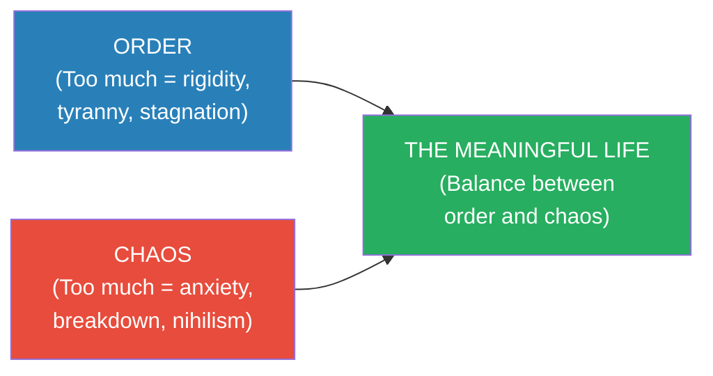

# 12 Rules for Life — Jordan Peterson

> Jordan Peterson's blockbuster self-help book is built on a simple premise: life is suffering (a claim borrowed from Buddhism and existentialism), and the antidote is not pleasure or happiness but meaning — which is found through taking responsibility, telling the truth, and imposing order on the chaos of existence.
> The twelve rules range from the concrete ("Stand up straight with your shoulders back") to the abstract ("Pursue what is meaningful, not what is expedient") and are illustrated with an eclectic blend of clinical psychology, evolutionary biology, Jungian archetypes, biblical exegesis, Dostoevsky, Nietzsche, and personal stories from Peterson's clinical practice.
> The book is polarising: admirers consider it the most important self-help book of the decade; critics consider it a conservative cultural manifesto dressed in psychological clothing. Both readings have some merit.
> What is undeniable is the book's impact: over 5 million copies sold in 50+ languages, making it one of the bestselling non-fiction books of the 2010s.
> At its core, it is an extended argument for a single idea: <b style="color: #2980b9">you are more powerful than you think, and therefore more responsible than you feel — and accepting that responsibility is the path to a meaningful life.</b>

---

## About the Author

Jordan Bernt Peterson is a Canadian clinical psychologist and professor of psychology at the University of Toronto.
He rose to international prominence in 2016 through his opposition to compelled speech legislation in Canada, which brought him a massive online following.
Before that, he was known primarily for his academic work on personality psychology, his Harvard teaching career, and his previous book *Maps of Meaning*, a dense academic exploration of mythology, religion, and the psychology of belief.
*12 Rules for Life* is the accessible, practical version of the ideas in *Maps of Meaning* — distilled for a general audience.

---

## The Big Idea

- <b style="color: #2980b9">Life is suffering — but suffering with meaning is bearable, while suffering without meaning is hell</b>
- The central tension in Peterson's worldview: Order vs Chaos
- <b style="color: #27ae60">Order</b> = structure, predictability, tradition, competence, the known world
- <b style="color: #e74c3c">Chaos</b> = unpredictability, crisis, the unknown, potential, transformation
- <b style="color: #2980b9">Meaning is found at the boundary between order and chaos</b> — enough structure to be competent, enough challenge to be growing

---

## The Twelve Rules

### Rule 1: Stand Up Straight With Your Shoulders Back

- Peterson opens with the lobster — an animal whose serotonin system mirrors the human one
- <b style="color: #2980b9">Dominant lobsters stand tall and take up space; defeated lobsters shrink and retreat</b>
- The same posture-serotonin connection exists in humans: standing tall increases serotonin, which increases confidence, which produces better outcomes, which reinforces the posture
- <b style="color: #27ae60">The rule is not just about posture — it's about choosing to face the world rather than shrink from it</b>
- "Stand up straight" = accept your vulnerability AND your strength; present yourself as someone ready to take on the challenge

> [!tip] The Connection to Gravitas
> This rule aligns directly with [[Gravitas - Caroline Goyder|Goyder's]] finding that physical posture drives internal state. Peterson arrives at the same conclusion from evolutionary biology that Goyder arrives at from voice coaching: your body affects your mind as much as your mind affects your body.

---

### Rule 2: Treat Yourself Like Someone You Are Responsible for Helping

- <b style="color: #e74c3c">People are better at giving medication to their pets than to themselves</b> — studies show patients fill pet prescriptions more reliably than their own
- Peterson argues this is because we know ourselves too well — we see our flaws, our failures, our shameful moments — and conclude we don't deserve care
- <b style="color: #27ae60">The rule: treat yourself as you would someone you care about and are responsible for</b>
- This means: take your own health seriously, set boundaries, pursue meaningful goals, and don't tolerate in yourself what you wouldn't tolerate in someone you love

---

### Rule 3: Make Friends with People Who Want the Best for You

- <b style="color: #e74c3c">Not everyone who is friendly wants the best for you</b>
- Some people befriend you because your failures make them feel better about their own
- Some keep you in a bad place because your improvement would threaten the dynamic
- <b style="color: #27ae60">Choose friends who challenge you to grow, celebrate your successes genuinely, and hold you accountable</b>
- This is the interpersonal version of Rule 1: surround yourself with people who pull you up, not drag you down

---

### Rule 4: Compare Yourself to Who You Were Yesterday, Not to Who Someone Else Is Today

- <b style="color: #2980b9">Social comparison is the thief of happiness</b> (a point made independently by Housel in [[The Psychology of Money - Morgan Housel|Psychology of Money]] and Naval in [[The Almanack of Naval Ravikant - Eric Jorgenson|Almanack]])
- There will ALWAYS be someone richer, smarter, better-looking, more successful
- <b style="color: #27ae60">The only meaningful comparison is temporal: am I better today than I was yesterday?</b>
- Peterson recommends a daily practice: each night, identify one small thing you did better than the day before. Over time, these compound.

---

### Rule 5: Do Not Let Your Children Do Anything That Makes You Dislike Them

- <b style="color: #e74c3c">Parents who fail to set boundaries produce children the world dislikes — which is a worse fate than the discomfort of discipline</b>
- Peterson argues that children NEED limits: they test boundaries not to defy authority but to discover where the safe edges of the world are
- <b style="color: #27ae60">A child without boundaries lives in chaos — and chaos is terrifying, not liberating</b>
- The rule extends beyond parenting: as a leader, don't tolerate behaviour from your team that undermines respect. Set clear, fair, consistent limits.

---

### Rule 6: Set Your House in Perfect Order Before You Criticise the World

- <b style="color: #2980b9">Before blaming the system, the government, or society, ask: is MY life in order?</b>
- Am I taking care of my health? My relationships? My responsibilities?
- <b style="color: #e74c3c">It is easier to identify flaws in the world than flaws in yourself</b> — and far less uncomfortable
- <b style="color: #27ae60">Peterson's argument: you have NO credibility to criticise the world if you haven't first addressed the things within your own control</b>
- This echoes Manson's responsibility/fault distinction (see [[The Subtle Art of Not Giving a F-ck - Mark Manson|Subtle Art]]): the world may be unfair, but YOUR response to it is YOUR responsibility

---

### Rule 7: Pursue What Is Meaningful, Not What Is Expedient

- <b style="color: #2980b9">The expedient choice feels good now but costs you later. The meaningful choice costs you now but pays dividends for years.</b>
- Peterson frames this in terms of sacrifice: meaning requires giving up something of value in the present for something of greater value in the future
- This is delayed gratification at the philosophical level — the same insight as Mischel's Marshmallow Test (see [[Emotional Intelligence - Daniel Goleman|Goleman]])
- <b style="color: #27ae60">"Meaning is the antidote to suffering — not happiness, not pleasure, not comfort, but MEANING"</b>
- This rule is the book's thesis statement: purpose trumps pleasure

> [!quote] Peterson's Central Claim
> "The purpose of life is not to be happy. It is to be meaningful. And what is meaningful is to take on as much responsibility as you can handle — to bear the weight of Being."

---

### Rule 8: Tell the Truth — Or at Least Don't Lie

- <b style="color: #e74c3c">Every lie you tell warps reality</b> — not just for the person you're lying to, but for yourself
- When you lie, you must remember the lie, maintain it, and build additional lies to support it — a growing burden that distorts your perception of reality
- <b style="color: #2980b9">The truth may hurt in the short term, but it keeps your perception calibrated</b>
- Peterson draws on Solzhenitsyn: "The line dividing good and evil cuts through the heart of every human being"
- The daily practice: before saying something, check — is this TRUE? Or is it convenient?

---

### Rule 9: Assume That the Person You Are Listening To Might Know Something You Don't

- <b style="color: #27ae60">Genuine listening is not waiting for your turn to talk — it is being genuinely open to the possibility that the other person has information or perspective you lack</b>
- Peterson describes his clinical practice: the most important skill of a therapist is LISTENING — not diagnosing, not advising, not interpreting, but truly hearing
- This connects to Goldsmith's listening habit (see [[What Got You Here Won't Get You There - Marshall Goldsmith|Goldsmith]]) and Goyder's listening-as-gravitas (see [[Gravitas - Caroline Goyder|Gravitas]])

---

### Rule 10: Be Precise in Your Speech

- <b style="color: #2980b9">Vague problems remain unsolvable. Precise problems can be addressed.</b>
- "I'm unhappy" gives you nothing to work with
- "I'm unhappy because I feel disrespected by my boss when he dismisses my ideas in meetings" gives you a specific problem to solve
- Peterson argues that much suffering persists because people refuse to name their problems precisely — because <b style="color: #e74c3c">naming the problem makes it real, and reality is frightening</b>
- But unnamed problems grow in the dark. Named problems can be confronted in the light.
- This echoes Goleman's "affect labelling" finding: naming an emotion reduces its intensity (see [[Emotional Intelligence - Daniel Goleman|Goleman]])

---

### Rule 11: Do Not Bother Children When They Are Skateboarding

- <b style="color: #2980b9">Risk-taking is essential for development</b> — children (especially boys, Peterson argues) need to test limits, face danger, and experience failure
- Overprotection produces fragility, not safety
- <b style="color: #27ae60">The skateboarding metaphor: let people push their boundaries, even when it looks dangerous</b>
- This connects to Taleb's antifragility concept (see [[Antifragile - Nassim Nicholas Taleb|Antifragile]]): systems that are protected from small stressors become fragile to large ones

---

### Rule 12: Pet a Cat When You Encounter One on the Street

- The final rule is the gentlest — and the most personal
- <b style="color: #2980b9">Peterson writes about his daughter's severe illness and the daily confrontation with suffering it brought</b>
- The rule means: <b style="color: #27ae60">in the midst of suffering, notice the small moments of beauty, connection, and grace that life offers</b>
- A cat on the street. A child's laugh. A sunset. A kind word from a stranger.
- These moments don't eliminate suffering — but they punctuate it with reminders that life contains good as well as terrible
- <b style="color: #27ae60">"If you pay careful attention, you can find such things everywhere."</b>

---

## The Twelve Rules at a Glance

| # | Rule | Core Message |
|---|------|-------------|
| 1 | Stand up straight | Face the world with courage; posture drives psychology |
| 2 | Treat yourself well | You deserve the same care you give to those you love |
| 3 | Choose good friends | Surround yourself with people who want you to grow |
| 4 | Compare to yourself | Yesterday's you is the only meaningful benchmark |
| 5 | Discipline your children | Boundaries create safety, not oppression |
| 6 | Fix yourself first | Earn the right to criticise the world |
| 7 | Pursue meaning | Sacrifice present pleasure for future purpose |
| 8 | Tell the truth | Lies warp reality; truth keeps perception calibrated |
| 9 | Listen genuinely | The other person might know something you don't |
| 10 | Be precise | Name the problem specifically or it can't be solved |
| 11 | Let people take risks | Overprotection produces fragility |
| 12 | Notice the beauty | In the midst of suffering, pay attention to what is good |

---

## The Verdict

*12 Rules for Life* is Peterson at his most accessible — and his most divisive.
The book's strength is its integration of psychology, philosophy, mythology, and personal narrative into a coherent vision of human meaning.
The twelve rules are not arbitrary — they form a progressive argument: start with your body (Rule 1), then your self-care (Rule 2), then your relationships (Rules 3-5), then your values (Rules 6-8), then your communication (Rules 9-10), then your courage (Rule 11), and finally your appreciation for life itself (Rule 12).

Peterson's greatest contribution is the meaning-over-happiness reframe: the argument that what makes suffering bearable is not the absence of pain but the presence of purpose — a claim grounded in the work of Frankl (see [[Man's Search for Meaning - Viktor Frankl|Man's Search for Meaning]]) and the Stoics (see [[Meditations - Marcus Aurelius|Meditations]]).

The book's weaknesses are well-documented: Peterson's prose can be dense and digressive (the chapter on lobsters is about 30 pages longer than it needs to be), the biblical exegesis will alienate some readers, and the political subtext — particularly around Rules 5, 6, and 11 — reads as conservative cultural commentary rather than universal psychology.

But stripped of its controversies, the core message — take responsibility, tell the truth, pursue meaning, face suffering with courage — is as timeless and as necessary as any in the self-help literature.

---

## Related Reading

- [[Man's Search for Meaning - Viktor Frankl|Man's Search for Meaning]] — Peterson explicitly builds on Frankl's meaning framework
- [[Meditations - Marcus Aurelius|Meditations]] — The Stoic acceptance and responsibility that undergirds Peterson's worldview
- [[The Subtle Art of Not Giving a F*ck - Mark Manson|The Subtle Art]] — Manson's profane, accessible version of the same responsibility message
- [[Antifragile - Nassim Nicholas Taleb|Antifragile]] — Taleb's embrace of stressors mirrors Peterson's Rule 11 (let children skateboard)
- [[Emotional Intelligence - Daniel Goleman|Emotional Intelligence]] — Goleman's self-awareness and self-regulation as the psychological mechanism behind Peterson's Rules 1-2 and 8
- [[Deep Work - Cal Newport|Deep Work]] — Newport's focus on meaningful work echoes Peterson's Rule 7 (pursue meaning, not expedience)
- [[Discourses - Epictetus|Discourses]] — The Stoic source for Peterson's dichotomy of control and responsibility emphasis
