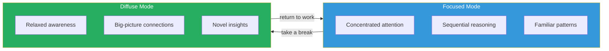
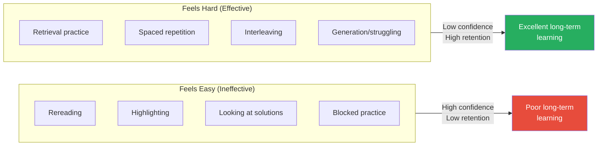
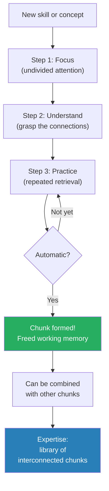
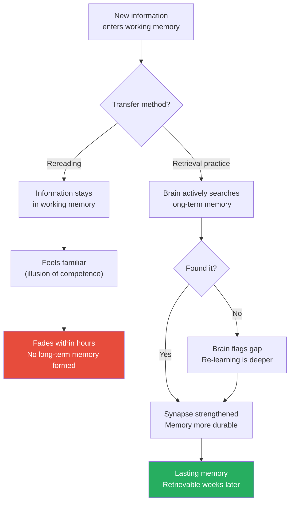
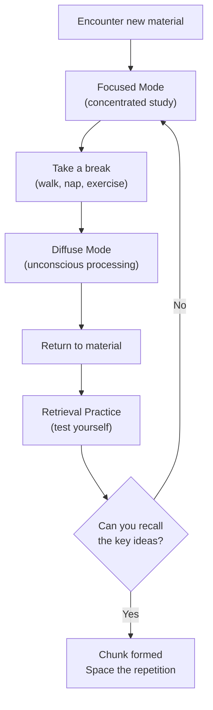
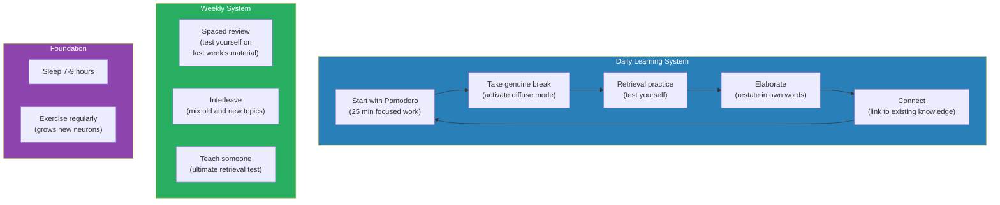
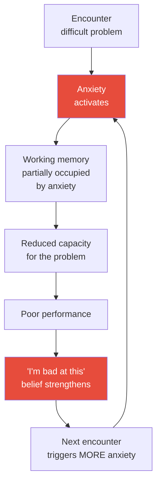

# A Mind for Numbers — Barbara Oakley

> Barbara Oakley flunked math and science all through school. She hated them. She joined the Army, learned Russian, and worked on Soviet fishing trawlers.
> Then, at age 26, she decided to retrain her brain. She went back to school, earned a degree in engineering, then a PhD, then became a professor.
> This book explains the neuroscience behind how she did it — and how anyone can learn difficult material by working with the brain's natural architecture instead of against it.
> Her Coursera course "Learning How to Learn," based on this book, became the most popular online course in the world with over 3 million students.

---

## About the Author

Barbara Oakley is Ramsey Professor of Engineering at Oakland University and a Fellow at the Institute of Electrical and Electronics Engineers.
Her path to engineering was anything but conventional. She flunked math and science throughout school, deliberately avoided both subjects, and joined the Army at 18, where she learned Russian and rose to the rank of Captain. She served on Soviet fishing trawlers in the Bering Sea as a translator and eventually taught Russian at the University of Minnesota.

At 26, she decided to retrain her brain for math and science — subjects she had believed she was "naturally bad at." She started from scratch, learning algebra, then calculus, then engineering, eventually earning a PhD in Systems Engineering. This experience — of an adult going from mathematical incompetence to mathematical fluency — gave her a researcher's curiosity about how learning actually works.

She co-teaches "Learning How to Learn" with neuroscientist Terrence Sejnowski. The course became the most popular online course in the world, with over 3 million students enrolled. The book is the extended version of that course.

> [!success] Why This Author Matters
> Most learning advice comes from people who were always good at learning. Oakley is the opposite: she was terrible at the subjects she now teaches, and she rebuilt her competence from zero using the techniques in this book. That makes her advice more credible, not less — she didn't just study learning science, she lived it.

---

## The 30-Second Version

If you have 30 seconds:

1. **Your brain has two modes** — focused (concentrated, sequential) and diffuse (relaxed, creative). You need both.
2. **Take breaks.** The break is not a reward for hard work — it IS part of the learning process. Diffuse mode only activates when you step away.
3. **Test yourself, don't reread.** Retrieval practice is the most effective study technique. Rereading is the most popular and least effective.
4. **Space your practice.** Cramming works for tomorrow. Spacing works for life.
5. **Mix it up.** Interleaving (mixing problem types) beats blocked practice (doing 20 of the same type).
6. **Build chunks.** Compress complex procedures into automatic units through focused practice + understanding + repetition.
7. **Use the Pomodoro Technique.** 25 minutes focused, 5 minutes off. Commit to the process, not the product.

If you have 60 seconds more:

8. **Sleep is non-negotiable.** Your brain consolidates memories during sleep and cleans out metabolic waste. Skip sleep and you skip learning.
9. **Exercise boosts learning.** A 20-minute walk before studying produces better results than spending those 20 minutes studying.
10. **Struggle is the feeling of learning happening.** If it feels easy, you're not growing. Embrace productive discomfort.
11. **Watch for the illusion of competence.** Recognising something (rereading) is not the same as knowing it (retrieval from memory). The only reliable test: can you explain it from memory, without looking?
12. **Anyone can learn anything.** Oakley went from failing math to a PhD in engineering. Method matters more than talent. Always.

> [!danger] The Single Most Important Takeaway
> If you take only ONE idea from this entire book, take this: <b style="color: #e74c3c">after reading or studying anything, close the material and write down what you remember. That act — retrieval from memory — is more valuable than all the rereading, highlighting, and note-copying in the world combined.</b> It takes 5 minutes. It converts exposure into learning. And almost nobody does it.

---

## The Big Idea

- <b style="color: #2980b9">Your brain has two fundamentally different thinking modes — Focused and Diffuse — and effective learning requires alternating between both</b>
- Most students over-rely on focused mode and never activate diffuse mode, which is where creative connections and breakthrough insights happen
- <b style="color: #27ae60">The single most effective study technique is retrieval practice (testing yourself), not rereading or highlighting</b>
- The brain is not a fixed machine — it is an adaptive organ that physically changes in response to how you use it
- Anyone can learn anything difficult, provided they use the right techniques consistently

### The Central Metaphor: The Pinball Machine

Oakley uses a pinball machine to explain the two modes:

- **Focused mode** = bumpers close together. The ball follows tight, familiar paths. Great for working through known procedures, calculations, and logical sequences. This is the mode most people default to.
- **Diffuse mode** = bumpers far apart. The ball bounces widely, making unexpected connections. Great for creative insights, big-picture thinking, and solving problems where the familiar approach doesn't work. This mode activates when you step away from the problem.

<b style="color: #e74c3c">You cannot be in both modes simultaneously.</b> They are mutually exclusive, like a coin showing heads or tails. Effective learning requires deliberately switching between them.

> [!warning] The Fatal Mistake
> Most learners stay in focused mode until they're frustrated, then quit. They never activate diffuse mode because they never take genuine breaks — they switch from studying to scrolling social media, which is still "focused" activity (just focused on the wrong thing). A genuine break means: walking, showering, exercising, cooking, or napping. Something that lets the mind wander freely. THAT is when diffuse mode activates and solves the problem that focused mode couldn't crack.

---

## The Learning Myth vs The Learning Reality

| The Myth | The Reality |
|----------|-----------|
| "Some people are born smart" | Intelligence is not fixed — the brain physically changes with practice |
| "The best students study the longest" | The best students study the smartest — technique matters more than hours |
| "Rereading is studying" | Rereading is exposure. Retrieval practice is studying. |
| "Highlighting helps you remember" | Highlighting creates an illusion of familiarity without any actual memory formation |
| "If I understand it in class, I've learned it" | Understanding ≠ memory. You must practise retrieval to convert understanding into durable knowledge. |
| "I'm not a math person" | There is no math gene. There is only practice — the right kind, applied consistently. |
| "Cramming works" | Cramming works for tomorrow's test. Spacing works for the rest of your life. |
| "I should study until I get it right" | Study until you can't get it wrong. Getting it right once is not mastery. |
| "Breaks are wasted time" | Breaks activate diffuse mode — the mode where breakthrough insights happen |
| "Struggling means I'm stupid" | Struggling means you're learning. The brain only grows when challenged beyond its current capacity. |

> [!success] The Most Important Row
> "Struggling means I'm stupid" vs "Struggling means you're learning" is the single most important mindset shift in the entire book. <b style="color: #27ae60">If you're not struggling, you're not learning. Struggle is the feeling of neural pathways being built. It is uncomfortable and necessary. The moment you reframe struggle from "I can't do this" to "this is my brain growing," everything changes.</b>

---

## Key Concepts at a Glance

| Concept | What It Means | Common Mistake | Evidence Strength |
|---------|---------------|----------------|------------------|
| **Focused Mode** | Tight, sequential concentration on familiar patterns | Staying in it too long without breaks | Very strong (decades of neuroscience) |
| **Diffuse Mode** | Relaxed, wide-ranging processing that finds novel connections | Never activating it (no breaks, no walks, no sleep) | Very strong |
| **Chunking** | Compressing multiple pieces of info into one retrievable unit | Trying to memorise without understanding | Very strong |
| **Pomodoro Technique** | 25 min focused + 5 min break; commit to process, not product | Skipping the break (the break IS the method) | Moderate (practical, not formally studied) |
| **Illusions of Competence** | Rereading/highlighting feels productive but produces little learning | Confusing familiarity with mastery | Very strong (Karpicke et al.) |
| **Spaced Repetition** | Distributing practice over time beats cramming by orders of magnitude | Massed practice the night before | Very strong (Ebbinghaus, Cepeda et al.) |
| **Interleaving** | Mixing different problem types builds flexible knowledge | Blocked practice (doing 20 of the same problem) | Strong (Rohrer & Taylor) |
| **Einstellung Effect** | An existing mental pattern blocks you from seeing a better solution | Not stepping back to check if you're in a rut | Moderate |
| **Retrieval Practice** | Testing yourself strengthens memory more than any other technique | Avoiding self-testing because it feels harder | Very strong (Roediger & Karpicke) |
| **Desirable Difficulty** | Harder-feeling study produces better long-term retention | Choosing easy, comfortable study methods | Strong (Bjork & Bjork) |

---

## Desirable Difficulties: Why Harder Feels Better (Eventually)

Psychologists Robert and Elizabeth Bjork coined the term "desirable difficulty" to describe study conditions that feel harder in the moment but produce better long-term learning.

Oakley builds on their research throughout the book:

| Desirable Difficulty | Why It Feels Hard | Why It Works |
|---------------------|-------------------|-------------|
| **Retrieval practice** | You fail. You struggle. You feel stupid. | Every retrieval attempt strengthens the neural pathway, even when you get it wrong. |
| **Spacing** | You forget between sessions and have to re-learn. | Forgetting and re-learning is more effective than never forgetting. The re-learning builds stronger memory traces. |
| **Interleaving** | You feel confused switching between topics. | The confusion forces deeper processing: you must identify which strategy applies, not just execute one. |
| **Generation** | Attempting to solve a problem before seeing the answer is frustrating. | The attempt creates a "scaffold" that makes the answer more memorable when you finally see it. |
| **Variation** | Practising in different contexts feels disorienting. | Context-independent knowledge transfers better to new situations. |

> [!danger] The Fluency Illusion
> Desirable difficulties are resisted because learners use "fluency" — how easily something comes to mind — as a proxy for how well they've learned it. Material studied through rereading feels fluent (easy to recognise). Material studied through retrieval feels disfluent (hard to recall). <b style="color: #e74c3c">Learners choose rereading because it feels better. But the feeling is a trap: what feels easiest to recall now is not what you'll remember in a month. What feels hardest to recall now IS.</b>

### The Paradox of Effective Studying

The most effective study techniques feel worse in the moment:

> [!success] The Key Insight
> <b style="color: #27ae60">If studying feels easy, you're probably not learning. If studying feels hard, you probably are.</b> This single insight — that productive discomfort is the feeling of learning happening — is worth the entire book. Embrace the difficulty. It is not a sign of failure. It is the sound of your brain growing.

---

## Core Teachings

### The Two Modes of Thinking

This is the foundational concept of the book. The brain operates like a pinball machine. In focused mode, the bumpers are close together — the ball follows tight, familiar paths. This is great for working through known procedures. In diffuse mode, the bumpers are far apart — the ball bounces widely, making unexpected connections. This is where creative leaps happen.

Thomas Edison understood this intuitively. He would nap in his chair holding ball bearings. As he drifted into diffuse mode, his hand relaxed, the bearings dropped, and the clatter woke him — often with a fresh idea.
Salvador Dalí used the same technique with a key.

> [!example] The Two Modes in Real Life
> You're working on a difficult problem at your desk. You've been staring at it for an hour. Nothing. You go for a walk, take a shower, or start cooking dinner. Suddenly — the answer appears. This is not coincidence. It is your brain switching from focused to diffuse mode. The focused mode defined the problem; the diffuse mode found the solution by connecting it to patterns outside your conscious awareness.

| Feature | Focused Mode | Diffuse Mode |
|---------|-------------|-------------|
| **Attention** | Tight, concentrated | Relaxed, wandering |
| **Thinking style** | Sequential, logical | Associative, creative |
| **Best for** | Working through known procedures | Making novel connections |
| **Activated by** | Deliberate concentration | Stepping away (walks, naps, showers) |
| **Risk** | Tunnel vision (Einstellung Effect) | Inability to execute on details |
| **Feels like** | Effort | Daydreaming |

> [!warning] The Einstellung Effect
> The Einstellung Effect is what happens when focused mode becomes a trap. Your brain gets locked into a familiar approach — an existing pattern — and cannot see a better solution that requires a different starting point. <b style="color: #e74c3c">The more expert you are, the more susceptible you become: your rich mental patterns are an asset when they're right and a prison when they're wrong.</b> The cure is to deliberately break focus: step away, switch tasks, or sleep on it. Diffuse mode can see past the pattern that focused mode is stuck inside.

### Chunking — The Building Blocks of Expertise

A chunk is a network of neurons that fire together because they've been practised together. When you first learn to drive, you're overwhelmed by steering, pedals, mirrors, and traffic simultaneously. After practice, "driving" becomes a single chunk — one mental unit freeing attention for conversation or navigation.

Building chunks requires three steps:
1. **Focused attention** — You must concentrate fully while forming the chunk
2. **Understanding** — You must grasp WHY each step connects to the next
3. **Practice** — Repetition wires the neurons together until the chunk is automatic

> [!tip] The Three Steps of Chunk Formation
> Think of learning a guitar chord:
> 1. **Focus:** Concentrate on where each finger goes, the angle of the wrist, the pressure required
> 2. **Understand:** Know WHY these fingers on these frets produce this sound
> 3. **Practice:** Repeat until the chord change happens without conscious thought
> Skip step 1 and the chunk won't form. Skip step 2 and you'll memorise without understanding. Skip step 3 and the chunk won't become automatic. All three are necessary.

### The Pomodoro Technique — Fighting Procrastination

Set a timer for 25 minutes. Work with full focus. When the timer rings, stop and take a 5-minute break. The break is not optional — it activates diffuse mode.

<b style="color: #2980b9">The genius of the Pomodoro is that it fights procrastination by committing to a process (25 minutes of effort) rather than a product (finish the chapter). Process commitments are non-threatening; product commitments trigger anxiety.</b>

> [!example] Why Procrastination Happens
> Oakley explains that procrastination is not a character flaw — it is a neurological response. When you think about a task you find unpleasant, the brain's insular cortex (the pain centre) activates. You experience literal discomfort. Your brain, seeking to avoid the pain, redirects your attention to something more pleasant — social media, snacking, reorganising your desk. The Pomodoro works because it reframes the commitment: you're not committing to "do this unpleasant thing until it's done." You're committing to "sit with this for 25 minutes." The pain centre calms down because the commitment is small and time-limited.

| Procrastination Pattern | Why It Happens | Pomodoro Solution |
|------------------------|----------------|-------------------|
| "I'll start after I check my email" | Brain avoids anticipated pain | Commit to 25 minutes — just start |
| "I need to feel inspired first" | Waiting for motivation that rarely comes | Motivation follows action, not the reverse |
| "This is too hard, I'll do it later" | Overwhelm from product-focus | Focus on process (25 min of effort) not product (finish the task) |
| "I work better under pressure" | Self-deception based on adrenaline, not quality | Spaced sessions produce better work than deadline panic |

### Illusions of Competence — The Biggest Learning Trap

This section should be required reading for every student, professional, and self-directed learner.

- Rereading a textbook chapter makes the material feel familiar, but <b style="color: #e74c3c">familiarity is not understanding</b>
- Highlighting gives the feeling of active engagement while the brain remains passive
- Looking at a solution and thinking "I get it" is NOT the same as being able to produce the solution yourself
- <b style="color: #27ae60">The fix: close the book and try to recall the main ideas. If you can't, you haven't learned them. Retrieval practice — not rereading — is what builds lasting memory.</b>

> [!danger] The Rereading Trap
> Studies by cognitive psychologist Jeffrey Karpicke showed that students who reread passages believed they had learned the material better than students who practised retrieval (testing themselves). But on actual tests, the retrieval group dramatically outperformed the rereading group. The most popular study method is the least effective. The least popular method is the most effective. This is one of the most important findings in learning science.

| Feels Effective But Isn't | Actually Effective |
|--------------------------|-------------------|
| Rereading | Retrieval practice (testing yourself) |
| Highlighting | Writing summaries from memory |
| Reviewing notes | Teaching the material to someone else |
| Watching video lectures passively | Pausing videos to predict what comes next |
| Reading solutions | Attempting problems before looking at answers |

### Spaced Repetition and Interleaving

**Spaced Repetition:** Practising a skill once and moving on is like watering a plant once and expecting it to grow. Memory consolidation requires repeated retrieval over increasing intervals — today, tomorrow, next week, next month. Cramming works for the exam and fails for life. Spacing works for both.

**Interleaving:** Students who practise one type of problem 20 times in a row (blocked practice) feel confident but perform poorly on tests with mixed problem types. Students who mix problem types during practice (interleaving) feel less confident but perform dramatically better.

<b style="color: #27ae60">Interleaving forces your brain to identify which strategy applies to which problem — the skill that actually matters on exams and in life.</b>

> [!tip] The Spacing Schedule
> After learning something new:
> - Review within 24 hours (prevents initial forgetting)
> - Review again after 3 days
> - Review again after 1 week
> - Review again after 2 weeks
> - Review again after 1 month
> Each review should be RETRIEVAL (trying to recall), not rereading. If you can recall it after a month, it's likely consolidated into long-term memory.

### Sleep and Learning

Oakley devotes significant attention to sleep — not as a lifestyle recommendation but as a learning technique.

- During sleep, the brain replays and consolidates what you learned during the day
- <b style="color: #2980b9">The brain also cleans out metabolic waste products (via the glymphatic system) that accumulate during waking hours and impair cognitive function</b>
- Studying before sleep is particularly effective because the brain processes the material during the night
- Sleep deprivation doesn't just make you tired — it physically prevents memory consolidation

> [!warning] The All-Nighter Myth
> Students who pull all-nighters before exams perform worse than students who study half as much but sleep normally. The cramming produces short-term familiarity (enough to feel prepared) but prevents consolidation (the process that makes knowledge stick). If you must choose between studying more and sleeping more, choose sleep.

### Metaphor and Analogy as Learning Tools

Oakley argues that metaphors and analogies are not just literary devices — they are powerful learning tools that help the brain form connections between new material and existing knowledge.

- "Electricity flows like water through a pipe" — this analogy has taught more people about circuits than any textbook explanation
- "Chunks are like Lego bricks" — small, modular units that can be combined into any structure
- <b style="color: #27ae60">The brain learns by connecting new information to existing patterns. Metaphors provide the bridge.</b>

> [!tip] The Metaphor Practice
> When learning something new, ask: "What is this like? What do I already know that works the same way?" If you can find a metaphor — even an imperfect one — you've created a neural bridge between the new material and your existing knowledge. That bridge makes the new material much easier to remember and apply.

---

## The Neuroscience of Memory: Why These Techniques Work

Oakley grounds all of her advice in neuroscience. Understanding the brain mechanisms makes you more likely to actually use the techniques.

### Working Memory vs Long-Term Memory

Your brain has two memory systems:

| System | Capacity | Duration | Analogy |
|--------|----------|----------|---------|
| **Working memory** | ~4 items at once | Seconds | A blackboard you keep erasing |
| **Long-term memory** | Virtually unlimited | Days to decades | A warehouse with billions of shelves |

- <b style="color: #2980b9">Learning is the process of moving information from working memory into long-term memory — and the process requires active effort, not passive exposure</b>
- Rereading keeps information in working memory temporarily but doesn't transfer it to long-term memory
- Retrieval practice forces the brain to retrieve from long-term memory, strengthening the neural pathway each time

### The Role of Sleep

Sleep is not downtime. It is the brain's consolidation and cleanup phase.

- During sleep, the brain replays and consolidates what you learned during the day
- The glymphatic system flushes out metabolic waste products that accumulate during waking hours
- <b style="color: #e74c3c">Sleep deprivation doesn't just make you tired — it physically prevents memory consolidation. You cannot learn effectively without adequate sleep.</b>
- Studying before sleep is particularly effective because the brain processes the material overnight

> [!danger] The All-Nighter Verdict
> Students who pull all-nighters before exams perform worse than students who study half as much but sleep normally. The cramming produces short-term familiarity (enough to feel prepared) but prevents consolidation (the process that makes knowledge stick). Oakley is emphatic: if you must choose between studying more and sleeping more, choose sleep. Always.

### Synaptic Strengthening

Every time you successfully retrieve a memory, the synaptic connections involved become stronger. Every time you fail to retrieve (and then re-learn), the connections form in new, more robust patterns. This is why testing yourself is so much more effective than rereading:

---

## Deep Dive: Procrastination and the Zombie Mode

Oakley devotes more attention to procrastination than any other topic in the book — because it is the single biggest barrier to effective learning.

### The Four Components of a Habit

Oakley deconstructs procrastination as a habit with four components:

1. **The Cue** — A trigger that launches the habitual response (e.g., seeing your textbook on the desk)
2. **The Routine** — The automatic behavioural response (e.g., picking up your phone instead)
3. **The Reward** — The pleasure that reinforces the habit (e.g., the dopamine hit from social media)
4. **The Belief** — The underlying story ("I work better under pressure" / "I'm just not disciplined")

> [!tip] Breaking Procrastination at Each Level
> - **Cue:** Remove temptation. Put your phone in another room. Close irrelevant browser tabs. Create a distraction-free environment.
> - **Routine:** Replace the avoidance routine with a productive one. When you feel the urge to check your phone, start a Pomodoro instead.
> - **Reward:** Give yourself a genuine reward after focused work — a walk, a snack, a conversation. The reward must come AFTER the work, not instead of it.
> - **Belief:** Replace "I work better under pressure" with "Spaced practice produces better outcomes than cramming." Replace "I'm not disciplined" with "I have a system for managing my attention."

### The Process vs Product Mindset

This is one of the most actionable insights in the entire book:

- **Product focus:** "I need to finish this chapter" → triggers anxiety → triggers avoidance
- **Process focus:** "I will work for 25 minutes" → non-threatening → easy to start

<b style="color: #27ae60">When you focus on process, you remove the anxiety of the outcome. The Pomodoro timer IS the process. You don't have to finish anything — you just have to show up for 25 minutes. And once you've started, momentum often carries you forward.</b>

| Product Mindset | Process Mindset |
|----------------|----------------|
| "I need to write 2,000 words" | "I will write for 45 minutes" |
| "I need to understand this chapter" | "I will read and take notes for 30 minutes" |
| "I need to solve this problem" | "I will work on this problem for 25 minutes" |
| "I need to master this skill" | "I will practise for 20 minutes with full attention" |

---

## Learning for Professionals: Beyond the Classroom

Oakley's techniques are not just for students. They apply to any professional learning a new skill.

### For Knowledge Workers

- **Meetings are not learning.** Sitting in a meeting and hearing information is passive exposure. To learn from a meeting, write down the key ideas afterward — from memory.
- **Reading reports is not learning.** Highlighting a quarterly report creates an illusion of competence. The test: close the report and explain the three most important findings from memory.
- **Experience is not automatically learning.** Doing your job every day is naive practice. To improve, you must identify specific weaknesses, design exercises that target them, and get feedback.

### For People Learning a New Role

> [!example] The New Manager's Learning Plan (Using Oakley's Techniques)
> 1. **Week 1:** Spend focused time learning the team, the processes, and the culture (focused mode). Then take breaks and let the patterns emerge (diffuse mode).
> 2. **Daily:** After each meeting, spend 5 minutes writing what you learned — from memory (retrieval practice).
> 3. **Weekly:** Review your week's notes. What patterns are you seeing? What questions do you have? (Spaced repetition + elaboration)
> 4. **Monthly:** Teach what you've learned to someone else — a peer, a mentor, or even a journal (the ultimate retrieval practice).

### For People Changing Careers

Oakley's own story is the template: she went from Army linguist to engineering professor. Her advice for career changers:

1. <b style="color: #2980b9">Accept that you will be bad at the new thing. That discomfort is the feeling of your brain forming new neural pathways. It is not a sign that you can't do it.</b>
2. Use interleaving: study the new field alongside your existing expertise. The cross-connections will be your competitive advantage.
3. Find a mentor who can guide your deliberate practice — someone who knows the field's training methods.
4. Be patient. Chunks take time to form. The first six months will be frustrating. The next six will be rewarding.

---

## The 10 Commandments of Bad Studying (What NOT to Do)

Oakley includes a "bad studying" checklist that is as valuable as the good one:

1. **Passive rereading** — Sitting with the book open, eyes moving across the page, brain disengaged
2. **Highlighting without processing** — Colouring sentences yellow does not move them into your brain
3. **Glancing at solutions** — Looking at an answer and thinking "I get it" is NOT the same as producing the answer yourself
4. **Waiting until the last minute** — Cramming eliminates spacing, the most powerful memory technique
5. **Studying in the same way over and over** — If your method isn't working, doing more of it won't help
6. **Studying with friends who are also procrastinating** — Social studying is only useful if you're actually testing each other
7. **Not reading the textbook before class** — If you hear a concept for the first time in lecture, you're starting from zero instead of from primed familiarity
8. **Not checking with the professor or TA** — Asking for help is not a sign of weakness; it is the fastest way to get feedback
9. **Thinking you can learn deeply while multitasking** — Every task switch costs you 15-25 minutes of refocusing time
10. **Not getting enough sleep** — This is #10 but should be #1. Without sleep, none of the other techniques work.

> [!warning] The Most Common Study Mistake
> The single most common mistake students make is: rereading highlighted passages and feeling confident they've learned the material. This is the illusion of competence in its purest form. The highlight looks familiar → the brain interprets familiarity as understanding → the student feels prepared → the exam reveals they are not. <b style="color: #e74c3c">The fix is brutally simple: close the book, turn over the notes, and try to recall what you just read. If you can't, you haven't learned it.</b>

---

## Before and After: Studying With and Without These Techniques

### Without A Mind for Numbers

You have an exam in two weeks. You read the textbook chapters once, highlighting as you go. You feel good — the highlights make the material look manageable. A week later, you reread your highlights. Everything looks familiar. You feel prepared. The night before the exam, you reread one more time. During the exam, you recognise the concepts but can't apply them. You get a C+ and feel confused — you "knew the material."

### With A Mind for Numbers

You have an exam in two weeks. You read the textbook, taking brief notes in your own words as you go (elaboration). After each section, you close the book and try to recall the key ideas (retrieval practice). The next day, you test yourself again — what do you remember? (Spaced repetition.) Over the next two weeks, you alternate between different topics and problem types (interleaving), using Pomodoro sessions for focused work and taking breaks to activate diffuse mode. The night before the exam, you sleep well — because you've been learning all along, not just exposing yourself to text. During the exam, you can not only recognise the concepts but apply them to novel problems. You get an A and feel confident — because you actually learned the material.

---

## The Learning Process

### The Complete Learning Cycle — Expanded

Oakley's learning process is not linear — it is a cycle with multiple loops. Here is the full version:

1. **Encounter** — Read, listen, or observe. This is the beginning, not the end.
2. **Focus** — Engage with the material using full attention. No multitasking. No phone.
3. **Struggle** — Attempt to solve problems BEFORE looking at solutions. The struggle is where learning happens. Looking at the answer first creates an illusion of competence.
4. **Break** — Step away. Walk, exercise, nap, shower. Activate diffuse mode.
5. **Connect** — When you return, notice what new connections have formed. The diffuse mode processed what focused mode couldn't solve.
6. **Retrieve** — Test yourself. Close the book. Try to recall. Write from memory. This is the most powerful step.
7. **Space** — Wait a day. Test yourself again. Wait a week. Test again. Each retrieval strengthens the memory.
8. **Interleave** — Mix this material with other topics. Practise identifying WHICH approach to use, not just how to use it.
9. **Teach** — Explain the concept to someone else. If you can't teach it clearly, you don't fully understand it.

> [!success] The Teaching Test
> Richard Feynman, the Nobel Prize-winning physicist, used what's now called the "Feynman Technique": to test whether you understand something, try to explain it in simple terms as if teaching a child. If you can't, you have gaps in your understanding. Find the gaps. Fill them. Try again. When you can explain it simply, you understand it deeply.

---

## Deep Dive: The Einstellung Effect

The Einstellung Effect deserves its own section because it is the most counterintuitive concept in the book — and one of the most practically important.

### What Is It?

"Einstellung" is German for "setting" or "installation." The Einstellung Effect occurs when an existing mental pattern — a chunk you've already formed — blocks you from seeing a better solution.

- A chess player who has memorised a winning pattern may apply it even when a simpler, better move is available — because the familiar pattern fires first and captures their attention
- A programmer who knows one approach to a problem may spend hours making it work when a completely different approach would take minutes
- <b style="color: #e74c3c">Expertise creates mental ruts. The more experienced you are, the more deeply the ruts are carved, and the harder it is to see outside them.</b>

### How to Break Free

1. **Take a break.** Diffuse mode can see past the rut that focused mode is stuck inside.
2. **Ask someone with different expertise.** They don't have your ruts — they'll see the problem from a different angle.
3. **Start from scratch.** Literally. Close your work and begin the problem again from zero. The second approach will often be different from the first.
4. **Use the "rubber duck" method.** Explain your approach to an inanimate object (or a patient friend). The act of explaining often reveals the assumption you're trapped inside.

> [!example] The Einstellung Effect in Real Life
> You've been trying to fix a bug in your code for two hours. You're convinced the problem is in Function A. You've checked every line of Function A multiple times. Finally, a colleague walks by, glances at your screen, and says: "Isn't the problem in Function B?" They were right. You were so locked into your initial hypothesis (the problem is in Function A) that you literally could not see the actual problem. This is the Einstellung Effect: your existing mental set blocked the correct solution from entering awareness.

---

## Transfer of Learning: Beyond the Classroom

One of the most valuable sections of the book addresses transfer — the ability to apply what you've learned in one context to a completely different context.

### Why Transfer Is Hard

Most people learn things in one context and cannot apply them in another. You learn negotiation principles in a book, then fail to use them in an actual negotiation. You learn project management in a course, then revert to old habits at work.

- <b style="color: #2980b9">Transfer fails because most learning is context-dependent — the knowledge is stored with its original context and only activates when that context reappears</b>
- The fix: learn the same principle in MULTIPLE contexts. If you learn negotiation from Chris Voss, from Dale Carnegie, AND from your own experience, the principle becomes context-independent.

### Techniques for Improving Transfer

1. **Interleaving** — Mix different problem types during practice. This forces your brain to identify which approach applies, building transfer-ready knowledge.
2. **Elaboration** — Restate ideas in your own words and connect them to other knowledge. The more connections a piece of knowledge has, the more contexts can trigger it.
3. **Metaphor and analogy** — Finding what a new concept is "like" creates bridges to existing knowledge, making transfer automatic.
4. **Varied practice environments** — Study in different locations, at different times, under different conditions. This prevents context-dependent memory.

> [!tip] The Transfer Practice
> After learning any new concept, immediately ask:
> - Where else does this apply?
> - What existing knowledge does this connect to?
> - Can I find three different contexts where this principle is relevant?
> If you can connect the concept to three different domains, you have created transfer-ready knowledge that will activate in situations far beyond the original learning context.

---

## The Oakley Learning Toolkit: Complete Reference

| Technique | What It Is | When to Use It | Time Required |
|-----------|-----------|----------------|--------------|
| **Pomodoro** | 25 min focused + 5 min break | When starting any study session | 30 min per cycle |
| **Retrieval Practice** | Test yourself from memory | After reading anything important | 5 min per topic |
| **Spaced Repetition** | Review at increasing intervals | After initial learning (1 day, 3 days, 1 week, 1 month) | 5-10 min per review |
| **Interleaving** | Mix different problem types | During practice sessions | Built into existing practice time |
| **Elaboration** | Restate in your own words | When processing notes or summaries | 10 min per concept |
| **Chunking** | Focus → Understand → Practice | When learning any new procedure | Varies (hours to weeks) |
| **Metaphor/Analogy** | Connect new ideas to familiar ones | When encountering unfamiliar concepts | 2-5 min per concept |
| **Focused/Diffuse Alternation** | Work hard, then step away | Throughout every study session | Built into breaks |
| **Sleep** | Prioritise 7-9 hours | Every night | 7-9 hours |
| **Teaching** | Explain to someone else | After reaching basic understanding | 15-30 min per topic |

---

## Common Questions About These Techniques

### "How long should I study before taking a break?"

Oakley recommends Pomodoro intervals: 25 minutes on, 5 minutes off. For very difficult material, even shorter focused bursts (15-20 minutes) may be appropriate. The key is: <b style="color: #27ae60">the break is not optional. It is not a reward for hard work. It IS part of the learning process.</b>

### "Is it okay to study with music?"

It depends. Music without lyrics (classical, ambient) may help some people maintain focus. Music with lyrics competes with the language-processing parts of your brain and impairs learning. The test: if you can't remember what the music was playing, it was probably background enough to be helpful. If you were singing along, it was competing with your study.

### "What about speed reading?"

Oakley is sceptical. Speed reading sacrifices the very thing that makes reading valuable: deep processing. You can scan faster, but you learn less. For learning-oriented reading, she recommends: read at normal speed, pause to think, take notes from memory, and test yourself after each section.

### "How do I know if I really understand something?"

Three tests:
1. Can you explain it in your own words without looking at the source?
2. Can you apply it to a new problem you haven't seen before?
3. Can you teach it to someone else in a way they can understand?

If you pass all three, you understand it. If you fail any of them, you have an illusion of competence.

### "What if I'm just not a 'math person'?"

This is the question Oakley wrote the entire book to answer. She spent years believing she was "not a math person." She was wrong. There is no math gene. There is only practice — the right kind, applied consistently. <b style="color: #e74c3c">If you are "not a math person," it means you have not yet done enough deliberate practice in mathematics. That is a description of your current state, not of your permanent nature.</b>

---

## The Limitations

1. **The title limits the audience.** Many non-STEM readers never pick up this book because they think it's about math. It's not — it's about learning anything. A better title might have been "How to Learn Anything."

2. **Some advice is school-specific.** Tips about office hours, study groups, and exam preparation don't translate directly to self-directed adult learning. Professional learners will need to adapt the techniques.

3. **The writing is occasionally textbook-like.** Oakley's academic background shows in some passages that read more like course notes than compelling prose.

4. **Limited depth on motivation.** The book explains WHAT to do but doesn't fully address the motivational challenge of doing it consistently. For that, pair with [[Mindset - Carol S. Dweck|Mindset]] (believing you can improve) and [[Deep Work - Cal Newport|Deep Work]] (creating the environment for focused practice).

5. **No discussion of social learning.** Oakley focuses almost entirely on individual study techniques. Learning from conversations, debates, and collaboration — which research shows is highly effective — receives minimal attention.

> [!warning] The Motivation Problem
> The book's biggest gap is motivation. Oakley explains what to do with scientific rigour. She does not adequately address the hardest question: how do you make yourself do it consistently? The techniques work — but only if you use them. For the motivational component, pair with [[Mindset - Carol S. Dweck|Mindset]] (the belief that effort leads to growth), [[Deep Work - Cal Newport|Deep Work]] (designing your environment for focus), and [[The Subtle Art of Not Giving a F-ck - Mark Manson|The Subtle Art]] (choosing which skills are worth the pain of deliberate practice).

---

## How This Book Changed How I Think About Learning

This section is written from the perspective of someone who has applied Oakley's techniques:

**Before:** I read books and highlighted passages. I reread my highlights before meetings. I felt like I knew the material. When challenged, I couldn't explain it.

**After:** I read books and take brief notes in my own words. After each chapter, I close the book and write what I remember. I review those notes a week later, then a month later. When challenged, I can explain the ideas clearly — because I've practised retrieval, not recognition.

**Before:** I studied new skills by watching videos and following tutorials. I felt competent. When faced with a novel problem, I was lost.

**After:** I study by attempting problems BEFORE watching the solution. I interleave different types of challenges. I struggle more in the moment — but I can apply what I've learned to novel situations.

**Before:** I felt guilty about taking breaks. I thought productive people worked continuously.

**After:** I take breaks deliberately, knowing that diffuse mode is processing what focused mode couldn't solve. My breaks are not laziness — they are learning infrastructure.

> [!success] The Ultimate Validation
> The techniques in this book are used by virtually every top performer across domains — from medical students to chess grandmasters to professional athletes to military pilots. They are not opinions. They are the consensus findings of cognitive science, applied to practical learning. If you use them, you will learn faster, retain more, and develop deeper expertise than you would with any other approach. The only question is whether you will do the work.

---

## The Verdict

*A Mind for Numbers* is misleadingly titled — it is not about math. It is about how the brain learns anything difficult: a language, an instrument, a profession, a sport. The techniques are grounded in decades of cognitive neuroscience and distilled into immediately actionable advice.

If you have ever struggled with learning something hard and concluded "I'm just not smart enough," this book will change your mind. Oakley is living proof that the right methods matter more than innate talent.

The book is particularly valuable because it doesn't just tell you what to do — it explains the neuroscience behind why each technique works. When you understand WHY retrieval practice beats rereading (it strengthens neural pathways rather than creating surface familiarity), you're more likely to actually do it. When you understand WHY breaks help (diffuse mode processes what focused mode couldn't solve), you stop feeling guilty about stepping away.

The main weakness is the book's structure — it's somewhat repetitive, and the tips for studying math and science specifically don't always translate to other domains. But the core principles — focused/diffuse modes, chunking, retrieval practice, spaced repetition, interleaving — are universal learning science. They apply to learning a language, mastering a musical instrument, developing professional expertise, or absorbing the contents of any non-fiction book.

This is one of those rare books where the return on investment is nearly infinite: the techniques apply to everything you will ever learn, for the rest of your life.

---

## Expert Learners vs Novice Learners

| Behaviour | Novice Learner | Expert Learner |
|-----------|---------------|---------------|
| **First encounter with material** | Reads passively, highlights | Takes brief notes in own words, pauses to think |
| **After reading a chapter** | Moves to the next chapter | Closes the book and tries to recall key ideas |
| **Practice problems** | Looks at the solution first, then tries | Attempts the problem first, THEN checks the solution |
| **Study schedule** | Crams the night before | Spaces practice over weeks |
| **Breaks** | Feels guilty about breaks; avoids them | Takes deliberate breaks to activate diffuse mode |
| **Struggling** | Interprets as "I'm stupid" | Interprets as "I'm learning" |
| **Variety** | Does 20 problems of the same type | Mixes different problem types (interleaves) |
| **Sleep** | Sacrifices sleep for more study time | Protects sleep as a non-negotiable learning tool |
| **Teaching** | Avoids explaining to others | Actively seeks opportunities to teach |
| **Mistakes** | Feels shame; avoids repeating | Analyses errors; designs practice to target weaknesses |

> [!tip] The Expert Learner's Secret
> The difference between novice and expert learners is not intelligence — it is metacognition: awareness of how you learn and the ability to choose strategies deliberately. Expert learners know WHEN to use focused mode, WHEN to switch to diffuse, WHEN to test themselves, and WHEN to space their practice. This metacognitive ability is itself a skill — and it can be learned. That is what this book teaches.

---

## Oakley's Techniques Applied to Reading Non-Fiction Books

For readers of this Obsidian vault, here is how to apply Oakley's techniques specifically to reading non-fiction:

### Before Reading
- **Set an intention:** "What do I want to learn from this book?" (Activates focused mode)
- **Skim the table of contents and chapter summaries** (Creates a big-picture schema for diffuse mode to work with)

### During Reading
- **Read one chapter at a time** — not the whole book in one sitting
- **Take brief notes in your own words** — not highlights, not verbatim quotes
- **After each chapter, close the book and write the key ideas from memory** (Retrieval practice — THE most important step)
- **Use Pomodoro intervals** — 25 minutes of reading, 5 minutes of break

### After Reading
- **Within 24 hours:** Review your notes from memory. What do you still remember?
- **Within 1 week:** Test yourself again. Write a one-paragraph summary of the book from memory.
- **Within 1 month:** Review the summary. Connect the book's ideas to other books you've read.
- **Connect to your Zettelkasten:** Create permanent notes for the most important ideas, linked to existing notes (see [[How to Take Smart Notes - Sonke Ahrens|How to Take Smart Notes]])

> [!success] The Compounding Effect
> If you apply these techniques to every book you read, your retention will compound over years. Instead of reading 50 books and remembering vague impressions of each, you'll read 50 books and retain the key ideas from all of them — connected, retrievable, and applicable. The difference between "well-read" and "well-educated" is not how many books you read. It is how many books' ideas live actively in your thinking.

---

## Who Should Read This Book

| Reader | What They'll Get |
|--------|-----------------|
| **Students** | A complete overhaul of their study methods, based on science instead of intuition |
| **Self-directed learners** | The framework for learning anything effectively, without a teacher |
| **Parents** | Understanding of why their children struggle and what actually helps |
| **Teachers** | Evidence-based techniques to replace "read the chapter" with effective assignments |
| **Professionals learning new skills** | The ability to acquire competence faster and more reliably |
| **Anyone who thinks "I'm not smart enough"** | Evidence that method matters more than talent |
| **Career changers** | A scientific framework for rebuilding competence in a new field (Oakley did it herself) |
| **Readers of this vault** | The neuroscience behind why the Zettelkasten, deliberate practice, and deep work actually produce results |

---

## The 10 Commandments of Good Studying (From the Book)

1. **Use recall** — After reading, look away and recall the main ideas
2. **Test yourself** — On everything, all the time
3. **Chunk your problems** — Work solutions step by step until each step is automatic
4. **Space your repetition** — Spread practice over days, not hours
5. **Alternate techniques** — Interleave different problem types
6. **Take breaks** — Use diffuse mode deliberately
7. **Use simple analogies** — Explain the concept to yourself in simple terms
8. **Focus** — Turn off interruptions; use the Pomodoro Technique
9. **Eat your frogs first** — Do the hardest thing at the start of the day
10. **Make a mental contrast** — Visualise where you want to be AND where you are now

---

## Working Memory: The Bottleneck of Learning

Understanding working memory is essential because it is the bottleneck through which all learning must pass.

### The 4-Item Limit

Current research suggests that working memory can hold approximately 4 items simultaneously — not the 7±2 that older research suggested. This has profound implications:

- If a math problem requires you to hold 5 variables in mind simultaneously, you WILL fail — unless some of those variables have been chunked into automatic units
- <b style="color: #2980b9">This is why chunking is so critical: it compresses multiple items into one unit, freeing working memory for new information</b>
- An expert chess player can hold an entire board state in one "chunk" — leaving their working memory free for strategic calculation. A novice must hold each piece separately and runs out of working memory before they can think strategically.

### Working Memory Strategies

| Strategy | How It Helps | Example |
|----------|-------------|---------|
| **Chunking** | Compresses multiple items into one | Learning the steps of a procedure until they're automatic |
| **Externalising** | Moves items out of working memory onto paper | Writing down intermediate steps instead of holding them in your head |
| **Simplifying** | Reduces the number of items to hold | Solving a simpler version of the problem first |
| **Scaffolding** | Provides external structure | Using templates, checklists, or frameworks |
| **Automation** | Makes foundational skills effortless | Practising basic operations until they require zero working memory |

> [!example] The Chef Analogy
> A beginner cook must actively think about every step: what temperature, what order, when to add each ingredient. Their working memory is maxed out. A professional chef has chunked these basics into automatic routines — they don't think about knife technique or sauce timing. Their working memory is free for the creative decisions: adjusting flavour, timing courses, adapting to what's available. This is what expertise looks like: automation of the fundamentals frees the mind for higher-level thinking.

---

## Exercise and Learning: The Neuroscience Connection

Oakley devotes attention to a finding that most study guides ignore: physical exercise dramatically improves learning.

- Exercise promotes neurogenesis — the growth of new neurons, especially in the hippocampus (the memory centre)
- A single session of moderate exercise improves focus and memory for several hours afterward
- Regular exercise is associated with better academic performance, better working memory, and reduced cognitive decline
- <b style="color: #27ae60">Exercise is not a break FROM learning. It is a catalyst FOR learning. A 20-minute walk before a study session produces better results than spending those 20 minutes studying.</b>

> [!tip] The Exercise-Study Protocol
> For maximum learning benefit:
> 1. Exercise moderately (brisk walk, jog, or bike ride) for 20-30 minutes
> 2. Study within 1 hour of exercising (while the neurochemical benefits are active)
> 3. Use focused mode during this post-exercise window — your brain is primed for it
> 4. Take breaks to activate diffuse mode
> 5. Sleep well — exercise also improves sleep quality, which further enhances memory consolidation

---

## The Math Anxiety Spiral (And How to Break It)

Oakley's personal story of math anxiety gives her unusual insight into how anxiety interferes with learning:

### The Spiral

1. You encounter a difficult problem → anxiety activates
2. Anxiety occupies working memory → less capacity for the problem
3. Less capacity → worse performance → more anxiety
4. More anxiety → even less capacity → even worse performance
5. After repeated failures → you conclude "I'm bad at this"
6. The conclusion becomes a self-fulfilling prophecy

### Breaking the Spiral

Oakley provides specific techniques for breaking the math anxiety spiral:

1. **Reframe the emotion.** "I feel anxious" → "My body is preparing me to work hard." Research shows that reframing anxiety as excitement improves performance.
2. **Start easy.** Begin each study session with problems you CAN solve. Build confidence before tackling the hard ones.
3. **Use the Pomodoro.** The 25-minute commitment is small enough that anxiety can't build to overwhelm.
4. **Space the exposure.** Short, daily sessions reduce anxiety more than long, infrequent ones. Familiarity breeds comfort.
5. **Focus on process, not product.** "I will work for 25 minutes" does not trigger the same anxiety as "I must solve this problem."

> [!success] Oakley's Personal Transformation
> Oakley went from failing math in school to earning a PhD in engineering and becoming one of the world's most cited experts on learning science. Her transformation was not the result of discovering hidden mathematical talent. It was the result of applying the techniques in this book — consistently, deliberately, over years. <b style="color: #27ae60">If someone who genuinely struggled with mathematics can become a professor of engineering, the claim that "I'm not a math person" is, at best, a description of your current state — and at worst, a prison you've built for yourself.</b>

---

## A Complete Study Session: Step by Step

Here is what an ideal 2-hour study session looks like using all of Oakley's techniques:

| Time | Activity | Technique | Mode |
|------|----------|-----------|------|
| 0:00 | Set intention for the session | Process focus, not product focus | — |
| 0:05 | Review yesterday's material FROM MEMORY | Retrieval practice + spacing | Focused |
| 0:15 | Start Pomodoro #1: new material | Focused study with full attention | Focused |
| 0:40 | 5-minute break: walk, stretch | Activate diffuse mode | Diffuse |
| 0:45 | Start Pomodoro #2: attempt problems WITHOUT looking at solutions first | Deliberate struggle | Focused |
| 1:10 | 5-minute break | Diffuse mode | Diffuse |
| 1:15 | Start Pomodoro #3: interleave different problem types | Interleaving | Focused |
| 1:40 | 5-minute break | Diffuse mode | Diffuse |
| 1:45 | Final 10 minutes: write down everything you learned from memory | Retrieval practice + elaboration | Focused |
| 1:55 | Plan tomorrow's session | Priming for spaced repetition | — |

> [!tip] The Most Important Moment
> The most important moment in any study session is the LAST 10 minutes — when you close everything and write down what you learned from memory. This retrieval practice converts the entire session's exposure into durable long-term memory. Skip this step and you lose most of what you studied. Do it and you retain most of it. Those 10 minutes are worth more than the other 110 combined.

---

## Related Reading

- [[Deep Work - Cal Newport|Deep Work]] — Focused mode is deep work; diffuse mode requires the breaks Newport sometimes underemphasises. Together, these two books create a complete system for learning and producing.
- [[Peak - Anders Ericsson|Peak]] — Ericsson's deliberate practice is the expert-level application of Oakley's chunking principles. Oakley explains the mechanism; Ericsson explains the path to mastery.
- [[How to Take Smart Notes - Sonke Ahrens|How to Take Smart Notes]] — The Zettelkasten's elaboration method is retrieval practice applied to reading and writing. Ahrens provides the system; Oakley provides the science.
- [[Range - David Epstein|Range]] — Interleaving and sampling across domains as paths to flexible expertise. Epstein and Oakley agree on interleaving; Epstein extends it to career strategy.
- [[Mindset - Carol S. Dweck|Mindset]] — Dweck's growth mindset is the belief system that makes Oakley's techniques psychologically accessible. If you believe you can learn, you'll use the techniques. If you don't, no technique will help.
- [[The Effective Executive - Peter Drucker|The Effective Executive]] — Drucker's time management advice pairs with the Pomodoro: both argue that focused, time-boxed work beats unfocused, unlimited effort.
- [[Essentialism - Greg McKeown|Essentialism]] — McKeown's discipline of saying no creates the space for Oakley's deep learning: you can't learn effectively while multitasking across 15 priorities.
- [[Thinking in Bets - Annie Duke|Thinking in Bets]] — Duke's framework for separating decision quality from outcome quality parallels Oakley's process-over-product mindset. Both say: focus on the quality of your process, not on the outcome of any single attempt.
- [[The Subtle Art of Not Giving a F-ck - Mark Manson|The Subtle Art of Not Giving a F*ck]] — Manson's emphasis on choosing your struggles connects to Oakley's reframe: struggle IS the learning. Choose what's worth struggling for.
- [[The Daily Stoic - Ryan Holiday|The Daily Stoic]] — Holiday's daily practice of Stoic reflection is the philosophical equivalent of Oakley's daily learning routine: both work through consistency, not intensity.
- [[Emotional Intelligence - Daniel Goleman|Emotional Intelligence]] — Goleman's work on self-awareness connects to Oakley's metacognition: knowing how your brain works is the first step to using it effectively.
- [[The Almanack of Naval Ravikant - Eric Jorgenson|The Almanack of Naval Ravikant]] — Naval's emphasis on developing specific knowledge and leveraging compound interest applies to learning: small daily investments in retrieval practice compound into extraordinary expertise over years.

---

## Oakley's Core Message in One Sentence

<b style="color: #27ae60">Learning is not about how much time you spend with the material — it is about what your brain DOES with the material during that time.</b>

Read passively for 10 hours and you'll remember almost nothing.
Read actively for 2 hours — taking notes, testing yourself, spacing your practice, interleaving topics — and you'll remember most of it, for years.

The techniques in this book are simple. The science behind them is solid. The only variable is whether you will use them.

---

## The One Page Summary

If you remember nothing else from this book, remember this:

1. **Your brain has two modes.** Use both. Take breaks deliberately.
2. **Test yourself, don't reread.** Close the book and recall. That's where learning happens.
3. **Space your practice.** Do less each day, but do it every day. Cramming is a trap.
4. **Mix it up.** Interleave different topics and problem types.
5. **Embrace the struggle.** If it feels hard, you're learning. If it feels easy, you're not.
6. **Sleep.** Non-negotiable. Your brain consolidates learning during sleep.
7. **Use the Pomodoro.** 25 minutes of focused effort, then a real break. Commit to process, not product.
8. **Build chunks.** Focus → Understand → Practice until automatic. Then combine chunks into expertise.
9. **Watch for illusions of competence.** Familiarity ≠ understanding. The only test that matters: can you produce the answer from memory?
10. **Anyone can learn anything.** Method matters more than talent. Oakley is living proof.
