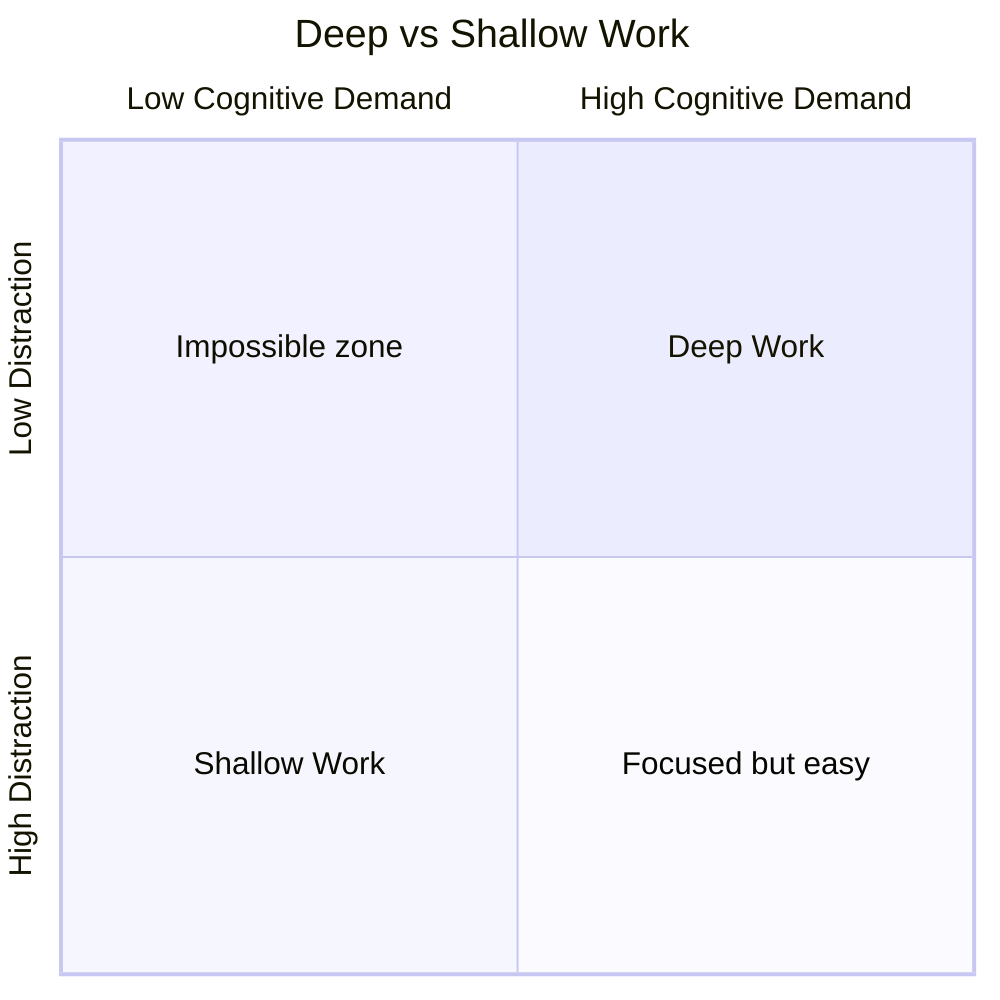

# Deep Work — Cal Newport

> Cal Newport's argument is simple and urgent: the ability to focus without distraction on a cognitively demanding task is becoming both increasingly valuable and increasingly rare — and those who cultivate this ability will dominate the knowledge economy.
> He calls this ability "deep work" and contrasts it with "shallow work" — the logistical, low-value tasks (email, meetings, Slack, social media) that fill most knowledge workers' days and create the illusion of productivity while producing almost nothing of lasting value.
> The book is half argument (why deep work matters) and half manual (how to restructure your life to do more of it), drawing on examples from Carl Jung to J.K. Rowling to a Georgetown professor who publishes at twice the rate of his colleagues.
> It is the most important productivity book of the last decade — not because it offers tricks, but because it reframes the entire question from "how do I get more done?" to "how do I do the work that actually matters?"

---

## About the Author

Cal Newport is a computer science professor at Georgetown University who has published seven books and numerous peer-reviewed academic papers — while rarely working past 5:30pm.
He does not have a social media account.
He is the author of *So Good They Can't Ignore You*, which argues that "follow your passion" is bad career advice — and *Deep Work* is its natural sequel, explaining how to build the rare and valuable skills that make a career remarkable.

---

## The Big Idea

- <b style="color: #2980b9">Deep Work</b> = professional activities performed in a state of distraction-free concentration that push your cognitive capabilities to their limit. They create new value, improve your skill, and are hard to replicate.
- <b style="color: #e74c3c">Shallow Work</b> = non-cognitively demanding, logistical-style tasks, often performed while distracted. They tend not to create much new value and are easy to replicate.
- <b style="color: #27ae60">The Deep Work Hypothesis:</b> The ability to perform deep work is becoming increasingly rare at exactly the same time it is becoming increasingly valuable in our economy. As a consequence, the few who cultivate this ability will thrive.

---

## Key Concepts at a Glance

| Concept | One-line summary |
|---------|-----------------|
| **Deep Work Hypothesis** | Deep work is rare + valuable = massive opportunity for those who do it |
| **Attention Residue** | Switching tasks leaves cognitive residue that degrades performance for minutes afterward |
| **Four Philosophies** | Monastic, Bimodal, Rhythmic, Journalistic — four ways to schedule deep work |
| **Grand Gestures** | Extreme environments (rented cabins, cancelled trips) that signal commitment to depth |
| **Drain the Shallows** | Ruthlessly minimize time spent on low-value logistical tasks |
| **Any-Benefit vs Craftsman** | Stop adopting tools because they offer "any benefit" — adopt only those whose benefits substantially outweigh costs |
| **Productive Meditation** | Use physical activity (walking, running) to focus on a single professional problem |
| **Be Boring** | Schedule every minute of your day; embrace boredom; quit social media |

---

## Part 1: Why Deep Work Is Valuable

### The Three Groups Who Will Thrive

Newport argues that in the new economy, three groups will have a particular advantage:
1. **High-skilled workers** who can work with intelligent machines
2. **Superstars** who are the very best at what they do in a winner-take-all market
3. **Owners** of capital

The first two groups share a requirement: the ability to quickly master hard things and produce at an elite level. Both require deep work.

### Attention Residue

- Sophie Leroy's research: when you switch from Task A to Task B, your attention doesn't immediately follow — a <b style="color: #e74c3c">residue of your attention remains stuck on Task A</b>
- This residue reduces your cognitive performance on Task B
- The more you switch, the more residue accumulates
- <b style="color: #2980b9">Every time you check email between deep work sessions, you create residue that degrades your next block of focused work</b>

> [!danger] Before: The multitasker's day
> Email at 8:00, meeting at 8:30, email at 9:00, deep work attempt at 9:15 (interrupted by Slack at 9:22), email at 9:30...
> Result: Attention residue from every switch. No deep work actually happens. The day feels busy but produces nothing of value.

> [!success] After: The deep worker's day
> Deep work block 8:00-11:30 (phone off, email closed, door shut). Shallow work batch 11:30-1:00 (email, meetings, admin). Deep work block 2:00-4:30. Shutdown at 5:00.
> Result: 6+ hours of undistracted cognitive work. More produced in one day than most people produce in a week.

---

## Part 2: The Four Rules

### Rule 1: Work Deeply

Four philosophies for scheduling deep work:

| Philosophy | Description | Best For | Example |
|-----------|-------------|----------|---------|
| **Monastic** | Eliminate or radically minimize shallow obligations | People whose value comes from one thing done exceptionally | Neal Stephenson (novelist who doesn't do email) |
| **Bimodal** | Dedicate defined stretches to deep work, leaving the rest for everything else | People who need both depth and availability | Carl Jung (Bollingen tower retreats + Zurich clinic) |
| **Rhythmic** | Transform deep work into a simple regular habit at the same time each day | People with standard work schedules | Chain method — "Don't break the chain" of daily deep work |
| **Journalistic** | Fit deep work wherever you can into your schedule | Experienced practitioners with schedule control | Walter Isaacson (writing biography chapters in any spare moment) |

> [!example] Carl Jung's Tower
> While running a busy clinical practice in Zurich, Jung built a stone tower in the village of Bollingen where he would retreat for weeks at a time to think, write, and develop his theoretical work. No electricity. No distractions. The tower was a grand gesture — an extreme commitment to depth that made his most important intellectual contributions possible.

---

### Rule 2: Embrace Boredom

- You can't just schedule deep work — you have to train your brain to tolerate the absence of stimulation
- If you reach for your phone every time you have a moment of boredom (in a queue, waiting for coffee), you are training your brain to need distraction
- <b style="color: #2980b9">Don't take breaks from distraction. Take breaks from focus.</b> Schedule when you will use the internet, and avoid it outside those times.
- **Productive meditation:** Use physical activity (walking, running, commuting) to focus your attention on a single professional problem

---

### Rule 3: Quit Social Media

- Newport attacks the <b style="color: #e74c3c">Any-Benefit Mindset</b>: the idea that you should use a tool if it offers any possible benefit, regardless of costs
- Replace it with the <b style="color: #27ae60">Craftsman Approach</b>: adopt a tool only if its positive impacts on the factors you've identified as most important substantially outweigh its negative impacts
- Apply this test to every social media platform. Most will fail.
- "These services aren't necessarily, as advertised, the lifeblood of our modern connected world. They're just products, developed by private companies, funded lavishly, marketed carefully, and designed to be addictive."

---

### Rule 4: Drain the Shallows

- Schedule every minute of your day (not to be rigid, but to be intentional)
- Quantify the depth of every activity by asking: "How long would it take to train a bright recent college graduate to do this task?" If the answer is short, it's shallow.
- Ask your boss: "What percentage of my time should be spent on shallow work?" This forces an explicit conversation about priorities.
- <b style="color: #27ae60">Fixed-schedule productivity:</b> Set a firm endpoint for your workday (Newport uses 5:30pm), then work backward to ensure the important work happens within those bounds

---

## The Verdict

*Deep Work* is not a productivity book in the traditional sense — it's a philosophical argument about what kind of work matters and a practical manual for creating the conditions to do it.
Newport's strongest contribution is the concept of attention residue, which demolishes the case for multitasking with a single research finding.
The four philosophies of scheduling make the framework applicable to anyone, not just tenured professors with flexible schedules.

The book's weakness is a certain asceticism that may not appeal to everyone — Newport's disdain for social media sometimes reads as self-congratulatory rather than pragmatic.
The examples skew heavily toward academics and writers, which may make the framework feel less applicable to people in collaborative, meeting-heavy roles.

But the core message — that the ability to concentrate is a superpower in a world of distraction — is both true and urgent.

---

## Related Reading

- [[So Good They Can't Ignore You - Cal Newport|So Good They Can't Ignore You]] — Newport's companion book on building career capital through deliberate practice
- [[Essentialism - Greg McKeown|Essentialism]] — The disciplined pursuit of less — a philosophical cousin to deep work
- [[The Effective Executive - Peter Drucker|The Effective Executive]] — Drucker's time management anticipates Newport's arguments by 50 years
- [[Your Brain at Work - David Rock|Your Brain at Work]] — The neuroscience of why attention residue happens
- [[How to Take Smart Notes - Sonke Ahrens|How to Take Smart Notes]] — A deep work-compatible system for thinking and writing
