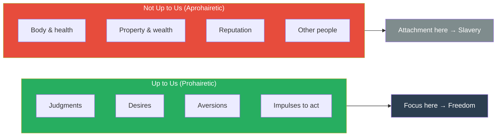
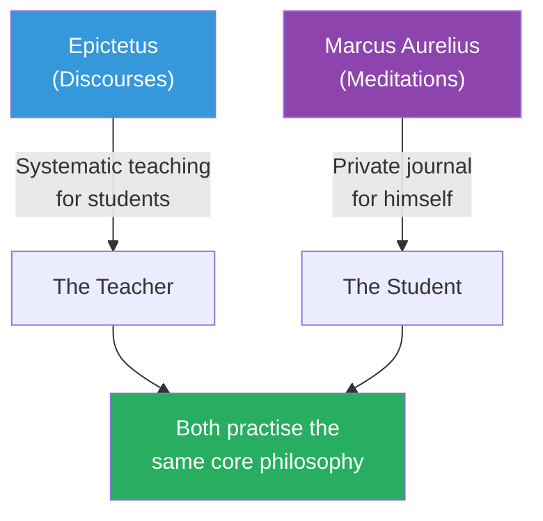

# Discourses — Epictetus

> Epictetus was born a slave. His master, Epaphroditus, once twisted his leg. Epictetus said calmly, "You're going to break it." When it broke, he said, "I told you so."
> He became one of the most influential philosophers in the Roman world — more systematic than Marcus Aurelius, more practical than Seneca, and more demanding than either.
> The Discourses are his lectures, recorded by his student Arrian. They survive as four books of conversations, arguments, and exercises in how to live as a free person — regardless of external circumstances.
> His central teaching is devastatingly simple: distinguish between what is up to you and what is not. Want only what is within your power. You will be invincible.

---

## About the Author

Epictetus (c. 50–135 CE) was born into slavery in Hierapolis, Phrygia (modern Turkey).
He studied Stoic philosophy under Musonius Rufus while still enslaved. After being freed, he taught in Rome until Emperor Domitian expelled philosophers from the city in 89 CE.
He established a school in Nicopolis (northwest Greece) that attracted students from across the empire, including members of the Roman elite.
He wrote nothing himself. His student Arrian recorded the Discourses (originally eight books, four survive) and compiled the Enchiridion (Handbook) as a portable summary.
His influence on Marcus Aurelius was profound — Marcus refers to Epictetus repeatedly in the Meditations.

---

## The Big Idea

- <b style="color: #2980b9">The Dichotomy of Control: some things are "up to us" (eph' hēmin) — our judgments, desires, aversions, and impulses — and everything else is "not up to us"</b>
- Freedom, happiness, and virtue all come from wanting only what is within your power and being indifferent to what is not
- <b style="color: #27ae60">Events do not disturb you. Your judgments about events disturb you. Change the judgment and you change the experience.</b>

---

## Key Concepts at a Glance

| Concept | Meaning | Application |
|---------|---------|-------------|
| **Dichotomy of Control** | Only your judgments, desires, and actions are truly yours | Before reacting to anything, ask: "Is this up to me?" |
| **Prohairesis** | Your moral choice / ruling faculty — the power to interpret and respond | The one thing no one can take from you |
| **Prosoche** | Attention / mindfulness — constant self-monitoring | Catch impressions before you assent to them |
| **Discipline of Desire** | Want only what is in your power; be averse only to what is in your power | Eliminates disappointment and fear |
| **Discipline of Action** | Act with "reserve clause" — pursue goals while accepting outcomes | Do your best, then accept the result |
| **Discipline of Assent** | Test every impression: is this within my control? Is my judgment accurate? | Prevents emotional hijacking |
| **Role Ethics** | You occupy multiple roles (citizen, parent, friend) — each has duties | Fulfil your roles without complaint |
| **Impressions** | Raw sensory/mental data before interpretation | Neutral until you add judgment |

---

## Core Teachings

### The Dichotomy of Control
This is the foundation of everything. Epictetus opens the Enchiridion with it: "Some things are within our power, while others are not."
Within our power: our opinions, motivations, desires, aversions — in a word, whatever is our own doing.
Not within our power: our body, property, reputation, office — whatever is not our own doing.
<b style="color: #2980b9">If you try to control what is not up to you, you will be frustrated, anxious, and enslaved. If you focus exclusively on what is up to you, nothing can harm you.</b>

### Prohairesis — Your Ruling Faculty
Prohairesis is Epictetus's term for the distinctly human capacity to choose how to interpret events and respond to them. It is the seat of moral agency.
A slave can be freer than an emperor — if the slave's prohairesis is trained and the emperor's is not. External chains bind the body. Internal chains (false beliefs, undisciplined desires) bind the soul.
This is what made Epictetus's own slavery irrelevant to his philosophy: his master controlled his body, not his judgments.

### The Discipline of Impressions
Every experience begins as a raw impression — neutral data. Suffering occurs when you add judgment: "this is terrible," "this shouldn't happen," "this is unfair."
<b style="color: #27ae60">Epictetus's practice: when an impression strikes, pause. Ask: "Is this about something within my control?" If not, train yourself to say: "This is nothing to me."</b>
This is not cold indifference — it is radical prioritisation. You are conserving all your emotional and cognitive energy for the things you can actually change.

### The Actor Analogy
"Remember that you are an actor in a play determined by the playwright. If he wants it short, it is short; if long, long. If he wants you to play a beggar, play even this with excellence; and so with a cripple, a ruler, or a common citizen."
You did not choose your circumstances. You did choose how to play the role you were given.

### The Banquet Metaphor
Life is like a banquet. Dishes are passed before you. Take a moderate portion of what is offered. Don't grab. When the plate moves on, don't reach after it.
<b style="color: #e74c3c">Applied to career, relationships, health, and life itself: enjoy what comes to you, don't clutch it, and let go gracefully when it passes.</b>

---

## How Epictetus Differs from Marcus Aurelius

Marcus Aurelius's *Meditations* are private journal entries — a man talking to himself, reminding himself of principles he already knows. They are beautiful but unsystematic.
Epictetus's *Discourses* are teaching — structured arguments, Socratic dialogues, exercises, and direct challenges. He is training students to practise philosophy, not just admire it.

Where Marcus reminds himself to accept fate, Epictetus explains *why* and *how* — with logical arguments, analogies, and progressive exercises. He is the instructor; Marcus is the practitioner.

---

## The Verdict

The *Discourses* are the most actionable text in the Stoic canon. If *Meditations* is the book you read for inspiration, *Discourses* is the book you read for instruction.
Epictetus does not offer comfort. He offers clarity: here is what you control, here is what you don't, here is how to train yourself to know the difference. The exercises are demanding. The logic is rigorous. The promise is real: if you practise this, nothing external can enslave you.
His authority is unimpeachable — he was a slave who became free, not by changing his circumstances but by changing his mind. He lived the philosophy he taught.

---

## Related Reading

- [[Meditations - Marcus Aurelius|Meditations]] — Marcus was a student of Epictetus's philosophy; the Meditations are the private application of these public teachings
- [[The Daily Stoic - Ryan Holiday|The Daily Stoic]] — Holiday draws heavily from the Discourses for modern daily meditations
- [[Man's Search for Meaning - Viktor Frankl|Man's Search for Meaning]] — "Between stimulus and response there is a space" — Frankl rediscovered prohairesis in Auschwitz
- [[12 Rules for Life - Jordan Peterson|12 Rules for Life]] — Peterson's Rule 7 (pursue meaning not happiness) parallels Epictetus's discipline of desire
- [[The Four Agreements - Don Miguel Ruiz|The Four Agreements]] — "Don't take anything personally" is the dichotomy of control in Toltec language
