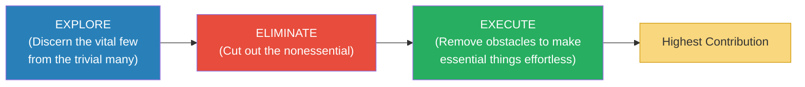
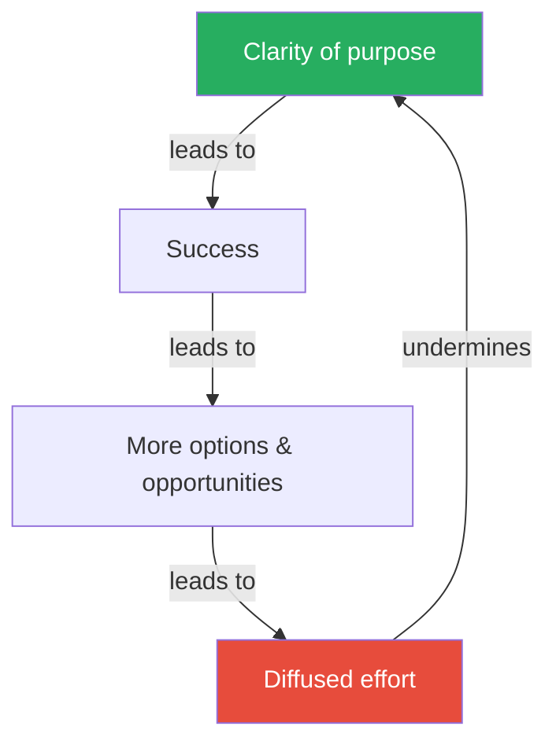

# Essentialism — Greg McKeown

> Greg McKeown's central argument can be stated in five words: if you don't prioritise your life, someone else will.
> Most successful people fall into the same trap: their success generates options and opportunities, each of which demands time and attention, until they are spread so thin that the very focus that made them successful in the first place is destroyed.
> The Essentialist's answer is not to do more, better. It is to do less, but the right things. It is the disciplined pursuit of less — a systematic method for discerning what is absolutely essential, then eliminating everything that is not.
> This is not a time management book. It is a thinking framework that changes what you say yes and no to.

---

## About the Author

Greg McKeown is a British-American author, speaker, and leadership consultant.
He has advised clients at Apple, Google, Facebook, Salesforce, and the Stanford Graduate School of Business.
The book grew from a Harvard Business Review article that became one of the publication's most popular pieces.

---

## The Big Idea

- The Nonessentialist says yes to almost everything, tries to fit it all in, and ends up spread a mile wide and an inch deep
- The Essentialist <b style="color: #2980b9">pauses, discerns what truly matters, and then makes a deliberate choice to pursue only that</b>
- The result is not doing less for its own sake — it is <b style="color: #27ae60">making the highest possible contribution toward the things that really matter</b>

| | Nonessentialist | Essentialist |
|--|----------------|-------------|
| **Thinks** | "I have to" / "It's all important" | "I choose to" / "Only a few things really matter" |
| **Does** | Tries to do everything | Does fewer things, better |
| **Gets** | Unfocused, overwhelmed, spread thin | Clarity, control, contribution |
| **Says yes** | By default | Only to the essential |
| **Says no** | Rarely, and with guilt | Gracefully, frequently, without guilt |
| **Trade-offs** | Tries to avoid them | Embraces them as the essence of strategy |

---

## Key Concepts at a Glance

| Concept | One-line summary |
|---------|-----------------|
| **Less But Better** | The motto of Essentialism, borrowed from designer Dieter Rams |
| **The 90% Rule** | If an opportunity isn't a clear 90% "yes" on your criteria, it's a "no" |
| **Trade-offs Are Good** | Accepting trade-offs is not a weakness — it's the definition of strategy |
| **The Clarity Paradox** | Success leads to more options, which leads to diffused effort, which leads to failure |
| **Protect the Asset** | The most important asset is you — sleep, health, and renewal are not optional |
| **The Power of Graceful No** | Say no to the nonessential clearly and without guilt |
| **Routine** | Make the essential the default — automate execution through habits |
| **Buffer** | Build in time for the unexpected — plan for failure, not just success |

---

## Phase 1: Explore

- Before you can eliminate, you need to <b style="color: #2980b9">create space to discern what matters</b>
- This requires escape (time to think), look (see what really matters), play (explore broadly), sleep (protect the asset), and select (apply extreme criteria)

### The 90% Rule

- When evaluating an opportunity, rate it on a scale of 0-100 on your most important criterion
- If it's below 90, it's a no
- <b style="color: #27ae60">This forces you to trade up — to say no to good opportunities so you can say yes to great ones</b>

> [!tip] The Test
> "If the answer isn't a definite YES, then it should be a definite NO."

---

## Phase 2: Eliminate

- Saying no is the essence of Essentialism — and the hardest part
- Most people avoid saying no because of social pressure, fear of missing out, or the sunk cost fallacy
- McKeown's framework for saying no gracefully:
  1. Separate the decision from the relationship
  2. You are not saying no to the person — you are saying no to the request
  3. A clear "no" is better than a vague "let me think about it" that becomes a reluctant yes

> [!example] Southwest Airlines
> Southwest Airlines became the most consistently profitable airline in history by saying NO to meals, assigned seating, first class, and hub-and-spoke routing. Every competitor who tried to do everything struggled. Southwest chose to do one thing — low-cost point-to-point travel — and did it better than anyone.
> Essentialist strategy IS saying no.

---

## Phase 3: Execute

- Once you've chosen what matters, remove every obstacle that makes it harder to do
- Build routines so the essential things happen by default, not by force of will
- Add buffers — plan for things to go wrong, because they will
- <b style="color: #2980b9">Subtract</b> before you add. The Essentialist asks "What's getting in the way?" not "What more can I do?"

---

## The Clarity Paradox

McKeown identifies a four-phase trap that catches successful people:

1. **Phase 1:** When we have clarity of purpose, it leads to success
2. **Phase 2:** When we have success, it leads to more options and opportunities
3. **Phase 3:** When we have more options, it leads to diffused efforts
4. **Phase 4:** Diffused efforts undermine the very clarity that led to success

---

## The Verdict

*Essentialism* is the philosophical companion to *Deep Work* — where Newport explains how to focus, McKeown explains what to focus on.
The book's strength is its framework: Explore-Eliminate-Execute is immediately actionable.
The 90% Rule alone is worth the price of the book.

The weakness is that McKeown sometimes presents Essentialism as a personality type rather than a practice — as if some people are naturally Essentialist.
The book also occasionally drifts into corporate-speak.
But the core message — that disciplined pursuit of less produces more — is essential reading for anyone drowning in commitments.

---

## Related Reading

- [[Deep Work - Cal Newport|Deep Work]] — How to protect the time you've freed up through Essentialism
- [[The Effective Executive - Peter Drucker|The Effective Executive]] — Drucker's "What is the one thing I can do?" is pure Essentialism
- [[So Good They Can't Ignore You - Cal Newport|So Good They Can't Ignore You]] — Building career capital through deliberate focus
- [[The Four Agreements - Don Miguel Ruiz|The Four Agreements]] — Simplicity as a philosophy of life, not just productivity
