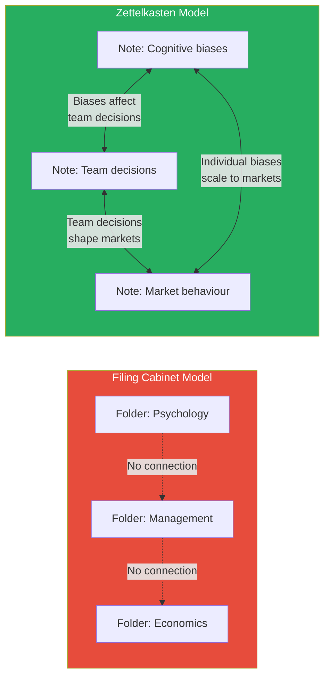
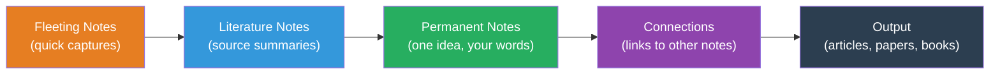
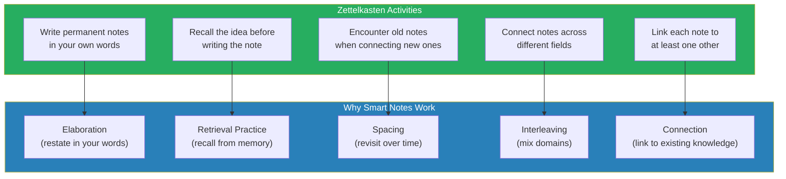
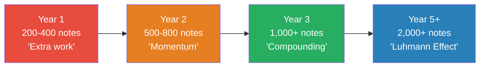
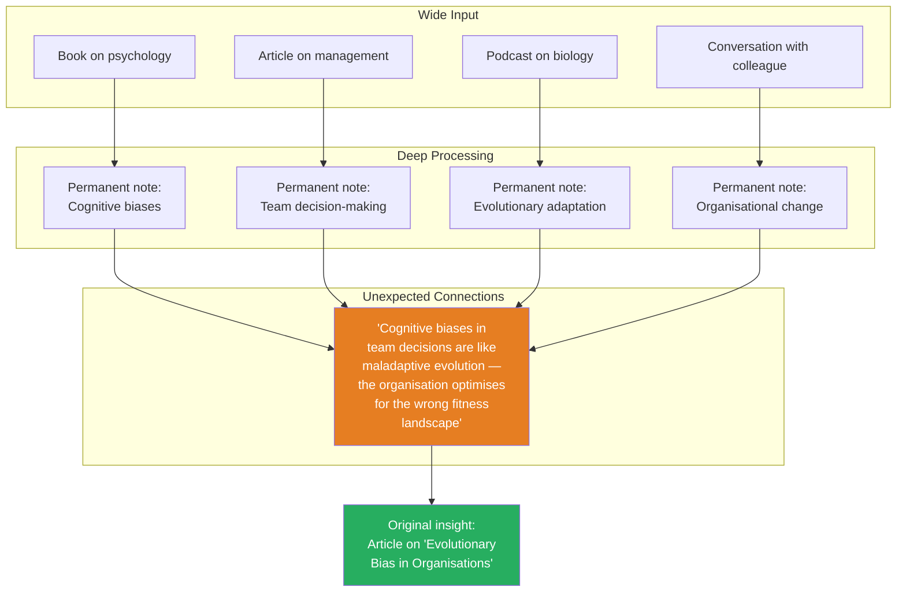

# How to Take Smart Notes — Sönke Ahrens

> Niklas Luhmann was a German sociologist who published 70 books and over 400 academic articles across an extraordinary range of disciplines — law, economics, politics, art, religion, ecology, media.
> His secret was not genius, long hours, or obsessive discipline. It was a wooden box of index cards.
> Sönke Ahrens explains how Luhmann's "Zettelkasten" (slip-box) system works and why it transforms reading, thinking, and writing from a painful, linear grind into a self-reinforcing cycle of insight.
> The core claim is radical: **writing is not the outcome of thinking — writing IS thinking.** If you are not writing in your own words, you are not learning.

---

## About the Author

Sönke Ahrens is a German writer and academic who teaches philosophy of education at the University of Hamburg.
He encountered Niklas Luhmann's Zettelkasten while researching academic productivity and realised the system was virtually unknown in the English-speaking world.
This book — first published in German, then expanded for English audiences — brought Luhmann's method to an international audience and sparked the modern "tools for thought" movement that includes apps like Obsidian, Roam Research, and Logseq.

Ahrens's contribution is not the Zettelkasten itself — that credit belongs to Luhmann. His contribution is explaining WHY it works, drawing on decades of research in cognitive psychology, learning science, and knowledge management. The system is not arbitrary. Every element — the one-idea-per-note rule, the forced rewriting, the bottom-up connections — maps to a specific finding in learning research.

> [!tip] Why This Book Matters for Everyone — Not Just Academics
> You don't need to be a scholar to benefit from smart notes. Anyone who reads books, attends meetings, takes courses, or needs to think clearly for a living can use this system. The insight is universal: <b style="color: #2980b9">if you are not writing down your ideas in your own words and connecting them to other ideas, you are not actually learning — you are just passing time with text.</b>

---

## The 30-Second Version

1. When you read, take brief notes in your own words (not highlights, not copies)
2. Each evening, turn those notes into "permanent notes" — one idea per note, clearly written
3. Before filing each note, ask: what existing notes does this connect to? Link them.
4. Over time, clusters of connected notes emerge — these become the basis for articles, projects, and decisions
5. Never start from a blank page. Start from your network of processed, connected ideas.

---

## Key Concepts at a Glance

| Concept | Definition | Why It Matters |
|---------|-----------|----------------|
| **Zettelkasten** | A "slip-box" — a network of atomic notes connected by links | It externalises thinking into a tangible, searchable, connectable system |
| **Fleeting Notes** | Quick captures of thoughts before they disappear | Prevents ideas from being lost, but must be processed within 24 hours |
| **Literature Notes** | Brief summaries of sources in your own words | Forces comprehension; passive highlighting does not |
| **Permanent Notes** | One atomic idea, written for someone else to understand | The building blocks of all future thinking and writing |
| **Elaboration** | Restating ideas in your own words and connecting to what you know | The cognitive mechanism that produces deep understanding |
| **The Collector's Fallacy** | Mistaking collection for understanding | Highlighting, bookmarking, and filing feel productive but produce nothing |
| **Bottom-Up Structure** | Let topics emerge from note clusters rather than imposing categories | Enables unexpected connections — the source of original ideas |
| **Atomic Notes** | One idea per note — small enough to recombine in any context | Multi-idea notes are trapped in their original context |

---

## The Big Idea

- <b style="color: #2980b9">Most note-taking systems are filing cabinets — they store information in categories. The Zettelkasten is a conversation partner — it generates new ideas by forcing connections between notes.</b>
- The system separates capture (fast, low-effort) from processing (slow, high-effort) and makes processing the core intellectual activity
- <b style="color: #27ae60">One idea per note. Written in your own words. Always connected to at least one existing note. That's the entire system.</b>
- The Zettelkasten is not a productivity hack. It is a thinking system. It changes how you engage with information at a fundamental level.

### Why Conventional Note-Taking Fails

Most people take notes the way they were taught in school: copy what the teacher says, file it by subject, review before the test. This approach has three fatal flaws:

1. **It treats your brain as a storage device.** Your brain is terrible at storage. It forgets most of what it encounters within days. Using it as a filing cabinet is like using a Ferrari as a paperweight.

2. **It keeps ideas in silos.** Notes filed in "Psychology" never meet notes filed in "Management." But the best ideas live at the intersection of domains.

3. **It requires retrieval from the same context.** You can only find a note if you remember where you filed it. If you can't remember the category, the note is effectively lost.

The Zettelkasten solves all three problems:
- It externalises storage (so your brain can focus on thinking)
- It connects ideas across domains (so insights can emerge from unexpected combinations)
- It uses links instead of categories (so every note is findable from multiple entry points)

> [!danger] The Filing Cabinet Illusion
> You have 500 notes organised in folders. You feel productive. But can you find the one note that's relevant to the problem you're facing right now? Can you see how an insight from economics connects to a challenge in management? Can you generate a new idea by combining three notes from different folders? If not, you have a filing cabinet that makes you FEEL organised but doesn't make you THINK better. The Zettelkasten is the opposite: it may look messy, but it makes you think.

### The Paradigm Shift

The Zettelkasten requires a fundamental shift in how you think about notes:

| Old Paradigm | New Paradigm |
|-------------|-------------|
| Notes are a record of what I've read | Notes are a product of what I've THOUGHT |
| Notes should capture the author's words | Notes should capture MY understanding of the author's ideas |
| Notes belong in categories | Notes belong in NETWORKS |
| The goal is to store information | The goal is to generate new ideas |
| I organise notes when I take them | I let organisation emerge from connections |
| A good note is comprehensive | A good note is atomic (one idea) |
| I take notes for later reference | I take notes for current thinking |
| My notes are finished when I write them | My notes are alive — they gain value as connections accumulate |

---

## The Four Note Types

Ahrens identifies four distinct types of notes, each serving a specific purpose in the workflow. Understanding the differences is critical — most Zettelkasten failures come from confusing these types.

| Note Type | Purpose | Lifespan | Where It Lives | Example |
|-----------|---------|----------|---------------|---------|
| **Fleeting** | Capture a thought before it disappears | Hours — process or discard within 24 hours | Phone, pocket notebook, scratchpad | "Interesting parallel between chunking and Zettelkasten links" |
| **Literature** | Brief summary of a source's key ideas in YOUR words | Permanent — stored with bibliographic reference | Reference manager or dedicated file | "Oakley argues focused/diffuse modes alternate. Key: diffuse requires disengagement." |
| **Permanent** | One atomic idea, written clearly enough for someone else to understand | Permanent — the building blocks of the slip-box | The slip-box (Obsidian vault, card box) | "Learning requires elaboration — restating ideas in your own words forces deeper processing than rereading." |
| **Project** | Notes collected for a specific output (paper, article, chapter) | Temporary — discarded or archived after project completion | Project folder | Outline for "Chapter 3: Why Rereading Fails" |

> [!danger] The Most Common Confusion
> Most people confuse literature notes with permanent notes. They are NOT the same thing.
> - A **literature note** summarises what THE AUTHOR said: "Oakley argues that focused and diffuse modes alternate."
> - A **permanent note** captures what YOU think: "Alternating focused and diffuse modes explains why walking breaks produce insights — the break isn't rest, it's a mode switch."
> The literature note is about the source. The permanent note is about YOUR understanding. This distinction is the engine of the entire system.

### The Fleeting Note Problem

Fleeting notes are the most dangerous note type — because they feel productive but are actually worthless if not processed within 24 hours.

- A fleeting note is a reminder, not a thought. It says: "I had an idea about X." It does NOT contain the idea itself.
- If you capture 10 fleeting notes during the day and don't process them that evening, you'll look at them tomorrow and think: "What did I mean by this?"
- <b style="color: #e74c3c">The rule: every fleeting note must be either converted into a permanent note or discarded within 24 hours. There is no middle ground.</b>

> [!tip] Fleeting Note Best Practices
> - Keep them ultra-short: 1-2 sentences maximum
> - Include enough context to jog your memory: "The idea about feedback loops — connects to Coyle's Culture Code chapter on safety"
> - Process them EVERY EVENING before bed. This is non-negotiable.
> - If you can't process them, delete them. A note you'll never process is worse than no note — it creates guilt without value.

### The Permanent Note Template

A good permanent note has these characteristics:

1. **One idea only.** If you find yourself writing "AND" or "ALSO" — split the note.
2. **In your own words.** Not a quote. Not a paraphrase. YOUR formulation of the idea.
3. **Self-contained.** Someone who hasn't read the source should understand this note.
4. **Linked.** Connected to at least one other permanent note.
5. **Brief.** 3-8 sentences. Long enough to be useful. Short enough to be atomic.

> [!example] A Good Permanent Note
> **Title:** Retrieval practice is more effective than rereading
>
> Attempting to recall information from memory strengthens neural pathways more effectively than re-exposure to the information. Students who test themselves retain more than students who reread — even when the rereading group spends more total time studying. The mechanism: retrieval forces the brain to reconstruct the memory, which strengthens it. Rereading merely creates familiarity, which the brain mistakes for understanding.
>
> **Links:** [[Illusions of Competence]] · [[Spaced Repetition]] · [[Chunking and Memory]]
>
> **Source:** Oakley, *A Mind for Numbers*, Ch. 4

> [!warning] A Bad Permanent Note
> **Title:** Learning stuff
>
> "Oakley says retrieval practice is better than rereading. She also talks about the Pomodoro Technique and chunking and the Einstellung Effect and sleep and exercise and spaced repetition."
>
> **What's wrong:** Multiple ideas in one note. Uses the author's words. Not self-contained. No links. Too vague. This is a literature note masquerading as a permanent note.

---

## The Zettelkasten Workflow

### Step 1: Read with a Pen
- Never read without writing. Capture brief literature notes as you read.
- Keep them short — the goal is to identify key ideas, not to transcribe.
- <b style="color: #e74c3c">The pen is not for marking the text. It is for thinking about the text.</b> When you write while reading, you activate a different cognitive mode than passive scanning. Your brain shifts from "absorbing" to "evaluating" — and evaluation is where learning happens.

### Step 2: Process into Permanent Notes
- At the end of the day (or reading session), review fleeting and literature notes
- For each idea worth keeping, write one permanent note in your own words
- <b style="color: #2980b9">The test: could someone who hasn't read the source understand this note? If not, rewrite it.</b>
- This step is where the intellectual work happens. It is also where most people cut corners — and where cutting corners costs the most.

> [!warning] The Processing Bottleneck
> The single most common failure point in the Zettelkasten is step 2: processing literature notes into permanent notes. People capture fleeting notes all day. They take literature notes while reading. But they don't sit down in the evening to process them. The notes pile up. Processing becomes overwhelming. The system collapses. The fix: commit to processing 15-30 minutes EVERY DAY. Make it non-negotiable, like brushing your teeth. The Zettelkasten only works if you do the processing.

### Step 3: Connect
- Before filing a permanent note, ask: what existing notes does this relate to?
- Add explicit links. The connection is where insight happens.
- <b style="color: #27ae60">A note without connections is a dead note. The value of the system is in the network, not the individual cards.</b>

### Step 4: Let Structure Emerge
- Do not impose categories from the top down
- Instead, let clusters of connected notes reveal topics, arguments, and gaps
- When a cluster reaches critical mass, it becomes the skeleton of an article, chapter, or book
- <b style="color: #e74c3c">This is the opposite of how most people write. Most people start with a thesis and look for supporting evidence (confirmation bias). The Zettelkasten starts with evidence and discovers what thesis it supports (genuine inquiry).</b>

> [!example] Structure Emerging in Practice
> You've been reading books about leadership, psychology, and communication for six months. Without planning it, you notice that 15 of your permanent notes cluster around a theme: "Why honest feedback fails in organisations." Notes from *Crucial Conversations*, *The Culture Code*, *Emotional Intelligence*, and your own workplace observations all converge on the same pattern. You didn't set out to write about feedback. The Zettelkasten revealed it as a topic worth exploring. Now you have a ready-made outline and supporting evidence — generated bottom-up from your reading, not imposed top-down from a thesis.

### Step 5: Write From Your Notes

When a cluster is ready, the writing process becomes assembly rather than creation:

1. Pull all notes in the relevant cluster
2. Arrange them in a logical sequence (this IS your outline)
3. Write a rough draft, using each note as a paragraph seed
4. Fill in transitions and arguments
5. Revise

<b style="color: #27ae60">By the time you sit down to write, you have already done the intellectual work — over weeks or months of reading and processing. Writing is the final step, not the first.</b>

---

## Why Most Note-Taking Fails

Ahrens identifies three common traps that explain why most people read extensively but retain almost nothing:

### 1. The Collector's Fallacy

Highlighting, bookmarking, and filing feels productive but produces no understanding. You've stored information, not processed it.

- <b style="color: #e74c3c">The act of highlighting a sentence does not engage the brain in any meaningful processing. It is the illusion of learning — you feel like you've captured something, but your brain has done no work.</b>
- Studies consistently show that students who highlight perform no better on tests than students who simply read without highlighting
- The Collector's Fallacy extends to digital tools: saving articles to Pocket, bookmarking web pages, starring emails — all create the feeling of progress without the reality of understanding

> [!danger] The Highlighting Illusion
> A university study found that students who highlighted textbooks were confident they had learned the material — but performed no better on exams than students who simply read. The act of highlighting creates a false sense of familiarity: you recognise the passage because you marked it, and you mistake recognition for understanding. Real understanding requires reformulation — stating the idea in your own words, from memory.

### 2. The Planning Trap

Starting with an outline or thesis and then looking for material to support it. This is how most people write — and it produces confirmation bias, not discovery.

- When you have a thesis first, you unconsciously select evidence that supports it and ignore evidence that contradicts it
- <b style="color: #27ae60">The Zettelkasten reverses this: you collect and connect ideas first, then see what arguments emerge from the connections</b>
- This is why Luhmann could write about such a wide range of topics — he didn't start with a topic and research it. He noticed clusters of connected notes forming around a topic and followed them.

### 3. Category Imprisonment

Filing notes into rigid folders (Marketing, Psychology, History) prevents the cross-domain connections that produce original ideas.

- The best ideas live at the intersection of different domains
- A note about "feedback loops" might be relevant to biology, management, psychology, AND economics — but a folder system forces you to choose one
- <b style="color: #2980b9">The Zettelkasten uses links instead of folders, allowing every note to exist in multiple contexts simultaneously</b>

| Note-Taking Approach | Strength | Fatal Weakness |
|---------------------|----------|---------------|
| **Highlighting** | Fast, easy | Zero processing — no learning occurs |
| **Summarising in margins** | Some processing | Trapped in the book — can't be reconnected |
| **Folder-based notes** | Organised, retrievable | Category imprisonment — prevents connections |
| **Tag-based notes** | Flexible categorisation | Tags don't explain relationships |
| **Zettelkasten** | Forces processing + enables connection | Requires discipline and initial investment |

> [!example] The Power of Cross-Domain Connection
> Luhmann was reading about biological evolution when he noticed a structural parallel to legal systems — both evolve through variation, selection, and retention. That connection became a paper. A folder system would have filed "biology" in one place and "law" in another. The Zettelkasten's link-based structure allowed the connection to emerge naturally.

### The Highlighting Epidemic

Ahrens is particularly critical of highlighting — which he calls "the most popular and least effective study technique."

Research by cognitive psychologist Jeffrey Karpicke demonstrated:
- Students who highlighted and reread performed NO BETTER on tests than students who simply read without marking
- Students who practised retrieval (closed the book and recalled) dramatically outperformed both groups
- <b style="color: #e74c3c">The most popular study technique is the least effective. The least popular technique is the most effective.</b>

The reason is neurological: highlighting does not engage the brain in any deep processing. It creates a visual marker ("I've been here") that the brain later interprets as understanding ("I know this"). But recognition is not recall. You can recognise a word in a foreign language without being able to produce it. Recognition is passive. Recall is active. Only active processing produces durable learning.

> [!danger] The Knowledge Worker's Highlighting Problem
> Knowledge workers have their own version of the highlighting epidemic: saving articles to Pocket or Instapaper, bookmarking web pages, starring emails, saving Slack messages "for later." All of these create the feeling of capturing knowledge. None of them produce actual understanding. The information is "saved" — but it has not been processed. It sits in digital limbo, creating the illusion of productivity. The Zettelkasten replaces this hollow accumulation with genuine intellectual work: you must THINK about every idea you save, rewrite it in your own words, and connect it to what you already know. That is the difference between collecting and learning.

### Information Overload Is Not the Problem

Ahrens argues that the modern complaint about "information overload" misdiagnoses the problem. The issue is not that there is too much information. The issue is that we have no system for processing it.

- Luhmann consumed vast amounts of information — books, articles, lectures — without ever feeling overloaded. His slip-box processed information as it arrived, converting raw input into structured knowledge.
- <b style="color: #27ae60">Information overload is a processing problem, not a volume problem. With the right system, more input produces more insight — not more overwhelm.</b>

The Zettelkasten converts the firehose of modern information into a manageable stream: read → capture → process → connect → forget about it (the system remembers for you). Without the system, the firehose stays a firehose.

---

## The Science Behind Why Smart Notes Work

Ahrens doesn't just describe the Zettelkasten — he explains why it works, drawing on cognitive science research.

### Elaboration

The most powerful learning technique is elaboration — restating ideas in your own words and connecting them to what you already know. This forces the brain to process information at a deeper level than mere recognition.

- Writing a permanent note IS elaboration — you cannot write "one idea in your own words" without deeply engaging with the material
- <b style="color: #27ae60">The Zettelkasten turns elaboration from an occasional study technique into a daily habit embedded in your workflow</b>

### Retrieval Practice

Retrieval practice — attempting to recall information from memory — is significantly more effective for learning than re-reading or reviewing. When you sit down to write a permanent note from a literature note, you are practising retrieval.

### Spacing

The brain consolidates learning during the gaps between study sessions. The Zettelkasten naturally incorporates spacing: you read today, process tonight, and encounter the note again weeks or months later when a new note connects to it. Each encounter strengthens the memory.

### Interleaving

Mixing different topics during study produces better long-term learning than studying one topic at a time. The Zettelkasten naturally interleaves: when you process notes from a book on psychology, you might connect them to notes on management, philosophy, and biology — all in the same session.

---

## The Luhmann Method in Practice

Luhmann maintained his slip-box from the early 1960s until his death in 1998. It grew to roughly 90,000 index cards.
He didn't organise by topic. He organised by connection — each new note was filed behind the note it most closely related to, with links to other relevant notes.
When asked how he was so productive, Luhmann said he never forced himself to work on anything he didn't feel like. His system meant there was always something to work on — another cluster of notes approaching critical mass.
The result: he never experienced writer's block, because he never started from a blank page. He started from a rich network of processed, connected ideas.

> [!success] The Writer's Block Cure
> Writer's block happens when you try to think and write simultaneously — creating ideas and organising them at the same time. The Zettelkasten separates these processes completely. By the time you sit down to write, you already have a network of processed ideas, explicit connections, and emergent structures. Writing becomes assembly, not creation. And assembly doesn't produce block.

### Luhmann's Daily Routine

Luhmann's productivity wasn't the result of long hours or heroic discipline. It was the result of a system that made productive work the path of least resistance.

1. **Morning:** Read — books, articles, papers. Take brief literature notes.
2. **Afternoon:** Process literature notes into permanent notes. One idea per card. Written in his own words.
3. **Before filing:** Ask: "Where does this fit? What does it connect to?" File behind the most related existing note. Add cross-reference links.
4. **When ready to write:** Pull a cluster of connected notes. Arrange them into an argument. Write.

> [!tip] Starting Your Own Zettelkasten
> You don't need 90,000 cards. Start with these tools:
> - **A capture tool** (phone notes app, small notebook) for fleeting notes
> - **A processing tool** (Obsidian, Notion, physical index cards) for permanent notes
> - **A daily habit** (15-30 minutes) for processing captures into permanent notes
> - **A connection habit**: before filing any note, link it to at least one existing note
> The system compounds over time. After 100 notes, you'll start seeing connections. After 500, clusters will emerge. After 1,000, you'll never face a blank page again.

---

## Smart Notes in the Digital Age

Ahrens wrote the book before tools like Obsidian and Roam Research existed, but the modern "tools for thought" movement is a direct descendant of his work.

| Tool | Zettelkasten Strength | Best For |
|------|---------------------|----------|
| **Obsidian** | Bidirectional links, graph view, local files | Privacy-conscious users, Markdown lovers |
| **Roam Research** | Block-level references, daily notes, outliner | Researchers who think in fragments |
| **Logseq** | Open source, outliner + page-based, local files | Open-source advocates |
| **Notion** | Databases, templates, collaboration | Teams who need shared knowledge bases |
| **Physical index cards** | No distractions, tactile processing | Anyone who thinks better on paper |

> [!warning] The Tool Trap
> The biggest risk in the Zettelkasten community is spending more time configuring tools than writing notes. Luhmann used a wooden box and handwritten index cards. The system's power comes from the practice — forced elaboration, atomic notes, explicit connections — not from the software. Choose a tool in 30 minutes and start writing. You can always migrate later.

---

## Before and After: Reading With and Without Smart Notes

### Without Smart Notes

You read a book. You highlight interesting passages. You feel like you've learned something. Three months later, someone asks you about the book. You remember liking it, but you can't articulate a single specific idea. The highlighting created an illusion of learning that evaporated when you closed the book.

### With Smart Notes

You read a book. As you read, you take brief literature notes — the key ideas from each chapter in your own words. That evening, you process them: one permanent note per idea, written clearly enough for someone else to understand. You link each note to existing notes in your slip-box. Three months later, someone asks about the book — and not only can you articulate its key ideas, you can connect them to ideas from other books, explain where authors agree and disagree, and identify implications the original author didn't mention. Because you didn't just read the book. You thought about it.

---

## Common Objections

### "This sounds like a lot of work."

It is more work per book than passive reading. But the work compounds. After a year, you have a searchable, connected knowledge base that produces insights automatically. Passive reading for a year produces nothing except a vague sense of having read a lot.

Consider the maths: if you read 30 books a year without smart notes, after 10 years you have 300 vague memories. If you read 20 books a year WITH smart notes, after 10 years you have 2,000+ connected, retrievable ideas — a personal knowledge base that makes you sharper, more creative, and more productive every year. The investment pays compound returns.

### "I don't write papers. Why do I need this?"

You don't need to be an academic. Anyone who reads books, attends meetings, or needs to make decisions based on information benefits from processing that information into connected, retrievable notes. The output doesn't have to be a paper — it can be better questions in meetings, clearer emails, more informed decisions, or more interesting conversations.

> [!example] Smart Notes for a Product Manager
> A product manager reads about user research (from one book), pricing psychology (from another), and agile methodology (from a third). Without smart notes, these remain three separate books in memory. With smart notes, the ideas are connected: "Users value framing effects (pricing psychology) → this affects how we should present feature tiers (product) → we should test this in the next sprint (agile)." The Zettelkasten doesn't just store knowledge — it generates new ideas by forcing connections between domains.

### "I already use [Evernote / Apple Notes / Google Docs]."

The tool doesn't matter. The practice matters. If your notes are highlights and copies rather than reformulations in your own words, and if they live in isolation rather than connected networks, then you have a filing cabinet, not a thinking system. You can implement the Zettelkasten in any tool — the question is whether you do the intellectual work.

### "I tried it and it didn't stick."

The most common reason the Zettelkasten fails is that people try to process too much at once. They read a whole book, take 50 literature notes, and then feel overwhelmed trying to convert all of them into permanent notes. 

> [!tip] The Minimum Viable Zettelkasten
> Start with ONE permanent note per day. That's 365 ideas per year — more than most people produce in a decade of passive reading. You can always scale up later. But if you start with one note per day, you build the habit before you build the system.

### "What if I write a note that turns out to be wrong?"

Good. That's how learning works. A Zettelkasten is not a database of truths — it is a thinking tool. When you discover that a note is wrong, you write a new note correcting it and link them together. The correction process IS the learning.

---

## The Writing Workflow: From Notes to Output

Ahrens devotes the final section of the book to the writing process — how you go from a network of notes to a finished piece of writing. This is where the Zettelkasten's power becomes most visible.

### The Traditional Writing Process (Broken)

1. Choose a topic
2. Brainstorm ideas
3. Research the topic
4. Create an outline
5. Write a draft
6. Revise

The problem: steps 1-3 are doing ALL the intellectual work at once — choosing, thinking, and researching simultaneously. This is overwhelming and produces writer's block.

### The Zettelkasten Writing Process

1. Read widely, taking literature notes as you go (ongoing, not project-specific)
2. Process literature notes into permanent notes, connected to existing notes (ongoing)
3. Notice when a cluster of notes reaches critical mass around a topic (emergent)
4. Pull the cluster. Arrange the notes into an argument. Write.
5. Revise.

```mermaid
flowchart TD
    subgraph TRAD ["Traditional Process"]
        T1["Choose topic"] --> T2["Research\n(starting from zero)"]
        T2 --> T3["Outline\n(top-down)"]
        T3 --> T4["Write\n(agonising blank page)"]
        T4 --> T5["Revise"]
    end
    subgraph ZK ["Zettelkasten Process"]
        Z1["Read widely\n(ongoing)"] --> Z2["Process into\npermanent notes\n(ongoing)"]
        Z2 --> Z3["Notice cluster\nreaching critical mass"]
        Z3 --> Z4["Pull cluster.\nArrange into argument."]
        Z4 --> Z5["Write\n(assembling, not creating)"]
        Z5 --> Z6["Revise"]
    end
    style T4 fill:#e74c3c,color:#fff
    style Z5 fill:#27ae60,color:#fff
```

<b style="color: #27ae60">Steps 1-2 are done BEFORE you have a writing project. By the time you sit down to write, you already have a rich network of processed, connected ideas. Writing becomes assembly, not creation.</b>

> [!danger] The Blank Page Problem
> Writer's block is not a creativity problem. It is a workflow problem. If you sit down to write with nothing but an idea and a blank page, your brain must simultaneously generate content, organise structure, evaluate quality, and maintain motivation. This is like asking someone to cook a meal while also growing the vegetables, raising the livestock, and building the kitchen. The Zettelkasten solves the blank page problem by ensuring that when you sit down to write, the ingredients are already prepared.

### How to Spot When a Cluster Is Ready

Luhmann described the feeling of a cluster reaching critical mass: you keep encountering the same group of notes when following connections. Every new reading seems to add to the same cluster. You start having ideas about the relationships between the notes — not just what each note says, but what they say TOGETHER.

- <b style="color: #2980b9">When you have 15-20 connected notes around a topic, and you keep wanting to add more, the cluster is ready to become an output.</b>
- Pull all the notes in the cluster
- Arrange them in a logical sequence (this is your outline — generated bottom-up, not imposed top-down)
- Write, using each note as a paragraph seed

---

## The Role of the Index (Structure Notes)

Luhmann's slip-box had no folders. But it did have index cards — structure notes that served as entry points to clusters of related notes.

### What Is a Structure Note?

A structure note is not a permanent note (one idea). It is a table of contents for a cluster — a note that lists and briefly describes related permanent notes and how they connect to each other.

| Note Type | Purpose | Content |
|-----------|---------|---------|
| **Permanent note** | Store one atomic idea | The idea, in your own words, with links |
| **Structure note** | Navigate a cluster of permanent notes | A list of related notes with brief descriptions of how they relate |
| **Index note** | Entry point for the entire system | A short list of the most important structure notes |

> [!tip] Structure Notes in Obsidian
> In Obsidian, a structure note is a Map of Content (MOC) — a note that links to and briefly describes a cluster of related notes. It is not a folder. It is a dynamic, evolving table of contents that you can restructure at any time. When a structure note becomes too long, you've found a topic worth writing about.

### The Difference Between Folders and Links

| Folders | Links |
|---------|-------|
| A note can exist in only one folder | A note can be linked from unlimited locations |
| Cross-domain connections are invisible | Cross-domain connections are explicit |
| Structure is imposed from the top down | Structure emerges from the bottom up |
| Finding a note requires remembering where you filed it | Finding a note requires following connections |
| Rigid — hard to reorganise | Fluid — reorganisation is natural |

<b style="color: #e74c3c">The folder system mirrors how libraries organise books. The link system mirrors how the brain organises knowledge.</b> Your brain does not have a "psychology" folder and a "business" folder. Your brain has connections — "this idea is like that idea." The Zettelkasten mirrors this natural architecture.

---

## The Compound Effect of Smart Notes

The Zettelkasten is a compound interest machine for ideas.

### Year 1: Foundation
- 200-400 permanent notes
- Starting to see connections between notes
- Still feels like extra work
- Occasional "aha" moments when a new note connects to an old one you'd forgotten about

### Year 2: Momentum
- 500-800 permanent notes
- Clusters forming around major themes
- Reading feels richer because every book connects to existing notes
- First outputs (articles, presentations, decisions) generated directly from note clusters

### Year 3: Compounding
- 1,000+ permanent notes
- The system begins generating ideas YOU didn't expect — connections emerge that you never consciously made
- Writing becomes dramatically faster: pull a cluster, arrange, write
- You can speak fluently about any topic in your slip-box because the ideas have been processed, connected, and revisited many times

### Year 5+: The Luhmann Effect
- 2,000+ permanent notes
- The system is a genuine thinking partner — it "suggests" connections and topics
- Your intellectual output accelerates because each new input connects to a rich existing network
- You never start from zero — every project builds on a foundation of thousands of processed ideas

> [!success] The Zettelkasten Promise
> After 90,000 notes over 35 years, Luhmann could write a book proposal and tell the publisher the approximate page count — because he knew exactly how many connected notes he had on the topic. His slip-box didn't just store his thinking. It became a second brain that could generate outputs he hadn't planned. That is the compound effect of smart notes: the longer you practise, the more powerful the system becomes.

---

## Implementation Mistakes (And How to Avoid Them)

| Mistake | Why It Happens | How to Fix It |
|---------|---------------|--------------|
| **Copying instead of reformulating** | Easier to copy a passage than rewrite it | Force yourself: use your own words. If you can't, you don't understand it yet. |
| **Notes that are too long** | Trying to capture everything from a chapter | One idea per note. If a note contains two ideas, split it. |
| **No connections** | Filing notes and moving on | NEVER file a note without linking it to at least one existing note. |
| **Top-down categories** | Familiar from school and work | Resist the urge to create folders. Use links and let structure emerge. |
| **Tool obsession** | The Zettelkasten community loves tools | Spend 30 minutes choosing a tool. Spend the rest of your life writing notes. |
| **Trying to process everything** | Perfectionism | Start with one note per day. Not everything you read deserves a permanent note. |
| **Skipping literature notes** | Going straight from reading to permanent notes | Literature notes are the bridge. They capture the source's ideas; permanent notes capture YOUR ideas about the source's ideas. |
| **Not reviewing old notes** | Out of sight, out of mind | Make it a habit: when filing a new note, read 2-3 existing notes in the same cluster. |

---

## Smart Notes Applied to Specific Domains

### For Product Managers
- **Literature notes:** Capture insights from user interviews, market research, and competitor analysis
- **Permanent notes:** "Users in segment X care about Y because Z" (one insight per note)
- **Connections:** Link user insights to product features, to business metrics, to competitor strategies
- **Output:** Product requirements documents, strategy memos, sprint planning notes — all generated from your connected knowledge base

### For Consultants
- **Literature notes:** Capture frameworks, case studies, and client insights
- **Permanent notes:** One framework or principle per note, written in your own words
- **Connections:** Link similar frameworks across industries; connect client problems to known solutions
- **Output:** Client deliverables, proposals, and presentations assembled from existing notes

### For Executives
- **Literature notes:** Capture insights from board meetings, industry reports, and leadership books
- **Permanent notes:** "In situation X, the best approach is Y because Z" (decision frameworks)
- **Connections:** Link decisions across domains; connect past outcomes to current challenges
- **Output:** Strategic decisions, investor communications, and team guidance — informed by a rich, connected knowledge base

> [!tip] The Executive's One-Note-Per-Day Practice
> An executive who writes one permanent note per day for a year — connecting each to existing notes — will have 365 processed, interconnected insights about their industry, their company, and their domain. After three years: 1,000+. That is a formidable intellectual asset that no amount of "reading the latest article" can match.

---

## The Limitations of Smart Notes

1. **The startup cost is real.** The system requires a sustained investment of time and effort before it begins paying returns. Most people quit during the first few months because the compound effect hasn't kicked in yet.

2. **Not everything needs a permanent note.** Ahrens doesn't provide clear guidance on what to process and what to let go. In practice, you need to develop judgment about which ideas are worth preserving — and this judgment takes time to build.

3. **The book is more theoretical than practical.** Ahrens explains WHY the system works (cognitive science) better than HOW to implement it (step-by-step). Most readers will need to supplement with online guides, community resources, or tools like Obsidian that provide a digital Zettelkasten environment.

4. **The system requires consistent daily practice.** Like exercise, the Zettelkasten only works if you do it regularly. A slip-box you add to once a month is a filing cabinet, not a thinking system.

5. **Physical index cards vs digital tools.** Ahrens wrote primarily about physical index cards. The modern digital tools (Obsidian, Roam, Logseq) offer significant advantages (search, backlinks, graph view) that Ahrens's original framework doesn't address.

> [!warning] The Real Barrier
> The biggest barrier to adopting the Zettelkasten is not complexity — it is the ego. Most people believe they can hold ideas in their heads. They believe they will remember what they read. They believe their thinking doesn't need external scaffolding. Luhmann's response: the human mind is designed for having ideas, not for storing them. Outsource the storage. Free the mind for what it does best: thinking.

---

## The Key Principles

- **Writing is thinking.** If you're not putting ideas into your own words, you're not engaging with them deeply enough to learn.
- **Separate capture from processing.** Capture should be fast and frictionless. Processing should be slow and deliberate. Never confuse the two.
- **One idea per note.** Atomic notes can be recombined in infinite ways. Multi-idea notes cannot.
- **Always connect.** A note is only as valuable as its connections to other notes.
- **Let topics emerge bottom-up.** Don't impose structure — discover it.

### Extended Principles

- **Never highlight without processing.** Every highlight is a promise to your future self: "I will come back and think about this." If you don't keep that promise, the highlight is worse than useless — it creates an illusion of having learned something.
- **The slip-box is your external brain.** Your biological brain is designed for generating ideas, not for storing them. The Zettelkasten handles storage. Your brain handles creativity.
- **Quality over quantity.** One well-written permanent note (clearly articulated, connected, in your own words) is worth more than ten hastily captured fragments.
- **The system is for YOU.** Don't write notes to impress anyone. Write them to think. A note that helps you understand something is a good note — regardless of how polished it is.
- <b style="color: #2980b9">**The best note is one you'll actually want to read again.** If a note is boring, unclear, or too abstract, you'll skip it when you encounter it later. Make it specific, vivid, and useful.</b>

---

## The Zettelkasten vs Other Note-Taking Systems

| System | Philosophy | Strengths | Weaknesses | Best For |
|--------|-----------|-----------|------------|---------|
| **Zettelkasten** | Bottom-up, connection-based | Generates new ideas; compounds over time | High initial investment; requires discipline | Long-term knowledge building and writing |
| **Cornell Method** | Top-down, question-based | Good for lectures; structured review | No connection between notes; isolated | Classroom note-taking |
| **Mind Mapping** | Visual, radial | Good for brainstorming; spatial thinkers | Doesn't scale; no retrieval practice | Single-session brainstorming |
| **GTD (Getting Things Done)** | Action-based, task-focused | Great for productivity | Not designed for learning or ideas | Task management |
| **PARA (Tiago Forte)** | Project-based, top-down | Good for project-oriented workers | Categories can imprison ideas | Short-to-medium term projects |
| **Commonplace Book** | Collection-based, chronological | Low friction; simple | No connections; no processing | Casual collection of quotes and ideas |

> [!warning] PARA vs Zettelkasten: The Key Difference
> Tiago Forte's PARA system (Projects, Areas, Resources, Archives) organises information by PROJECT — what you're working on now. The Zettelkasten organises information by CONNECTION — how ideas relate to each other. PARA is excellent for productivity. The Zettelkasten is excellent for thinking. If you need to ship a deliverable next week, use PARA. If you need to develop deep expertise over years, use the Zettelkasten. Many people use both.

---

## Advanced Zettelkasten Techniques

### 1. Contradiction Notes

When you encounter an idea that contradicts an existing permanent note, don't delete the old note. Write a new note that captures the contradiction and link both. Over time, your most interesting clusters will be the ones where you've captured genuine intellectual tension.

- <b style="color: #e74c3c">The most valuable notes are not confirmations of what you already believe. They are challenges to what you believe.</b>

### 2. Question Notes

Sometimes the most important thing to capture is not an answer but a question. Write a permanent note that asks a question you can't yet answer, and link it to related notes. As your slip-box grows, you may find that the answer emerges from unexpected connections.

### 3. Bridge Notes

A bridge note explicitly connects two seemingly unrelated clusters. "Negotiation tactics from Chris Voss → Marketing copy techniques → Both use emotional framing to shift perception." Bridge notes are where the most original insights live.

### 4. Decay Notes

Some ideas have a shelf life. When you encounter a note that is no longer relevant — an outdated statistic, a superseded framework, a corrected understanding — don't delete it. Mark it as "decayed" and link it to the note that replaced it. The history of your thinking is itself valuable.

### 5. Synthesis Notes

When a cluster reaches critical mass, write a synthesis note: a note that doesn't capture a single idea but synthesises the relationship between multiple notes. This is the step between permanent notes and finished writing.

> [!tip] The Synthesis Practice
> Every month, pick one cluster of 10+ notes. Write a one-paragraph synthesis: "The relationship between these notes is..." This practice forces you to see the forest, not just the trees. The syntheses often become the thesis statements of articles, presentations, or chapters.

---

## The Zettelkasten and Creativity

Ahrens makes a compelling case that the Zettelkasten is not just a learning tool — it is a creativity tool. The most original ideas come not from blank-slate brainstorming but from unexpected connections between existing ideas.

### The Creativity Sequence

1. **Absorb widely** — Read across domains. Take notes on everything interesting.
2. **Process deeply** — Convert each interesting idea into a permanent note, in your own words.
3. **Connect deliberately** — Link each note to existing notes. Look for surprising connections.
4. **Encounter accidentally** — As your slip-box grows, you'll stumble on connections you didn't plan — a psychology insight linked to an engineering principle, a historical pattern connected to a management challenge.
5. **Synthesise intentionally** — When a surprising connection emerges, explore it. Write about it. This is where original ideas are born.

> [!example] How Luhmann Made Connections
> Luhmann was a sociologist, but his slip-box contained notes from biology, cybernetics, philosophy, linguistics, art, and theology. His most original contributions came from connecting ideas across these domains — for example, applying biological evolution concepts to legal systems, or using cybernetic feedback loops to explain social structures. A folder system would have kept these domains separate. The link-based Zettelkasten let them collide.

<b style="color: #27ae60">Creativity is not about having original thoughts. It is about making original connections between existing thoughts. The Zettelkasten is a connection engine.</b>

---

## A Week With Smart Notes: Day-by-Day Example

### Monday
- **Read:** 30 minutes of *Thinking in Bets* by Annie Duke
- **Literature notes:** 3 brief notes: (1) Resulting = judging decision quality by outcomes (2) Thinking in groups reduces bias (3) The "happiness test" for decisions
- **Processing:** Convert into 3 permanent notes. Link to existing notes on cognitive biases and decision-making.

### Tuesday
- **Read:** Article on team dynamics in Harvard Business Review
- **Literature notes:** 1 note: "Psychological safety predicts team performance better than talent"
- **Processing:** 1 permanent note. Link to notes on management, vulnerability, and The Culture Code.

### Wednesday
- **No reading today.** Instead: review 5 random permanent notes. Notice connections. Add 2 new links between existing notes.

### Thursday
- **Read:** Chapter from *Influence* by Cialdini
- **Literature notes:** 2 notes: (1) Social proof works strongest under uncertainty (2) Scarcity increases perceived value
- **Processing:** 2 permanent notes. Link social proof to notes on marketing, team dynamics, and decision-making.

### Friday
- **Notice:** A cluster has formed around "how groups make decisions." It contains 12 notes from 5 different sources.
- **Write synthesis note:** "Group decisions are shaped by three forces: cognitive biases (individual), social dynamics (interpersonal), and structural incentives (organisational)."
- **Realise:** This synthesis could become a presentation for your team.

### Weekend
- **Process any remaining literature notes** from the week
- **Browse the graph view** in Obsidian — notice which clusters are growing, which are dormant
- **Write one bridge note** connecting two clusters that seem unrelated but share a principle

> [!success] The Weekly Result
> 8 permanent notes. 5 new connections. 1 synthesis. In one week, without heroic effort, you've added 8 well-processed ideas to a compounding knowledge base and identified a potential output. Multiply by 52 weeks and you have 400+ permanent notes after one year — a genuine intellectual asset.

---

## The Zettelkasten and This Obsidian Vault

This vault — the book summaries you're reading right now — is itself an application of Ahrens's principles:

- Each summary processes a book into clearly articulated ideas (elaboration)
- Summaries link to other summaries using [[wikilinks]] (connection)
- Ideas from different books are compared in tables and cross-referenced (interleaving)
- The vault grows more valuable with each addition (compound effect)

<b style="color: #2980b9">If you want to build a personal version of this vault — a knowledge base that captures, connects, and compounds everything you learn — *How to Take Smart Notes* is the instruction manual.</b>

---

## The Verdict

*How to Take Smart Notes* is a short book with a disproportionately large impact. It changed how a generation of knowledge workers thinks about reading, writing, and learning.
The Zettelkasten is not just a productivity system — it is a thinking system. It forces the intellectual work that most people skip (elaboration, connection, reformulation) and turns that work into a compounding asset.
If you read a lot but feel like you retain little, this book explains why — and gives you a system to fix it.

The book has weaknesses. The writing is occasionally academic and repetitive. Ahrens spends more time explaining why the system works (cognitive science) than showing how to implement it (step-by-step). Readers looking for a practical setup guide may need to supplement with online resources or community guides.

But the core insight is transformative: <b style="color: #27ae60">learning is not about consuming information. It is about processing information — restating it, connecting it, and building a network of ideas that grows more valuable with every addition.</b> If you internalise that one idea and build a daily practice around it, this book will change how you think.

### The Three Sentences That Summarise the Book

1. **Writing is not the product of thinking — writing IS thinking.** If you are not writing your ideas down in your own words, you are not learning.
2. **The slip-box is a conversation partner.** It remembers what you forget, sees connections you miss, and generates ideas you didn't plan.
3. **The compound effect of daily notes is the most powerful intellectual investment available.** Small daily deposits into a connected knowledge base produce extraordinary returns over years.

### What This Book Changed in the World

*How to Take Smart Notes* directly inspired:
- The **Obsidian** note-taking app and its community of "digital gardeners"
- The **Roam Research** movement and its emphasis on bidirectional links
- The **"tools for thought"** category in software development
- A generation of knowledge workers who now think in terms of atomic notes, connections, and emergent structure
- The **"second brain"** concept popularised by Tiago Forte (though Forte's PARA system differs from the Zettelkasten in important ways)

> [!success] The Book's Legacy
> Before *How to Take Smart Notes*, the Zettelkasten was an obscure curiosity known mainly to German academics studying Luhmann. After the book, it became a global movement. Millions of people now use some version of the system — in Obsidian, Roam, Logseq, Notion, or on physical index cards. Ahrens didn't invent the Zettelkasten. But he made it accessible to anyone who reads, thinks, and wants to do both better.

---

## The One-Page Implementation Guide

| Step | Action | Time | Frequency |
|------|--------|------|-----------|
| **1. Choose a tool** | Obsidian, Roam, Logseq, or physical cards | 30 min (once) | Once |
| **2. Read with a pen** | Take brief literature notes while reading | During reading | Every time you read |
| **3. Process daily** | Convert literature notes → permanent notes (one idea per note, your words) | 15-30 min | Daily |
| **4. Connect every note** | Before filing, link to at least one existing note | 2-5 min per note | With every note |
| **5. Review weekly** | Browse existing notes. Add connections. Notice clusters. | 15 min | Weekly |
| **6. Synthesise monthly** | Write a synthesis note for your largest cluster | 30 min | Monthly |
| **7. Write when ready** | When a cluster reaches 15-20 notes, pull and arrange into an outline | Varies | When clusters mature |

<b style="color: #2980b9">Start with steps 1-4. Add steps 5-7 when the habit is established. The system will tell you when it's ready for more — you'll feel the pull of emerging clusters.</b>

---

## Who Should Read This Book

| Reader | What They'll Get |
|--------|-----------------|
| **Heavy readers** | A system to retain and connect what you read instead of letting it evaporate |
| **Writers** | A cure for writer's block — never start from a blank page again |
| **Students** | A study method grounded in cognitive science that actually produces understanding |
| **Knowledge workers** | A compounding intellectual asset that makes you sharper over time |
| **Anyone building an Obsidian vault** | The philosophical and practical foundation for effective note-taking |
| **Product managers and strategists** | A method for connecting insights from users, markets, and competitors into actionable frameworks |
| **Researchers** | Luhmann's own method — proven over 70 books and 400 articles — adapted for the digital age |
| **Anyone who reads this book summary** | If you've read this far, the Zettelkasten principles are already working on you. Now externalise them. |

---

## Related Reading

- [[Deep Work - Cal Newport|Deep Work]] — Processing notes into permanent form requires the deep, distraction-free focus Newport describes. Smart Notes is the WHAT; Deep Work is the HOW of creating the environment.
- [[A Mind for Numbers - Barbara Oakley|A Mind for Numbers]] — Oakley's retrieval practice, elaboration, and chunking are the cognitive mechanisms behind why the Zettelkasten works. Reading both books together creates a complete picture of effective learning.
- [[Peak - Anders Ericsson|Peak]] — Deliberate practice applied to intellectual work: processing notes IS the practice. Each permanent note is a rep that builds better mental representations.
- [[Essentialism - Greg McKeown|Essentialism]] — Focus on fewer, better inputs and process them deeply rather than collecting broadly. Essentialism provides the filter; Smart Notes provides the processing system.
- [[Thinking in Bets - Annie Duke|Thinking in Bets]] — Duke's emphasis on examining your reasoning maps to the Zettelkasten's forced elaboration: both require you to make your thinking explicit rather than letting it remain vague.
- [[Seeking Wisdom - Peter Bevelin|Seeking Wisdom]] — Bevelin's mental models approach pairs naturally with a Zettelkasten — each mental model becomes a permanent note that connects to examples across domains. Reading Bevelin with a Zettelkasten produces a personal library of mental models that compounds over years.
- [[The Effective Executive - Peter Drucker|The Effective Executive]] — Drucker's systematic approach to knowledge work is the management equivalent of Luhmann's systematic approach to intellectual work. Both argue that effectiveness comes from systems, not heroic effort.
- [[Influence - Robert Cialdini|Influence]] — Reading Cialdini with smart notes means each persuasion principle becomes a permanent note connected to real-world examples from other books and your own experience.
- [[Antifragile - Nassim Nicholas Taleb|Antifragile]] — The Zettelkasten itself is antifragile: every new input (note) makes the system stronger. Random encounters with old notes produce unexpected insights. Disorder (mixed topics) produces order (emergent clusters).
- [[Meditations - Marcus Aurelius|Meditations]] — Marcus's journal was the original Zettelkasten: a private writing practice that processed daily experience into philosophical insight through the act of putting thoughts into words.
- [[The Subtle Art of Not Giving a F-ck - Mark Manson|The Subtle Art of Not Giving a F*ck]] — Manson's emphasis on choosing what matters connects to Ahrens's selectivity principle: not every idea deserves a permanent note. Choose wisely.

---

## The Core Message in One Paragraph

If you are reading this summary — if you have read this far — you have already demonstrated the behaviour the Zettelkasten requires: sustained attention to one topic, processing ideas as you encounter them, and building understanding through cumulative engagement. The question is whether you will externalise this process — capture your ideas in writing, connect them to other ideas, and build a system that compounds over time. <b style="color: #27ae60">The Zettelkasten is not about taking more notes. It is about thinking more deliberately — and creating a physical record of that thinking that grows more valuable with every addition.</b> Start with one note per day. In a year, you will have a personal knowledge base unlike anything you've ever built. In five years, you will have a genuine intellectual asset. In ten, you will be the most well-read, well-connected thinker in any room you walk into — not because you read more than anyone else, but because you processed more deeply than anyone else.

The tools are free. The method is simple. The only variable is whether you will do the work.

Start today. Write one note. Connect it to one idea you already know. Then do it again tomorrow. That is the entire system.

---

## Final Thought: The Zettelkasten as a Life Practice

Luhmann did not think of his slip-box as a productivity tool. He thought of it as a life practice — a daily discipline of engaging deeply with ideas, processing them into his own understanding, and building a network of knowledge that grew more intelligent with every addition.

He once said that he did not think without writing. The act of writing WAS his thinking. The slip-box was not a record of thoughts he'd already had. It was the place where thoughts happened.

<b style="color: #27ae60">This is the deepest insight in the book: the Zettelkasten is not about taking notes. It is about thinking on paper. And thinking on paper — consistently, daily, with connection and elaboration — is the most powerful intellectual practice available to anyone who reads, learns, and wants to produce original work.</b>

The practice is simple. One idea. Your words. One connection. Every day.

The compound returns are extraordinary.

The only thing stopping you is starting.

---

## Luhmann's Numbers: The Proof in the Output

For anyone who doubts whether the system works, consider what Luhmann produced using nothing but index cards and a wooden box:

- **70 books** published across sociology, law, economics, politics, art, religion, ecology, and mass media
- **400+ academic articles** in peer-reviewed journals
- **90,000 index cards** in his slip-box over 35 years of daily practice
- **No writer's block** — ever. He always had clusters ready to become outputs.
- **No research assistants** — Luhmann worked alone. The slip-box was his only collaborator.
- **One of the most cited sociologists of the 20th century** — despite working outside the mainstream of any single academic discipline

<b style="color: #2980b9">This is not the output of genius. It is the output of a system — practised daily, compounding over decades.</b> Luhmann was not the smartest sociologist of his generation. He was the best-organised thinker. And that made all the difference.
