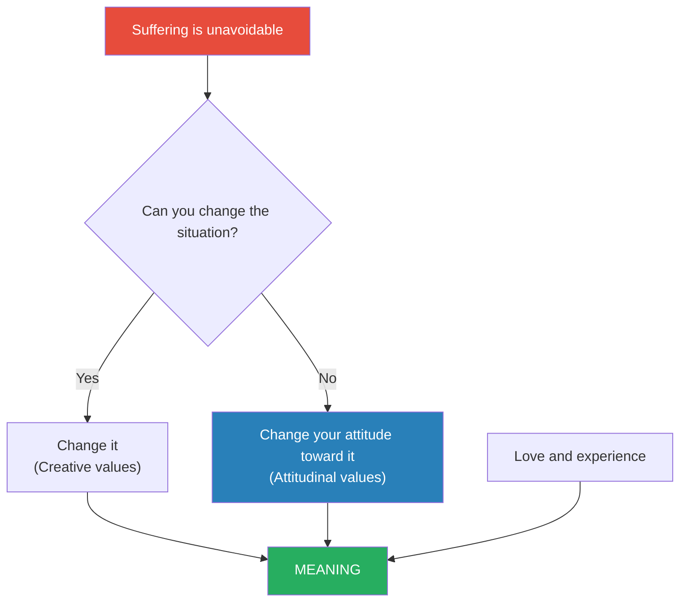

# Man's Search for Meaning — Viktor E. Frankl

> Viktor Frankl survived Auschwitz, Dachau, and two other Nazi concentration camps. His parents, brother, and pregnant wife did not.
> From that annihilation, he drew a single, unshakeable conclusion: the people who survived the camps were not the strongest or the smartest — they were the ones who found meaning in their suffering.
> The first half of this short, searing book is a memoir of the camps. The second half is an introduction to logotherapy — Frankl's school of psychotherapy built on the premise that the primary human drive is not pleasure (as Freud believed) or power (as Adler believed) but the search for meaning.
> It is one of the most influential books of the twentieth century, and one of the shortest. Every sentence earns its place.

---

## About the Author

Viktor Emil Frankl (1905-1997) was an Austrian neurologist, psychiatrist, and Holocaust survivor.
Before the war, he had already developed the foundations of logotherapy while working at the Vienna Polyclinic.
He was deported to Auschwitz in 1944 with his wife, parents, and brother — all of whom perished.
After liberation, he wrote this book in nine days.
He went on to hold professorships at the University of Vienna and taught at Harvard, Stanford, and other universities worldwide.

---

## The Big Idea

- <b style="color: #2980b9">"He who has a why to live can bear almost any how"</b> — Nietzsche, quoted by Frankl as the book's thesis
- The central insight from the camps: when everything external is stripped away — possessions, status, health, family, dignity, hope — what remains is <b style="color: #27ae60">the freedom to choose your attitude toward your circumstances</b>
- This is the "last of human freedoms" — the one freedom that cannot be taken
- Those prisoners who found meaning — in love, in a task yet to complete, in the attitude they chose toward suffering — survived at higher rates than those who gave up

---

## Key Concepts at a Glance

| Concept | One-line summary |
|---------|-----------------|
| **Logotherapy** | Therapy through meaning — the "Third Viennese School" after Freud and Adler |
| **The Will to Meaning** | The primary human drive is not pleasure or power but the search for meaning |
| **Three Sources of Meaning** | Creative values (work), Experiential values (love/beauty), Attitudinal values (suffering) |
| **The Last Freedom** | The freedom to choose your attitude — the one thing no one can take from you |
| **The Existential Vacuum** | The modern epidemic of boredom, emptiness, and meaninglessness |
| **Paradoxical Intention** | Prescribing the symptom to break the anxiety cycle |
| **Tragic Optimism** | Saying yes to life in spite of everything — finding meaning despite pain, guilt, and death |

---

## Part 1: Experiences in a Concentration Camp

### The Three Phases of Camp Psychology

Frankl observed that prisoners passed through three psychological phases:

| Phase | Period | Characteristic | Response |
|-------|--------|---------------|----------|
| **1. Shock** | Arrival | Disbelief, horror, curiosity | "This can't be real" |
| **2. Apathy** | Settled captivity | Emotional death, numbness | A necessary anaesthesia of the soul |
| **3. Depersonalisation** | After liberation | Inability to feel pleasure, disbelief that suffering is over | "We had literally lost the ability to feel pleased" |

---

### The Prisoners Who Survived

- Physical strength was not the deciding factor — many strong men died while frail ones survived
- <b style="color: #2980b9">The decisive factor was meaning</b>: those who had something to live for — a person to see again, a task to complete, a mission unfulfilled — endured longer
- Frankl kept himself alive partly by mentally reconstructing his lost manuscript on logotherapy, lecturing to imaginary audiences in his mind

> [!example] The Man Who Dreamed of March 30
> A fellow prisoner confided to Frankl that he had dreamed they would be liberated on March 30, 1945. As the date approached with no sign of liberation, the man fell ill. On March 29, he became delirious. On March 31, he was dead. His immune system had collapsed at the exact moment his hope was extinguished.
> Frankl's interpretation: it was not the disease that killed him but the loss of meaning.

> [!quote] The Core Passage
> "Everything can be taken from a man but one thing: the last of the human freedoms — to choose one's attitude in any given set of circumstances, to choose one's own way."

---

## Part 2: Logotherapy in a Nutshell

### The Will to Meaning

- Freud claimed the primary drive is pleasure (the "will to pleasure")
- Adler claimed it is power and superiority (the "will to power")
- <b style="color: #2980b9">Frankl claims it is meaning (the "will to meaning")</b>
- When the will to meaning is frustrated, the result is the <b style="color: #e74c3c">existential vacuum</b> — a state of boredom, emptiness, and aimlessness that manifests as depression, aggression, or addiction

### Three Ways to Find Meaning

1. <b style="color: #27ae60">Creative values</b> — by creating a work or doing a deed (giving something to the world)
2. <b style="color: #27ae60">Experiential values</b> — by experiencing something or encountering someone (love, beauty, truth, nature)
3. <b style="color: #27ae60">Attitudinal values</b> — by the attitude we take toward unavoidable suffering (turning tragedy into achievement)

> [!tip] The Critical Insight
> Meaning is not something you invent. It is something you discover. It is waiting for you in a task, a person, or a stance toward suffering. You do not ask life what its meaning is — life asks YOU, and you answer with your actions.

---

### Tragic Optimism

- Frankl's final concept: <b style="color: #2980b9">tragic optimism</b> — maintaining hope and meaning in the face of the "tragic triad" of pain, guilt, and death
- This is not naive positivity — it is the deliberate choice to find meaning even when circumstances are terrible
- It is the attitude that transforms suffering into achievement, guilt into motivation for change, and the awareness of death into a reason to act responsibly

---

## The Verdict

*Man's Search for Meaning* is one of those rare books that cannot be argued with — because its authority comes not from theory but from the most extreme human experience imaginable.
Frankl's insight that meaning, not pleasure or power, is the primary human drive has influenced psychotherapy, philosophy, and personal development for eight decades.
The book's brevity is its strength — at under 200 pages, every sentence carries weight.

The logotherapy section in Part 2 is necessarily compressed and sometimes abstract.
Those wanting a deeper treatment should read Frankl's more detailed works.
But as a distillation of one of the twentieth century's most important psychological insights — tested in the worst conditions humanity has ever created — it is unmatched.

---

## Related Reading

- [[Meditations - Marcus Aurelius|Meditations]] — Stoic acceptance and choosing your response to suffering
- [[The Four Agreements - Don Miguel Ruiz|The Four Agreements]] — Simplicity as a path to freedom from self-imposed suffering
- [[Deep Work - Cal Newport|Deep Work]] — Finding meaning through mastery and focused contribution
- [[12 Rules for Life - Jordan Peterson|12 Rules for Life]] — Peterson explicitly builds on Frankl's meaning framework
