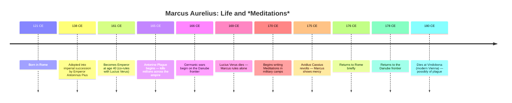
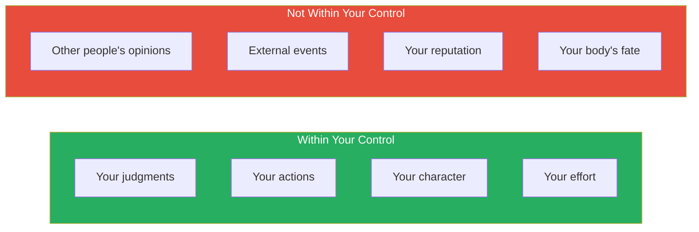
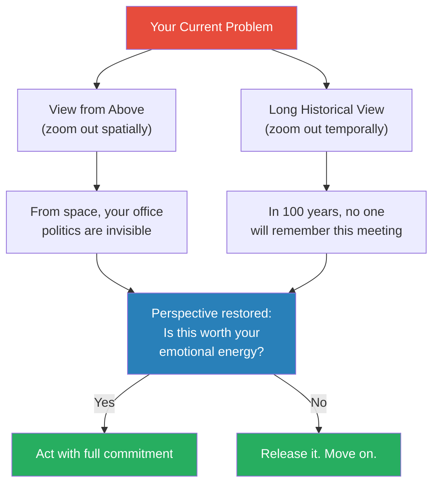
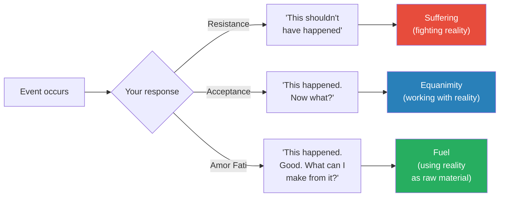
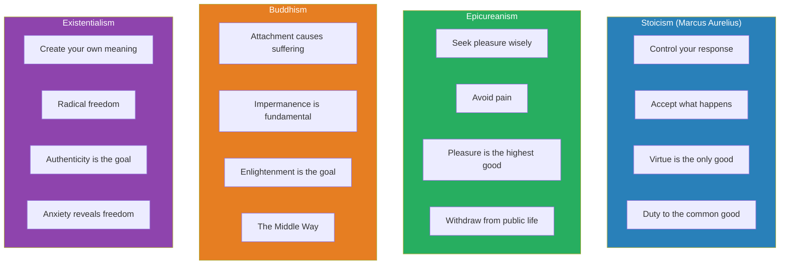

# Meditations — Marcus Aurelius

> Marcus Aurelius was the most powerful man in the world — Emperor of Rome at the height of its power — and he spent his private hours writing a journal of self-criticism, reminders, and philosophical exercises that he never intended anyone to read.
> *Meditations* is that journal: twelve books of Stoic self-examination written during military campaigns, plagues, betrayals, and the daily grind of governing an empire.
> It is the original self-help book — two thousand years old and still the most honest, because it was written for an audience of one.
> The core message is devastatingly simple: you cannot control what happens to you. You can only control how you respond. Everything else — fame, wealth, pleasure, other people's opinions — is noise.

---

## About the Author

Marcus Aurelius (121–180 CE) was Roman Emperor from 161 to 180 CE, the last of the "Five Good Emperors" — a dynasty that presided over the most stable and prosperous period in Roman history.
He was born Marcus Annius Verus into a prominent political family. Emperor Hadrian noticed his character and arranged for his adoption into the imperial succession. Marcus was trained from adolescence for rule — studying rhetoric, law, and philosophy.

His philosophical education was the defining force of his life. He studied under Junius Rusticus, who introduced him to Epictetus's *Discourses* — the text that would become Marcus's philosophical North Star. He also studied with Apollonius of Chalcedon, Sextus of Chaeronea, and the Stoic philosopher Claudius Maximus. By the time he became emperor at age 40, Marcus had spent decades immersing himself in Stoic philosophy.

His reign was a relentless series of crises:
- **The Antonine Plague** (165–180 CE) — one of the deadliest pandemics in Roman history, killing an estimated 5–10 million people, including possibly Marcus himself
- **The Marcomannic Wars** (166–180 CE) — Germanic and Sarmatian tribes pressing against the Danube frontier, forcing Marcus to spend years in military campaigns far from Rome
- **The revolt of Avidius Cassius** (175 CE) — a trusted general who declared himself emperor based on a false rumour of Marcus's death
- **The decline of civic institutions** — corruption, plague-driven economic collapse, and constant military pressure eroding the foundations Marcus was trying to maintain

*Meditations* was written in Greek during his final military campaigns along the Danube frontier — likely in his tent, after long days of command, as a private exercise in self-discipline. He titled the work "To Himself." He never intended it to be read by anyone else.

> [!tip] Why This Context Matters
> *Meditations* is not the product of a comfortable philosopher in an ivory tower. It was written by a man facing plague, war, betrayal, and the slow disintegration of the world he was responsible for. Every entry was a reminder Marcus needed in that moment — not an abstract principle, but a tool for surviving the next day. That is why the book still resonates: it was written under pressure, for immediate use, by someone with everything to lose.

---

## The 30-Second Version

If you have 30 seconds, here is the core of *Meditations*:

1. **You cannot control what happens to you.** You can only control how you respond.
2. **You will die.** Use that fact to create urgency and perspective — not despair.
3. **Other people will frustrate you.** Expect it. Prepare for it. Don't let it change your character.
4. **Fame, wealth, and pleasure are temporary.** Only your character endures — and even that only briefly.
5. **Do your duty.** You exist to contribute to the common good. Do it without expectation of reward.
6. **Every obstacle is an opportunity.** What stands in the way becomes the way.

That is the entire philosophy. Everything else in the twelve books is repetition, variation, and deepening of these six ideas.

---

## The Historical Context: Why This Book Exists

Understanding when and where Marcus wrote *Meditations* transforms how you read it.

The book was written during the last decade of Marcus's life — a period when everything was going wrong. The plague was decimating his army. The tribes kept attacking. His trusted general betrayed him. His wife Faustina was the subject of scandalous rumours. And waiting in the wings was his son Commodus — who would become one of Rome's worst emperors and undo much of what Marcus had built.

> [!warning] The Tragedy of Marcus Aurelius
> Marcus Aurelius is often held up as the philosopher-king ideal — proof that wisdom and power can coexist. But there is a deep tragedy in his story. Despite decades of Stoic training and genuine virtue, he failed to solve the one problem that mattered most: succession. He chose his biological son Commodus as heir — a choice that contradicted the "adoption of the best man" principle that had produced the Five Good Emperors. Commodus was vain, cruel, and incompetent. Within twelve years of Marcus's death, Rome was in civil war. The lesson is uncomfortable: personal virtue is not enough to fix systemic problems.

### Why Marcus Chose Commodus

This question has haunted historians for nearly two millennia. The most likely explanations:

1. **Political reality.** Commodus was Marcus's only surviving biological son. Bypassing him for a non-family member could have triggered civil war immediately — Roman succession was always contested, and blood claims were powerful.

2. **Paternal blindness.** Even Stoic philosophers can be blinded by love for their children. Marcus may have believed Commodus would grow into the role — or simply could not bring himself to disinherit his own son.

3. **The Stoic blind spot.** Marcus's philosophy focused on individual virtue — what ONE person can control. It provided less guidance for systemic problems like institutional design and succession planning. <b style="color: #e74c3c">Stoicism is a philosophy of personal character, not of institutional architecture. The greatest personal virtue cannot compensate for a broken system.</b>

4. **Historical convention.** The "adoption of the best man" tradition was less a formal principle and more a historical accident — the previous four "Good Emperors" had no surviving biological sons. When Marcus did have one, the convention had no mechanism to override paternal succession.

> [!danger] The Lesson for Leaders
> Marcus's failure with Commodus contains a warning for every leader: your personal integrity is not enough. You must also build systems, institutions, and succession plans that function independently of any single person's virtue. Character matters — but structure matters more. The best leader in the world cannot save an organisation with a broken succession process.

---

## The Big Idea

- <b style="color: #2980b9">The Dichotomy of Control</b> — the foundational Stoic principle: some things are within your power (your thoughts, judgments, and actions) and some things are not (other people's behaviour, external events, your reputation, your body)
- <b style="color: #27ae60">Focus entirely on what is within your control. Release attachment to everything else.</b>
- This is not passive resignation — it is the most active form of agency: pouring all your energy into the only things you can actually change

---

## Key Concepts at a Glance

| Concept | One-line summary |
|---------|-----------------|
| **Dichotomy of Control** | Focus on what you can control; release what you cannot |
| **Memento Mori** | Remember you will die — this gives urgency and perspective |
| **The View from Above** | Zoom out to cosmic scale — your problems shrink to nothing |
| **Amor Fati** | Love your fate — accept what happens as if you chose it |
| **The Obstacle Is the Way** | What stands in the way becomes the way — impediments are opportunities |
| **Premeditatio Malorum** | Negative visualisation — imagine the worst so it cannot surprise you |
| **Morning Preparation** | "When you wake, tell yourself: today I will meet ingratitude, arrogance, betrayal" |
| **Impermanence** | Everything passes — fame, empires, life itself. Act accordingly. |

---

## Core Teachings — Book by Book

*Meditations* contains twelve books, written over several years. They do not follow a linear argument — they circle back to the same themes obsessively, as Marcus reminds himself of truths he keeps forgetting under pressure. Below is a guide to each book's key themes and most important ideas.

### Book 1: Debts — What I Learned from Others

Book 1 is unique in *Meditations*: it is a gratitude catalogue. Marcus lists the people who shaped him and what he learned from each.

- From his grandfather Verus: "good morals and the government of my temper"
- From his mother: generosity, simplicity, and "abstinence not only from evil deeds but from evil thoughts"
- From his adoptive father Antoninus Pius: "mildness of temper," consistency, and indifference to superficial honours
- From his Stoic tutor Rusticus: the habit of self-correction and the introduction to Epictetus
- From Sextus: "tolerance and the example of a household governed by its head"

> [!tip] The Gratitude Practice
> Book 1 is a masterclass in a practice that modern psychology has rediscovered: gratitude journaling. Marcus doesn't list what he's grateful for in abstract terms. He names specific people and specific lessons. This specificity is what makes gratitude effective — it connects you to the actual people and moments that shaped you, rather than to vague positivity.

**The key insight:** Marcus begins his private journal not with self-examination but with acknowledgment of how much he owes to others. The most powerful man in the world starts with humility.

### Book 2: Written Among the Quadi — On Mortality and Duty

Written during a military campaign against the Quadi tribe on the Danube, Book 2 is where Marcus confronts mortality directly for the first time.

- <b style="color: #2980b9">"Think of your life — what you lived through. Now the play is over. Leave the stage."</b>
- The body is "a river of becoming, a river that never stops"
- Everything external is "smoke and nothing"
- <b style="color: #e74c3c">The only thing that matters is the work of the present moment — the rest is either past (gone) or future (uncertain)</b>

> [!example] The Memento Mori in Action
> Marcus didn't write about death as a philosophical abstraction. He was surrounded by it. The plague was killing his soldiers. The battles were killing them faster. When he writes "you could leave life right now," he means it literally — an arrow, a disease, a bad night could end him before morning. This proximity to death is what gives his writing its urgency. He is not theorising about mortality. He is practising staying focused while death stands beside him.

### Book 3: In Carnuntum — On Focus and Character

Written at the Roman military base of Carnuntum (modern Austria), this book focuses on concentration and the importance of doing one thing at a time.

- <b style="color: #27ae60">"Concentrate every minute on doing what's in front of you with precise and genuine seriousness"</b>
- Don't waste time on what others think of you
- Every moment of distraction is a moment of life lost
- Your character is the only thing you take with you — everything else stays behind

### Book 4: On Impermanence and Perspective

This is where Marcus deploys two of his most powerful techniques: the View from Above and the long historical perspective.

**The View from Above:** Imagine looking down on the earth from a great height. Watch the armies march, the cities bustle, the ships cross the sea. From above, it all looks like ants scurrying. Your problems — the meeting that went badly, the colleague who annoyed you, the missed promotion — are invisible from this altitude.

**The Long View:** Think of all the people who came before you. Emperors, generals, philosophers, lovers — all dust now. Think of all the people who will come after you. They will forget you just as you have forgotten those who came before. This is not depressing — it is liberating. If nothing you do will be remembered in a thousand years, you are free to do it well for its own sake.

> [!danger] The Cosmic Indifference
> "Asia, Europe — corners of the world. The whole ocean — a drop in the universe. Mount Athos — a clod of dirt. The present — a split second in eternity." Marcus uses scale to puncture self-importance. Your problems feel enormous because you're standing inside them. Step back far enough, and they become invisible. This is not nihilism — it is perspective. The things that matter still matter. But the things you're anxious about? Most of them do not.

> [!success] The Liberation of Insignificance
> When you truly absorb the fact that the universe does not revolve around you, something paradoxical happens: you become freer to act. You stop performing for an imaginary audience. You stop worrying about legacy. You start doing the right thing because it is the right thing — not because someone is watching.

### Book 5: On Effort and Morning Reluctance

Book 5 opens with one of the most relatable passages in all of ancient literature: Marcus arguing with himself about getting out of bed.

He writes (paraphrased): "At dawn, when you have trouble getting out of bed, tell yourself: I have to go to work — as a human being. What do I have to complain about, if I'm going to do what I was born for — the things I was brought into the world to do?"

- <b style="color: #2980b9">Even the Emperor of Rome didn't want to get up in the morning.</b> This makes him human — and makes his philosophy credible.
- His answer to the reluctance is not motivation or discipline — it is purpose. You get up because you have work to do. Not work for money or fame, but the work of being a good human being.
- "People who love what they do wear themselves down doing it — they even forget to wash or eat. Do you have less respect for your own nature than the engraver has for engraving?"

> [!example] The Morning Reluctance Passage
> This passage has been quoted by everyone from military leaders to productivity writers. Its power lies in its honesty. Marcus doesn't pretend he leaps out of bed at dawn, filled with purpose. He admits he wants to stay under the covers. And then he reasons himself into action — not through guilt, but through the simple reminder that he was born to contribute, not to be comfortable.

Book 5 also contains one of Marcus's most important insights about emotional management:

- "Today I escaped anxiety. Or no, I discarded it, because it was within me, in my perceptions — not outside."
- <b style="color: #e74c3c">This single sentence captures the entire Stoic position on anxiety: it is not caused by external events. It is caused by your judgments about external events. Change the judgment, and the anxiety dissolves.</b>
- Modern anxiety treatment (especially CBT) is based on exactly this principle — you don't change the situation, you change your relationship to the situation

> [!tip] Marcus's Morning Practice for Modern Use
> When you wake up reluctant to face the day:
> 1. Acknowledge the reluctance. "I don't want to get up." (Honest, not judging yourself)
> 2. Remember your purpose. "What is the work that only I can do today?" (Not obligations — purpose)
> 3. Prepare for difficulty. "Today I will meet frustration, ingratitude, and setbacks. I am prepared."
> 4. Commit to effort, not outcomes. "I will do my best today. The results are not in my control."
> 5. Get up. The reluctance will pass within minutes. It always does.

### Book 6: On the Nature of the Universe

Book 6 is the most philosophical section, dealing with the Stoic concept of Logos — the rational order underlying all of reality.

- Everything that happens is part of the Logos — the rational structure of the universe
- <b style="color: #27ae60">Your job is not to fight reality but to work with it. Accept what happens and respond with virtue.</b>
- "The universe is change. Life is opinion." — Your experience of events is shaped not by the events themselves but by your judgments about them
- What disturbs people is not things, but their judgments about things

### Book 7: On Dealing with Others

This book returns to Marcus's most persistent challenge: other people.

- "The best revenge is not to be like your enemy"
- <b style="color: #e74c3c">When someone wrongs you, consider: they are doing what they think is right, according to their own understanding. They are not evil — they are ignorant. Correct if you can. Tolerate if you cannot. Pity them, but do not become them.</b>
- "It never ceases to amaze me: we all love ourselves more than other people, but care more about their opinion than our own"
- No one can hurt you unless you allow your judgment to be affected

> [!tip] Marcus's Framework for Difficult People
> When someone frustrates you, Marcus recommends this sequence:
> 1. Remember that they are doing their best according to their understanding
> 2. Consider that you have the same flaws in different forms
> 3. Remember that their behaviour is temporary — they will be dead soon, and so will you
> 4. Ask: does their behaviour actually harm your character? If not, it is not a real harm.
> 5. Focus on your response, not their action

### Book 8: On Our Place in Nature

Book 8 emphasises the Stoic concept of Sympatheia — the interconnectedness of all things.

- You are a part of nature, not separate from it
- Everything that happens to you is part of the whole — just as a foot belongs to the body, you belong to the universe
- <b style="color: #2980b9">Resisting your fate is like a foot complaining about walking. You were made for this.</b>
- Loss is not possible because nothing was ever truly yours — not your possessions, not your relationships, not your body

This book also contains one of Marcus's most practical observations about time:

- "Never regard something as doing you good if it makes you betray a trust, or lose your sense of shame, or makes you show hatred, suspicion, ill will, or hypocrisy."
- <b style="color: #27ae60">Before any action, ask: "Is this consistent with who I want to be?" If not, don't do it — regardless of the external benefit.</b>
- Marcus returns repeatedly to this test: no external gain (money, power, reputation, comfort) is worth compromising your internal character

> [!warning] The Sympatheia Principle at Work
> Marcus's concept of interconnectedness has practical applications in modern organisations. When you act purely in self-interest — taking credit, avoiding blame, hoarding information — you damage the team, which damages the organisation, which eventually damages you. "What injures the hive injures the bee." The Stoic case for collaboration and generosity is not sentimental — it is structural. You are part of a system. Damaging the system damages you.

### Book 9: On Injustice and Suffering

Book 9 deals with the hardest question in Stoic philosophy: how to respond to genuine injustice.

- Injustice harms the person who commits it more than the person who suffers it
- <b style="color: #e74c3c">The person who wrongs you damages their own character. You can choose to keep yours intact.</b>
- This does not mean passivity — Marcus was a military commander who fought wars and enforced laws. It means not allowing injustice to corrupt your inner world while you work to address it in the outer world.

> [!warning] The Stoic Paradox of Engagement
> Critics of Stoicism claim it promotes passivity — accepting fate instead of fighting injustice. Marcus's life refutes this. He spent years fighting wars, governing an empire, and enforcing Roman law. He was not passive. But he refused to let the external struggle corrupt his internal character. The Stoic does not withdraw from the world — they engage with it while maintaining an inner citadel that external events cannot penetrate.

### Book 10: On Self-Improvement

Book 10 is intensely practical — a series of techniques for managing your own mind.

- Practice "stripping away" the narrative from events. "He insulted me" becomes "he made sounds with his mouth." The insult only exists if you add the interpretation.
- When you feel angry, wait. The anger will pass. It always does. If you act during anger, you will regret it. If you wait, you will respond with clarity.
- <b style="color: #27ae60">Check your impressions. Every event arrives as a raw sensation. You add the judgment: "this is bad," "this is unfair," "this shouldn't be happening." Remove the judgment and the suffering disappears.</b>

| Raw Event | Judgment Added | Suffering Created |
|-----------|---------------|-------------------|
| Boss gives feedback | "He thinks I'm incompetent" | Shame, anxiety, resentment |
| Partner is quiet | "She's angry at me" | Fear, defensiveness |
| Colleague gets promoted | "I've been passed over" | Jealousy, self-doubt |
| Project fails | "I'm a failure" | Depression, withdrawal |

| Raw Event | No Judgment Added | Response |
|-----------|-------------------|----------|
| Boss gives feedback | "He shared his assessment" | Evaluate. Useful? Apply it. Not useful? Discard it. |
| Partner is quiet | "She is quiet" | Ask: "How are you?" |
| Colleague gets promoted | "She was promoted" | Evaluate your own performance. Adjust if needed. |
| Project fails | "The project did not succeed" | Analyse what went wrong. Apply lessons. Start again. |

### Book 11: On Rationality and Death

Book 11 weaves together two themes: the power of rational thought and the nearness of death.

- Rational thought is the highest human capacity — it is what separates you from animals
- Use it. When emotions surge, pause and think. When impulses arise, evaluate them before acting.
- Death is not to be feared — it is a natural process, as natural as being born
- <b style="color: #2980b9">"It is not death that a man should fear — he should fear never beginning to live"</b>

### Book 12: Final Reflections

The last book reads like a man saying goodbye — though Marcus may not have known it would be his final writings.

- Everything you have been told about life is compressed into one insight: <b style="color: #27ae60">do good work, treat others justly, and accept whatever comes</b>
- The universe will continue without you. This is not a tragedy — it is the natural order.
- Your task is simple: be a good person today. Not forever. Just today.
- "Reflect on the last time you postponed something — and how many of those who were once alive are now dead. Life is short. Act now."

Marcus ends where he began: with a focus on the present moment. The twelve books have covered perception, action, will, other people, death, duty, nature, and fate. But the final message is not about any of these. It is about today.

> [!success] The Final Entry's Lesson
> Book 12's closing passages are among the most powerful in all of literature. Marcus, likely writing in a military tent with death approaching (whether from plague, exhaustion, or battle), offers his final counsel to himself: "You have lived your life. Now live what's left properly." Not perfectly. Not heroically. Properly. The word choice is deliberate: Marcus's standard was not greatness but decency. Not glory but integrity. Not legacy but today.

> [!danger] The Unspoken Tragedy
> Marcus knew his son Commodus was unfit to rule. Historical sources suggest advisors urged him to choose a different heir. He didn't. Why? We don't know. Perhaps paternal love overrode philosophical wisdom. Perhaps political constraints made any other choice impossible. Perhaps Marcus, for all his Stoic practice, was still human enough to be blinded by hope for his own son. The result was catastrophic: Commodus's reign ended the Pax Romana and plunged Rome toward crisis. *Meditations* does not mention this decision — which makes the silence itself eloquent. Even the greatest Stoic practitioner could not apply his philosophy to everything. The most painful failures are often the ones we cannot write about.

---

## The Complete Stoic Exercises from Meditations

| Exercise | Instructions | Frequency | Purpose |
|----------|-------------|-----------|---------|
| **Morning Preparation** | "Today I will meet ingratitude, arrogance, betrayal..." | Daily, upon waking | Remove surprise; prepare for difficulty |
| **Dichotomy of Control** | Sort all concerns into "within my control" and "not within my control" | Throughout the day | Focus energy; reduce anxiety |
| **Testing Impressions** | Before reacting, ask: "Is this impression accurate?" | Every time you feel triggered | Prevent reactive behaviour |
| **The View from Above** | Imagine rising above earth until your problem is invisible | When overwhelmed | Restore perspective |
| **Memento Mori** | Remember you will die. Ask: does this matter? | When procrastinating or worrying | Create urgency and clarity |
| **Premeditatio Malorum** | Imagine the worst that could happen | Before important events | Remove the power of surprise |
| **Stripping the Narrative** | Describe events without judgment: "She said X" not "She attacked me" | When upset | Dissolve unnecessary suffering |
| **Amor Fati** | "This happened. Good. What can I make from it?" | After setbacks | Convert obstacles into fuel |
| **Evening Review** | "What did I resist? Where did I improve? Where did I fail?" | Daily, before sleep | Continuous self-improvement |
| **Gratitude Review** | Name specific people and what they taught you (Book 1) | Weekly or when resentful | Reconnect with appreciation |
| **The Sage Test** | "What would the wisest person I know do here?" | Before difficult decisions | Access better judgment |
| **Voluntary Discomfort** | Practise being cold, hungry, or deprived for short periods | Weekly | Reduce dependence on comfort |

<b style="color: #2980b9">These twelve exercises, practised consistently, constitute a complete system for emotional regulation, decision-making, and character development. Marcus used them daily for decades. They are available to anyone who is willing to practise.</b>

---

## The Stoic Toolkit: Practical Techniques from Meditations

Marcus doesn't just articulate principles — he practises specific techniques. Here are the most useful ones.

### 1. Premeditatio Malorum (Negative Visualisation)

Each morning, imagine the worst that could happen today. Not to create anxiety, but to prepare yourself.

- "Today I will meet ingratitude, arrogance, betrayal, envy, and selfishness"
- By imagining difficulty in advance, you remove the element of surprise — and surprise is what makes difficulty unbearable
- <b style="color: #2980b9">When the difficult thing actually happens, you can say: "I expected this. I'm prepared."</b>

### 2. The Inner Citadel

The Stoic concept of an inner citadel — a fortress within your mind that external events cannot breach.

- Your body can be imprisoned, but your mind remains free
- Your reputation can be destroyed, but your character is yours to maintain
- Your plans can be thwarted, but your response is always within your control
- <b style="color: #27ae60">The inner citadel is built through daily practice: each time you choose your response rather than reacting automatically, the walls grow stronger</b>

### 3. Memento Mori (Remember You Will Die)

Not morbid — practical. The awareness of death creates urgency and perspective.

- If you knew you had six months to live, would you spend today worrying about that email?
- If you knew your partner would die tomorrow, would you still be annoyed about the dishes?
- <b style="color: #e74c3c">Death is the ultimate perspective tool. It asks: does this actually matter? And most of the time, the answer is no.</b>

> [!example] Memento Mori at Work
> You're in a meeting. Someone is droning on about quarterly metrics. You feel your life draining away. Marcus would say: this is one of your finite hours on earth. Is this how you want to spend it? If yes — engage fully. If no — change your circumstances or change your attitude. But do not waste your remaining time on things you've decided don't matter while doing nothing to change them.

### 4. Amor Fati (Love Your Fate)

The most radical Stoic practice: not merely accepting what happens, but actively choosing to love it.

- Whatever happens was meant to happen — not by a personal God, but by the rational structure of the universe (Logos)
- Your job is not to wish for a different reality but to work with the reality you have
- <b style="color: #27ae60">"A blazing fire makes flame and brightness out of everything that is thrown into it." Be the fire.</b>

### 5. The View from Above

Imagine yourself rising above the earth. Watch your city shrink to a dot. Watch your country become a shape on a map. Watch the continents become patches of green and brown on a blue sphere. From this height, your problems are invisible.

- This is not escapism — it is recalibration
- After the view from above, return to your life with a corrected sense of proportion
- The colleague who annoyed you? A speck on a speck on a dot in an infinite universe.

### 6. Stripping Away the Narrative

When an event disturbs you, describe it in the most neutral terms possible:
- "She yelled at me" → "She produced loud vocalisations in my direction"
- "I failed" → "The outcome did not match my intention"
- "They rejected me" → "They chose someone else"

<b style="color: #2980b9">The suffering is never in the event. It is always in the narrative you add to the event.</b> Strip the narrative, and the suffering dissolves.

### 7. The Discipline of Assent

Before accepting any impression — any emotional reaction, any judgment, any narrative — pause and examine it. Marcus calls this the discipline of assent: the practice of not automatically agreeing with whatever your mind presents.

- An impression arrives: "My boss is angry at me"
- Before you assent (agree and react), pause: "Is this true? Do I have evidence? Or is this my mind adding a story?"
- <b style="color: #27ae60">Most impressions are not facts — they are interpretations. The discipline of assent is the practice of telling the difference.</b>

> [!tip] The Three-Second Pause
> When you feel a surge of emotion — anger, anxiety, hurt — count to three before responding. In those three seconds, examine the impression. Is it accurate? Is the narrative you're adding justified? Marcus practised this constantly. He called it "testing your impressions." Modern psychologists call it "cognitive defusion." The technique is identical.

---

## The Most Quotable Passages

*Meditations* is arguably the most quotable book in the Western canon. Here are passages that have echoed through two millennia, paired with their modern applications:

| Passage (Paraphrased) | Modern Application |
|-----------------------|-------------------|
| "You have power over your mind, not outside events. Realise this, and you will find strength." | When you're anxious about things outside your control — market crashes, other people's decisions, organisational changes — redirect your energy to what you CAN influence. |
| "The impediment to action advances action. What stands in the way becomes the way." | When a project is blocked, ask: what does this obstacle make possible that wasn't possible before? |
| "Waste no more time arguing about what a good man should be. Be one." | Stop philosophising. Start acting. The world has enough thinkers and not enough doers. |
| "It is not death that a man should fear. He should fear never beginning to live." | The real tragedy is not mortality — it is living a life of quiet avoidance, never taking the risks that would make it meaningful. |
| "How much more grievous are the consequences of anger than the causes of it." | The email that angered you cost you 30 seconds of annoyance. Your angry response may cost you a relationship. |
| "Everything we hear is an opinion, not a fact. Everything we see is a perspective, not the truth." | Before you react to criticism, feedback, or gossip, remember: you are hearing someone's interpretation, not objective reality. |
| "Never esteem anything as of advantage to you that will make you break your word or lose your self-respect." | No promotion, deal, or short-term gain is worth compromising your integrity. |
| "The soul becomes dyed with the colour of its thoughts." | What you think about consistently is what you become. Choose your mental inputs deliberately. |

---

## Stoicism vs. Other Philosophies: Where Marcus Fits

| Question | Stoicism | Epicureanism | Buddhism | Existentialism |
|----------|----------|-------------|----------|---------------|
| What is the good life? | A life of virtue and duty | A life of measured pleasure | A life free from attachment | A life of authentic choice |
| What causes suffering? | False judgments about events | Unnecessary desires | Attachment and craving | Inauthenticity and bad faith |
| What should we do about death? | Accept it — use it for perspective | Don't fear it — you won't experience it | Recognise impermanence — let go | Face it — it reveals what matters |
| What about other people? | Serve them — it's your duty | Enjoy small circles of friends | Practice compassion for all beings | Respect their radical freedom |
| What about fate? | Love it (Amor Fati) | Avoid it when possible | Accept it (karma) | Create meaning from it |

> [!example] Where the Traditions Converge
> Despite their differences, all four traditions agree on one thing: <b style="color: #2980b9">most human suffering is self-created.</b> We suffer not because of what happens to us but because of our relationship to what happens. Whether you call that "false judgments" (Stoics), "unnecessary desires" (Epicureans), "attachment" (Buddhists), or "bad faith" (Existentialists), the diagnosis is the same. The treatment differs — but the diagnosis is universal.

---

## Common Misconceptions About Stoicism

| Misconception | The Reality |
|--------------|------------|
| "Stoicism means suppressing emotions" | Stoicism means examining emotions before acting on them. Marcus felt anger, grief, and frustration — he just didn't let them drive his behaviour. |
| "Stoics don't care about anything" | Marcus cared deeply — about Rome, about justice, about his duty. He simply didn't let caring become craving. |
| "Stoicism is for privileged people" | Epictetus was a slave. Stoicism was designed for anyone — emperor or slave — because it focuses on the only thing everyone has: their mind. |
| "Stoicism means accepting injustice" | Marcus fought wars and enforced laws. Stoic acceptance is about your inner state, not your external actions. You can fight injustice without being consumed by rage. |
| "Stoicism is cold and robotic" | Read Book 1 of Meditations — it is a love letter to the people who shaped Marcus. Stoicism doesn't eliminate warmth. It eliminates reactivity. |

---

## A 10-Minute Stoic Morning Routine (Based on Meditations)

1. **Premeditatio Malorum** (2 minutes): "Today I will encounter difficulty, ingratitude, and frustration. I am prepared. These are part of human nature, and reacting to them is a choice."

2. **Memento Mori** (1 minute): "I could die today. Given that fact, what is worth doing? What is worth worrying about? Very little of what fills my day actually qualifies."

3. **Set your intention** (2 minutes): "Today I will focus on what is within my control: my effort, my attitude, my integrity. I will release what is not: other people's opinions, outcomes beyond my influence, events I cannot change."

4. **The View from Above** (2 minutes): "Imagine looking down on your city, your country, the planet. From that height, the meeting you're anxious about is invisible. Return to earth with corrected proportions."

5. **Commit to your work** (3 minutes): "What is the most important work I can do today? Not the most urgent — the most important. Do that first. Do it with full attention. Everything else is secondary."

> [!success] Why This Works
> This routine takes 10 minutes and costs nothing. It accomplishes what Marcus spent twelve books trying to accomplish: it calibrates your perspective before the day's chaos begins. When difficulty arrives — and it will — you have already prepared for it. When distractions compete for your attention — and they will — you have already decided what matters.

---

## The Four Stoic Virtues in Meditations

Marcus organises his thinking around the four cardinal Stoic virtues. Understanding them provides a lens for reading every entry in the journal.

### Wisdom (Sophia)

The ability to see things as they really are — without distortion from fear, desire, or bias.

- "Everything we hear is an opinion, not a fact. Everything we see is a perspective, not the truth."
- Wisdom for Marcus means testing every impression before accepting it as real
- <b style="color: #2980b9">The wise person sees clearly. The unwise person reacts to their interpretation of events, not to the events themselves.</b>

### Courage (Andreia)

The willingness to do what is right even when it is costly, frightening, or unpopular.

- Marcus showed courage not primarily on the battlefield (though he commanded armies) but in his daily governance — making difficult decisions, confronting uncomfortable truths, maintaining integrity under political pressure
- "Waste no more time arguing about what a good man should be. Be one."
- Courage for Marcus means acting on your principles, not just holding them

### Justice (Dikaiosyne)

Treating others fairly — which Marcus considered the most important virtue because it is the only one that necessarily involves other people.

- "What injures the hive injures the bee."
- Marcus returned again and again to the idea that humans are social creatures with obligations to each other
- <b style="color: #27ae60">Justice for Marcus means: do what is right for the community, not just for yourself. Serve. Contribute. Give more than you take.</b>

### Temperance (Sophrosyne)

Moderation, self-control, and the ability to resist excess.

- Marcus practised temperance in everything: food, drink, luxury, anger, ambition, even his response to praise
- "Receive without pride, let go without attachment."
- Temperance for Marcus means not needing more than is necessary — and not being enslaved by what you do have

| Virtue | Marcus's Application | Modern Application |
|--------|---------------------|-------------------|
| **Wisdom** | Testing impressions before reacting | Pausing before responding to email, news, or criticism |
| **Courage** | Confronting betrayal and crisis with composure | Speaking truth in meetings, making hard decisions, accepting consequences |
| **Justice** | Governing for the common good despite personal cost | Treating colleagues fairly, giving credit, serving the team |
| **Temperance** | Living simply despite being the richest man alive | Resisting lifestyle inflation, not overworking, knowing when to stop |

---

## Marcus Aurelius and Modern Psychology

The parallels between Stoic practice and modern evidence-based psychology are striking:

| Stoic Practice | Modern Psychological Equivalent | Evidence Base |
|---------------|-------------------------------|---------------|
| Testing impressions (discipline of assent) | Cognitive Behavioural Therapy (CBT) — examining automatic thoughts | Extensive (Aaron Beck, 1960s–present) |
| Premeditatio malorum (negative visualisation) | Defensive pessimism — imagining worst-case to reduce anxiety | Moderate (Julie Norem, 2001) |
| Memento mori (death awareness) | Terror Management Theory — death salience increases meaning-seeking | Strong (Greenberg, Solomon & Pyszczynski) |
| The View from Above (cosmic perspective) | Self-distancing — viewing problems from a third-person perspective | Strong (Ethan Kross, 2014) |
| Stripping away the narrative | Cognitive defusion (ACT therapy) — separating self from thoughts | Strong (Steven Hayes, 2006) |
| Evening review | Reflective journaling | Moderate (Pennebaker, 1997) |
| Amor fati (loving fate) | Post-traumatic growth — finding meaning in adversity | Strong (Tedeschi & Calhoun, 1996) |
| Morning preparation | Implementation intentions — pre-committing to specific behaviours | Strong (Peter Gollwitzer, 1999) |

> [!example] The CBT Connection
> Aaron Beck, one of the founders of Cognitive Behavioural Therapy, explicitly acknowledged that his approach was inspired by Stoic philosophy — particularly Epictetus's principle that "it is not things that disturb us, but our judgments about things." When a CBT therapist asks you to examine your automatic thoughts and test them against evidence, they are prescribing the same practice Marcus performed every night in his journal. The Stoics were practising cognitive therapy 2,000 years before it had a name.

---

## Reading Meditations: A Practical Guide

### How NOT to Read It

- **Don't read it cover to cover in one sitting.** It was not written that way and is not meant to be consumed that way. You will find it repetitive and lose patience.
- **Don't expect a linear argument.** There is no thesis, no conclusion, no narrative arc. It is a journal — fragments written over years, not chapters planned in sequence.
- **Don't look for original philosophy.** Marcus was not an original thinker. He was applying Epictetus's and other Stoics' ideas to his own life. His originality lies in the application, not the theory.

### How to Read It

1. **Open to a random page.** Read one entry. Sit with it.
2. **Ask: "What does this mean for me today?"** Not in the abstract — specifically. What situation in your life does this passage address?
3. **Write a brief response.** Marcus wrote to himself. Write back. Agree, disagree, apply, question.
4. **Return tomorrow.** Read another passage. Over weeks and months, the cumulative effect of daily engagement will be profound.
5. **Keep it by your bedside.** *Meditations* is not a book you finish. It is a book you live with.

> [!tip] The Meditations Journal Practice
> Buy a cheap notebook. Each day, copy one sentence from *Meditations* and write a paragraph about how it applies to your current situation. After a year, you will have your own *Meditations* — a personal journal of philosophical self-examination modelled on Marcus's original. This is the deepest way to engage with the text: not as a reader, but as a fellow practitioner.

---

## Marcus Aurelius and Leadership

For leaders and managers, *Meditations* is arguably the most important leadership text ever written — not because Marcus prescribes leadership techniques, but because he models the inner life of a leader under extreme pressure.

### The Leader's Composure

- <b style="color: #2980b9">A leader's composure in crisis is the single most powerful communication available. When the leader doesn't panic, the team doesn't panic.</b>
- Marcus maintained composure through plague, war, betrayal, and personal loss — not because he was unaffected, but because he practised Stoic self-regulation every day
- The morning preparation ("today I will meet ingratitude, arrogance...") is a leadership technique: by expecting difficulty, you prevent surprise from turning into reactivity

### The Leader's Duty

- "You exist to serve, not to be served." Marcus returned to this idea obsessively because the temptation to use power for personal benefit was constant.
- The Stoic leader asks: "What does the community need?" not "What do I want?"
- <b style="color: #e74c3c">Power does not corrupt immediately. It corrupts gradually, through the daily temptation to prioritise your comfort over your duty. Marcus's journal was his daily antidote to that corrosion.</b>

### The Leader's Self-Awareness

- Marcus practised evening self-review every night: what did I do well? Where did I fail? What can I improve?
- This is the ancestor of every modern leadership practice — 360 feedback, executive coaching, personal reflection
- The difference: Marcus had no coach. He was his own coach — using his journal as the tool for self-confrontation.

> [!success] The Leadership Takeaway
> If the most powerful person in the ancient world needed a daily practice of philosophical self-examination to remain good — what makes you think you don't? The higher you rise, the more important Marcus's practice becomes. Power amplifies whatever is inside you. If what's inside is unexamined, power will amplify your worst qualities. If what's inside is the product of daily Stoic reflection, power will amplify your best.

---

## The Enduring Influence of Meditations

The influence of *Meditations* extends far beyond philosophy:

| Person/Domain | How Meditations Influenced Them |
|--------------|-------------------------------|
| **Bill Clinton** | Read *Meditations* annually during his presidency |
| **Ryan Holiday** | Built a career and a movement around popularising Marcus's ideas |
| **Tim Ferriss** | Calls it one of the most recommended books by guests on his podcast |
| **James Mattis** | Carried a copy during deployments as a Marine general |
| **Cognitive Behavioural Therapy** | CBT's foundational principle — thoughts cause feelings, not events — comes directly from Stoic philosophy |
| **12-Step Programmes** | The Serenity Prayer ("accept the things I cannot change, courage to change the things I can") is Marcus's dichotomy of control |
| **Mindfulness movement** | Marcus's "present-moment awareness" and "testing impressions" parallel mindfulness techniques |

---

## Meditations in the Modern World

### At Work

| Workplace Situation | Marcus Would Say |
|--------------------|-----------------|
| Passed over for promotion | "Was I doing the work for the promotion, or for the work itself? If for the work — nothing has changed." |
| Difficult boss | "Consider that they are acting according to their understanding. Focus on doing your work well regardless." |
| Office politics | "How much time do you spend on others' manoeuvres? That time could be spent on your own improvement." |
| Burnout | "Are you doing your duty? Yes? Then rest without guilt. No? Then the problem is not exhaustion — it is misalignment." |
| Public failure | "In a hundred years, who will remember? Do your best now. That is all that was ever asked." |
| Taking credit for your work | "My work speaks for itself. Their behaviour reflects their character, not mine. Continue." |
| Feeling unappreciated | "The vine produces grapes and asks nothing more. Do the work because it is good work, not because of what it earns." |
| Unfair treatment | "Injustice harms the person who commits it more than the person who suffers it. Maintain your integrity." |

> [!example] The Stoic in a Bad Meeting
> You're sitting in a meeting that is going nowhere. The organiser is unprepared. The discussion is circular. You feel your time being wasted.
>
> **Without Stoic practice:** You grow visibly impatient. You check your phone. You make sarcastic comments. You leave the meeting frustrated and vent to a colleague. You've wasted not just the meeting time but the emotional energy of recovering from the irritation.
>
> **With Stoic practice:** You notice the irritation arising. You test the impression: "Is this meeting actually harming me? No — it's just consuming time I'd prefer to spend differently." You ask yourself: "What is within my control?" You can contribute constructively, redirect the conversation, or excuse yourself politely. You choose one and act. The meeting passes. You move on with no emotional residue.

### In Relationships

> [!tip] Marcus's Relationship Advice
> Marcus rarely wrote about romantic love, but his principles apply directly:
> - **Don't try to control your partner's behaviour** — only your own response
> - **Expect imperfection** — they will frustrate you, disappoint you, and annoy you. This is not a failure of the relationship. It is the nature of sharing life with another human.
> - **Focus on your contribution** — "What have I brought to this relationship today?" rather than "What did they fail to give me?"
> - **Practise the morning preparation for relationships** — "Today my partner will be tired, distracted, and possibly irritable. I am prepared. I will respond with patience, not reactivity."
> - **Apply memento mori** — Your partner will die. You will die. Is this argument worth the finite hours you have together? Almost always, the answer is no.

### During Crisis

This is where Stoicism — and *Meditations* specifically — truly shines. In normal life, these ideas are interesting. In crisis, they are essential.

- Lost your job? "The obstacle is the way. What opportunity does this create?"
- Health scare? "Memento mori. Use whatever time you have with intention."
- Betrayed by a friend? "Their actions reflect their character, not yours. Maintain yours."
- Financial loss? "Fortune gives and fortune takes. Your character is the only thing that cannot be taken."
- Global crisis? "How many plagues, wars, and catastrophes has humanity survived? This too shall pass. Your duty is to respond with virtue."

> [!success] Why Stoicism Thrives in Crisis
> Stoic philosophy becomes more popular during periods of crisis — and for good reason. When everything external is unstable, the only reliable anchor is internal. Marcus wrote *Meditations* during plague, war, and betrayal. Epictetus developed his philosophy in slavery. Seneca wrote his best letters in exile. <b style="color: #27ae60">Stoicism is not a fair-weather philosophy. It is a storm philosophy — designed to function under the worst conditions, when other approaches fail.</b>

---

## Before and After: A Day With and Without Stoic Practice

### Without Marcus

You wake up and immediately check the news. Something terrible has happened somewhere. You feel anxious. At work, a colleague makes a snide remark. You fume about it all morning, composing devastating comebacks you'll never deliver. Your boss gives you critical feedback. You take it as an indictment of your worth. You go home and vent to your partner about how unfair everything is. You go to bed angry, rehearsing tomorrow's grievances.

### With Marcus

You wake up and tell yourself: "Today I will meet ingratitude, arrogance, and dishonesty. I am prepared." At work, a colleague makes a snide remark. You notice the urge to react, pause, and think: "That tells me about his morning, not about me." Your boss gives critical feedback. You evaluate it for useful information: "Is there something here I can improve? Yes — I'll work on that." You go home and are present with your partner, grateful for the time together because you know it's finite. You go to bed calm, having done your best with the day you were given.

---

## Meditations Applied to Specific Modern Challenges

### Dealing with Social Media

Marcus could not have imagined Instagram, but his principles apply perfectly to the anxiety and comparison that social media produces:

- **The View from Above:** From cosmic height, your follower count is invisible. So is everyone else's.
- **Strip Away the Narrative:** "They posted a photo of their vacation" is what happened. "Their life is better than mine" is the narrative you added.
- **Impermanence:** Their highlight reel is as temporary as everything else. In 100 years, both your feeds will be as forgotten as Roman wall graffiti.
- <b style="color: #2980b9">"Everything we hear is an opinion, not a fact." Every social media post is a curated opinion about someone's life — not the truth of it.</b>

### Dealing with Career Anxiety

| The Anxiety | Marcus's Response |
|-------------|------------------|
| "I'm not progressing fast enough" | "Do the work. The recognition is not in your control." |
| "I might get fired" | "If it happens, it happens. Your character remains. Start again." |
| "My colleague got promoted and I didn't" | "Their advancement does not diminish you. Focus on your own improvement." |
| "I'm working too hard and it's not fair" | "Is the work itself meaningful? If yes, the recognition is irrelevant. If no, change the work." |
| "I don't know what I want to do with my life" | "You don't need to know the plan. You need to know the right thing to do TODAY." |

### Dealing with Loss

Marcus lost multiple children during his lifetime. His wife Faustina was the subject of vicious rumours. His trusted general Avidius Cassius betrayed him. He processed all of this loss through Stoic practice:

- <b style="color: #e74c3c">Grief is natural and should not be suppressed. But prolonged, self-destructive grief — grief that prevents you from living — violates the Stoic commitment to using your remaining time well.</b>
- "Remind yourself that what you love is mortal. That way you will cherish it while it is here."
- The Stoic response to loss is not "don't feel" — it is "feel fully, then return to your duties. The person you lost would want you to live well, not to suffer endlessly."

> [!example] Marcus on the Death of His Children
> Marcus lost at least five children — many in infancy. His journal entries about death are not cold or detached. They are the writings of a man who feels deeply but refuses to let grief consume his ability to serve. He writes about impermanence not because he doesn't care, but because caring too much about what he cannot control would prevent him from doing what he can. The Stoic emperor grieved. He just grieved while continuing to govern.

### Dealing with Difficult Decisions

Marcus offers a decision-making framework that cuts through analysis paralysis:

1. **Is this within my control?** If not, stop agonising. Accept the situation and redirect your energy.
2. **What would a good person do?** Not what would be profitable, popular, or safe — what would be RIGHT?
3. **Will this matter when I'm dead?** Most decisions that feel enormous are invisible from even a modest distance.
4. **Am I acting from virtue or from appetite?** Virtue (wisdom, courage, justice, temperance) is the only reliable guide.

> [!tip] The Marcus Aurelius Decision Filter
> When facing a difficult decision:
> - **Wisdom:** "Am I seeing this clearly, or is my judgment distorted by emotion?"
> - **Courage:** "Am I avoiding the right choice because it's hard?"
> - **Justice:** "Am I treating all parties fairly?"
> - **Temperance:** "Am I being moderate, or am I overreacting?"
> If your decision passes all four tests, act. If it fails any of them, pause and reconsider.

---

## The Translations: Which One to Read

The translation you choose significantly affects your experience of *Meditations*. Here are the main options:

| Translator | Year | Style | Best For |
|-----------|------|-------|---------|
| **Gregory Hays** | 2002 | Modern, clean, accessible | First-time readers; most popular translation |
| **Robin Hard** | 2011 | Scholarly but readable | Readers who want accuracy with notes |
| **Maxwell Staniforth** | 1964 | Classic, slightly archaic | Readers who enjoy traditional language |
| **George Long** | 1862 | Victorian, formal | Historical interest only |
| **Robin Waterfield** | 2021 | Fresh, with detailed commentary | Serious students of Stoicism |

> [!tip] The Recommendation
> Read Gregory Hays first. It's the translation that has introduced more people to Marcus than any other — because it reads like a modern journal rather than an ancient text. When you're ready for more depth, move to Robin Hard or Robin Waterfield for scholarly apparatus and historical context.

---

## Who Marcus Aurelius Was NOT

Understanding who Marcus was requires also understanding who he was not:

- **He was not a philosopher.** He was a practitioner. He studied philosophy to use it, not to contribute to it. *Meditations* contains no original philosophical ideas — it is the application of Epictetus's ideas to daily life.
- **He was not a saint.** He persecuted Christians. He presided over gladiatorial games. He made the catastrophic decision to make his son Commodus his heir. Stoic virtue did not make him perfect.
- **He was not calm by nature.** The journal makes clear that he struggled with anger, frustration, and impatience — constantly. The *Meditations* are not the writings of someone who achieved serenity. They are the writings of someone who practised it, daily, and kept falling short.

> [!warning] The Hagiography Problem
> Modern Stoic writers (including Ryan Holiday) sometimes present Marcus as a flawless sage. He wasn't. He was a deeply flawed human being who used philosophy to manage his flaws — with mixed success. That makes him MORE relatable, not less. If Marcus had been naturally serene, his journal would be useless to anyone who isn't. Because he struggled, his advice is credible for anyone who struggles.

<b style="color: #27ae60">The most powerful thing about *Meditations* is not what Marcus achieved. It is that he kept trying. Every entry is evidence of a man who failed at his own standards yesterday and is attempting to do better today. That is what makes the book inexhaustible: it models not perfection but the daily practice of imperfect improvement.</b>

---

## The Verdict

*Meditations* is not a book you read once. It is a book you return to — in moments of crisis, frustration, grief, or ambition — and find exactly the sentence you need.
Its power comes from its authenticity: these are not lessons a philosopher prepared for students but notes a struggling human wrote to himself while governing an empire and fighting a war.
Marcus Aurelius was not trying to be wise for posterity. He was trying to be better tomorrow than he was today.
That is what makes the book inexhaustible.

The writing style requires patience. Marcus repeats himself frequently. He circles back to the same themes — impermanence, the dichotomy of control, the uselessness of anger, the nearness of death — in different formulations across all twelve books. Some readers find this meditative. Others find it tedious. The repetition is intentional: Marcus was trying to drill these ideas into his own mind, the way a musician practises scales. You are overhearing him practise.

The best way to read *Meditations* is not cover to cover but randomly — open to any page, read a passage, sit with it. Use it the way Marcus used it: as a mirror for self-examination, not a textbook for systematic study.

If you read one book from the ancient world, read this one. Not because Marcus was the greatest philosopher — he wasn't (that's Epictetus) — but because he was the greatest practitioner. He didn't just think about how to live well. He did it, under conditions that would have broken most people, and he left evidence of the struggle.

The deepest lesson of *Meditations* is not any single Stoic principle. It is the practice itself: the daily habit of examining your thoughts, testing your impressions, preparing for difficulty, and recommitting to virtue. Marcus didn't become wise by reading philosophy. He became wise by practising it, daily, for decades, in the most difficult circumstances imaginable. The journal is the evidence of that practice. And the practice is available to anyone.

---

## The Key Themes in One Table

| Theme | Core Insight | How Often It Appears | Modern Relevance |
|-------|-------------|:--------------------:|-----------------|
| **Dichotomy of Control** | Focus on what you can change; release what you cannot | Nearly every book | Anxiety management, stress reduction |
| **Impermanence** | Everything passes — use this for perspective, not despair | Books 2, 4, 6, 9, 12 | Gratitude, urgency, letting go |
| **Duty** | You exist to contribute, not to consume | Books 2, 5, 7, 8 | Leadership, purpose, service |
| **Anger** | Always costs more than the provocation | Books 6, 7, 10, 11 | Conflict management, emotional regulation |
| **Death** | Remember it daily to create clarity and urgency | Books 2, 4, 9, 12 | Prioritisation, meaning-making |
| **Other People** | They act from their own dream; prepare for difficulty | Books 2, 5, 7, 9 | Relationship management, patience |
| **Character** | The only thing you own; guard it above all else | Every book | Integrity, identity, long-term thinking |
| **The Present** | The only moment you have; don't waste it on past or future | Books 2, 3, 8, 12 | Focus, mindfulness, productivity |

---

## Who Should Read This Book

| Reader | What They'll Get |
|--------|-----------------|
| **Leaders under pressure** | A model for maintaining calm and integrity during crisis |
| **Anyone dealing with difficult people** | Practical techniques for not letting others destabilise you |
| **Perfectionists** | Permission to focus on effort rather than outcomes |
| **People facing loss or grief** | The most honest and comforting writing on mortality ever produced |
| **Over-thinkers and anxiety sufferers** | Tools for separating facts from narratives |
| **Anyone feeling powerless** | A radical reframing of what "control" actually means |
| **High achievers** | A reminder that character matters more than accomplishment |
| **Anyone in a position of power** | The daily practice that prevents power from corrupting character |

---

## The Limitations

1. **The repetition.** Marcus wrote for himself, which means he wrote the same reminders over and over. Some entries feel nearly identical. This is part of the practice — but it can be a difficult reading experience.

2. **The historical distance.** Marcus's references to Roman customs, Stoic cosmology, and ancient figures can feel alien to modern readers. A good translation with notes helps enormously. (Gregory Hays's translation is the most accessible modern version.)

3. **The privilege question.** Marcus was the richest, most powerful man in the world. His Stoic detachment from wealth and fame is easier when you already have both. A slave's Stoicism (Epictetus) hits differently from an emperor's Stoicism. Both are valid — but readers should be aware of the lens.

4. **The passivity risk.** Poorly understood Stoicism can become fatalism: "Nothing matters, so why try?" That is NOT what Marcus teaches. He fought wars, governed justly, and worked himself to exhaustion for the common good. Stoic acceptance is about your attitude, not your effort.

5. **The succession failure.** Despite decades of Stoic practice, Marcus made the catastrophic decision to appoint his son Commodus as his successor — the first time in nearly a century that an emperor chose blood over merit. This failure haunts the legacy and raises uncomfortable questions about the limits of philosophical practice.

> [!warning] The Misreading to Avoid
> "Nothing matters, so nothing is worth doing" is not Stoicism. It is nihilism. Marcus's actual position is: "Nothing lasts, so do the right thing NOW — not for reward, not for legacy, but because it is the right thing to do in this moment." The impermanence of everything is not a reason for inaction. It is a reason for urgency.

---

## Related Reading

- [[Man's Search for Meaning - Viktor Frankl|Man's Search for Meaning]] — Frankl's "choose your attitude" is Stoicism tested in Auschwitz. If Marcus proves that Stoic philosophy works for an emperor, Frankl proves it works for a prisoner.
- [[The Daily Stoic - Ryan Holiday|The Daily Stoic]] — 366 daily meditations drawn from Stoic philosophy including Marcus. Holiday is the best modern populariser of Stoicism, and this book makes the ideas accessible as a daily practice.
- [[Discourses - Epictetus|Discourses]] — Marcus's primary philosophical source, more systematic and direct. If *Meditations* is the student's journal, *Discourses* is the teacher's lectures.
- [[Essentialism - Greg McKeown|Essentialism]] — Focus on what matters, let go of everything else. McKeown's modern productivity framework is Stoic philosophy in business casual.
- [[The Four Agreements - Don Miguel Ruiz|The Four Agreements]] — Toltec wisdom that parallels Stoic detachment. "Don't take anything personally" is Marcus in four words.
- [[Antifragile - Nassim Nicholas Taleb|Antifragile]] — Taleb's concept of gaining from disorder is the aggressive cousin of Marcus's acceptance. Where Marcus says "accept the obstacle," Taleb says "use it to get stronger."
- [[Thinking in Bets - Annie Duke|Thinking in Bets]] — Duke's separation of decision quality from outcome quality is the modern, probabilistic version of the dichotomy of control.
- [[Deep Work - Cal Newport|Deep Work]] — Newport's focused concentration is Marcus's "concentrate every minute on doing what's in front of you" applied to knowledge work.
- [[The Subtle Art of Not Giving a F-ck - Mark Manson|The Subtle Art of Not Giving a F*ck]] — Manson's irreverent take on choosing your values echoes Marcus's insistence that you choose what disturbs you.
- [[12 Rules for Life - Jordan Peterson|12 Rules for Life]] — Peterson draws heavily on Stoic themes, particularly the idea that meaning is found through accepting responsibility and suffering.
- [[Emotional Intelligence - Daniel Goleman|Emotional Intelligence]] — Goleman provides the neuroscience behind Marcus's practice: the amygdala hijack is what Marcus trained himself to resist through the discipline of assent.
- [[The Almanack of Naval Ravikant - Eric Jorgenson|The Almanack of Naval Ravikant]] — Naval's philosophy of internal freedom echoes Marcus's inner citadel. Both argue that happiness is a skill developed through practice, not a condition delivered by circumstances.
- [[Noise - Cass R. Sunstein|Noise]] — Kahneman and Sunstein's work on judgment variability connects to Marcus's discipline of assent: testing your impressions reduces the noise in your own decision-making.
- [[How to Take Smart Notes - Sonke Ahrens|How to Take Smart Notes]] — Marcus's journal was the original Zettelkasten: a daily writing practice that processed experience into wisdom. Ahrens's system does the same thing with ideas from books.
- [[Peak - Anders Ericsson|Peak]] — Marcus's daily Stoic practice was deliberate practice applied to character development: targeting specific weaknesses, seeking feedback (from himself), and practising consistently over decades.

---

## The Last Word

Marcus Aurelius has been dead for 1,846 years. His empire is dust. His palace is a ruin. His military victories are footnotes in textbooks that most students never read.

But his journal — private notes written for an audience of one, never intended to be published — is read by millions of people every year, in dozens of languages, on every continent.

The ideas are not original. The writing is not polished. The structure is nonexistent. And yet *Meditations* endures, because it answers the question that every human being asks in moments of difficulty: **How do I get through this?**

Marcus's answer: See clearly. Act rightly. Accept what you cannot change. And do it again tomorrow.

That is all. And it is enough.
