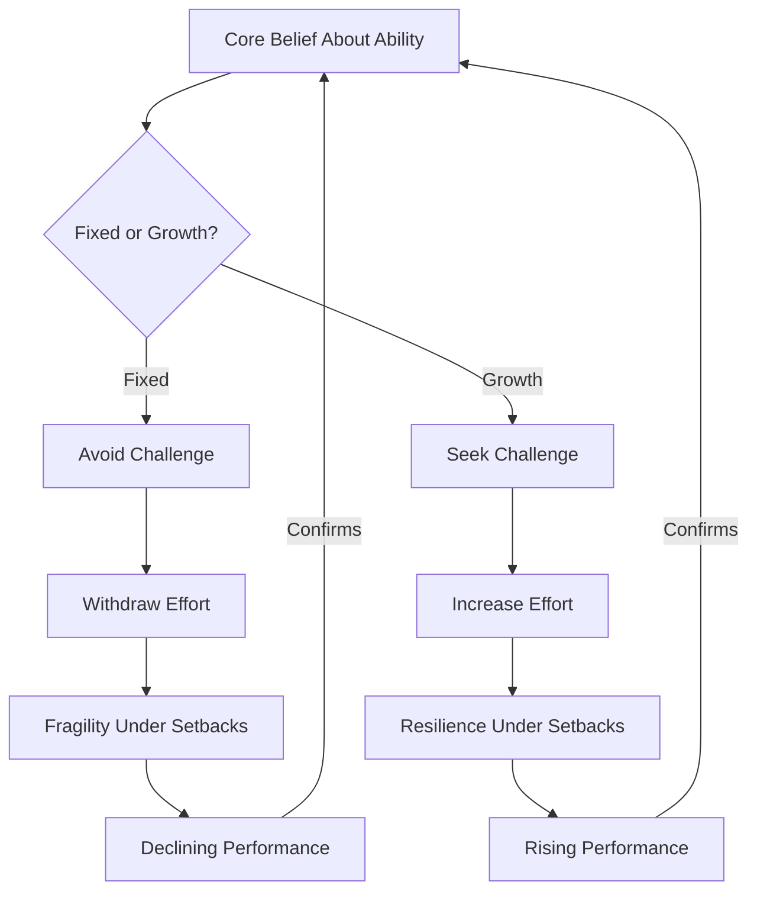
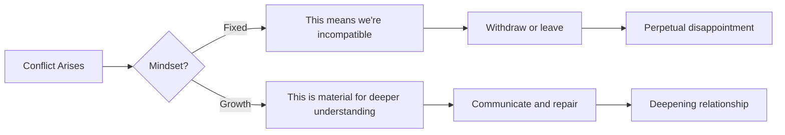
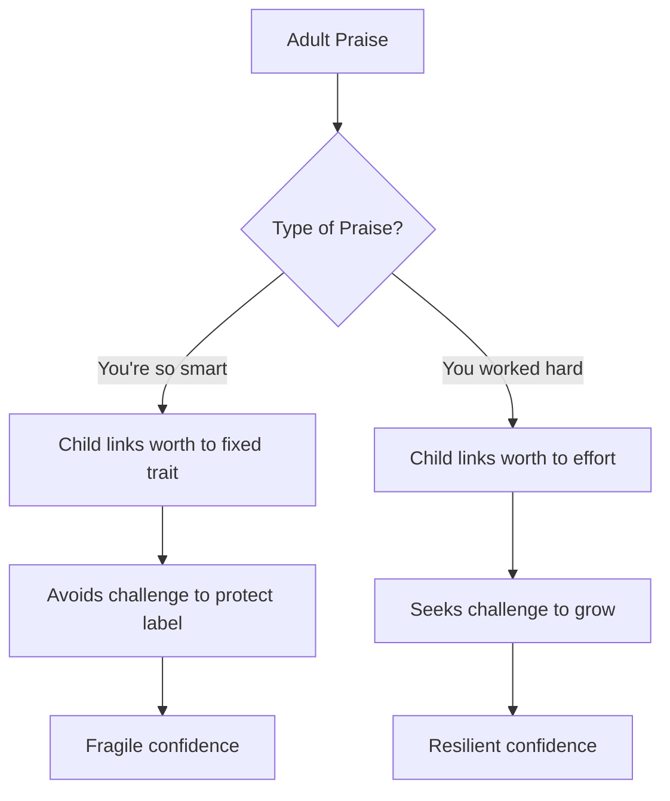

# Mindset: The New Psychology of Success — Carol Dweck

> Carol Dweck's central claim is deceptively simple: the belief you hold about whether your abilities are fixed or developable changes everything.
> Drawing on two decades of research with thousands of students, athletes, executives, and couples, she argues that this single belief — what she calls your **mindset** — shapes how you interpret success, failure, effort, and setbacks, cascading into dramatically different patterns of achievement across every domain of life.
> People with a **fixed mindset** treat every performance as a verdict on their permanent worth.
> People with a **growth mindset** treat every performance as a data point for improvement.
> The book maps how this distinction plays out in education, sport, business, and relationships, then shows that mindsets are not permanent — they can be changed.
> It is one of the most influential psychology books of the twenty-first century, and for good reason: once you see the pattern, you cannot unsee it.

---

## About the Author

Carol S. Dweck is a professor of psychology at Stanford University, specialising in motivation, personality, and development. Her research programme on implicit theories of intelligence spans over twenty years with thousands of participants across multiple countries. Before Stanford, she held positions at Columbia and Harvard. Her academic background gives the book genuine empirical rigour — this is not armchair philosophy but a distillation of controlled experiments and longitudinal studies, written for a general audience. The book's accessible prose belies the depth of the research behind it; Dweck has published extensively in peer-reviewed journals, and the studies she summarises here represent a career's worth of investigation into why people with similar abilities achieve such different outcomes.

---

## The Big Idea

*Dweck's entire framework rests on a single dimension: what you believe about the nature of your own abilities — and how that belief silently reshapes everything you do.*

People who hold an <b style="color: #2980b9">entity theory</b> — the **fixed mindset** — believe that intelligence, talent, and personality are carved in stone:
- You have a certain amount, and that is that
- Every test, every presentation, every conversation becomes a measurement of your permanent worth
- The result is a life spent proving yourself rather than improving yourself:
  - Avoiding challenges that might expose inadequacy
  - Withdrawing effort when things get hard (because needing to try implies a lack of talent)
  - Crumbling under setbacks that feel like permanent diagnoses

People who hold an <b style="color: #2980b9">incremental theory</b> — the **growth mindset** — believe these qualities can be developed through effort, strategy, and learning:
- Every challenge becomes an opportunity
- Every setback becomes information
- Every bout of effort becomes the mechanism through which talent develops
- The result is resilience, sustained high performance, and a willingness to enter the hard spaces where real growth happens

> [!tip] Core Insight
> The two mindsets are not personality types but interpretive lenses. People can hold different mindsets in different domains and shift between them over time. This is not a fatalistic sorting of humanity into two boxes — it is a map of how a single, changeable belief creates self-reinforcing cycles of behaviour and achievement.

The most important word in the framework is *belief*:
- A person can hold a growth mindset about athletic ability and a fixed mindset about mathematical ability
- A person can shift from one mindset to another over the course of a life, a year, or even a single conversation
- The mindsets are orientations, not identities — and this matters enormously, because it means they are changeable

---

What makes the framework powerful is its <b style="color: #27ae60">cascading quality</b> — the belief does not stop at "I can improve" or "I can't," it reshapes the entire motivational landscape:

| Trigger | Fixed Mindset Response | Growth Mindset Response |
|---------|----------------------|------------------------|
| Effort | Threatening — "if I have to try, I lack talent" | Constructive — "this is how I get better" |
| Failure | Defining — "this reveals my limit" | Informative — "this shows what to work on next" |
| Others' success | A yardstick — "they're better than me" | Inspiring — "it shows what is possible" |

The same external events — a difficult exam, a rejection, a colleague's promotion — trigger fundamentally different internal experiences depending on which lens you look through.

The self-reinforcing loop is the engine of the entire framework: belief shapes behaviour, behaviour shapes outcomes, and outcomes reinforce the original belief.

---

## Key Concepts at a Glance

| Concept | One-line summary |
|---------|-----------------|
| **Fixed mindset** | Belief that abilities are innate and unchangeable, leading to avoidance and fragility |
| **Growth mindset** | Belief that abilities develop through dedication, leading to challenge-seeking and resilience |
| **The Effort Paradox** | Fixed mindset treats effort and talent as inversely related; growth mindset treats them as multiplicative |
| **Failure as information vs. identity** | Fixed mindset turns "I failed" into "I am a failure"; growth mindset keeps failure as data |
| **Praise typology** | Praising talent creates fragility; praising process creates resilience |
| **The myth of the natural** | The idea that great performers are born, not made — damaging to both the "naturals" and everyone else |
| **Leadership typology** | Fixed-mindset leaders build cults of personality; growth-mindset leaders build learning organisations |
| **Mindset transmission** | Mindsets are absorbed from parents, teachers, coaches, and managers through praise, criticism, and reactions to failure |
| **CEO disease** | Organisational pathology where a fixed-mindset leader creates a culture of validation over truth-telling |
| **Layered change** | Mindset shift is gradual — old beliefs coexist with new ones, strengthening through practice over months and years |

---

## Chapter 1: The Mindsets

*Dweck opens by revealing that the difference between resilience and fragility is not temperament — it is belief about what difficulty means.*

Dweck invites the reader to imagine a series of bad situations: you get a C+ on a midterm you studied hard for, then get a parking ticket, then call a friend who brushes you off. The question is not what you would do, but how you would feel — and what you would conclude about yourself.

When Dweck posed this scenario to research subjects, the split was dramatic:
- <b style="color: #e74c3c">Fixed-mindset respondents</b> described themselves using global, permanent language:
  - "I'm a total failure," "I'm an idiot," "Life is unfair and I'm unlucky"
  - They generalised from a single bad event to an entire self-concept
- <b style="color: #27ae60">Growth-mindset respondents</b> described the same events in localised, actionable terms:
  - "I need to study differently for the next exam"
  - "I'll be more careful where I park"
  - "Maybe my friend is having a bad day — I'll check in later"
- Same scenario, completely different internal experience

The core mechanism of the entire book:
- The <b style="color: #2980b9">fixed mindset</b> operates as a **diagnostic instrument** — every event is read as evidence about who you permanently are
  - A bad grade is not a snapshot of your preparation for one exam — it is a verdict on your intelligence
  - A social rejection is not a single awkward interaction — it is proof that you are unlikeable
- The <b style="color: #2980b9">growth mindset</b> operates as a **navigational instrument** — every event is read as information about where you currently stand and what you might do next
- The difference is not whether you feel pain (both groups feel the sting of a C+) but whether the pain becomes a prison or a signpost

---

> [!example] The Puzzle Experiment — The Seed of the Framework
> - Dweck gave children a set of puzzles, starting easy and becoming progressively harder
> - When the puzzles got genuinely difficult, something extraordinary happened
> - Some children leaned forward with excitement — one ten-year-old rubbed his hands together and said, "I love a challenge"
> - Another declared, "I was hoping this would be informative"
> - These children did not experience difficulty as failure — they experienced it as an invitation
> - Other children, facing the same puzzles, collapsed — they said they felt stupid, wanted to stop, and some asked to take the easy puzzles home instead
> **The lesson:** The difference between resilience and fragility is not temperament — it is what you think difficulty *means*.

"I always thought you coped with failure or you didn't," Dweck writes. The discovery that some children actively sought difficulty — that they did not merely tolerate it but relished it — was the seed of the entire mindset framework.

Dweck is careful to note that the two mindsets are not permanent personality types:
- People are not "fixed-mindset people" or "growth-mindset people" in the way they are introverts or extroverts
- A person can hold a growth mindset about athletic ability and a fixed mindset about mathematical ability
- A person can shift from one mindset to another over the course of a life, a year, or even a single conversation
- <b style="color: #27ae60">The mindsets are orientations, not identities</b> — and this matters enormously, because it means they are changeable

---

## Chapter 2: Inside the Mindsets

*This chapter reveals how the two mindsets reshape the meaning of three fundamental experiences — success, failure, and effort — producing opposite behaviours from people with identical abilities.*

### What Success Means

For fixed-mindset people, success is about proving that you are talented, smart, or superior — the goal is not to learn but to validate:

> [!example] The University of Hong Kong English Course
> - Fixed-mindset students at the University of Hong Kong were offered a course in English — a skill they badly needed, since all instruction was in English and their proficiency was low
> - They declined the course
> - The reason was revealing: the course would expose their deficiency
> - They preferred to remain linguistically disadvantaged rather than be seen struggling to learn
> - <b style="color: #e74c3c">In the fixed mindset, the appearance of competence is more important than the reality of competence</b>
> **The lesson:** When identity is tied to looking capable, learning becomes a threat.

For growth-mindset people, success is about stretching and learning:
- Growth-mindset students at the same university eagerly signed up for the English course
- They were not ashamed of their current level — they saw the gap between where they were and where they needed to be as a target, not a stigma
- The difference was not in how much they cared about English (both groups cared equally) but in what taking the course would *mean about them*
  - For the fixed mindset: "I'm not smart enough"
  - For the growth mindset: "I'm getting smarter"

---

### What Failure Means

The fixed mindset performs an extraordinary act of alchemy: it transforms a single event — a bad grade, a rejected proposal, a lost match — into a permanent identity. "I failed" becomes "I am a failure." One bad day becomes a life sentence.

> [!example] Jim Marshall's Wrong-Way Run (1964)
> - Jim Marshall was a defensive end for the Minnesota Vikings
> - In a 1964 game against the San Francisco 49ers, Marshall recovered a fumble and ran sixty yards — the wrong way, scoring for the opposing team on national television
> - It was one of the most humiliating moments in NFL history
> - Marshall could have retreated into self-pity, hidden from cameras, begged to be taken out
> - Instead, he played the rest of the game at the highest level of his career, making several critical plays that contributed to the Vikings' victory
> - He later said the experience taught him more about himself than any triumph ever had
> **The lesson:** Failure treated as an event to recover from becomes fuel for growth.

> [!example] Bernard Loiseau's Fatal Stars (2003)
> - Bernard Loiseau was one of France's most celebrated chefs, the owner of a three-Michelin-star restaurant that was his life's masterpiece
> - In 2003, the Gault Millau restaurant guide downgraded his restaurant by two points and rumours circulated that Michelin might strip one of his three stars
> - Loiseau killed himself
> - The rating was not a measurement of his current cooking — it was his identity
> - Without the stars, he could not exist
> **The lesson:** When failure defines who you are rather than what happened, the consequences can be catastrophic.

The contrast is the essence of Dweck's point: Marshall treated failure as an event to recover from; Loiseau treated it as a verdict from which there was no appeal.

---

### What Effort Means — The Effort Paradox

*This is Dweck's most counterintuitive insight and the one with the widest practical implications.*

In the <b style="color: #2980b9">fixed mindset</b>, effort and talent sit on opposite ends of a seesaw:
- If you are truly gifted, things should come easily
- Needing to work hard at something is not a sign of engagement — it is a sign that you lack the natural ability
- This creates a devastating pattern: the moment a task becomes difficult, the fixed-mindset person withdraws effort to protect their self-image
- <b style="color: #e74c3c">Better to not try than to try and confirm that you are not talented enough</b>

> [!example] Nadja Salerno-Sonnenberg's Silence at Juilliard
> - Nadja Salerno-Sonnenberg, a violin prodigy, arrived at the Juilliard School at the age of ten, already a sensation
> - As she grew into her teenage years, something went wrong — she stopped bringing her violin to lessons and stopped practising
> - Her teachers were baffled — here was one of the most talented young violinists in the world, sabotaging her own development
> - The reason: her identity was built on effortless brilliance
> - The act of practising — of visibly working at something, of struggling with a passage — felt like an admission that she was not the natural genius everyone believed her to be
> - She nearly destroyed her career before recognising the trap and choosing to work at her craft despite what it might imply about her "natural" talent
> **The lesson:** When effort threatens identity, even prodigies self-sabotage.

> [!tip] Core Insight
> "Effort is one of those things that gives meaning to life. Effort means you care about something, that something is important to you and you are willing to work for it."

In the <b style="color: #2980b9">growth mindset</b>, the relationship flips entirely:
- Effort is not the enemy of talent — it is the mechanism through which talent develops
- Struggling with a difficult problem is not evidence of limitation — it is the feeling of your brain building new capacity
- <b style="color: #27ae60">Instead of avoiding difficulty, you seek it out</b>

The research evidence is compelling:
- In studies with pre-med chemistry students, Dweck found that fixed-mindset students reduced their effort when the material became challenging — they studied *less*, not more
- Growth-mindset students did the opposite — they increased their study effort, used more varied strategies, and sought out additional help
- Same course, same content, same level of prior achievement, radically different responses — driven entirely by belief about what effort means

> [!example] Dweck's Own Fixed-Mindset Moment
> - Early in her career, Dweck noticed that some of her colleagues worked late into the evening on their research
> - Her immediate thought was, "They must not be as smart as I am"
> - The fixed-mindset interpretation of effort was so deeply ingrained that she equated hard work with low ability — even in brilliant researchers doing groundbreaking science
> **The lesson:** No one is immune to the pattern, not even the person who discovered it.

---

## Chapter 3: The Truth About Ability and Accomplishment

*Dweck turns to the culturally beloved idea that great performers are born, not made — and systematically dismantles it.*

### The Danger of the "Natural"

The <b style="color: #2980b9">myth of the natural</b> is one of the most damaging ideas in education and professional life:
- The idea that some people are simply born with extraordinary ability — and that this ability will express itself effortlessly — creates two problems simultaneously:
  - For those who believe they are naturals, it creates **brittle confidence** — any struggle threatens the identity
  - For those who believe they are not naturals, it creates **preemptive surrender** — why try if the ceiling is fixed?

> [!example] Malcolm Young's Plateau
> - Malcolm Young was a promising student told from childhood that he was exceptionally intelligent
> - When he reached university and encountered material that did not come easily, he was devastated
> - The struggle was not a normal part of learning — it was evidence that the label had been wrong all along
> - He withdrew from difficult courses, choosing easier ones where the appearance of effortlessness could be maintained
> - His intellectual development plateaued precisely because he was too invested in appearing intelligent to do the hard work of becoming more intelligent
> **The lesson:** The "gifted" label becomes a cage when struggle threatens the identity it built.

> [!example] Marva Collins's Classroom in Inner-City Chicago
> - Marva Collins took students whom the system had labelled "learning disabled" and "retarded"
> - She refused to accept these labels
> - She set extraordinarily high standards — her second-graders were reading Shakespeare, Tolstoy, and Emerson — and gave her students the scaffolding and support to reach them
> - The children's performance was so dramatically beyond what their labels predicted that the media descended on her classroom in disbelief
> - Collins's message to her students was pure growth mindset: "I believe you can do this, and I will help you get there"
> **The lesson:** Fixed-mindset labels, replaced with growth-mindset expectations, produce transformations that look like miracles but are entirely predictable.

---

### The Praise Studies

*This is where Dweck's research reaches its most famous and consequential finding — a single sentence of praise that changed everything.*

In a landmark study conducted with Claudia Mueller, Dweck took several hundred fifth-graders and gave them a set of problems from a nonverbal IQ test — problems easy enough that virtually all the children did well. Then the researchers split the children into two groups and delivered a single sentence of praise:
- One group was praised for intelligence: "You must be smart at this"
- The other was praised for effort: "You must have worked really hard"

<b style="color: #27ae60">That single sentence changed everything that followed:</b>

| Measure | Intelligence-Praised | Effort-Praised |
|---------|---------------------|----------------|
| Choice of next task | Majority chose the easy task | 90% chose the challenging task |
| Response to difficulty | Lost confidence, decided they were not smart | Stayed engaged, maintained confidence |
| Final performance | Dropped significantly below original scores | Improved beyond initial scores |
| Honesty about scores | 40% lied and inflated their scores | Almost none lied |

"We took ordinary children and made them into liars," Dweck writes, "simply by telling them they were smart."

The mechanism is that <b style="color: #2980b9">praise creates a frame</b> that persists well beyond the moment:
- Intelligence praise implicitly says: "Your value is your fixed ability"
  - When the next task is hard, the implicit message becomes: "Your fixed ability might not be enough"
  - The rational response is to avoid any situation that could disprove the label — and to lie if the disproof has already occurred
- Effort praise says: "Your value is in what you do"
  - When the next task is hard, the implicit message is: "Do more, or do differently"
  - There is no identity threat, only a strategic challenge

> [!tip] Core Insight
> Every parent, teacher, coach, and manager is constantly transmitting mindset signals through the language they use. Praising "talent" or "brilliance" creates a fragile architecture of self-worth that collapses at the first sign of difficulty. Praising strategy, persistence, and willingness to take on hard problems creates a resilient architecture that strengthens under pressure.

---

### The Longitudinal Evidence

Dweck followed students through the <b style="color: #2980b9">junior high school transition</b> — one of the most challenging academic shifts in American education:
- She measured students' mindsets before the transition and tracked their academic performance across two years
- Students with identical prior achievement diverged sharply:
  - Growth-mindset students' grades rose steadily
  - Fixed-mindset students' grades declined
- <b style="color: #27ae60">The only predictor of the divergence was mindset</b> — not prior ability, not socioeconomic background, not school quality

The mechanism is straightforward:
- When the work got harder, fixed-mindset students interpreted the difficulty as evidence that they had reached their ceiling
  - They withdrew effort, avoided challenging courses, and increasingly described themselves as "not math people" or "not really academic"
- Growth-mindset students interpreted the same difficulty as a signal that they needed new strategies
  - They sought help, experimented with study methods, and treated the harder material as exactly the kind of challenge that would make them smarter

---

## Chapter 4: Sports — The Mindset of a Champion

*Dweck uses the world of elite athletics — where performance is visible, measurable, and relentlessly compared — to show that what we call "character" is the accumulated result of hundreds of growth-mindset responses to difficulty.*

### Michael Jordan: The Anti-Natural

The popular myth of Michael Jordan is that he was a transcendent natural talent who glided effortlessly to greatness. The reality, as Dweck details, is almost exactly the opposite.

> [!example] Michael Jordan's Rejections and Reinventions
> - Jordan was cut from his high school varsity basketball team as a sophomore
> - He was not recruited by the college he most wanted to attend (North Carolina State) and went to the University of North Carolina instead
> - He was not taken by the first two teams in the 1984 NBA draft
> - At every stage, Jordan could have concluded that he was not good enough
> - Instead, he used each rejection as a catalyst for the most relentless work ethic in professional sports history
> - He practised with an intensity that shocked even his teammates — first to arrive, last to leave
> - When his early career was defined by spectacular individual play but no championships, he did not blame his teammates — he rebuilt his game, adding a post-up game, a reliable jump shot, and defensive intensity
> **The lesson:** Jordan was not born great — he made himself great through a pattern of confronting failure and using it as fuel.

Jordan himself said, "I've failed over and over and over again in my life. And that is why I succeed."

---

### Billy Beane: Talent Without Character

> [!example] Billy Beane's Unfulfilled Promise
> - Billy Beane (later made famous as a general manager by Michael Lewis's *Moneyball*) had every physical talent imaginable — tall, fast, strong, coordinated
> - Scouts described him as the most gifted high school prospect they had ever seen
> - But Beane's identity was built entirely on his natural ability
> - When he reached professional baseball and encountered pitching he could not dominate effortlessly, he fell apart
> - Every strikeout was not a normal part of learning to hit professional pitching — it was a verdict on his talent
> - He would rage after failures, smashing equipment and berating himself, but would not do the one thing that would have helped: adapt his approach through patient, deliberate practice
> - His career never came close to fulfilling its promise
> **The lesson:** Natural talent without a growth mindset produces rage at failure, not learning from it.

The contrast with Jordan is the essence of Dweck's argument about <b style="color: #2980b9">character</b>:
- Jordan had less natural talent and more growth mindset
- Beane had more natural talent and less growth mindset
- Jordan became the greatest player in the history of the sport; Beane never made it out of the minor leagues as a player
- <b style="color: #27ae60">Character is not something you are born with — it is the accumulated result of hundreds of growth-mindset responses to difficulty</b>

---

### Muhammad Ali: Defying the Experts

- Ali defied the boxing establishment's assessment that he was too small, too light, and lacked the punching power to be a heavyweight champion
- He did not accept these fixed-mindset evaluations
- He developed a fighting style — speed, footwork, psychological warfare — that rendered the traditional measures of boxing ability irrelevant
- His refusal to be defined by conventional metrics of what a heavyweight should look like is a <b style="color: #27ae60">growth-mindset orientation applied at the highest level of athletic competition</b>

### John Wooden: The Coach as Growth-Mindset Architect

> [!example] John Wooden's Ten Championships at UCLA
> - John Wooden, the legendary UCLA basketball coach, won ten NCAA championships in twelve years
> - Wooden never mentioned winning — he told his players they could not control whether they won, only their preparation, effort, and execution
> - His definition of success: "Peace of mind that is a direct result of self-satisfaction in knowing you did your best to become the best that you are capable of becoming"
> - Players expecting a fiery, win-obsessed taskmaster found instead a quiet man who talked constantly about learning, preparation, and self-improvement
> - The result — the most dominant dynasty in college basketball history — was, in Dweck's view, no coincidence
> **The lesson:** A coach who makes becoming the goal instead of winning creates a culture where championships follow naturally.

> [!tip] Core Insight
> "Becoming is better than being." Wooden embodied this principle so completely that his players absorbed it as the water they swam in.

---

## Chapter 5: Business — Leadership and Mindset

*Dweck maps her framework onto business leadership and reveals a pattern: fixed-mindset CEOs build cults of personality that crumble; growth-mindset CEOs build learning organisations that endure.*

### The Fixed-Mindset CEO

Fixed-mindset leaders operate on what Dweck calls the <b style="color: #2980b9">"genius with a thousand helpers" model</b>:
- The leader provides the brilliance; everyone else executes
- These leaders need to feel superior, so they:
  - Surround themselves with loyal followers rather than independent thinkers
  - Suppress dissent
  - Take personal credit for successes
  - Deflect blame for failures onto others
- The result is what Dweck calls <b style="color: #2980b9">CEO disease</b>: isolation from reality, groupthink, and organisational fragility

> [!example] Lee Iacocca's Decline at Chrysler
> - Iacocca began as a genuine turnaround hero — he inherited a company on the verge of bankruptcy, secured government loan guarantees, and led a dramatic recovery in the early 1980s
> - But success fed his need for validation rather than his appetite for learning
> - Over time, he spent more energy burnishing his personal image — writing bestselling autobiographies, appearing in television advertisements, flirting with a presidential run — than on product quality and innovation
> - When Japanese competitors began outperforming Chrysler, Iacocca did not ask what he could learn from their methods
> - He lobbied Congress for import restrictions
> - By the end of his tenure, the company he had saved was declining again
> **The lesson:** When a leader's growth mindset calcifies into a fixed need for validation, the organisation pays the price.

> [!example] Albert "Chainsaw Al" Dunlap at Sunbeam
> - Dunlap built a career on corporate turnarounds that relied almost exclusively on massive layoffs
> - He believed he was a superhuman executive whose genius could transform any company
> - He told his underlings that he was a superstar and they should be grateful to work for him
> - At Sunbeam, he applied the same playbook: fire thousands of workers, announce inflated revenue projections, bask in the stock price surge
> - When the numbers turned out to be fraudulent, the company collapsed, and Dunlap's career ended in disgrace and litigation
> - He never questioned his own methods — the fault was always someone else's
> **The lesson:** A leader who cannot learn from failure will eventually manufacture catastrophe.

> [!example]- Enron: The Fixed Mindset as Corporate Religion
> - Enron's culture was built on the worship of talent — they recruited "the smartest people in the room," gave them enormous autonomy, and celebrated brilliance as the company's competitive advantage
> - The result was an environment where admitting uncertainty or acknowledging a mistake was career suicide
> - When a McKinsey consultant asked Enron employees, "Where are you vulnerable?", they could not even understand the question
> - Vulnerability was incompatible with the genius identity
> - When the company's fraudulent accounting practices unravelled, the culture that had made it impossible to say "I don't understand this" or "Something seems wrong" was directly implicated in the catastrophe
> **The lesson:** A culture that worships talent and punishes uncertainty breeds fraud and collapse.

---

### The Growth-Mindset CEO

<b style="color: #27ae60">Growth-mindset leaders operate on a learning model</b> — they seek honest feedback, credit their teams, confront brutal facts, and invest in developing people.

> [!example] Jack Welch's Learning Culture at GE
> - Welch transformed General Electric from a stodgy industrial conglomerate into the most valuable company in the world during his twenty-year tenure
> - His approach was nothing like the "genius CEO" model — he was famous for asking questions rather than issuing answers
> - He visited factories and offices constantly, not to inspect but to learn
> - He created the "Work-Out" process — large-scale sessions where employees at every level could challenge managers and propose improvements
> - He believed that the people closest to the work knew more than the people in corner offices
> - He spent enormous amounts of time at GE's Crotonville leadership centre personally teaching and coaching future executives
> **The lesson:** A leader who asks instead of tells builds an organisation that learns faster than its competitors.

> [!example] Lou Gerstner's Turnaround at IBM (1993)
> - Gerstner took over IBM when the company was losing billions and widely expected to be broken up
> - He had no background in technology — he came from RJR Nabisco and before that McKinsey
> - Rather than pretending to already have the answers, he spent his first months visiting IBM customers and employees, asking what was broken and listening
> - He admitted publicly that he did not yet have a vision for the company — alarming Wall Street but signalling to IBM's demoralised workforce that their new leader was genuinely interested in learning
> - He then led one of the greatest turnarounds in corporate history, rebuilding IBM around services and solutions rather than hardware
> **The lesson:** Admitting you do not know is not weakness — it is the first step of genuine learning.

> [!example] Anne Mulcahy's Rescue of Xerox (Early 2000s)
> - Mulcahy rescued Xerox from near-bankruptcy by personally visiting every division, not to deliver mandates but to understand what was happening at ground level
> - She learned the financial details of the business from the bottom up rather than pretending she already knew them
> - She turned down a stock analyst's suggestion to file for bankruptcy, believing the company could be saved through the hard work of fixing operations
> - She credited her team relentlessly and took personal blame when things went wrong
> **The lesson:** Humility plus relentless learning can save what ego and bluster cannot.

---

| Leadership Trait | Fixed-Mindset CEO | Growth-Mindset CEO |
|-----------------|-------------------|-------------------|
| Source of confidence | Personal genius | Team capability |
| Response to dissent | Suppresses it | Welcomes it |
| Credit for success | Takes it personally | Shares it broadly |
| Response to failure | Blames others | Investigates causes |
| Organisational result | Groupthink and fragility | Learning and resilience |

### The Collins Connection

Dweck draws a direct line between her leadership typology and Jim Collins's findings in [[collins_good-to-great|Good to Great]]:
- Collins studied companies that leapt from sustained mediocrity to sustained excellence
- Every single one was led by what Collins called a <b style="color: #2980b9">Level 5 Leader</b> — someone who combined personal humility with fierce professional will
- These leaders did not seek personal glory; they built institutions that would outlast them
- Dweck argues she has identified the psychological mechanism behind Collins's observation: Level 5 Leaders are growth-mindset leaders
  - Their humility is not false modesty — it is a genuine orientation toward learning
  - Their fierce will is not ego — it is commitment to the mission
- The comparison companies in Collins's research were led by ego-driven, validation-seeking executives — fixed-mindset leaders in Dweck's terminology

### Growth-Mindset Negotiators

- Research by Laura Kray and Michael Haselhuhn shows that growth-mindset negotiators significantly outperform fixed-mindset ones
- Growth-mindset negotiators persist through stalemates, learn from failures within the negotiation itself, and construct creative deals that serve both parties
- <b style="color: #e74c3c">Fixed-mindset negotiators take rejection personally, give up at impasses, and pursue zero-sum outcomes</b>
- MBA students who held a growth mindset about negotiation ability earned higher grades and achieved better outcomes in simulated negotiations
- The mechanism is straightforward: negotiation is inherently a learning process — you are discovering the other party's interests and constraints in real time — and a growth mindset is structurally suited to this kind of real-time adaptation

---

## Chapter 6: Relationships

*Dweck extends her framework into love, friendship, and conflict — revealing that the belief "if it requires effort, it's not meant to be" is the fixed mindset's most destructive romantic myth.*

### Fixed Mindset in Love

In the fixed mindset, a relationship should be effortless:
- If two people are truly compatible — truly "meant for each other" — then everything should click naturally
- Disagreements are not normal friction between two different humans — they are evidence of fundamental incompatibility
- <b style="color: #e74c3c">This belief creates extraordinary fragility</b>: at the first serious conflict, the fixed-mindset partner concludes the relationship is flawed at its core rather than that it requires negotiation, understanding, and growth

When conflict arises — as it inevitably does in any long-term relationship — the fixed-mindset partner reads it as a diagnosis:
- "If we have to work at this, it means we're wrong for each other"
- They may withdraw emotionally, refuse to discuss the issue, or begin looking for a new relationship where things will be "naturally easy"
- The tragedy is that no relationship is naturally easy forever, so the fixed-mindset partner is perpetually disappointed

### Growth Mindset in Love

<b style="color: #27ae60">Growth-mindset partners approach relationships as ongoing projects</b> — not in a cold, mechanical sense, but in the sense that love, understanding, and compatibility are things that deepen through effort and attention:
- Conflict is not a verdict on the relationship — it is the raw material of deeper understanding
- Partners who believe relationships can be developed through effort invest more in communication, forgiveness, and repair
- They are more willing to:
  - Acknowledge their own role in problems
  - Listen to their partner's perspective
  - Change their own behaviour when it is causing harm

Research supports this:
- People with a growth mindset about relationships report higher relationship satisfaction
- They handle conflict more constructively
- They are more likely to address problems directly rather than letting them fester
- The mechanism is identical to every other domain: if you believe the relationship can improve, you invest effort in improving it; if you believe it is what it is, you either accept dissatisfaction or leave

The fixed-mindset partner cycles through relationships seeking effortless compatibility; the growth-mindset partner builds it.

---

### Bullying and Social Rejection

Dweck examines how mindset shapes responses to social rejection and bullying:
- <b style="color: #e74c3c">Fixed-mindset victims</b> tend to respond in one of two ways:
  - They fantasise about violent revenge
  - Or they withdraw completely — the bullying has defined them as a person who is weak, unpopular, or worthless
- <b style="color: #27ae60">Growth-mindset victims</b> are more likely to:
  - Seek to understand the bully's behaviour
  - Confront the situation constructively
  - Reframe the experience as something that does not define their permanent worth
- This does not mean growth-mindset victims are unaffected — they suffer genuinely
- But their suffering does not metastasise into a permanent identity
- They experience the pain and then ask, "What can I do about this?" rather than concluding, "This is who I am"

> [!example] The Child Who Wrote a Letter to His Bully
> - A child who was severely bullied in school chose neither retreat nor retaliation
> - He wrote a letter to the bully explaining how the behaviour made him feel and asking the bully to imagine what it would be like to be on the receiving end
> - The letter did not magically resolve the situation
> - But it represented a growth-mindset response: the child was not passive (accepting the identity of "victim") and not destructive (accepting the identity of "avenger") — he was engaged in trying to change the dynamic
> **The lesson:** Growth mindset in social rejection means refusing to let the experience define your identity.

---

## Chapter 7: Parents, Teachers, and Coaches — Where Do Mindsets Come From?

*If mindsets are not genetic, where do they come from? Dweck's answer: they are absorbed through the language of the adults closest to us — often without anyone realising what is being transmitted.*

### The Transmission Mechanism

<b style="color: #2980b9">Mindsets are learned</b> — absorbed from parents, teachers, coaches, and cultural messages, often without anyone realising what is being transmitted:
- Children are remarkably sensitive to the implicit theories embedded in adult language
- A parent who says "You got an A — you're so clever!" is teaching their child that grades measure a fixed trait
- A parent who says "You got an A — you must have worked really hard!" is teaching their child that grades measure effort
- When the same children later face a difficult test, the first group avoids challenge; the second group embraces it

The subtlety is important:
- The parent who says "you're so clever" means well — they are trying to build confidence
- But the message the child receives is: "My worth is tied to being clever. If I stop getting A's, I stop being worthy"
- The parent who praises effort is also building confidence — but a different kind
- <b style="color: #27ae60">They are saying: "Your worth is tied to what you do, not what you are. And what you do is under your control"</b>

> [!tip] Core Insight
> Children as young as four years old demonstrate the effects of different praise types. After receiving intelligence praise, preschoolers chose to redo an easy jigsaw puzzle they had already completed rather than try a harder one. After effort praise, they chose the harder puzzle. The pattern is established before formal schooling even begins.

The praise type determines which architecture of confidence the child builds — fragile or resilient.

---

### Teachers Who Transmit Growth

Teachers transmit mindsets through how they respond to struggle:
- <b style="color: #e74c3c">A teacher who lowers standards for struggling students</b> is sending the message: "I don't believe you can reach the bar"
- <b style="color: #27ae60">A teacher who maintains high standards and provides the scaffolding to reach them</b> is sending the message: "I believe you can grow"

> [!example] Marva Collins's Transformation of "Unteachable" Students
> - Collins took students whom the school system had written off — children labelled with learning disabilities, behavioural disorders, and intellectual deficits
> - She refused to accept that any child was incapable of high-level work
> - She was demanding, sometimes harsh, but always communicating the same message: "You can do this, and I will not let you settle for less"
> - Her students' performance was so far beyond what their labels predicted that the media treated it as miraculous
> - It was not a miracle — it was the predictable result of replacing fixed-mindset labels with growth-mindset expectations and providing intensive support to make those expectations real
> **The lesson:** The most powerful thing a teacher can do is refuse to accept a fixed-mindset label on behalf of a student.

Dweck also describes research by educational psychologist Benjamin Bloom, who studied 120 people who had reached the pinnacle of their fields — concert pianists, Olympic swimmers, world-class mathematicians:
- Most of these exceptional performers were not prodigies
- They were not identified as remarkable in childhood
- What they had in common was a period of sustained, intensive mentoring — usually from a teacher or coach who believed in their capacity to develop and who demanded their best effort
- The mentors transmitted a growth mindset through their expectations and their willingness to push

---

### Coaches Who Get It Right (and Wrong)

Dweck contrasts two coaching philosophies:

| Dimension | John Wooden (Growth) | Bobby Knight (Fixed) |
|-----------|---------------------|---------------------|
| Core message | "Struggle is how you become the best you can be" | "Struggle means you're not good enough" |
| Method | Quiet, process-focused, learning-centred | Screaming, intimidating, punishment-focused |
| Player experience | Development and self-improvement | Trauma and fear |
| Short-term results | Championship-level performance | Championship-level performance |
| Long-term results | Sustainable development, healthy relationship with sport | Burnout, resentment, eventual firing for abuse |

Both coaches demanded extraordinary effort and held their players to the highest standards. The difference was in what they communicated about the meaning of struggle. <b style="color: #27ae60">Both messages produced effort in the short term, but only Wooden's produced sustainable development and healthy relationships with the sport.</b>

---

## Chapter 8: Changing Mindsets

*Dweck's final chapter argues that mindset change is possible — but it is layered, not surgical. The fixed mindset does not vanish; it learns to coexist with a new voice.*

### The Coexistence of Old and New Beliefs

The fixed mindset does not vanish when you read a book about growth:
- Instead, the new belief takes its place alongside the old one
- In calm moments — when things are going well, when the stakes are low — the growth mindset feels natural and obvious
- In moments of stress — a public failure, a harsh criticism, a comparison with someone more successful — the old fixed-mindset voice resurfaces:
  - "You're not good enough"
  - "You never were"
  - "Who were you fooling?"

Dweck is candid about her own experience:
- Even after decades of researching the growth mindset, she still has what she calls "passing feelings of powerlessness" when things go wrong
- The difference is not that the fixed-mindset voice has been silenced — it is that she has learned to recognise it, argue with it, and choose the growth-mindset response instead
- <b style="color: #27ae60">This is not a failure of the framework — it is the framework's honest account of how belief change works</b>

---

### The Four Steps

> [!abstract] Dweck's Process for Mindset Change
> 1. **Learn to hear your fixed-mindset voice** — it shows up as self-talk in moments of challenge, failure, or comparison: "You're going to look stupid," "If you fail, everyone will know you're a fraud," "That person is better than you — what's the point?"
> 2. **Recognise that you have a choice** — you can interpret the situation through the fixed lens (this threatens my identity) or the growth lens (this is an opportunity to develop). The interpretation is a decision, even if it does not feel like one in the moment.
> 3. **Talk back with a growth-mindset voice** — "This is hard" becomes "This is hard, and that is where growth happens." "I failed" becomes "I failed, and here is what I will do differently." "That person is better than me" becomes "That person has worked hard — what can I learn from them?"
> 4. **Take the growth-mindset action** — choose the challenging task, persist through the difficulty, seek feedback instead of avoiding it, treat setbacks as information.

Each cycle through the four steps strengthens the growth-mindset response and weakens the fixed-mindset default.

---

### Brainology: Teaching Mindset to Children

Dweck describes the <b style="color: #2980b9">Brainology</b> programme she developed for schools, which teaches students about <b style="color: #2980b9">brain plasticity</b> — the scientific fact that the brain grows new neural connections through learning and practice:
- The key insight is simple: the brain is like a muscle
- When you learn something new or practise something difficult, your brain forms new connections and gets physically stronger
- This is not a metaphor — it is neurological reality
- When students understood this, their motivation and performance shifted
- A student who previously said "I'm not a math person" could be taught that their brain's math capacity was not fixed — it was growing every time they worked on a math problem, especially a hard one

Results and limitations:
- Teachers reported improved motivation, better study habits, and higher grades
- One teacher described a previously disengaged student who told her, "You mean I don't have to be dumb?" — the student had internalised a fixed-mindset label and assumed there was nothing he could do about it
- Learning about brain plasticity gave him permission to try

> [!tip] Core Insight
> A single workshop produced a burst of improvement — but lasting change required ongoing reinforcement. When the programme ended and students returned to environments that did not support the growth orientation, many reverted. Sustained mindset change requires not just individual insight but environmental support.

### The Honest Conclusion

<b style="color: #27ae60">Mindset change is a practice, not an epiphany:</b>
- It requires hundreds of small reframing moments accumulated over months and years
- The growth mindset, in Dweck's own framing, must be grown
- There is no shortcut — no single book, no single workshop, no single conversation that permanently rewires a lifetime of fixed-mindset conditioning
- But the research is clear that the rewiring is possible, and that the earlier it begins, the more powerful its effects

"The passion for stretching yourself and sticking to it, even when it's not going well, is the hallmark of the growth mindset."

---

## Key Quotes

- "Becoming is better than being." — Ch. 1
- "The view you adopt for yourself profoundly affects the way you lead your life." — Ch. 1
- "Why waste time proving over and over how great you are, when you could be getting better?" — Ch. 1
- "Effort is one of those things that gives meaning to life." — Ch. 2
- "The passion for stretching yourself and sticking to it, even when it's not going well, is the hallmark of the growth mindset." — Ch. 1
- "We took ordinary children and made them into liars, simply by telling them they were smart." — Ch. 3
- "No matter what your ability is, effort is what ignites that ability and turns it into accomplishment." — Ch. 2
- "True self-confidence is the courage to be open — to welcome change and new ideas regardless of their source." — Ch. 5

---

## The Verdict

*Mindset* is one of those rare psychology books that genuinely changes how you see the world. The core framework — that a single belief about the malleability of ability cascades into dramatically different patterns of behaviour — is supported by rigorous research and has been replicated across cultures, age groups, and domains. Once you understand the fixed-growth distinction, you start seeing it everywhere: in how people respond to feedback, how leaders run teams, how parents talk to children, and how you talk to yourself. The book's greatest contribution is not the labels themselves but the mechanism it reveals — how belief shapes interpretation, interpretation shapes behaviour, and behaviour shapes outcomes in a self-reinforcing loop.

The book's greatest empirical strength is the praise research. The finding that intelligence praise causes forty per cent of students to lie about their scores is one of the most striking results in modern psychology. It overturns decades of intuition about how to build confidence and provides an immediately actionable alternative. The junior high longitudinal study — showing mindset as the sole predictor of grade divergence among students with identical prior achievement — is similarly powerful. These are not anecdotes; they are controlled experiments with large sample sizes, and their implications are profound for anyone who teaches, manages, parents, or coaches.

The book's weaknesses are real but bounded. The business leadership chapter relies on narrative case studies rather than controlled experiments, and the post-hoc classification of leaders as "fixed" or "growth" oversimplifies complex figures — Jack Welch was also ruthless and politically calculating; Lee Iacocca was also genuinely visionary in his early years. Dweck sometimes implies that mindset is the primary driver of achievement differences, underplaying the role of structural factors like resources, access, networks, privilege, and timing. The effort narrative, taken too far, can become its own trap: if effort always leads to growth, then failure to grow implies insufficient effort — a guilt spiral that mirrors the fixed-mindset shame spiral it was meant to replace. And the evidence for the long-term durability of brief mindset interventions (like a single Brainology workshop) remains thinner than the book suggests; Dweck herself acknowledges that sustained change requires sustained environmental support, but this caveat tends to get lost in the enthusiasm.

Who benefits most from this book? Anyone who recognises themselves in the fixed-mindset descriptions — the avoidance of challenge, the fragility under pressure, the equation of effort with inadequacy — will find the framework genuinely liberating. Teachers and parents will find the praise research immediately actionable. Leaders will find the business chapter a useful diagnostic for their own tendencies and their organisation's culture. The book is less useful for people who already have a robust growth orientation and are looking for tactical tools; Dweck provides the psychological foundation but does not offer much in the way of specific practice routines, learning methodologies, or structural interventions. For that, readers should look to books on deliberate practice, learning science, or organisational design. But as a map of the psychological terrain — a map of why some people keep playing when things get hard and others quit — *Mindset* remains essential reading.

---

## Related Reading

- [[So Good They Can't Ignore You - Cal Newport|So Good They Can't Ignore You]] — Cal Newport's argument that career capital (built through deliberate practice) matters more than passion, which pairs naturally with Dweck's emphasis on effort and development over innate talent
- [[Power - Jeffrey Pfeffer|Power]] — Jeffrey Pfeffer addresses the structural and political dimensions of achievement that Dweck largely ignores, providing the institutional complement to Dweck's psychological framework
- [[The First 90 Days - Michael D. Watkins|The First 90 Days]] — Michael Watkins's playbook for leadership transitions, where the growth mindset is the psychological foundation and Watkins provides the operational scaffolding
- [[The 48 Laws of Power - Robert Greene|The 48 Laws of Power]] — Robert Greene's tactical manual for navigating hierarchies, which covers the political terrain that Dweck's framework does not
- [[collins_good-to-great|Good to Great]] — Jim Collins's research on Level 5 Leadership directly corroborates Dweck's growth-mindset leadership model and provides the business evidence behind her psychological framework
